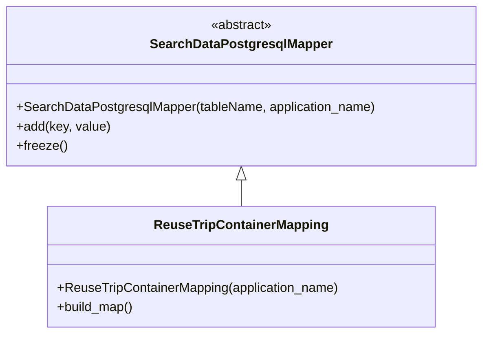

# Diagram: container_tracking_core/container_tracking_service/container_tracking_service/persistence_adapter/postgresql/ReuseTripContainerMapping.py

> Auto-generated by Obscura crawlers

## Diagram 1

### SVG

<svg id="container" width="596.8046875" xmlns="http://www.w3.org/2000/svg" class="classDiagram" height="414" viewBox="0 0 596.8046875 414" role="graphics-document document" aria-roledescription="class"><g><defs><marker id="container_class-aggregationStart" class="marker aggregation class" refX="18" refY="7" markerWidth="190" markerHeight="240" orient="auto"><path d="M 18,7 L9,13 L1,7 L9,1 Z"></path></marker></defs><defs><marker id="container_class-aggregationEnd" class="marker aggregation class" refX="1" refY="7" markerWidth="20" markerHeight="28" orient="auto"><path d="M 18,7 L9,13 L1,7 L9,1 Z"></path></marker></defs><defs><marker id="container_class-extensionStart" class="marker extension class" refX="18" refY="7" markerWidth="190" markerHeight="240" orient="auto"><path d="M 1,7 L18,13 V 1 Z"></path></marker></defs><defs><marker id="container_class-extensionEnd" class="marker extension class" refX="1" refY="7" markerWidth="20" markerHeight="28" orient="auto"><path d="M 1,1 V 13 L18,7 Z"></path></marker></defs><defs><marker id="container_class-compositionStart" class="marker composition class" refX="18" refY="7" markerWidth="190" markerHeight="240" orient="auto"><path d="M 18,7 L9,13 L1,7 L9,1 Z"></path></marker></defs><defs><marker id="container_class-compositionEnd" class="marker composition class" refX="1" refY="7" markerWidth="20" markerHeight="28" orient="auto"><path d="M 18,7 L9,13 L1,7 L9,1 Z"></path></marker></defs><defs><marker id="container_class-dependencyStart" class="marker dependency class" refX="6" refY="7" markerWidth="190" markerHeight="240" orient="auto"><path d="M 5,7 L9,13 L1,7 L9,1 Z"></path></marker></defs><defs><marker id="container_class-dependencyEnd" class="marker dependency class" refX="13" refY="7" markerWidth="20" markerHeight="28" orient="auto"><path d="M 18,7 L9,13 L14,7 L9,1 Z"></path></marker></defs><defs><marker id="container_class-lollipopStart" class="marker lollipop class" refX="13" refY="7" markerWidth="190" markerHeight="240" orient="auto"><circle stroke="black" fill="transparent" cx="7" cy="7" r="6"></circle></marker></defs><defs><marker id="container_class-lollipopEnd" class="marker lollipop class" refX="1" refY="7" markerWidth="190" markerHeight="240" orient="auto"><circle stroke="black" fill="transparent" cx="7" cy="7" r="6"></circle></marker></defs><g class="root"><g class="clusters"></g><g class="edgePaths"><path d="M298.402,223.25L298.402,224.542C298.402,225.833,298.402,228.417,298.402,233.875C298.402,239.333,298.402,247.667,298.402,251.833L298.402,256" id="id_SearchDataPostgresqlMapper_ReuseTripContainerMapping_1" class="edge-thickness-normal edge-pattern-solid relation" style=";;;" data-edge="true" data-et="edge" data-id="id_SearchDataPostgresqlMapper_ReuseTripContainerMapping_1" data-points="W3sieCI6Mjk4LjQwMjM0Mzc1LCJ5IjoyMDZ9LHsieCI6Mjk4LjQwMjM0Mzc1LCJ5IjoyMzF9LHsieCI6Mjk4LjQwMjM0Mzc1LCJ5IjoyNTZ9XQ==" marker-start="url(#container_class-extensionStart)"></path></g><g class="edgeLabels"><g class="edgeLabel"><g class="label" data-id="id_SearchDataPostgresqlMapper_ReuseTripContainerMapping_1" transform="translate(0, 0)"><foreignObject width="0" height="0">

</foreignObject></g></g></g><g class="nodes"><g class="node default" id="classId-SearchDataPostgresqlMapper-0" transform="translate(298.40234375, 107)"><g class="basic label-container"><path d="M-290.40234375 -99 L290.40234375 -99 L290.40234375 99 L-290.40234375 99" stroke="none" stroke-width="0" fill="#ECECFF" style=""></path><path d="M-290.40234375 -99 C-154.67928151852286 -99, -18.956219287045712 -99, 290.40234375 -99 M-290.40234375 -99 C-79.7852752300908 -99, 130.8317932898184 -99, 290.40234375 -99 M290.40234375 -99 C290.40234375 -27.617823237506883, 290.40234375 43.764353524986234, 290.40234375 99 M290.40234375 -99 C290.40234375 -45.88630642411073, 290.40234375 7.227387151778544, 290.40234375 99 M290.40234375 99 C155.45682238017253 99, 20.51130101034505 99, -290.40234375 99 M290.40234375 99 C119.0083542967624 99, -52.38563515647519 99, -290.40234375 99 M-290.40234375 99 C-290.40234375 43.37849139227854, -290.40234375 -12.243017215442919, -290.40234375 -99 M-290.40234375 99 C-290.40234375 59.309510204765985, -290.40234375 19.61902040953197, -290.40234375 -99" stroke="#9370DB" stroke-width="1.3" fill="none" stroke-dasharray="0 0" style=""></path></g><g class="annotation-group text" transform="translate(-38.609375, -75)"><g class="label" style="" transform="translate(0,-12)"><foreignObject width="77.21875" height="24">

«abstract»

</foreignObject></g></g><g class="label-group text" transform="translate(-108.3515625, -51)"><g class="label" style="font-weight: bolder" transform="translate(0,-12)"><foreignObject width="216.703125" height="24">

SearchDataPostgresqlMapper

</foreignObject></g></g><g class="members-group text" transform="translate(-278.40234375, -3)"></g><g class="methods-group text" transform="translate(-278.40234375, 27)"><g class="label" style="" transform="translate(0,-12)"><foreignObject width="448.453125" height="24">

+SearchDataPostgresqlMapper(tableName, application_name)

</foreignObject></g><g class="label" style="" transform="translate(0,12)"><foreignObject width="116.859375" height="24">

+add(key, value)

</foreignObject></g><g class="label" style="" transform="translate(0,36)"><foreignObject width="62.109375" height="24">

+freeze()

</foreignObject></g></g><g class="divider" style=""><path d="M-290.40234375 -27 C-106.97072438038578 -27, 76.46089498922845 -27, 290.40234375 -27 M-290.40234375 -27 C-152.59383561913748 -27, -14.785327488274959 -27, 290.40234375 -27" stroke="#9370DB" stroke-width="1.3" fill="none" stroke-dasharray="0 0" style=""></path></g><g class="divider" style=""><path d="M-290.40234375 -3 C-84.15191970413952 -3, 122.09850434172097 -3, 290.40234375 -3 M-290.40234375 -3 C-130.42474196051265 -3, 29.552859828974704 -3, 290.40234375 -3" stroke="#9370DB" stroke-width="1.3" fill="none" stroke-dasharray="0 0" style=""></path></g></g><g class="node default" id="classId-ReuseTripContainerMapping-1" transform="translate(298.40234375, 331)"><g class="basic label-container"><path d="M-240.671875 -75 L240.671875 -75 L240.671875 75 L-240.671875 75" stroke="none" stroke-width="0" fill="#ECECFF" style=""></path><path d="M-240.671875 -75 C-137.18873202452136 -75, -33.70558904904274 -75, 240.671875 -75 M-240.671875 -75 C-121.86413806122174 -75, -3.056401122443475 -75, 240.671875 -75 M240.671875 -75 C240.671875 -20.330534134243912, 240.671875 34.338931731512176, 240.671875 75 M240.671875 -75 C240.671875 -30.27369258530841, 240.671875 14.45261482938318, 240.671875 75 M240.671875 75 C88.69529524427642 75, -63.281284511447154 75, -240.671875 75 M240.671875 75 C103.34892044098424 75, -33.97403411803151 75, -240.671875 75 M-240.671875 75 C-240.671875 16.157170468599077, -240.671875 -42.68565906280185, -240.671875 -75 M-240.671875 75 C-240.671875 23.610745481573353, -240.671875 -27.778509036853293, -240.671875 -75" stroke="#9370DB" stroke-width="1.3" fill="none" stroke-dasharray="0 0" style=""></path></g><g class="annotation-group text" transform="translate(0, -51)"></g><g class="label-group text" transform="translate(-103.515625, -51)"><g class="label" style="font-weight: bolder" transform="translate(0,-12)"><foreignObject width="207.03125" height="24">

ReuseTripContainerMapping

</foreignObject></g></g><g class="members-group text" transform="translate(-228.671875, -3)"></g><g class="methods-group text" transform="translate(-228.671875, 27)"><g class="label" style="" transform="translate(0,-12)"><foreignObject width="353.828125" height="24">

+ReuseTripContainerMapping(application_name)

</foreignObject></g><g class="label" style="" transform="translate(0,12)"><foreignObject width="96.109375" height="24">

+build_map()

</foreignObject></g></g><g class="divider" style=""><path d="M-240.671875 -27 C-54.28761861220238 -27, 132.09663777559524 -27, 240.671875 -27 M-240.671875 -27 C-108.22835881516812 -27, 24.215157369663757 -27, 240.671875 -27" stroke="#9370DB" stroke-width="1.3" fill="none" stroke-dasharray="0 0" style=""></path></g><g class="divider" style=""><path d="M-240.671875 -3 C-105.13794206627344 -3, 30.395990867453122 -3, 240.671875 -3 M-240.671875 -3 C-69.69613608367055 -3, 101.2796028326589 -3, 240.671875 -3" stroke="#9370DB" stroke-width="1.3" fill="none" stroke-dasharray="0 0" style=""></path></g></g></g></g></g></svg>

## Diagram 2

### SVG

<svg id="container" width="9549.125" xmlns="http://www.w3.org/2000/svg" class="flowchart" height="108.75" viewBox="0 0 9549.125 108.75" role="graphics-document document" aria-roledescription="flowchart-v2"><g><marker id="container_flowchart-v2-pointEnd" class="marker flowchart-v2" viewBox="0 0 10 10" refX="5" refY="5" markerUnits="userSpaceOnUse" markerWidth="8" markerHeight="8" orient="auto"><path d="M 0 0 L 10 5 L 0 10 z" class="arrowMarkerPath" style="stroke-width: 1; stroke-dasharray: 1, 0;"></path></marker><marker id="container_flowchart-v2-pointStart" class="marker flowchart-v2" viewBox="0 0 10 10" refX="4.5" refY="5" markerUnits="userSpaceOnUse" markerWidth="8" markerHeight="8" orient="auto"><path d="M 0 5 L 10 10 L 10 0 z" class="arrowMarkerPath" style="stroke-width: 1; stroke-dasharray: 1, 0;"></path></marker><marker id="container_flowchart-v2-circleEnd" class="marker flowchart-v2" viewBox="0 0 10 10" refX="11" refY="5" markerUnits="userSpaceOnUse" markerWidth="11" markerHeight="11" orient="auto"><circle cx="5" cy="5" r="5" class="arrowMarkerPath" style="stroke-width: 1; stroke-dasharray: 1, 0;"></circle></marker><marker id="container_flowchart-v2-circleStart" class="marker flowchart-v2" viewBox="0 0 10 10" refX="-1" refY="5" markerUnits="userSpaceOnUse" markerWidth="11" markerHeight="11" orient="auto"><circle cx="5" cy="5" r="5" class="arrowMarkerPath" style="stroke-width: 1; stroke-dasharray: 1, 0;"></circle></marker><marker id="container_flowchart-v2-crossEnd" class="marker cross flowchart-v2" viewBox="0 0 11 11" refX="12" refY="5.2" markerUnits="userSpaceOnUse" markerWidth="11" markerHeight="11" orient="auto"><path d="M 1,1 l 9,9 M 10,1 l -9,9" class="arrowMarkerPath" style="stroke-width: 2; stroke-dasharray: 1, 0;"></path></marker><marker id="container_flowchart-v2-crossStart" class="marker cross flowchart-v2" viewBox="0 0 11 11" refX="-1" refY="5.2" markerUnits="userSpaceOnUse" markerWidth="11" markerHeight="11" orient="auto"><path d="M 1,1 l 9,9 M 10,1 l -9,9" class="arrowMarkerPath" style="stroke-width: 2; stroke-dasharray: 1, 0;"></path></marker><g class="root"><g class="clusters"></g><g class="edgePaths"><path d="M100.75,54.375L104.917,54.375C109.083,54.375,117.417,54.375,125.083,54.375C132.75,54.375,139.75,54.375,143.25,54.375L146.75,54.375" id="L_Start_n1_0" class="edge-thickness-normal edge-pattern-solid edge-thickness-normal edge-pattern-solid flowchart-link" style=";" data-edge="true" data-et="edge" data-id="L_Start_n1_0" data-points="W3sieCI6MTAwLjc1LCJ5Ijo1NC4zNzV9LHsieCI6MTI1Ljc1LCJ5Ijo1NC4zNzV9LHsieCI6MTUwLjc1LCJ5Ijo1NC4zNzV9XQ==" marker-end="url(#container_flowchart-v2-pointEnd)"></path><path d="M261.797,54.375L265.964,54.375C270.13,54.375,278.464,54.375,286.13,54.375C293.797,54.375,300.797,54.375,304.297,54.375L307.797,54.375" id="L_n1_n2_0" class="edge-thickness-normal edge-pattern-solid edge-thickness-normal edge-pattern-solid flowchart-link" style=";" data-edge="true" data-et="edge" data-id="L_n1_n2_0" data-points="W3sieCI6MjYxLjc5Njg3NSwieSI6NTQuMzc1fSx7IngiOjI4Ni43OTY4NzUsInkiOjU0LjM3NX0seyJ4IjozMTEuNzk2ODc1LCJ5Ijo1NC4zNzV9XQ==" marker-end="url(#container_flowchart-v2-pointEnd)"></path><path d="M571.797,54.375L575.964,54.375C580.13,54.375,588.464,54.375,596.13,54.375C603.797,54.375,610.797,54.375,614.297,54.375L617.797,54.375" id="L_n2_n3_0" class="edge-thickness-normal edge-pattern-solid edge-thickness-normal edge-pattern-solid flowchart-link" style=";" data-edge="true" data-et="edge" data-id="L_n2_n3_0" data-points="W3sieCI6NTcxLjc5Njg3NSwieSI6NTQuMzc1fSx7IngiOjU5Ni43OTY4NzUsInkiOjU0LjM3NX0seyJ4Ijo2MjEuNzk2ODc1LCJ5Ijo1NC4zNzV9XQ==" marker-end="url(#container_flowchart-v2-pointEnd)"></path><path d="M869.141,54.375L873.307,54.375C877.474,54.375,885.807,54.375,893.474,54.375C901.141,54.375,908.141,54.375,911.641,54.375L915.141,54.375" id="L_n3_n4_0" class="edge-thickness-normal edge-pattern-solid edge-thickness-normal edge-pattern-solid flowchart-link" style=";" data-edge="true" data-et="edge" data-id="L_n3_n4_0" data-points="W3sieCI6ODY5LjE0MDYyNSwieSI6NTQuMzc1fSx7IngiOjg5NC4xNDA2MjUsInkiOjU0LjM3NX0seyJ4Ijo5MTkuMTQwNjI1LCJ5Ijo1NC4zNzV9XQ==" marker-end="url(#container_flowchart-v2-pointEnd)"></path><path d="M1179.141,54.375L1183.307,54.375C1187.474,54.375,1195.807,54.375,1203.474,54.375C1211.141,54.375,1218.141,54.375,1221.641,54.375L1225.141,54.375" id="L_n4_n5_0" class="edge-thickness-normal edge-pattern-solid edge-thickness-normal edge-pattern-solid flowchart-link" style=";" data-edge="true" data-et="edge" data-id="L_n4_n5_0" data-points="W3sieCI6MTE3OS4xNDA2MjUsInkiOjU0LjM3NX0seyJ4IjoxMjA0LjE0MDYyNSwieSI6NTQuMzc1fSx7IngiOjEyMjkuMTQwNjI1LCJ5Ijo1NC4zNzV9XQ==" marker-end="url(#container_flowchart-v2-pointEnd)"></path><path d="M1400.828,54.375L1404.995,54.375C1409.161,54.375,1417.495,54.375,1425.161,54.375C1432.828,54.375,1439.828,54.375,1443.328,54.375L1446.828,54.375" id="L_n5_n6_0" class="edge-thickness-normal edge-pattern-solid edge-thickness-normal edge-pattern-solid flowchart-link" style=";" data-edge="true" data-et="edge" data-id="L_n5_n6_0" data-points="W3sieCI6MTQwMC44MjgxMjUsInkiOjU0LjM3NX0seyJ4IjoxNDI1LjgyODEyNSwieSI6NTQuMzc1fSx7IngiOjE0NTAuODI4MTI1LCJ5Ijo1NC4zNzV9XQ==" marker-end="url(#container_flowchart-v2-pointEnd)"></path><path d="M1710.828,54.375L1714.995,54.375C1719.161,54.375,1727.495,54.375,1735.161,54.375C1742.828,54.375,1749.828,54.375,1753.328,54.375L1756.828,54.375" id="L_n6_n7_0" class="edge-thickness-normal edge-pattern-solid edge-thickness-normal edge-pattern-solid flowchart-link" style=";" data-edge="true" data-et="edge" data-id="L_n6_n7_0" data-points="W3sieCI6MTcxMC44MjgxMjUsInkiOjU0LjM3NX0seyJ4IjoxNzM1LjgyODEyNSwieSI6NTQuMzc1fSx7IngiOjE3NjAuODI4MTI1LCJ5Ijo1NC4zNzV9XQ==" marker-end="url(#container_flowchart-v2-pointEnd)"></path><path d="M2020.828,54.375L2024.995,54.375C2029.161,54.375,2037.495,54.375,2045.161,54.375C2052.828,54.375,2059.828,54.375,2063.328,54.375L2066.828,54.375" id="L_n7_n8_0" class="edge-thickness-normal edge-pattern-solid edge-thickness-normal edge-pattern-solid flowchart-link" style=";" data-edge="true" data-et="edge" data-id="L_n7_n8_0" data-points="W3sieCI6MjAyMC44MjgxMjUsInkiOjU0LjM3NX0seyJ4IjoyMDQ1LjgyODEyNSwieSI6NTQuMzc1fSx7IngiOjIwNzAuODI4MTI1LCJ5Ijo1NC4zNzV9XQ==" marker-end="url(#container_flowchart-v2-pointEnd)"></path><path d="M2272.016,54.375L2276.182,54.375C2280.349,54.375,2288.682,54.375,2296.349,54.375C2304.016,54.375,2311.016,54.375,2314.516,54.375L2318.016,54.375" id="L_n8_n9_0" class="edge-thickness-normal edge-pattern-solid edge-thickness-normal edge-pattern-solid flowchart-link" style=";" data-edge="true" data-et="edge" data-id="L_n8_n9_0" data-points="W3sieCI6MjI3Mi4wMTU2MjUsInkiOjU0LjM3NX0seyJ4IjoyMjk3LjAxNTYyNSwieSI6NTQuMzc1fSx7IngiOjIzMjIuMDE1NjI1LCJ5Ijo1NC4zNzV9XQ==" marker-end="url(#container_flowchart-v2-pointEnd)"></path><path d="M2556.266,54.375L2560.432,54.375C2564.599,54.375,2572.932,54.375,2580.599,54.375C2588.266,54.375,2595.266,54.375,2598.766,54.375L2602.266,54.375" id="L_n9_n10_0" class="edge-thickness-normal edge-pattern-solid edge-thickness-normal edge-pattern-solid flowchart-link" style=";" data-edge="true" data-et="edge" data-id="L_n9_n10_0" data-points="W3sieCI6MjU1Ni4yNjU2MjUsInkiOjU0LjM3NX0seyJ4IjoyNTgxLjI2NTYyNSwieSI6NTQuMzc1fSx7IngiOjI2MDYuMjY1NjI1LCJ5Ijo1NC4zNzV9XQ==" marker-end="url(#container_flowchart-v2-pointEnd)"></path><path d="M2863.297,54.375L2867.464,54.375C2871.63,54.375,2879.964,54.375,2887.63,54.375C2895.297,54.375,2902.297,54.375,2905.797,54.375L2909.297,54.375" id="L_n10_n11_0" class="edge-thickness-normal edge-pattern-solid edge-thickness-normal edge-pattern-solid flowchart-link" style=";" data-edge="true" data-et="edge" data-id="L_n10_n11_0" data-points="W3sieCI6Mjg2My4yOTY4NzUsInkiOjU0LjM3NX0seyJ4IjoyODg4LjI5Njg3NSwieSI6NTQuMzc1fSx7IngiOjI5MTMuMjk2ODc1LCJ5Ijo1NC4zNzV9XQ==" marker-end="url(#container_flowchart-v2-pointEnd)"></path><path d="M3173.297,54.375L3177.464,54.375C3181.63,54.375,3189.964,54.375,3197.63,54.375C3205.297,54.375,3212.297,54.375,3215.797,54.375L3219.297,54.375" id="L_n11_n12_0" class="edge-thickness-normal edge-pattern-solid edge-thickness-normal edge-pattern-solid flowchart-link" style=";" data-edge="true" data-et="edge" data-id="L_n11_n12_0" data-points="W3sieCI6MzE3My4yOTY4NzUsInkiOjU0LjM3NX0seyJ4IjozMTk4LjI5Njg3NSwieSI6NTQuMzc1fSx7IngiOjMyMjMuMjk2ODc1LCJ5Ijo1NC4zNzV9XQ==" marker-end="url(#container_flowchart-v2-pointEnd)"></path><path d="M3483.297,54.375L3487.464,54.375C3491.63,54.375,3499.964,54.375,3507.63,54.375C3515.297,54.375,3522.297,54.375,3525.797,54.375L3529.297,54.375" id="L_n12_n13_0" class="edge-thickness-normal edge-pattern-solid edge-thickness-normal edge-pattern-solid flowchart-link" style=";" data-edge="true" data-et="edge" data-id="L_n12_n13_0" data-points="W3sieCI6MzQ4My4yOTY4NzUsInkiOjU0LjM3NX0seyJ4IjozNTA4LjI5Njg3NSwieSI6NTQuMzc1fSx7IngiOjM1MzMuMjk2ODc1LCJ5Ijo1NC4zNzV9XQ==" marker-end="url(#container_flowchart-v2-pointEnd)"></path><path d="M3793.297,54.375L3797.464,54.375C3801.63,54.375,3809.964,54.375,3817.63,54.375C3825.297,54.375,3832.297,54.375,3835.797,54.375L3839.297,54.375" id="L_n13_n14_0" class="edge-thickness-normal edge-pattern-solid edge-thickness-normal edge-pattern-solid flowchart-link" style=";" data-edge="true" data-et="edge" data-id="L_n13_n14_0" data-points="W3sieCI6Mzc5My4yOTY4NzUsInkiOjU0LjM3NX0seyJ4IjozODE4LjI5Njg3NSwieSI6NTQuMzc1fSx7IngiOjM4NDMuMjk2ODc1LCJ5Ijo1NC4zNzV9XQ==" marker-end="url(#container_flowchart-v2-pointEnd)"></path><path d="M4103.297,54.375L4107.464,54.375C4111.63,54.375,4119.964,54.375,4127.63,54.375C4135.297,54.375,4142.297,54.375,4145.797,54.375L4149.297,54.375" id="L_n14_n15_0" class="edge-thickness-normal edge-pattern-solid edge-thickness-normal edge-pattern-solid flowchart-link" style=";" data-edge="true" data-et="edge" data-id="L_n14_n15_0" data-points="W3sieCI6NDEwMy4yOTY4NzUsInkiOjU0LjM3NX0seyJ4Ijo0MTI4LjI5Njg3NSwieSI6NTQuMzc1fSx7IngiOjQxNTMuMjk2ODc1LCJ5Ijo1NC4zNzV9XQ==" marker-end="url(#container_flowchart-v2-pointEnd)"></path><path d="M4413.297,54.375L4417.464,54.375C4421.63,54.375,4429.964,54.375,4437.63,54.375C4445.297,54.375,4452.297,54.375,4455.797,54.375L4459.297,54.375" id="L_n15_n16_0" class="edge-thickness-normal edge-pattern-solid edge-thickness-normal edge-pattern-solid flowchart-link" style=";" data-edge="true" data-et="edge" data-id="L_n15_n16_0" data-points="W3sieCI6NDQxMy4yOTY4NzUsInkiOjU0LjM3NX0seyJ4Ijo0NDM4LjI5Njg3NSwieSI6NTQuMzc1fSx7IngiOjQ0NjMuMjk2ODc1LCJ5Ijo1NC4zNzV9XQ==" marker-end="url(#container_flowchart-v2-pointEnd)"></path><path d="M4681.516,54.375L4685.682,54.375C4689.849,54.375,4698.182,54.375,4705.849,54.375C4713.516,54.375,4720.516,54.375,4724.016,54.375L4727.516,54.375" id="L_n16_n17_0" class="edge-thickness-normal edge-pattern-solid edge-thickness-normal edge-pattern-solid flowchart-link" style=";" data-edge="true" data-et="edge" data-id="L_n16_n17_0" data-points="W3sieCI6NDY4MS41MTU2MjUsInkiOjU0LjM3NX0seyJ4Ijo0NzA2LjUxNTYyNSwieSI6NTQuMzc1fSx7IngiOjQ3MzEuNTE1NjI1LCJ5Ijo1NC4zNzV9XQ==" marker-end="url(#container_flowchart-v2-pointEnd)"></path><path d="M4960.641,54.375L4964.807,54.375C4968.974,54.375,4977.307,54.375,4984.974,54.375C4992.641,54.375,4999.641,54.375,5003.141,54.375L5006.641,54.375" id="L_n17_n18_0" class="edge-thickness-normal edge-pattern-solid edge-thickness-normal edge-pattern-solid flowchart-link" style=";" data-edge="true" data-et="edge" data-id="L_n17_n18_0" data-points="W3sieCI6NDk2MC42NDA2MjUsInkiOjU0LjM3NX0seyJ4Ijo0OTg1LjY0MDYyNSwieSI6NTQuMzc1fSx7IngiOjUwMTAuNjQwNjI1LCJ5Ijo1NC4zNzV9XQ==" marker-end="url(#container_flowchart-v2-pointEnd)"></path><path d="M5270.641,54.375L5274.807,54.375C5278.974,54.375,5287.307,54.375,5294.974,54.375C5302.641,54.375,5309.641,54.375,5313.141,54.375L5316.641,54.375" id="L_n18_n19_0" class="edge-thickness-normal edge-pattern-solid edge-thickness-normal edge-pattern-solid flowchart-link" style=";" data-edge="true" data-et="edge" data-id="L_n18_n19_0" data-points="W3sieCI6NTI3MC42NDA2MjUsInkiOjU0LjM3NX0seyJ4Ijo1Mjk1LjY0MDYyNSwieSI6NTQuMzc1fSx7IngiOjUzMjAuNjQwNjI1LCJ5Ijo1NC4zNzV9XQ==" marker-end="url(#container_flowchart-v2-pointEnd)"></path><path d="M5580.641,54.375L5584.807,54.375C5588.974,54.375,5597.307,54.375,5604.974,54.375C5612.641,54.375,5619.641,54.375,5623.141,54.375L5626.641,54.375" id="L_n19_n20_0" class="edge-thickness-normal edge-pattern-solid edge-thickness-normal edge-pattern-solid flowchart-link" style=";" data-edge="true" data-et="edge" data-id="L_n19_n20_0" data-points="W3sieCI6NTU4MC42NDA2MjUsInkiOjU0LjM3NX0seyJ4Ijo1NjA1LjY0MDYyNSwieSI6NTQuMzc1fSx7IngiOjU2MzAuNjQwNjI1LCJ5Ijo1NC4zNzV9XQ==" marker-end="url(#container_flowchart-v2-pointEnd)"></path><path d="M5890.641,54.375L5894.807,54.375C5898.974,54.375,5907.307,54.375,5914.974,54.375C5922.641,54.375,5929.641,54.375,5933.141,54.375L5936.641,54.375" id="L_n20_n21_0" class="edge-thickness-normal edge-pattern-solid edge-thickness-normal edge-pattern-solid flowchart-link" style=";" data-edge="true" data-et="edge" data-id="L_n20_n21_0" data-points="W3sieCI6NTg5MC42NDA2MjUsInkiOjU0LjM3NX0seyJ4Ijo1OTE1LjY0MDYyNSwieSI6NTQuMzc1fSx7IngiOjU5NDAuNjQwNjI1LCJ5Ijo1NC4zNzV9XQ==" marker-end="url(#container_flowchart-v2-pointEnd)"></path><path d="M6168.328,54.375L6172.495,54.375C6176.661,54.375,6184.995,54.375,6192.661,54.375C6200.328,54.375,6207.328,54.375,6210.828,54.375L6214.328,54.375" id="L_n21_n22_0" class="edge-thickness-normal edge-pattern-solid edge-thickness-normal edge-pattern-solid flowchart-link" style=";" data-edge="true" data-et="edge" data-id="L_n21_n22_0" data-points="W3sieCI6NjE2OC4zMjgxMjUsInkiOjU0LjM3NX0seyJ4Ijo2MTkzLjMyODEyNSwieSI6NTQuMzc1fSx7IngiOjYyMTguMzI4MTI1LCJ5Ijo1NC4zNzV9XQ==" marker-end="url(#container_flowchart-v2-pointEnd)"></path><path d="M6478.328,54.375L6482.495,54.375C6486.661,54.375,6494.995,54.375,6502.661,54.375C6510.328,54.375,6517.328,54.375,6520.828,54.375L6524.328,54.375" id="L_n22_n23_0" class="edge-thickness-normal edge-pattern-solid edge-thickness-normal edge-pattern-solid flowchart-link" style=";" data-edge="true" data-et="edge" data-id="L_n22_n23_0" data-points="W3sieCI6NjQ3OC4zMjgxMjUsInkiOjU0LjM3NX0seyJ4Ijo2NTAzLjMyODEyNSwieSI6NTQuMzc1fSx7IngiOjY1MjguMzI4MTI1LCJ5Ijo1NC4zNzV9XQ==" marker-end="url(#container_flowchart-v2-pointEnd)"></path><path d="M6762.641,54.375L6766.807,54.375C6770.974,54.375,6779.307,54.375,6786.974,54.375C6794.641,54.375,6801.641,54.375,6805.141,54.375L6808.641,54.375" id="L_n23_n24_0" class="edge-thickness-normal edge-pattern-solid edge-thickness-normal edge-pattern-solid flowchart-link" style=";" data-edge="true" data-et="edge" data-id="L_n23_n24_0" data-points="W3sieCI6Njc2Mi42NDA2MjUsInkiOjU0LjM3NX0seyJ4Ijo2Nzg3LjY0MDYyNSwieSI6NTQuMzc1fSx7IngiOjY4MTIuNjQwNjI1LCJ5Ijo1NC4zNzV9XQ==" marker-end="url(#container_flowchart-v2-pointEnd)"></path><path d="M7072.641,54.375L7076.807,54.375C7080.974,54.375,7089.307,54.375,7096.974,54.375C7104.641,54.375,7111.641,54.375,7115.141,54.375L7118.641,54.375" id="L_n24_n25_0" class="edge-thickness-normal edge-pattern-solid edge-thickness-normal edge-pattern-solid flowchart-link" style=";" data-edge="true" data-et="edge" data-id="L_n24_n25_0" data-points="W3sieCI6NzA3Mi42NDA2MjUsInkiOjU0LjM3NX0seyJ4Ijo3MDk3LjY0MDYyNSwieSI6NTQuMzc1fSx7IngiOjcxMjIuNjQwNjI1LCJ5Ijo1NC4zNzV9XQ==" marker-end="url(#container_flowchart-v2-pointEnd)"></path><path d="M7382.641,54.375L7386.807,54.375C7390.974,54.375,7399.307,54.375,7406.974,54.375C7414.641,54.375,7421.641,54.375,7425.141,54.375L7428.641,54.375" id="L_n25_n26_0" class="edge-thickness-normal edge-pattern-solid edge-thickness-normal edge-pattern-solid flowchart-link" style=";" data-edge="true" data-et="edge" data-id="L_n25_n26_0" data-points="W3sieCI6NzM4Mi42NDA2MjUsInkiOjU0LjM3NX0seyJ4Ijo3NDA3LjY0MDYyNSwieSI6NTQuMzc1fSx7IngiOjc0MzIuNjQwNjI1LCJ5Ijo1NC4zNzV9XQ==" marker-end="url(#container_flowchart-v2-pointEnd)"></path><path d="M7692.641,54.375L7696.807,54.375C7700.974,54.375,7709.307,54.375,7716.974,54.375C7724.641,54.375,7731.641,54.375,7735.141,54.375L7738.641,54.375" id="L_n26_n27_0" class="edge-thickness-normal edge-pattern-solid edge-thickness-normal edge-pattern-solid flowchart-link" style=";" data-edge="true" data-et="edge" data-id="L_n26_n27_0" data-points="W3sieCI6NzY5Mi42NDA2MjUsInkiOjU0LjM3NX0seyJ4Ijo3NzE3LjY0MDYyNSwieSI6NTQuMzc1fSx7IngiOjc3NDIuNjQwNjI1LCJ5Ijo1NC4zNzV9XQ==" marker-end="url(#container_flowchart-v2-pointEnd)"></path><path d="M8002.641,54.375L8006.807,54.375C8010.974,54.375,8019.307,54.375,8026.974,54.375C8034.641,54.375,8041.641,54.375,8045.141,54.375L8048.641,54.375" id="L_n27_n28_0" class="edge-thickness-normal edge-pattern-solid edge-thickness-normal edge-pattern-solid flowchart-link" style=";" data-edge="true" data-et="edge" data-id="L_n27_n28_0" data-points="W3sieCI6ODAwMi42NDA2MjUsInkiOjU0LjM3NX0seyJ4Ijo4MDI3LjY0MDYyNSwieSI6NTQuMzc1fSx7IngiOjgwNTIuNjQwNjI1LCJ5Ijo1NC4zNzV9XQ==" marker-end="url(#container_flowchart-v2-pointEnd)"></path><path d="M8312.641,54.375L8316.807,54.375C8320.974,54.375,8329.307,54.375,8336.974,54.375C8344.641,54.375,8351.641,54.375,8355.141,54.375L8358.641,54.375" id="L_n28_n29_0" class="edge-thickness-normal edge-pattern-solid edge-thickness-normal edge-pattern-solid flowchart-link" style=";" data-edge="true" data-et="edge" data-id="L_n28_n29_0" data-points="W3sieCI6ODMxMi42NDA2MjUsInkiOjU0LjM3NX0seyJ4Ijo4MzM3LjY0MDYyNSwieSI6NTQuMzc1fSx7IngiOjgzNjIuNjQwNjI1LCJ5Ijo1NC4zNzV9XQ==" marker-end="url(#container_flowchart-v2-pointEnd)"></path><path d="M8509.109,54.375L8513.276,54.375C8517.443,54.375,8525.776,54.375,8533.443,54.375C8541.109,54.375,8548.109,54.375,8551.609,54.375L8555.109,54.375" id="L_n29_n30_0" class="edge-thickness-normal edge-pattern-solid edge-thickness-normal edge-pattern-solid flowchart-link" style=";" data-edge="true" data-et="edge" data-id="L_n29_n30_0" data-points="W3sieCI6ODUwOS4xMDkzNzUsInkiOjU0LjM3NX0seyJ4Ijo4NTM0LjEwOTM3NSwieSI6NTQuMzc1fSx7IngiOjg1NTkuMTA5Mzc1LCJ5Ijo1NC4zNzV9XQ==" marker-end="url(#container_flowchart-v2-pointEnd)"></path><path d="M8819.109,54.375L8823.276,54.375C8827.443,54.375,8835.776,54.375,8843.443,54.375C8851.109,54.375,8858.109,54.375,8861.609,54.375L8865.109,54.375" id="L_n30_n31_0" class="edge-thickness-normal edge-pattern-solid edge-thickness-normal edge-pattern-solid flowchart-link" style=";" data-edge="true" data-et="edge" data-id="L_n30_n31_0" data-points="W3sieCI6ODgxOS4xMDkzNzUsInkiOjU0LjM3NX0seyJ4Ijo4ODQ0LjEwOTM3NSwieSI6NTQuMzc1fSx7IngiOjg4NjkuMTA5Mzc1LCJ5Ijo1NC4zNzV9XQ==" marker-end="url(#container_flowchart-v2-pointEnd)"></path><path d="M9129.109,54.375L9133.276,54.375C9137.443,54.375,9145.776,54.375,9153.443,54.375C9161.109,54.375,9168.109,54.375,9171.609,54.375L9175.109,54.375" id="L_n31_n32_0" class="edge-thickness-normal edge-pattern-solid edge-thickness-normal edge-pattern-solid flowchart-link" style=";" data-edge="true" data-et="edge" data-id="L_n31_n32_0" data-points="W3sieCI6OTEyOS4xMDkzNzUsInkiOjU0LjM3NX0seyJ4Ijo5MTU0LjEwOTM3NSwieSI6NTQuMzc1fSx7IngiOjkxNzkuMTA5Mzc1LCJ5Ijo1NC4zNzV9XQ==" marker-end="url(#container_flowchart-v2-pointEnd)"></path><path d="M9439.109,54.375L9443.276,54.375C9447.443,54.375,9455.776,54.375,9463.443,54.375C9471.109,54.375,9478.109,54.375,9481.609,54.375L9485.109,54.375" id="L_n32_End_0" class="edge-thickness-normal edge-pattern-solid edge-thickness-normal edge-pattern-solid flowchart-link" style=";" data-edge="true" data-et="edge" data-id="L_n32_End_0" data-points="W3sieCI6OTQzOS4xMDkzNzUsInkiOjU0LjM3NX0seyJ4Ijo5NDY0LjEwOTM3NSwieSI6NTQuMzc1fSx7IngiOjk0ODkuMTA5Mzc1LCJ5Ijo1NC4zNzV9XQ==" marker-end="url(#container_flowchart-v2-pointEnd)"></path></g><g class="edgeLabels"><g class="edgeLabel"><g class="label" data-id="L_Start_n1_0" transform="translate(0, 0)"><foreignObject width="0" height="0">

</foreignObject></g></g><g class="edgeLabel"><g class="label" data-id="L_n1_n2_0" transform="translate(0, 0)"><foreignObject width="0" height="0">

</foreignObject></g></g><g class="edgeLabel"><g class="label" data-id="L_n2_n3_0" transform="translate(0, 0)"><foreignObject width="0" height="0">

</foreignObject></g></g><g class="edgeLabel"><g class="label" data-id="L_n3_n4_0" transform="translate(0, 0)"><foreignObject width="0" height="0">

</foreignObject></g></g><g class="edgeLabel"><g class="label" data-id="L_n4_n5_0" transform="translate(0, 0)"><foreignObject width="0" height="0">

</foreignObject></g></g><g class="edgeLabel"><g class="label" data-id="L_n5_n6_0" transform="translate(0, 0)"><foreignObject width="0" height="0">

</foreignObject></g></g><g class="edgeLabel"><g class="label" data-id="L_n6_n7_0" transform="translate(0, 0)"><foreignObject width="0" height="0">

</foreignObject></g></g><g class="edgeLabel"><g class="label" data-id="L_n7_n8_0" transform="translate(0, 0)"><foreignObject width="0" height="0">

</foreignObject></g></g><g class="edgeLabel"><g class="label" data-id="L_n8_n9_0" transform="translate(0, 0)"><foreignObject width="0" height="0">

</foreignObject></g></g><g class="edgeLabel"><g class="label" data-id="L_n9_n10_0" transform="translate(0, 0)"><foreignObject width="0" height="0">

</foreignObject></g></g><g class="edgeLabel"><g class="label" data-id="L_n10_n11_0" transform="translate(0, 0)"><foreignObject width="0" height="0">

</foreignObject></g></g><g class="edgeLabel"><g class="label" data-id="L_n11_n12_0" transform="translate(0, 0)"><foreignObject width="0" height="0">

</foreignObject></g></g><g class="edgeLabel"><g class="label" data-id="L_n12_n13_0" transform="translate(0, 0)"><foreignObject width="0" height="0">

</foreignObject></g></g><g class="edgeLabel"><g class="label" data-id="L_n13_n14_0" transform="translate(0, 0)"><foreignObject width="0" height="0">

</foreignObject></g></g><g class="edgeLabel"><g class="label" data-id="L_n14_n15_0" transform="translate(0, 0)"><foreignObject width="0" height="0">

</foreignObject></g></g><g class="edgeLabel"><g class="label" data-id="L_n15_n16_0" transform="translate(0, 0)"><foreignObject width="0" height="0">

</foreignObject></g></g><g class="edgeLabel"><g class="label" data-id="L_n16_n17_0" transform="translate(0, 0)"><foreignObject width="0" height="0">

</foreignObject></g></g><g class="edgeLabel"><g class="label" data-id="L_n17_n18_0" transform="translate(0, 0)"><foreignObject width="0" height="0">

</foreignObject></g></g><g class="edgeLabel"><g class="label" data-id="L_n18_n19_0" transform="translate(0, 0)"><foreignObject width="0" height="0">

</foreignObject></g></g><g class="edgeLabel"><g class="label" data-id="L_n19_n20_0" transform="translate(0, 0)"><foreignObject width="0" height="0">

</foreignObject></g></g><g class="edgeLabel"><g class="label" data-id="L_n20_n21_0" transform="translate(0, 0)"><foreignObject width="0" height="0">

</foreignObject></g></g><g class="edgeLabel"><g class="label" data-id="L_n21_n22_0" transform="translate(0, 0)"><foreignObject width="0" height="0">

</foreignObject></g></g><g class="edgeLabel"><g class="label" data-id="L_n22_n23_0" transform="translate(0, 0)"><foreignObject width="0" height="0">

</foreignObject></g></g><g class="edgeLabel"><g class="label" data-id="L_n23_n24_0" transform="translate(0, 0)"><foreignObject width="0" height="0">

</foreignObject></g></g><g class="edgeLabel"><g class="label" data-id="L_n24_n25_0" transform="translate(0, 0)"><foreignObject width="0" height="0">

</foreignObject></g></g><g class="edgeLabel"><g class="label" data-id="L_n25_n26_0" transform="translate(0, 0)"><foreignObject width="0" height="0">

</foreignObject></g></g><g class="edgeLabel"><g class="label" data-id="L_n26_n27_0" transform="translate(0, 0)"><foreignObject width="0" height="0">

</foreignObject></g></g><g class="edgeLabel"><g class="label" data-id="L_n27_n28_0" transform="translate(0, 0)"><foreignObject width="0" height="0">

</foreignObject></g></g><g class="edgeLabel"><g class="label" data-id="L_n28_n29_0" transform="translate(0, 0)"><foreignObject width="0" height="0">

</foreignObject></g></g><g class="edgeLabel"><g class="label" data-id="L_n29_n30_0" transform="translate(0, 0)"><foreignObject width="0" height="0">

</foreignObject></g></g><g class="edgeLabel"><g class="label" data-id="L_n30_n31_0" transform="translate(0, 0)"><foreignObject width="0" height="0">

</foreignObject></g></g><g class="edgeLabel"><g class="label" data-id="L_n31_n32_0" transform="translate(0, 0)"><foreignObject width="0" height="0">

</foreignObject></g></g><g class="edgeLabel"><g class="label" data-id="L_n32_End_0" transform="translate(0, 0)"><foreignObject width="0" height="0">

</foreignObject></g></g></g><g class="nodes"><g class="node default" id="flowchart-Start-0" transform="translate(54.375, 54.375)"><circle class="basic label-container" style="" r="46.375" cx="0" cy="0"></circle><g class="label" style="" transform="translate(-38.875, -12)"><rect></rect><foreignObject width="77.75" height="24">

build_map

</foreignObject></g></g><g class="node default" id="flowchart-n1-1" transform="translate(206.2734375, 54.375)"><rect class="basic label-container" style="" x="-55.5234375" y="-27" width="111.046875" height="54"></rect><g class="label" style="" transform="translate(-25.5234375, -12)"><rect></rect><foreignObject width="51.046875" height="24">

id → id

</foreignObject></g></g><g class="node default" id="flowchart-n2-3" transform="translate(441.796875, 54.375)"><rect class="basic label-container" style="" x="-130" y="-39" width="260" height="78"></rect><g class="label" style="" transform="translate(-100, -24)"><rect></rect><foreignObject width="200" height="48">

container_identifier → container_identifier

</foreignObject></g></g><g class="node default" id="flowchart-n3-5" transform="translate(745.46875, 54.375)"><rect class="basic label-container" style="" x="-123.671875" y="-27" width="247.34375" height="54"></rect><g class="label" style="" transform="translate(-93.671875, -12)"><rect></rect><foreignObject width="187.34375" height="24">

solution_id → solution_id

</foreignObject></g></g><g class="node default" id="flowchart-n4-7" transform="translate(1049.140625, 54.375)"><rect class="basic label-container" style="" x="-130" y="-39" width="260" height="78"></rect><g class="label" style="" transform="translate(-100, -24)"><rect></rect><foreignObject width="200" height="48">

lifecycle_state → lifecycle_state

</foreignObject></g></g><g class="node default" id="flowchart-n5-9" transform="translate(1314.984375, 54.375)"><rect class="basic label-container" style="" x="-85.84375" y="-27" width="171.6875" height="54"></rect><g class="label" style="" transform="translate(-55.84375, -12)"><rect></rect><foreignObject width="111.6875" height="24">

status → status

</foreignObject></g></g><g class="node default" id="flowchart-n6-11" transform="translate(1580.828125, 54.375)"><rect class="basic label-container" style="" x="-130" y="-39" width="260" height="78"></rect><g class="label" style="" transform="translate(-100, -24)"><rect></rect><foreignObject width="200" height="48">

sensor_identifier → sensor_identifier

</foreignObject></g></g><g class="node default" id="flowchart-n7-13" transform="translate(1890.828125, 54.375)"><rect class="basic label-container" style="" x="-130" y="-39" width="260" height="78"></rect><g class="label" style="" transform="translate(-100, -24)"><rect></rect><foreignObject width="200" height="48">

most_recent_scan_ts → most_recent_scan_ts

</foreignObject></g></g><g class="node default" id="flowchart-n8-15" transform="translate(2171.421875, 54.375)"><rect class="basic label-container" style="" x="-100.59375" y="-27" width="201.1875" height="54"></rect><g class="label" style="" transform="translate(-70.59375, -12)"><rect></rect><foreignObject width="141.1875" height="24">

location → location

</foreignObject></g></g><g class="node default" id="flowchart-n9-17" transform="translate(2439.140625, 54.375)"><rect class="basic label-container" style="" x="-117.125" y="-27" width="234.25" height="54"></rect><g class="label" style="" transform="translate(-87.125, -12)"><rect></rect><foreignObject width="174.25" height="24">

created_ts → created_ts

</foreignObject></g></g><g class="node default" id="flowchart-n10-19" transform="translate(2734.78125, 54.375)"><rect class="basic label-container" style="" x="-128.515625" y="-27" width="257.03125" height="54"></rect><g class="label" style="" transform="translate(-98.515625, -12)"><rect></rect><foreignObject width="197.03125" height="24">

sensor_type → sensor_type

</foreignObject></g></g><g class="node default" id="flowchart-n11-21" transform="translate(3043.296875, 54.375)"><rect class="basic label-container" style="" x="-130" y="-39" width="260" height="78"></rect><g class="label" style="" transform="translate(-100, -24)"><rect></rect><foreignObject width="200" height="48">

last_modified_ts → last_modified_ts

</foreignObject></g></g><g class="node default" id="flowchart-n12-23" transform="translate(3353.296875, 54.375)"><rect class="basic label-container" style="" x="-130" y="-39" width="260" height="78"></rect><g class="label" style="" transform="translate(-100, -24)"><rect></rect><foreignObject width="200" height="48">

battery_charge → battery_charge

</foreignObject></g></g><g class="node default" id="flowchart-n13-25" transform="translate(3663.296875, 54.375)"><rect class="basic label-container" style="" x="-130" y="-39" width="260" height="78"></rect><g class="label" style="" transform="translate(-100, -24)"><rect></rect><foreignObject width="200" height="48">

presence_status → presence_status

</foreignObject></g></g><g class="node default" id="flowchart-n14-27" transform="translate(3973.296875, 54.375)"><rect class="basic label-container" style="" x="-130" y="-39" width="260" height="78"></rect><g class="label" style="" transform="translate(-100, -24)"><rect></rect><foreignObject width="200" height="48">

supplier_code → supplier_code

</foreignObject></g></g><g class="node default" id="flowchart-n15-29" transform="translate(4283.296875, 54.375)"><rect class="basic label-container" style="" x="-130" y="-39" width="260" height="78"></rect><g class="label" style="" transform="translate(-100, -24)"><rect></rect><foreignObject width="200" height="48">

process_type → process_type

</foreignObject></g></g><g class="node default" id="flowchart-n16-31" transform="translate(4572.40625, 54.375)"><rect class="basic label-container" style="" x="-109.109375" y="-27" width="218.21875" height="54"></rect><g class="label" style="" transform="translate(-79.109375, -12)"><rect></rect><foreignObject width="158.21875" height="24">

arrival_ts → arrival_ts

</foreignObject></g></g><g class="node default" id="flowchart-n17-33" transform="translate(4846.078125, 54.375)"><rect class="basic label-container" style="" x="-114.5625" y="-27" width="229.125" height="54"></rect><g class="label" style="" transform="translate(-84.5625, -12)"><rect></rect><foreignObject width="169.125" height="24">

rack_code → rack_code

</foreignObject></g></g><g class="node default" id="flowchart-n18-35" transform="translate(5140.640625, 54.375)"><rect class="basic label-container" style="" x="-130" y="-39" width="260" height="78"></rect><g class="label" style="" transform="translate(-100, -24)"><rect></rect><foreignObject width="200" height="48">

sequence_number → sequence_number

</foreignObject></g></g><g class="node default" id="flowchart-n19-37" transform="translate(5450.640625, 54.375)"><rect class="basic label-container" style="" x="-130" y="-39" width="260" height="78"></rect><g class="label" style="" transform="translate(-100, -24)"><rect></rect><foreignObject width="200" height="48">

manufacturing_ts → manufacturing_ts

</foreignObject></g></g><g class="node default" id="flowchart-n20-39" transform="translate(5760.640625, 54.375)"><rect class="basic label-container" style="" x="-130" y="-39" width="260" height="78"></rect><g class="label" style="" transform="translate(-100, -24)"><rect></rect><foreignObject width="200" height="48">

gateway_serial_number → gateway_serial_number

</foreignObject></g></g><g class="node default" id="flowchart-n21-41" transform="translate(6054.484375, 54.375)"><rect class="basic label-container" style="" x="-113.84375" y="-27" width="227.6875" height="54"></rect><g class="label" style="" transform="translate(-83.84375, -12)"><rect></rect><foreignObject width="167.6875" height="24">

fleet_type → fleet_type

</foreignObject></g></g><g class="node default" id="flowchart-n22-43" transform="translate(6348.328125, 54.375)"><rect class="basic label-container" style="" x="-130" y="-39" width="260" height="78"></rect><g class="label" style="" transform="translate(-100, -24)"><rect></rect><foreignObject width="200" height="48">

program_code → program_code

</foreignObject></g></g><g class="node default" id="flowchart-n23-45" transform="translate(6645.484375, 54.375)"><rect class="basic label-container" style="" x="-117.15625" y="-27" width="234.3125" height="54"></rect><g class="label" style="" transform="translate(-87.15625, -12)"><rect></rect><foreignObject width="174.3125" height="24">

ownership → ownership

</foreignObject></g></g><g class="node default" id="flowchart-n24-47" transform="translate(6942.640625, 54.375)"><rect class="basic label-container" style="" x="-130" y="-39" width="260" height="78"></rect><g class="label" style="" transform="translate(-100, -24)"><rect></rect><foreignObject width="200" height="48">

gps_accuracy → gps_accuracy

</foreignObject></g></g><g class="node default" id="flowchart-n25-49" transform="translate(7252.640625, 54.375)"><rect class="basic label-container" style="" x="-130" y="-39" width="260" height="78"></rect><g class="label" style="" transform="translate(-100, -24)"><rect></rect><foreignObject width="200" height="48">

gps_device_id → gps_device_id

</foreignObject></g></g><g class="node default" id="flowchart-n26-51" transform="translate(7562.640625, 54.375)"><rect class="basic label-container" style="" x="-130" y="-39" width="260" height="78"></rect><g class="label" style="" transform="translate(-100, -24)"><rect></rect><foreignObject width="200" height="48">

route_number → route_number

</foreignObject></g></g><g class="node default" id="flowchart-n27-53" transform="translate(7872.640625, 54.375)"><rect class="basic label-container" style="" x="-130" y="-39" width="260" height="78"></rect><g class="label" style="" transform="translate(-100, -24)"><rect></rect><foreignObject width="200" height="48">

class_identifier → class_identifier

</foreignObject></g></g><g class="node default" id="flowchart-n28-55" transform="translate(8182.640625, 54.375)"><rect class="basic label-container" style="" x="-130" y="-39" width="260" height="78"></rect><g class="label" style="" transform="translate(-100, -24)"><rect></rect><foreignObject width="200" height="48">

serial_number → serial_number

</foreignObject></g></g><g class="node default" id="flowchart-n29-57" transform="translate(8435.875, 54.375)"><rect class="basic label-container" style="" x="-73.234375" y="-27" width="146.46875" height="54"></rect><g class="label" style="" transform="translate(-43.234375, -12)"><rect></rect><foreignObject width="86.46875" height="24">

type → type

</foreignObject></g></g><g class="node default" id="flowchart-n30-59" transform="translate(8689.109375, 54.375)"><rect class="basic label-container" style="" x="-130" y="-39" width="260" height="78"></rect><g class="label" style="" transform="translate(-100, -24)"><rect></rect><foreignObject width="200" height="48">

tag_identifier → tag_identifier

</foreignObject></g></g><g class="node default" id="flowchart-n31-61" transform="translate(8999.109375, 54.375)"><rect class="basic label-container" style="" x="-130" y="-39" width="260" height="78"></rect><g class="label" style="" transform="translate(-100, -24)"><rect></rect><foreignObject width="200" height="48">

destination_eta → destination_eta

</foreignObject></g></g><g class="node default" id="flowchart-n32-63" transform="translate(9309.109375, 54.375)"><rect class="basic label-container" style="" x="-130" y="-39" width="260" height="78"></rect><g class="label" style="" transform="translate(-100, -24)"><rect></rect><foreignObject width="200" height="48">

home_location_code → home_location_code

</foreignObject></g></g><g class="node default" id="flowchart-End-65" transform="translate(9515.1171875, 54.375)"><circle class="basic label-container" style="" r="26.0078125" cx="0" cy="0"></circle><g class="label" style="" transform="translate(-18.5078125, -12)"><rect></rect><foreignObject width="37.015625" height="24">

done

</foreignObject></g></g></g></g></g></svg>
