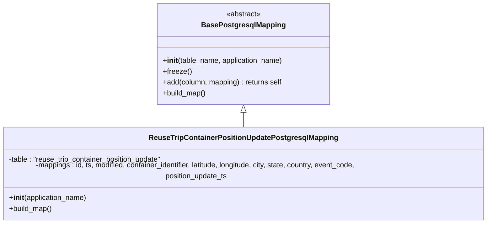

# Diagram: container_tracking_core/container_tracking_service/container_tracking_service/persistence_adapter/postgresql/ReuseTripContainerPositionUpdatePostgresqlMapping.py


> Auto-generated by Obscura crawlers

## Diagram 1



### SVG

<svg id="container" width="1107.96875" xmlns="http://www.w3.org/2000/svg" class="classDiagram" height="480" viewBox="0 0 1107.96875 480" role="graphics-document document" aria-roledescription="class"><style>#container{font-family:"trebuchet ms",verdana,arial,sans-serif;font-size:16px;fill:#333;}@keyframes edge-animation-frame{from{stroke-dashoffset:0;}}@keyframes dash{to{stroke-dashoffset:0;}}#container .edge-animation-slow{stroke-dasharray:9,5!important;stroke-dashoffset:900;animation:dash 50s linear infinite;stroke-linecap:round;}#container .edge-animation-fast{stroke-dasharray:9,5!important;stroke-dashoffset:900;animation:dash 20s linear infinite;stroke-linecap:round;}#container .error-icon{fill:#552222;}#container .error-text{fill:#552222;stroke:#552222;}#container .edge-thickness-normal{stroke-width:1px;}#container .edge-thickness-thick{stroke-width:3.5px;}#container .edge-pattern-solid{stroke-dasharray:0;}#container .edge-thickness-invisible{stroke-width:0;fill:none;}#container .edge-pattern-dashed{stroke-dasharray:3;}#container .edge-pattern-dotted{stroke-dasharray:2;}#container .marker{fill:#333333;stroke:#333333;}#container .marker.cross{stroke:#333333;}#container svg{font-family:"trebuchet ms",verdana,arial,sans-serif;font-size:16px;}#container p{margin:0;}#container g.classGroup text{fill:#9370DB;stroke:none;font-family:"trebuchet ms",verdana,arial,sans-serif;font-size:10px;}#container g.classGroup text .title{font-weight:bolder;}#container .nodeLabel,#container .edgeLabel{color:#131300;}#container .edgeLabel .label rect{fill:#ECECFF;}#container .label text{fill:#131300;}#container .labelBkg{background:#ECECFF;}#container .edgeLabel .label span{background:#ECECFF;}#container .classTitle{font-weight:bolder;}#container .node rect,#container .node circle,#container .node ellipse,#container .node polygon,#container .node path{fill:#ECECFF;stroke:#9370DB;stroke-width:1px;}#container .divider{stroke:#9370DB;stroke-width:1;}#container g.clickable{cursor:pointer;}#container g.classGroup rect{fill:#ECECFF;stroke:#9370DB;}#container g.classGroup line{stroke:#9370DB;stroke-width:1;}#container .classLabel .box{stroke:none;stroke-width:0;fill:#ECECFF;opacity:0.5;}#container .classLabel .label{fill:#9370DB;font-size:10px;}#container .relation{stroke:#333333;stroke-width:1;fill:none;}#container .dashed-line{stroke-dasharray:3;}#container .dotted-line{stroke-dasharray:1 2;}#container #compositionStart,#container .composition{fill:#333333!important;stroke:#333333!important;stroke-width:1;}#container #compositionEnd,#container .composition{fill:#333333!important;stroke:#333333!important;stroke-width:1;}#container #dependencyStart,#container .dependency{fill:#333333!important;stroke:#333333!important;stroke-width:1;}#container #dependencyStart,#container .dependency{fill:#333333!important;stroke:#333333!important;stroke-width:1;}#container #extensionStart,#container .extension{fill:transparent!important;stroke:#333333!important;stroke-width:1;}#container #extensionEnd,#container .extension{fill:transparent!important;stroke:#333333!important;stroke-width:1;}#container #aggregationStart,#container .aggregation{fill:transparent!important;stroke:#333333!important;stroke-width:1;}#container #aggregationEnd,#container .aggregation{fill:transparent!important;stroke:#333333!important;stroke-width:1;}#container #lollipopStart,#container .lollipop{fill:#ECECFF!important;stroke:#333333!important;stroke-width:1;}#container #lollipopEnd,#container .lollipop{fill:#ECECFF!important;stroke:#333333!important;stroke-width:1;}#container .edgeTerminals{font-size:11px;line-height:initial;}#container .classTitleText{text-anchor:middle;font-size:18px;fill:#333;}#container .label-icon{display:inline-block;height:1em;overflow:visible;vertical-align:-0.125em;}#container .node .label-icon path{fill:currentColor;stroke:revert;stroke-width:revert;}#container :root{--mermaid-font-family:"trebuchet ms",verdana,arial,sans-serif;}</style><g><defs><marker id="container_class-aggregationStart" class="marker aggregation class" refX="18" refY="7" markerWidth="190" markerHeight="240" orient="auto"><path d="M 18,7 L9,13 L1,7 L9,1 Z"></path></marker></defs><defs><marker id="container_class-aggregationEnd" class="marker aggregation class" refX="1" refY="7" markerWidth="20" markerHeight="28" orient="auto"><path d="M 18,7 L9,13 L1,7 L9,1 Z"></path></marker></defs><defs><marker id="container_class-extensionStart" class="marker extension class" refX="18" refY="7" markerWidth="190" markerHeight="240" orient="auto"><path d="M 1,7 L18,13 V 1 Z"></path></marker></defs><defs><marker id="container_class-extensionEnd" class="marker extension class" refX="1" refY="7" markerWidth="20" markerHeight="28" orient="auto"><path d="M 1,1 V 13 L18,7 Z"></path></marker></defs><defs><marker id="container_class-compositionStart" class="marker composition class" refX="18" refY="7" markerWidth="190" markerHeight="240" orient="auto"><path d="M 18,7 L9,13 L1,7 L9,1 Z"></path></marker></defs><defs><marker id="container_class-compositionEnd" class="marker composition class" refX="1" refY="7" markerWidth="20" markerHeight="28" orient="auto"><path d="M 18,7 L9,13 L1,7 L9,1 Z"></path></marker></defs><defs><marker id="container_class-dependencyStart" class="marker dependency class" refX="6" refY="7" markerWidth="190" markerHeight="240" orient="auto"><path d="M 5,7 L9,13 L1,7 L9,1 Z"></path></marker></defs><defs><marker id="container_class-dependencyEnd" class="marker dependency class" refX="13" refY="7" markerWidth="20" markerHeight="28" orient="auto"><path d="M 18,7 L9,13 L14,7 L9,1 Z"></path></marker></defs><defs><marker id="container_class-lollipopStart" class="marker lollipop class" refX="13" refY="7" markerWidth="190" markerHeight="240" orient="auto"><circle stroke="black" fill="transparent" cx="7" cy="7" r="6"></circle></marker></defs><defs><marker id="container_class-lollipopEnd" class="marker lollipop class" refX="1" refY="7" markerWidth="190" markerHeight="240" orient="auto"><circle stroke="black" fill="transparent" cx="7" cy="7" r="6"></circle></marker></defs><g class="root"><g class="clusters"></g><g class="edgePaths"><path d="M553.984,247.25L553.984,248.542C553.984,249.833,553.984,252.417,553.984,257.875C553.984,263.333,553.984,271.667,553.984,275.833L553.984,280" id="id_BasePostgresqlMapping_ReuseTripContainerPositionUpdatePostgresqlMapping_1" class="edge-thickness-normal edge-pattern-solid relation" style=";;;" data-edge="true" data-et="edge" data-id="id_BasePostgresqlMapping_ReuseTripContainerPositionUpdatePostgresqlMapping_1" data-points="W3sieCI6NTUzLjk4NDM3NSwieSI6MjMwfSx7IngiOjU1My45ODQzNzUsInkiOjI1NX0seyJ4Ijo1NTMuOTg0Mzc1LCJ5IjoyODB9XQ==" marker-start="url(#container_class-extensionStart)"></path></g><g class="edgeLabels"><g class="edgeLabel"><g class="label" data-id="id_BasePostgresqlMapping_ReuseTripContainerPositionUpdatePostgresqlMapping_1" transform="translate(0, 0)"><foreignObject width="0" height="0"><div xmlns="http://www.w3.org/1999/xhtml" class="labelBkg" style="display: table-cell; white-space: nowrap; line-height: 1.5; max-width: 200px; text-align: center;"><span class="edgeLabel"></span></div></foreignObject></g></g></g><g class="nodes"><g class="node default" id="classId-BasePostgresqlMapping-0" transform="translate(553.984375, 119)"><g class="basic label-container"><path d="M-189.6484375 -111 L189.6484375 -111 L189.6484375 111 L-189.6484375 111" stroke="none" stroke-width="0" fill="#ECECFF" style=""></path><path d="M-189.6484375 -111 C-81.41833318249789 -111, 26.81177113500422 -111, 189.6484375 -111 M-189.6484375 -111 C-77.35755816138592 -111, 34.93332117722815 -111, 189.6484375 -111 M189.6484375 -111 C189.6484375 -30.27379169147251, 189.6484375 50.45241661705498, 189.6484375 111 M189.6484375 -111 C189.6484375 -57.30741356688509, 189.6484375 -3.614827133770177, 189.6484375 111 M189.6484375 111 C48.41921005929811 111, -92.81001738140378 111, -189.6484375 111 M189.6484375 111 C54.35561117287193 111, -80.93721515425614 111, -189.6484375 111 M-189.6484375 111 C-189.6484375 27.871582152507614, -189.6484375 -55.25683569498477, -189.6484375 -111 M-189.6484375 111 C-189.6484375 39.5336039888611, -189.6484375 -31.932792022277795, -189.6484375 -111" stroke="#9370DB" stroke-width="1.3" fill="none" stroke-dasharray="0 0" style=""></path></g><g class="annotation-group text" transform="translate(-38.609375, -87)"><g class="label" style="" transform="translate(0,-12)"><foreignObject width="77.21875" height="24"><div xmlns="http://www.w3.org/1999/xhtml" style="display: table-cell; white-space: nowrap; line-height: 1.5; max-width: 127px; text-align: center;"><span class="nodeLabel markdown-node-label" style=""><p>«abstract»</p></span></div></foreignObject></g></g><g class="label-group text" transform="translate(-87.921875, -63)"><g class="label" style="font-weight: bolder" transform="translate(0,-12)"><foreignObject width="175.84375" height="24"><div xmlns="http://www.w3.org/1999/xhtml" style="display: table-cell; white-space: nowrap; line-height: 1.5; max-width: 223px; text-align: center;"><span class="nodeLabel markdown-node-label" style=""><p>BasePostgresqlMapping</p></span></div></foreignObject></g></g><g class="members-group text" transform="translate(-177.6484375, -15)"></g><g class="methods-group text" transform="translate(-177.6484375, 15)"><g class="label" style="" transform="translate(0,-12)"><foreignObject width="267.375" height="24"><div xmlns="http://www.w3.org/1999/xhtml" style="display: table-cell; white-space: nowrap; line-height: 1.5; max-width: 356px; text-align: center;"><span class="nodeLabel markdown-node-label" style=""><p>+<strong>init</strong>(table_name, application_name)</p></span></div></foreignObject></g><g class="label" style="" transform="translate(0,12)"><foreignObject width="62.109375" height="24"><div xmlns="http://www.w3.org/1999/xhtml" style="display: table-cell; white-space: nowrap; line-height: 1.5; max-width: 119px; text-align: center;"><span class="nodeLabel markdown-node-label" style=""><p>+freeze()</p></span></div></foreignObject></g><g class="label" style="" transform="translate(0,36)"><foreignObject width="266.765625" height="24"><div xmlns="http://www.w3.org/1999/xhtml" style="display: table-cell; white-space: nowrap; line-height: 1.5; max-width: 326px; text-align: center;"><span class="nodeLabel markdown-node-label" style=""><p>+add(column, mapping) : returns self</p></span></div></foreignObject></g><g class="label" style="" transform="translate(0,60)"><foreignObject width="96.109375" height="24"><div xmlns="http://www.w3.org/1999/xhtml" style="display: table-cell; white-space: nowrap; line-height: 1.5; max-width: 153px; text-align: center;"><span class="nodeLabel markdown-node-label" style=""><p>+build_map()</p></span></div></foreignObject></g></g><g class="divider" style=""><path d="M-189.6484375 -39 C-83.33000561828162 -39, 22.988426263436764 -39, 189.6484375 -39 M-189.6484375 -39 C-86.64885304351714 -39, 16.35073141296573 -39, 189.6484375 -39" stroke="#9370DB" stroke-width="1.3" fill="none" stroke-dasharray="0 0" style=""></path></g><g class="divider" style=""><path d="M-189.6484375 -15 C-68.60991289448923 -15, 52.428611711021546 -15, 189.6484375 -15 M-189.6484375 -15 C-91.52019868398585 -15, 6.608040132028293 -15, 189.6484375 -15" stroke="#9370DB" stroke-width="1.3" fill="none" stroke-dasharray="0 0" style=""></path></g></g><g class="node default" id="classId-ReuseTripContainerPositionUpdatePostgresqlMapping-1" transform="translate(553.984375, 376)"><g class="basic label-container"><path d="M-545.984375 -96 L545.984375 -96 L545.984375 96 L-545.984375 96" stroke="none" stroke-width="0" fill="#ECECFF" style=""></path><path d="M-545.984375 -96 C-161.43446550555905 -96, 223.1154439888819 -96, 545.984375 -96 M-545.984375 -96 C-222.96382995371908 -96, 100.05671509256183 -96, 545.984375 -96 M545.984375 -96 C545.984375 -22.19621103824906, 545.984375 51.60757792350188, 545.984375 96 M545.984375 -96 C545.984375 -50.48858905560313, 545.984375 -4.977178111206257, 545.984375 96 M545.984375 96 C214.93759942845497 96, -116.10917614309005 96, -545.984375 96 M545.984375 96 C212.07399721693452 96, -121.83638056613097 96, -545.984375 96 M-545.984375 96 C-545.984375 41.177783986637095, -545.984375 -13.64443202672581, -545.984375 -96 M-545.984375 96 C-545.984375 20.150961276202068, -545.984375 -55.698077447595864, -545.984375 -96" stroke="#9370DB" stroke-width="1.3" fill="none" stroke-dasharray="0 0" style=""></path></g><g class="annotation-group text" transform="translate(0, -72)"></g><g class="label-group text" transform="translate(-198.921875, -72)"><g class="label" style="font-weight: bolder" transform="translate(0,-12)"><foreignObject width="397.84375" height="24"><div xmlns="http://www.w3.org/1999/xhtml" style="display: table-cell; white-space: nowrap; line-height: 1.5; max-width: 443px; text-align: center;"><span class="nodeLabel markdown-node-label" style=""><p>ReuseTripContainerPositionUpdatePostgresqlMapping</p></span></div></foreignObject></g></g><g class="members-group text" transform="translate(-533.984375, -24)"><g class="label" style="" transform="translate(0,-12)"><foreignObject width="345.171875" height="24"><div xmlns="http://www.w3.org/1999/xhtml" style="display: table-cell; white-space: nowrap; line-height: 1.5; max-width: 403px; text-align: center;"><span class="nodeLabel markdown-node-label" style=""><p>-table : "reuse_trip_container_position_update"</p></span></div></foreignObject></g><g class="label" style="" transform="translate(0,12)"><foreignObject width="869.046875" height="24"><div xmlns="http://www.w3.org/1999/xhtml" style="display: table-cell; white-space: nowrap; line-height: 1.5; max-width: 926px; text-align: center;"><span class="nodeLabel markdown-node-label" style=""><p>-mappings : id, ts, modified, container_identifier, latitude, longitude, city, state, country, event_code, position_update_ts</p></span></div></foreignObject></g></g><g class="methods-group text" transform="translate(-533.984375, 48)"><g class="label" style="" transform="translate(0,-12)"><foreignObject width="173.734375" height="24"><div xmlns="http://www.w3.org/1999/xhtml" style="display: table-cell; white-space: nowrap; line-height: 1.5; max-width: 263px; text-align: center;"><span class="nodeLabel markdown-node-label" style=""><p>+<strong>init</strong>(application_name)</p></span></div></foreignObject></g><g class="label" style="" transform="translate(0,12)"><foreignObject width="96.109375" height="24"><div xmlns="http://www.w3.org/1999/xhtml" style="display: table-cell; white-space: nowrap; line-height: 1.5; max-width: 153px; text-align: center;"><span class="nodeLabel markdown-node-label" style=""><p>+build_map()</p></span></div></foreignObject></g></g><g class="divider" style=""><path d="M-545.984375 -48 C-146.7226824138893 -48, 252.53901017222142 -48, 545.984375 -48 M-545.984375 -48 C-294.73185752517765 -48, -43.47934005035529 -48, 545.984375 -48" stroke="#9370DB" stroke-width="1.3" fill="none" stroke-dasharray="0 0" style=""></path></g><g class="divider" style=""><path d="M-545.984375 24 C-222.81203477870912 24, 100.36030544258176 24, 545.984375 24 M-545.984375 24 C-127.64755260265662 24, 290.68926979468677 24, 545.984375 24" stroke="#9370DB" stroke-width="1.3" fill="none" stroke-dasharray="0 0" style=""></path></g></g></g></g></g></svg>

## Diagram 2

```mermaid
flowchart TD
    Start([construct object]) --> Init[/"super().__init__('reuse_trip_container_position_update', application_name)"/]
    Init --> Freeze["super().freeze()"]
    Freeze --> Build["build_map()"]
    Build --> A[add('id','id')]
    A --> B[add('ts','ts')]
    B --> C[add('modified','modified')]
    C --> D[add('container_identifier','container_identifier')]
    D --> E[add('latitude','latitude')]
    E --> F[add('longitude','longitude')]
    F --> G[add('city','city')]
    G --> H[add('state','state')]
    H --> I[add('country','country')]
    I --> J[add('event_code','event_code')]
    J --> K[add('position_update_ts','position_update_ts')]
    K --> End([mapping complete])
```

> SVG rendering failed for this diagram.
