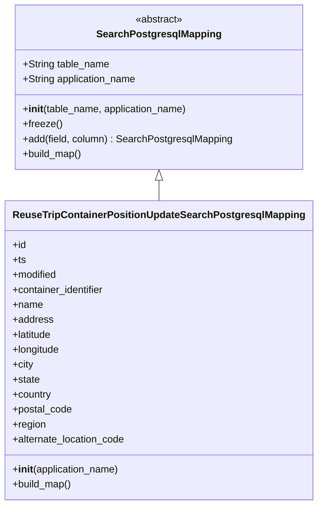

# Diagram: container_tracking_core/container_tracking_service/container_tracking_service/persistence_adapter/postgresql/ReuseTripContainerPositionUpdateSearchPostgresqlMapping.py


> Auto-generated by Obscura crawlers

## Diagram 1



### SVG

<svg id="container" width="487.265625" xmlns="http://www.w3.org/2000/svg" class="classDiagram" height="810" viewBox="0 0 487.265625 810" role="graphics-document document" aria-roledescription="class"><style>#container{font-family:"trebuchet ms",verdana,arial,sans-serif;font-size:16px;fill:#333;}@keyframes edge-animation-frame{from{stroke-dashoffset:0;}}@keyframes dash{to{stroke-dashoffset:0;}}#container .edge-animation-slow{stroke-dasharray:9,5!important;stroke-dashoffset:900;animation:dash 50s linear infinite;stroke-linecap:round;}#container .edge-animation-fast{stroke-dasharray:9,5!important;stroke-dashoffset:900;animation:dash 20s linear infinite;stroke-linecap:round;}#container .error-icon{fill:#552222;}#container .error-text{fill:#552222;stroke:#552222;}#container .edge-thickness-normal{stroke-width:1px;}#container .edge-thickness-thick{stroke-width:3.5px;}#container .edge-pattern-solid{stroke-dasharray:0;}#container .edge-thickness-invisible{stroke-width:0;fill:none;}#container .edge-pattern-dashed{stroke-dasharray:3;}#container .edge-pattern-dotted{stroke-dasharray:2;}#container .marker{fill:#333333;stroke:#333333;}#container .marker.cross{stroke:#333333;}#container svg{font-family:"trebuchet ms",verdana,arial,sans-serif;font-size:16px;}#container p{margin:0;}#container g.classGroup text{fill:#9370DB;stroke:none;font-family:"trebuchet ms",verdana,arial,sans-serif;font-size:10px;}#container g.classGroup text .title{font-weight:bolder;}#container .nodeLabel,#container .edgeLabel{color:#131300;}#container .edgeLabel .label rect{fill:#ECECFF;}#container .label text{fill:#131300;}#container .labelBkg{background:#ECECFF;}#container .edgeLabel .label span{background:#ECECFF;}#container .classTitle{font-weight:bolder;}#container .node rect,#container .node circle,#container .node ellipse,#container .node polygon,#container .node path{fill:#ECECFF;stroke:#9370DB;stroke-width:1px;}#container .divider{stroke:#9370DB;stroke-width:1;}#container g.clickable{cursor:pointer;}#container g.classGroup rect{fill:#ECECFF;stroke:#9370DB;}#container g.classGroup line{stroke:#9370DB;stroke-width:1;}#container .classLabel .box{stroke:none;stroke-width:0;fill:#ECECFF;opacity:0.5;}#container .classLabel .label{fill:#9370DB;font-size:10px;}#container .relation{stroke:#333333;stroke-width:1;fill:none;}#container .dashed-line{stroke-dasharray:3;}#container .dotted-line{stroke-dasharray:1 2;}#container #compositionStart,#container .composition{fill:#333333!important;stroke:#333333!important;stroke-width:1;}#container #compositionEnd,#container .composition{fill:#333333!important;stroke:#333333!important;stroke-width:1;}#container #dependencyStart,#container .dependency{fill:#333333!important;stroke:#333333!important;stroke-width:1;}#container #dependencyStart,#container .dependency{fill:#333333!important;stroke:#333333!important;stroke-width:1;}#container #extensionStart,#container .extension{fill:transparent!important;stroke:#333333!important;stroke-width:1;}#container #extensionEnd,#container .extension{fill:transparent!important;stroke:#333333!important;stroke-width:1;}#container #aggregationStart,#container .aggregation{fill:transparent!important;stroke:#333333!important;stroke-width:1;}#container #aggregationEnd,#container .aggregation{fill:transparent!important;stroke:#333333!important;stroke-width:1;}#container #lollipopStart,#container .lollipop{fill:#ECECFF!important;stroke:#333333!important;stroke-width:1;}#container #lollipopEnd,#container .lollipop{fill:#ECECFF!important;stroke:#333333!important;stroke-width:1;}#container .edgeTerminals{font-size:11px;line-height:initial;}#container .classTitleText{text-anchor:middle;font-size:18px;fill:#333;}#container .label-icon{display:inline-block;height:1em;overflow:visible;vertical-align:-0.125em;}#container .node .label-icon path{fill:currentColor;stroke:revert;stroke-width:revert;}#container :root{--mermaid-font-family:"trebuchet ms",verdana,arial,sans-serif;}</style><g><defs><marker id="container_class-aggregationStart" class="marker aggregation class" refX="18" refY="7" markerWidth="190" markerHeight="240" orient="auto"><path d="M 18,7 L9,13 L1,7 L9,1 Z"></path></marker></defs><defs><marker id="container_class-aggregationEnd" class="marker aggregation class" refX="1" refY="7" markerWidth="20" markerHeight="28" orient="auto"><path d="M 18,7 L9,13 L1,7 L9,1 Z"></path></marker></defs><defs><marker id="container_class-extensionStart" class="marker extension class" refX="18" refY="7" markerWidth="190" markerHeight="240" orient="auto"><path d="M 1,7 L18,13 V 1 Z"></path></marker></defs><defs><marker id="container_class-extensionEnd" class="marker extension class" refX="1" refY="7" markerWidth="20" markerHeight="28" orient="auto"><path d="M 1,1 V 13 L18,7 Z"></path></marker></defs><defs><marker id="container_class-compositionStart" class="marker composition class" refX="18" refY="7" markerWidth="190" markerHeight="240" orient="auto"><path d="M 18,7 L9,13 L1,7 L9,1 Z"></path></marker></defs><defs><marker id="container_class-compositionEnd" class="marker composition class" refX="1" refY="7" markerWidth="20" markerHeight="28" orient="auto"><path d="M 18,7 L9,13 L1,7 L9,1 Z"></path></marker></defs><defs><marker id="container_class-dependencyStart" class="marker dependency class" refX="6" refY="7" markerWidth="190" markerHeight="240" orient="auto"><path d="M 5,7 L9,13 L1,7 L9,1 Z"></path></marker></defs><defs><marker id="container_class-dependencyEnd" class="marker dependency class" refX="13" refY="7" markerWidth="20" markerHeight="28" orient="auto"><path d="M 18,7 L9,13 L14,7 L9,1 Z"></path></marker></defs><defs><marker id="container_class-lollipopStart" class="marker lollipop class" refX="13" refY="7" markerWidth="190" markerHeight="240" orient="auto"><circle stroke="black" fill="transparent" cx="7" cy="7" r="6"></circle></marker></defs><defs><marker id="container_class-lollipopEnd" class="marker lollipop class" refX="1" refY="7" markerWidth="190" markerHeight="240" orient="auto"><circle stroke="black" fill="transparent" cx="7" cy="7" r="6"></circle></marker></defs><g class="root"><g class="clusters"></g><g class="edgePaths"><path d="M243.633,289.25L243.633,290.542C243.633,291.833,243.633,294.417,243.633,299.875C243.633,305.333,243.633,313.667,243.633,317.833L243.633,322" id="id_SearchPostgresqlMapping_ReuseTripContainerPositionUpdateSearchPostgresqlMapping_1" class="edge-thickness-normal edge-pattern-solid relation" style=";;;" data-edge="true" data-et="edge" data-id="id_SearchPostgresqlMapping_ReuseTripContainerPositionUpdateSearchPostgresqlMapping_1" data-points="W3sieCI6MjQzLjYzMjgxMjUsInkiOjI3Mn0seyJ4IjoyNDMuNjMyODEyNSwieSI6Mjk3fSx7IngiOjI0My42MzI4MTI1LCJ5IjozMjJ9XQ==" marker-start="url(#container_class-extensionStart)"></path></g><g class="edgeLabels"><g class="edgeLabel"><g class="label" data-id="id_SearchPostgresqlMapping_ReuseTripContainerPositionUpdateSearchPostgresqlMapping_1" transform="translate(0, 0)"><foreignObject width="0" height="0"><div xmlns="http://www.w3.org/1999/xhtml" class="labelBkg" style="display: table-cell; white-space: nowrap; line-height: 1.5; max-width: 200px; text-align: center;"><span class="edgeLabel"></span></div></foreignObject></g></g></g><g class="nodes"><g class="node default" id="classId-SearchPostgresqlMapping-0" transform="translate(243.6328125, 140)"><g class="basic label-container"><path d="M-229.01953125 -132 L229.01953125 -132 L229.01953125 132 L-229.01953125 132" stroke="none" stroke-width="0" fill="#ECECFF" style=""></path><path d="M-229.01953125 -132 C-61.78567229475422 -132, 105.44818666049156 -132, 229.01953125 -132 M-229.01953125 -132 C-56.68850592776309 -132, 115.64251939447382 -132, 229.01953125 -132 M229.01953125 -132 C229.01953125 -64.61502062587223, 229.01953125 2.769958748255533, 229.01953125 132 M229.01953125 -132 C229.01953125 -52.01723942302303, 229.01953125 27.965521153953944, 229.01953125 132 M229.01953125 132 C73.52175873152018 132, -81.97601378695964 132, -229.01953125 132 M229.01953125 132 C64.85015534020346 132, -99.31922056959309 132, -229.01953125 132 M-229.01953125 132 C-229.01953125 31.791244993494345, -229.01953125 -68.41751001301131, -229.01953125 -132 M-229.01953125 132 C-229.01953125 40.014460536415896, -229.01953125 -51.97107892716821, -229.01953125 -132" stroke="#9370DB" stroke-width="1.3" fill="none" stroke-dasharray="0 0" style=""></path></g><g class="annotation-group text" transform="translate(-38.609375, -108)"><g class="label" style="" transform="translate(0,-12)"><foreignObject width="77.21875" height="24"><div xmlns="http://www.w3.org/1999/xhtml" style="display: table-cell; white-space: nowrap; line-height: 1.5; max-width: 127px; text-align: center;"><span class="nodeLabel markdown-node-label" style=""><p>«abstract»</p></span></div></foreignObject></g></g><g class="label-group text" transform="translate(-95.1171875, -84)"><g class="label" style="font-weight: bolder" transform="translate(0,-12)"><foreignObject width="190.234375" height="24"><div xmlns="http://www.w3.org/1999/xhtml" style="display: table-cell; white-space: nowrap; line-height: 1.5; max-width: 237px; text-align: center;"><span class="nodeLabel markdown-node-label" style=""><p>SearchPostgresqlMapping</p></span></div></foreignObject></g></g><g class="members-group text" transform="translate(-217.01953125, -36)"><g class="label" style="" transform="translate(0,-12)"><foreignObject width="140.1875" height="24"><div xmlns="http://www.w3.org/1999/xhtml" style="display: table-cell; white-space: nowrap; line-height: 1.5; max-width: 198px; text-align: center;"><span class="nodeLabel markdown-node-label" style=""><p>+String table_name</p></span></div></foreignObject></g><g class="label" style="" transform="translate(0,12)"><foreignObject width="185.421875" height="24"><div xmlns="http://www.w3.org/1999/xhtml" style="display: table-cell; white-space: nowrap; line-height: 1.5; max-width: 243px; text-align: center;"><span class="nodeLabel markdown-node-label" style=""><p>+String application_name</p></span></div></foreignObject></g></g><g class="methods-group text" transform="translate(-217.01953125, 36)"><g class="label" style="" transform="translate(0,-12)"><foreignObject width="267.375" height="24"><div xmlns="http://www.w3.org/1999/xhtml" style="display: table-cell; white-space: nowrap; line-height: 1.5; max-width: 356px; text-align: center;"><span class="nodeLabel markdown-node-label" style=""><p>+<strong>init</strong>(table_name, application_name)</p></span></div></foreignObject></g><g class="label" style="" transform="translate(0,12)"><foreignObject width="62.109375" height="24"><div xmlns="http://www.w3.org/1999/xhtml" style="display: table-cell; white-space: nowrap; line-height: 1.5; max-width: 119px; text-align: center;"><span class="nodeLabel markdown-node-label" style=""><p>+freeze()</p></span></div></foreignObject></g><g class="label" style="" transform="translate(0,36)"><foreignObject width="338.921875" height="24"><div xmlns="http://www.w3.org/1999/xhtml" style="display: table-cell; white-space: nowrap; line-height: 1.5; max-width: 397px; text-align: center;"><span class="nodeLabel markdown-node-label" style=""><p>+add(field, column) : SearchPostgresqlMapping</p></span></div></foreignObject></g><g class="label" style="" transform="translate(0,60)"><foreignObject width="96.109375" height="24"><div xmlns="http://www.w3.org/1999/xhtml" style="display: table-cell; white-space: nowrap; line-height: 1.5; max-width: 153px; text-align: center;"><span class="nodeLabel markdown-node-label" style=""><p>+build_map()</p></span></div></foreignObject></g></g><g class="divider" style=""><path d="M-229.01953125 -60 C-99.61689809917544 -60, 29.785735051649112 -60, 229.01953125 -60 M-229.01953125 -60 C-100.15292250847301 -60, 28.713686233053977 -60, 229.01953125 -60" stroke="#9370DB" stroke-width="1.3" fill="none" stroke-dasharray="0 0" style=""></path></g><g class="divider" style=""><path d="M-229.01953125 12 C-101.30053478550992 12, 26.41846167898015 12, 229.01953125 12 M-229.01953125 12 C-82.18450825015105 12, 64.65051474969789 12, 229.01953125 12" stroke="#9370DB" stroke-width="1.3" fill="none" stroke-dasharray="0 0" style=""></path></g></g><g class="node default" id="classId-ReuseTripContainerPositionUpdateSearchPostgresqlMapping-1" transform="translate(243.6328125, 562)"><g class="basic label-container"><path d="M-235.6328125 -240 L235.6328125 -240 L235.6328125 240 L-235.6328125 240" stroke="none" stroke-width="0" fill="#ECECFF" style=""></path><path d="M-235.6328125 -240 C-140.54762225589886 -240, -45.462432011797716 -240, 235.6328125 -240 M-235.6328125 -240 C-79.36760727556305 -240, 76.89759794887391 -240, 235.6328125 -240 M235.6328125 -240 C235.6328125 -52.9063616523371, 235.6328125 134.1872766953258, 235.6328125 240 M235.6328125 -240 C235.6328125 -127.24197295563866, 235.6328125 -14.483945911277317, 235.6328125 240 M235.6328125 240 C103.704334413736 240, -28.224143672527987 240, -235.6328125 240 M235.6328125 240 C98.88208660365737 240, -37.86863929268526 240, -235.6328125 240 M-235.6328125 240 C-235.6328125 94.04814565045251, -235.6328125 -51.90370869909498, -235.6328125 -240 M-235.6328125 240 C-235.6328125 114.48923787313335, -235.6328125 -11.021524253733304, -235.6328125 -240" stroke="#9370DB" stroke-width="1.3" fill="none" stroke-dasharray="0 0" style=""></path></g><g class="annotation-group text" transform="translate(0, -216)"></g><g class="label-group text" transform="translate(-223.6328125, -216)"><g class="label" style="font-weight: bolder" transform="translate(0,-12)"><foreignObject width="447.265625" height="24"><div xmlns="http://www.w3.org/1999/xhtml" style="display: table-cell; white-space: nowrap; line-height: 1.5; max-width: 491px; text-align: center;"><span class="nodeLabel markdown-node-label" style=""><p>ReuseTripContainerPositionUpdateSearchPostgresqlMapping</p></span></div></foreignObject></g></g><g class="members-group text" transform="translate(-223.6328125, -168)"><g class="label" style="" transform="translate(0,-12)"><foreignObject width="22.078125" height="24"><div xmlns="http://www.w3.org/1999/xhtml" style="display: table-cell; white-space: nowrap; line-height: 1.5; max-width: 79px; text-align: center;"><span class="nodeLabel markdown-node-label" style=""><p>+id</p></span></div></foreignObject></g><g class="label" style="" transform="translate(0,12)"><foreignObject width="21.15625" height="24"><div xmlns="http://www.w3.org/1999/xhtml" style="display: table-cell; white-space: nowrap; line-height: 1.5; max-width: 79px; text-align: center;"><span class="nodeLabel markdown-node-label" style=""><p>+ts</p></span></div></foreignObject></g><g class="label" style="" transform="translate(0,36)"><foreignObject width="72.609375" height="24"><div xmlns="http://www.w3.org/1999/xhtml" style="display: table-cell; white-space: nowrap; line-height: 1.5; max-width: 130px; text-align: center;"><span class="nodeLabel markdown-node-label" style=""><p>+modified</p></span></div></foreignObject></g><g class="label" style="" transform="translate(0,60)"><foreignObject width="150.796875" height="24"><div xmlns="http://www.w3.org/1999/xhtml" style="display: table-cell; white-space: nowrap; line-height: 1.5; max-width: 209px; text-align: center;"><span class="nodeLabel markdown-node-label" style=""><p>+container_identifier</p></span></div></foreignObject></g><g class="label" style="" transform="translate(0,84)"><foreignObject width="48.5" height="24"><div xmlns="http://www.w3.org/1999/xhtml" style="display: table-cell; white-space: nowrap; line-height: 1.5; max-width: 106px; text-align: center;"><span class="nodeLabel markdown-node-label" style=""><p>+name</p></span></div></foreignObject></g><g class="label" style="" transform="translate(0,108)"><foreignObject width="64.796875" height="24"><div xmlns="http://www.w3.org/1999/xhtml" style="display: table-cell; white-space: nowrap; line-height: 1.5; max-width: 122px; text-align: center;"><span class="nodeLabel markdown-node-label" style=""><p>+address</p></span></div></foreignObject></g><g class="label" style="" transform="translate(0,132)"><foreignObject width="64.96875" height="24"><div xmlns="http://www.w3.org/1999/xhtml" style="display: table-cell; white-space: nowrap; line-height: 1.5; max-width: 122px; text-align: center;"><span class="nodeLabel markdown-node-label" style=""><p>+latitude</p></span></div></foreignObject></g><g class="label" style="" transform="translate(0,156)"><foreignObject width="77.53125" height="24"><div xmlns="http://www.w3.org/1999/xhtml" style="display: table-cell; white-space: nowrap; line-height: 1.5; max-width: 135px; text-align: center;"><span class="nodeLabel markdown-node-label" style=""><p>+longitude</p></span></div></foreignObject></g><g class="label" style="" transform="translate(0,180)"><foreignObject width="33.71875" height="24"><div xmlns="http://www.w3.org/1999/xhtml" style="display: table-cell; white-space: nowrap; line-height: 1.5; max-width: 91px; text-align: center;"><span class="nodeLabel markdown-node-label" style=""><p>+city</p></span></div></foreignObject></g><g class="label" style="" transform="translate(0,204)"><foreignObject width="44.09375" height="24"><div xmlns="http://www.w3.org/1999/xhtml" style="display: table-cell; white-space: nowrap; line-height: 1.5; max-width: 101px; text-align: center;"><span class="nodeLabel markdown-node-label" style=""><p>+state</p></span></div></foreignObject></g><g class="label" style="" transform="translate(0,228)"><foreignObject width="63.171875" height="24"><div xmlns="http://www.w3.org/1999/xhtml" style="display: table-cell; white-space: nowrap; line-height: 1.5; max-width: 121px; text-align: center;"><span class="nodeLabel markdown-node-label" style=""><p>+country</p></span></div></foreignObject></g><g class="label" style="" transform="translate(0,252)"><foreignObject width="96.171875" height="24"><div xmlns="http://www.w3.org/1999/xhtml" style="display: table-cell; white-space: nowrap; line-height: 1.5; max-width: 154px; text-align: center;"><span class="nodeLabel markdown-node-label" style=""><p>+postal_code</p></span></div></foreignObject></g><g class="label" style="" transform="translate(0,276)"><foreignObject width="53.953125" height="24"><div xmlns="http://www.w3.org/1999/xhtml" style="display: table-cell; white-space: nowrap; line-height: 1.5; max-width: 111px; text-align: center;"><span class="nodeLabel markdown-node-label" style=""><p>+region</p></span></div></foreignObject></g><g class="label" style="" transform="translate(0,300)"><foreignObject width="183.703125" height="24"><div xmlns="http://www.w3.org/1999/xhtml" style="display: table-cell; white-space: nowrap; line-height: 1.5; max-width: 241px; text-align: center;"><span class="nodeLabel markdown-node-label" style=""><p>+alternate_location_code</p></span></div></foreignObject></g></g><g class="methods-group text" transform="translate(-223.6328125, 192)"><g class="label" style="" transform="translate(0,-12)"><foreignObject width="173.734375" height="24"><div xmlns="http://www.w3.org/1999/xhtml" style="display: table-cell; white-space: nowrap; line-height: 1.5; max-width: 263px; text-align: center;"><span class="nodeLabel markdown-node-label" style=""><p>+<strong>init</strong>(application_name)</p></span></div></foreignObject></g><g class="label" style="" transform="translate(0,12)"><foreignObject width="96.109375" height="24"><div xmlns="http://www.w3.org/1999/xhtml" style="display: table-cell; white-space: nowrap; line-height: 1.5; max-width: 153px; text-align: center;"><span class="nodeLabel markdown-node-label" style=""><p>+build_map()</p></span></div></foreignObject></g></g><g class="divider" style=""><path d="M-235.6328125 -192 C-90.10332377766966 -192, 55.426164944660684 -192, 235.6328125 -192 M-235.6328125 -192 C-132.44353864599668 -192, -29.254264791993336 -192, 235.6328125 -192" stroke="#9370DB" stroke-width="1.3" fill="none" stroke-dasharray="0 0" style=""></path></g><g class="divider" style=""><path d="M-235.6328125 168 C-50.41389851367083 168, 134.80501547265834 168, 235.6328125 168 M-235.6328125 168 C-123.57060951067804 168, -11.508406521356079 168, 235.6328125 168" stroke="#9370DB" stroke-width="1.3" fill="none" stroke-dasharray="0 0" style=""></path></g></g></g></g></g></svg>

## Diagram 2

```mermaid
flowchart TD
INIT[ReuseTripContainerPositionUpdateSearchPostgresqlMapping.__init__(application_name)] --> SUPER_INIT[SearchPostgresqlMapping.__init__("reuse_trip_container_position_update", application_name)]
SUPER_INIT --> FREEZE[super().freeze()]
BUILD[build_map()] --> ADD_CHAIN[add chain: id, ts, modified, container_identifier, name, address, latitude, longitude, city, state, country, postal_code, region, alternate_location_code]
FREEZE --> END_INIT[__init__ complete]
INIT --> END_INIT
BUILD --> MAPPING_DONE[return mapping]
```

> SVG rendering failed for this diagram.
