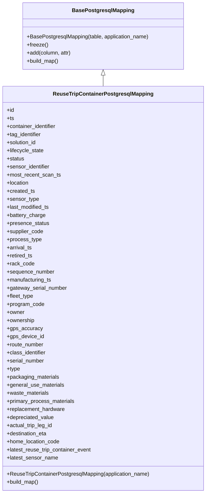

# Diagram: container_tracking_core/container_tracking_service/container_tracking_service/persistence_adapter/postgresql/ReuseTripContainerPostgresqlMapping.py

> Auto-generated by Obscura crawlers

## Mermaid

### SVG

<svg id="container" width="611.8828125" xmlns="http://www.w3.org/2000/svg" class="classDiagram" height="1464" viewBox="0 0 611.8828125 1464" role="graphics-document document" aria-roledescription="class"><g><defs><marker id="container_class-aggregationStart" class="marker aggregation class" refX="18" refY="7" markerWidth="190" markerHeight="240" orient="auto"><path d="M 18,7 L9,13 L1,7 L9,1 Z"></path></marker></defs><defs><marker id="container_class-aggregationEnd" class="marker aggregation class" refX="1" refY="7" markerWidth="20" markerHeight="28" orient="auto"><path d="M 18,7 L9,13 L1,7 L9,1 Z"></path></marker></defs><defs><marker id="container_class-extensionStart" class="marker extension class" refX="18" refY="7" markerWidth="190" markerHeight="240" orient="auto"><path d="M 1,7 L18,13 V 1 Z"></path></marker></defs><defs><marker id="container_class-extensionEnd" class="marker extension class" refX="1" refY="7" markerWidth="20" markerHeight="28" orient="auto"><path d="M 1,1 V 13 L18,7 Z"></path></marker></defs><defs><marker id="container_class-compositionStart" class="marker composition class" refX="18" refY="7" markerWidth="190" markerHeight="240" orient="auto"><path d="M 18,7 L9,13 L1,7 L9,1 Z"></path></marker></defs><defs><marker id="container_class-compositionEnd" class="marker composition class" refX="1" refY="7" markerWidth="20" markerHeight="28" orient="auto"><path d="M 18,7 L9,13 L1,7 L9,1 Z"></path></marker></defs><defs><marker id="container_class-dependencyStart" class="marker dependency class" refX="6" refY="7" markerWidth="190" markerHeight="240" orient="auto"><path d="M 5,7 L9,13 L1,7 L9,1 Z"></path></marker></defs><defs><marker id="container_class-dependencyEnd" class="marker dependency class" refX="13" refY="7" markerWidth="20" markerHeight="28" orient="auto"><path d="M 18,7 L9,13 L14,7 L9,1 Z"></path></marker></defs><defs><marker id="container_class-lollipopStart" class="marker lollipop class" refX="13" refY="7" markerWidth="190" markerHeight="240" orient="auto"><circle stroke="black" fill="transparent" cx="7" cy="7" r="6"></circle></marker></defs><defs><marker id="container_class-lollipopEnd" class="marker lollipop class" refX="1" refY="7" markerWidth="190" markerHeight="240" orient="auto"><circle stroke="black" fill="transparent" cx="7" cy="7" r="6"></circle></marker></defs><g class="root"><g class="clusters"></g><g class="edgePaths"><path d="M305.941,223.25L305.941,224.542C305.941,225.833,305.941,228.417,305.941,233.875C305.941,239.333,305.941,247.667,305.941,251.833L305.941,256" id="id_BasePostgresqlMapping_ReuseTripContainerPostgresqlMapping_1" class="edge-thickness-normal edge-pattern-solid relation" style=";;;" data-edge="true" data-et="edge" data-id="id_BasePostgresqlMapping_ReuseTripContainerPostgresqlMapping_1" data-points="W3sieCI6MzA1Ljk0MTQwNjI1LCJ5IjoyMDZ9LHsieCI6MzA1Ljk0MTQwNjI1LCJ5IjoyMzF9LHsieCI6MzA1Ljk0MTQwNjI1LCJ5IjoyNTZ9XQ==" marker-start="url(#container_class-extensionStart)"></path></g><g class="edgeLabels"><g class="edgeLabel"><g class="label" data-id="id_BasePostgresqlMapping_ReuseTripContainerPostgresqlMapping_1" transform="translate(0, 0)"><foreignObject width="0" height="0">

</foreignObject></g></g></g><g class="nodes"><g class="node default" id="classId-BasePostgresqlMapping-0" transform="translate(305.94140625, 107)"><g class="basic label-container"><path d="M-239.40625 -99 L239.40625 -99 L239.40625 99 L-239.40625 99" stroke="none" stroke-width="0" fill="#ECECFF" style=""></path><path d="M-239.40625 -99 C-90.4320040565328 -99, 58.54224188693439 -99, 239.40625 -99 M-239.40625 -99 C-77.55733475054535 -99, 84.2915804989093 -99, 239.40625 -99 M239.40625 -99 C239.40625 -33.72614947146741, 239.40625 31.547701057065183, 239.40625 99 M239.40625 -99 C239.40625 -41.99372981089071, 239.40625 15.012540378218574, 239.40625 99 M239.40625 99 C143.45314556994526 99, 47.500041139890556 99, -239.40625 99 M239.40625 99 C140.89957920579673 99, 42.392908411593424 99, -239.40625 99 M-239.40625 99 C-239.40625 30.59248905720625, -239.40625 -37.8150218855875, -239.40625 -99 M-239.40625 99 C-239.40625 20.210278032520677, -239.40625 -58.57944393495865, -239.40625 -99" stroke="#9370DB" stroke-width="1.3" fill="none" stroke-dasharray="0 0" style=""></path></g><g class="annotation-group text" transform="translate(0, -75)"></g><g class="label-group text" transform="translate(-87.921875, -75)"><g class="label" style="font-weight: bolder" transform="translate(0,-12)"><foreignObject width="175.84375" height="24">

BasePostgresqlMapping

</foreignObject></g></g><g class="members-group text" transform="translate(-227.40625, -27)"></g><g class="methods-group text" transform="translate(-227.40625, 3)"><g class="label" style="" transform="translate(0,-12)"><foreignObject width="366.890625" height="24">

+BasePostgresqlMapping(table, application_name)

</foreignObject></g><g class="label" style="" transform="translate(0,12)"><foreignObject width="62.109375" height="24">

+freeze()

</foreignObject></g><g class="label" style="" transform="translate(0,36)"><foreignObject width="134.234375" height="24">

+add(column, attr)

</foreignObject></g><g class="label" style="" transform="translate(0,60)"><foreignObject width="96.109375" height="24">

+build_map()

</foreignObject></g></g><g class="divider" style=""><path d="M-239.40625 -51 C-108.7912711353865 -51, 21.82370772922701 -51, 239.40625 -51 M-239.40625 -51 C-55.660054807534635 -51, 128.08614038493073 -51, 239.40625 -51" stroke="#9370DB" stroke-width="1.3" fill="none" stroke-dasharray="0 0" style=""></path></g><g class="divider" style=""><path d="M-239.40625 -27 C-93.4021109086473 -27, 52.602028182705396 -27, 239.40625 -27 M-239.40625 -27 C-96.70674683031834 -27, 45.992756339363325 -27, 239.40625 -27" stroke="#9370DB" stroke-width="1.3" fill="none" stroke-dasharray="0 0" style=""></path></g></g><g class="node default" id="classId-ReuseTripContainerPostgresqlMapping-1" transform="translate(305.94140625, 856)"><g class="basic label-container"><path d="M-297.94140625 -600 L297.94140625 -600 L297.94140625 600 L-297.94140625 600" stroke="none" stroke-width="0" fill="#ECECFF" style=""></path><path d="M-297.94140625 -600 C-119.90284426323285 -600, 58.1357177235343 -600, 297.94140625 -600 M-297.94140625 -600 C-78.06738067831819 -600, 141.80664489336363 -600, 297.94140625 -600 M297.94140625 -600 C297.94140625 -155.8780774019482, 297.94140625 288.2438451961036, 297.94140625 600 M297.94140625 -600 C297.94140625 -309.07444853387426, 297.94140625 -18.14889706774852, 297.94140625 600 M297.94140625 600 C165.7445525424072 600, 33.54769883481441 600, -297.94140625 600 M297.94140625 600 C68.51181889213845 600, -160.9177684657231 600, -297.94140625 600 M-297.94140625 600 C-297.94140625 262.21269047304554, -297.94140625 -75.57461905390892, -297.94140625 -600 M-297.94140625 600 C-297.94140625 132.2231703570563, -297.94140625 -335.5536592858874, -297.94140625 -600" stroke="#9370DB" stroke-width="1.3" fill="none" stroke-dasharray="0 0" style=""></path></g><g class="annotation-group text" transform="translate(0, -576)"></g><g class="label-group text" transform="translate(-142.4140625, -576)"><g class="label" style="font-weight: bolder" transform="translate(0,-12)"><foreignObject width="284.828125" height="24">

ReuseTripContainerPostgresqlMapping

</foreignObject></g></g><g class="members-group text" transform="translate(-285.94140625, -528)"><g class="label" style="" transform="translate(0,-12)"><foreignObject width="22.078125" height="24">

+id

</foreignObject></g><g class="label" style="" transform="translate(0,12)"><foreignObject width="21.15625" height="24">

+ts

</foreignObject></g><g class="label" style="" transform="translate(0,36)"><foreignObject width="150.796875" height="24">

+container_identifier

</foreignObject></g><g class="label" style="" transform="translate(0,60)"><foreignObject width="105.390625" height="24">

+tag_identifier

</foreignObject></g><g class="label" style="" transform="translate(0,84)"><foreignObject width="90.21875" height="24">

+solution_id

</foreignObject></g><g class="label" style="" transform="translate(0,108)"><foreignObject width="111.640625" height="24">

+lifecycle_state

</foreignObject></g><g class="label" style="" transform="translate(0,132)"><foreignObject width="52.390625" height="24">

+status

</foreignObject></g><g class="label" style="" transform="translate(0,156)"><foreignObject width="130.15625" height="24">

+sensor_identifier

</foreignObject></g><g class="label" style="" transform="translate(0,180)"><foreignObject width="160.84375" height="24">

+most_recent_scan_ts

</foreignObject></g><g class="label" style="" transform="translate(0,204)"><foreignObject width="67.140625" height="24">

+location

</foreignObject></g><g class="label" style="" transform="translate(0,228)"><foreignObject width="83.671875" height="24">

+created_ts

</foreignObject></g><g class="label" style="" transform="translate(0,252)"><foreignObject width="95.0625" height="24">

+sensor_type

</foreignObject></g><g class="label" style="" transform="translate(0,276)"><foreignObject width="128.578125" height="24">

+last_modified_ts

</foreignObject></g><g class="label" style="" transform="translate(0,300)"><foreignObject width="116.09375" height="24">

+battery_charge

</foreignObject></g><g class="label" style="" transform="translate(0,324)"><foreignObject width="125.921875" height="24">

+presence_status

</foreignObject></g><g class="label" style="" transform="translate(0,348)"><foreignObject width="109.5625" height="24">

+supplier_code

</foreignObject></g><g class="label" style="" transform="translate(0,372)"><foreignObject width="102.84375" height="24">

+process_type

</foreignObject></g><g class="label" style="" transform="translate(0,396)"><foreignObject width="75.421875" height="24">

+arrival_ts

</foreignObject></g><g class="label" style="" transform="translate(0,420)"><foreignObject width="77.921875" height="24">

+retired_ts

</foreignObject></g><g class="label" style="" transform="translate(0,444)"><foreignObject width="81.109375" height="24">

+rack_code

</foreignObject></g><g class="label" style="" transform="translate(0,468)"><foreignObject width="142.015625" height="24">

+sequence_number

</foreignObject></g><g class="label" style="" transform="translate(0,492)"><foreignObject width="135.234375" height="24">

+manufacturing_ts

</foreignObject></g><g class="label" style="" transform="translate(0,516)"><foreignObject width="179.65625" height="24">

+gateway_serial_number

</foreignObject></g><g class="label" style="" transform="translate(0,540)"><foreignObject width="80.15625" height="24">

+fleet_type

</foreignObject></g><g class="label" style="" transform="translate(0,564)"><foreignObject width="111.84375" height="24">

+program_code

</foreignObject></g><g class="label" style="" transform="translate(0,588)"><foreignObject width="53.078125" height="24">

+owner

</foreignObject></g><g class="label" style="" transform="translate(0,612)"><foreignObject width="83.703125" height="24">

+ownership

</foreignObject></g><g class="label" style="" transform="translate(0,636)"><foreignObject width="103.640625" height="24">

+gps_accuracy

</foreignObject></g><g class="label" style="" transform="translate(0,660)"><foreignObject width="109.703125" height="24">

+gps_device_id

</foreignObject></g><g class="label" style="" transform="translate(0,684)"><foreignObject width="111.40625" height="24">

+route_number

</foreignObject></g><g class="label" style="" transform="translate(0,708)"><foreignObject width="118.140625" height="24">

+class_identifier

</foreignObject></g><g class="label" style="" transform="translate(0,732)"><foreignObject width="113.21875" height="24">

+serial_number

</foreignObject></g><g class="label" style="" transform="translate(0,756)"><foreignObject width="39.703125" height="24">

+type

</foreignObject></g><g class="label" style="" transform="translate(0,780)"><foreignObject width="157.15625" height="24">

+packaging_materials

</foreignObject></g><g class="label" style="" transform="translate(0,804)"><foreignObject width="171.28125" height="24">

+general_use_materials

</foreignObject></g><g class="label" style="" transform="translate(0,828)"><foreignObject width="125.609375" height="24">

+waste_materials

</foreignObject></g><g class="label" style="" transform="translate(0,852)"><foreignObject width="203.921875" height="24">

+primary_process_materials

</foreignObject></g><g class="label" style="" transform="translate(0,876)"><foreignObject width="174.921875" height="24">

+replacement_hardware

</foreignObject></g><g class="label" style="" transform="translate(0,900)"><foreignObject width="141.609375" height="24">

+depreciated_value

</foreignObject></g><g class="label" style="" transform="translate(0,924)"><foreignObject width="138.34375" height="24">

+actual_trip_leg_id

</foreignObject></g><g class="label" style="" transform="translate(0,948)"><foreignObject width="122.21875" height="24">

+destination_eta

</foreignObject></g><g class="label" style="" transform="translate(0,972)"><foreignObject width="159.09375" height="24">

+home_location_code

</foreignObject></g><g class="label" style="" transform="translate(0,996)"><foreignObject width="254.625" height="24">

+latest_reuse_trip_container_event

</foreignObject></g><g class="label" style="" transform="translate(0,1020)"><foreignObject width="153.234375" height="24">

+latest_sensor_name

</foreignObject></g></g><g class="methods-group text" transform="translate(-285.94140625, 552)"><g class="label" style="" transform="translate(0,-12)"><foreignObject width="429.46875" height="24">

+ReuseTripContainerPostgresqlMapping(application_name)

</foreignObject></g><g class="label" style="" transform="translate(0,12)"><foreignObject width="96.109375" height="24">

+build_map()

</foreignObject></g></g><g class="divider" style=""><path d="M-297.94140625 -552 C-168.30529467643996 -552, -38.66918310287991 -552, 297.94140625 -552 M-297.94140625 -552 C-129.37589681036258 -552, 39.18961262927485 -552, 297.94140625 -552" stroke="#9370DB" stroke-width="1.3" fill="none" stroke-dasharray="0 0" style=""></path></g><g class="divider" style=""><path d="M-297.94140625 528 C-140.77933414627728 528, 16.382737957445443 528, 297.94140625 528 M-297.94140625 528 C-100.24303774972105 528, 97.45533075055789 528, 297.94140625 528" stroke="#9370DB" stroke-width="1.3" fill="none" stroke-dasharray="0 0" style=""></path></g></g></g></g></g></svg>
