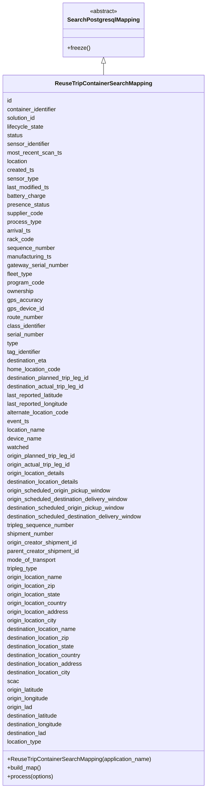

# Diagram: container_tracking_core/container_tracking_service/container_tracking_service/persistence_adapter/postgresql/ReuseTripContainerSearchMapping.py

> Auto-generated by Obscura crawlers

## Mermaid

### SVG

<svg id="container" width="570.7578125" xmlns="http://www.w3.org/2000/svg" class="classDiagram" height="2184" viewBox="0 0 570.7578125 2184" role="graphics-document document" aria-roledescription="class"><g><defs><marker id="container_class-aggregationStart" class="marker aggregation class" refX="18" refY="7" markerWidth="190" markerHeight="240" orient="auto"><path d="M 18,7 L9,13 L1,7 L9,1 Z"></path></marker></defs><defs><marker id="container_class-aggregationEnd" class="marker aggregation class" refX="1" refY="7" markerWidth="20" markerHeight="28" orient="auto"><path d="M 18,7 L9,13 L1,7 L9,1 Z"></path></marker></defs><defs><marker id="container_class-extensionStart" class="marker extension class" refX="18" refY="7" markerWidth="190" markerHeight="240" orient="auto"><path d="M 1,7 L18,13 V 1 Z"></path></marker></defs><defs><marker id="container_class-extensionEnd" class="marker extension class" refX="1" refY="7" markerWidth="20" markerHeight="28" orient="auto"><path d="M 1,1 V 13 L18,7 Z"></path></marker></defs><defs><marker id="container_class-compositionStart" class="marker composition class" refX="18" refY="7" markerWidth="190" markerHeight="240" orient="auto"><path d="M 18,7 L9,13 L1,7 L9,1 Z"></path></marker></defs><defs><marker id="container_class-compositionEnd" class="marker composition class" refX="1" refY="7" markerWidth="20" markerHeight="28" orient="auto"><path d="M 18,7 L9,13 L1,7 L9,1 Z"></path></marker></defs><defs><marker id="container_class-dependencyStart" class="marker dependency class" refX="6" refY="7" markerWidth="190" markerHeight="240" orient="auto"><path d="M 5,7 L9,13 L1,7 L9,1 Z"></path></marker></defs><defs><marker id="container_class-dependencyEnd" class="marker dependency class" refX="13" refY="7" markerWidth="20" markerHeight="28" orient="auto"><path d="M 18,7 L9,13 L14,7 L9,1 Z"></path></marker></defs><defs><marker id="container_class-lollipopStart" class="marker lollipop class" refX="13" refY="7" markerWidth="190" markerHeight="240" orient="auto"><circle stroke="black" fill="transparent" cx="7" cy="7" r="6"></circle></marker></defs><defs><marker id="container_class-lollipopEnd" class="marker lollipop class" refX="1" refY="7" markerWidth="190" markerHeight="240" orient="auto"><circle stroke="black" fill="transparent" cx="7" cy="7" r="6"></circle></marker></defs><g class="root"><g class="clusters"></g><g class="edgePaths"><path d="M285.379,175.25L285.379,176.542C285.379,177.833,285.379,180.417,285.379,185.875C285.379,191.333,285.379,199.667,285.379,203.833L285.379,208" id="id_SearchPostgresqlMapping_ReuseTripContainerSearchMapping_1" class="edge-thickness-normal edge-pattern-solid relation" style=";;;" data-edge="true" data-et="edge" data-id="id_SearchPostgresqlMapping_ReuseTripContainerSearchMapping_1" data-points="W3sieCI6Mjg1LjM3ODkwNjI1LCJ5IjoxNTh9LHsieCI6Mjg1LjM3ODkwNjI1LCJ5IjoxODN9LHsieCI6Mjg1LjM3ODkwNjI1LCJ5IjoyMDh9XQ==" marker-start="url(#container_class-extensionStart)"></path></g><g class="edgeLabels"><g class="edgeLabel"><g class="label" data-id="id_SearchPostgresqlMapping_ReuseTripContainerSearchMapping_1" transform="translate(0, 0)"><foreignObject width="0" height="0">

</foreignObject></g></g></g><g class="nodes"><g class="node default" id="classId-SearchPostgresqlMapping-0" transform="translate(285.37890625, 83)"><g class="basic label-container"><path d="M-107.1171875 -75 L107.1171875 -75 L107.1171875 75 L-107.1171875 75" stroke="none" stroke-width="0" fill="#ECECFF" style=""></path><path d="M-107.1171875 -75 C-36.771119384915096 -75, 33.57494873016981 -75, 107.1171875 -75 M-107.1171875 -75 C-28.231316908265484 -75, 50.65455368346903 -75, 107.1171875 -75 M107.1171875 -75 C107.1171875 -21.027889235778247, 107.1171875 32.94422152844351, 107.1171875 75 M107.1171875 -75 C107.1171875 -20.430592252003656, 107.1171875 34.13881549599269, 107.1171875 75 M107.1171875 75 C42.901508720876805 75, -21.31417005824639 75, -107.1171875 75 M107.1171875 75 C38.341726044062256 75, -30.43373541187549 75, -107.1171875 75 M-107.1171875 75 C-107.1171875 30.231692385540825, -107.1171875 -14.53661522891835, -107.1171875 -75 M-107.1171875 75 C-107.1171875 37.523332378294846, -107.1171875 0.04666475658969205, -107.1171875 -75" stroke="#9370DB" stroke-width="1.3" fill="none" stroke-dasharray="0 0" style=""></path></g><g class="annotation-group text" transform="translate(-38.609375, -51)"><g class="label" style="" transform="translate(0,-12)"><foreignObject width="77.21875" height="24">

«abstract»

</foreignObject></g></g><g class="label-group text" transform="translate(-95.1171875, -27)"><g class="label" style="font-weight: bolder" transform="translate(0,-12)"><foreignObject width="190.234375" height="24">

SearchPostgresqlMapping

</foreignObject></g></g><g class="members-group text" transform="translate(-95.1171875, 21)"></g><g class="methods-group text" transform="translate(-95.1171875, 51)"><g class="label" style="" transform="translate(0,-12)"><foreignObject width="62.109375" height="24">

+freeze()

</foreignObject></g></g><g class="divider" style=""><path d="M-107.1171875 -3 C-45.81687867062299 -3, 15.483430158754018 -3, 107.1171875 -3 M-107.1171875 -3 C-26.330125570452935 -3, 54.45693635909413 -3, 107.1171875 -3" stroke="#9370DB" stroke-width="1.3" fill="none" stroke-dasharray="0 0" style=""></path></g><g class="divider" style=""><path d="M-107.1171875 21 C-38.15750234775747 21, 30.802182804485057 21, 107.1171875 21 M-107.1171875 21 C-56.12968268191824 21, -5.14217786383648 21, 107.1171875 21" stroke="#9370DB" stroke-width="1.3" fill="none" stroke-dasharray="0 0" style=""></path></g></g><g class="node default" id="classId-ReuseTripContainerSearchMapping-1" transform="translate(285.37890625, 1192)"><g class="basic label-container"><path d="M-277.37890625 -984 L277.37890625 -984 L277.37890625 984 L-277.37890625 984" stroke="none" stroke-width="0" fill="#ECECFF" style=""></path><path d="M-277.37890625 -984 C-139.90000354484127 -984, -2.4211008396825378 -984, 277.37890625 -984 M-277.37890625 -984 C-113.51597490455114 -984, 50.34695644089771 -984, 277.37890625 -984 M277.37890625 -984 C277.37890625 -451.74105262877265, 277.37890625 80.5178947424547, 277.37890625 984 M277.37890625 -984 C277.37890625 -526.5056538007927, 277.37890625 -69.01130760158549, 277.37890625 984 M277.37890625 984 C157.86309160977925 984, 38.347276969558465 984, -277.37890625 984 M277.37890625 984 C56.65250165386817 984, -164.07390294226366 984, -277.37890625 984 M-277.37890625 984 C-277.37890625 576.5977859497589, -277.37890625 169.19557189951786, -277.37890625 -984 M-277.37890625 984 C-277.37890625 459.0460701201529, -277.37890625 -65.90785975969425, -277.37890625 -984" stroke="#9370DB" stroke-width="1.3" fill="none" stroke-dasharray="0 0" style=""></path></g><g class="annotation-group text" transform="translate(0, -960)"></g><g class="label-group text" transform="translate(-128.2265625, -960)"><g class="label" style="font-weight: bolder" transform="translate(0,-12)"><foreignObject width="256.453125" height="24">

ReuseTripContainerSearchMapping

</foreignObject></g></g><g class="members-group text" transform="translate(-265.37890625, -912)"><g class="label" style="" transform="translate(0,-12)"><foreignObject width="14.09375" height="24">

id

</foreignObject></g><g class="label" style="" transform="translate(0,12)"><foreignObject width="142.8125" height="24">

container_identifier

</foreignObject></g><g class="label" style="" transform="translate(0,36)"><foreignObject width="82.234375" height="24">

solution_id

</foreignObject></g><g class="label" style="" transform="translate(0,60)"><foreignObject width="103.65625" height="24">

lifecycle_state

</foreignObject></g><g class="label" style="" transform="translate(0,84)"><foreignObject width="44.40625" height="24">

status

</foreignObject></g><g class="label" style="" transform="translate(0,108)"><foreignObject width="122.171875" height="24">

sensor_identifier

</foreignObject></g><g class="label" style="" transform="translate(0,132)"><foreignObject width="152.859375" height="24">

most_recent_scan_ts

</foreignObject></g><g class="label" style="" transform="translate(0,156)"><foreignObject width="59.15625" height="24">

location

</foreignObject></g><g class="label" style="" transform="translate(0,180)"><foreignObject width="75.6875" height="24">

created_ts

</foreignObject></g><g class="label" style="" transform="translate(0,204)"><foreignObject width="87.078125" height="24">

sensor_type

</foreignObject></g><g class="label" style="" transform="translate(0,228)"><foreignObject width="120.59375" height="24">

last_modified_ts

</foreignObject></g><g class="label" style="" transform="translate(0,252)"><foreignObject width="108.109375" height="24">

battery_charge

</foreignObject></g><g class="label" style="" transform="translate(0,276)"><foreignObject width="117.9375" height="24">

presence_status

</foreignObject></g><g class="label" style="" transform="translate(0,300)"><foreignObject width="101.578125" height="24">

supplier_code

</foreignObject></g><g class="label" style="" transform="translate(0,324)"><foreignObject width="94.859375" height="24">

process_type

</foreignObject></g><g class="label" style="" transform="translate(0,348)"><foreignObject width="67.671875" height="24">

arrival_ts

</foreignObject></g><g class="label" style="" transform="translate(0,372)"><foreignObject width="73.125" height="24">

rack_code

</foreignObject></g><g class="label" style="" transform="translate(0,396)"><foreignObject width="134.03125" height="24">

sequence_number

</foreignObject></g><g class="label" style="" transform="translate(0,420)"><foreignObject width="127.25" height="24">

manufacturing_ts

</foreignObject></g><g class="label" style="" transform="translate(0,444)"><foreignObject width="171.671875" height="24">

gateway_serial_number

</foreignObject></g><g class="label" style="" transform="translate(0,468)"><foreignObject width="72.40625" height="24">

fleet_type

</foreignObject></g><g class="label" style="" transform="translate(0,492)"><foreignObject width="103.859375" height="24">

program_code

</foreignObject></g><g class="label" style="" transform="translate(0,516)"><foreignObject width="75.71875" height="24">

ownership

</foreignObject></g><g class="label" style="" transform="translate(0,540)"><foreignObject width="95.65625" height="24">

gps_accuracy

</foreignObject></g><g class="label" style="" transform="translate(0,564)"><foreignObject width="101.71875" height="24">

gps_device_id

</foreignObject></g><g class="label" style="" transform="translate(0,588)"><foreignObject width="103.421875" height="24">

route_number

</foreignObject></g><g class="label" style="" transform="translate(0,612)"><foreignObject width="110.15625" height="24">

class_identifier

</foreignObject></g><g class="label" style="" transform="translate(0,636)"><foreignObject width="105.234375" height="24">

serial_number

</foreignObject></g><g class="label" style="" transform="translate(0,660)"><foreignObject width="31.796875" height="24">

type

</foreignObject></g><g class="label" style="" transform="translate(0,684)"><foreignObject width="97.484375" height="24">

tag_identifier

</foreignObject></g><g class="label" style="" transform="translate(0,708)"><foreignObject width="114.234375" height="24">

destination_eta

</foreignObject></g><g class="label" style="" transform="translate(0,732)"><foreignObject width="151.109375" height="24">

home_location_code

</foreignObject></g><g class="label" style="" transform="translate(0,756)"><foreignObject width="237.234375" height="24">

destination_planned_trip_leg_id

</foreignObject></g><g class="label" style="" transform="translate(0,780)"><foreignObject width="221.734375" height="24">

destination_actual_trip_leg_id

</foreignObject></g><g class="label" style="" transform="translate(0,804)"><foreignObject width="163.125" height="24">

last_reported_latitude

</foreignObject></g><g class="label" style="" transform="translate(0,828)"><foreignObject width="175.6875" height="24">

last_reported_longitude

</foreignObject></g><g class="label" style="" transform="translate(0,852)"><foreignObject width="175.953125" height="24">

alternate_location_code

</foreignObject></g><g class="label" style="" transform="translate(0,876)"><foreignObject width="61.59375" height="24">

event_ts

</foreignObject></g><g class="label" style="" transform="translate(0,900)"><foreignObject width="107.984375" height="24">

location_name

</foreignObject></g><g class="label" style="" transform="translate(0,924)"><foreignObject width="95.171875" height="24">

device_name

</foreignObject></g><g class="label" style="" transform="translate(0,948)"><foreignObject width="60.84375" height="24">

watched

</foreignObject></g><g class="label" style="" transform="translate(0,972)"><foreignObject width="196.34375" height="24">

origin_planned_trip_leg_id

</foreignObject></g><g class="label" style="" transform="translate(0,996)"><foreignObject width="180.84375" height="24">

origin_actual_trip_leg_id

</foreignObject></g><g class="label" style="" transform="translate(0,1020)"><foreignObject width="166.890625" height="24">

origin_location_details

</foreignObject></g><g class="label" style="" transform="translate(0,1044)"><foreignObject width="207.78125" height="24">

destination_location_details

</foreignObject></g><g class="label" style="" transform="translate(0,1068)"><foreignObject width="296.109375" height="24">

origin_scheduled_origin_pickup_window

</foreignObject></g><g class="label" style="" transform="translate(0,1092)"><foreignObject width="346.03125" height="24">

origin_scheduled_destination_delivery_window

</foreignObject></g><g class="label" style="" transform="translate(0,1116)"><foreignObject width="337" height="24">

destination_scheduled_origin_pickup_window

</foreignObject></g><g class="label" style="" transform="translate(0,1140)"><foreignObject width="386.921875" height="24">

destination_scheduled_destination_delivery_window

</foreignObject></g><g class="label" style="" transform="translate(0,1164)"><foreignObject width="190.03125" height="24">

tripleg_sequence_number

</foreignObject></g><g class="label" style="" transform="translate(0,1188)"><foreignObject width="133.578125" height="24">

shipment_number

</foreignObject></g><g class="label" style="" transform="translate(0,1212)"><foreignObject width="199.796875" height="24">

origin_creator_shipment_id

</foreignObject></g><g class="label" style="" transform="translate(0,1236)"><foreignObject width="205.171875" height="24">

parent_creator_shipment_id

</foreignObject></g><g class="label" style="" transform="translate(0,1260)"><foreignObject width="139" height="24">

mode_of_transport

</foreignObject></g><g class="label" style="" transform="translate(0,1284)"><foreignObject width="87.484375" height="24">

tripleg_type

</foreignObject></g><g class="label" style="" transform="translate(0,1308)"><foreignObject width="158.390625" height="24">

origin_location_name

</foreignObject></g><g class="label" style="" transform="translate(0,1332)"><foreignObject width="138.890625" height="24">

origin_location_zip

</foreignObject></g><g class="label" style="" transform="translate(0,1356)"><foreignObject width="153.96875" height="24">

origin_location_state

</foreignObject></g><g class="label" style="" transform="translate(0,1380)"><foreignObject width="172.75" height="24">

origin_location_country

</foreignObject></g><g class="label" style="" transform="translate(0,1404)"><foreignObject width="174.59375" height="24">

origin_location_address

</foreignObject></g><g class="label" style="" transform="translate(0,1428)"><foreignObject width="143.28125" height="24">

origin_location_city

</foreignObject></g><g class="label" style="" transform="translate(0,1452)"><foreignObject width="199.28125" height="24">

destination_location_name

</foreignObject></g><g class="label" style="" transform="translate(0,1476)"><foreignObject width="179.78125" height="24">

destination_location_zip

</foreignObject></g><g class="label" style="" transform="translate(0,1500)"><foreignObject width="194.875" height="24">

destination_location_state

</foreignObject></g><g class="label" style="" transform="translate(0,1524)"><foreignObject width="213.640625" height="24">

destination_location_country

</foreignObject></g><g class="label" style="" transform="translate(0,1548)"><foreignObject width="215.5" height="24">

destination_location_address

</foreignObject></g><g class="label" style="" transform="translate(0,1572)"><foreignObject width="184.1875" height="24">

destination_location_city

</foreignObject></g><g class="label" style="" transform="translate(0,1596)"><foreignObject width="31.3125" height="24">

scac

</foreignObject></g><g class="label" style="" transform="translate(0,1620)"><foreignObject width="107.390625" height="24">

origin_latitude

</foreignObject></g><g class="label" style="" transform="translate(0,1644)"><foreignObject width="119.9375" height="24">

origin_longitude

</foreignObject></g><g class="label" style="" transform="translate(0,1668)"><foreignObject width="73.28125" height="24">

origin_lad

</foreignObject></g><g class="label" style="" transform="translate(0,1692)"><foreignObject width="148.28125" height="24">

destination_latitude

</foreignObject></g><g class="label" style="" transform="translate(0,1716)"><foreignObject width="160.84375" height="24">

destination_longitude

</foreignObject></g><g class="label" style="" transform="translate(0,1740)"><foreignObject width="114.1875" height="24">

destination_lad

</foreignObject></g><g class="label" style="" transform="translate(0,1764)"><foreignObject width="98.953125" height="24">

location_type

</foreignObject></g></g><g class="methods-group text" transform="translate(-265.37890625, 912)"><g class="label" style="" transform="translate(0,-12)"><foreignObject width="402.53125" height="24">

+ReuseTripContainerSearchMapping(application_name)

</foreignObject></g><g class="label" style="" transform="translate(0,12)"><foreignObject width="96.109375" height="24">

+build_map()

</foreignObject></g><g class="label" style="" transform="translate(0,36)"><foreignObject width="129.0625" height="24">

+process(options)

</foreignObject></g></g><g class="divider" style=""><path d="M-277.37890625 -936 C-60.57875836937649 -936, 156.22138951124703 -936, 277.37890625 -936 M-277.37890625 -936 C-59.70520620450347 -936, 157.96849384099306 -936, 277.37890625 -936" stroke="#9370DB" stroke-width="1.3" fill="none" stroke-dasharray="0 0" style=""></path></g><g class="divider" style=""><path d="M-277.37890625 888 C-65.39499115720503 888, 146.58892393558995 888, 277.37890625 888 M-277.37890625 888 C-158.05156222606735 888, -38.72421820213469 888, 277.37890625 888" stroke="#9370DB" stroke-width="1.3" fill="none" stroke-dasharray="0 0" style=""></path></g></g></g></g></g></svg>
