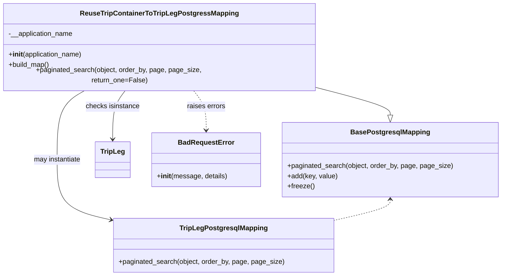

# Diagram: container_tracking_core/container_tracking_service/container_tracking_service/persistence_adapter/postgresql/ReuseTripContainerToTripLegPostgresMapping.py


> Auto-generated by Obscura crawlers

## Diagram 1



### SVG

<svg id="container" width="1151.44921875" xmlns="http://www.w3.org/2000/svg" class="classDiagram" height="632" viewBox="0 0 1151.44921875 632" role="graphics-document document" aria-roledescription="class"><style>#container{font-family:"trebuchet ms",verdana,arial,sans-serif;font-size:16px;fill:#333;}@keyframes edge-animation-frame{from{stroke-dashoffset:0;}}@keyframes dash{to{stroke-dashoffset:0;}}#container .edge-animation-slow{stroke-dasharray:9,5!important;stroke-dashoffset:900;animation:dash 50s linear infinite;stroke-linecap:round;}#container .edge-animation-fast{stroke-dasharray:9,5!important;stroke-dashoffset:900;animation:dash 20s linear infinite;stroke-linecap:round;}#container .error-icon{fill:#552222;}#container .error-text{fill:#552222;stroke:#552222;}#container .edge-thickness-normal{stroke-width:1px;}#container .edge-thickness-thick{stroke-width:3.5px;}#container .edge-pattern-solid{stroke-dasharray:0;}#container .edge-thickness-invisible{stroke-width:0;fill:none;}#container .edge-pattern-dashed{stroke-dasharray:3;}#container .edge-pattern-dotted{stroke-dasharray:2;}#container .marker{fill:#333333;stroke:#333333;}#container .marker.cross{stroke:#333333;}#container svg{font-family:"trebuchet ms",verdana,arial,sans-serif;font-size:16px;}#container p{margin:0;}#container g.classGroup text{fill:#9370DB;stroke:none;font-family:"trebuchet ms",verdana,arial,sans-serif;font-size:10px;}#container g.classGroup text .title{font-weight:bolder;}#container .nodeLabel,#container .edgeLabel{color:#131300;}#container .edgeLabel .label rect{fill:#ECECFF;}#container .label text{fill:#131300;}#container .labelBkg{background:#ECECFF;}#container .edgeLabel .label span{background:#ECECFF;}#container .classTitle{font-weight:bolder;}#container .node rect,#container .node circle,#container .node ellipse,#container .node polygon,#container .node path{fill:#ECECFF;stroke:#9370DB;stroke-width:1px;}#container .divider{stroke:#9370DB;stroke-width:1;}#container g.clickable{cursor:pointer;}#container g.classGroup rect{fill:#ECECFF;stroke:#9370DB;}#container g.classGroup line{stroke:#9370DB;stroke-width:1;}#container .classLabel .box{stroke:none;stroke-width:0;fill:#ECECFF;opacity:0.5;}#container .classLabel .label{fill:#9370DB;font-size:10px;}#container .relation{stroke:#333333;stroke-width:1;fill:none;}#container .dashed-line{stroke-dasharray:3;}#container .dotted-line{stroke-dasharray:1 2;}#container #compositionStart,#container .composition{fill:#333333!important;stroke:#333333!important;stroke-width:1;}#container #compositionEnd,#container .composition{fill:#333333!important;stroke:#333333!important;stroke-width:1;}#container #dependencyStart,#container .dependency{fill:#333333!important;stroke:#333333!important;stroke-width:1;}#container #dependencyStart,#container .dependency{fill:#333333!important;stroke:#333333!important;stroke-width:1;}#container #extensionStart,#container .extension{fill:transparent!important;stroke:#333333!important;stroke-width:1;}#container #extensionEnd,#container .extension{fill:transparent!important;stroke:#333333!important;stroke-width:1;}#container #aggregationStart,#container .aggregation{fill:transparent!important;stroke:#333333!important;stroke-width:1;}#container #aggregationEnd,#container .aggregation{fill:transparent!important;stroke:#333333!important;stroke-width:1;}#container #lollipopStart,#container .lollipop{fill:#ECECFF!important;stroke:#333333!important;stroke-width:1;}#container #lollipopEnd,#container .lollipop{fill:#ECECFF!important;stroke:#333333!important;stroke-width:1;}#container .edgeTerminals{font-size:11px;line-height:initial;}#container .classTitleText{text-anchor:middle;font-size:18px;fill:#333;}#container .label-icon{display:inline-block;height:1em;overflow:visible;vertical-align:-0.125em;}#container .node .label-icon path{fill:currentColor;stroke:revert;stroke-width:revert;}#container :root{--mermaid-font-family:"trebuchet ms",verdana,arial,sans-serif;}</style><g><defs><marker id="container_class-aggregationStart" class="marker aggregation class" refX="18" refY="7" markerWidth="190" markerHeight="240" orient="auto"><path d="M 18,7 L9,13 L1,7 L9,1 Z"></path></marker></defs><defs><marker id="container_class-aggregationEnd" class="marker aggregation class" refX="1" refY="7" markerWidth="20" markerHeight="28" orient="auto"><path d="M 18,7 L9,13 L1,7 L9,1 Z"></path></marker></defs><defs><marker id="container_class-extensionStart" class="marker extension class" refX="18" refY="7" markerWidth="190" markerHeight="240" orient="auto"><path d="M 1,7 L18,13 V 1 Z"></path></marker></defs><defs><marker id="container_class-extensionEnd" class="marker extension class" refX="1" refY="7" markerWidth="20" markerHeight="28" orient="auto"><path d="M 1,1 V 13 L18,7 Z"></path></marker></defs><defs><marker id="container_class-compositionStart" class="marker composition class" refX="18" refY="7" markerWidth="190" markerHeight="240" orient="auto"><path d="M 18,7 L9,13 L1,7 L9,1 Z"></path></marker></defs><defs><marker id="container_class-compositionEnd" class="marker composition class" refX="1" refY="7" markerWidth="20" markerHeight="28" orient="auto"><path d="M 18,7 L9,13 L1,7 L9,1 Z"></path></marker></defs><defs><marker id="container_class-dependencyStart" class="marker dependency class" refX="6" refY="7" markerWidth="190" markerHeight="240" orient="auto"><path d="M 5,7 L9,13 L1,7 L9,1 Z"></path></marker></defs><defs><marker id="container_class-dependencyEnd" class="marker dependency class" refX="13" refY="7" markerWidth="20" markerHeight="28" orient="auto"><path d="M 18,7 L9,13 L14,7 L9,1 Z"></path></marker></defs><defs><marker id="container_class-lollipopStart" class="marker lollipop class" refX="13" refY="7" markerWidth="190" markerHeight="240" orient="auto"><circle stroke="black" fill="transparent" cx="7" cy="7" r="6"></circle></marker></defs><defs><marker id="container_class-lollipopEnd" class="marker lollipop class" refX="1" refY="7" markerWidth="190" markerHeight="240" orient="auto"><circle stroke="black" fill="transparent" cx="7" cy="7" r="6"></circle></marker></defs><g class="root"><g class="clusters"></g><g class="edgePaths"><path d="M723.891,193.945L752.447,201.121C781.004,208.297,838.117,222.648,866.674,233.116C895.23,243.583,895.23,250.167,895.23,253.458L895.23,256.75" id="id_ReuseTripContainerToTripLegPostgressMapping_BasePostgresqlMapping_1" class="edge-thickness-normal edge-pattern-solid relation" style=";;;" data-edge="true" data-et="edge" data-id="id_ReuseTripContainerToTripLegPostgressMapping_BasePostgresqlMapping_1" data-points="W3sieCI6NzIzLjg5MDYyNSwieSI6MTkzLjk0NTMyNzIwMjgxNjMyfSx7IngiOjg5NS4yMzA0Njg3NSwieSI6MjM3fSx7IngiOjg5NS4yMzA0Njg3NSwieSI6Mjc0fV0=" marker-end="url(#container_class-extensionEnd)"></path><path d="M194.818,200L183.826,206.167C172.833,212.333,150.848,224.667,139.856,251.5C128.863,278.333,128.863,319.667,128.863,359C128.863,398.333,128.863,435.667,149.589,459.093C170.314,482.519,211.764,492.039,232.489,496.798L253.215,501.558" id="id_ReuseTripContainerToTripLegPostgressMapping_TripLegPostgresqlMapping_2" class="edge-thickness-normal edge-pattern-solid relation" style=";;;" data-edge="true" data-et="edge" data-id="id_ReuseTripContainerToTripLegPostgressMapping_TripLegPostgresqlMapping_2" data-points="W3sieCI6MTk0LjgxODQzMjgwMDc1MTg4LCJ5IjoyMDB9LHsieCI6MTI4Ljg2MzI4MTI1LCJ5IjoyMzd9LHsieCI6MTI4Ljg2MzI4MTI1LCJ5IjozNjF9LHsieCI6MTI4Ljg2MzI4MTI1LCJ5Ijo0NzN9LHsieCI6MjU5LjA2MjUsInkiOjUwMi45MDA4OTE5OTI0NTYzfV0=" marker-end="url(#container_class-dependencyEnd)"></path><path d="M288.924,200L283.976,206.167C279.029,212.333,269.133,224.667,264.186,243.5C259.238,262.333,259.238,287.667,259.238,300.333L259.238,313" id="id_ReuseTripContainerToTripLegPostgressMapping_TripLeg_3" class="edge-thickness-normal edge-pattern-solid relation" style=";;;" data-edge="true" data-et="edge" data-id="id_ReuseTripContainerToTripLegPostgressMapping_TripLeg_3" data-points="W3sieCI6Mjg4LjkyMzY5NTk1ODY0NjYsInkiOjIwMH0seyJ4IjoyNTkuMjM4MjgxMjUsInkiOjIzN30seyJ4IjoyNTkuMjM4MjgxMjUsInkiOjMxOX1d" marker-end="url(#container_class-dependencyEnd)"></path><path d="M442.967,200L447.914,206.167C452.862,212.333,462.757,224.667,467.705,240C472.652,255.333,472.652,273.667,472.652,282.833L472.652,292" id="id_ReuseTripContainerToTripLegPostgressMapping_BadRequestError_4" class="edge-thickness-normal edge-pattern-dashed relation" style=";;;" data-edge="true" data-et="edge" data-id="id_ReuseTripContainerToTripLegPostgressMapping_BadRequestError_4" data-points="W3sieCI6NDQyLjk2NjkyOTA0MTM1MzQsInkiOjIwMH0seyJ4Ijo0NzIuNjUyMzQzNzUsInkiOjIzN30seyJ4Ijo0NzIuNjUyMzQzNzUsInkiOjI5OH1d" marker-end="url(#container_class-dependencyEnd)"></path><path d="M895.23,454L895.23,457.167C895.23,460.333,895.23,466.667,873.531,474.817C851.831,482.967,808.431,492.934,786.731,497.917L765.031,502.901" id="id_BasePostgresqlMapping_TripLegPostgresqlMapping_5" class="edge-thickness-normal edge-pattern-dashed relation" style=";;;" data-edge="true" data-et="edge" data-id="id_BasePostgresqlMapping_TripLegPostgresqlMapping_5" data-points="W3sieCI6ODk1LjIzMDQ2ODc1LCJ5Ijo0NDh9LHsieCI6ODk1LjIzMDQ2ODc1LCJ5Ijo0NzN9LHsieCI6NzY1LjAzMTI1LCJ5Ijo1MDIuOTAwODkxOTkyNDU2M31d" marker-start="url(#container_class-dependencyStart)"></path></g><g class="edgeLabels"><g class="edgeLabel"><g class="label" data-id="id_ReuseTripContainerToTripLegPostgressMapping_BasePostgresqlMapping_1" transform="translate(0, 0)"><foreignObject width="0" height="0"><div xmlns="http://www.w3.org/1999/xhtml" class="labelBkg" style="display: table-cell; white-space: nowrap; line-height: 1.5; max-width: 200px; text-align: center;"><span class="edgeLabel"></span></div></foreignObject></g></g><g class="edgeLabel" transform="translate(128.86328125, 361)"><g class="label" data-id="id_ReuseTripContainerToTripLegPostgressMapping_TripLegPostgresqlMapping_2" transform="translate(-56.3203125, -12)"><foreignObject width="112.640625" height="24"><div xmlns="http://www.w3.org/1999/xhtml" class="labelBkg" style="display: table-cell; white-space: nowrap; line-height: 1.5; max-width: 200px; text-align: center;"><span class="edgeLabel"><p>may instantiate</p></span></div></foreignObject></g></g><g class="edgeLabel" transform="translate(259.23828125, 237)"><g class="label" data-id="id_ReuseTripContainerToTripLegPostgressMapping_TripLeg_3" transform="translate(-63.1796875, -12)"><foreignObject width="126.359375" height="24"><div xmlns="http://www.w3.org/1999/xhtml" class="labelBkg" style="display: table-cell; white-space: nowrap; line-height: 1.5; max-width: 200px; text-align: center;"><span class="edgeLabel"><p>checks isinstance</p></span></div></foreignObject></g></g><g class="edgeLabel" transform="translate(472.65234375, 237)"><g class="label" data-id="id_ReuseTripContainerToTripLegPostgressMapping_BadRequestError_4" transform="translate(-45.046875, -12)"><foreignObject width="90.09375" height="24"><div xmlns="http://www.w3.org/1999/xhtml" class="labelBkg" style="display: table-cell; white-space: nowrap; line-height: 1.5; max-width: 200px; text-align: center;"><span class="edgeLabel"><p>raises errors</p></span></div></foreignObject></g></g><g class="edgeLabel"><g class="label" data-id="id_BasePostgresqlMapping_TripLegPostgresqlMapping_5" transform="translate(0, 0)"><foreignObject width="0" height="0"><div xmlns="http://www.w3.org/1999/xhtml" class="labelBkg" style="display: table-cell; white-space: nowrap; line-height: 1.5; max-width: 200px; text-align: center;"><span class="edgeLabel"></span></div></foreignObject></g></g></g><g class="nodes"><g class="node default" id="classId-BasePostgresqlMapping-0" transform="translate(895.23046875, 361)"><g class="basic label-container"><path d="M-248.21875 -87 L248.21875 -87 L248.21875 87 L-248.21875 87" stroke="none" stroke-width="0" fill="#ECECFF" style=""></path><path d="M-248.21875 -87 C-132.33121665808 -87, -16.44368331616002 -87, 248.21875 -87 M-248.21875 -87 C-86.34484328252816 -87, 75.52906343494368 -87, 248.21875 -87 M248.21875 -87 C248.21875 -17.95208296720054, 248.21875 51.09583406559892, 248.21875 87 M248.21875 -87 C248.21875 -25.41409762178985, 248.21875 36.1718047564203, 248.21875 87 M248.21875 87 C121.25509732812695 87, -5.708555343746099 87, -248.21875 87 M248.21875 87 C124.19059504418678 87, 0.1624400883735575 87, -248.21875 87 M-248.21875 87 C-248.21875 45.041893796267956, -248.21875 3.083787592535913, -248.21875 -87 M-248.21875 87 C-248.21875 27.984979812700203, -248.21875 -31.030040374599594, -248.21875 -87" stroke="#9370DB" stroke-width="1.3" fill="none" stroke-dasharray="0 0" style=""></path></g><g class="annotation-group text" transform="translate(0, -63)"></g><g class="label-group text" transform="translate(-87.921875, -63)"><g class="label" style="font-weight: bolder" transform="translate(0,-12)"><foreignObject width="175.84375" height="24"><div xmlns="http://www.w3.org/1999/xhtml" style="display: table-cell; white-space: nowrap; line-height: 1.5; max-width: 223px; text-align: center;"><span class="nodeLabel markdown-node-label" style=""><p>BasePostgresqlMapping</p></span></div></foreignObject></g></g><g class="members-group text" transform="translate(-236.21875, -15)"></g><g class="methods-group text" transform="translate(-236.21875, 15)"><g class="label" style="" transform="translate(0,-12)"><foreignObject width="384.515625" height="24"><div xmlns="http://www.w3.org/1999/xhtml" style="display: table-cell; white-space: nowrap; line-height: 1.5; max-width: 442px; text-align: center;"><span class="nodeLabel markdown-node-label" style=""><p>+paginated_search(object, order_by, page, page_size)</p></span></div></foreignObject></g><g class="label" style="" transform="translate(0,12)"><foreignObject width="116.859375" height="24"><div xmlns="http://www.w3.org/1999/xhtml" style="display: table-cell; white-space: nowrap; line-height: 1.5; max-width: 174px; text-align: center;"><span class="nodeLabel markdown-node-label" style=""><p>+add(key, value)</p></span></div></foreignObject></g><g class="label" style="" transform="translate(0,36)"><foreignObject width="62.109375" height="24"><div xmlns="http://www.w3.org/1999/xhtml" style="display: table-cell; white-space: nowrap; line-height: 1.5; max-width: 119px; text-align: center;"><span class="nodeLabel markdown-node-label" style=""><p>+freeze()</p></span></div></foreignObject></g></g><g class="divider" style=""><path d="M-248.21875 -39 C-135.6039872647853 -39, -22.989224529570578 -39, 248.21875 -39 M-248.21875 -39 C-147.51513429596042 -39, -46.811518591920816 -39, 248.21875 -39" stroke="#9370DB" stroke-width="1.3" fill="none" stroke-dasharray="0 0" style=""></path></g><g class="divider" style=""><path d="M-248.21875 -15 C-146.67378757446136 -15, -45.12882514892274 -15, 248.21875 -15 M-248.21875 -15 C-133.09761074111685 -15, -17.976471482233677 -15, 248.21875 -15" stroke="#9370DB" stroke-width="1.3" fill="none" stroke-dasharray="0 0" style=""></path></g></g><g class="node default" id="classId-ReuseTripContainerToTripLegPostgressMapping-1" transform="translate(365.9453125, 104)"><g class="basic label-container"><path d="M-357.9453125 -96 L357.9453125 -96 L357.9453125 96 L-357.9453125 96" stroke="none" stroke-width="0" fill="#ECECFF" style=""></path><path d="M-357.9453125 -96 C-111.26550440938615 -96, 135.4143036812277 -96, 357.9453125 -96 M-357.9453125 -96 C-188.4198551877723 -96, -18.8943978755446 -96, 357.9453125 -96 M357.9453125 -96 C357.9453125 -53.31284355510895, 357.9453125 -10.625687110217896, 357.9453125 96 M357.9453125 -96 C357.9453125 -55.24878121310152, 357.9453125 -14.497562426203046, 357.9453125 96 M357.9453125 96 C162.28615864095366 96, -33.37299521809268 96, -357.9453125 96 M357.9453125 96 C186.62144091481085 96, 15.297569329621695 96, -357.9453125 96 M-357.9453125 96 C-357.9453125 32.67317716052428, -357.9453125 -30.653645678951435, -357.9453125 -96 M-357.9453125 96 C-357.9453125 26.726056372907465, -357.9453125 -42.54788725418507, -357.9453125 -96" stroke="#9370DB" stroke-width="1.3" fill="none" stroke-dasharray="0 0" style=""></path></g><g class="annotation-group text" transform="translate(0, -72)"></g><g class="label-group text" transform="translate(-174.640625, -72)"><g class="label" style="font-weight: bolder" transform="translate(0,-12)"><foreignObject width="349.28125" height="24"><div xmlns="http://www.w3.org/1999/xhtml" style="display: table-cell; white-space: nowrap; line-height: 1.5; max-width: 393px; text-align: center;"><span class="nodeLabel markdown-node-label" style=""><p>ReuseTripContainerToTripLegPostgressMapping</p></span></div></foreignObject></g></g><g class="members-group text" transform="translate(-345.9453125, -24)"><g class="label" style="" transform="translate(0,-12)"><foreignObject width="152.28125" height="24"><div xmlns="http://www.w3.org/1999/xhtml" style="display: table-cell; white-space: nowrap; line-height: 1.5; max-width: 210px; text-align: center;"><span class="nodeLabel markdown-node-label" style=""><p>-__application_name</p></span></div></foreignObject></g></g><g class="methods-group text" transform="translate(-345.9453125, 24)"><g class="label" style="" transform="translate(0,-12)"><foreignObject width="173.734375" height="24"><div xmlns="http://www.w3.org/1999/xhtml" style="display: table-cell; white-space: nowrap; line-height: 1.5; max-width: 263px; text-align: center;"><span class="nodeLabel markdown-node-label" style=""><p>+<strong>init</strong>(application_name)</p></span></div></foreignObject></g><g class="label" style="" transform="translate(0,12)"><foreignObject width="96.109375" height="24"><div xmlns="http://www.w3.org/1999/xhtml" style="display: table-cell; white-space: nowrap; line-height: 1.5; max-width: 153px; text-align: center;"><span class="nodeLabel markdown-node-label" style=""><p>+build_map()</p></span></div></foreignObject></g><g class="label" style="" transform="translate(0,36)"><foreignObject width="517.25" height="24"><div xmlns="http://www.w3.org/1999/xhtml" style="display: table-cell; white-space: nowrap; line-height: 1.5; max-width: 575px; text-align: center;"><span class="nodeLabel markdown-node-label" style=""><p>+paginated_search(object, order_by, page, page_size, return_one=False)</p></span></div></foreignObject></g></g><g class="divider" style=""><path d="M-357.9453125 -48 C-183.70591518376796 -48, -9.466517867535913 -48, 357.9453125 -48 M-357.9453125 -48 C-119.45147814957105 -48, 119.04235620085791 -48, 357.9453125 -48" stroke="#9370DB" stroke-width="1.3" fill="none" stroke-dasharray="0 0" style=""></path></g><g class="divider" style=""><path d="M-357.9453125 0 C-156.85697913282212 0, 44.23135423435576 0, 357.9453125 0 M-357.9453125 0 C-169.58564221795214 0, 18.774028064095717 0, 357.9453125 0" stroke="#9370DB" stroke-width="1.3" fill="none" stroke-dasharray="0 0" style=""></path></g></g><g class="node default" id="classId-TripLegPostgresqlMapping-2" transform="translate(512.046875, 561)"><g class="basic label-container"><path d="M-252.984375 -63 L252.984375 -63 L252.984375 63 L-252.984375 63" stroke="none" stroke-width="0" fill="#ECECFF" style=""></path><path d="M-252.984375 -63 C-120.42784425305516 -63, 12.128686493889688 -63, 252.984375 -63 M-252.984375 -63 C-147.4081274148085 -63, -41.83187982961698 -63, 252.984375 -63 M252.984375 -63 C252.984375 -17.178964999163746, 252.984375 28.642070001672508, 252.984375 63 M252.984375 -63 C252.984375 -32.60252260877545, 252.984375 -2.2050452175509037, 252.984375 63 M252.984375 63 C59.561817348820995 63, -133.860740302358 63, -252.984375 63 M252.984375 63 C126.96177975584037 63, 0.939184511680736 63, -252.984375 63 M-252.984375 63 C-252.984375 13.544977926625535, -252.984375 -35.91004414674893, -252.984375 -63 M-252.984375 63 C-252.984375 30.408644461519785, -252.984375 -2.1827110769604303, -252.984375 -63" stroke="#9370DB" stroke-width="1.3" fill="none" stroke-dasharray="0 0" style=""></path></g><g class="annotation-group text" transform="translate(0, -39)"></g><g class="label-group text" transform="translate(-97.453125, -39)"><g class="label" style="font-weight: bolder" transform="translate(0,-12)"><foreignObject width="194.90625" height="24"><div xmlns="http://www.w3.org/1999/xhtml" style="display: table-cell; white-space: nowrap; line-height: 1.5; max-width: 241px; text-align: center;"><span class="nodeLabel markdown-node-label" style=""><p>TripLegPostgresqlMapping</p></span></div></foreignObject></g></g><g class="members-group text" transform="translate(-240.984375, 9)"></g><g class="methods-group text" transform="translate(-240.984375, 39)"><g class="label" style="" transform="translate(0,-12)"><foreignObject width="384.515625" height="24"><div xmlns="http://www.w3.org/1999/xhtml" style="display: table-cell; white-space: nowrap; line-height: 1.5; max-width: 442px; text-align: center;"><span class="nodeLabel markdown-node-label" style=""><p>+paginated_search(object, order_by, page, page_size)</p></span></div></foreignObject></g></g><g class="divider" style=""><path d="M-252.984375 -15 C-59.34982148864913 -15, 134.28473202270175 -15, 252.984375 -15 M-252.984375 -15 C-118.20335529498547 -15, 16.577664410029058 -15, 252.984375 -15" stroke="#9370DB" stroke-width="1.3" fill="none" stroke-dasharray="0 0" style=""></path></g><g class="divider" style=""><path d="M-252.984375 9 C-127.23758758453664 9, -1.4908001690732817 9, 252.984375 9 M-252.984375 9 C-53.63203099926153 9, 145.72031300147694 9, 252.984375 9" stroke="#9370DB" stroke-width="1.3" fill="none" stroke-dasharray="0 0" style=""></path></g></g><g class="node default" id="classId-TripLeg-3" transform="translate(259.23828125, 361)"><g class="basic label-container"><path d="M-39.0546875 -42 L39.0546875 -42 L39.0546875 42 L-39.0546875 42" stroke="none" stroke-width="0" fill="#ECECFF" style=""></path><path d="M-39.0546875 -42 C-17.475671540943956 -42, 4.103344418112087 -42, 39.0546875 -42 M-39.0546875 -42 C-19.98430054554489 -42, -0.9139135910897807 -42, 39.0546875 -42 M39.0546875 -42 C39.0546875 -12.324583424198206, 39.0546875 17.350833151603588, 39.0546875 42 M39.0546875 -42 C39.0546875 -20.05825955918369, 39.0546875 1.8834808816326216, 39.0546875 42 M39.0546875 42 C13.202656471793066 42, -12.649374556413868 42, -39.0546875 42 M39.0546875 42 C17.834811415038715 42, -3.3850646699225706 42, -39.0546875 42 M-39.0546875 42 C-39.0546875 24.014466224663163, -39.0546875 6.0289324493263265, -39.0546875 -42 M-39.0546875 42 C-39.0546875 24.63638508431366, -39.0546875 7.272770168627318, -39.0546875 -42" stroke="#9370DB" stroke-width="1.3" fill="none" stroke-dasharray="0 0" style=""></path></g><g class="annotation-group text" transform="translate(0, -18)"></g><g class="label-group text" transform="translate(-27.0546875, -18)"><g class="label" style="font-weight: bolder" transform="translate(0,-12)"><foreignObject width="54.109375" height="24"><div xmlns="http://www.w3.org/1999/xhtml" style="display: table-cell; white-space: nowrap; line-height: 1.5; max-width: 103px; text-align: center;"><span class="nodeLabel markdown-node-label" style=""><p>TripLeg</p></span></div></foreignObject></g></g><g class="members-group text" transform="translate(-27.0546875, 30)"></g><g class="methods-group text" transform="translate(-27.0546875, 60)"></g><g class="divider" style=""><path d="M-39.0546875 6 C-10.414494520291576 6, 18.225698459416847 6, 39.0546875 6 M-39.0546875 6 C-8.085583303366736 6, 22.883520893266528 6, 39.0546875 6" stroke="#9370DB" stroke-width="1.3" fill="none" stroke-dasharray="0 0" style=""></path></g><g class="divider" style=""><path d="M-39.0546875 24 C-15.119136736364137 24, 8.816414027271726 24, 39.0546875 24 M-39.0546875 24 C-22.364114338647898 24, -5.673541177295796 24, 39.0546875 24" stroke="#9370DB" stroke-width="1.3" fill="none" stroke-dasharray="0 0" style=""></path></g></g><g class="node default" id="classId-BadRequestError-4" transform="translate(472.65234375, 361)"><g class="basic label-container"><path d="M-124.359375 -63 L124.359375 -63 L124.359375 63 L-124.359375 63" stroke="none" stroke-width="0" fill="#ECECFF" style=""></path><path d="M-124.359375 -63 C-51.74897340662241 -63, 20.861428186755177 -63, 124.359375 -63 M-124.359375 -63 C-27.30440591005592 -63, 69.75056317988816 -63, 124.359375 -63 M124.359375 -63 C124.359375 -20.87246067983361, 124.359375 21.255078640332783, 124.359375 63 M124.359375 -63 C124.359375 -23.40217179025567, 124.359375 16.195656419488657, 124.359375 63 M124.359375 63 C31.609192119732413 63, -61.140990760535175 63, -124.359375 63 M124.359375 63 C74.25357529135556 63, 24.14777558271112 63, -124.359375 63 M-124.359375 63 C-124.359375 27.47479340834751, -124.359375 -8.050413183304983, -124.359375 -63 M-124.359375 63 C-124.359375 25.510798363465014, -124.359375 -11.978403273069972, -124.359375 -63" stroke="#9370DB" stroke-width="1.3" fill="none" stroke-dasharray="0 0" style=""></path></g><g class="annotation-group text" transform="translate(0, -39)"></g><g class="label-group text" transform="translate(-62.28125, -39)"><g class="label" style="font-weight: bolder" transform="translate(0,-12)"><foreignObject width="124.5625" height="24"><div xmlns="http://www.w3.org/1999/xhtml" style="display: table-cell; white-space: nowrap; line-height: 1.5; max-width: 174px; text-align: center;"><span class="nodeLabel markdown-node-label" style=""><p>BadRequestError</p></span></div></foreignObject></g></g><g class="members-group text" transform="translate(-112.359375, 9)"></g><g class="methods-group text" transform="translate(-112.359375, 39)"><g class="label" style="" transform="translate(0,-12)"><foreignObject width="162.4375" height="24"><div xmlns="http://www.w3.org/1999/xhtml" style="display: table-cell; white-space: nowrap; line-height: 1.5; max-width: 251px; text-align: center;"><span class="nodeLabel markdown-node-label" style=""><p>+<strong>init</strong>(message, details)</p></span></div></foreignObject></g></g><g class="divider" style=""><path d="M-124.359375 -15 C-30.49246347277078 -15, 63.37444805445844 -15, 124.359375 -15 M-124.359375 -15 C-49.355971730753055 -15, 25.64743153849389 -15, 124.359375 -15" stroke="#9370DB" stroke-width="1.3" fill="none" stroke-dasharray="0 0" style=""></path></g><g class="divider" style=""><path d="M-124.359375 9 C-67.63891458128354 9, -10.918454162567087 9, 124.359375 9 M-124.359375 9 C-59.86287948794984 9, 4.63361602410032 9, 124.359375 9" stroke="#9370DB" stroke-width="1.3" fill="none" stroke-dasharray="0 0" style=""></path></g></g></g></g></g></svg>

## Diagram 2

```mermaid
flowchart TD
  Start([start paginated_search]) --> DecideIsTripLeg{object is TripLeg?}
  DecideIsTripLeg -- Yes --> UseTripLeg[override_self = TripLegPostgresqlMapping(application_name)]
  DecideIsTripLeg -- No --> UseSuper[override_self = super()]
  UseTripLeg --> CallSearch[search = override_self.paginated_search(object, order_by, page, page_size)]
  UseSuper --> CallSearch
  CallSearch --> CheckReturnOne{page_size == 2 and return_one?}
  CheckReturnOne -- No --> ReturnFull[return override_self.paginated_search(object, order_by, page, page_size)]
  CheckReturnOne -- Yes --> CheckLenGT1{len(search) > 1?}
  CheckLenGT1 -- Yes --> RaiseMore[raise BadRequestError("More than one result returned from search query")]
  CheckLenGT1 -- No --> CheckLen0{len(search) == 0?}
  CheckLen0 -- Yes --> RaiseNone[raise BadRequestError("No results returned from search query")]
  CheckLen0 -- No --> ReturnOne[return search[0]]
  RaiseMore --> End([end])
  RaiseNone --> End
  ReturnOne --> End
  ReturnFull --> End
```

> SVG rendering failed for this diagram.
