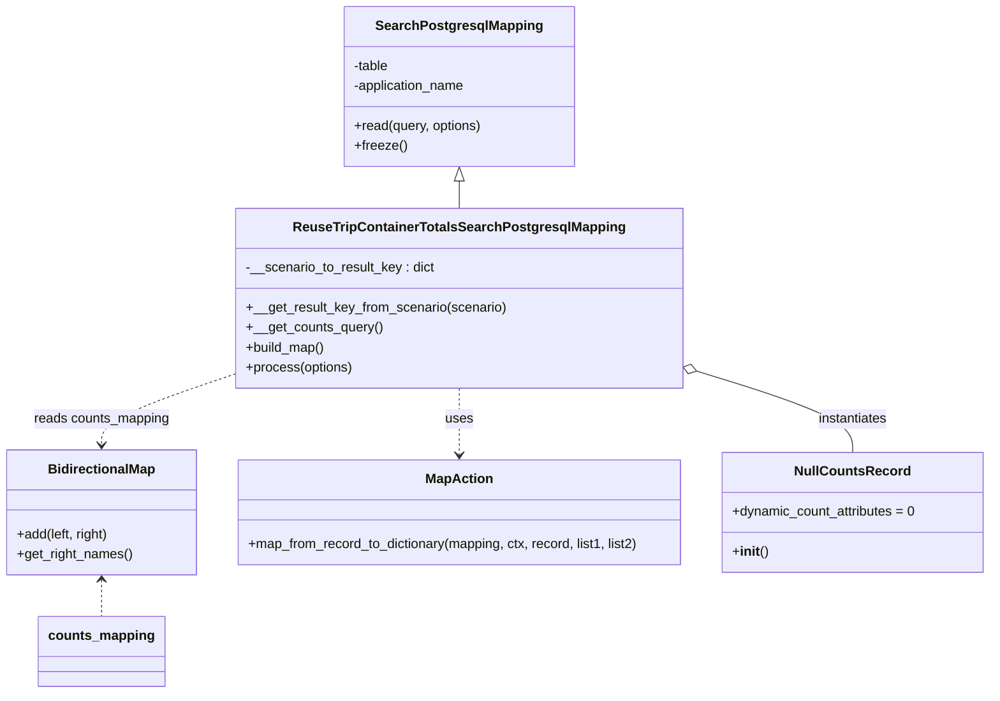

# Diagram: container_tracking_core/container_tracking_service/container_tracking_service/persistence_adapter/postgresql/ReuseTripContainerTotalsSearchPostgresqlMapping.py


> Auto-generated by Obscura crawlers

## Diagram 1



> SVG rendering failed for this diagram.

## Diagram 2

```mermaid
flowchart TD
    Start([Start]) --> GetQuery[/"Generate counts SQL (WITH exceptions_cte ... UNION ...);"/]
    GetQuery --> ReadResults[/Call read(counts_query, options)/]
    ReadResults --> InitSums[/"Initialize sum and undefined accumulators"/]
    InitSums --> ForEach{For each result in search_results}
    ForEach --> GetKey["retval_key = __get_result_key_from_scenario(result.scenario)"]
    GetKey -->|has key| MapToRetval["retval[retval_key] = MapAction.map_from_record_to_dictionary(counts_mapping, ., result)"]
    GetKey -->|no key| AccumulateUndefined["Accumulate undefined_sum_* from result.latest fields"]
    MapToRetval --> AccumulateSums["Accumulate sum_count and other counts (total and latest)"]
    AccumulateUndefined --> AccumulateSums
    AccumulateSums --> LoopEnd{More results?}
    LoopEnd -- Yes --> ForEach
    LoopEnd -- No --> EnsureScenarios["Ensure every scenario key exists; fill with NullCountsRecord via MapAction"]
    EnsureScenarios --> UpdateUndefined["retval['onsiteAtUndefined'] = {aggregated undefined sums}"]
    UpdateUndefined --> UpdateTotal["retval['total'] = {aggregated totals and latest totals}"]
    UpdateTotal --> ReturnRetval([return retval])
    ReturnRetval --> End([End])
```

> SVG rendering failed for this diagram.
