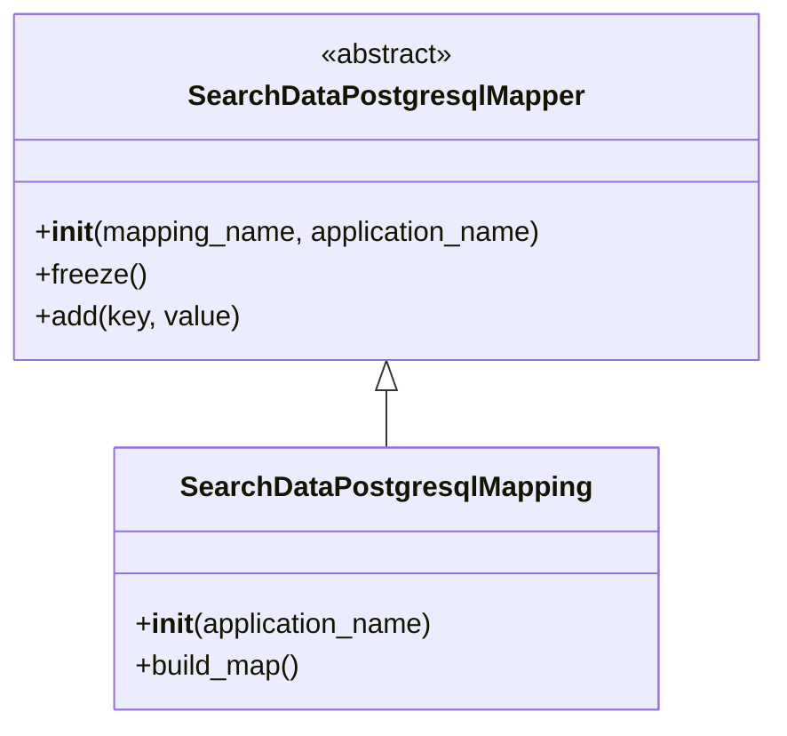
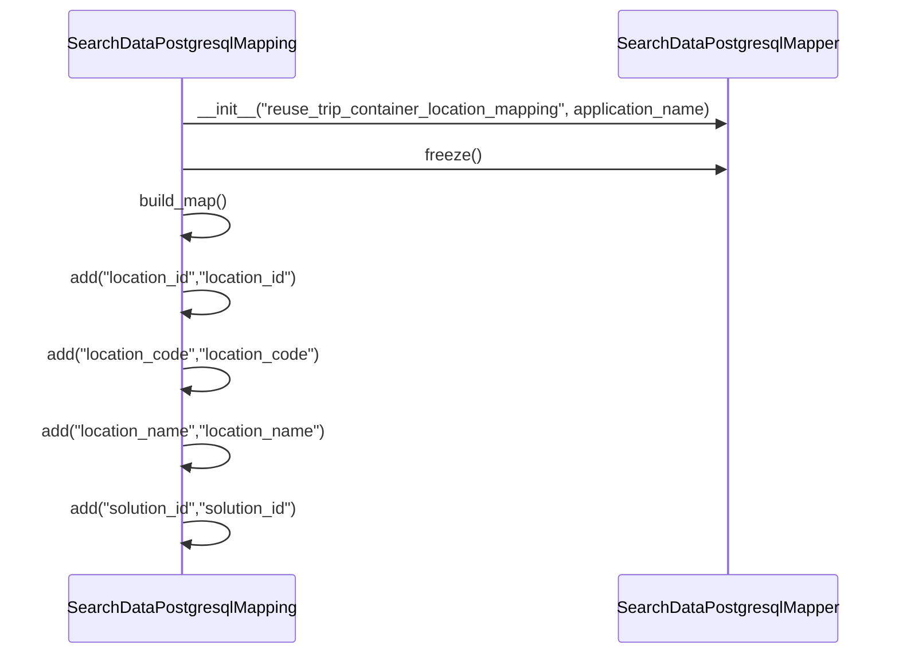

# Diagram: container_tracking_core/container_tracking_service/container_tracking_service/persistence_adapter/postgresql/SearchDataPostgresqlMapping.py

> Auto-generated by Obscura crawlers

## Diagram 1

### SVG

<svg id="container" width="442.5390625" xmlns="http://www.w3.org/2000/svg" class="classDiagram" height="414" viewBox="0 0 442.5390625 414" role="graphics-document document" aria-roledescription="class"><g><defs><marker id="container_class-aggregationStart" class="marker aggregation class" refX="18" refY="7" markerWidth="190" markerHeight="240" orient="auto"><path d="M 18,7 L9,13 L1,7 L9,1 Z"></path></marker></defs><defs><marker id="container_class-aggregationEnd" class="marker aggregation class" refX="1" refY="7" markerWidth="20" markerHeight="28" orient="auto"><path d="M 18,7 L9,13 L1,7 L9,1 Z"></path></marker></defs><defs><marker id="container_class-extensionStart" class="marker extension class" refX="18" refY="7" markerWidth="190" markerHeight="240" orient="auto"><path d="M 1,7 L18,13 V 1 Z"></path></marker></defs><defs><marker id="container_class-extensionEnd" class="marker extension class" refX="1" refY="7" markerWidth="20" markerHeight="28" orient="auto"><path d="M 1,1 V 13 L18,7 Z"></path></marker></defs><defs><marker id="container_class-compositionStart" class="marker composition class" refX="18" refY="7" markerWidth="190" markerHeight="240" orient="auto"><path d="M 18,7 L9,13 L1,7 L9,1 Z"></path></marker></defs><defs><marker id="container_class-compositionEnd" class="marker composition class" refX="1" refY="7" markerWidth="20" markerHeight="28" orient="auto"><path d="M 18,7 L9,13 L1,7 L9,1 Z"></path></marker></defs><defs><marker id="container_class-dependencyStart" class="marker dependency class" refX="6" refY="7" markerWidth="190" markerHeight="240" orient="auto"><path d="M 5,7 L9,13 L1,7 L9,1 Z"></path></marker></defs><defs><marker id="container_class-dependencyEnd" class="marker dependency class" refX="13" refY="7" markerWidth="20" markerHeight="28" orient="auto"><path d="M 18,7 L9,13 L14,7 L9,1 Z"></path></marker></defs><defs><marker id="container_class-lollipopStart" class="marker lollipop class" refX="13" refY="7" markerWidth="190" markerHeight="240" orient="auto"><circle stroke="black" fill="transparent" cx="7" cy="7" r="6"></circle></marker></defs><defs><marker id="container_class-lollipopEnd" class="marker lollipop class" refX="1" refY="7" markerWidth="190" markerHeight="240" orient="auto"><circle stroke="black" fill="transparent" cx="7" cy="7" r="6"></circle></marker></defs><g class="root"><g class="clusters"></g><g class="edgePaths"><path d="M221.27,223.25L221.27,224.542C221.27,225.833,221.27,228.417,221.27,233.875C221.27,239.333,221.27,247.667,221.27,251.833L221.27,256" id="id_SearchDataPostgresqlMapper_SearchDataPostgresqlMapping_1" class="edge-thickness-normal edge-pattern-solid relation" style=";;;" data-edge="true" data-et="edge" data-id="id_SearchDataPostgresqlMapper_SearchDataPostgresqlMapping_1" data-points="W3sieCI6MjIxLjI2OTUzMTI1LCJ5IjoyMDZ9LHsieCI6MjIxLjI2OTUzMTI1LCJ5IjoyMzF9LHsieCI6MjIxLjI2OTUzMTI1LCJ5IjoyNTZ9XQ==" marker-start="url(#container_class-extensionStart)"></path></g><g class="edgeLabels"><g class="edgeLabel"><g class="label" data-id="id_SearchDataPostgresqlMapper_SearchDataPostgresqlMapping_1" transform="translate(0, 0)"><foreignObject width="0" height="0">

</foreignObject></g></g></g><g class="nodes"><g class="node default" id="classId-SearchDataPostgresqlMapper-0" transform="translate(221.26953125, 107)"><g class="basic label-container"><path d="M-213.26953125 -99 L213.26953125 -99 L213.26953125 99 L-213.26953125 99" stroke="none" stroke-width="0" fill="#ECECFF" style=""></path><path d="M-213.26953125 -99 C-58.87682744551145 -99, 95.5158763589771 -99, 213.26953125 -99 M-213.26953125 -99 C-71.69444408912767 -99, 69.88064307174466 -99, 213.26953125 -99 M213.26953125 -99 C213.26953125 -42.243280096816854, 213.26953125 14.513439806366293, 213.26953125 99 M213.26953125 -99 C213.26953125 -28.21652113607003, 213.26953125 42.56695772785994, 213.26953125 99 M213.26953125 99 C107.09217915141092 99, 0.9148270528218347 99, -213.26953125 99 M213.26953125 99 C43.912260306313925 99, -125.44501063737215 99, -213.26953125 99 M-213.26953125 99 C-213.26953125 57.92976139518375, -213.26953125 16.859522790367507, -213.26953125 -99 M-213.26953125 99 C-213.26953125 29.020663999927947, -213.26953125 -40.958672000144105, -213.26953125 -99" stroke="#9370DB" stroke-width="1.3" fill="none" stroke-dasharray="0 0" style=""></path></g><g class="annotation-group text" transform="translate(-38.609375, -75)"><g class="label" style="" transform="translate(0,-12)"><foreignObject width="77.21875" height="24">

«abstract»

</foreignObject></g></g><g class="label-group text" transform="translate(-108.3515625, -51)"><g class="label" style="font-weight: bolder" transform="translate(0,-12)"><foreignObject width="216.703125" height="24">

SearchDataPostgresqlMapper

</foreignObject></g></g><g class="members-group text" transform="translate(-201.26953125, -3)"></g><g class="methods-group text" transform="translate(-201.26953125, 27)"><g class="label" style="" transform="translate(0,-12)"><foreignObject width="294.1875" height="24">

+<strong>init</strong>(mapping_name, application_name)

</foreignObject></g><g class="label" style="" transform="translate(0,12)"><foreignObject width="62.109375" height="24">

+freeze()

</foreignObject></g><g class="label" style="" transform="translate(0,36)"><foreignObject width="116.859375" height="24">

+add(key, value)

</foreignObject></g></g><g class="divider" style=""><path d="M-213.26953125 -27 C-70.55292615678775 -27, 72.1636789364245 -27, 213.26953125 -27 M-213.26953125 -27 C-43.45656393872687 -27, 126.35640337254625 -27, 213.26953125 -27" stroke="#9370DB" stroke-width="1.3" fill="none" stroke-dasharray="0 0" style=""></path></g><g class="divider" style=""><path d="M-213.26953125 -3 C-48.28172203862309 -3, 116.70608717275383 -3, 213.26953125 -3 M-213.26953125 -3 C-70.74571413150295 -3, 71.7781029869941 -3, 213.26953125 -3" stroke="#9370DB" stroke-width="1.3" fill="none" stroke-dasharray="0 0" style=""></path></g></g><g class="node default" id="classId-SearchDataPostgresqlMapping-1" transform="translate(221.26953125, 331)"><g class="basic label-container"><path d="M-154.87109375 -75 L154.87109375 -75 L154.87109375 75 L-154.87109375 75" stroke="none" stroke-width="0" fill="#ECECFF" style=""></path><path d="M-154.87109375 -75 C-82.25008808899328 -75, -9.62908242798656 -75, 154.87109375 -75 M-154.87109375 -75 C-80.02212638149815 -75, -5.173159012996308 -75, 154.87109375 -75 M154.87109375 -75 C154.87109375 -26.592055446386745, 154.87109375 21.81588910722651, 154.87109375 75 M154.87109375 -75 C154.87109375 -20.53610166776115, 154.87109375 33.9277966644777, 154.87109375 75 M154.87109375 75 C66.98965949498691 75, -20.89177476002618 75, -154.87109375 75 M154.87109375 75 C48.53865478589714 75, -57.793784178205726 75, -154.87109375 75 M-154.87109375 75 C-154.87109375 43.65534085404991, -154.87109375 12.310681708099814, -154.87109375 -75 M-154.87109375 75 C-154.87109375 28.3175690074332, -154.87109375 -18.3648619851336, -154.87109375 -75" stroke="#9370DB" stroke-width="1.3" fill="none" stroke-dasharray="0 0" style=""></path></g><g class="annotation-group text" transform="translate(0, -51)"></g><g class="label-group text" transform="translate(-112.0078125, -51)"><g class="label" style="font-weight: bolder" transform="translate(0,-12)"><foreignObject width="224.015625" height="24">

SearchDataPostgresqlMapping

</foreignObject></g></g><g class="members-group text" transform="translate(-142.87109375, -3)"></g><g class="methods-group text" transform="translate(-142.87109375, 27)"><g class="label" style="" transform="translate(0,-12)"><foreignObject width="173.734375" height="24">

+<strong>init</strong>(application_name)

</foreignObject></g><g class="label" style="" transform="translate(0,12)"><foreignObject width="96.109375" height="24">

+build_map()

</foreignObject></g></g><g class="divider" style=""><path d="M-154.87109375 -27 C-63.0853887328398 -27, 28.700316284320394 -27, 154.87109375 -27 M-154.87109375 -27 C-83.13232763661564 -27, -11.393561523231284 -27, 154.87109375 -27" stroke="#9370DB" stroke-width="1.3" fill="none" stroke-dasharray="0 0" style=""></path></g><g class="divider" style=""><path d="M-154.87109375 -3 C-72.42111829561209 -3, 10.028857158775821 -3, 154.87109375 -3 M-154.87109375 -3 C-75.54401864271101 -3, 3.7830564645779816 -3, 154.87109375 -3" stroke="#9370DB" stroke-width="1.3" fill="none" stroke-dasharray="0 0" style=""></path></g></g></g></g></g></svg>

## Diagram 2

> SVG rendering failed for this diagram.
