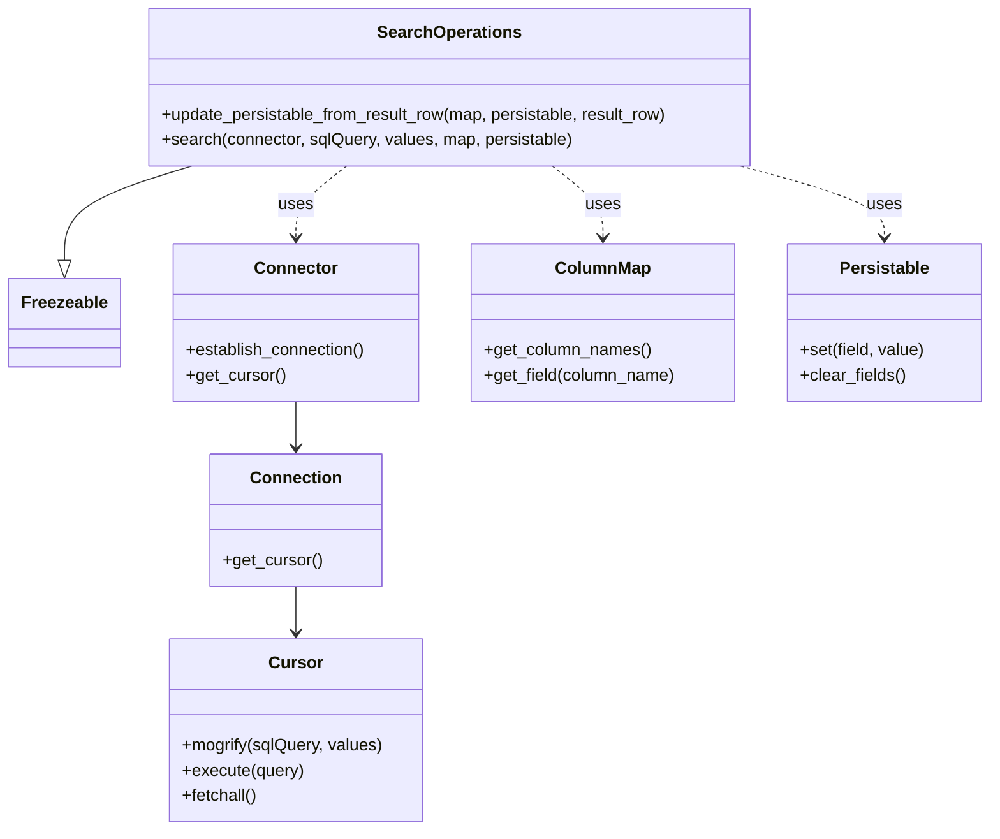

# Diagram: container_tracking_core/container_tracking_service/container_tracking_service/persistence_adapter/postgresql/SearchOperations.py


> Auto-generated by Obscura crawlers

## Diagram 1



### SVG

<svg id="container" width="937.9453125" xmlns="http://www.w3.org/2000/svg" class="classDiagram" height="790" viewBox="0 0 937.9453125 790" role="graphics-document document" aria-roledescription="class"><style>#container{font-family:"trebuchet ms",verdana,arial,sans-serif;font-size:16px;fill:#333;}@keyframes edge-animation-frame{from{stroke-dashoffset:0;}}@keyframes dash{to{stroke-dashoffset:0;}}#container .edge-animation-slow{stroke-dasharray:9,5!important;stroke-dashoffset:900;animation:dash 50s linear infinite;stroke-linecap:round;}#container .edge-animation-fast{stroke-dasharray:9,5!important;stroke-dashoffset:900;animation:dash 20s linear infinite;stroke-linecap:round;}#container .error-icon{fill:#552222;}#container .error-text{fill:#552222;stroke:#552222;}#container .edge-thickness-normal{stroke-width:1px;}#container .edge-thickness-thick{stroke-width:3.5px;}#container .edge-pattern-solid{stroke-dasharray:0;}#container .edge-thickness-invisible{stroke-width:0;fill:none;}#container .edge-pattern-dashed{stroke-dasharray:3;}#container .edge-pattern-dotted{stroke-dasharray:2;}#container .marker{fill:#333333;stroke:#333333;}#container .marker.cross{stroke:#333333;}#container svg{font-family:"trebuchet ms",verdana,arial,sans-serif;font-size:16px;}#container p{margin:0;}#container g.classGroup text{fill:#9370DB;stroke:none;font-family:"trebuchet ms",verdana,arial,sans-serif;font-size:10px;}#container g.classGroup text .title{font-weight:bolder;}#container .nodeLabel,#container .edgeLabel{color:#131300;}#container .edgeLabel .label rect{fill:#ECECFF;}#container .label text{fill:#131300;}#container .labelBkg{background:#ECECFF;}#container .edgeLabel .label span{background:#ECECFF;}#container .classTitle{font-weight:bolder;}#container .node rect,#container .node circle,#container .node ellipse,#container .node polygon,#container .node path{fill:#ECECFF;stroke:#9370DB;stroke-width:1px;}#container .divider{stroke:#9370DB;stroke-width:1;}#container g.clickable{cursor:pointer;}#container g.classGroup rect{fill:#ECECFF;stroke:#9370DB;}#container g.classGroup line{stroke:#9370DB;stroke-width:1;}#container .classLabel .box{stroke:none;stroke-width:0;fill:#ECECFF;opacity:0.5;}#container .classLabel .label{fill:#9370DB;font-size:10px;}#container .relation{stroke:#333333;stroke-width:1;fill:none;}#container .dashed-line{stroke-dasharray:3;}#container .dotted-line{stroke-dasharray:1 2;}#container #compositionStart,#container .composition{fill:#333333!important;stroke:#333333!important;stroke-width:1;}#container #compositionEnd,#container .composition{fill:#333333!important;stroke:#333333!important;stroke-width:1;}#container #dependencyStart,#container .dependency{fill:#333333!important;stroke:#333333!important;stroke-width:1;}#container #dependencyStart,#container .dependency{fill:#333333!important;stroke:#333333!important;stroke-width:1;}#container #extensionStart,#container .extension{fill:transparent!important;stroke:#333333!important;stroke-width:1;}#container #extensionEnd,#container .extension{fill:transparent!important;stroke:#333333!important;stroke-width:1;}#container #aggregationStart,#container .aggregation{fill:transparent!important;stroke:#333333!important;stroke-width:1;}#container #aggregationEnd,#container .aggregation{fill:transparent!important;stroke:#333333!important;stroke-width:1;}#container #lollipopStart,#container .lollipop{fill:#ECECFF!important;stroke:#333333!important;stroke-width:1;}#container #lollipopEnd,#container .lollipop{fill:#ECECFF!important;stroke:#333333!important;stroke-width:1;}#container .edgeTerminals{font-size:11px;line-height:initial;}#container .classTitleText{text-anchor:middle;font-size:18px;fill:#333;}#container .label-icon{display:inline-block;height:1em;overflow:visible;vertical-align:-0.125em;}#container .node .label-icon path{fill:currentColor;stroke:revert;stroke-width:revert;}#container :root{--mermaid-font-family:"trebuchet ms",verdana,arial,sans-serif;}</style><g><defs><marker id="container_class-aggregationStart" class="marker aggregation class" refX="18" refY="7" markerWidth="190" markerHeight="240" orient="auto"><path d="M 18,7 L9,13 L1,7 L9,1 Z"></path></marker></defs><defs><marker id="container_class-aggregationEnd" class="marker aggregation class" refX="1" refY="7" markerWidth="20" markerHeight="28" orient="auto"><path d="M 18,7 L9,13 L1,7 L9,1 Z"></path></marker></defs><defs><marker id="container_class-extensionStart" class="marker extension class" refX="18" refY="7" markerWidth="190" markerHeight="240" orient="auto"><path d="M 1,7 L18,13 V 1 Z"></path></marker></defs><defs><marker id="container_class-extensionEnd" class="marker extension class" refX="1" refY="7" markerWidth="20" markerHeight="28" orient="auto"><path d="M 1,1 V 13 L18,7 Z"></path></marker></defs><defs><marker id="container_class-compositionStart" class="marker composition class" refX="18" refY="7" markerWidth="190" markerHeight="240" orient="auto"><path d="M 18,7 L9,13 L1,7 L9,1 Z"></path></marker></defs><defs><marker id="container_class-compositionEnd" class="marker composition class" refX="1" refY="7" markerWidth="20" markerHeight="28" orient="auto"><path d="M 18,7 L9,13 L1,7 L9,1 Z"></path></marker></defs><defs><marker id="container_class-dependencyStart" class="marker dependency class" refX="6" refY="7" markerWidth="190" markerHeight="240" orient="auto"><path d="M 5,7 L9,13 L1,7 L9,1 Z"></path></marker></defs><defs><marker id="container_class-dependencyEnd" class="marker dependency class" refX="13" refY="7" markerWidth="20" markerHeight="28" orient="auto"><path d="M 18,7 L9,13 L14,7 L9,1 Z"></path></marker></defs><defs><marker id="container_class-lollipopStart" class="marker lollipop class" refX="13" refY="7" markerWidth="190" markerHeight="240" orient="auto"><circle stroke="black" fill="transparent" cx="7" cy="7" r="6"></circle></marker></defs><defs><marker id="container_class-lollipopEnd" class="marker lollipop class" refX="1" refY="7" markerWidth="190" markerHeight="240" orient="auto"><circle stroke="black" fill="transparent" cx="7" cy="7" r="6"></circle></marker></defs><g class="root"><g class="clusters"></g><g class="edgePaths"><path d="M179.721,158L159.634,164.167C139.546,170.333,99.371,182.667,79.283,197.625C59.195,212.583,59.195,230.167,59.195,238.958L59.195,247.75" id="id_SearchOperations_Freezeable_1" class="edge-thickness-normal edge-pattern-solid relation" style=";;;" data-edge="true" data-et="edge" data-id="id_SearchOperations_Freezeable_1" data-points="W3sieCI6MTc5LjcyMTQ3MDQyNDEwNzE0LCJ5IjoxNTh9LHsieCI6NTkuMTk1MzEyNSwieSI6MTk1fSx7IngiOjU5LjE5NTMxMjUsInkiOjI2NX1d" marker-end="url(#container_class-extensionEnd)"></path><path d="M326.065,158L318.01,164.167C309.955,170.333,293.844,182.667,285.789,194C277.734,205.333,277.734,215.667,277.734,220.833L277.734,226" id="id_SearchOperations_Connector_2" class="edge-thickness-normal edge-pattern-dashed relation" style=";;;" data-edge="true" data-et="edge" data-id="id_SearchOperations_Connector_2" data-points="W3sieCI6MzI2LjA2NDU5MjYzMzkyODU2LCJ5IjoxNTh9LHsieCI6Mjc3LjczNDM3NSwieSI6MTk1fSx7IngiOjI3Ny43MzQzNzUsInkiOjIzMn1d" marker-end="url(#container_class-dependencyEnd)"></path><path d="M521.998,158L530.053,164.167C538.108,170.333,554.218,182.667,562.273,194C570.328,205.333,570.328,215.667,570.328,220.833L570.328,226" id="id_SearchOperations_ColumnMap_3" class="edge-thickness-normal edge-pattern-dashed relation" style=";;;" data-edge="true" data-et="edge" data-id="id_SearchOperations_ColumnMap_3" data-points="W3sieCI6NTIxLjk5NzkwNzM2NjA3MTQsInkiOjE1OH0seyJ4Ijo1NzAuMzI4MTI1LCJ5IjoxOTV9LHsieCI6NTcwLjMyODEyNSwieSI6MjMyfV0=" marker-end="url(#container_class-dependencyEnd)"></path><path d="M701.083,158L723.863,164.167C746.643,170.333,792.202,182.667,814.982,194C837.762,205.333,837.762,215.667,837.762,220.833L837.762,226" id="id_SearchOperations_Persistable_4" class="edge-thickness-normal edge-pattern-dashed relation" style=";;;" data-edge="true" data-et="edge" data-id="id_SearchOperations_Persistable_4" data-points="W3sieCI6NzAxLjA4MjkwMzE4MDgwMzYsInkiOjE1OH0seyJ4Ijo4MzcuNzYxNzE4NzUsInkiOjE5NX0seyJ4Ijo4MzcuNzYxNzE4NzUsInkiOjIzMn1d" marker-end="url(#container_class-dependencyEnd)"></path><path d="M277.734,382L277.734,386.167C277.734,390.333,277.734,398.667,277.734,406C277.734,413.333,277.734,419.667,277.734,422.833L277.734,426" id="id_Connector_Connection_5" class="edge-thickness-normal edge-pattern-solid relation" style=";;;" data-edge="true" data-et="edge" data-id="id_Connector_Connection_5" data-points="W3sieCI6Mjc3LjczNDM3NSwieSI6MzgyfSx7IngiOjI3Ny43MzQzNzUsInkiOjQwN30seyJ4IjoyNzcuNzM0Mzc1LCJ5Ijo0MzJ9XQ==" marker-end="url(#container_class-dependencyEnd)"></path><path d="M277.734,558L277.734,562.167C277.734,566.333,277.734,574.667,277.734,582C277.734,589.333,277.734,595.667,277.734,598.833L277.734,602" id="id_Connection_Cursor_6" class="edge-thickness-normal edge-pattern-solid relation" style=";;;" data-edge="true" data-et="edge" data-id="id_Connection_Cursor_6" data-points="W3sieCI6Mjc3LjczNDM3NSwieSI6NTU4fSx7IngiOjI3Ny43MzQzNzUsInkiOjU4M30seyJ4IjoyNzcuNzM0Mzc1LCJ5Ijo2MDh9XQ==" marker-end="url(#container_class-dependencyEnd)"></path></g><g class="edgeLabels"><g class="edgeLabel"><g class="label" data-id="id_SearchOperations_Freezeable_1" transform="translate(0, 0)"><foreignObject width="0" height="0"><div xmlns="http://www.w3.org/1999/xhtml" class="labelBkg" style="display: table-cell; white-space: nowrap; line-height: 1.5; max-width: 200px; text-align: center;"><span class="edgeLabel"></span></div></foreignObject></g></g><g class="edgeLabel" transform="translate(277.734375, 195)"><g class="label" data-id="id_SearchOperations_Connector_2" transform="translate(-16.4921875, -12)"><foreignObject width="32.984375" height="24"><div xmlns="http://www.w3.org/1999/xhtml" class="labelBkg" style="display: table-cell; white-space: nowrap; line-height: 1.5; max-width: 200px; text-align: center;"><span class="edgeLabel"><p>uses</p></span></div></foreignObject></g></g><g class="edgeLabel" transform="translate(570.328125, 195)"><g class="label" data-id="id_SearchOperations_ColumnMap_3" transform="translate(-16.4921875, -12)"><foreignObject width="32.984375" height="24"><div xmlns="http://www.w3.org/1999/xhtml" class="labelBkg" style="display: table-cell; white-space: nowrap; line-height: 1.5; max-width: 200px; text-align: center;"><span class="edgeLabel"><p>uses</p></span></div></foreignObject></g></g><g class="edgeLabel" transform="translate(837.76171875, 195)"><g class="label" data-id="id_SearchOperations_Persistable_4" transform="translate(-16.4921875, -12)"><foreignObject width="32.984375" height="24"><div xmlns="http://www.w3.org/1999/xhtml" class="labelBkg" style="display: table-cell; white-space: nowrap; line-height: 1.5; max-width: 200px; text-align: center;"><span class="edgeLabel"><p>uses</p></span></div></foreignObject></g></g><g class="edgeLabel"><g class="label" data-id="id_Connector_Connection_5" transform="translate(0, 0)"><foreignObject width="0" height="0"><div xmlns="http://www.w3.org/1999/xhtml" class="labelBkg" style="display: table-cell; white-space: nowrap; line-height: 1.5; max-width: 200px; text-align: center;"><span class="edgeLabel"></span></div></foreignObject></g></g><g class="edgeLabel"><g class="label" data-id="id_Connection_Cursor_6" transform="translate(0, 0)"><foreignObject width="0" height="0"><div xmlns="http://www.w3.org/1999/xhtml" class="labelBkg" style="display: table-cell; white-space: nowrap; line-height: 1.5; max-width: 200px; text-align: center;"><span class="edgeLabel"></span></div></foreignObject></g></g></g><g class="nodes"><g class="node default" id="classId-SearchOperations-0" transform="translate(424.03125, 83)"><g class="basic label-container"><path d="M-289.72265625 -75 L289.72265625 -75 L289.72265625 75 L-289.72265625 75" stroke="none" stroke-width="0" fill="#ECECFF" style=""></path><path d="M-289.72265625 -75 C-173.1429877463022 -75, -56.56331924260442 -75, 289.72265625 -75 M-289.72265625 -75 C-120.99244189177517 -75, 47.737772466449655 -75, 289.72265625 -75 M289.72265625 -75 C289.72265625 -22.511701862637352, 289.72265625 29.976596274725296, 289.72265625 75 M289.72265625 -75 C289.72265625 -41.553517764000695, 289.72265625 -8.10703552800139, 289.72265625 75 M289.72265625 75 C161.16223717690488 75, 32.60181810380976 75, -289.72265625 75 M289.72265625 75 C94.2754161252702 75, -101.1718239994596 75, -289.72265625 75 M-289.72265625 75 C-289.72265625 44.298853707150506, -289.72265625 13.597707414301013, -289.72265625 -75 M-289.72265625 75 C-289.72265625 35.50563834473565, -289.72265625 -3.988723310528698, -289.72265625 -75" stroke="#9370DB" stroke-width="1.3" fill="none" stroke-dasharray="0 0" style=""></path></g><g class="annotation-group text" transform="translate(0, -51)"></g><g class="label-group text" transform="translate(-65.2421875, -51)"><g class="label" style="font-weight: bolder" transform="translate(0,-12)"><foreignObject width="130.484375" height="24"><div xmlns="http://www.w3.org/1999/xhtml" style="display: table-cell; white-space: nowrap; line-height: 1.5; max-width: 179px; text-align: center;"><span class="nodeLabel markdown-node-label" style=""><p>SearchOperations</p></span></div></foreignObject></g></g><g class="members-group text" transform="translate(-277.72265625, -3)"></g><g class="methods-group text" transform="translate(-277.72265625, 27)"><g class="label" style="" transform="translate(0,-12)"><foreignObject width="490.203125" height="24"><div xmlns="http://www.w3.org/1999/xhtml" style="display: table-cell; white-space: nowrap; line-height: 1.5; max-width: 548px; text-align: center;"><span class="nodeLabel markdown-node-label" style=""><p>+update_persistable_from_result_row(map, persistable, result_row)</p></span></div></foreignObject></g><g class="label" style="" transform="translate(0,12)"><foreignObject width="392.859375" height="24"><div xmlns="http://www.w3.org/1999/xhtml" style="display: table-cell; white-space: nowrap; line-height: 1.5; max-width: 450px; text-align: center;"><span class="nodeLabel markdown-node-label" style=""><p>+search(connector, sqlQuery, values, map, persistable)</p></span></div></foreignObject></g></g><g class="divider" style=""><path d="M-289.72265625 -27 C-99.7707617612208 -27, 90.1811327275584 -27, 289.72265625 -27 M-289.72265625 -27 C-63.065241286483854 -27, 163.5921736770323 -27, 289.72265625 -27" stroke="#9370DB" stroke-width="1.3" fill="none" stroke-dasharray="0 0" style=""></path></g><g class="divider" style=""><path d="M-289.72265625 -3 C-169.29570355325643 -3, -48.86875085651289 -3, 289.72265625 -3 M-289.72265625 -3 C-112.81573152341372 -3, 64.09119320317257 -3, 289.72265625 -3" stroke="#9370DB" stroke-width="1.3" fill="none" stroke-dasharray="0 0" style=""></path></g></g><g class="node default" id="classId-Freezeable-1" transform="translate(59.1953125, 307)"><g class="basic label-container"><path d="M-51.1953125 -42 L51.1953125 -42 L51.1953125 42 L-51.1953125 42" stroke="none" stroke-width="0" fill="#ECECFF" style=""></path><path d="M-51.1953125 -42 C-15.207013997510273 -42, 20.781284504979453 -42, 51.1953125 -42 M-51.1953125 -42 C-29.039904163815024 -42, -6.884495827630047 -42, 51.1953125 -42 M51.1953125 -42 C51.1953125 -16.34249067270838, 51.1953125 9.315018654583241, 51.1953125 42 M51.1953125 -42 C51.1953125 -14.962014649752621, 51.1953125 12.075970700494757, 51.1953125 42 M51.1953125 42 C29.586820786558185 42, 7.97832907311637 42, -51.1953125 42 M51.1953125 42 C26.503444971881414 42, 1.811577443762829 42, -51.1953125 42 M-51.1953125 42 C-51.1953125 15.508470070461563, -51.1953125 -10.983059859076874, -51.1953125 -42 M-51.1953125 42 C-51.1953125 24.715253909193677, -51.1953125 7.430507818387355, -51.1953125 -42" stroke="#9370DB" stroke-width="1.3" fill="none" stroke-dasharray="0 0" style=""></path></g><g class="annotation-group text" transform="translate(0, -18)"></g><g class="label-group text" transform="translate(-39.1953125, -18)"><g class="label" style="font-weight: bolder" transform="translate(0,-12)"><foreignObject width="78.390625" height="24"><div xmlns="http://www.w3.org/1999/xhtml" style="display: table-cell; white-space: nowrap; line-height: 1.5; max-width: 127px; text-align: center;"><span class="nodeLabel markdown-node-label" style=""><p>Freezeable</p></span></div></foreignObject></g></g><g class="members-group text" transform="translate(-39.1953125, 30)"></g><g class="methods-group text" transform="translate(-39.1953125, 60)"></g><g class="divider" style=""><path d="M-51.1953125 6 C-23.574110661143784 6, 4.047091177712431 6, 51.1953125 6 M-51.1953125 6 C-23.670898187184378 6, 3.853516125631245 6, 51.1953125 6" stroke="#9370DB" stroke-width="1.3" fill="none" stroke-dasharray="0 0" style=""></path></g><g class="divider" style=""><path d="M-51.1953125 24 C-20.584834126614687 24, 10.025644246770625 24, 51.1953125 24 M-51.1953125 24 C-10.316347893807595 24, 30.56261671238481 24, 51.1953125 24" stroke="#9370DB" stroke-width="1.3" fill="none" stroke-dasharray="0 0" style=""></path></g></g><g class="node default" id="classId-Connector-2" transform="translate(277.734375, 307)"><g class="basic label-container"><path d="M-117.34375 -75 L117.34375 -75 L117.34375 75 L-117.34375 75" stroke="none" stroke-width="0" fill="#ECECFF" style=""></path><path d="M-117.34375 -75 C-24.211070902272937 -75, 68.92160819545413 -75, 117.34375 -75 M-117.34375 -75 C-60.07122945809202 -75, -2.79870891618404 -75, 117.34375 -75 M117.34375 -75 C117.34375 -35.267081502842196, 117.34375 4.465836994315609, 117.34375 75 M117.34375 -75 C117.34375 -40.11192541863385, 117.34375 -5.223850837267705, 117.34375 75 M117.34375 75 C55.16957805473658 75, -7.004593890526834 75, -117.34375 75 M117.34375 75 C30.778125786647507 75, -55.787498426704985 75, -117.34375 75 M-117.34375 75 C-117.34375 28.019388930663602, -117.34375 -18.961222138672795, -117.34375 -75 M-117.34375 75 C-117.34375 40.90384175877799, -117.34375 6.807683517555986, -117.34375 -75" stroke="#9370DB" stroke-width="1.3" fill="none" stroke-dasharray="0 0" style=""></path></g><g class="annotation-group text" transform="translate(0, -51)"></g><g class="label-group text" transform="translate(-37.421875, -51)"><g class="label" style="font-weight: bolder" transform="translate(0,-12)"><foreignObject width="74.84375" height="24"><div xmlns="http://www.w3.org/1999/xhtml" style="display: table-cell; white-space: nowrap; line-height: 1.5; max-width: 125px; text-align: center;"><span class="nodeLabel markdown-node-label" style=""><p>Connector</p></span></div></foreignObject></g></g><g class="members-group text" transform="translate(-105.34375, -3)"></g><g class="methods-group text" transform="translate(-105.34375, 27)"><g class="label" style="" transform="translate(0,-12)"><foreignObject width="173.265625" height="24"><div xmlns="http://www.w3.org/1999/xhtml" style="display: table-cell; white-space: nowrap; line-height: 1.5; max-width: 231px; text-align: center;"><span class="nodeLabel markdown-node-label" style=""><p>+establish_connection()</p></span></div></foreignObject></g><g class="label" style="" transform="translate(0,12)"><foreignObject width="94.640625" height="24"><div xmlns="http://www.w3.org/1999/xhtml" style="display: table-cell; white-space: nowrap; line-height: 1.5; max-width: 152px; text-align: center;"><span class="nodeLabel markdown-node-label" style=""><p>+get_cursor()</p></span></div></foreignObject></g></g><g class="divider" style=""><path d="M-117.34375 -27 C-25.234584548163113 -27, 66.87458090367377 -27, 117.34375 -27 M-117.34375 -27 C-36.159719963325045 -27, 45.02431007334991 -27, 117.34375 -27" stroke="#9370DB" stroke-width="1.3" fill="none" stroke-dasharray="0 0" style=""></path></g><g class="divider" style=""><path d="M-117.34375 -3 C-64.33306720161909 -3, -11.32238440323816 -3, 117.34375 -3 M-117.34375 -3 C-63.82603911688018 -3, -10.308328233760363 -3, 117.34375 -3" stroke="#9370DB" stroke-width="1.3" fill="none" stroke-dasharray="0 0" style=""></path></g></g><g class="node default" id="classId-Connection-3" transform="translate(277.734375, 495)"><g class="basic label-container"><path d="M-79.93359375 -63 L79.93359375 -63 L79.93359375 63 L-79.93359375 63" stroke="none" stroke-width="0" fill="#ECECFF" style=""></path><path d="M-79.93359375 -63 C-25.043999499147404 -63, 29.845594751705192 -63, 79.93359375 -63 M-79.93359375 -63 C-20.24382065458645 -63, 39.4459524408271 -63, 79.93359375 -63 M79.93359375 -63 C79.93359375 -19.944319253539078, 79.93359375 23.111361492921844, 79.93359375 63 M79.93359375 -63 C79.93359375 -20.82464857919131, 79.93359375 21.350702841617377, 79.93359375 63 M79.93359375 63 C22.072120815933154 63, -35.78935211813369 63, -79.93359375 63 M79.93359375 63 C45.66919019260119 63, 11.404786635202385 63, -79.93359375 63 M-79.93359375 63 C-79.93359375 30.971114215335867, -79.93359375 -1.057771569328267, -79.93359375 -63 M-79.93359375 63 C-79.93359375 15.725980722248039, -79.93359375 -31.548038555503922, -79.93359375 -63" stroke="#9370DB" stroke-width="1.3" fill="none" stroke-dasharray="0 0" style=""></path></g><g class="annotation-group text" transform="translate(0, -39)"></g><g class="label-group text" transform="translate(-41.2265625, -39)"><g class="label" style="font-weight: bolder" transform="translate(0,-12)"><foreignObject width="82.453125" height="24"><div xmlns="http://www.w3.org/1999/xhtml" style="display: table-cell; white-space: nowrap; line-height: 1.5; max-width: 132px; text-align: center;"><span class="nodeLabel markdown-node-label" style=""><p>Connection</p></span></div></foreignObject></g></g><g class="members-group text" transform="translate(-67.93359375, 9)"></g><g class="methods-group text" transform="translate(-67.93359375, 39)"><g class="label" style="" transform="translate(0,-12)"><foreignObject width="94.640625" height="24"><div xmlns="http://www.w3.org/1999/xhtml" style="display: table-cell; white-space: nowrap; line-height: 1.5; max-width: 152px; text-align: center;"><span class="nodeLabel markdown-node-label" style=""><p>+get_cursor()</p></span></div></foreignObject></g></g><g class="divider" style=""><path d="M-79.93359375 -15 C-16.351638471630878 -15, 47.230316806738244 -15, 79.93359375 -15 M-79.93359375 -15 C-34.557562462034305 -15, 10.81846882593139 -15, 79.93359375 -15" stroke="#9370DB" stroke-width="1.3" fill="none" stroke-dasharray="0 0" style=""></path></g><g class="divider" style=""><path d="M-79.93359375 9 C-46.318282885121846 9, -12.702972020243692 9, 79.93359375 9 M-79.93359375 9 C-35.07172993655454 9, 9.79013387689092 9, 79.93359375 9" stroke="#9370DB" stroke-width="1.3" fill="none" stroke-dasharray="0 0" style=""></path></g></g><g class="node default" id="classId-Cursor-4" transform="translate(277.734375, 695)"><g class="basic label-container"><path d="M-120.109375 -87 L120.109375 -87 L120.109375 87 L-120.109375 87" stroke="none" stroke-width="0" fill="#ECECFF" style=""></path><path d="M-120.109375 -87 C-48.15964341114076 -87, 23.790088177718474 -87, 120.109375 -87 M-120.109375 -87 C-25.989188539772186 -87, 68.13099792045563 -87, 120.109375 -87 M120.109375 -87 C120.109375 -18.968213177672638, 120.109375 49.063573644654724, 120.109375 87 M120.109375 -87 C120.109375 -42.512768377572165, 120.109375 1.97446324485567, 120.109375 87 M120.109375 87 C66.75355797262243 87, 13.397740945244863 87, -120.109375 87 M120.109375 87 C46.20463415720995 87, -27.700106685580096 87, -120.109375 87 M-120.109375 87 C-120.109375 31.594721242595853, -120.109375 -23.810557514808295, -120.109375 -87 M-120.109375 87 C-120.109375 39.13538036357472, -120.109375 -8.729239272850563, -120.109375 -87" stroke="#9370DB" stroke-width="1.3" fill="none" stroke-dasharray="0 0" style=""></path></g><g class="annotation-group text" transform="translate(0, -63)"></g><g class="label-group text" transform="translate(-23.90625, -63)"><g class="label" style="font-weight: bolder" transform="translate(0,-12)"><foreignObject width="47.8125" height="24"><div xmlns="http://www.w3.org/1999/xhtml" style="display: table-cell; white-space: nowrap; line-height: 1.5; max-width: 98px; text-align: center;"><span class="nodeLabel markdown-node-label" style=""><p>Cursor</p></span></div></foreignObject></g></g><g class="members-group text" transform="translate(-108.109375, -15)"></g><g class="methods-group text" transform="translate(-108.109375, 15)"><g class="label" style="" transform="translate(0,-12)"><foreignObject width="192.3125" height="24"><div xmlns="http://www.w3.org/1999/xhtml" style="display: table-cell; white-space: nowrap; line-height: 1.5; max-width: 250px; text-align: center;"><span class="nodeLabel markdown-node-label" style=""><p>+mogrify(sqlQuery, values)</p></span></div></foreignObject></g><g class="label" style="" transform="translate(0,12)"><foreignObject width="115.96875" height="24"><div xmlns="http://www.w3.org/1999/xhtml" style="display: table-cell; white-space: nowrap; line-height: 1.5; max-width: 173px; text-align: center;"><span class="nodeLabel markdown-node-label" style=""><p>+execute(query)</p></span></div></foreignObject></g><g class="label" style="" transform="translate(0,36)"><foreignObject width="72.515625" height="24"><div xmlns="http://www.w3.org/1999/xhtml" style="display: table-cell; white-space: nowrap; line-height: 1.5; max-width: 130px; text-align: center;"><span class="nodeLabel markdown-node-label" style=""><p>+fetchall()</p></span></div></foreignObject></g></g><g class="divider" style=""><path d="M-120.109375 -39 C-41.95034769052096 -39, 36.20867961895809 -39, 120.109375 -39 M-120.109375 -39 C-31.741239108613968 -39, 56.626896782772064 -39, 120.109375 -39" stroke="#9370DB" stroke-width="1.3" fill="none" stroke-dasharray="0 0" style=""></path></g><g class="divider" style=""><path d="M-120.109375 -15 C-65.58772612195787 -15, -11.066077243915757 -15, 120.109375 -15 M-120.109375 -15 C-40.95933929649189 -15, 38.19069640701622 -15, 120.109375 -15" stroke="#9370DB" stroke-width="1.3" fill="none" stroke-dasharray="0 0" style=""></path></g></g><g class="node default" id="classId-ColumnMap-5" transform="translate(570.328125, 307)"><g class="basic label-container"><path d="M-125.25 -75 L125.25 -75 L125.25 75 L-125.25 75" stroke="none" stroke-width="0" fill="#ECECFF" style=""></path><path d="M-125.25 -75 C-73.98235229567729 -75, -22.714704591354575 -75, 125.25 -75 M-125.25 -75 C-28.098621731714545 -75, 69.05275653657091 -75, 125.25 -75 M125.25 -75 C125.25 -33.3660693378975, 125.25 8.267861324205, 125.25 75 M125.25 -75 C125.25 -41.43710254857946, 125.25 -7.874205097158921, 125.25 75 M125.25 75 C54.59414927099593 75, -16.061701458008145 75, -125.25 75 M125.25 75 C42.50284553043939 75, -40.244308939121225 75, -125.25 75 M-125.25 75 C-125.25 16.879864964663618, -125.25 -41.240270070672764, -125.25 -75 M-125.25 75 C-125.25 37.05181728464837, -125.25 -0.8963654307032556, -125.25 -75" stroke="#9370DB" stroke-width="1.3" fill="none" stroke-dasharray="0 0" style=""></path></g><g class="annotation-group text" transform="translate(0, -51)"></g><g class="label-group text" transform="translate(-42.890625, -51)"><g class="label" style="font-weight: bolder" transform="translate(0,-12)"><foreignObject width="85.78125" height="24"><div xmlns="http://www.w3.org/1999/xhtml" style="display: table-cell; white-space: nowrap; line-height: 1.5; max-width: 136px; text-align: center;"><span class="nodeLabel markdown-node-label" style=""><p>ColumnMap</p></span></div></foreignObject></g></g><g class="members-group text" transform="translate(-113.25, -3)"></g><g class="methods-group text" transform="translate(-113.25, 27)"><g class="label" style="" transform="translate(0,-12)"><foreignObject width="158.984375" height="24"><div xmlns="http://www.w3.org/1999/xhtml" style="display: table-cell; white-space: nowrap; line-height: 1.5; max-width: 216px; text-align: center;"><span class="nodeLabel markdown-node-label" style=""><p>+get_column_names()</p></span></div></foreignObject></g><g class="label" style="" transform="translate(0,12)"><foreignObject width="183.609375" height="24"><div xmlns="http://www.w3.org/1999/xhtml" style="display: table-cell; white-space: nowrap; line-height: 1.5; max-width: 241px; text-align: center;"><span class="nodeLabel markdown-node-label" style=""><p>+get_field(column_name)</p></span></div></foreignObject></g></g><g class="divider" style=""><path d="M-125.25 -27 C-34.51359236012128 -27, 56.22281527975744 -27, 125.25 -27 M-125.25 -27 C-44.25383993804185 -27, 36.7423201239163 -27, 125.25 -27" stroke="#9370DB" stroke-width="1.3" fill="none" stroke-dasharray="0 0" style=""></path></g><g class="divider" style=""><path d="M-125.25 -3 C-32.24437508620473 -3, 60.76124982759055 -3, 125.25 -3 M-125.25 -3 C-25.954781712527435 -3, 73.34043657494513 -3, 125.25 -3" stroke="#9370DB" stroke-width="1.3" fill="none" stroke-dasharray="0 0" style=""></path></g></g><g class="node default" id="classId-Persistable-6" transform="translate(837.76171875, 307)"><g class="basic label-container"><path d="M-92.18359375 -75 L92.18359375 -75 L92.18359375 75 L-92.18359375 75" stroke="none" stroke-width="0" fill="#ECECFF" style=""></path><path d="M-92.18359375 -75 C-44.49714724039998 -75, 3.189299269200035 -75, 92.18359375 -75 M-92.18359375 -75 C-51.53353790027573 -75, -10.883482050551464 -75, 92.18359375 -75 M92.18359375 -75 C92.18359375 -25.870626757059654, 92.18359375 23.258746485880692, 92.18359375 75 M92.18359375 -75 C92.18359375 -35.943265732573614, 92.18359375 3.113468534852771, 92.18359375 75 M92.18359375 75 C52.4863265174488 75, 12.789059284897604 75, -92.18359375 75 M92.18359375 75 C23.762639908835524 75, -44.65831393232895 75, -92.18359375 75 M-92.18359375 75 C-92.18359375 35.67701323332442, -92.18359375 -3.645973533351153, -92.18359375 -75 M-92.18359375 75 C-92.18359375 34.181617850042194, -92.18359375 -6.636764299915612, -92.18359375 -75" stroke="#9370DB" stroke-width="1.3" fill="none" stroke-dasharray="0 0" style=""></path></g><g class="annotation-group text" transform="translate(0, -51)"></g><g class="label-group text" transform="translate(-40.9765625, -51)"><g class="label" style="font-weight: bolder" transform="translate(0,-12)"><foreignObject width="81.953125" height="24"><div xmlns="http://www.w3.org/1999/xhtml" style="display: table-cell; white-space: nowrap; line-height: 1.5; max-width: 130px; text-align: center;"><span class="nodeLabel markdown-node-label" style=""><p>Persistable</p></span></div></foreignObject></g></g><g class="members-group text" transform="translate(-80.18359375, -3)"></g><g class="methods-group text" transform="translate(-80.18359375, 27)"><g class="label" style="" transform="translate(0,-12)"><foreignObject width="119.390625" height="24"><div xmlns="http://www.w3.org/1999/xhtml" style="display: table-cell; white-space: nowrap; line-height: 1.5; max-width: 177px; text-align: center;"><span class="nodeLabel markdown-node-label" style=""><p>+set(field, value)</p></span></div></foreignObject></g><g class="label" style="" transform="translate(0,12)"><foreignObject width="100.34375" height="24"><div xmlns="http://www.w3.org/1999/xhtml" style="display: table-cell; white-space: nowrap; line-height: 1.5; max-width: 158px; text-align: center;"><span class="nodeLabel markdown-node-label" style=""><p>+clear_fields()</p></span></div></foreignObject></g></g><g class="divider" style=""><path d="M-92.18359375 -27 C-40.62101471208913 -27, 10.941564325821744 -27, 92.18359375 -27 M-92.18359375 -27 C-29.263877105144054 -27, 33.65583953971189 -27, 92.18359375 -27" stroke="#9370DB" stroke-width="1.3" fill="none" stroke-dasharray="0 0" style=""></path></g><g class="divider" style=""><path d="M-92.18359375 -3 C-42.265562420940086 -3, 7.652468908119829 -3, 92.18359375 -3 M-92.18359375 -3 C-28.648656285659072 -3, 34.886281178681855 -3, 92.18359375 -3" stroke="#9370DB" stroke-width="1.3" fill="none" stroke-dasharray="0 0" style=""></path></g></g></g></g></g></svg>

## Diagram 2

```mermaid
sequenceDiagram
participant Caller
participant SO as SearchOperations
participant Conn as Connector
participant Cnx as Connection
participant Cur as Cursor
participant Map as ColumnMap
participant P as Persistable
Caller->>SO: search(connector, sqlQuery, values, map, persistable)
SO->>Conn: establish_connection()
Conn-->>Cnx: connection
SO->>Cnx: get_cursor()
Cnx-->>Cur: cursor
SO->>Cur: mogrify(sqlQuery, values)
alt mogrify succeeds
Cur-->>SO: mogrified_query
else mogrify raises
Cur-->>SO: Exception e
SO->>Caller: print("ERROR", e)
end
SO->>Conn: get_cursor()
Conn-->>Cur: cursor
SO->>Cur: execute(mogrified_query)
Cur-->>SO: executed
SO->>Cur: fetchall()
Cur-->>SO: results
loop for each res in results
  SO->>P: newpersistable = persistable.__class__(); instantiate
  SO->>SO: update_persistable_from_result_row(map, newpersistable(), res)
  SO->>res: _asdict()
  res-->>SO: result_dict
  SO->>Map: get_column_names()
  Map-->>SO: column_names
  loop for each column_name
    SO->>Map: get_field(column_name)
    Map-->>SO: field
    SO->>res: result_dict.get(column_name)
    res-->>SO: value
    SO->>P: set(field, value)
    P-->>SO: updated_persistable
  end
  SO->>P: clear_fields()
  P-->>SO: rec
end
SO-->>Caller: records
```

> SVG rendering failed for this diagram.
