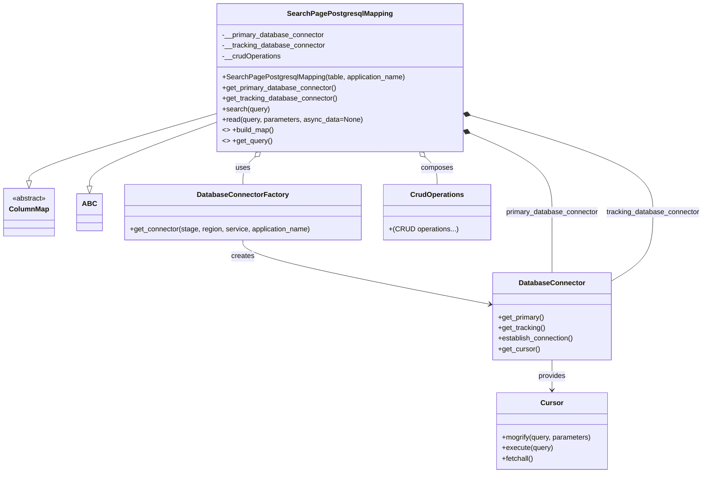

# Diagram: container_tracking_core/container_tracking_service/container_tracking_service/persistence_adapter/postgresql/SearchPagePostgresqlMapping.py

> Auto-generated by Obscura crawlers

## Mermaid

### SVG

<svg id="container" width="1575.7734375" xmlns="http://www.w3.org/2000/svg" class="classDiagram" height="1072" viewBox="0 0 1575.7734375 1072" role="graphics-document document" aria-roledescription="class"><g><defs><marker id="container_class-aggregationStart" class="marker aggregation class" refX="18" refY="7" markerWidth="190" markerHeight="240" orient="auto"><path d="M 18,7 L9,13 L1,7 L9,1 Z"></path></marker></defs><defs><marker id="container_class-aggregationEnd" class="marker aggregation class" refX="1" refY="7" markerWidth="20" markerHeight="28" orient="auto"><path d="M 18,7 L9,13 L1,7 L9,1 Z"></path></marker></defs><defs><marker id="container_class-extensionStart" class="marker extension class" refX="18" refY="7" markerWidth="190" markerHeight="240" orient="auto"><path d="M 1,7 L18,13 V 1 Z"></path></marker></defs><defs><marker id="container_class-extensionEnd" class="marker extension class" refX="1" refY="7" markerWidth="20" markerHeight="28" orient="auto"><path d="M 1,1 V 13 L18,7 Z"></path></marker></defs><defs><marker id="container_class-compositionStart" class="marker composition class" refX="18" refY="7" markerWidth="190" markerHeight="240" orient="auto"><path d="M 18,7 L9,13 L1,7 L9,1 Z"></path></marker></defs><defs><marker id="container_class-compositionEnd" class="marker composition class" refX="1" refY="7" markerWidth="20" markerHeight="28" orient="auto"><path d="M 18,7 L9,13 L1,7 L9,1 Z"></path></marker></defs><defs><marker id="container_class-dependencyStart" class="marker dependency class" refX="6" refY="7" markerWidth="190" markerHeight="240" orient="auto"><path d="M 5,7 L9,13 L1,7 L9,1 Z"></path></marker></defs><defs><marker id="container_class-dependencyEnd" class="marker dependency class" refX="13" refY="7" markerWidth="20" markerHeight="28" orient="auto"><path d="M 18,7 L9,13 L14,7 L9,1 Z"></path></marker></defs><defs><marker id="container_class-lollipopStart" class="marker lollipop class" refX="13" refY="7" markerWidth="190" markerHeight="240" orient="auto"><circle stroke="black" fill="transparent" cx="7" cy="7" r="6"></circle></marker></defs><defs><marker id="container_class-lollipopEnd" class="marker lollipop class" refX="1" refY="7" markerWidth="190" markerHeight="240" orient="auto"><circle stroke="black" fill="transparent" cx="7" cy="7" r="6"></circle></marker></defs><g class="root"><g class="clusters"></g><g class="edgePaths"><path d="M478.869,257.649L409.539,278.207C340.21,298.766,201.55,339.883,132.22,365.233C62.891,390.583,62.891,400.167,62.891,404.958L62.891,409.75" id="id_SearchPagePostgresqlMapping_ColumnMap_1" class="edge-thickness-normal edge-pattern-solid relation" style=";;;" data-edge="true" data-et="edge" data-id="id_SearchPagePostgresqlMapping_ColumnMap_1" data-points="W3sieCI6NDc4Ljg2OTE0MDYyNSwieSI6MjU3LjY0ODU2MTgzMDk1Njg1fSx7IngiOjYyLjg5MDYyNSwieSI6MzgxfSx7IngiOjYyLjg5MDYyNSwieSI6NDI3fV0=" marker-end="url(#container_class-extensionEnd)"></path><path d="M478.869,276.764L431.397,294.137C383.926,311.509,288.982,346.255,241.511,370.419C194.039,394.583,194.039,408.167,194.039,414.958L194.039,421.75" id="id_SearchPagePostgresqlMapping_ABC_2" class="edge-thickness-normal edge-pattern-solid relation" style=";;;" data-edge="true" data-et="edge" data-id="id_SearchPagePostgresqlMapping_ABC_2" data-points="W3sieCI6NDc4Ljg2OTE0MDYyNSwieSI6Mjc2Ljc2NDIwMTk2MDE4OTU1fSx7IngiOjE5NC4wMzkwNjI1LCJ5IjozODF9LHsieCI6MTk0LjAzOTA2MjUsInkiOjQzOX1d" marker-end="url(#container_class-extensionEnd)"></path><path d="M563.93,355.849L559.495,360.041C555.06,364.233,546.19,372.616,541.755,382.975C537.32,393.333,537.32,405.667,537.32,411.833L537.32,418" id="id_SearchPagePostgresqlMapping_DatabaseConnectorFactory_3" class="edge-thickness-normal edge-pattern-solid relation" style=";;;" data-edge="true" data-et="edge" data-id="id_SearchPagePostgresqlMapping_DatabaseConnectorFactory_3" data-points="W3sieCI6NTc2LjQ2Njc3NzgyMDEyMTksInkiOjM0NH0seyJ4Ijo1MzcuMzIwMzEyNSwieSI6MzgxfSx7IngiOjUzNy4zMjAzMTI1LCJ5Ijo0MTh9XQ==" marker-start="url(#container_class-aggregationStart)"></path><path d="M537.32,544L537.32,550.167C537.32,556.333,537.32,568.667,629.146,592.899C720.971,617.132,904.622,653.263,996.448,671.329L1088.273,689.395" id="id_DatabaseConnectorFactory_DatabaseConnector_4" class="edge-thickness-normal edge-pattern-solid relation" style=";;;" data-edge="true" data-et="edge" data-id="id_DatabaseConnectorFactory_DatabaseConnector_4" data-points="W3sieCI6NTM3LjMyMDMxMjUsInkiOjU0NH0seyJ4Ijo1MzcuMzIwMzEyNSwieSI6NTgxfSx7IngiOjEwOTQuMTYwMTU2MjUsInkiOjY5MC41NTI5OTM4MjkyNTM0fV0=" marker-end="url(#container_class-dependencyEnd)"></path><path d="M1045.391,301.833L1075.924,315.027C1106.456,328.222,1167.521,354.611,1198.053,384.472C1228.586,414.333,1228.586,447.667,1228.586,481C1228.586,514.333,1228.586,547.667,1228.586,570.5C1228.586,593.333,1228.586,605.667,1228.586,611.833L1228.586,618" id="id_SearchPagePostgresqlMapping_DatabaseConnector_5" class="edge-thickness-normal edge-pattern-solid relation" style=";;;" data-edge="true" data-et="edge" data-id="id_SearchPagePostgresqlMapping_DatabaseConnector_5" data-points="W3sieCI6MTAyOS41NTY2NDA2MjUsInkiOjI5NC45ODk2MjAzNDU5MzM2fSx7IngiOjEyMjguNTg1OTM3NSwieSI6MzgxfSx7IngiOjEyMjguNTg1OTM3NSwieSI6NDgxfSx7IngiOjEyMjguNTg1OTM3NSwieSI6NTgxfSx7IngiOjEyMjguNTg1OTM3NSwieSI6NjE4fV0=" marker-start="url(#container_class-compositionStart)"></path><path d="M1046.124,260.663L1115.276,280.719C1184.429,300.775,1322.734,340.888,1391.887,377.61C1461.039,414.333,1461.039,447.667,1461.039,481C1461.039,514.333,1461.039,547.667,1444.701,573.892C1428.363,600.117,1395.688,619.235,1379.35,628.794L1363.012,638.352" id="id_SearchPagePostgresqlMapping_DatabaseConnector_6" class="edge-thickness-normal edge-pattern-solid relation" style=";;;" data-edge="true" data-et="edge" data-id="id_SearchPagePostgresqlMapping_DatabaseConnector_6" data-points="W3sieCI6MTAyOS41NTY2NDA2MjUsInkiOjI1NS44NTc2MzgyNjUyNDI2OH0seyJ4IjoxNDYxLjAzOTA2MjUsInkiOjM4MX0seyJ4IjoxNDYxLjAzOTA2MjUsInkiOjQ4MX0seyJ4IjoxNDYxLjAzOTA2MjUsInkiOjU4MX0seyJ4IjoxMzYzLjAxMTcxODc1LCJ5Ijo2MzguMzUyMjg4NzY3ODk2OH1d" marker-start="url(#container_class-compositionStart)"></path><path d="M1228.586,816L1228.586,822.167C1228.586,828.333,1228.586,840.667,1228.586,852C1228.586,863.333,1228.586,873.667,1228.586,878.833L1228.586,884" id="id_DatabaseConnector_Cursor_7" class="edge-thickness-normal edge-pattern-solid relation" style=";;;" data-edge="true" data-et="edge" data-id="id_DatabaseConnector_Cursor_7" data-points="W3sieCI6MTIyOC41ODU5Mzc1LCJ5Ijo4MTZ9LHsieCI6MTIyOC41ODU5Mzc1LCJ5Ijo4NTN9LHsieCI6MTIyOC41ODU5Mzc1LCJ5Ijo4OTB9XQ==" marker-end="url(#container_class-dependencyEnd)"></path><path d="M944.495,355.849L948.93,360.041C953.365,364.233,962.235,372.616,966.67,382.975C971.105,393.333,971.105,405.667,971.105,411.833L971.105,418" id="id_SearchPagePostgresqlMapping_CrudOperations_8" class="edge-thickness-normal edge-pattern-solid relation" style=";;;" data-edge="true" data-et="edge" data-id="id_SearchPagePostgresqlMapping_CrudOperations_8" data-points="W3sieCI6OTMxLjk1OTAwMzQyOTg3ODEsInkiOjM0NH0seyJ4Ijo5NzEuMTA1NDY4NzUsInkiOjM4MX0seyJ4Ijo5NzEuMTA1NDY4NzUsInkiOjQxOH1d" marker-start="url(#container_class-aggregationStart)"></path></g><g class="edgeLabels"><g class="edgeLabel"><g class="label" data-id="id_SearchPagePostgresqlMapping_ColumnMap_1" transform="translate(0, 0)"><foreignObject width="0" height="0">

</foreignObject></g></g><g class="edgeLabel"><g class="label" data-id="id_SearchPagePostgresqlMapping_ABC_2" transform="translate(0, 0)"><foreignObject width="0" height="0">

</foreignObject></g></g><g class="edgeLabel" transform="translate(537.3203125, 381)"><g class="label" data-id="id_SearchPagePostgresqlMapping_DatabaseConnectorFactory_3" transform="translate(-16.4921875, -12)"><foreignObject width="32.984375" height="24">

uses

</foreignObject></g></g><g class="edgeLabel" transform="translate(537.3203125, 581)"><g class="label" data-id="id_DatabaseConnectorFactory_DatabaseConnector_4" transform="translate(-26.171875, -12)"><foreignObject width="52.34375" height="24">

creates

</foreignObject></g></g><g class="edgeLabel" transform="translate(1228.5859375, 481)"><g class="label" data-id="id_SearchPagePostgresqlMapping_DatabaseConnector_5" transform="translate(-105.71875, -12)"><foreignObject width="211.4375" height="24">

primary_database_connector

</foreignObject></g></g><g class="edgeLabel" transform="translate(1461.0390625, 481)"><g class="label" data-id="id_SearchPagePostgresqlMapping_DatabaseConnector_6" transform="translate(-106.734375, -12)"><foreignObject width="213.46875" height="24">

tracking_database_connector

</foreignObject></g></g><g class="edgeLabel" transform="translate(1228.5859375, 853)"><g class="label" data-id="id_DatabaseConnector_Cursor_7" transform="translate(-31.3125, -12)"><foreignObject width="62.625" height="24">

provides

</foreignObject></g></g><g class="edgeLabel" transform="translate(971.10546875, 381)"><g class="label" data-id="id_SearchPagePostgresqlMapping_CrudOperations_8" transform="translate(-36.453125, -12)"><foreignObject width="72.90625" height="24">

composes

</foreignObject></g></g></g><g class="nodes"><g class="node default" id="classId-ColumnMap-0" transform="translate(62.890625, 481)"><g class="basic label-container"><path d="M-54.890625 -54 L54.890625 -54 L54.890625 54 L-54.890625 54" stroke="none" stroke-width="0" fill="#ECECFF" style=""></path><path d="M-54.890625 -54 C-24.749281764053748 -54, 5.392061471892504 -54, 54.890625 -54 M-54.890625 -54 C-14.044788595191875 -54, 26.80104780961625 -54, 54.890625 -54 M54.890625 -54 C54.890625 -11.78176599943513, 54.890625 30.43646800112974, 54.890625 54 M54.890625 -54 C54.890625 -17.201817658630148, 54.890625 19.596364682739704, 54.890625 54 M54.890625 54 C17.833508298230818 54, -19.223608403538364 54, -54.890625 54 M54.890625 54 C31.669552447082353 54, 8.448479894164706 54, -54.890625 54 M-54.890625 54 C-54.890625 27.85654903581369, -54.890625 1.7130980716273783, -54.890625 -54 M-54.890625 54 C-54.890625 11.116656691302339, -54.890625 -31.766686617395322, -54.890625 -54" stroke="#9370DB" stroke-width="1.3" fill="none" stroke-dasharray="0 0" style=""></path></g><g class="annotation-group text" transform="translate(-38.609375, -30)"><g class="label" style="" transform="translate(0,-12)"><foreignObject width="77.21875" height="24">

«abstract»

</foreignObject></g></g><g class="label-group text" transform="translate(-42.890625, -6)"><g class="label" style="font-weight: bolder" transform="translate(0,-12)"><foreignObject width="85.78125" height="24">

ColumnMap

</foreignObject></g></g><g class="members-group text" transform="translate(-42.890625, 42)"></g><g class="methods-group text" transform="translate(-42.890625, 72)"></g><g class="divider" style=""><path d="M-54.890625 18 C-30.924963020296357 18, -6.959301040592713 18, 54.890625 18 M-54.890625 18 C-18.715342637841772 18, 17.459939724316456 18, 54.890625 18" stroke="#9370DB" stroke-width="1.3" fill="none" stroke-dasharray="0 0" style=""></path></g><g class="divider" style=""><path d="M-54.890625 36 C-11.088438446464991 36, 32.71374810707002 36, 54.890625 36 M-54.890625 36 C-28.47881062093449 36, -2.066996241868978 36, 54.890625 36" stroke="#9370DB" stroke-width="1.3" fill="none" stroke-dasharray="0 0" style=""></path></g></g><g class="node default" id="classId-ABC-1" transform="translate(194.0390625, 481)"><g class="basic label-container"><path d="M-26.2578125 -42 L26.2578125 -42 L26.2578125 42 L-26.2578125 42" stroke="none" stroke-width="0" fill="#ECECFF" style=""></path><path d="M-26.2578125 -42 C-15.431139694186362 -42, -4.604466888372723 -42, 26.2578125 -42 M-26.2578125 -42 C-10.16198987030781 -42, 5.93383275938438 -42, 26.2578125 -42 M26.2578125 -42 C26.2578125 -9.374932117869427, 26.2578125 23.250135764261145, 26.2578125 42 M26.2578125 -42 C26.2578125 -10.828683377773281, 26.2578125 20.342633244453438, 26.2578125 42 M26.2578125 42 C6.488594206547543 42, -13.280624086904915 42, -26.2578125 42 M26.2578125 42 C11.658500470663576 42, -2.9408115586728485 42, -26.2578125 42 M-26.2578125 42 C-26.2578125 17.453183180095095, -26.2578125 -7.093633639809809, -26.2578125 -42 M-26.2578125 42 C-26.2578125 14.038937726240132, -26.2578125 -13.922124547519736, -26.2578125 -42" stroke="#9370DB" stroke-width="1.3" fill="none" stroke-dasharray="0 0" style=""></path></g><g class="annotation-group text" transform="translate(0, -18)"></g><g class="label-group text" transform="translate(-14.2578125, -18)"><g class="label" style="font-weight: bolder" transform="translate(0,-12)"><foreignObject width="28.515625" height="24">

ABC

</foreignObject></g></g><g class="members-group text" transform="translate(-14.2578125, 30)"></g><g class="methods-group text" transform="translate(-14.2578125, 60)"></g><g class="divider" style=""><path d="M-26.2578125 6 C-6.439306692257922 6, 13.379199115484155 6, 26.2578125 6 M-26.2578125 6 C-11.659611959211594 6, 2.9385885815768127 6, 26.2578125 6" stroke="#9370DB" stroke-width="1.3" fill="none" stroke-dasharray="0 0" style=""></path></g><g class="divider" style=""><path d="M-26.2578125 24 C-15.109251755938601 24, -3.960691011877202 24, 26.2578125 24 M-26.2578125 24 C-7.55364093830369 24, 11.15053062339262 24, 26.2578125 24" stroke="#9370DB" stroke-width="1.3" fill="none" stroke-dasharray="0 0" style=""></path></g></g><g class="node default" id="classId-SearchPagePostgresqlMapping-2" transform="translate(754.212890625, 176)"><g class="basic label-container"><path d="M-275.34375 -168 L275.34375 -168 L275.34375 168 L-275.34375 168" stroke="none" stroke-width="0" fill="#ECECFF" style=""></path><path d="M-275.34375 -168 C-70.58348293286522 -168, 134.17678413426955 -168, 275.34375 -168 M-275.34375 -168 C-102.4076376648826 -168, 70.5284746702348 -168, 275.34375 -168 M275.34375 -168 C275.34375 -75.31468453416454, 275.34375 17.370630931670917, 275.34375 168 M275.34375 -168 C275.34375 -87.91221733818574, 275.34375 -7.824434676371482, 275.34375 168 M275.34375 168 C106.6549034173982 168, -62.033943165203596 168, -275.34375 168 M275.34375 168 C148.03700493481887 168, 20.730259869637763 168, -275.34375 168 M-275.34375 168 C-275.34375 81.11884675890522, -275.34375 -5.762306482189558, -275.34375 -168 M-275.34375 168 C-275.34375 35.75776578587494, -275.34375 -96.48446842825012, -275.34375 -168" stroke="#9370DB" stroke-width="1.3" fill="none" stroke-dasharray="0 0" style=""></path></g><g class="annotation-group text" transform="translate(0, -144)"></g><g class="label-group text" transform="translate(-112.453125, -144)"><g class="label" style="font-weight: bolder" transform="translate(0,-12)"><foreignObject width="224.90625" height="24">

SearchPagePostgresqlMapping

</foreignObject></g></g><g class="members-group text" transform="translate(-263.34375, -96)"><g class="label" style="" transform="translate(0,-12)"><foreignObject width="233.078125" height="24">

-__primary_database_connector

</foreignObject></g><g class="label" style="" transform="translate(0,12)"><foreignObject width="234.796875" height="24">

-__tracking_database_connector

</foreignObject></g><g class="label" style="" transform="translate(0,36)"><foreignObject width="134.140625" height="24">

-__crudOperations

</foreignObject></g></g><g class="methods-group text" transform="translate(-263.34375, 0)"><g class="label" style="" transform="translate(0,-12)"><foreignObject width="414.234375" height="24">

+SearchPagePostgresqlMapping(table, application_name)

</foreignObject></g><g class="label" style="" transform="translate(0,12)"><foreignObject width="260.671875" height="24">

+get_primary_database_connector()

</foreignObject></g><g class="label" style="" transform="translate(0,36)"><foreignObject width="262.375" height="24">

+get_tracking_database_connector()

</foreignObject></g><g class="label" style="" transform="translate(0,60)"><foreignObject width="107.46875" height="24">

+search(query)

</foreignObject></g><g class="label" style="" transform="translate(0,84)"><foreignObject width="318.171875" height="24">

+read(query, parameters, async_data=None)

</foreignObject></g><g class="label" style="" transform="translate(0,108)"><foreignObject width="116.34375" height="24">

&lt;&gt; +build_map()

</foreignObject></g><g class="label" style="" transform="translate(0,132)"><foreignObject width="110.8125" height="24">

&lt;&gt; +get_query()

</foreignObject></g></g><g class="divider" style=""><path d="M-275.34375 -120 C-83.74608760755311 -120, 107.85157478489378 -120, 275.34375 -120 M-275.34375 -120 C-161.9227692091607 -120, -48.50178841832138 -120, 275.34375 -120" stroke="#9370DB" stroke-width="1.3" fill="none" stroke-dasharray="0 0" style=""></path></g><g class="divider" style=""><path d="M-275.34375 -24 C-62.553261694953676 -24, 150.23722661009265 -24, 275.34375 -24 M-275.34375 -24 C-67.28684488720586 -24, 140.77006022558828 -24, 275.34375 -24" stroke="#9370DB" stroke-width="1.3" fill="none" stroke-dasharray="0 0" style=""></path></g></g><g class="node default" id="classId-DatabaseConnectorFactory-3" transform="translate(537.3203125, 481)"><g class="basic label-container"><path d="M-267.0234375 -63 L267.0234375 -63 L267.0234375 63 L-267.0234375 63" stroke="none" stroke-width="0" fill="#ECECFF" style=""></path><path d="M-267.0234375 -63 C-106.31572959421251 -63, 54.391978311574974 -63, 267.0234375 -63 M-267.0234375 -63 C-110.18207943579216 -63, 46.65927862841568 -63, 267.0234375 -63 M267.0234375 -63 C267.0234375 -24.557757341606738, 267.0234375 13.884485316786524, 267.0234375 63 M267.0234375 -63 C267.0234375 -19.960668267406284, 267.0234375 23.078663465187432, 267.0234375 63 M267.0234375 63 C141.42352039550838 63, 15.823603291016724 63, -267.0234375 63 M267.0234375 63 C128.49861665623305 63, -10.026204187533892 63, -267.0234375 63 M-267.0234375 63 C-267.0234375 16.241146700046194, -267.0234375 -30.517706599907612, -267.0234375 -63 M-267.0234375 63 C-267.0234375 31.005164108278258, -267.0234375 -0.9896717834434838, -267.0234375 -63" stroke="#9370DB" stroke-width="1.3" fill="none" stroke-dasharray="0 0" style=""></path></g><g class="annotation-group text" transform="translate(0, -39)"></g><g class="label-group text" transform="translate(-98.1875, -39)"><g class="label" style="font-weight: bolder" transform="translate(0,-12)"><foreignObject width="196.375" height="24">

DatabaseConnectorFactory

</foreignObject></g></g><g class="members-group text" transform="translate(-255.0234375, 9)"></g><g class="methods-group text" transform="translate(-255.0234375, 39)"><g class="label" style="" transform="translate(0,-12)"><foreignObject width="411.859375" height="24">

+get_connector(stage, region, service, application_name)

</foreignObject></g></g><g class="divider" style=""><path d="M-267.0234375 -15 C-132.9095300540607 -15, 1.2043773918786087 -15, 267.0234375 -15 M-267.0234375 -15 C-114.08194095523285 -15, 38.859555589534295 -15, 267.0234375 -15" stroke="#9370DB" stroke-width="1.3" fill="none" stroke-dasharray="0 0" style=""></path></g><g class="divider" style=""><path d="M-267.0234375 9 C-137.53421509187257 9, -8.044992683745136 9, 267.0234375 9 M-267.0234375 9 C-74.62206817685231 9, 117.77930114629538 9, 267.0234375 9" stroke="#9370DB" stroke-width="1.3" fill="none" stroke-dasharray="0 0" style=""></path></g></g><g class="node default" id="classId-DatabaseConnector-4" transform="translate(1228.5859375, 717)"><g class="basic label-container"><path d="M-134.42578125 -99 L134.42578125 -99 L134.42578125 99 L-134.42578125 99" stroke="none" stroke-width="0" fill="#ECECFF" style=""></path><path d="M-134.42578125 -99 C-47.621413295125876 -99, 39.18295465974825 -99, 134.42578125 -99 M-134.42578125 -99 C-40.01514002303175 -99, 54.395501203936504 -99, 134.42578125 -99 M134.42578125 -99 C134.42578125 -37.68814982963681, 134.42578125 23.623700340726387, 134.42578125 99 M134.42578125 -99 C134.42578125 -45.84579259491637, 134.42578125 7.308414810167264, 134.42578125 99 M134.42578125 99 C71.98002854801067 99, 9.534275846021345 99, -134.42578125 99 M134.42578125 99 C53.820882878307586 99, -26.78401549338483 99, -134.42578125 99 M-134.42578125 99 C-134.42578125 55.11925535498809, -134.42578125 11.238510709976183, -134.42578125 -99 M-134.42578125 99 C-134.42578125 28.188772961323764, -134.42578125 -42.62245407735247, -134.42578125 -99" stroke="#9370DB" stroke-width="1.3" fill="none" stroke-dasharray="0 0" style=""></path></g><g class="annotation-group text" transform="translate(0, -75)"></g><g class="label-group text" transform="translate(-71.5859375, -75)"><g class="label" style="font-weight: bolder" transform="translate(0,-12)"><foreignObject width="143.171875" height="24">

DatabaseConnector

</foreignObject></g></g><g class="members-group text" transform="translate(-122.42578125, -27)"></g><g class="methods-group text" transform="translate(-122.42578125, 3)"><g class="label" style="" transform="translate(0,-12)"><foreignObject width="105.890625" height="24">

+get_primary()

</foreignObject></g><g class="label" style="" transform="translate(0,12)"><foreignObject width="107.0625" height="24">

+get_tracking()

</foreignObject></g><g class="label" style="" transform="translate(0,36)"><foreignObject width="173.265625" height="24">

+establish_connection()

</foreignObject></g><g class="label" style="" transform="translate(0,60)"><foreignObject width="94.640625" height="24">

+get_cursor()

</foreignObject></g></g><g class="divider" style=""><path d="M-134.42578125 -51 C-55.213140746969614 -51, 23.99949975606077 -51, 134.42578125 -51 M-134.42578125 -51 C-51.037818201399176 -51, 32.35014484720165 -51, 134.42578125 -51" stroke="#9370DB" stroke-width="1.3" fill="none" stroke-dasharray="0 0" style=""></path></g><g class="divider" style=""><path d="M-134.42578125 -27 C-70.97342621041851 -27, -7.521071170837018 -27, 134.42578125 -27 M-134.42578125 -27 C-66.12368231908279 -27, 2.1784166118344217 -27, 134.42578125 -27" stroke="#9370DB" stroke-width="1.3" fill="none" stroke-dasharray="0 0" style=""></path></g></g><g class="node default" id="classId-Cursor-5" transform="translate(1228.5859375, 977)"><g class="basic label-container"><path d="M-126.5546875 -87 L126.5546875 -87 L126.5546875 87 L-126.5546875 87" stroke="none" stroke-width="0" fill="#ECECFF" style=""></path><path d="M-126.5546875 -87 C-59.400333594929606 -87, 7.754020310140788 -87, 126.5546875 -87 M-126.5546875 -87 C-60.64539276406239 -87, 5.263901971875214 -87, 126.5546875 -87 M126.5546875 -87 C126.5546875 -21.245385244503538, 126.5546875 44.509229510992924, 126.5546875 87 M126.5546875 -87 C126.5546875 -34.472454942986325, 126.5546875 18.05509011402735, 126.5546875 87 M126.5546875 87 C55.33369848910826 87, -15.887290521783484 87, -126.5546875 87 M126.5546875 87 C36.71306296566408 87, -53.12856156867184 87, -126.5546875 87 M-126.5546875 87 C-126.5546875 44.00311191817519, -126.5546875 1.0062238363503866, -126.5546875 -87 M-126.5546875 87 C-126.5546875 36.20667433380785, -126.5546875 -14.586651332384307, -126.5546875 -87" stroke="#9370DB" stroke-width="1.3" fill="none" stroke-dasharray="0 0" style=""></path></g><g class="annotation-group text" transform="translate(0, -63)"></g><g class="label-group text" transform="translate(-23.90625, -63)"><g class="label" style="font-weight: bolder" transform="translate(0,-12)"><foreignObject width="47.8125" height="24">

Cursor

</foreignObject></g></g><g class="members-group text" transform="translate(-114.5546875, -15)"></g><g class="methods-group text" transform="translate(-114.5546875, 15)"><g class="label" style="" transform="translate(0,-12)"><foreignObject width="205.203125" height="24">

+mogrify(query, parameters)

</foreignObject></g><g class="label" style="" transform="translate(0,12)"><foreignObject width="115.96875" height="24">

+execute(query)

</foreignObject></g><g class="label" style="" transform="translate(0,36)"><foreignObject width="72.515625" height="24">

+fetchall()

</foreignObject></g></g><g class="divider" style=""><path d="M-126.5546875 -39 C-71.55710861677815 -39, -16.559529733556303 -39, 126.5546875 -39 M-126.5546875 -39 C-54.738597786467295 -39, 17.07749192706541 -39, 126.5546875 -39" stroke="#9370DB" stroke-width="1.3" fill="none" stroke-dasharray="0 0" style=""></path></g><g class="divider" style=""><path d="M-126.5546875 -15 C-29.471587639805136 -15, 67.61151222038973 -15, 126.5546875 -15 M-126.5546875 -15 C-70.10179619475386 -15, -13.648904889507733 -15, 126.5546875 -15" stroke="#9370DB" stroke-width="1.3" fill="none" stroke-dasharray="0 0" style=""></path></g></g><g class="node default" id="classId-CrudOperations-6" transform="translate(971.10546875, 481)"><g class="basic label-container"><path d="M-116.76171875 -63 L116.76171875 -63 L116.76171875 63 L-116.76171875 63" stroke="none" stroke-width="0" fill="#ECECFF" style=""></path><path d="M-116.76171875 -63 C-50.94814142710652 -63, 14.865435895786959 -63, 116.76171875 -63 M-116.76171875 -63 C-66.6033941820832 -63, -16.445069614166428 -63, 116.76171875 -63 M116.76171875 -63 C116.76171875 -13.912004923979751, 116.76171875 35.1759901520405, 116.76171875 63 M116.76171875 -63 C116.76171875 -22.235746925546515, 116.76171875 18.52850614890697, 116.76171875 63 M116.76171875 63 C68.99918937650759 63, 21.23666000301519 63, -116.76171875 63 M116.76171875 63 C27.96519748393328 63, -60.83132378213344 63, -116.76171875 63 M-116.76171875 63 C-116.76171875 22.019516684431103, -116.76171875 -18.960966631137794, -116.76171875 -63 M-116.76171875 63 C-116.76171875 17.488444097392673, -116.76171875 -28.023111805214654, -116.76171875 -63" stroke="#9370DB" stroke-width="1.3" fill="none" stroke-dasharray="0 0" style=""></path></g><g class="annotation-group text" transform="translate(0, -39)"></g><g class="label-group text" transform="translate(-57.6171875, -39)"><g class="label" style="font-weight: bolder" transform="translate(0,-12)"><foreignObject width="115.234375" height="24">

CrudOperations

</foreignObject></g></g><g class="members-group text" transform="translate(-104.76171875, 9)"></g><g class="methods-group text" transform="translate(-104.76171875, 39)"><g class="label" style="" transform="translate(0,-12)"><foreignObject width="151.90625" height="24">

+(CRUD operations...)

</foreignObject></g></g><g class="divider" style=""><path d="M-116.76171875 -15 C-56.30803997244202 -15, 4.145638805115965 -15, 116.76171875 -15 M-116.76171875 -15 C-64.36154211733894 -15, -11.961365484677884 -15, 116.76171875 -15" stroke="#9370DB" stroke-width="1.3" fill="none" stroke-dasharray="0 0" style=""></path></g><g class="divider" style=""><path d="M-116.76171875 9 C-43.86370210734022 9, 29.034314535319567 9, 116.76171875 9 M-116.76171875 9 C-52.31077364763378 9, 12.140171454732439 9, 116.76171875 9" stroke="#9370DB" stroke-width="1.3" fill="none" stroke-dasharray="0 0" style=""></path></g></g></g></g></g></svg>
