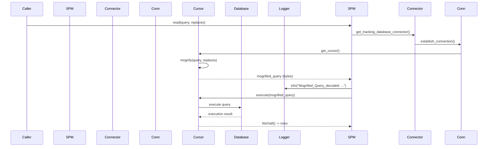

# Diagram: container_tracking_core/container_tracking_service/container_tracking_service/persistence_adapter/postgresql/SearchPostgresqlMapping.py


> Auto-generated by Obscura crawlers

## Diagram 1

```mermaid
classDiagram
class BasePostgresqlMapping {
  +get_tracking_database_connector()
}
class SearchPostgresqlMapping {
  +__init__(table, application_name)
  +read(query, replaces={})
  +search(query)
  <<abstract>> +process(options)
}
BasePostgresqlMapping <|-- SearchPostgresqlMapping
```

> SVG rendering failed for this diagram.

## Diagram 2



> SVG rendering failed for this diagram.
