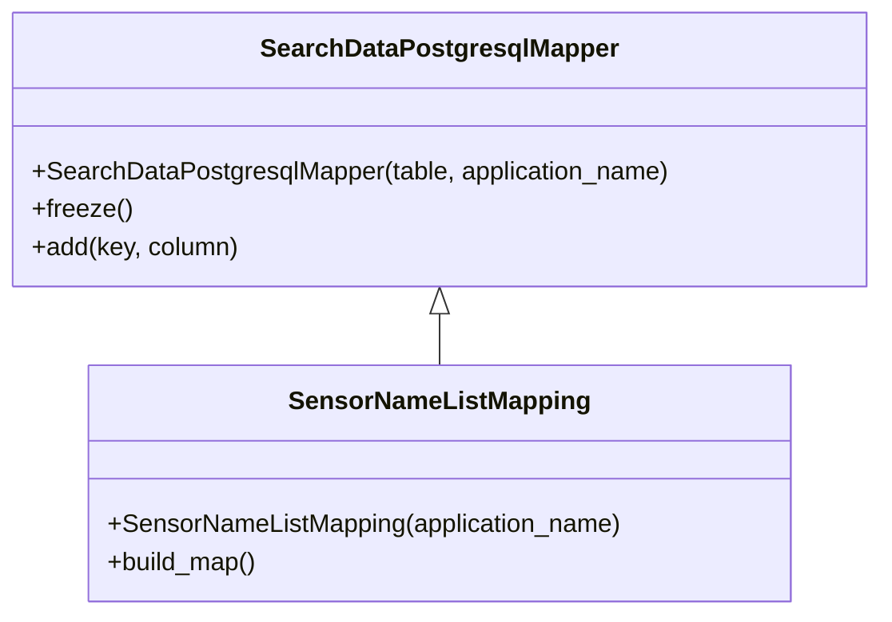

# Diagram: container_tracking_core/container_tracking_service/container_tracking_service/persistence_adapter/postgresql/SensorNameListMapping.py


> Auto-generated by Obscura crawlers

## Diagram 1



### SVG

<svg id="container" width="554.7421875" xmlns="http://www.w3.org/2000/svg" class="classDiagram" height="390" viewBox="0 0 554.7421875 390" role="graphics-document document" aria-roledescription="class"><style>#container{font-family:"trebuchet ms",verdana,arial,sans-serif;font-size:16px;fill:#333;}@keyframes edge-animation-frame{from{stroke-dashoffset:0;}}@keyframes dash{to{stroke-dashoffset:0;}}#container .edge-animation-slow{stroke-dasharray:9,5!important;stroke-dashoffset:900;animation:dash 50s linear infinite;stroke-linecap:round;}#container .edge-animation-fast{stroke-dasharray:9,5!important;stroke-dashoffset:900;animation:dash 20s linear infinite;stroke-linecap:round;}#container .error-icon{fill:#552222;}#container .error-text{fill:#552222;stroke:#552222;}#container .edge-thickness-normal{stroke-width:1px;}#container .edge-thickness-thick{stroke-width:3.5px;}#container .edge-pattern-solid{stroke-dasharray:0;}#container .edge-thickness-invisible{stroke-width:0;fill:none;}#container .edge-pattern-dashed{stroke-dasharray:3;}#container .edge-pattern-dotted{stroke-dasharray:2;}#container .marker{fill:#333333;stroke:#333333;}#container .marker.cross{stroke:#333333;}#container svg{font-family:"trebuchet ms",verdana,arial,sans-serif;font-size:16px;}#container p{margin:0;}#container g.classGroup text{fill:#9370DB;stroke:none;font-family:"trebuchet ms",verdana,arial,sans-serif;font-size:10px;}#container g.classGroup text .title{font-weight:bolder;}#container .nodeLabel,#container .edgeLabel{color:#131300;}#container .edgeLabel .label rect{fill:#ECECFF;}#container .label text{fill:#131300;}#container .labelBkg{background:#ECECFF;}#container .edgeLabel .label span{background:#ECECFF;}#container .classTitle{font-weight:bolder;}#container .node rect,#container .node circle,#container .node ellipse,#container .node polygon,#container .node path{fill:#ECECFF;stroke:#9370DB;stroke-width:1px;}#container .divider{stroke:#9370DB;stroke-width:1;}#container g.clickable{cursor:pointer;}#container g.classGroup rect{fill:#ECECFF;stroke:#9370DB;}#container g.classGroup line{stroke:#9370DB;stroke-width:1;}#container .classLabel .box{stroke:none;stroke-width:0;fill:#ECECFF;opacity:0.5;}#container .classLabel .label{fill:#9370DB;font-size:10px;}#container .relation{stroke:#333333;stroke-width:1;fill:none;}#container .dashed-line{stroke-dasharray:3;}#container .dotted-line{stroke-dasharray:1 2;}#container #compositionStart,#container .composition{fill:#333333!important;stroke:#333333!important;stroke-width:1;}#container #compositionEnd,#container .composition{fill:#333333!important;stroke:#333333!important;stroke-width:1;}#container #dependencyStart,#container .dependency{fill:#333333!important;stroke:#333333!important;stroke-width:1;}#container #dependencyStart,#container .dependency{fill:#333333!important;stroke:#333333!important;stroke-width:1;}#container #extensionStart,#container .extension{fill:transparent!important;stroke:#333333!important;stroke-width:1;}#container #extensionEnd,#container .extension{fill:transparent!important;stroke:#333333!important;stroke-width:1;}#container #aggregationStart,#container .aggregation{fill:transparent!important;stroke:#333333!important;stroke-width:1;}#container #aggregationEnd,#container .aggregation{fill:transparent!important;stroke:#333333!important;stroke-width:1;}#container #lollipopStart,#container .lollipop{fill:#ECECFF!important;stroke:#333333!important;stroke-width:1;}#container #lollipopEnd,#container .lollipop{fill:#ECECFF!important;stroke:#333333!important;stroke-width:1;}#container .edgeTerminals{font-size:11px;line-height:initial;}#container .classTitleText{text-anchor:middle;font-size:18px;fill:#333;}#container .label-icon{display:inline-block;height:1em;overflow:visible;vertical-align:-0.125em;}#container .node .label-icon path{fill:currentColor;stroke:revert;stroke-width:revert;}#container :root{--mermaid-font-family:"trebuchet ms",verdana,arial,sans-serif;}</style><g><defs><marker id="container_class-aggregationStart" class="marker aggregation class" refX="18" refY="7" markerWidth="190" markerHeight="240" orient="auto"><path d="M 18,7 L9,13 L1,7 L9,1 Z"></path></marker></defs><defs><marker id="container_class-aggregationEnd" class="marker aggregation class" refX="1" refY="7" markerWidth="20" markerHeight="28" orient="auto"><path d="M 18,7 L9,13 L1,7 L9,1 Z"></path></marker></defs><defs><marker id="container_class-extensionStart" class="marker extension class" refX="18" refY="7" markerWidth="190" markerHeight="240" orient="auto"><path d="M 1,7 L18,13 V 1 Z"></path></marker></defs><defs><marker id="container_class-extensionEnd" class="marker extension class" refX="1" refY="7" markerWidth="20" markerHeight="28" orient="auto"><path d="M 1,1 V 13 L18,7 Z"></path></marker></defs><defs><marker id="container_class-compositionStart" class="marker composition class" refX="18" refY="7" markerWidth="190" markerHeight="240" orient="auto"><path d="M 18,7 L9,13 L1,7 L9,1 Z"></path></marker></defs><defs><marker id="container_class-compositionEnd" class="marker composition class" refX="1" refY="7" markerWidth="20" markerHeight="28" orient="auto"><path d="M 18,7 L9,13 L1,7 L9,1 Z"></path></marker></defs><defs><marker id="container_class-dependencyStart" class="marker dependency class" refX="6" refY="7" markerWidth="190" markerHeight="240" orient="auto"><path d="M 5,7 L9,13 L1,7 L9,1 Z"></path></marker></defs><defs><marker id="container_class-dependencyEnd" class="marker dependency class" refX="13" refY="7" markerWidth="20" markerHeight="28" orient="auto"><path d="M 18,7 L9,13 L14,7 L9,1 Z"></path></marker></defs><defs><marker id="container_class-lollipopStart" class="marker lollipop class" refX="13" refY="7" markerWidth="190" markerHeight="240" orient="auto"><circle stroke="black" fill="transparent" cx="7" cy="7" r="6"></circle></marker></defs><defs><marker id="container_class-lollipopEnd" class="marker lollipop class" refX="1" refY="7" markerWidth="190" markerHeight="240" orient="auto"><circle stroke="black" fill="transparent" cx="7" cy="7" r="6"></circle></marker></defs><g class="root"><g class="clusters"></g><g class="edgePaths"><path d="M277.371,199.25L277.371,200.542C277.371,201.833,277.371,204.417,277.371,209.875C277.371,215.333,277.371,223.667,277.371,227.833L277.371,232" id="id_SearchDataPostgresqlMapper_SensorNameListMapping_1" class="edge-thickness-normal edge-pattern-solid relation" style=";;;" data-edge="true" data-et="edge" data-id="id_SearchDataPostgresqlMapper_SensorNameListMapping_1" data-points="W3sieCI6Mjc3LjM3MTA5Mzc1LCJ5IjoxODJ9LHsieCI6Mjc3LjM3MTA5Mzc1LCJ5IjoyMDd9LHsieCI6Mjc3LjM3MTA5Mzc1LCJ5IjoyMzJ9XQ==" marker-start="url(#container_class-extensionStart)"></path></g><g class="edgeLabels"><g class="edgeLabel"><g class="label" data-id="id_SearchDataPostgresqlMapper_SensorNameListMapping_1" transform="translate(0, 0)"><foreignObject width="0" height="0"><div xmlns="http://www.w3.org/1999/xhtml" class="labelBkg" style="display: table-cell; white-space: nowrap; line-height: 1.5; max-width: 200px; text-align: center;"><span class="edgeLabel"></span></div></foreignObject></g></g></g><g class="nodes"><g class="node default" id="classId-SearchDataPostgresqlMapper-0" transform="translate(277.37109375, 95)"><g class="basic label-container"><path d="M-269.37109375 -87 L269.37109375 -87 L269.37109375 87 L-269.37109375 87" stroke="none" stroke-width="0" fill="#ECECFF" style=""></path><path d="M-269.37109375 -87 C-117.1555932882672 -87, 35.059907173465604 -87, 269.37109375 -87 M-269.37109375 -87 C-137.87634915799788 -87, -6.381604565995758 -87, 269.37109375 -87 M269.37109375 -87 C269.37109375 -29.333585748275524, 269.37109375 28.33282850344895, 269.37109375 87 M269.37109375 -87 C269.37109375 -27.90521723965272, 269.37109375 31.189565520694558, 269.37109375 87 M269.37109375 87 C57.83635877479503 87, -153.69837620040994 87, -269.37109375 87 M269.37109375 87 C129.98433461618876 87, -9.402424517622478 87, -269.37109375 87 M-269.37109375 87 C-269.37109375 24.4762364566606, -269.37109375 -38.0475270866788, -269.37109375 -87 M-269.37109375 87 C-269.37109375 35.08410787499131, -269.37109375 -16.831784250017378, -269.37109375 -87" stroke="#9370DB" stroke-width="1.3" fill="none" stroke-dasharray="0 0" style=""></path></g><g class="annotation-group text" transform="translate(0, -63)"></g><g class="label-group text" transform="translate(-108.3515625, -63)"><g class="label" style="font-weight: bolder" transform="translate(0,-12)"><foreignObject width="216.703125" height="24"><div xmlns="http://www.w3.org/1999/xhtml" style="display: table-cell; white-space: nowrap; line-height: 1.5; max-width: 263px; text-align: center;"><span class="nodeLabel markdown-node-label" style=""><p>SearchDataPostgresqlMapper</p></span></div></foreignObject></g></g><g class="members-group text" transform="translate(-257.37109375, -15)"></g><g class="methods-group text" transform="translate(-257.37109375, 15)"><g class="label" style="" transform="translate(0,-12)"><foreignObject width="406.390625" height="24"><div xmlns="http://www.w3.org/1999/xhtml" style="display: table-cell; white-space: nowrap; line-height: 1.5; max-width: 464px; text-align: center;"><span class="nodeLabel markdown-node-label" style=""><p>+SearchDataPostgresqlMapper(table, application_name)</p></span></div></foreignObject></g><g class="label" style="" transform="translate(0,12)"><foreignObject width="62.109375" height="24"><div xmlns="http://www.w3.org/1999/xhtml" style="display: table-cell; white-space: nowrap; line-height: 1.5; max-width: 119px; text-align: center;"><span class="nodeLabel markdown-node-label" style=""><p>+freeze()</p></span></div></foreignObject></g><g class="label" style="" transform="translate(0,36)"><foreignObject width="131.734375" height="24"><div xmlns="http://www.w3.org/1999/xhtml" style="display: table-cell; white-space: nowrap; line-height: 1.5; max-width: 189px; text-align: center;"><span class="nodeLabel markdown-node-label" style=""><p>+add(key, column)</p></span></div></foreignObject></g></g><g class="divider" style=""><path d="M-269.37109375 -39 C-159.60696677656242 -39, -49.84283980312483 -39, 269.37109375 -39 M-269.37109375 -39 C-59.681115180343284 -39, 150.00886338931343 -39, 269.37109375 -39" stroke="#9370DB" stroke-width="1.3" fill="none" stroke-dasharray="0 0" style=""></path></g><g class="divider" style=""><path d="M-269.37109375 -15 C-153.80983693339067 -15, -38.24858011678134 -15, 269.37109375 -15 M-269.37109375 -15 C-82.13645218342887 -15, 105.09818938314226 -15, 269.37109375 -15" stroke="#9370DB" stroke-width="1.3" fill="none" stroke-dasharray="0 0" style=""></path></g></g><g class="node default" id="classId-SensorNameListMapping-1" transform="translate(277.37109375, 307)"><g class="basic label-container"><path d="M-221.83203125 -75 L221.83203125 -75 L221.83203125 75 L-221.83203125 75" stroke="none" stroke-width="0" fill="#ECECFF" style=""></path><path d="M-221.83203125 -75 C-60.38669537391925 -75, 101.0586405021615 -75, 221.83203125 -75 M-221.83203125 -75 C-54.939786872115775 -75, 111.95245750576845 -75, 221.83203125 -75 M221.83203125 -75 C221.83203125 -27.637150531547327, 221.83203125 19.725698936905346, 221.83203125 75 M221.83203125 -75 C221.83203125 -34.908738695417576, 221.83203125 5.182522609164849, 221.83203125 75 M221.83203125 75 C46.38240112655504 75, -129.06722899688992 75, -221.83203125 75 M221.83203125 75 C72.71308157060824 75, -76.40586810878352 75, -221.83203125 75 M-221.83203125 75 C-221.83203125 24.905129946518393, -221.83203125 -25.189740106963214, -221.83203125 -75 M-221.83203125 75 C-221.83203125 44.72019114015937, -221.83203125 14.440382280318751, -221.83203125 -75" stroke="#9370DB" stroke-width="1.3" fill="none" stroke-dasharray="0 0" style=""></path></g><g class="annotation-group text" transform="translate(0, -51)"></g><g class="label-group text" transform="translate(-91.0390625, -51)"><g class="label" style="font-weight: bolder" transform="translate(0,-12)"><foreignObject width="182.078125" height="24"><div xmlns="http://www.w3.org/1999/xhtml" style="display: table-cell; white-space: nowrap; line-height: 1.5; max-width: 231px; text-align: center;"><span class="nodeLabel markdown-node-label" style=""><p>SensorNameListMapping</p></span></div></foreignObject></g></g><g class="members-group text" transform="translate(-209.83203125, -3)"></g><g class="methods-group text" transform="translate(-209.83203125, 27)"><g class="label" style="" transform="translate(0,-12)"><foreignObject width="328.625" height="24"><div xmlns="http://www.w3.org/1999/xhtml" style="display: table-cell; white-space: nowrap; line-height: 1.5; max-width: 386px; text-align: center;"><span class="nodeLabel markdown-node-label" style=""><p>+SensorNameListMapping(application_name)</p></span></div></foreignObject></g><g class="label" style="" transform="translate(0,12)"><foreignObject width="96.109375" height="24"><div xmlns="http://www.w3.org/1999/xhtml" style="display: table-cell; white-space: nowrap; line-height: 1.5; max-width: 153px; text-align: center;"><span class="nodeLabel markdown-node-label" style=""><p>+build_map()</p></span></div></foreignObject></g></g><g class="divider" style=""><path d="M-221.83203125 -27 C-101.73512707117308 -27, 18.361777107653836 -27, 221.83203125 -27 M-221.83203125 -27 C-85.530023660735 -27, 50.771983928530005 -27, 221.83203125 -27" stroke="#9370DB" stroke-width="1.3" fill="none" stroke-dasharray="0 0" style=""></path></g><g class="divider" style=""><path d="M-221.83203125 -3 C-71.3343286090215 -3, 79.163374031957 -3, 221.83203125 -3 M-221.83203125 -3 C-63.2013501069851 -3, 95.4293310360298 -3, 221.83203125 -3" stroke="#9370DB" stroke-width="1.3" fill="none" stroke-dasharray="0 0" style=""></path></g></g></g></g></g></svg>

## Diagram 2

```mermaid
flowchart TD
    A[Instantiate SensorNameListMapping(application_name)]
    A --> B[Call SearchDataPostgresqlMapper.__init__ with public.vw_reuse_trip_container_last_event_005 and application_name]
    B --> C[Return to SensorNameListMapping.__init__]
    C --> D[Call super().freeze() -> freeze()]
    C --> E[Call build_map()]
    E --> F[add latest_sensor_name -> latest_sensor_name]
    F --> G[add full_count -> full_count]
```

> SVG rendering failed for this diagram.
