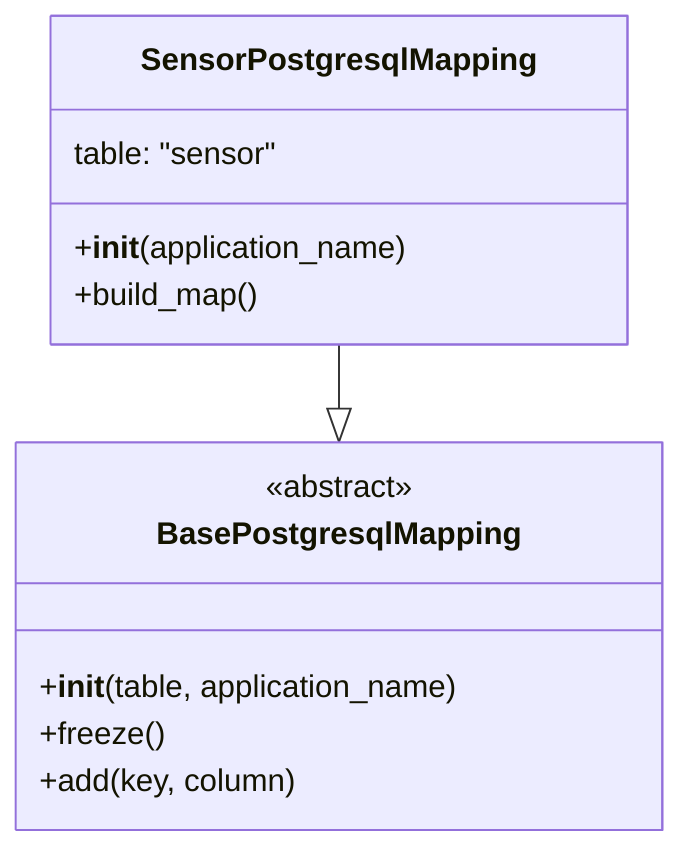

# Diagram: container_tracking_core/container_tracking_service/container_tracking_service/persistence_adapter/postgresql/SensorPostgresqlMapping.py


> Auto-generated by Obscura crawlers

## Diagram 1



### SVG

<svg id="container" width="346.78125" xmlns="http://www.w3.org/2000/svg" class="classDiagram" height="432" viewBox="0 0 346.78125 432" role="graphics-document document" aria-roledescription="class"><style>#container{font-family:"trebuchet ms",verdana,arial,sans-serif;font-size:16px;fill:#333;}@keyframes edge-animation-frame{from{stroke-dashoffset:0;}}@keyframes dash{to{stroke-dashoffset:0;}}#container .edge-animation-slow{stroke-dasharray:9,5!important;stroke-dashoffset:900;animation:dash 50s linear infinite;stroke-linecap:round;}#container .edge-animation-fast{stroke-dasharray:9,5!important;stroke-dashoffset:900;animation:dash 20s linear infinite;stroke-linecap:round;}#container .error-icon{fill:#552222;}#container .error-text{fill:#552222;stroke:#552222;}#container .edge-thickness-normal{stroke-width:1px;}#container .edge-thickness-thick{stroke-width:3.5px;}#container .edge-pattern-solid{stroke-dasharray:0;}#container .edge-thickness-invisible{stroke-width:0;fill:none;}#container .edge-pattern-dashed{stroke-dasharray:3;}#container .edge-pattern-dotted{stroke-dasharray:2;}#container .marker{fill:#333333;stroke:#333333;}#container .marker.cross{stroke:#333333;}#container svg{font-family:"trebuchet ms",verdana,arial,sans-serif;font-size:16px;}#container p{margin:0;}#container g.classGroup text{fill:#9370DB;stroke:none;font-family:"trebuchet ms",verdana,arial,sans-serif;font-size:10px;}#container g.classGroup text .title{font-weight:bolder;}#container .nodeLabel,#container .edgeLabel{color:#131300;}#container .edgeLabel .label rect{fill:#ECECFF;}#container .label text{fill:#131300;}#container .labelBkg{background:#ECECFF;}#container .edgeLabel .label span{background:#ECECFF;}#container .classTitle{font-weight:bolder;}#container .node rect,#container .node circle,#container .node ellipse,#container .node polygon,#container .node path{fill:#ECECFF;stroke:#9370DB;stroke-width:1px;}#container .divider{stroke:#9370DB;stroke-width:1;}#container g.clickable{cursor:pointer;}#container g.classGroup rect{fill:#ECECFF;stroke:#9370DB;}#container g.classGroup line{stroke:#9370DB;stroke-width:1;}#container .classLabel .box{stroke:none;stroke-width:0;fill:#ECECFF;opacity:0.5;}#container .classLabel .label{fill:#9370DB;font-size:10px;}#container .relation{stroke:#333333;stroke-width:1;fill:none;}#container .dashed-line{stroke-dasharray:3;}#container .dotted-line{stroke-dasharray:1 2;}#container #compositionStart,#container .composition{fill:#333333!important;stroke:#333333!important;stroke-width:1;}#container #compositionEnd,#container .composition{fill:#333333!important;stroke:#333333!important;stroke-width:1;}#container #dependencyStart,#container .dependency{fill:#333333!important;stroke:#333333!important;stroke-width:1;}#container #dependencyStart,#container .dependency{fill:#333333!important;stroke:#333333!important;stroke-width:1;}#container #extensionStart,#container .extension{fill:transparent!important;stroke:#333333!important;stroke-width:1;}#container #extensionEnd,#container .extension{fill:transparent!important;stroke:#333333!important;stroke-width:1;}#container #aggregationStart,#container .aggregation{fill:transparent!important;stroke:#333333!important;stroke-width:1;}#container #aggregationEnd,#container .aggregation{fill:transparent!important;stroke:#333333!important;stroke-width:1;}#container #lollipopStart,#container .lollipop{fill:#ECECFF!important;stroke:#333333!important;stroke-width:1;}#container #lollipopEnd,#container .lollipop{fill:#ECECFF!important;stroke:#333333!important;stroke-width:1;}#container .edgeTerminals{font-size:11px;line-height:initial;}#container .classTitleText{text-anchor:middle;font-size:18px;fill:#333;}#container .label-icon{display:inline-block;height:1em;overflow:visible;vertical-align:-0.125em;}#container .node .label-icon path{fill:currentColor;stroke:revert;stroke-width:revert;}#container :root{--mermaid-font-family:"trebuchet ms",verdana,arial,sans-serif;}</style><g><defs><marker id="container_class-aggregationStart" class="marker aggregation class" refX="18" refY="7" markerWidth="190" markerHeight="240" orient="auto"><path d="M 18,7 L9,13 L1,7 L9,1 Z"></path></marker></defs><defs><marker id="container_class-aggregationEnd" class="marker aggregation class" refX="1" refY="7" markerWidth="20" markerHeight="28" orient="auto"><path d="M 18,7 L9,13 L1,7 L9,1 Z"></path></marker></defs><defs><marker id="container_class-extensionStart" class="marker extension class" refX="18" refY="7" markerWidth="190" markerHeight="240" orient="auto"><path d="M 1,7 L18,13 V 1 Z"></path></marker></defs><defs><marker id="container_class-extensionEnd" class="marker extension class" refX="1" refY="7" markerWidth="20" markerHeight="28" orient="auto"><path d="M 1,1 V 13 L18,7 Z"></path></marker></defs><defs><marker id="container_class-compositionStart" class="marker composition class" refX="18" refY="7" markerWidth="190" markerHeight="240" orient="auto"><path d="M 18,7 L9,13 L1,7 L9,1 Z"></path></marker></defs><defs><marker id="container_class-compositionEnd" class="marker composition class" refX="1" refY="7" markerWidth="20" markerHeight="28" orient="auto"><path d="M 18,7 L9,13 L1,7 L9,1 Z"></path></marker></defs><defs><marker id="container_class-dependencyStart" class="marker dependency class" refX="6" refY="7" markerWidth="190" markerHeight="240" orient="auto"><path d="M 5,7 L9,13 L1,7 L9,1 Z"></path></marker></defs><defs><marker id="container_class-dependencyEnd" class="marker dependency class" refX="13" refY="7" markerWidth="20" markerHeight="28" orient="auto"><path d="M 18,7 L9,13 L14,7 L9,1 Z"></path></marker></defs><defs><marker id="container_class-lollipopStart" class="marker lollipop class" refX="13" refY="7" markerWidth="190" markerHeight="240" orient="auto"><circle stroke="black" fill="transparent" cx="7" cy="7" r="6"></circle></marker></defs><defs><marker id="container_class-lollipopEnd" class="marker lollipop class" refX="1" refY="7" markerWidth="190" markerHeight="240" orient="auto"><circle stroke="black" fill="transparent" cx="7" cy="7" r="6"></circle></marker></defs><g class="root"><g class="clusters"></g><g class="edgePaths"><path d="M173.391,176L173.391,180.167C173.391,184.333,173.391,192.667,173.391,198.125C173.391,203.583,173.391,206.167,173.391,207.458L173.391,208.75" id="id_SensorPostgresqlMapping_BasePostgresqlMapping_1" class="edge-thickness-normal edge-pattern-solid relation" style=";;;" data-edge="true" data-et="edge" data-id="id_SensorPostgresqlMapping_BasePostgresqlMapping_1" data-points="W3sieCI6MTczLjM5MDYyNSwieSI6MTc2fSx7IngiOjE3My4zOTA2MjUsInkiOjIwMX0seyJ4IjoxNzMuMzkwNjI1LCJ5IjoyMjZ9XQ==" marker-end="url(#container_class-extensionEnd)"></path></g><g class="edgeLabels"><g class="edgeLabel"><g class="label" data-id="id_SensorPostgresqlMapping_BasePostgresqlMapping_1" transform="translate(0, 0)"><foreignObject width="0" height="0"><div xmlns="http://www.w3.org/1999/xhtml" class="labelBkg" style="display: table-cell; white-space: nowrap; line-height: 1.5; max-width: 200px; text-align: center;"><span class="edgeLabel"></span></div></foreignObject></g></g></g><g class="nodes"><g class="node default" id="classId-BasePostgresqlMapping-0" transform="translate(173.390625, 325)"><g class="basic label-container"><path d="M-165.390625 -99 L165.390625 -99 L165.390625 99 L-165.390625 99" stroke="none" stroke-width="0" fill="#ECECFF" style=""></path><path d="M-165.390625 -99 C-86.94400035801978 -99, -8.497375716039556 -99, 165.390625 -99 M-165.390625 -99 C-90.23019413601318 -99, -15.069763272026364 -99, 165.390625 -99 M165.390625 -99 C165.390625 -23.724053972911875, 165.390625 51.55189205417625, 165.390625 99 M165.390625 -99 C165.390625 -33.50519111667556, 165.390625 31.989617766648877, 165.390625 99 M165.390625 99 C81.63449744889606 99, -2.121630102207888 99, -165.390625 99 M165.390625 99 C56.82014391403659 99, -51.750337171926816 99, -165.390625 99 M-165.390625 99 C-165.390625 33.57091919454574, -165.390625 -31.858161610908525, -165.390625 -99 M-165.390625 99 C-165.390625 47.54875461792791, -165.390625 -3.9024907641441757, -165.390625 -99" stroke="#9370DB" stroke-width="1.3" fill="none" stroke-dasharray="0 0" style=""></path></g><g class="annotation-group text" transform="translate(-38.609375, -75)"><g class="label" style="" transform="translate(0,-12)"><foreignObject width="77.21875" height="24"><div xmlns="http://www.w3.org/1999/xhtml" style="display: table-cell; white-space: nowrap; line-height: 1.5; max-width: 127px; text-align: center;"><span class="nodeLabel markdown-node-label" style=""><p>«abstract»</p></span></div></foreignObject></g></g><g class="label-group text" transform="translate(-87.921875, -51)"><g class="label" style="font-weight: bolder" transform="translate(0,-12)"><foreignObject width="175.84375" height="24"><div xmlns="http://www.w3.org/1999/xhtml" style="display: table-cell; white-space: nowrap; line-height: 1.5; max-width: 223px; text-align: center;"><span class="nodeLabel markdown-node-label" style=""><p>BasePostgresqlMapping</p></span></div></foreignObject></g></g><g class="members-group text" transform="translate(-153.390625, -3)"></g><g class="methods-group text" transform="translate(-153.390625, 27)"><g class="label" style="" transform="translate(0,-12)"><foreignObject width="218.859375" height="24"><div xmlns="http://www.w3.org/1999/xhtml" style="display: table-cell; white-space: nowrap; line-height: 1.5; max-width: 308px; text-align: center;"><span class="nodeLabel markdown-node-label" style=""><p>+<strong>init</strong>(table, application_name)</p></span></div></foreignObject></g><g class="label" style="" transform="translate(0,12)"><foreignObject width="62.109375" height="24"><div xmlns="http://www.w3.org/1999/xhtml" style="display: table-cell; white-space: nowrap; line-height: 1.5; max-width: 119px; text-align: center;"><span class="nodeLabel markdown-node-label" style=""><p>+freeze()</p></span></div></foreignObject></g><g class="label" style="" transform="translate(0,36)"><foreignObject width="131.734375" height="24"><div xmlns="http://www.w3.org/1999/xhtml" style="display: table-cell; white-space: nowrap; line-height: 1.5; max-width: 189px; text-align: center;"><span class="nodeLabel markdown-node-label" style=""><p>+add(key, column)</p></span></div></foreignObject></g></g><g class="divider" style=""><path d="M-165.390625 -27 C-58.66546126294317 -27, 48.059702474113664 -27, 165.390625 -27 M-165.390625 -27 C-63.367130995849806 -27, 38.65636300830039 -27, 165.390625 -27" stroke="#9370DB" stroke-width="1.3" fill="none" stroke-dasharray="0 0" style=""></path></g><g class="divider" style=""><path d="M-165.390625 -3 C-92.83794145502766 -3, -20.28525791005532 -3, 165.390625 -3 M-165.390625 -3 C-89.67981703735846 -3, -13.969009074716922 -3, 165.390625 -3" stroke="#9370DB" stroke-width="1.3" fill="none" stroke-dasharray="0 0" style=""></path></g></g><g class="node default" id="classId-SensorPostgresqlMapping-1" transform="translate(173.390625, 92)"><g class="basic label-container"><path d="M-146.74609375 -84 L146.74609375 -84 L146.74609375 84 L-146.74609375 84" stroke="none" stroke-width="0" fill="#ECECFF" style=""></path><path d="M-146.74609375 -84 C-64.12629786746376 -84, 18.493498015072475 -84, 146.74609375 -84 M-146.74609375 -84 C-64.49490132179986 -84, 17.756291106400283 -84, 146.74609375 -84 M146.74609375 -84 C146.74609375 -31.068262596771397, 146.74609375 21.863474806457205, 146.74609375 84 M146.74609375 -84 C146.74609375 -50.02097887078186, 146.74609375 -16.04195774156372, 146.74609375 84 M146.74609375 84 C69.37743891751757 84, -7.991215914964869 84, -146.74609375 84 M146.74609375 84 C76.36813444500571 84, 5.9901751400114165 84, -146.74609375 84 M-146.74609375 84 C-146.74609375 47.16185650607582, -146.74609375 10.323713012151643, -146.74609375 -84 M-146.74609375 84 C-146.74609375 43.303342685811614, -146.74609375 2.6066853716232288, -146.74609375 -84" stroke="#9370DB" stroke-width="1.3" fill="none" stroke-dasharray="0 0" style=""></path></g><g class="annotation-group text" transform="translate(0, -60)"></g><g class="label-group text" transform="translate(-95.7578125, -60)"><g class="label" style="font-weight: bolder" transform="translate(0,-12)"><foreignObject width="191.515625" height="24"><div xmlns="http://www.w3.org/1999/xhtml" style="display: table-cell; white-space: nowrap; line-height: 1.5; max-width: 238px; text-align: center;"><span class="nodeLabel markdown-node-label" style=""><p>SensorPostgresqlMapping</p></span></div></foreignObject></g></g><g class="members-group text" transform="translate(-134.74609375, -12)"><g class="label" style="" transform="translate(0,-12)"><foreignObject width="106.515625" height="24"><div xmlns="http://www.w3.org/1999/xhtml" style="display: table-cell; white-space: nowrap; line-height: 1.5; max-width: 157px; text-align: center;"><span class="nodeLabel markdown-node-label" style=""><p>table: "sensor"</p></span></div></foreignObject></g></g><g class="methods-group text" transform="translate(-134.74609375, 36)"><g class="label" style="" transform="translate(0,-12)"><foreignObject width="173.734375" height="24"><div xmlns="http://www.w3.org/1999/xhtml" style="display: table-cell; white-space: nowrap; line-height: 1.5; max-width: 263px; text-align: center;"><span class="nodeLabel markdown-node-label" style=""><p>+<strong>init</strong>(application_name)</p></span></div></foreignObject></g><g class="label" style="" transform="translate(0,12)"><foreignObject width="96.109375" height="24"><div xmlns="http://www.w3.org/1999/xhtml" style="display: table-cell; white-space: nowrap; line-height: 1.5; max-width: 153px; text-align: center;"><span class="nodeLabel markdown-node-label" style=""><p>+build_map()</p></span></div></foreignObject></g></g><g class="divider" style=""><path d="M-146.74609375 -36 C-59.844128900173246 -36, 27.05783594965351 -36, 146.74609375 -36 M-146.74609375 -36 C-53.86996547062034 -36, 39.00616280875931 -36, 146.74609375 -36" stroke="#9370DB" stroke-width="1.3" fill="none" stroke-dasharray="0 0" style=""></path></g><g class="divider" style=""><path d="M-146.74609375 12 C-65.080139311653 12, 16.585815126694 12, 146.74609375 12 M-146.74609375 12 C-40.341773646357225 12, 66.06254645728555 12, 146.74609375 12" stroke="#9370DB" stroke-width="1.3" fill="none" stroke-dasharray="0 0" style=""></path></g></g></g></g></g></svg>

## Diagram 2

```mermaid
flowchart TD
    BM[SensorPostgresqlMapping.build_map()] --> A["id → id"]
    A --> B["ts → ts"]
    B --> C["modified → modified"]
    C --> D["device_id → device_id"]
    D --> E["inspector_id → inspector_id"]
    E --> F["device_type → device_type"]
    F --> G["device_name → device_name"]
    G --> H["sensor_id → sensor_id"]
    H --> I["solution_id → solution_id"]
    I --> J["latest_sensor_update → latest_sensor_update"]
    J --> K([done])
```

> SVG rendering failed for this diagram.
