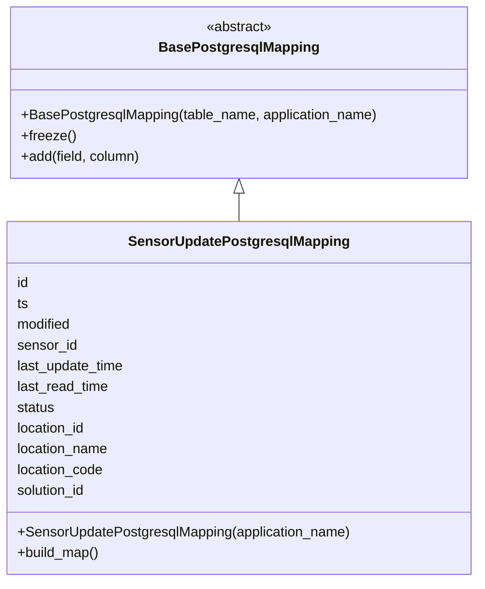
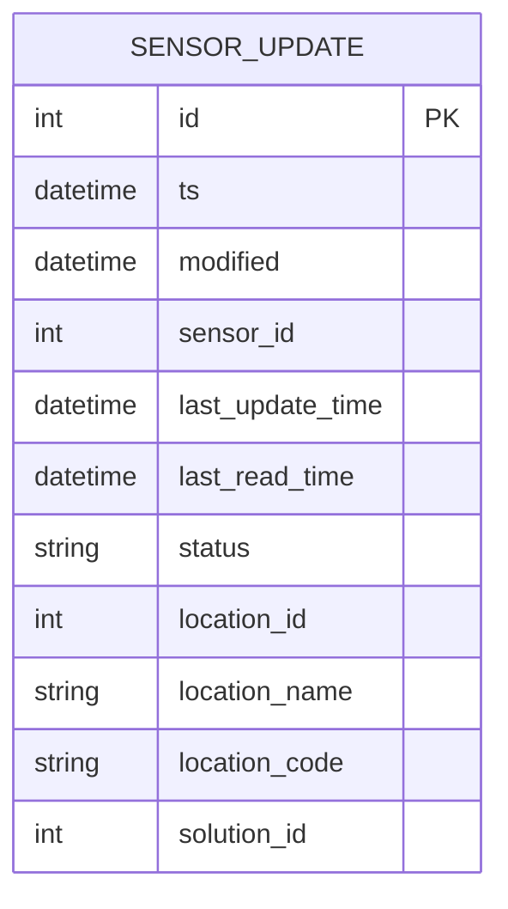

# Diagram: container_tracking_core/container_tracking_service/container_tracking_service/persistence_adapter/postgresql/SensorUpdatePostgresqlMapping.py

> Auto-generated by Obscura crawlers

## Diagram 1

> SVG rendering failed for this diagram.

## Diagram 2

### SVG

<svg id="container" width="301.140625" xmlns="http://www.w3.org/2000/svg" class="erDiagram" height="529" viewBox="0 0 301.140625 529" role="graphics-document document" aria-roledescription="er"><g><defs><marker id="container_er-onlyOneStart" class="marker onlyOne er" refX="0" refY="9" markerWidth="18" markerHeight="18" orient="auto"><path d="M9,0 L9,18 M15,0 L15,18"></path></marker></defs><defs><marker id="container_er-onlyOneEnd" class="marker onlyOne er" refX="18" refY="9" markerWidth="18" markerHeight="18" orient="auto"><path d="M3,0 L3,18 M9,0 L9,18"></path></marker></defs><defs><marker id="container_er-zeroOrOneStart" class="marker zeroOrOne er" refX="0" refY="9" markerWidth="30" markerHeight="18" orient="auto"><circle fill="white" cx="21" cy="9" r="6"></circle><path d="M9,0 L9,18"></path></marker></defs><defs><marker id="container_er-zeroOrOneEnd" class="marker zeroOrOne er" refX="30" refY="9" markerWidth="30" markerHeight="18" orient="auto"><circle fill="white" cx="9" cy="9" r="6"></circle><path d="M21,0 L21,18"></path></marker></defs><defs><marker id="container_er-oneOrMoreStart" class="marker oneOrMore er" refX="18" refY="18" markerWidth="45" markerHeight="36" orient="auto"><path d="M0,18 Q 18,0 36,18 Q 18,36 0,18 M42,9 L42,27"></path></marker></defs><defs><marker id="container_er-oneOrMoreEnd" class="marker oneOrMore er" refX="27" refY="18" markerWidth="45" markerHeight="36" orient="auto"><path d="M3,9 L3,27 M9,18 Q27,0 45,18 Q27,36 9,18"></path></marker></defs><defs><marker id="container_er-zeroOrMoreStart" class="marker zeroOrMore er" refX="18" refY="18" markerWidth="57" markerHeight="36" orient="auto"><circle fill="white" cx="48" cy="18" r="6"></circle><path d="M0,18 Q18,0 36,18 Q18,36 0,18"></path></marker></defs><defs><marker id="container_er-zeroOrMoreEnd" class="marker zeroOrMore er" refX="39" refY="18" markerWidth="57" markerHeight="36" orient="auto"><circle fill="white" cx="9" cy="18" r="6"></circle><path d="M21,18 Q39,0 57,18 Q39,36 21,18"></path></marker></defs><g class="root"><g class="clusters"></g><g class="edgePaths"></g><g class="edgeLabels"></g><g class="nodes"><g class="node default" id="entity-SENSOR_UPDATE-0" transform="translate(150.5703125, 264.5)"><g style=""><path d="M-142.5703125 -256.5 L142.5703125 -256.5 L142.5703125 256.5 L-142.5703125 256.5" stroke="none" stroke-width="0" fill="#ECECFF"></path><path d="M-142.5703125 -256.5 C-64.5323457658323 -256.5, 13.505620968335393 -256.5, 142.5703125 -256.5 M-142.5703125 -256.5 C-44.11268624221775 -256.5, 54.344940015564504 -256.5, 142.5703125 -256.5 M142.5703125 -256.5 C142.5703125 -122.54450265484004, 142.5703125 11.41099469031991, 142.5703125 256.5 M142.5703125 -256.5 C142.5703125 -108.8600753200871, 142.5703125 38.77984935982579, 142.5703125 256.5 M142.5703125 256.5 C48.42251435042064 256.5, -45.72528379915872 256.5, -142.5703125 256.5 M142.5703125 256.5 C39.79997695767737 256.5, -62.970358584645254 256.5, -142.5703125 256.5 M-142.5703125 256.5 C-142.5703125 70.62180263397798, -142.5703125 -115.25639473204404, -142.5703125 -256.5 M-142.5703125 256.5 C-142.5703125 117.14283013308858, -142.5703125 -22.21433973382284, -142.5703125 -256.5" stroke="#9370DB" stroke-width="1.3" fill="none" stroke-dasharray="0 0"></path></g><g style="" class="row-rect-odd"><path d="M-142.5703125 -213.75 L142.5703125 -213.75 L142.5703125 -171 L-142.5703125 -171" stroke="none" stroke-width="0" fill="hsl(240, 100%, 100%)"></path><path d="M-142.5703125 -213.75 C-80.36117111118276 -213.75, -18.152029722365498 -213.75, 142.5703125 -213.75 M-142.5703125 -213.75 C-60.88632379187577 -213.75, 20.797664916248465 -213.75, 142.5703125 -213.75 M142.5703125 -213.75 C142.5703125 -204.28615291272197, 142.5703125 -194.82230582544392, 142.5703125 -171 M142.5703125 -213.75 C142.5703125 -203.7134403871112, 142.5703125 -193.6768807742224, 142.5703125 -171 M142.5703125 -171 C29.606379907881617 -171, -83.35755268423677 -171, -142.5703125 -171 M142.5703125 -171 C64.72270933871857 -171, -13.124893822562854 -171, -142.5703125 -171 M-142.5703125 -171 C-142.5703125 -184.34108097279338, -142.5703125 -197.68216194558676, -142.5703125 -213.75 M-142.5703125 -171 C-142.5703125 -187.10783934937635, -142.5703125 -203.2156786987527, -142.5703125 -213.75" stroke="#9370DB" stroke-width="1.3" fill="none" stroke-dasharray="0 0"></path></g><g style="" class="row-rect-even"><path d="M-142.5703125 -171 L142.5703125 -171 L142.5703125 -128.25 L-142.5703125 -128.25" stroke="none" stroke-width="0" fill="hsl(240, 100%, 97.2745098039%)"></path><path d="M-142.5703125 -171 C-84.73660651507893 -171, -26.90290053015788 -171, 142.5703125 -171 M-142.5703125 -171 C-60.08378159741281 -171, 22.402749305174382 -171, 142.5703125 -171 M142.5703125 -171 C142.5703125 -157.4795297554859, 142.5703125 -143.95905951097183, 142.5703125 -128.25 M142.5703125 -171 C142.5703125 -161.68549819861144, 142.5703125 -152.37099639722285, 142.5703125 -128.25 M142.5703125 -128.25 C57.86562268024231 -128.25, -26.83906713951538 -128.25, -142.5703125 -128.25 M142.5703125 -128.25 C64.99587711498147 -128.25, -12.578558270037064 -128.25, -142.5703125 -128.25 M-142.5703125 -128.25 C-142.5703125 -143.75283494412432, -142.5703125 -159.25566988824866, -142.5703125 -171 M-142.5703125 -128.25 C-142.5703125 -141.02059662825738, -142.5703125 -153.79119325651476, -142.5703125 -171" stroke="#9370DB" stroke-width="1.3" fill="none" stroke-dasharray="0 0"></path></g><g style="" class="row-rect-odd"><path d="M-142.5703125 -128.25 L142.5703125 -128.25 L142.5703125 -85.5 L-142.5703125 -85.5" stroke="none" stroke-width="0" fill="hsl(240, 100%, 100%)"></path><path d="M-142.5703125 -128.25 C-51.052425507639654 -128.25, 40.46546148472069 -128.25, 142.5703125 -128.25 M-142.5703125 -128.25 C-65.86169265561169 -128.25, 10.846927188776618 -128.25, 142.5703125 -128.25 M142.5703125 -128.25 C142.5703125 -111.44776209523623, 142.5703125 -94.64552419047246, 142.5703125 -85.5 M142.5703125 -128.25 C142.5703125 -119.05888675321972, 142.5703125 -109.86777350643945, 142.5703125 -85.5 M142.5703125 -85.5 C56.89439741815802 -85.5, -28.781517663683957 -85.5, -142.5703125 -85.5 M142.5703125 -85.5 C62.49244849304043 -85.5, -17.585415513919145 -85.5, -142.5703125 -85.5 M-142.5703125 -85.5 C-142.5703125 -101.90683009552149, -142.5703125 -118.31366019104298, -142.5703125 -128.25 M-142.5703125 -85.5 C-142.5703125 -97.95391438425746, -142.5703125 -110.40782876851493, -142.5703125 -128.25" stroke="#9370DB" stroke-width="1.3" fill="none" stroke-dasharray="0 0"></path></g><g style="" class="row-rect-even"><path d="M-142.5703125 -85.5 L142.5703125 -85.5 L142.5703125 -42.75 L-142.5703125 -42.75" stroke="none" stroke-width="0" fill="hsl(240, 100%, 97.2745098039%)"></path><path d="M-142.5703125 -85.5 C-45.6776901418 -85.5, 51.2149322164 -85.5, 142.5703125 -85.5 M-142.5703125 -85.5 C-52.81980563683854 -85.5, 36.930701226322924 -85.5, 142.5703125 -85.5 M142.5703125 -85.5 C142.5703125 -75.83344781227008, 142.5703125 -66.16689562454016, 142.5703125 -42.75 M142.5703125 -85.5 C142.5703125 -76.57541203842761, 142.5703125 -67.65082407685523, 142.5703125 -42.75 M142.5703125 -42.75 C63.11687138186342 -42.75, -16.336569736273162 -42.75, -142.5703125 -42.75 M142.5703125 -42.75 C50.52609863332317 -42.75, -41.518115233353655 -42.75, -142.5703125 -42.75 M-142.5703125 -42.75 C-142.5703125 -54.10169763608509, -142.5703125 -65.45339527217018, -142.5703125 -85.5 M-142.5703125 -42.75 C-142.5703125 -51.786428156570075, -142.5703125 -60.82285631314015, -142.5703125 -85.5" stroke="#9370DB" stroke-width="1.3" fill="none" stroke-dasharray="0 0"></path></g><g style="" class="row-rect-odd"><path d="M-142.5703125 -42.75 L142.5703125 -42.75 L142.5703125 0 L-142.5703125 0" stroke="none" stroke-width="0" fill="hsl(240, 100%, 100%)"></path><path d="M-142.5703125 -42.75 C-82.39828397934409 -42.75, -22.226255458688158 -42.75, 142.5703125 -42.75 M-142.5703125 -42.75 C-77.92822564864291 -42.75, -13.286138797285815 -42.75, 142.5703125 -42.75 M142.5703125 -42.75 C142.5703125 -29.395371470643422, 142.5703125 -16.040742941286844, 142.5703125 0 M142.5703125 -42.75 C142.5703125 -29.88400763956036, 142.5703125 -17.018015279120718, 142.5703125 0 M142.5703125 0 C37.25509487475705 0, -68.0601227504859 0, -142.5703125 0 M142.5703125 0 C45.57215829967272 0, -51.425995900654556 0, -142.5703125 0 M-142.5703125 0 C-142.5703125 -10.931663668385255, -142.5703125 -21.86332733677051, -142.5703125 -42.75 M-142.5703125 0 C-142.5703125 -16.353020034709484, -142.5703125 -32.70604006941897, -142.5703125 -42.75" stroke="#9370DB" stroke-width="1.3" fill="none" stroke-dasharray="0 0"></path></g><g style="" class="row-rect-even"><path d="M-142.5703125 0 L142.5703125 0 L142.5703125 42.75 L-142.5703125 42.75" stroke="none" stroke-width="0" fill="hsl(240, 100%, 97.2745098039%)"></path><path d="M-142.5703125 0 C-79.18662461431083 0, -15.80293672862166 0, 142.5703125 0 M-142.5703125 0 C-84.29861079554172 0, -26.026909091083425 0, 142.5703125 0 M142.5703125 0 C142.5703125 12.100331263286662, 142.5703125 24.200662526573325, 142.5703125 42.75 M142.5703125 0 C142.5703125 13.41694053188043, 142.5703125 26.83388106376086, 142.5703125 42.75 M142.5703125 42.75 C40.95561233004503 42.75, -60.659087839909944 42.75, -142.5703125 42.75 M142.5703125 42.75 C52.909076381140466 42.75, -36.75215973771907 42.75, -142.5703125 42.75 M-142.5703125 42.75 C-142.5703125 25.697276565791064, -142.5703125 8.644553131582128, -142.5703125 0 M-142.5703125 42.75 C-142.5703125 26.479424603512516, -142.5703125 10.208849207025033, -142.5703125 0" stroke="#9370DB" stroke-width="1.3" fill="none" stroke-dasharray="0 0"></path></g><g style="" class="row-rect-odd"><path d="M-142.5703125 42.75 L142.5703125 42.75 L142.5703125 85.5 L-142.5703125 85.5" stroke="none" stroke-width="0" fill="hsl(240, 100%, 100%)"></path><path d="M-142.5703125 42.75 C-74.17016539247544 42.75, -5.770018284950879 42.75, 142.5703125 42.75 M-142.5703125 42.75 C-70.53502440695742 42.75, 1.5002636860851624 42.75, 142.5703125 42.75 M142.5703125 42.75 C142.5703125 58.00906965744646, 142.5703125 73.26813931489292, 142.5703125 85.5 M142.5703125 42.75 C142.5703125 52.200909222504755, 142.5703125 61.65181844500951, 142.5703125 85.5 M142.5703125 85.5 C79.61737446512362 85.5, 16.66443643024725 85.5, -142.5703125 85.5 M142.5703125 85.5 C43.10848583591975 85.5, -56.3533408281605 85.5, -142.5703125 85.5 M-142.5703125 85.5 C-142.5703125 69.41354252030762, -142.5703125 53.32708504061523, -142.5703125 42.75 M-142.5703125 85.5 C-142.5703125 70.70154258497855, -142.5703125 55.90308516995711, -142.5703125 42.75" stroke="#9370DB" stroke-width="1.3" fill="none" stroke-dasharray="0 0"></path></g><g style="" class="row-rect-even"><path d="M-142.5703125 85.5 L142.5703125 85.5 L142.5703125 128.25 L-142.5703125 128.25" stroke="none" stroke-width="0" fill="hsl(240, 100%, 97.2745098039%)"></path><path d="M-142.5703125 85.5 C-81.23682712185258 85.5, -19.90334174370517 85.5, 142.5703125 85.5 M-142.5703125 85.5 C-68.64850407979259 85.5, 5.273304340414825 85.5, 142.5703125 85.5 M142.5703125 85.5 C142.5703125 94.96547585637808, 142.5703125 104.43095171275615, 142.5703125 128.25 M142.5703125 85.5 C142.5703125 102.05546283438814, 142.5703125 118.61092566877628, 142.5703125 128.25 M142.5703125 128.25 C81.21075246500354 128.25, 19.851192430007075 128.25, -142.5703125 128.25 M142.5703125 128.25 C49.043136829622554 128.25, -44.48403884075489 128.25, -142.5703125 128.25 M-142.5703125 128.25 C-142.5703125 118.92324709708687, -142.5703125 109.59649419417374, -142.5703125 85.5 M-142.5703125 128.25 C-142.5703125 114.91560313874302, -142.5703125 101.58120627748603, -142.5703125 85.5" stroke="#9370DB" stroke-width="1.3" fill="none" stroke-dasharray="0 0"></path></g><g style="" class="row-rect-odd"><path d="M-142.5703125 128.25 L142.5703125 128.25 L142.5703125 171 L-142.5703125 171" stroke="none" stroke-width="0" fill="hsl(240, 100%, 100%)"></path><path d="M-142.5703125 128.25 C-68.52551593352236 128.25, 5.519280632955287 128.25, 142.5703125 128.25 M-142.5703125 128.25 C-51.213669002806014 128.25, 40.14297449438797 128.25, 142.5703125 128.25 M142.5703125 128.25 C142.5703125 141.6031312861965, 142.5703125 154.95626257239297, 142.5703125 171 M142.5703125 128.25 C142.5703125 143.47480554218657, 142.5703125 158.69961108437317, 142.5703125 171 M142.5703125 171 C37.14433218462881 171, -68.28164813074238 171, -142.5703125 171 M142.5703125 171 C66.56466746025066 171, -9.440977579498679 171, -142.5703125 171 M-142.5703125 171 C-142.5703125 157.85205567228115, -142.5703125 144.7041113445623, -142.5703125 128.25 M-142.5703125 171 C-142.5703125 161.7569733163411, -142.5703125 152.51394663268218, -142.5703125 128.25" stroke="#9370DB" stroke-width="1.3" fill="none" stroke-dasharray="0 0"></path></g><g style="" class="row-rect-even"><path d="M-142.5703125 171 L142.5703125 171 L142.5703125 213.75 L-142.5703125 213.75" stroke="none" stroke-width="0" fill="hsl(240, 100%, 97.2745098039%)"></path><path d="M-142.5703125 171 C-63.92600555192277 171, 14.718301396154459 171, 142.5703125 171 M-142.5703125 171 C-29.443494852743626 171, 83.68332279451275 171, 142.5703125 171 M142.5703125 171 C142.5703125 187.16715986420473, 142.5703125 203.33431972840947, 142.5703125 213.75 M142.5703125 171 C142.5703125 185.1853092511078, 142.5703125 199.37061850221565, 142.5703125 213.75 M142.5703125 213.75 C29.576019288636587 213.75, -83.41827392272683 213.75, -142.5703125 213.75 M142.5703125 213.75 C39.81088520285647 213.75, -62.94854209428706 213.75, -142.5703125 213.75 M-142.5703125 213.75 C-142.5703125 199.14756000585984, -142.5703125 184.54512001171966, -142.5703125 171 M-142.5703125 213.75 C-142.5703125 203.1900042746421, -142.5703125 192.63000854928416, -142.5703125 171" stroke="#9370DB" stroke-width="1.3" fill="none" stroke-dasharray="0 0"></path></g><g style="" class="row-rect-odd"><path d="M-142.5703125 213.75 L142.5703125 213.75 L142.5703125 256.5 L-142.5703125 256.5" stroke="none" stroke-width="0" fill="hsl(240, 100%, 100%)"></path><path d="M-142.5703125 213.75 C-44.95463859971373 213.75, 52.661035300572536 213.75, 142.5703125 213.75 M-142.5703125 213.75 C-40.10751714622255 213.75, 62.3552782075549 213.75, 142.5703125 213.75 M142.5703125 213.75 C142.5703125 229.6079542153373, 142.5703125 245.46590843067457, 142.5703125 256.5 M142.5703125 213.75 C142.5703125 230.4188992774575, 142.5703125 247.08779855491503, 142.5703125 256.5 M142.5703125 256.5 C31.277420848217858 256.5, -80.01547080356428 256.5, -142.5703125 256.5 M142.5703125 256.5 C50.271902121513136 256.5, -42.02650825697373 256.5, -142.5703125 256.5 M-142.5703125 256.5 C-142.5703125 240.74386015336503, -142.5703125 224.98772030673007, -142.5703125 213.75 M-142.5703125 256.5 C-142.5703125 244.56737436642283, -142.5703125 232.63474873284565, -142.5703125 213.75" stroke="#9370DB" stroke-width="1.3" fill="none" stroke-dasharray="0 0"></path></g><g class="label name" transform="translate(-60.3828125, -247.125)" style=""><foreignObject width="120.765625" height="24">

SENSOR_UPDATE

</foreignObject></g><g class="label attribute-type" transform="translate(-130.0703125, -204.375)" style=""><foreignObject width="19.671875" height="24">

int

</foreignObject></g><g class="label attribute-name" transform="translate(-39.8203125, -204.375)" style=""><foreignObject width="14.09375" height="24">

id

</foreignObject></g><g class="label attribute-keys" transform="translate(111.3359375, -204.375)" style=""><foreignObject width="18.734375" height="24">

PK

</foreignObject></g><g class="label attribute-comment" transform="translate(155.0703125, -204.375)" style=""><foreignObject width="0" height="0">

</foreignObject></g><g class="label attribute-type" transform="translate(-130.0703125, -161.625)" style=""><foreignObject width="65.25" height="24">

datetime

</foreignObject></g><g class="label attribute-name" transform="translate(-39.8203125, -161.625)" style=""><foreignObject width="13.25" height="24">

ts

</foreignObject></g><g class="label attribute-keys" transform="translate(111.3359375, -161.625)" style=""><foreignObject width="0" height="0">

</foreignObject></g><g class="label attribute-comment" transform="translate(155.0703125, -161.625)" style=""><foreignObject width="0" height="0">

</foreignObject></g><g class="label attribute-type" transform="translate(-130.0703125, -118.875)" style=""><foreignObject width="65.25" height="24">

datetime

</foreignObject></g><g class="label attribute-name" transform="translate(-39.8203125, -118.875)" style=""><foreignObject width="64.625" height="24">

modified

</foreignObject></g><g class="label attribute-keys" transform="translate(111.3359375, -118.875)" style=""><foreignObject width="0" height="0">

</foreignObject></g><g class="label attribute-comment" transform="translate(155.0703125, -118.875)" style=""><foreignObject width="0" height="0">

</foreignObject></g><g class="label attribute-type" transform="translate(-130.0703125, -76.125)" style=""><foreignObject width="19.671875" height="24">

int

</foreignObject></g><g class="label attribute-name" transform="translate(-39.8203125, -76.125)" style=""><foreignObject width="69.6875" height="24">

sensor_id

</foreignObject></g><g class="label attribute-keys" transform="translate(111.3359375, -76.125)" style=""><foreignObject width="0" height="0">

</foreignObject></g><g class="label attribute-comment" transform="translate(155.0703125, -76.125)" style=""><foreignObject width="0" height="0">

</foreignObject></g><g class="label attribute-type" transform="translate(-130.0703125, -33.375)" style=""><foreignObject width="65.25" height="24">

datetime

</foreignObject></g><g class="label attribute-name" transform="translate(-39.8203125, -33.375)" style=""><foreignObject width="126.15625" height="24">

last_update_time

</foreignObject></g><g class="label attribute-keys" transform="translate(111.3359375, -33.375)" style=""><foreignObject width="0" height="0">

</foreignObject></g><g class="label attribute-comment" transform="translate(155.0703125, -33.375)" style=""><foreignObject width="0" height="0">

</foreignObject></g><g class="label attribute-type" transform="translate(-130.0703125, 9.375)" style=""><foreignObject width="65.25" height="24">

datetime

</foreignObject></g><g class="label attribute-name" transform="translate(-39.8203125, 9.375)" style=""><foreignObject width="107.96875" height="24">

last_read_time

</foreignObject></g><g class="label attribute-keys" transform="translate(111.3359375, 9.375)" style=""><foreignObject width="0" height="0">

</foreignObject></g><g class="label attribute-comment" transform="translate(155.0703125, 9.375)" style=""><foreignObject width="0" height="0">

</foreignObject></g><g class="label attribute-type" transform="translate(-130.0703125, 52.125)" style=""><foreignObject width="41.640625" height="24">

string

</foreignObject></g><g class="label attribute-name" transform="translate(-39.8203125, 52.125)" style=""><foreignObject width="44.40625" height="24">

status

</foreignObject></g><g class="label attribute-keys" transform="translate(111.3359375, 52.125)" style=""><foreignObject width="0" height="0">

</foreignObject></g><g class="label attribute-comment" transform="translate(155.0703125, 52.125)" style=""><foreignObject width="0" height="0">

</foreignObject></g><g class="label attribute-type" transform="translate(-130.0703125, 94.875)" style=""><foreignObject width="19.671875" height="24">

int

</foreignObject></g><g class="label attribute-name" transform="translate(-39.8203125, 94.875)" style=""><foreignObject width="81.5625" height="24">

location_id

</foreignObject></g><g class="label attribute-keys" transform="translate(111.3359375, 94.875)" style=""><foreignObject width="0" height="0">

</foreignObject></g><g class="label attribute-comment" transform="translate(155.0703125, 94.875)" style=""><foreignObject width="0" height="0">

</foreignObject></g><g class="label attribute-type" transform="translate(-130.0703125, 137.625)" style=""><foreignObject width="41.640625" height="24">

string

</foreignObject></g><g class="label attribute-name" transform="translate(-39.8203125, 137.625)" style=""><foreignObject width="107.984375" height="24">

location_name

</foreignObject></g><g class="label attribute-keys" transform="translate(111.3359375, 137.625)" style=""><foreignObject width="0" height="0">

</foreignObject></g><g class="label attribute-comment" transform="translate(155.0703125, 137.625)" style=""><foreignObject width="0" height="0">

</foreignObject></g><g class="label attribute-type" transform="translate(-130.0703125, 180.375)" style=""><foreignObject width="41.640625" height="24">

string

</foreignObject></g><g class="label attribute-name" transform="translate(-39.8203125, 180.375)" style=""><foreignObject width="102.125" height="24">

location_code

</foreignObject></g><g class="label attribute-keys" transform="translate(111.3359375, 180.375)" style=""><foreignObject width="0" height="0">

</foreignObject></g><g class="label attribute-comment" transform="translate(155.0703125, 180.375)" style=""><foreignObject width="0" height="0">

</foreignObject></g><g class="label attribute-type" transform="translate(-130.0703125, 223.125)" style=""><foreignObject width="19.671875" height="24">

int

</foreignObject></g><g class="label attribute-name" transform="translate(-39.8203125, 223.125)" style=""><foreignObject width="82.234375" height="24">

solution_id

</foreignObject></g><g class="label attribute-keys" transform="translate(111.3359375, 223.125)" style=""><foreignObject width="0" height="0">

</foreignObject></g><g class="label attribute-comment" transform="translate(155.0703125, 223.125)" style=""><foreignObject width="0" height="0">

</foreignObject></g><g class="divider"><path d="M-142.5703125 -213.75 C-64.66927774649345 -213.75, 13.231757007013101 -213.75, 142.5703125 -213.75 M-142.5703125 -213.75 C-56.358399477195846 -213.75, 29.85351354560831 -213.75, 142.5703125 -213.75" stroke="#9370DB" stroke-width="1.3" fill="none" stroke-dasharray="0 0"></path></g><g class="divider"><path d="M-52.3203125 -213.75 C-52.3203125 -115.23372105069612, -52.3203125 -16.717442101392237, -52.3203125 256.5 M-52.3203125 -213.75 C-52.3203125 -47.67849729848433, -52.3203125 118.39300540303134, -52.3203125 256.5" stroke="#9370DB" stroke-width="1.3" fill="none" stroke-dasharray="0 0"></path></g><g class="divider"><path d="M98.8359375 -213.75 C98.8359375 -31.505293276552152, 98.8359375 150.7394134468957, 98.8359375 256.5 M98.8359375 -213.75 C98.8359375 -72.58096240636192, 98.8359375 68.58807518727616, 98.8359375 256.5" stroke="#9370DB" stroke-width="1.3" fill="none" stroke-dasharray="0 0"></path></g><g class="divider"><path d="M-142.5703125 -213.75 C-37.8244208927038 -213.75, 66.9214707145924 -213.75, 142.5703125 -213.75 M-142.5703125 -213.75 C-76.17330388353439 -213.75, -9.776295267068775 -213.75, 142.5703125 -213.75" stroke="#9370DB" stroke-width="1.3" fill="none" stroke-dasharray="0 0"></path></g></g></g></g></g></svg>
