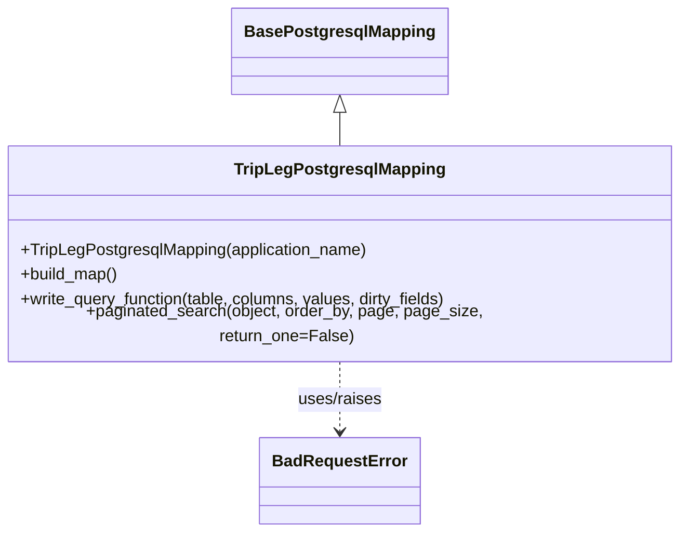

# Diagram: container_tracking_core/container_tracking_service/container_tracking_service/persistence_adapter/postgresql/TripLegPostgresqlMapping.py


> Auto-generated by Obscura crawlers

## Diagram 1



### SVG

<svg id="container" width="654.703125" xmlns="http://www.w3.org/2000/svg" class="classDiagram" height="506" viewBox="0 0 654.703125 506" role="graphics-document document" aria-roledescription="class"><style>#container{font-family:"trebuchet ms",verdana,arial,sans-serif;font-size:16px;fill:#333;}@keyframes edge-animation-frame{from{stroke-dashoffset:0;}}@keyframes dash{to{stroke-dashoffset:0;}}#container .edge-animation-slow{stroke-dasharray:9,5!important;stroke-dashoffset:900;animation:dash 50s linear infinite;stroke-linecap:round;}#container .edge-animation-fast{stroke-dasharray:9,5!important;stroke-dashoffset:900;animation:dash 20s linear infinite;stroke-linecap:round;}#container .error-icon{fill:#552222;}#container .error-text{fill:#552222;stroke:#552222;}#container .edge-thickness-normal{stroke-width:1px;}#container .edge-thickness-thick{stroke-width:3.5px;}#container .edge-pattern-solid{stroke-dasharray:0;}#container .edge-thickness-invisible{stroke-width:0;fill:none;}#container .edge-pattern-dashed{stroke-dasharray:3;}#container .edge-pattern-dotted{stroke-dasharray:2;}#container .marker{fill:#333333;stroke:#333333;}#container .marker.cross{stroke:#333333;}#container svg{font-family:"trebuchet ms",verdana,arial,sans-serif;font-size:16px;}#container p{margin:0;}#container g.classGroup text{fill:#9370DB;stroke:none;font-family:"trebuchet ms",verdana,arial,sans-serif;font-size:10px;}#container g.classGroup text .title{font-weight:bolder;}#container .nodeLabel,#container .edgeLabel{color:#131300;}#container .edgeLabel .label rect{fill:#ECECFF;}#container .label text{fill:#131300;}#container .labelBkg{background:#ECECFF;}#container .edgeLabel .label span{background:#ECECFF;}#container .classTitle{font-weight:bolder;}#container .node rect,#container .node circle,#container .node ellipse,#container .node polygon,#container .node path{fill:#ECECFF;stroke:#9370DB;stroke-width:1px;}#container .divider{stroke:#9370DB;stroke-width:1;}#container g.clickable{cursor:pointer;}#container g.classGroup rect{fill:#ECECFF;stroke:#9370DB;}#container g.classGroup line{stroke:#9370DB;stroke-width:1;}#container .classLabel .box{stroke:none;stroke-width:0;fill:#ECECFF;opacity:0.5;}#container .classLabel .label{fill:#9370DB;font-size:10px;}#container .relation{stroke:#333333;stroke-width:1;fill:none;}#container .dashed-line{stroke-dasharray:3;}#container .dotted-line{stroke-dasharray:1 2;}#container #compositionStart,#container .composition{fill:#333333!important;stroke:#333333!important;stroke-width:1;}#container #compositionEnd,#container .composition{fill:#333333!important;stroke:#333333!important;stroke-width:1;}#container #dependencyStart,#container .dependency{fill:#333333!important;stroke:#333333!important;stroke-width:1;}#container #dependencyStart,#container .dependency{fill:#333333!important;stroke:#333333!important;stroke-width:1;}#container #extensionStart,#container .extension{fill:transparent!important;stroke:#333333!important;stroke-width:1;}#container #extensionEnd,#container .extension{fill:transparent!important;stroke:#333333!important;stroke-width:1;}#container #aggregationStart,#container .aggregation{fill:transparent!important;stroke:#333333!important;stroke-width:1;}#container #aggregationEnd,#container .aggregation{fill:transparent!important;stroke:#333333!important;stroke-width:1;}#container #lollipopStart,#container .lollipop{fill:#ECECFF!important;stroke:#333333!important;stroke-width:1;}#container #lollipopEnd,#container .lollipop{fill:#ECECFF!important;stroke:#333333!important;stroke-width:1;}#container .edgeTerminals{font-size:11px;line-height:initial;}#container .classTitleText{text-anchor:middle;font-size:18px;fill:#333;}#container .label-icon{display:inline-block;height:1em;overflow:visible;vertical-align:-0.125em;}#container .node .label-icon path{fill:currentColor;stroke:revert;stroke-width:revert;}#container :root{--mermaid-font-family:"trebuchet ms",verdana,arial,sans-serif;}</style><g><defs><marker id="container_class-aggregationStart" class="marker aggregation class" refX="18" refY="7" markerWidth="190" markerHeight="240" orient="auto"><path d="M 18,7 L9,13 L1,7 L9,1 Z"></path></marker></defs><defs><marker id="container_class-aggregationEnd" class="marker aggregation class" refX="1" refY="7" markerWidth="20" markerHeight="28" orient="auto"><path d="M 18,7 L9,13 L1,7 L9,1 Z"></path></marker></defs><defs><marker id="container_class-extensionStart" class="marker extension class" refX="18" refY="7" markerWidth="190" markerHeight="240" orient="auto"><path d="M 1,7 L18,13 V 1 Z"></path></marker></defs><defs><marker id="container_class-extensionEnd" class="marker extension class" refX="1" refY="7" markerWidth="20" markerHeight="28" orient="auto"><path d="M 1,1 V 13 L18,7 Z"></path></marker></defs><defs><marker id="container_class-compositionStart" class="marker composition class" refX="18" refY="7" markerWidth="190" markerHeight="240" orient="auto"><path d="M 18,7 L9,13 L1,7 L9,1 Z"></path></marker></defs><defs><marker id="container_class-compositionEnd" class="marker composition class" refX="1" refY="7" markerWidth="20" markerHeight="28" orient="auto"><path d="M 18,7 L9,13 L1,7 L9,1 Z"></path></marker></defs><defs><marker id="container_class-dependencyStart" class="marker dependency class" refX="6" refY="7" markerWidth="190" markerHeight="240" orient="auto"><path d="M 5,7 L9,13 L1,7 L9,1 Z"></path></marker></defs><defs><marker id="container_class-dependencyEnd" class="marker dependency class" refX="13" refY="7" markerWidth="20" markerHeight="28" orient="auto"><path d="M 18,7 L9,13 L14,7 L9,1 Z"></path></marker></defs><defs><marker id="container_class-lollipopStart" class="marker lollipop class" refX="13" refY="7" markerWidth="190" markerHeight="240" orient="auto"><circle stroke="black" fill="transparent" cx="7" cy="7" r="6"></circle></marker></defs><defs><marker id="container_class-lollipopEnd" class="marker lollipop class" refX="1" refY="7" markerWidth="190" markerHeight="240" orient="auto"><circle stroke="black" fill="transparent" cx="7" cy="7" r="6"></circle></marker></defs><g class="root"><g class="clusters"></g><g class="edgePaths"><path d="M327.352,109.25L327.352,110.542C327.352,111.833,327.352,114.417,327.352,119.875C327.352,125.333,327.352,133.667,327.352,137.833L327.352,142" id="id_BasePostgresqlMapping_TripLegPostgresqlMapping_1" class="edge-thickness-normal edge-pattern-solid relation" style=";;;" data-edge="true" data-et="edge" data-id="id_BasePostgresqlMapping_TripLegPostgresqlMapping_1" data-points="W3sieCI6MzI3LjM1MTU2MjUsInkiOjkyfSx7IngiOjMyNy4zNTE1NjI1LCJ5IjoxMTd9LHsieCI6MzI3LjM1MTU2MjUsInkiOjE0Mn1d" marker-start="url(#container_class-extensionStart)"></path><path d="M327.352,340L327.352,346.167C327.352,352.333,327.352,364.667,327.352,376C327.352,387.333,327.352,397.667,327.352,402.833L327.352,408" id="id_TripLegPostgresqlMapping_BadRequestError_2" class="edge-thickness-normal edge-pattern-dashed relation" style=";;;" data-edge="true" data-et="edge" data-id="id_TripLegPostgresqlMapping_BadRequestError_2" data-points="W3sieCI6MzI3LjM1MTU2MjUsInkiOjM0MH0seyJ4IjozMjcuMzUxNTYyNSwieSI6Mzc3fSx7IngiOjMyNy4zNTE1NjI1LCJ5Ijo0MTR9XQ==" marker-end="url(#container_class-dependencyEnd)"></path></g><g class="edgeLabels"><g class="edgeLabel"><g class="label" data-id="id_BasePostgresqlMapping_TripLegPostgresqlMapping_1" transform="translate(0, 0)"><foreignObject width="0" height="0"><div xmlns="http://www.w3.org/1999/xhtml" class="labelBkg" style="display: table-cell; white-space: nowrap; line-height: 1.5; max-width: 200px; text-align: center;"><span class="edgeLabel"></span></div></foreignObject></g></g><g class="edgeLabel" transform="translate(327.3515625, 377)"><g class="label" data-id="id_TripLegPostgresqlMapping_BadRequestError_2" transform="translate(-41.65625, -12)"><foreignObject width="83.3125" height="24"><div xmlns="http://www.w3.org/1999/xhtml" class="labelBkg" style="display: table-cell; white-space: nowrap; line-height: 1.5; max-width: 200px; text-align: center;"><span class="edgeLabel"><p>uses/raises</p></span></div></foreignObject></g></g></g><g class="nodes"><g class="node default" id="classId-BasePostgresqlMapping-0" transform="translate(327.3515625, 50)"><g class="basic label-container"><path d="M-99.921875 -42 L99.921875 -42 L99.921875 42 L-99.921875 42" stroke="none" stroke-width="0" fill="#ECECFF" style=""></path><path d="M-99.921875 -42 C-37.64562921606096 -42, 24.63061656787808 -42, 99.921875 -42 M-99.921875 -42 C-42.611519750078735 -42, 14.69883549984253 -42, 99.921875 -42 M99.921875 -42 C99.921875 -21.245134372228588, 99.921875 -0.4902687444571754, 99.921875 42 M99.921875 -42 C99.921875 -8.61831928446265, 99.921875 24.7633614310747, 99.921875 42 M99.921875 42 C59.56306966067065 42, 19.2042643213413 42, -99.921875 42 M99.921875 42 C35.476414613707675 42, -28.96904577258465 42, -99.921875 42 M-99.921875 42 C-99.921875 12.658407244642504, -99.921875 -16.683185510714992, -99.921875 -42 M-99.921875 42 C-99.921875 17.466321922038585, -99.921875 -7.06735615592283, -99.921875 -42" stroke="#9370DB" stroke-width="1.3" fill="none" stroke-dasharray="0 0" style=""></path></g><g class="annotation-group text" transform="translate(0, -18)"></g><g class="label-group text" transform="translate(-87.921875, -18)"><g class="label" style="font-weight: bolder" transform="translate(0,-12)"><foreignObject width="175.84375" height="24"><div xmlns="http://www.w3.org/1999/xhtml" style="display: table-cell; white-space: nowrap; line-height: 1.5; max-width: 223px; text-align: center;"><span class="nodeLabel markdown-node-label" style=""><p>BasePostgresqlMapping</p></span></div></foreignObject></g></g><g class="members-group text" transform="translate(-87.921875, 30)"></g><g class="methods-group text" transform="translate(-87.921875, 60)"></g><g class="divider" style=""><path d="M-99.921875 6 C-32.43754719014872 6, 35.04678061970256 6, 99.921875 6 M-99.921875 6 C-31.525541139530887 6, 36.870792720938226 6, 99.921875 6" stroke="#9370DB" stroke-width="1.3" fill="none" stroke-dasharray="0 0" style=""></path></g><g class="divider" style=""><path d="M-99.921875 24 C-32.885927544768364 24, 34.15001991046327 24, 99.921875 24 M-99.921875 24 C-20.543333323687392 24, 58.835208352625216 24, 99.921875 24" stroke="#9370DB" stroke-width="1.3" fill="none" stroke-dasharray="0 0" style=""></path></g></g><g class="node default" id="classId-BadRequestError-1" transform="translate(327.3515625, 456)"><g class="basic label-container"><path d="M-74.28125 -42 L74.28125 -42 L74.28125 42 L-74.28125 42" stroke="none" stroke-width="0" fill="#ECECFF" style=""></path><path d="M-74.28125 -42 C-25.787751688141228 -42, 22.705746623717545 -42, 74.28125 -42 M-74.28125 -42 C-19.789404813428675 -42, 34.70244037314265 -42, 74.28125 -42 M74.28125 -42 C74.28125 -17.904682383359606, 74.28125 6.190635233280787, 74.28125 42 M74.28125 -42 C74.28125 -8.683916248363815, 74.28125 24.63216750327237, 74.28125 42 M74.28125 42 C43.76000518982454 42, 13.238760379649086 42, -74.28125 42 M74.28125 42 C39.86476556533789 42, 5.448281130675781 42, -74.28125 42 M-74.28125 42 C-74.28125 24.747045478416265, -74.28125 7.49409095683253, -74.28125 -42 M-74.28125 42 C-74.28125 19.82131054797886, -74.28125 -2.357378904042278, -74.28125 -42" stroke="#9370DB" stroke-width="1.3" fill="none" stroke-dasharray="0 0" style=""></path></g><g class="annotation-group text" transform="translate(0, -18)"></g><g class="label-group text" transform="translate(-62.28125, -18)"><g class="label" style="font-weight: bolder" transform="translate(0,-12)"><foreignObject width="124.5625" height="24"><div xmlns="http://www.w3.org/1999/xhtml" style="display: table-cell; white-space: nowrap; line-height: 1.5; max-width: 174px; text-align: center;"><span class="nodeLabel markdown-node-label" style=""><p>BadRequestError</p></span></div></foreignObject></g></g><g class="members-group text" transform="translate(-62.28125, 30)"></g><g class="methods-group text" transform="translate(-62.28125, 60)"></g><g class="divider" style=""><path d="M-74.28125 6 C-42.72837988877552 6, -11.175509777551042 6, 74.28125 6 M-74.28125 6 C-23.230399926356874 6, 27.82045014728625 6, 74.28125 6" stroke="#9370DB" stroke-width="1.3" fill="none" stroke-dasharray="0 0" style=""></path></g><g class="divider" style=""><path d="M-74.28125 24 C-23.432749438922336 24, 27.415751122155328 24, 74.28125 24 M-74.28125 24 C-40.96740261882719 24, -7.653555237654373 24, 74.28125 24" stroke="#9370DB" stroke-width="1.3" fill="none" stroke-dasharray="0 0" style=""></path></g></g><g class="node default" id="classId-TripLegPostgresqlMapping-2" transform="translate(327.3515625, 241)"><g class="basic label-container"><path d="M-319.3515625 -99 L319.3515625 -99 L319.3515625 99 L-319.3515625 99" stroke="none" stroke-width="0" fill="#ECECFF" style=""></path><path d="M-319.3515625 -99 C-133.15366110916725 -99, 53.04424028166551 -99, 319.3515625 -99 M-319.3515625 -99 C-177.74347085481196 -99, -36.13537920962392 -99, 319.3515625 -99 M319.3515625 -99 C319.3515625 -31.838292749458986, 319.3515625 35.32341450108203, 319.3515625 99 M319.3515625 -99 C319.3515625 -54.93174500285089, 319.3515625 -10.863490005701777, 319.3515625 99 M319.3515625 99 C161.81237954702863 99, 4.273196594057254 99, -319.3515625 99 M319.3515625 99 C141.76810914642678 99, -35.81534420714644 99, -319.3515625 99 M-319.3515625 99 C-319.3515625 49.69511112316332, -319.3515625 0.39022224632664404, -319.3515625 -99 M-319.3515625 99 C-319.3515625 19.82869111230447, -319.3515625 -59.34261777539106, -319.3515625 -99" stroke="#9370DB" stroke-width="1.3" fill="none" stroke-dasharray="0 0" style=""></path></g><g class="annotation-group text" transform="translate(0, -75)"></g><g class="label-group text" transform="translate(-97.453125, -75)"><g class="label" style="font-weight: bolder" transform="translate(0,-12)"><foreignObject width="194.90625" height="24"><div xmlns="http://www.w3.org/1999/xhtml" style="display: table-cell; white-space: nowrap; line-height: 1.5; max-width: 241px; text-align: center;"><span class="nodeLabel markdown-node-label" style=""><p>TripLegPostgresqlMapping</p></span></div></foreignObject></g></g><g class="members-group text" transform="translate(-307.3515625, -27)"></g><g class="methods-group text" transform="translate(-307.3515625, 3)"><g class="label" style="" transform="translate(0,-12)"><foreignObject width="339.09375" height="24"><div xmlns="http://www.w3.org/1999/xhtml" style="display: table-cell; white-space: nowrap; line-height: 1.5; max-width: 396px; text-align: center;"><span class="nodeLabel markdown-node-label" style=""><p>+TripLegPostgresqlMapping(application_name)</p></span></div></foreignObject></g><g class="label" style="" transform="translate(0,12)"><foreignObject width="96.109375" height="24"><div xmlns="http://www.w3.org/1999/xhtml" style="display: table-cell; white-space: nowrap; line-height: 1.5; max-width: 153px; text-align: center;"><span class="nodeLabel markdown-node-label" style=""><p>+build_map()</p></span></div></foreignObject></g><g class="label" style="" transform="translate(0,36)"><foreignObject width="422.109375" height="24"><div xmlns="http://www.w3.org/1999/xhtml" style="display: table-cell; white-space: nowrap; line-height: 1.5; max-width: 479px; text-align: center;"><span class="nodeLabel markdown-node-label" style=""><p>+write_query_function(table, columns, values, dirty_fields)</p></span></div></foreignObject></g><g class="label" style="" transform="translate(0,60)"><foreignObject width="517.25" height="24"><div xmlns="http://www.w3.org/1999/xhtml" style="display: table-cell; white-space: nowrap; line-height: 1.5; max-width: 575px; text-align: center;"><span class="nodeLabel markdown-node-label" style=""><p>+paginated_search(object, order_by, page, page_size, return_one=False)</p></span></div></foreignObject></g></g><g class="divider" style=""><path d="M-319.3515625 -51 C-103.41989152280942 -51, 112.51177945438116 -51, 319.3515625 -51 M-319.3515625 -51 C-176.03942704817874 -51, -32.727291596357475 -51, 319.3515625 -51" stroke="#9370DB" stroke-width="1.3" fill="none" stroke-dasharray="0 0" style=""></path></g><g class="divider" style=""><path d="M-319.3515625 -27 C-138.19534731240574 -27, 42.96086787518851 -27, 319.3515625 -27 M-319.3515625 -27 C-88.2984341149938 -27, 142.7546942700124 -27, 319.3515625 -27" stroke="#9370DB" stroke-width="1.3" fill="none" stroke-dasharray="0 0" style=""></path></g></g></g></g></g></svg>

## Diagram 2

```mermaid
flowchart TD
Start([Start]) --> SuperSearch["Call super().paginated_search(object, order_by, page, page_size) -> search"]
SuperSearch --> Check{page_size == 2 and return_one?}
Check -->|No| ReturnSuper["Return super().paginated_search(object, order_by, page, page_size)"]
Check -->|Yes| MoreCheck{len(search) > 1?}
MoreCheck -->|Yes| ErrMore["Raise BadRequestError: More than one result returned"]
MoreCheck -->|No| EmptyCheck{len(search) == 0?}
EmptyCheck -->|Yes| ErrNone["Raise BadRequestError: No results returned"]
EmptyCheck -->|No| ReturnOne["Return search[0]"]
```

> SVG rendering failed for this diagram.
