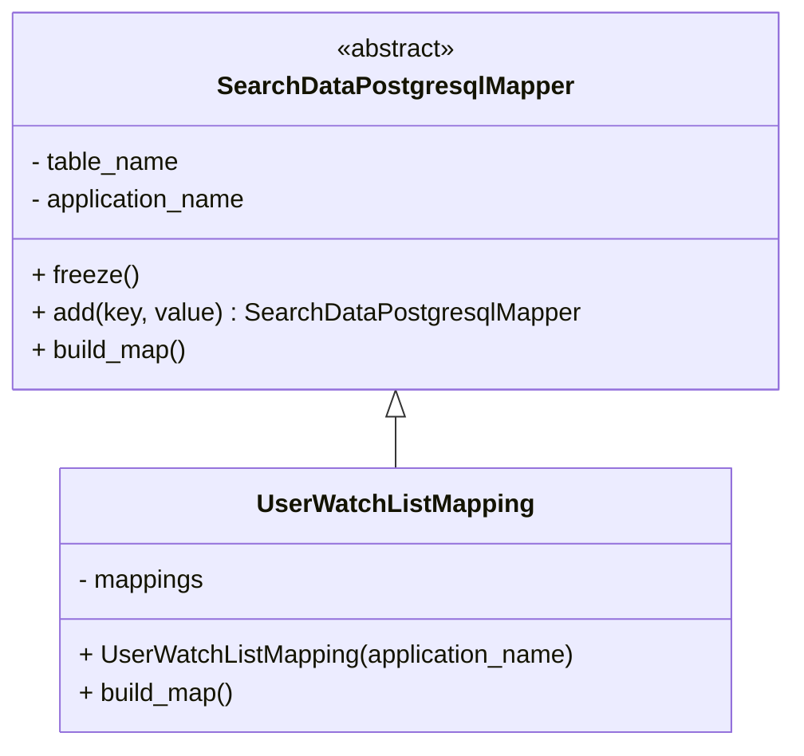
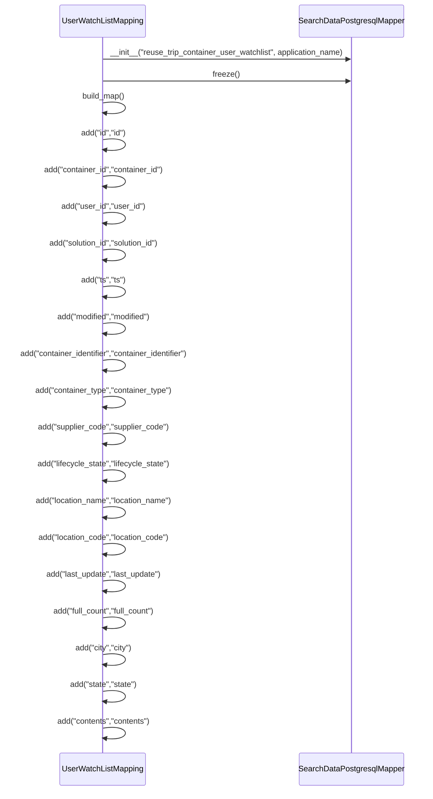

# Diagram: container_tracking_core/container_tracking_service/container_tracking_service/persistence_adapter/postgresql/UserWatchListMapping.py

> Auto-generated by Obscura crawlers

## Diagram 1

### SVG

<svg id="container" width="494.6171875" xmlns="http://www.w3.org/2000/svg" class="classDiagram" height="474" viewBox="0 0 494.6171875 474" role="graphics-document document" aria-roledescription="class"><g><defs><marker id="container_class-aggregationStart" class="marker aggregation class" refX="18" refY="7" markerWidth="190" markerHeight="240" orient="auto"><path d="M 18,7 L9,13 L1,7 L9,1 Z"></path></marker></defs><defs><marker id="container_class-aggregationEnd" class="marker aggregation class" refX="1" refY="7" markerWidth="20" markerHeight="28" orient="auto"><path d="M 18,7 L9,13 L1,7 L9,1 Z"></path></marker></defs><defs><marker id="container_class-extensionStart" class="marker extension class" refX="18" refY="7" markerWidth="190" markerHeight="240" orient="auto"><path d="M 1,7 L18,13 V 1 Z"></path></marker></defs><defs><marker id="container_class-extensionEnd" class="marker extension class" refX="1" refY="7" markerWidth="20" markerHeight="28" orient="auto"><path d="M 1,1 V 13 L18,7 Z"></path></marker></defs><defs><marker id="container_class-compositionStart" class="marker composition class" refX="18" refY="7" markerWidth="190" markerHeight="240" orient="auto"><path d="M 18,7 L9,13 L1,7 L9,1 Z"></path></marker></defs><defs><marker id="container_class-compositionEnd" class="marker composition class" refX="1" refY="7" markerWidth="20" markerHeight="28" orient="auto"><path d="M 18,7 L9,13 L1,7 L9,1 Z"></path></marker></defs><defs><marker id="container_class-dependencyStart" class="marker dependency class" refX="6" refY="7" markerWidth="190" markerHeight="240" orient="auto"><path d="M 5,7 L9,13 L1,7 L9,1 Z"></path></marker></defs><defs><marker id="container_class-dependencyEnd" class="marker dependency class" refX="13" refY="7" markerWidth="20" markerHeight="28" orient="auto"><path d="M 18,7 L9,13 L14,7 L9,1 Z"></path></marker></defs><defs><marker id="container_class-lollipopStart" class="marker lollipop class" refX="13" refY="7" markerWidth="190" markerHeight="240" orient="auto"><circle stroke="black" fill="transparent" cx="7" cy="7" r="6"></circle></marker></defs><defs><marker id="container_class-lollipopEnd" class="marker lollipop class" refX="1" refY="7" markerWidth="190" markerHeight="240" orient="auto"><circle stroke="black" fill="transparent" cx="7" cy="7" r="6"></circle></marker></defs><g class="root"><g class="clusters"></g><g class="edgePaths"><path d="M247.309,265.25L247.309,266.542C247.309,267.833,247.309,270.417,247.309,275.875C247.309,281.333,247.309,289.667,247.309,293.833L247.309,298" id="id_SearchDataPostgresqlMapper_UserWatchListMapping_1" class="edge-thickness-normal edge-pattern-solid relation" style=";;;" data-edge="true" data-et="edge" data-id="id_SearchDataPostgresqlMapper_UserWatchListMapping_1" data-points="W3sieCI6MjQ3LjMwODU5Mzc1LCJ5IjoyNDh9LHsieCI6MjQ3LjMwODU5Mzc1LCJ5IjoyNzN9LHsieCI6MjQ3LjMwODU5Mzc1LCJ5IjoyOTh9XQ==" marker-start="url(#container_class-extensionStart)"></path></g><g class="edgeLabels"><g class="edgeLabel"><g class="label" data-id="id_SearchDataPostgresqlMapper_UserWatchListMapping_1" transform="translate(0, 0)"><foreignObject width="0" height="0">

</foreignObject></g></g></g><g class="nodes"><g class="node default" id="classId-SearchDataPostgresqlMapper-0" transform="translate(247.30859375, 128)"><g class="basic label-container"><path d="M-239.30859375 -120 L239.30859375 -120 L239.30859375 120 L-239.30859375 120" stroke="none" stroke-width="0" fill="#ECECFF" style=""></path><path d="M-239.30859375 -120 C-87.03494592124122 -120, 65.23870190751757 -120, 239.30859375 -120 M-239.30859375 -120 C-84.07590767705398 -120, 71.15677839589205 -120, 239.30859375 -120 M239.30859375 -120 C239.30859375 -46.550486358898965, 239.30859375 26.89902728220207, 239.30859375 120 M239.30859375 -120 C239.30859375 -50.19859358147437, 239.30859375 19.60281283705126, 239.30859375 120 M239.30859375 120 C86.72387524034681 120, -65.86084326930637 120, -239.30859375 120 M239.30859375 120 C94.35715732215957 120, -50.59427910568087 120, -239.30859375 120 M-239.30859375 120 C-239.30859375 24.771000202068436, -239.30859375 -70.45799959586313, -239.30859375 -120 M-239.30859375 120 C-239.30859375 48.663554012033785, -239.30859375 -22.67289197593243, -239.30859375 -120" stroke="#9370DB" stroke-width="1.3" fill="none" stroke-dasharray="0 0" style=""></path></g><g class="annotation-group text" transform="translate(-38.609375, -96)"><g class="label" style="" transform="translate(0,-12)"><foreignObject width="77.21875" height="24">

«abstract»

</foreignObject></g></g><g class="label-group text" transform="translate(-108.3515625, -72)"><g class="label" style="font-weight: bolder" transform="translate(0,-12)"><foreignObject width="216.703125" height="24">

SearchDataPostgresqlMapper

</foreignObject></g></g><g class="members-group text" transform="translate(-227.30859375, -24)"><g class="label" style="" transform="translate(0,-12)"><foreignObject width="96.40625" height="24">

- table_name

</foreignObject></g><g class="label" style="" transform="translate(0,12)"><foreignObject width="141.640625" height="24">

- application_name

</foreignObject></g></g><g class="methods-group text" transform="translate(-227.30859375, 48)"><g class="label" style="" transform="translate(0,-12)"><foreignObject width="66.578125" height="24">

+ freeze()

</foreignObject></g><g class="label" style="" transform="translate(0,12)"><foreignObject width="346.265625" height="24">

+ add(key, value) : SearchDataPostgresqlMapper

</foreignObject></g><g class="label" style="" transform="translate(0,36)"><foreignObject width="100.34375" height="24">

+ build_map()

</foreignObject></g></g><g class="divider" style=""><path d="M-239.30859375 -48 C-104.75283650166267 -48, 29.80292074667466 -48, 239.30859375 -48 M-239.30859375 -48 C-117.44548024483332 -48, 4.417633260333361 -48, 239.30859375 -48" stroke="#9370DB" stroke-width="1.3" fill="none" stroke-dasharray="0 0" style=""></path></g><g class="divider" style=""><path d="M-239.30859375 24 C-73.84331403543135 24, 91.6219656791373 24, 239.30859375 24 M-239.30859375 24 C-88.60286727510703 24, 62.10285919978594 24, 239.30859375 24" stroke="#9370DB" stroke-width="1.3" fill="none" stroke-dasharray="0 0" style=""></path></g></g><g class="node default" id="classId-UserWatchListMapping-1" transform="translate(247.30859375, 382)"><g class="basic label-container"><path d="M-213.15234375 -84 L213.15234375 -84 L213.15234375 84 L-213.15234375 84" stroke="none" stroke-width="0" fill="#ECECFF" style=""></path><path d="M-213.15234375 -84 C-96.7951544176609 -84, 19.562034914678208 -84, 213.15234375 -84 M-213.15234375 -84 C-100.73739744180178 -84, 11.67754886639645 -84, 213.15234375 -84 M213.15234375 -84 C213.15234375 -20.448692310734465, 213.15234375 43.10261537853107, 213.15234375 84 M213.15234375 -84 C213.15234375 -26.028019457795594, 213.15234375 31.943961084408812, 213.15234375 84 M213.15234375 84 C89.36867216294837 84, -34.41499942410326 84, -213.15234375 84 M213.15234375 84 C123.03524924867735 84, 32.91815474735469 84, -213.15234375 84 M-213.15234375 84 C-213.15234375 39.065665965534414, -213.15234375 -5.868668068931171, -213.15234375 -84 M-213.15234375 84 C-213.15234375 26.057629071886183, -213.15234375 -31.884741856227635, -213.15234375 -84" stroke="#9370DB" stroke-width="1.3" fill="none" stroke-dasharray="0 0" style=""></path></g><g class="annotation-group text" transform="translate(0, -60)"></g><g class="label-group text" transform="translate(-83.7890625, -60)"><g class="label" style="font-weight: bolder" transform="translate(0,-12)"><foreignObject width="167.578125" height="24">

UserWatchListMapping

</foreignObject></g></g><g class="members-group text" transform="translate(-201.15234375, -12)"><g class="label" style="" transform="translate(0,-12)"><foreignObject width="81.6875" height="24">

- mappings

</foreignObject></g></g><g class="methods-group text" transform="translate(-201.15234375, 36)"><g class="label" style="" transform="translate(0,-12)"><foreignObject width="318.515625" height="24">

+ UserWatchListMapping(application_name)

</foreignObject></g><g class="label" style="" transform="translate(0,12)"><foreignObject width="100.34375" height="24">

+ build_map()

</foreignObject></g></g><g class="divider" style=""><path d="M-213.15234375 -36 C-69.04288433173022 -36, 75.06657508653956 -36, 213.15234375 -36 M-213.15234375 -36 C-110.14354022964382 -36, -7.134736709287637 -36, 213.15234375 -36" stroke="#9370DB" stroke-width="1.3" fill="none" stroke-dasharray="0 0" style=""></path></g><g class="divider" style=""><path d="M-213.15234375 12 C-66.68097602851964 12, 79.79039169296072 12, 213.15234375 12 M-213.15234375 12 C-108.84343252508587 12, -4.534521300171747 12, 213.15234375 12" stroke="#9370DB" stroke-width="1.3" fill="none" stroke-dasharray="0 0" style=""></path></g></g></g></g></g></svg>

## Diagram 2

> SVG rendering failed for this diagram.
