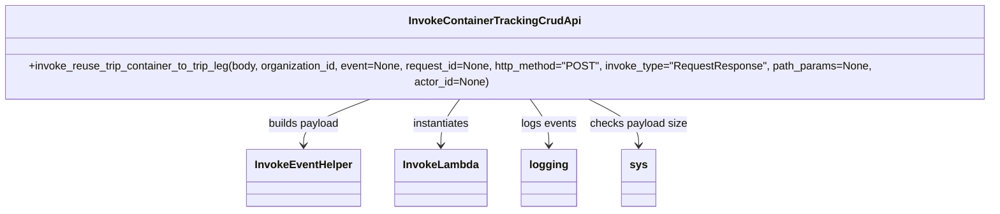

# Diagram: container_tracking_core/container_tracking_service/container_tracking_service/utility/InvokeContainerTrackingCrudApi.py


> Auto-generated by Obscura crawlers

## Diagram 1



### SVG

<svg id="container" width="1517.015625" xmlns="http://www.w3.org/2000/svg" class="classDiagram" height="300" viewBox="0 0 1517.015625 300" role="graphics-document document" aria-roledescription="class"><style>#container{font-family:"trebuchet ms",verdana,arial,sans-serif;font-size:16px;fill:#333;}@keyframes edge-animation-frame{from{stroke-dashoffset:0;}}@keyframes dash{to{stroke-dashoffset:0;}}#container .edge-animation-slow{stroke-dasharray:9,5!important;stroke-dashoffset:900;animation:dash 50s linear infinite;stroke-linecap:round;}#container .edge-animation-fast{stroke-dasharray:9,5!important;stroke-dashoffset:900;animation:dash 20s linear infinite;stroke-linecap:round;}#container .error-icon{fill:#552222;}#container .error-text{fill:#552222;stroke:#552222;}#container .edge-thickness-normal{stroke-width:1px;}#container .edge-thickness-thick{stroke-width:3.5px;}#container .edge-pattern-solid{stroke-dasharray:0;}#container .edge-thickness-invisible{stroke-width:0;fill:none;}#container .edge-pattern-dashed{stroke-dasharray:3;}#container .edge-pattern-dotted{stroke-dasharray:2;}#container .marker{fill:#333333;stroke:#333333;}#container .marker.cross{stroke:#333333;}#container svg{font-family:"trebuchet ms",verdana,arial,sans-serif;font-size:16px;}#container p{margin:0;}#container g.classGroup text{fill:#9370DB;stroke:none;font-family:"trebuchet ms",verdana,arial,sans-serif;font-size:10px;}#container g.classGroup text .title{font-weight:bolder;}#container .nodeLabel,#container .edgeLabel{color:#131300;}#container .edgeLabel .label rect{fill:#ECECFF;}#container .label text{fill:#131300;}#container .labelBkg{background:#ECECFF;}#container .edgeLabel .label span{background:#ECECFF;}#container .classTitle{font-weight:bolder;}#container .node rect,#container .node circle,#container .node ellipse,#container .node polygon,#container .node path{fill:#ECECFF;stroke:#9370DB;stroke-width:1px;}#container .divider{stroke:#9370DB;stroke-width:1;}#container g.clickable{cursor:pointer;}#container g.classGroup rect{fill:#ECECFF;stroke:#9370DB;}#container g.classGroup line{stroke:#9370DB;stroke-width:1;}#container .classLabel .box{stroke:none;stroke-width:0;fill:#ECECFF;opacity:0.5;}#container .classLabel .label{fill:#9370DB;font-size:10px;}#container .relation{stroke:#333333;stroke-width:1;fill:none;}#container .dashed-line{stroke-dasharray:3;}#container .dotted-line{stroke-dasharray:1 2;}#container #compositionStart,#container .composition{fill:#333333!important;stroke:#333333!important;stroke-width:1;}#container #compositionEnd,#container .composition{fill:#333333!important;stroke:#333333!important;stroke-width:1;}#container #dependencyStart,#container .dependency{fill:#333333!important;stroke:#333333!important;stroke-width:1;}#container #dependencyStart,#container .dependency{fill:#333333!important;stroke:#333333!important;stroke-width:1;}#container #extensionStart,#container .extension{fill:transparent!important;stroke:#333333!important;stroke-width:1;}#container #extensionEnd,#container .extension{fill:transparent!important;stroke:#333333!important;stroke-width:1;}#container #aggregationStart,#container .aggregation{fill:transparent!important;stroke:#333333!important;stroke-width:1;}#container #aggregationEnd,#container .aggregation{fill:transparent!important;stroke:#333333!important;stroke-width:1;}#container #lollipopStart,#container .lollipop{fill:#ECECFF!important;stroke:#333333!important;stroke-width:1;}#container #lollipopEnd,#container .lollipop{fill:#ECECFF!important;stroke:#333333!important;stroke-width:1;}#container .edgeTerminals{font-size:11px;line-height:initial;}#container .classTitleText{text-anchor:middle;font-size:18px;fill:#333;}#container .label-icon{display:inline-block;height:1em;overflow:visible;vertical-align:-0.125em;}#container .node .label-icon path{fill:currentColor;stroke:revert;stroke-width:revert;}#container :root{--mermaid-font-family:"trebuchet ms",verdana,arial,sans-serif;}</style><g><defs><marker id="container_class-aggregationStart" class="marker aggregation class" refX="18" refY="7" markerWidth="190" markerHeight="240" orient="auto"><path d="M 18,7 L9,13 L1,7 L9,1 Z"></path></marker></defs><defs><marker id="container_class-aggregationEnd" class="marker aggregation class" refX="1" refY="7" markerWidth="20" markerHeight="28" orient="auto"><path d="M 18,7 L9,13 L1,7 L9,1 Z"></path></marker></defs><defs><marker id="container_class-extensionStart" class="marker extension class" refX="18" refY="7" markerWidth="190" markerHeight="240" orient="auto"><path d="M 1,7 L18,13 V 1 Z"></path></marker></defs><defs><marker id="container_class-extensionEnd" class="marker extension class" refX="1" refY="7" markerWidth="20" markerHeight="28" orient="auto"><path d="M 1,1 V 13 L18,7 Z"></path></marker></defs><defs><marker id="container_class-compositionStart" class="marker composition class" refX="18" refY="7" markerWidth="190" markerHeight="240" orient="auto"><path d="M 18,7 L9,13 L1,7 L9,1 Z"></path></marker></defs><defs><marker id="container_class-compositionEnd" class="marker composition class" refX="1" refY="7" markerWidth="20" markerHeight="28" orient="auto"><path d="M 18,7 L9,13 L1,7 L9,1 Z"></path></marker></defs><defs><marker id="container_class-dependencyStart" class="marker dependency class" refX="6" refY="7" markerWidth="190" markerHeight="240" orient="auto"><path d="M 5,7 L9,13 L1,7 L9,1 Z"></path></marker></defs><defs><marker id="container_class-dependencyEnd" class="marker dependency class" refX="13" refY="7" markerWidth="20" markerHeight="28" orient="auto"><path d="M 18,7 L9,13 L14,7 L9,1 Z"></path></marker></defs><defs><marker id="container_class-lollipopStart" class="marker lollipop class" refX="13" refY="7" markerWidth="190" markerHeight="240" orient="auto"><circle stroke="black" fill="transparent" cx="7" cy="7" r="6"></circle></marker></defs><defs><marker id="container_class-lollipopEnd" class="marker lollipop class" refX="1" refY="7" markerWidth="190" markerHeight="240" orient="auto"><circle stroke="black" fill="transparent" cx="7" cy="7" r="6"></circle></marker></defs><g class="root"><g class="clusters"></g><g class="edgePaths"><path d="M585.971,134L569.083,140.167C552.195,146.333,518.418,158.667,501.529,170C484.641,181.333,484.641,191.667,484.641,196.833L484.641,202" id="id_InvokeContainerTrackingCrudApi_InvokeEventHelper_1" class="edge-thickness-normal edge-pattern-solid relation" style=";;;" data-edge="true" data-et="edge" data-id="id_InvokeContainerTrackingCrudApi_InvokeEventHelper_1" data-points="W3sieCI6NTg1Ljk3MTQ4NDM3NSwieSI6MTM0fSx7IngiOjQ4NC42NDA2MjUsInkiOjE3MX0seyJ4Ijo0ODQuNjQwNjI1LCJ5IjoyMDh9XQ==" marker-end="url(#container_class-dependencyEnd)"></path><path d="M709.811,134L705.044,140.167C700.278,146.333,690.744,158.667,685.978,170C681.211,181.333,681.211,191.667,681.211,196.833L681.211,202" id="id_InvokeContainerTrackingCrudApi_InvokeLambda_2" class="edge-thickness-normal edge-pattern-solid relation" style=";;;" data-edge="true" data-et="edge" data-id="id_InvokeContainerTrackingCrudApi_InvokeLambda_2" data-points="W3sieCI6NzA5LjgxMDc4MTI1LCJ5IjoxMzR9LHsieCI6NjgxLjIxMDkzNzUsInkiOjE3MX0seyJ4Ijo2ODEuMjEwOTM3NSwieSI6MjA4fV0=" marker-end="url(#container_class-dependencyEnd)"></path><path d="M807.205,134L811.971,140.167C816.738,146.333,826.271,158.667,831.038,170C835.805,181.333,835.805,191.667,835.805,196.833L835.805,202" id="id_InvokeContainerTrackingCrudApi_logging_3" class="edge-thickness-normal edge-pattern-solid relation" style=";;;" data-edge="true" data-et="edge" data-id="id_InvokeContainerTrackingCrudApi_logging_3" data-points="W3sieCI6ODA3LjIwNDg0Mzc1LCJ5IjoxMzR9LHsieCI6ODM1LjgwNDY4NzUsInkiOjE3MX0seyJ4Ijo4MzUuODA0Njg3NSwieSI6MjA4fV0=" marker-end="url(#container_class-dependencyEnd)"></path><path d="M890.517,134L903.439,140.167C916.361,146.333,942.204,158.667,955.125,170C968.047,181.333,968.047,191.667,968.047,196.833L968.047,202" id="id_InvokeContainerTrackingCrudApi_sys_4" class="edge-thickness-normal edge-pattern-solid relation" style=";;;" data-edge="true" data-et="edge" data-id="id_InvokeContainerTrackingCrudApi_sys_4" data-points="W3sieCI6ODkwLjUxNzQyMTg3NSwieSI6MTM0fSx7IngiOjk2OC4wNDY4NzUsInkiOjE3MX0seyJ4Ijo5NjguMDQ2ODc1LCJ5IjoyMDh9XQ==" marker-end="url(#container_class-dependencyEnd)"></path></g><g class="edgeLabels"><g class="edgeLabel" transform="translate(484.640625, 171)"><g class="label" data-id="id_InvokeContainerTrackingCrudApi_InvokeEventHelper_1" transform="translate(-53.484375, -12)"><foreignObject width="106.96875" height="24"><div xmlns="http://www.w3.org/1999/xhtml" class="labelBkg" style="display: table-cell; white-space: nowrap; line-height: 1.5; max-width: 200px; text-align: center;"><span class="edgeLabel"><p>builds payload</p></span></div></foreignObject></g></g><g class="edgeLabel" transform="translate(681.2109375, 171)"><g class="label" data-id="id_InvokeContainerTrackingCrudApi_InvokeLambda_2" transform="translate(-42.9140625, -12)"><foreignObject width="85.828125" height="24"><div xmlns="http://www.w3.org/1999/xhtml" class="labelBkg" style="display: table-cell; white-space: nowrap; line-height: 1.5; max-width: 200px; text-align: center;"><span class="edgeLabel"><p>instantiates</p></span></div></foreignObject></g></g><g class="edgeLabel" transform="translate(835.8046875, 171)"><g class="label" data-id="id_InvokeContainerTrackingCrudApi_logging_3" transform="translate(-40.84375, -12)"><foreignObject width="81.6875" height="24"><div xmlns="http://www.w3.org/1999/xhtml" class="labelBkg" style="display: table-cell; white-space: nowrap; line-height: 1.5; max-width: 200px; text-align: center;"><span class="edgeLabel"><p>logs events</p></span></div></foreignObject></g></g><g class="edgeLabel" transform="translate(968.046875, 171)"><g class="label" data-id="id_InvokeContainerTrackingCrudApi_sys_4" transform="translate(-71.3984375, -12)"><foreignObject width="142.796875" height="24"><div xmlns="http://www.w3.org/1999/xhtml" class="labelBkg" style="display: table-cell; white-space: nowrap; line-height: 1.5; max-width: 200px; text-align: center;"><span class="edgeLabel"><p>checks payload size</p></span></div></foreignObject></g></g></g><g class="nodes"><g class="node default" id="classId-InvokeContainerTrackingCrudApi-0" transform="translate(758.5078125, 71)"><g class="basic label-container"><path d="M-750.5078125 -63 L750.5078125 -63 L750.5078125 63 L-750.5078125 63" stroke="none" stroke-width="0" fill="#ECECFF" style=""></path><path d="M-750.5078125 -63 C-216.00556961202687 -63, 318.49667327594625 -63, 750.5078125 -63 M-750.5078125 -63 C-327.7189990280552 -63, 95.06981444388964 -63, 750.5078125 -63 M750.5078125 -63 C750.5078125 -15.208365361534497, 750.5078125 32.583269276931006, 750.5078125 63 M750.5078125 -63 C750.5078125 -17.427095944181353, 750.5078125 28.145808111637294, 750.5078125 63 M750.5078125 63 C228.37595373456293 63, -293.75590503087415 63, -750.5078125 63 M750.5078125 63 C424.5955919123589 63, 98.68337132471777 63, -750.5078125 63 M-750.5078125 63 C-750.5078125 19.10323160124988, -750.5078125 -24.793536797500238, -750.5078125 -63 M-750.5078125 63 C-750.5078125 29.237260104467644, -750.5078125 -4.525479791064711, -750.5078125 -63" stroke="#9370DB" stroke-width="1.3" fill="none" stroke-dasharray="0 0" style=""></path></g><g class="annotation-group text" transform="translate(0, -39)"></g><g class="label-group text" transform="translate(-119.71875, -39)"><g class="label" style="font-weight: bolder" transform="translate(0,-12)"><foreignObject width="239.4375" height="24"><div xmlns="http://www.w3.org/1999/xhtml" style="display: table-cell; white-space: nowrap; line-height: 1.5; max-width: 286px; text-align: center;"><span class="nodeLabel markdown-node-label" style=""><p>InvokeContainerTrackingCrudApi</p></span></div></foreignObject></g></g><g class="members-group text" transform="translate(-738.5078125, 9)"></g><g class="methods-group text" transform="translate(-738.5078125, 39)"><g class="label" style="" transform="translate(0,-12)"><foreignObject width="1357.296875" height="24"><div xmlns="http://www.w3.org/1999/xhtml" style="display: table-cell; white-space: nowrap; line-height: 1.5; max-width: 1415px; text-align: center;"><span class="nodeLabel markdown-node-label" style=""><p>+invoke_reuse_trip_container_to_trip_leg(body, organization_id, event=None, request_id=None, http_method="POST", invoke_type="RequestResponse", path_params=None, actor_id=None)</p></span></div></foreignObject></g></g><g class="divider" style=""><path d="M-750.5078125 -15 C-436.1091616474627 -15, -121.71051079492543 -15, 750.5078125 -15 M-750.5078125 -15 C-418.40081714405096 -15, -86.29382178810192 -15, 750.5078125 -15" stroke="#9370DB" stroke-width="1.3" fill="none" stroke-dasharray="0 0" style=""></path></g><g class="divider" style=""><path d="M-750.5078125 9 C-275.2185218301735 9, 200.07076883965306 9, 750.5078125 9 M-750.5078125 9 C-195.55757096555556 9, 359.3926705688889 9, 750.5078125 9" stroke="#9370DB" stroke-width="1.3" fill="none" stroke-dasharray="0 0" style=""></path></g></g><g class="node default" id="classId-InvokeEventHelper-1" transform="translate(484.640625, 250)"><g class="basic label-container"><path d="M-81.0859375 -42 L81.0859375 -42 L81.0859375 42 L-81.0859375 42" stroke="none" stroke-width="0" fill="#ECECFF" style=""></path><path d="M-81.0859375 -42 C-44.091187438887296 -42, -7.096437377774592 -42, 81.0859375 -42 M-81.0859375 -42 C-21.25163990861384 -42, 38.58265768277232 -42, 81.0859375 -42 M81.0859375 -42 C81.0859375 -17.548437137510163, 81.0859375 6.903125724979674, 81.0859375 42 M81.0859375 -42 C81.0859375 -11.30796231314174, 81.0859375 19.38407537371652, 81.0859375 42 M81.0859375 42 C25.618186533246707 42, -29.849564433506586 42, -81.0859375 42 M81.0859375 42 C38.519234612235536 42, -4.047468275528928 42, -81.0859375 42 M-81.0859375 42 C-81.0859375 16.013599415122673, -81.0859375 -9.972801169754653, -81.0859375 -42 M-81.0859375 42 C-81.0859375 14.878159134290492, -81.0859375 -12.243681731419017, -81.0859375 -42" stroke="#9370DB" stroke-width="1.3" fill="none" stroke-dasharray="0 0" style=""></path></g><g class="annotation-group text" transform="translate(0, -18)"></g><g class="label-group text" transform="translate(-69.0859375, -18)"><g class="label" style="font-weight: bolder" transform="translate(0,-12)"><foreignObject width="138.171875" height="24"><div xmlns="http://www.w3.org/1999/xhtml" style="display: table-cell; white-space: nowrap; line-height: 1.5; max-width: 187px; text-align: center;"><span class="nodeLabel markdown-node-label" style=""><p>InvokeEventHelper</p></span></div></foreignObject></g></g><g class="members-group text" transform="translate(-69.0859375, 30)"></g><g class="methods-group text" transform="translate(-69.0859375, 60)"></g><g class="divider" style=""><path d="M-81.0859375 6 C-27.076405550053025 6, 26.93312639989395 6, 81.0859375 6 M-81.0859375 6 C-37.510368697683354 6, 6.065200104633291 6, 81.0859375 6" stroke="#9370DB" stroke-width="1.3" fill="none" stroke-dasharray="0 0" style=""></path></g><g class="divider" style=""><path d="M-81.0859375 24 C-42.75026741899454 24, -4.414597337989079 24, 81.0859375 24 M-81.0859375 24 C-19.989742391040444 24, 41.10645271791911 24, 81.0859375 24" stroke="#9370DB" stroke-width="1.3" fill="none" stroke-dasharray="0 0" style=""></path></g></g><g class="node default" id="classId-InvokeLambda-2" transform="translate(681.2109375, 250)"><g class="basic label-container"><path d="M-65.484375 -42 L65.484375 -42 L65.484375 42 L-65.484375 42" stroke="none" stroke-width="0" fill="#ECECFF" style=""></path><path d="M-65.484375 -42 C-28.58338536397509 -42, 8.31760427204982 -42, 65.484375 -42 M-65.484375 -42 C-32.553497100050734 -42, 0.3773807998985319 -42, 65.484375 -42 M65.484375 -42 C65.484375 -8.798753183540263, 65.484375 24.402493632919473, 65.484375 42 M65.484375 -42 C65.484375 -20.471935987700043, 65.484375 1.0561280245999143, 65.484375 42 M65.484375 42 C38.589798693559445 42, 11.695222387118882 42, -65.484375 42 M65.484375 42 C20.739689642143937 42, -24.004995715712127 42, -65.484375 42 M-65.484375 42 C-65.484375 25.099833519591073, -65.484375 8.199667039182145, -65.484375 -42 M-65.484375 42 C-65.484375 8.55794157838777, -65.484375 -24.88411684322446, -65.484375 -42" stroke="#9370DB" stroke-width="1.3" fill="none" stroke-dasharray="0 0" style=""></path></g><g class="annotation-group text" transform="translate(0, -18)"></g><g class="label-group text" transform="translate(-53.484375, -18)"><g class="label" style="font-weight: bolder" transform="translate(0,-12)"><foreignObject width="106.96875" height="24"><div xmlns="http://www.w3.org/1999/xhtml" style="display: table-cell; white-space: nowrap; line-height: 1.5; max-width: 156px; text-align: center;"><span class="nodeLabel markdown-node-label" style=""><p>InvokeLambda</p></span></div></foreignObject></g></g><g class="members-group text" transform="translate(-53.484375, 30)"></g><g class="methods-group text" transform="translate(-53.484375, 60)"></g><g class="divider" style=""><path d="M-65.484375 6 C-33.59552079125544 6, -1.706666582510877 6, 65.484375 6 M-65.484375 6 C-18.390986271725666 6, 28.70240245654867 6, 65.484375 6" stroke="#9370DB" stroke-width="1.3" fill="none" stroke-dasharray="0 0" style=""></path></g><g class="divider" style=""><path d="M-65.484375 24 C-17.120209854291204 24, 31.243955291417592 24, 65.484375 24 M-65.484375 24 C-25.924517611676485 24, 13.63533977664703 24, 65.484375 24" stroke="#9370DB" stroke-width="1.3" fill="none" stroke-dasharray="0 0" style=""></path></g></g><g class="node default" id="classId-logging-3" transform="translate(835.8046875, 250)"><g class="basic label-container"><path d="M-39.109375 -42 L39.109375 -42 L39.109375 42 L-39.109375 42" stroke="none" stroke-width="0" fill="#ECECFF" style=""></path><path d="M-39.109375 -42 C-10.389803092638402 -42, 18.329768814723195 -42, 39.109375 -42 M-39.109375 -42 C-15.602885110453855 -42, 7.903604779092291 -42, 39.109375 -42 M39.109375 -42 C39.109375 -9.963488030976244, 39.109375 22.073023938047513, 39.109375 42 M39.109375 -42 C39.109375 -17.533317912370734, 39.109375 6.933364175258532, 39.109375 42 M39.109375 42 C13.333132566105665 42, -12.443109867788671 42, -39.109375 42 M39.109375 42 C9.054621058675437 42, -21.000132882649126 42, -39.109375 42 M-39.109375 42 C-39.109375 23.464787463270554, -39.109375 4.9295749265411075, -39.109375 -42 M-39.109375 42 C-39.109375 10.549911073924498, -39.109375 -20.900177852151003, -39.109375 -42" stroke="#9370DB" stroke-width="1.3" fill="none" stroke-dasharray="0 0" style=""></path></g><g class="annotation-group text" transform="translate(0, -18)"></g><g class="label-group text" transform="translate(-27.109375, -18)"><g class="label" style="font-weight: bolder" transform="translate(0,-12)"><foreignObject width="54.21875" height="24"><div xmlns="http://www.w3.org/1999/xhtml" style="display: table-cell; white-space: nowrap; line-height: 1.5; max-width: 103px; text-align: center;"><span class="nodeLabel markdown-node-label" style=""><p>logging</p></span></div></foreignObject></g></g><g class="members-group text" transform="translate(-27.109375, 30)"></g><g class="methods-group text" transform="translate(-27.109375, 60)"></g><g class="divider" style=""><path d="M-39.109375 6 C-21.73205396425974 6, -4.354732928519482 6, 39.109375 6 M-39.109375 6 C-15.714043088546582 6, 7.681288822906836 6, 39.109375 6" stroke="#9370DB" stroke-width="1.3" fill="none" stroke-dasharray="0 0" style=""></path></g><g class="divider" style=""><path d="M-39.109375 24 C-12.227646765241158 24, 14.654081469517685 24, 39.109375 24 M-39.109375 24 C-15.529409480705311 24, 8.050556038589377 24, 39.109375 24" stroke="#9370DB" stroke-width="1.3" fill="none" stroke-dasharray="0 0" style=""></path></g></g><g class="node default" id="classId-sys-4" transform="translate(968.046875, 250)"><g class="basic label-container"><path d="M-23.6484375 -42 L23.6484375 -42 L23.6484375 42 L-23.6484375 42" stroke="none" stroke-width="0" fill="#ECECFF" style=""></path><path d="M-23.6484375 -42 C-12.649250688027179 -42, -1.6500638760543573 -42, 23.6484375 -42 M-23.6484375 -42 C-6.25413721673889 -42, 11.14016306652222 -42, 23.6484375 -42 M23.6484375 -42 C23.6484375 -11.756746241225027, 23.6484375 18.486507517549946, 23.6484375 42 M23.6484375 -42 C23.6484375 -24.446842147255094, 23.6484375 -6.893684294510187, 23.6484375 42 M23.6484375 42 C10.893656257194623 42, -1.8611249856107541 42, -23.6484375 42 M23.6484375 42 C12.322859952488383 42, 0.9972824049767652 42, -23.6484375 42 M-23.6484375 42 C-23.6484375 8.842697648791358, -23.6484375 -24.314604702417284, -23.6484375 -42 M-23.6484375 42 C-23.6484375 17.115893715788804, -23.6484375 -7.768212568422392, -23.6484375 -42" stroke="#9370DB" stroke-width="1.3" fill="none" stroke-dasharray="0 0" style=""></path></g><g class="annotation-group text" transform="translate(0, -18)"></g><g class="label-group text" transform="translate(-11.6484375, -18)"><g class="label" style="font-weight: bolder" transform="translate(0,-12)"><foreignObject width="23.296875" height="24"><div xmlns="http://www.w3.org/1999/xhtml" style="display: table-cell; white-space: nowrap; line-height: 1.5; max-width: 72px; text-align: center;"><span class="nodeLabel markdown-node-label" style=""><p>sys</p></span></div></foreignObject></g></g><g class="members-group text" transform="translate(-11.6484375, 30)"></g><g class="methods-group text" transform="translate(-11.6484375, 60)"></g><g class="divider" style=""><path d="M-23.6484375 6 C-11.93937435784747 6, -0.23031121569493962 6, 23.6484375 6 M-23.6484375 6 C-10.887194160547091 6, 1.8740491789058176 6, 23.6484375 6" stroke="#9370DB" stroke-width="1.3" fill="none" stroke-dasharray="0 0" style=""></path></g><g class="divider" style=""><path d="M-23.6484375 24 C-12.228860736237898 24, -0.8092839724757965 24, 23.6484375 24 M-23.6484375 24 C-12.386492977179282 24, -1.124548454358564 24, 23.6484375 24" stroke="#9370DB" stroke-width="1.3" fill="none" stroke-dasharray="0 0" style=""></path></g></g></g></g></g></svg>

## Diagram 2

```mermaid
flowchart TD
    Start([Start]) --> BuildPayload[InvokeEventHelper.get_full_payload]
    BuildPayload --> CreateInvoker[Instantiate InvokeLambda]
    CreateInvoker --> IsRequestResponse{invoke_type == "RequestResponse"?}
    IsRequestResponse -->|yes| SyncInvoke[status_code, payload = invoke.invoke_function()]
    SyncInvoke --> IsSuccess{status_code == HTTPStatus.OK or HTTPStatus.CREATED?}
    IsSuccess -->|yes| ReturnPayload[Return payload (list-normalized)]
    IsSuccess -->|no| ReturnPayload
    IsRequestResponse -->|no| SizeCheck{sys.getsizeof(full_payload) >= 2201688?}
    SizeCheck -->|no| AsyncInvoke[invoke.invoke_function() (fire-and-forget)]
    AsyncInvoke --> End([End])
    SizeCheck -->|yes| AsyncInvokeLarge[status_code, payload = invoke.invoke_function()]
    AsyncInvokeLarge --> Log[logging.info("Container payLoad to large for async")]
    Log --> End
```

> SVG rendering failed for this diagram.
