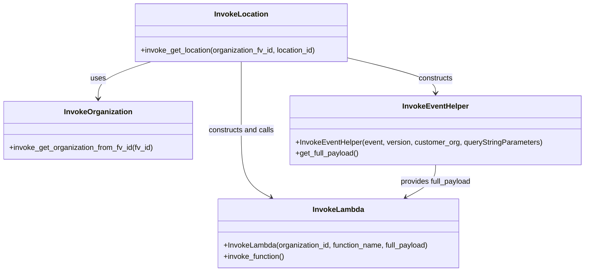

# Diagram: container_tracking_core/container_tracking_service/container_tracking_service/utility/InvokeLocation.py


> Auto-generated by Obscura crawlers

## Diagram 1



### SVG

<svg id="container" width="1271.1953125" xmlns="http://www.w3.org/2000/svg" class="classDiagram" height="590" viewBox="0 0 1271.1953125 590" role="graphics-document document" aria-roledescription="class"><style>#container{font-family:"trebuchet ms",verdana,arial,sans-serif;font-size:16px;fill:#333;}@keyframes edge-animation-frame{from{stroke-dashoffset:0;}}@keyframes dash{to{stroke-dashoffset:0;}}#container .edge-animation-slow{stroke-dasharray:9,5!important;stroke-dashoffset:900;animation:dash 50s linear infinite;stroke-linecap:round;}#container .edge-animation-fast{stroke-dasharray:9,5!important;stroke-dashoffset:900;animation:dash 20s linear infinite;stroke-linecap:round;}#container .error-icon{fill:#552222;}#container .error-text{fill:#552222;stroke:#552222;}#container .edge-thickness-normal{stroke-width:1px;}#container .edge-thickness-thick{stroke-width:3.5px;}#container .edge-pattern-solid{stroke-dasharray:0;}#container .edge-thickness-invisible{stroke-width:0;fill:none;}#container .edge-pattern-dashed{stroke-dasharray:3;}#container .edge-pattern-dotted{stroke-dasharray:2;}#container .marker{fill:#333333;stroke:#333333;}#container .marker.cross{stroke:#333333;}#container svg{font-family:"trebuchet ms",verdana,arial,sans-serif;font-size:16px;}#container p{margin:0;}#container g.classGroup text{fill:#9370DB;stroke:none;font-family:"trebuchet ms",verdana,arial,sans-serif;font-size:10px;}#container g.classGroup text .title{font-weight:bolder;}#container .nodeLabel,#container .edgeLabel{color:#131300;}#container .edgeLabel .label rect{fill:#ECECFF;}#container .label text{fill:#131300;}#container .labelBkg{background:#ECECFF;}#container .edgeLabel .label span{background:#ECECFF;}#container .classTitle{font-weight:bolder;}#container .node rect,#container .node circle,#container .node ellipse,#container .node polygon,#container .node path{fill:#ECECFF;stroke:#9370DB;stroke-width:1px;}#container .divider{stroke:#9370DB;stroke-width:1;}#container g.clickable{cursor:pointer;}#container g.classGroup rect{fill:#ECECFF;stroke:#9370DB;}#container g.classGroup line{stroke:#9370DB;stroke-width:1;}#container .classLabel .box{stroke:none;stroke-width:0;fill:#ECECFF;opacity:0.5;}#container .classLabel .label{fill:#9370DB;font-size:10px;}#container .relation{stroke:#333333;stroke-width:1;fill:none;}#container .dashed-line{stroke-dasharray:3;}#container .dotted-line{stroke-dasharray:1 2;}#container #compositionStart,#container .composition{fill:#333333!important;stroke:#333333!important;stroke-width:1;}#container #compositionEnd,#container .composition{fill:#333333!important;stroke:#333333!important;stroke-width:1;}#container #dependencyStart,#container .dependency{fill:#333333!important;stroke:#333333!important;stroke-width:1;}#container #dependencyStart,#container .dependency{fill:#333333!important;stroke:#333333!important;stroke-width:1;}#container #extensionStart,#container .extension{fill:transparent!important;stroke:#333333!important;stroke-width:1;}#container #extensionEnd,#container .extension{fill:transparent!important;stroke:#333333!important;stroke-width:1;}#container #aggregationStart,#container .aggregation{fill:transparent!important;stroke:#333333!important;stroke-width:1;}#container #aggregationEnd,#container .aggregation{fill:transparent!important;stroke:#333333!important;stroke-width:1;}#container #lollipopStart,#container .lollipop{fill:#ECECFF!important;stroke:#333333!important;stroke-width:1;}#container #lollipopEnd,#container .lollipop{fill:#ECECFF!important;stroke:#333333!important;stroke-width:1;}#container .edgeTerminals{font-size:11px;line-height:initial;}#container .classTitleText{text-anchor:middle;font-size:18px;fill:#333;}#container .label-icon{display:inline-block;height:1em;overflow:visible;vertical-align:-0.125em;}#container .node .label-icon path{fill:currentColor;stroke:revert;stroke-width:revert;}#container :root{--mermaid-font-family:"trebuchet ms",verdana,arial,sans-serif;}</style><g><defs><marker id="container_class-aggregationStart" class="marker aggregation class" refX="18" refY="7" markerWidth="190" markerHeight="240" orient="auto"><path d="M 18,7 L9,13 L1,7 L9,1 Z"></path></marker></defs><defs><marker id="container_class-aggregationEnd" class="marker aggregation class" refX="1" refY="7" markerWidth="20" markerHeight="28" orient="auto"><path d="M 18,7 L9,13 L1,7 L9,1 Z"></path></marker></defs><defs><marker id="container_class-extensionStart" class="marker extension class" refX="18" refY="7" markerWidth="190" markerHeight="240" orient="auto"><path d="M 1,7 L18,13 V 1 Z"></path></marker></defs><defs><marker id="container_class-extensionEnd" class="marker extension class" refX="1" refY="7" markerWidth="20" markerHeight="28" orient="auto"><path d="M 1,1 V 13 L18,7 Z"></path></marker></defs><defs><marker id="container_class-compositionStart" class="marker composition class" refX="18" refY="7" markerWidth="190" markerHeight="240" orient="auto"><path d="M 18,7 L9,13 L1,7 L9,1 Z"></path></marker></defs><defs><marker id="container_class-compositionEnd" class="marker composition class" refX="1" refY="7" markerWidth="20" markerHeight="28" orient="auto"><path d="M 18,7 L9,13 L1,7 L9,1 Z"></path></marker></defs><defs><marker id="container_class-dependencyStart" class="marker dependency class" refX="6" refY="7" markerWidth="190" markerHeight="240" orient="auto"><path d="M 5,7 L9,13 L1,7 L9,1 Z"></path></marker></defs><defs><marker id="container_class-dependencyEnd" class="marker dependency class" refX="13" refY="7" markerWidth="20" markerHeight="28" orient="auto"><path d="M 18,7 L9,13 L14,7 L9,1 Z"></path></marker></defs><defs><marker id="container_class-lollipopStart" class="marker lollipop class" refX="13" refY="7" markerWidth="190" markerHeight="240" orient="auto"><circle stroke="black" fill="transparent" cx="7" cy="7" r="6"></circle></marker></defs><defs><marker id="container_class-lollipopEnd" class="marker lollipop class" refX="1" refY="7" markerWidth="190" markerHeight="240" orient="auto"><circle stroke="black" fill="transparent" cx="7" cy="7" r="6"></circle></marker></defs><g class="root"><g class="clusters"></g><g class="edgePaths"><path d="M328.966,134L309.687,140.167C290.407,146.333,251.848,158.667,232.569,172C213.289,185.333,213.289,199.667,213.289,206.833L213.289,214" id="id_InvokeLocation_InvokeOrganization_1" class="edge-thickness-normal edge-pattern-solid relation" style=";;;" data-edge="true" data-et="edge" data-id="id_InvokeLocation_InvokeOrganization_1" data-points="W3sieCI6MzI4Ljk2NjA5Mzc1LCJ5IjoxMzR9LHsieCI6MjEzLjI4OTA2MjUsInkiOjE3MX0seyJ4IjoyMTMuMjg5MDYyNSwieSI6MjIwfV0=" marker-end="url(#container_class-dependencyEnd)"></path><path d="M759.383,126.28L790.859,133.734C822.335,141.187,885.286,156.093,916.762,168.713C948.238,181.333,948.238,191.667,948.238,196.833L948.238,202" id="id_InvokeLocation_InvokeEventHelper_2" class="edge-thickness-normal edge-pattern-solid relation" style=";;;" data-edge="true" data-et="edge" data-id="id_InvokeLocation_InvokeEventHelper_2" data-points="W3sieCI6NzU5LjM4MjgxMjUsInkiOjEyNi4yODAyMjEyNTQwODE0NX0seyJ4Ijo5NDguMjM4MjgxMjUsInkiOjE3MX0seyJ4Ijo5NDguMjM4MjgxMjUsInkiOjIwOH1d" marker-end="url(#container_class-dependencyEnd)"></path><path d="M525.93,134L525.93,140.167C525.93,146.333,525.93,158.667,525.93,183.5C525.93,208.333,525.93,245.667,525.93,283C525.93,320.333,525.93,357.667,536.672,382.031C547.415,406.396,568.9,417.792,579.643,423.49L590.385,429.189" id="id_InvokeLocation_InvokeLambda_3" class="edge-thickness-normal edge-pattern-solid relation" style=";;;" data-edge="true" data-et="edge" data-id="id_InvokeLocation_InvokeLambda_3" data-points="W3sieCI6NTI1LjkyOTY4NzUsInkiOjEzNH0seyJ4Ijo1MjUuOTI5Njg3NSwieSI6MTcxfSx7IngiOjUyNS45Mjk2ODc1LCJ5IjoyODN9LHsieCI6NTI1LjkyOTY4NzUsInkiOjM5NX0seyJ4Ijo1OTUuNjg2MDE3NzE3NjM0LCJ5Ijo0MzJ9XQ==" marker-end="url(#container_class-dependencyEnd)"></path><path d="M948.238,358L948.238,364.167C948.238,370.333,948.238,382.667,937.496,394.531C926.753,406.396,905.268,417.792,894.525,423.49L883.782,429.189" id="id_InvokeEventHelper_InvokeLambda_4" class="edge-thickness-normal edge-pattern-solid relation" style=";;;" data-edge="true" data-et="edge" data-id="id_InvokeEventHelper_InvokeLambda_4" data-points="W3sieCI6OTQ4LjIzODI4MTI1LCJ5IjozNTh9LHsieCI6OTQ4LjIzODI4MTI1LCJ5IjozOTV9LHsieCI6ODc4LjQ4MTk1MTAzMjM2NiwieSI6NDMyfV0=" marker-end="url(#container_class-dependencyEnd)"></path></g><g class="edgeLabels"><g class="edgeLabel" transform="translate(213.2890625, 171)"><g class="label" data-id="id_InvokeLocation_InvokeOrganization_1" transform="translate(-16.4921875, -12)"><foreignObject width="32.984375" height="24"><div xmlns="http://www.w3.org/1999/xhtml" class="labelBkg" style="display: table-cell; white-space: nowrap; line-height: 1.5; max-width: 200px; text-align: center;"><span class="edgeLabel"><p>uses</p></span></div></foreignObject></g></g><g class="edgeLabel" transform="translate(948.23828125, 171)"><g class="label" data-id="id_InvokeLocation_InvokeEventHelper_2" transform="translate(-37.84375, -12)"><foreignObject width="75.6875" height="24"><div xmlns="http://www.w3.org/1999/xhtml" class="labelBkg" style="display: table-cell; white-space: nowrap; line-height: 1.5; max-width: 200px; text-align: center;"><span class="edgeLabel"><p>constructs</p></span></div></foreignObject></g></g><g class="edgeLabel" transform="translate(525.9296875, 283)"><g class="label" data-id="id_InvokeLocation_InvokeLambda_3" transform="translate(-72.3515625, -12)"><foreignObject width="144.703125" height="24"><div xmlns="http://www.w3.org/1999/xhtml" class="labelBkg" style="display: table-cell; white-space: nowrap; line-height: 1.5; max-width: 200px; text-align: center;"><span class="edgeLabel"><p>constructs and calls</p></span></div></foreignObject></g></g><g class="edgeLabel" transform="translate(948.23828125, 395)"><g class="label" data-id="id_InvokeEventHelper_InvokeLambda_4" transform="translate(-78.4921875, -12)"><foreignObject width="156.984375" height="24"><div xmlns="http://www.w3.org/1999/xhtml" class="labelBkg" style="display: table-cell; white-space: nowrap; line-height: 1.5; max-width: 200px; text-align: center;"><span class="edgeLabel"><p>provides full_payload</p></span></div></foreignObject></g></g></g><g class="nodes"><g class="node default" id="classId-InvokeLocation-0" transform="translate(525.9296875, 71)"><g class="basic label-container"><path d="M-233.453125 -63 L233.453125 -63 L233.453125 63 L-233.453125 63" stroke="none" stroke-width="0" fill="#ECECFF" style=""></path><path d="M-233.453125 -63 C-76.51328173135528 -63, 80.42656153728944 -63, 233.453125 -63 M-233.453125 -63 C-88.19689070749789 -63, 57.05934358500423 -63, 233.453125 -63 M233.453125 -63 C233.453125 -20.892402579237682, 233.453125 21.215194841524635, 233.453125 63 M233.453125 -63 C233.453125 -36.14765651839798, 233.453125 -9.295313036795967, 233.453125 63 M233.453125 63 C118.00909694260623 63, 2.565068885212469 63, -233.453125 63 M233.453125 63 C92.97576501662766 63, -47.501594966744676 63, -233.453125 63 M-233.453125 63 C-233.453125 36.20965541575228, -233.453125 9.419310831504568, -233.453125 -63 M-233.453125 63 C-233.453125 33.813298465511, -233.453125 4.626596931021986, -233.453125 -63" stroke="#9370DB" stroke-width="1.3" fill="none" stroke-dasharray="0 0" style=""></path></g><g class="annotation-group text" transform="translate(0, -39)"></g><g class="label-group text" transform="translate(-55.703125, -39)"><g class="label" style="font-weight: bolder" transform="translate(0,-12)"><foreignObject width="111.40625" height="24"><div xmlns="http://www.w3.org/1999/xhtml" style="display: table-cell; white-space: nowrap; line-height: 1.5; max-width: 160px; text-align: center;"><span class="nodeLabel markdown-node-label" style=""><p>InvokeLocation</p></span></div></foreignObject></g></g><g class="members-group text" transform="translate(-221.453125, 9)"></g><g class="methods-group text" transform="translate(-221.453125, 39)"><g class="label" style="" transform="translate(0,-12)"><foreignObject width="387.203125" height="24"><div xmlns="http://www.w3.org/1999/xhtml" style="display: table-cell; white-space: nowrap; line-height: 1.5; max-width: 445px; text-align: center;"><span class="nodeLabel markdown-node-label" style=""><p>+invoke_get_location(organization_fv_id, location_id)</p></span></div></foreignObject></g></g><g class="divider" style=""><path d="M-233.453125 -15 C-130.50652319513483 -15, -27.559921390269636 -15, 233.453125 -15 M-233.453125 -15 C-73.97355831148937 -15, 85.50600837702126 -15, 233.453125 -15" stroke="#9370DB" stroke-width="1.3" fill="none" stroke-dasharray="0 0" style=""></path></g><g class="divider" style=""><path d="M-233.453125 9 C-65.17821988293602 9, 103.09668523412796 9, 233.453125 9 M-233.453125 9 C-73.4816795468301 9, 86.48976590633981 9, 233.453125 9" stroke="#9370DB" stroke-width="1.3" fill="none" stroke-dasharray="0 0" style=""></path></g></g><g class="node default" id="classId-InvokeOrganization-1" transform="translate(213.2890625, 283)"><g class="basic label-container"><path d="M-205.2890625 -63 L205.2890625 -63 L205.2890625 63 L-205.2890625 63" stroke="none" stroke-width="0" fill="#ECECFF" style=""></path><path d="M-205.2890625 -63 C-116.46702750164248 -63, -27.644992503284954 -63, 205.2890625 -63 M-205.2890625 -63 C-116.65708751023112 -63, -28.025112520462244 -63, 205.2890625 -63 M205.2890625 -63 C205.2890625 -16.530582952023273, 205.2890625 29.938834095953453, 205.2890625 63 M205.2890625 -63 C205.2890625 -24.356024003876215, 205.2890625 14.28795199224757, 205.2890625 63 M205.2890625 63 C61.83900227477753 63, -81.61105795044494 63, -205.2890625 63 M205.2890625 63 C120.97182668330493 63, 36.65459086660985 63, -205.2890625 63 M-205.2890625 63 C-205.2890625 13.244915626219786, -205.2890625 -36.51016874756043, -205.2890625 -63 M-205.2890625 63 C-205.2890625 17.70349438596297, -205.2890625 -27.59301122807406, -205.2890625 -63" stroke="#9370DB" stroke-width="1.3" fill="none" stroke-dasharray="0 0" style=""></path></g><g class="annotation-group text" transform="translate(0, -39)"></g><g class="label-group text" transform="translate(-71.046875, -39)"><g class="label" style="font-weight: bolder" transform="translate(0,-12)"><foreignObject width="142.09375" height="24"><div xmlns="http://www.w3.org/1999/xhtml" style="display: table-cell; white-space: nowrap; line-height: 1.5; max-width: 190px; text-align: center;"><span class="nodeLabel markdown-node-label" style=""><p>InvokeOrganization</p></span></div></foreignObject></g></g><g class="members-group text" transform="translate(-193.2890625, 9)"></g><g class="methods-group text" transform="translate(-193.2890625, 39)"><g class="label" style="" transform="translate(0,-12)"><foreignObject width="315.53125" height="24"><div xmlns="http://www.w3.org/1999/xhtml" style="display: table-cell; white-space: nowrap; line-height: 1.5; max-width: 373px; text-align: center;"><span class="nodeLabel markdown-node-label" style=""><p>+invoke_get_organization_from_fv_id(fv_id)</p></span></div></foreignObject></g></g><g class="divider" style=""><path d="M-205.2890625 -15 C-76.70234246511575 -15, 51.8843775697685 -15, 205.2890625 -15 M-205.2890625 -15 C-103.17215228336876 -15, -1.0552420667375202 -15, 205.2890625 -15" stroke="#9370DB" stroke-width="1.3" fill="none" stroke-dasharray="0 0" style=""></path></g><g class="divider" style=""><path d="M-205.2890625 9 C-79.9263011127046 9, 45.436460274590786 9, 205.2890625 9 M-205.2890625 9 C-77.33768847516242 9, 50.613685549675154 9, 205.2890625 9" stroke="#9370DB" stroke-width="1.3" fill="none" stroke-dasharray="0 0" style=""></path></g></g><g class="node default" id="classId-InvokeEventHelper-2" transform="translate(948.23828125, 283)"><g class="basic label-container"><path d="M-314.95703125 -75 L314.95703125 -75 L314.95703125 75 L-314.95703125 75" stroke="none" stroke-width="0" fill="#ECECFF" style=""></path><path d="M-314.95703125 -75 C-145.2502959164768 -75, 24.456439417046397 -75, 314.95703125 -75 M-314.95703125 -75 C-94.77073507003499 -75, 125.41556110993002 -75, 314.95703125 -75 M314.95703125 -75 C314.95703125 -32.907862490176115, 314.95703125 9.184275019647771, 314.95703125 75 M314.95703125 -75 C314.95703125 -21.074615498685148, 314.95703125 32.850769002629704, 314.95703125 75 M314.95703125 75 C152.3099871897945 75, -10.337056870411004 75, -314.95703125 75 M314.95703125 75 C66.36742290623405 75, -182.2221854375319 75, -314.95703125 75 M-314.95703125 75 C-314.95703125 25.162762453373176, -314.95703125 -24.674475093253648, -314.95703125 -75 M-314.95703125 75 C-314.95703125 20.20931859559152, -314.95703125 -34.58136280881696, -314.95703125 -75" stroke="#9370DB" stroke-width="1.3" fill="none" stroke-dasharray="0 0" style=""></path></g><g class="annotation-group text" transform="translate(0, -51)"></g><g class="label-group text" transform="translate(-69.0859375, -51)"><g class="label" style="font-weight: bolder" transform="translate(0,-12)"><foreignObject width="138.171875" height="24"><div xmlns="http://www.w3.org/1999/xhtml" style="display: table-cell; white-space: nowrap; line-height: 1.5; max-width: 187px; text-align: center;"><span class="nodeLabel markdown-node-label" style=""><p>InvokeEventHelper</p></span></div></foreignObject></g></g><g class="members-group text" transform="translate(-302.95703125, -3)"></g><g class="methods-group text" transform="translate(-302.95703125, 27)"><g class="label" style="" transform="translate(0,-12)"><foreignObject width="536.828125" height="24"><div xmlns="http://www.w3.org/1999/xhtml" style="display: table-cell; white-space: nowrap; line-height: 1.5; max-width: 594px; text-align: center;"><span class="nodeLabel markdown-node-label" style=""><p>+InvokeEventHelper(event, version, customer_org, queryStringParameters)</p></span></div></foreignObject></g><g class="label" style="" transform="translate(0,12)"><foreignObject width="139.03125" height="24"><div xmlns="http://www.w3.org/1999/xhtml" style="display: table-cell; white-space: nowrap; line-height: 1.5; max-width: 196px; text-align: center;"><span class="nodeLabel markdown-node-label" style=""><p>+get_full_payload()</p></span></div></foreignObject></g></g><g class="divider" style=""><path d="M-314.95703125 -27 C-188.00557704341912 -27, -61.054122836838246 -27, 314.95703125 -27 M-314.95703125 -27 C-85.52723716768136 -27, 143.90255691463727 -27, 314.95703125 -27" stroke="#9370DB" stroke-width="1.3" fill="none" stroke-dasharray="0 0" style=""></path></g><g class="divider" style=""><path d="M-314.95703125 -3 C-111.28735968264971 -3, 92.38231188470058 -3, 314.95703125 -3 M-314.95703125 -3 C-184.42498178807313 -3, -53.89293232614625 -3, 314.95703125 -3" stroke="#9370DB" stroke-width="1.3" fill="none" stroke-dasharray="0 0" style=""></path></g></g><g class="node default" id="classId-InvokeLambda-3" transform="translate(737.083984375, 507)"><g class="basic label-container"><path d="M-265.078125 -75 L265.078125 -75 L265.078125 75 L-265.078125 75" stroke="none" stroke-width="0" fill="#ECECFF" style=""></path><path d="M-265.078125 -75 C-153.04581179494335 -75, -41.013498589886666 -75, 265.078125 -75 M-265.078125 -75 C-107.87562944554006 -75, 49.32686610891989 -75, 265.078125 -75 M265.078125 -75 C265.078125 -16.682464253396, 265.078125 41.635071493208, 265.078125 75 M265.078125 -75 C265.078125 -20.39640630128539, 265.078125 34.20718739742922, 265.078125 75 M265.078125 75 C144.28485598189184 75, 23.491586963783703 75, -265.078125 75 M265.078125 75 C121.41518632885126 75, -22.247752342297474 75, -265.078125 75 M-265.078125 75 C-265.078125 25.702292598123563, -265.078125 -23.595414803752874, -265.078125 -75 M-265.078125 75 C-265.078125 27.141421761576048, -265.078125 -20.717156476847904, -265.078125 -75" stroke="#9370DB" stroke-width="1.3" fill="none" stroke-dasharray="0 0" style=""></path></g><g class="annotation-group text" transform="translate(0, -51)"></g><g class="label-group text" transform="translate(-53.484375, -51)"><g class="label" style="font-weight: bolder" transform="translate(0,-12)"><foreignObject width="106.96875" height="24"><div xmlns="http://www.w3.org/1999/xhtml" style="display: table-cell; white-space: nowrap; line-height: 1.5; max-width: 156px; text-align: center;"><span class="nodeLabel markdown-node-label" style=""><p>InvokeLambda</p></span></div></foreignObject></g></g><g class="members-group text" transform="translate(-253.078125, -3)"></g><g class="methods-group text" transform="translate(-253.078125, 27)"><g class="label" style="" transform="translate(0,-12)"><foreignObject width="452.671875" height="24"><div xmlns="http://www.w3.org/1999/xhtml" style="display: table-cell; white-space: nowrap; line-height: 1.5; max-width: 510px; text-align: center;"><span class="nodeLabel markdown-node-label" style=""><p>+InvokeLambda(organization_id, function_name, full_payload)</p></span></div></foreignObject></g><g class="label" style="" transform="translate(0,12)"><foreignObject width="134.4375" height="24"><div xmlns="http://www.w3.org/1999/xhtml" style="display: table-cell; white-space: nowrap; line-height: 1.5; max-width: 192px; text-align: center;"><span class="nodeLabel markdown-node-label" style=""><p>+invoke_function()</p></span></div></foreignObject></g></g><g class="divider" style=""><path d="M-265.078125 -27 C-61.40181943358638 -27, 142.27448613282723 -27, 265.078125 -27 M-265.078125 -27 C-85.47874334054112 -27, 94.12063831891777 -27, 265.078125 -27" stroke="#9370DB" stroke-width="1.3" fill="none" stroke-dasharray="0 0" style=""></path></g><g class="divider" style=""><path d="M-265.078125 -3 C-148.99175575205484 -3, -32.905386504109686 -3, 265.078125 -3 M-265.078125 -3 C-59.898022600031595 -3, 145.2820797999368 -3, 265.078125 -3" stroke="#9370DB" stroke-width="1.3" fill="none" stroke-dasharray="0 0" style=""></path></g></g></g></g></g></svg>

## Diagram 2

```mermaid
sequenceDiagram
participant IL as InvokeLocation.invoke_get_location
participant IO as InvokeOrganization
participant IEH as InvokeEventHelper
participant ILamClass as InvokeLambda
participant ILam as invoke (instance)
IL->>IO: invoke_get_organization_from_fv_id(organization_fv_id)
IO-->>IL: { "organization_id": organization_id }
IL->>IEH: InvokeEventHelper(...).get_full_payload()
IEH-->>IL: full_payload
IL->>ILamClass: InvokeLambda(organization_id, "locations-get", full_payload)
ILamClass-->>ILam: instance created
IL->>ILam: invoke_function()
ILam-->>IL: status_code, location_list
alt status_code == HTTPStatus.OK || HTTPStatus.CREATED
IL-->>IL: return location_list[0] if location_list else []
else status_code != OK/CREATED
IL-->>IL: return []
```

> SVG rendering failed for this diagram.
