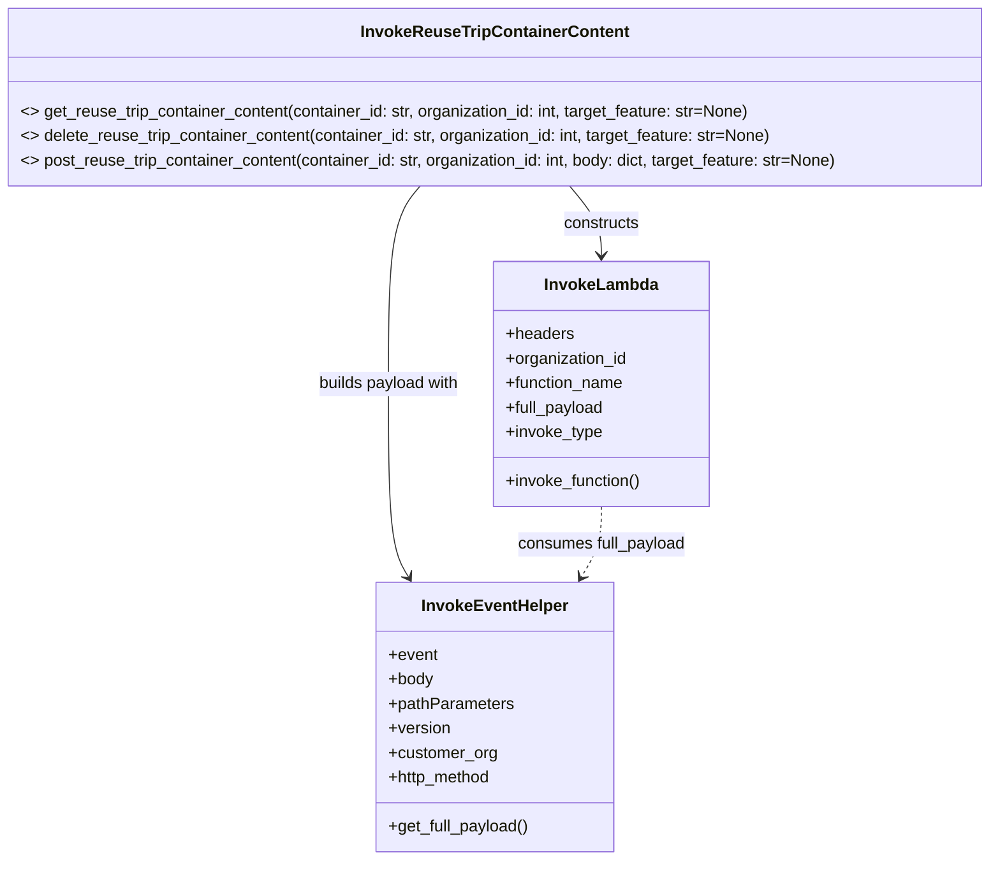

# Diagram: container_tracking_core/container_tracking_service/container_tracking_service/utility/InvokeReuseTripContainerContent.py


> Auto-generated by Obscura crawlers

## Diagram 1



### SVG

<svg id="container" width="978.859375" xmlns="http://www.w3.org/2000/svg" class="classDiagram" height="842" viewBox="0 0 978.859375 842" role="graphics-document document" aria-roledescription="class"><style>#container{font-family:"trebuchet ms",verdana,arial,sans-serif;font-size:16px;fill:#333;}@keyframes edge-animation-frame{from{stroke-dashoffset:0;}}@keyframes dash{to{stroke-dashoffset:0;}}#container .edge-animation-slow{stroke-dasharray:9,5!important;stroke-dashoffset:900;animation:dash 50s linear infinite;stroke-linecap:round;}#container .edge-animation-fast{stroke-dasharray:9,5!important;stroke-dashoffset:900;animation:dash 20s linear infinite;stroke-linecap:round;}#container .error-icon{fill:#552222;}#container .error-text{fill:#552222;stroke:#552222;}#container .edge-thickness-normal{stroke-width:1px;}#container .edge-thickness-thick{stroke-width:3.5px;}#container .edge-pattern-solid{stroke-dasharray:0;}#container .edge-thickness-invisible{stroke-width:0;fill:none;}#container .edge-pattern-dashed{stroke-dasharray:3;}#container .edge-pattern-dotted{stroke-dasharray:2;}#container .marker{fill:#333333;stroke:#333333;}#container .marker.cross{stroke:#333333;}#container svg{font-family:"trebuchet ms",verdana,arial,sans-serif;font-size:16px;}#container p{margin:0;}#container g.classGroup text{fill:#9370DB;stroke:none;font-family:"trebuchet ms",verdana,arial,sans-serif;font-size:10px;}#container g.classGroup text .title{font-weight:bolder;}#container .nodeLabel,#container .edgeLabel{color:#131300;}#container .edgeLabel .label rect{fill:#ECECFF;}#container .label text{fill:#131300;}#container .labelBkg{background:#ECECFF;}#container .edgeLabel .label span{background:#ECECFF;}#container .classTitle{font-weight:bolder;}#container .node rect,#container .node circle,#container .node ellipse,#container .node polygon,#container .node path{fill:#ECECFF;stroke:#9370DB;stroke-width:1px;}#container .divider{stroke:#9370DB;stroke-width:1;}#container g.clickable{cursor:pointer;}#container g.classGroup rect{fill:#ECECFF;stroke:#9370DB;}#container g.classGroup line{stroke:#9370DB;stroke-width:1;}#container .classLabel .box{stroke:none;stroke-width:0;fill:#ECECFF;opacity:0.5;}#container .classLabel .label{fill:#9370DB;font-size:10px;}#container .relation{stroke:#333333;stroke-width:1;fill:none;}#container .dashed-line{stroke-dasharray:3;}#container .dotted-line{stroke-dasharray:1 2;}#container #compositionStart,#container .composition{fill:#333333!important;stroke:#333333!important;stroke-width:1;}#container #compositionEnd,#container .composition{fill:#333333!important;stroke:#333333!important;stroke-width:1;}#container #dependencyStart,#container .dependency{fill:#333333!important;stroke:#333333!important;stroke-width:1;}#container #dependencyStart,#container .dependency{fill:#333333!important;stroke:#333333!important;stroke-width:1;}#container #extensionStart,#container .extension{fill:transparent!important;stroke:#333333!important;stroke-width:1;}#container #extensionEnd,#container .extension{fill:transparent!important;stroke:#333333!important;stroke-width:1;}#container #aggregationStart,#container .aggregation{fill:transparent!important;stroke:#333333!important;stroke-width:1;}#container #aggregationEnd,#container .aggregation{fill:transparent!important;stroke:#333333!important;stroke-width:1;}#container #lollipopStart,#container .lollipop{fill:#ECECFF!important;stroke:#333333!important;stroke-width:1;}#container #lollipopEnd,#container .lollipop{fill:#ECECFF!important;stroke:#333333!important;stroke-width:1;}#container .edgeTerminals{font-size:11px;line-height:initial;}#container .classTitleText{text-anchor:middle;font-size:18px;fill:#333;}#container .label-icon{display:inline-block;height:1em;overflow:visible;vertical-align:-0.125em;}#container .node .label-icon path{fill:currentColor;stroke:revert;stroke-width:revert;}#container :root{--mermaid-font-family:"trebuchet ms",verdana,arial,sans-serif;}</style><g><defs><marker id="container_class-aggregationStart" class="marker aggregation class" refX="18" refY="7" markerWidth="190" markerHeight="240" orient="auto"><path d="M 18,7 L9,13 L1,7 L9,1 Z"></path></marker></defs><defs><marker id="container_class-aggregationEnd" class="marker aggregation class" refX="1" refY="7" markerWidth="20" markerHeight="28" orient="auto"><path d="M 18,7 L9,13 L1,7 L9,1 Z"></path></marker></defs><defs><marker id="container_class-extensionStart" class="marker extension class" refX="18" refY="7" markerWidth="190" markerHeight="240" orient="auto"><path d="M 1,7 L18,13 V 1 Z"></path></marker></defs><defs><marker id="container_class-extensionEnd" class="marker extension class" refX="1" refY="7" markerWidth="20" markerHeight="28" orient="auto"><path d="M 1,1 V 13 L18,7 Z"></path></marker></defs><defs><marker id="container_class-compositionStart" class="marker composition class" refX="18" refY="7" markerWidth="190" markerHeight="240" orient="auto"><path d="M 18,7 L9,13 L1,7 L9,1 Z"></path></marker></defs><defs><marker id="container_class-compositionEnd" class="marker composition class" refX="1" refY="7" markerWidth="20" markerHeight="28" orient="auto"><path d="M 18,7 L9,13 L1,7 L9,1 Z"></path></marker></defs><defs><marker id="container_class-dependencyStart" class="marker dependency class" refX="6" refY="7" markerWidth="190" markerHeight="240" orient="auto"><path d="M 5,7 L9,13 L1,7 L9,1 Z"></path></marker></defs><defs><marker id="container_class-dependencyEnd" class="marker dependency class" refX="13" refY="7" markerWidth="20" markerHeight="28" orient="auto"><path d="M 18,7 L9,13 L14,7 L9,1 Z"></path></marker></defs><defs><marker id="container_class-lollipopStart" class="marker lollipop class" refX="13" refY="7" markerWidth="190" markerHeight="240" orient="auto"><circle stroke="black" fill="transparent" cx="7" cy="7" r="6"></circle></marker></defs><defs><marker id="container_class-lollipopEnd" class="marker lollipop class" refX="1" refY="7" markerWidth="190" markerHeight="240" orient="auto"><circle stroke="black" fill="transparent" cx="7" cy="7" r="6"></circle></marker></defs><g class="root"><g class="clusters"></g><g class="edgePaths"><path d="M563.847,182L569.122,188.167C574.397,194.333,584.946,206.667,590.221,218C595.496,229.333,595.496,239.667,595.496,244.833L595.496,250" id="id_InvokeReuseTripContainerContent_InvokeLambda_1" class="edge-thickness-normal edge-pattern-solid relation" style=";;;" data-edge="true" data-et="edge" data-id="id_InvokeReuseTripContainerContent_InvokeLambda_1" data-points="W3sieCI6NTYzLjg0NzI0NjcyMzc5MDQsInkiOjE4Mn0seyJ4Ijo1OTUuNDk2MDkzNzUsInkiOjIxOX0seyJ4Ijo1OTUuNDk2MDkzNzUsInkiOjI1Nn1d" marker-end="url(#container_class-dependencyEnd)"></path><path d="M415.012,182L409.737,188.167C404.463,194.333,393.913,206.667,388.638,239C383.363,271.333,383.363,323.667,383.363,376C383.363,428.333,383.363,480.667,386.702,512.153C390.041,543.639,396.718,554.279,400.057,559.598L403.395,564.918" id="id_InvokeReuseTripContainerContent_InvokeEventHelper_2" class="edge-thickness-normal edge-pattern-solid relation" style=";;;" data-edge="true" data-et="edge" data-id="id_InvokeReuseTripContainerContent_InvokeEventHelper_2" data-points="W3sieCI6NDE1LjAxMjEyODI3NjIwOTcsInkiOjE4Mn0seyJ4IjozODMuMzYzMjgxMjUsInkiOjIxOX0seyJ4IjozODMuMzYzMjgxMjUsInkiOjM3Nn0seyJ4IjozODMuMzYzMjgxMjUsInkiOjUzM30seyJ4Ijo0MDYuNTg0OTIwNDg4MTY1NjYsInkiOjU3MH1d" marker-end="url(#container_class-dependencyEnd)"></path><path d="M595.496,496L595.496,502.167C595.496,508.333,595.496,520.667,592.157,532.153C588.819,543.639,582.141,554.279,578.803,559.598L575.464,564.918" id="id_InvokeLambda_InvokeEventHelper_3" class="edge-thickness-normal edge-pattern-dashed relation" style=";;;" data-edge="true" data-et="edge" data-id="id_InvokeLambda_InvokeEventHelper_3" data-points="W3sieCI6NTk1LjQ5NjA5Mzc1LCJ5Ijo0OTZ9LHsieCI6NTk1LjQ5NjA5Mzc1LCJ5Ijo1MzN9LHsieCI6NTcyLjI3NDQ1NDUxMTgzNDMsInkiOjU3MH1d" marker-end="url(#container_class-dependencyEnd)"></path></g><g class="edgeLabels"><g class="edgeLabel" transform="translate(595.49609375, 219)"><g class="label" data-id="id_InvokeReuseTripContainerContent_InvokeLambda_1" transform="translate(-37.84375, -12)"><foreignObject width="75.6875" height="24"><div xmlns="http://www.w3.org/1999/xhtml" class="labelBkg" style="display: table-cell; white-space: nowrap; line-height: 1.5; max-width: 200px; text-align: center;"><span class="edgeLabel"><p>constructs</p></span></div></foreignObject></g></g><g class="edgeLabel" transform="translate(383.36328125, 376)"><g class="label" data-id="id_InvokeReuseTripContainerContent_InvokeEventHelper_2" transform="translate(-71.171875, -12)"><foreignObject width="142.34375" height="24"><div xmlns="http://www.w3.org/1999/xhtml" class="labelBkg" style="display: table-cell; white-space: nowrap; line-height: 1.5; max-width: 200px; text-align: center;"><span class="edgeLabel"><p>builds payload with</p></span></div></foreignObject></g></g><g class="edgeLabel" transform="translate(595.49609375, 533)"><g class="label" data-id="id_InvokeLambda_InvokeEventHelper_3" transform="translate(-83.546875, -12)"><foreignObject width="167.09375" height="24"><div xmlns="http://www.w3.org/1999/xhtml" class="labelBkg" style="display: table-cell; white-space: nowrap; line-height: 1.5; max-width: 200px; text-align: center;"><span class="edgeLabel"><p>consumes full_payload</p></span></div></foreignObject></g></g></g><g class="nodes"><g class="node default" id="classId-InvokeReuseTripContainerContent-0" transform="translate(489.4296875, 95)"><g class="basic label-container"><path d="M-481.4296875 -87 L481.4296875 -87 L481.4296875 87 L-481.4296875 87" stroke="none" stroke-width="0" fill="#ECECFF" style=""></path><path d="M-481.4296875 -87 C-276.60635278871604 -87, -71.78301807743208 -87, 481.4296875 -87 M-481.4296875 -87 C-171.1654751937935 -87, 139.098737112413 -87, 481.4296875 -87 M481.4296875 -87 C481.4296875 -18.958446966808367, 481.4296875 49.083106066383266, 481.4296875 87 M481.4296875 -87 C481.4296875 -33.997893891467655, 481.4296875 19.00421221706469, 481.4296875 87 M481.4296875 87 C117.80619995833712 87, -245.81728758332576 87, -481.4296875 87 M481.4296875 87 C142.07825048775743 87, -197.27318652448514 87, -481.4296875 87 M-481.4296875 87 C-481.4296875 30.785289741435278, -481.4296875 -25.429420517129444, -481.4296875 -87 M-481.4296875 87 C-481.4296875 31.741416985844516, -481.4296875 -23.517166028310967, -481.4296875 -87" stroke="#9370DB" stroke-width="1.3" fill="none" stroke-dasharray="0 0" style=""></path></g><g class="annotation-group text" transform="translate(0, -63)"></g><g class="label-group text" transform="translate(-125.15625, -63)"><g class="label" style="font-weight: bolder" transform="translate(0,-12)"><foreignObject width="250.3125" height="24"><div xmlns="http://www.w3.org/1999/xhtml" style="display: table-cell; white-space: nowrap; line-height: 1.5; max-width: 297px; text-align: center;"><span class="nodeLabel markdown-node-label" style=""><p>InvokeReuseTripContainerContent</p></span></div></foreignObject></g></g><g class="members-group text" transform="translate(-469.4296875, -15)"></g><g class="methods-group text" transform="translate(-469.4296875, 15)"><g class="label" style="" transform="translate(0,-12)"><foreignObject width="724.09375" height="24"><div xmlns="http://www.w3.org/1999/xhtml" style="display: table-cell; white-space: nowrap; line-height: 1.5; max-width: 814px; text-align: center;"><span class="nodeLabel markdown-node-label" style=""><p>&lt;&gt; get_reuse_trip_container_content(container_id: str, organization_id: int, target_feature: str=None)</p></span></div></foreignObject></g><g class="label" style="" transform="translate(0,12)"><foreignObject width="747.078125" height="24"><div xmlns="http://www.w3.org/1999/xhtml" style="display: table-cell; white-space: nowrap; line-height: 1.5; max-width: 837px; text-align: center;"><span class="nodeLabel markdown-node-label" style=""><p>&lt;&gt; delete_reuse_trip_container_content(container_id: str, organization_id: int, target_feature: str=None)</p></span></div></foreignObject></g><g class="label" style="" transform="translate(0,36)"><foreignObject width="813.703125" height="24"><div xmlns="http://www.w3.org/1999/xhtml" style="display: table-cell; white-space: nowrap; line-height: 1.5; max-width: 903px; text-align: center;"><span class="nodeLabel markdown-node-label" style=""><p>&lt;&gt; post_reuse_trip_container_content(container_id: str, organization_id: int, body: dict, target_feature: str=None)</p></span></div></foreignObject></g></g><g class="divider" style=""><path d="M-481.4296875 -39 C-266.7181286072207 -39, -52.00656971444141 -39, 481.4296875 -39 M-481.4296875 -39 C-222.73431774208768 -39, 35.961052015824635 -39, 481.4296875 -39" stroke="#9370DB" stroke-width="1.3" fill="none" stroke-dasharray="0 0" style=""></path></g><g class="divider" style=""><path d="M-481.4296875 -15 C-148.74280920103888 -15, 183.94406909792224 -15, 481.4296875 -15 M-481.4296875 -15 C-278.6611892622479 -15, -75.89269102449578 -15, 481.4296875 -15" stroke="#9370DB" stroke-width="1.3" fill="none" stroke-dasharray="0 0" style=""></path></g></g><g class="node default" id="classId-InvokeLambda-1" transform="translate(595.49609375, 376)"><g class="basic label-container"><path d="M-105.9609375 -120 L105.9609375 -120 L105.9609375 120 L-105.9609375 120" stroke="none" stroke-width="0" fill="#ECECFF" style=""></path><path d="M-105.9609375 -120 C-39.73388950302666 -120, 26.49315849394668 -120, 105.9609375 -120 M-105.9609375 -120 C-33.33903934247036 -120, 39.282858815059285 -120, 105.9609375 -120 M105.9609375 -120 C105.9609375 -44.22905861849361, 105.9609375 31.54188276301278, 105.9609375 120 M105.9609375 -120 C105.9609375 -55.993473681021555, 105.9609375 8.01305263795689, 105.9609375 120 M105.9609375 120 C24.41853182665244 120, -57.12387384669512 120, -105.9609375 120 M105.9609375 120 C61.81708757614949 120, 17.67323765229898 120, -105.9609375 120 M-105.9609375 120 C-105.9609375 34.060210531455525, -105.9609375 -51.87957893708895, -105.9609375 -120 M-105.9609375 120 C-105.9609375 46.69983945234097, -105.9609375 -26.600321095318066, -105.9609375 -120" stroke="#9370DB" stroke-width="1.3" fill="none" stroke-dasharray="0 0" style=""></path></g><g class="annotation-group text" transform="translate(0, -96)"></g><g class="label-group text" transform="translate(-53.484375, -96)"><g class="label" style="font-weight: bolder" transform="translate(0,-12)"><foreignObject width="106.96875" height="24"><div xmlns="http://www.w3.org/1999/xhtml" style="display: table-cell; white-space: nowrap; line-height: 1.5; max-width: 156px; text-align: center;"><span class="nodeLabel markdown-node-label" style=""><p>InvokeLambda</p></span></div></foreignObject></g></g><g class="members-group text" transform="translate(-93.9609375, -48)"><g class="label" style="" transform="translate(0,-12)"><foreignObject width="66.328125" height="24"><div xmlns="http://www.w3.org/1999/xhtml" style="display: table-cell; white-space: nowrap; line-height: 1.5; max-width: 124px; text-align: center;"><span class="nodeLabel markdown-node-label" style=""><p>+headers</p></span></div></foreignObject></g><g class="label" style="" transform="translate(0,12)"><foreignObject width="120.75" height="24"><div xmlns="http://www.w3.org/1999/xhtml" style="display: table-cell; white-space: nowrap; line-height: 1.5; max-width: 178px; text-align: center;"><span class="nodeLabel markdown-node-label" style=""><p>+organization_id</p></span></div></foreignObject></g><g class="label" style="" transform="translate(0,36)"><foreignObject width="117.28125" height="24"><div xmlns="http://www.w3.org/1999/xhtml" style="display: table-cell; white-space: nowrap; line-height: 1.5; max-width: 175px; text-align: center;"><span class="nodeLabel markdown-node-label" style=""><p>+function_name</p></span></div></foreignObject></g><g class="label" style="" transform="translate(0,60)"><foreignObject width="97.859375" height="24"><div xmlns="http://www.w3.org/1999/xhtml" style="display: table-cell; white-space: nowrap; line-height: 1.5; max-width: 155px; text-align: center;"><span class="nodeLabel markdown-node-label" style=""><p>+full_payload</p></span></div></foreignObject></g><g class="label" style="" transform="translate(0,84)"><foreignObject width="95.15625" height="24"><div xmlns="http://www.w3.org/1999/xhtml" style="display: table-cell; white-space: nowrap; line-height: 1.5; max-width: 153px; text-align: center;"><span class="nodeLabel markdown-node-label" style=""><p>+invoke_type</p></span></div></foreignObject></g></g><g class="methods-group text" transform="translate(-93.9609375, 96)"><g class="label" style="" transform="translate(0,-12)"><foreignObject width="134.4375" height="24"><div xmlns="http://www.w3.org/1999/xhtml" style="display: table-cell; white-space: nowrap; line-height: 1.5; max-width: 192px; text-align: center;"><span class="nodeLabel markdown-node-label" style=""><p>+invoke_function()</p></span></div></foreignObject></g></g><g class="divider" style=""><path d="M-105.9609375 -72 C-42.23076695505633 -72, 21.499403589887336 -72, 105.9609375 -72 M-105.9609375 -72 C-43.30685885951432 -72, 19.347219780971358 -72, 105.9609375 -72" stroke="#9370DB" stroke-width="1.3" fill="none" stroke-dasharray="0 0" style=""></path></g><g class="divider" style=""><path d="M-105.9609375 72 C-45.35511058067546 72, 15.250716338649084 72, 105.9609375 72 M-105.9609375 72 C-40.697151932573775 72, 24.56663363485245 72, 105.9609375 72" stroke="#9370DB" stroke-width="1.3" fill="none" stroke-dasharray="0 0" style=""></path></g></g><g class="node default" id="classId-InvokeEventHelper-2" transform="translate(489.4296875, 702)"><g class="basic label-container"><path d="M-116.05859375 -132 L116.05859375 -132 L116.05859375 132 L-116.05859375 132" stroke="none" stroke-width="0" fill="#ECECFF" style=""></path><path d="M-116.05859375 -132 C-35.75875665613694 -132, 44.54108043772612 -132, 116.05859375 -132 M-116.05859375 -132 C-64.52033812187162 -132, -12.982082493743249 -132, 116.05859375 -132 M116.05859375 -132 C116.05859375 -69.37038656731772, 116.05859375 -6.740773134635461, 116.05859375 132 M116.05859375 -132 C116.05859375 -37.339125861610114, 116.05859375 57.32174827677977, 116.05859375 132 M116.05859375 132 C68.18983319863153 132, 20.321072647263065 132, -116.05859375 132 M116.05859375 132 C50.702325636871976 132, -14.653942476256049 132, -116.05859375 132 M-116.05859375 132 C-116.05859375 60.24620432369902, -116.05859375 -11.507591352601963, -116.05859375 -132 M-116.05859375 132 C-116.05859375 62.83908934842108, -116.05859375 -6.321821303157833, -116.05859375 -132" stroke="#9370DB" stroke-width="1.3" fill="none" stroke-dasharray="0 0" style=""></path></g><g class="annotation-group text" transform="translate(0, -108)"></g><g class="label-group text" transform="translate(-69.0859375, -108)"><g class="label" style="font-weight: bolder" transform="translate(0,-12)"><foreignObject width="138.171875" height="24"><div xmlns="http://www.w3.org/1999/xhtml" style="display: table-cell; white-space: nowrap; line-height: 1.5; max-width: 187px; text-align: center;"><span class="nodeLabel markdown-node-label" style=""><p>InvokeEventHelper</p></span></div></foreignObject></g></g><g class="members-group text" transform="translate(-104.05859375, -60)"><g class="label" style="" transform="translate(0,-12)"><foreignObject width="48.328125" height="24"><div xmlns="http://www.w3.org/1999/xhtml" style="display: table-cell; white-space: nowrap; line-height: 1.5; max-width: 106px; text-align: center;"><span class="nodeLabel markdown-node-label" style=""><p>+event</p></span></div></foreignObject></g><g class="label" style="" transform="translate(0,12)"><foreignObject width="44.28125" height="24"><div xmlns="http://www.w3.org/1999/xhtml" style="display: table-cell; white-space: nowrap; line-height: 1.5; max-width: 102px; text-align: center;"><span class="nodeLabel markdown-node-label" style=""><p>+body</p></span></div></foreignObject></g><g class="label" style="" transform="translate(0,36)"><foreignObject width="122.734375" height="24"><div xmlns="http://www.w3.org/1999/xhtml" style="display: table-cell; white-space: nowrap; line-height: 1.5; max-width: 180px; text-align: center;"><span class="nodeLabel markdown-node-label" style=""><p>+pathParameters</p></span></div></foreignObject></g><g class="label" style="" transform="translate(0,60)"><foreignObject width="61" height="24"><div xmlns="http://www.w3.org/1999/xhtml" style="display: table-cell; white-space: nowrap; line-height: 1.5; max-width: 118px; text-align: center;"><span class="nodeLabel markdown-node-label" style=""><p>+version</p></span></div></foreignObject></g><g class="label" style="" transform="translate(0,84)"><foreignObject width="106.078125" height="24"><div xmlns="http://www.w3.org/1999/xhtml" style="display: table-cell; white-space: nowrap; line-height: 1.5; max-width: 164px; text-align: center;"><span class="nodeLabel markdown-node-label" style=""><p>+customer_org</p></span></div></foreignObject></g><g class="label" style="" transform="translate(0,108)"><foreignObject width="102.921875" height="24"><div xmlns="http://www.w3.org/1999/xhtml" style="display: table-cell; white-space: nowrap; line-height: 1.5; max-width: 160px; text-align: center;"><span class="nodeLabel markdown-node-label" style=""><p>+http_method</p></span></div></foreignObject></g></g><g class="methods-group text" transform="translate(-104.05859375, 108)"><g class="label" style="" transform="translate(0,-12)"><foreignObject width="139.03125" height="24"><div xmlns="http://www.w3.org/1999/xhtml" style="display: table-cell; white-space: nowrap; line-height: 1.5; max-width: 196px; text-align: center;"><span class="nodeLabel markdown-node-label" style=""><p>+get_full_payload()</p></span></div></foreignObject></g></g><g class="divider" style=""><path d="M-116.05859375 -84 C-33.37123789133143 -84, 49.316117967337135 -84, 116.05859375 -84 M-116.05859375 -84 C-49.716183592435954 -84, 16.626226565128093 -84, 116.05859375 -84" stroke="#9370DB" stroke-width="1.3" fill="none" stroke-dasharray="0 0" style=""></path></g><g class="divider" style=""><path d="M-116.05859375 84 C-59.54681588407511 84, -3.0350380181502175 84, 116.05859375 84 M-116.05859375 84 C-58.545681233225615 84, -1.0327687164512298 84, 116.05859375 84" stroke="#9370DB" stroke-width="1.3" fill="none" stroke-dasharray="0 0" style=""></path></g></g></g></g></g></svg>

## Diagram 2

```mermaid
sequenceDiagram
participant Client
participant Reuse as InvokeReuseTripContainerContent
participant Helper as InvokeEventHelper
participant Lambda as InvokeLambda
participant Handler as reuse-trip-container-content-handler
Client->>Reuse: get_reuse_trip_container_content(container_id, organization_id, target_feature?)
Reuse->>Helper: create full payload (event={}, body={}, pathParameters={id:...}, http_method=GET)
Helper-->>Reuse: full_payload
Reuse->>Lambda: Instantiate(headers, organization_id, function_name, full_payload)
Reuse->>Lambda: invoke_function()
Lambda->>Handler: invoke (synchronous)
Handler-->>Lambda: status_code, response
Lambda-->>Reuse: status_code, response
Reuse-->>Client: return status_code, response
alt delete flow
Client->>Reuse: delete_reuse_trip_container_content(container_id, organization_id, target_feature?)
Reuse->>Helper: create full payload (http_method=DELETE)
Helper-->>Reuse: full_payload
Reuse->>Lambda: invoke_function()
Lambda->>Handler: invoke (synchronous DELETE)
Handler-->>Lambda: status_code, response
Lambda-->>Reuse: status_code, response
Reuse-->>Client: return status_code, response
end
alt post flow (Event invoke_type)
Client->>Reuse: post_reuse_trip_container_content(container_id, organization_id, body, target_feature?)
Reuse->>Helper: create full payload (body=body, http_method=POST)
Helper-->>Reuse: full_payload
Reuse->>Lambda: Instantiate(..., invoke_type="Event")
Reuse->>Lambda: invoke_function()
Lambda->>Handler: invoke (asynchronous Event POST)
Handler-->>Lambda: (acknowledgement or no response)
Reuse-->>Client: (no return / fire-and-forget)
```

> SVG rendering failed for this diagram.
