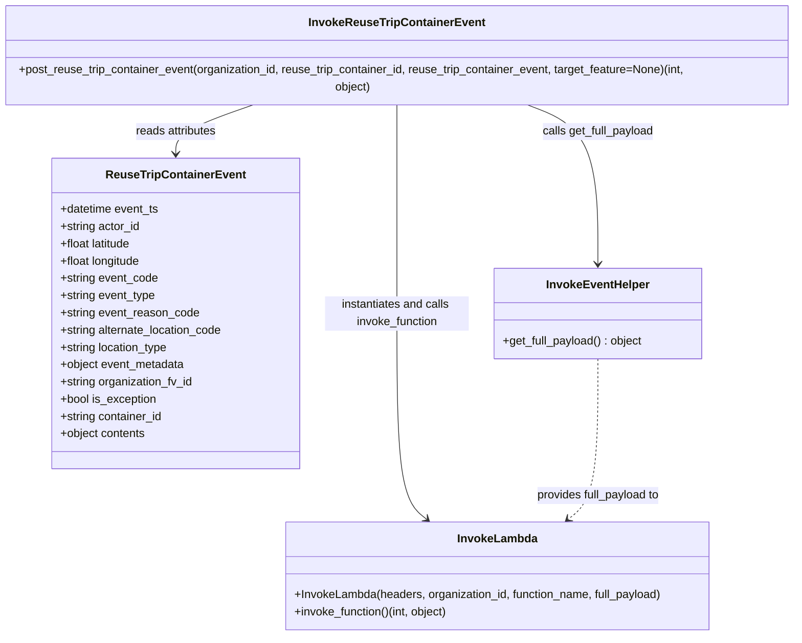
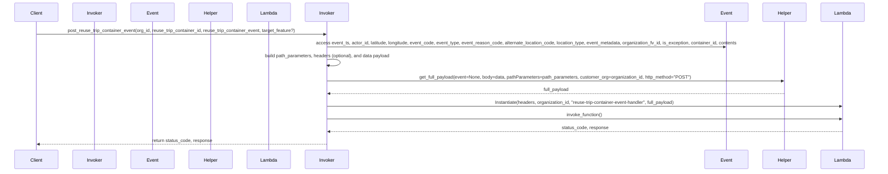

# Diagram: container_tracking_core/container_tracking_service/container_tracking_service/utility/InvokeReuseTripContainerEvent.py

> Auto-generated by Obscura crawlers

## Diagram 1

### SVG

<svg id="container" width="1151.8359375" xmlns="http://www.w3.org/2000/svg" class="classDiagram" height="872" viewBox="0 0 1151.8359375 872" role="graphics-document document" aria-roledescription="class"><g><defs><marker id="container_class-aggregationStart" class="marker aggregation class" refX="18" refY="7" markerWidth="190" markerHeight="240" orient="auto"><path d="M 18,7 L9,13 L1,7 L9,1 Z"></path></marker></defs><defs><marker id="container_class-aggregationEnd" class="marker aggregation class" refX="1" refY="7" markerWidth="20" markerHeight="28" orient="auto"><path d="M 18,7 L9,13 L1,7 L9,1 Z"></path></marker></defs><defs><marker id="container_class-extensionStart" class="marker extension class" refX="18" refY="7" markerWidth="190" markerHeight="240" orient="auto"><path d="M 1,7 L18,13 V 1 Z"></path></marker></defs><defs><marker id="container_class-extensionEnd" class="marker extension class" refX="1" refY="7" markerWidth="20" markerHeight="28" orient="auto"><path d="M 1,1 V 13 L18,7 Z"></path></marker></defs><defs><marker id="container_class-compositionStart" class="marker composition class" refX="18" refY="7" markerWidth="190" markerHeight="240" orient="auto"><path d="M 18,7 L9,13 L1,7 L9,1 Z"></path></marker></defs><defs><marker id="container_class-compositionEnd" class="marker composition class" refX="1" refY="7" markerWidth="20" markerHeight="28" orient="auto"><path d="M 18,7 L9,13 L1,7 L9,1 Z"></path></marker></defs><defs><marker id="container_class-dependencyStart" class="marker dependency class" refX="6" refY="7" markerWidth="190" markerHeight="240" orient="auto"><path d="M 5,7 L9,13 L1,7 L9,1 Z"></path></marker></defs><defs><marker id="container_class-dependencyEnd" class="marker dependency class" refX="13" refY="7" markerWidth="20" markerHeight="28" orient="auto"><path d="M 18,7 L9,13 L14,7 L9,1 Z"></path></marker></defs><defs><marker id="container_class-lollipopStart" class="marker lollipop class" refX="13" refY="7" markerWidth="190" markerHeight="240" orient="auto"><circle stroke="black" fill="transparent" cx="7" cy="7" r="6"></circle></marker></defs><defs><marker id="container_class-lollipopEnd" class="marker lollipop class" refX="1" refY="7" markerWidth="190" markerHeight="240" orient="auto"><circle stroke="black" fill="transparent" cx="7" cy="7" r="6"></circle></marker></defs><g class="root"><g class="clusters"></g><g class="edgePaths"><path d="M381.868,134L362.874,140.167C343.88,146.333,305.891,158.667,286.897,170C267.902,181.333,267.902,191.667,267.902,196.833L267.902,202" id="id_InvokeReuseTripContainerEvent_ReuseTripContainerEvent_1" class="edge-thickness-normal edge-pattern-solid relation" style=";;;" data-edge="true" data-et="edge" data-id="id_InvokeReuseTripContainerEvent_ReuseTripContainerEvent_1" data-points="W3sieCI6MzgxLjg2ODEyNDk5OTk5OTk2LCJ5IjoxMzR9LHsieCI6MjY3LjkwMjM0Mzc1LCJ5IjoxNzF9LHsieCI6MjY3LjkwMjM0Mzc1LCJ5IjoyMDh9XQ==" marker-end="url(#container_class-dependencyEnd)"></path><path d="M752.291,134L769.555,140.167C786.819,146.333,821.347,158.667,838.611,195.5C855.875,232.333,855.875,293.667,855.875,324.333L855.875,355" id="id_InvokeReuseTripContainerEvent_InvokeEventHelper_2" class="edge-thickness-normal edge-pattern-solid relation" style=";;;" data-edge="true" data-et="edge" data-id="id_InvokeReuseTripContainerEvent_InvokeEventHelper_2" data-points="W3sieCI6NzUyLjI5MDg5ODQzNzUsInkiOjEzNH0seyJ4Ijo4NTUuODc1LCJ5IjoxNzF9LHsieCI6ODU1Ljg3NSwieSI6MzYxfV0=" marker-end="url(#container_class-dependencyEnd)"></path><path d="M575.918,134L575.918,140.167C575.918,146.333,575.918,158.667,575.918,207C575.918,255.333,575.918,339.667,575.918,424C575.918,508.333,575.918,592.667,582.844,640.375C589.771,688.084,603.623,699.168,610.55,704.71L617.476,710.251" id="id_InvokeReuseTripContainerEvent_InvokeLambda_3" class="edge-thickness-normal edge-pattern-solid relation" style=";;;" data-edge="true" data-et="edge" data-id="id_InvokeReuseTripContainerEvent_InvokeLambda_3" data-points="W3sieCI6NTc1LjkxNzk2ODc1LCJ5IjoxMzR9LHsieCI6NTc1LjkxNzk2ODc1LCJ5IjoxNzF9LHsieCI6NTc1LjkxNzk2ODc1LCJ5Ijo0MjR9LHsieCI6NTc1LjkxNzk2ODc1LCJ5Ijo2Nzd9LHsieCI6NjIyLjE2MDg3MTIzMzI1OSwieSI6NzE0fV0=" marker-end="url(#container_class-dependencyEnd)"></path><path d="M855.875,487L855.875,518.667C855.875,550.333,855.875,613.667,848.949,650.875C842.022,688.084,828.17,699.168,821.243,704.71L814.317,710.251" id="id_InvokeEventHelper_InvokeLambda_4" class="edge-thickness-normal edge-pattern-dashed relation" style=";;;" data-edge="true" data-et="edge" data-id="id_InvokeEventHelper_InvokeLambda_4" data-points="W3sieCI6ODU1Ljg3NSwieSI6NDg3fSx7IngiOjg1NS44NzUsInkiOjY3N30seyJ4Ijo4MDkuNjMyMDk3NTE2NzQxLCJ5Ijo3MTR9XQ==" marker-end="url(#container_class-dependencyEnd)"></path></g><g class="edgeLabels"><g class="edgeLabel" transform="translate(267.90234375, 171)"><g class="label" data-id="id_InvokeReuseTripContainerEvent_ReuseTripContainerEvent_1" transform="translate(-57.8671875, -12)"><foreignObject width="115.734375" height="24">

reads attributes

</foreignObject></g></g><g class="edgeLabel" transform="translate(855.875, 171)"><g class="label" data-id="id_InvokeReuseTripContainerEvent_InvokeEventHelper_2" transform="translate(-78.8984375, -12)"><foreignObject width="157.796875" height="24">

calls get_full_payload

</foreignObject></g></g><g class="edgeLabel" transform="translate(575.91796875, 424)"><g class="label" data-id="id_InvokeReuseTripContainerEvent_InvokeLambda_3" transform="translate(-100, -24)"><foreignObject width="200" height="48">

instantiates and calls invoke_function

</foreignObject></g></g><g class="edgeLabel" transform="translate(855.875, 677)"><g class="label" data-id="id_InvokeEventHelper_InvokeLambda_4" transform="translate(-88.0546875, -12)"><foreignObject width="176.109375" height="24">

provides full_payload to

</foreignObject></g></g></g><g class="nodes"><g class="node default" id="classId-ReuseTripContainerEvent-0" transform="translate(267.90234375, 424)"><g class="basic label-container"><path d="M-173.015625 -216 L173.015625 -216 L173.015625 216 L-173.015625 216" stroke="none" stroke-width="0" fill="#ECECFF" style=""></path><path d="M-173.015625 -216 C-77.58738783046822 -216, 17.840849339063567 -216, 173.015625 -216 M-173.015625 -216 C-74.6587357582749 -216, 23.6981534834502 -216, 173.015625 -216 M173.015625 -216 C173.015625 -70.32999624335105, 173.015625 75.3400075132979, 173.015625 216 M173.015625 -216 C173.015625 -117.76452828343291, 173.015625 -19.52905656686582, 173.015625 216 M173.015625 216 C86.52318563279673 216, 0.03074626559345006 216, -173.015625 216 M173.015625 216 C34.73576173931821 216, -103.54410152136359 216, -173.015625 216 M-173.015625 216 C-173.015625 72.00521981157584, -173.015625 -71.98956037684832, -173.015625 -216 M-173.015625 216 C-173.015625 103.17829116487258, -173.015625 -9.643417670254848, -173.015625 -216" stroke="#9370DB" stroke-width="1.3" fill="none" stroke-dasharray="0 0" style=""></path></g><g class="annotation-group text" transform="translate(0, -192)"></g><g class="label-group text" transform="translate(-92.21875, -192)"><g class="label" style="font-weight: bolder" transform="translate(0,-12)"><foreignObject width="184.4375" height="24">

ReuseTripContainerEvent

</foreignObject></g></g><g class="members-group text" transform="translate(-161.015625, -144)"><g class="label" style="" transform="translate(0,-12)"><foreignObject width="139.0625" height="24">

+datetime event_ts

</foreignObject></g><g class="label" style="" transform="translate(0,12)"><foreignObject width="112.390625" height="24">

+string actor_id

</foreignObject></g><g class="label" style="" transform="translate(0,36)"><foreignObject width="102.03125" height="24">

+float latitude

</foreignObject></g><g class="label" style="" transform="translate(0,60)"><foreignObject width="114.578125" height="24">

+float longitude

</foreignObject></g><g class="label" style="" transform="translate(0,84)"><foreignObject width="137.15625" height="24">

+string event_code

</foreignObject></g><g class="label" style="" transform="translate(0,108)"><foreignObject width="133.984375" height="24">

+string event_type

</foreignObject></g><g class="label" style="" transform="translate(0,132)"><foreignObject width="194.46875" height="24">

+string event_reason_code

</foreignObject></g><g class="label" style="" transform="translate(0,156)"><foreignObject width="229.8125" height="24">

+string alternate_location_code

</foreignObject></g><g class="label" style="" transform="translate(0,180)"><foreignObject width="152.8125" height="24">

+string location_type

</foreignObject></g><g class="label" style="" transform="translate(0,204)"><foreignObject width="175.796875" height="24">

+object event_metadata

</foreignObject></g><g class="label" style="" transform="translate(0,228)"><foreignObject width="187.375" height="24">

+string organization_fv_id

</foreignObject></g><g class="label" style="" transform="translate(0,252)"><foreignObject width="135.53125" height="24">

+bool is_exception

</foreignObject></g><g class="label" style="" transform="translate(0,276)"><foreignObject width="144.1875" height="24">

+string container_id

</foreignObject></g><g class="label" style="" transform="translate(0,300)"><foreignObject width="120.625" height="24">

+object contents

</foreignObject></g></g><g class="methods-group text" transform="translate(-161.015625, 216)"></g><g class="divider" style=""><path d="M-173.015625 -168 C-98.02370789368479 -168, -23.031790787369573 -168, 173.015625 -168 M-173.015625 -168 C-59.801293551563376 -168, 53.41303789687325 -168, 173.015625 -168" stroke="#9370DB" stroke-width="1.3" fill="none" stroke-dasharray="0 0" style=""></path></g><g class="divider" style=""><path d="M-173.015625 192 C-43.7589354016454 192, 85.4977541967092 192, 173.015625 192 M-173.015625 192 C-97.1910851714119 192, -21.366545342823798 192, 173.015625 192" stroke="#9370DB" stroke-width="1.3" fill="none" stroke-dasharray="0 0" style=""></path></g></g><g class="node default" id="classId-InvokeEventHelper-1" transform="translate(855.875, 424)"><g class="basic label-container"><path d="M-144.95703125 -63 L144.95703125 -63 L144.95703125 63 L-144.95703125 63" stroke="none" stroke-width="0" fill="#ECECFF" style=""></path><path d="M-144.95703125 -63 C-32.7884286562154 -63, 79.3801739375692 -63, 144.95703125 -63 M-144.95703125 -63 C-64.924370359259 -63, 15.108290531481998 -63, 144.95703125 -63 M144.95703125 -63 C144.95703125 -36.70893600314998, 144.95703125 -10.417872006299959, 144.95703125 63 M144.95703125 -63 C144.95703125 -21.728625315749923, 144.95703125 19.542749368500154, 144.95703125 63 M144.95703125 63 C48.235767322129036 63, -48.48549660574193 63, -144.95703125 63 M144.95703125 63 C68.47669880352541 63, -8.003633642949183 63, -144.95703125 63 M-144.95703125 63 C-144.95703125 28.486985237459777, -144.95703125 -6.026029525080446, -144.95703125 -63 M-144.95703125 63 C-144.95703125 23.360407481348133, -144.95703125 -16.279185037303733, -144.95703125 -63" stroke="#9370DB" stroke-width="1.3" fill="none" stroke-dasharray="0 0" style=""></path></g><g class="annotation-group text" transform="translate(0, -39)"></g><g class="label-group text" transform="translate(-69.0859375, -39)"><g class="label" style="font-weight: bolder" transform="translate(0,-12)"><foreignObject width="138.171875" height="24">

InvokeEventHelper

</foreignObject></g></g><g class="members-group text" transform="translate(-132.95703125, 9)"></g><g class="methods-group text" transform="translate(-132.95703125, 39)"><g class="label" style="" transform="translate(0,-12)"><foreignObject width="196.828125" height="24">

+get_full_payload() : object

</foreignObject></g></g><g class="divider" style=""><path d="M-144.95703125 -15 C-51.42697669450267 -15, 42.10307786099466 -15, 144.95703125 -15 M-144.95703125 -15 C-55.8967488359671 -15, 33.163533578065795 -15, 144.95703125 -15" stroke="#9370DB" stroke-width="1.3" fill="none" stroke-dasharray="0 0" style=""></path></g><g class="divider" style=""><path d="M-144.95703125 9 C-77.03943824685453 9, -9.12184524370906 9, 144.95703125 9 M-144.95703125 9 C-52.70260128180324 9, 39.55182868639352 9, 144.95703125 9" stroke="#9370DB" stroke-width="1.3" fill="none" stroke-dasharray="0 0" style=""></path></g></g><g class="node default" id="classId-InvokeLambda-2" transform="translate(715.896484375, 789)"><g class="basic label-container"><path d="M-298.28125 -75 L298.28125 -75 L298.28125 75 L-298.28125 75" stroke="none" stroke-width="0" fill="#ECECFF" style=""></path><path d="M-298.28125 -75 C-81.71835897078341 -75, 134.84453205843317 -75, 298.28125 -75 M-298.28125 -75 C-96.64713078531605 -75, 104.9869884293679 -75, 298.28125 -75 M298.28125 -75 C298.28125 -17.438166332166745, 298.28125 40.12366733566651, 298.28125 75 M298.28125 -75 C298.28125 -21.452864199921592, 298.28125 32.094271600156816, 298.28125 75 M298.28125 75 C123.48183941347267 75, -51.31757117305466 75, -298.28125 75 M298.28125 75 C97.0024546008481 75, -104.2763407983038 75, -298.28125 75 M-298.28125 75 C-298.28125 23.406879132346525, -298.28125 -28.18624173530695, -298.28125 -75 M-298.28125 75 C-298.28125 39.29958037057339, -298.28125 3.5991607411467754, -298.28125 -75" stroke="#9370DB" stroke-width="1.3" fill="none" stroke-dasharray="0 0" style=""></path></g><g class="annotation-group text" transform="translate(0, -51)"></g><g class="label-group text" transform="translate(-53.484375, -51)"><g class="label" style="font-weight: bolder" transform="translate(0,-12)"><foreignObject width="106.96875" height="24">

InvokeLambda

</foreignObject></g></g><g class="members-group text" transform="translate(-286.28125, -3)"></g><g class="methods-group text" transform="translate(-286.28125, 27)"><g class="label" style="" transform="translate(0,-12)"><foreignObject width="519.078125" height="24">

+InvokeLambda(headers, organization_id, function_name, full_payload)

</foreignObject></g><g class="label" style="" transform="translate(0,12)"><foreignObject width="218.09375" height="24">

+invoke_function()(int, object)

</foreignObject></g></g><g class="divider" style=""><path d="M-298.28125 -27 C-175.35420463842814 -27, -52.42715927685626 -27, 298.28125 -27 M-298.28125 -27 C-110.74921099835973 -27, 76.78282800328054 -27, 298.28125 -27" stroke="#9370DB" stroke-width="1.3" fill="none" stroke-dasharray="0 0" style=""></path></g><g class="divider" style=""><path d="M-298.28125 -3 C-74.33352691595078 -3, 149.61419616809843 -3, 298.28125 -3 M-298.28125 -3 C-72.60890255508829 -3, 153.06344488982342 -3, 298.28125 -3" stroke="#9370DB" stroke-width="1.3" fill="none" stroke-dasharray="0 0" style=""></path></g></g><g class="node default" id="classId-InvokeReuseTripContainerEvent-3" transform="translate(575.91796875, 71)"><g class="basic label-container"><path d="M-567.91796875 -63 L567.91796875 -63 L567.91796875 63 L-567.91796875 63" stroke="none" stroke-width="0" fill="#ECECFF" style=""></path><path d="M-567.91796875 -63 C-307.85710740553293 -63, -47.79624606106586 -63, 567.91796875 -63 M-567.91796875 -63 C-305.46260185048465 -63, -43.00723495096929 -63, 567.91796875 -63 M567.91796875 -63 C567.91796875 -20.982133390367757, 567.91796875 21.035733219264486, 567.91796875 63 M567.91796875 -63 C567.91796875 -36.3099408686891, 567.91796875 -9.619881737378186, 567.91796875 63 M567.91796875 63 C202.32440984382356 63, -163.26914906235288 63, -567.91796875 63 M567.91796875 63 C205.30315704744487 63, -157.31165465511026 63, -567.91796875 63 M-567.91796875 63 C-567.91796875 15.367592342041362, -567.91796875 -32.264815315917275, -567.91796875 -63 M-567.91796875 63 C-567.91796875 34.81415693974134, -567.91796875 6.6283138794826755, -567.91796875 -63" stroke="#9370DB" stroke-width="1.3" fill="none" stroke-dasharray="0 0" style=""></path></g><g class="annotation-group text" transform="translate(0, -39)"></g><g class="label-group text" transform="translate(-116.5703125, -39)"><g class="label" style="font-weight: bolder" transform="translate(0,-12)"><foreignObject width="233.140625" height="24">

InvokeReuseTripContainerEvent

</foreignObject></g></g><g class="members-group text" transform="translate(-555.91796875, 9)"></g><g class="methods-group text" transform="translate(-555.91796875, 39)"><g class="label" style="" transform="translate(0,-12)"><foreignObject width="995.265625" height="24">

+post_reuse_trip_container_event(organization_id, reuse_trip_container_id, reuse_trip_container_event, target_feature=None)(int, object)

</foreignObject></g></g><g class="divider" style=""><path d="M-567.91796875 -15 C-166.92855339340747 -15, 234.06086196318506 -15, 567.91796875 -15 M-567.91796875 -15 C-326.96770163794736 -15, -86.01743452589466 -15, 567.91796875 -15" stroke="#9370DB" stroke-width="1.3" fill="none" stroke-dasharray="0 0" style=""></path></g><g class="divider" style=""><path d="M-567.91796875 9 C-198.9088400710309 9, 170.10028860793818 9, 567.91796875 9 M-567.91796875 9 C-157.62702826787347 9, 252.66391221425306 9, 567.91796875 9" stroke="#9370DB" stroke-width="1.3" fill="none" stroke-dasharray="0 0" style=""></path></g></g></g></g></g></svg>

## Diagram 2

### SVG

<svg id="container" width="3196" xmlns="http://www.w3.org/2000/svg" height="633" viewBox="-50 -10 3196 633" role="graphics-document document" aria-roledescription="sequence"><g><rect x="2946" y="547" fill="#eaeaea" stroke="#666" width="150" height="65" name="Lambda" rx="3" ry="3" class="actor actor-bottom"></rect><text x="3021" y="579.5" dominant-baseline="central" alignment-baseline="central" class="actor actor-box" style="text-anchor: middle; font-size: 16px; font-weight: 400;"><tspan x="3021" dy="0">Lambda</tspan></text></g><g><rect x="2746" y="547" fill="#eaeaea" stroke="#666" width="150" height="65" name="Helper" rx="3" ry="3" class="actor actor-bottom"></rect><text x="2821" y="579.5" dominant-baseline="central" alignment-baseline="central" class="actor actor-box" style="text-anchor: middle; font-size: 16px; font-weight: 400;"><tspan x="2821" dy="0">Helper</tspan></text></g><g><rect x="2546" y="547" fill="#eaeaea" stroke="#666" width="150" height="65" name="Event" rx="3" ry="3" class="actor actor-bottom"></rect><text x="2621" y="579.5" dominant-baseline="central" alignment-baseline="central" class="actor actor-box" style="text-anchor: middle; font-size: 16px; font-weight: 400;"><tspan x="2621" dy="0">Event</tspan></text></g><g><rect x="1000" y="547" fill="#eaeaea" stroke="#666" width="150" height="65" name="Invoker" rx="3" ry="3" class="actor actor-bottom"></rect><text x="1075" y="579.5" dominant-baseline="central" alignment-baseline="central" class="actor actor-box" style="text-anchor: middle; font-size: 16px; font-weight: 400;"><tspan x="1075" dy="0">Invoker</tspan></text></g><g><rect x="800" y="547" fill="#eaeaea" stroke="#666" width="150" height="65" name="InvokeLambda" rx="3" ry="3" class="actor actor-bottom"></rect><text x="875" y="579.5" dominant-baseline="central" alignment-baseline="central" class="actor actor-box" style="text-anchor: middle; font-size: 16px; font-weight: 400;"><tspan x="875" dy="0">Lambda</tspan></text></g><g><rect x="600" y="547" fill="#eaeaea" stroke="#666" width="150" height="65" name="InvokeEventHelper" rx="3" ry="3" class="actor actor-bottom"></rect><text x="675" y="579.5" dominant-baseline="central" alignment-baseline="central" class="actor actor-box" style="text-anchor: middle; font-size: 16px; font-weight: 400;"><tspan x="675" dy="0">Helper</tspan></text></g><g><rect x="400" y="547" fill="#eaeaea" stroke="#666" width="150" height="65" name="ReuseTripContainerEvent" rx="3" ry="3" class="actor actor-bottom"></rect><text x="475" y="579.5" dominant-baseline="central" alignment-baseline="central" class="actor actor-box" style="text-anchor: middle; font-size: 16px; font-weight: 400;"><tspan x="475" dy="0">Event</tspan></text></g><g><rect x="200" y="547" fill="#eaeaea" stroke="#666" width="150" height="65" name="InvokeReuseTripContainerEvent" rx="3" ry="3" class="actor actor-bottom"></rect><text x="275" y="579.5" dominant-baseline="central" alignment-baseline="central" class="actor actor-box" style="text-anchor: middle; font-size: 16px; font-weight: 400;"><tspan x="275" dy="0">Invoker</tspan></text></g><g><rect x="0" y="547" fill="#eaeaea" stroke="#666" width="150" height="65" name="Client" rx="3" ry="3" class="actor actor-bottom"></rect><text x="75" y="579.5" dominant-baseline="central" alignment-baseline="central" class="actor actor-box" style="text-anchor: middle; font-size: 16px; font-weight: 400;"><tspan x="75" dy="0">Client</tspan></text></g><g><line id="actor8" x1="3021" y1="65" x2="3021" y2="547" class="actor-line 200" stroke-width="0.5px" stroke="#999" name="Lambda"></line><g id="root-8"><rect x="2946" y="0" fill="#eaeaea" stroke="#666" width="150" height="65" name="Lambda" rx="3" ry="3" class="actor actor-top"></rect><text x="3021" y="32.5" dominant-baseline="central" alignment-baseline="central" class="actor actor-box" style="text-anchor: middle; font-size: 16px; font-weight: 400;"><tspan x="3021" dy="0">Lambda</tspan></text></g></g><g><line id="actor7" x1="2821" y1="65" x2="2821" y2="547" class="actor-line 200" stroke-width="0.5px" stroke="#999" name="Helper"></line><g id="root-7"><rect x="2746" y="0" fill="#eaeaea" stroke="#666" width="150" height="65" name="Helper" rx="3" ry="3" class="actor actor-top"></rect><text x="2821" y="32.5" dominant-baseline="central" alignment-baseline="central" class="actor actor-box" style="text-anchor: middle; font-size: 16px; font-weight: 400;"><tspan x="2821" dy="0">Helper</tspan></text></g></g><g><line id="actor6" x1="2621" y1="65" x2="2621" y2="547" class="actor-line 200" stroke-width="0.5px" stroke="#999" name="Event"></line><g id="root-6"><rect x="2546" y="0" fill="#eaeaea" stroke="#666" width="150" height="65" name="Event" rx="3" ry="3" class="actor actor-top"></rect><text x="2621" y="32.5" dominant-baseline="central" alignment-baseline="central" class="actor actor-box" style="text-anchor: middle; font-size: 16px; font-weight: 400;"><tspan x="2621" dy="0">Event</tspan></text></g></g><g><line id="actor5" x1="1075" y1="65" x2="1075" y2="547" class="actor-line 200" stroke-width="0.5px" stroke="#999" name="Invoker"></line><g id="root-5"><rect x="1000" y="0" fill="#eaeaea" stroke="#666" width="150" height="65" name="Invoker" rx="3" ry="3" class="actor actor-top"></rect><text x="1075" y="32.5" dominant-baseline="central" alignment-baseline="central" class="actor actor-box" style="text-anchor: middle; font-size: 16px; font-weight: 400;"><tspan x="1075" dy="0">Invoker</tspan></text></g></g><g><line id="actor4" x1="875" y1="65" x2="875" y2="547" class="actor-line 200" stroke-width="0.5px" stroke="#999" name="InvokeLambda"></line><g id="root-4"><rect x="800" y="0" fill="#eaeaea" stroke="#666" width="150" height="65" name="InvokeLambda" rx="3" ry="3" class="actor actor-top"></rect><text x="875" y="32.5" dominant-baseline="central" alignment-baseline="central" class="actor actor-box" style="text-anchor: middle; font-size: 16px; font-weight: 400;"><tspan x="875" dy="0">Lambda</tspan></text></g></g><g><line id="actor3" x1="675" y1="65" x2="675" y2="547" class="actor-line 200" stroke-width="0.5px" stroke="#999" name="InvokeEventHelper"></line><g id="root-3"><rect x="600" y="0" fill="#eaeaea" stroke="#666" width="150" height="65" name="InvokeEventHelper" rx="3" ry="3" class="actor actor-top"></rect><text x="675" y="32.5" dominant-baseline="central" alignment-baseline="central" class="actor actor-box" style="text-anchor: middle; font-size: 16px; font-weight: 400;"><tspan x="675" dy="0">Helper</tspan></text></g></g><g><line id="actor2" x1="475" y1="65" x2="475" y2="547" class="actor-line 200" stroke-width="0.5px" stroke="#999" name="ReuseTripContainerEvent"></line><g id="root-2"><rect x="400" y="0" fill="#eaeaea" stroke="#666" width="150" height="65" name="ReuseTripContainerEvent" rx="3" ry="3" class="actor actor-top"></rect><text x="475" y="32.5" dominant-baseline="central" alignment-baseline="central" class="actor actor-box" style="text-anchor: middle; font-size: 16px; font-weight: 400;"><tspan x="475" dy="0">Event</tspan></text></g></g><g><line id="actor1" x1="275" y1="65" x2="275" y2="547" class="actor-line 200" stroke-width="0.5px" stroke="#999" name="InvokeReuseTripContainerEvent"></line><g id="root-1"><rect x="200" y="0" fill="#eaeaea" stroke="#666" width="150" height="65" name="InvokeReuseTripContainerEvent" rx="3" ry="3" class="actor actor-top"></rect><text x="275" y="32.5" dominant-baseline="central" alignment-baseline="central" class="actor actor-box" style="text-anchor: middle; font-size: 16px; font-weight: 400;"><tspan x="275" dy="0">Invoker</tspan></text></g></g><g><line id="actor0" x1="75" y1="65" x2="75" y2="547" class="actor-line 200" stroke-width="0.5px" stroke="#999" name="Client"></line><g id="root-0"><rect x="0" y="0" fill="#eaeaea" stroke="#666" width="150" height="65" name="Client" rx="3" ry="3" class="actor actor-top"></rect><text x="75" y="32.5" dominant-baseline="central" alignment-baseline="central" class="actor actor-box" style="text-anchor: middle; font-size: 16px; font-weight: 400;"><tspan x="75" dy="0">Client</tspan></text></g></g><g></g><defs><symbol id="computer" width="24" height="24"><path transform="scale(.5)" d="M2 2v13h20v-13h-20zm18 11h-16v-9h16v9zm-10.228 6l.466-1h3.524l.467 1h-4.457zm14.228 3h-24l2-6h2.104l-1.33 4h18.45l-1.297-4h2.073l2 6zm-5-10h-14v-7h14v7z"></path></symbol></defs><defs><symbol id="database" fill-rule="evenodd" clip-rule="evenodd"><path transform="scale(.5)" d="M12.258.001l.256.004.255.005.253.008.251.01.249.012.247.015.246.016.242.019.241.02.239.023.236.024.233.027.231.028.229.031.225.032.223.034.22.036.217.038.214.04.211.041.208.043.205.045.201.046.198.048.194.05.191.051.187.053.183.054.18.056.175.057.172.059.168.06.163.061.16.063.155.064.15.066.074.033.073.033.071.034.07.034.069.035.068.035.067.035.066.035.064.036.064.036.062.036.06.036.06.037.058.037.058.037.055.038.055.038.053.038.052.038.051.039.05.039.048.039.047.039.045.04.044.04.043.04.041.04.04.041.039.041.037.041.036.041.034.041.033.042.032.042.03.042.029.042.027.042.026.043.024.043.023.043.021.043.02.043.018.044.017.043.015.044.013.044.012.044.011.045.009.044.007.045.006.045.004.045.002.045.001.045v17l-.001.045-.002.045-.004.045-.006.045-.007.045-.009.044-.011.045-.012.044-.013.044-.015.044-.017.043-.018.044-.02.043-.021.043-.023.043-.024.043-.026.043-.027.042-.029.042-.03.042-.032.042-.033.042-.034.041-.036.041-.037.041-.039.041-.04.041-.041.04-.043.04-.044.04-.045.04-.047.039-.048.039-.05.039-.051.039-.052.038-.053.038-.055.038-.055.038-.058.037-.058.037-.06.037-.06.036-.062.036-.064.036-.064.036-.066.035-.067.035-.068.035-.069.035-.07.034-.071.034-.073.033-.074.033-.15.066-.155.064-.16.063-.163.061-.168.06-.172.059-.175.057-.18.056-.183.054-.187.053-.191.051-.194.05-.198.048-.201.046-.205.045-.208.043-.211.041-.214.04-.217.038-.22.036-.223.034-.225.032-.229.031-.231.028-.233.027-.236.024-.239.023-.241.02-.242.019-.246.016-.247.015-.249.012-.251.01-.253.008-.255.005-.256.004-.258.001-.258-.001-.256-.004-.255-.005-.253-.008-.251-.01-.249-.012-.247-.015-.245-.016-.243-.019-.241-.02-.238-.023-.236-.024-.234-.027-.231-.028-.228-.031-.226-.032-.223-.034-.22-.036-.217-.038-.214-.04-.211-.041-.208-.043-.204-.045-.201-.046-.198-.048-.195-.05-.19-.051-.187-.053-.184-.054-.179-.056-.176-.057-.172-.059-.167-.06-.164-.061-.159-.063-.155-.064-.151-.066-.074-.033-.072-.033-.072-.034-.07-.034-.069-.035-.068-.035-.067-.035-.066-.035-.064-.036-.063-.036-.062-.036-.061-.036-.06-.037-.058-.037-.057-.037-.056-.038-.055-.038-.053-.038-.052-.038-.051-.039-.049-.039-.049-.039-.046-.039-.046-.04-.044-.04-.043-.04-.041-.04-.04-.041-.039-.041-.037-.041-.036-.041-.034-.041-.033-.042-.032-.042-.03-.042-.029-.042-.027-.042-.026-.043-.024-.043-.023-.043-.021-.043-.02-.043-.018-.044-.017-.043-.015-.044-.013-.044-.012-.044-.011-.045-.009-.044-.007-.045-.006-.045-.004-.045-.002-.045-.001-.045v-17l.001-.045.002-.045.004-.045.006-.045.007-.045.009-.044.011-.045.012-.044.013-.044.015-.044.017-.043.018-.044.02-.043.021-.043.023-.043.024-.043.026-.043.027-.042.029-.042.03-.042.032-.042.033-.042.034-.041.036-.041.037-.041.039-.041.04-.041.041-.04.043-.04.044-.04.046-.04.046-.039.049-.039.049-.039.051-.039.052-.038.053-.038.055-.038.056-.038.057-.037.058-.037.06-.037.061-.036.062-.036.063-.036.064-.036.066-.035.067-.035.068-.035.069-.035.07-.034.072-.034.072-.033.074-.033.151-.066.155-.064.159-.063.164-.061.167-.06.172-.059.176-.057.179-.056.184-.054.187-.053.19-.051.195-.05.198-.048.201-.046.204-.045.208-.043.211-.041.214-.04.217-.038.22-.036.223-.034.226-.032.228-.031.231-.028.234-.027.236-.024.238-.023.241-.02.243-.019.245-.016.247-.015.249-.012.251-.01.253-.008.255-.005.256-.004.258-.001.258.001zm-9.258 20.499v.01l.001.021.003.021.004.022.005.021.006.022.007.022.009.023.01.022.011.023.012.023.013.023.015.023.016.024.017.023.018.024.019.024.021.024.022.025.023.024.024.025.052.049.056.05.061.051.066.051.07.051.075.051.079.052.084.052.088.052.092.052.097.052.102.051.105.052.11.052.114.051.119.051.123.051.127.05.131.05.135.05.139.048.144.049.147.047.152.047.155.047.16.045.163.045.167.043.171.043.176.041.178.041.183.039.187.039.19.037.194.035.197.035.202.033.204.031.209.03.212.029.216.027.219.025.222.024.226.021.23.02.233.018.236.016.24.015.243.012.246.01.249.008.253.005.256.004.259.001.26-.001.257-.004.254-.005.25-.008.247-.011.244-.012.241-.014.237-.016.233-.018.231-.021.226-.021.224-.024.22-.026.216-.027.212-.028.21-.031.205-.031.202-.034.198-.034.194-.036.191-.037.187-.039.183-.04.179-.04.175-.042.172-.043.168-.044.163-.045.16-.046.155-.046.152-.047.148-.048.143-.049.139-.049.136-.05.131-.05.126-.05.123-.051.118-.052.114-.051.11-.052.106-.052.101-.052.096-.052.092-.052.088-.053.083-.051.079-.052.074-.052.07-.051.065-.051.06-.051.056-.05.051-.05.023-.024.023-.025.021-.024.02-.024.019-.024.018-.024.017-.024.015-.023.014-.024.013-.023.012-.023.01-.023.01-.022.008-.022.006-.022.006-.022.004-.022.004-.021.001-.021.001-.021v-4.127l-.077.055-.08.053-.083.054-.085.053-.087.052-.09.052-.093.051-.095.05-.097.05-.1.049-.102.049-.105.048-.106.047-.109.047-.111.046-.114.045-.115.045-.118.044-.12.043-.122.042-.124.042-.126.041-.128.04-.13.04-.132.038-.134.038-.135.037-.138.037-.139.035-.142.035-.143.034-.144.033-.147.032-.148.031-.15.03-.151.03-.153.029-.154.027-.156.027-.158.026-.159.025-.161.024-.162.023-.163.022-.165.021-.166.02-.167.019-.169.018-.169.017-.171.016-.173.015-.173.014-.175.013-.175.012-.177.011-.178.01-.179.008-.179.008-.181.006-.182.005-.182.004-.184.003-.184.002h-.37l-.184-.002-.184-.003-.182-.004-.182-.005-.181-.006-.179-.008-.179-.008-.178-.01-.176-.011-.176-.012-.175-.013-.173-.014-.172-.015-.171-.016-.17-.017-.169-.018-.167-.019-.166-.02-.165-.021-.163-.022-.162-.023-.161-.024-.159-.025-.157-.026-.156-.027-.155-.027-.153-.029-.151-.03-.15-.03-.148-.031-.146-.032-.145-.033-.143-.034-.141-.035-.14-.035-.137-.037-.136-.037-.134-.038-.132-.038-.13-.04-.128-.04-.126-.041-.124-.042-.122-.042-.12-.044-.117-.043-.116-.045-.113-.045-.112-.046-.109-.047-.106-.047-.105-.048-.102-.049-.1-.049-.097-.05-.095-.05-.093-.052-.09-.051-.087-.052-.085-.053-.083-.054-.08-.054-.077-.054v4.127zm0-5.654v.011l.001.021.003.021.004.021.005.022.006.022.007.022.009.022.01.022.011.023.012.023.013.023.015.024.016.023.017.024.018.024.019.024.021.024.022.024.023.025.024.024.052.05.056.05.061.05.066.051.07.051.075.052.079.051.084.052.088.052.092.052.097.052.102.052.105.052.11.051.114.051.119.052.123.05.127.051.131.05.135.049.139.049.144.048.147.048.152.047.155.046.16.045.163.045.167.044.171.042.176.042.178.04.183.04.187.038.19.037.194.036.197.034.202.033.204.032.209.03.212.028.216.027.219.025.222.024.226.022.23.02.233.018.236.016.24.014.243.012.246.01.249.008.253.006.256.003.259.001.26-.001.257-.003.254-.006.25-.008.247-.01.244-.012.241-.015.237-.016.233-.018.231-.02.226-.022.224-.024.22-.025.216-.027.212-.029.21-.03.205-.032.202-.033.198-.035.194-.036.191-.037.187-.039.183-.039.179-.041.175-.042.172-.043.168-.044.163-.045.16-.045.155-.047.152-.047.148-.048.143-.048.139-.05.136-.049.131-.05.126-.051.123-.051.118-.051.114-.052.11-.052.106-.052.101-.052.096-.052.092-.052.088-.052.083-.052.079-.052.074-.051.07-.052.065-.051.06-.05.056-.051.051-.049.023-.025.023-.024.021-.025.02-.024.019-.024.018-.024.017-.024.015-.023.014-.023.013-.024.012-.022.01-.023.01-.023.008-.022.006-.022.006-.022.004-.021.004-.022.001-.021.001-.021v-4.139l-.077.054-.08.054-.083.054-.085.052-.087.053-.09.051-.093.051-.095.051-.097.05-.1.049-.102.049-.105.048-.106.047-.109.047-.111.046-.114.045-.115.044-.118.044-.12.044-.122.042-.124.042-.126.041-.128.04-.13.039-.132.039-.134.038-.135.037-.138.036-.139.036-.142.035-.143.033-.144.033-.147.033-.148.031-.15.03-.151.03-.153.028-.154.028-.156.027-.158.026-.159.025-.161.024-.162.023-.163.022-.165.021-.166.02-.167.019-.169.018-.169.017-.171.016-.173.015-.173.014-.175.013-.175.012-.177.011-.178.009-.179.009-.179.007-.181.007-.182.005-.182.004-.184.003-.184.002h-.37l-.184-.002-.184-.003-.182-.004-.182-.005-.181-.007-.179-.007-.179-.009-.178-.009-.176-.011-.176-.012-.175-.013-.173-.014-.172-.015-.171-.016-.17-.017-.169-.018-.167-.019-.166-.02-.165-.021-.163-.022-.162-.023-.161-.024-.159-.025-.157-.026-.156-.027-.155-.028-.153-.028-.151-.03-.15-.03-.148-.031-.146-.033-.145-.033-.143-.033-.141-.035-.14-.036-.137-.036-.136-.037-.134-.038-.132-.039-.13-.039-.128-.04-.126-.041-.124-.042-.122-.043-.12-.043-.117-.044-.116-.044-.113-.046-.112-.046-.109-.046-.106-.047-.105-.048-.102-.049-.1-.049-.097-.05-.095-.051-.093-.051-.09-.051-.087-.053-.085-.052-.083-.054-.08-.054-.077-.054v4.139zm0-5.666v.011l.001.02.003.022.004.021.005.022.006.021.007.022.009.023.01.022.011.023.012.023.013.023.015.023.016.024.017.024.018.023.019.024.021.025.022.024.023.024.024.025.052.05.056.05.061.05.066.051.07.051.075.052.079.051.084.052.088.052.092.052.097.052.102.052.105.051.11.052.114.051.119.051.123.051.127.05.131.05.135.05.139.049.144.048.147.048.152.047.155.046.16.045.163.045.167.043.171.043.176.042.178.04.183.04.187.038.19.037.194.036.197.034.202.033.204.032.209.03.212.028.216.027.219.025.222.024.226.021.23.02.233.018.236.017.24.014.243.012.246.01.249.008.253.006.256.003.259.001.26-.001.257-.003.254-.006.25-.008.247-.01.244-.013.241-.014.237-.016.233-.018.231-.02.226-.022.224-.024.22-.025.216-.027.212-.029.21-.03.205-.032.202-.033.198-.035.194-.036.191-.037.187-.039.183-.039.179-.041.175-.042.172-.043.168-.044.163-.045.16-.045.155-.047.152-.047.148-.048.143-.049.139-.049.136-.049.131-.051.126-.05.123-.051.118-.052.114-.051.11-.052.106-.052.101-.052.096-.052.092-.052.088-.052.083-.052.079-.052.074-.052.07-.051.065-.051.06-.051.056-.05.051-.049.023-.025.023-.025.021-.024.02-.024.019-.024.018-.024.017-.024.015-.023.014-.024.013-.023.012-.023.01-.022.01-.023.008-.022.006-.022.006-.022.004-.022.004-.021.001-.021.001-.021v-4.153l-.077.054-.08.054-.083.053-.085.053-.087.053-.09.051-.093.051-.095.051-.097.05-.1.049-.102.048-.105.048-.106.048-.109.046-.111.046-.114.046-.115.044-.118.044-.12.043-.122.043-.124.042-.126.041-.128.04-.13.039-.132.039-.134.038-.135.037-.138.036-.139.036-.142.034-.143.034-.144.033-.147.032-.148.032-.15.03-.151.03-.153.028-.154.028-.156.027-.158.026-.159.024-.161.024-.162.023-.163.023-.165.021-.166.02-.167.019-.169.018-.169.017-.171.016-.173.015-.173.014-.175.013-.175.012-.177.01-.178.01-.179.009-.179.007-.181.006-.182.006-.182.004-.184.003-.184.001-.185.001-.185-.001-.184-.001-.184-.003-.182-.004-.182-.006-.181-.006-.179-.007-.179-.009-.178-.01-.176-.01-.176-.012-.175-.013-.173-.014-.172-.015-.171-.016-.17-.017-.169-.018-.167-.019-.166-.02-.165-.021-.163-.023-.162-.023-.161-.024-.159-.024-.157-.026-.156-.027-.155-.028-.153-.028-.151-.03-.15-.03-.148-.032-.146-.032-.145-.033-.143-.034-.141-.034-.14-.036-.137-.036-.136-.037-.134-.038-.132-.039-.13-.039-.128-.041-.126-.041-.124-.041-.122-.043-.12-.043-.117-.044-.116-.044-.113-.046-.112-.046-.109-.046-.106-.048-.105-.048-.102-.048-.1-.05-.097-.049-.095-.051-.093-.051-.09-.052-.087-.052-.085-.053-.083-.053-.08-.054-.077-.054v4.153zm8.74-8.179l-.257.004-.254.005-.25.008-.247.011-.244.012-.241.014-.237.016-.233.018-.231.021-.226.022-.224.023-.22.026-.216.027-.212.028-.21.031-.205.032-.202.033-.198.034-.194.036-.191.038-.187.038-.183.04-.179.041-.175.042-.172.043-.168.043-.163.045-.16.046-.155.046-.152.048-.148.048-.143.048-.139.049-.136.05-.131.05-.126.051-.123.051-.118.051-.114.052-.11.052-.106.052-.101.052-.096.052-.092.052-.088.052-.083.052-.079.052-.074.051-.07.052-.065.051-.06.05-.056.05-.051.05-.023.025-.023.024-.021.024-.02.025-.019.024-.018.024-.017.023-.015.024-.014.023-.013.023-.012.023-.01.023-.01.022-.008.022-.006.023-.006.021-.004.022-.004.021-.001.021-.001.021.001.021.001.021.004.021.004.022.006.021.006.023.008.022.01.022.01.023.012.023.013.023.014.023.015.024.017.023.018.024.019.024.02.025.021.024.023.024.023.025.051.05.056.05.06.05.065.051.07.052.074.051.079.052.083.052.088.052.092.052.096.052.101.052.106.052.11.052.114.052.118.051.123.051.126.051.131.05.136.05.139.049.143.048.148.048.152.048.155.046.16.046.163.045.168.043.172.043.175.042.179.041.183.04.187.038.191.038.194.036.198.034.202.033.205.032.21.031.212.028.216.027.22.026.224.023.226.022.231.021.233.018.237.016.241.014.244.012.247.011.25.008.254.005.257.004.26.001.26-.001.257-.004.254-.005.25-.008.247-.011.244-.012.241-.014.237-.016.233-.018.231-.021.226-.022.224-.023.22-.026.216-.027.212-.028.21-.031.205-.032.202-.033.198-.034.194-.036.191-.038.187-.038.183-.04.179-.041.175-.042.172-.043.168-.043.163-.045.16-.046.155-.046.152-.048.148-.048.143-.048.139-.049.136-.05.131-.05.126-.051.123-.051.118-.051.114-.052.11-.052.106-.052.101-.052.096-.052.092-.052.088-.052.083-.052.079-.052.074-.051.07-.052.065-.051.06-.05.056-.05.051-.05.023-.025.023-.024.021-.024.02-.025.019-.024.018-.024.017-.023.015-.024.014-.023.013-.023.012-.023.01-.023.01-.022.008-.022.006-.023.006-.021.004-.022.004-.021.001-.021.001-.021-.001-.021-.001-.021-.004-.021-.004-.022-.006-.021-.006-.023-.008-.022-.01-.022-.01-.023-.012-.023-.013-.023-.014-.023-.015-.024-.017-.023-.018-.024-.019-.024-.02-.025-.021-.024-.023-.024-.023-.025-.051-.05-.056-.05-.06-.05-.065-.051-.07-.052-.074-.051-.079-.052-.083-.052-.088-.052-.092-.052-.096-.052-.101-.052-.106-.052-.11-.052-.114-.052-.118-.051-.123-.051-.126-.051-.131-.05-.136-.05-.139-.049-.143-.048-.148-.048-.152-.048-.155-.046-.16-.046-.163-.045-.168-.043-.172-.043-.175-.042-.179-.041-.183-.04-.187-.038-.191-.038-.194-.036-.198-.034-.202-.033-.205-.032-.21-.031-.212-.028-.216-.027-.22-.026-.224-.023-.226-.022-.231-.021-.233-.018-.237-.016-.241-.014-.244-.012-.247-.011-.25-.008-.254-.005-.257-.004-.26-.001-.26.001z"></path></symbol></defs><defs><symbol id="clock" width="24" height="24"><path transform="scale(.5)" d="M12 2c5.514 0 10 4.486 10 10s-4.486 10-10 10-10-4.486-10-10 4.486-10 10-10zm0-2c-6.627 0-12 5.373-12 12s5.373 12 12 12 12-5.373 12-12-5.373-12-12-12zm5.848 12.459c.202.038.202.333.001.372-1.907.361-6.045 1.111-6.547 1.111-.719 0-1.301-.582-1.301-1.301 0-.512.77-5.447 1.125-7.445.034-.192.312-.181.343.014l.985 6.238 5.394 1.011z"></path></symbol></defs><defs><marker id="arrowhead" refX="7.9" refY="5" markerUnits="userSpaceOnUse" markerWidth="12" markerHeight="12" orient="auto-start-reverse"><path d="M -1 0 L 10 5 L 0 10 z"></path></marker></defs><defs><marker id="crosshead" markerWidth="15" markerHeight="8" orient="auto" refX="4" refY="4.5"><path fill="none" stroke="#000000" stroke-width="1pt" d="M 1,2 L 6,7 M 6,2 L 1,7" style="stroke-dasharray: 0, 0;"></path></marker></defs><defs><marker id="filled-head" refX="15.5" refY="7" markerWidth="20" markerHeight="28" orient="auto"><path d="M 18,7 L9,13 L14,7 L9,1 Z"></path></marker></defs><defs><marker id="sequencenumber" refX="15" refY="15" markerWidth="60" markerHeight="40" orient="auto"><circle cx="15" cy="15" r="6"></circle></marker></defs><text x="574" y="80" text-anchor="middle" dominant-baseline="middle" alignment-baseline="middle" class="messageText" dy="1em" style="font-size: 16px; font-weight: 400;">post_reuse_trip_container_event(org_id, reuse_trip_container_id, reuse_trip_container_event, target_feature?)</text><line x1="76" y1="113" x2="1071" y2="113" class="messageLine0" stroke-width="2" stroke="none" marker-end="url(#arrowhead)" style="fill: none;"></line><text x="1847" y="128" text-anchor="middle" dominant-baseline="middle" alignment-baseline="middle" class="messageText" dy="1em" style="font-size: 16px; font-weight: 400;">access event_ts, actor_id, latitude, longitude, event_code, event_type, event_reason_code, alternate_location_code, location_type, event_metadata, organization_fv_id, is_exception, container_id, contents</text><line x1="1076" y1="161" x2="2617" y2="161" class="messageLine0" stroke-width="2" stroke="none" marker-end="url(#arrowhead)" style="fill: none;"></line><text x="1076" y="176" text-anchor="middle" dominant-baseline="middle" alignment-baseline="middle" class="messageText" dy="1em" style="font-size: 16px; font-weight: 400;">build path_parameters, headers (optional), and data payload</text><path d="M 1076,209 C 1136,199 1136,239 1076,229" class="messageLine0" stroke-width="2" stroke="none" marker-end="url(#arrowhead)" style="fill: none;"></path><text x="1947" y="254" text-anchor="middle" dominant-baseline="middle" alignment-baseline="middle" class="messageText" dy="1em" style="font-size: 16px; font-weight: 400;">get_full_payload(event=None, body=data, pathParameters=path_parameters, customer_org=organization_id, http_method="POST")</text><line x1="1076" y1="287" x2="2817" y2="287" class="messageLine0" stroke-width="2" stroke="none" marker-end="url(#arrowhead)" style="fill: none;"></line><text x="1950" y="302" text-anchor="middle" dominant-baseline="middle" alignment-baseline="middle" class="messageText" dy="1em" style="font-size: 16px; font-weight: 400;">full_payload</text><line x1="2820" y1="335" x2="1079" y2="335" class="messageLine1" stroke-width="2" stroke="none" marker-end="url(#arrowhead)" style="stroke-dasharray: 3, 3; fill: none;"></line><text x="2047" y="350" text-anchor="middle" dominant-baseline="middle" alignment-baseline="middle" class="messageText" dy="1em" style="font-size: 16px; font-weight: 400;">Instantiate(headers, organization_id, "reuse-trip-container-event-handler", full_payload)</text><line x1="1076" y1="383" x2="3017" y2="383" class="messageLine0" stroke-width="2" stroke="none" marker-end="url(#arrowhead)" style="fill: none;"></line><text x="2047" y="398" text-anchor="middle" dominant-baseline="middle" alignment-baseline="middle" class="messageText" dy="1em" style="font-size: 16px; font-weight: 400;">invoke_function()</text><line x1="1076" y1="431" x2="3017" y2="431" class="messageLine0" stroke-width="2" stroke="none" marker-end="url(#arrowhead)" style="fill: none;"></line><text x="2050" y="446" text-anchor="middle" dominant-baseline="middle" alignment-baseline="middle" class="messageText" dy="1em" style="font-size: 16px; font-weight: 400;">status_code, response</text><line x1="3020" y1="479" x2="1079" y2="479" class="messageLine1" stroke-width="2" stroke="none" marker-end="url(#arrowhead)" style="stroke-dasharray: 3, 3; fill: none;"></line><text x="577" y="494" text-anchor="middle" dominant-baseline="middle" alignment-baseline="middle" class="messageText" dy="1em" style="font-size: 16px; font-weight: 400;">return status_code, response</text><line x1="1074" y1="527" x2="79" y2="527" class="messageLine1" stroke-width="2" stroke="none" marker-end="url(#arrowhead)" style="stroke-dasharray: 3, 3; fill: none;"></line></svg>
