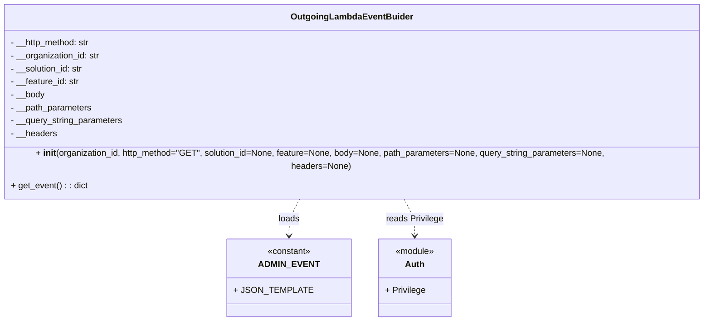

# Diagram: container_tracking_core/container_tracking_service/container_tracking_service/utility/OutgoingLambdaEventBuilder.py


> Auto-generated by Obscura crawlers

## Diagram 1



### SVG

<svg id="container" width="1316.5078125" xmlns="http://www.w3.org/2000/svg" class="classDiagram" height="570" viewBox="0 0 1316.5078125 570" role="graphics-document document" aria-roledescription="class"><style>#container{font-family:"trebuchet ms",verdana,arial,sans-serif;font-size:16px;fill:#333;}@keyframes edge-animation-frame{from{stroke-dashoffset:0;}}@keyframes dash{to{stroke-dashoffset:0;}}#container .edge-animation-slow{stroke-dasharray:9,5!important;stroke-dashoffset:900;animation:dash 50s linear infinite;stroke-linecap:round;}#container .edge-animation-fast{stroke-dasharray:9,5!important;stroke-dashoffset:900;animation:dash 20s linear infinite;stroke-linecap:round;}#container .error-icon{fill:#552222;}#container .error-text{fill:#552222;stroke:#552222;}#container .edge-thickness-normal{stroke-width:1px;}#container .edge-thickness-thick{stroke-width:3.5px;}#container .edge-pattern-solid{stroke-dasharray:0;}#container .edge-thickness-invisible{stroke-width:0;fill:none;}#container .edge-pattern-dashed{stroke-dasharray:3;}#container .edge-pattern-dotted{stroke-dasharray:2;}#container .marker{fill:#333333;stroke:#333333;}#container .marker.cross{stroke:#333333;}#container svg{font-family:"trebuchet ms",verdana,arial,sans-serif;font-size:16px;}#container p{margin:0;}#container g.classGroup text{fill:#9370DB;stroke:none;font-family:"trebuchet ms",verdana,arial,sans-serif;font-size:10px;}#container g.classGroup text .title{font-weight:bolder;}#container .nodeLabel,#container .edgeLabel{color:#131300;}#container .edgeLabel .label rect{fill:#ECECFF;}#container .label text{fill:#131300;}#container .labelBkg{background:#ECECFF;}#container .edgeLabel .label span{background:#ECECFF;}#container .classTitle{font-weight:bolder;}#container .node rect,#container .node circle,#container .node ellipse,#container .node polygon,#container .node path{fill:#ECECFF;stroke:#9370DB;stroke-width:1px;}#container .divider{stroke:#9370DB;stroke-width:1;}#container g.clickable{cursor:pointer;}#container g.classGroup rect{fill:#ECECFF;stroke:#9370DB;}#container g.classGroup line{stroke:#9370DB;stroke-width:1;}#container .classLabel .box{stroke:none;stroke-width:0;fill:#ECECFF;opacity:0.5;}#container .classLabel .label{fill:#9370DB;font-size:10px;}#container .relation{stroke:#333333;stroke-width:1;fill:none;}#container .dashed-line{stroke-dasharray:3;}#container .dotted-line{stroke-dasharray:1 2;}#container #compositionStart,#container .composition{fill:#333333!important;stroke:#333333!important;stroke-width:1;}#container #compositionEnd,#container .composition{fill:#333333!important;stroke:#333333!important;stroke-width:1;}#container #dependencyStart,#container .dependency{fill:#333333!important;stroke:#333333!important;stroke-width:1;}#container #dependencyStart,#container .dependency{fill:#333333!important;stroke:#333333!important;stroke-width:1;}#container #extensionStart,#container .extension{fill:transparent!important;stroke:#333333!important;stroke-width:1;}#container #extensionEnd,#container .extension{fill:transparent!important;stroke:#333333!important;stroke-width:1;}#container #aggregationStart,#container .aggregation{fill:transparent!important;stroke:#333333!important;stroke-width:1;}#container #aggregationEnd,#container .aggregation{fill:transparent!important;stroke:#333333!important;stroke-width:1;}#container #lollipopStart,#container .lollipop{fill:#ECECFF!important;stroke:#333333!important;stroke-width:1;}#container #lollipopEnd,#container .lollipop{fill:#ECECFF!important;stroke:#333333!important;stroke-width:1;}#container .edgeTerminals{font-size:11px;line-height:initial;}#container .classTitleText{text-anchor:middle;font-size:18px;fill:#333;}#container .label-icon{display:inline-block;height:1em;overflow:visible;vertical-align:-0.125em;}#container .node .label-icon path{fill:currentColor;stroke:revert;stroke-width:revert;}#container :root{--mermaid-font-family:"trebuchet ms",verdana,arial,sans-serif;}</style><g><defs><marker id="container_class-aggregationStart" class="marker aggregation class" refX="18" refY="7" markerWidth="190" markerHeight="240" orient="auto"><path d="M 18,7 L9,13 L1,7 L9,1 Z"></path></marker></defs><defs><marker id="container_class-aggregationEnd" class="marker aggregation class" refX="1" refY="7" markerWidth="20" markerHeight="28" orient="auto"><path d="M 18,7 L9,13 L1,7 L9,1 Z"></path></marker></defs><defs><marker id="container_class-extensionStart" class="marker extension class" refX="18" refY="7" markerWidth="190" markerHeight="240" orient="auto"><path d="M 1,7 L18,13 V 1 Z"></path></marker></defs><defs><marker id="container_class-extensionEnd" class="marker extension class" refX="1" refY="7" markerWidth="20" markerHeight="28" orient="auto"><path d="M 1,1 V 13 L18,7 Z"></path></marker></defs><defs><marker id="container_class-compositionStart" class="marker composition class" refX="18" refY="7" markerWidth="190" markerHeight="240" orient="auto"><path d="M 18,7 L9,13 L1,7 L9,1 Z"></path></marker></defs><defs><marker id="container_class-compositionEnd" class="marker composition class" refX="1" refY="7" markerWidth="20" markerHeight="28" orient="auto"><path d="M 18,7 L9,13 L1,7 L9,1 Z"></path></marker></defs><defs><marker id="container_class-dependencyStart" class="marker dependency class" refX="6" refY="7" markerWidth="190" markerHeight="240" orient="auto"><path d="M 5,7 L9,13 L1,7 L9,1 Z"></path></marker></defs><defs><marker id="container_class-dependencyEnd" class="marker dependency class" refX="13" refY="7" markerWidth="20" markerHeight="28" orient="auto"><path d="M 18,7 L9,13 L14,7 L9,1 Z"></path></marker></defs><defs><marker id="container_class-lollipopStart" class="marker lollipop class" refX="13" refY="7" markerWidth="190" markerHeight="240" orient="auto"><circle stroke="black" fill="transparent" cx="7" cy="7" r="6"></circle></marker></defs><defs><marker id="container_class-lollipopEnd" class="marker lollipop class" refX="1" refY="7" markerWidth="190" markerHeight="240" orient="auto"><circle stroke="black" fill="transparent" cx="7" cy="7" r="6"></circle></marker></defs><g class="root"><g class="clusters"></g><g class="edgePaths"><path d="M568.796,344L565.512,350.167C562.228,356.333,555.661,368.667,552.377,380C549.094,391.333,549.094,401.667,549.094,406.833L549.094,412" id="id_OutgoingLambdaEventBuider_ADMIN_EVENT_1" class="edge-thickness-normal edge-pattern-dashed relation" style=";;;" data-edge="true" data-et="edge" data-id="id_OutgoingLambdaEventBuider_ADMIN_EVENT_1" data-points="W3sieCI6NTY4Ljc5NTgyNjk4MTcwNzQsInkiOjM0NH0seyJ4Ijo1NDkuMDkzNzUsInkiOjM4MX0seyJ4Ijo1NDkuMDkzNzUsInkiOjQxOH1d" marker-end="url(#container_class-dependencyEnd)"></path><path d="M747.712,344L750.996,350.167C754.279,356.333,760.847,368.667,764.13,380C767.414,391.333,767.414,401.667,767.414,406.833L767.414,412" id="id_OutgoingLambdaEventBuider_Auth_2" class="edge-thickness-normal edge-pattern-dashed relation" style=";;;" data-edge="true" data-et="edge" data-id="id_OutgoingLambdaEventBuider_Auth_2" data-points="W3sieCI6NzQ3LjcxMTk4NTUxODI5MjYsInkiOjM0NH0seyJ4Ijo3NjcuNDE0MDYyNSwieSI6MzgxfSx7IngiOjc2Ny40MTQwNjI1LCJ5Ijo0MTh9XQ==" marker-end="url(#container_class-dependencyEnd)"></path></g><g class="edgeLabels"><g class="edgeLabel" transform="translate(549.09375, 381)"><g class="label" data-id="id_OutgoingLambdaEventBuider_ADMIN_EVENT_1" transform="translate(-19.7734375, -12)"><foreignObject width="39.546875" height="24"><div xmlns="http://www.w3.org/1999/xhtml" class="labelBkg" style="display: table-cell; white-space: nowrap; line-height: 1.5; max-width: 200px; text-align: center;"><span class="edgeLabel"><p>loads</p></span></div></foreignObject></g></g><g class="edgeLabel" transform="translate(767.4140625, 381)"><g class="label" data-id="id_OutgoingLambdaEventBuider_Auth_2" transform="translate(-53.203125, -12)"><foreignObject width="106.40625" height="24"><div xmlns="http://www.w3.org/1999/xhtml" class="labelBkg" style="display: table-cell; white-space: nowrap; line-height: 1.5; max-width: 200px; text-align: center;"><span class="edgeLabel"><p>reads Privilege</p></span></div></foreignObject></g></g></g><g class="nodes"><g class="node default" id="classId-OutgoingLambdaEventBuider-0" transform="translate(658.25390625, 176)"><g class="basic label-container"><path d="M-650.25390625 -168 L650.25390625 -168 L650.25390625 168 L-650.25390625 168" stroke="none" stroke-width="0" fill="#ECECFF" style=""></path><path d="M-650.25390625 -168 C-344.42812612347524 -168, -38.602345996950476 -168, 650.25390625 -168 M-650.25390625 -168 C-318.33445503935906 -168, 13.584996171281887 -168, 650.25390625 -168 M650.25390625 -168 C650.25390625 -49.7811251024594, 650.25390625 68.4377497950812, 650.25390625 168 M650.25390625 -168 C650.25390625 -74.42528748295598, 650.25390625 19.14942503408804, 650.25390625 168 M650.25390625 168 C319.7906771217668 168, -10.67255200646639 168, -650.25390625 168 M650.25390625 168 C148.97179251168615 168, -352.3103212266277 168, -650.25390625 168 M-650.25390625 168 C-650.25390625 93.23677727274728, -650.25390625 18.47355454549455, -650.25390625 -168 M-650.25390625 168 C-650.25390625 55.04592352024028, -650.25390625 -57.90815295951944, -650.25390625 -168" stroke="#9370DB" stroke-width="1.3" fill="none" stroke-dasharray="0 0" style=""></path></g><g class="annotation-group text" transform="translate(0, -144)"></g><g class="label-group text" transform="translate(-106.7890625, -144)"><g class="label" style="font-weight: bolder" transform="translate(0,-12)"><foreignObject width="213.578125" height="24"><div xmlns="http://www.w3.org/1999/xhtml" style="display: table-cell; white-space: nowrap; line-height: 1.5; max-width: 262px; text-align: center;"><span class="nodeLabel markdown-node-label" style=""><p>OutgoingLambdaEventBuider</p></span></div></foreignObject></g></g><g class="members-group text" transform="translate(-638.25390625, -96)"><g class="label" style="" transform="translate(0,-12)"><foreignObject width="149.609375" height="24"><div xmlns="http://www.w3.org/1999/xhtml" style="display: table-cell; white-space: nowrap; line-height: 1.5; max-width: 208px; text-align: center;"><span class="nodeLabel markdown-node-label" style=""><p>- __http_method: str</p></span></div></foreignObject></g><g class="label" style="" transform="translate(0,12)"><foreignObject width="167.109375" height="24"><div xmlns="http://www.w3.org/1999/xhtml" style="display: table-cell; white-space: nowrap; line-height: 1.5; max-width: 225px; text-align: center;"><span class="nodeLabel markdown-node-label" style=""><p>- __organization_id: str</p></span></div></foreignObject></g><g class="label" style="" transform="translate(0,36)"><foreignObject width="136.90625" height="24"><div xmlns="http://www.w3.org/1999/xhtml" style="display: table-cell; white-space: nowrap; line-height: 1.5; max-width: 195px; text-align: center;"><span class="nodeLabel markdown-node-label" style=""><p>- __solution_id: str</p></span></div></foreignObject></g><g class="label" style="" transform="translate(0,60)"><foreignObject width="128.40625" height="24"><div xmlns="http://www.w3.org/1999/xhtml" style="display: table-cell; white-space: nowrap; line-height: 1.5; max-width: 187px; text-align: center;"><span class="nodeLabel markdown-node-label" style=""><p>- __feature_id: str</p></span></div></foreignObject></g><g class="label" style="" transform="translate(0,84)"><foreignObject width="63.46875" height="24"><div xmlns="http://www.w3.org/1999/xhtml" style="display: table-cell; white-space: nowrap; line-height: 1.5; max-width: 121px; text-align: center;"><span class="nodeLabel markdown-node-label" style=""><p>- __body</p></span></div></foreignObject></g><g class="label" style="" transform="translate(0,108)"><foreignObject width="151.15625" height="24"><div xmlns="http://www.w3.org/1999/xhtml" style="display: table-cell; white-space: nowrap; line-height: 1.5; max-width: 209px; text-align: center;"><span class="nodeLabel markdown-node-label" style=""><p>- __path_parameters</p></span></div></foreignObject></g><g class="label" style="" transform="translate(0,132)"><foreignObject width="208.828125" height="24"><div xmlns="http://www.w3.org/1999/xhtml" style="display: table-cell; white-space: nowrap; line-height: 1.5; max-width: 266px; text-align: center;"><span class="nodeLabel markdown-node-label" style=""><p>- __query_string_parameters</p></span></div></foreignObject></g><g class="label" style="" transform="translate(0,156)"><foreignObject width="85.515625" height="24"><div xmlns="http://www.w3.org/1999/xhtml" style="display: table-cell; white-space: nowrap; line-height: 1.5; max-width: 143px; text-align: center;"><span class="nodeLabel markdown-node-label" style=""><p>- __headers</p></span></div></foreignObject></g></g><g class="methods-group text" transform="translate(-638.25390625, 120)"><g class="label" style="" transform="translate(0,-12)"><foreignObject width="1169.71875" height="24"><div xmlns="http://www.w3.org/1999/xhtml" style="display: table-cell; white-space: nowrap; line-height: 1.5; max-width: 1260px; text-align: center;"><span class="nodeLabel markdown-node-label" style=""><p>+ <strong>init</strong>(organization_id, http_method="GET", solution_id=None, feature=None, body=None, path_parameters=None, query_string_parameters=None, headers=None)</p></span></div></foreignObject></g><g class="label" style="" transform="translate(0,12)"><foreignObject width="141.40625" height="24"><div xmlns="http://www.w3.org/1999/xhtml" style="display: table-cell; white-space: nowrap; line-height: 1.5; max-width: 199px; text-align: center;"><span class="nodeLabel markdown-node-label" style=""><p>+ get_event() : : dict</p></span></div></foreignObject></g></g><g class="divider" style=""><path d="M-650.25390625 -120 C-383.7642028926256 -120, -117.27449953525115 -120, 650.25390625 -120 M-650.25390625 -120 C-307.26200143067024 -120, 35.72990338865952 -120, 650.25390625 -120" stroke="#9370DB" stroke-width="1.3" fill="none" stroke-dasharray="0 0" style=""></path></g><g class="divider" style=""><path d="M-650.25390625 96 C-303.86629742978596 96, 42.52131139042808 96, 650.25390625 96 M-650.25390625 96 C-190.1229270543821 96, 270.0080521412358 96, 650.25390625 96" stroke="#9370DB" stroke-width="1.3" fill="none" stroke-dasharray="0 0" style=""></path></g></g><g class="node default" id="classId-ADMIN_EVENT-1" transform="translate(549.09375, 490)"><g class="basic label-container"><path d="M-100.82421875 -72 L100.82421875 -72 L100.82421875 72 L-100.82421875 72" stroke="none" stroke-width="0" fill="#ECECFF" style=""></path><path d="M-100.82421875 -72 C-49.90663455234564 -72, 1.0109496453087132 -72, 100.82421875 -72 M-100.82421875 -72 C-26.977607855291154 -72, 46.86900303941769 -72, 100.82421875 -72 M100.82421875 -72 C100.82421875 -39.55536607018402, 100.82421875 -7.110732140368043, 100.82421875 72 M100.82421875 -72 C100.82421875 -29.17710800937536, 100.82421875 13.64578398124928, 100.82421875 72 M100.82421875 72 C52.52566430059123 72, 4.227109851182462 72, -100.82421875 72 M100.82421875 72 C35.74488764693463 72, -29.334443456130742 72, -100.82421875 72 M-100.82421875 72 C-100.82421875 31.841126944975407, -100.82421875 -8.317746110049185, -100.82421875 -72 M-100.82421875 72 C-100.82421875 21.387905297666606, -100.82421875 -29.224189404666788, -100.82421875 -72" stroke="#9370DB" stroke-width="1.3" fill="none" stroke-dasharray="0 0" style=""></path></g><g class="annotation-group text" transform="translate(-40.4921875, -48)"><g class="label" style="" transform="translate(0,-12)"><foreignObject width="80.984375" height="24"><div xmlns="http://www.w3.org/1999/xhtml" style="display: table-cell; white-space: nowrap; line-height: 1.5; max-width: 131px; text-align: center;"><span class="nodeLabel markdown-node-label" style=""><p>«constant»</p></span></div></foreignObject></g></g><g class="label-group text" transform="translate(-50.5546875, -24)"><g class="label" style="font-weight: bolder" transform="translate(0,-12)"><foreignObject width="101.109375" height="24"><div xmlns="http://www.w3.org/1999/xhtml" style="display: table-cell; white-space: nowrap; line-height: 1.5; max-width: 152px; text-align: center;"><span class="nodeLabel markdown-node-label" style=""><p>ADMIN_EVENT</p></span></div></foreignObject></g></g><g class="members-group text" transform="translate(-88.82421875, 24)"><g class="label" style="" transform="translate(0,-12)"><foreignObject width="127.09375" height="24"><div xmlns="http://www.w3.org/1999/xhtml" style="display: table-cell; white-space: nowrap; line-height: 1.5; max-width: 184px; text-align: center;"><span class="nodeLabel markdown-node-label" style=""><p>+ JSON_TEMPLATE</p></span></div></foreignObject></g></g><g class="methods-group text" transform="translate(-88.82421875, 72)"></g><g class="divider" style=""><path d="M-100.82421875 0 C-30.00280135362071 0, 40.81861604275858 0, 100.82421875 0 M-100.82421875 0 C-48.1037133006007 0, 4.616792148798595 0, 100.82421875 0" stroke="#9370DB" stroke-width="1.3" fill="none" stroke-dasharray="0 0" style=""></path></g><g class="divider" style=""><path d="M-100.82421875 48 C-58.72135742328053 48, -16.61849609656106 48, 100.82421875 48 M-100.82421875 48 C-29.43832787235003 48, 41.94756300529994 48, 100.82421875 48" stroke="#9370DB" stroke-width="1.3" fill="none" stroke-dasharray="0 0" style=""></path></g></g><g class="node default" id="classId-Auth-2" transform="translate(767.4140625, 490)"><g class="basic label-container"><path d="M-67.49609375 -72 L67.49609375 -72 L67.49609375 72 L-67.49609375 72" stroke="none" stroke-width="0" fill="#ECECFF" style=""></path><path d="M-67.49609375 -72 C-13.54892715172145 -72, 40.3982394465571 -72, 67.49609375 -72 M-67.49609375 -72 C-28.928640578551253 -72, 9.638812592897494 -72, 67.49609375 -72 M67.49609375 -72 C67.49609375 -41.08672166814072, 67.49609375 -10.173443336281437, 67.49609375 72 M67.49609375 -72 C67.49609375 -18.191028419860523, 67.49609375 35.617943160278955, 67.49609375 72 M67.49609375 72 C22.14856397495268 72, -23.19896580009464 72, -67.49609375 72 M67.49609375 72 C24.999057091016397 72, -17.497979567967207 72, -67.49609375 72 M-67.49609375 72 C-67.49609375 36.87632181637479, -67.49609375 1.7526436327495816, -67.49609375 -72 M-67.49609375 72 C-67.49609375 37.21415480414746, -67.49609375 2.4283096082949243, -67.49609375 -72" stroke="#9370DB" stroke-width="1.3" fill="none" stroke-dasharray="0 0" style=""></path></g><g class="annotation-group text" transform="translate(-36.6015625, -48)"><g class="label" style="" transform="translate(0,-12)"><foreignObject width="73.203125" height="24"><div xmlns="http://www.w3.org/1999/xhtml" style="display: table-cell; white-space: nowrap; line-height: 1.5; max-width: 123px; text-align: center;"><span class="nodeLabel markdown-node-label" style=""><p>«module»</p></span></div></foreignObject></g></g><g class="label-group text" transform="translate(-17.0078125, -24)"><g class="label" style="font-weight: bolder" transform="translate(0,-12)"><foreignObject width="34.015625" height="24"><div xmlns="http://www.w3.org/1999/xhtml" style="display: table-cell; white-space: nowrap; line-height: 1.5; max-width: 84px; text-align: center;"><span class="nodeLabel markdown-node-label" style=""><p>Auth</p></span></div></foreignObject></g></g><g class="members-group text" transform="translate(-55.49609375, 24)"><g class="label" style="" transform="translate(0,-12)"><foreignObject width="74.390625" height="24"><div xmlns="http://www.w3.org/1999/xhtml" style="display: table-cell; white-space: nowrap; line-height: 1.5; max-width: 132px; text-align: center;"><span class="nodeLabel markdown-node-label" style=""><p>+ Privilege</p></span></div></foreignObject></g></g><g class="methods-group text" transform="translate(-55.49609375, 72)"></g><g class="divider" style=""><path d="M-67.49609375 0 C-32.55975463962163 0, 2.3765844707567396 0, 67.49609375 0 M-67.49609375 0 C-17.335905921950946 0, 32.82428190609811 0, 67.49609375 0" stroke="#9370DB" stroke-width="1.3" fill="none" stroke-dasharray="0 0" style=""></path></g><g class="divider" style=""><path d="M-67.49609375 48 C-25.905985201009656 48, 15.684123347980687 48, 67.49609375 48 M-67.49609375 48 C-35.19480854026647 48, -2.8935233305329433 48, 67.49609375 48" stroke="#9370DB" stroke-width="1.3" fill="none" stroke-dasharray="0 0" style=""></path></g></g></g></g></g></svg>

## Diagram 2

```mermaid
sequenceDiagram
participant Caller
participant Builder as OutgoingLambdaEventBuider
participant AdminEvent as ADMIN_EVENT
participant Auth
Caller->>Builder: instantiate(organization_id, http_method, ...)
Caller->>Builder: get_event()
Builder->>AdminEvent: json.loads(ADMIN_EVENT)
Builder->>Auth: list(Auth.Privilege)
Builder->>Builder: event["httpMethod"], event["body"], event["pathParameters"], event["queryStringParameters"], event["headers"].update(...)
Builder->>Builder: requestContext["requestTimeEpoch"]=now; requestContext["requestId"]=...
Builder->>Builder: authorizer["privileges"]=json.dumps(...); authorizer["solutions"]=...; authorizer["features"]=...; authorizer["org_profiles"]=...; authorizer["organization_id"]=...
Builder-->>Caller: return event
```

> SVG rendering failed for this diagram.
