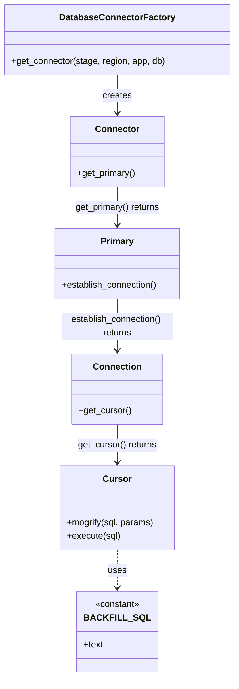

# Diagram: container_tracking_core/container_tracking_service/scripts/backfill_CT-1620.py


> Auto-generated by Obscura crawlers

## Diagram 1

```mermaid
flowchart TD
Start([Start])
GetConnector[[DatabaseConnectorFactory.get_connector(os.environ.get("AWS_STAGE"), "us-east-1", "partview", "container_tracking")]]
Connector([connector])
DefineSQL["BACKFILL_SQL (multiline SQL constant)"]
MainFunc[[main()]]
GetCursor[/cursor = connector.get_primary().establish_connection().get_cursor()/]
PrintStart1["print Start creating exception for CONTAINER_TRACKING_FV"]
CallCreate1[/create_exception(cursor, CONTAINER_TRACKING_FV)/]
PrintEnd1["print End creating exception for CONTAINER_TRACKING_FV"]
PrintStart2["print Start creating exception for FORD_CONTAINER_TRACKING"]
CallCreate2[/create_exception(cursor, FORD_CONTAINER_TRACKING)/]
PrintEnd2["print End creating exception for FORD_CONTAINER_TRACKING"]
subgraph create_exception
  Mogrify["sql = cursor.mogrify(BACKFILL_SQL, {solution_id: solution_id})"]
  Execute["cursor.execute(sql)"]
end
Start --> GetConnector --> Connector --> DefineSQL --> MainFunc --> GetCursor --> PrintStart1 --> CallCreate1 --> Mogrify --> Execute --> PrintEnd1 --> PrintStart2 --> CallCreate2 --> Mogrify --> Execute --> PrintEnd2 --> End([End])
```

> SVG rendering failed for this diagram.

## Diagram 2



### SVG

<svg id="container" width="415.09375" xmlns="http://www.w3.org/2000/svg" class="classDiagram" height="1208" viewBox="0 0 415.09375 1208" role="graphics-document document" aria-roledescription="class"><style>#container{font-family:"trebuchet ms",verdana,arial,sans-serif;font-size:16px;fill:#333;}@keyframes edge-animation-frame{from{stroke-dashoffset:0;}}@keyframes dash{to{stroke-dashoffset:0;}}#container .edge-animation-slow{stroke-dasharray:9,5!important;stroke-dashoffset:900;animation:dash 50s linear infinite;stroke-linecap:round;}#container .edge-animation-fast{stroke-dasharray:9,5!important;stroke-dashoffset:900;animation:dash 20s linear infinite;stroke-linecap:round;}#container .error-icon{fill:#552222;}#container .error-text{fill:#552222;stroke:#552222;}#container .edge-thickness-normal{stroke-width:1px;}#container .edge-thickness-thick{stroke-width:3.5px;}#container .edge-pattern-solid{stroke-dasharray:0;}#container .edge-thickness-invisible{stroke-width:0;fill:none;}#container .edge-pattern-dashed{stroke-dasharray:3;}#container .edge-pattern-dotted{stroke-dasharray:2;}#container .marker{fill:#333333;stroke:#333333;}#container .marker.cross{stroke:#333333;}#container svg{font-family:"trebuchet ms",verdana,arial,sans-serif;font-size:16px;}#container p{margin:0;}#container g.classGroup text{fill:#9370DB;stroke:none;font-family:"trebuchet ms",verdana,arial,sans-serif;font-size:10px;}#container g.classGroup text .title{font-weight:bolder;}#container .nodeLabel,#container .edgeLabel{color:#131300;}#container .edgeLabel .label rect{fill:#ECECFF;}#container .label text{fill:#131300;}#container .labelBkg{background:#ECECFF;}#container .edgeLabel .label span{background:#ECECFF;}#container .classTitle{font-weight:bolder;}#container .node rect,#container .node circle,#container .node ellipse,#container .node polygon,#container .node path{fill:#ECECFF;stroke:#9370DB;stroke-width:1px;}#container .divider{stroke:#9370DB;stroke-width:1;}#container g.clickable{cursor:pointer;}#container g.classGroup rect{fill:#ECECFF;stroke:#9370DB;}#container g.classGroup line{stroke:#9370DB;stroke-width:1;}#container .classLabel .box{stroke:none;stroke-width:0;fill:#ECECFF;opacity:0.5;}#container .classLabel .label{fill:#9370DB;font-size:10px;}#container .relation{stroke:#333333;stroke-width:1;fill:none;}#container .dashed-line{stroke-dasharray:3;}#container .dotted-line{stroke-dasharray:1 2;}#container #compositionStart,#container .composition{fill:#333333!important;stroke:#333333!important;stroke-width:1;}#container #compositionEnd,#container .composition{fill:#333333!important;stroke:#333333!important;stroke-width:1;}#container #dependencyStart,#container .dependency{fill:#333333!important;stroke:#333333!important;stroke-width:1;}#container #dependencyStart,#container .dependency{fill:#333333!important;stroke:#333333!important;stroke-width:1;}#container #extensionStart,#container .extension{fill:transparent!important;stroke:#333333!important;stroke-width:1;}#container #extensionEnd,#container .extension{fill:transparent!important;stroke:#333333!important;stroke-width:1;}#container #aggregationStart,#container .aggregation{fill:transparent!important;stroke:#333333!important;stroke-width:1;}#container #aggregationEnd,#container .aggregation{fill:transparent!important;stroke:#333333!important;stroke-width:1;}#container #lollipopStart,#container .lollipop{fill:#ECECFF!important;stroke:#333333!important;stroke-width:1;}#container #lollipopEnd,#container .lollipop{fill:#ECECFF!important;stroke:#333333!important;stroke-width:1;}#container .edgeTerminals{font-size:11px;line-height:initial;}#container .classTitleText{text-anchor:middle;font-size:18px;fill:#333;}#container .label-icon{display:inline-block;height:1em;overflow:visible;vertical-align:-0.125em;}#container .node .label-icon path{fill:currentColor;stroke:revert;stroke-width:revert;}#container :root{--mermaid-font-family:"trebuchet ms",verdana,arial,sans-serif;}</style><g><defs><marker id="container_class-aggregationStart" class="marker aggregation class" refX="18" refY="7" markerWidth="190" markerHeight="240" orient="auto"><path d="M 18,7 L9,13 L1,7 L9,1 Z"></path></marker></defs><defs><marker id="container_class-aggregationEnd" class="marker aggregation class" refX="1" refY="7" markerWidth="20" markerHeight="28" orient="auto"><path d="M 18,7 L9,13 L1,7 L9,1 Z"></path></marker></defs><defs><marker id="container_class-extensionStart" class="marker extension class" refX="18" refY="7" markerWidth="190" markerHeight="240" orient="auto"><path d="M 1,7 L18,13 V 1 Z"></path></marker></defs><defs><marker id="container_class-extensionEnd" class="marker extension class" refX="1" refY="7" markerWidth="20" markerHeight="28" orient="auto"><path d="M 1,1 V 13 L18,7 Z"></path></marker></defs><defs><marker id="container_class-compositionStart" class="marker composition class" refX="18" refY="7" markerWidth="190" markerHeight="240" orient="auto"><path d="M 18,7 L9,13 L1,7 L9,1 Z"></path></marker></defs><defs><marker id="container_class-compositionEnd" class="marker composition class" refX="1" refY="7" markerWidth="20" markerHeight="28" orient="auto"><path d="M 18,7 L9,13 L1,7 L9,1 Z"></path></marker></defs><defs><marker id="container_class-dependencyStart" class="marker dependency class" refX="6" refY="7" markerWidth="190" markerHeight="240" orient="auto"><path d="M 5,7 L9,13 L1,7 L9,1 Z"></path></marker></defs><defs><marker id="container_class-dependencyEnd" class="marker dependency class" refX="13" refY="7" markerWidth="20" markerHeight="28" orient="auto"><path d="M 18,7 L9,13 L14,7 L9,1 Z"></path></marker></defs><defs><marker id="container_class-lollipopStart" class="marker lollipop class" refX="13" refY="7" markerWidth="190" markerHeight="240" orient="auto"><circle stroke="black" fill="transparent" cx="7" cy="7" r="6"></circle></marker></defs><defs><marker id="container_class-lollipopEnd" class="marker lollipop class" refX="1" refY="7" markerWidth="190" markerHeight="240" orient="auto"><circle stroke="black" fill="transparent" cx="7" cy="7" r="6"></circle></marker></defs><g class="root"><g class="clusters"></g><g class="edgePaths"><path d="M207.547,134L207.547,140.167C207.547,146.333,207.547,158.667,207.547,170C207.547,181.333,207.547,191.667,207.547,196.833L207.547,202" id="id_DatabaseConnectorFactory_Connector_1" class="edge-thickness-normal edge-pattern-solid relation" style=";;;" data-edge="true" data-et="edge" data-id="id_DatabaseConnectorFactory_Connector_1" data-points="W3sieCI6MjA3LjU0Njg3NSwieSI6MTM0fSx7IngiOjIwNy41NDY4NzUsInkiOjE3MX0seyJ4IjoyMDcuNTQ2ODc1LCJ5IjoyMDh9XQ==" marker-end="url(#container_class-dependencyEnd)"></path><path d="M207.547,334L207.547,340.167C207.547,346.333,207.547,358.667,207.547,370C207.547,381.333,207.547,391.667,207.547,396.833L207.547,402" id="id_Connector_Primary_2" class="edge-thickness-normal edge-pattern-solid relation" style=";;;" data-edge="true" data-et="edge" data-id="id_Connector_Primary_2" data-points="W3sieCI6MjA3LjU0Njg3NSwieSI6MzM0fSx7IngiOjIwNy41NDY4NzUsInkiOjM3MX0seyJ4IjoyMDcuNTQ2ODc1LCJ5Ijo0MDh9XQ==" marker-end="url(#container_class-dependencyEnd)"></path><path d="M207.547,534L207.547,542.167C207.547,550.333,207.547,566.667,207.547,582C207.547,597.333,207.547,611.667,207.547,618.833L207.547,626" id="id_Primary_Connection_3" class="edge-thickness-normal edge-pattern-solid relation" style=";;;" data-edge="true" data-et="edge" data-id="id_Primary_Connection_3" data-points="W3sieCI6MjA3LjU0Njg3NSwieSI6NTM0fSx7IngiOjIwNy41NDY4NzUsInkiOjU4M30seyJ4IjoyMDcuNTQ2ODc1LCJ5Ijo2MzJ9XQ==" marker-end="url(#container_class-dependencyEnd)"></path><path d="M207.547,758L207.547,764.167C207.547,770.333,207.547,782.667,207.547,794C207.547,805.333,207.547,815.667,207.547,820.833L207.547,826" id="id_Connection_Cursor_4" class="edge-thickness-normal edge-pattern-solid relation" style=";;;" data-edge="true" data-et="edge" data-id="id_Connection_Cursor_4" data-points="W3sieCI6MjA3LjU0Njg3NSwieSI6NzU4fSx7IngiOjIwNy41NDY4NzUsInkiOjc5NX0seyJ4IjoyMDcuNTQ2ODc1LCJ5Ijo4MzJ9XQ==" marker-end="url(#container_class-dependencyEnd)"></path><path d="M207.547,982L207.547,988.167C207.547,994.333,207.547,1006.667,207.547,1018C207.547,1029.333,207.547,1039.667,207.547,1044.833L207.547,1050" id="id_Cursor_BACKFILL_SQL_5" class="edge-thickness-normal edge-pattern-dashed relation" style=";;;" data-edge="true" data-et="edge" data-id="id_Cursor_BACKFILL_SQL_5" data-points="W3sieCI6MjA3LjU0Njg3NSwieSI6OTgyfSx7IngiOjIwNy41NDY4NzUsInkiOjEwMTl9LHsieCI6MjA3LjU0Njg3NSwieSI6MTA1Nn1d" marker-end="url(#container_class-dependencyEnd)"></path></g><g class="edgeLabels"><g class="edgeLabel" transform="translate(207.546875, 171)"><g class="label" data-id="id_DatabaseConnectorFactory_Connector_1" transform="translate(-26.171875, -12)"><foreignObject width="52.34375" height="24"><div xmlns="http://www.w3.org/1999/xhtml" class="labelBkg" style="display: table-cell; white-space: nowrap; line-height: 1.5; max-width: 200px; text-align: center;"><span class="edgeLabel"><p>creates</p></span></div></foreignObject></g></g><g class="edgeLabel" transform="translate(207.546875, 371)"><g class="label" data-id="id_Connector_Primary_2" transform="translate(-77.34375, -12)"><foreignObject width="154.6875" height="24"><div xmlns="http://www.w3.org/1999/xhtml" class="labelBkg" style="display: table-cell; white-space: nowrap; line-height: 1.5; max-width: 200px; text-align: center;"><span class="edgeLabel"><p>get_primary() returns</p></span></div></foreignObject></g></g><g class="edgeLabel" transform="translate(207.546875, 583)"><g class="label" data-id="id_Primary_Connection_3" transform="translate(-100, -24)"><foreignObject width="200" height="48"><div xmlns="http://www.w3.org/1999/xhtml" class="labelBkg" style="display: table; white-space: break-spaces; line-height: 1.5; max-width: 200px; text-align: center; width: 200px;"><span class="edgeLabel"><p>establish_connection() returns</p></span></div></foreignObject></g></g><g class="edgeLabel" transform="translate(207.546875, 795)"><g class="label" data-id="id_Connection_Cursor_4" transform="translate(-71.71875, -12)"><foreignObject width="143.4375" height="24"><div xmlns="http://www.w3.org/1999/xhtml" class="labelBkg" style="display: table-cell; white-space: nowrap; line-height: 1.5; max-width: 200px; text-align: center;"><span class="edgeLabel"><p>get_cursor() returns</p></span></div></foreignObject></g></g><g class="edgeLabel" transform="translate(207.546875, 1019)"><g class="label" data-id="id_Cursor_BACKFILL_SQL_5" transform="translate(-16.4921875, -12)"><foreignObject width="32.984375" height="24"><div xmlns="http://www.w3.org/1999/xhtml" class="labelBkg" style="display: table-cell; white-space: nowrap; line-height: 1.5; max-width: 200px; text-align: center;"><span class="edgeLabel"><p>uses</p></span></div></foreignObject></g></g></g><g class="nodes"><g class="node default" id="classId-DatabaseConnectorFactory-0" transform="translate(207.546875, 71)"><g class="basic label-container"><path d="M-199.546875 -63 L199.546875 -63 L199.546875 63 L-199.546875 63" stroke="none" stroke-width="0" fill="#ECECFF" style=""></path><path d="M-199.546875 -63 C-74.45043905996418 -63, 50.645996880071635 -63, 199.546875 -63 M-199.546875 -63 C-57.05089220275417 -63, 85.44509059449166 -63, 199.546875 -63 M199.546875 -63 C199.546875 -24.47801852216729, 199.546875 14.043962955665421, 199.546875 63 M199.546875 -63 C199.546875 -23.10135967440481, 199.546875 16.797280651190377, 199.546875 63 M199.546875 63 C102.61514961384736 63, 5.683424227694729 63, -199.546875 63 M199.546875 63 C111.41302810297297 63, 23.279181205945946 63, -199.546875 63 M-199.546875 63 C-199.546875 22.383663338157447, -199.546875 -18.232673323685106, -199.546875 -63 M-199.546875 63 C-199.546875 15.909224045064448, -199.546875 -31.181551909871104, -199.546875 -63" stroke="#9370DB" stroke-width="1.3" fill="none" stroke-dasharray="0 0" style=""></path></g><g class="annotation-group text" transform="translate(0, -39)"></g><g class="label-group text" transform="translate(-98.1875, -39)"><g class="label" style="font-weight: bolder" transform="translate(0,-12)"><foreignObject width="196.375" height="24"><div xmlns="http://www.w3.org/1999/xhtml" style="display: table-cell; white-space: nowrap; line-height: 1.5; max-width: 244px; text-align: center;"><span class="nodeLabel markdown-node-label" style=""><p>DatabaseConnectorFactory</p></span></div></foreignObject></g></g><g class="members-group text" transform="translate(-187.546875, 9)"></g><g class="methods-group text" transform="translate(-187.546875, 39)"><g class="label" style="" transform="translate(0,-12)"><foreignObject width="276.90625" height="24"><div xmlns="http://www.w3.org/1999/xhtml" style="display: table-cell; white-space: nowrap; line-height: 1.5; max-width: 334px; text-align: center;"><span class="nodeLabel markdown-node-label" style=""><p>+get_connector(stage, region, app, db)</p></span></div></foreignObject></g></g><g class="divider" style=""><path d="M-199.546875 -15 C-90.84440762512756 -15, 17.858059749744882 -15, 199.546875 -15 M-199.546875 -15 C-116.83227961191857 -15, -34.11768422383713 -15, 199.546875 -15" stroke="#9370DB" stroke-width="1.3" fill="none" stroke-dasharray="0 0" style=""></path></g><g class="divider" style=""><path d="M-199.546875 9 C-62.96871962860939 9, 73.60943574278122 9, 199.546875 9 M-199.546875 9 C-114.62819119957983 9, -29.709507399159662 9, 199.546875 9" stroke="#9370DB" stroke-width="1.3" fill="none" stroke-dasharray="0 0" style=""></path></g></g><g class="node default" id="classId-Connector-1" transform="translate(207.546875, 271)"><g class="basic label-container"><path d="M-83.65625 -63 L83.65625 -63 L83.65625 63 L-83.65625 63" stroke="none" stroke-width="0" fill="#ECECFF" style=""></path><path d="M-83.65625 -63 C-33.78046495058241 -63, 16.095320098835174 -63, 83.65625 -63 M-83.65625 -63 C-18.73935651720805 -63, 46.1775369655839 -63, 83.65625 -63 M83.65625 -63 C83.65625 -13.367815004651113, 83.65625 36.26436999069777, 83.65625 63 M83.65625 -63 C83.65625 -26.181567888690843, 83.65625 10.636864222618314, 83.65625 63 M83.65625 63 C48.13562421954681 63, 12.614998439093625 63, -83.65625 63 M83.65625 63 C25.38455245330902 63, -32.88714509338196 63, -83.65625 63 M-83.65625 63 C-83.65625 25.046422558243414, -83.65625 -12.907154883513172, -83.65625 -63 M-83.65625 63 C-83.65625 32.268879810265744, -83.65625 1.5377596205314816, -83.65625 -63" stroke="#9370DB" stroke-width="1.3" fill="none" stroke-dasharray="0 0" style=""></path></g><g class="annotation-group text" transform="translate(0, -39)"></g><g class="label-group text" transform="translate(-37.421875, -39)"><g class="label" style="font-weight: bolder" transform="translate(0,-12)"><foreignObject width="74.84375" height="24"><div xmlns="http://www.w3.org/1999/xhtml" style="display: table-cell; white-space: nowrap; line-height: 1.5; max-width: 125px; text-align: center;"><span class="nodeLabel markdown-node-label" style=""><p>Connector</p></span></div></foreignObject></g></g><g class="members-group text" transform="translate(-71.65625, 9)"></g><g class="methods-group text" transform="translate(-71.65625, 39)"><g class="label" style="" transform="translate(0,-12)"><foreignObject width="105.890625" height="24"><div xmlns="http://www.w3.org/1999/xhtml" style="display: table-cell; white-space: nowrap; line-height: 1.5; max-width: 163px; text-align: center;"><span class="nodeLabel markdown-node-label" style=""><p>+get_primary()</p></span></div></foreignObject></g></g><g class="divider" style=""><path d="M-83.65625 -15 C-42.945138379294974 -15, -2.2340267585899483 -15, 83.65625 -15 M-83.65625 -15 C-40.633535949806074 -15, 2.389178100387852 -15, 83.65625 -15" stroke="#9370DB" stroke-width="1.3" fill="none" stroke-dasharray="0 0" style=""></path></g><g class="divider" style=""><path d="M-83.65625 9 C-17.941673696655528 9, 47.772902606688945 9, 83.65625 9 M-83.65625 9 C-46.47852281953354 9, -9.300795639067076 9, 83.65625 9" stroke="#9370DB" stroke-width="1.3" fill="none" stroke-dasharray="0 0" style=""></path></g></g><g class="node default" id="classId-Primary-2" transform="translate(207.546875, 471)"><g class="basic label-container"><path d="M-112.93359375 -63 L112.93359375 -63 L112.93359375 63 L-112.93359375 63" stroke="none" stroke-width="0" fill="#ECECFF" style=""></path><path d="M-112.93359375 -63 C-23.434780195256494 -63, 66.06403335948701 -63, 112.93359375 -63 M-112.93359375 -63 C-58.431157399853134 -63, -3.928721049706269 -63, 112.93359375 -63 M112.93359375 -63 C112.93359375 -30.50022697275253, 112.93359375 1.9995460544949424, 112.93359375 63 M112.93359375 -63 C112.93359375 -17.10534554840398, 112.93359375 28.789308903192037, 112.93359375 63 M112.93359375 63 C46.28140859640759 63, -20.370776557184826 63, -112.93359375 63 M112.93359375 63 C43.77498853308202 63, -25.383616683835953 63, -112.93359375 63 M-112.93359375 63 C-112.93359375 20.811122010158968, -112.93359375 -21.377755979682064, -112.93359375 -63 M-112.93359375 63 C-112.93359375 30.061573446142276, -112.93359375 -2.8768531077154478, -112.93359375 -63" stroke="#9370DB" stroke-width="1.3" fill="none" stroke-dasharray="0 0" style=""></path></g><g class="annotation-group text" transform="translate(0, -39)"></g><g class="label-group text" transform="translate(-28.6015625, -39)"><g class="label" style="font-weight: bolder" transform="translate(0,-12)"><foreignObject width="57.203125" height="24"><div xmlns="http://www.w3.org/1999/xhtml" style="display: table-cell; white-space: nowrap; line-height: 1.5; max-width: 106px; text-align: center;"><span class="nodeLabel markdown-node-label" style=""><p>Primary</p></span></div></foreignObject></g></g><g class="members-group text" transform="translate(-100.93359375, 9)"></g><g class="methods-group text" transform="translate(-100.93359375, 39)"><g class="label" style="" transform="translate(0,-12)"><foreignObject width="173.265625" height="24"><div xmlns="http://www.w3.org/1999/xhtml" style="display: table-cell; white-space: nowrap; line-height: 1.5; max-width: 231px; text-align: center;"><span class="nodeLabel markdown-node-label" style=""><p>+establish_connection()</p></span></div></foreignObject></g></g><g class="divider" style=""><path d="M-112.93359375 -15 C-65.99866726848859 -15, -19.063740786977178 -15, 112.93359375 -15 M-112.93359375 -15 C-66.32378199737244 -15, -19.713970244744885 -15, 112.93359375 -15" stroke="#9370DB" stroke-width="1.3" fill="none" stroke-dasharray="0 0" style=""></path></g><g class="divider" style=""><path d="M-112.93359375 9 C-24.948114116221078 9, 63.037365517557845 9, 112.93359375 9 M-112.93359375 9 C-28.533025560690845 9, 55.86754262861831 9, 112.93359375 9" stroke="#9370DB" stroke-width="1.3" fill="none" stroke-dasharray="0 0" style=""></path></g></g><g class="node default" id="classId-Connection-3" transform="translate(207.546875, 695)"><g class="basic label-container"><path d="M-79.93359375 -63 L79.93359375 -63 L79.93359375 63 L-79.93359375 63" stroke="none" stroke-width="0" fill="#ECECFF" style=""></path><path d="M-79.93359375 -63 C-17.133382961821034 -63, 45.66682782635793 -63, 79.93359375 -63 M-79.93359375 -63 C-33.3009258371623 -63, 13.331742075675393 -63, 79.93359375 -63 M79.93359375 -63 C79.93359375 -19.979473983316275, 79.93359375 23.04105203336745, 79.93359375 63 M79.93359375 -63 C79.93359375 -23.470386659932807, 79.93359375 16.059226680134387, 79.93359375 63 M79.93359375 63 C33.36669873425976 63, -13.200196281480487 63, -79.93359375 63 M79.93359375 63 C31.705130226139865 63, -16.52333329772027 63, -79.93359375 63 M-79.93359375 63 C-79.93359375 14.519803762532675, -79.93359375 -33.96039247493465, -79.93359375 -63 M-79.93359375 63 C-79.93359375 25.689277755803523, -79.93359375 -11.621444488392953, -79.93359375 -63" stroke="#9370DB" stroke-width="1.3" fill="none" stroke-dasharray="0 0" style=""></path></g><g class="annotation-group text" transform="translate(0, -39)"></g><g class="label-group text" transform="translate(-41.2265625, -39)"><g class="label" style="font-weight: bolder" transform="translate(0,-12)"><foreignObject width="82.453125" height="24"><div xmlns="http://www.w3.org/1999/xhtml" style="display: table-cell; white-space: nowrap; line-height: 1.5; max-width: 132px; text-align: center;"><span class="nodeLabel markdown-node-label" style=""><p>Connection</p></span></div></foreignObject></g></g><g class="members-group text" transform="translate(-67.93359375, 9)"></g><g class="methods-group text" transform="translate(-67.93359375, 39)"><g class="label" style="" transform="translate(0,-12)"><foreignObject width="94.640625" height="24"><div xmlns="http://www.w3.org/1999/xhtml" style="display: table-cell; white-space: nowrap; line-height: 1.5; max-width: 152px; text-align: center;"><span class="nodeLabel markdown-node-label" style=""><p>+get_cursor()</p></span></div></foreignObject></g></g><g class="divider" style=""><path d="M-79.93359375 -15 C-35.302283747617494 -15, 9.329026254765012 -15, 79.93359375 -15 M-79.93359375 -15 C-46.08236103425408 -15, -12.231128318508155 -15, 79.93359375 -15" stroke="#9370DB" stroke-width="1.3" fill="none" stroke-dasharray="0 0" style=""></path></g><g class="divider" style=""><path d="M-79.93359375 9 C-31.617684934956827 9, 16.698223880086346 9, 79.93359375 9 M-79.93359375 9 C-26.73617097929563 9, 26.461251791408742 9, 79.93359375 9" stroke="#9370DB" stroke-width="1.3" fill="none" stroke-dasharray="0 0" style=""></path></g></g><g class="node default" id="classId-Cursor-4" transform="translate(207.546875, 907)"><g class="basic label-container"><path d="M-102.4921875 -75 L102.4921875 -75 L102.4921875 75 L-102.4921875 75" stroke="none" stroke-width="0" fill="#ECECFF" style=""></path><path d="M-102.4921875 -75 C-55.38214538956043 -75, -8.272103279120856 -75, 102.4921875 -75 M-102.4921875 -75 C-29.481832629298594 -75, 43.52852224140281 -75, 102.4921875 -75 M102.4921875 -75 C102.4921875 -28.93847757370453, 102.4921875 17.123044852590937, 102.4921875 75 M102.4921875 -75 C102.4921875 -20.789339069863587, 102.4921875 33.421321860272826, 102.4921875 75 M102.4921875 75 C37.72969195414424 75, -27.032803591711513 75, -102.4921875 75 M102.4921875 75 C31.197948494980437 75, -40.096290510039125 75, -102.4921875 75 M-102.4921875 75 C-102.4921875 32.9543149881759, -102.4921875 -9.091370023648196, -102.4921875 -75 M-102.4921875 75 C-102.4921875 36.80924850035569, -102.4921875 -1.3815029992886139, -102.4921875 -75" stroke="#9370DB" stroke-width="1.3" fill="none" stroke-dasharray="0 0" style=""></path></g><g class="annotation-group text" transform="translate(0, -51)"></g><g class="label-group text" transform="translate(-23.90625, -51)"><g class="label" style="font-weight: bolder" transform="translate(0,-12)"><foreignObject width="47.8125" height="24"><div xmlns="http://www.w3.org/1999/xhtml" style="display: table-cell; white-space: nowrap; line-height: 1.5; max-width: 98px; text-align: center;"><span class="nodeLabel markdown-node-label" style=""><p>Cursor</p></span></div></foreignObject></g></g><g class="members-group text" transform="translate(-90.4921875, -3)"></g><g class="methods-group text" transform="translate(-90.4921875, 27)"><g class="label" style="" transform="translate(0,-12)"><foreignObject width="157.078125" height="24"><div xmlns="http://www.w3.org/1999/xhtml" style="display: table-cell; white-space: nowrap; line-height: 1.5; max-width: 214px; text-align: center;"><span class="nodeLabel markdown-node-label" style=""><p>+mogrify(sql, params)</p></span></div></foreignObject></g><g class="label" style="" transform="translate(0,12)"><foreignObject width="96.0625" height="24"><div xmlns="http://www.w3.org/1999/xhtml" style="display: table-cell; white-space: nowrap; line-height: 1.5; max-width: 153px; text-align: center;"><span class="nodeLabel markdown-node-label" style=""><p>+execute(sql)</p></span></div></foreignObject></g></g><g class="divider" style=""><path d="M-102.4921875 -27 C-24.55711233984856 -27, 53.37796282030288 -27, 102.4921875 -27 M-102.4921875 -27 C-28.9445053432583 -27, 44.6031768134834 -27, 102.4921875 -27" stroke="#9370DB" stroke-width="1.3" fill="none" stroke-dasharray="0 0" style=""></path></g><g class="divider" style=""><path d="M-102.4921875 -3 C-28.04279662199069 -3, 46.40659425601862 -3, 102.4921875 -3 M-102.4921875 -3 C-51.54588822215604 -3, -0.5995889443120745 -3, 102.4921875 -3" stroke="#9370DB" stroke-width="1.3" fill="none" stroke-dasharray="0 0" style=""></path></g></g><g class="node default" id="classId-BACKFILL_SQL-5" transform="translate(207.546875, 1128)"><g class="basic label-container"><path d="M-63.8515625 -72 L63.8515625 -72 L63.8515625 72 L-63.8515625 72" stroke="none" stroke-width="0" fill="#ECECFF" style=""></path><path d="M-63.8515625 -72 C-19.101633557217674 -72, 25.64829538556465 -72, 63.8515625 -72 M-63.8515625 -72 C-27.86964540270597 -72, 8.11227169458806 -72, 63.8515625 -72 M63.8515625 -72 C63.8515625 -26.365109775354675, 63.8515625 19.26978044929065, 63.8515625 72 M63.8515625 -72 C63.8515625 -26.301299403452987, 63.8515625 19.397401193094026, 63.8515625 72 M63.8515625 72 C13.450157649993578 72, -36.951247200012844 72, -63.8515625 72 M63.8515625 72 C37.739306954141796 72, 11.627051408283599 72, -63.8515625 72 M-63.8515625 72 C-63.8515625 35.729642091654576, -63.8515625 -0.5407158166908488, -63.8515625 -72 M-63.8515625 72 C-63.8515625 26.829658002559064, -63.8515625 -18.34068399488187, -63.8515625 -72" stroke="#9370DB" stroke-width="1.3" fill="none" stroke-dasharray="0 0" style=""></path></g><g class="annotation-group text" transform="translate(-40.4921875, -48)"><g class="label" style="" transform="translate(0,-12)"><foreignObject width="80.984375" height="24"><div xmlns="http://www.w3.org/1999/xhtml" style="display: table-cell; white-space: nowrap; line-height: 1.5; max-width: 131px; text-align: center;"><span class="nodeLabel markdown-node-label" style=""><p>«constant»</p></span></div></foreignObject></g></g><g class="label-group text" transform="translate(-51.8515625, -24)"><g class="label" style="font-weight: bolder" transform="translate(0,-12)"><foreignObject width="103.703125" height="24"><div xmlns="http://www.w3.org/1999/xhtml" style="display: table-cell; white-space: nowrap; line-height: 1.5; max-width: 151px; text-align: center;"><span class="nodeLabel markdown-node-label" style=""><p>BACKFILL_SQL</p></span></div></foreignObject></g></g><g class="members-group text" transform="translate(-51.8515625, 24)"><g class="label" style="" transform="translate(0,-12)"><foreignObject width="35.5625" height="24"><div xmlns="http://www.w3.org/1999/xhtml" style="display: table-cell; white-space: nowrap; line-height: 1.5; max-width: 93px; text-align: center;"><span class="nodeLabel markdown-node-label" style=""><p>+text</p></span></div></foreignObject></g></g><g class="methods-group text" transform="translate(-51.8515625, 72)"></g><g class="divider" style=""><path d="M-63.8515625 0 C-14.244846746618343 0, 35.361869006763314 0, 63.8515625 0 M-63.8515625 0 C-26.549897580003105 0, 10.75176733999379 0, 63.8515625 0" stroke="#9370DB" stroke-width="1.3" fill="none" stroke-dasharray="0 0" style=""></path></g><g class="divider" style=""><path d="M-63.8515625 48 C-24.563447355924545 48, 14.72466778815091 48, 63.8515625 48 M-63.8515625 48 C-38.27643544740806 48, -12.701308394816131 48, 63.8515625 48" stroke="#9370DB" stroke-width="1.3" fill="none" stroke-dasharray="0 0" style=""></path></g></g></g></g></g></svg>
