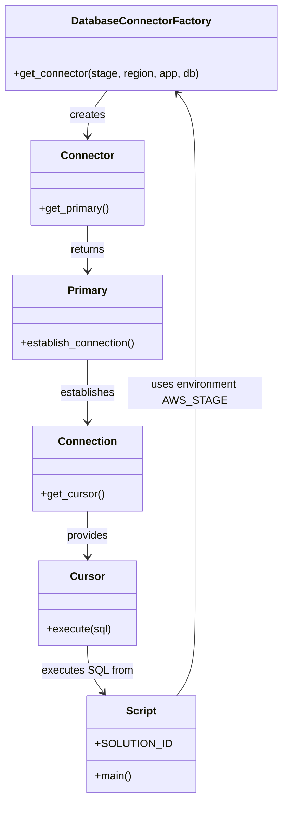

# Diagram: container_tracking_core/container_tracking_service/scripts/backfill_CT-2186.py


> Auto-generated by Obscura crawlers

## Diagram 1

```mermaid
flowchart LR
  Env[AWS_STAGE (env var)] --> Factory[DatabaseConnectorFactory.get_connector(stage, region, app, db)]
  Factory --> Connector[connector (global)]
  Connector --> Primary[connector.get_primary()]
  Primary --> Conn[establish_connection() → connection]
  Conn --> Cursor[get_cursor() → cursor]
  Main[main()] --> Cursor
  Const[SOLUTION_ID = ["TOTE_TRACKING_FV"]] --> SQLbuild[sql template\nreplace("%(solution_id)s", "(" + join(SOLUTION_ID) + ")")]
  SQLbuild --> Exec[cursor.execute(sql)]
  Cursor --> Exec
```

> SVG rendering failed for this diagram.

## Diagram 2



### SVG

<svg id="container" width="415.09375" xmlns="http://www.w3.org/2000/svg" class="classDiagram" height="1184" viewBox="0 0 415.09375 1184" role="graphics-document document" aria-roledescription="class"><style>#container{font-family:"trebuchet ms",verdana,arial,sans-serif;font-size:16px;fill:#333;}@keyframes edge-animation-frame{from{stroke-dashoffset:0;}}@keyframes dash{to{stroke-dashoffset:0;}}#container .edge-animation-slow{stroke-dasharray:9,5!important;stroke-dashoffset:900;animation:dash 50s linear infinite;stroke-linecap:round;}#container .edge-animation-fast{stroke-dasharray:9,5!important;stroke-dashoffset:900;animation:dash 20s linear infinite;stroke-linecap:round;}#container .error-icon{fill:#552222;}#container .error-text{fill:#552222;stroke:#552222;}#container .edge-thickness-normal{stroke-width:1px;}#container .edge-thickness-thick{stroke-width:3.5px;}#container .edge-pattern-solid{stroke-dasharray:0;}#container .edge-thickness-invisible{stroke-width:0;fill:none;}#container .edge-pattern-dashed{stroke-dasharray:3;}#container .edge-pattern-dotted{stroke-dasharray:2;}#container .marker{fill:#333333;stroke:#333333;}#container .marker.cross{stroke:#333333;}#container svg{font-family:"trebuchet ms",verdana,arial,sans-serif;font-size:16px;}#container p{margin:0;}#container g.classGroup text{fill:#9370DB;stroke:none;font-family:"trebuchet ms",verdana,arial,sans-serif;font-size:10px;}#container g.classGroup text .title{font-weight:bolder;}#container .nodeLabel,#container .edgeLabel{color:#131300;}#container .edgeLabel .label rect{fill:#ECECFF;}#container .label text{fill:#131300;}#container .labelBkg{background:#ECECFF;}#container .edgeLabel .label span{background:#ECECFF;}#container .classTitle{font-weight:bolder;}#container .node rect,#container .node circle,#container .node ellipse,#container .node polygon,#container .node path{fill:#ECECFF;stroke:#9370DB;stroke-width:1px;}#container .divider{stroke:#9370DB;stroke-width:1;}#container g.clickable{cursor:pointer;}#container g.classGroup rect{fill:#ECECFF;stroke:#9370DB;}#container g.classGroup line{stroke:#9370DB;stroke-width:1;}#container .classLabel .box{stroke:none;stroke-width:0;fill:#ECECFF;opacity:0.5;}#container .classLabel .label{fill:#9370DB;font-size:10px;}#container .relation{stroke:#333333;stroke-width:1;fill:none;}#container .dashed-line{stroke-dasharray:3;}#container .dotted-line{stroke-dasharray:1 2;}#container #compositionStart,#container .composition{fill:#333333!important;stroke:#333333!important;stroke-width:1;}#container #compositionEnd,#container .composition{fill:#333333!important;stroke:#333333!important;stroke-width:1;}#container #dependencyStart,#container .dependency{fill:#333333!important;stroke:#333333!important;stroke-width:1;}#container #dependencyStart,#container .dependency{fill:#333333!important;stroke:#333333!important;stroke-width:1;}#container #extensionStart,#container .extension{fill:transparent!important;stroke:#333333!important;stroke-width:1;}#container #extensionEnd,#container .extension{fill:transparent!important;stroke:#333333!important;stroke-width:1;}#container #aggregationStart,#container .aggregation{fill:transparent!important;stroke:#333333!important;stroke-width:1;}#container #aggregationEnd,#container .aggregation{fill:transparent!important;stroke:#333333!important;stroke-width:1;}#container #lollipopStart,#container .lollipop{fill:#ECECFF!important;stroke:#333333!important;stroke-width:1;}#container #lollipopEnd,#container .lollipop{fill:#ECECFF!important;stroke:#333333!important;stroke-width:1;}#container .edgeTerminals{font-size:11px;line-height:initial;}#container .classTitleText{text-anchor:middle;font-size:18px;fill:#333;}#container .label-icon{display:inline-block;height:1em;overflow:visible;vertical-align:-0.125em;}#container .node .label-icon path{fill:currentColor;stroke:revert;stroke-width:revert;}#container :root{--mermaid-font-family:"trebuchet ms",verdana,arial,sans-serif;}</style><g><defs><marker id="container_class-aggregationStart" class="marker aggregation class" refX="18" refY="7" markerWidth="190" markerHeight="240" orient="auto"><path d="M 18,7 L9,13 L1,7 L9,1 Z"></path></marker></defs><defs><marker id="container_class-aggregationEnd" class="marker aggregation class" refX="1" refY="7" markerWidth="20" markerHeight="28" orient="auto"><path d="M 18,7 L9,13 L1,7 L9,1 Z"></path></marker></defs><defs><marker id="container_class-extensionStart" class="marker extension class" refX="18" refY="7" markerWidth="190" markerHeight="240" orient="auto"><path d="M 1,7 L18,13 V 1 Z"></path></marker></defs><defs><marker id="container_class-extensionEnd" class="marker extension class" refX="1" refY="7" markerWidth="20" markerHeight="28" orient="auto"><path d="M 1,1 V 13 L18,7 Z"></path></marker></defs><defs><marker id="container_class-compositionStart" class="marker composition class" refX="18" refY="7" markerWidth="190" markerHeight="240" orient="auto"><path d="M 18,7 L9,13 L1,7 L9,1 Z"></path></marker></defs><defs><marker id="container_class-compositionEnd" class="marker composition class" refX="1" refY="7" markerWidth="20" markerHeight="28" orient="auto"><path d="M 18,7 L9,13 L1,7 L9,1 Z"></path></marker></defs><defs><marker id="container_class-dependencyStart" class="marker dependency class" refX="6" refY="7" markerWidth="190" markerHeight="240" orient="auto"><path d="M 5,7 L9,13 L1,7 L9,1 Z"></path></marker></defs><defs><marker id="container_class-dependencyEnd" class="marker dependency class" refX="13" refY="7" markerWidth="20" markerHeight="28" orient="auto"><path d="M 18,7 L9,13 L14,7 L9,1 Z"></path></marker></defs><defs><marker id="container_class-lollipopStart" class="marker lollipop class" refX="13" refY="7" markerWidth="190" markerHeight="240" orient="auto"><circle stroke="black" fill="transparent" cx="7" cy="7" r="6"></circle></marker></defs><defs><marker id="container_class-lollipopEnd" class="marker lollipop class" refX="1" refY="7" markerWidth="190" markerHeight="240" orient="auto"><circle stroke="black" fill="transparent" cx="7" cy="7" r="6"></circle></marker></defs><g class="root"><g class="clusters"></g><g class="edgePaths"><path d="M156.783,134L151.814,140.167C146.845,146.333,136.907,158.667,131.938,170C126.969,181.333,126.969,191.667,126.969,196.833L126.969,202" id="id_DatabaseConnectorFactory_Connector_1" class="edge-thickness-normal edge-pattern-solid relation" style=";;;" data-edge="true" data-et="edge" data-id="id_DatabaseConnectorFactory_Connector_1" data-points="W3sieCI6MTU2Ljc4MjY1NjI1LCJ5IjoxMzR9LHsieCI6MTI2Ljk2ODc1LCJ5IjoxNzF9LHsieCI6MTI2Ljk2ODc1LCJ5IjoyMDh9XQ==" marker-end="url(#container_class-dependencyEnd)"></path><path d="M126.969,334L126.969,340.167C126.969,346.333,126.969,358.667,126.969,370C126.969,381.333,126.969,391.667,126.969,396.833L126.969,402" id="id_Connector_Primary_2" class="edge-thickness-normal edge-pattern-solid relation" style=";;;" data-edge="true" data-et="edge" data-id="id_Connector_Primary_2" data-points="W3sieCI6MTI2Ljk2ODc1LCJ5IjozMzR9LHsieCI6MTI2Ljk2ODc1LCJ5IjozNzF9LHsieCI6MTI2Ljk2ODc1LCJ5Ijo0MDh9XQ==" marker-end="url(#container_class-dependencyEnd)"></path><path d="M126.969,534L126.969,542.167C126.969,550.333,126.969,566.667,126.969,582C126.969,597.333,126.969,611.667,126.969,618.833L126.969,626" id="id_Primary_Connection_3" class="edge-thickness-normal edge-pattern-solid relation" style=";;;" data-edge="true" data-et="edge" data-id="id_Primary_Connection_3" data-points="W3sieCI6MTI2Ljk2ODc1LCJ5Ijo1MzR9LHsieCI6MTI2Ljk2ODc1LCJ5Ijo1ODN9LHsieCI6MTI2Ljk2ODc1LCJ5Ijo2MzJ9XQ==" marker-end="url(#container_class-dependencyEnd)"></path><path d="M126.969,758L126.969,764.167C126.969,770.333,126.969,782.667,126.969,794C126.969,805.333,126.969,815.667,126.969,820.833L126.969,826" id="id_Connection_Cursor_4" class="edge-thickness-normal edge-pattern-solid relation" style=";;;" data-edge="true" data-et="edge" data-id="id_Connection_Cursor_4" data-points="W3sieCI6MTI2Ljk2ODc1LCJ5Ijo3NTh9LHsieCI6MTI2Ljk2ODc1LCJ5Ijo3OTV9LHsieCI6MTI2Ljk2ODc1LCJ5Ijo4MzJ9XQ==" marker-end="url(#container_class-dependencyEnd)"></path><path d="M126.969,958L126.969,964.167C126.969,970.333,126.969,982.667,130.933,994.196C134.897,1005.725,142.826,1016.45,146.79,1021.813L150.754,1027.175" id="id_Cursor_Script_5" class="edge-thickness-normal edge-pattern-solid relation" style=";;;" data-edge="true" data-et="edge" data-id="id_Cursor_Script_5" data-points="W3sieCI6MTI2Ljk2ODc1LCJ5Ijo5NTh9LHsieCI6MTI2Ljk2ODc1LCJ5Ijo5OTV9LHsieCI6MTU0LjMyMDk1NzU2ODgwNzMzLCJ5IjoxMDMyfV0=" marker-end="url(#container_class-dependencyEnd)"></path><path d="M260.773,1032L265.331,1025.833C269.89,1019.667,279.008,1007.333,283.566,984.5C288.125,961.667,288.125,928.333,288.125,895C288.125,861.667,288.125,828.333,288.125,795C288.125,761.667,288.125,728.333,288.125,693C288.125,657.667,288.125,620.333,288.125,583C288.125,545.667,288.125,508.333,288.125,473C288.125,437.667,288.125,404.333,288.125,371C288.125,337.667,288.125,304.333,288.125,271C288.125,237.667,288.125,204.333,283.783,182.279C279.442,160.224,270.759,149.448,266.417,144.06L262.076,138.672" id="id_Script_DatabaseConnectorFactory_6" class="edge-thickness-normal edge-pattern-solid relation" style=";;;" data-edge="true" data-et="edge" data-id="id_Script_DatabaseConnectorFactory_6" data-points="W3sieCI6MjYwLjc3Mjc5MjQzMTE5MjY3LCJ5IjoxMDMyfSx7IngiOjI4OC4xMjUsInkiOjk5NX0seyJ4IjoyODguMTI1LCJ5Ijo4OTV9LHsieCI6Mjg4LjEyNSwieSI6Nzk1fSx7IngiOjI4OC4xMjUsInkiOjY5NX0seyJ4IjoyODguMTI1LCJ5Ijo1ODN9LHsieCI6Mjg4LjEyNSwieSI6NDcxfSx7IngiOjI4OC4xMjUsInkiOjM3MX0seyJ4IjoyODguMTI1LCJ5IjoyNzF9LHsieCI6Mjg4LjEyNSwieSI6MTcxfSx7IngiOjI1OC4zMTEwOTM3NSwieSI6MTM0fV0=" marker-end="url(#container_class-dependencyEnd)"></path></g><g class="edgeLabels"><g class="edgeLabel" transform="translate(126.96875, 171)"><g class="label" data-id="id_DatabaseConnectorFactory_Connector_1" transform="translate(-26.171875, -12)"><foreignObject width="52.34375" height="24"><div xmlns="http://www.w3.org/1999/xhtml" class="labelBkg" style="display: table-cell; white-space: nowrap; line-height: 1.5; max-width: 200px; text-align: center;"><span class="edgeLabel"><p>creates</p></span></div></foreignObject></g></g><g class="edgeLabel" transform="translate(126.96875, 371)"><g class="label" data-id="id_Connector_Primary_2" transform="translate(-26.265625, -12)"><foreignObject width="52.53125" height="24"><div xmlns="http://www.w3.org/1999/xhtml" class="labelBkg" style="display: table-cell; white-space: nowrap; line-height: 1.5; max-width: 200px; text-align: center;"><span class="edgeLabel"><p>returns</p></span></div></foreignObject></g></g><g class="edgeLabel" transform="translate(126.96875, 583)"><g class="label" data-id="id_Primary_Connection_3" transform="translate(-41.15625, -12)"><foreignObject width="82.3125" height="24"><div xmlns="http://www.w3.org/1999/xhtml" class="labelBkg" style="display: table-cell; white-space: nowrap; line-height: 1.5; max-width: 200px; text-align: center;"><span class="edgeLabel"><p>establishes</p></span></div></foreignObject></g></g><g class="edgeLabel" transform="translate(126.96875, 795)"><g class="label" data-id="id_Connection_Cursor_4" transform="translate(-31.3125, -12)"><foreignObject width="62.625" height="24"><div xmlns="http://www.w3.org/1999/xhtml" class="labelBkg" style="display: table-cell; white-space: nowrap; line-height: 1.5; max-width: 200px; text-align: center;"><span class="edgeLabel"><p>provides</p></span></div></foreignObject></g></g><g class="edgeLabel" transform="translate(126.96875, 995)"><g class="label" data-id="id_Cursor_Script_5" transform="translate(-66.890625, -12)"><foreignObject width="133.78125" height="24"><div xmlns="http://www.w3.org/1999/xhtml" class="labelBkg" style="display: table-cell; white-space: nowrap; line-height: 1.5; max-width: 200px; text-align: center;"><span class="edgeLabel"><p>executes SQL from</p></span></div></foreignObject></g></g><g class="edgeLabel" transform="translate(288.125, 583)"><g class="label" data-id="id_Script_DatabaseConnectorFactory_6" transform="translate(-100, -24)"><foreignObject width="200" height="48"><div xmlns="http://www.w3.org/1999/xhtml" class="labelBkg" style="display: table; white-space: break-spaces; line-height: 1.5; max-width: 200px; text-align: center; width: 200px;"><span class="edgeLabel"><p>uses environment AWS_STAGE</p></span></div></foreignObject></g></g></g><g class="nodes"><g class="node default" id="classId-DatabaseConnectorFactory-0" transform="translate(207.546875, 71)"><g class="basic label-container"><path d="M-199.546875 -63 L199.546875 -63 L199.546875 63 L-199.546875 63" stroke="none" stroke-width="0" fill="#ECECFF" style=""></path><path d="M-199.546875 -63 C-41.03464809475861 -63, 117.47757881048278 -63, 199.546875 -63 M-199.546875 -63 C-42.818727783979 -63, 113.909419432042 -63, 199.546875 -63 M199.546875 -63 C199.546875 -14.237845287243609, 199.546875 34.52430942551278, 199.546875 63 M199.546875 -63 C199.546875 -18.20329184241178, 199.546875 26.59341631517644, 199.546875 63 M199.546875 63 C68.18404151981278 63, -63.17879196037444 63, -199.546875 63 M199.546875 63 C109.9287128318625 63, 20.310550663724996 63, -199.546875 63 M-199.546875 63 C-199.546875 21.065420991383192, -199.546875 -20.869158017233616, -199.546875 -63 M-199.546875 63 C-199.546875 31.003647798868094, -199.546875 -0.9927044022638114, -199.546875 -63" stroke="#9370DB" stroke-width="1.3" fill="none" stroke-dasharray="0 0" style=""></path></g><g class="annotation-group text" transform="translate(0, -39)"></g><g class="label-group text" transform="translate(-98.1875, -39)"><g class="label" style="font-weight: bolder" transform="translate(0,-12)"><foreignObject width="196.375" height="24"><div xmlns="http://www.w3.org/1999/xhtml" style="display: table-cell; white-space: nowrap; line-height: 1.5; max-width: 244px; text-align: center;"><span class="nodeLabel markdown-node-label" style=""><p>DatabaseConnectorFactory</p></span></div></foreignObject></g></g><g class="members-group text" transform="translate(-187.546875, 9)"></g><g class="methods-group text" transform="translate(-187.546875, 39)"><g class="label" style="" transform="translate(0,-12)"><foreignObject width="276.90625" height="24"><div xmlns="http://www.w3.org/1999/xhtml" style="display: table-cell; white-space: nowrap; line-height: 1.5; max-width: 334px; text-align: center;"><span class="nodeLabel markdown-node-label" style=""><p>+get_connector(stage, region, app, db)</p></span></div></foreignObject></g></g><g class="divider" style=""><path d="M-199.546875 -15 C-57.61072002954208 -15, 84.32543494091584 -15, 199.546875 -15 M-199.546875 -15 C-68.5534661799322 -15, 62.4399426401356 -15, 199.546875 -15" stroke="#9370DB" stroke-width="1.3" fill="none" stroke-dasharray="0 0" style=""></path></g><g class="divider" style=""><path d="M-199.546875 9 C-56.71467406837181 9, 86.11752686325639 9, 199.546875 9 M-199.546875 9 C-58.14723810981613 9, 83.25239878036774 9, 199.546875 9" stroke="#9370DB" stroke-width="1.3" fill="none" stroke-dasharray="0 0" style=""></path></g></g><g class="node default" id="classId-Connector-1" transform="translate(126.96875, 271)"><g class="basic label-container"><path d="M-83.65625 -63 L83.65625 -63 L83.65625 63 L-83.65625 63" stroke="none" stroke-width="0" fill="#ECECFF" style=""></path><path d="M-83.65625 -63 C-17.252893897992152 -63, 49.150462204015696 -63, 83.65625 -63 M-83.65625 -63 C-26.95791735967788 -63, 29.740415280644243 -63, 83.65625 -63 M83.65625 -63 C83.65625 -14.950041696527357, 83.65625 33.099916606945285, 83.65625 63 M83.65625 -63 C83.65625 -24.496334344101513, 83.65625 14.007331311796975, 83.65625 63 M83.65625 63 C29.691456352435885 63, -24.27333729512823 63, -83.65625 63 M83.65625 63 C43.86774518269616 63, 4.079240365392323 63, -83.65625 63 M-83.65625 63 C-83.65625 36.267748333595364, -83.65625 9.535496667190735, -83.65625 -63 M-83.65625 63 C-83.65625 21.10077224081393, -83.65625 -20.798455518372137, -83.65625 -63" stroke="#9370DB" stroke-width="1.3" fill="none" stroke-dasharray="0 0" style=""></path></g><g class="annotation-group text" transform="translate(0, -39)"></g><g class="label-group text" transform="translate(-37.421875, -39)"><g class="label" style="font-weight: bolder" transform="translate(0,-12)"><foreignObject width="74.84375" height="24"><div xmlns="http://www.w3.org/1999/xhtml" style="display: table-cell; white-space: nowrap; line-height: 1.5; max-width: 125px; text-align: center;"><span class="nodeLabel markdown-node-label" style=""><p>Connector</p></span></div></foreignObject></g></g><g class="members-group text" transform="translate(-71.65625, 9)"></g><g class="methods-group text" transform="translate(-71.65625, 39)"><g class="label" style="" transform="translate(0,-12)"><foreignObject width="105.890625" height="24"><div xmlns="http://www.w3.org/1999/xhtml" style="display: table-cell; white-space: nowrap; line-height: 1.5; max-width: 163px; text-align: center;"><span class="nodeLabel markdown-node-label" style=""><p>+get_primary()</p></span></div></foreignObject></g></g><g class="divider" style=""><path d="M-83.65625 -15 C-27.506390727435665 -15, 28.64346854512867 -15, 83.65625 -15 M-83.65625 -15 C-31.10456612397919 -15, 21.44711775204162 -15, 83.65625 -15" stroke="#9370DB" stroke-width="1.3" fill="none" stroke-dasharray="0 0" style=""></path></g><g class="divider" style=""><path d="M-83.65625 9 C-49.168414493049056 9, -14.680578986098112 9, 83.65625 9 M-83.65625 9 C-32.8478828378283 9, 17.960484324343398 9, 83.65625 9" stroke="#9370DB" stroke-width="1.3" fill="none" stroke-dasharray="0 0" style=""></path></g></g><g class="node default" id="classId-Primary-2" transform="translate(126.96875, 471)"><g class="basic label-container"><path d="M-112.93359375 -63 L112.93359375 -63 L112.93359375 63 L-112.93359375 63" stroke="none" stroke-width="0" fill="#ECECFF" style=""></path><path d="M-112.93359375 -63 C-56.842540259599545 -63, -0.7514867691990901 -63, 112.93359375 -63 M-112.93359375 -63 C-33.05413890779637 -63, 46.82531593440726 -63, 112.93359375 -63 M112.93359375 -63 C112.93359375 -23.9670363672737, 112.93359375 15.0659272654526, 112.93359375 63 M112.93359375 -63 C112.93359375 -22.187879786308805, 112.93359375 18.62424042738239, 112.93359375 63 M112.93359375 63 C29.875362698059206 63, -53.18286835388159 63, -112.93359375 63 M112.93359375 63 C67.38698156277408 63, 21.84036937554818 63, -112.93359375 63 M-112.93359375 63 C-112.93359375 26.722648562228983, -112.93359375 -9.554702875542034, -112.93359375 -63 M-112.93359375 63 C-112.93359375 21.34729259706952, -112.93359375 -20.305414805860963, -112.93359375 -63" stroke="#9370DB" stroke-width="1.3" fill="none" stroke-dasharray="0 0" style=""></path></g><g class="annotation-group text" transform="translate(0, -39)"></g><g class="label-group text" transform="translate(-28.6015625, -39)"><g class="label" style="font-weight: bolder" transform="translate(0,-12)"><foreignObject width="57.203125" height="24"><div xmlns="http://www.w3.org/1999/xhtml" style="display: table-cell; white-space: nowrap; line-height: 1.5; max-width: 106px; text-align: center;"><span class="nodeLabel markdown-node-label" style=""><p>Primary</p></span></div></foreignObject></g></g><g class="members-group text" transform="translate(-100.93359375, 9)"></g><g class="methods-group text" transform="translate(-100.93359375, 39)"><g class="label" style="" transform="translate(0,-12)"><foreignObject width="173.265625" height="24"><div xmlns="http://www.w3.org/1999/xhtml" style="display: table-cell; white-space: nowrap; line-height: 1.5; max-width: 231px; text-align: center;"><span class="nodeLabel markdown-node-label" style=""><p>+establish_connection()</p></span></div></foreignObject></g></g><g class="divider" style=""><path d="M-112.93359375 -15 C-46.028697742940025 -15, 20.87619826411995 -15, 112.93359375 -15 M-112.93359375 -15 C-32.434072233277845 -15, 48.06544928344431 -15, 112.93359375 -15" stroke="#9370DB" stroke-width="1.3" fill="none" stroke-dasharray="0 0" style=""></path></g><g class="divider" style=""><path d="M-112.93359375 9 C-33.02314516779275 9, 46.887303414414504 9, 112.93359375 9 M-112.93359375 9 C-61.79188210111172 9, -10.650170452223435 9, 112.93359375 9" stroke="#9370DB" stroke-width="1.3" fill="none" stroke-dasharray="0 0" style=""></path></g></g><g class="node default" id="classId-Connection-3" transform="translate(126.96875, 695)"><g class="basic label-container"><path d="M-79.93359375 -63 L79.93359375 -63 L79.93359375 63 L-79.93359375 63" stroke="none" stroke-width="0" fill="#ECECFF" style=""></path><path d="M-79.93359375 -63 C-45.601953396699386 -63, -11.270313043398772 -63, 79.93359375 -63 M-79.93359375 -63 C-39.89753571916456 -63, 0.1385223116708829 -63, 79.93359375 -63 M79.93359375 -63 C79.93359375 -27.409235626768947, 79.93359375 8.181528746462106, 79.93359375 63 M79.93359375 -63 C79.93359375 -32.41629639263379, 79.93359375 -1.832592785267579, 79.93359375 63 M79.93359375 63 C32.45600779036713 63, -15.021578169265737 63, -79.93359375 63 M79.93359375 63 C42.351486427875656 63, 4.769379105751312 63, -79.93359375 63 M-79.93359375 63 C-79.93359375 19.470527555768854, -79.93359375 -24.058944888462293, -79.93359375 -63 M-79.93359375 63 C-79.93359375 15.556379221671492, -79.93359375 -31.887241556657017, -79.93359375 -63" stroke="#9370DB" stroke-width="1.3" fill="none" stroke-dasharray="0 0" style=""></path></g><g class="annotation-group text" transform="translate(0, -39)"></g><g class="label-group text" transform="translate(-41.2265625, -39)"><g class="label" style="font-weight: bolder" transform="translate(0,-12)"><foreignObject width="82.453125" height="24"><div xmlns="http://www.w3.org/1999/xhtml" style="display: table-cell; white-space: nowrap; line-height: 1.5; max-width: 132px; text-align: center;"><span class="nodeLabel markdown-node-label" style=""><p>Connection</p></span></div></foreignObject></g></g><g class="members-group text" transform="translate(-67.93359375, 9)"></g><g class="methods-group text" transform="translate(-67.93359375, 39)"><g class="label" style="" transform="translate(0,-12)"><foreignObject width="94.640625" height="24"><div xmlns="http://www.w3.org/1999/xhtml" style="display: table-cell; white-space: nowrap; line-height: 1.5; max-width: 152px; text-align: center;"><span class="nodeLabel markdown-node-label" style=""><p>+get_cursor()</p></span></div></foreignObject></g></g><g class="divider" style=""><path d="M-79.93359375 -15 C-41.025117605247864 -15, -2.116641460495728 -15, 79.93359375 -15 M-79.93359375 -15 C-46.09715986565779 -15, -12.260725981315574 -15, 79.93359375 -15" stroke="#9370DB" stroke-width="1.3" fill="none" stroke-dasharray="0 0" style=""></path></g><g class="divider" style=""><path d="M-79.93359375 9 C-20.86870514743341 9, 38.19618345513318 9, 79.93359375 9 M-79.93359375 9 C-21.655755262092562 9, 36.622083225814876 9, 79.93359375 9" stroke="#9370DB" stroke-width="1.3" fill="none" stroke-dasharray="0 0" style=""></path></g></g><g class="node default" id="classId-Cursor-4" transform="translate(126.96875, 895)"><g class="basic label-container"><path d="M-71.984375 -63 L71.984375 -63 L71.984375 63 L-71.984375 63" stroke="none" stroke-width="0" fill="#ECECFF" style=""></path><path d="M-71.984375 -63 C-30.87451864185116 -63, 10.235337716297678 -63, 71.984375 -63 M-71.984375 -63 C-31.25688259154152 -63, 9.470609816916962 -63, 71.984375 -63 M71.984375 -63 C71.984375 -28.321726825177016, 71.984375 6.356546349645967, 71.984375 63 M71.984375 -63 C71.984375 -18.780667584943913, 71.984375 25.438664830112174, 71.984375 63 M71.984375 63 C22.982807312206084 63, -26.01876037558783 63, -71.984375 63 M71.984375 63 C39.396778588497476 63, 6.809182176994952 63, -71.984375 63 M-71.984375 63 C-71.984375 21.876757458405635, -71.984375 -19.24648508318873, -71.984375 -63 M-71.984375 63 C-71.984375 21.339725028497043, -71.984375 -20.320549943005915, -71.984375 -63" stroke="#9370DB" stroke-width="1.3" fill="none" stroke-dasharray="0 0" style=""></path></g><g class="annotation-group text" transform="translate(0, -39)"></g><g class="label-group text" transform="translate(-23.90625, -39)"><g class="label" style="font-weight: bolder" transform="translate(0,-12)"><foreignObject width="47.8125" height="24"><div xmlns="http://www.w3.org/1999/xhtml" style="display: table-cell; white-space: nowrap; line-height: 1.5; max-width: 98px; text-align: center;"><span class="nodeLabel markdown-node-label" style=""><p>Cursor</p></span></div></foreignObject></g></g><g class="members-group text" transform="translate(-59.984375, 9)"></g><g class="methods-group text" transform="translate(-59.984375, 39)"><g class="label" style="" transform="translate(0,-12)"><foreignObject width="96.0625" height="24"><div xmlns="http://www.w3.org/1999/xhtml" style="display: table-cell; white-space: nowrap; line-height: 1.5; max-width: 153px; text-align: center;"><span class="nodeLabel markdown-node-label" style=""><p>+execute(sql)</p></span></div></foreignObject></g></g><g class="divider" style=""><path d="M-71.984375 -15 C-35.9667615308235 -15, 0.05085193835300572 -15, 71.984375 -15 M-71.984375 -15 C-17.89213012114736 -15, 36.20011475770528 -15, 71.984375 -15" stroke="#9370DB" stroke-width="1.3" fill="none" stroke-dasharray="0 0" style=""></path></g><g class="divider" style=""><path d="M-71.984375 9 C-18.74022101432513 9, 34.50393297134974 9, 71.984375 9 M-71.984375 9 C-20.915501668415075 9, 30.15337166316985 9, 71.984375 9" stroke="#9370DB" stroke-width="1.3" fill="none" stroke-dasharray="0 0" style=""></path></g></g><g class="node default" id="classId-Script-5" transform="translate(207.546875, 1104)"><g class="basic label-container"><path d="M-74.69140625 -72 L74.69140625 -72 L74.69140625 72 L-74.69140625 72" stroke="none" stroke-width="0" fill="#ECECFF" style=""></path><path d="M-74.69140625 -72 C-32.942011450771965 -72, 8.80738334845607 -72, 74.69140625 -72 M-74.69140625 -72 C-16.99219062278606 -72, 40.70702500442788 -72, 74.69140625 -72 M74.69140625 -72 C74.69140625 -34.45735926124076, 74.69140625 3.0852814775184783, 74.69140625 72 M74.69140625 -72 C74.69140625 -25.158286202232254, 74.69140625 21.68342759553549, 74.69140625 72 M74.69140625 72 C17.53400895556704 72, -39.62338833886592 72, -74.69140625 72 M74.69140625 72 C33.30356747706698 72, -8.084271295866046 72, -74.69140625 72 M-74.69140625 72 C-74.69140625 32.21157015880491, -74.69140625 -7.576859682390179, -74.69140625 -72 M-74.69140625 72 C-74.69140625 30.299477570437034, -74.69140625 -11.401044859125932, -74.69140625 -72" stroke="#9370DB" stroke-width="1.3" fill="none" stroke-dasharray="0 0" style=""></path></g><g class="annotation-group text" transform="translate(0, -48)"></g><g class="label-group text" transform="translate(-21.7421875, -48)"><g class="label" style="font-weight: bolder" transform="translate(0,-12)"><foreignObject width="43.484375" height="24"><div xmlns="http://www.w3.org/1999/xhtml" style="display: table-cell; white-space: nowrap; line-height: 1.5; max-width: 93px; text-align: center;"><span class="nodeLabel markdown-node-label" style=""><p>Script</p></span></div></foreignObject></g></g><g class="members-group text" transform="translate(-62.69140625, 0)"><g class="label" style="" transform="translate(0,-12)"><foreignObject width="103.640625" height="24"><div xmlns="http://www.w3.org/1999/xhtml" style="display: table-cell; white-space: nowrap; line-height: 1.5; max-width: 161px; text-align: center;"><span class="nodeLabel markdown-node-label" style=""><p>+SOLUTION_ID</p></span></div></foreignObject></g></g><g class="methods-group text" transform="translate(-62.69140625, 48)"><g class="label" style="" transform="translate(0,-12)"><foreignObject width="54.65625" height="24"><div xmlns="http://www.w3.org/1999/xhtml" style="display: table-cell; white-space: nowrap; line-height: 1.5; max-width: 112px; text-align: center;"><span class="nodeLabel markdown-node-label" style=""><p>+main()</p></span></div></foreignObject></g></g><g class="divider" style=""><path d="M-74.69140625 -24 C-16.814490085816303 -24, 41.062426078367395 -24, 74.69140625 -24 M-74.69140625 -24 C-36.50824252643424 -24, 1.6749211971315248 -24, 74.69140625 -24" stroke="#9370DB" stroke-width="1.3" fill="none" stroke-dasharray="0 0" style=""></path></g><g class="divider" style=""><path d="M-74.69140625 24 C-33.862483638078075 24, 6.96643897384385 24, 74.69140625 24 M-74.69140625 24 C-15.40798929241167 24, 43.87542766517666 24, 74.69140625 24" stroke="#9370DB" stroke-width="1.3" fill="none" stroke-dasharray="0 0" style=""></path></g></g></g></g></g></svg>
