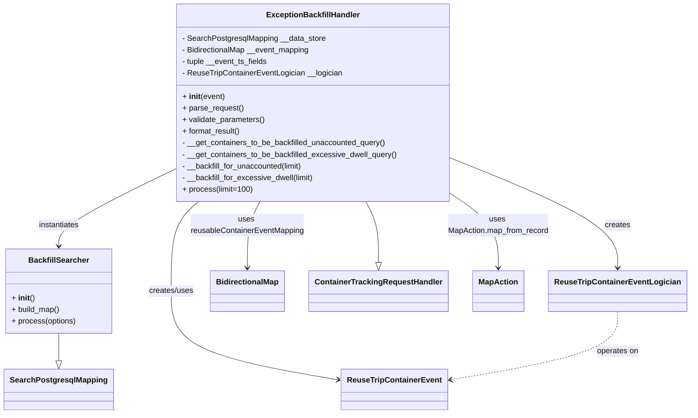

# Diagram: container_tracking_core/container_tracking_service/scripts/backfill_container_initial_exception.py


> Auto-generated by Obscura crawlers

## Diagram 1



### SVG

<svg id="container" width="1375.58203125" xmlns="http://www.w3.org/2000/svg" class="classDiagram" height="854" viewBox="0 0 1375.58203125 854" role="graphics-document document" aria-roledescription="class"><style>#container{font-family:"trebuchet ms",verdana,arial,sans-serif;font-size:16px;fill:#333;}@keyframes edge-animation-frame{from{stroke-dashoffset:0;}}@keyframes dash{to{stroke-dashoffset:0;}}#container .edge-animation-slow{stroke-dasharray:9,5!important;stroke-dashoffset:900;animation:dash 50s linear infinite;stroke-linecap:round;}#container .edge-animation-fast{stroke-dasharray:9,5!important;stroke-dashoffset:900;animation:dash 20s linear infinite;stroke-linecap:round;}#container .error-icon{fill:#552222;}#container .error-text{fill:#552222;stroke:#552222;}#container .edge-thickness-normal{stroke-width:1px;}#container .edge-thickness-thick{stroke-width:3.5px;}#container .edge-pattern-solid{stroke-dasharray:0;}#container .edge-thickness-invisible{stroke-width:0;fill:none;}#container .edge-pattern-dashed{stroke-dasharray:3;}#container .edge-pattern-dotted{stroke-dasharray:2;}#container .marker{fill:#333333;stroke:#333333;}#container .marker.cross{stroke:#333333;}#container svg{font-family:"trebuchet ms",verdana,arial,sans-serif;font-size:16px;}#container p{margin:0;}#container g.classGroup text{fill:#9370DB;stroke:none;font-family:"trebuchet ms",verdana,arial,sans-serif;font-size:10px;}#container g.classGroup text .title{font-weight:bolder;}#container .nodeLabel,#container .edgeLabel{color:#131300;}#container .edgeLabel .label rect{fill:#ECECFF;}#container .label text{fill:#131300;}#container .labelBkg{background:#ECECFF;}#container .edgeLabel .label span{background:#ECECFF;}#container .classTitle{font-weight:bolder;}#container .node rect,#container .node circle,#container .node ellipse,#container .node polygon,#container .node path{fill:#ECECFF;stroke:#9370DB;stroke-width:1px;}#container .divider{stroke:#9370DB;stroke-width:1;}#container g.clickable{cursor:pointer;}#container g.classGroup rect{fill:#ECECFF;stroke:#9370DB;}#container g.classGroup line{stroke:#9370DB;stroke-width:1;}#container .classLabel .box{stroke:none;stroke-width:0;fill:#ECECFF;opacity:0.5;}#container .classLabel .label{fill:#9370DB;font-size:10px;}#container .relation{stroke:#333333;stroke-width:1;fill:none;}#container .dashed-line{stroke-dasharray:3;}#container .dotted-line{stroke-dasharray:1 2;}#container #compositionStart,#container .composition{fill:#333333!important;stroke:#333333!important;stroke-width:1;}#container #compositionEnd,#container .composition{fill:#333333!important;stroke:#333333!important;stroke-width:1;}#container #dependencyStart,#container .dependency{fill:#333333!important;stroke:#333333!important;stroke-width:1;}#container #dependencyStart,#container .dependency{fill:#333333!important;stroke:#333333!important;stroke-width:1;}#container #extensionStart,#container .extension{fill:transparent!important;stroke:#333333!important;stroke-width:1;}#container #extensionEnd,#container .extension{fill:transparent!important;stroke:#333333!important;stroke-width:1;}#container #aggregationStart,#container .aggregation{fill:transparent!important;stroke:#333333!important;stroke-width:1;}#container #aggregationEnd,#container .aggregation{fill:transparent!important;stroke:#333333!important;stroke-width:1;}#container #lollipopStart,#container .lollipop{fill:#ECECFF!important;stroke:#333333!important;stroke-width:1;}#container #lollipopEnd,#container .lollipop{fill:#ECECFF!important;stroke:#333333!important;stroke-width:1;}#container .edgeTerminals{font-size:11px;line-height:initial;}#container .classTitleText{text-anchor:middle;font-size:18px;fill:#333;}#container .label-icon{display:inline-block;height:1em;overflow:visible;vertical-align:-0.125em;}#container .node .label-icon path{fill:currentColor;stroke:revert;stroke-width:revert;}#container :root{--mermaid-font-family:"trebuchet ms",verdana,arial,sans-serif;}</style><g><defs><marker id="container_class-aggregationStart" class="marker aggregation class" refX="18" refY="7" markerWidth="190" markerHeight="240" orient="auto"><path d="M 18,7 L9,13 L1,7 L9,1 Z"></path></marker></defs><defs><marker id="container_class-aggregationEnd" class="marker aggregation class" refX="1" refY="7" markerWidth="20" markerHeight="28" orient="auto"><path d="M 18,7 L9,13 L1,7 L9,1 Z"></path></marker></defs><defs><marker id="container_class-extensionStart" class="marker extension class" refX="18" refY="7" markerWidth="190" markerHeight="240" orient="auto"><path d="M 1,7 L18,13 V 1 Z"></path></marker></defs><defs><marker id="container_class-extensionEnd" class="marker extension class" refX="1" refY="7" markerWidth="20" markerHeight="28" orient="auto"><path d="M 1,1 V 13 L18,7 Z"></path></marker></defs><defs><marker id="container_class-compositionStart" class="marker composition class" refX="18" refY="7" markerWidth="190" markerHeight="240" orient="auto"><path d="M 18,7 L9,13 L1,7 L9,1 Z"></path></marker></defs><defs><marker id="container_class-compositionEnd" class="marker composition class" refX="1" refY="7" markerWidth="20" markerHeight="28" orient="auto"><path d="M 18,7 L9,13 L1,7 L9,1 Z"></path></marker></defs><defs><marker id="container_class-dependencyStart" class="marker dependency class" refX="6" refY="7" markerWidth="190" markerHeight="240" orient="auto"><path d="M 5,7 L9,13 L1,7 L9,1 Z"></path></marker></defs><defs><marker id="container_class-dependencyEnd" class="marker dependency class" refX="13" refY="7" markerWidth="20" markerHeight="28" orient="auto"><path d="M 18,7 L9,13 L14,7 L9,1 Z"></path></marker></defs><defs><marker id="container_class-lollipopStart" class="marker lollipop class" refX="13" refY="7" markerWidth="190" markerHeight="240" orient="auto"><circle stroke="black" fill="transparent" cx="7" cy="7" r="6"></circle></marker></defs><defs><marker id="container_class-lollipopEnd" class="marker lollipop class" refX="1" refY="7" markerWidth="190" markerHeight="240" orient="auto"><circle stroke="black" fill="transparent" cx="7" cy="7" r="6"></circle></marker></defs><g class="root"><g class="clusters"></g><g class="edgePaths"><path d="M116.375,688L116.375,694.167C116.375,700.333,116.375,712.667,116.375,722.125C116.375,731.583,116.375,738.167,116.375,741.458L116.375,744.75" id="id_BackfillSearcher_SearchPostgresqlMapping_1" class="edge-thickness-normal edge-pattern-solid relation" style=";;;" data-edge="true" data-et="edge" data-id="id_BackfillSearcher_SearchPostgresqlMapping_1" data-points="W3sieCI6MTE2LjM3NSwieSI6Njg4fSx7IngiOjExNi4zNzUsInkiOjcyNX0seyJ4IjoxMTYuMzc1LCJ5Ijo3NjJ9XQ==" marker-end="url(#container_class-extensionEnd)"></path><path d="M734.283,416L738.509,424.167C742.734,432.333,751.186,448.667,755.411,469.625C759.637,490.583,759.637,516.167,759.637,528.958L759.637,541.75" id="id_ExceptionBackfillHandler_ContainerTrackingRequestHandler_2" class="edge-thickness-normal edge-pattern-solid relation" style=";;;" data-edge="true" data-et="edge" data-id="id_ExceptionBackfillHandler_ContainerTrackingRequestHandler_2" data-points="W3sieCI6NzM0LjI4MzMzNDM2MjY0ODIsInkiOjQxNn0seyJ4Ijo3NTkuNjM2NzE4NzUsInkiOjQ2NX0seyJ4Ijo3NTkuNjM2NzE4NzUsInkiOjU1OX1d" marker-end="url(#container_class-extensionEnd)"></path><path d="M348.445,350.404L309.767,369.503C271.089,388.603,193.732,426.801,155.053,453.067C116.375,479.333,116.375,493.667,116.375,500.833L116.375,508" id="id_ExceptionBackfillHandler_BackfillSearcher_3" class="edge-thickness-normal edge-pattern-solid relation" style=";;;" data-edge="true" data-et="edge" data-id="id_ExceptionBackfillHandler_BackfillSearcher_3" data-points="W3sieCI6MzQ4LjQ0NTMxMjUsInkiOjM1MC40MDQxOTE3MzA4OTk3fSx7IngiOjExNi4zNzUsInkiOjQ2NX0seyJ4IjoxMTYuMzc1LCJ5Ijo1MTR9XQ==" marker-end="url(#container_class-dependencyEnd)"></path><path d="M909.016,329.345L963.019,351.954C1017.022,374.563,1125.029,419.782,1179.032,457.058C1233.035,494.333,1233.035,523.667,1233.035,538.333L1233.035,553" id="id_ExceptionBackfillHandler_ReuseTripContainerEventLogician_4" class="edge-thickness-normal edge-pattern-solid relation" style=";;;" data-edge="true" data-et="edge" data-id="id_ExceptionBackfillHandler_ReuseTripContainerEventLogician_4" data-points="W3sieCI6OTA5LjAxNTYyNSwieSI6MzI5LjM0NTAxODE2Mzk1Mzl9LHsieCI6MTIzMy4wMzUxNTYyNSwieSI6NDY1fSx7IngiOjEyMzMuMDM1MTU2MjUsInkiOjU1OX1d" marker-end="url(#container_class-dependencyEnd)"></path><path d="M397.549,416L388.294,424.167C379.039,432.333,360.529,448.667,351.274,479.5C342.02,510.333,342.02,555.667,342.02,599C342.02,642.333,342.02,683.667,397.916,714.245C453.813,744.824,565.607,764.648,621.504,774.56L677.401,784.472" id="id_ExceptionBackfillHandler_ReuseTripContainerEvent_5" class="edge-thickness-normal edge-pattern-solid relation" style=";;;" data-edge="true" data-et="edge" data-id="id_ExceptionBackfillHandler_ReuseTripContainerEvent_5" data-points="W3sieCI6Mzk3LjU0ODUyNzA1MDM5NTI1LCJ5Ijo0MTZ9LHsieCI6MzQyLjAxOTUzMTI1LCJ5Ijo0NjV9LHsieCI6MzQyLjAxOTUzMTI1LCJ5Ijo2MDF9LHsieCI6MzQyLjAxOTUzMTI1LCJ5Ijo3MjV9LHsieCI6NjgzLjMwODU5Mzc1LCJ5Ijo3ODUuNTE5MzMzNjI1NjAyOH1d" marker-end="url(#container_class-dependencyEnd)"></path><path d="M523.178,416L518.952,424.167C514.726,432.333,506.275,448.667,502.05,471.5C497.824,494.333,497.824,523.667,497.824,538.333L497.824,553" id="id_ExceptionBackfillHandler_BidirectionalMap_6" class="edge-thickness-normal edge-pattern-solid relation" style=";;;" data-edge="true" data-et="edge" data-id="id_ExceptionBackfillHandler_BidirectionalMap_6" data-points="W3sieCI6NTIzLjE3NzYwMzEzNzM1MTgsInkiOjQxNn0seyJ4Ijo0OTcuODI0MjE4NzUsInkiOjQ2NX0seyJ4Ijo0OTcuODI0MjE4NzUsInkiOjU1OX1d" marker-end="url(#container_class-dependencyEnd)"></path><path d="M909.016,404.109L923.822,414.257C938.629,424.406,968.242,444.703,983.049,469.518C997.855,494.333,997.855,523.667,997.855,538.333L997.855,553" id="id_ExceptionBackfillHandler_MapAction_7" class="edge-thickness-normal edge-pattern-solid relation" style=";;;" data-edge="true" data-et="edge" data-id="id_ExceptionBackfillHandler_MapAction_7" data-points="W3sieCI6OTA5LjAxNTYyNSwieSI6NDA0LjEwODc1NTkyNjE3Njc0fSx7IngiOjk5Ny44NTU0Njg3NSwieSI6NDY1fSx7IngiOjk5Ny44NTU0Njg3NSwieSI6NTU5fV0=" marker-end="url(#container_class-dependencyEnd)"></path><path d="M1233.035,643L1233.035,656.667C1233.035,670.333,1233.035,697.667,1177.138,721.245C1121.241,744.824,1009.448,764.648,953.551,774.56L897.654,784.472" id="id_ReuseTripContainerEventLogician_ReuseTripContainerEvent_8" class="edge-thickness-normal edge-pattern-dashed relation" style=";;;" data-edge="true" data-et="edge" data-id="id_ReuseTripContainerEventLogician_ReuseTripContainerEvent_8" data-points="W3sieCI6MTIzMy4wMzUxNTYyNSwieSI6NjQzfSx7IngiOjEyMzMuMDM1MTU2MjUsInkiOjcyNX0seyJ4Ijo4OTEuNzQ2MDkzNzUsInkiOjc4NS41MTkzMzM2MjU2MDI4fV0=" marker-end="url(#container_class-dependencyEnd)"></path></g><g class="edgeLabels"><g class="edgeLabel"><g class="label" data-id="id_BackfillSearcher_SearchPostgresqlMapping_1" transform="translate(0, 0)"><foreignObject width="0" height="0"><div xmlns="http://www.w3.org/1999/xhtml" class="labelBkg" style="display: table-cell; white-space: nowrap; line-height: 1.5; max-width: 200px; text-align: center;"><span class="edgeLabel"></span></div></foreignObject></g></g><g class="edgeLabel"><g class="label" data-id="id_ExceptionBackfillHandler_ContainerTrackingRequestHandler_2" transform="translate(0, 0)"><foreignObject width="0" height="0"><div xmlns="http://www.w3.org/1999/xhtml" class="labelBkg" style="display: table-cell; white-space: nowrap; line-height: 1.5; max-width: 200px; text-align: center;"><span class="edgeLabel"></span></div></foreignObject></g></g><g class="edgeLabel" transform="translate(116.375, 465)"><g class="label" data-id="id_ExceptionBackfillHandler_BackfillSearcher_3" transform="translate(-42.9140625, -12)"><foreignObject width="85.828125" height="24"><div xmlns="http://www.w3.org/1999/xhtml" class="labelBkg" style="display: table-cell; white-space: nowrap; line-height: 1.5; max-width: 200px; text-align: center;"><span class="edgeLabel"><p>instantiates</p></span></div></foreignObject></g></g><g class="edgeLabel" transform="translate(1233.03515625, 465)"><g class="label" data-id="id_ExceptionBackfillHandler_ReuseTripContainerEventLogician_4" transform="translate(-26.171875, -12)"><foreignObject width="52.34375" height="24"><div xmlns="http://www.w3.org/1999/xhtml" class="labelBkg" style="display: table-cell; white-space: nowrap; line-height: 1.5; max-width: 200px; text-align: center;"><span class="edgeLabel"><p>creates</p></span></div></foreignObject></g></g><g class="edgeLabel" transform="translate(342.01953125, 601)"><g class="label" data-id="id_ExceptionBackfillHandler_ReuseTripContainerEvent_5" transform="translate(-46.578125, -12)"><foreignObject width="93.15625" height="24"><div xmlns="http://www.w3.org/1999/xhtml" class="labelBkg" style="display: table-cell; white-space: nowrap; line-height: 1.5; max-width: 200px; text-align: center;"><span class="edgeLabel"><p>creates/uses</p></span></div></foreignObject></g></g><g class="edgeLabel" transform="translate(497.82421875, 465)"><g class="label" data-id="id_ExceptionBackfillHandler_BidirectionalMap_6" transform="translate(-117.6875, -24)"><foreignObject width="235.375" height="48"><div xmlns="http://www.w3.org/1999/xhtml" class="labelBkg" style="display: table; white-space: break-spaces; line-height: 1.5; max-width: 200px; text-align: center; width: 200px;"><span class="edgeLabel"><p>uses reusableContainerEventMapping</p></span></div></foreignObject></g></g><g class="edgeLabel" transform="translate(997.85546875, 465)"><g class="label" data-id="id_ExceptionBackfillHandler_MapAction_7" transform="translate(-104.3515625, -24)"><foreignObject width="208.703125" height="48"><div xmlns="http://www.w3.org/1999/xhtml" class="labelBkg" style="display: table; white-space: break-spaces; line-height: 1.5; max-width: 200px; text-align: center; width: 200px;"><span class="edgeLabel"><p>uses MapAction.map_from_record</p></span></div></foreignObject></g></g><g class="edgeLabel" transform="translate(1233.03515625, 725)"><g class="label" data-id="id_ReuseTripContainerEventLogician_ReuseTripContainerEvent_8" transform="translate(-43.2890625, -12)"><foreignObject width="86.578125" height="24"><div xmlns="http://www.w3.org/1999/xhtml" class="labelBkg" style="display: table-cell; white-space: nowrap; line-height: 1.5; max-width: 200px; text-align: center;"><span class="edgeLabel"><p>operates on</p></span></div></foreignObject></g></g></g><g class="nodes"><g class="node default" id="classId-ExceptionBackfillHandler-0" transform="translate(628.73046875, 212)"><g class="basic label-container"><path d="M-280.28515625 -204 L280.28515625 -204 L280.28515625 204 L-280.28515625 204" stroke="none" stroke-width="0" fill="#ECECFF" style=""></path><path d="M-280.28515625 -204 C-148.90916483031143 -204, -17.53317341062285 -204, 280.28515625 -204 M-280.28515625 -204 C-115.33730918586738 -204, 49.610537878265234 -204, 280.28515625 -204 M280.28515625 -204 C280.28515625 -121.38767693096808, 280.28515625 -38.77535386193617, 280.28515625 204 M280.28515625 -204 C280.28515625 -110.36870552482186, 280.28515625 -16.737411049643725, 280.28515625 204 M280.28515625 204 C149.1027932999735 204, 17.920430349947026 204, -280.28515625 204 M280.28515625 204 C88.45345151527951 204, -103.37825321944098 204, -280.28515625 204 M-280.28515625 204 C-280.28515625 58.74240013023518, -280.28515625 -86.51519973952963, -280.28515625 -204 M-280.28515625 204 C-280.28515625 62.627602426523424, -280.28515625 -78.74479514695315, -280.28515625 -204" stroke="#9370DB" stroke-width="1.3" fill="none" stroke-dasharray="0 0" style=""></path></g><g class="annotation-group text" transform="translate(0, -180)"></g><g class="label-group text" transform="translate(-91.8984375, -180)"><g class="label" style="font-weight: bolder" transform="translate(0,-12)"><foreignObject width="183.796875" height="24"><div xmlns="http://www.w3.org/1999/xhtml" style="display: table-cell; white-space: nowrap; line-height: 1.5; max-width: 232px; text-align: center;"><span class="nodeLabel markdown-node-label" style=""><p>ExceptionBackfillHandler</p></span></div></foreignObject></g></g><g class="members-group text" transform="translate(-268.28515625, -132)"><g class="label" style="" transform="translate(0,-12)"><foreignObject width="295.53125" height="24"><div xmlns="http://www.w3.org/1999/xhtml" style="display: table-cell; white-space: nowrap; line-height: 1.5; max-width: 353px; text-align: center;"><span class="nodeLabel markdown-node-label" style=""><p>- SearchPostgresqlMapping __data_store</p></span></div></foreignObject></g><g class="label" style="" transform="translate(0,12)"><foreignObject width="266.671875" height="24"><div xmlns="http://www.w3.org/1999/xhtml" style="display: table-cell; white-space: nowrap; line-height: 1.5; max-width: 325px; text-align: center;"><span class="nodeLabel markdown-node-label" style=""><p>- BidirectionalMap __event_mapping</p></span></div></foreignObject></g><g class="label" style="" transform="translate(0,36)"><foreignObject width="177.84375" height="24"><div xmlns="http://www.w3.org/1999/xhtml" style="display: table-cell; white-space: nowrap; line-height: 1.5; max-width: 235px; text-align: center;"><span class="nodeLabel markdown-node-label" style=""><p>- tuple __event_ts_fields</p></span></div></foreignObject></g><g class="label" style="" transform="translate(0,60)"><foreignObject width="330.34375" height="24"><div xmlns="http://www.w3.org/1999/xhtml" style="display: table-cell; white-space: nowrap; line-height: 1.5; max-width: 388px; text-align: center;"><span class="nodeLabel markdown-node-label" style=""><p>- ReuseTripContainerEventLogician __logician</p></span></div></foreignObject></g></g><g class="methods-group text" transform="translate(-268.28515625, -12)"><g class="label" style="" transform="translate(0,-12)"><foreignObject width="87.390625" height="24"><div xmlns="http://www.w3.org/1999/xhtml" style="display: table-cell; white-space: nowrap; line-height: 1.5; max-width: 177px; text-align: center;"><span class="nodeLabel markdown-node-label" style=""><p>+ <strong>init</strong>(event)</p></span></div></foreignObject></g><g class="label" style="" transform="translate(0,12)"><foreignObject width="126.046875" height="24"><div xmlns="http://www.w3.org/1999/xhtml" style="display: table-cell; white-space: nowrap; line-height: 1.5; max-width: 183px; text-align: center;"><span class="nodeLabel markdown-node-label" style=""><p>+ parse_request()</p></span></div></foreignObject></g><g class="label" style="" transform="translate(0,36)"><foreignObject width="170.953125" height="24"><div xmlns="http://www.w3.org/1999/xhtml" style="display: table-cell; white-space: nowrap; line-height: 1.5; max-width: 228px; text-align: center;"><span class="nodeLabel markdown-node-label" style=""><p>+ validate_parameters()</p></span></div></foreignObject></g><g class="label" style="" transform="translate(0,60)"><foreignObject width="121.5" height="24"><div xmlns="http://www.w3.org/1999/xhtml" style="display: table-cell; white-space: nowrap; line-height: 1.5; max-width: 179px; text-align: center;"><span class="nodeLabel markdown-node-label" style=""><p>+ format_result()</p></span></div></foreignObject></g><g class="label" style="" transform="translate(0,84)"><foreignObject width="423.6875" height="24"><div xmlns="http://www.w3.org/1999/xhtml" style="display: table-cell; white-space: nowrap; line-height: 1.5; max-width: 481px; text-align: center;"><span class="nodeLabel markdown-node-label" style=""><p>- __get_containers_to_be_backfilled_unaccounted_query()</p></span></div></foreignObject></g><g class="label" style="" transform="translate(0,108)"><foreignObject width="444.671875" height="24"><div xmlns="http://www.w3.org/1999/xhtml" style="display: table-cell; white-space: nowrap; line-height: 1.5; max-width: 502px; text-align: center;"><span class="nodeLabel markdown-node-label" style=""><p>- __get_containers_to_be_backfilled_excessive_dwell_query()</p></span></div></foreignObject></g><g class="label" style="" transform="translate(0,132)"><foreignObject width="252.546875" height="24"><div xmlns="http://www.w3.org/1999/xhtml" style="display: table-cell; white-space: nowrap; line-height: 1.5; max-width: 310px; text-align: center;"><span class="nodeLabel markdown-node-label" style=""><p>- __backfill_for_unaccounted(limit)</p></span></div></foreignObject></g><g class="label" style="" transform="translate(0,156)"><foreignObject width="273.53125" height="24"><div xmlns="http://www.w3.org/1999/xhtml" style="display: table-cell; white-space: nowrap; line-height: 1.5; max-width: 331px; text-align: center;"><span class="nodeLabel markdown-node-label" style=""><p>- __backfill_for_excessive_dwell(limit)</p></span></div></foreignObject></g><g class="label" style="" transform="translate(0,180)"><foreignObject width="143.640625" height="24"><div xmlns="http://www.w3.org/1999/xhtml" style="display: table-cell; white-space: nowrap; line-height: 1.5; max-width: 201px; text-align: center;"><span class="nodeLabel markdown-node-label" style=""><p>+ process(limit=100)</p></span></div></foreignObject></g></g><g class="divider" style=""><path d="M-280.28515625 -156 C-143.55710617201228 -156, -6.8290560940245655 -156, 280.28515625 -156 M-280.28515625 -156 C-86.39642428416681 -156, 107.49230768166638 -156, 280.28515625 -156" stroke="#9370DB" stroke-width="1.3" fill="none" stroke-dasharray="0 0" style=""></path></g><g class="divider" style=""><path d="M-280.28515625 -36 C-88.93192892121843 -36, 102.42129840756314 -36, 280.28515625 -36 M-280.28515625 -36 C-135.36691355712114 -36, 9.551329135757726 -36, 280.28515625 -36" stroke="#9370DB" stroke-width="1.3" fill="none" stroke-dasharray="0 0" style=""></path></g></g><g class="node default" id="classId-BackfillSearcher-1" transform="translate(116.375, 601)"><g class="basic label-container"><path d="M-108.375 -87 L108.375 -87 L108.375 87 L-108.375 87" stroke="none" stroke-width="0" fill="#ECECFF" style=""></path><path d="M-108.375 -87 C-50.745468583274125 -87, 6.88406283345175 -87, 108.375 -87 M-108.375 -87 C-49.64779132842209 -87, 9.079417343155825 -87, 108.375 -87 M108.375 -87 C108.375 -25.380010415407064, 108.375 36.23997916918587, 108.375 87 M108.375 -87 C108.375 -41.90107248925085, 108.375 3.197855021498299, 108.375 87 M108.375 87 C29.23532288409079 87, -49.90435423181842 87, -108.375 87 M108.375 87 C58.91131748318919 87, 9.447634966378374 87, -108.375 87 M-108.375 87 C-108.375 37.039647836227346, -108.375 -12.920704327545309, -108.375 -87 M-108.375 87 C-108.375 46.92085407947289, -108.375 6.841708158945778, -108.375 -87" stroke="#9370DB" stroke-width="1.3" fill="none" stroke-dasharray="0 0" style=""></path></g><g class="annotation-group text" transform="translate(0, -63)"></g><g class="label-group text" transform="translate(-59.453125, -63)"><g class="label" style="font-weight: bolder" transform="translate(0,-12)"><foreignObject width="118.90625" height="24"><div xmlns="http://www.w3.org/1999/xhtml" style="display: table-cell; white-space: nowrap; line-height: 1.5; max-width: 167px; text-align: center;"><span class="nodeLabel markdown-node-label" style=""><p>BackfillSearcher</p></span></div></foreignObject></g></g><g class="members-group text" transform="translate(-96.375, -15)"></g><g class="methods-group text" transform="translate(-96.375, 15)"><g class="label" style="" transform="translate(0,-12)"><foreignObject width="47.046875" height="24"><div xmlns="http://www.w3.org/1999/xhtml" style="display: table-cell; white-space: nowrap; line-height: 1.5; max-width: 137px; text-align: center;"><span class="nodeLabel markdown-node-label" style=""><p>+ <strong>init</strong>()</p></span></div></foreignObject></g><g class="label" style="" transform="translate(0,12)"><foreignObject width="100.34375" height="24"><div xmlns="http://www.w3.org/1999/xhtml" style="display: table-cell; white-space: nowrap; line-height: 1.5; max-width: 158px; text-align: center;"><span class="nodeLabel markdown-node-label" style=""><p>+ build_map()</p></span></div></foreignObject></g><g class="label" style="" transform="translate(0,36)"><foreignObject width="133.296875" height="24"><div xmlns="http://www.w3.org/1999/xhtml" style="display: table-cell; white-space: nowrap; line-height: 1.5; max-width: 191px; text-align: center;"><span class="nodeLabel markdown-node-label" style=""><p>+ process(options)</p></span></div></foreignObject></g></g><g class="divider" style=""><path d="M-108.375 -39 C-26.44373816316393 -39, 55.48752367367214 -39, 108.375 -39 M-108.375 -39 C-51.21579609811109 -39, 5.943407803777816 -39, 108.375 -39" stroke="#9370DB" stroke-width="1.3" fill="none" stroke-dasharray="0 0" style=""></path></g><g class="divider" style=""><path d="M-108.375 -15 C-45.47609383428182 -15, 17.42281233143636 -15, 108.375 -15 M-108.375 -15 C-54.8164531362443 -15, -1.2579062724885972 -15, 108.375 -15" stroke="#9370DB" stroke-width="1.3" fill="none" stroke-dasharray="0 0" style=""></path></g></g><g class="node default" id="classId-ReuseTripContainerEventLogician-2" transform="translate(1233.03515625, 601)"><g class="basic label-container"><path d="M-134.546875 -42 L134.546875 -42 L134.546875 42 L-134.546875 42" stroke="none" stroke-width="0" fill="#ECECFF" style=""></path><path d="M-134.546875 -42 C-37.405425586899256 -42, 59.73602382620149 -42, 134.546875 -42 M-134.546875 -42 C-33.13699456587378 -42, 68.27288586825244 -42, 134.546875 -42 M134.546875 -42 C134.546875 -17.59056914151751, 134.546875 6.818861716964982, 134.546875 42 M134.546875 -42 C134.546875 -10.245150552355014, 134.546875 21.509698895289972, 134.546875 42 M134.546875 42 C40.560053902305015 42, -53.42676719538997 42, -134.546875 42 M134.546875 42 C65.51734504115117 42, -3.5121849176976525 42, -134.546875 42 M-134.546875 42 C-134.546875 21.909469930329767, -134.546875 1.8189398606595333, -134.546875 -42 M-134.546875 42 C-134.546875 24.863483075596758, -134.546875 7.7269661511935155, -134.546875 -42" stroke="#9370DB" stroke-width="1.3" fill="none" stroke-dasharray="0 0" style=""></path></g><g class="annotation-group text" transform="translate(0, -18)"></g><g class="label-group text" transform="translate(-122.546875, -18)"><g class="label" style="font-weight: bolder" transform="translate(0,-12)"><foreignObject width="245.09375" height="24"><div xmlns="http://www.w3.org/1999/xhtml" style="display: table-cell; white-space: nowrap; line-height: 1.5; max-width: 292px; text-align: center;"><span class="nodeLabel markdown-node-label" style=""><p>ReuseTripContainerEventLogician</p></span></div></foreignObject></g></g><g class="members-group text" transform="translate(-122.546875, 30)"></g><g class="methods-group text" transform="translate(-122.546875, 60)"></g><g class="divider" style=""><path d="M-134.546875 6 C-72.90315671168611 6, -11.259438423372217 6, 134.546875 6 M-134.546875 6 C-39.32746245810898 6, 55.891950083782035 6, 134.546875 6" stroke="#9370DB" stroke-width="1.3" fill="none" stroke-dasharray="0 0" style=""></path></g><g class="divider" style=""><path d="M-134.546875 24 C-42.54480968292512 24, 49.45725563414976 24, 134.546875 24 M-134.546875 24 C-47.570502277543795 24, 39.40587044491241 24, 134.546875 24" stroke="#9370DB" stroke-width="1.3" fill="none" stroke-dasharray="0 0" style=""></path></g></g><g class="node default" id="classId-ReuseTripContainerEvent-3" transform="translate(787.52734375, 804)"><g class="basic label-container"><path d="M-104.21875 -42 L104.21875 -42 L104.21875 42 L-104.21875 42" stroke="none" stroke-width="0" fill="#ECECFF" style=""></path><path d="M-104.21875 -42 C-57.13641317441305 -42, -10.0540763488261 -42, 104.21875 -42 M-104.21875 -42 C-44.084106254929864 -42, 16.05053749014027 -42, 104.21875 -42 M104.21875 -42 C104.21875 -9.838043762438197, 104.21875 22.323912475123606, 104.21875 42 M104.21875 -42 C104.21875 -21.49509267426918, 104.21875 -0.9901853485383612, 104.21875 42 M104.21875 42 C61.10414129087422 42, 17.989532581748435 42, -104.21875 42 M104.21875 42 C49.38473010199541 42, -5.449289796009182 42, -104.21875 42 M-104.21875 42 C-104.21875 14.259125041468877, -104.21875 -13.481749917062245, -104.21875 -42 M-104.21875 42 C-104.21875 19.797514478655426, -104.21875 -2.404971042689148, -104.21875 -42" stroke="#9370DB" stroke-width="1.3" fill="none" stroke-dasharray="0 0" style=""></path></g><g class="annotation-group text" transform="translate(0, -18)"></g><g class="label-group text" transform="translate(-92.21875, -18)"><g class="label" style="font-weight: bolder" transform="translate(0,-12)"><foreignObject width="184.4375" height="24"><div xmlns="http://www.w3.org/1999/xhtml" style="display: table-cell; white-space: nowrap; line-height: 1.5; max-width: 232px; text-align: center;"><span class="nodeLabel markdown-node-label" style=""><p>ReuseTripContainerEvent</p></span></div></foreignObject></g></g><g class="members-group text" transform="translate(-92.21875, 30)"></g><g class="methods-group text" transform="translate(-92.21875, 60)"></g><g class="divider" style=""><path d="M-104.21875 6 C-44.16469750282713 6, 15.889354994345737 6, 104.21875 6 M-104.21875 6 C-31.06589066052105 6, 42.0869686789579 6, 104.21875 6" stroke="#9370DB" stroke-width="1.3" fill="none" stroke-dasharray="0 0" style=""></path></g><g class="divider" style=""><path d="M-104.21875 24 C-27.138810046480984 24, 49.94112990703803 24, 104.21875 24 M-104.21875 24 C-62.51261190000667 24, -20.806473800013336 24, 104.21875 24" stroke="#9370DB" stroke-width="1.3" fill="none" stroke-dasharray="0 0" style=""></path></g></g><g class="node default" id="classId-SearchPostgresqlMapping-4" transform="translate(116.375, 804)"><g class="basic label-container"><path d="M-107.1171875 -42 L107.1171875 -42 L107.1171875 42 L-107.1171875 42" stroke="none" stroke-width="0" fill="#ECECFF" style=""></path><path d="M-107.1171875 -42 C-61.65493571262791 -42, -16.19268392525582 -42, 107.1171875 -42 M-107.1171875 -42 C-42.42369712145312 -42, 22.269793257093767 -42, 107.1171875 -42 M107.1171875 -42 C107.1171875 -21.166540856809405, 107.1171875 -0.3330817136188102, 107.1171875 42 M107.1171875 -42 C107.1171875 -14.815544172241626, 107.1171875 12.368911655516747, 107.1171875 42 M107.1171875 42 C56.57706332100333 42, 6.036939142006659 42, -107.1171875 42 M107.1171875 42 C36.57971713993946 42, -33.95775322012108 42, -107.1171875 42 M-107.1171875 42 C-107.1171875 19.100388682839725, -107.1171875 -3.79922263432055, -107.1171875 -42 M-107.1171875 42 C-107.1171875 12.41304980614807, -107.1171875 -17.17390038770386, -107.1171875 -42" stroke="#9370DB" stroke-width="1.3" fill="none" stroke-dasharray="0 0" style=""></path></g><g class="annotation-group text" transform="translate(0, -18)"></g><g class="label-group text" transform="translate(-95.1171875, -18)"><g class="label" style="font-weight: bolder" transform="translate(0,-12)"><foreignObject width="190.234375" height="24"><div xmlns="http://www.w3.org/1999/xhtml" style="display: table-cell; white-space: nowrap; line-height: 1.5; max-width: 237px; text-align: center;"><span class="nodeLabel markdown-node-label" style=""><p>SearchPostgresqlMapping</p></span></div></foreignObject></g></g><g class="members-group text" transform="translate(-95.1171875, 30)"></g><g class="methods-group text" transform="translate(-95.1171875, 60)"></g><g class="divider" style=""><path d="M-107.1171875 6 C-25.471240669900126 6, 56.17470616019975 6, 107.1171875 6 M-107.1171875 6 C-51.81027020312056 6, 3.496647093758881 6, 107.1171875 6" stroke="#9370DB" stroke-width="1.3" fill="none" stroke-dasharray="0 0" style=""></path></g><g class="divider" style=""><path d="M-107.1171875 24 C-35.242577373277385 24, 36.63203275344523 24, 107.1171875 24 M-107.1171875 24 C-50.28031541183085 24, 6.556556676338303 24, 107.1171875 24" stroke="#9370DB" stroke-width="1.3" fill="none" stroke-dasharray="0 0" style=""></path></g></g><g class="node default" id="classId-BidirectionalMap-5" transform="translate(497.82421875, 601)"><g class="basic label-container"><path d="M-74.2265625 -42 L74.2265625 -42 L74.2265625 42 L-74.2265625 42" stroke="none" stroke-width="0" fill="#ECECFF" style=""></path><path d="M-74.2265625 -42 C-21.64580182731563 -42, 30.93495884536874 -42, 74.2265625 -42 M-74.2265625 -42 C-24.05310463787604 -42, 26.12035322424792 -42, 74.2265625 -42 M74.2265625 -42 C74.2265625 -15.384431865652196, 74.2265625 11.231136268695607, 74.2265625 42 M74.2265625 -42 C74.2265625 -9.378039670734864, 74.2265625 23.24392065853027, 74.2265625 42 M74.2265625 42 C25.94059177114633 42, -22.34537895770734 42, -74.2265625 42 M74.2265625 42 C39.0762003687161 42, 3.9258382374322025 42, -74.2265625 42 M-74.2265625 42 C-74.2265625 9.620451306643332, -74.2265625 -22.759097386713336, -74.2265625 -42 M-74.2265625 42 C-74.2265625 24.49757118576196, -74.2265625 6.995142371523919, -74.2265625 -42" stroke="#9370DB" stroke-width="1.3" fill="none" stroke-dasharray="0 0" style=""></path></g><g class="annotation-group text" transform="translate(0, -18)"></g><g class="label-group text" transform="translate(-62.2265625, -18)"><g class="label" style="font-weight: bolder" transform="translate(0,-12)"><foreignObject width="124.453125" height="24"><div xmlns="http://www.w3.org/1999/xhtml" style="display: table-cell; white-space: nowrap; line-height: 1.5; max-width: 173px; text-align: center;"><span class="nodeLabel markdown-node-label" style=""><p>BidirectionalMap</p></span></div></foreignObject></g></g><g class="members-group text" transform="translate(-62.2265625, 30)"></g><g class="methods-group text" transform="translate(-62.2265625, 60)"></g><g class="divider" style=""><path d="M-74.2265625 6 C-42.36781335896467 6, -10.509064217929328 6, 74.2265625 6 M-74.2265625 6 C-32.728895291555844 6, 8.768771916888312 6, 74.2265625 6" stroke="#9370DB" stroke-width="1.3" fill="none" stroke-dasharray="0 0" style=""></path></g><g class="divider" style=""><path d="M-74.2265625 24 C-26.042651573577324 24, 22.141259352845353 24, 74.2265625 24 M-74.2265625 24 C-35.39612790359935 24, 3.4343066928013 24, 74.2265625 24" stroke="#9370DB" stroke-width="1.3" fill="none" stroke-dasharray="0 0" style=""></path></g></g><g class="node default" id="classId-ContainerTrackingRequestHandler-6" transform="translate(759.63671875, 601)"><g class="basic label-container"><path d="M-137.5859375 -42 L137.5859375 -42 L137.5859375 42 L-137.5859375 42" stroke="none" stroke-width="0" fill="#ECECFF" style=""></path><path d="M-137.5859375 -42 C-37.005959811107275 -42, 63.57401787778545 -42, 137.5859375 -42 M-137.5859375 -42 C-81.21933102383761 -42, -24.852724547675223 -42, 137.5859375 -42 M137.5859375 -42 C137.5859375 -14.110364334512568, 137.5859375 13.779271330974865, 137.5859375 42 M137.5859375 -42 C137.5859375 -11.494761561516455, 137.5859375 19.01047687696709, 137.5859375 42 M137.5859375 42 C81.66743219231813 42, 25.748926884636248 42, -137.5859375 42 M137.5859375 42 C76.56610927764605 42, 15.546281055292098 42, -137.5859375 42 M-137.5859375 42 C-137.5859375 14.089135660162938, -137.5859375 -13.821728679674123, -137.5859375 -42 M-137.5859375 42 C-137.5859375 22.039679743329426, -137.5859375 2.079359486658852, -137.5859375 -42" stroke="#9370DB" stroke-width="1.3" fill="none" stroke-dasharray="0 0" style=""></path></g><g class="annotation-group text" transform="translate(0, -18)"></g><g class="label-group text" transform="translate(-125.5859375, -18)"><g class="label" style="font-weight: bolder" transform="translate(0,-12)"><foreignObject width="251.171875" height="24"><div xmlns="http://www.w3.org/1999/xhtml" style="display: table-cell; white-space: nowrap; line-height: 1.5; max-width: 299px; text-align: center;"><span class="nodeLabel markdown-node-label" style=""><p>ContainerTrackingRequestHandler</p></span></div></foreignObject></g></g><g class="members-group text" transform="translate(-125.5859375, 30)"></g><g class="methods-group text" transform="translate(-125.5859375, 60)"></g><g class="divider" style=""><path d="M-137.5859375 6 C-70.05858452413196 6, -2.531231548263918 6, 137.5859375 6 M-137.5859375 6 C-47.76442968295005 6, 42.057078134099896 6, 137.5859375 6" stroke="#9370DB" stroke-width="1.3" fill="none" stroke-dasharray="0 0" style=""></path></g><g class="divider" style=""><path d="M-137.5859375 24 C-71.53110203823722 24, -5.476266576474444 24, 137.5859375 24 M-137.5859375 24 C-31.36686585076947 24, 74.85220579846106 24, 137.5859375 24" stroke="#9370DB" stroke-width="1.3" fill="none" stroke-dasharray="0 0" style=""></path></g></g><g class="node default" id="classId-MapAction-7" transform="translate(997.85546875, 601)"><g class="basic label-container"><path d="M-50.6328125 -42 L50.6328125 -42 L50.6328125 42 L-50.6328125 42" stroke="none" stroke-width="0" fill="#ECECFF" style=""></path><path d="M-50.6328125 -42 C-19.39423960710218 -42, 11.844333285795642 -42, 50.6328125 -42 M-50.6328125 -42 C-11.466902989209451 -42, 27.699006521581097 -42, 50.6328125 -42 M50.6328125 -42 C50.6328125 -24.469654622643095, 50.6328125 -6.939309245286189, 50.6328125 42 M50.6328125 -42 C50.6328125 -22.46580432345267, 50.6328125 -2.931608646905339, 50.6328125 42 M50.6328125 42 C23.52659367397751 42, -3.579625152044983 42, -50.6328125 42 M50.6328125 42 C30.271554648008138 42, 9.910296796016276 42, -50.6328125 42 M-50.6328125 42 C-50.6328125 23.355337883464653, -50.6328125 4.710675766929306, -50.6328125 -42 M-50.6328125 42 C-50.6328125 11.71018212177636, -50.6328125 -18.57963575644728, -50.6328125 -42" stroke="#9370DB" stroke-width="1.3" fill="none" stroke-dasharray="0 0" style=""></path></g><g class="annotation-group text" transform="translate(0, -18)"></g><g class="label-group text" transform="translate(-38.6328125, -18)"><g class="label" style="font-weight: bolder" transform="translate(0,-12)"><foreignObject width="77.265625" height="24"><div xmlns="http://www.w3.org/1999/xhtml" style="display: table-cell; white-space: nowrap; line-height: 1.5; max-width: 126px; text-align: center;"><span class="nodeLabel markdown-node-label" style=""><p>MapAction</p></span></div></foreignObject></g></g><g class="members-group text" transform="translate(-38.6328125, 30)"></g><g class="methods-group text" transform="translate(-38.6328125, 60)"></g><g class="divider" style=""><path d="M-50.6328125 6 C-13.409462994166553 6, 23.813886511666894 6, 50.6328125 6 M-50.6328125 6 C-20.469535148083015 6, 9.69374220383397 6, 50.6328125 6" stroke="#9370DB" stroke-width="1.3" fill="none" stroke-dasharray="0 0" style=""></path></g><g class="divider" style=""><path d="M-50.6328125 24 C-24.526615844511767 24, 1.5795808109764664 24, 50.6328125 24 M-50.6328125 24 C-22.620986608035736 24, 5.390839283928528 24, 50.6328125 24" stroke="#9370DB" stroke-width="1.3" fill="none" stroke-dasharray="0 0" style=""></path></g></g></g></g></g></svg>

## Diagram 2

```mermaid
flowchart LR
    Start([__main__]) --> Prompt[Inquirer prompt: select stage & org]
    Prompt --> SetEnv[Set AWS_STAGE, AWS_PROFILE, org_id]
    SetEnv --> CreateHandler[Create ExceptionBackfillHandler(event)]
    CreateHandler --> ProcessCall[Call handler.process(1000)]
    ProcessCall --> BackfillUnacc[__backfill_for_unaccounted(limit)]
    ProcessCall --> BackfillDwell[__backfill_for_excessive_dwell(limit)]

    subgraph UnaccountedLoop [Unaccounted Backfill Loop]
        BackfillUnacc --> U_Check{results returned?}
        U_Check -- No --> U_End([exit loop])
        U_Check -- Yes --> U_Read[__data_store.read(unaccounted_query,replaces)]
        U_Read --> U_Map[for each result: create ReuseTripContainerEvent\nMapAction.map_from_record(...)]
        U_Map --> U_Clear[container_event.clear_fields()]
        U_Clear --> U_Set[__logician.set_new_container_event(container_event)]
        U_Set --> U_Handle[__logician.handle_unaccounted_exception_logic()]
        U_Handle --> U_Iter[log iteration & increment]
        U_Iter --> U_Check
    end

    subgraph ExcessiveDwellLoop [Excessive Dwell Backfill Loop]
        BackfillDwell --> D_Check{results returned?}
        D_Check -- No --> D_End([exit loop])
        D_Check -- Yes --> D_Read[__data_store.read(excessive_dwell_query,replaces)]
        D_Read --> D_Map[for each result: create ReuseTripContainerEvent\nMapAction.map_from_record(...)]
        D_Map --> D_Set[__logician.set_new_container_event(container_event)]
        D_Set --> D_Handle[__logician.handle_excessive_dwell_exception_logic()]
        D_Handle --> D_Iter[log iteration & increment]
        D_Iter --> D_Check
    end

    U_End --> Finish([Done])
    D_End --> Finish
```

> SVG rendering failed for this diagram.
