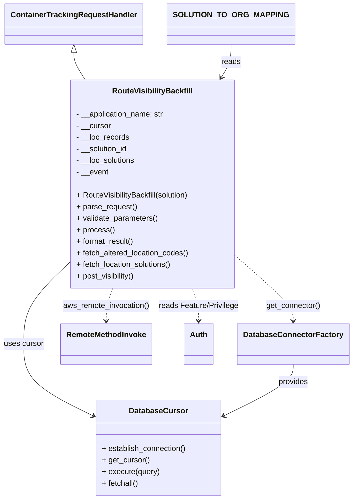

# Diagram: container_tracking_core/container_tracking_service/scripts/route_backfill/backfill_CT-2241.py


> Auto-generated by Obscura crawlers

## Diagram 1



### SVG

<svg id="container" width="720.890625" xmlns="http://www.w3.org/2000/svg" class="classDiagram" height="1036" viewBox="0 0 720.890625 1036" role="graphics-document document" aria-roledescription="class"><style>#container{font-family:"trebuchet ms",verdana,arial,sans-serif;font-size:16px;fill:#333;}@keyframes edge-animation-frame{from{stroke-dashoffset:0;}}@keyframes dash{to{stroke-dashoffset:0;}}#container .edge-animation-slow{stroke-dasharray:9,5!important;stroke-dashoffset:900;animation:dash 50s linear infinite;stroke-linecap:round;}#container .edge-animation-fast{stroke-dasharray:9,5!important;stroke-dashoffset:900;animation:dash 20s linear infinite;stroke-linecap:round;}#container .error-icon{fill:#552222;}#container .error-text{fill:#552222;stroke:#552222;}#container .edge-thickness-normal{stroke-width:1px;}#container .edge-thickness-thick{stroke-width:3.5px;}#container .edge-pattern-solid{stroke-dasharray:0;}#container .edge-thickness-invisible{stroke-width:0;fill:none;}#container .edge-pattern-dashed{stroke-dasharray:3;}#container .edge-pattern-dotted{stroke-dasharray:2;}#container .marker{fill:#333333;stroke:#333333;}#container .marker.cross{stroke:#333333;}#container svg{font-family:"trebuchet ms",verdana,arial,sans-serif;font-size:16px;}#container p{margin:0;}#container g.classGroup text{fill:#9370DB;stroke:none;font-family:"trebuchet ms",verdana,arial,sans-serif;font-size:10px;}#container g.classGroup text .title{font-weight:bolder;}#container .nodeLabel,#container .edgeLabel{color:#131300;}#container .edgeLabel .label rect{fill:#ECECFF;}#container .label text{fill:#131300;}#container .labelBkg{background:#ECECFF;}#container .edgeLabel .label span{background:#ECECFF;}#container .classTitle{font-weight:bolder;}#container .node rect,#container .node circle,#container .node ellipse,#container .node polygon,#container .node path{fill:#ECECFF;stroke:#9370DB;stroke-width:1px;}#container .divider{stroke:#9370DB;stroke-width:1;}#container g.clickable{cursor:pointer;}#container g.classGroup rect{fill:#ECECFF;stroke:#9370DB;}#container g.classGroup line{stroke:#9370DB;stroke-width:1;}#container .classLabel .box{stroke:none;stroke-width:0;fill:#ECECFF;opacity:0.5;}#container .classLabel .label{fill:#9370DB;font-size:10px;}#container .relation{stroke:#333333;stroke-width:1;fill:none;}#container .dashed-line{stroke-dasharray:3;}#container .dotted-line{stroke-dasharray:1 2;}#container #compositionStart,#container .composition{fill:#333333!important;stroke:#333333!important;stroke-width:1;}#container #compositionEnd,#container .composition{fill:#333333!important;stroke:#333333!important;stroke-width:1;}#container #dependencyStart,#container .dependency{fill:#333333!important;stroke:#333333!important;stroke-width:1;}#container #dependencyStart,#container .dependency{fill:#333333!important;stroke:#333333!important;stroke-width:1;}#container #extensionStart,#container .extension{fill:transparent!important;stroke:#333333!important;stroke-width:1;}#container #extensionEnd,#container .extension{fill:transparent!important;stroke:#333333!important;stroke-width:1;}#container #aggregationStart,#container .aggregation{fill:transparent!important;stroke:#333333!important;stroke-width:1;}#container #aggregationEnd,#container .aggregation{fill:transparent!important;stroke:#333333!important;stroke-width:1;}#container #lollipopStart,#container .lollipop{fill:#ECECFF!important;stroke:#333333!important;stroke-width:1;}#container #lollipopEnd,#container .lollipop{fill:#ECECFF!important;stroke:#333333!important;stroke-width:1;}#container .edgeTerminals{font-size:11px;line-height:initial;}#container .classTitleText{text-anchor:middle;font-size:18px;fill:#333;}#container .label-icon{display:inline-block;height:1em;overflow:visible;vertical-align:-0.125em;}#container .node .label-icon path{fill:currentColor;stroke:revert;stroke-width:revert;}#container :root{--mermaid-font-family:"trebuchet ms",verdana,arial,sans-serif;}</style><g><defs><marker id="container_class-aggregationStart" class="marker aggregation class" refX="18" refY="7" markerWidth="190" markerHeight="240" orient="auto"><path d="M 18,7 L9,13 L1,7 L9,1 Z"></path></marker></defs><defs><marker id="container_class-aggregationEnd" class="marker aggregation class" refX="1" refY="7" markerWidth="20" markerHeight="28" orient="auto"><path d="M 18,7 L9,13 L1,7 L9,1 Z"></path></marker></defs><defs><marker id="container_class-extensionStart" class="marker extension class" refX="18" refY="7" markerWidth="190" markerHeight="240" orient="auto"><path d="M 1,7 L18,13 V 1 Z"></path></marker></defs><defs><marker id="container_class-extensionEnd" class="marker extension class" refX="1" refY="7" markerWidth="20" markerHeight="28" orient="auto"><path d="M 1,1 V 13 L18,7 Z"></path></marker></defs><defs><marker id="container_class-compositionStart" class="marker composition class" refX="18" refY="7" markerWidth="190" markerHeight="240" orient="auto"><path d="M 18,7 L9,13 L1,7 L9,1 Z"></path></marker></defs><defs><marker id="container_class-compositionEnd" class="marker composition class" refX="1" refY="7" markerWidth="20" markerHeight="28" orient="auto"><path d="M 18,7 L9,13 L1,7 L9,1 Z"></path></marker></defs><defs><marker id="container_class-dependencyStart" class="marker dependency class" refX="6" refY="7" markerWidth="190" markerHeight="240" orient="auto"><path d="M 5,7 L9,13 L1,7 L9,1 Z"></path></marker></defs><defs><marker id="container_class-dependencyEnd" class="marker dependency class" refX="13" refY="7" markerWidth="20" markerHeight="28" orient="auto"><path d="M 18,7 L9,13 L14,7 L9,1 Z"></path></marker></defs><defs><marker id="container_class-lollipopStart" class="marker lollipop class" refX="13" refY="7" markerWidth="190" markerHeight="240" orient="auto"><circle stroke="black" fill="transparent" cx="7" cy="7" r="6"></circle></marker></defs><defs><marker id="container_class-lollipopEnd" class="marker lollipop class" refX="1" refY="7" markerWidth="190" markerHeight="240" orient="auto"><circle stroke="black" fill="transparent" cx="7" cy="7" r="6"></circle></marker></defs><g class="root"><g class="clusters"></g><g class="edgePaths"><path d="M162.738,109.25L162.738,112.542C162.738,115.833,162.738,122.417,166.47,131.875C170.203,141.333,177.667,153.667,181.399,159.833L185.131,166" id="id_ContainerTrackingRequestHandler_RouteVisibilityBackfill_1" class="edge-thickness-normal edge-pattern-solid relation" style=";;;" data-edge="true" data-et="edge" data-id="id_ContainerTrackingRequestHandler_RouteVisibilityBackfill_1" data-points="W3sieCI6MTYyLjczODI4MTI1LCJ5Ijo5Mn0seyJ4IjoxNjIuNzM4MjgxMjUsInkiOjEyOX0seyJ4IjoxODUuMTMxNDg0NjgzNzk0NDcsInkiOjE2Nn1d" marker-start="url(#container_class-extensionStart)"></path><path d="M487.926,533.765L507.055,550.637C526.185,567.51,564.444,601.255,583.574,623.294C602.703,645.333,602.703,655.667,602.703,660.833L602.703,666" id="id_RouteVisibilityBackfill_DatabaseConnectorFactory_2" class="edge-thickness-normal edge-pattern-dashed relation" style=";;;" data-edge="true" data-et="edge" data-id="id_RouteVisibilityBackfill_DatabaseConnectorFactory_2" data-points="W3sieCI6NDg3LjkyNTc4MTI1LCJ5Ijo1MzMuNzY0ODU3MjgyOTI4NX0seyJ4Ijo2MDIuNzAzMTI1LCJ5Ijo2MzV9LHsieCI6NjAyLjcwMzEyNSwieSI6NjcyfV0=" marker-end="url(#container_class-dependencyEnd)"></path><path d="M232.492,598L230.111,604.167C227.731,610.333,222.971,622.667,220.591,634C218.211,645.333,218.211,655.667,218.211,660.833L218.211,666" id="id_RouteVisibilityBackfill_RemoteMethodInvoke_3" class="edge-thickness-normal edge-pattern-dashed relation" style=";;;" data-edge="true" data-et="edge" data-id="id_RouteVisibilityBackfill_RemoteMethodInvoke_3" data-points="W3sieCI6MjMyLjQ5MTUzOTAzMTYyMDU2LCJ5Ijo1OTh9LHsieCI6MjE4LjIxMDkzNzUsInkiOjYzNX0seyJ4IjoyMTguMjEwOTM3NSwieSI6NjcyfV0=" marker-end="url(#container_class-dependencyEnd)"></path><path d="M399.227,598L401.607,604.167C403.987,610.333,408.748,622.667,411.128,634C413.508,645.333,413.508,655.667,413.508,660.833L413.508,666" id="id_RouteVisibilityBackfill_Auth_4" class="edge-thickness-normal edge-pattern-dashed relation" style=";;;" data-edge="true" data-et="edge" data-id="id_RouteVisibilityBackfill_Auth_4" data-points="W3sieCI6Mzk5LjIyNzIxMDk2ODM3OTQ0LCJ5Ijo1OTh9LHsieCI6NDEzLjUwNzgxMjUsInkiOjYzNX0seyJ4Ijo0MTMuNTA3ODEyNSwieSI6NjcyfV0=" marker-end="url(#container_class-dependencyEnd)"></path><path d="M143.793,545.422L128.074,560.352C112.354,575.281,80.915,605.141,65.196,633.237C49.477,661.333,49.477,687.667,49.477,714C49.477,740.333,49.477,766.667,73.049,791.423C96.621,816.179,143.765,839.358,167.337,850.947L190.909,862.537" id="id_RouteVisibilityBackfill_DatabaseCursor_5" class="edge-thickness-normal edge-pattern-solid relation" style=";;;" data-edge="true" data-et="edge" data-id="id_RouteVisibilityBackfill_DatabaseCursor_5" data-points="W3sieCI6MTQzLjc5Mjk2ODc1LCJ5Ijo1NDUuNDIxOTU3OTQzNTE0MX0seyJ4Ijo0OS40NzY1NjI1LCJ5Ijo2MzV9LHsieCI6NDkuNDc2NTYyNSwieSI6NzE0fSx7IngiOjQ5LjQ3NjU2MjUsInkiOjc5M30seyJ4IjoxOTYuMjkyOTY4NzUsInkiOjg2NS4xODM5MjEwMzE0NDl9XQ==" marker-end="url(#container_class-dependencyEnd)"></path><path d="M602.703,756L602.703,762.167C602.703,768.333,602.703,780.667,579.131,798.423C555.559,816.179,508.415,839.358,484.843,850.947L461.271,862.537" id="id_DatabaseConnectorFactory_DatabaseCursor_6" class="edge-thickness-normal edge-pattern-solid relation" style=";;;" data-edge="true" data-et="edge" data-id="id_DatabaseConnectorFactory_DatabaseCursor_6" data-points="W3sieCI6NjAyLjcwMzEyNSwieSI6NzU2fSx7IngiOjYwMi43MDMxMjUsInkiOjc5M30seyJ4Ijo0NTUuODg2NzE4NzUsInkiOjg2NS4xODM5MjEwMzE0NDl9XQ==" marker-end="url(#container_class-dependencyEnd)"></path><path d="M468.98,92L468.98,98.167C468.98,104.333,468.98,116.667,465.766,128.144C462.552,139.622,456.123,150.245,452.908,155.556L449.694,160.867" id="id_SOLUTION_TO_ORG_MAPPING_RouteVisibilityBackfill_7" class="edge-thickness-normal edge-pattern-solid relation" style=";;;" data-edge="true" data-et="edge" data-id="id_SOLUTION_TO_ORG_MAPPING_RouteVisibilityBackfill_7" data-points="W3sieCI6NDY4Ljk4MDQ2ODc1LCJ5Ijo5Mn0seyJ4Ijo0NjguOTgwNDY4NzUsInkiOjEyOX0seyJ4Ijo0NDYuNTg3MjY1MzE2MjA1NSwieSI6MTY2fV0=" marker-end="url(#container_class-dependencyEnd)"></path></g><g class="edgeLabels"><g class="edgeLabel"><g class="label" data-id="id_ContainerTrackingRequestHandler_RouteVisibilityBackfill_1" transform="translate(0, 0)"><foreignObject width="0" height="0"><div xmlns="http://www.w3.org/1999/xhtml" class="labelBkg" style="display: table-cell; white-space: nowrap; line-height: 1.5; max-width: 200px; text-align: center;"><span class="edgeLabel"></span></div></foreignObject></g></g><g class="edgeLabel" transform="translate(602.703125, 635)"><g class="label" data-id="id_RouteVisibilityBackfill_DatabaseConnectorFactory_2" transform="translate(-56.890625, -12)"><foreignObject width="113.78125" height="24"><div xmlns="http://www.w3.org/1999/xhtml" class="labelBkg" style="display: table-cell; white-space: nowrap; line-height: 1.5; max-width: 200px; text-align: center;"><span class="edgeLabel"><p>get_connector()</p></span></div></foreignObject></g></g><g class="edgeLabel" transform="translate(218.2109375, 635)"><g class="label" data-id="id_RouteVisibilityBackfill_RemoteMethodInvoke_3" transform="translate(-90.8984375, -12)"><foreignObject width="181.796875" height="24"><div xmlns="http://www.w3.org/1999/xhtml" class="labelBkg" style="display: table-cell; white-space: nowrap; line-height: 1.5; max-width: 200px; text-align: center;"><span class="edgeLabel"><p>aws_remote_invocation()</p></span></div></foreignObject></g></g><g class="edgeLabel" transform="translate(413.5078125, 635)"><g class="label" data-id="id_RouteVisibilityBackfill_Auth_4" transform="translate(-84.3984375, -12)"><foreignObject width="168.796875" height="24"><div xmlns="http://www.w3.org/1999/xhtml" class="labelBkg" style="display: table-cell; white-space: nowrap; line-height: 1.5; max-width: 200px; text-align: center;"><span class="edgeLabel"><p>reads Feature/Privilege</p></span></div></foreignObject></g></g><g class="edgeLabel" transform="translate(49.4765625, 714)"><g class="label" data-id="id_RouteVisibilityBackfill_DatabaseCursor_5" transform="translate(-41.4765625, -12)"><foreignObject width="82.953125" height="24"><div xmlns="http://www.w3.org/1999/xhtml" class="labelBkg" style="display: table-cell; white-space: nowrap; line-height: 1.5; max-width: 200px; text-align: center;"><span class="edgeLabel"><p>uses cursor</p></span></div></foreignObject></g></g><g class="edgeLabel" transform="translate(602.703125, 793)"><g class="label" data-id="id_DatabaseConnectorFactory_DatabaseCursor_6" transform="translate(-31.3125, -12)"><foreignObject width="62.625" height="24"><div xmlns="http://www.w3.org/1999/xhtml" class="labelBkg" style="display: table-cell; white-space: nowrap; line-height: 1.5; max-width: 200px; text-align: center;"><span class="edgeLabel"><p>provides</p></span></div></foreignObject></g></g><g class="edgeLabel" transform="translate(468.98046875, 129)"><g class="label" data-id="id_SOLUTION_TO_ORG_MAPPING_RouteVisibilityBackfill_7" transform="translate(-20.0078125, -12)"><foreignObject width="40.015625" height="24"><div xmlns="http://www.w3.org/1999/xhtml" class="labelBkg" style="display: table-cell; white-space: nowrap; line-height: 1.5; max-width: 200px; text-align: center;"><span class="edgeLabel"><p>reads</p></span></div></foreignObject></g></g></g><g class="nodes"><g class="node default" id="classId-RouteVisibilityBackfill-0" transform="translate(315.859375, 382)"><g class="basic label-container"><path d="M-172.06640625 -216 L172.06640625 -216 L172.06640625 216 L-172.06640625 216" stroke="none" stroke-width="0" fill="#ECECFF" style=""></path><path d="M-172.06640625 -216 C-102.53493645053163 -216, -33.00346665106326 -216, 172.06640625 -216 M-172.06640625 -216 C-75.25145635042496 -216, 21.56349354915008 -216, 172.06640625 -216 M172.06640625 -216 C172.06640625 -48.11618939904611, 172.06640625 119.76762120190779, 172.06640625 216 M172.06640625 -216 C172.06640625 -122.91101909471608, 172.06640625 -29.822038189432163, 172.06640625 216 M172.06640625 216 C45.04778474506615 216, -81.9708367598677 216, -172.06640625 216 M172.06640625 216 C49.53019978753524 216, -73.00600667492952 216, -172.06640625 216 M-172.06640625 216 C-172.06640625 102.98923013086309, -172.06640625 -10.021539738273816, -172.06640625 -216 M-172.06640625 216 C-172.06640625 63.90997671514987, -172.06640625 -88.18004656970027, -172.06640625 -216" stroke="#9370DB" stroke-width="1.3" fill="none" stroke-dasharray="0 0" style=""></path></g><g class="annotation-group text" transform="translate(0, -192)"></g><g class="label-group text" transform="translate(-80.3359375, -192)"><g class="label" style="font-weight: bolder" transform="translate(0,-12)"><foreignObject width="160.671875" height="24"><div xmlns="http://www.w3.org/1999/xhtml" style="display: table-cell; white-space: nowrap; line-height: 1.5; max-width: 208px; text-align: center;"><span class="nodeLabel markdown-node-label" style=""><p>RouteVisibilityBackfill</p></span></div></foreignObject></g></g><g class="members-group text" transform="translate(-160.06640625, -144)"><g class="label" style="" transform="translate(0,-12)"><foreignObject width="185.296875" height="24"><div xmlns="http://www.w3.org/1999/xhtml" style="display: table-cell; white-space: nowrap; line-height: 1.5; max-width: 243px; text-align: center;"><span class="nodeLabel markdown-node-label" style=""><p>- __application_name: str</p></span></div></foreignObject></g><g class="label" style="" transform="translate(0,12)"><foreignObject width="72.578125" height="24"><div xmlns="http://www.w3.org/1999/xhtml" style="display: table-cell; white-space: nowrap; line-height: 1.5; max-width: 131px; text-align: center;"><span class="nodeLabel markdown-node-label" style=""><p>- __cursor</p></span></div></foreignObject></g><g class="label" style="" transform="translate(0,36)"><foreignObject width="110.765625" height="24"><div xmlns="http://www.w3.org/1999/xhtml" style="display: table-cell; white-space: nowrap; line-height: 1.5; max-width: 168px; text-align: center;"><span class="nodeLabel markdown-node-label" style=""><p>- __loc_records</p></span></div></foreignObject></g><g class="label" style="" transform="translate(0,60)"><foreignObject width="109.40625" height="24"><div xmlns="http://www.w3.org/1999/xhtml" style="display: table-cell; white-space: nowrap; line-height: 1.5; max-width: 167px; text-align: center;"><span class="nodeLabel markdown-node-label" style=""><p>- __solution_id</p></span></div></foreignObject></g><g class="label" style="" transform="translate(0,84)"><foreignObject width="124.234375" height="24"><div xmlns="http://www.w3.org/1999/xhtml" style="display: table-cell; white-space: nowrap; line-height: 1.5; max-width: 182px; text-align: center;"><span class="nodeLabel markdown-node-label" style=""><p>- __loc_solutions</p></span></div></foreignObject></g><g class="label" style="" transform="translate(0,108)"><foreignObject width="67.1875" height="24"><div xmlns="http://www.w3.org/1999/xhtml" style="display: table-cell; white-space: nowrap; line-height: 1.5; max-width: 125px; text-align: center;"><span class="nodeLabel markdown-node-label" style=""><p>- __event</p></span></div></foreignObject></g></g><g class="methods-group text" transform="translate(-160.06640625, 24)"><g class="label" style="" transform="translate(0,-12)"><foreignObject width="239.796875" height="24"><div xmlns="http://www.w3.org/1999/xhtml" style="display: table-cell; white-space: nowrap; line-height: 1.5; max-width: 297px; text-align: center;"><span class="nodeLabel markdown-node-label" style=""><p>+ RouteVisibilityBackfill(solution)</p></span></div></foreignObject></g><g class="label" style="" transform="translate(0,12)"><foreignObject width="126.046875" height="24"><div xmlns="http://www.w3.org/1999/xhtml" style="display: table-cell; white-space: nowrap; line-height: 1.5; max-width: 183px; text-align: center;"><span class="nodeLabel markdown-node-label" style=""><p>+ parse_request()</p></span></div></foreignObject></g><g class="label" style="" transform="translate(0,36)"><foreignObject width="170.953125" height="24"><div xmlns="http://www.w3.org/1999/xhtml" style="display: table-cell; white-space: nowrap; line-height: 1.5; max-width: 228px; text-align: center;"><span class="nodeLabel markdown-node-label" style=""><p>+ validate_parameters()</p></span></div></foreignObject></g><g class="label" style="" transform="translate(0,60)"><foreignObject width="77.96875" height="24"><div xmlns="http://www.w3.org/1999/xhtml" style="display: table-cell; white-space: nowrap; line-height: 1.5; max-width: 135px; text-align: center;"><span class="nodeLabel markdown-node-label" style=""><p>+ process()</p></span></div></foreignObject></g><g class="label" style="" transform="translate(0,84)"><foreignObject width="121.5" height="24"><div xmlns="http://www.w3.org/1999/xhtml" style="display: table-cell; white-space: nowrap; line-height: 1.5; max-width: 179px; text-align: center;"><span class="nodeLabel markdown-node-label" style=""><p>+ format_result()</p></span></div></foreignObject></g><g class="label" style="" transform="translate(0,108)"><foreignObject width="236.296875" height="24"><div xmlns="http://www.w3.org/1999/xhtml" style="display: table-cell; white-space: nowrap; line-height: 1.5; max-width: 294px; text-align: center;"><span class="nodeLabel markdown-node-label" style=""><p>+ fetch_altered_location_codes()</p></span></div></foreignObject></g><g class="label" style="" transform="translate(0,132)"><foreignObject width="202.015625" height="24"><div xmlns="http://www.w3.org/1999/xhtml" style="display: table-cell; white-space: nowrap; line-height: 1.5; max-width: 259px; text-align: center;"><span class="nodeLabel markdown-node-label" style=""><p>+ fetch_location_solutions()</p></span></div></foreignObject></g><g class="label" style="" transform="translate(0,156)"><foreignObject width="123.6875" height="24"><div xmlns="http://www.w3.org/1999/xhtml" style="display: table-cell; white-space: nowrap; line-height: 1.5; max-width: 181px; text-align: center;"><span class="nodeLabel markdown-node-label" style=""><p>+ post_visibility()</p></span></div></foreignObject></g></g><g class="divider" style=""><path d="M-172.06640625 -168 C-75.99803010322312 -168, 20.07034604355377 -168, 172.06640625 -168 M-172.06640625 -168 C-41.01188223686475 -168, 90.0426417762705 -168, 172.06640625 -168" stroke="#9370DB" stroke-width="1.3" fill="none" stroke-dasharray="0 0" style=""></path></g><g class="divider" style=""><path d="M-172.06640625 0 C-65.48456732148891 0, 41.09727160702218 0, 172.06640625 0 M-172.06640625 0 C-73.9041412501318 0, 24.2581237497364 0, 172.06640625 0" stroke="#9370DB" stroke-width="1.3" fill="none" stroke-dasharray="0 0" style=""></path></g></g><g class="node default" id="classId-ContainerTrackingRequestHandler-1" transform="translate(162.73828125, 50)"><g class="basic label-container"><path d="M-137.5859375 -42 L137.5859375 -42 L137.5859375 42 L-137.5859375 42" stroke="none" stroke-width="0" fill="#ECECFF" style=""></path><path d="M-137.5859375 -42 C-56.70029804386475 -42, 24.185341412270503 -42, 137.5859375 -42 M-137.5859375 -42 C-78.82559963222846 -42, -20.065261764456906 -42, 137.5859375 -42 M137.5859375 -42 C137.5859375 -8.696376496927257, 137.5859375 24.607247006145485, 137.5859375 42 M137.5859375 -42 C137.5859375 -9.400554346022346, 137.5859375 23.198891307955307, 137.5859375 42 M137.5859375 42 C63.06374990945122 42, -11.458437681097564 42, -137.5859375 42 M137.5859375 42 C38.075198529073134 42, -61.43554044185373 42, -137.5859375 42 M-137.5859375 42 C-137.5859375 10.358007118381618, -137.5859375 -21.283985763236764, -137.5859375 -42 M-137.5859375 42 C-137.5859375 21.63631251832576, -137.5859375 1.2726250366515188, -137.5859375 -42" stroke="#9370DB" stroke-width="1.3" fill="none" stroke-dasharray="0 0" style=""></path></g><g class="annotation-group text" transform="translate(0, -18)"></g><g class="label-group text" transform="translate(-125.5859375, -18)"><g class="label" style="font-weight: bolder" transform="translate(0,-12)"><foreignObject width="251.171875" height="24"><div xmlns="http://www.w3.org/1999/xhtml" style="display: table-cell; white-space: nowrap; line-height: 1.5; max-width: 299px; text-align: center;"><span class="nodeLabel markdown-node-label" style=""><p>ContainerTrackingRequestHandler</p></span></div></foreignObject></g></g><g class="members-group text" transform="translate(-125.5859375, 30)"></g><g class="methods-group text" transform="translate(-125.5859375, 60)"></g><g class="divider" style=""><path d="M-137.5859375 6 C-67.088176937713 6, 3.4095836245739974 6, 137.5859375 6 M-137.5859375 6 C-40.323605621973144 6, 56.93872625605371 6, 137.5859375 6" stroke="#9370DB" stroke-width="1.3" fill="none" stroke-dasharray="0 0" style=""></path></g><g class="divider" style=""><path d="M-137.5859375 24 C-54.811219679993 24, 27.963498140013996 24, 137.5859375 24 M-137.5859375 24 C-49.933730352599056 24, 37.71847679480189 24, 137.5859375 24" stroke="#9370DB" stroke-width="1.3" fill="none" stroke-dasharray="0 0" style=""></path></g></g><g class="node default" id="classId-DatabaseConnectorFactory-2" transform="translate(602.703125, 714)"><g class="basic label-container"><path d="M-110.1875 -42 L110.1875 -42 L110.1875 42 L-110.1875 42" stroke="none" stroke-width="0" fill="#ECECFF" style=""></path><path d="M-110.1875 -42 C-44.06725954013751 -42, 22.052980919724973 -42, 110.1875 -42 M-110.1875 -42 C-32.63158935154851 -42, 44.924321296902974 -42, 110.1875 -42 M110.1875 -42 C110.1875 -17.589384845052678, 110.1875 6.821230309894645, 110.1875 42 M110.1875 -42 C110.1875 -11.154929971956498, 110.1875 19.690140056087003, 110.1875 42 M110.1875 42 C45.20427849272694 42, -19.778943014546115 42, -110.1875 42 M110.1875 42 C34.082321799160894 42, -42.02285640167821 42, -110.1875 42 M-110.1875 42 C-110.1875 21.972992780410454, -110.1875 1.9459855608209082, -110.1875 -42 M-110.1875 42 C-110.1875 16.486746208451407, -110.1875 -9.026507583097185, -110.1875 -42" stroke="#9370DB" stroke-width="1.3" fill="none" stroke-dasharray="0 0" style=""></path></g><g class="annotation-group text" transform="translate(0, -18)"></g><g class="label-group text" transform="translate(-98.1875, -18)"><g class="label" style="font-weight: bolder" transform="translate(0,-12)"><foreignObject width="196.375" height="24"><div xmlns="http://www.w3.org/1999/xhtml" style="display: table-cell; white-space: nowrap; line-height: 1.5; max-width: 244px; text-align: center;"><span class="nodeLabel markdown-node-label" style=""><p>DatabaseConnectorFactory</p></span></div></foreignObject></g></g><g class="members-group text" transform="translate(-98.1875, 30)"></g><g class="methods-group text" transform="translate(-98.1875, 60)"></g><g class="divider" style=""><path d="M-110.1875 6 C-41.93789688529668 6, 26.31170622940664 6, 110.1875 6 M-110.1875 6 C-38.56342831963569 6, 33.06064336072862 6, 110.1875 6" stroke="#9370DB" stroke-width="1.3" fill="none" stroke-dasharray="0 0" style=""></path></g><g class="divider" style=""><path d="M-110.1875 24 C-51.528107970964406 24, 7.131284058071188 24, 110.1875 24 M-110.1875 24 C-46.509425848031974 24, 17.168648303936052 24, 110.1875 24" stroke="#9370DB" stroke-width="1.3" fill="none" stroke-dasharray="0 0" style=""></path></g></g><g class="node default" id="classId-RemoteMethodInvoke-3" transform="translate(218.2109375, 714)"><g class="basic label-container"><path d="M-92.2578125 -42 L92.2578125 -42 L92.2578125 42 L-92.2578125 42" stroke="none" stroke-width="0" fill="#ECECFF" style=""></path><path d="M-92.2578125 -42 C-35.95724374799351 -42, 20.343325004012982 -42, 92.2578125 -42 M-92.2578125 -42 C-24.24689650863749 -42, 43.76401948272502 -42, 92.2578125 -42 M92.2578125 -42 C92.2578125 -16.027192262598568, 92.2578125 9.945615474802864, 92.2578125 42 M92.2578125 -42 C92.2578125 -17.16582159496205, 92.2578125 7.668356810075899, 92.2578125 42 M92.2578125 42 C47.26110257510698 42, 2.2643926502139635 42, -92.2578125 42 M92.2578125 42 C26.419045112976193 42, -39.419722274047615 42, -92.2578125 42 M-92.2578125 42 C-92.2578125 17.77802568106042, -92.2578125 -6.44394863787916, -92.2578125 -42 M-92.2578125 42 C-92.2578125 20.03910733055063, -92.2578125 -1.9217853388987365, -92.2578125 -42" stroke="#9370DB" stroke-width="1.3" fill="none" stroke-dasharray="0 0" style=""></path></g><g class="annotation-group text" transform="translate(0, -18)"></g><g class="label-group text" transform="translate(-80.2578125, -18)"><g class="label" style="font-weight: bolder" transform="translate(0,-12)"><foreignObject width="160.515625" height="24"><div xmlns="http://www.w3.org/1999/xhtml" style="display: table-cell; white-space: nowrap; line-height: 1.5; max-width: 209px; text-align: center;"><span class="nodeLabel markdown-node-label" style=""><p>RemoteMethodInvoke</p></span></div></foreignObject></g></g><g class="members-group text" transform="translate(-80.2578125, 30)"></g><g class="methods-group text" transform="translate(-80.2578125, 60)"></g><g class="divider" style=""><path d="M-92.2578125 6 C-31.309643101292117 6, 29.638526297415765 6, 92.2578125 6 M-92.2578125 6 C-34.24404294509441 6, 23.769726609811187 6, 92.2578125 6" stroke="#9370DB" stroke-width="1.3" fill="none" stroke-dasharray="0 0" style=""></path></g><g class="divider" style=""><path d="M-92.2578125 24 C-55.30281365517922 24, -18.347814810358443 24, 92.2578125 24 M-92.2578125 24 C-53.2779281141031 24, -14.298043728206196 24, 92.2578125 24" stroke="#9370DB" stroke-width="1.3" fill="none" stroke-dasharray="0 0" style=""></path></g></g><g class="node default" id="classId-Auth-4" transform="translate(413.5078125, 714)"><g class="basic label-container"><path d="M-29.0078125 -42 L29.0078125 -42 L29.0078125 42 L-29.0078125 42" stroke="none" stroke-width="0" fill="#ECECFF" style=""></path><path d="M-29.0078125 -42 C-9.032500364241326 -42, 10.942811771517349 -42, 29.0078125 -42 M-29.0078125 -42 C-13.178184338879877 -42, 2.651443822240246 -42, 29.0078125 -42 M29.0078125 -42 C29.0078125 -10.751445849313406, 29.0078125 20.49710830137319, 29.0078125 42 M29.0078125 -42 C29.0078125 -20.372252941277416, 29.0078125 1.255494117445167, 29.0078125 42 M29.0078125 42 C7.684854152657749 42, -13.638104194684502 42, -29.0078125 42 M29.0078125 42 C11.402648135838493 42, -6.202516228323013 42, -29.0078125 42 M-29.0078125 42 C-29.0078125 8.958996656983494, -29.0078125 -24.08200668603301, -29.0078125 -42 M-29.0078125 42 C-29.0078125 12.676070176343284, -29.0078125 -16.64785964731343, -29.0078125 -42" stroke="#9370DB" stroke-width="1.3" fill="none" stroke-dasharray="0 0" style=""></path></g><g class="annotation-group text" transform="translate(0, -18)"></g><g class="label-group text" transform="translate(-17.0078125, -18)"><g class="label" style="font-weight: bolder" transform="translate(0,-12)"><foreignObject width="34.015625" height="24"><div xmlns="http://www.w3.org/1999/xhtml" style="display: table-cell; white-space: nowrap; line-height: 1.5; max-width: 84px; text-align: center;"><span class="nodeLabel markdown-node-label" style=""><p>Auth</p></span></div></foreignObject></g></g><g class="members-group text" transform="translate(-17.0078125, 30)"></g><g class="methods-group text" transform="translate(-17.0078125, 60)"></g><g class="divider" style=""><path d="M-29.0078125 6 C-13.16695736076006 6, 2.67389777847988 6, 29.0078125 6 M-29.0078125 6 C-15.529797272948972 6, -2.0517820458979443 6, 29.0078125 6" stroke="#9370DB" stroke-width="1.3" fill="none" stroke-dasharray="0 0" style=""></path></g><g class="divider" style=""><path d="M-29.0078125 24 C-8.3674001814339 24, 12.273012137132199 24, 29.0078125 24 M-29.0078125 24 C-15.18684155011892 24, -1.365870600237841 24, 29.0078125 24" stroke="#9370DB" stroke-width="1.3" fill="none" stroke-dasharray="0 0" style=""></path></g></g><g class="node default" id="classId-DatabaseCursor-5" transform="translate(326.08984375, 929)"><g class="basic label-container"><path d="M-129.796875 -99 L129.796875 -99 L129.796875 99 L-129.796875 99" stroke="none" stroke-width="0" fill="#ECECFF" style=""></path><path d="M-129.796875 -99 C-64.827460298814 -99, 0.14195440237199364 -99, 129.796875 -99 M-129.796875 -99 C-51.958600335804064 -99, 25.87967432839187 -99, 129.796875 -99 M129.796875 -99 C129.796875 -33.7102517340865, 129.796875 31.579496531827004, 129.796875 99 M129.796875 -99 C129.796875 -42.13572084088105, 129.796875 14.728558318237901, 129.796875 99 M129.796875 99 C39.3955692572694 99, -51.0057364854612 99, -129.796875 99 M129.796875 99 C33.17667537711094 99, -63.44352424577812 99, -129.796875 99 M-129.796875 99 C-129.796875 57.05132653380845, -129.796875 15.102653067616899, -129.796875 -99 M-129.796875 99 C-129.796875 46.665924704549184, -129.796875 -5.668150590901632, -129.796875 -99" stroke="#9370DB" stroke-width="1.3" fill="none" stroke-dasharray="0 0" style=""></path></g><g class="annotation-group text" transform="translate(0, -75)"></g><g class="label-group text" transform="translate(-58.078125, -75)"><g class="label" style="font-weight: bolder" transform="translate(0,-12)"><foreignObject width="116.15625" height="24"><div xmlns="http://www.w3.org/1999/xhtml" style="display: table-cell; white-space: nowrap; line-height: 1.5; max-width: 165px; text-align: center;"><span class="nodeLabel markdown-node-label" style=""><p>DatabaseCursor</p></span></div></foreignObject></g></g><g class="members-group text" transform="translate(-117.796875, -27)"></g><g class="methods-group text" transform="translate(-117.796875, 3)"><g class="label" style="" transform="translate(0,-12)"><foreignObject width="177.515625" height="24"><div xmlns="http://www.w3.org/1999/xhtml" style="display: table-cell; white-space: nowrap; line-height: 1.5; max-width: 235px; text-align: center;"><span class="nodeLabel markdown-node-label" style=""><p>+ establish_connection()</p></span></div></foreignObject></g><g class="label" style="" transform="translate(0,12)"><foreignObject width="98.890625" height="24"><div xmlns="http://www.w3.org/1999/xhtml" style="display: table-cell; white-space: nowrap; line-height: 1.5; max-width: 156px; text-align: center;"><span class="nodeLabel markdown-node-label" style=""><p>+ get_cursor()</p></span></div></foreignObject></g><g class="label" style="" transform="translate(0,36)"><foreignObject width="120.21875" height="24"><div xmlns="http://www.w3.org/1999/xhtml" style="display: table-cell; white-space: nowrap; line-height: 1.5; max-width: 178px; text-align: center;"><span class="nodeLabel markdown-node-label" style=""><p>+ execute(query)</p></span></div></foreignObject></g><g class="label" style="" transform="translate(0,60)"><foreignObject width="77" height="24"><div xmlns="http://www.w3.org/1999/xhtml" style="display: table-cell; white-space: nowrap; line-height: 1.5; max-width: 134px; text-align: center;"><span class="nodeLabel markdown-node-label" style=""><p>+ fetchall()</p></span></div></foreignObject></g></g><g class="divider" style=""><path d="M-129.796875 -51 C-45.852212772387205 -51, 38.09244945522559 -51, 129.796875 -51 M-129.796875 -51 C-47.32749417021665 -51, 35.141886659566694 -51, 129.796875 -51" stroke="#9370DB" stroke-width="1.3" fill="none" stroke-dasharray="0 0" style=""></path></g><g class="divider" style=""><path d="M-129.796875 -27 C-38.423456444010895 -27, 52.94996211197821 -27, 129.796875 -27 M-129.796875 -27 C-51.45109591192258 -27, 26.894683176154842 -27, 129.796875 -27" stroke="#9370DB" stroke-width="1.3" fill="none" stroke-dasharray="0 0" style=""></path></g></g><g class="node default" id="classId-SOLUTION_TO_ORG_MAPPING-6" transform="translate(468.98046875, 50)"><g class="basic label-container"><path d="M-118.65625 -42 L118.65625 -42 L118.65625 42 L-118.65625 42" stroke="none" stroke-width="0" fill="#ECECFF" style=""></path><path d="M-118.65625 -42 C-31.902678322620645 -42, 54.85089335475871 -42, 118.65625 -42 M-118.65625 -42 C-37.671898902266165 -42, 43.31245219546767 -42, 118.65625 -42 M118.65625 -42 C118.65625 -13.999627526515354, 118.65625 14.000744946969292, 118.65625 42 M118.65625 -42 C118.65625 -11.589924718395974, 118.65625 18.820150563208053, 118.65625 42 M118.65625 42 C37.20442922484878 42, -44.24739155030244 42, -118.65625 42 M118.65625 42 C33.59534760846253 42, -51.465554783074936 42, -118.65625 42 M-118.65625 42 C-118.65625 9.094544082747582, -118.65625 -23.810911834504836, -118.65625 -42 M-118.65625 42 C-118.65625 17.59658291929954, -118.65625 -6.806834161400921, -118.65625 -42" stroke="#9370DB" stroke-width="1.3" fill="none" stroke-dasharray="0 0" style=""></path></g><g class="annotation-group text" transform="translate(0, -18)"></g><g class="label-group text" transform="translate(-106.65625, -18)"><g class="label" style="font-weight: bolder" transform="translate(0,-12)"><foreignObject width="213.3125" height="24"><div xmlns="http://www.w3.org/1999/xhtml" style="display: table-cell; white-space: nowrap; line-height: 1.5; max-width: 261px; text-align: center;"><span class="nodeLabel markdown-node-label" style=""><p>SOLUTION_TO_ORG_MAPPING</p></span></div></foreignObject></g></g><g class="members-group text" transform="translate(-106.65625, 30)"></g><g class="methods-group text" transform="translate(-106.65625, 60)"></g><g class="divider" style=""><path d="M-118.65625 6 C-35.70181654909946 6, 47.252616901801076 6, 118.65625 6 M-118.65625 6 C-64.03640188295012 6, -9.416553765900233 6, 118.65625 6" stroke="#9370DB" stroke-width="1.3" fill="none" stroke-dasharray="0 0" style=""></path></g><g class="divider" style=""><path d="M-118.65625 24 C-40.663550433120804 24, 37.32914913375839 24, 118.65625 24 M-118.65625 24 C-40.31609535701503 24, 38.02405928596994 24, 118.65625 24" stroke="#9370DB" stroke-width="1.3" fill="none" stroke-dasharray="0 0" style=""></path></g></g></g></g></g></svg>

## Diagram 2

```mermaid
flowchart LR
Start([Start]) --> IterateSolutions{Iterate SOLUTION_TO_ORG_MAPPING}
IterateSolutions --> InitRVB[Create RouteVisibilityBackfill instance]
InitRVB --> BuildEvent[Build ADMIN_EVENT payload\nset org_id, headers, httpMethod, stage, privileges, solutions, features]
BuildEvent --> ConnectDB[DatabaseConnectorFactory.get_connector(...) -> cursor]
ConnectDB --> FetchCodes[fetch_altered_location_codes()\nSELECT ... GROUP BY location_code]
FetchCodes --> HasRecords{records present and iterable?}
HasRecords -- No --> EndSolution[End processing for solution]
HasRecords -- Yes --> MapRecords[Map records -> {location:containers}]
MapRecords --> FetchSolns[fetch_location_solutions()\nRemoteMethodInvoke get-granted-locations]
FetchSolns --> BuildValues[Build visibility values from locations, solutions, containers]
BuildValues --> InsertDB[INSERT INTO visibility_grant ... ON CONFLICT DO NOTHING]
InsertDB --> EndSolution
EndSolution --> IterateSolutions
IterateSolutions -->|all done| End([End])
```

> SVG rendering failed for this diagram.
