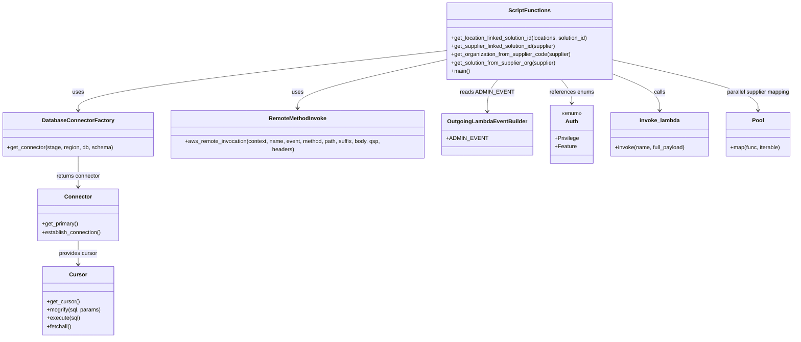

# Diagram: container_tracking_core/container_tracking_service/scripts/visibility_backfill/backfill_CT-2156.py


> Auto-generated by Obscura crawlers

## Diagram 1



### SVG

<svg id="container" width="2272.0234375" xmlns="http://www.w3.org/2000/svg" class="classDiagram" height="976" viewBox="0 0 2272.0234375 976" role="graphics-document document" aria-roledescription="class"><style>#container{font-family:"trebuchet ms",verdana,arial,sans-serif;font-size:16px;fill:#333;}@keyframes edge-animation-frame{from{stroke-dashoffset:0;}}@keyframes dash{to{stroke-dashoffset:0;}}#container .edge-animation-slow{stroke-dasharray:9,5!important;stroke-dashoffset:900;animation:dash 50s linear infinite;stroke-linecap:round;}#container .edge-animation-fast{stroke-dasharray:9,5!important;stroke-dashoffset:900;animation:dash 20s linear infinite;stroke-linecap:round;}#container .error-icon{fill:#552222;}#container .error-text{fill:#552222;stroke:#552222;}#container .edge-thickness-normal{stroke-width:1px;}#container .edge-thickness-thick{stroke-width:3.5px;}#container .edge-pattern-solid{stroke-dasharray:0;}#container .edge-thickness-invisible{stroke-width:0;fill:none;}#container .edge-pattern-dashed{stroke-dasharray:3;}#container .edge-pattern-dotted{stroke-dasharray:2;}#container .marker{fill:#333333;stroke:#333333;}#container .marker.cross{stroke:#333333;}#container svg{font-family:"trebuchet ms",verdana,arial,sans-serif;font-size:16px;}#container p{margin:0;}#container g.classGroup text{fill:#9370DB;stroke:none;font-family:"trebuchet ms",verdana,arial,sans-serif;font-size:10px;}#container g.classGroup text .title{font-weight:bolder;}#container .nodeLabel,#container .edgeLabel{color:#131300;}#container .edgeLabel .label rect{fill:#ECECFF;}#container .label text{fill:#131300;}#container .labelBkg{background:#ECECFF;}#container .edgeLabel .label span{background:#ECECFF;}#container .classTitle{font-weight:bolder;}#container .node rect,#container .node circle,#container .node ellipse,#container .node polygon,#container .node path{fill:#ECECFF;stroke:#9370DB;stroke-width:1px;}#container .divider{stroke:#9370DB;stroke-width:1;}#container g.clickable{cursor:pointer;}#container g.classGroup rect{fill:#ECECFF;stroke:#9370DB;}#container g.classGroup line{stroke:#9370DB;stroke-width:1;}#container .classLabel .box{stroke:none;stroke-width:0;fill:#ECECFF;opacity:0.5;}#container .classLabel .label{fill:#9370DB;font-size:10px;}#container .relation{stroke:#333333;stroke-width:1;fill:none;}#container .dashed-line{stroke-dasharray:3;}#container .dotted-line{stroke-dasharray:1 2;}#container #compositionStart,#container .composition{fill:#333333!important;stroke:#333333!important;stroke-width:1;}#container #compositionEnd,#container .composition{fill:#333333!important;stroke:#333333!important;stroke-width:1;}#container #dependencyStart,#container .dependency{fill:#333333!important;stroke:#333333!important;stroke-width:1;}#container #dependencyStart,#container .dependency{fill:#333333!important;stroke:#333333!important;stroke-width:1;}#container #extensionStart,#container .extension{fill:transparent!important;stroke:#333333!important;stroke-width:1;}#container #extensionEnd,#container .extension{fill:transparent!important;stroke:#333333!important;stroke-width:1;}#container #aggregationStart,#container .aggregation{fill:transparent!important;stroke:#333333!important;stroke-width:1;}#container #aggregationEnd,#container .aggregation{fill:transparent!important;stroke:#333333!important;stroke-width:1;}#container #lollipopStart,#container .lollipop{fill:#ECECFF!important;stroke:#333333!important;stroke-width:1;}#container #lollipopEnd,#container .lollipop{fill:#ECECFF!important;stroke:#333333!important;stroke-width:1;}#container .edgeTerminals{font-size:11px;line-height:initial;}#container .classTitleText{text-anchor:middle;font-size:18px;fill:#333;}#container .label-icon{display:inline-block;height:1em;overflow:visible;vertical-align:-0.125em;}#container .node .label-icon path{fill:currentColor;stroke:revert;stroke-width:revert;}#container :root{--mermaid-font-family:"trebuchet ms",verdana,arial,sans-serif;}</style><g><defs><marker id="container_class-aggregationStart" class="marker aggregation class" refX="18" refY="7" markerWidth="190" markerHeight="240" orient="auto"><path d="M 18,7 L9,13 L1,7 L9,1 Z"></path></marker></defs><defs><marker id="container_class-aggregationEnd" class="marker aggregation class" refX="1" refY="7" markerWidth="20" markerHeight="28" orient="auto"><path d="M 18,7 L9,13 L1,7 L9,1 Z"></path></marker></defs><defs><marker id="container_class-extensionStart" class="marker extension class" refX="18" refY="7" markerWidth="190" markerHeight="240" orient="auto"><path d="M 1,7 L18,13 V 1 Z"></path></marker></defs><defs><marker id="container_class-extensionEnd" class="marker extension class" refX="1" refY="7" markerWidth="20" markerHeight="28" orient="auto"><path d="M 1,1 V 13 L18,7 Z"></path></marker></defs><defs><marker id="container_class-compositionStart" class="marker composition class" refX="18" refY="7" markerWidth="190" markerHeight="240" orient="auto"><path d="M 18,7 L9,13 L1,7 L9,1 Z"></path></marker></defs><defs><marker id="container_class-compositionEnd" class="marker composition class" refX="1" refY="7" markerWidth="20" markerHeight="28" orient="auto"><path d="M 18,7 L9,13 L1,7 L9,1 Z"></path></marker></defs><defs><marker id="container_class-dependencyStart" class="marker dependency class" refX="6" refY="7" markerWidth="190" markerHeight="240" orient="auto"><path d="M 5,7 L9,13 L1,7 L9,1 Z"></path></marker></defs><defs><marker id="container_class-dependencyEnd" class="marker dependency class" refX="13" refY="7" markerWidth="20" markerHeight="28" orient="auto"><path d="M 18,7 L9,13 L14,7 L9,1 Z"></path></marker></defs><defs><marker id="container_class-lollipopStart" class="marker lollipop class" refX="13" refY="7" markerWidth="190" markerHeight="240" orient="auto"><circle stroke="black" fill="transparent" cx="7" cy="7" r="6"></circle></marker></defs><defs><marker id="container_class-lollipopEnd" class="marker lollipop class" refX="1" refY="7" markerWidth="190" markerHeight="240" orient="auto"><circle stroke="black" fill="transparent" cx="7" cy="7" r="6"></circle></marker></defs><g class="root"><g class="clusters"></g><g class="edgePaths"><path d="M221.508,451L221.508,460.667C221.508,470.333,221.508,489.667,221.508,504.5C221.508,519.333,221.508,529.667,221.508,534.833L221.508,540" id="id_DatabaseConnectorFactory_Connector_1" class="edge-thickness-normal edge-pattern-solid relation" style=";;;" data-edge="true" data-et="edge" data-id="id_DatabaseConnectorFactory_Connector_1" data-points="W3sieCI6MjIxLjUwNzgxMjUsInkiOjQ1MX0seyJ4IjoyMjEuNTA3ODEyNSwieSI6NTA5fSx7IngiOjIyMS41MDc4MTI1LCJ5Ijo1NDZ9XQ==" marker-end="url(#container_class-dependencyEnd)"></path><path d="M221.508,696L221.508,702.167C221.508,708.333,221.508,720.667,221.508,732C221.508,743.333,221.508,753.667,221.508,758.833L221.508,764" id="id_Connector_Cursor_2" class="edge-thickness-normal edge-pattern-solid relation" style=";;;" data-edge="true" data-et="edge" data-id="id_Connector_Cursor_2" data-points="W3sieCI6MjIxLjUwNzgxMjUsInkiOjY5Nn0seyJ4IjoyMjEuNTA3ODEyNSwieSI6NzMzfSx7IngiOjIyMS41MDc4MTI1LCJ5Ijo3NzB9XQ==" marker-end="url(#container_class-dependencyEnd)"></path><path d="M1269.98,147.017L1095.235,167.014C920.49,187.011,570.999,227.006,396.253,255.669C221.508,284.333,221.508,301.667,221.508,310.333L221.508,319" id="id_ScriptFunctions_DatabaseConnectorFactory_3" class="edge-thickness-normal edge-pattern-solid relation" style=";;;" data-edge="true" data-et="edge" data-id="id_ScriptFunctions_DatabaseConnectorFactory_3" data-points="W3sieCI6MTI2OS45ODA0Njg3NSwieSI6MTQ3LjAxNjc1NzA3Njc1Mzk1fSx7IngiOjIyMS41MDc4MTI1LCJ5IjoyNjd9LHsieCI6MjIxLjUwNzgxMjUsInkiOjMyNX1d" marker-end="url(#container_class-dependencyEnd)"></path><path d="M1269.98,174.008L1201.001,189.507C1132.022,205.006,994.064,236.003,925.085,260.168C856.105,284.333,856.105,301.667,856.105,310.333L856.105,319" id="id_ScriptFunctions_RemoteMethodInvoke_4" class="edge-thickness-normal edge-pattern-solid relation" style=";;;" data-edge="true" data-et="edge" data-id="id_ScriptFunctions_RemoteMethodInvoke_4" data-points="W3sieCI6MTI2OS45ODA0Njg3NSwieSI6MTc0LjAwODM5MTMwMTUxMTZ9LHsieCI6ODU2LjEwNTQ2ODc1LCJ5IjoyNjd9LHsieCI6ODU2LjEwNTQ2ODc1LCJ5IjozMjV9XQ==" marker-end="url(#container_class-dependencyEnd)"></path><path d="M1427.441,230L1422.588,236.167C1417.734,242.333,1408.027,254.667,1403.174,270C1398.32,285.333,1398.32,303.667,1398.32,312.833L1398.32,322" id="id_ScriptFunctions_OutgoingLambdaEventBuilder_5" class="edge-thickness-normal edge-pattern-solid relation" style=";;;" data-edge="true" data-et="edge" data-id="id_ScriptFunctions_OutgoingLambdaEventBuilder_5" data-points="W3sieCI6MTQyNy40NDE0MDYyNSwieSI6MjMwfSx7IngiOjEzOTguMzIwMzEyNSwieSI6MjY3fSx7IngiOjEzOTguMzIwMzEyNSwieSI6MzI4fV0=" marker-end="url(#container_class-dependencyEnd)"></path><path d="M1602.168,230L1607.021,236.167C1611.875,242.333,1621.582,254.667,1626.436,266C1631.289,277.333,1631.289,287.667,1631.289,292.833L1631.289,298" id="id_ScriptFunctions_Auth_6" class="edge-thickness-normal edge-pattern-solid relation" style=";;;" data-edge="true" data-et="edge" data-id="id_ScriptFunctions_Auth_6" data-points="W3sieCI6MTYwMi4xNjc5Njg3NSwieSI6MjMwfSx7IngiOjE2MzEuMjg5MDYyNSwieSI6MjY3fSx7IngiOjE2MzEuMjg5MDYyNSwieSI6MzA0fV0=" marker-end="url(#container_class-dependencyEnd)"></path><path d="M1759.629,216.814L1780.564,225.178C1801.5,233.543,1843.371,250.271,1864.307,267.302C1885.242,284.333,1885.242,301.667,1885.242,310.333L1885.242,319" id="id_ScriptFunctions_invoke_lambda_7" class="edge-thickness-normal edge-pattern-solid relation" style=";;;" data-edge="true" data-et="edge" data-id="id_ScriptFunctions_invoke_lambda_7" data-points="W3sieCI6MTc1OS42Mjg5MDYyNSwieSI6MjE2LjgxNDAyOTAxOTc0MDJ9LHsieCI6MTg4NS4yNDIxODc1LCJ5IjoyNjd9LHsieCI6MTg4NS4yNDIxODc1LCJ5IjozMjV9XQ==" marker-end="url(#container_class-dependencyEnd)"></path><path d="M1759.629,174.255L1828.118,189.713C1896.607,205.17,2033.585,236.085,2102.074,260.209C2170.563,284.333,2170.563,301.667,2170.563,310.333L2170.563,319" id="id_ScriptFunctions_Pool_8" class="edge-thickness-normal edge-pattern-solid relation" style=";;;" data-edge="true" data-et="edge" data-id="id_ScriptFunctions_Pool_8" data-points="W3sieCI6MTc1OS42Mjg5MDYyNSwieSI6MTc0LjI1NTEzMTgyNTA1OTI3fSx7IngiOjIxNzAuNTYyNSwieSI6MjY3fSx7IngiOjIxNzAuNTYyNSwieSI6MzI1fV0=" marker-end="url(#container_class-dependencyEnd)"></path></g><g class="edgeLabels"><g class="edgeLabel" transform="translate(221.5078125, 509)"><g class="label" data-id="id_DatabaseConnectorFactory_Connector_1" transform="translate(-64.8125, -12)"><foreignObject width="129.625" height="24"><div xmlns="http://www.w3.org/1999/xhtml" class="labelBkg" style="display: table-cell; white-space: nowrap; line-height: 1.5; max-width: 200px; text-align: center;"><span class="edgeLabel"><p>returns connector</p></span></div></foreignObject></g></g><g class="edgeLabel" transform="translate(221.5078125, 733)"><g class="label" data-id="id_Connector_Cursor_2" transform="translate(-56.296875, -12)"><foreignObject width="112.59375" height="24"><div xmlns="http://www.w3.org/1999/xhtml" class="labelBkg" style="display: table-cell; white-space: nowrap; line-height: 1.5; max-width: 200px; text-align: center;"><span class="edgeLabel"><p>provides cursor</p></span></div></foreignObject></g></g><g class="edgeLabel" transform="translate(221.5078125, 267)"><g class="label" data-id="id_ScriptFunctions_DatabaseConnectorFactory_3" transform="translate(-16.4921875, -12)"><foreignObject width="32.984375" height="24"><div xmlns="http://www.w3.org/1999/xhtml" class="labelBkg" style="display: table-cell; white-space: nowrap; line-height: 1.5; max-width: 200px; text-align: center;"><span class="edgeLabel"><p>uses</p></span></div></foreignObject></g></g><g class="edgeLabel" transform="translate(856.10546875, 267)"><g class="label" data-id="id_ScriptFunctions_RemoteMethodInvoke_4" transform="translate(-16.4921875, -12)"><foreignObject width="32.984375" height="24"><div xmlns="http://www.w3.org/1999/xhtml" class="labelBkg" style="display: table-cell; white-space: nowrap; line-height: 1.5; max-width: 200px; text-align: center;"><span class="edgeLabel"><p>uses</p></span></div></foreignObject></g></g><g class="edgeLabel" transform="translate(1398.3203125, 267)"><g class="label" data-id="id_ScriptFunctions_OutgoingLambdaEventBuilder_5" transform="translate(-72.6171875, -12)"><foreignObject width="145.234375" height="24"><div xmlns="http://www.w3.org/1999/xhtml" class="labelBkg" style="display: table-cell; white-space: nowrap; line-height: 1.5; max-width: 200px; text-align: center;"><span class="edgeLabel"><p>reads ADMIN_EVENT</p></span></div></foreignObject></g></g><g class="edgeLabel" transform="translate(1631.2890625, 267)"><g class="label" data-id="id_ScriptFunctions_Auth_6" transform="translate(-64.2421875, -12)"><foreignObject width="128.484375" height="24"><div xmlns="http://www.w3.org/1999/xhtml" class="labelBkg" style="display: table-cell; white-space: nowrap; line-height: 1.5; max-width: 200px; text-align: center;"><span class="edgeLabel"><p>references enums</p></span></div></foreignObject></g></g><g class="edgeLabel" transform="translate(1885.2421875, 267)"><g class="label" data-id="id_ScriptFunctions_invoke_lambda_7" transform="translate(-16.4453125, -12)"><foreignObject width="32.890625" height="24"><div xmlns="http://www.w3.org/1999/xhtml" class="labelBkg" style="display: table-cell; white-space: nowrap; line-height: 1.5; max-width: 200px; text-align: center;"><span class="edgeLabel"><p>calls</p></span></div></foreignObject></g></g><g class="edgeLabel" transform="translate(2170.5625, 267)"><g class="label" data-id="id_ScriptFunctions_Pool_8" transform="translate(-93.4609375, -12)"><foreignObject width="186.921875" height="24"><div xmlns="http://www.w3.org/1999/xhtml" class="labelBkg" style="display: table-cell; white-space: nowrap; line-height: 1.5; max-width: 200px; text-align: center;"><span class="edgeLabel"><p>parallel supplier mapping</p></span></div></foreignObject></g></g></g><g class="nodes"><g class="node default" id="classId-DatabaseConnectorFactory-0" transform="translate(221.5078125, 388)"><g class="basic label-container"><path d="M-213.5078125 -63 L213.5078125 -63 L213.5078125 63 L-213.5078125 63" stroke="none" stroke-width="0" fill="#ECECFF" style=""></path><path d="M-213.5078125 -63 C-98.80759014484052 -63, 15.892632210318965 -63, 213.5078125 -63 M-213.5078125 -63 C-92.75398686981359 -63, 27.999838760372825 -63, 213.5078125 -63 M213.5078125 -63 C213.5078125 -22.03030633414138, 213.5078125 18.939387331717242, 213.5078125 63 M213.5078125 -63 C213.5078125 -28.37354019973604, 213.5078125 6.2529196005279175, 213.5078125 63 M213.5078125 63 C100.32173502174875 63, -12.864342456502499 63, -213.5078125 63 M213.5078125 63 C93.94654289351689 63, -25.614726712966217 63, -213.5078125 63 M-213.5078125 63 C-213.5078125 26.950195145293193, -213.5078125 -9.099609709413613, -213.5078125 -63 M-213.5078125 63 C-213.5078125 29.627136950876668, -213.5078125 -3.7457260982466636, -213.5078125 -63" stroke="#9370DB" stroke-width="1.3" fill="none" stroke-dasharray="0 0" style=""></path></g><g class="annotation-group text" transform="translate(0, -39)"></g><g class="label-group text" transform="translate(-98.1875, -39)"><g class="label" style="font-weight: bolder" transform="translate(0,-12)"><foreignObject width="196.375" height="24"><div xmlns="http://www.w3.org/1999/xhtml" style="display: table-cell; white-space: nowrap; line-height: 1.5; max-width: 244px; text-align: center;"><span class="nodeLabel markdown-node-label" style=""><p>DatabaseConnectorFactory</p></span></div></foreignObject></g></g><g class="members-group text" transform="translate(-201.5078125, 9)"></g><g class="methods-group text" transform="translate(-201.5078125, 39)"><g class="label" style="" transform="translate(0,-12)"><foreignObject width="304.828125" height="24"><div xmlns="http://www.w3.org/1999/xhtml" style="display: table-cell; white-space: nowrap; line-height: 1.5; max-width: 362px; text-align: center;"><span class="nodeLabel markdown-node-label" style=""><p>+get_connector(stage, region, db, schema)</p></span></div></foreignObject></g></g><g class="divider" style=""><path d="M-213.5078125 -15 C-77.25265977878672 -15, 59.00249294242656 -15, 213.5078125 -15 M-213.5078125 -15 C-64.12114119314228 -15, 85.26553011371544 -15, 213.5078125 -15" stroke="#9370DB" stroke-width="1.3" fill="none" stroke-dasharray="0 0" style=""></path></g><g class="divider" style=""><path d="M-213.5078125 9 C-121.285966332575 9, -29.06412016515 9, 213.5078125 9 M-213.5078125 9 C-79.6651148856092 9, 54.1775827287816 9, 213.5078125 9" stroke="#9370DB" stroke-width="1.3" fill="none" stroke-dasharray="0 0" style=""></path></g></g><g class="node default" id="classId-Connector-1" transform="translate(221.5078125, 621)"><g class="basic label-container"><path d="M-117.34375 -75 L117.34375 -75 L117.34375 75 L-117.34375 75" stroke="none" stroke-width="0" fill="#ECECFF" style=""></path><path d="M-117.34375 -75 C-44.053400630887026 -75, 29.236948738225948 -75, 117.34375 -75 M-117.34375 -75 C-33.022423492209626 -75, 51.29890301558075 -75, 117.34375 -75 M117.34375 -75 C117.34375 -33.05612149563926, 117.34375 8.88775700872148, 117.34375 75 M117.34375 -75 C117.34375 -22.60549650417675, 117.34375 29.789006991646502, 117.34375 75 M117.34375 75 C47.18801390418432 75, -22.967722191631367 75, -117.34375 75 M117.34375 75 C42.24025914959017 75, -32.863231700819654 75, -117.34375 75 M-117.34375 75 C-117.34375 32.10433190556212, -117.34375 -10.79133618887576, -117.34375 -75 M-117.34375 75 C-117.34375 44.07335104746785, -117.34375 13.146702094935698, -117.34375 -75" stroke="#9370DB" stroke-width="1.3" fill="none" stroke-dasharray="0 0" style=""></path></g><g class="annotation-group text" transform="translate(0, -51)"></g><g class="label-group text" transform="translate(-37.421875, -51)"><g class="label" style="font-weight: bolder" transform="translate(0,-12)"><foreignObject width="74.84375" height="24"><div xmlns="http://www.w3.org/1999/xhtml" style="display: table-cell; white-space: nowrap; line-height: 1.5; max-width: 125px; text-align: center;"><span class="nodeLabel markdown-node-label" style=""><p>Connector</p></span></div></foreignObject></g></g><g class="members-group text" transform="translate(-105.34375, -3)"></g><g class="methods-group text" transform="translate(-105.34375, 27)"><g class="label" style="" transform="translate(0,-12)"><foreignObject width="105.890625" height="24"><div xmlns="http://www.w3.org/1999/xhtml" style="display: table-cell; white-space: nowrap; line-height: 1.5; max-width: 163px; text-align: center;"><span class="nodeLabel markdown-node-label" style=""><p>+get_primary()</p></span></div></foreignObject></g><g class="label" style="" transform="translate(0,12)"><foreignObject width="173.265625" height="24"><div xmlns="http://www.w3.org/1999/xhtml" style="display: table-cell; white-space: nowrap; line-height: 1.5; max-width: 231px; text-align: center;"><span class="nodeLabel markdown-node-label" style=""><p>+establish_connection()</p></span></div></foreignObject></g></g><g class="divider" style=""><path d="M-117.34375 -27 C-53.07193619187903 -27, 11.199877616241935 -27, 117.34375 -27 M-117.34375 -27 C-27.128265090142563 -27, 63.087219819714875 -27, 117.34375 -27" stroke="#9370DB" stroke-width="1.3" fill="none" stroke-dasharray="0 0" style=""></path></g><g class="divider" style=""><path d="M-117.34375 -3 C-66.39300446258794 -3, -15.442258925175878 -3, 117.34375 -3 M-117.34375 -3 C-47.19780668601854 -3, 22.948136627962924 -3, 117.34375 -3" stroke="#9370DB" stroke-width="1.3" fill="none" stroke-dasharray="0 0" style=""></path></g></g><g class="node default" id="classId-Cursor-2" transform="translate(221.5078125, 869)"><g class="basic label-container"><path d="M-102.4921875 -99 L102.4921875 -99 L102.4921875 99 L-102.4921875 99" stroke="none" stroke-width="0" fill="#ECECFF" style=""></path><path d="M-102.4921875 -99 C-46.693452639748145 -99, 9.10528222050371 -99, 102.4921875 -99 M-102.4921875 -99 C-27.532015301961096 -99, 47.42815689607781 -99, 102.4921875 -99 M102.4921875 -99 C102.4921875 -36.89681961345295, 102.4921875 25.206360773094104, 102.4921875 99 M102.4921875 -99 C102.4921875 -42.76596354595071, 102.4921875 13.468072908098577, 102.4921875 99 M102.4921875 99 C55.328793718662396 99, 8.165399937324793 99, -102.4921875 99 M102.4921875 99 C43.41138804364384 99, -15.669411412712321 99, -102.4921875 99 M-102.4921875 99 C-102.4921875 40.22659225075193, -102.4921875 -18.546815498496144, -102.4921875 -99 M-102.4921875 99 C-102.4921875 25.85112203237678, -102.4921875 -47.29775593524644, -102.4921875 -99" stroke="#9370DB" stroke-width="1.3" fill="none" stroke-dasharray="0 0" style=""></path></g><g class="annotation-group text" transform="translate(0, -75)"></g><g class="label-group text" transform="translate(-23.90625, -75)"><g class="label" style="font-weight: bolder" transform="translate(0,-12)"><foreignObject width="47.8125" height="24"><div xmlns="http://www.w3.org/1999/xhtml" style="display: table-cell; white-space: nowrap; line-height: 1.5; max-width: 98px; text-align: center;"><span class="nodeLabel markdown-node-label" style=""><p>Cursor</p></span></div></foreignObject></g></g><g class="members-group text" transform="translate(-90.4921875, -27)"></g><g class="methods-group text" transform="translate(-90.4921875, 3)"><g class="label" style="" transform="translate(0,-12)"><foreignObject width="94.640625" height="24"><div xmlns="http://www.w3.org/1999/xhtml" style="display: table-cell; white-space: nowrap; line-height: 1.5; max-width: 152px; text-align: center;"><span class="nodeLabel markdown-node-label" style=""><p>+get_cursor()</p></span></div></foreignObject></g><g class="label" style="" transform="translate(0,12)"><foreignObject width="157.078125" height="24"><div xmlns="http://www.w3.org/1999/xhtml" style="display: table-cell; white-space: nowrap; line-height: 1.5; max-width: 214px; text-align: center;"><span class="nodeLabel markdown-node-label" style=""><p>+mogrify(sql, params)</p></span></div></foreignObject></g><g class="label" style="" transform="translate(0,36)"><foreignObject width="96.0625" height="24"><div xmlns="http://www.w3.org/1999/xhtml" style="display: table-cell; white-space: nowrap; line-height: 1.5; max-width: 153px; text-align: center;"><span class="nodeLabel markdown-node-label" style=""><p>+execute(sql)</p></span></div></foreignObject></g><g class="label" style="" transform="translate(0,60)"><foreignObject width="72.515625" height="24"><div xmlns="http://www.w3.org/1999/xhtml" style="display: table-cell; white-space: nowrap; line-height: 1.5; max-width: 130px; text-align: center;"><span class="nodeLabel markdown-node-label" style=""><p>+fetchall()</p></span></div></foreignObject></g></g><g class="divider" style=""><path d="M-102.4921875 -51 C-60.43023558530823 -51, -18.368283670616464 -51, 102.4921875 -51 M-102.4921875 -51 C-44.776781560470624 -51, 12.938624379058751 -51, 102.4921875 -51" stroke="#9370DB" stroke-width="1.3" fill="none" stroke-dasharray="0 0" style=""></path></g><g class="divider" style=""><path d="M-102.4921875 -27 C-32.972553620321364 -27, 36.54708025935727 -27, 102.4921875 -27 M-102.4921875 -27 C-28.321406200084184 -27, 45.84937509983163 -27, 102.4921875 -27" stroke="#9370DB" stroke-width="1.3" fill="none" stroke-dasharray="0 0" style=""></path></g></g><g class="node default" id="classId-RemoteMethodInvoke-3" transform="translate(856.10546875, 388)"><g class="basic label-container"><path d="M-371.08984375 -63 L371.08984375 -63 L371.08984375 63 L-371.08984375 63" stroke="none" stroke-width="0" fill="#ECECFF" style=""></path><path d="M-371.08984375 -63 C-159.79523883169975 -63, 51.4993660866005 -63, 371.08984375 -63 M-371.08984375 -63 C-96.11395417778482 -63, 178.86193539443036 -63, 371.08984375 -63 M371.08984375 -63 C371.08984375 -21.34168885199341, 371.08984375 20.31662229601318, 371.08984375 63 M371.08984375 -63 C371.08984375 -37.21933000698327, 371.08984375 -11.438660013966533, 371.08984375 63 M371.08984375 63 C155.31293411267234 63, -60.463975524655325 63, -371.08984375 63 M371.08984375 63 C87.83280725969564 63, -195.42422923060872 63, -371.08984375 63 M-371.08984375 63 C-371.08984375 37.051129191652166, -371.08984375 11.102258383304331, -371.08984375 -63 M-371.08984375 63 C-371.08984375 29.673281026311656, -371.08984375 -3.6534379473766876, -371.08984375 -63" stroke="#9370DB" stroke-width="1.3" fill="none" stroke-dasharray="0 0" style=""></path></g><g class="annotation-group text" transform="translate(0, -39)"></g><g class="label-group text" transform="translate(-80.2578125, -39)"><g class="label" style="font-weight: bolder" transform="translate(0,-12)"><foreignObject width="160.515625" height="24"><div xmlns="http://www.w3.org/1999/xhtml" style="display: table-cell; white-space: nowrap; line-height: 1.5; max-width: 209px; text-align: center;"><span class="nodeLabel markdown-node-label" style=""><p>RemoteMethodInvoke</p></span></div></foreignObject></g></g><g class="members-group text" transform="translate(-359.08984375, 9)"></g><g class="methods-group text" transform="translate(-359.08984375, 39)"><g class="label" style="" transform="translate(0,-12)"><foreignObject width="637.921875" height="24"><div xmlns="http://www.w3.org/1999/xhtml" style="display: table-cell; white-space: nowrap; line-height: 1.5; max-width: 695px; text-align: center;"><span class="nodeLabel markdown-node-label" style=""><p>+aws_remote_invocation(context, name, event, method, path, suffix, body, qsp, headers)</p></span></div></foreignObject></g></g><g class="divider" style=""><path d="M-371.08984375 -15 C-81.59445470961589 -15, 207.90093433076822 -15, 371.08984375 -15 M-371.08984375 -15 C-180.46720473003901 -15, 10.15543428992197 -15, 371.08984375 -15" stroke="#9370DB" stroke-width="1.3" fill="none" stroke-dasharray="0 0" style=""></path></g><g class="divider" style=""><path d="M-371.08984375 9 C-82.68712057657598 9, 205.71560259684804 9, 371.08984375 9 M-371.08984375 9 C-168.2156749533886 9, 34.6584938432228 9, 371.08984375 9" stroke="#9370DB" stroke-width="1.3" fill="none" stroke-dasharray="0 0" style=""></path></g></g><g class="node default" id="classId-OutgoingLambdaEventBuilder-4" transform="translate(1398.3203125, 388)"><g class="basic label-container"><path d="M-121.125 -60 L121.125 -60 L121.125 60 L-121.125 60" stroke="none" stroke-width="0" fill="#ECECFF" style=""></path><path d="M-121.125 -60 C-65.40301913004518 -60, -9.681038260090375 -60, 121.125 -60 M-121.125 -60 C-51.86237704801101 -60, 17.400245903977975 -60, 121.125 -60 M121.125 -60 C121.125 -35.12454669381036, 121.125 -10.24909338762071, 121.125 60 M121.125 -60 C121.125 -27.409508596423827, 121.125 5.180982807152347, 121.125 60 M121.125 60 C34.96094754282521 60, -51.20310491434958 60, -121.125 60 M121.125 60 C28.301060618980188 60, -64.52287876203962 60, -121.125 60 M-121.125 60 C-121.125 26.093737121971493, -121.125 -7.812525756057013, -121.125 -60 M-121.125 60 C-121.125 12.665696721566292, -121.125 -34.66860655686742, -121.125 -60" stroke="#9370DB" stroke-width="1.3" fill="none" stroke-dasharray="0 0" style=""></path></g><g class="annotation-group text" transform="translate(0, -36)"></g><g class="label-group text" transform="translate(-109.125, -36)"><g class="label" style="font-weight: bolder" transform="translate(0,-12)"><foreignObject width="218.25" height="24"><div xmlns="http://www.w3.org/1999/xhtml" style="display: table-cell; white-space: nowrap; line-height: 1.5; max-width: 267px; text-align: center;"><span class="nodeLabel markdown-node-label" style=""><p>OutgoingLambdaEventBuilder</p></span></div></foreignObject></g></g><g class="members-group text" transform="translate(-109.125, 12)"><g class="label" style="" transform="translate(0,-12)"><foreignObject width="108.828125" height="24"><div xmlns="http://www.w3.org/1999/xhtml" style="display: table-cell; white-space: nowrap; line-height: 1.5; max-width: 167px; text-align: center;"><span class="nodeLabel markdown-node-label" style=""><p>+ADMIN_EVENT</p></span></div></foreignObject></g></g><g class="methods-group text" transform="translate(-109.125, 60)"></g><g class="divider" style=""><path d="M-121.125 -12 C-25.97588981482575 -12, 69.1732203703485 -12, 121.125 -12 M-121.125 -12 C-33.957459208423 -12, 53.21008158315399 -12, 121.125 -12" stroke="#9370DB" stroke-width="1.3" fill="none" stroke-dasharray="0 0" style=""></path></g><g class="divider" style=""><path d="M-121.125 36 C-25.19658959471056 36, 70.73182081057888 36, 121.125 36 M-121.125 36 C-47.40362360380408 36, 26.317752792391843 36, 121.125 36" stroke="#9370DB" stroke-width="1.3" fill="none" stroke-dasharray="0 0" style=""></path></g></g><g class="node default" id="classId-Auth-5" transform="translate(1631.2890625, 388)"><g class="basic label-container"><path d="M-61.84375 -84 L61.84375 -84 L61.84375 84 L-61.84375 84" stroke="none" stroke-width="0" fill="#ECECFF" style=""></path><path d="M-61.84375 -84 C-30.56544284068075 -84, 0.712864318638502 -84, 61.84375 -84 M-61.84375 -84 C-37.0329417673598 -84, -12.222133534719603 -84, 61.84375 -84 M61.84375 -84 C61.84375 -24.216583505808053, 61.84375 35.566832988383894, 61.84375 84 M61.84375 -84 C61.84375 -32.89174261141664, 61.84375 18.216514777166722, 61.84375 84 M61.84375 84 C30.186511832691743 84, -1.470726334616515 84, -61.84375 84 M61.84375 84 C28.10344113463382 84, -5.636867730732362 84, -61.84375 84 M-61.84375 84 C-61.84375 35.93772480402092, -61.84375 -12.124550391958167, -61.84375 -84 M-61.84375 84 C-61.84375 41.922860725242, -61.84375 -0.1542785495159933, -61.84375 -84" stroke="#9370DB" stroke-width="1.3" fill="none" stroke-dasharray="0 0" style=""></path></g><g class="annotation-group text" transform="translate(-29.53125, -60)"><g class="label" style="" transform="translate(0,-12)"><foreignObject width="59.0625" height="24"><div xmlns="http://www.w3.org/1999/xhtml" style="display: table-cell; white-space: nowrap; line-height: 1.5; max-width: 109px; text-align: center;"><span class="nodeLabel markdown-node-label" style=""><p>«enum»</p></span></div></foreignObject></g></g><g class="label-group text" transform="translate(-17.0078125, -36)"><g class="label" style="font-weight: bolder" transform="translate(0,-12)"><foreignObject width="34.015625" height="24"><div xmlns="http://www.w3.org/1999/xhtml" style="display: table-cell; white-space: nowrap; line-height: 1.5; max-width: 84px; text-align: center;"><span class="nodeLabel markdown-node-label" style=""><p>Auth</p></span></div></foreignObject></g></g><g class="members-group text" transform="translate(-49.84375, 12)"><g class="label" style="" transform="translate(0,-12)"><foreignObject width="70.15625" height="24"><div xmlns="http://www.w3.org/1999/xhtml" style="display: table-cell; white-space: nowrap; line-height: 1.5; max-width: 128px; text-align: center;"><span class="nodeLabel markdown-node-label" style=""><p>+Privilege</p></span></div></foreignObject></g><g class="label" style="" transform="translate(0,12)"><foreignObject width="62.0625" height="24"><div xmlns="http://www.w3.org/1999/xhtml" style="display: table-cell; white-space: nowrap; line-height: 1.5; max-width: 119px; text-align: center;"><span class="nodeLabel markdown-node-label" style=""><p>+Feature</p></span></div></foreignObject></g></g><g class="methods-group text" transform="translate(-49.84375, 84)"></g><g class="divider" style=""><path d="M-61.84375 -12 C-21.211739037805543 -12, 19.420271924388913 -12, 61.84375 -12 M-61.84375 -12 C-35.40936018568519 -12, -8.974970371370368 -12, 61.84375 -12" stroke="#9370DB" stroke-width="1.3" fill="none" stroke-dasharray="0 0" style=""></path></g><g class="divider" style=""><path d="M-61.84375 60 C-24.7677907756565 60, 12.308168448686999 60, 61.84375 60 M-61.84375 60 C-19.645233766813284 60, 22.55328246637343 60, 61.84375 60" stroke="#9370DB" stroke-width="1.3" fill="none" stroke-dasharray="0 0" style=""></path></g></g><g class="node default" id="classId-invoke_lambda-6" transform="translate(1885.2421875, 388)"><g class="basic label-container"><path d="M-142.109375 -63 L142.109375 -63 L142.109375 63 L-142.109375 63" stroke="none" stroke-width="0" fill="#ECECFF" style=""></path><path d="M-142.109375 -63 C-39.42056743171176 -63, 63.26824013657648 -63, 142.109375 -63 M-142.109375 -63 C-69.23789398494243 -63, 3.6335870301151374 -63, 142.109375 -63 M142.109375 -63 C142.109375 -24.31581418964432, 142.109375 14.368371620711358, 142.109375 63 M142.109375 -63 C142.109375 -14.194626329611225, 142.109375 34.61074734077755, 142.109375 63 M142.109375 63 C53.1602791762636 63, -35.7888166474728 63, -142.109375 63 M142.109375 63 C60.049158260986445 63, -22.01105847802711 63, -142.109375 63 M-142.109375 63 C-142.109375 27.139662350694714, -142.109375 -8.720675298610573, -142.109375 -63 M-142.109375 63 C-142.109375 23.689384878408013, -142.109375 -15.621230243183973, -142.109375 -63" stroke="#9370DB" stroke-width="1.3" fill="none" stroke-dasharray="0 0" style=""></path></g><g class="annotation-group text" transform="translate(0, -39)"></g><g class="label-group text" transform="translate(-55.625, -39)"><g class="label" style="font-weight: bolder" transform="translate(0,-12)"><foreignObject width="111.25" height="24"><div xmlns="http://www.w3.org/1999/xhtml" style="display: table-cell; white-space: nowrap; line-height: 1.5; max-width: 160px; text-align: center;"><span class="nodeLabel markdown-node-label" style=""><p>invoke_lambda</p></span></div></foreignObject></g></g><g class="members-group text" transform="translate(-130.109375, 9)"></g><g class="methods-group text" transform="translate(-130.109375, 39)"><g class="label" style="" transform="translate(0,-12)"><foreignObject width="204.59375" height="24"><div xmlns="http://www.w3.org/1999/xhtml" style="display: table-cell; white-space: nowrap; line-height: 1.5; max-width: 262px; text-align: center;"><span class="nodeLabel markdown-node-label" style=""><p>+invoke(name, full_payload)</p></span></div></foreignObject></g></g><g class="divider" style=""><path d="M-142.109375 -15 C-84.13485732467689 -15, -26.160339649353787 -15, 142.109375 -15 M-142.109375 -15 C-48.10829822931643 -15, 45.892778541367136 -15, 142.109375 -15" stroke="#9370DB" stroke-width="1.3" fill="none" stroke-dasharray="0 0" style=""></path></g><g class="divider" style=""><path d="M-142.109375 9 C-68.83019341906063 9, 4.448988161878731 9, 142.109375 9 M-142.109375 9 C-53.224899628275196 9, 35.65957574344961 9, 142.109375 9" stroke="#9370DB" stroke-width="1.3" fill="none" stroke-dasharray="0 0" style=""></path></g></g><g class="node default" id="classId-Pool-7" transform="translate(2170.5625, 388)"><g class="basic label-container"><path d="M-93.2109375 -63 L93.2109375 -63 L93.2109375 63 L-93.2109375 63" stroke="none" stroke-width="0" fill="#ECECFF" style=""></path><path d="M-93.2109375 -63 C-21.086940836716792 -63, 51.037055826566416 -63, 93.2109375 -63 M-93.2109375 -63 C-19.89142835137291 -63, 53.42808079725418 -63, 93.2109375 -63 M93.2109375 -63 C93.2109375 -17.03396933919698, 93.2109375 28.932061321606042, 93.2109375 63 M93.2109375 -63 C93.2109375 -28.997790712685237, 93.2109375 5.0044185746295256, 93.2109375 63 M93.2109375 63 C42.76916965399308 63, -7.672598192013837 63, -93.2109375 63 M93.2109375 63 C54.41360716432786 63, 15.616276828655714 63, -93.2109375 63 M-93.2109375 63 C-93.2109375 30.03660669215597, -93.2109375 -2.9267866156880586, -93.2109375 -63 M-93.2109375 63 C-93.2109375 27.673285831011533, -93.2109375 -7.6534283379769334, -93.2109375 -63" stroke="#9370DB" stroke-width="1.3" fill="none" stroke-dasharray="0 0" style=""></path></g><g class="annotation-group text" transform="translate(0, -39)"></g><g class="label-group text" transform="translate(-16.28125, -39)"><g class="label" style="font-weight: bolder" transform="translate(0,-12)"><foreignObject width="32.5625" height="24"><div xmlns="http://www.w3.org/1999/xhtml" style="display: table-cell; white-space: nowrap; line-height: 1.5; max-width: 83px; text-align: center;"><span class="nodeLabel markdown-node-label" style=""><p>Pool</p></span></div></foreignObject></g></g><g class="members-group text" transform="translate(-81.2109375, 9)"></g><g class="methods-group text" transform="translate(-81.2109375, 39)"><g class="label" style="" transform="translate(0,-12)"><foreignObject width="146.140625" height="24"><div xmlns="http://www.w3.org/1999/xhtml" style="display: table-cell; white-space: nowrap; line-height: 1.5; max-width: 204px; text-align: center;"><span class="nodeLabel markdown-node-label" style=""><p>+map(func, iterable)</p></span></div></foreignObject></g></g><g class="divider" style=""><path d="M-93.2109375 -15 C-49.36653940473242 -15, -5.522141309464843 -15, 93.2109375 -15 M-93.2109375 -15 C-53.39937181835452 -15, -13.587806136709034 -15, 93.2109375 -15" stroke="#9370DB" stroke-width="1.3" fill="none" stroke-dasharray="0 0" style=""></path></g><g class="divider" style=""><path d="M-93.2109375 9 C-28.779118268903062 9, 35.652700962193876 9, 93.2109375 9 M-93.2109375 9 C-19.10964428570456 9, 54.99164892859088 9, 93.2109375 9" stroke="#9370DB" stroke-width="1.3" fill="none" stroke-dasharray="0 0" style=""></path></g></g><g class="node default" id="classId-ScriptFunctions-8" transform="translate(1514.8046875, 119)"><g class="basic label-container"><path d="M-244.82421875 -111 L244.82421875 -111 L244.82421875 111 L-244.82421875 111" stroke="none" stroke-width="0" fill="#ECECFF" style=""></path><path d="M-244.82421875 -111 C-51.29987364447865 -111, 142.2244714610427 -111, 244.82421875 -111 M-244.82421875 -111 C-80.30993027472138 -111, 84.20435820055724 -111, 244.82421875 -111 M244.82421875 -111 C244.82421875 -58.060110897293434, 244.82421875 -5.120221794586868, 244.82421875 111 M244.82421875 -111 C244.82421875 -29.98147944421997, 244.82421875 51.03704111156006, 244.82421875 111 M244.82421875 111 C53.4142104245158 111, -137.9957979009684 111, -244.82421875 111 M244.82421875 111 C55.1219831509047 111, -134.5802524481906 111, -244.82421875 111 M-244.82421875 111 C-244.82421875 44.152182182856876, -244.82421875 -22.695635634286248, -244.82421875 -111 M-244.82421875 111 C-244.82421875 24.244184493575503, -244.82421875 -62.511631012848994, -244.82421875 -111" stroke="#9370DB" stroke-width="1.3" fill="none" stroke-dasharray="0 0" style=""></path></g><g class="annotation-group text" transform="translate(0, -87)"></g><g class="label-group text" transform="translate(-56.8671875, -87)"><g class="label" style="font-weight: bolder" transform="translate(0,-12)"><foreignObject width="113.734375" height="24"><div xmlns="http://www.w3.org/1999/xhtml" style="display: table-cell; white-space: nowrap; line-height: 1.5; max-width: 162px; text-align: center;"><span class="nodeLabel markdown-node-label" style=""><p>ScriptFunctions</p></span></div></foreignObject></g></g><g class="members-group text" transform="translate(-232.82421875, -39)"></g><g class="methods-group text" transform="translate(-232.82421875, -9)"><g class="label" style="" transform="translate(0,-12)"><foreignObject width="408.78125" height="24"><div xmlns="http://www.w3.org/1999/xhtml" style="display: table-cell; white-space: nowrap; line-height: 1.5; max-width: 466px; text-align: center;"><span class="nodeLabel markdown-node-label" style=""><p>+get_location_linked_solution_id(locations, solution_id)</p></span></div></foreignObject></g><g class="label" style="" transform="translate(0,12)"><foreignObject width="311.359375" height="24"><div xmlns="http://www.w3.org/1999/xhtml" style="display: table-cell; white-space: nowrap; line-height: 1.5; max-width: 369px; text-align: center;"><span class="nodeLabel markdown-node-label" style=""><p>+get_supplier_linked_solution_id(supplier)</p></span></div></foreignObject></g><g class="label" style="" transform="translate(0,36)"><foreignObject width="351.15625" height="24"><div xmlns="http://www.w3.org/1999/xhtml" style="display: table-cell; white-space: nowrap; line-height: 1.5; max-width: 409px; text-align: center;"><span class="nodeLabel markdown-node-label" style=""><p>+get_organization_from_supplier_code(supplier)</p></span></div></foreignObject></g><g class="label" style="" transform="translate(0,60)"><foreignObject width="309.59375" height="24"><div xmlns="http://www.w3.org/1999/xhtml" style="display: table-cell; white-space: nowrap; line-height: 1.5; max-width: 367px; text-align: center;"><span class="nodeLabel markdown-node-label" style=""><p>+get_solution_from_supplier_org(supplier)</p></span></div></foreignObject></g><g class="label" style="" transform="translate(0,84)"><foreignObject width="54.65625" height="24"><div xmlns="http://www.w3.org/1999/xhtml" style="display: table-cell; white-space: nowrap; line-height: 1.5; max-width: 112px; text-align: center;"><span class="nodeLabel markdown-node-label" style=""><p>+main()</p></span></div></foreignObject></g></g><g class="divider" style=""><path d="M-244.82421875 -63 C-116.7695071911485 -63, 11.285204367702988 -63, 244.82421875 -63 M-244.82421875 -63 C-72.52698042762847 -63, 99.77025789474305 -63, 244.82421875 -63" stroke="#9370DB" stroke-width="1.3" fill="none" stroke-dasharray="0 0" style=""></path></g><g class="divider" style=""><path d="M-244.82421875 -39 C-68.95292576405379 -39, 106.91836722189242 -39, 244.82421875 -39 M-244.82421875 -39 C-95.3631713671266 -39, 54.097876015746806 -39, 244.82421875 -39" stroke="#9370DB" stroke-width="1.3" fill="none" stroke-dasharray="0 0" style=""></path></g></g></g></g></g></svg>

## Diagram 2

```mermaid
flowchart TD
Start([Start]) --> Connect[Establish DB connection via DatabaseConnectorFactory]
Connect --> ForEach{Iterate solutions in SOLUTION_TO_ORG_MAPPING}
ForEach --> PrepareSQL[Prepare ID_LOC_SUPPLIER_SQL with solution_id (cursor.mogrify)]
PrepareSQL --> ExecuteSQL[Execute SQL -> values = cursor.execute(sql).fetchall()]
ExecuteSQL --> CheckPart0{values[0][0] exists?}
ExecuteSQL --> CheckPart1{values[1][0] exists?}
ExecuteSQL --> CheckPart2{values[2][0] exists?}
CheckPart0 -- yes --> BuildPart0[Create inserts for SOLUTION level]
CheckPart0 -- no --> Skip0[Skip SOLUTION inserts]
CheckPart1 -- yes --> SupplierPool[Use Pool.map to call get_supplier_linked_solution_id for suppliers]
SupplierPool --> AggregateSuppliers[Aggregate supplier -> solutions mapping]
AggregateSuppliers --> BuildPart1[Create inserts for SUPPLIER level using mapping]
CheckPart1 -- no --> Skip1[Skip SUPPLIER inserts]
CheckPart2 -- yes --> CallLocationAPI[Call get_location_linked_solution_id(locations, solution_id)]
CallLocationAPI --> BuildPart2[Create inserts for LOCATION level using mapping]
CheckPart2 -- no --> Skip2[Skip LOCATION inserts]
BuildPart0 --> Combine[Combine all inserts]
BuildPart1 --> Combine
BuildPart2 --> Combine
Skip0 --> Combine
Skip1 --> Combine
Skip2 --> Combine
Combine --> HasInserts{inserts non-empty?}
HasInserts -- yes --> InsertDB[INSERT INTO visibility_grant ... ON CONFLICT DO NOTHING]
InsertDB --> FetchResult[Execute insert SQL and fetch results]
FetchResult --> LogEnd[Print end creating visibility for solution_id]
HasInserts -- no --> LogEnd
LogEnd --> NextSolution{More solutions?}
NextSolution -- yes --> ForEach
NextSolution -- no --> Finish([Finish main])
```

> SVG rendering failed for this diagram.
