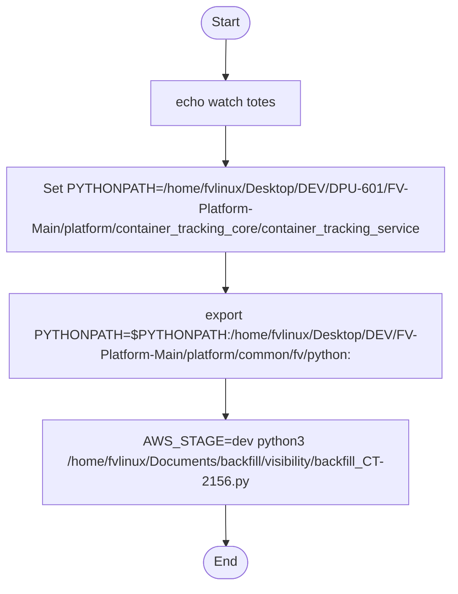

# Diagram: container_tracking_core/container_tracking_service/scripts/visibility_backfill/backfill_CT-2156.sh

> Auto-generated by Obscura crawlers

## Mermaid

### SVG

<svg id="container" width="563.40625" xmlns="http://www.w3.org/2000/svg" class="flowchart" height="704" viewBox="0 0 563.40625 704" role="graphics-document document" aria-roledescription="flowchart-v2"><g><marker id="container_flowchart-v2-pointEnd" class="marker flowchart-v2" viewBox="0 0 10 10" refX="5" refY="5" markerUnits="userSpaceOnUse" markerWidth="8" markerHeight="8" orient="auto"><path d="M 0 0 L 10 5 L 0 10 z" class="arrowMarkerPath" style="stroke-width: 1; stroke-dasharray: 1, 0;"></path></marker><marker id="container_flowchart-v2-pointStart" class="marker flowchart-v2" viewBox="0 0 10 10" refX="4.5" refY="5" markerUnits="userSpaceOnUse" markerWidth="8" markerHeight="8" orient="auto"><path d="M 0 5 L 10 10 L 10 0 z" class="arrowMarkerPath" style="stroke-width: 1; stroke-dasharray: 1, 0;"></path></marker><marker id="container_flowchart-v2-circleEnd" class="marker flowchart-v2" viewBox="0 0 10 10" refX="11" refY="5" markerUnits="userSpaceOnUse" markerWidth="11" markerHeight="11" orient="auto"><circle cx="5" cy="5" r="5" class="arrowMarkerPath" style="stroke-width: 1; stroke-dasharray: 1, 0;"></circle></marker><marker id="container_flowchart-v2-circleStart" class="marker flowchart-v2" viewBox="0 0 10 10" refX="-1" refY="5" markerUnits="userSpaceOnUse" markerWidth="11" markerHeight="11" orient="auto"><circle cx="5" cy="5" r="5" class="arrowMarkerPath" style="stroke-width: 1; stroke-dasharray: 1, 0;"></circle></marker><marker id="container_flowchart-v2-crossEnd" class="marker cross flowchart-v2" viewBox="0 0 11 11" refX="12" refY="5.2" markerUnits="userSpaceOnUse" markerWidth="11" markerHeight="11" orient="auto"><path d="M 1,1 l 9,9 M 10,1 l -9,9" class="arrowMarkerPath" style="stroke-width: 2; stroke-dasharray: 1, 0;"></path></marker><marker id="container_flowchart-v2-crossStart" class="marker cross flowchart-v2" viewBox="0 0 11 11" refX="-1" refY="5.2" markerUnits="userSpaceOnUse" markerWidth="11" markerHeight="11" orient="auto"><path d="M 1,1 l 9,9 M 10,1 l -9,9" class="arrowMarkerPath" style="stroke-width: 2; stroke-dasharray: 1, 0;"></path></marker><g class="root"><g class="clusters"></g><g class="edgePaths"><path d="M282.203,47.5L282.12,51.583C282.036,55.667,281.87,63.833,281.786,71.417C281.703,79,281.703,86,281.703,89.5L281.703,93" id="L_Start_Echo_0" class="edge-thickness-normal edge-pattern-solid edge-thickness-normal edge-pattern-solid flowchart-link" style=";" data-edge="true" data-et="edge" data-id="L_Start_Echo_0" data-points="W3sieCI6MjgyLjIwMzEyNSwieSI6NDcuNX0seyJ4IjoyODEuNzAzMTI1LCJ5Ijo3Mn0seyJ4IjoyODEuNzAzMTI1LCJ5Ijo5N31d" marker-end="url(#container_flowchart-v2-pointEnd)"></path><path d="M281.703,151L281.703,155.167C281.703,159.333,281.703,167.667,281.703,175.333C281.703,183,281.703,190,281.703,193.5L281.703,197" id="L_Echo_SetPY_0" class="edge-thickness-normal edge-pattern-solid edge-thickness-normal edge-pattern-solid flowchart-link" style=";" data-edge="true" data-et="edge" data-id="L_Echo_SetPY_0" data-points="W3sieCI6MjgxLjcwMzEyNSwieSI6MTUxfSx7IngiOjI4MS43MDMxMjUsInkiOjE3Nn0seyJ4IjoyODEuNzAzMTI1LCJ5IjoyMDF9XQ==" marker-end="url(#container_flowchart-v2-pointEnd)"></path><path d="M281.703,303L281.703,307.167C281.703,311.333,281.703,319.667,281.703,327.333C281.703,335,281.703,342,281.703,345.5L281.703,349" id="L_SetPY_ExportPY_0" class="edge-thickness-normal edge-pattern-solid edge-thickness-normal edge-pattern-solid flowchart-link" style=";" data-edge="true" data-et="edge" data-id="L_SetPY_ExportPY_0" data-points="W3sieCI6MjgxLjcwMzEyNSwieSI6MzAzfSx7IngiOjI4MS43MDMxMjUsInkiOjMyOH0seyJ4IjoyODEuNzAzMTI1LCJ5IjozNTN9XQ==" marker-end="url(#container_flowchart-v2-pointEnd)"></path><path d="M281.703,455L281.703,459.167C281.703,463.333,281.703,471.667,281.703,479.333C281.703,487,281.703,494,281.703,497.5L281.703,501" id="L_ExportPY_Run_0" class="edge-thickness-normal edge-pattern-solid edge-thickness-normal edge-pattern-solid flowchart-link" style=";" data-edge="true" data-et="edge" data-id="L_ExportPY_Run_0" data-points="W3sieCI6MjgxLjcwMzEyNSwieSI6NDU1fSx7IngiOjI4MS43MDMxMjUsInkiOjQ4MH0seyJ4IjoyODEuNzAzMTI1LCJ5Ijo1MDV9XQ==" marker-end="url(#container_flowchart-v2-pointEnd)"></path><path d="M281.703,607L281.703,611.167C281.703,615.333,281.703,623.667,281.773,631.417C281.844,639.167,281.984,646.334,282.054,649.917L282.125,653.501" id="L_Run_End_0" class="edge-thickness-normal edge-pattern-solid edge-thickness-normal edge-pattern-solid flowchart-link" style=";" data-edge="true" data-et="edge" data-id="L_Run_End_0" data-points="W3sieCI6MjgxLjcwMzEyNSwieSI6NjA3fSx7IngiOjI4MS43MDMxMjUsInkiOjYzMn0seyJ4IjoyODIuMjAzMTI1LCJ5Ijo2NTcuNX1d" marker-end="url(#container_flowchart-v2-pointEnd)"></path></g><g class="edgeLabels"><g class="edgeLabel"><g class="label" data-id="L_Start_Echo_0" transform="translate(0, 0)"><foreignObject width="0" height="0">

</foreignObject></g></g><g class="edgeLabel"><g class="label" data-id="L_Echo_SetPY_0" transform="translate(0, 0)"><foreignObject width="0" height="0">

</foreignObject></g></g><g class="edgeLabel"><g class="label" data-id="L_SetPY_ExportPY_0" transform="translate(0, 0)"><foreignObject width="0" height="0">

</foreignObject></g></g><g class="edgeLabel"><g class="label" data-id="L_ExportPY_Run_0" transform="translate(0, 0)"><foreignObject width="0" height="0">

</foreignObject></g></g><g class="edgeLabel"><g class="label" data-id="L_Run_End_0" transform="translate(0, 0)"><foreignObject width="0" height="0">

</foreignObject></g></g></g><g class="nodes"><g class="node default" id="flowchart-Start-0" transform="translate(281.703125, 27.5)"><g class="basic label-container outer-path"><path d="M-10.3984375 -19.5 C-5.690951933417936 -19.5, -0.9834663668358719 -19.5, 10.3984375 -19.5 C10.3984375 -19.5, 10.3984375 -19.5, 10.398437499999998 -19.5 C10.665863314497361 -19.49142417464184, 10.933289128994726 -19.48284834928368, 11.6478067896239 -19.45993515863156 C11.979103777006374 -19.427975336701692, 12.310400764388847 -19.396015514771825, 12.892042152847864 -19.3399052695533 C13.246977410378001 -19.28252208967986, 13.601912667908138 -19.225138909806418, 14.126030759676757 -19.140403561325776 C14.523869043280095 -19.049599569230736, 14.921707326883434 -18.958795577135696, 15.34470188623539 -18.862249829261074 C15.60107535718026 -18.786159528816448, 15.857448828125133 -18.710069228371818, 16.543047751460602 -18.50658706670804 C16.910675200069452 -18.3712967673091, 17.278302648678306 -18.23600646791016, 17.716144095147794 -18.074876768247425 C18.025286304735367 -17.93802868244083, 18.33442851432294 -17.801180596634232, 18.85917041279238 -17.568892924097174 C19.254163308164948 -17.36282538358633, 19.649156203537512 -17.15675784307549, 19.967429764076783 -16.990714730406097 C20.276110155046858 -16.80359086339271, 20.58479054601693 -16.61646699637932, 21.036368073605697 -16.342718045390892 C21.257253692765737 -16.188637799449193, 21.478139311925773 -16.03455755350749, 22.061592844578712 -15.627565626425154 C22.302390443795353 -15.435535948943112, 22.543188043011995 -15.24350627146107, 23.03889120850187 -14.848196188198123 C23.25625369008009 -14.650793333524895, 23.473616171658314 -14.453390478851667, 23.964247236767985 -14.007812326905688 C24.15973008553667 -13.80596023611166, 24.35521293430535 -13.604108145317632, 24.833858442968648 -13.10986736009568 C25.003325207568576 -12.910802055464528, 25.172791972168508 -12.711736750833373, 25.644151408126582 -12.158051136245305 C25.90163071131625 -11.81305232681822, 26.15911001450592 -11.468053517391134, 26.391796464640635 -11.156274872382312 C26.57886942802737 -10.868880564495898, 26.765942391414104 -10.581486256609484, 27.073721378604247 -10.108655082055241 C27.25285744069393 -9.790580864321745, 27.431993502783612 -9.472506646588249, 27.6871239742735 -9.019496659696287 C27.891963405201015 -8.594143198513605, 28.09680283612853 -8.168789737330922, 28.22948364880834 -7.893275190886684 C28.37095558454168 -7.543836774451531, 28.51242752027502 -7.194398358016379, 28.698571729970325 -6.734618561215508 C28.797794480849817 -6.435775444564929, 28.897017231729308 -6.136932327914351, 29.09246063421488 -5.548287939305138 C29.184060231232642 -5.198978976359941, 29.275659828250404 -4.849670013414745, 29.40953178754556 -4.339158212148133 C29.484700149228956 -3.953184561742762, 29.559868510912352 -3.5672109113373907, 29.648482276581777 -3.1121979531509023 C29.70240816706956 -2.693959395399211, 29.756334057557343 -2.27572083764752, 29.808330202509367 -1.872449005199798 C29.829049844811863 -1.5497238517441607, 29.84976948711436 -1.2269986982885233, 29.888418715913414 -0.6250057626472757 C29.888418715913414 -0.33923961845322353, 29.888418715913414 -0.05347347425917137, 29.888418715913414 0.625005762647271 C29.87177470257026 0.8842497052726648, 29.855130689227106 1.1434936478980584, 29.808330202509367 1.8724490051997846 C29.76095431333497 2.239887046208916, 29.713578424160573 2.6073250872180473, 29.648482276581777 3.1121979531508885 C29.5821182825085 3.452963036682057, 29.51575428843522 3.7937281202132254, 29.40953178754556 4.339158212148129 C29.311648287301086 4.712430421557674, 29.21376478705661 5.08570263096722, 29.092460634214884 5.548287939305125 C29.004964879024865 5.811811213382038, 28.917469123834845 6.07533448745895, 28.69857172997033 6.734618561215495 C28.548140031295638 7.10618776534102, 28.397708332620947 7.4777569694665456, 28.229483648808344 7.893275190886679 C28.029622056514256 8.308292063638373, 27.829760464220165 8.723308936390065, 27.687123974273504 9.019496659696284 C27.45283292625999 9.435504139985492, 27.218541878246473 9.851511620274701, 27.07372137860425 10.108655082055236 C26.83308850212128 10.478331799307924, 26.59245562563831 10.848008516560613, 26.39179646464064 11.156274872382301 C26.210291569046568 11.399474897042207, 26.02878667345249 11.642674921702115, 25.644151408126582 12.158051136245302 C25.480741515513294 12.350001694395166, 25.31733162290001 12.541952252545032, 24.83385844296866 13.10986736009567 C24.513613421370042 13.440546637501491, 24.193368399771426 13.77122591490731, 23.96424723676799 14.007812326905684 C23.70418403930324 14.243994841948027, 23.44412084183849 14.480177356990371, 23.038891208501887 14.848196188198111 C22.800643859394633 15.038192109082923, 22.562396510287375 15.228188029967736, 22.061592844578715 15.627565626425152 C21.77932976677067 15.824460130532342, 21.497066688962622 16.021354634639533, 21.036368073605708 16.34271804539089 C20.718854256016648 16.53519678753168, 20.401340438427585 16.727675529672478, 19.967429764076787 16.990714730406093 C19.66146313580707 17.150337324393426, 19.355496507537357 17.309959918380756, 18.859170412792388 17.56889292409717 C18.43925088690817 17.754778841735956, 18.019331361023955 17.940664759374744, 17.716144095147804 18.07487676824742 C17.378549247514453 18.199114792869057, 17.0409543998811 18.32335281749069, 16.543047751460616 18.506587066708033 C16.13237607122236 18.62847226574311, 15.721704390984103 18.750357464778187, 15.344701886235413 18.86224982926107 C14.85983415844181 18.97291772407234, 14.374966430648207 19.083585618883607, 14.126030759676766 19.140403561325773 C13.717326628612714 19.206479675688335, 13.308622497548662 19.272555790050898, 12.892042152847878 19.3399052695533 C12.501777125325177 19.377553667396047, 12.111512097802477 19.415202065238798, 11.6478067896239 19.45993515863156 C11.39137334547152 19.468158480068105, 11.13493990131914 19.476381801504655, 10.398437500000004 19.5 C10.398437500000004 19.5, 10.398437500000002 19.5, 10.3984375 19.5 C3.5192348739803414 19.5, -3.359967752039317 19.5, -10.398437499999996 19.5 C-10.691556754519954 19.49060023602956, -10.98467600903991 19.481200472059125, -11.647806789623893 19.45993515863156 C-12.08430288046851 19.417826905711134, -12.520798971313129 19.375718652790706, -12.892042152847871 19.3399052695533 C-13.151389318036452 19.297976031152913, -13.410736483225035 19.256046792752528, -14.126030759676759 19.140403561325773 C-14.583287542169922 19.036037684601073, -15.040544324663085 18.931671807876373, -15.344701886235388 18.862249829261074 C-15.588590997220772 18.78986482132068, -15.832480108206155 18.717479813380287, -16.54304775146059 18.506587066708043 C-16.785436684728154 18.417385698646843, -17.02782561799572 18.328184330585643, -17.716144095147797 18.074876768247425 C-18.12844213941033 17.892364654439337, -18.54074018367286 17.709852540631253, -18.85917041279238 17.568892924097174 C-19.14615329180201 17.41917413993916, -19.433136170811633 17.269455355781144, -19.96742976407678 16.990714730406097 C-20.30318443466843 16.78717827597998, -20.638939105260086 16.583641821553865, -21.036368073605686 16.3427180453909 C-21.406013360496452 16.08486949494247, -21.775658647387218 15.827020944494043, -22.061592844578712 15.627565626425156 C-22.398411169147934 15.358961975693244, -22.735229493717156 15.090358324961334, -23.03889120850187 14.848196188198125 C-23.328199815013136 14.585453766450856, -23.617508421524406 14.322711344703588, -23.964247236767974 14.007812326905697 C-24.166372004796003 13.799101909164682, -24.36849677282403 13.590391491423668, -24.833858442968655 13.109867360095677 C-25.013825497128835 12.898467817863649, -25.193792551289015 12.687068275631619, -25.64415140812658 12.158051136245307 C-25.878069364895953 11.844622384538603, -26.111987321665328 11.531193632831897, -26.391796464640635 11.156274872382316 C-26.60095891998259 10.83494517299355, -26.810121375324552 10.513615473604784, -27.073721378604244 10.108655082055249 C-27.227228295662986 9.836088006556539, -27.380735212721728 9.563520931057827, -27.6871239742735 9.019496659696289 C-27.878419213923802 8.622268001500005, -28.069714453574104 8.22503934330372, -28.22948364880834 7.893275190886686 C-28.371488714822295 7.542519932351038, -28.513493780836253 7.191764673815389, -28.698571729970325 6.73461856121551 C-28.842954685058654 6.299760104789311, -28.987337640146983 5.864901648363112, -29.09246063421488 5.5482879393051325 C-29.205543570526125 5.117053692695737, -29.31862650683737 4.685819446086342, -29.409531787545557 4.339158212148136 C-29.46682409454319 4.044974324448676, -29.52411640154082 3.7507904367492153, -29.648482276581777 3.112197953150904 C-29.68518178092086 2.8275638446338043, -29.721881285259947 2.542929736116704, -29.808330202509364 1.872449005199809 C-29.83916840364705 1.3921191303324127, -29.870006604784738 0.9117892554650163, -29.888418715913414 0.6250057626472781 C-29.888418715913414 0.26849672185848533, -29.888418715913414 -0.08801231893030748, -29.888418715913414 -0.6250057626472687 C-29.856596214038937 -1.1206669160034233, -29.82477371216446 -1.6163280693595778, -29.808330202509367 -1.8724490051997822 C-29.769524684380215 -2.1734169407931887, -29.730719166251063 -2.474384876386595, -29.648482276581777 -3.112197953150895 C-29.570569742130612 -3.512262350737651, -29.492657207679443 -3.9123267483244066, -29.40953178754556 -4.339158212148126 C-29.30908455179886 -4.722207056157654, -29.208637316052158 -5.105255900167181, -29.092460634214884 -5.548287939305123 C-28.970786255082327 -5.914751783072766, -28.84911187594977 -6.281215626840409, -28.698571729970332 -6.734618561215485 C-28.56272828374574 -7.070154499744589, -28.42688483752115 -7.405690438273694, -28.229483648808344 -7.893275190886676 C-28.06360804667534 -8.237719427885178, -27.89773244454234 -8.58216366488368, -27.687123974273504 -9.019496659696282 C-27.45144269450846 -9.437972637236559, -27.215761414743415 -9.856448614776838, -27.073721378604247 -10.108655082055243 C-26.85344592490812 -10.447057331173907, -26.633170471211994 -10.78545958029257, -26.39179646464064 -11.156274872382308 C-26.176325808667226 -11.444985921606103, -25.96085515269381 -11.733696970829897, -25.644151408126586 -12.158051136245302 C-25.44188174019744 -12.39564859766503, -25.239612072268297 -12.633246059084758, -24.833858442968662 -13.10986736009567 C-24.628928264806177 -13.321474594128967, -24.42399808664369 -13.533081828162265, -23.964247236767996 -14.007812326905677 C-23.757358422105845 -14.195703274403769, -23.5504696074437 -14.383594221901863, -23.038891208501887 -14.848196188198107 C-22.716091876261736 -15.10562006560864, -22.39329254402158 -15.363043943019173, -22.06159284457872 -15.627565626425149 C-21.734829678784486 -15.855501465533743, -21.40806651299025 -16.083437304642338, -21.03636807360571 -16.342718045390885 C-20.655239740109213 -16.57376028091516, -20.27411140661271 -16.804802516439434, -19.96742976407679 -16.99071473040609 C-19.558894620684676 -17.203847253034507, -19.15035947729256 -17.416979775662927, -18.859170412792388 -17.56889292409717 C-18.553832106047167 -17.704057134954226, -18.248493799301947 -17.83922134581128, -17.716144095147804 -18.07487676824742 C-17.29019832665099 -18.23162874845377, -16.864252558154174 -18.38838072866012, -16.54304775146062 -18.506587066708033 C-16.24673104643008 -18.59453230936297, -15.950414341399547 -18.68247755201791, -15.344701886235413 -18.862249829261067 C-15.002133788828077 -18.940438762028542, -14.659565691420742 -19.018627694796017, -14.126030759676768 -19.140403561325773 C-13.810051816201515 -19.19148858645355, -13.494072872726264 -19.24257361158132, -12.89204215284788 -19.3399052695533 C-12.577881311160764 -19.370211988117163, -12.263720469473647 -19.40051870668103, -11.647806789623903 -19.45993515863156 C-11.339769403208997 -19.469813318055486, -11.031732016794091 -19.479691477479413, -10.398437500000005 -19.5 C-10.398437500000004 -19.5, -10.398437500000004 -19.5, -10.3984375 -19.5" stroke="none" stroke-width="0" fill="#ECECFF" style=""></path><path d="M-10.3984375 -19.5 C-2.5157881663681696 -19.5, 5.366861167263661 -19.5, 10.3984375 -19.5 M-10.3984375 -19.5 C-4.531008133733274 -19.5, 1.3364212325334517 -19.5, 10.3984375 -19.5 M10.3984375 -19.5 C10.3984375 -19.5, 10.398437499999998 -19.5, 10.398437499999998 -19.5 M10.3984375 -19.5 C10.3984375 -19.5, 10.398437499999998 -19.5, 10.398437499999998 -19.5 M10.398437499999998 -19.5 C10.864245873073912 -19.485062432116514, 11.330054246147826 -19.470124864233032, 11.6478067896239 -19.45993515863156 M10.398437499999998 -19.5 C10.770443827658253 -19.48807048113839, 11.14245015531651 -19.47614096227678, 11.6478067896239 -19.45993515863156 M11.6478067896239 -19.45993515863156 C12.078710212525227 -19.418366423661453, 12.509613635426556 -19.37679768869135, 12.892042152847864 -19.3399052695533 M11.6478067896239 -19.45993515863156 C12.088097953569813 -19.417460799573295, 12.528389117515726 -19.374986440515027, 12.892042152847864 -19.3399052695533 M12.892042152847864 -19.3399052695533 C13.28559112973555 -19.276279322987996, 13.679140106623237 -19.212653376422693, 14.126030759676757 -19.140403561325776 M12.892042152847864 -19.3399052695533 C13.160772868721226 -19.296458971448722, 13.429503584594586 -19.253012673344145, 14.126030759676757 -19.140403561325776 M14.126030759676757 -19.140403561325776 C14.44907067697151 -19.066671808235714, 14.772110594266264 -18.992940055145652, 15.34470188623539 -18.862249829261074 M14.126030759676757 -19.140403561325776 C14.384426058930222 -19.081426520458084, 14.642821358183687 -19.02244947959039, 15.34470188623539 -18.862249829261074 M15.34470188623539 -18.862249829261074 C15.797958851941898 -18.727725541033745, 16.251215817648404 -18.59320125280642, 16.543047751460602 -18.50658706670804 M15.34470188623539 -18.862249829261074 C15.742277151193399 -18.74425157753669, 16.13985241615141 -18.626253325812304, 16.543047751460602 -18.50658706670804 M16.543047751460602 -18.50658706670804 C16.882962311276977 -18.381495366559868, 17.22287687109335 -18.256403666411693, 17.716144095147794 -18.074876768247425 M16.543047751460602 -18.50658706670804 C16.94355127048266 -18.359198069493978, 17.34405478950472 -18.211809072279912, 17.716144095147794 -18.074876768247425 M17.716144095147794 -18.074876768247425 C18.1235904937169 -17.894512334068864, 18.531036892286007 -17.7141478998903, 18.85917041279238 -17.568892924097174 M17.716144095147794 -18.074876768247425 C18.14850336689323 -17.883484144127827, 18.58086263863867 -17.692091520008226, 18.85917041279238 -17.568892924097174 M18.85917041279238 -17.568892924097174 C19.132980190406013 -17.426046538499676, 19.40678996801965 -17.283200152902175, 19.967429764076783 -16.990714730406097 M18.85917041279238 -17.568892924097174 C19.287599466060026 -17.345381761429348, 19.716028519327672 -17.121870598761525, 19.967429764076783 -16.990714730406097 M19.967429764076783 -16.990714730406097 C20.183045121049883 -16.86000743391252, 20.398660478022983 -16.729300137418942, 21.036368073605697 -16.342718045390892 M19.967429764076783 -16.990714730406097 C20.27839773177802 -16.802204120934984, 20.589365699479263 -16.613693511463868, 21.036368073605697 -16.342718045390892 M21.036368073605697 -16.342718045390892 C21.330951033735 -16.137229724695505, 21.625533993864305 -15.931741404000116, 22.061592844578712 -15.627565626425154 M21.036368073605697 -16.342718045390892 C21.274225431874694 -16.176799048941525, 21.51208279014369 -16.010880052492162, 22.061592844578712 -15.627565626425154 M22.061592844578712 -15.627565626425154 C22.420645641639645 -15.341230575565266, 22.779698438700574 -15.05489552470538, 23.03889120850187 -14.848196188198123 M22.061592844578712 -15.627565626425154 C22.305487076803388 -15.43306646652407, 22.549381309028064 -15.238567306622985, 23.03889120850187 -14.848196188198123 M23.03889120850187 -14.848196188198123 C23.390917365524274 -14.528495346492093, 23.74294352254668 -14.208794504786065, 23.964247236767985 -14.007812326905688 M23.03889120850187 -14.848196188198123 C23.286119137042196 -14.623670324790337, 23.53334706558252 -14.399144461382551, 23.964247236767985 -14.007812326905688 M23.964247236767985 -14.007812326905688 C24.267133823205423 -13.695057058957813, 24.57002040964286 -13.38230179100994, 24.833858442968648 -13.10986736009568 M23.964247236767985 -14.007812326905688 C24.200651260335714 -13.763705763440711, 24.437055283903444 -13.519599199975737, 24.833858442968648 -13.10986736009568 M24.833858442968648 -13.10986736009568 C25.003578534648216 -12.910504483062061, 25.17329862632779 -12.711141606028443, 25.644151408126582 -12.158051136245305 M24.833858442968648 -13.10986736009568 C25.115406280736526 -12.779145249327721, 25.396954118504407 -12.448423138559761, 25.644151408126582 -12.158051136245305 M25.644151408126582 -12.158051136245305 C25.938167103668267 -11.764096889600337, 26.23218279920995 -11.370142642955368, 26.391796464640635 -11.156274872382312 M25.644151408126582 -12.158051136245305 C25.824107711310283 -11.916926084335628, 26.004064014493984 -11.675801032425952, 26.391796464640635 -11.156274872382312 M26.391796464640635 -11.156274872382312 C26.537947018094712 -10.931748375358158, 26.684097571548794 -10.707221878334003, 27.073721378604247 -10.108655082055241 M26.391796464640635 -11.156274872382312 C26.63853470536643 -10.777218676132794, 26.885272946092226 -10.398162479883275, 27.073721378604247 -10.108655082055241 M27.073721378604247 -10.108655082055241 C27.28031544823456 -9.741826391508594, 27.48690951786487 -9.374997700961947, 27.6871239742735 -9.019496659696287 M27.073721378604247 -10.108655082055241 C27.28975100718876 -9.725072601131465, 27.505780635773267 -9.34149012020769, 27.6871239742735 -9.019496659696287 M27.6871239742735 -9.019496659696287 C27.86852243520648 -8.642818874263668, 28.049920896139454 -8.26614108883105, 28.22948364880834 -7.893275190886684 M27.6871239742735 -9.019496659696287 C27.80206929288245 -8.78081024616898, 27.9170146114914 -8.542123832641673, 28.22948364880834 -7.893275190886684 M28.22948364880834 -7.893275190886684 C28.374899613783143 -7.534094945972498, 28.52031557875795 -7.174914701058312, 28.698571729970325 -6.734618561215508 M28.22948364880834 -7.893275190886684 C28.384565051204774 -7.510221128672552, 28.539646453601208 -7.12716706645842, 28.698571729970325 -6.734618561215508 M28.698571729970325 -6.734618561215508 C28.83613157990868 -6.3203102103868565, 28.973691429847037 -5.906001859558206, 29.09246063421488 -5.548287939305138 M28.698571729970325 -6.734618561215508 C28.837594575964403 -6.315903899363791, 28.97661742195848 -5.897189237512075, 29.09246063421488 -5.548287939305138 M29.09246063421488 -5.548287939305138 C29.17029034168412 -5.251489533116338, 29.248120049153357 -4.954691126927537, 29.40953178754556 -4.339158212148133 M29.09246063421488 -5.548287939305138 C29.218134432490647 -5.0690392791109256, 29.343808230766413 -4.589790618916713, 29.40953178754556 -4.339158212148133 M29.40953178754556 -4.339158212148133 C29.469117548649155 -4.033197922336246, 29.52870330975275 -3.7272376325243592, 29.648482276581777 -3.1121979531509023 M29.40953178754556 -4.339158212148133 C29.494370046249404 -3.90353168427622, 29.579208304953248 -3.4679051564043077, 29.648482276581777 -3.1121979531509023 M29.648482276581777 -3.1121979531509023 C29.705270951507416 -2.6717562046199177, 29.762059626433057 -2.2313144560889326, 29.808330202509367 -1.872449005199798 M29.648482276581777 -3.1121979531509023 C29.689600071301683 -2.7932964569302676, 29.73071786602159 -2.474394960709633, 29.808330202509367 -1.872449005199798 M29.808330202509367 -1.872449005199798 C29.82947953551955 -1.5430310721318443, 29.850628868529732 -1.2136131390638907, 29.888418715913414 -0.6250057626472757 M29.808330202509367 -1.872449005199798 C29.83345689033662 -1.4810805603929271, 29.858583578163877 -1.0897121155860563, 29.888418715913414 -0.6250057626472757 M29.888418715913414 -0.6250057626472757 C29.888418715913414 -0.19580634930755753, 29.888418715913414 0.23339306403216065, 29.888418715913414 0.625005762647271 M29.888418715913414 -0.6250057626472757 C29.888418715913414 -0.1531544555635207, 29.888418715913414 0.3186968515202343, 29.888418715913414 0.625005762647271 M29.888418715913414 0.625005762647271 C29.857870330255505 1.1008215274823003, 29.827321944597596 1.5766372923173297, 29.808330202509367 1.8724490051997846 M29.888418715913414 0.625005762647271 C29.857511269355935 1.1064141908218232, 29.826603822798457 1.5878226189963751, 29.808330202509367 1.8724490051997846 M29.808330202509367 1.8724490051997846 C29.775259425650113 2.128939419956607, 29.74218864879086 2.3854298347134297, 29.648482276581777 3.1121979531508885 M29.808330202509367 1.8724490051997846 C29.74936585058548 2.329764874893163, 29.690401498661593 2.7870807445865413, 29.648482276581777 3.1121979531508885 M29.648482276581777 3.1121979531508885 C29.596986715797687 3.3766167741865734, 29.545491155013593 3.6410355952222586, 29.40953178754556 4.339158212148129 M29.648482276581777 3.1121979531508885 C29.599088794408072 3.3658230447967132, 29.549695312234366 3.6194481364425375, 29.40953178754556 4.339158212148129 M29.40953178754556 4.339158212148129 C29.33481047369391 4.624102966286752, 29.26008915984226 4.909047720425375, 29.092460634214884 5.548287939305125 M29.40953178754556 4.339158212148129 C29.30796126140442 4.726490649268796, 29.206390735263277 5.1138230863894645, 29.092460634214884 5.548287939305125 M29.092460634214884 5.548287939305125 C28.95888222502872 5.950604824944618, 28.825303815842553 6.35292171058411, 28.69857172997033 6.734618561215495 M29.092460634214884 5.548287939305125 C28.952433223772672 5.970028189219018, 28.81240581333046 6.391768439132911, 28.69857172997033 6.734618561215495 M28.69857172997033 6.734618561215495 C28.5956184648734 6.988915116470881, 28.49266519977647 7.243211671726269, 28.229483648808344 7.893275190886679 M28.69857172997033 6.734618561215495 C28.545446616362693 7.112840552299031, 28.392321502755056 7.491062543382567, 28.229483648808344 7.893275190886679 M28.229483648808344 7.893275190886679 C28.057606954948252 8.250180823259276, 27.885730261088156 8.607086455631872, 27.687123974273504 9.019496659696284 M28.229483648808344 7.893275190886679 C28.05701868722535 8.25140237377279, 27.88455372564236 8.609529556658899, 27.687123974273504 9.019496659696284 M27.687123974273504 9.019496659696284 C27.451130310546404 9.438527306593496, 27.215136646819307 9.857557953490707, 27.07372137860425 10.108655082055236 M27.687123974273504 9.019496659696284 C27.527912176697075 9.30219332823594, 27.368700379120646 9.584889996775598, 27.07372137860425 10.108655082055236 M27.07372137860425 10.108655082055236 C26.925937803678032 10.33569033858826, 26.778154228751816 10.562725595121284, 26.39179646464064 11.156274872382301 M27.07372137860425 10.108655082055236 C26.8931082756382 10.386125309620075, 26.712495172672146 10.663595537184914, 26.39179646464064 11.156274872382301 M26.39179646464064 11.156274872382301 C26.179356067035393 11.440925651454972, 25.96691566943014 11.725576430527644, 25.644151408126582 12.158051136245302 M26.39179646464064 11.156274872382301 C26.127450258547675 11.510474706112081, 25.863104052454705 11.864674539841863, 25.644151408126582 12.158051136245302 M25.644151408126582 12.158051136245302 C25.47192868155099 12.360353750631747, 25.2997059549754 12.562656365018192, 24.83385844296866 13.10986736009567 M25.644151408126582 12.158051136245302 C25.347066099477857 12.507024444417043, 25.04998079082913 12.855997752588785, 24.83385844296866 13.10986736009567 M24.83385844296866 13.10986736009567 C24.628427262963992 13.321991919664036, 24.422996082959326 13.5341164792324, 23.96424723676799 14.007812326905684 M24.83385844296866 13.10986736009567 C24.557779721346936 13.394941306654683, 24.281700999725214 13.680015253213696, 23.96424723676799 14.007812326905684 M23.96424723676799 14.007812326905684 C23.655540766087768 14.288171375651835, 23.34683429540755 14.568530424397986, 23.038891208501887 14.848196188198111 M23.96424723676799 14.007812326905684 C23.619498197436357 14.32090428286694, 23.274749158104722 14.633996238828194, 23.038891208501887 14.848196188198111 M23.038891208501887 14.848196188198111 C22.764456263108166 15.067050754129, 22.490021317714444 15.285905320059888, 22.061592844578715 15.627565626425152 M23.038891208501887 14.848196188198111 C22.83016547012987 15.014649410124624, 22.621439731757853 15.18110263205114, 22.061592844578715 15.627565626425152 M22.061592844578715 15.627565626425152 C21.721167565028622 15.865031564666461, 21.38074228547853 16.10249750290777, 21.036368073605708 16.34271804539089 M22.061592844578715 15.627565626425152 C21.751641189566012 15.843774483371122, 21.44168953455331 16.059983340317093, 21.036368073605708 16.34271804539089 M21.036368073605708 16.34271804539089 C20.72255134573278 16.532955590019252, 20.40873461785985 16.723193134647616, 19.967429764076787 16.990714730406093 M21.036368073605708 16.34271804539089 C20.62552212857095 16.591775271669725, 20.214676183536195 16.84083249794856, 19.967429764076787 16.990714730406093 M19.967429764076787 16.990714730406093 C19.695510495810662 17.132574838487926, 19.42359122754454 17.27443494656976, 18.859170412792388 17.56889292409717 M19.967429764076787 16.990714730406093 C19.73264363894472 17.113202501499803, 19.497857513812647 17.235690272593512, 18.859170412792388 17.56889292409717 M18.859170412792388 17.56889292409717 C18.537894375268944 17.711112295593757, 18.2166183377455 17.853331667090348, 17.716144095147804 18.07487676824742 M18.859170412792388 17.56889292409717 C18.415829224166394 17.765146917052803, 17.972488035540398 17.961400910008436, 17.716144095147804 18.07487676824742 M17.716144095147804 18.07487676824742 C17.39006168009479 18.194878111259733, 17.06397926504177 18.314879454272045, 16.543047751460616 18.506587066708033 M17.716144095147804 18.07487676824742 C17.45503289858479 18.170968102268052, 17.193921702021772 18.267059436288683, 16.543047751460616 18.506587066708033 M16.543047751460616 18.506587066708033 C16.17185335778798 18.61675561431094, 15.800658964115346 18.726924161913846, 15.344701886235413 18.86224982926107 M16.543047751460616 18.506587066708033 C16.23397773550694 18.598317425101467, 15.924907719553264 18.690047783494897, 15.344701886235413 18.86224982926107 M15.344701886235413 18.86224982926107 C15.055350116769432 18.928292482444924, 14.765998347303452 18.994335135628777, 14.126030759676766 19.140403561325773 M15.344701886235413 18.86224982926107 C14.992143062982926 18.94271908000712, 14.639584239730441 19.02318833075317, 14.126030759676766 19.140403561325773 M14.126030759676766 19.140403561325773 C13.848842075248262 19.18521727819382, 13.571653390819758 19.23003099506187, 12.892042152847878 19.3399052695533 M14.126030759676766 19.140403561325773 C13.808370417889277 19.191760421893232, 13.490710076101788 19.24311728246069, 12.892042152847878 19.3399052695533 M12.892042152847878 19.3399052695533 C12.62343088950905 19.365817875075287, 12.354819626170222 19.391730480597275, 11.6478067896239 19.45993515863156 M12.892042152847878 19.3399052695533 C12.548253630205837 19.373070134866385, 12.204465107563795 19.40623500017947, 11.6478067896239 19.45993515863156 M11.6478067896239 19.45993515863156 C11.37801536355491 19.468586844548437, 11.10822393748592 19.477238530465318, 10.398437500000004 19.5 M11.6478067896239 19.45993515863156 C11.322035237464233 19.47038201823346, 10.996263685304566 19.48082887783536, 10.398437500000004 19.5 M10.398437500000004 19.5 C10.398437500000002 19.5, 10.398437500000002 19.5, 10.3984375 19.5 M10.398437500000004 19.5 C10.398437500000002 19.5, 10.398437500000002 19.5, 10.3984375 19.5 M10.3984375 19.5 C5.657632242832304 19.5, 0.9168269856646081 19.5, -10.398437499999996 19.5 M10.3984375 19.5 C4.830525720713721 19.5, -0.7373860585725573 19.5, -10.398437499999996 19.5 M-10.398437499999996 19.5 C-10.803521132594533 19.48700975635015, -11.20860476518907 19.474019512700306, -11.647806789623893 19.45993515863156 M-10.398437499999996 19.5 C-10.709304236669702 19.4900311088204, -11.020170973339408 19.480062217640796, -11.647806789623893 19.45993515863156 M-11.647806789623893 19.45993515863156 C-12.057617235029968 19.420401237832404, -12.467427680436042 19.38086731703325, -12.892042152847871 19.3399052695533 M-11.647806789623893 19.45993515863156 C-11.937178490489472 19.432019818669445, -12.226550191355052 19.40410447870733, -12.892042152847871 19.3399052695533 M-12.892042152847871 19.3399052695533 C-13.318643832933269 19.27093561826253, -13.745245513018665 19.201965966971763, -14.126030759676759 19.140403561325773 M-12.892042152847871 19.3399052695533 C-13.228388367442568 19.285527421981477, -13.564734582037264 19.23114957440966, -14.126030759676759 19.140403561325773 M-14.126030759676759 19.140403561325773 C-14.564975074840557 19.040217385768983, -15.003919390004354 18.940031210212194, -15.344701886235388 18.862249829261074 M-14.126030759676759 19.140403561325773 C-14.600867257901067 19.032025229203803, -15.075703756125375 18.923646897081838, -15.344701886235388 18.862249829261074 M-15.344701886235388 18.862249829261074 C-15.716330169533627 18.751952505494824, -16.087958452831867 18.641655181728574, -16.54304775146059 18.506587066708043 M-15.344701886235388 18.862249829261074 C-15.596173544761074 18.787614361012324, -15.847645203286762 18.712978892763573, -16.54304775146059 18.506587066708043 M-16.54304775146059 18.506587066708043 C-16.892225188381776 18.378086542160204, -17.241402625302957 18.249586017612366, -17.716144095147797 18.074876768247425 M-16.54304775146059 18.506587066708043 C-16.87769597139524 18.383433428317858, -17.212344191329887 18.260279789927676, -17.716144095147797 18.074876768247425 M-17.716144095147797 18.074876768247425 C-18.109962591269845 17.900545002224813, -18.50378108739189 17.7262132362022, -18.85917041279238 17.568892924097174 M-17.716144095147797 18.074876768247425 C-18.138849786394022 17.887757497851535, -18.561555477640248 17.700638227455645, -18.85917041279238 17.568892924097174 M-18.85917041279238 17.568892924097174 C-19.137620769474346 17.423625551372158, -19.416071126156307 17.278358178647146, -19.96742976407678 16.990714730406097 M-18.85917041279238 17.568892924097174 C-19.285869897800296 17.346284076082608, -19.712569382808212 17.12367522806804, -19.96742976407678 16.990714730406097 M-19.96742976407678 16.990714730406097 C-20.328896304889764 16.771591589152088, -20.690362845702744 16.55246844789808, -21.036368073605686 16.3427180453909 M-19.96742976407678 16.990714730406097 C-20.238622476606334 16.826316114365405, -20.509815189135885 16.661917498324712, -21.036368073605686 16.3427180453909 M-21.036368073605686 16.3427180453909 C-21.286451434644714 16.168270718664292, -21.53653479568374 15.993823391937683, -22.061592844578712 15.627565626425156 M-21.036368073605686 16.3427180453909 C-21.426800453266267 16.07036931888499, -21.81723283292685 15.79802059237908, -22.061592844578712 15.627565626425156 M-22.061592844578712 15.627565626425156 C-22.333147970605904 15.411007639803863, -22.604703096633095 15.19444965318257, -23.03889120850187 14.848196188198125 M-22.061592844578712 15.627565626425156 C-22.443169252997716 15.323268594885677, -22.824745661416717 15.018971563346197, -23.03889120850187 14.848196188198125 M-23.03889120850187 14.848196188198125 C-23.35607575651161 14.560137573938938, -23.67326030452135 14.27207895967975, -23.964247236767974 14.007812326905697 M-23.03889120850187 14.848196188198125 C-23.26741706488342 14.640655051895223, -23.495942921264977 14.433113915592319, -23.964247236767974 14.007812326905697 M-23.964247236767974 14.007812326905697 C-24.151466988302214 13.814492562419133, -24.338686739836454 13.621172797932568, -24.833858442968655 13.109867360095677 M-23.964247236767974 14.007812326905697 C-24.292503814584062 13.66886045994434, -24.62076039240015 13.329908592982983, -24.833858442968655 13.109867360095677 M-24.833858442968655 13.109867360095677 C-25.02821151777368 12.88156917942645, -25.222564592578706 12.653270998757224, -25.64415140812658 12.158051136245307 M-24.833858442968655 13.109867360095677 C-25.093889800030546 12.804419731887403, -25.353921157092437 12.49897210367913, -25.64415140812658 12.158051136245307 M-25.64415140812658 12.158051136245307 C-25.84625928723783 11.887244990642795, -26.048367166349085 11.616438845040284, -26.391796464640635 11.156274872382316 M-25.64415140812658 12.158051136245307 C-25.932200145875314 11.772092069441857, -26.22024888362405 11.386133002638406, -26.391796464640635 11.156274872382316 M-26.391796464640635 11.156274872382316 C-26.548750171853037 10.915151830132404, -26.705703879065442 10.674028787882493, -27.073721378604244 10.108655082055249 M-26.391796464640635 11.156274872382316 C-26.58352326279512 10.861731024563028, -26.7752500609496 10.567187176743738, -27.073721378604244 10.108655082055249 M-27.073721378604244 10.108655082055249 C-27.31300555072543 9.683781804304228, -27.552289722846616 9.258908526553208, -27.6871239742735 9.019496659696289 M-27.073721378604244 10.108655082055249 C-27.265704708992885 9.767769238529967, -27.457688039381527 9.426883395004683, -27.6871239742735 9.019496659696289 M-27.6871239742735 9.019496659696289 C-27.820581577030538 8.742369092036052, -27.954039179787575 8.465241524375815, -28.22948364880834 7.893275190886686 M-27.6871239742735 9.019496659696289 C-27.812338877193906 8.759485234612342, -27.93755378011431 8.499473809528396, -28.22948364880834 7.893275190886686 M-28.22948364880834 7.893275190886686 C-28.36916481288815 7.548260015057965, -28.50884597696796 7.203244839229243, -28.698571729970325 6.73461856121551 M-28.22948364880834 7.893275190886686 C-28.341301374838228 7.6170832457442, -28.453119100868115 7.340891300601714, -28.698571729970325 6.73461856121551 M-28.698571729970325 6.73461856121551 C-28.83335097679557 6.328684943934614, -28.968130223620808 5.922751326653718, -29.09246063421488 5.5482879393051325 M-28.698571729970325 6.73461856121551 C-28.788988269883262 6.4622983489170105, -28.879404809796203 6.189978136618512, -29.09246063421488 5.5482879393051325 M-29.09246063421488 5.5482879393051325 C-29.21927945566935 5.064672809474328, -29.346098277123826 4.581057679643524, -29.409531787545557 4.339158212148136 M-29.09246063421488 5.5482879393051325 C-29.198172104311663 5.145164288185144, -29.303883574408445 4.742040637065154, -29.409531787545557 4.339158212148136 M-29.409531787545557 4.339158212148136 C-29.486806605404766 3.942368354479649, -29.56408142326397 3.545578496811162, -29.648482276581777 3.112197953150904 M-29.409531787545557 4.339158212148136 C-29.48212586423194 3.966402971127101, -29.554719940918325 3.593647730106066, -29.648482276581777 3.112197953150904 M-29.648482276581777 3.112197953150904 C-29.708751566391456 2.644761242904465, -29.769020856201134 2.1773245326580257, -29.808330202509364 1.872449005199809 M-29.648482276581777 3.112197953150904 C-29.700593337636693 2.708034854101903, -29.752704398691613 2.3038717550529024, -29.808330202509364 1.872449005199809 M-29.808330202509364 1.872449005199809 C-29.837693036284765 1.4150991678951077, -29.867055870060167 0.9577493305904066, -29.888418715913414 0.6250057626472781 M-29.808330202509364 1.872449005199809 C-29.83705940294297 1.4249685186531844, -29.86578860337658 0.9774880321065599, -29.888418715913414 0.6250057626472781 M-29.888418715913414 0.6250057626472781 C-29.888418715913414 0.2543582487746637, -29.888418715913414 -0.11628926509795079, -29.888418715913414 -0.6250057626472687 M-29.888418715913414 0.6250057626472781 C-29.888418715913414 0.19446809051396619, -29.888418715913414 -0.23606958161934577, -29.888418715913414 -0.6250057626472687 M-29.888418715913414 -0.6250057626472687 C-29.85739245694478 -1.108264790029228, -29.826366197976146 -1.591523817411187, -29.808330202509367 -1.8724490051997822 M-29.888418715913414 -0.6250057626472687 C-29.863208682752447 -1.0176723783018302, -29.83799864959148 -1.4103389939563917, -29.808330202509367 -1.8724490051997822 M-29.808330202509367 -1.8724490051997822 C-29.772534511777444 -2.1500733138579373, -29.736738821045517 -2.4276976225160927, -29.648482276581777 -3.112197953150895 M-29.808330202509367 -1.8724490051997822 C-29.76173346943075 -2.2338440653918052, -29.71513673635214 -2.595239125583828, -29.648482276581777 -3.112197953150895 M-29.648482276581777 -3.112197953150895 C-29.568580096711376 -3.522478759453714, -29.488677916840974 -3.9327595657565326, -29.40953178754556 -4.339158212148126 M-29.648482276581777 -3.112197953150895 C-29.57661737613441 -3.481209028296039, -29.50475247568704 -3.850220103441183, -29.40953178754556 -4.339158212148126 M-29.40953178754556 -4.339158212148126 C-29.339099902933917 -4.607745513544203, -29.268668018322277 -4.87633281494028, -29.092460634214884 -5.548287939305123 M-29.40953178754556 -4.339158212148126 C-29.331614016693074 -4.636292442184163, -29.253696245840587 -4.9334266722202, -29.092460634214884 -5.548287939305123 M-29.092460634214884 -5.548287939305123 C-28.987556133875003 -5.864243580066561, -28.88265163353512 -6.180199220828, -28.698571729970332 -6.734618561215485 M-29.092460634214884 -5.548287939305123 C-28.935531911101535 -6.020932250126005, -28.778603187988185 -6.493576560946888, -28.698571729970332 -6.734618561215485 M-28.698571729970332 -6.734618561215485 C-28.596319994708118 -6.987182324215967, -28.494068259445907 -7.2397460872164485, -28.229483648808344 -7.893275190886676 M-28.698571729970332 -6.734618561215485 C-28.53572300463127 -7.136858061268892, -28.3728742792922 -7.5390975613223, -28.229483648808344 -7.893275190886676 M-28.229483648808344 -7.893275190886676 C-28.013699331957074 -8.341355941873084, -27.797915015105804 -8.789436692859493, -27.687123974273504 -9.019496659696282 M-28.229483648808344 -7.893275190886676 C-28.04198884787008 -8.282612156781054, -27.854494046931816 -8.671949122675432, -27.687123974273504 -9.019496659696282 M-27.687123974273504 -9.019496659696282 C-27.4786266622405 -9.389704749853099, -27.270129350207498 -9.759912840009916, -27.073721378604247 -10.108655082055243 M-27.687123974273504 -9.019496659696282 C-27.53523959272368 -9.289182759099369, -27.38335521117386 -9.558868858502457, -27.073721378604247 -10.108655082055243 M-27.073721378604247 -10.108655082055243 C-26.879192121893837 -10.40750425878193, -26.684662865183427 -10.706353435508618, -26.39179646464064 -11.156274872382308 M-27.073721378604247 -10.108655082055243 C-26.905508048894347 -10.367075928093296, -26.73729471918445 -10.62549677413135, -26.39179646464064 -11.156274872382308 M-26.39179646464064 -11.156274872382308 C-26.143428525989624 -11.489065283389985, -25.895060587338605 -11.82185569439766, -25.644151408126586 -12.158051136245302 M-26.39179646464064 -11.156274872382308 C-26.09756815278488 -11.550514005518394, -25.803339840929116 -11.94475313865448, -25.644151408126586 -12.158051136245302 M-25.644151408126586 -12.158051136245302 C-25.349928438659738 -12.503662177942296, -25.055705469192894 -12.84927321963929, -24.833858442968662 -13.10986736009567 M-25.644151408126586 -12.158051136245302 C-25.357933322442523 -12.49425918596025, -25.071715236758457 -12.830467235675195, -24.833858442968662 -13.10986736009567 M-24.833858442968662 -13.10986736009567 C-24.52229155850902 -13.43158574841719, -24.210724674049377 -13.75330413673871, -23.964247236767996 -14.007812326905677 M-24.833858442968662 -13.10986736009567 C-24.51349091374026 -13.440673136687307, -24.193123384511857 -13.771478913278944, -23.964247236767996 -14.007812326905677 M-23.964247236767996 -14.007812326905677 C-23.709172635215033 -14.23946433113195, -23.45409803366207 -14.471116335358222, -23.038891208501887 -14.848196188198107 M-23.964247236767996 -14.007812326905677 C-23.743550801249704 -14.208242990335691, -23.52285436573141 -14.408673653765705, -23.038891208501887 -14.848196188198107 M-23.038891208501887 -14.848196188198107 C-22.72124558644291 -15.101510118885138, -22.40359996438394 -15.35482404957217, -22.06159284457872 -15.627565626425149 M-23.038891208501887 -14.848196188198107 C-22.741842642549408 -15.085084514750893, -22.444794076596924 -15.321972841303676, -22.06159284457872 -15.627565626425149 M-22.06159284457872 -15.627565626425149 C-21.66741586261095 -15.902526425399332, -21.273238880643184 -16.177487224373515, -21.03636807360571 -16.342718045390885 M-22.06159284457872 -15.627565626425149 C-21.699351175486346 -15.880249733594871, -21.33710950639397 -16.132933840764593, -21.03636807360571 -16.342718045390885 M-21.03636807360571 -16.342718045390885 C-20.73432695830537 -16.525817144476566, -20.432285843005026 -16.70891624356225, -19.96742976407679 -16.99071473040609 M-21.03636807360571 -16.342718045390885 C-20.737182207210243 -16.524086275811126, -20.437996340814777 -16.70545450623137, -19.96742976407679 -16.99071473040609 M-19.96742976407679 -16.99071473040609 C-19.647806321747 -17.157462075540955, -19.328182879417213 -17.32420942067582, -18.859170412792388 -17.56889292409717 M-19.96742976407679 -16.99071473040609 C-19.61281100813849 -17.175719108234947, -19.258192252200185 -17.360723486063808, -18.859170412792388 -17.56889292409717 M-18.859170412792388 -17.56889292409717 C-18.46843208695426 -17.741861190105098, -18.07769376111613 -17.914829456113026, -17.716144095147804 -18.07487676824742 M-18.859170412792388 -17.56889292409717 C-18.624603321178387 -17.67272881736914, -18.390036229564384 -17.77656471064111, -17.716144095147804 -18.07487676824742 M-17.716144095147804 -18.07487676824742 C-17.464280800603145 -18.16756478883863, -17.212417506058486 -18.260252809429836, -16.54304775146062 -18.506587066708033 M-17.716144095147804 -18.07487676824742 C-17.374184667657694 -18.200720998602076, -17.032225240167584 -18.326565228956735, -16.54304775146062 -18.506587066708033 M-16.54304775146062 -18.506587066708033 C-16.081253122759218 -18.643645288497137, -15.619458494057815 -18.780703510286244, -15.344701886235413 -18.862249829261067 M-16.54304775146062 -18.506587066708033 C-16.17017812574612 -18.61725281438749, -15.797308500031622 -18.72791856206695, -15.344701886235413 -18.862249829261067 M-15.344701886235413 -18.862249829261067 C-14.996237116314115 -18.941784639050468, -14.647772346392818 -19.021319448839872, -14.126030759676768 -19.140403561325773 M-15.344701886235413 -18.862249829261067 C-14.883462766120346 -18.967524648560786, -14.422223646005277 -19.072799467860506, -14.126030759676768 -19.140403561325773 M-14.126030759676768 -19.140403561325773 C-13.818378484081798 -19.190142395364937, -13.510726208486826 -19.2398812294041, -12.89204215284788 -19.3399052695533 M-14.126030759676768 -19.140403561325773 C-13.797794905807168 -19.193470188672347, -13.469559051937567 -19.24653681601892, -12.89204215284788 -19.3399052695533 M-12.89204215284788 -19.3399052695533 C-12.54015988303034 -19.373850928922252, -12.188277613212799 -19.407796588291205, -11.647806789623903 -19.45993515863156 M-12.89204215284788 -19.3399052695533 C-12.483691224279264 -19.379298392518468, -12.075340295710648 -19.41869151548364, -11.647806789623903 -19.45993515863156 M-11.647806789623903 -19.45993515863156 C-11.178887840348013 -19.474972476639472, -10.709968891072124 -19.490009794647385, -10.398437500000005 -19.5 M-11.647806789623903 -19.45993515863156 C-11.200631577663374 -19.474275197305385, -10.753456365702846 -19.48861523597921, -10.398437500000005 -19.5 M-10.398437500000005 -19.5 C-10.398437500000004 -19.5, -10.398437500000002 -19.5, -10.3984375 -19.5 M-10.398437500000005 -19.5 C-10.398437500000004 -19.5, -10.398437500000002 -19.5, -10.3984375 -19.5" stroke="#9370DB" stroke-width="1.3" fill="none" stroke-dasharray="0 0" style=""></path></g><g class="label" style="" transform="translate(-17.5234375, -12)"><rect></rect><foreignObject width="35.046875" height="24">

Start

</foreignObject></g></g><g class="node default" id="flowchart-Echo-1" transform="translate(281.703125, 124)"><rect class="basic label-container" style="" x="-91.3671875" y="-27" width="182.734375" height="54"></rect><g class="label" style="" transform="translate(-61.3671875, -12)"><rect></rect><foreignObject width="122.734375" height="24">

echo watch totes

</foreignObject></g></g><g class="node default" id="flowchart-SetPY-3" transform="translate(281.703125, 252)"><rect class="basic label-container" style="" x="-273.703125" y="-51" width="547.40625" height="102"></rect><g class="label" style="" transform="translate(-243.703125, -36)"><rect></rect><foreignObject width="487.40625" height="72">

Set PYTHONPATH=/home/fvlinux/Desktop/DEV/DPU-601/FV-Platform-Main/platform/container_tracking_core/container_tracking_service

</foreignObject></g></g><g class="node default" id="flowchart-ExportPY-5" transform="translate(281.703125, 404)"><rect class="basic label-container" style="" x="-254.828125" y="-51" width="509.65625" height="102"></rect><g class="label" style="" transform="translate(-224.828125, -36)"><rect></rect><foreignObject width="449.65625" height="72">

export PYTHONPATH=$PYTHONPATH:/home/fvlinux/Desktop/DEV/FV-Platform-Main/platform/common/fv/python:

</foreignObject></g></g><g class="node default" id="flowchart-Run-7" transform="translate(281.703125, 556)"><rect class="basic label-container" style="" x="-238.078125" y="-51" width="476.15625" height="102"></rect><g class="label" style="" transform="translate(-208.078125, -36)"><rect></rect><foreignObject width="416.15625" height="72">

AWS_STAGE=dev python3 /home/fvlinux/Documents/backfill/visibility/backfill_CT-2156.py

</foreignObject></g></g><g class="node default" id="flowchart-End-9" transform="translate(281.703125, 676.5)"><g class="basic label-container outer-path"><path d="M-6.5546875 -19.5 C-3.42251063776091 -19.5, -0.2903337755218196 -19.5, 6.5546875 -19.5 C6.5546875 -19.5, 6.5546875 -19.5, 6.554687499999999 -19.5 C6.890717040800262 -19.48922418666836, 7.226746581600525 -19.478448373336718, 7.8040567896239 -19.45993515863156 C8.301507199928004 -19.41194671582117, 8.798957610232108 -19.36395827301078, 9.048292152847864 -19.3399052695533 C9.385046433326556 -19.285461449053955, 9.721800713805248 -19.231017628554607, 10.282280759676757 -19.140403561325776 C10.628687569911957 -19.061338467405285, 10.975094380147157 -18.982273373484794, 11.50095188623539 -18.862249829261074 C11.751575241973597 -18.787866132826814, 12.002198597711804 -18.713482436392553, 12.699297751460602 -18.50658706670804 C13.06006697375388 -18.37382065798998, 13.42083619604716 -18.24105424927192, 13.872394095147794 -18.074876768247425 C14.235891253066946 -17.913967359196693, 14.599388410986096 -17.753057950145966, 15.015420412792382 -17.568892924097174 C15.454267394144498 -17.339946735020682, 15.893114375496612 -17.111000545944194, 16.123679764076783 -16.990714730406097 C16.38472346247228 -16.832468506375697, 16.645767160867774 -16.674222282345298, 17.192618073605697 -16.342718045390892 C17.55248897047868 -16.091687686292342, 17.912359867351665 -15.840657327193794, 18.217842844578712 -15.627565626425154 C18.569494797903566 -15.347132551500065, 18.92114675122842 -15.066699476574977, 19.19514120850187 -14.848196188198123 C19.412294318494972 -14.650983479258832, 19.629447428488074 -14.45377077031954, 20.120497236767985 -14.007812326905688 C20.38578108511891 -13.733884973274348, 20.65106493346984 -13.45995761964301, 20.990108442968648 -13.10986736009568 C21.183263932295908 -12.882975931473183, 21.376419421623165 -12.656084502850685, 21.800401408126582 -12.158051136245305 C21.9796342258267 -11.917895488972746, 22.15886704352682 -11.67773984170019, 22.548046464640635 -11.156274872382312 C22.745000011623596 -10.853701334783903, 22.941953558606553 -10.551127797185494, 23.229971378604247 -10.108655082055241 C23.45035405743782 -9.71734331962012, 23.670736736271394 -9.326031557184999, 23.8433739742735 -9.019496659696287 C24.042288559695052 -8.606446266978116, 24.241203145116607 -8.193395874259947, 24.38573364880834 -7.893275190886684 C24.48668452448021 -7.643924576224759, 24.587635400152084 -7.394573961562832, 24.854821729970325 -6.734618561215508 C24.94106386348933 -6.474870995874207, 25.02730599700833 -6.215123430532907, 25.24871063421488 -5.548287939305138 C25.33853105728608 -5.205763737717048, 25.42835148035728 -4.863239536128957, 25.56578178754556 -4.339158212148133 C25.62029656003257 -4.059236377128587, 25.674811332519578 -3.779314542109041, 25.804732276581777 -3.1121979531509023 C25.86014088538033 -2.6824597249767286, 25.91554949417888 -2.252721496802555, 25.964580202509367 -1.872449005199798 C25.989265438299388 -1.4879565322065151, 26.013950674089408 -1.1034640592132323, 26.044668715913414 -0.6250057626472757 C26.044668715913414 -0.16399124002383408, 26.044668715913414 0.29702328259960753, 26.044668715913414 0.625005762647271 C26.016888015364923 1.057712597867865, 25.989107314816437 1.4904194330884588, 25.964580202509367 1.8724490051997846 C25.90711660411192 2.318125326899404, 25.84965300571447 2.7638016485990238, 25.804732276581777 3.1121979531508885 C25.71229590252545 3.586839197495562, 25.61985952846912 4.061480441840236, 25.56578178754556 4.339158212148129 C25.438969149019556 4.822749763792984, 25.312156510493555 5.30634131543784, 25.248710634214884 5.548287939305125 C25.13069379217158 5.903735864109333, 25.012676950128277 6.259183788913541, 24.85482172997033 6.734618561215495 C24.760088653182343 6.968611092421259, 24.665355576394358 7.202603623627023, 24.385733648808344 7.893275190886679 C24.184327941835143 8.311498450808308, 23.98292223486194 8.729721710729939, 23.843373974273504 9.019496659696284 C23.699330433877293 9.27526055165987, 23.555286893481085 9.531024443623455, 23.22997137860425 10.108655082055236 C23.06260541438465 10.365774147150695, 22.89523945016505 10.622893212246156, 22.54804646464064 11.156274872382301 C22.29328441442826 11.49763281036666, 22.038522364215876 11.83899074835102, 21.800401408126582 12.158051136245302 C21.479267550249965 12.535273238741343, 21.158133692373347 12.912495341237385, 20.99010844296866 13.10986736009567 C20.70129382436221 13.408092165928004, 20.41247920575576 13.706316971760335, 20.12049723676799 14.007812326905684 C19.923296737052873 14.186904603107648, 19.726096237337757 14.365996879309611, 19.195141208501887 14.848196188198111 C18.88240014248926 15.097598865953897, 18.569659076476633 15.347001543709682, 18.217842844578715 15.627565626425152 C17.92102414987802 15.834613498774155, 17.62420545517732 16.04166137112316, 17.192618073605708 16.34271804539089 C16.92109403270607 16.50731751463663, 16.649569991806434 16.671916983882365, 16.123679764076787 16.990714730406093 C15.75299141863578 17.18410260278545, 15.382303073194773 17.377490475164805, 15.015420412792386 17.56889292409717 C14.758946249591524 17.682426428110453, 14.502472086390663 17.79595993212374, 13.872394095147804 18.07487676824742 C13.620061487187462 18.167737500513887, 13.367728879227117 18.26059823278035, 12.699297751460616 18.506587066708033 C12.324781544547292 18.617741511044223, 11.950265337633967 18.728895955380413, 11.500951886235413 18.86224982926107 C11.186539053380963 18.93401250662462, 10.872126220526514 19.005775183988167, 10.282280759676766 19.140403561325773 C9.972674942785103 19.19045822877185, 9.663069125893442 19.240512896217922, 9.048292152847878 19.3399052695533 C8.72068160190159 19.371509465393753, 8.393071050955301 19.403113661234208, 7.804056789623901 19.45993515863156 C7.5341304910424975 19.468591169647397, 7.264204192461095 19.477247180663234, 6.5546875000000036 19.5 C6.554687500000003 19.5, 6.554687500000002 19.5, 6.5546875 19.5 C1.9764760348537624 19.5, -2.601735430292475 19.5, -6.5546874999999964 19.5 C-7.0189682603313335 19.485111419683854, -7.483249020662671 19.470222839367704, -7.8040567896238935 19.45993515863156 C-8.29419886705293 19.41265174190407, -8.784340944481967 19.365368325176586, -9.048292152847871 19.3399052695533 C-9.358965314208968 19.289678042130785, -9.669638475570062 19.239450814708274, -10.282280759676759 19.140403561325773 C-10.759116002613975 19.03156902876611, -11.235951245551192 18.922734496206452, -11.500951886235388 18.862249829261074 C-11.80230789170871 18.772808948686546, -12.103663897182031 18.683368068112017, -12.699297751460593 18.506587066708043 C-12.941141237809248 18.417586428155058, -13.182984724157903 18.328585789602073, -13.872394095147797 18.074876768247425 C-14.229917042762397 17.916611964879866, -14.587439990376996 17.758347161512308, -15.01542041279238 17.568892924097174 C-15.280182622492408 17.43076664888496, -15.544944832192433 17.292640373672743, -16.12367976407678 16.990714730406097 C-16.3692772364384 16.841832099369533, -16.614874708800023 16.692949468332966, -17.192618073605686 16.3427180453909 C-17.566764308130136 16.081729828716096, -17.940910542654585 15.82074161204129, -18.217842844578712 15.627565626425156 C-18.59599473420302 15.325999557494173, -18.97414662382733 15.02443348856319, -19.19514120850187 14.848196188198125 C-19.42647527828385 14.638104706786208, -19.657809348065832 14.428013225374293, -20.120497236767974 14.007812326905697 C-20.323199449798523 13.798505649790464, -20.52590166282907 13.589198972675232, -20.990108442968655 13.109867360095677 C-21.288480874387925 12.759382124278293, -21.586853305807193 12.408896888460909, -21.80040140812658 12.158051136245307 C-22.0260122760281 11.85575312683016, -22.25162314392962 11.553455117415016, -22.548046464640635 11.156274872382316 C-22.799324144729034 10.77024487826169, -23.05060182481743 10.384214884141066, -23.229971378604244 10.108655082055249 C-23.431038426824212 9.751640177694272, -23.632105475044185 9.394625273333293, -23.8433739742735 9.019496659696289 C-23.977461860272495 8.741060295398228, -24.111549746271486 8.462623931100167, -24.38573364880834 7.893275190886686 C-24.50867606641141 7.589605042477162, -24.631618484014478 7.285934894067639, -24.854821729970325 6.73461856121551 C-24.960660138771615 6.415850136966415, -25.066498547572905 6.097081712717319, -25.24871063421488 5.5482879393051325 C-25.347363647445285 5.17208124337121, -25.446016660675685 4.795874547437288, -25.565781787545557 4.339158212148136 C-25.66026862068932 3.853988293754189, -25.754755453833077 3.3688183753602425, -25.804732276581777 3.112197953150904 C-25.860389044348768 2.68053505302204, -25.916045812115758 2.248872152893176, -25.964580202509364 1.872449005199809 C-25.993174732647528 1.4270661172085968, -26.021769262785693 0.9816832292173845, -26.044668715913414 0.6250057626472781 C-26.044668715913414 0.2616303543634239, -26.044668715913414 -0.10174505392043032, -26.044668715913414 -0.6250057626472687 C-26.026261112212897 -0.9117190486331084, -26.00785350851238 -1.198432334618948, -25.964580202509367 -1.8724490051997822 C-25.91858568456399 -2.229173403739253, -25.872591166618612 -2.5858978022787236, -25.804732276581777 -3.112197953150895 C-25.751437979788655 -3.385852903429955, -25.698143682995536 -3.659507853709015, -25.56578178754556 -4.339158212148126 C-25.450071850461644 -4.780410351253067, -25.334361913377723 -5.221662490358008, -25.248710634214884 -5.548287939305123 C-25.13809662900174 -5.881439699058759, -25.027482623788597 -6.214591458812395, -24.854821729970332 -6.734618561215485 C-24.739473048763216 -7.0195320339121, -24.6241243675561 -7.304445506608715, -24.385733648808344 -7.893275190886676 C-24.204946971530603 -8.268682594469125, -24.024160294252862 -8.644089998051573, -23.843373974273504 -9.019496659696282 C-23.684908504169684 -9.300868148234475, -23.52644303406586 -9.582239636772666, -23.229971378604247 -10.108655082055243 C-23.02905733655098 -10.417313003623482, -22.828143294497714 -10.725970925191719, -22.54804646464064 -11.156274872382308 C-22.360980991618 -11.40692556421747, -22.173915518595354 -11.657576256052634, -21.800401408126586 -12.158051136245302 C-21.605563333601246 -12.386919025183275, -21.410725259075907 -12.615786914121248, -20.990108442968662 -13.10986736009567 C-20.65178959607123 -13.459209346011171, -20.313470749173796 -13.808551331926672, -20.120497236767996 -14.007812326905677 C-19.882883058342426 -14.223607236825131, -19.645268879916856 -14.439402146744586, -19.195141208501887 -14.848196188198107 C-18.844589664825154 -15.12775171571195, -18.494038121148424 -15.407307243225793, -18.21784284457872 -15.627565626425149 C-17.816770119603078 -15.907336597209722, -17.415697394627436 -16.187107567994296, -17.19261807360571 -16.342718045390885 C-16.83470129966927 -16.55968929710359, -16.476784525732825 -16.77666054881629, -16.12367976407679 -16.99071473040609 C-15.690965136066696 -17.216461674672008, -15.258250508056603 -17.44220861893793, -15.01542041279239 -17.56889292409717 C-14.781403123439082 -17.672485436217634, -14.547385834085777 -17.776077948338102, -13.872394095147806 -18.07487676824742 C-13.600239588652862 -18.17503214240624, -13.328085082157916 -18.275187516565058, -12.699297751460618 -18.506587066708033 C-12.43856198285816 -18.583972074199263, -12.1778262142557 -18.661357081690497, -11.500951886235413 -18.862249829261067 C-11.191497237461457 -18.932880833463418, -10.882042588687499 -19.003511837665773, -10.282280759676768 -19.140403561325773 C-9.996923267410713 -19.186537947694944, -9.711565775144656 -19.23267233406412, -9.04829215284788 -19.3399052695533 C-8.565602497325312 -19.38646976010232, -8.082912841802743 -19.433034250651335, -7.804056789623903 -19.45993515863156 C-7.433095420187509 -19.471831167716882, -7.062134050751114 -19.483727176802205, -6.554687500000006 -19.5 C-6.554687500000004 -19.5, -6.5546875000000036 -19.5, -6.5546875 -19.5" stroke="none" stroke-width="0" fill="#ECECFF" style=""></path><path d="M-6.5546875 -19.5 C-1.8088319376512834 -19.5, 2.9370236246974333 -19.5, 6.5546875 -19.5 M-6.5546875 -19.5 C-2.399297797762223 -19.5, 1.7560919044755536 -19.5, 6.5546875 -19.5 M6.5546875 -19.5 C6.5546875 -19.5, 6.554687499999999 -19.5, 6.554687499999999 -19.5 M6.5546875 -19.5 C6.5546875 -19.5, 6.554687499999999 -19.5, 6.554687499999999 -19.5 M6.554687499999999 -19.5 C6.94552778286601 -19.487466512852947, 7.33636806573202 -19.474933025705894, 7.8040567896239 -19.45993515863156 M6.554687499999999 -19.5 C7.0387764047243495 -19.484476211047383, 7.522865309448701 -19.468952422094766, 7.8040567896239 -19.45993515863156 M7.8040567896239 -19.45993515863156 C8.091281921351483 -19.43222689561256, 8.378507053079064 -19.40451863259356, 9.048292152847864 -19.3399052695533 M7.8040567896239 -19.45993515863156 C8.25503299663104 -19.416430026319823, 8.70600920363818 -19.372924894008083, 9.048292152847864 -19.3399052695533 M9.048292152847864 -19.3399052695533 C9.395146644642296 -19.283828525216734, 9.742001136436727 -19.22775178088017, 10.282280759676757 -19.140403561325776 M9.048292152847864 -19.3399052695533 C9.387736010685442 -19.285026619044555, 9.72717986852302 -19.230147968535807, 10.282280759676757 -19.140403561325776 M10.282280759676757 -19.140403561325776 C10.733263768416105 -19.03746963252018, 11.184246777155455 -18.93453570371459, 11.50095188623539 -18.862249829261074 M10.282280759676757 -19.140403561325776 C10.755571835768826 -19.03237796172067, 11.228862911860894 -18.924352362115563, 11.50095188623539 -18.862249829261074 M11.50095188623539 -18.862249829261074 C11.754910879416938 -18.786876133142748, 12.008869872598488 -18.711502437024425, 12.699297751460602 -18.50658706670804 M11.50095188623539 -18.862249829261074 C11.79716041297049 -18.774336693356382, 12.09336893970559 -18.68642355745169, 12.699297751460602 -18.50658706670804 M12.699297751460602 -18.50658706670804 C13.066746434486243 -18.371362554696212, 13.434195117511884 -18.236138042684384, 13.872394095147794 -18.074876768247425 M12.699297751460602 -18.50658706670804 C13.035600885403019 -18.38282440466514, 13.371904019345436 -18.259061742622237, 13.872394095147794 -18.074876768247425 M13.872394095147794 -18.074876768247425 C14.243476626052837 -17.910609539587934, 14.614559156957883 -17.746342310928444, 15.015420412792382 -17.568892924097174 M13.872394095147794 -18.074876768247425 C14.108424250601475 -17.970393220013875, 14.344454406055158 -17.865909671780326, 15.015420412792382 -17.568892924097174 M15.015420412792382 -17.568892924097174 C15.245032501881173 -17.449104444293113, 15.474644590969964 -17.329315964489055, 16.123679764076783 -16.990714730406097 M15.015420412792382 -17.568892924097174 C15.449954098941797 -17.342196978365134, 15.884487785091213 -17.115501032633095, 16.123679764076783 -16.990714730406097 M16.123679764076783 -16.990714730406097 C16.441387733895915 -16.798118292042467, 16.75909570371505 -16.605521853678834, 17.192618073605697 -16.342718045390892 M16.123679764076783 -16.990714730406097 C16.492286015585467 -16.767263454570756, 16.86089226709415 -16.543812178735415, 17.192618073605697 -16.342718045390892 M17.192618073605697 -16.342718045390892 C17.40160293590103 -16.19693925226255, 17.61058779819636 -16.051160459134206, 18.217842844578712 -15.627565626425154 M17.192618073605697 -16.342718045390892 C17.50961739634055 -16.121593040530573, 17.826616719075396 -15.900468035670253, 18.217842844578712 -15.627565626425154 M18.217842844578712 -15.627565626425154 C18.567698579022046 -15.348564988258687, 18.91755431346538 -15.069564350092218, 19.19514120850187 -14.848196188198123 M18.217842844578712 -15.627565626425154 C18.596910545758934 -15.3252692221491, 18.975978246939157 -15.022972817873043, 19.19514120850187 -14.848196188198123 M19.19514120850187 -14.848196188198123 C19.50628682604768 -14.565621970804932, 19.817432443593496 -14.28304775341174, 20.120497236767985 -14.007812326905688 M19.19514120850187 -14.848196188198123 C19.435231594643856 -14.630152451947486, 19.675321980785842 -14.41210871569685, 20.120497236767985 -14.007812326905688 M20.120497236767985 -14.007812326905688 C20.403572992110867 -13.715513368562425, 20.68664874745375 -13.423214410219162, 20.990108442968648 -13.10986736009568 M20.120497236767985 -14.007812326905688 C20.363918007581155 -13.756460395824131, 20.607338778394322 -13.505108464742577, 20.990108442968648 -13.10986736009568 M20.990108442968648 -13.10986736009568 C21.26778486650098 -12.783692832778508, 21.54546129003331 -12.457518305461335, 21.800401408126582 -12.158051136245305 M20.990108442968648 -13.10986736009568 C21.25819875346296 -12.794953226618247, 21.52628906395727 -12.480039093140814, 21.800401408126582 -12.158051136245305 M21.800401408126582 -12.158051136245305 C22.087650705151386 -11.77316324718137, 22.37490000217619 -11.388275358117436, 22.548046464640635 -11.156274872382312 M21.800401408126582 -12.158051136245305 C22.07235211500806 -11.793661964243197, 22.344302821889535 -11.42927279224109, 22.548046464640635 -11.156274872382312 M22.548046464640635 -11.156274872382312 C22.748465670281387 -10.848377152425877, 22.948884875922143 -10.540479432469443, 23.229971378604247 -10.108655082055241 M22.548046464640635 -11.156274872382312 C22.755602856123925 -10.837412518368993, 22.963159247607216 -10.518550164355672, 23.229971378604247 -10.108655082055241 M23.229971378604247 -10.108655082055241 C23.421343639564906 -9.768854254176834, 23.612715900525565 -9.429053426298426, 23.8433739742735 -9.019496659696287 M23.229971378604247 -10.108655082055241 C23.365959670549664 -9.867194099398391, 23.501947962495084 -9.625733116741541, 23.8433739742735 -9.019496659696287 M23.8433739742735 -9.019496659696287 C24.024009499448244 -8.644403126689856, 24.204645024622984 -8.269309593683424, 24.38573364880834 -7.893275190886684 M23.8433739742735 -9.019496659696287 C23.97981378654424 -8.736176470171777, 24.116253598814986 -8.45285628064727, 24.38573364880834 -7.893275190886684 M24.38573364880834 -7.893275190886684 C24.5265641391877 -7.545421156877366, 24.667394629567056 -7.197567122868049, 24.854821729970325 -6.734618561215508 M24.38573364880834 -7.893275190886684 C24.507265690089895 -7.593088699259071, 24.628797731371453 -7.292902207631457, 24.854821729970325 -6.734618561215508 M24.854821729970325 -6.734618561215508 C24.99632972025483 -6.308419040714984, 25.13783771053934 -5.882219520214461, 25.24871063421488 -5.548287939305138 M24.854821729970325 -6.734618561215508 C25.004356710992152 -6.2842430235414675, 25.153891692013982 -5.833867485867427, 25.24871063421488 -5.548287939305138 M25.24871063421488 -5.548287939305138 C25.36091093280916 -5.120419572848138, 25.47311123140344 -4.692551206391137, 25.56578178754556 -4.339158212148133 M25.24871063421488 -5.548287939305138 C25.317767684350816 -5.284943477621967, 25.386824734486748 -5.021599015938797, 25.56578178754556 -4.339158212148133 M25.56578178754556 -4.339158212148133 C25.654245395184095 -3.8849162837143556, 25.74270900282263 -3.430674355280578, 25.804732276581777 -3.1121979531509023 M25.56578178754556 -4.339158212148133 C25.63997604358625 -3.9581863883407733, 25.714170299626936 -3.5772145645334135, 25.804732276581777 -3.1121979531509023 M25.804732276581777 -3.1121979531509023 C25.866451368390084 -2.633516864898881, 25.928170460198395 -2.1548357766468604, 25.964580202509367 -1.872449005199798 M25.804732276581777 -3.1121979531509023 C25.855123150172048 -2.7213762883882553, 25.905514023762322 -2.3305546236256083, 25.964580202509367 -1.872449005199798 M25.964580202509367 -1.872449005199798 C25.986977697298194 -1.5235899449314467, 26.009375192087017 -1.1747308846630955, 26.044668715913414 -0.6250057626472757 M25.964580202509367 -1.872449005199798 C25.99624682216473 -1.3792158432321857, 26.027913441820093 -0.8859826812645732, 26.044668715913414 -0.6250057626472757 M26.044668715913414 -0.6250057626472757 C26.044668715913414 -0.1863450030019922, 26.044668715913414 0.2523157566432913, 26.044668715913414 0.625005762647271 M26.044668715913414 -0.6250057626472757 C26.044668715913414 -0.3204777273670306, 26.044668715913414 -0.01594969208678554, 26.044668715913414 0.625005762647271 M26.044668715913414 0.625005762647271 C26.013506183255288 1.1103873627412004, 25.982343650597162 1.5957689628351297, 25.964580202509367 1.8724490051997846 M26.044668715913414 0.625005762647271 C26.02798478169127 0.8848715051865045, 26.011300847469123 1.1447372477257378, 25.964580202509367 1.8724490051997846 M25.964580202509367 1.8724490051997846 C25.915627654661854 2.2521152995311486, 25.866675106814338 2.6317815938625126, 25.804732276581777 3.1121979531508885 M25.964580202509367 1.8724490051997846 C25.92755556314129 2.1596047967965815, 25.890530923773213 2.446760588393378, 25.804732276581777 3.1121979531508885 M25.804732276581777 3.1121979531508885 C25.719438098377832 3.550165531297212, 25.634143920173884 3.9881331094435346, 25.56578178754556 4.339158212148129 M25.804732276581777 3.1121979531508885 C25.754805899520044 3.3685593474193705, 25.704879522458306 3.624920741687852, 25.56578178754556 4.339158212148129 M25.56578178754556 4.339158212148129 C25.494483678777677 4.611048801675874, 25.423185570009796 4.88293939120362, 25.248710634214884 5.548287939305125 M25.56578178754556 4.339158212148129 C25.489484765634916 4.630111824031891, 25.41318774372427 4.9210654359156525, 25.248710634214884 5.548287939305125 M25.248710634214884 5.548287939305125 C25.154672329743917 5.831516329402593, 25.060634025272947 6.1147447195000595, 24.85482172997033 6.734618561215495 M25.248710634214884 5.548287939305125 C25.09350808196936 6.015733298500093, 24.938305529723838 6.483178657695061, 24.85482172997033 6.734618561215495 M24.85482172997033 6.734618561215495 C24.691741343384383 7.1374302690275675, 24.528660956798436 7.540241976839639, 24.385733648808344 7.893275190886679 M24.85482172997033 6.734618561215495 C24.713394062195015 7.083947634938462, 24.571966394419704 7.433276708661429, 24.385733648808344 7.893275190886679 M24.385733648808344 7.893275190886679 C24.227641002557295 8.221557953467723, 24.069548356306246 8.54984071604877, 23.843373974273504 9.019496659696284 M24.385733648808344 7.893275190886679 C24.236959978178117 8.202206901196952, 24.08818630754789 8.511138611507224, 23.843373974273504 9.019496659696284 M23.843373974273504 9.019496659696284 C23.71455695215749 9.248224326601212, 23.585739930041477 9.476951993506143, 23.22997137860425 10.108655082055236 M23.843373974273504 9.019496659696284 C23.618614919156958 9.41857912137798, 23.393855864040408 9.817661583059676, 23.22997137860425 10.108655082055236 M23.22997137860425 10.108655082055236 C23.056973946923247 10.37442559343216, 22.883976515242242 10.640196104809087, 22.54804646464064 11.156274872382301 M23.22997137860425 10.108655082055236 C23.077292609618823 10.343210671206867, 22.92461384063339 10.5777662603585, 22.54804646464064 11.156274872382301 M22.54804646464064 11.156274872382301 C22.330416172117538 11.447879637835744, 22.112785879594433 11.739484403289186, 21.800401408126582 12.158051136245302 M22.54804646464064 11.156274872382301 C22.3596509758744 11.408707664146961, 22.171255487108155 11.661140455911621, 21.800401408126582 12.158051136245302 M21.800401408126582 12.158051136245302 C21.625345923903474 12.363681268952996, 21.45029043968037 12.569311401660691, 20.99010844296866 13.10986736009567 M21.800401408126582 12.158051136245302 C21.575114389029274 12.422686088071538, 21.349827369931965 12.687321039897775, 20.99010844296866 13.10986736009567 M20.99010844296866 13.10986736009567 C20.74100044919882 13.36709181580968, 20.491892455428975 13.624316271523687, 20.12049723676799 14.007812326905684 M20.99010844296866 13.10986736009567 C20.669105973952618 13.441328764147572, 20.348103504936574 13.772790168199473, 20.12049723676799 14.007812326905684 M20.12049723676799 14.007812326905684 C19.811441188575845 14.28848885269885, 19.502385140383705 14.569165378492013, 19.195141208501887 14.848196188198111 M20.12049723676799 14.007812326905684 C19.931539388105907 14.179418845509879, 19.742581539443826 14.351025364114074, 19.195141208501887 14.848196188198111 M19.195141208501887 14.848196188198111 C18.91912862711693 15.068308876849354, 18.643116045731972 15.288421565500595, 18.217842844578715 15.627565626425152 M19.195141208501887 14.848196188198111 C18.972819108596468 15.02549214663314, 18.75049700869105 15.202788105068166, 18.217842844578715 15.627565626425152 M18.217842844578715 15.627565626425152 C17.836634463828283 15.893480090591822, 17.455426083077846 16.159394554758492, 17.192618073605708 16.34271804539089 M18.217842844578715 15.627565626425152 C17.850228749106655 15.883997305668753, 17.482614653634595 16.140428984912354, 17.192618073605708 16.34271804539089 M17.192618073605708 16.34271804539089 C16.882286845023906 16.530842659865904, 16.571955616442104 16.718967274340923, 16.123679764076787 16.990714730406093 M17.192618073605708 16.34271804539089 C16.969403031924017 16.47803231541552, 16.74618799024233 16.613346585440144, 16.123679764076787 16.990714730406093 M16.123679764076787 16.990714730406093 C15.784492120521323 17.167668706788923, 15.445304476965859 17.344622683171753, 15.015420412792386 17.56889292409717 M16.123679764076787 16.990714730406093 C15.725769214591212 17.198304409198848, 15.327858665105637 17.405894087991598, 15.015420412792386 17.56889292409717 M15.015420412792386 17.56889292409717 C14.637113714160327 17.73635807751209, 14.25880701552827 17.903823230927006, 13.872394095147804 18.07487676824742 M15.015420412792386 17.56889292409717 C14.66837861937698 17.722518031413138, 14.321336825961575 17.876143138729105, 13.872394095147804 18.07487676824742 M13.872394095147804 18.07487676824742 C13.516269895313469 18.20593376576247, 13.160145695479134 18.336990763277523, 12.699297751460616 18.506587066708033 M13.872394095147804 18.07487676824742 C13.55885901682151 18.19026057535799, 13.245323938495215 18.305644382468557, 12.699297751460616 18.506587066708033 M12.699297751460616 18.506587066708033 C12.229202528064576 18.6461088614318, 11.759107304668534 18.78563065615556, 11.500951886235413 18.86224982926107 M12.699297751460616 18.506587066708033 C12.231425935468542 18.645448965785203, 11.763554119476465 18.784310864862377, 11.500951886235413 18.86224982926107 M11.500951886235413 18.86224982926107 C11.227616321874253 18.924636888145255, 10.954280757513093 18.98702394702944, 10.282280759676766 19.140403561325773 M11.500951886235413 18.86224982926107 C11.182463171683457 18.934942800024462, 10.863974457131501 19.007635770787854, 10.282280759676766 19.140403561325773 M10.282280759676766 19.140403561325773 C10.025559711834061 19.18190822943952, 9.768838663991357 19.22341289755327, 9.048292152847878 19.3399052695533 M10.282280759676766 19.140403561325773 C9.89848482019763 19.202452712438795, 9.514688880718497 19.26450186355182, 9.048292152847878 19.3399052695533 M9.048292152847878 19.3399052695533 C8.6380750011411 19.379478424820146, 8.227857849434324 19.419051580086993, 7.804056789623901 19.45993515863156 M9.048292152847878 19.3399052695533 C8.587414374169114 19.384365594575815, 8.12653659549035 19.42882591959833, 7.804056789623901 19.45993515863156 M7.804056789623901 19.45993515863156 C7.446353386758401 19.471406010534018, 7.088649983892901 19.48287686243648, 6.5546875000000036 19.5 M7.804056789623901 19.45993515863156 C7.359517582442157 19.4741906657628, 6.9149783752604135 19.488446172894044, 6.5546875000000036 19.5 M6.5546875000000036 19.5 C6.554687500000003 19.5, 6.554687500000001 19.5, 6.5546875 19.5 M6.5546875000000036 19.5 C6.554687500000003 19.5, 6.554687500000002 19.5, 6.5546875 19.5 M6.5546875 19.5 C2.738795366258356 19.5, -1.0770967674832876 19.5, -6.5546874999999964 19.5 M6.5546875 19.5 C1.9498194208200212 19.5, -2.6550486583599575 19.5, -6.5546874999999964 19.5 M-6.5546874999999964 19.5 C-6.9414989457809995 19.48759570981661, -7.3283103915620025 19.475191419633216, -7.8040567896238935 19.45993515863156 M-6.5546874999999964 19.5 C-6.917744682377234 19.4883574628091, -7.28080186475447 19.476714925618197, -7.8040567896238935 19.45993515863156 M-7.8040567896238935 19.45993515863156 C-8.249205447099166 19.41699220301451, -8.69435410457444 19.374049247397455, -9.048292152847871 19.3399052695533 M-7.8040567896238935 19.45993515863156 C-8.088568107609337 19.432488693960426, -8.37307942559478 19.40504222928929, -9.048292152847871 19.3399052695533 M-9.048292152847871 19.3399052695533 C-9.334128784979875 19.293693419566385, -9.619965417111876 19.24748156957947, -10.282280759676759 19.140403561325773 M-9.048292152847871 19.3399052695533 C-9.34194143304628 19.292430331214998, -9.635590713244689 19.244955392876697, -10.282280759676759 19.140403561325773 M-10.282280759676759 19.140403561325773 C-10.693492330679586 19.046547203650658, -11.104703901682413 18.95269084597554, -11.500951886235388 18.862249829261074 M-10.282280759676759 19.140403561325773 C-10.680120205754152 19.049599303903616, -11.077959651831545 18.95879504648146, -11.500951886235388 18.862249829261074 M-11.500951886235388 18.862249829261074 C-11.815120749437787 18.76900615976862, -12.129289612640184 18.675762490276163, -12.699297751460593 18.506587066708043 M-11.500951886235388 18.862249829261074 C-11.841052929155826 18.761309624949092, -12.181153972076265 18.66036942063711, -12.699297751460593 18.506587066708043 M-12.699297751460593 18.506587066708043 C-13.120009898954562 18.351761107409803, -13.540722046448533 18.196935148111564, -13.872394095147797 18.074876768247425 M-12.699297751460593 18.506587066708043 C-13.14840796352909 18.341310357137544, -13.597518175597589 18.17603364756705, -13.872394095147797 18.074876768247425 M-13.872394095147797 18.074876768247425 C-14.27444355860296 17.896901397149414, -14.676493022058121 17.7189260260514, -15.01542041279238 17.568892924097174 M-13.872394095147797 18.074876768247425 C-14.31844950208868 17.87742127135822, -14.76450490902956 17.67996577446901, -15.01542041279238 17.568892924097174 M-15.01542041279238 17.568892924097174 C-15.246991331246923 17.44808252426769, -15.478562249701465 17.32727212443821, -16.12367976407678 16.990714730406097 M-15.01542041279238 17.568892924097174 C-15.34165186586655 17.398698183989598, -15.66788331894072 17.228503443882023, -16.12367976407678 16.990714730406097 M-16.12367976407678 16.990714730406097 C-16.506534370743683 16.758626017941218, -16.889388977410583 16.526537305476335, -17.192618073605686 16.3427180453909 M-16.12367976407678 16.990714730406097 C-16.34437573886843 16.85692753353389, -16.56507171366008 16.723140336661686, -17.192618073605686 16.3427180453909 M-17.192618073605686 16.3427180453909 C-17.431931184045386 16.17578357924575, -17.671244294485085 16.008849113100595, -18.217842844578712 15.627565626425156 M-17.192618073605686 16.3427180453909 C-17.426253396069484 16.179744158350257, -17.65988871853328 16.016770271309614, -18.217842844578712 15.627565626425156 M-18.217842844578712 15.627565626425156 C-18.477894266920195 15.420181537366805, -18.73794568926168 15.212797448308452, -19.19514120850187 14.848196188198125 M-18.217842844578712 15.627565626425156 C-18.468897088649364 15.427356547612824, -18.71995133272001 15.227147468800492, -19.19514120850187 14.848196188198125 M-19.19514120850187 14.848196188198125 C-19.52026935708962 14.552923406070141, -19.845397505677376 14.257650623942158, -20.120497236767974 14.007812326905697 M-19.19514120850187 14.848196188198125 C-19.545012989861842 14.530451893467058, -19.894884771221818 14.21270759873599, -20.120497236767974 14.007812326905697 M-20.120497236767974 14.007812326905697 C-20.327811090806588 13.79374375182687, -20.535124944845197 13.579675176748044, -20.990108442968655 13.109867360095677 M-20.120497236767974 14.007812326905697 C-20.347539761763905 13.77337227930943, -20.574582286759835 13.538932231713165, -20.990108442968655 13.109867360095677 M-20.990108442968655 13.109867360095677 C-21.232799958888574 12.824788095957679, -21.47549147480849 12.539708831819679, -21.80040140812658 12.158051136245307 M-20.990108442968655 13.109867360095677 C-21.157801920408783 12.912885059465323, -21.32549539784891 12.715902758834966, -21.80040140812658 12.158051136245307 M-21.80040140812658 12.158051136245307 C-22.05490347898781 11.817041546906884, -22.309405549849046 11.476031957568459, -22.548046464640635 11.156274872382316 M-21.80040140812658 12.158051136245307 C-22.04187294306963 11.834501277931002, -22.283344478012683 11.510951419616696, -22.548046464640635 11.156274872382316 M-22.548046464640635 11.156274872382316 C-22.782256436931362 10.796465460760182, -23.01646640922209 10.436656049138046, -23.229971378604244 10.108655082055249 M-22.548046464640635 11.156274872382316 C-22.687367551139516 10.94224027057, -22.8266886376384 10.728205668757683, -23.229971378604244 10.108655082055249 M-23.229971378604244 10.108655082055249 C-23.430602125370356 9.752414875105908, -23.63123287213647 9.396174668156567, -23.8433739742735 9.019496659696289 M-23.229971378604244 10.108655082055249 C-23.430762286791534 9.752130492284502, -23.631553194978828 9.395605902513754, -23.8433739742735 9.019496659696289 M-23.8433739742735 9.019496659696289 C-23.995263155002664 8.70409552600434, -24.14715233573183 8.388694392312388, -24.38573364880834 7.893275190886686 M-23.8433739742735 9.019496659696289 C-24.017846322985914 8.657201094484735, -24.192318671698324 8.29490552927318, -24.38573364880834 7.893275190886686 M-24.38573364880834 7.893275190886686 C-24.55694000894023 7.470392171311128, -24.728146369072117 7.0475091517355715, -24.854821729970325 6.73461856121551 M-24.38573364880834 7.893275190886686 C-24.549980420213373 7.487582490020958, -24.714227191618406 7.0818897891552295, -24.854821729970325 6.73461856121551 M-24.854821729970325 6.73461856121551 C-24.934486339107885 6.494681451324923, -25.014150948245444 6.254744341434336, -25.24871063421488 5.5482879393051325 M-24.854821729970325 6.73461856121551 C-24.99117370214899 6.323948145749853, -25.127525674327657 5.913277730284196, -25.24871063421488 5.5482879393051325 M-25.24871063421488 5.5482879393051325 C-25.364725442023143 5.105873195996465, -25.480740249831403 4.663458452687797, -25.565781787545557 4.339158212148136 M-25.24871063421488 5.5482879393051325 C-25.324969298182978 5.25748060288074, -25.40122796215108 4.966673266456347, -25.565781787545557 4.339158212148136 M-25.565781787545557 4.339158212148136 C-25.637117089618968 3.9728665127226046, -25.70845239169238 3.6065748132970734, -25.804732276581777 3.112197953150904 M-25.565781787545557 4.339158212148136 C-25.636952483892614 3.973711728337997, -25.708123180239674 3.608265244527858, -25.804732276581777 3.112197953150904 M-25.804732276581777 3.112197953150904 C-25.837598642712337 2.8572929076403732, -25.870465008842896 2.6023878621298424, -25.964580202509364 1.872449005199809 M-25.804732276581777 3.112197953150904 C-25.84716129846416 2.783126837989185, -25.889590320346542 2.454055722827466, -25.964580202509364 1.872449005199809 M-25.964580202509364 1.872449005199809 C-25.98569876350257 1.543510371135044, -26.00681732449577 1.2145717370702789, -26.044668715913414 0.6250057626472781 M-25.964580202509364 1.872449005199809 C-25.992619953535524 1.4357072496876895, -26.020659704561687 0.9989654941755699, -26.044668715913414 0.6250057626472781 M-26.044668715913414 0.6250057626472781 C-26.044668715913414 0.1493516260429305, -26.044668715913414 -0.3263025105614171, -26.044668715913414 -0.6250057626472687 M-26.044668715913414 0.6250057626472781 C-26.044668715913414 0.27051205706710907, -26.044668715913414 -0.08398164851306, -26.044668715913414 -0.6250057626472687 M-26.044668715913414 -0.6250057626472687 C-26.024524526506415 -0.9387677727582906, -26.00438033709942 -1.2525297828693125, -25.964580202509367 -1.8724490051997822 M-26.044668715913414 -0.6250057626472687 C-26.01869017847618 -1.0296424527301529, -25.99271164103895 -1.4342791428130373, -25.964580202509367 -1.8724490051997822 M-25.964580202509367 -1.8724490051997822 C-25.90231904644314 -2.3553342367935315, -25.840057890376915 -2.838219468387281, -25.804732276581777 -3.112197953150895 M-25.964580202509367 -1.8724490051997822 C-25.92879614248841 -2.149983108360424, -25.89301208246745 -2.4275172115210655, -25.804732276581777 -3.112197953150895 M-25.804732276581777 -3.112197953150895 C-25.715193151364808 -3.571962437039226, -25.625654026147835 -4.031726920927556, -25.56578178754556 -4.339158212148126 M-25.804732276581777 -3.112197953150895 C-25.744633416801125 -3.420792896226031, -25.684534557020473 -3.7293878393011672, -25.56578178754556 -4.339158212148126 M-25.56578178754556 -4.339158212148126 C-25.49544464091651 -4.607384236556877, -25.42510749428746 -4.875610260965628, -25.248710634214884 -5.548287939305123 M-25.56578178754556 -4.339158212148126 C-25.44663177060813 -4.793528866674553, -25.327481753670696 -5.2478995212009805, -25.248710634214884 -5.548287939305123 M-25.248710634214884 -5.548287939305123 C-25.092127645044823 -6.019890954574046, -24.93554465587476 -6.491493969842969, -24.854821729970332 -6.734618561215485 M-25.248710634214884 -5.548287939305123 C-25.144239104727898 -5.862939540842178, -25.039767575240912 -6.1775911423792325, -24.854821729970332 -6.734618561215485 M-24.854821729970332 -6.734618561215485 C-24.678030379393302 -7.171296615168986, -24.501239028816272 -7.607974669122488, -24.385733648808344 -7.893275190886676 M-24.854821729970332 -6.734618561215485 C-24.7461008078174 -7.003161340909267, -24.637379885664465 -7.271704120603048, -24.385733648808344 -7.893275190886676 M-24.385733648808344 -7.893275190886676 C-24.25864455196788 -8.157178419746957, -24.131555455127412 -8.421081648607236, -23.843373974273504 -9.019496659696282 M-24.385733648808344 -7.893275190886676 C-24.197077972203676 -8.285022739941102, -24.008422295599008 -8.676770288995526, -23.843373974273504 -9.019496659696282 M-23.843373974273504 -9.019496659696282 C-23.683978460639118 -9.30251953470011, -23.52458294700473 -9.585542409703939, -23.229971378604247 -10.108655082055243 M-23.843373974273504 -9.019496659696282 C-23.648271927574353 -9.365920099835144, -23.4531698808752 -9.712343539974007, -23.229971378604247 -10.108655082055243 M-23.229971378604247 -10.108655082055243 C-23.01988783866052 -10.431399814738175, -22.809804298716795 -10.754144547421104, -22.54804646464064 -11.156274872382308 M-23.229971378604247 -10.108655082055243 C-23.012917758941906 -10.442107728914438, -22.795864139279566 -10.775560375773633, -22.54804646464064 -11.156274872382308 M-22.54804646464064 -11.156274872382308 C-22.342190902381134 -11.432102571982524, -22.13633534012163 -11.707930271582738, -21.800401408126586 -12.158051136245302 M-22.54804646464064 -11.156274872382308 C-22.33160528049686 -11.446286340937462, -22.115164096353073 -11.736297809492616, -21.800401408126586 -12.158051136245302 M-21.800401408126586 -12.158051136245302 C-21.625232468245294 -12.363814540424913, -21.450063528363998 -12.569577944604523, -20.990108442968662 -13.10986736009567 M-21.800401408126586 -12.158051136245302 C-21.49786340226814 -12.513429492826841, -21.195325396409697 -12.86880784940838, -20.990108442968662 -13.10986736009567 M-20.990108442968662 -13.10986736009567 C-20.679698183418132 -13.43039143823786, -20.3692879238676 -13.750915516380052, -20.120497236767996 -14.007812326905677 M-20.990108442968662 -13.10986736009567 C-20.671821403535436 -13.438524860162397, -20.353534364102213 -13.767182360229125, -20.120497236767996 -14.007812326905677 M-20.120497236767996 -14.007812326905677 C-19.76474778750998 -14.330894564107176, -19.408998338251962 -14.653976801308675, -19.195141208501887 -14.848196188198107 M-20.120497236767996 -14.007812326905677 C-19.869416538937912 -14.23583717344373, -19.61833584110783 -14.463862019981786, -19.195141208501887 -14.848196188198107 M-19.195141208501887 -14.848196188198107 C-18.987940561115177 -15.013433190648215, -18.78073991372847 -15.178670193098322, -18.21784284457872 -15.627565626425149 M-19.195141208501887 -14.848196188198107 C-18.89572611409001 -15.086971758221292, -18.596311019678133 -15.325747328244478, -18.21784284457872 -15.627565626425149 M-18.21784284457872 -15.627565626425149 C-17.854369430290106 -15.881108945722376, -17.490896016001496 -16.134652265019604, -17.19261807360571 -16.342718045390885 M-18.21784284457872 -15.627565626425149 C-17.995998655367337 -15.782314529338839, -17.774154466155952 -15.93706343225253, -17.19261807360571 -16.342718045390885 M-17.19261807360571 -16.342718045390885 C-16.91030451514681 -16.513858183587296, -16.627990956687906 -16.684998321783702, -16.12367976407679 -16.99071473040609 M-17.19261807360571 -16.342718045390885 C-16.901788144354004 -16.519020857609643, -16.610958215102297 -16.6953236698284, -16.12367976407679 -16.99071473040609 M-16.12367976407679 -16.99071473040609 C-15.775461535238605 -17.17237995734655, -15.42724330640042 -17.354045184287013, -15.01542041279239 -17.56889292409717 M-16.12367976407679 -16.99071473040609 C-15.682876950805408 -17.220681275742095, -15.242074137534026 -17.450647821078096, -15.01542041279239 -17.56889292409717 M-15.01542041279239 -17.56889292409717 C-14.754413959932736 -17.684432738296806, -14.493407507073082 -17.799972552496442, -13.872394095147806 -18.07487676824742 M-15.01542041279239 -17.56889292409717 C-14.67489473370338 -17.719633540894506, -14.334369054614372 -17.870374157691842, -13.872394095147806 -18.07487676824742 M-13.872394095147806 -18.07487676824742 C-13.494012690080263 -18.214124623031644, -13.115631285012718 -18.353372477815864, -12.699297751460618 -18.506587066708033 M-13.872394095147806 -18.07487676824742 C-13.631662938161462 -18.163468059312816, -13.390931781175118 -18.25205935037821, -12.699297751460618 -18.506587066708033 M-12.699297751460618 -18.506587066708033 C-12.30395963103237 -18.623921345678998, -11.908621510604123 -18.74125562464996, -11.500951886235413 -18.862249829261067 M-12.699297751460618 -18.506587066708033 C-12.33735108718013 -18.61401093676967, -11.97540442289964 -18.72143480683131, -11.500951886235413 -18.862249829261067 M-11.500951886235413 -18.862249829261067 C-11.094914487885545 -18.95492521579278, -10.688877089535675 -19.04760060232449, -10.282280759676768 -19.140403561325773 M-11.500951886235413 -18.862249829261067 C-11.070822445417232 -18.960424067270903, -10.640693004599049 -19.058598305280736, -10.282280759676768 -19.140403561325773 M-10.282280759676768 -19.140403561325773 C-10.017101370018686 -19.18327570854881, -9.751921980360606 -19.22614785577185, -9.04829215284788 -19.3399052695533 M-10.282280759676768 -19.140403561325773 C-9.976096888248215 -19.189904995166955, -9.669913016819661 -19.239406429008138, -9.04829215284788 -19.3399052695533 M-9.04829215284788 -19.3399052695533 C-8.613020670989322 -19.381895385917648, -8.177749189130761 -19.423885502281998, -7.804056789623903 -19.45993515863156 M-9.04829215284788 -19.3399052695533 C-8.646450551276093 -19.378670445571696, -8.244608949704304 -19.417435621590094, -7.804056789623903 -19.45993515863156 M-7.804056789623903 -19.45993515863156 C-7.313849239866729 -19.47565516062116, -6.823641690109556 -19.49137516261076, -6.554687500000006 -19.5 M-7.804056789623903 -19.45993515863156 C-7.3734900822894 -19.47374259488852, -6.942923374954896 -19.487550031145485, -6.554687500000006 -19.5 M-6.554687500000006 -19.5 C-6.554687500000004 -19.5, -6.5546875000000036 -19.5, -6.5546875 -19.5 M-6.554687500000006 -19.5 C-6.554687500000004 -19.5, -6.554687500000003 -19.5, -6.5546875 -19.5" stroke="#9370DB" stroke-width="1.3" fill="none" stroke-dasharray="0 0" style=""></path></g><g class="label" style="" transform="translate(-13.6796875, -12)"><rect></rect><foreignObject width="27.359375" height="24">

End

</foreignObject></g></g></g></g></g></svg>
