# Diagram: container_tracking_core/container_tracking_service/serverless.container_tracking.yml


> Auto-generated by Obscura crawlers

## Diagram 1

```mermaid
graph LR
  APIGateway[API Gateway]
  subgraph ReuseTripContainer
    fn_get_reuse_trip_container[ "GET /api/reuse-trip-container/{id}\nget_reuse_trip_container" ]
    fn_post_reuse_trip_container[ "POST /api/reuse-trip-container\npost_reuse_trip_container" ]
    fn_patch_reuse_trip_container[ "PATCH /api/reuse-trip-container/{id}\npatch_reuse_trip_container" ]
    fn_delete_reuse_trip_container[ "DELETE /api/reuse-trip-container/{id}\ndelete_reuse_trip_container" ]
    fn_reuse_trip_container_event_handler[ "POST/PATCH/GET/DELETE /api/reuse-trip-container/{id}/event\nreuse_trip_container_event_handler" ]
    fn_reuse_trip_container_comments[ "POST/GET/PATCH /api/{containerId}/comment\nreuse_trip_container_comments_core_handler" ]
    fn_reuse_trip_container_comment_read[ "POST /api/{containerId}/comment/read\nreuse_trip_container_comment_read_core_handler" ]
    fn_reuse_trip_container_comment_batch[ "POST /api/solution/{solution_id}/comment/batch\nreuse_trip_container_comment_batch_post_core_handler" ]
    fn_reuse_trip_container_totals[ "GET /api/reuse-trip-container-totals\nget_reuse_trip_container_totals" ]
    fn_reuse_trip_container_lifecycle[ "GET/POST /api/reuse-trip-container/{id}/lifecycle\nreuse_trip_container_lifecycle" ]
    fn_reuse_trip_container_search[ "GET/POST /api/reuse-trip-container-search/container\nreuse_trip_container_search" ]
    fn_reusable_container_and_event[ "POST /api/container-and-event\nreusable_container_and_event" ]
    fn_reuse_trip_container_location_event[ "POST /api/reuse-trip-container/location/event\nreuse_trip_container_location_event_handler" ]
    fn_reuse_trip_container_content[ "POST/GET/DELETE/PATCH /api/reuse-trip-container/{id}/reuse-trip-container-content\nreuse_trip_container_content_handler" ]
    fn_reuse_trip_container_to_trip[ "ANY /api/reuse-trip-container/tripleg/{tripLegId}/container\nreuse_trip_container_to_trip_handler" ]
  end

  subgraph BucketAndLocation
    fn_bucket_handler[ "GET/GET/PATCH/POST/PUT/DELETE /api/bucket\nreuse_trip_container_bucket_handler" ]
    fn_containers_without_routes[ "GET /api/containers-without-routes\nreuse_trip_container_without_routes" ]
    fn_location_bucket_location[ "POST/DELETE /api/location-bucket\nreuse_trip_container_bucket_location_handler" ]
    fn_location_bucket_batch_sender[ "POST /api/location-bucket-batch-sender\nreuse_trip_container_bucket_batch_sender" ]
    fn_location_bucket_batch_upload[ "POST /api/location-bucket-batch-upload\nreuse_trip_container_bucket_batch_upload_handler" ]
    fn_visibility_grant[ "POST/DELETE/GET /api/visibility-grant/{id}\nreuse_trip_container_visibility_grant_handler" ]
  end

  subgraph CommentsExceptionsTripLeg
    fn_exception[ "GET/POST/PATCH/DELETE /api/reuse-trip-container/{id}/exceptions\nreuse_trip_container_exception" ]
    fn_exception_type[ "GET /api/reuse-trip-container/exception-types\nreuse_trip_container_exception_type" ]
    fn_trip_leg[ "ANY /api/reuse-trip-container/tripleg\n/api/reuse-trip-container/tripleg/{tripLegId}\nreuse_trip_container_trip_leg_handler" ]
  end

  subgraph WatchListAndHistory
    fn_get_user_watched_containers[ "GET /api/watch\nget_user_watched_containers_core_handler" ]
    fn_user_watched_container[ "POST/DELETE /api/watch/{container_id}\nuser_watched_container_core_handler" ]
    fn_container_history[ "GET /api/containerhistory/{container_id}\ncontainer_history_handler_core" ]
  end

  subgraph AdvancedSearchFilters
    fn_container_contents[ "GET /api/contents\ncontainer_contents_core_handler" ]
    fn_location_list[ "GET /api/location\nlocation_list_core_handler" ]
    fn_program_code[ "GET /api/programcode\nprogram_code_core_handler" ]
    fn_static_filter_values[ "GET /api/filtervalues\nstatic_filter_values_core_handler" ]
    fn_supplier_code[ "GET /api/suppliercode\nsupplier_code_core_handler" ]
    fn_sensor_name[ "GET /api/sensorname\nsensor_name_core_handler" ]
    fn_container_type[ "GET /api/containertype\ncontainer_type_core_handler" ]
    fn_home_page_container_type[ "GET /api/homecontainertype\nhome_page_container_type_core_handler" ]
  end

  subgraph CoordinatesSensors
    fn_position_update[ "GET /api/{containerId}/position-updates\nposition_update_core_handler" ]
    fn_sensor_producer[ "POST api/sensors\nsensor_producer" ]
    fn_sensor_search[ "GET /api/sensor/search\nsensor_search" ]
  end

  subgraph Misc
    fn_get_application_reuse_trip_container_details[ "GET /api/reuse-trip-container-details/{containerId}\nget_application_reuse_trip_container_core_handler" ]
    fn_container_history_handler_core[ "GET /api/containerhistory/{container_id}\ncontainer_history_handler_core" ]
  end

  %% API Gateway connections
  APIGateway --> fn_get_reuse_trip_container
  APIGateway --> fn_post_reuse_trip_container
  APIGateway --> fn_patch_reuse_trip_container
  APIGateway --> fn_delete_reuse_trip_container
  APIGateway --> fn_reuse_trip_container_event_handler
  APIGateway --> fn_reuse_trip_container_comments
  APIGateway --> fn_reuse_trip_container_comment_read
  APIGateway --> fn_reuse_trip_container_comment_batch
  APIGateway --> fn_reuse_trip_container_totals
  APIGateway --> fn_reuse_trip_container_lifecycle
  APIGateway --> fn_reuse_trip_container_search
  APIGateway --> fn_reusable_container_and_event
  APIGateway --> fn_reuse_trip_container_location_event
  APIGateway --> fn_reuse_trip_container_content
  APIGateway --> fn_reuse_trip_container_to_trip

  APIGateway --> fn_bucket_handler
  APIGateway --> fn_containers_without_routes
  APIGateway --> fn_location_bucket_location
  APIGateway --> fn_location_bucket_batch_sender
  APIGateway --> fn_location_bucket_batch_upload
  APIGateway --> fn_visibility_grant

  APIGateway --> fn_exception
  APIGateway --> fn_exception_type
  APIGateway --> fn_trip_leg

  APIGateway --> fn_get_user_watched_containers
  APIGateway --> fn_user_watched_container
  APIGateway --> fn_container_history

  APIGateway --> fn_container_contents
  APIGateway --> fn_location_list
  APIGateway --> fn_program_code
  APIGateway --> fn_static_filter_values
  APIGateway --> fn_supplier_code
  APIGateway --> fn_sensor_name
  APIGateway --> fn_container_type
  APIGateway --> fn_home_page_container_type

  APIGateway --> fn_position_update
  APIGateway --> fn_sensor_producer
  APIGateway --> fn_sensor_search

  APIGateway --> fn_get_application_reuse_trip_container_details
  APIGateway --> fn_container_history_handler_core
```

> SVG rendering failed for this diagram.

## Diagram 2

```mermaid
classDiagram
  class API_Gateway {
    +routes[]
  }
  class Lambda {
    +name
    +handler
    +memorySize
    +timeout
  }
  class Provider {
    +name
    +runtime
    +architecture
    +environment
  }
  API_Gateway "1" --> "*" Lambda : invokes
  Provider "1" --> "*" Lambda : configures
  Lambda <|-- fn_get_reuse_trip_container
  Lambda <|-- fn_post_reuse_trip_container
  Lambda <|-- fn_patch_reuse_trip_container
  Lambda <|-- fn_delete_reuse_trip_container
  Lambda <|-- fn_reuse_trip_container_event_handler
  Lambda <|-- fn_reuse_trip_container_comments
  Lambda <|-- fn_reuse_trip_container_comment_read
  Lambda <|-- fn_reuse_trip_container_comment_batch
  Lambda <|-- fn_reuse_trip_container_totals
  Lambda <|-- fn_reuse_trip_container_lifecycle
  Lambda <|-- fn_reuse_trip_container_search
  Lambda <|-- fn_reusable_container_and_event
  Lambda <|-- fn_reuse_trip_container_location_event
  Lambda <|-- fn_reuse_trip_container_content
  Lambda <|-- fn_reuse_trip_container_to_trip
  Lambda <|-- fn_bucket_handler
  Lambda <|-- fn_containers_without_routes
  Lambda <|-- fn_location_bucket_location
  Lambda <|-- fn_location_bucket_batch_sender
  Lambda <|-- fn_location_bucket_batch_upload
  Lambda <|-- fn_visibility_grant
  Lambda <|-- fn_exception
  Lambda <|-- fn_exception_type
  Lambda <|-- fn_trip_leg
  Lambda <|-- fn_get_user_watched_containers
  Lambda <|-- fn_user_watched_container
  Lambda <|-- fn_container_history
  Lambda <|-- fn_container_contents
  Lambda <|-- fn_location_list
  Lambda <|-- fn_program_code
  Lambda <|-- fn_static_filter_values
  Lambda <|-- fn_supplier_code
  Lambda <|-- fn_sensor_name
  Lambda <|-- fn_container_type
  Lambda <|-- fn_home_page_container_type
  Lambda <|-- fn_position_update
  Lambda <|-- fn_sensor_producer
  Lambda <|-- fn_sensor_search
  Lambda <|-- fn_get_application_reuse_trip_container_details
  Lambda <|-- fn_container_history_handler_core
```



### SVG

<svg id="container" width="10940.875" xmlns="http://www.w3.org/2000/svg" class="classDiagram" height="608" viewBox="0 0 10940.875 608" role="graphics-document document" aria-roledescription="class"><style>#container{font-family:"trebuchet ms",verdana,arial,sans-serif;font-size:16px;fill:#333;}@keyframes edge-animation-frame{from{stroke-dashoffset:0;}}@keyframes dash{to{stroke-dashoffset:0;}}#container .edge-animation-slow{stroke-dasharray:9,5!important;stroke-dashoffset:900;animation:dash 50s linear infinite;stroke-linecap:round;}#container .edge-animation-fast{stroke-dasharray:9,5!important;stroke-dashoffset:900;animation:dash 20s linear infinite;stroke-linecap:round;}#container .error-icon{fill:#552222;}#container .error-text{fill:#552222;stroke:#552222;}#container .edge-thickness-normal{stroke-width:1px;}#container .edge-thickness-thick{stroke-width:3.5px;}#container .edge-pattern-solid{stroke-dasharray:0;}#container .edge-thickness-invisible{stroke-width:0;fill:none;}#container .edge-pattern-dashed{stroke-dasharray:3;}#container .edge-pattern-dotted{stroke-dasharray:2;}#container .marker{fill:#333333;stroke:#333333;}#container .marker.cross{stroke:#333333;}#container svg{font-family:"trebuchet ms",verdana,arial,sans-serif;font-size:16px;}#container p{margin:0;}#container g.classGroup text{fill:#9370DB;stroke:none;font-family:"trebuchet ms",verdana,arial,sans-serif;font-size:10px;}#container g.classGroup text .title{font-weight:bolder;}#container .nodeLabel,#container .edgeLabel{color:#131300;}#container .edgeLabel .label rect{fill:#ECECFF;}#container .label text{fill:#131300;}#container .labelBkg{background:#ECECFF;}#container .edgeLabel .label span{background:#ECECFF;}#container .classTitle{font-weight:bolder;}#container .node rect,#container .node circle,#container .node ellipse,#container .node polygon,#container .node path{fill:#ECECFF;stroke:#9370DB;stroke-width:1px;}#container .divider{stroke:#9370DB;stroke-width:1;}#container g.clickable{cursor:pointer;}#container g.classGroup rect{fill:#ECECFF;stroke:#9370DB;}#container g.classGroup line{stroke:#9370DB;stroke-width:1;}#container .classLabel .box{stroke:none;stroke-width:0;fill:#ECECFF;opacity:0.5;}#container .classLabel .label{fill:#9370DB;font-size:10px;}#container .relation{stroke:#333333;stroke-width:1;fill:none;}#container .dashed-line{stroke-dasharray:3;}#container .dotted-line{stroke-dasharray:1 2;}#container #compositionStart,#container .composition{fill:#333333!important;stroke:#333333!important;stroke-width:1;}#container #compositionEnd,#container .composition{fill:#333333!important;stroke:#333333!important;stroke-width:1;}#container #dependencyStart,#container .dependency{fill:#333333!important;stroke:#333333!important;stroke-width:1;}#container #dependencyStart,#container .dependency{fill:#333333!important;stroke:#333333!important;stroke-width:1;}#container #extensionStart,#container .extension{fill:transparent!important;stroke:#333333!important;stroke-width:1;}#container #extensionEnd,#container .extension{fill:transparent!important;stroke:#333333!important;stroke-width:1;}#container #aggregationStart,#container .aggregation{fill:transparent!important;stroke:#333333!important;stroke-width:1;}#container #aggregationEnd,#container .aggregation{fill:transparent!important;stroke:#333333!important;stroke-width:1;}#container #lollipopStart,#container .lollipop{fill:#ECECFF!important;stroke:#333333!important;stroke-width:1;}#container #lollipopEnd,#container .lollipop{fill:#ECECFF!important;stroke:#333333!important;stroke-width:1;}#container .edgeTerminals{font-size:11px;line-height:initial;}#container .classTitleText{text-anchor:middle;font-size:18px;fill:#333;}#container .label-icon{display:inline-block;height:1em;overflow:visible;vertical-align:-0.125em;}#container .node .label-icon path{fill:currentColor;stroke:revert;stroke-width:revert;}#container :root{--mermaid-font-family:"trebuchet ms",verdana,arial,sans-serif;}</style><g><defs><marker id="container_class-aggregationStart" class="marker aggregation class" refX="18" refY="7" markerWidth="190" markerHeight="240" orient="auto"><path d="M 18,7 L9,13 L1,7 L9,1 Z"></path></marker></defs><defs><marker id="container_class-aggregationEnd" class="marker aggregation class" refX="1" refY="7" markerWidth="20" markerHeight="28" orient="auto"><path d="M 18,7 L9,13 L1,7 L9,1 Z"></path></marker></defs><defs><marker id="container_class-extensionStart" class="marker extension class" refX="18" refY="7" markerWidth="190" markerHeight="240" orient="auto"><path d="M 1,7 L18,13 V 1 Z"></path></marker></defs><defs><marker id="container_class-extensionEnd" class="marker extension class" refX="1" refY="7" markerWidth="20" markerHeight="28" orient="auto"><path d="M 1,1 V 13 L18,7 Z"></path></marker></defs><defs><marker id="container_class-compositionStart" class="marker composition class" refX="18" refY="7" markerWidth="190" markerHeight="240" orient="auto"><path d="M 18,7 L9,13 L1,7 L9,1 Z"></path></marker></defs><defs><marker id="container_class-compositionEnd" class="marker composition class" refX="1" refY="7" markerWidth="20" markerHeight="28" orient="auto"><path d="M 18,7 L9,13 L1,7 L9,1 Z"></path></marker></defs><defs><marker id="container_class-dependencyStart" class="marker dependency class" refX="6" refY="7" markerWidth="190" markerHeight="240" orient="auto"><path d="M 5,7 L9,13 L1,7 L9,1 Z"></path></marker></defs><defs><marker id="container_class-dependencyEnd" class="marker dependency class" refX="13" refY="7" markerWidth="20" markerHeight="28" orient="auto"><path d="M 18,7 L9,13 L14,7 L9,1 Z"></path></marker></defs><defs><marker id="container_class-lollipopStart" class="marker lollipop class" refX="13" refY="7" markerWidth="190" markerHeight="240" orient="auto"><circle stroke="black" fill="transparent" cx="7" cy="7" r="6"></circle></marker></defs><defs><marker id="container_class-lollipopEnd" class="marker lollipop class" refX="1" refY="7" markerWidth="190" markerHeight="240" orient="auto"><circle stroke="black" fill="transparent" cx="7" cy="7" r="6"></circle></marker></defs><g class="root"><g class="clusters"></g><g class="edgePaths"><path d="M6122.211,164L6122.211,176.167C6122.211,188.333,6122.211,212.667,6126.147,230.194C6130.083,247.721,6137.956,258.443,6141.892,263.803L6145.828,269.164" id="id_API_Gateway_Lambda_1" class="edge-thickness-normal edge-pattern-solid relation" style=";;;" data-edge="true" data-et="edge" data-id="id_API_Gateway_Lambda_1" data-points="W3sieCI6NjEyMi4yMTA5Mzc1LCJ5IjoxNjR9LHsieCI6NjEyMi4yMTA5Mzc1LCJ5IjoyMzd9LHsieCI6NjE0OS4zNzk1NTIzOTY2MTYsInkiOjI3NH1d" marker-end="url(#container_class-dependencyEnd)"></path><path d="M6317.531,200L6317.531,206.167C6317.531,212.333,6317.531,224.667,6313.595,236.194C6309.659,247.721,6301.786,258.443,6297.85,263.803L6293.914,269.164" id="id_Provider_Lambda_2" class="edge-thickness-normal edge-pattern-solid relation" style=";;;" data-edge="true" data-et="edge" data-id="id_Provider_Lambda_2" data-points="W3sieCI6NjMxNy41MzEyNSwieSI6MjAwfSx7IngiOjYzMTcuNTMxMjUsInkiOjIzN30seyJ4Ijo2MjkwLjM2MjYzNTEwMzM4NCwieSI6Mjc0fV0=" marker-end="url(#container_class-dependencyEnd)"></path><path d="M6127.878,371.826L5127.188,391.688C4126.497,411.551,2125.116,451.275,1124.425,475.304C123.734,499.333,123.734,507.667,123.734,511.833L123.734,516" id="id_Lambda_fn_get_reuse_trip_container_3" class="edge-thickness-normal edge-pattern-solid relation" style=";;;" data-edge="true" data-et="edge" data-id="id_Lambda_fn_get_reuse_trip_container_3" data-points="W3sieCI6NjE0NS4xMjUsInkiOjM3MS40ODM2MDgwMjI3NTUxNn0seyJ4IjoxMjMuNzM0Mzc1LCJ5Ijo0OTF9LHsieCI6MTIzLjczNDM3NSwieSI6NTE2fV0=" marker-start="url(#container_class-extensionStart)"></path><path d="M6127.879,371.916L5174.855,391.763C4221.831,411.611,2315.782,451.305,1362.758,475.319C409.734,499.333,409.734,507.667,409.734,511.833L409.734,516" id="id_Lambda_fn_post_reuse_trip_container_4" class="edge-thickness-normal edge-pattern-solid relation" style=";;;" data-edge="true" data-et="edge" data-id="id_Lambda_fn_post_reuse_trip_container_4" data-points="W3sieCI6NjE0NS4xMjUsInkiOjM3MS41NTY2Mzc2MTEzOTQ0fSx7IngiOjQwOS43MzQzNzUsInkiOjQ5MX0seyJ4Ijo0MDkuNzM0Mzc1LCJ5Ijo1MTZ9XQ==" marker-start="url(#container_class-extensionStart)"></path><path d="M6127.879,372.018L5223.957,391.848C4320.034,411.679,2512.189,451.339,1608.266,475.336C704.344,499.333,704.344,507.667,704.344,511.833L704.344,516" id="id_Lambda_fn_patch_reuse_trip_container_5" class="edge-thickness-normal edge-pattern-solid relation" style=";;;" data-edge="true" data-et="edge" data-id="id_Lambda_fn_patch_reuse_trip_container_5" data-points="W3sieCI6NjE0NS4xMjUsInkiOjM3MS42Mzk3ODQ2OTg3Mzc1N30seyJ4Ijo3MDQuMzQzNzUsInkiOjQ5MX0seyJ4Ijo3MDQuMzQzNzUsInkiOjUxNn1d" marker-start="url(#container_class-extensionStart)"></path><path d="M6127.88,372.135L5274.16,391.946C4420.441,411.756,2713.002,451.378,1859.282,475.356C1005.563,499.333,1005.563,507.667,1005.563,511.833L1005.563,516" id="id_Lambda_fn_delete_reuse_trip_container_6" class="edge-thickness-normal edge-pattern-solid relation" style=";;;" data-edge="true" data-et="edge" data-id="id_Lambda_fn_delete_reuse_trip_container_6" data-points="W3sieCI6NjE0NS4xMjUsInkiOjM3MS43MzQ1MTEzMzE4NzQ1fSx7IngiOjEwMDUuNTYyNSwieSI6NDkxfSx7IngiOjEwMDUuNTYyNSwieSI6NTE2fV0=" marker-start="url(#container_class-extensionStart)"></path><path d="M6127.88,372.28L5329.659,392.067C4531.438,411.854,2934.997,451.427,2136.776,475.38C1338.555,499.333,1338.555,507.667,1338.555,511.833L1338.555,516" id="id_Lambda_fn_reuse_trip_container_event_handler_7" class="edge-thickness-normal edge-pattern-solid relation" style=";;;" data-edge="true" data-et="edge" data-id="id_Lambda_fn_reuse_trip_container_event_handler_7" data-points="W3sieCI6NjE0NS4xMjUsInkiOjM3MS44NTI4MzU3MDg4NjEyfSx7IngiOjEzMzguNTU0Njg3NSwieSI6NDkxfSx7IngiOjEzMzguNTU0Njg3NSwieSI6NTE2fV0=" marker-start="url(#container_class-extensionStart)"></path><path d="M6127.881,372.455L5387.499,392.212C4647.116,411.97,3166.351,451.485,2425.968,475.409C1685.586,499.333,1685.586,507.667,1685.586,511.833L1685.586,516" id="id_Lambda_fn_reuse_trip_container_comments_8" class="edge-thickness-normal edge-pattern-solid relation" style=";;;" data-edge="true" data-et="edge" data-id="id_Lambda_fn_reuse_trip_container_comments_8" data-points="W3sieCI6NjE0NS4xMjUsInkiOjM3MS45OTQ2NDIzODE3ODM5M30seyJ4IjoxNjg1LjU4NTkzNzUsInkiOjQ5MX0seyJ4IjoxNjg1LjU4NTkzNzUsInkiOjUxNn1d" marker-start="url(#container_class-extensionStart)"></path><path d="M6127.882,372.659L5445.602,392.383C4763.323,412.106,3398.763,451.553,2716.483,475.443C2034.203,499.333,2034.203,507.667,2034.203,511.833L2034.203,516" id="id_Lambda_fn_reuse_trip_container_comment_read_9" class="edge-thickness-normal edge-pattern-solid relation" style=";;;" data-edge="true" data-et="edge" data-id="id_Lambda_fn_reuse_trip_container_comment_read_9" data-points="W3sieCI6NjE0NS4xMjUsInkiOjM3Mi4xNjA3NzI3NjM0NTcxNX0seyJ4IjoyMDM0LjIwMzEyNSwieSI6NDkxfSx7IngiOjIwMzQuMjAzMTI1LCJ5Ijo1MTZ9XQ==" marker-start="url(#container_class-extensionStart)"></path><path d="M6127.884,372.917L5507.169,392.597C4886.454,412.278,3645.024,451.639,3024.309,475.486C2403.594,499.333,2403.594,507.667,2403.594,511.833L2403.594,516" id="id_Lambda_fn_reuse_trip_container_comment_batch_10" class="edge-thickness-normal edge-pattern-solid relation" style=";;;" data-edge="true" data-et="edge" data-id="id_Lambda_fn_reuse_trip_container_comment_batch_10" data-points="W3sieCI6NjE0NS4xMjUsInkiOjM3Mi4zNjk5MjEzOTk1OTY5M30seyJ4IjoyNDAzLjU5Mzc1LCJ5Ijo0OTF9LHsieCI6MjQwMy41OTM3NSwieSI6NTE2fV0=" marker-start="url(#container_class-extensionStart)"></path><path d="M6127.885,373.198L5563.155,392.832C4998.424,412.465,3868.962,451.733,3304.231,475.533C2739.5,499.333,2739.5,507.667,2739.5,511.833L2739.5,516" id="id_Lambda_fn_reuse_trip_container_totals_11" class="edge-thickness-normal edge-pattern-solid relation" style=";;;" data-edge="true" data-et="edge" data-id="id_Lambda_fn_reuse_trip_container_totals_11" data-points="W3sieCI6NjE0NS4xMjUsInkiOjM3Mi41OTg2NTMxNjA4NjMxfSx7IngiOjI3MzkuNSwieSI6NDkxfSx7IngiOjI3MzkuNSwieSI6NTE2fV0=" marker-start="url(#container_class-extensionStart)"></path><path d="M6127.888,373.508L5614.436,393.09C5100.985,412.672,4074.082,451.836,3560.631,475.585C3047.18,499.333,3047.18,507.667,3047.18,511.833L3047.18,516" id="id_Lambda_fn_reuse_trip_container_lifecycle_12" class="edge-thickness-normal edge-pattern-solid relation" style=";;;" data-edge="true" data-et="edge" data-id="id_Lambda_fn_reuse_trip_container_lifecycle_12" data-points="W3sieCI6NjE0NS4xMjUsInkiOjM3Mi44NTA2NjQwNTMyMTc4fSx7IngiOjMwNDcuMTc5Njg3NSwieSI6NDkxfSx7IngiOjMwNDcuMTc5Njg3NSwieSI6NTE2fV0=" marker-start="url(#container_class-extensionStart)"></path><path d="M6127.89,373.889L5666.22,393.407C5204.549,412.926,4281.208,451.963,3819.538,475.648C3357.867,499.333,3357.867,507.667,3357.867,511.833L3357.867,516" id="id_Lambda_fn_reuse_trip_container_search_13" class="edge-thickness-normal edge-pattern-solid relation" style=";;;" data-edge="true" data-et="edge" data-id="id_Lambda_fn_reuse_trip_container_search_13" data-points="W3sieCI6NjE0NS4xMjUsInkiOjM3My4xNjAxMjA1NDQ5MDg4Nn0seyJ4IjozMzU3Ljg2NzE4NzUsInkiOjQ5MX0seyJ4IjozMzU3Ljg2NzE4NzUsInkiOjUxNn1d" marker-start="url(#container_class-extensionStart)"></path><path d="M6127.894,374.366L5718.365,393.805C5308.836,413.244,4489.777,452.122,4080.248,475.728C3670.719,499.333,3670.719,507.667,3670.719,511.833L3670.719,516" id="id_Lambda_fn_reusable_container_and_event_14" class="edge-thickness-normal edge-pattern-solid relation" style=";;;" data-edge="true" data-et="edge" data-id="id_Lambda_fn_reusable_container_and_event_14" data-points="W3sieCI6NjE0NS4xMjUsInkiOjM3My41NDc5NTQ4MTk1NDAyfSx7IngiOjM2NzAuNzE4NzUsInkiOjQ5MX0seyJ4IjozNjcwLjcxODc1LCJ5Ijo1MTZ9XQ==" marker-start="url(#container_class-extensionStart)"></path><path d="M6127.901,375.044L5775.548,394.37C5423.194,413.696,4718.488,452.348,4366.135,475.841C4013.781,499.333,4013.781,507.667,4013.781,511.833L4013.781,516" id="id_Lambda_fn_reuse_trip_container_location_event_15" class="edge-thickness-normal edge-pattern-solid relation" style=";;;" data-edge="true" data-et="edge" data-id="id_Lambda_fn_reuse_trip_container_location_event_15" data-points="W3sieCI6NjE0NS4xMjUsInkiOjM3NC4wOTk2ODY3NjkwNDY2fSx7IngiOjQwMTMuNzgxMjUsInkiOjQ5MX0seyJ4Ijo0MDEzLjc4MTI1LCJ5Ijo1MTZ9XQ==" marker-start="url(#container_class-extensionStart)"></path><path d="M6127.911,375.958L5831.978,395.132C5536.045,414.305,4944.179,452.653,4648.246,475.993C4352.313,499.333,4352.313,507.667,4352.313,511.833L4352.313,516" id="id_Lambda_fn_reuse_trip_container_content_16" class="edge-thickness-normal edge-pattern-solid relation" style=";;;" data-edge="true" data-et="edge" data-id="id_Lambda_fn_reuse_trip_container_content_16" data-points="W3sieCI6NjE0NS4xMjUsInkiOjM3NC44NDI4MzQ1ODMwODQ5NH0seyJ4Ijo0MzUyLjMxMjUsInkiOjQ5MX0seyJ4Ijo0MzUyLjMxMjUsInkiOjUxNn1d" marker-start="url(#container_class-extensionStart)"></path><path d="M6127.927,377.138L5883.482,396.115C5639.037,415.092,5150.147,453.046,4905.703,476.19C4661.258,499.333,4661.258,507.667,4661.258,511.833L4661.258,516" id="id_Lambda_fn_reuse_trip_container_to_trip_17" class="edge-thickness-normal edge-pattern-solid relation" style=";;;" data-edge="true" data-et="edge" data-id="id_Lambda_fn_reuse_trip_container_to_trip_17" data-points="W3sieCI6NjE0NS4xMjUsInkiOjM3NS44MDI3NzE4OTUwODkwNX0seyJ4Ijo0NjYxLjI1NzgxMjUsInkiOjQ5MX0seyJ4Ijo0NjYxLjI1NzgxMjUsInkiOjUxNn1d" marker-start="url(#container_class-extensionStart)"></path><path d="M6127.949,378.558L5926.67,397.299C5725.391,416.039,5322.832,453.519,5121.553,476.426C4920.273,499.333,4920.273,507.667,4920.273,511.833L4920.273,516" id="id_Lambda_fn_bucket_handler_18" class="edge-thickness-normal edge-pattern-solid relation" style=";;;" data-edge="true" data-et="edge" data-id="id_Lambda_fn_bucket_handler_18" data-points="W3sieCI6NjE0NS4xMjUsInkiOjM3Ni45NTkyOTAyODUxNTQzNH0seyJ4Ijo0OTIwLjI3MzQzNzUsInkiOjQ5MX0seyJ4Ijo0OTIwLjI3MzQzNzUsInkiOjUxNn1d" marker-start="url(#container_class-extensionStart)"></path><path d="M6127.989,380.622L5968.863,399.019C5809.738,417.415,5491.486,454.207,5332.36,476.77C5173.234,499.333,5173.234,507.667,5173.234,511.833L5173.234,516" id="id_Lambda_fn_containers_without_routes_19" class="edge-thickness-normal edge-pattern-solid relation" style=";;;" data-edge="true" data-et="edge" data-id="id_Lambda_fn_containers_without_routes_19" data-points="W3sieCI6NjE0NS4xMjUsInkiOjM3OC42NDEyNzY1NTkyMTY4Nn0seyJ4Ijo1MTczLjIzNDM3NSwieSI6NDkxfSx7IngiOjUxNzMuMjM0Mzc1LCJ5Ijo1MTZ9XQ==" marker-start="url(#container_class-extensionStart)"></path><path d="M6128.09,384.641L6016.971,402.368C5905.852,420.094,5683.613,455.547,5572.494,477.44C5461.375,499.333,5461.375,507.667,5461.375,511.833L5461.375,516" id="id_Lambda_fn_location_bucket_location_20" class="edge-thickness-normal edge-pattern-solid relation" style=";;;" data-edge="true" data-et="edge" data-id="id_Lambda_fn_location_bucket_location_20" data-points="W3sieCI6NjE0NS4xMjUsInkiOjM4MS45MjM5NjAzNDUwNDk2fSx7IngiOjU0NjEuMzc1LCJ5Ijo0OTF9LHsieCI6NTQ2MS4zNzUsInkiOjUxNn1d" marker-start="url(#container_class-extensionStart)"></path><path d="M6128.453,394.281L6067.763,410.401C6007.073,426.521,5885.693,458.76,5825.003,479.047C5764.313,499.333,5764.313,507.667,5764.313,511.833L5764.313,516" id="id_Lambda_fn_location_bucket_batch_sender_21" class="edge-thickness-normal edge-pattern-solid relation" style=";;;" data-edge="true" data-et="edge" data-id="id_Lambda_fn_location_bucket_batch_sender_21" data-points="W3sieCI6NjE0NS4xMjUsInkiOjM4OS44NTMxNTkzMjUzNDc0Nn0seyJ4Ijo1NzY0LjMxMjUsInkiOjQ5MX0seyJ4Ijo1NzY0LjMxMjUsInkiOjUxNn1d" marker-start="url(#container_class-extensionStart)"></path><path d="M6132.392,449.955L6124.907,456.796C6117.423,463.637,6102.454,477.318,6094.969,488.326C6087.484,499.333,6087.484,507.667,6087.484,511.833L6087.484,516" id="id_Lambda_fn_location_bucket_batch_upload_22" class="edge-thickness-normal edge-pattern-solid relation" style=";;;" data-edge="true" data-et="edge" data-id="id_Lambda_fn_location_bucket_batch_upload_22" data-points="W3sieCI6NjE0NS4xMjUsInkiOjQzOC4zMTcxMDQ4MzYwOTIyfSx7IngiOjYwODcuNDg0Mzc1LCJ5Ijo0OTF9LHsieCI6NjA4Ny40ODQzNzUsInkiOjUxNn1d" marker-start="url(#container_class-extensionStart)"></path><path d="M6307.35,449.955L6314.835,456.796C6322.319,463.637,6337.289,477.318,6344.773,488.326C6352.258,499.333,6352.258,507.667,6352.258,511.833L6352.258,516" id="id_Lambda_fn_visibility_grant_23" class="edge-thickness-normal edge-pattern-solid relation" style=";;;" data-edge="true" data-et="edge" data-id="id_Lambda_fn_visibility_grant_23" data-points="W3sieCI6NjI5NC42MTcxODc1LCJ5Ijo0MzguMzE3MTA0ODM2MDkyMn0seyJ4Ijo2MzUyLjI1NzgxMjUsInkiOjQ5MX0seyJ4Ijo2MzUyLjI1NzgxMjUsInkiOjUxNn1d" marker-start="url(#container_class-extensionStart)"></path><path d="M6310.751,404.38L6348.913,418.817C6387.074,433.254,6463.396,462.127,6501.558,480.73C6539.719,499.333,6539.719,507.667,6539.719,511.833L6539.719,516" id="id_Lambda_fn_exception_24" class="edge-thickness-normal edge-pattern-solid relation" style=";;;" data-edge="true" data-et="edge" data-id="id_Lambda_fn_exception_24" data-points="W3sieCI6NjI5NC42MTcxODc1LCJ5IjozOTguMjc2ODI4NTY4Mjg4MX0seyJ4Ijo2NTM5LjcxODc1LCJ5Ijo0OTF9LHsieCI6NjUzOS43MTg3NSwieSI6NTE2fV0=" marker-start="url(#container_class-extensionStart)"></path><path d="M6311.399,391.768L6380.938,408.307C6450.477,424.846,6589.555,457.923,6659.094,478.628C6728.633,499.333,6728.633,507.667,6728.633,511.833L6728.633,516" id="id_Lambda_fn_exception_type_25" class="edge-thickness-normal edge-pattern-solid relation" style=";;;" data-edge="true" data-et="edge" data-id="id_Lambda_fn_exception_type_25" data-points="W3sieCI6NjI5NC42MTcxODc1LCJ5IjozODcuNzc3MDM5ODQwOTEyOH0seyJ4Ijo2NzI4LjYzMjgxMjUsInkiOjQ5MX0seyJ4Ijo2NzI4LjYzMjgxMjUsInkiOjUxNn1d" marker-start="url(#container_class-extensionStart)"></path><path d="M6311.608,386.081L6411.366,403.567C6511.124,421.054,6710.64,456.027,6810.398,477.68C6910.156,499.333,6910.156,507.667,6910.156,511.833L6910.156,516" id="id_Lambda_fn_trip_leg_26" class="edge-thickness-normal edge-pattern-solid relation" style=";;;" data-edge="true" data-et="edge" data-id="id_Lambda_fn_trip_leg_26" data-points="W3sieCI6NjI5NC42MTcxODc1LCJ5IjozODMuMTAyMjMzNTY1MTU5MzR9LHsieCI6NjkxMC4xNTYyNSwieSI6NDkxfSx7IngiOjY5MTAuMTU2MjUsInkiOjUxNn1d" marker-start="url(#container_class-extensionStart)"></path><path d="M6311.721,382.021L6450.505,400.184C6589.288,418.347,6866.855,454.674,7005.638,477.003C7144.422,499.333,7144.422,507.667,7144.422,511.833L7144.422,516" id="id_Lambda_fn_get_user_watched_containers_27" class="edge-thickness-normal edge-pattern-solid relation" style=";;;" data-edge="true" data-et="edge" data-id="id_Lambda_fn_get_user_watched_containers_27" data-points="W3sieCI6NjI5NC42MTcxODc1LCJ5IjozNzkuNzgyMzQ3ODQ2MjkzNn0seyJ4Ijo3MTQ0LjQyMTg3NSwieSI6NDkxfSx7IngiOjcxNDQuNDIxODc1LCJ5Ijo1MTZ9XQ==" marker-start="url(#container_class-extensionStart)"></path><path d="M6311.783,379.119L6499.72,397.766C6687.657,416.413,7063.532,453.706,7251.469,476.52C7439.406,499.333,7439.406,507.667,7439.406,511.833L7439.406,516" id="id_Lambda_fn_user_watched_container_28" class="edge-thickness-normal edge-pattern-solid relation" style=";;;" data-edge="true" data-et="edge" data-id="id_Lambda_fn_user_watched_container_28" data-points="W3sieCI6NjI5NC42MTcxODc1LCJ5IjozNzcuNDE2MTY3Nzg5MzQwOH0seyJ4Ijo3NDM5LjQwNjI1LCJ5Ijo0OTF9LHsieCI6NzQzOS40MDYyNSwieSI6NTE2fV0=" marker-start="url(#container_class-extensionStart)"></path><path d="M6311.809,377.569L6541.428,396.475C6771.047,415.38,7230.285,453.19,7459.904,476.262C7689.523,499.333,7689.523,507.667,7689.523,511.833L7689.523,516" id="id_Lambda_fn_container_history_29" class="edge-thickness-normal edge-pattern-solid relation" style=";;;" data-edge="true" data-et="edge" data-id="id_Lambda_fn_container_history_29" data-points="W3sieCI6NjI5NC42MTcxODc1LCJ5IjozNzYuMTU0MDI1MDUzNzU2ODd9LHsieCI6NzY4OS41MjM0Mzc1LCJ5Ijo0OTF9LHsieCI6NzY4OS41MjM0Mzc1LCJ5Ijo1MTZ9XQ==" marker-start="url(#container_class-extensionStart)"></path><path d="M6311.824,376.542L6579.952,395.618C6848.08,414.695,7384.337,452.847,7652.465,476.09C7920.594,499.333,7920.594,507.667,7920.594,511.833L7920.594,516" id="id_Lambda_fn_container_contents_30" class="edge-thickness-normal edge-pattern-solid relation" style=";;;" data-edge="true" data-et="edge" data-id="id_Lambda_fn_container_contents_30" data-points="W3sieCI6NjI5NC42MTcxODc1LCJ5IjozNzUuMzE3OTAyNTQ2MDIyNX0seyJ4Ijo3OTIwLjU5Mzc1LCJ5Ijo0OTF9LHsieCI6NzkyMC41OTM3NSwieSI6NTE2fV0=" marker-start="url(#container_class-extensionStart)"></path><path d="M6311.833,375.816L6615.381,395.013C6918.93,414.211,7526.028,452.605,7829.576,475.969C8133.125,499.333,8133.125,507.667,8133.125,511.833L8133.125,516" id="id_Lambda_fn_location_list_31" class="edge-thickness-normal edge-pattern-solid relation" style=";;;" data-edge="true" data-et="edge" data-id="id_Lambda_fn_location_list_31" data-points="W3sieCI6NjI5NC42MTcxODc1LCJ5IjozNzQuNzI3MTcwNDU3NzIzOTZ9LHsieCI6ODEzMy4xMjUsInkiOjQ5MX0seyJ4Ijo4MTMzLjEyNSwieSI6NTE2fV0=" marker-start="url(#container_class-extensionStart)"></path><path d="M6311.839,375.278L6647.898,394.565C6983.958,413.852,7656.076,452.426,7992.136,475.88C8328.195,499.333,8328.195,507.667,8328.195,511.833L8328.195,516" id="id_Lambda_fn_program_code_32" class="edge-thickness-normal edge-pattern-solid relation" style=";;;" data-edge="true" data-et="edge" data-id="id_Lambda_fn_program_code_32" data-points="W3sieCI6NjI5NC42MTcxODc1LCJ5IjozNzQuMjg5Nzk0MzYwNTI0fSx7IngiOjgzMjguMTk1MzEyNSwieSI6NDkxfSx7IngiOjgzMjguMTk1MzEyNSwieSI6NTE2fV0=" marker-start="url(#container_class-extensionStart)"></path><path d="M6311.844,374.783L6684.337,394.152C7056.831,413.522,7801.818,452.261,8174.311,475.797C8546.805,499.333,8546.805,507.667,8546.805,511.833L8546.805,516" id="id_Lambda_fn_static_filter_values_33" class="edge-thickness-normal edge-pattern-solid relation" style=";;;" data-edge="true" data-et="edge" data-id="id_Lambda_fn_static_filter_values_33" data-points="W3sieCI6NjI5NC42MTcxODc1LCJ5IjozNzMuODg2Nzc5MzA4MjAzfSx7IngiOjg1NDYuODA0Njg3NSwieSI6NDkxfSx7IngiOjg1NDYuODA0Njg3NSwieSI6NTE2fV0=" marker-start="url(#container_class-extensionStart)"></path><path d="M6311.848,374.374L6720.561,393.812C7129.273,413.249,7946.699,452.125,8355.412,475.729C8764.125,499.333,8764.125,507.667,8764.125,511.833L8764.125,516" id="id_Lambda_fn_supplier_code_34" class="edge-thickness-normal edge-pattern-solid relation" style=";;;" data-edge="true" data-et="edge" data-id="id_Lambda_fn_supplier_code_34" data-points="W3sieCI6NjI5NC42MTcxODc1LCJ5IjozNzMuNTU0Nzg1Njc2NjcwM30seyJ4Ijo4NzY0LjEyNSwieSI6NDkxfSx7IngiOjg3NjQuMTI1LCJ5Ijo1MTZ9XQ==" marker-start="url(#container_class-extensionStart)"></path><path d="M6311.85,374.06L6753.356,393.55C7194.861,413.04,8077.872,452.02,8519.377,475.677C8960.883,499.333,8960.883,507.667,8960.883,511.833L8960.883,516" id="id_Lambda_fn_sensor_name_35" class="edge-thickness-normal edge-pattern-solid relation" style=";;;" data-edge="true" data-et="edge" data-id="id_Lambda_fn_sensor_name_35" data-points="W3sieCI6NjI5NC42MTcxODc1LCJ5IjozNzMuMjk5NjEyNzk2OTR9LHsieCI6ODk2MC44ODI4MTI1LCJ5Ijo0OTF9LHsieCI6ODk2MC44ODI4MTI1LCJ5Ijo1MTZ9XQ==" marker-start="url(#container_class-extensionStart)"></path><path d="M6311.853,373.784L6786.692,393.32C7261.532,412.856,8211.211,451.928,8686.051,475.631C9160.891,499.333,9160.891,507.667,9160.891,511.833L9160.891,516" id="id_Lambda_fn_container_type_36" class="edge-thickness-normal edge-pattern-solid relation" style=";;;" data-edge="true" data-et="edge" data-id="id_Lambda_fn_container_type_36" data-points="W3sieCI6NjI5NC42MTcxODc1LCJ5IjozNzMuMDc1MjE4Mzg4NjA2MjN9LHsieCI6OTE2MC44OTA2MjUsInkiOjQ5MX0seyJ4Ijo5MTYwLjg5MDYyNSwieSI6NTE2fV0=" marker-start="url(#container_class-extensionStart)"></path><path d="M6311.855,373.486L6828.728,393.071C7345.601,412.657,8379.347,451.829,8896.221,475.581C9413.094,499.333,9413.094,507.667,9413.094,511.833L9413.094,516" id="id_Lambda_fn_home_page_container_type_37" class="edge-thickness-normal edge-pattern-solid relation" style=";;;" data-edge="true" data-et="edge" data-id="id_Lambda_fn_home_page_container_type_37" data-points="W3sieCI6NjI5NC42MTcxODc1LCJ5IjozNzIuODMyMzM1MzI5MzQxMzN9LHsieCI6OTQxMy4wOTM3NSwieSI6NDkxfSx7IngiOjk0MTMuMDkzNzUsInkiOjUxNn1d" marker-start="url(#container_class-extensionStart)"></path><path d="M6311.857,373.225L6871.71,392.854C7431.563,412.483,8551.27,451.742,9111.123,475.538C9670.977,499.333,9670.977,507.667,9670.977,511.833L9670.977,516" id="id_Lambda_fn_position_update_38" class="edge-thickness-normal edge-pattern-solid relation" style=";;;" data-edge="true" data-et="edge" data-id="id_Lambda_fn_position_update_38" data-points="W3sieCI6NjI5NC42MTcxODc1LCJ5IjozNzIuNjIwNjg5OTI4Mzg1NzN9LHsieCI6OTY3MC45NzY1NjI1LCJ5Ijo0OTF9LHsieCI6OTY3MC45NzY1NjI1LCJ5Ijo1MTZ9XQ==" marker-start="url(#container_class-extensionStart)"></path><path d="M6311.858,373.033L6908.145,392.694C7504.431,412.355,8697.005,451.678,9293.291,475.506C9889.578,499.333,9889.578,507.667,9889.578,511.833L9889.578,516" id="id_Lambda_fn_sensor_producer_39" class="edge-thickness-normal edge-pattern-solid relation" style=";;;" data-edge="true" data-et="edge" data-id="id_Lambda_fn_sensor_producer_39" data-points="W3sieCI6NjI5NC42MTcxODc1LCJ5IjozNzIuNDY0NTc3NDg5OTAwOTN9LHsieCI6OTg4OS41NzgxMjUsInkiOjQ5MX0seyJ4Ijo5ODg5LjU3ODEyNSwieSI6NTE2fV0=" marker-start="url(#container_class-extensionStart)"></path><path d="M6311.859,372.868L6943.256,392.557C7574.653,412.246,8837.448,451.623,9468.845,475.478C10100.242,499.333,10100.242,507.667,10100.242,511.833L10100.242,516" id="id_Lambda_fn_sensor_search_40" class="edge-thickness-normal edge-pattern-solid relation" style=";;;" data-edge="true" data-et="edge" data-id="id_Lambda_fn_sensor_search_40" data-points="W3sieCI6NjI5NC42MTcxODc1LCJ5IjozNzIuMzMwNzc2MzkzNjA3NjZ9LHsieCI6MTAxMDAuMjQyMTg3NSwieSI6NDkxfSx7IngiOjEwMTAwLjI0MjE4NzUsInkiOjUxNn1d" marker-start="url(#container_class-extensionStart)"></path><path d="M6311.86,372.653L6995.808,392.377C7679.756,412.102,9047.651,451.551,9731.599,475.442C10415.547,499.333,10415.547,507.667,10415.547,511.833L10415.547,516" id="id_Lambda_fn_get_application_reuse_trip_container_details_41" class="edge-thickness-normal edge-pattern-solid relation" style=";;;" data-edge="true" data-et="edge" data-id="id_Lambda_fn_get_application_reuse_trip_container_details_41" data-points="W3sieCI6NjI5NC42MTcxODc1LCJ5IjozNzIuMTU1NjE4NzQwNjQ5MDZ9LHsieCI6MTA0MTUuNTQ2ODc1LCJ5Ijo0OTF9LHsieCI6MTA0MTUuNTQ2ODc1LCJ5Ijo1MTZ9XQ==" marker-start="url(#container_class-extensionStart)"></path><path d="M6311.861,372.433L7058.879,392.195C7805.897,411.956,9299.933,451.478,10046.951,475.406C10793.969,499.333,10793.969,507.667,10793.969,511.833L10793.969,516" id="id_Lambda_fn_container_history_handler_core_42" class="edge-thickness-normal edge-pattern-solid relation" style=";;;" data-edge="true" data-et="edge" data-id="id_Lambda_fn_container_history_handler_core_42" data-points="W3sieCI6NjI5NC42MTcxODc1LCJ5IjozNzEuOTc3MjgxMjA4OTgxNn0seyJ4IjoxMDc5My45Njg3NSwieSI6NDkxfSx7IngiOjEwNzkzLjk2ODc1LCJ5Ijo1MTZ9XQ==" marker-start="url(#container_class-extensionStart)"></path></g><g class="edgeLabels"><g class="edgeLabel" transform="translate(6122.2109375, 237)"><g class="label" data-id="id_API_Gateway_Lambda_1" transform="translate(-27.5859375, -12)"><foreignObject width="55.171875" height="24"><div xmlns="http://www.w3.org/1999/xhtml" class="labelBkg" style="display: table-cell; white-space: nowrap; line-height: 1.5; max-width: 200px; text-align: center;"><span class="edgeLabel"><p>invokes</p></span></div></foreignObject></g></g><g class="edgeLabel" transform="translate(6317.53125, 237)"><g class="label" data-id="id_Provider_Lambda_2" transform="translate(-37.3046875, -12)"><foreignObject width="74.609375" height="24"><div xmlns="http://www.w3.org/1999/xhtml" class="labelBkg" style="display: table-cell; white-space: nowrap; line-height: 1.5; max-width: 200px; text-align: center;"><span class="edgeLabel"><p>configures</p></span></div></foreignObject></g></g><g class="edgeLabel"><g class="label" data-id="id_Lambda_fn_get_reuse_trip_container_3" transform="translate(0, 0)"><foreignObject width="0" height="0"><div xmlns="http://www.w3.org/1999/xhtml" class="labelBkg" style="display: table-cell; white-space: nowrap; line-height: 1.5; max-width: 200px; text-align: center;"><span class="edgeLabel"></span></div></foreignObject></g></g><g class="edgeLabel"><g class="label" data-id="id_Lambda_fn_post_reuse_trip_container_4" transform="translate(0, 0)"><foreignObject width="0" height="0"><div xmlns="http://www.w3.org/1999/xhtml" class="labelBkg" style="display: table-cell; white-space: nowrap; line-height: 1.5; max-width: 200px; text-align: center;"><span class="edgeLabel"></span></div></foreignObject></g></g><g class="edgeLabel"><g class="label" data-id="id_Lambda_fn_patch_reuse_trip_container_5" transform="translate(0, 0)"><foreignObject width="0" height="0"><div xmlns="http://www.w3.org/1999/xhtml" class="labelBkg" style="display: table-cell; white-space: nowrap; line-height: 1.5; max-width: 200px; text-align: center;"><span class="edgeLabel"></span></div></foreignObject></g></g><g class="edgeLabel"><g class="label" data-id="id_Lambda_fn_delete_reuse_trip_container_6" transform="translate(0, 0)"><foreignObject width="0" height="0"><div xmlns="http://www.w3.org/1999/xhtml" class="labelBkg" style="display: table-cell; white-space: nowrap; line-height: 1.5; max-width: 200px; text-align: center;"><span class="edgeLabel"></span></div></foreignObject></g></g><g class="edgeLabel"><g class="label" data-id="id_Lambda_fn_reuse_trip_container_event_handler_7" transform="translate(0, 0)"><foreignObject width="0" height="0"><div xmlns="http://www.w3.org/1999/xhtml" class="labelBkg" style="display: table-cell; white-space: nowrap; line-height: 1.5; max-width: 200px; text-align: center;"><span class="edgeLabel"></span></div></foreignObject></g></g><g class="edgeLabel"><g class="label" data-id="id_Lambda_fn_reuse_trip_container_comments_8" transform="translate(0, 0)"><foreignObject width="0" height="0"><div xmlns="http://www.w3.org/1999/xhtml" class="labelBkg" style="display: table-cell; white-space: nowrap; line-height: 1.5; max-width: 200px; text-align: center;"><span class="edgeLabel"></span></div></foreignObject></g></g><g class="edgeLabel"><g class="label" data-id="id_Lambda_fn_reuse_trip_container_comment_read_9" transform="translate(0, 0)"><foreignObject width="0" height="0"><div xmlns="http://www.w3.org/1999/xhtml" class="labelBkg" style="display: table-cell; white-space: nowrap; line-height: 1.5; max-width: 200px; text-align: center;"><span class="edgeLabel"></span></div></foreignObject></g></g><g class="edgeLabel"><g class="label" data-id="id_Lambda_fn_reuse_trip_container_comment_batch_10" transform="translate(0, 0)"><foreignObject width="0" height="0"><div xmlns="http://www.w3.org/1999/xhtml" class="labelBkg" style="display: table-cell; white-space: nowrap; line-height: 1.5; max-width: 200px; text-align: center;"><span class="edgeLabel"></span></div></foreignObject></g></g><g class="edgeLabel"><g class="label" data-id="id_Lambda_fn_reuse_trip_container_totals_11" transform="translate(0, 0)"><foreignObject width="0" height="0"><div xmlns="http://www.w3.org/1999/xhtml" class="labelBkg" style="display: table-cell; white-space: nowrap; line-height: 1.5; max-width: 200px; text-align: center;"><span class="edgeLabel"></span></div></foreignObject></g></g><g class="edgeLabel"><g class="label" data-id="id_Lambda_fn_reuse_trip_container_lifecycle_12" transform="translate(0, 0)"><foreignObject width="0" height="0"><div xmlns="http://www.w3.org/1999/xhtml" class="labelBkg" style="display: table-cell; white-space: nowrap; line-height: 1.5; max-width: 200px; text-align: center;"><span class="edgeLabel"></span></div></foreignObject></g></g><g class="edgeLabel"><g class="label" data-id="id_Lambda_fn_reuse_trip_container_search_13" transform="translate(0, 0)"><foreignObject width="0" height="0"><div xmlns="http://www.w3.org/1999/xhtml" class="labelBkg" style="display: table-cell; white-space: nowrap; line-height: 1.5; max-width: 200px; text-align: center;"><span class="edgeLabel"></span></div></foreignObject></g></g><g class="edgeLabel"><g class="label" data-id="id_Lambda_fn_reusable_container_and_event_14" transform="translate(0, 0)"><foreignObject width="0" height="0"><div xmlns="http://www.w3.org/1999/xhtml" class="labelBkg" style="display: table-cell; white-space: nowrap; line-height: 1.5; max-width: 200px; text-align: center;"><span class="edgeLabel"></span></div></foreignObject></g></g><g class="edgeLabel"><g class="label" data-id="id_Lambda_fn_reuse_trip_container_location_event_15" transform="translate(0, 0)"><foreignObject width="0" height="0"><div xmlns="http://www.w3.org/1999/xhtml" class="labelBkg" style="display: table-cell; white-space: nowrap; line-height: 1.5; max-width: 200px; text-align: center;"><span class="edgeLabel"></span></div></foreignObject></g></g><g class="edgeLabel"><g class="label" data-id="id_Lambda_fn_reuse_trip_container_content_16" transform="translate(0, 0)"><foreignObject width="0" height="0"><div xmlns="http://www.w3.org/1999/xhtml" class="labelBkg" style="display: table-cell; white-space: nowrap; line-height: 1.5; max-width: 200px; text-align: center;"><span class="edgeLabel"></span></div></foreignObject></g></g><g class="edgeLabel"><g class="label" data-id="id_Lambda_fn_reuse_trip_container_to_trip_17" transform="translate(0, 0)"><foreignObject width="0" height="0"><div xmlns="http://www.w3.org/1999/xhtml" class="labelBkg" style="display: table-cell; white-space: nowrap; line-height: 1.5; max-width: 200px; text-align: center;"><span class="edgeLabel"></span></div></foreignObject></g></g><g class="edgeLabel"><g class="label" data-id="id_Lambda_fn_bucket_handler_18" transform="translate(0, 0)"><foreignObject width="0" height="0"><div xmlns="http://www.w3.org/1999/xhtml" class="labelBkg" style="display: table-cell; white-space: nowrap; line-height: 1.5; max-width: 200px; text-align: center;"><span class="edgeLabel"></span></div></foreignObject></g></g><g class="edgeLabel"><g class="label" data-id="id_Lambda_fn_containers_without_routes_19" transform="translate(0, 0)"><foreignObject width="0" height="0"><div xmlns="http://www.w3.org/1999/xhtml" class="labelBkg" style="display: table-cell; white-space: nowrap; line-height: 1.5; max-width: 200px; text-align: center;"><span class="edgeLabel"></span></div></foreignObject></g></g><g class="edgeLabel"><g class="label" data-id="id_Lambda_fn_location_bucket_location_20" transform="translate(0, 0)"><foreignObject width="0" height="0"><div xmlns="http://www.w3.org/1999/xhtml" class="labelBkg" style="display: table-cell; white-space: nowrap; line-height: 1.5; max-width: 200px; text-align: center;"><span class="edgeLabel"></span></div></foreignObject></g></g><g class="edgeLabel"><g class="label" data-id="id_Lambda_fn_location_bucket_batch_sender_21" transform="translate(0, 0)"><foreignObject width="0" height="0"><div xmlns="http://www.w3.org/1999/xhtml" class="labelBkg" style="display: table-cell; white-space: nowrap; line-height: 1.5; max-width: 200px; text-align: center;"><span class="edgeLabel"></span></div></foreignObject></g></g><g class="edgeLabel"><g class="label" data-id="id_Lambda_fn_location_bucket_batch_upload_22" transform="translate(0, 0)"><foreignObject width="0" height="0"><div xmlns="http://www.w3.org/1999/xhtml" class="labelBkg" style="display: table-cell; white-space: nowrap; line-height: 1.5; max-width: 200px; text-align: center;"><span class="edgeLabel"></span></div></foreignObject></g></g><g class="edgeLabel"><g class="label" data-id="id_Lambda_fn_visibility_grant_23" transform="translate(0, 0)"><foreignObject width="0" height="0"><div xmlns="http://www.w3.org/1999/xhtml" class="labelBkg" style="display: table-cell; white-space: nowrap; line-height: 1.5; max-width: 200px; text-align: center;"><span class="edgeLabel"></span></div></foreignObject></g></g><g class="edgeLabel"><g class="label" data-id="id_Lambda_fn_exception_24" transform="translate(0, 0)"><foreignObject width="0" height="0"><div xmlns="http://www.w3.org/1999/xhtml" class="labelBkg" style="display: table-cell; white-space: nowrap; line-height: 1.5; max-width: 200px; text-align: center;"><span class="edgeLabel"></span></div></foreignObject></g></g><g class="edgeLabel"><g class="label" data-id="id_Lambda_fn_exception_type_25" transform="translate(0, 0)"><foreignObject width="0" height="0"><div xmlns="http://www.w3.org/1999/xhtml" class="labelBkg" style="display: table-cell; white-space: nowrap; line-height: 1.5; max-width: 200px; text-align: center;"><span class="edgeLabel"></span></div></foreignObject></g></g><g class="edgeLabel"><g class="label" data-id="id_Lambda_fn_trip_leg_26" transform="translate(0, 0)"><foreignObject width="0" height="0"><div xmlns="http://www.w3.org/1999/xhtml" class="labelBkg" style="display: table-cell; white-space: nowrap; line-height: 1.5; max-width: 200px; text-align: center;"><span class="edgeLabel"></span></div></foreignObject></g></g><g class="edgeLabel"><g class="label" data-id="id_Lambda_fn_get_user_watched_containers_27" transform="translate(0, 0)"><foreignObject width="0" height="0"><div xmlns="http://www.w3.org/1999/xhtml" class="labelBkg" style="display: table-cell; white-space: nowrap; line-height: 1.5; max-width: 200px; text-align: center;"><span class="edgeLabel"></span></div></foreignObject></g></g><g class="edgeLabel"><g class="label" data-id="id_Lambda_fn_user_watched_container_28" transform="translate(0, 0)"><foreignObject width="0" height="0"><div xmlns="http://www.w3.org/1999/xhtml" class="labelBkg" style="display: table-cell; white-space: nowrap; line-height: 1.5; max-width: 200px; text-align: center;"><span class="edgeLabel"></span></div></foreignObject></g></g><g class="edgeLabel"><g class="label" data-id="id_Lambda_fn_container_history_29" transform="translate(0, 0)"><foreignObject width="0" height="0"><div xmlns="http://www.w3.org/1999/xhtml" class="labelBkg" style="display: table-cell; white-space: nowrap; line-height: 1.5; max-width: 200px; text-align: center;"><span class="edgeLabel"></span></div></foreignObject></g></g><g class="edgeLabel"><g class="label" data-id="id_Lambda_fn_container_contents_30" transform="translate(0, 0)"><foreignObject width="0" height="0"><div xmlns="http://www.w3.org/1999/xhtml" class="labelBkg" style="display: table-cell; white-space: nowrap; line-height: 1.5; max-width: 200px; text-align: center;"><span class="edgeLabel"></span></div></foreignObject></g></g><g class="edgeLabel"><g class="label" data-id="id_Lambda_fn_location_list_31" transform="translate(0, 0)"><foreignObject width="0" height="0"><div xmlns="http://www.w3.org/1999/xhtml" class="labelBkg" style="display: table-cell; white-space: nowrap; line-height: 1.5; max-width: 200px; text-align: center;"><span class="edgeLabel"></span></div></foreignObject></g></g><g class="edgeLabel"><g class="label" data-id="id_Lambda_fn_program_code_32" transform="translate(0, 0)"><foreignObject width="0" height="0"><div xmlns="http://www.w3.org/1999/xhtml" class="labelBkg" style="display: table-cell; white-space: nowrap; line-height: 1.5; max-width: 200px; text-align: center;"><span class="edgeLabel"></span></div></foreignObject></g></g><g class="edgeLabel"><g class="label" data-id="id_Lambda_fn_static_filter_values_33" transform="translate(0, 0)"><foreignObject width="0" height="0"><div xmlns="http://www.w3.org/1999/xhtml" class="labelBkg" style="display: table-cell; white-space: nowrap; line-height: 1.5; max-width: 200px; text-align: center;"><span class="edgeLabel"></span></div></foreignObject></g></g><g class="edgeLabel"><g class="label" data-id="id_Lambda_fn_supplier_code_34" transform="translate(0, 0)"><foreignObject width="0" height="0"><div xmlns="http://www.w3.org/1999/xhtml" class="labelBkg" style="display: table-cell; white-space: nowrap; line-height: 1.5; max-width: 200px; text-align: center;"><span class="edgeLabel"></span></div></foreignObject></g></g><g class="edgeLabel"><g class="label" data-id="id_Lambda_fn_sensor_name_35" transform="translate(0, 0)"><foreignObject width="0" height="0"><div xmlns="http://www.w3.org/1999/xhtml" class="labelBkg" style="display: table-cell; white-space: nowrap; line-height: 1.5; max-width: 200px; text-align: center;"><span class="edgeLabel"></span></div></foreignObject></g></g><g class="edgeLabel"><g class="label" data-id="id_Lambda_fn_container_type_36" transform="translate(0, 0)"><foreignObject width="0" height="0"><div xmlns="http://www.w3.org/1999/xhtml" class="labelBkg" style="display: table-cell; white-space: nowrap; line-height: 1.5; max-width: 200px; text-align: center;"><span class="edgeLabel"></span></div></foreignObject></g></g><g class="edgeLabel"><g class="label" data-id="id_Lambda_fn_home_page_container_type_37" transform="translate(0, 0)"><foreignObject width="0" height="0"><div xmlns="http://www.w3.org/1999/xhtml" class="labelBkg" style="display: table-cell; white-space: nowrap; line-height: 1.5; max-width: 200px; text-align: center;"><span class="edgeLabel"></span></div></foreignObject></g></g><g class="edgeLabel"><g class="label" data-id="id_Lambda_fn_position_update_38" transform="translate(0, 0)"><foreignObject width="0" height="0"><div xmlns="http://www.w3.org/1999/xhtml" class="labelBkg" style="display: table-cell; white-space: nowrap; line-height: 1.5; max-width: 200px; text-align: center;"><span class="edgeLabel"></span></div></foreignObject></g></g><g class="edgeLabel"><g class="label" data-id="id_Lambda_fn_sensor_producer_39" transform="translate(0, 0)"><foreignObject width="0" height="0"><div xmlns="http://www.w3.org/1999/xhtml" class="labelBkg" style="display: table-cell; white-space: nowrap; line-height: 1.5; max-width: 200px; text-align: center;"><span class="edgeLabel"></span></div></foreignObject></g></g><g class="edgeLabel"><g class="label" data-id="id_Lambda_fn_sensor_search_40" transform="translate(0, 0)"><foreignObject width="0" height="0"><div xmlns="http://www.w3.org/1999/xhtml" class="labelBkg" style="display: table-cell; white-space: nowrap; line-height: 1.5; max-width: 200px; text-align: center;"><span class="edgeLabel"></span></div></foreignObject></g></g><g class="edgeLabel"><g class="label" data-id="id_Lambda_fn_get_application_reuse_trip_container_details_41" transform="translate(0, 0)"><foreignObject width="0" height="0"><div xmlns="http://www.w3.org/1999/xhtml" class="labelBkg" style="display: table-cell; white-space: nowrap; line-height: 1.5; max-width: 200px; text-align: center;"><span class="edgeLabel"></span></div></foreignObject></g></g><g class="edgeLabel"><g class="label" data-id="id_Lambda_fn_container_history_handler_core_42" transform="translate(0, 0)"><foreignObject width="0" height="0"><div xmlns="http://www.w3.org/1999/xhtml" class="labelBkg" style="display: table-cell; white-space: nowrap; line-height: 1.5; max-width: 200px; text-align: center;"><span class="edgeLabel"></span></div></foreignObject></g></g><g class="edgeTerminals" transform="translate(6107.21093875, 181.50000107142856)"><g class="inner" transform="translate(0, 0)"><foreignObject style="width: 9px; height: 12px;"><div xmlns="http://www.w3.org/1999/xhtml" style="display: inline-block; padding-right: 1px; white-space: nowrap;"><span class="edgeLabel">1</span></div></foreignObject></g></g><g class="edgeTerminals" transform="translate(6302.53125, 217.5)"><g class="inner" transform="translate(0, 0)"><foreignObject style="width: 9px; height: 12px;"><div xmlns="http://www.w3.org/1999/xhtml" style="display: inline-block; padding-right: 1px; white-space: nowrap;"><span class="edgeLabel">1</span></div></foreignObject></g></g><g class="edgeTerminals" transform="translate(6146.112514775678, 246.01637806443506)"><g class="inner" transform="translate(0, 0)"></g><foreignObject style="width: 9px; height: 12px;"><div xmlns="http://www.w3.org/1999/xhtml" style="display: inline-block; padding-right: 1px; white-space: nowrap;"><span class="edgeLabel">*</span></div></foreignObject></g><g class="edgeTerminals" transform="translate(6307.810817662484, 263.77227984725056)"><g class="inner" transform="translate(0, 0)"></g><foreignObject style="width: 9px; height: 12px;"><div xmlns="http://www.w3.org/1999/xhtml" style="display: inline-block; padding-right: 1px; white-space: nowrap;"><span class="edgeLabel">*</span></div></foreignObject></g></g><g class="nodes"><g class="node default" id="classId-API_Gateway-0" transform="translate(6122.2109375, 104)"><g class="basic label-container"><path d="M-67.63671875 -60 L67.63671875 -60 L67.63671875 60 L-67.63671875 60" stroke="none" stroke-width="0" fill="#ECECFF" style=""></path><path d="M-67.63671875 -60 C-34.45392180150362 -60, -1.2711248530072368 -60, 67.63671875 -60 M-67.63671875 -60 C-28.732552105889013 -60, 10.171614538221974 -60, 67.63671875 -60 M67.63671875 -60 C67.63671875 -26.711468478937896, 67.63671875 6.577063042124209, 67.63671875 60 M67.63671875 -60 C67.63671875 -14.741674558093464, 67.63671875 30.51665088381307, 67.63671875 60 M67.63671875 60 C40.086782031541475 60, 12.536845313082956 60, -67.63671875 60 M67.63671875 60 C15.900368885686127 60, -35.835980978627745 60, -67.63671875 60 M-67.63671875 60 C-67.63671875 34.54344391243909, -67.63671875 9.086887824878175, -67.63671875 -60 M-67.63671875 60 C-67.63671875 23.649427142206562, -67.63671875 -12.701145715586875, -67.63671875 -60" stroke="#9370DB" stroke-width="1.3" fill="none" stroke-dasharray="0 0" style=""></path></g><g class="annotation-group text" transform="translate(0, -36)"></g><g class="label-group text" transform="translate(-46.8984375, -36)"><g class="label" style="font-weight: bolder" transform="translate(0,-12)"><foreignObject width="93.796875" height="24"><div xmlns="http://www.w3.org/1999/xhtml" style="display: table-cell; white-space: nowrap; line-height: 1.5; max-width: 142px; text-align: center;"><span class="nodeLabel markdown-node-label" style=""><p>API_Gateway</p></span></div></foreignObject></g></g><g class="members-group text" transform="translate(-55.63671875, 12)"><g class="label" style="" transform="translate(0,-12)"><foreignObject width="64.375" height="24"><div xmlns="http://www.w3.org/1999/xhtml" style="display: table-cell; white-space: nowrap; line-height: 1.5; max-width: 122px; text-align: center;"><span class="nodeLabel markdown-node-label" style=""><p>+routes[]</p></span></div></foreignObject></g></g><g class="methods-group text" transform="translate(-55.63671875, 60)"></g><g class="divider" style=""><path d="M-67.63671875 -12 C-15.024871641100418 -12, 37.586975467799164 -12, 67.63671875 -12 M-67.63671875 -12 C-36.64029251002097 -12, -5.643866270041947 -12, 67.63671875 -12" stroke="#9370DB" stroke-width="1.3" fill="none" stroke-dasharray="0 0" style=""></path></g><g class="divider" style=""><path d="M-67.63671875 36 C-32.436962713834 36, 2.7627933223320014 36, 67.63671875 36 M-67.63671875 36 C-29.76819427625881 36, 8.100330197482378 36, 67.63671875 36" stroke="#9370DB" stroke-width="1.3" fill="none" stroke-dasharray="0 0" style=""></path></g></g><g class="node default" id="classId-Lambda-1" transform="translate(6219.87109375, 370)"><g class="basic label-container"><path d="M-74.74609375 -96 L74.74609375 -96 L74.74609375 96 L-74.74609375 96" stroke="none" stroke-width="0" fill="#ECECFF" style=""></path><path d="M-74.74609375 -96 C-17.550805507527976 -96, 39.64448273494405 -96, 74.74609375 -96 M-74.74609375 -96 C-30.972104476153817 -96, 12.801884797692367 -96, 74.74609375 -96 M74.74609375 -96 C74.74609375 -55.4668371118243, 74.74609375 -14.933674223648595, 74.74609375 96 M74.74609375 -96 C74.74609375 -49.67118330042936, 74.74609375 -3.3423666008587247, 74.74609375 96 M74.74609375 96 C30.80916772668106 96, -13.127758296637879 96, -74.74609375 96 M74.74609375 96 C18.391825769454726 96, -37.96244221109055 96, -74.74609375 96 M-74.74609375 96 C-74.74609375 32.91456276385976, -74.74609375 -30.170874472280474, -74.74609375 -96 M-74.74609375 96 C-74.74609375 48.050639950616, -74.74609375 0.10127990123200448, -74.74609375 -96" stroke="#9370DB" stroke-width="1.3" fill="none" stroke-dasharray="0 0" style=""></path></g><g class="annotation-group text" transform="translate(0, -72)"></g><g class="label-group text" transform="translate(-29.1328125, -72)"><g class="label" style="font-weight: bolder" transform="translate(0,-12)"><foreignObject width="58.265625" height="24"><div xmlns="http://www.w3.org/1999/xhtml" style="display: table-cell; white-space: nowrap; line-height: 1.5; max-width: 108px; text-align: center;"><span class="nodeLabel markdown-node-label" style=""><p>Lambda</p></span></div></foreignObject></g></g><g class="members-group text" transform="translate(-62.74609375, -24)"><g class="label" style="" transform="translate(0,-12)"><foreignObject width="48.5" height="24"><div xmlns="http://www.w3.org/1999/xhtml" style="display: table-cell; white-space: nowrap; line-height: 1.5; max-width: 106px; text-align: center;"><span class="nodeLabel markdown-node-label" style=""><p>+name</p></span></div></foreignObject></g><g class="label" style="" transform="translate(0,12)"><foreignObject width="64.515625" height="24"><div xmlns="http://www.w3.org/1999/xhtml" style="display: table-cell; white-space: nowrap; line-height: 1.5; max-width: 123px; text-align: center;"><span class="nodeLabel markdown-node-label" style=""><p>+handler</p></span></div></foreignObject></g><g class="label" style="" transform="translate(0,36)"><foreignObject width="96.359375" height="24"><div xmlns="http://www.w3.org/1999/xhtml" style="display: table-cell; white-space: nowrap; line-height: 1.5; max-width: 154px; text-align: center;"><span class="nodeLabel markdown-node-label" style=""><p>+memorySize</p></span></div></foreignObject></g><g class="label" style="" transform="translate(0,60)"><foreignObject width="65.0625" height="24"><div xmlns="http://www.w3.org/1999/xhtml" style="display: table-cell; white-space: nowrap; line-height: 1.5; max-width: 123px; text-align: center;"><span class="nodeLabel markdown-node-label" style=""><p>+timeout</p></span></div></foreignObject></g></g><g class="methods-group text" transform="translate(-62.74609375, 96)"></g><g class="divider" style=""><path d="M-74.74609375 -48 C-29.444128023996015 -48, 15.85783770200797 -48, 74.74609375 -48 M-74.74609375 -48 C-24.924477060713826 -48, 24.897139628572347 -48, 74.74609375 -48" stroke="#9370DB" stroke-width="1.3" fill="none" stroke-dasharray="0 0" style=""></path></g><g class="divider" style=""><path d="M-74.74609375 72 C-33.16108479717241 72, 8.423924155655186 72, 74.74609375 72 M-74.74609375 72 C-36.758510408073555 72, 1.2290729338528905 72, 74.74609375 72" stroke="#9370DB" stroke-width="1.3" fill="none" stroke-dasharray="0 0" style=""></path></g></g><g class="node default" id="classId-Provider-2" transform="translate(6317.53125, 104)"><g class="basic label-container"><path d="M-77.68359375 -96 L77.68359375 -96 L77.68359375 96 L-77.68359375 96" stroke="none" stroke-width="0" fill="#ECECFF" style=""></path><path d="M-77.68359375 -96 C-45.074228357123886 -96, -12.464862964247772 -96, 77.68359375 -96 M-77.68359375 -96 C-31.5265680564681 -96, 14.630457637063799 -96, 77.68359375 -96 M77.68359375 -96 C77.68359375 -29.97870219471085, 77.68359375 36.0425956105783, 77.68359375 96 M77.68359375 -96 C77.68359375 -40.33504162030896, 77.68359375 15.329916759382087, 77.68359375 96 M77.68359375 96 C41.38918750364098 96, 5.094781257281966 96, -77.68359375 96 M77.68359375 96 C42.17031536035077 96, 6.65703697070154 96, -77.68359375 96 M-77.68359375 96 C-77.68359375 32.08086231289154, -77.68359375 -31.83827537421692, -77.68359375 -96 M-77.68359375 96 C-77.68359375 29.708143142928748, -77.68359375 -36.583713714142505, -77.68359375 -96" stroke="#9370DB" stroke-width="1.3" fill="none" stroke-dasharray="0 0" style=""></path></g><g class="annotation-group text" transform="translate(0, -72)"></g><g class="label-group text" transform="translate(-31.0078125, -72)"><g class="label" style="font-weight: bolder" transform="translate(0,-12)"><foreignObject width="62.015625" height="24"><div xmlns="http://www.w3.org/1999/xhtml" style="display: table-cell; white-space: nowrap; line-height: 1.5; max-width: 112px; text-align: center;"><span class="nodeLabel markdown-node-label" style=""><p>Provider</p></span></div></foreignObject></g></g><g class="members-group text" transform="translate(-65.68359375, -24)"><g class="label" style="" transform="translate(0,-12)"><foreignObject width="48.5" height="24"><div xmlns="http://www.w3.org/1999/xhtml" style="display: table-cell; white-space: nowrap; line-height: 1.5; max-width: 106px; text-align: center;"><span class="nodeLabel markdown-node-label" style=""><p>+name</p></span></div></foreignObject></g><g class="label" style="" transform="translate(0,12)"><foreignObject width="65.578125" height="24"><div xmlns="http://www.w3.org/1999/xhtml" style="display: table-cell; white-space: nowrap; line-height: 1.5; max-width: 123px; text-align: center;"><span class="nodeLabel markdown-node-label" style=""><p>+runtime</p></span></div></foreignObject></g><g class="label" style="" transform="translate(0,36)"><foreignObject width="95.09375" height="24"><div xmlns="http://www.w3.org/1999/xhtml" style="display: table-cell; white-space: nowrap; line-height: 1.5; max-width: 152px; text-align: center;"><span class="nodeLabel markdown-node-label" style=""><p>+architecture</p></span></div></foreignObject></g><g class="label" style="" transform="translate(0,60)"><foreignObject width="100.359375" height="24"><div xmlns="http://www.w3.org/1999/xhtml" style="display: table-cell; white-space: nowrap; line-height: 1.5; max-width: 158px; text-align: center;"><span class="nodeLabel markdown-node-label" style=""><p>+environment</p></span></div></foreignObject></g></g><g class="methods-group text" transform="translate(-65.68359375, 96)"></g><g class="divider" style=""><path d="M-77.68359375 -48 C-44.904483205521466 -48, -12.125372661042931 -48, 77.68359375 -48 M-77.68359375 -48 C-37.736554665125766 -48, 2.210484419748468 -48, 77.68359375 -48" stroke="#9370DB" stroke-width="1.3" fill="none" stroke-dasharray="0 0" style=""></path></g><g class="divider" style=""><path d="M-77.68359375 72 C-26.12433021723058 72, 25.434933315538842 72, 77.68359375 72 M-77.68359375 72 C-37.67913375872675 72, 2.3253262325465016 72, 77.68359375 72" stroke="#9370DB" stroke-width="1.3" fill="none" stroke-dasharray="0 0" style=""></path></g></g><g class="node default" id="classId-fn_get_reuse_trip_container-3" transform="translate(123.734375, 558)"><g class="basic label-container"><path d="M-115.734375 -42 L115.734375 -42 L115.734375 42 L-115.734375 42" stroke="none" stroke-width="0" fill="#ECECFF" style=""></path><path d="M-115.734375 -42 C-34.9475399411117 -42, 45.8392951177766 -42, 115.734375 -42 M-115.734375 -42 C-48.22591882221785 -42, 19.2825373555643 -42, 115.734375 -42 M115.734375 -42 C115.734375 -14.02249056752484, 115.734375 13.955018864950318, 115.734375 42 M115.734375 -42 C115.734375 -24.018016608469893, 115.734375 -6.036033216939785, 115.734375 42 M115.734375 42 C55.14742888148323 42, -5.439517237033542 42, -115.734375 42 M115.734375 42 C37.6749752291134 42, -40.3844245417732 42, -115.734375 42 M-115.734375 42 C-115.734375 9.502944437437748, -115.734375 -22.994111125124505, -115.734375 -42 M-115.734375 42 C-115.734375 19.333809596165267, -115.734375 -3.332380807669466, -115.734375 -42" stroke="#9370DB" stroke-width="1.3" fill="none" stroke-dasharray="0 0" style=""></path></g><g class="annotation-group text" transform="translate(0, -18)"></g><g class="label-group text" transform="translate(-103.734375, -18)"><g class="label" style="font-weight: bolder" transform="translate(0,-12)"><foreignObject width="207.46875" height="24"><div xmlns="http://www.w3.org/1999/xhtml" style="display: table-cell; white-space: nowrap; line-height: 1.5; max-width: 255px; text-align: center;"><span class="nodeLabel markdown-node-label" style=""><p>fn_get_reuse_trip_container</p></span></div></foreignObject></g></g><g class="members-group text" transform="translate(-103.734375, 30)"></g><g class="methods-group text" transform="translate(-103.734375, 60)"></g><g class="divider" style=""><path d="M-115.734375 6 C-47.316607721168126 6, 21.10115955766375 6, 115.734375 6 M-115.734375 6 C-58.808698692051216 6, -1.883022384102432 6, 115.734375 6" stroke="#9370DB" stroke-width="1.3" fill="none" stroke-dasharray="0 0" style=""></path></g><g class="divider" style=""><path d="M-115.734375 24 C-63.266436148624926 24, -10.798497297249853 24, 115.734375 24 M-115.734375 24 C-60.6468123849023 24, -5.559249769804595 24, 115.734375 24" stroke="#9370DB" stroke-width="1.3" fill="none" stroke-dasharray="0 0" style=""></path></g></g><g class="node default" id="classId-fn_post_reuse_trip_container-4" transform="translate(409.734375, 558)"><g class="basic label-container"><path d="M-120.265625 -42 L120.265625 -42 L120.265625 42 L-120.265625 42" stroke="none" stroke-width="0" fill="#ECECFF" style=""></path><path d="M-120.265625 -42 C-27.8500454707372 -42, 64.5655340585256 -42, 120.265625 -42 M-120.265625 -42 C-52.858161702271744 -42, 14.549301595456512 -42, 120.265625 -42 M120.265625 -42 C120.265625 -17.514104092918064, 120.265625 6.971791814163872, 120.265625 42 M120.265625 -42 C120.265625 -17.85289739472377, 120.265625 6.294205210552462, 120.265625 42 M120.265625 42 C27.401595470741015 42, -65.46243405851797 42, -120.265625 42 M120.265625 42 C45.09027837192892 42, -30.085068256142165 42, -120.265625 42 M-120.265625 42 C-120.265625 12.083994080700773, -120.265625 -17.832011838598454, -120.265625 -42 M-120.265625 42 C-120.265625 23.273535864973628, -120.265625 4.547071729947255, -120.265625 -42" stroke="#9370DB" stroke-width="1.3" fill="none" stroke-dasharray="0 0" style=""></path></g><g class="annotation-group text" transform="translate(0, -18)"></g><g class="label-group text" transform="translate(-108.265625, -18)"><g class="label" style="font-weight: bolder" transform="translate(0,-12)"><foreignObject width="216.53125" height="24"><div xmlns="http://www.w3.org/1999/xhtml" style="display: table-cell; white-space: nowrap; line-height: 1.5; max-width: 265px; text-align: center;"><span class="nodeLabel markdown-node-label" style=""><p>fn_post_reuse_trip_container</p></span></div></foreignObject></g></g><g class="members-group text" transform="translate(-108.265625, 30)"></g><g class="methods-group text" transform="translate(-108.265625, 60)"></g><g class="divider" style=""><path d="M-120.265625 6 C-50.74971361899263 6, 18.76619776201474 6, 120.265625 6 M-120.265625 6 C-67.8077414465882 6, -15.349857893176392 6, 120.265625 6" stroke="#9370DB" stroke-width="1.3" fill="none" stroke-dasharray="0 0" style=""></path></g><g class="divider" style=""><path d="M-120.265625 24 C-67.15275961989798 24, -14.03989423979597 24, 120.265625 24 M-120.265625 24 C-65.23960560590513 24, -10.213586211810266 24, 120.265625 24" stroke="#9370DB" stroke-width="1.3" fill="none" stroke-dasharray="0 0" style=""></path></g></g><g class="node default" id="classId-fn_patch_reuse_trip_container-5" transform="translate(704.34375, 558)"><g class="basic label-container"><path d="M-124.34375 -42 L124.34375 -42 L124.34375 42 L-124.34375 42" stroke="none" stroke-width="0" fill="#ECECFF" style=""></path><path d="M-124.34375 -42 C-46.3283504887018 -42, 31.687049022596398 -42, 124.34375 -42 M-124.34375 -42 C-43.599598405725175 -42, 37.14455318854965 -42, 124.34375 -42 M124.34375 -42 C124.34375 -13.1302018382748, 124.34375 15.7395963234504, 124.34375 42 M124.34375 -42 C124.34375 -23.103991462287915, 124.34375 -4.2079829245758305, 124.34375 42 M124.34375 42 C32.40901877289238 42, -59.52571245421524 42, -124.34375 42 M124.34375 42 C52.93320681753957 42, -18.47733636492086 42, -124.34375 42 M-124.34375 42 C-124.34375 9.817928420452347, -124.34375 -22.364143159095306, -124.34375 -42 M-124.34375 42 C-124.34375 15.44072750901993, -124.34375 -11.118544981960142, -124.34375 -42" stroke="#9370DB" stroke-width="1.3" fill="none" stroke-dasharray="0 0" style=""></path></g><g class="annotation-group text" transform="translate(0, -18)"></g><g class="label-group text" transform="translate(-112.34375, -18)"><g class="label" style="font-weight: bolder" transform="translate(0,-12)"><foreignObject width="224.6875" height="24"><div xmlns="http://www.w3.org/1999/xhtml" style="display: table-cell; white-space: nowrap; line-height: 1.5; max-width: 273px; text-align: center;"><span class="nodeLabel markdown-node-label" style=""><p>fn_patch_reuse_trip_container</p></span></div></foreignObject></g></g><g class="members-group text" transform="translate(-112.34375, 30)"></g><g class="methods-group text" transform="translate(-112.34375, 60)"></g><g class="divider" style=""><path d="M-124.34375 6 C-66.69849486068087 6, -9.053239721361734 6, 124.34375 6 M-124.34375 6 C-34.72366634588076 6, 54.89641730823848 6, 124.34375 6" stroke="#9370DB" stroke-width="1.3" fill="none" stroke-dasharray="0 0" style=""></path></g><g class="divider" style=""><path d="M-124.34375 24 C-30.793525477456484 24, 62.75669904508703 24, 124.34375 24 M-124.34375 24 C-33.62964988547651 24, 57.08445022904698 24, 124.34375 24" stroke="#9370DB" stroke-width="1.3" fill="none" stroke-dasharray="0 0" style=""></path></g></g><g class="node default" id="classId-fn_delete_reuse_trip_container-6" transform="translate(1005.5625, 558)"><g class="basic label-container"><path d="M-126.875 -42 L126.875 -42 L126.875 42 L-126.875 42" stroke="none" stroke-width="0" fill="#ECECFF" style=""></path><path d="M-126.875 -42 C-55.174734891261366 -42, 16.525530217477268 -42, 126.875 -42 M-126.875 -42 C-41.05312286870074 -42, 44.76875426259852 -42, 126.875 -42 M126.875 -42 C126.875 -8.873236325337551, 126.875 24.253527349324898, 126.875 42 M126.875 -42 C126.875 -22.34297034596448, 126.875 -2.6859406919289626, 126.875 42 M126.875 42 C61.450221441298396 42, -3.974557117403208 42, -126.875 42 M126.875 42 C74.3242498995028 42, 21.77349979900559 42, -126.875 42 M-126.875 42 C-126.875 18.966498155592753, -126.875 -4.067003688814495, -126.875 -42 M-126.875 42 C-126.875 11.03123049340035, -126.875 -19.9375390131993, -126.875 -42" stroke="#9370DB" stroke-width="1.3" fill="none" stroke-dasharray="0 0" style=""></path></g><g class="annotation-group text" transform="translate(0, -18)"></g><g class="label-group text" transform="translate(-114.875, -18)"><g class="label" style="font-weight: bolder" transform="translate(0,-12)"><foreignObject width="229.75" height="24"><div xmlns="http://www.w3.org/1999/xhtml" style="display: table-cell; white-space: nowrap; line-height: 1.5; max-width: 278px; text-align: center;"><span class="nodeLabel markdown-node-label" style=""><p>fn_delete_reuse_trip_container</p></span></div></foreignObject></g></g><g class="members-group text" transform="translate(-114.875, 30)"></g><g class="methods-group text" transform="translate(-114.875, 60)"></g><g class="divider" style=""><path d="M-126.875 6 C-47.40197716579421 6, 32.071045668411585 6, 126.875 6 M-126.875 6 C-30.322335727529918 6, 66.23032854494016 6, 126.875 6" stroke="#9370DB" stroke-width="1.3" fill="none" stroke-dasharray="0 0" style=""></path></g><g class="divider" style=""><path d="M-126.875 24 C-68.26106777348357 24, -9.64713554696715 24, 126.875 24 M-126.875 24 C-46.17318761632659 24, 34.52862476734683 24, 126.875 24" stroke="#9370DB" stroke-width="1.3" fill="none" stroke-dasharray="0 0" style=""></path></g></g><g class="node default" id="classId-fn_reuse_trip_container_event_handler-7" transform="translate(1338.5546875, 558)"><g class="basic label-container"><path d="M-156.1171875 -42 L156.1171875 -42 L156.1171875 42 L-156.1171875 42" stroke="none" stroke-width="0" fill="#ECECFF" style=""></path><path d="M-156.1171875 -42 C-65.23973812167564 -42, 25.637711256648714 -42, 156.1171875 -42 M-156.1171875 -42 C-45.108357120763586 -42, 65.90047325847283 -42, 156.1171875 -42 M156.1171875 -42 C156.1171875 -15.39640909219009, 156.1171875 11.207181815619819, 156.1171875 42 M156.1171875 -42 C156.1171875 -10.266780043019647, 156.1171875 21.466439913960706, 156.1171875 42 M156.1171875 42 C63.41256995677483 42, -29.292047586450337 42, -156.1171875 42 M156.1171875 42 C61.0494353430462 42, -34.0183168139076 42, -156.1171875 42 M-156.1171875 42 C-156.1171875 22.00446985914671, -156.1171875 2.008939718293419, -156.1171875 -42 M-156.1171875 42 C-156.1171875 20.198897822468076, -156.1171875 -1.6022043550638472, -156.1171875 -42" stroke="#9370DB" stroke-width="1.3" fill="none" stroke-dasharray="0 0" style=""></path></g><g class="annotation-group text" transform="translate(0, -18)"></g><g class="label-group text" transform="translate(-144.1171875, -18)"><g class="label" style="font-weight: bolder" transform="translate(0,-12)"><foreignObject width="288.234375" height="24"><div xmlns="http://www.w3.org/1999/xhtml" style="display: table-cell; white-space: nowrap; line-height: 1.5; max-width: 336px; text-align: center;"><span class="nodeLabel markdown-node-label" style=""><p>fn_reuse_trip_container_event_handler</p></span></div></foreignObject></g></g><g class="members-group text" transform="translate(-144.1171875, 30)"></g><g class="methods-group text" transform="translate(-144.1171875, 60)"></g><g class="divider" style=""><path d="M-156.1171875 6 C-51.93598284932564 6, 52.24522180134872 6, 156.1171875 6 M-156.1171875 6 C-60.52577338044502 6, 35.065640739109966 6, 156.1171875 6" stroke="#9370DB" stroke-width="1.3" fill="none" stroke-dasharray="0 0" style=""></path></g><g class="divider" style=""><path d="M-156.1171875 24 C-72.74425279581446 24, 10.628681908371078 24, 156.1171875 24 M-156.1171875 24 C-39.580367142539814 24, 76.95645321492037 24, 156.1171875 24" stroke="#9370DB" stroke-width="1.3" fill="none" stroke-dasharray="0 0" style=""></path></g></g><g class="node default" id="classId-fn_reuse_trip_container_comments-8" transform="translate(1685.5859375, 558)"><g class="basic label-container"><path d="M-140.9140625 -42 L140.9140625 -42 L140.9140625 42 L-140.9140625 42" stroke="none" stroke-width="0" fill="#ECECFF" style=""></path><path d="M-140.9140625 -42 C-57.896990885289384 -42, 25.120080729421232 -42, 140.9140625 -42 M-140.9140625 -42 C-70.52064168949121 -42, -0.12722087898242762 -42, 140.9140625 -42 M140.9140625 -42 C140.9140625 -13.846597675333463, 140.9140625 14.306804649333074, 140.9140625 42 M140.9140625 -42 C140.9140625 -14.190035306348545, 140.9140625 13.61992938730291, 140.9140625 42 M140.9140625 42 C42.949834234222905 42, -55.01439403155419 42, -140.9140625 42 M140.9140625 42 C73.17135957546822 42, 5.428656650936432 42, -140.9140625 42 M-140.9140625 42 C-140.9140625 14.477651294536798, -140.9140625 -13.044697410926403, -140.9140625 -42 M-140.9140625 42 C-140.9140625 13.063311799819676, -140.9140625 -15.873376400360648, -140.9140625 -42" stroke="#9370DB" stroke-width="1.3" fill="none" stroke-dasharray="0 0" style=""></path></g><g class="annotation-group text" transform="translate(0, -18)"></g><g class="label-group text" transform="translate(-128.9140625, -18)"><g class="label" style="font-weight: bolder" transform="translate(0,-12)"><foreignObject width="257.828125" height="24"><div xmlns="http://www.w3.org/1999/xhtml" style="display: table-cell; white-space: nowrap; line-height: 1.5; max-width: 306px; text-align: center;"><span class="nodeLabel markdown-node-label" style=""><p>fn_reuse_trip_container_comments</p></span></div></foreignObject></g></g><g class="members-group text" transform="translate(-128.9140625, 30)"></g><g class="methods-group text" transform="translate(-128.9140625, 60)"></g><g class="divider" style=""><path d="M-140.9140625 6 C-70.49975128030411 6, -0.08544006060822085 6, 140.9140625 6 M-140.9140625 6 C-79.95101814149956 6, -18.98797378299912 6, 140.9140625 6" stroke="#9370DB" stroke-width="1.3" fill="none" stroke-dasharray="0 0" style=""></path></g><g class="divider" style=""><path d="M-140.9140625 24 C-77.44662012738729 24, -13.979177754774597 24, 140.9140625 24 M-140.9140625 24 C-79.25565329307673 24, -17.597244086153452 24, 140.9140625 24" stroke="#9370DB" stroke-width="1.3" fill="none" stroke-dasharray="0 0" style=""></path></g></g><g class="node default" id="classId-fn_reuse_trip_container_comment_read-9" transform="translate(2034.203125, 558)"><g class="basic label-container"><path d="M-157.703125 -42 L157.703125 -42 L157.703125 42 L-157.703125 42" stroke="none" stroke-width="0" fill="#ECECFF" style=""></path><path d="M-157.703125 -42 C-35.10007665165756 -42, 87.50297169668488 -42, 157.703125 -42 M-157.703125 -42 C-60.68864291837335 -42, 36.325839163253306 -42, 157.703125 -42 M157.703125 -42 C157.703125 -19.879055319275466, 157.703125 2.2418893614490685, 157.703125 42 M157.703125 -42 C157.703125 -18.68770748831946, 157.703125 4.624585023361078, 157.703125 42 M157.703125 42 C49.46835677335484 42, -58.76641145329032 42, -157.703125 42 M157.703125 42 C80.59917307128501 42, 3.495221142570017 42, -157.703125 42 M-157.703125 42 C-157.703125 14.406594223897876, -157.703125 -13.186811552204247, -157.703125 -42 M-157.703125 42 C-157.703125 11.786756886671423, -157.703125 -18.426486226657154, -157.703125 -42" stroke="#9370DB" stroke-width="1.3" fill="none" stroke-dasharray="0 0" style=""></path></g><g class="annotation-group text" transform="translate(0, -18)"></g><g class="label-group text" transform="translate(-145.703125, -18)"><g class="label" style="font-weight: bolder" transform="translate(0,-12)"><foreignObject width="291.40625" height="24"><div xmlns="http://www.w3.org/1999/xhtml" style="display: table-cell; white-space: nowrap; line-height: 1.5; max-width: 339px; text-align: center;"><span class="nodeLabel markdown-node-label" style=""><p>fn_reuse_trip_container_comment_read</p></span></div></foreignObject></g></g><g class="members-group text" transform="translate(-145.703125, 30)"></g><g class="methods-group text" transform="translate(-145.703125, 60)"></g><g class="divider" style=""><path d="M-157.703125 6 C-64.75101425614885 6, 28.2010964877023 6, 157.703125 6 M-157.703125 6 C-63.463632544149135 6, 30.77585991170173 6, 157.703125 6" stroke="#9370DB" stroke-width="1.3" fill="none" stroke-dasharray="0 0" style=""></path></g><g class="divider" style=""><path d="M-157.703125 24 C-90.93296552699346 24, -24.162806053986913 24, 157.703125 24 M-157.703125 24 C-70.44902466242183 24, 16.80507567515633 24, 157.703125 24" stroke="#9370DB" stroke-width="1.3" fill="none" stroke-dasharray="0 0" style=""></path></g></g><g class="node default" id="classId-fn_reuse_trip_container_comment_batch-10" transform="translate(2403.59375, 558)"><g class="basic label-container"><path d="M-161.6875 -42 L161.6875 -42 L161.6875 42 L-161.6875 42" stroke="none" stroke-width="0" fill="#ECECFF" style=""></path><path d="M-161.6875 -42 C-33.49393799310616 -42, 94.69962401378768 -42, 161.6875 -42 M-161.6875 -42 C-37.36982125063645 -42, 86.9478574987271 -42, 161.6875 -42 M161.6875 -42 C161.6875 -23.523841237981028, 161.6875 -5.0476824759620555, 161.6875 42 M161.6875 -42 C161.6875 -24.21609363300214, 161.6875 -6.432187266004277, 161.6875 42 M161.6875 42 C81.29486473906358 42, 0.9022294781271682 42, -161.6875 42 M161.6875 42 C39.2897439740167 42, -83.1080120519666 42, -161.6875 42 M-161.6875 42 C-161.6875 21.05731043288143, -161.6875 0.11462086576285913, -161.6875 -42 M-161.6875 42 C-161.6875 17.5007116845757, -161.6875 -6.9985766308486035, -161.6875 -42" stroke="#9370DB" stroke-width="1.3" fill="none" stroke-dasharray="0 0" style=""></path></g><g class="annotation-group text" transform="translate(0, -18)"></g><g class="label-group text" transform="translate(-149.6875, -18)"><g class="label" style="font-weight: bolder" transform="translate(0,-12)"><foreignObject width="299.375" height="24"><div xmlns="http://www.w3.org/1999/xhtml" style="display: table-cell; white-space: nowrap; line-height: 1.5; max-width: 347px; text-align: center;"><span class="nodeLabel markdown-node-label" style=""><p>fn_reuse_trip_container_comment_batch</p></span></div></foreignObject></g></g><g class="members-group text" transform="translate(-149.6875, 30)"></g><g class="methods-group text" transform="translate(-149.6875, 60)"></g><g class="divider" style=""><path d="M-161.6875 6 C-56.06107291689425 6, 49.565354166211506 6, 161.6875 6 M-161.6875 6 C-91.0184332365855 6, -20.34936647317099 6, 161.6875 6" stroke="#9370DB" stroke-width="1.3" fill="none" stroke-dasharray="0 0" style=""></path></g><g class="divider" style=""><path d="M-161.6875 24 C-64.90312487609918 24, 31.88125024780163 24, 161.6875 24 M-161.6875 24 C-63.34129389725217 24, 35.00491220549566 24, 161.6875 24" stroke="#9370DB" stroke-width="1.3" fill="none" stroke-dasharray="0 0" style=""></path></g></g><g class="node default" id="classId-fn_reuse_trip_container_totals-11" transform="translate(2739.5, 558)"><g class="basic label-container"><path d="M-124.21875 -42 L124.21875 -42 L124.21875 42 L-124.21875 42" stroke="none" stroke-width="0" fill="#ECECFF" style=""></path><path d="M-124.21875 -42 C-34.779872796189366 -42, 54.65900440762127 -42, 124.21875 -42 M-124.21875 -42 C-48.3062585189962 -42, 27.606232962007596 -42, 124.21875 -42 M124.21875 -42 C124.21875 -22.034466664554213, 124.21875 -2.0689333291084253, 124.21875 42 M124.21875 -42 C124.21875 -21.997881207398148, 124.21875 -1.995762414796296, 124.21875 42 M124.21875 42 C56.278734566924584 42, -11.661280866150832 42, -124.21875 42 M124.21875 42 C50.671834069729016 42, -22.875081860541968 42, -124.21875 42 M-124.21875 42 C-124.21875 21.77890366929179, -124.21875 1.5578073385835793, -124.21875 -42 M-124.21875 42 C-124.21875 17.842657040831888, -124.21875 -6.314685918336224, -124.21875 -42" stroke="#9370DB" stroke-width="1.3" fill="none" stroke-dasharray="0 0" style=""></path></g><g class="annotation-group text" transform="translate(0, -18)"></g><g class="label-group text" transform="translate(-112.21875, -18)"><g class="label" style="font-weight: bolder" transform="translate(0,-12)"><foreignObject width="224.4375" height="24"><div xmlns="http://www.w3.org/1999/xhtml" style="display: table-cell; white-space: nowrap; line-height: 1.5; max-width: 271px; text-align: center;"><span class="nodeLabel markdown-node-label" style=""><p>fn_reuse_trip_container_totals</p></span></div></foreignObject></g></g><g class="members-group text" transform="translate(-112.21875, 30)"></g><g class="methods-group text" transform="translate(-112.21875, 60)"></g><g class="divider" style=""><path d="M-124.21875 6 C-56.30819406152767 6, 11.602361876944656 6, 124.21875 6 M-124.21875 6 C-63.47312864556761 6, -2.7275072911352254 6, 124.21875 6" stroke="#9370DB" stroke-width="1.3" fill="none" stroke-dasharray="0 0" style=""></path></g><g class="divider" style=""><path d="M-124.21875 24 C-39.93969708876217 24, 44.33935582247565 24, 124.21875 24 M-124.21875 24 C-29.608490396408257 24, 65.00176920718349 24, 124.21875 24" stroke="#9370DB" stroke-width="1.3" fill="none" stroke-dasharray="0 0" style=""></path></g></g><g class="node default" id="classId-fn_reuse_trip_container_lifecycle-12" transform="translate(3047.1796875, 558)"><g class="basic label-container"><path d="M-133.4609375 -42 L133.4609375 -42 L133.4609375 42 L-133.4609375 42" stroke="none" stroke-width="0" fill="#ECECFF" style=""></path><path d="M-133.4609375 -42 C-69.41867453731068 -42, -5.376411574621358 -42, 133.4609375 -42 M-133.4609375 -42 C-43.34678776171252 -42, 46.76736197657496 -42, 133.4609375 -42 M133.4609375 -42 C133.4609375 -16.316426749451164, 133.4609375 9.367146501097672, 133.4609375 42 M133.4609375 -42 C133.4609375 -23.828199856968716, 133.4609375 -5.656399713937432, 133.4609375 42 M133.4609375 42 C41.7687766240268 42, -49.9233842519464 42, -133.4609375 42 M133.4609375 42 C50.141642877392144 42, -33.17765174521571 42, -133.4609375 42 M-133.4609375 42 C-133.4609375 10.626311491972352, -133.4609375 -20.747377016055296, -133.4609375 -42 M-133.4609375 42 C-133.4609375 21.93499919566879, -133.4609375 1.8699983913375817, -133.4609375 -42" stroke="#9370DB" stroke-width="1.3" fill="none" stroke-dasharray="0 0" style=""></path></g><g class="annotation-group text" transform="translate(0, -18)"></g><g class="label-group text" transform="translate(-121.4609375, -18)"><g class="label" style="font-weight: bolder" transform="translate(0,-12)"><foreignObject width="242.921875" height="24"><div xmlns="http://www.w3.org/1999/xhtml" style="display: table-cell; white-space: nowrap; line-height: 1.5; max-width: 290px; text-align: center;"><span class="nodeLabel markdown-node-label" style=""><p>fn_reuse_trip_container_lifecycle</p></span></div></foreignObject></g></g><g class="members-group text" transform="translate(-121.4609375, 30)"></g><g class="methods-group text" transform="translate(-121.4609375, 60)"></g><g class="divider" style=""><path d="M-133.4609375 6 C-44.09975354319886 6, 45.261430413602284 6, 133.4609375 6 M-133.4609375 6 C-54.07253904080257 6, 25.315859418394865 6, 133.4609375 6" stroke="#9370DB" stroke-width="1.3" fill="none" stroke-dasharray="0 0" style=""></path></g><g class="divider" style=""><path d="M-133.4609375 24 C-62.79084089938472 24, 7.879255701230562 24, 133.4609375 24 M-133.4609375 24 C-62.83832439121362 24, 7.784288717572764 24, 133.4609375 24" stroke="#9370DB" stroke-width="1.3" fill="none" stroke-dasharray="0 0" style=""></path></g></g><g class="node default" id="classId-fn_reuse_trip_container_search-13" transform="translate(3357.8671875, 558)"><g class="basic label-container"><path d="M-127.2265625 -42 L127.2265625 -42 L127.2265625 42 L-127.2265625 42" stroke="none" stroke-width="0" fill="#ECECFF" style=""></path><path d="M-127.2265625 -42 C-60.95286601062524 -42, 5.320830478749514 -42, 127.2265625 -42 M-127.2265625 -42 C-62.38976328508686 -42, 2.447035929826285 -42, 127.2265625 -42 M127.2265625 -42 C127.2265625 -20.425940319811005, 127.2265625 1.14811936037799, 127.2265625 42 M127.2265625 -42 C127.2265625 -11.352971677993622, 127.2265625 19.294056644012755, 127.2265625 42 M127.2265625 42 C59.521169221156825 42, -8.18422405768635 42, -127.2265625 42 M127.2265625 42 C36.58193260925894 42, -54.062697281482116 42, -127.2265625 42 M-127.2265625 42 C-127.2265625 23.790084034688586, -127.2265625 5.580168069377173, -127.2265625 -42 M-127.2265625 42 C-127.2265625 10.034129021474996, -127.2265625 -21.931741957050008, -127.2265625 -42" stroke="#9370DB" stroke-width="1.3" fill="none" stroke-dasharray="0 0" style=""></path></g><g class="annotation-group text" transform="translate(0, -18)"></g><g class="label-group text" transform="translate(-115.2265625, -18)"><g class="label" style="font-weight: bolder" transform="translate(0,-12)"><foreignObject width="230.453125" height="24"><div xmlns="http://www.w3.org/1999/xhtml" style="display: table-cell; white-space: nowrap; line-height: 1.5; max-width: 278px; text-align: center;"><span class="nodeLabel markdown-node-label" style=""><p>fn_reuse_trip_container_search</p></span></div></foreignObject></g></g><g class="members-group text" transform="translate(-115.2265625, 30)"></g><g class="methods-group text" transform="translate(-115.2265625, 60)"></g><g class="divider" style=""><path d="M-127.2265625 6 C-25.676157571440953 6, 75.8742473571181 6, 127.2265625 6 M-127.2265625 6 C-32.92070234955803 6, 61.385157800883945 6, 127.2265625 6" stroke="#9370DB" stroke-width="1.3" fill="none" stroke-dasharray="0 0" style=""></path></g><g class="divider" style=""><path d="M-127.2265625 24 C-59.54504173386576 24, 8.136479032268483 24, 127.2265625 24 M-127.2265625 24 C-62.217380524081236 24, 2.7918014518375287 24, 127.2265625 24" stroke="#9370DB" stroke-width="1.3" fill="none" stroke-dasharray="0 0" style=""></path></g></g><g class="node default" id="classId-fn_reusable_container_and_event-14" transform="translate(3670.71875, 558)"><g class="basic label-container"><path d="M-135.625 -42 L135.625 -42 L135.625 42 L-135.625 42" stroke="none" stroke-width="0" fill="#ECECFF" style=""></path><path d="M-135.625 -42 C-70.54112844717174 -42, -5.457256894343487 -42, 135.625 -42 M-135.625 -42 C-48.592450851307206 -42, 38.44009829738559 -42, 135.625 -42 M135.625 -42 C135.625 -11.98169056587356, 135.625 18.03661886825288, 135.625 42 M135.625 -42 C135.625 -17.17758448285294, 135.625 7.644831034294121, 135.625 42 M135.625 42 C59.50428837512345 42, -16.616423249753097 42, -135.625 42 M135.625 42 C68.72797797598416 42, 1.8309559519683205 42, -135.625 42 M-135.625 42 C-135.625 20.565358431402224, -135.625 -0.8692831371955521, -135.625 -42 M-135.625 42 C-135.625 14.016012742284303, -135.625 -13.967974515431393, -135.625 -42" stroke="#9370DB" stroke-width="1.3" fill="none" stroke-dasharray="0 0" style=""></path></g><g class="annotation-group text" transform="translate(0, -18)"></g><g class="label-group text" transform="translate(-123.625, -18)"><g class="label" style="font-weight: bolder" transform="translate(0,-12)"><foreignObject width="247.25" height="24"><div xmlns="http://www.w3.org/1999/xhtml" style="display: table-cell; white-space: nowrap; line-height: 1.5; max-width: 295px; text-align: center;"><span class="nodeLabel markdown-node-label" style=""><p>fn_reusable_container_and_event</p></span></div></foreignObject></g></g><g class="members-group text" transform="translate(-123.625, 30)"></g><g class="methods-group text" transform="translate(-123.625, 60)"></g><g class="divider" style=""><path d="M-135.625 6 C-70.96889918755546 6, -6.31279837511093 6, 135.625 6 M-135.625 6 C-70.81395689805642 6, -6.002913796112836 6, 135.625 6" stroke="#9370DB" stroke-width="1.3" fill="none" stroke-dasharray="0 0" style=""></path></g><g class="divider" style=""><path d="M-135.625 24 C-80.4060430558846 24, -25.18708611176919 24, 135.625 24 M-135.625 24 C-35.865793971210124 24, 63.89341205757975 24, 135.625 24" stroke="#9370DB" stroke-width="1.3" fill="none" stroke-dasharray="0 0" style=""></path></g></g><g class="node default" id="classId-fn_reuse_trip_container_location_event-15" transform="translate(4013.78125, 558)"><g class="basic label-container"><path d="M-157.4375 -42 L157.4375 -42 L157.4375 42 L-157.4375 42" stroke="none" stroke-width="0" fill="#ECECFF" style=""></path><path d="M-157.4375 -42 C-52.43280467621341 -42, 52.571890647573184 -42, 157.4375 -42 M-157.4375 -42 C-39.35769255069857 -42, 78.72211489860285 -42, 157.4375 -42 M157.4375 -42 C157.4375 -15.835752995887603, 157.4375 10.328494008224794, 157.4375 42 M157.4375 -42 C157.4375 -13.01260089605558, 157.4375 15.974798207888838, 157.4375 42 M157.4375 42 C65.8425558733653 42, -25.7523882532694 42, -157.4375 42 M157.4375 42 C72.79795126274335 42, -11.841597474513293 42, -157.4375 42 M-157.4375 42 C-157.4375 19.232185266817666, -157.4375 -3.535629466364668, -157.4375 -42 M-157.4375 42 C-157.4375 13.848055665034469, -157.4375 -14.303888669931062, -157.4375 -42" stroke="#9370DB" stroke-width="1.3" fill="none" stroke-dasharray="0 0" style=""></path></g><g class="annotation-group text" transform="translate(0, -18)"></g><g class="label-group text" transform="translate(-145.4375, -18)"><g class="label" style="font-weight: bolder" transform="translate(0,-12)"><foreignObject width="290.875" height="24"><div xmlns="http://www.w3.org/1999/xhtml" style="display: table-cell; white-space: nowrap; line-height: 1.5; max-width: 338px; text-align: center;"><span class="nodeLabel markdown-node-label" style=""><p>fn_reuse_trip_container_location_event</p></span></div></foreignObject></g></g><g class="members-group text" transform="translate(-145.4375, 30)"></g><g class="methods-group text" transform="translate(-145.4375, 60)"></g><g class="divider" style=""><path d="M-157.4375 6 C-86.29779153206707 6, -15.158083064134132 6, 157.4375 6 M-157.4375 6 C-75.40844866120696 6, 6.620602677586078 6, 157.4375 6" stroke="#9370DB" stroke-width="1.3" fill="none" stroke-dasharray="0 0" style=""></path></g><g class="divider" style=""><path d="M-157.4375 24 C-75.68824726098703 24, 6.0610054780259475 24, 157.4375 24 M-157.4375 24 C-75.30858470404715 24, 6.820330591905702 24, 157.4375 24" stroke="#9370DB" stroke-width="1.3" fill="none" stroke-dasharray="0 0" style=""></path></g></g><g class="node default" id="classId-fn_reuse_trip_container_content-16" transform="translate(4352.3125, 558)"><g class="basic label-container"><path d="M-131.09375 -42 L131.09375 -42 L131.09375 42 L-131.09375 42" stroke="none" stroke-width="0" fill="#ECECFF" style=""></path><path d="M-131.09375 -42 C-40.43963296272368 -42, 50.214484074552644 -42, 131.09375 -42 M-131.09375 -42 C-43.718931411128125 -42, 43.65588717774375 -42, 131.09375 -42 M131.09375 -42 C131.09375 -10.382459717878849, 131.09375 21.235080564242303, 131.09375 42 M131.09375 -42 C131.09375 -22.236297920938274, 131.09375 -2.4725958418765472, 131.09375 42 M131.09375 42 C78.16871057900548 42, 25.24367115801094 42, -131.09375 42 M131.09375 42 C47.858591556067026 42, -35.37656688786595 42, -131.09375 42 M-131.09375 42 C-131.09375 20.819819661479507, -131.09375 -0.36036067704098684, -131.09375 -42 M-131.09375 42 C-131.09375 25.137766616802047, -131.09375 8.275533233604094, -131.09375 -42" stroke="#9370DB" stroke-width="1.3" fill="none" stroke-dasharray="0 0" style=""></path></g><g class="annotation-group text" transform="translate(0, -18)"></g><g class="label-group text" transform="translate(-119.09375, -18)"><g class="label" style="font-weight: bolder" transform="translate(0,-12)"><foreignObject width="238.1875" height="24"><div xmlns="http://www.w3.org/1999/xhtml" style="display: table-cell; white-space: nowrap; line-height: 1.5; max-width: 286px; text-align: center;"><span class="nodeLabel markdown-node-label" style=""><p>fn_reuse_trip_container_content</p></span></div></foreignObject></g></g><g class="members-group text" transform="translate(-119.09375, 30)"></g><g class="methods-group text" transform="translate(-119.09375, 60)"></g><g class="divider" style=""><path d="M-131.09375 6 C-65.88264278472411 6, -0.6715355694482241 6, 131.09375 6 M-131.09375 6 C-75.8021752720035 6, -20.51060054400699 6, 131.09375 6" stroke="#9370DB" stroke-width="1.3" fill="none" stroke-dasharray="0 0" style=""></path></g><g class="divider" style=""><path d="M-131.09375 24 C-60.95374248810515 24, 9.186265023789701 24, 131.09375 24 M-131.09375 24 C-28.540985339992275 24, 74.01177932001545 24, 131.09375 24" stroke="#9370DB" stroke-width="1.3" fill="none" stroke-dasharray="0 0" style=""></path></g></g><g class="node default" id="classId-fn_reuse_trip_container_to_trip-17" transform="translate(4661.2578125, 558)"><g class="basic label-container"><path d="M-127.8515625 -42 L127.8515625 -42 L127.8515625 42 L-127.8515625 42" stroke="none" stroke-width="0" fill="#ECECFF" style=""></path><path d="M-127.8515625 -42 C-66.44933071219123 -42, -5.047098924382439 -42, 127.8515625 -42 M-127.8515625 -42 C-59.86340820187131 -42, 8.124746096257383 -42, 127.8515625 -42 M127.8515625 -42 C127.8515625 -21.29472179809135, 127.8515625 -0.5894435961826971, 127.8515625 42 M127.8515625 -42 C127.8515625 -25.139721180303965, 127.8515625 -8.27944236060793, 127.8515625 42 M127.8515625 42 C48.175582443663586 42, -31.500397612672828 42, -127.8515625 42 M127.8515625 42 C63.88583564091569 42, -0.07989121816862621 42, -127.8515625 42 M-127.8515625 42 C-127.8515625 10.4241150755199, -127.8515625 -21.1517698489602, -127.8515625 -42 M-127.8515625 42 C-127.8515625 10.700663774774053, -127.8515625 -20.598672450451893, -127.8515625 -42" stroke="#9370DB" stroke-width="1.3" fill="none" stroke-dasharray="0 0" style=""></path></g><g class="annotation-group text" transform="translate(0, -18)"></g><g class="label-group text" transform="translate(-115.8515625, -18)"><g class="label" style="font-weight: bolder" transform="translate(0,-12)"><foreignObject width="231.703125" height="24"><div xmlns="http://www.w3.org/1999/xhtml" style="display: table-cell; white-space: nowrap; line-height: 1.5; max-width: 279px; text-align: center;"><span class="nodeLabel markdown-node-label" style=""><p>fn_reuse_trip_container_to_trip</p></span></div></foreignObject></g></g><g class="members-group text" transform="translate(-115.8515625, 30)"></g><g class="methods-group text" transform="translate(-115.8515625, 60)"></g><g class="divider" style=""><path d="M-127.8515625 6 C-69.2401507312497 6, -10.628738962499398 6, 127.8515625 6 M-127.8515625 6 C-27.57645602432669 6, 72.69865045134662 6, 127.8515625 6" stroke="#9370DB" stroke-width="1.3" fill="none" stroke-dasharray="0 0" style=""></path></g><g class="divider" style=""><path d="M-127.8515625 24 C-33.39243739258326 24, 61.06668771483348 24, 127.8515625 24 M-127.8515625 24 C-67.48692177137042 24, -7.122281042740838 24, 127.8515625 24" stroke="#9370DB" stroke-width="1.3" fill="none" stroke-dasharray="0 0" style=""></path></g></g><g class="node default" id="classId-fn_bucket_handler-18" transform="translate(4920.2734375, 558)"><g class="basic label-container"><path d="M-81.1640625 -42 L81.1640625 -42 L81.1640625 42 L-81.1640625 42" stroke="none" stroke-width="0" fill="#ECECFF" style=""></path><path d="M-81.1640625 -42 C-23.108023116973655 -42, 34.94801626605269 -42, 81.1640625 -42 M-81.1640625 -42 C-38.86184881399999 -42, 3.4403648720000177 -42, 81.1640625 -42 M81.1640625 -42 C81.1640625 -11.90122142433632, 81.1640625 18.19755715132736, 81.1640625 42 M81.1640625 -42 C81.1640625 -13.733691379323865, 81.1640625 14.53261724135227, 81.1640625 42 M81.1640625 42 C26.91334985442183 42, -27.337362791156337 42, -81.1640625 42 M81.1640625 42 C29.326109458282282 42, -22.511843583435436 42, -81.1640625 42 M-81.1640625 42 C-81.1640625 18.083887326229608, -81.1640625 -5.832225347540785, -81.1640625 -42 M-81.1640625 42 C-81.1640625 16.22429167513833, -81.1640625 -9.551416649723343, -81.1640625 -42" stroke="#9370DB" stroke-width="1.3" fill="none" stroke-dasharray="0 0" style=""></path></g><g class="annotation-group text" transform="translate(0, -18)"></g><g class="label-group text" transform="translate(-69.1640625, -18)"><g class="label" style="font-weight: bolder" transform="translate(0,-12)"><foreignObject width="138.328125" height="24"><div xmlns="http://www.w3.org/1999/xhtml" style="display: table-cell; white-space: nowrap; line-height: 1.5; max-width: 188px; text-align: center;"><span class="nodeLabel markdown-node-label" style=""><p>fn_bucket_handler</p></span></div></foreignObject></g></g><g class="members-group text" transform="translate(-69.1640625, 30)"></g><g class="methods-group text" transform="translate(-69.1640625, 60)"></g><g class="divider" style=""><path d="M-81.1640625 6 C-47.48978413836597 6, -13.81550577673194 6, 81.1640625 6 M-81.1640625 6 C-25.508310711640405 6, 30.14744107671919 6, 81.1640625 6" stroke="#9370DB" stroke-width="1.3" fill="none" stroke-dasharray="0 0" style=""></path></g><g class="divider" style=""><path d="M-81.1640625 24 C-45.50576045653728 24, -9.847458413074563 24, 81.1640625 24 M-81.1640625 24 C-39.49925531995656 24, 2.165551860086879 24, 81.1640625 24" stroke="#9370DB" stroke-width="1.3" fill="none" stroke-dasharray="0 0" style=""></path></g></g><g class="node default" id="classId-fn_containers_without_routes-19" transform="translate(5173.234375, 558)"><g class="basic label-container"><path d="M-121.796875 -42 L121.796875 -42 L121.796875 42 L-121.796875 42" stroke="none" stroke-width="0" fill="#ECECFF" style=""></path><path d="M-121.796875 -42 C-29.387233521508563 -42, 63.022407956982875 -42, 121.796875 -42 M-121.796875 -42 C-28.22072175957979 -42, 65.35543148084042 -42, 121.796875 -42 M121.796875 -42 C121.796875 -17.21957758233347, 121.796875 7.560844835333057, 121.796875 42 M121.796875 -42 C121.796875 -14.338804988340222, 121.796875 13.322390023319556, 121.796875 42 M121.796875 42 C41.93987796975391 42, -37.91711906049218 42, -121.796875 42 M121.796875 42 C35.52421809608043 42, -50.748438807839136 42, -121.796875 42 M-121.796875 42 C-121.796875 12.073892776242058, -121.796875 -17.852214447515884, -121.796875 -42 M-121.796875 42 C-121.796875 17.667209013606794, -121.796875 -6.665581972786413, -121.796875 -42" stroke="#9370DB" stroke-width="1.3" fill="none" stroke-dasharray="0 0" style=""></path></g><g class="annotation-group text" transform="translate(0, -18)"></g><g class="label-group text" transform="translate(-109.796875, -18)"><g class="label" style="font-weight: bolder" transform="translate(0,-12)"><foreignObject width="219.59375" height="24"><div xmlns="http://www.w3.org/1999/xhtml" style="display: table-cell; white-space: nowrap; line-height: 1.5; max-width: 267px; text-align: center;"><span class="nodeLabel markdown-node-label" style=""><p>fn_containers_without_routes</p></span></div></foreignObject></g></g><g class="members-group text" transform="translate(-109.796875, 30)"></g><g class="methods-group text" transform="translate(-109.796875, 60)"></g><g class="divider" style=""><path d="M-121.796875 6 C-62.3087048024083 6, -2.8205346048166007 6, 121.796875 6 M-121.796875 6 C-68.26618430717195 6, -14.735493614343923 6, 121.796875 6" stroke="#9370DB" stroke-width="1.3" fill="none" stroke-dasharray="0 0" style=""></path></g><g class="divider" style=""><path d="M-121.796875 24 C-37.46546286736675 24, 46.865949265266494 24, 121.796875 24 M-121.796875 24 C-38.44232823290088 24, 44.912218534198246 24, 121.796875 24" stroke="#9370DB" stroke-width="1.3" fill="none" stroke-dasharray="0 0" style=""></path></g></g><g class="node default" id="classId-fn_location_bucket_location-20" transform="translate(5461.375, 558)"><g class="basic label-container"><path d="M-116.34375 -42 L116.34375 -42 L116.34375 42 L-116.34375 42" stroke="none" stroke-width="0" fill="#ECECFF" style=""></path><path d="M-116.34375 -42 C-59.580461549355846 -42, -2.8171730987116916 -42, 116.34375 -42 M-116.34375 -42 C-24.060883353900337 -42, 68.22198329219933 -42, 116.34375 -42 M116.34375 -42 C116.34375 -12.00712527963179, 116.34375 17.98574944073642, 116.34375 42 M116.34375 -42 C116.34375 -18.857608373038445, 116.34375 4.284783253923109, 116.34375 42 M116.34375 42 C51.084646671976316 42, -14.174456656047369 42, -116.34375 42 M116.34375 42 C49.253334869691656 42, -17.837080260616688 42, -116.34375 42 M-116.34375 42 C-116.34375 16.889354264785982, -116.34375 -8.221291470428035, -116.34375 -42 M-116.34375 42 C-116.34375 17.855137505950495, -116.34375 -6.28972498809901, -116.34375 -42" stroke="#9370DB" stroke-width="1.3" fill="none" stroke-dasharray="0 0" style=""></path></g><g class="annotation-group text" transform="translate(0, -18)"></g><g class="label-group text" transform="translate(-104.34375, -18)"><g class="label" style="font-weight: bolder" transform="translate(0,-12)"><foreignObject width="208.6875" height="24"><div xmlns="http://www.w3.org/1999/xhtml" style="display: table-cell; white-space: nowrap; line-height: 1.5; max-width: 257px; text-align: center;"><span class="nodeLabel markdown-node-label" style=""><p>fn_location_bucket_location</p></span></div></foreignObject></g></g><g class="members-group text" transform="translate(-104.34375, 30)"></g><g class="methods-group text" transform="translate(-104.34375, 60)"></g><g class="divider" style=""><path d="M-116.34375 6 C-49.10740459820222 6, 18.128940803595555 6, 116.34375 6 M-116.34375 6 C-53.23289934629439 6, 9.877951307411223 6, 116.34375 6" stroke="#9370DB" stroke-width="1.3" fill="none" stroke-dasharray="0 0" style=""></path></g><g class="divider" style=""><path d="M-116.34375 24 C-42.341114507628745 24, 31.66152098474251 24, 116.34375 24 M-116.34375 24 C-68.63464121065152 24, -20.925532421303046 24, 116.34375 24" stroke="#9370DB" stroke-width="1.3" fill="none" stroke-dasharray="0 0" style=""></path></g></g><g class="node default" id="classId-fn_location_bucket_batch_sender-21" transform="translate(5764.3125, 558)"><g class="basic label-container"><path d="M-136.59375 -42 L136.59375 -42 L136.59375 42 L-136.59375 42" stroke="none" stroke-width="0" fill="#ECECFF" style=""></path><path d="M-136.59375 -42 C-72.06155690215242 -42, -7.529363804304836 -42, 136.59375 -42 M-136.59375 -42 C-57.572195343628934 -42, 21.449359312742132 -42, 136.59375 -42 M136.59375 -42 C136.59375 -14.22359618284829, 136.59375 13.55280763430342, 136.59375 42 M136.59375 -42 C136.59375 -24.797061174261618, 136.59375 -7.594122348523236, 136.59375 42 M136.59375 42 C61.84392731020432 42, -12.905895379591357 42, -136.59375 42 M136.59375 42 C77.29627153573438 42, 17.99879307146874 42, -136.59375 42 M-136.59375 42 C-136.59375 20.838429728991514, -136.59375 -0.3231405420169722, -136.59375 -42 M-136.59375 42 C-136.59375 23.768557242956927, -136.59375 5.537114485913854, -136.59375 -42" stroke="#9370DB" stroke-width="1.3" fill="none" stroke-dasharray="0 0" style=""></path></g><g class="annotation-group text" transform="translate(0, -18)"></g><g class="label-group text" transform="translate(-124.59375, -18)"><g class="label" style="font-weight: bolder" transform="translate(0,-12)"><foreignObject width="249.1875" height="24"><div xmlns="http://www.w3.org/1999/xhtml" style="display: table-cell; white-space: nowrap; line-height: 1.5; max-width: 297px; text-align: center;"><span class="nodeLabel markdown-node-label" style=""><p>fn_location_bucket_batch_sender</p></span></div></foreignObject></g></g><g class="members-group text" transform="translate(-124.59375, 30)"></g><g class="methods-group text" transform="translate(-124.59375, 60)"></g><g class="divider" style=""><path d="M-136.59375 6 C-40.760343055279904 6, 55.07306388944019 6, 136.59375 6 M-136.59375 6 C-28.13030119340266 6, 80.33314761319468 6, 136.59375 6" stroke="#9370DB" stroke-width="1.3" fill="none" stroke-dasharray="0 0" style=""></path></g><g class="divider" style=""><path d="M-136.59375 24 C-28.62913787422748 24, 79.33547425154504 24, 136.59375 24 M-136.59375 24 C-74.79538848889209 24, -12.997026977784174 24, 136.59375 24" stroke="#9370DB" stroke-width="1.3" fill="none" stroke-dasharray="0 0" style=""></path></g></g><g class="node default" id="classId-fn_location_bucket_batch_upload-22" transform="translate(6087.484375, 558)"><g class="basic label-container"><path d="M-136.578125 -42 L136.578125 -42 L136.578125 42 L-136.578125 42" stroke="none" stroke-width="0" fill="#ECECFF" style=""></path><path d="M-136.578125 -42 C-43.59079523859151 -42, 49.39653452281698 -42, 136.578125 -42 M-136.578125 -42 C-51.13914887441565 -42, 34.29982725116869 -42, 136.578125 -42 M136.578125 -42 C136.578125 -16.650446676388757, 136.578125 8.699106647222486, 136.578125 42 M136.578125 -42 C136.578125 -13.535988655220514, 136.578125 14.928022689558972, 136.578125 42 M136.578125 42 C79.95167107991902 42, 23.325217159838047 42, -136.578125 42 M136.578125 42 C76.10029345541905 42, 15.622461910838098 42, -136.578125 42 M-136.578125 42 C-136.578125 21.0081671115419, -136.578125 0.016334223083802613, -136.578125 -42 M-136.578125 42 C-136.578125 16.268825250171005, -136.578125 -9.46234949965799, -136.578125 -42" stroke="#9370DB" stroke-width="1.3" fill="none" stroke-dasharray="0 0" style=""></path></g><g class="annotation-group text" transform="translate(0, -18)"></g><g class="label-group text" transform="translate(-124.578125, -18)"><g class="label" style="font-weight: bolder" transform="translate(0,-12)"><foreignObject width="249.15625" height="24"><div xmlns="http://www.w3.org/1999/xhtml" style="display: table-cell; white-space: nowrap; line-height: 1.5; max-width: 297px; text-align: center;"><span class="nodeLabel markdown-node-label" style=""><p>fn_location_bucket_batch_upload</p></span></div></foreignObject></g></g><g class="members-group text" transform="translate(-124.578125, 30)"></g><g class="methods-group text" transform="translate(-124.578125, 60)"></g><g class="divider" style=""><path d="M-136.578125 6 C-37.366431796812805 6, 61.84526140637439 6, 136.578125 6 M-136.578125 6 C-69.01025989640836 6, -1.4423947928167138 6, 136.578125 6" stroke="#9370DB" stroke-width="1.3" fill="none" stroke-dasharray="0 0" style=""></path></g><g class="divider" style=""><path d="M-136.578125 24 C-39.27675778969625 24, 58.024609420607504 24, 136.578125 24 M-136.578125 24 C-75.228556050051 24, -13.878987100102009 24, 136.578125 24" stroke="#9370DB" stroke-width="1.3" fill="none" stroke-dasharray="0 0" style=""></path></g></g><g class="node default" id="classId-fn_visibility_grant-23" transform="translate(6352.2578125, 558)"><g class="basic label-container"><path d="M-78.1953125 -42 L78.1953125 -42 L78.1953125 42 L-78.1953125 42" stroke="none" stroke-width="0" fill="#ECECFF" style=""></path><path d="M-78.1953125 -42 C-17.294360835179106 -42, 43.60659082964179 -42, 78.1953125 -42 M-78.1953125 -42 C-46.602978351725234 -42, -15.010644203450468 -42, 78.1953125 -42 M78.1953125 -42 C78.1953125 -21.173574690380555, 78.1953125 -0.3471493807611097, 78.1953125 42 M78.1953125 -42 C78.1953125 -15.900123801805716, 78.1953125 10.199752396388568, 78.1953125 42 M78.1953125 42 C41.79658571751733 42, 5.397858935034662 42, -78.1953125 42 M78.1953125 42 C45.938846793393296 42, 13.682381086786592 42, -78.1953125 42 M-78.1953125 42 C-78.1953125 14.269259351035835, -78.1953125 -13.46148129792833, -78.1953125 -42 M-78.1953125 42 C-78.1953125 9.432200037451459, -78.1953125 -23.135599925097083, -78.1953125 -42" stroke="#9370DB" stroke-width="1.3" fill="none" stroke-dasharray="0 0" style=""></path></g><g class="annotation-group text" transform="translate(0, -18)"></g><g class="label-group text" transform="translate(-66.1953125, -18)"><g class="label" style="font-weight: bolder" transform="translate(0,-12)"><foreignObject width="132.390625" height="24"><div xmlns="http://www.w3.org/1999/xhtml" style="display: table-cell; white-space: nowrap; line-height: 1.5; max-width: 180px; text-align: center;"><span class="nodeLabel markdown-node-label" style=""><p>fn_visibility_grant</p></span></div></foreignObject></g></g><g class="members-group text" transform="translate(-66.1953125, 30)"></g><g class="methods-group text" transform="translate(-66.1953125, 60)"></g><g class="divider" style=""><path d="M-78.1953125 6 C-33.70887273081436 6, 10.777567038371274 6, 78.1953125 6 M-78.1953125 6 C-43.31624156572824 6, -8.437170631456482 6, 78.1953125 6" stroke="#9370DB" stroke-width="1.3" fill="none" stroke-dasharray="0 0" style=""></path></g><g class="divider" style=""><path d="M-78.1953125 24 C-20.308057531498143 24, 37.579197437003714 24, 78.1953125 24 M-78.1953125 24 C-35.655478119678406 24, 6.884356260643187 24, 78.1953125 24" stroke="#9370DB" stroke-width="1.3" fill="none" stroke-dasharray="0 0" style=""></path></g></g><g class="node default" id="classId-fn_exception-24" transform="translate(6539.71875, 558)"><g class="basic label-container"><path d="M-59.265625 -42 L59.265625 -42 L59.265625 42 L-59.265625 42" stroke="none" stroke-width="0" fill="#ECECFF" style=""></path><path d="M-59.265625 -42 C-32.25687182551704 -42, -5.248118651034069 -42, 59.265625 -42 M-59.265625 -42 C-17.619551621460147 -42, 24.026521757079706 -42, 59.265625 -42 M59.265625 -42 C59.265625 -15.629190772775651, 59.265625 10.741618454448698, 59.265625 42 M59.265625 -42 C59.265625 -25.161989141865256, 59.265625 -8.323978283730511, 59.265625 42 M59.265625 42 C34.28221579860656 42, 9.298806597213122 42, -59.265625 42 M59.265625 42 C34.84339396551552 42, 10.421162931031034 42, -59.265625 42 M-59.265625 42 C-59.265625 22.060412262156895, -59.265625 2.1208245243137895, -59.265625 -42 M-59.265625 42 C-59.265625 20.492527290048834, -59.265625 -1.0149454199023324, -59.265625 -42" stroke="#9370DB" stroke-width="1.3" fill="none" stroke-dasharray="0 0" style=""></path></g><g class="annotation-group text" transform="translate(0, -18)"></g><g class="label-group text" transform="translate(-47.265625, -18)"><g class="label" style="font-weight: bolder" transform="translate(0,-12)"><foreignObject width="94.53125" height="24"><div xmlns="http://www.w3.org/1999/xhtml" style="display: table-cell; white-space: nowrap; line-height: 1.5; max-width: 144px; text-align: center;"><span class="nodeLabel markdown-node-label" style=""><p>fn_exception</p></span></div></foreignObject></g></g><g class="members-group text" transform="translate(-47.265625, 30)"></g><g class="methods-group text" transform="translate(-47.265625, 60)"></g><g class="divider" style=""><path d="M-59.265625 6 C-20.940213850014842 6, 17.385197299970315 6, 59.265625 6 M-59.265625 6 C-18.531102968802642 6, 22.203419062394715 6, 59.265625 6" stroke="#9370DB" stroke-width="1.3" fill="none" stroke-dasharray="0 0" style=""></path></g><g class="divider" style=""><path d="M-59.265625 24 C-32.693817766139986 24, -6.122010532279965 24, 59.265625 24 M-59.265625 24 C-24.29027541191992 24, 10.685074176160157 24, 59.265625 24" stroke="#9370DB" stroke-width="1.3" fill="none" stroke-dasharray="0 0" style=""></path></g></g><g class="node default" id="classId-fn_exception_type-25" transform="translate(6728.6328125, 558)"><g class="basic label-container"><path d="M-79.6484375 -42 L79.6484375 -42 L79.6484375 42 L-79.6484375 42" stroke="none" stroke-width="0" fill="#ECECFF" style=""></path><path d="M-79.6484375 -42 C-26.663171898534273 -42, 26.322093702931454 -42, 79.6484375 -42 M-79.6484375 -42 C-33.84475882021415 -42, 11.958919859571694 -42, 79.6484375 -42 M79.6484375 -42 C79.6484375 -14.939819818576492, 79.6484375 12.120360362847016, 79.6484375 42 M79.6484375 -42 C79.6484375 -25.180744351597536, 79.6484375 -8.361488703195072, 79.6484375 42 M79.6484375 42 C38.43550542173388 42, -2.777426656532242 42, -79.6484375 42 M79.6484375 42 C24.918906660325 42, -29.81062417935 42, -79.6484375 42 M-79.6484375 42 C-79.6484375 17.080058289984148, -79.6484375 -7.839883420031704, -79.6484375 -42 M-79.6484375 42 C-79.6484375 22.015406568430013, -79.6484375 2.0308131368600257, -79.6484375 -42" stroke="#9370DB" stroke-width="1.3" fill="none" stroke-dasharray="0 0" style=""></path></g><g class="annotation-group text" transform="translate(0, -18)"></g><g class="label-group text" transform="translate(-67.6484375, -18)"><g class="label" style="font-weight: bolder" transform="translate(0,-12)"><foreignObject width="135.296875" height="24"><div xmlns="http://www.w3.org/1999/xhtml" style="display: table-cell; white-space: nowrap; line-height: 1.5; max-width: 183px; text-align: center;"><span class="nodeLabel markdown-node-label" style=""><p>fn_exception_type</p></span></div></foreignObject></g></g><g class="members-group text" transform="translate(-67.6484375, 30)"></g><g class="methods-group text" transform="translate(-67.6484375, 60)"></g><g class="divider" style=""><path d="M-79.6484375 6 C-42.304533188791915 6, -4.960628877583829 6, 79.6484375 6 M-79.6484375 6 C-37.48623966437883 6, 4.675958171242343 6, 79.6484375 6" stroke="#9370DB" stroke-width="1.3" fill="none" stroke-dasharray="0 0" style=""></path></g><g class="divider" style=""><path d="M-79.6484375 24 C-26.881624331753706 24, 25.88518883649259 24, 79.6484375 24 M-79.6484375 24 C-37.741372183759715 24, 4.16569313248057 24, 79.6484375 24" stroke="#9370DB" stroke-width="1.3" fill="none" stroke-dasharray="0 0" style=""></path></g></g><g class="node default" id="classId-fn_trip_leg-26" transform="translate(6910.15625, 558)"><g class="basic label-container"><path d="M-51.875 -42 L51.875 -42 L51.875 42 L-51.875 42" stroke="none" stroke-width="0" fill="#ECECFF" style=""></path><path d="M-51.875 -42 C-11.008095574849662 -42, 29.858808850300676 -42, 51.875 -42 M-51.875 -42 C-21.502914786040503 -42, 8.869170427918995 -42, 51.875 -42 M51.875 -42 C51.875 -13.290350236290262, 51.875 15.419299527419476, 51.875 42 M51.875 -42 C51.875 -14.914810479193811, 51.875 12.170379041612378, 51.875 42 M51.875 42 C14.758048670470039 42, -22.358902659059922 42, -51.875 42 M51.875 42 C28.871304222584996 42, 5.867608445169992 42, -51.875 42 M-51.875 42 C-51.875 14.763694168935903, -51.875 -12.472611662128195, -51.875 -42 M-51.875 42 C-51.875 16.50931225557062, -51.875 -8.98137548885876, -51.875 -42" stroke="#9370DB" stroke-width="1.3" fill="none" stroke-dasharray="0 0" style=""></path></g><g class="annotation-group text" transform="translate(0, -18)"></g><g class="label-group text" transform="translate(-39.875, -18)"><g class="label" style="font-weight: bolder" transform="translate(0,-12)"><foreignObject width="79.75" height="24"><div xmlns="http://www.w3.org/1999/xhtml" style="display: table-cell; white-space: nowrap; line-height: 1.5; max-width: 129px; text-align: center;"><span class="nodeLabel markdown-node-label" style=""><p>fn_trip_leg</p></span></div></foreignObject></g></g><g class="members-group text" transform="translate(-39.875, 30)"></g><g class="methods-group text" transform="translate(-39.875, 60)"></g><g class="divider" style=""><path d="M-51.875 6 C-28.28499088680524 6, -4.694981773610479 6, 51.875 6 M-51.875 6 C-19.20471491366431 6, 13.465570172671377 6, 51.875 6" stroke="#9370DB" stroke-width="1.3" fill="none" stroke-dasharray="0 0" style=""></path></g><g class="divider" style=""><path d="M-51.875 24 C-19.349608954212776 24, 13.175782091574447 24, 51.875 24 M-51.875 24 C-17.968255224747168 24, 15.938489550505665 24, 51.875 24" stroke="#9370DB" stroke-width="1.3" fill="none" stroke-dasharray="0 0" style=""></path></g></g><g class="node default" id="classId-fn_get_user_watched_containers-27" transform="translate(7144.421875, 558)"><g class="basic label-container"><path d="M-132.390625 -42 L132.390625 -42 L132.390625 42 L-132.390625 42" stroke="none" stroke-width="0" fill="#ECECFF" style=""></path><path d="M-132.390625 -42 C-79.21355256104552 -42, -26.036480122091035 -42, 132.390625 -42 M-132.390625 -42 C-45.941699684654395 -42, 40.50722563069121 -42, 132.390625 -42 M132.390625 -42 C132.390625 -19.204591505921783, 132.390625 3.5908169881564334, 132.390625 42 M132.390625 -42 C132.390625 -15.57792997124076, 132.390625 10.84414005751848, 132.390625 42 M132.390625 42 C48.46980755580341 42, -35.45100988839317 42, -132.390625 42 M132.390625 42 C42.22209879160437 42, -47.946427416791266 42, -132.390625 42 M-132.390625 42 C-132.390625 14.766918829040353, -132.390625 -12.466162341919294, -132.390625 -42 M-132.390625 42 C-132.390625 12.725823237482633, -132.390625 -16.548353525034734, -132.390625 -42" stroke="#9370DB" stroke-width="1.3" fill="none" stroke-dasharray="0 0" style=""></path></g><g class="annotation-group text" transform="translate(0, -18)"></g><g class="label-group text" transform="translate(-120.390625, -18)"><g class="label" style="font-weight: bolder" transform="translate(0,-12)"><foreignObject width="240.78125" height="24"><div xmlns="http://www.w3.org/1999/xhtml" style="display: table-cell; white-space: nowrap; line-height: 1.5; max-width: 287px; text-align: center;"><span class="nodeLabel markdown-node-label" style=""><p>fn_get_user_watched_containers</p></span></div></foreignObject></g></g><g class="members-group text" transform="translate(-120.390625, 30)"></g><g class="methods-group text" transform="translate(-120.390625, 60)"></g><g class="divider" style=""><path d="M-132.390625 6 C-63.73079180792706 6, 4.929041384145876 6, 132.390625 6 M-132.390625 6 C-52.07537750233796 6, 28.239869995324085 6, 132.390625 6" stroke="#9370DB" stroke-width="1.3" fill="none" stroke-dasharray="0 0" style=""></path></g><g class="divider" style=""><path d="M-132.390625 24 C-75.49379763881664 24, -18.59697027763329 24, 132.390625 24 M-132.390625 24 C-33.7211719820951 24, 64.9482810358098 24, 132.390625 24" stroke="#9370DB" stroke-width="1.3" fill="none" stroke-dasharray="0 0" style=""></path></g></g><g class="node default" id="classId-fn_user_watched_container-28" transform="translate(7439.40625, 558)"><g class="basic label-container"><path d="M-112.59375 -42 L112.59375 -42 L112.59375 42 L-112.59375 42" stroke="none" stroke-width="0" fill="#ECECFF" style=""></path><path d="M-112.59375 -42 C-29.554097362328022 -42, 53.485555275343955 -42, 112.59375 -42 M-112.59375 -42 C-26.36348109310154 -42, 59.86678781379692 -42, 112.59375 -42 M112.59375 -42 C112.59375 -24.71493328226778, 112.59375 -7.429866564535558, 112.59375 42 M112.59375 -42 C112.59375 -14.657418539809733, 112.59375 12.685162920380535, 112.59375 42 M112.59375 42 C26.505235779740502 42, -59.583278440518995 42, -112.59375 42 M112.59375 42 C51.81777935779122 42, -8.958191284417566 42, -112.59375 42 M-112.59375 42 C-112.59375 21.253771605165465, -112.59375 0.5075432103309296, -112.59375 -42 M-112.59375 42 C-112.59375 18.16493317887038, -112.59375 -5.670133642259238, -112.59375 -42" stroke="#9370DB" stroke-width="1.3" fill="none" stroke-dasharray="0 0" style=""></path></g><g class="annotation-group text" transform="translate(0, -18)"></g><g class="label-group text" transform="translate(-100.59375, -18)"><g class="label" style="font-weight: bolder" transform="translate(0,-12)"><foreignObject width="201.1875" height="24"><div xmlns="http://www.w3.org/1999/xhtml" style="display: table-cell; white-space: nowrap; line-height: 1.5; max-width: 250px; text-align: center;"><span class="nodeLabel markdown-node-label" style=""><p>fn_user_watched_container</p></span></div></foreignObject></g></g><g class="members-group text" transform="translate(-100.59375, 30)"></g><g class="methods-group text" transform="translate(-100.59375, 60)"></g><g class="divider" style=""><path d="M-112.59375 6 C-28.161647606948563 6, 56.270454786102874 6, 112.59375 6 M-112.59375 6 C-60.68084209637012 6, -8.767934192740242 6, 112.59375 6" stroke="#9370DB" stroke-width="1.3" fill="none" stroke-dasharray="0 0" style=""></path></g><g class="divider" style=""><path d="M-112.59375 24 C-65.90356982093505 24, -19.21338964187011 24, 112.59375 24 M-112.59375 24 C-37.65606662145716 24, 37.281616757085686 24, 112.59375 24" stroke="#9370DB" stroke-width="1.3" fill="none" stroke-dasharray="0 0" style=""></path></g></g><g class="node default" id="classId-fn_container_history-29" transform="translate(7689.5234375, 558)"><g class="basic label-container"><path d="M-87.5234375 -42 L87.5234375 -42 L87.5234375 42 L-87.5234375 42" stroke="none" stroke-width="0" fill="#ECECFF" style=""></path><path d="M-87.5234375 -42 C-43.78272233941197 -42, -0.0420071788239369 -42, 87.5234375 -42 M-87.5234375 -42 C-50.08834600054674 -42, -12.653254501093485 -42, 87.5234375 -42 M87.5234375 -42 C87.5234375 -15.941992523163343, 87.5234375 10.116014953673314, 87.5234375 42 M87.5234375 -42 C87.5234375 -17.83282852939423, 87.5234375 6.334342941211538, 87.5234375 42 M87.5234375 42 C37.44180657628351 42, -12.639824347432977 42, -87.5234375 42 M87.5234375 42 C45.21863808126604 42, 2.9138386625320862 42, -87.5234375 42 M-87.5234375 42 C-87.5234375 22.15241110532886, -87.5234375 2.3048222106577185, -87.5234375 -42 M-87.5234375 42 C-87.5234375 23.935256694815518, -87.5234375 5.870513389631036, -87.5234375 -42" stroke="#9370DB" stroke-width="1.3" fill="none" stroke-dasharray="0 0" style=""></path></g><g class="annotation-group text" transform="translate(0, -18)"></g><g class="label-group text" transform="translate(-75.5234375, -18)"><g class="label" style="font-weight: bolder" transform="translate(0,-12)"><foreignObject width="151.046875" height="24"><div xmlns="http://www.w3.org/1999/xhtml" style="display: table-cell; white-space: nowrap; line-height: 1.5; max-width: 199px; text-align: center;"><span class="nodeLabel markdown-node-label" style=""><p>fn_container_history</p></span></div></foreignObject></g></g><g class="members-group text" transform="translate(-75.5234375, 30)"></g><g class="methods-group text" transform="translate(-75.5234375, 60)"></g><g class="divider" style=""><path d="M-87.5234375 6 C-22.909923097956224 6, 41.70359130408755 6, 87.5234375 6 M-87.5234375 6 C-47.760963888032094 6, -7.998490276064189 6, 87.5234375 6" stroke="#9370DB" stroke-width="1.3" fill="none" stroke-dasharray="0 0" style=""></path></g><g class="divider" style=""><path d="M-87.5234375 24 C-32.4279127239533 24, 22.667612052093403 24, 87.5234375 24 M-87.5234375 24 C-28.66958678961722 24, 30.18426392076556 24, 87.5234375 24" stroke="#9370DB" stroke-width="1.3" fill="none" stroke-dasharray="0 0" style=""></path></g></g><g class="node default" id="classId-fn_container_contents-30" transform="translate(7920.59375, 558)"><g class="basic label-container"><path d="M-93.546875 -42 L93.546875 -42 L93.546875 42 L-93.546875 42" stroke="none" stroke-width="0" fill="#ECECFF" style=""></path><path d="M-93.546875 -42 C-52.45524518553707 -42, -11.363615371074147 -42, 93.546875 -42 M-93.546875 -42 C-20.363030965130804 -42, 52.82081306973839 -42, 93.546875 -42 M93.546875 -42 C93.546875 -11.252462595359685, 93.546875 19.49507480928063, 93.546875 42 M93.546875 -42 C93.546875 -19.368725244233307, 93.546875 3.2625495115333862, 93.546875 42 M93.546875 42 C22.365292534239614 42, -48.81628993152077 42, -93.546875 42 M93.546875 42 C41.26429079882615 42, -11.018293402347695 42, -93.546875 42 M-93.546875 42 C-93.546875 24.719926028683876, -93.546875 7.439852057367752, -93.546875 -42 M-93.546875 42 C-93.546875 13.2604104301979, -93.546875 -15.479179139604199, -93.546875 -42" stroke="#9370DB" stroke-width="1.3" fill="none" stroke-dasharray="0 0" style=""></path></g><g class="annotation-group text" transform="translate(0, -18)"></g><g class="label-group text" transform="translate(-81.546875, -18)"><g class="label" style="font-weight: bolder" transform="translate(0,-12)"><foreignObject width="163.09375" height="24"><div xmlns="http://www.w3.org/1999/xhtml" style="display: table-cell; white-space: nowrap; line-height: 1.5; max-width: 212px; text-align: center;"><span class="nodeLabel markdown-node-label" style=""><p>fn_container_contents</p></span></div></foreignObject></g></g><g class="members-group text" transform="translate(-81.546875, 30)"></g><g class="methods-group text" transform="translate(-81.546875, 60)"></g><g class="divider" style=""><path d="M-93.546875 6 C-44.3069466445527 6, 4.932981710894595 6, 93.546875 6 M-93.546875 6 C-38.820059105925694 6, 15.906756788148613 6, 93.546875 6" stroke="#9370DB" stroke-width="1.3" fill="none" stroke-dasharray="0 0" style=""></path></g><g class="divider" style=""><path d="M-93.546875 24 C-33.9062901571559 24, 25.734294685688198 24, 93.546875 24 M-93.546875 24 C-55.702065235012014 24, -17.85725547002403 24, 93.546875 24" stroke="#9370DB" stroke-width="1.3" fill="none" stroke-dasharray="0 0" style=""></path></g></g><g class="node default" id="classId-fn_location_list-31" transform="translate(8133.125, 558)"><g class="basic label-container"><path d="M-68.984375 -42 L68.984375 -42 L68.984375 42 L-68.984375 42" stroke="none" stroke-width="0" fill="#ECECFF" style=""></path><path d="M-68.984375 -42 C-32.925735454957184 -42, 3.1329040900856313 -42, 68.984375 -42 M-68.984375 -42 C-26.795633847029222 -42, 15.393107305941555 -42, 68.984375 -42 M68.984375 -42 C68.984375 -19.038379525310283, 68.984375 3.9232409493794336, 68.984375 42 M68.984375 -42 C68.984375 -13.17454348695814, 68.984375 15.650913026083721, 68.984375 42 M68.984375 42 C40.201285306494654 42, 11.418195612989315 42, -68.984375 42 M68.984375 42 C19.88802262881132 42, -29.20832974237736 42, -68.984375 42 M-68.984375 42 C-68.984375 18.98545785210743, -68.984375 -4.02908429578514, -68.984375 -42 M-68.984375 42 C-68.984375 20.957265932851044, -68.984375 -0.085468134297912, -68.984375 -42" stroke="#9370DB" stroke-width="1.3" fill="none" stroke-dasharray="0 0" style=""></path></g><g class="annotation-group text" transform="translate(0, -18)"></g><g class="label-group text" transform="translate(-56.984375, -18)"><g class="label" style="font-weight: bolder" transform="translate(0,-12)"><foreignObject width="113.96875" height="24"><div xmlns="http://www.w3.org/1999/xhtml" style="display: table-cell; white-space: nowrap; line-height: 1.5; max-width: 163px; text-align: center;"><span class="nodeLabel markdown-node-label" style=""><p>fn_location_list</p></span></div></foreignObject></g></g><g class="members-group text" transform="translate(-56.984375, 30)"></g><g class="methods-group text" transform="translate(-56.984375, 60)"></g><g class="divider" style=""><path d="M-68.984375 6 C-34.45643505265876 6, 0.07150489468247656 6, 68.984375 6 M-68.984375 6 C-16.68061108293211 6, 35.62315283413578 6, 68.984375 6" stroke="#9370DB" stroke-width="1.3" fill="none" stroke-dasharray="0 0" style=""></path></g><g class="divider" style=""><path d="M-68.984375 24 C-21.363597859483328 24, 26.257179281033345 24, 68.984375 24 M-68.984375 24 C-33.468387245925285 24, 2.0476005081494293 24, 68.984375 24" stroke="#9370DB" stroke-width="1.3" fill="none" stroke-dasharray="0 0" style=""></path></g></g><g class="node default" id="classId-fn_program_code-32" transform="translate(8328.1953125, 558)"><g class="basic label-container"><path d="M-76.0859375 -42 L76.0859375 -42 L76.0859375 42 L-76.0859375 42" stroke="none" stroke-width="0" fill="#ECECFF" style=""></path><path d="M-76.0859375 -42 C-19.252724606951503 -42, 37.580488286096994 -42, 76.0859375 -42 M-76.0859375 -42 C-40.388466047176955 -42, -4.69099459435391 -42, 76.0859375 -42 M76.0859375 -42 C76.0859375 -14.109492479484455, 76.0859375 13.78101504103109, 76.0859375 42 M76.0859375 -42 C76.0859375 -17.45154094747392, 76.0859375 7.096918105052161, 76.0859375 42 M76.0859375 42 C39.65486792689429 42, 3.223798353788581 42, -76.0859375 42 M76.0859375 42 C23.467840155350252 42, -29.150257189299495 42, -76.0859375 42 M-76.0859375 42 C-76.0859375 17.84249888372182, -76.0859375 -6.31500223255636, -76.0859375 -42 M-76.0859375 42 C-76.0859375 22.193777306683415, -76.0859375 2.387554613366831, -76.0859375 -42" stroke="#9370DB" stroke-width="1.3" fill="none" stroke-dasharray="0 0" style=""></path></g><g class="annotation-group text" transform="translate(0, -18)"></g><g class="label-group text" transform="translate(-64.0859375, -18)"><g class="label" style="font-weight: bolder" transform="translate(0,-12)"><foreignObject width="128.171875" height="24"><div xmlns="http://www.w3.org/1999/xhtml" style="display: table-cell; white-space: nowrap; line-height: 1.5; max-width: 177px; text-align: center;"><span class="nodeLabel markdown-node-label" style=""><p>fn_program_code</p></span></div></foreignObject></g></g><g class="members-group text" transform="translate(-64.0859375, 30)"></g><g class="methods-group text" transform="translate(-64.0859375, 60)"></g><g class="divider" style=""><path d="M-76.0859375 6 C-36.147944105250915 6, 3.790049289498171 6, 76.0859375 6 M-76.0859375 6 C-16.891844588518794 6, 42.30224832296241 6, 76.0859375 6" stroke="#9370DB" stroke-width="1.3" fill="none" stroke-dasharray="0 0" style=""></path></g><g class="divider" style=""><path d="M-76.0859375 24 C-35.66512246855698 24, 4.75569256288604 24, 76.0859375 24 M-76.0859375 24 C-40.07729839945834 24, -4.068659298916685 24, 76.0859375 24" stroke="#9370DB" stroke-width="1.3" fill="none" stroke-dasharray="0 0" style=""></path></g></g><g class="node default" id="classId-fn_static_filter_values-33" transform="translate(8546.8046875, 558)"><g class="basic label-container"><path d="M-92.5234375 -42 L92.5234375 -42 L92.5234375 42 L-92.5234375 42" stroke="none" stroke-width="0" fill="#ECECFF" style=""></path><path d="M-92.5234375 -42 C-35.48136015592218 -42, 21.560717188155635 -42, 92.5234375 -42 M-92.5234375 -42 C-37.255771373837426 -42, 18.011894752325148 -42, 92.5234375 -42 M92.5234375 -42 C92.5234375 -12.87478006582344, 92.5234375 16.25043986835312, 92.5234375 42 M92.5234375 -42 C92.5234375 -8.984155643816777, 92.5234375 24.031688712366446, 92.5234375 42 M92.5234375 42 C19.474693320080107 42, -53.57405085983979 42, -92.5234375 42 M92.5234375 42 C44.226480128441786 42, -4.070477243116429 42, -92.5234375 42 M-92.5234375 42 C-92.5234375 21.274341594705696, -92.5234375 0.5486831894113919, -92.5234375 -42 M-92.5234375 42 C-92.5234375 11.18351577641641, -92.5234375 -19.63296844716718, -92.5234375 -42" stroke="#9370DB" stroke-width="1.3" fill="none" stroke-dasharray="0 0" style=""></path></g><g class="annotation-group text" transform="translate(0, -18)"></g><g class="label-group text" transform="translate(-80.5234375, -18)"><g class="label" style="font-weight: bolder" transform="translate(0,-12)"><foreignObject width="161.046875" height="24"><div xmlns="http://www.w3.org/1999/xhtml" style="display: table-cell; white-space: nowrap; line-height: 1.5; max-width: 208px; text-align: center;"><span class="nodeLabel markdown-node-label" style=""><p>fn_static_filter_values</p></span></div></foreignObject></g></g><g class="members-group text" transform="translate(-80.5234375, 30)"></g><g class="methods-group text" transform="translate(-80.5234375, 60)"></g><g class="divider" style=""><path d="M-92.5234375 6 C-22.967928847257838 6, 46.587579805484324 6, 92.5234375 6 M-92.5234375 6 C-23.10655088599664 6, 46.31033572800672 6, 92.5234375 6" stroke="#9370DB" stroke-width="1.3" fill="none" stroke-dasharray="0 0" style=""></path></g><g class="divider" style=""><path d="M-92.5234375 24 C-27.92503165357917 24, 36.67337419284166 24, 92.5234375 24 M-92.5234375 24 C-34.779045592935645 24, 22.96534631412871 24, 92.5234375 24" stroke="#9370DB" stroke-width="1.3" fill="none" stroke-dasharray="0 0" style=""></path></g></g><g class="node default" id="classId-fn_supplier_code-34" transform="translate(8764.125, 558)"><g class="basic label-container"><path d="M-74.796875 -42 L74.796875 -42 L74.796875 42 L-74.796875 42" stroke="none" stroke-width="0" fill="#ECECFF" style=""></path><path d="M-74.796875 -42 C-21.647921057147457 -42, 31.501032885705087 -42, 74.796875 -42 M-74.796875 -42 C-24.74388936490088 -42, 25.30909627019824 -42, 74.796875 -42 M74.796875 -42 C74.796875 -8.647889136408637, 74.796875 24.704221727182727, 74.796875 42 M74.796875 -42 C74.796875 -15.741925387294337, 74.796875 10.516149225411326, 74.796875 42 M74.796875 42 C19.449156589890748 42, -35.898561820218504 42, -74.796875 42 M74.796875 42 C33.84755110059204 42, -7.101772798815915 42, -74.796875 42 M-74.796875 42 C-74.796875 13.824649937480832, -74.796875 -14.350700125038337, -74.796875 -42 M-74.796875 42 C-74.796875 20.681915250822932, -74.796875 -0.6361694983541355, -74.796875 -42" stroke="#9370DB" stroke-width="1.3" fill="none" stroke-dasharray="0 0" style=""></path></g><g class="annotation-group text" transform="translate(0, -18)"></g><g class="label-group text" transform="translate(-62.796875, -18)"><g class="label" style="font-weight: bolder" transform="translate(0,-12)"><foreignObject width="125.59375" height="24"><div xmlns="http://www.w3.org/1999/xhtml" style="display: table-cell; white-space: nowrap; line-height: 1.5; max-width: 175px; text-align: center;"><span class="nodeLabel markdown-node-label" style=""><p>fn_supplier_code</p></span></div></foreignObject></g></g><g class="members-group text" transform="translate(-62.796875, 30)"></g><g class="methods-group text" transform="translate(-62.796875, 60)"></g><g class="divider" style=""><path d="M-74.796875 6 C-22.72797066403004 6, 29.340933671939922 6, 74.796875 6 M-74.796875 6 C-19.698940318623755 6, 35.39899436275249 6, 74.796875 6" stroke="#9370DB" stroke-width="1.3" fill="none" stroke-dasharray="0 0" style=""></path></g><g class="divider" style=""><path d="M-74.796875 24 C-25.61667492872877 24, 23.56352514254246 24, 74.796875 24 M-74.796875 24 C-33.42946062531225 24, 7.937953749375495 24, 74.796875 24" stroke="#9370DB" stroke-width="1.3" fill="none" stroke-dasharray="0 0" style=""></path></g></g><g class="node default" id="classId-fn_sensor_name-35" transform="translate(8960.8828125, 558)"><g class="basic label-container"><path d="M-71.9609375 -42 L71.9609375 -42 L71.9609375 42 L-71.9609375 42" stroke="none" stroke-width="0" fill="#ECECFF" style=""></path><path d="M-71.9609375 -42 C-23.741058460162414 -42, 24.478820579675173 -42, 71.9609375 -42 M-71.9609375 -42 C-16.266218928506504 -42, 39.42849964298699 -42, 71.9609375 -42 M71.9609375 -42 C71.9609375 -23.223680439645722, 71.9609375 -4.447360879291445, 71.9609375 42 M71.9609375 -42 C71.9609375 -22.212698712604436, 71.9609375 -2.425397425208871, 71.9609375 42 M71.9609375 42 C31.398780959188137 42, -9.163375581623725 42, -71.9609375 42 M71.9609375 42 C22.585069125492787 42, -26.790799249014427 42, -71.9609375 42 M-71.9609375 42 C-71.9609375 16.415184843396876, -71.9609375 -9.169630313206248, -71.9609375 -42 M-71.9609375 42 C-71.9609375 16.787231771492518, -71.9609375 -8.425536457014964, -71.9609375 -42" stroke="#9370DB" stroke-width="1.3" fill="none" stroke-dasharray="0 0" style=""></path></g><g class="annotation-group text" transform="translate(0, -18)"></g><g class="label-group text" transform="translate(-59.9609375, -18)"><g class="label" style="font-weight: bolder" transform="translate(0,-12)"><foreignObject width="119.921875" height="24"><div xmlns="http://www.w3.org/1999/xhtml" style="display: table-cell; white-space: nowrap; line-height: 1.5; max-width: 169px; text-align: center;"><span class="nodeLabel markdown-node-label" style=""><p>fn_sensor_name</p></span></div></foreignObject></g></g><g class="members-group text" transform="translate(-59.9609375, 30)"></g><g class="methods-group text" transform="translate(-59.9609375, 60)"></g><g class="divider" style=""><path d="M-71.9609375 6 C-24.20607509643741 6, 23.54878730712518 6, 71.9609375 6 M-71.9609375 6 C-21.18838765333158 6, 29.584162193336837 6, 71.9609375 6" stroke="#9370DB" stroke-width="1.3" fill="none" stroke-dasharray="0 0" style=""></path></g><g class="divider" style=""><path d="M-71.9609375 24 C-22.478597476928023 24, 27.003742546143954 24, 71.9609375 24 M-71.9609375 24 C-41.07659288507359 24, -10.192248270147175 24, 71.9609375 24" stroke="#9370DB" stroke-width="1.3" fill="none" stroke-dasharray="0 0" style=""></path></g></g><g class="node default" id="classId-fn_container_type-36" transform="translate(9160.890625, 558)"><g class="basic label-container"><path d="M-78.046875 -42 L78.046875 -42 L78.046875 42 L-78.046875 42" stroke="none" stroke-width="0" fill="#ECECFF" style=""></path><path d="M-78.046875 -42 C-42.62635223500399 -42, -7.205829470007984 -42, 78.046875 -42 M-78.046875 -42 C-21.397584863358205 -42, 35.25170527328359 -42, 78.046875 -42 M78.046875 -42 C78.046875 -13.675562398727887, 78.046875 14.648875202544225, 78.046875 42 M78.046875 -42 C78.046875 -20.357723911271293, 78.046875 1.2845521774574138, 78.046875 42 M78.046875 42 C39.515550259426156 42, 0.9842255188523126 42, -78.046875 42 M78.046875 42 C22.06726175077756 42, -33.91235149844488 42, -78.046875 42 M-78.046875 42 C-78.046875 11.806948166498579, -78.046875 -18.386103667002843, -78.046875 -42 M-78.046875 42 C-78.046875 23.40079418135904, -78.046875 4.801588362718078, -78.046875 -42" stroke="#9370DB" stroke-width="1.3" fill="none" stroke-dasharray="0 0" style=""></path></g><g class="annotation-group text" transform="translate(0, -18)"></g><g class="label-group text" transform="translate(-66.046875, -18)"><g class="label" style="font-weight: bolder" transform="translate(0,-12)"><foreignObject width="132.09375" height="24"><div xmlns="http://www.w3.org/1999/xhtml" style="display: table-cell; white-space: nowrap; line-height: 1.5; max-width: 180px; text-align: center;"><span class="nodeLabel markdown-node-label" style=""><p>fn_container_type</p></span></div></foreignObject></g></g><g class="members-group text" transform="translate(-66.046875, 30)"></g><g class="methods-group text" transform="translate(-66.046875, 60)"></g><g class="divider" style=""><path d="M-78.046875 6 C-24.71673262985179 6, 28.61340974029642 6, 78.046875 6 M-78.046875 6 C-30.417533565047123 6, 17.211807869905755 6, 78.046875 6" stroke="#9370DB" stroke-width="1.3" fill="none" stroke-dasharray="0 0" style=""></path></g><g class="divider" style=""><path d="M-78.046875 24 C-27.798588213556137 24, 22.449698572887726 24, 78.046875 24 M-78.046875 24 C-32.488444336719745 24, 13.06998632656051 24, 78.046875 24" stroke="#9370DB" stroke-width="1.3" fill="none" stroke-dasharray="0 0" style=""></path></g></g><g class="node default" id="classId-fn_home_page_container_type-37" transform="translate(9413.09375, 558)"><g class="basic label-container"><path d="M-124.15625 -42 L124.15625 -42 L124.15625 42 L-124.15625 42" stroke="none" stroke-width="0" fill="#ECECFF" style=""></path><path d="M-124.15625 -42 C-33.00201907369703 -42, 58.152211852605944 -42, 124.15625 -42 M-124.15625 -42 C-67.6966082902055 -42, -11.236966580411007 -42, 124.15625 -42 M124.15625 -42 C124.15625 -21.56016903088707, 124.15625 -1.1203380617741416, 124.15625 42 M124.15625 -42 C124.15625 -8.443229389824786, 124.15625 25.113541220350427, 124.15625 42 M124.15625 42 C34.00556099872438 42, -56.145128002551246 42, -124.15625 42 M124.15625 42 C67.2960694027142 42, 10.435888805428391 42, -124.15625 42 M-124.15625 42 C-124.15625 11.987460567874493, -124.15625 -18.025078864251014, -124.15625 -42 M-124.15625 42 C-124.15625 10.61019414250865, -124.15625 -20.7796117149827, -124.15625 -42" stroke="#9370DB" stroke-width="1.3" fill="none" stroke-dasharray="0 0" style=""></path></g><g class="annotation-group text" transform="translate(0, -18)"></g><g class="label-group text" transform="translate(-112.15625, -18)"><g class="label" style="font-weight: bolder" transform="translate(0,-12)"><foreignObject width="224.3125" height="24"><div xmlns="http://www.w3.org/1999/xhtml" style="display: table-cell; white-space: nowrap; line-height: 1.5; max-width: 272px; text-align: center;"><span class="nodeLabel markdown-node-label" style=""><p>fn_home_page_container_type</p></span></div></foreignObject></g></g><g class="members-group text" transform="translate(-112.15625, 30)"></g><g class="methods-group text" transform="translate(-112.15625, 60)"></g><g class="divider" style=""><path d="M-124.15625 6 C-32.6928129722948 6, 58.770624055410394 6, 124.15625 6 M-124.15625 6 C-69.02900521286631 6, -13.901760425732604 6, 124.15625 6" stroke="#9370DB" stroke-width="1.3" fill="none" stroke-dasharray="0 0" style=""></path></g><g class="divider" style=""><path d="M-124.15625 24 C-39.29466596296511 24, 45.566918074069775 24, 124.15625 24 M-124.15625 24 C-26.94450522363961 24, 70.26723955272078 24, 124.15625 24" stroke="#9370DB" stroke-width="1.3" fill="none" stroke-dasharray="0 0" style=""></path></g></g><g class="node default" id="classId-fn_position_update-38" transform="translate(9670.9765625, 558)"><g class="basic label-container"><path d="M-83.7265625 -42 L83.7265625 -42 L83.7265625 42 L-83.7265625 42" stroke="none" stroke-width="0" fill="#ECECFF" style=""></path><path d="M-83.7265625 -42 C-37.78965703710606 -42, 8.147248425787879 -42, 83.7265625 -42 M-83.7265625 -42 C-46.45082259753591 -42, -9.175082695071822 -42, 83.7265625 -42 M83.7265625 -42 C83.7265625 -12.894936554678026, 83.7265625 16.21012689064395, 83.7265625 42 M83.7265625 -42 C83.7265625 -12.60294126620827, 83.7265625 16.79411746758346, 83.7265625 42 M83.7265625 42 C30.440688122807572 42, -22.845186254384856 42, -83.7265625 42 M83.7265625 42 C26.478426821730558 42, -30.769708856538884 42, -83.7265625 42 M-83.7265625 42 C-83.7265625 21.100102759152584, -83.7265625 0.20020551830516808, -83.7265625 -42 M-83.7265625 42 C-83.7265625 10.748869575314107, -83.7265625 -20.502260849371787, -83.7265625 -42" stroke="#9370DB" stroke-width="1.3" fill="none" stroke-dasharray="0 0" style=""></path></g><g class="annotation-group text" transform="translate(0, -18)"></g><g class="label-group text" transform="translate(-71.7265625, -18)"><g class="label" style="font-weight: bolder" transform="translate(0,-12)"><foreignObject width="143.453125" height="24"><div xmlns="http://www.w3.org/1999/xhtml" style="display: table-cell; white-space: nowrap; line-height: 1.5; max-width: 192px; text-align: center;"><span class="nodeLabel markdown-node-label" style=""><p>fn_position_update</p></span></div></foreignObject></g></g><g class="members-group text" transform="translate(-71.7265625, 30)"></g><g class="methods-group text" transform="translate(-71.7265625, 60)"></g><g class="divider" style=""><path d="M-83.7265625 6 C-44.20217959237199 6, -4.677796684743981 6, 83.7265625 6 M-83.7265625 6 C-24.45997423867128 6, 34.80661402265744 6, 83.7265625 6" stroke="#9370DB" stroke-width="1.3" fill="none" stroke-dasharray="0 0" style=""></path></g><g class="divider" style=""><path d="M-83.7265625 24 C-21.959081148797438 24, 39.808400202405124 24, 83.7265625 24 M-83.7265625 24 C-28.060692182451497 24, 27.605178135097006 24, 83.7265625 24" stroke="#9370DB" stroke-width="1.3" fill="none" stroke-dasharray="0 0" style=""></path></g></g><g class="node default" id="classId-fn_sensor_producer-39" transform="translate(9889.578125, 558)"><g class="basic label-container"><path d="M-84.875 -42 L84.875 -42 L84.875 42 L-84.875 42" stroke="none" stroke-width="0" fill="#ECECFF" style=""></path><path d="M-84.875 -42 C-26.18103982407274 -42, 32.51292035185452 -42, 84.875 -42 M-84.875 -42 C-39.77845605616661 -42, 5.318087887666778 -42, 84.875 -42 M84.875 -42 C84.875 -10.406438950487793, 84.875 21.187122099024414, 84.875 42 M84.875 -42 C84.875 -11.700616674577589, 84.875 18.598766650844823, 84.875 42 M84.875 42 C44.81354784003379 42, 4.752095680067583 42, -84.875 42 M84.875 42 C44.031285060940505 42, 3.1875701218810093 42, -84.875 42 M-84.875 42 C-84.875 16.71259739527575, -84.875 -8.574805209448499, -84.875 -42 M-84.875 42 C-84.875 20.966273952774173, -84.875 -0.06745209445165301, -84.875 -42" stroke="#9370DB" stroke-width="1.3" fill="none" stroke-dasharray="0 0" style=""></path></g><g class="annotation-group text" transform="translate(0, -18)"></g><g class="label-group text" transform="translate(-72.875, -18)"><g class="label" style="font-weight: bolder" transform="translate(0,-12)"><foreignObject width="145.75" height="24"><div xmlns="http://www.w3.org/1999/xhtml" style="display: table-cell; white-space: nowrap; line-height: 1.5; max-width: 195px; text-align: center;"><span class="nodeLabel markdown-node-label" style=""><p>fn_sensor_producer</p></span></div></foreignObject></g></g><g class="members-group text" transform="translate(-72.875, 30)"></g><g class="methods-group text" transform="translate(-72.875, 60)"></g><g class="divider" style=""><path d="M-84.875 6 C-34.039139843940774 6, 16.796720312118453 6, 84.875 6 M-84.875 6 C-28.672198825837384 6, 27.530602348325232 6, 84.875 6" stroke="#9370DB" stroke-width="1.3" fill="none" stroke-dasharray="0 0" style=""></path></g><g class="divider" style=""><path d="M-84.875 24 C-38.965392835155896 24, 6.944214329688208 24, 84.875 24 M-84.875 24 C-21.80584443588959 24, 41.26331112822082 24, 84.875 24" stroke="#9370DB" stroke-width="1.3" fill="none" stroke-dasharray="0 0" style=""></path></g></g><g class="node default" id="classId-fn_sensor_search-40" transform="translate(10100.2421875, 558)"><g class="basic label-container"><path d="M-75.7890625 -42 L75.7890625 -42 L75.7890625 42 L-75.7890625 42" stroke="none" stroke-width="0" fill="#ECECFF" style=""></path><path d="M-75.7890625 -42 C-40.757798403527545 -42, -5.72653430705509 -42, 75.7890625 -42 M-75.7890625 -42 C-32.48458005100817 -42, 10.819902397983654 -42, 75.7890625 -42 M75.7890625 -42 C75.7890625 -21.68995079836799, 75.7890625 -1.3799015967359765, 75.7890625 42 M75.7890625 -42 C75.7890625 -11.359591916392066, 75.7890625 19.280816167215868, 75.7890625 42 M75.7890625 42 C37.874924864840786 42, -0.039212770318428625 42, -75.7890625 42 M75.7890625 42 C34.332607980671085 42, -7.12384653865783 42, -75.7890625 42 M-75.7890625 42 C-75.7890625 18.24473232242199, -75.7890625 -5.510535355156023, -75.7890625 -42 M-75.7890625 42 C-75.7890625 16.85163205005118, -75.7890625 -8.29673589989764, -75.7890625 -42" stroke="#9370DB" stroke-width="1.3" fill="none" stroke-dasharray="0 0" style=""></path></g><g class="annotation-group text" transform="translate(0, -18)"></g><g class="label-group text" transform="translate(-63.7890625, -18)"><g class="label" style="font-weight: bolder" transform="translate(0,-12)"><foreignObject width="127.578125" height="24"><div xmlns="http://www.w3.org/1999/xhtml" style="display: table-cell; white-space: nowrap; line-height: 1.5; max-width: 176px; text-align: center;"><span class="nodeLabel markdown-node-label" style=""><p>fn_sensor_search</p></span></div></foreignObject></g></g><g class="members-group text" transform="translate(-63.7890625, 30)"></g><g class="methods-group text" transform="translate(-63.7890625, 60)"></g><g class="divider" style=""><path d="M-75.7890625 6 C-16.886848017530433 6, 42.015366464939135 6, 75.7890625 6 M-75.7890625 6 C-29.20168413463275 6, 17.3856942307345 6, 75.7890625 6" stroke="#9370DB" stroke-width="1.3" fill="none" stroke-dasharray="0 0" style=""></path></g><g class="divider" style=""><path d="M-75.7890625 24 C-20.6143155944141 24, 34.5604313111718 24, 75.7890625 24 M-75.7890625 24 C-19.596649935578476 24, 36.59576262884305 24, 75.7890625 24" stroke="#9370DB" stroke-width="1.3" fill="none" stroke-dasharray="0 0" style=""></path></g></g><g class="node default" id="classId-fn_get_application_reuse_trip_container_details-41" transform="translate(10415.546875, 558)"><g class="basic label-container"><path d="M-189.515625 -42 L189.515625 -42 L189.515625 42 L-189.515625 42" stroke="none" stroke-width="0" fill="#ECECFF" style=""></path><path d="M-189.515625 -42 C-95.87818611778764 -42, -2.2407472355752702 -42, 189.515625 -42 M-189.515625 -42 C-87.54455793089329 -42, 14.426509138213419 -42, 189.515625 -42 M189.515625 -42 C189.515625 -19.28912769358695, 189.515625 3.421744612826103, 189.515625 42 M189.515625 -42 C189.515625 -22.03069670824238, 189.515625 -2.061393416484762, 189.515625 42 M189.515625 42 C99.50014358525321 42, 9.484662170506425 42, -189.515625 42 M189.515625 42 C108.68875403188025 42, 27.8618830637605 42, -189.515625 42 M-189.515625 42 C-189.515625 18.223434943500486, -189.515625 -5.553130112999028, -189.515625 -42 M-189.515625 42 C-189.515625 12.52965046222679, -189.515625 -16.94069907554642, -189.515625 -42" stroke="#9370DB" stroke-width="1.3" fill="none" stroke-dasharray="0 0" style=""></path></g><g class="annotation-group text" transform="translate(0, -18)"></g><g class="label-group text" transform="translate(-177.515625, -18)"><g class="label" style="font-weight: bolder" transform="translate(0,-12)"><foreignObject width="355.03125" height="24"><div xmlns="http://www.w3.org/1999/xhtml" style="display: table-cell; white-space: nowrap; line-height: 1.5; max-width: 401px; text-align: center;"><span class="nodeLabel markdown-node-label" style=""><p>fn_get_application_reuse_trip_container_details</p></span></div></foreignObject></g></g><g class="members-group text" transform="translate(-177.515625, 30)"></g><g class="methods-group text" transform="translate(-177.515625, 60)"></g><g class="divider" style=""><path d="M-189.515625 6 C-59.37091478726657 6, 70.77379542546686 6, 189.515625 6 M-189.515625 6 C-59.92847981114073 6, 69.65866537771853 6, 189.515625 6" stroke="#9370DB" stroke-width="1.3" fill="none" stroke-dasharray="0 0" style=""></path></g><g class="divider" style=""><path d="M-189.515625 24 C-69.93057486771127 24, 49.65447526457746 24, 189.515625 24 M-189.515625 24 C-72.18057573609802 24, 45.15447352780396 24, 189.515625 24" stroke="#9370DB" stroke-width="1.3" fill="none" stroke-dasharray="0 0" style=""></path></g></g><g class="node default" id="classId-fn_container_history_handler_core-42" transform="translate(10793.96875, 558)"><g class="basic label-container"><path d="M-138.90625 -42 L138.90625 -42 L138.90625 42 L-138.90625 42" stroke="none" stroke-width="0" fill="#ECECFF" style=""></path><path d="M-138.90625 -42 C-78.8274937070726 -42, -18.74873741414521 -42, 138.90625 -42 M-138.90625 -42 C-70.15720187835063 -42, -1.4081537567012674 -42, 138.90625 -42 M138.90625 -42 C138.90625 -12.634066805055983, 138.90625 16.731866389888033, 138.90625 42 M138.90625 -42 C138.90625 -19.64195131785832, 138.90625 2.716097364283357, 138.90625 42 M138.90625 42 C76.07559064167012 42, 13.244931283340222 42, -138.90625 42 M138.90625 42 C60.48784874603389 42, -17.93055250793222 42, -138.90625 42 M-138.90625 42 C-138.90625 14.676017221372916, -138.90625 -12.647965557254167, -138.90625 -42 M-138.90625 42 C-138.90625 13.974102804005046, -138.90625 -14.051794391989908, -138.90625 -42" stroke="#9370DB" stroke-width="1.3" fill="none" stroke-dasharray="0 0" style=""></path></g><g class="annotation-group text" transform="translate(0, -18)"></g><g class="label-group text" transform="translate(-126.90625, -18)"><g class="label" style="font-weight: bolder" transform="translate(0,-12)"><foreignObject width="253.8125" height="24"><div xmlns="http://www.w3.org/1999/xhtml" style="display: table-cell; white-space: nowrap; line-height: 1.5; max-width: 301px; text-align: center;"><span class="nodeLabel markdown-node-label" style=""><p>fn_container_history_handler_core</p></span></div></foreignObject></g></g><g class="members-group text" transform="translate(-126.90625, 30)"></g><g class="methods-group text" transform="translate(-126.90625, 60)"></g><g class="divider" style=""><path d="M-138.90625 6 C-58.8695001003002 6, 21.1672497993996 6, 138.90625 6 M-138.90625 6 C-77.9875725182621 6, -17.068895036524196 6, 138.90625 6" stroke="#9370DB" stroke-width="1.3" fill="none" stroke-dasharray="0 0" style=""></path></g><g class="divider" style=""><path d="M-138.90625 24 C-82.92735292744122 24, -26.94845585488244 24, 138.90625 24 M-138.90625 24 C-82.36604860761129 24, -25.82584721522258 24, 138.90625 24" stroke="#9370DB" stroke-width="1.3" fill="none" stroke-dasharray="0 0" style=""></path></g></g></g></g></g></svg>
