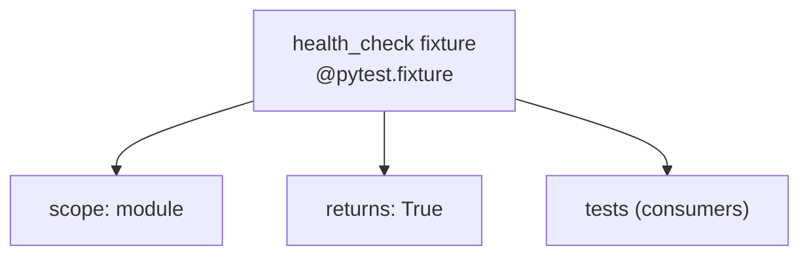

# Diagram: container_tracking_core/container_tracking_service/tests/conftest.py

> Auto-generated by Obscura crawlers

## Mermaid

### SVG

<svg id="container" width="622.59375" xmlns="http://www.w3.org/2000/svg" class="flowchart" height="198" viewBox="0 0 622.59375 198" role="graphics-document document" aria-roledescription="flowchart-v2"><g><marker id="container_flowchart-v2-pointEnd" class="marker flowchart-v2" viewBox="0 0 10 10" refX="5" refY="5" markerUnits="userSpaceOnUse" markerWidth="8" markerHeight="8" orient="auto"><path d="M 0 0 L 10 5 L 0 10 z" class="arrowMarkerPath" style="stroke-width: 1; stroke-dasharray: 1, 0;"></path></marker><marker id="container_flowchart-v2-pointStart" class="marker flowchart-v2" viewBox="0 0 10 10" refX="4.5" refY="5" markerUnits="userSpaceOnUse" markerWidth="8" markerHeight="8" orient="auto"><path d="M 0 5 L 10 10 L 10 0 z" class="arrowMarkerPath" style="stroke-width: 1; stroke-dasharray: 1, 0;"></path></marker><marker id="container_flowchart-v2-circleEnd" class="marker flowchart-v2" viewBox="0 0 10 10" refX="11" refY="5" markerUnits="userSpaceOnUse" markerWidth="11" markerHeight="11" orient="auto"><circle cx="5" cy="5" r="5" class="arrowMarkerPath" style="stroke-width: 1; stroke-dasharray: 1, 0;"></circle></marker><marker id="container_flowchart-v2-circleStart" class="marker flowchart-v2" viewBox="0 0 10 10" refX="-1" refY="5" markerUnits="userSpaceOnUse" markerWidth="11" markerHeight="11" orient="auto"><circle cx="5" cy="5" r="5" class="arrowMarkerPath" style="stroke-width: 1; stroke-dasharray: 1, 0;"></circle></marker><marker id="container_flowchart-v2-crossEnd" class="marker cross flowchart-v2" viewBox="0 0 11 11" refX="12" refY="5.2" markerUnits="userSpaceOnUse" markerWidth="11" markerHeight="11" orient="auto"><path d="M 1,1 l 9,9 M 10,1 l -9,9" class="arrowMarkerPath" style="stroke-width: 2; stroke-dasharray: 1, 0;"></path></marker><marker id="container_flowchart-v2-crossStart" class="marker cross flowchart-v2" viewBox="0 0 11 11" refX="-1" refY="5.2" markerUnits="userSpaceOnUse" markerWidth="11" markerHeight="11" orient="auto"><path d="M 1,1 l 9,9 M 10,1 l -9,9" class="arrowMarkerPath" style="stroke-width: 2; stroke-dasharray: 1, 0;"></path></marker><g class="root"><g class="clusters"></g><g class="edgePaths"><path d="M196.719,78.609L179.076,84.008C161.432,89.406,126.146,100.203,108.503,109.102C90.859,118,90.859,125,90.859,128.5L90.859,132" id="L_HC_S_0" class="edge-thickness-normal edge-pattern-solid edge-thickness-normal edge-pattern-solid flowchart-link" style=";" data-edge="true" data-et="edge" data-id="L_HC_S_0" data-points="W3sieCI6MTk2LjcxODc1LCJ5Ijo3OC42MDkxNTg0ODA1NTg3OH0seyJ4Ijo5MC44NTkzNzUsInkiOjExMX0seyJ4Ijo5MC44NTkzNzUsInkiOjEzNn1d" marker-end="url(#container_flowchart-v2-pointEnd)"></path><path d="M300.023,86L300.023,90.167C300.023,94.333,300.023,102.667,300.023,110.333C300.023,118,300.023,125,300.023,128.5L300.023,132" id="L_HC_R_0" class="edge-thickness-normal edge-pattern-solid edge-thickness-normal edge-pattern-solid flowchart-link" style=";" data-edge="true" data-et="edge" data-id="L_HC_R_0" data-points="W3sieCI6MzAwLjAyMzQzNzUsInkiOjg2fSx7IngiOjMwMC4wMjM0Mzc1LCJ5IjoxMTF9LHsieCI6MzAwLjAyMzQzNzUsInkiOjEzNn1d" marker-end="url(#container_flowchart-v2-pointEnd)"></path><path d="M403.328,76.993L422.85,82.661C442.372,88.328,481.417,99.664,500.939,108.832C520.461,118,520.461,125,520.461,128.5L520.461,132" id="L_HC_T_0" class="edge-thickness-normal edge-pattern-solid edge-thickness-normal edge-pattern-solid flowchart-link" style=";" data-edge="true" data-et="edge" data-id="L_HC_T_0" data-points="W3sieCI6NDAzLjMyODEyNSwieSI6NzYuOTkyNjI4Mjk2MDAyMjd9LHsieCI6NTIwLjQ2MDkzNzUsInkiOjExMX0seyJ4Ijo1MjAuNDYwOTM3NSwieSI6MTM2fV0=" marker-end="url(#container_flowchart-v2-pointEnd)"></path></g><g class="edgeLabels"><g class="edgeLabel"><g class="label" data-id="L_HC_S_0" transform="translate(0, 0)"><foreignObject width="0" height="0">

</foreignObject></g></g><g class="edgeLabel"><g class="label" data-id="L_HC_R_0" transform="translate(0, 0)"><foreignObject width="0" height="0">

</foreignObject></g></g><g class="edgeLabel"><g class="label" data-id="L_HC_T_0" transform="translate(0, 0)"><foreignObject width="0" height="0">

</foreignObject></g></g></g><g class="nodes"><g class="node default" id="flowchart-HC-0" transform="translate(300.0234375, 47)"><rect class="basic label-container" style="" x="-103.3046875" y="-39" width="206.609375" height="78"></rect><g class="label" style="" transform="translate(-73.3046875, -24)"><rect></rect><foreignObject width="146.609375" height="48">

health_check fixture @pytest.fixture

</foreignObject></g></g><g class="node default" id="flowchart-S-1" transform="translate(90.859375, 163)"><rect class="basic label-container" style="" x="-82.859375" y="-27" width="165.71875" height="54"></rect><g class="label" style="" transform="translate(-52.859375, -12)"><rect></rect><foreignObject width="105.71875" height="24">

scope: module

</foreignObject></g></g><g class="node default" id="flowchart-R-2" transform="translate(300.0234375, 163)"><rect class="basic label-container" style="" x="-76.3046875" y="-27" width="152.609375" height="54"></rect><g class="label" style="" transform="translate(-46.3046875, -12)"><rect></rect><foreignObject width="92.609375" height="24">

returns: True

</foreignObject></g></g><g class="node default" id="flowchart-T-3" transform="translate(520.4609375, 163)"><rect class="basic label-container" style="" x="-94.1328125" y="-27" width="188.265625" height="54"></rect><g class="label" style="" transform="translate(-64.1328125, -12)"><rect></rect><foreignObject width="128.265625" height="24">

tests (consumers)

</foreignObject></g></g></g></g></g></svg>
