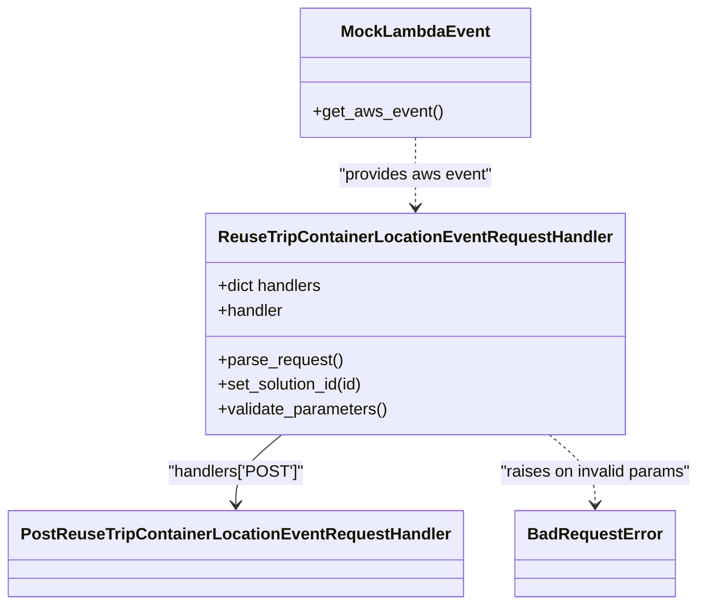

# Diagram: container_tracking_core/container_tracking_service/tests/unit/api/reuse_trip_container_location_event/reuse_trip_container_location_event_handler_test.py


> Auto-generated by Obscura crawlers

## Diagram 1



### SVG

<svg id="container" width="656.2734375" xmlns="http://www.w3.org/2000/svg" class="classDiagram" height="590" viewBox="0 0 656.2734375 590" role="graphics-document document" aria-roledescription="class"><style>#container{font-family:"trebuchet ms",verdana,arial,sans-serif;font-size:16px;fill:#333;}@keyframes edge-animation-frame{from{stroke-dashoffset:0;}}@keyframes dash{to{stroke-dashoffset:0;}}#container .edge-animation-slow{stroke-dasharray:9,5!important;stroke-dashoffset:900;animation:dash 50s linear infinite;stroke-linecap:round;}#container .edge-animation-fast{stroke-dasharray:9,5!important;stroke-dashoffset:900;animation:dash 20s linear infinite;stroke-linecap:round;}#container .error-icon{fill:#552222;}#container .error-text{fill:#552222;stroke:#552222;}#container .edge-thickness-normal{stroke-width:1px;}#container .edge-thickness-thick{stroke-width:3.5px;}#container .edge-pattern-solid{stroke-dasharray:0;}#container .edge-thickness-invisible{stroke-width:0;fill:none;}#container .edge-pattern-dashed{stroke-dasharray:3;}#container .edge-pattern-dotted{stroke-dasharray:2;}#container .marker{fill:#333333;stroke:#333333;}#container .marker.cross{stroke:#333333;}#container svg{font-family:"trebuchet ms",verdana,arial,sans-serif;font-size:16px;}#container p{margin:0;}#container g.classGroup text{fill:#9370DB;stroke:none;font-family:"trebuchet ms",verdana,arial,sans-serif;font-size:10px;}#container g.classGroup text .title{font-weight:bolder;}#container .nodeLabel,#container .edgeLabel{color:#131300;}#container .edgeLabel .label rect{fill:#ECECFF;}#container .label text{fill:#131300;}#container .labelBkg{background:#ECECFF;}#container .edgeLabel .label span{background:#ECECFF;}#container .classTitle{font-weight:bolder;}#container .node rect,#container .node circle,#container .node ellipse,#container .node polygon,#container .node path{fill:#ECECFF;stroke:#9370DB;stroke-width:1px;}#container .divider{stroke:#9370DB;stroke-width:1;}#container g.clickable{cursor:pointer;}#container g.classGroup rect{fill:#ECECFF;stroke:#9370DB;}#container g.classGroup line{stroke:#9370DB;stroke-width:1;}#container .classLabel .box{stroke:none;stroke-width:0;fill:#ECECFF;opacity:0.5;}#container .classLabel .label{fill:#9370DB;font-size:10px;}#container .relation{stroke:#333333;stroke-width:1;fill:none;}#container .dashed-line{stroke-dasharray:3;}#container .dotted-line{stroke-dasharray:1 2;}#container #compositionStart,#container .composition{fill:#333333!important;stroke:#333333!important;stroke-width:1;}#container #compositionEnd,#container .composition{fill:#333333!important;stroke:#333333!important;stroke-width:1;}#container #dependencyStart,#container .dependency{fill:#333333!important;stroke:#333333!important;stroke-width:1;}#container #dependencyStart,#container .dependency{fill:#333333!important;stroke:#333333!important;stroke-width:1;}#container #extensionStart,#container .extension{fill:transparent!important;stroke:#333333!important;stroke-width:1;}#container #extensionEnd,#container .extension{fill:transparent!important;stroke:#333333!important;stroke-width:1;}#container #aggregationStart,#container .aggregation{fill:transparent!important;stroke:#333333!important;stroke-width:1;}#container #aggregationEnd,#container .aggregation{fill:transparent!important;stroke:#333333!important;stroke-width:1;}#container #lollipopStart,#container .lollipop{fill:#ECECFF!important;stroke:#333333!important;stroke-width:1;}#container #lollipopEnd,#container .lollipop{fill:#ECECFF!important;stroke:#333333!important;stroke-width:1;}#container .edgeTerminals{font-size:11px;line-height:initial;}#container .classTitleText{text-anchor:middle;font-size:18px;fill:#333;}#container .label-icon{display:inline-block;height:1em;overflow:visible;vertical-align:-0.125em;}#container .node .label-icon path{fill:currentColor;stroke:revert;stroke-width:revert;}#container :root{--mermaid-font-family:"trebuchet ms",verdana,arial,sans-serif;}</style><g><defs><marker id="container_class-aggregationStart" class="marker aggregation class" refX="18" refY="7" markerWidth="190" markerHeight="240" orient="auto"><path d="M 18,7 L9,13 L1,7 L9,1 Z"></path></marker></defs><defs><marker id="container_class-aggregationEnd" class="marker aggregation class" refX="1" refY="7" markerWidth="20" markerHeight="28" orient="auto"><path d="M 18,7 L9,13 L1,7 L9,1 Z"></path></marker></defs><defs><marker id="container_class-extensionStart" class="marker extension class" refX="18" refY="7" markerWidth="190" markerHeight="240" orient="auto"><path d="M 1,7 L18,13 V 1 Z"></path></marker></defs><defs><marker id="container_class-extensionEnd" class="marker extension class" refX="1" refY="7" markerWidth="20" markerHeight="28" orient="auto"><path d="M 1,1 V 13 L18,7 Z"></path></marker></defs><defs><marker id="container_class-compositionStart" class="marker composition class" refX="18" refY="7" markerWidth="190" markerHeight="240" orient="auto"><path d="M 18,7 L9,13 L1,7 L9,1 Z"></path></marker></defs><defs><marker id="container_class-compositionEnd" class="marker composition class" refX="1" refY="7" markerWidth="20" markerHeight="28" orient="auto"><path d="M 18,7 L9,13 L1,7 L9,1 Z"></path></marker></defs><defs><marker id="container_class-dependencyStart" class="marker dependency class" refX="6" refY="7" markerWidth="190" markerHeight="240" orient="auto"><path d="M 5,7 L9,13 L1,7 L9,1 Z"></path></marker></defs><defs><marker id="container_class-dependencyEnd" class="marker dependency class" refX="13" refY="7" markerWidth="20" markerHeight="28" orient="auto"><path d="M 18,7 L9,13 L14,7 L9,1 Z"></path></marker></defs><defs><marker id="container_class-lollipopStart" class="marker lollipop class" refX="13" refY="7" markerWidth="190" markerHeight="240" orient="auto"><circle stroke="black" fill="transparent" cx="7" cy="7" r="6"></circle></marker></defs><defs><marker id="container_class-lollipopEnd" class="marker lollipop class" refX="1" refY="7" markerWidth="190" markerHeight="240" orient="auto"><circle stroke="black" fill="transparent" cx="7" cy="7" r="6"></circle></marker></defs><g class="root"><g class="clusters"></g><g class="edgePaths"><path d="M261.566,424L254.44,430.167C247.315,436.333,233.064,448.667,225.938,460C218.813,471.333,218.813,481.667,218.813,486.833L218.813,492" id="id_ReuseTripContainerLocationEventRequestHandler_PostReuseTripContainerLocationEventRequestHandler_1" class="edge-thickness-normal edge-pattern-solid relation" style=";;;" data-edge="true" data-et="edge" data-id="id_ReuseTripContainerLocationEventRequestHandler_PostReuseTripContainerLocationEventRequestHandler_1" data-points="W3sieCI6MjYxLjU2NTg0MDUxNzI0MTQsInkiOjQyNH0seyJ4IjoyMTguODEyNSwieSI6NDYxfSx7IngiOjIxOC44MTI1LCJ5Ijo0OTh9XQ==" marker-end="url(#container_class-dependencyEnd)"></path><path d="M386.359,134L386.359,140.167C386.359,146.333,386.359,158.667,386.359,170C386.359,181.333,386.359,191.667,386.359,196.833L386.359,202" id="id_MockLambdaEvent_ReuseTripContainerLocationEventRequestHandler_2" class="edge-thickness-normal edge-pattern-dashed relation" style=";;;" data-edge="true" data-et="edge" data-id="id_MockLambdaEvent_ReuseTripContainerLocationEventRequestHandler_2" data-points="W3sieCI6Mzg2LjM1OTM3NSwieSI6MTM0fSx7IngiOjM4Ni4zNTkzNzUsInkiOjE3MX0seyJ4IjozODYuMzU5Mzc1LCJ5IjoyMDh9XQ==" marker-end="url(#container_class-dependencyEnd)"></path><path d="M511.153,424L518.278,430.167C525.404,436.333,539.655,448.667,546.781,460C553.906,471.333,553.906,481.667,553.906,486.833L553.906,492" id="id_ReuseTripContainerLocationEventRequestHandler_BadRequestError_3" class="edge-thickness-normal edge-pattern-dashed relation" style=";;;" data-edge="true" data-et="edge" data-id="id_ReuseTripContainerLocationEventRequestHandler_BadRequestError_3" data-points="W3sieCI6NTExLjE1MjkwOTQ4Mjc1ODYsInkiOjQyNH0seyJ4Ijo1NTMuOTA2MjUsInkiOjQ2MX0seyJ4Ijo1NTMuOTA2MjUsInkiOjQ5OH1d" marker-end="url(#container_class-dependencyEnd)"></path></g><g class="edgeLabels"><g class="edgeLabel" transform="translate(218.8125, 461)"><g class="label" data-id="id_ReuseTripContainerLocationEventRequestHandler_PostReuseTripContainerLocationEventRequestHandler_1" transform="translate(-65.671875, -12)"><foreignObject width="131.34375" height="24"><div xmlns="http://www.w3.org/1999/xhtml" class="labelBkg" style="display: table-cell; white-space: nowrap; line-height: 1.5; max-width: 200px; text-align: center;"><span class="edgeLabel"><p>"handlers['POST']"</p></span></div></foreignObject></g></g><g class="edgeLabel" transform="translate(386.359375, 171)"><g class="label" data-id="id_MockLambdaEvent_ReuseTripContainerLocationEventRequestHandler_2" transform="translate(-75.7734375, -12)"><foreignObject width="151.546875" height="24"><div xmlns="http://www.w3.org/1999/xhtml" class="labelBkg" style="display: table-cell; white-space: nowrap; line-height: 1.5; max-width: 200px; text-align: center;"><span class="edgeLabel"><p>"provides aws event"</p></span></div></foreignObject></g></g><g class="edgeLabel" transform="translate(553.90625, 461)"><g class="label" data-id="id_ReuseTripContainerLocationEventRequestHandler_BadRequestError_3" transform="translate(-94.3671875, -12)"><foreignObject width="188.734375" height="24"><div xmlns="http://www.w3.org/1999/xhtml" class="labelBkg" style="display: table-cell; white-space: nowrap; line-height: 1.5; max-width: 200px; text-align: center;"><span class="edgeLabel"><p>"raises on invalid params"</p></span></div></foreignObject></g></g></g><g class="nodes"><g class="node default" id="classId-ReuseTripContainerLocationEventRequestHandler-0" transform="translate(386.359375, 316)"><g class="basic label-container"><path d="M-194.625 -108 L194.625 -108 L194.625 108 L-194.625 108" stroke="none" stroke-width="0" fill="#ECECFF" style=""></path><path d="M-194.625 -108 C-47.5984985358391 -108, 99.4280029283218 -108, 194.625 -108 M-194.625 -108 C-44.05283478529145 -108, 106.5193304294171 -108, 194.625 -108 M194.625 -108 C194.625 -24.166579657075502, 194.625 59.666840685848996, 194.625 108 M194.625 -108 C194.625 -49.25346361717443, 194.625 9.493072765651135, 194.625 108 M194.625 108 C88.2625430099688 108, -18.09991398006241 108, -194.625 108 M194.625 108 C92.4702447596326 108, -9.684510480734787 108, -194.625 108 M-194.625 108 C-194.625 27.972375743675855, -194.625 -52.05524851264829, -194.625 -108 M-194.625 108 C-194.625 23.61166633525096, -194.625 -60.77666732949808, -194.625 -108" stroke="#9370DB" stroke-width="1.3" fill="none" stroke-dasharray="0 0" style=""></path></g><g class="annotation-group text" transform="translate(0, -84)"></g><g class="label-group text" transform="translate(-182.625, -84)"><g class="label" style="font-weight: bolder" transform="translate(0,-12)"><foreignObject width="365.25" height="24"><div xmlns="http://www.w3.org/1999/xhtml" style="display: table-cell; white-space: nowrap; line-height: 1.5; max-width: 412px; text-align: center;"><span class="nodeLabel markdown-node-label" style=""><p>ReuseTripContainerLocationEventRequestHandler</p></span></div></foreignObject></g></g><g class="members-group text" transform="translate(-182.625, -36)"><g class="label" style="" transform="translate(0,-12)"><foreignObject width="103.5" height="24"><div xmlns="http://www.w3.org/1999/xhtml" style="display: table-cell; white-space: nowrap; line-height: 1.5; max-width: 161px; text-align: center;"><span class="nodeLabel markdown-node-label" style=""><p>+dict handlers</p></span></div></foreignObject></g><g class="label" style="" transform="translate(0,12)"><foreignObject width="64.515625" height="24"><div xmlns="http://www.w3.org/1999/xhtml" style="display: table-cell; white-space: nowrap; line-height: 1.5; max-width: 123px; text-align: center;"><span class="nodeLabel markdown-node-label" style=""><p>+handler</p></span></div></foreignObject></g></g><g class="methods-group text" transform="translate(-182.625, 36)"><g class="label" style="" transform="translate(0,-12)"><foreignObject width="121.796875" height="24"><div xmlns="http://www.w3.org/1999/xhtml" style="display: table-cell; white-space: nowrap; line-height: 1.5; max-width: 179px; text-align: center;"><span class="nodeLabel markdown-node-label" style=""><p>+parse_request()</p></span></div></foreignObject></g><g class="label" style="" transform="translate(0,12)"><foreignObject width="144.953125" height="24"><div xmlns="http://www.w3.org/1999/xhtml" style="display: table-cell; white-space: nowrap; line-height: 1.5; max-width: 202px; text-align: center;"><span class="nodeLabel markdown-node-label" style=""><p>+set_solution_id(id)</p></span></div></foreignObject></g><g class="label" style="" transform="translate(0,36)"><foreignObject width="166.546875" height="24"><div xmlns="http://www.w3.org/1999/xhtml" style="display: table-cell; white-space: nowrap; line-height: 1.5; max-width: 224px; text-align: center;"><span class="nodeLabel markdown-node-label" style=""><p>+validate_parameters()</p></span></div></foreignObject></g></g><g class="divider" style=""><path d="M-194.625 -60 C-73.0534844460755 -60, 48.518031107849 -60, 194.625 -60 M-194.625 -60 C-81.8980396147461 -60, 30.828920770507807 -60, 194.625 -60" stroke="#9370DB" stroke-width="1.3" fill="none" stroke-dasharray="0 0" style=""></path></g><g class="divider" style=""><path d="M-194.625 12 C-52.79964112855265 12, 89.0257177428947 12, 194.625 12 M-194.625 12 C-50.610952419461114 12, 93.40309516107777 12, 194.625 12" stroke="#9370DB" stroke-width="1.3" fill="none" stroke-dasharray="0 0" style=""></path></g></g><g class="node default" id="classId-PostReuseTripContainerLocationEventRequestHandler-1" transform="translate(218.8125, 540)"><g class="basic label-container"><path d="M-210.8125 -42 L210.8125 -42 L210.8125 42 L-210.8125 42" stroke="none" stroke-width="0" fill="#ECECFF" style=""></path><path d="M-210.8125 -42 C-111.58542618517802 -42, -12.358352370356045 -42, 210.8125 -42 M-210.8125 -42 C-43.184403448579786 -42, 124.44369310284043 -42, 210.8125 -42 M210.8125 -42 C210.8125 -20.398600350232115, 210.8125 1.2027992995357693, 210.8125 42 M210.8125 -42 C210.8125 -17.42506259251683, 210.8125 7.1498748149663385, 210.8125 42 M210.8125 42 C59.34001070245654 42, -92.13247859508692 42, -210.8125 42 M210.8125 42 C80.5927979041503 42, -49.626904191699396 42, -210.8125 42 M-210.8125 42 C-210.8125 24.986585518844027, -210.8125 7.973171037688054, -210.8125 -42 M-210.8125 42 C-210.8125 19.030742963780533, -210.8125 -3.9385140724389345, -210.8125 -42" stroke="#9370DB" stroke-width="1.3" fill="none" stroke-dasharray="0 0" style=""></path></g><g class="annotation-group text" transform="translate(0, -18)"></g><g class="label-group text" transform="translate(-198.8125, -18)"><g class="label" style="font-weight: bolder" transform="translate(0,-12)"><foreignObject width="397.625" height="24"><div xmlns="http://www.w3.org/1999/xhtml" style="display: table-cell; white-space: nowrap; line-height: 1.5; max-width: 443px; text-align: center;"><span class="nodeLabel markdown-node-label" style=""><p>PostReuseTripContainerLocationEventRequestHandler</p></span></div></foreignObject></g></g><g class="members-group text" transform="translate(-198.8125, 30)"></g><g class="methods-group text" transform="translate(-198.8125, 60)"></g><g class="divider" style=""><path d="M-210.8125 6 C-58.553551470293826 6, 93.70539705941235 6, 210.8125 6 M-210.8125 6 C-67.60475227464227 6, 75.60299545071547 6, 210.8125 6" stroke="#9370DB" stroke-width="1.3" fill="none" stroke-dasharray="0 0" style=""></path></g><g class="divider" style=""><path d="M-210.8125 24 C-46.63459984947886 24, 117.54330030104228 24, 210.8125 24 M-210.8125 24 C-62.85776080432538 24, 85.09697839134924 24, 210.8125 24" stroke="#9370DB" stroke-width="1.3" fill="none" stroke-dasharray="0 0" style=""></path></g></g><g class="node default" id="classId-MockLambdaEvent-2" transform="translate(386.359375, 71)"><g class="basic label-container"><path d="M-108.5234375 -63 L108.5234375 -63 L108.5234375 63 L-108.5234375 63" stroke="none" stroke-width="0" fill="#ECECFF" style=""></path><path d="M-108.5234375 -63 C-34.218450589828166 -63, 40.08653632034367 -63, 108.5234375 -63 M-108.5234375 -63 C-26.913617176533307 -63, 54.696203146933385 -63, 108.5234375 -63 M108.5234375 -63 C108.5234375 -37.52937809995203, 108.5234375 -12.058756199904053, 108.5234375 63 M108.5234375 -63 C108.5234375 -25.81622804142426, 108.5234375 11.36754391715148, 108.5234375 63 M108.5234375 63 C62.50884179660111 63, 16.49424609320222 63, -108.5234375 63 M108.5234375 63 C45.10206873724766 63, -18.319300025504674 63, -108.5234375 63 M-108.5234375 63 C-108.5234375 20.9093646381191, -108.5234375 -21.1812707237618, -108.5234375 -63 M-108.5234375 63 C-108.5234375 35.562022538147886, -108.5234375 8.124045076295772, -108.5234375 -63" stroke="#9370DB" stroke-width="1.3" fill="none" stroke-dasharray="0 0" style=""></path></g><g class="annotation-group text" transform="translate(0, -39)"></g><g class="label-group text" transform="translate(-68.546875, -39)"><g class="label" style="font-weight: bolder" transform="translate(0,-12)"><foreignObject width="137.09375" height="24"><div xmlns="http://www.w3.org/1999/xhtml" style="display: table-cell; white-space: nowrap; line-height: 1.5; max-width: 186px; text-align: center;"><span class="nodeLabel markdown-node-label" style=""><p>MockLambdaEvent</p></span></div></foreignObject></g></g><g class="members-group text" transform="translate(-96.5234375, 9)"></g><g class="methods-group text" transform="translate(-96.5234375, 39)"><g class="label" style="" transform="translate(0,-12)"><foreignObject width="124.5" height="24"><div xmlns="http://www.w3.org/1999/xhtml" style="display: table-cell; white-space: nowrap; line-height: 1.5; max-width: 182px; text-align: center;"><span class="nodeLabel markdown-node-label" style=""><p>+get_aws_event()</p></span></div></foreignObject></g></g><g class="divider" style=""><path d="M-108.5234375 -15 C-39.25705171677873 -15, 30.009334066442534 -15, 108.5234375 -15 M-108.5234375 -15 C-53.530001313005876 -15, 1.4634348739882483 -15, 108.5234375 -15" stroke="#9370DB" stroke-width="1.3" fill="none" stroke-dasharray="0 0" style=""></path></g><g class="divider" style=""><path d="M-108.5234375 9 C-29.899289878013846 9, 48.72485774397231 9, 108.5234375 9 M-108.5234375 9 C-55.541663026677895 9, -2.5598885533557905 9, 108.5234375 9" stroke="#9370DB" stroke-width="1.3" fill="none" stroke-dasharray="0 0" style=""></path></g></g><g class="node default" id="classId-BadRequestError-3" transform="translate(553.90625, 540)"><g class="basic label-container"><path d="M-74.28125 -42 L74.28125 -42 L74.28125 42 L-74.28125 42" stroke="none" stroke-width="0" fill="#ECECFF" style=""></path><path d="M-74.28125 -42 C-43.60859069041705 -42, -12.935931380834106 -42, 74.28125 -42 M-74.28125 -42 C-43.11016986164876 -42, -11.93908972329752 -42, 74.28125 -42 M74.28125 -42 C74.28125 -21.951531225580844, 74.28125 -1.9030624511616878, 74.28125 42 M74.28125 -42 C74.28125 -20.977975158136832, 74.28125 0.04404968372633533, 74.28125 42 M74.28125 42 C24.34237241437578 42, -25.596505171248438 42, -74.28125 42 M74.28125 42 C19.13640646147831 42, -36.00843707704338 42, -74.28125 42 M-74.28125 42 C-74.28125 12.853751698176204, -74.28125 -16.292496603647592, -74.28125 -42 M-74.28125 42 C-74.28125 24.86812088356369, -74.28125 7.736241767127382, -74.28125 -42" stroke="#9370DB" stroke-width="1.3" fill="none" stroke-dasharray="0 0" style=""></path></g><g class="annotation-group text" transform="translate(0, -18)"></g><g class="label-group text" transform="translate(-62.28125, -18)"><g class="label" style="font-weight: bolder" transform="translate(0,-12)"><foreignObject width="124.5625" height="24"><div xmlns="http://www.w3.org/1999/xhtml" style="display: table-cell; white-space: nowrap; line-height: 1.5; max-width: 174px; text-align: center;"><span class="nodeLabel markdown-node-label" style=""><p>BadRequestError</p></span></div></foreignObject></g></g><g class="members-group text" transform="translate(-62.28125, 30)"></g><g class="methods-group text" transform="translate(-62.28125, 60)"></g><g class="divider" style=""><path d="M-74.28125 6 C-20.074578746626862 6, 34.132092506746275 6, 74.28125 6 M-74.28125 6 C-30.908928687569883 6, 12.463392624860234 6, 74.28125 6" stroke="#9370DB" stroke-width="1.3" fill="none" stroke-dasharray="0 0" style=""></path></g><g class="divider" style=""><path d="M-74.28125 24 C-15.850806524484547 24, 42.579636951030906 24, 74.28125 24 M-74.28125 24 C-15.326107122798334 24, 43.62903575440333 24, 74.28125 24" stroke="#9370DB" stroke-width="1.3" fill="none" stroke-dasharray="0 0" style=""></path></g></g></g></g></g></svg>

## Diagram 2

```mermaid
sequenceDiagram
    participant TestSuite as Tests
    participant MockEvent as MockLambdaEvent
    participant ReuseHandler as ReuseTripContainerLocationEventRequestHandler
    participant PostHandler as PostReuseTripContainerLocationEventRequestHandler
    participant RequestHandler as RequestHandler
    participant Exception as BadRequestError

    Tests->>MockEvent: construct POST event / body variations
    MockEvent->>ReuseHandler: instantiate with aws event
    ReuseHandler->>PostHandler: handlers['POST'] lookup
    ReuseHandler->>RequestHandler: handler = parse_request()
    RequestHandler->>RequestHandler: set_solution_id("some solution id")
    RequestHandler->>RequestHandler: validate_parameters()
    alt invalid parameters
        RequestHandler->>Exception: raise BadRequestError with client_message
        Exception-->>Tests: assert client_message matches expected
    else valid parameters
        RequestHandler-->>Tests: parse/validate succeed (no exception)
```

> SVG rendering failed for this diagram.
