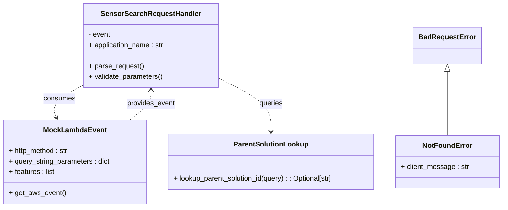
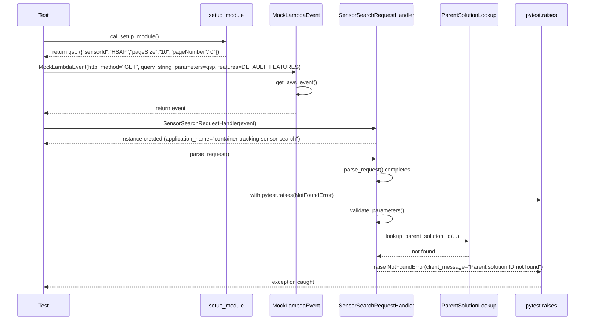

# Diagram: container_tracking_core/container_tracking_service/tests/unit/api/sensors/search/sensor_search_request_handler_test.py

> Auto-generated by Obscura crawlers

## Diagram 1

> SVG rendering failed for this diagram.

## Diagram 2

> SVG rendering failed for this diagram.
