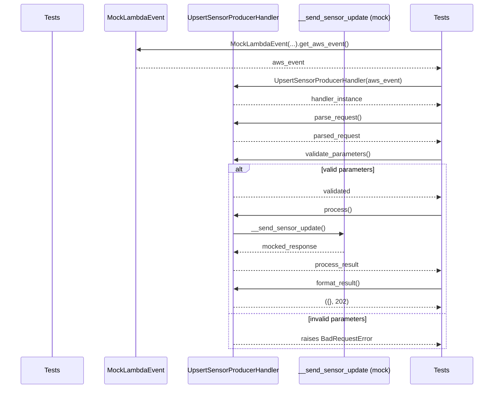

# Diagram: container_tracking_core/container_tracking_service/tests/unit/api/sensors/upsert_sensor/upsert_sensor_producer_handler_test.py


> Auto-generated by Obscura crawlers

## Diagram 1

```mermaid
classDiagram
    class UpsertSensorProducerHandler {
        - event
        - application_name
        + UpsertSensorProducerHandler(event)
        + parse_request()
        + validate_parameters()
        + process()
        + format_result() string, int
        - __send_sensor_update()
    }
    class MockLambdaEvent {
        - http_method
        - body
        - features
        + MockLambdaEvent(http_method, body, features)
        + get_aws_event()
    }
    class BadRequestError
    class ForbiddenError
    class TestUpsertSensorProducer {
        + test_producer_initialization()
        + test_producer_parse_request()
        + test_producer_parse_request_with_invalid_parameters()
        + test_producer_validate_parameters()
        + test_producer_validate_parameters_without_device_id()
        + test_producer_validate_parameters_without_device_name()
        + test_producer_process_method()
        + test_producer_process_method_invalid_data()
        + test_producer_format_result()
        + test_no_feature()
    }
    MockLambdaEvent --> UpsertSensorProducerHandler : provides event
    TestUpsertSensorProducer --> MockLambdaEvent : constructs
    TestUpsertSensorProducer --> UpsertSensorProducerHandler : instantiates & calls methods
    UpsertSensorProducerHandler ..> BadRequestError : raises on invalid input
    UpsertSensorProducerHandler ..> ForbiddenError : raises when no features
    UpsertSensorProducerHandler --> "__send_sensor_update" : invokes (mockable)
```

> SVG rendering failed for this diagram.

## Diagram 2



> SVG rendering failed for this diagram.
