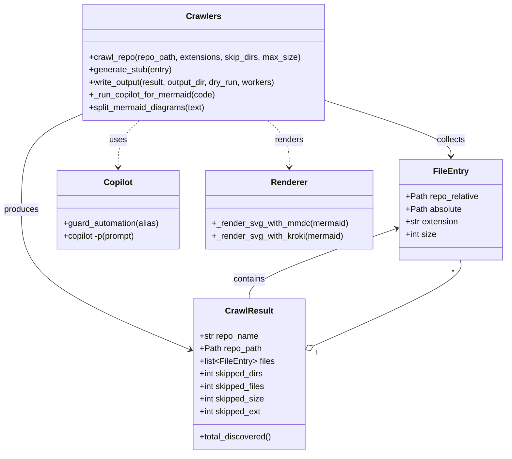

# Diagram: entity_core/entity_search/config/config.alpha.yml


> Auto-generated by Obscura crawlers

## Diagram 1



### SVG

<svg id="container" width="969.2265625" xmlns="http://www.w3.org/2000/svg" class="classDiagram" height="866" viewBox="0 0 969.2265625 866" role="graphics-document document" aria-roledescription="class"><style>#container{font-family:"trebuchet ms",verdana,arial,sans-serif;font-size:16px;fill:#333;}@keyframes edge-animation-frame{from{stroke-dashoffset:0;}}@keyframes dash{to{stroke-dashoffset:0;}}#container .edge-animation-slow{stroke-dasharray:9,5!important;stroke-dashoffset:900;animation:dash 50s linear infinite;stroke-linecap:round;}#container .edge-animation-fast{stroke-dasharray:9,5!important;stroke-dashoffset:900;animation:dash 20s linear infinite;stroke-linecap:round;}#container .error-icon{fill:#552222;}#container .error-text{fill:#552222;stroke:#552222;}#container .edge-thickness-normal{stroke-width:1px;}#container .edge-thickness-thick{stroke-width:3.5px;}#container .edge-pattern-solid{stroke-dasharray:0;}#container .edge-thickness-invisible{stroke-width:0;fill:none;}#container .edge-pattern-dashed{stroke-dasharray:3;}#container .edge-pattern-dotted{stroke-dasharray:2;}#container .marker{fill:#333333;stroke:#333333;}#container .marker.cross{stroke:#333333;}#container svg{font-family:"trebuchet ms",verdana,arial,sans-serif;font-size:16px;}#container p{margin:0;}#container g.classGroup text{fill:#9370DB;stroke:none;font-family:"trebuchet ms",verdana,arial,sans-serif;font-size:10px;}#container g.classGroup text .title{font-weight:bolder;}#container .nodeLabel,#container .edgeLabel{color:#131300;}#container .edgeLabel .label rect{fill:#ECECFF;}#container .label text{fill:#131300;}#container .labelBkg{background:#ECECFF;}#container .edgeLabel .label span{background:#ECECFF;}#container .classTitle{font-weight:bolder;}#container .node rect,#container .node circle,#container .node ellipse,#container .node polygon,#container .node path{fill:#ECECFF;stroke:#9370DB;stroke-width:1px;}#container .divider{stroke:#9370DB;stroke-width:1;}#container g.clickable{cursor:pointer;}#container g.classGroup rect{fill:#ECECFF;stroke:#9370DB;}#container g.classGroup line{stroke:#9370DB;stroke-width:1;}#container .classLabel .box{stroke:none;stroke-width:0;fill:#ECECFF;opacity:0.5;}#container .classLabel .label{fill:#9370DB;font-size:10px;}#container .relation{stroke:#333333;stroke-width:1;fill:none;}#container .dashed-line{stroke-dasharray:3;}#container .dotted-line{stroke-dasharray:1 2;}#container #compositionStart,#container .composition{fill:#333333!important;stroke:#333333!important;stroke-width:1;}#container #compositionEnd,#container .composition{fill:#333333!important;stroke:#333333!important;stroke-width:1;}#container #dependencyStart,#container .dependency{fill:#333333!important;stroke:#333333!important;stroke-width:1;}#container #dependencyStart,#container .dependency{fill:#333333!important;stroke:#333333!important;stroke-width:1;}#container #extensionStart,#container .extension{fill:transparent!important;stroke:#333333!important;stroke-width:1;}#container #extensionEnd,#container .extension{fill:transparent!important;stroke:#333333!important;stroke-width:1;}#container #aggregationStart,#container .aggregation{fill:transparent!important;stroke:#333333!important;stroke-width:1;}#container #aggregationEnd,#container .aggregation{fill:transparent!important;stroke:#333333!important;stroke-width:1;}#container #lollipopStart,#container .lollipop{fill:#ECECFF!important;stroke:#333333!important;stroke-width:1;}#container #lollipopEnd,#container .lollipop{fill:#ECECFF!important;stroke:#333333!important;stroke-width:1;}#container .edgeTerminals{font-size:11px;line-height:initial;}#container .classTitleText{text-anchor:middle;font-size:18px;fill:#333;}#container .label-icon{display:inline-block;height:1em;overflow:visible;vertical-align:-0.125em;}#container .node .label-icon path{fill:currentColor;stroke:revert;stroke-width:revert;}#container :root{--mermaid-font-family:"trebuchet ms",verdana,arial,sans-serif;}</style><g><defs><marker id="container_class-aggregationStart" class="marker aggregation class" refX="18" refY="7" markerWidth="190" markerHeight="240" orient="auto"><path d="M 18,7 L9,13 L1,7 L9,1 Z"></path></marker></defs><defs><marker id="container_class-aggregationEnd" class="marker aggregation class" refX="1" refY="7" markerWidth="20" markerHeight="28" orient="auto"><path d="M 18,7 L9,13 L1,7 L9,1 Z"></path></marker></defs><defs><marker id="container_class-extensionStart" class="marker extension class" refX="18" refY="7" markerWidth="190" markerHeight="240" orient="auto"><path d="M 1,7 L18,13 V 1 Z"></path></marker></defs><defs><marker id="container_class-extensionEnd" class="marker extension class" refX="1" refY="7" markerWidth="20" markerHeight="28" orient="auto"><path d="M 1,1 V 13 L18,7 Z"></path></marker></defs><defs><marker id="container_class-compositionStart" class="marker composition class" refX="18" refY="7" markerWidth="190" markerHeight="240" orient="auto"><path d="M 18,7 L9,13 L1,7 L9,1 Z"></path></marker></defs><defs><marker id="container_class-compositionEnd" class="marker composition class" refX="1" refY="7" markerWidth="20" markerHeight="28" orient="auto"><path d="M 18,7 L9,13 L1,7 L9,1 Z"></path></marker></defs><defs><marker id="container_class-dependencyStart" class="marker dependency class" refX="6" refY="7" markerWidth="190" markerHeight="240" orient="auto"><path d="M 5,7 L9,13 L1,7 L9,1 Z"></path></marker></defs><defs><marker id="container_class-dependencyEnd" class="marker dependency class" refX="13" refY="7" markerWidth="20" markerHeight="28" orient="auto"><path d="M 18,7 L9,13 L14,7 L9,1 Z"></path></marker></defs><defs><marker id="container_class-lollipopStart" class="marker lollipop class" refX="13" refY="7" markerWidth="190" markerHeight="240" orient="auto"><circle stroke="black" fill="transparent" cx="7" cy="7" r="6"></circle></marker></defs><defs><marker id="container_class-lollipopEnd" class="marker lollipop class" refX="1" refY="7" markerWidth="190" markerHeight="240" orient="auto"><circle stroke="black" fill="transparent" cx="7" cy="7" r="6"></circle></marker></defs><g class="root"><g class="clusters"></g><g class="edgePaths"><path d="M598.891,660.631L647.174,639.359C695.456,618.087,792.021,575.544,839.124,548.105C886.226,520.667,883.867,508.333,882.687,502.167L881.507,496" id="id_CrawlResult_FileEntry_1" class="edge-thickness-normal edge-pattern-solid relation" style=";;;" data-edge="true" data-et="edge" data-id="id_CrawlResult_FileEntry_1" data-points="W3sieCI6NTgzLjEwNTQ2ODc1LCJ5Ijo2NjcuNTg1MzMwODM1ODYwOX0seyJ4Ijo4ODguNTg1OTM3NSwieSI6NTMzfSx7IngiOjg4MS41MDcxNjYzNTMzODM1LCJ5Ijo0OTZ9XQ==" marker-start="url(#container_class-aggregationStart)"></path><path d="M161.154,216.438L141.208,224.865C121.262,233.292,81.369,250.146,61.423,280.74C41.477,311.333,41.477,355.667,41.477,400C41.477,444.333,41.477,488.667,95.707,533.332C149.938,577.998,258.399,622.995,312.63,645.494L366.86,667.993" id="id_Crawlers_CrawlResult_2" class="edge-thickness-normal edge-pattern-solid relation" style=";;;" data-edge="true" data-et="edge" data-id="id_Crawlers_CrawlResult_2" data-points="W3sieCI6MTYxLjE1NDI5Njg3NSwieSI6MjE2LjQzODI3NzQyMTI2MTI2fSx7IngiOjQxLjQ3NjU2MjUsInkiOjI2N30seyJ4Ijo0MS40NzY1NjI1LCJ5Ijo0MDB9LHsieCI6NDEuNDc2NTYyNSwieSI6NTMzfSx7IngiOjM3Mi40MDIzNDM3NSwieSI6NjcwLjI5MjQwNjQ1NzMzMTd9XQ==" marker-end="url(#container_class-dependencyEnd)"></path><path d="M622.42,191.416L662.54,204.014C702.66,216.611,782.9,241.805,823.021,259.569C863.141,277.333,863.141,287.667,863.141,292.833L863.141,298" id="id_Crawlers_FileEntry_3" class="edge-thickness-normal edge-pattern-solid relation" style=";;;" data-edge="true" data-et="edge" data-id="id_Crawlers_FileEntry_3" data-points="W3sieCI6NjIyLjQxOTkyMTg3NSwieSI6MTkxLjQxNjI1NDcxODU4Mzg3fSx7IngiOjg2My4xNDA2MjUsInkiOjI2N30seyJ4Ijo4NjMuMTQwNjI1LCJ5IjozMDR9XQ==" marker-end="url(#container_class-dependencyEnd)"></path><path d="M268.956,230L262.132,236.167C255.308,242.333,241.66,254.667,234.836,269.5C228.012,284.333,228.012,301.667,228.012,310.333L228.012,319" id="id_Crawlers_Copilot_4" class="edge-thickness-normal edge-pattern-dashed relation" style=";;;" data-edge="true" data-et="edge" data-id="id_Crawlers_Copilot_4" data-points="W3sieCI6MjY4Ljk1NTU2NjQwNjI1LCJ5IjoyMzB9LHsieCI6MjI4LjAxMTcxODc1LCJ5IjoyNjd9LHsieCI6MjI4LjAxMTcxODc1LCJ5IjozMjV9XQ==" marker-end="url(#container_class-dependencyEnd)"></path><path d="M514.619,230L521.443,236.167C528.267,242.333,541.915,254.667,548.739,269.5C555.563,284.333,555.563,301.667,555.563,310.333L555.563,319" id="id_Crawlers_Renderer_5" class="edge-thickness-normal edge-pattern-dashed relation" style=";;;" data-edge="true" data-et="edge" data-id="id_Crawlers_Renderer_5" data-points="W3sieCI6NTE0LjYxODY1MjM0Mzc1LCJ5IjoyMzB9LHsieCI6NTU1LjU2MjUsInkiOjI2N30seyJ4Ijo1NTUuNTYyNSwieSI6MzI1fV0=" marker-end="url(#container_class-dependencyEnd)"></path><path d="M759.383,435.808L712.445,452.006C665.507,468.205,571.63,500.603,524.692,522.968C477.754,545.333,477.754,557.667,477.754,563.833L477.754,570" id="id_FileEntry_CrawlResult_6" class="edge-thickness-normal edge-pattern-solid relation" style=";;;" data-edge="true" data-et="edge" data-id="id_FileEntry_CrawlResult_6" data-points="W3sieCI6NzY1LjA1NDY4NzUsInkiOjQzMy44NTAyMzE2MDU4MzQyfSx7IngiOjQ3Ny43NTM5MDYyNSwieSI6NTMzfSx7IngiOjQ3Ny43NTM5MDYyNSwieSI6NTcwfV0=" marker-start="url(#container_class-dependencyStart)"></path></g><g class="edgeLabels"><g class="edgeLabel"><g class="label" data-id="id_CrawlResult_FileEntry_1" transform="translate(0, 0)"><foreignObject width="0" height="0"><div xmlns="http://www.w3.org/1999/xhtml" class="labelBkg" style="display: table-cell; white-space: nowrap; line-height: 1.5; max-width: 200px; text-align: center;"><span class="edgeLabel"></span></div></foreignObject></g></g><g class="edgeLabel" transform="translate(41.4765625, 400)"><g class="label" data-id="id_Crawlers_CrawlResult_2" transform="translate(-33.4765625, -12)"><foreignObject width="66.953125" height="24"><div xmlns="http://www.w3.org/1999/xhtml" class="labelBkg" style="display: table-cell; white-space: nowrap; line-height: 1.5; max-width: 200px; text-align: center;"><span class="edgeLabel"><p>produces</p></span></div></foreignObject></g></g><g class="edgeLabel" transform="translate(863.140625, 267)"><g class="label" data-id="id_Crawlers_FileEntry_3" transform="translate(-27.796875, -12)"><foreignObject width="55.59375" height="24"><div xmlns="http://www.w3.org/1999/xhtml" class="labelBkg" style="display: table-cell; white-space: nowrap; line-height: 1.5; max-width: 200px; text-align: center;"><span class="edgeLabel"><p>collects</p></span></div></foreignObject></g></g><g class="edgeLabel" transform="translate(228.01171875, 267)"><g class="label" data-id="id_Crawlers_Copilot_4" transform="translate(-16.4921875, -12)"><foreignObject width="32.984375" height="24"><div xmlns="http://www.w3.org/1999/xhtml" class="labelBkg" style="display: table-cell; white-space: nowrap; line-height: 1.5; max-width: 200px; text-align: center;"><span class="edgeLabel"><p>uses</p></span></div></foreignObject></g></g><g class="edgeLabel" transform="translate(555.5625, 267)"><g class="label" data-id="id_Crawlers_Renderer_5" transform="translate(-27.75, -12)"><foreignObject width="55.5" height="24"><div xmlns="http://www.w3.org/1999/xhtml" class="labelBkg" style="display: table-cell; white-space: nowrap; line-height: 1.5; max-width: 200px; text-align: center;"><span class="edgeLabel"><p>renders</p></span></div></foreignObject></g></g><g class="edgeLabel" transform="translate(477.75390625, 533)"><g class="label" data-id="id_FileEntry_CrawlResult_6" transform="translate(-30.890625, -12)"><foreignObject width="61.78125" height="24"><div xmlns="http://www.w3.org/1999/xhtml" class="labelBkg" style="display: table-cell; white-space: nowrap; line-height: 1.5; max-width: 200px; text-align: center;"><span class="edgeLabel"><p>contains</p></span></div></foreignObject></g></g><g class="edgeTerminals" transform="translate(605.1677465008095, 674.2566079589948)"><g class="inner" transform="translate(0, 0)"><foreignObject style="width: 9px; height: 12px;"><div xmlns="http://www.w3.org/1999/xhtml" style="display: inline-block; padding-right: 1px; white-space: nowrap;"><span class="edgeLabel">1</span></div></foreignObject></g></g><g class="edgeTerminals" transform="translate(865.06279967993, 511.00691141189475)"><g class="inner" transform="translate(0, 0)"></g><foreignObject style="width: 9px; height: 12px;"><div xmlns="http://www.w3.org/1999/xhtml" style="display: inline-block; padding-right: 1px; white-space: nowrap;"><span class="edgeLabel">*</span></div></foreignObject></g></g><g class="nodes"><g class="node default" id="classId-FileEntry-0" transform="translate(863.140625, 400)"><g class="basic label-container"><path d="M-98.0859375 -96 L98.0859375 -96 L98.0859375 96 L-98.0859375 96" stroke="none" stroke-width="0" fill="#ECECFF" style=""></path><path d="M-98.0859375 -96 C-41.71502119791538 -96, 14.655895104169247 -96, 98.0859375 -96 M-98.0859375 -96 C-52.19765653201905 -96, -6.309375564038106 -96, 98.0859375 -96 M98.0859375 -96 C98.0859375 -39.22831899569168, 98.0859375 17.54336200861664, 98.0859375 96 M98.0859375 -96 C98.0859375 -20.543787275979952, 98.0859375 54.912425448040096, 98.0859375 96 M98.0859375 96 C37.42808501031995 96, -23.229767479360106 96, -98.0859375 96 M98.0859375 96 C53.98294665704824 96, 9.879955814096476 96, -98.0859375 96 M-98.0859375 96 C-98.0859375 29.358871146096917, -98.0859375 -37.28225770780617, -98.0859375 -96 M-98.0859375 96 C-98.0859375 29.356547657350035, -98.0859375 -37.28690468529993, -98.0859375 -96" stroke="#9370DB" stroke-width="1.3" fill="none" stroke-dasharray="0 0" style=""></path></g><g class="annotation-group text" transform="translate(0, -72)"></g><g class="label-group text" transform="translate(-31.859375, -72)"><g class="label" style="font-weight: bolder" transform="translate(0,-12)"><foreignObject width="63.71875" height="24"><div xmlns="http://www.w3.org/1999/xhtml" style="display: table-cell; white-space: nowrap; line-height: 1.5; max-width: 113px; text-align: center;"><span class="nodeLabel markdown-node-label" style=""><p>FileEntry</p></span></div></foreignObject></g></g><g class="members-group text" transform="translate(-86.0859375, -24)"><g class="label" style="" transform="translate(0,-12)"><foreignObject width="140.3125" height="24"><div xmlns="http://www.w3.org/1999/xhtml" style="display: table-cell; white-space: nowrap; line-height: 1.5; max-width: 198px; text-align: center;"><span class="nodeLabel markdown-node-label" style=""><p>+Path repo_relative</p></span></div></foreignObject></g><g class="label" style="" transform="translate(0,12)"><foreignObject width="107.78125" height="24"><div xmlns="http://www.w3.org/1999/xhtml" style="display: table-cell; white-space: nowrap; line-height: 1.5; max-width: 165px; text-align: center;"><span class="nodeLabel markdown-node-label" style=""><p>+Path absolute</p></span></div></foreignObject></g><g class="label" style="" transform="translate(0,36)"><foreignObject width="102.328125" height="24"><div xmlns="http://www.w3.org/1999/xhtml" style="display: table-cell; white-space: nowrap; line-height: 1.5; max-width: 160px; text-align: center;"><span class="nodeLabel markdown-node-label" style=""><p>+str extension</p></span></div></foreignObject></g><g class="label" style="" transform="translate(0,60)"><foreignObject width="59.484375" height="24"><div xmlns="http://www.w3.org/1999/xhtml" style="display: table-cell; white-space: nowrap; line-height: 1.5; max-width: 117px; text-align: center;"><span class="nodeLabel markdown-node-label" style=""><p>+int size</p></span></div></foreignObject></g></g><g class="methods-group text" transform="translate(-86.0859375, 96)"></g><g class="divider" style=""><path d="M-98.0859375 -48 C-43.21707509203055 -48, 11.651787315938904 -48, 98.0859375 -48 M-98.0859375 -48 C-45.108687418479036 -48, 7.868562663041928 -48, 98.0859375 -48" stroke="#9370DB" stroke-width="1.3" fill="none" stroke-dasharray="0 0" style=""></path></g><g class="divider" style=""><path d="M-98.0859375 72 C-20.234377663515517 72, 57.61718217296897 72, 98.0859375 72 M-98.0859375 72 C-27.558245811594276 72, 42.96944587681145 72, 98.0859375 72" stroke="#9370DB" stroke-width="1.3" fill="none" stroke-dasharray="0 0" style=""></path></g></g><g class="node default" id="classId-CrawlResult-1" transform="translate(477.75390625, 714)"><g class="basic label-container"><path d="M-105.3515625 -144 L105.3515625 -144 L105.3515625 144 L-105.3515625 144" stroke="none" stroke-width="0" fill="#ECECFF" style=""></path><path d="M-105.3515625 -144 C-57.35191504452658 -144, -9.352267589053156 -144, 105.3515625 -144 M-105.3515625 -144 C-38.4110491830551 -144, 28.529464133889803 -144, 105.3515625 -144 M105.3515625 -144 C105.3515625 -58.32951131719278, 105.3515625 27.340977365614435, 105.3515625 144 M105.3515625 -144 C105.3515625 -62.20560163142869, 105.3515625 19.588796737142616, 105.3515625 144 M105.3515625 144 C42.39149607800601 144, -20.568570343987986 144, -105.3515625 144 M105.3515625 144 C47.10843794523218 144, -11.134686609535635 144, -105.3515625 144 M-105.3515625 144 C-105.3515625 59.20508453467447, -105.3515625 -25.58983093065106, -105.3515625 -144 M-105.3515625 144 C-105.3515625 32.85320342750505, -105.3515625 -78.2935931449899, -105.3515625 -144" stroke="#9370DB" stroke-width="1.3" fill="none" stroke-dasharray="0 0" style=""></path></g><g class="annotation-group text" transform="translate(0, -120)"></g><g class="label-group text" transform="translate(-43.28125, -120)"><g class="label" style="font-weight: bolder" transform="translate(0,-12)"><foreignObject width="86.5625" height="24"><div xmlns="http://www.w3.org/1999/xhtml" style="display: table-cell; white-space: nowrap; line-height: 1.5; max-width: 135px; text-align: center;"><span class="nodeLabel markdown-node-label" style=""><p>CrawlResult</p></span></div></foreignObject></g></g><g class="members-group text" transform="translate(-93.3515625, -72)"><g class="label" style="" transform="translate(0,-12)"><foreignObject width="113.4375" height="24"><div xmlns="http://www.w3.org/1999/xhtml" style="display: table-cell; white-space: nowrap; line-height: 1.5; max-width: 171px; text-align: center;"><span class="nodeLabel markdown-node-label" style=""><p>+str repo_name</p></span></div></foreignObject></g><g class="label" style="" transform="translate(0,12)"><foreignObject width="118.96875" height="24"><div xmlns="http://www.w3.org/1999/xhtml" style="display: table-cell; white-space: nowrap; line-height: 1.5; max-width: 176px; text-align: center;"><span class="nodeLabel markdown-node-label" style=""><p>+Path repo_path</p></span></div></foreignObject></g><g class="label" style="" transform="translate(0,36)"><foreignObject width="143.421875" height="24"><div xmlns="http://www.w3.org/1999/xhtml" style="display: table-cell; white-space: nowrap; line-height: 1.5; max-width: 240px; text-align: center;"><span class="nodeLabel markdown-node-label" style=""><p>+list&lt;FileEntry&gt; files</p></span></div></foreignObject></g><g class="label" style="" transform="translate(0,60)"><foreignObject width="124.859375" height="24"><div xmlns="http://www.w3.org/1999/xhtml" style="display: table-cell; white-space: nowrap; line-height: 1.5; max-width: 182px; text-align: center;"><span class="nodeLabel markdown-node-label" style=""><p>+int skipped_dirs</p></span></div></foreignObject></g><g class="label" style="" transform="translate(0,84)"><foreignObject width="127.375" height="24"><div xmlns="http://www.w3.org/1999/xhtml" style="display: table-cell; white-space: nowrap; line-height: 1.5; max-width: 185px; text-align: center;"><span class="nodeLabel markdown-node-label" style=""><p>+int skipped_files</p></span></div></foreignObject></g><g class="label" style="" transform="translate(0,108)"><foreignObject width="125.265625" height="24"><div xmlns="http://www.w3.org/1999/xhtml" style="display: table-cell; white-space: nowrap; line-height: 1.5; max-width: 183px; text-align: center;"><span class="nodeLabel markdown-node-label" style=""><p>+int skipped_size</p></span></div></foreignObject></g><g class="label" style="" transform="translate(0,132)"><foreignObject width="119.484375" height="24"><div xmlns="http://www.w3.org/1999/xhtml" style="display: table-cell; white-space: nowrap; line-height: 1.5; max-width: 177px; text-align: center;"><span class="nodeLabel markdown-node-label" style=""><p>+int skipped_ext</p></span></div></foreignObject></g></g><g class="methods-group text" transform="translate(-93.3515625, 120)"><g class="label" style="" transform="translate(0,-12)"><foreignObject width="138.734375" height="24"><div xmlns="http://www.w3.org/1999/xhtml" style="display: table-cell; white-space: nowrap; line-height: 1.5; max-width: 196px; text-align: center;"><span class="nodeLabel markdown-node-label" style=""><p>+total_discovered()</p></span></div></foreignObject></g></g><g class="divider" style=""><path d="M-105.3515625 -96 C-40.71493740720149 -96, 23.92168768559702 -96, 105.3515625 -96 M-105.3515625 -96 C-54.45738168852773 -96, -3.563200877055465 -96, 105.3515625 -96" stroke="#9370DB" stroke-width="1.3" fill="none" stroke-dasharray="0 0" style=""></path></g><g class="divider" style=""><path d="M-105.3515625 96 C-49.96861461230541 96, 5.414333275389183 96, 105.3515625 96 M-105.3515625 96 C-48.62496837951726 96, 8.101625740965474 96, 105.3515625 96" stroke="#9370DB" stroke-width="1.3" fill="none" stroke-dasharray="0 0" style=""></path></g></g><g class="node default" id="classId-Crawlers-2" transform="translate(391.787109375, 119)"><g class="basic label-container"><path d="M-230.6328125 -111 L230.6328125 -111 L230.6328125 111 L-230.6328125 111" stroke="none" stroke-width="0" fill="#ECECFF" style=""></path><path d="M-230.6328125 -111 C-109.39587946741251 -111, 11.841053565174974 -111, 230.6328125 -111 M-230.6328125 -111 C-54.766164620767995 -111, 121.10048325846401 -111, 230.6328125 -111 M230.6328125 -111 C230.6328125 -23.76679321298863, 230.6328125 63.46641357402274, 230.6328125 111 M230.6328125 -111 C230.6328125 -54.04850045244173, 230.6328125 2.9029990951165416, 230.6328125 111 M230.6328125 111 C48.27491320544328 111, -134.08298608911343 111, -230.6328125 111 M230.6328125 111 C50.73627560080817 111, -129.16026129838366 111, -230.6328125 111 M-230.6328125 111 C-230.6328125 52.15762014509066, -230.6328125 -6.684759709818678, -230.6328125 -111 M-230.6328125 111 C-230.6328125 43.6037482695497, -230.6328125 -23.792503460900605, -230.6328125 -111" stroke="#9370DB" stroke-width="1.3" fill="none" stroke-dasharray="0 0" style=""></path></g><g class="annotation-group text" transform="translate(0, -87)"></g><g class="label-group text" transform="translate(-31.5, -87)"><g class="label" style="font-weight: bolder" transform="translate(0,-12)"><foreignObject width="63" height="24"><div xmlns="http://www.w3.org/1999/xhtml" style="display: table-cell; white-space: nowrap; line-height: 1.5; max-width: 111px; text-align: center;"><span class="nodeLabel markdown-node-label" style=""><p>Crawlers</p></span></div></foreignObject></g></g><g class="members-group text" transform="translate(-218.6328125, -39)"></g><g class="methods-group text" transform="translate(-218.6328125, -9)"><g class="label" style="" transform="translate(0,-12)"><foreignObject width="405.765625" height="24"><div xmlns="http://www.w3.org/1999/xhtml" style="display: table-cell; white-space: nowrap; line-height: 1.5; max-width: 463px; text-align: center;"><span class="nodeLabel markdown-node-label" style=""><p>+crawl_repo(repo_path, extensions, skip_dirs, max_size)</p></span></div></foreignObject></g><g class="label" style="" transform="translate(0,12)"><foreignObject width="159.796875" height="24"><div xmlns="http://www.w3.org/1999/xhtml" style="display: table-cell; white-space: nowrap; line-height: 1.5; max-width: 217px; text-align: center;"><span class="nodeLabel markdown-node-label" style=""><p>+generate_stub(entry)</p></span></div></foreignObject></g><g class="label" style="" transform="translate(0,36)"><foreignObject width="366.9375" height="24"><div xmlns="http://www.w3.org/1999/xhtml" style="display: table-cell; white-space: nowrap; line-height: 1.5; max-width: 424px; text-align: center;"><span class="nodeLabel markdown-node-label" style=""><p>+write_output(result, output_dir, dry_run, workers)</p></span></div></foreignObject></g><g class="label" style="" transform="translate(0,60)"><foreignObject width="244.5" height="24"><div xmlns="http://www.w3.org/1999/xhtml" style="display: table-cell; white-space: nowrap; line-height: 1.5; max-width: 302px; text-align: center;"><span class="nodeLabel markdown-node-label" style=""><p>+_run_copilot_for_mermaid(code)</p></span></div></foreignObject></g><g class="label" style="" transform="translate(0,84)"><foreignObject width="225.828125" height="24"><div xmlns="http://www.w3.org/1999/xhtml" style="display: table-cell; white-space: nowrap; line-height: 1.5; max-width: 283px; text-align: center;"><span class="nodeLabel markdown-node-label" style=""><p>+split_mermaid_diagrams(text)</p></span></div></foreignObject></g></g><g class="divider" style=""><path d="M-230.6328125 -63 C-60.666238880094824 -63, 109.30033473981035 -63, 230.6328125 -63 M-230.6328125 -63 C-120.14571114264508 -63, -9.658609785290167 -63, 230.6328125 -63" stroke="#9370DB" stroke-width="1.3" fill="none" stroke-dasharray="0 0" style=""></path></g><g class="divider" style=""><path d="M-230.6328125 -39 C-71.8421424139994 -39, 86.9485276720012 -39, 230.6328125 -39 M-230.6328125 -39 C-53.576182695879794 -39, 123.48044710824041 -39, 230.6328125 -39" stroke="#9370DB" stroke-width="1.3" fill="none" stroke-dasharray="0 0" style=""></path></g></g><g class="node default" id="classId-Copilot-3" transform="translate(228.01171875, 400)"><g class="basic label-container"><path d="M-118.05859375 -75 L118.05859375 -75 L118.05859375 75 L-118.05859375 75" stroke="none" stroke-width="0" fill="#ECECFF" style=""></path><path d="M-118.05859375 -75 C-61.23083591872335 -75, -4.403078087446701 -75, 118.05859375 -75 M-118.05859375 -75 C-60.80523730498117 -75, -3.5518808599623384 -75, 118.05859375 -75 M118.05859375 -75 C118.05859375 -18.632987514667967, 118.05859375 37.734024970664066, 118.05859375 75 M118.05859375 -75 C118.05859375 -42.17380341016187, 118.05859375 -9.347606820323733, 118.05859375 75 M118.05859375 75 C23.914340743443063 75, -70.22991226311387 75, -118.05859375 75 M118.05859375 75 C63.25185206548382 75, 8.445110380967634 75, -118.05859375 75 M-118.05859375 75 C-118.05859375 39.82965398632014, -118.05859375 4.659307972640278, -118.05859375 -75 M-118.05859375 75 C-118.05859375 24.550345711933126, -118.05859375 -25.89930857613375, -118.05859375 -75" stroke="#9370DB" stroke-width="1.3" fill="none" stroke-dasharray="0 0" style=""></path></g><g class="annotation-group text" transform="translate(0, -51)"></g><g class="label-group text" transform="translate(-26.2421875, -51)"><g class="label" style="font-weight: bolder" transform="translate(0,-12)"><foreignObject width="52.484375" height="24"><div xmlns="http://www.w3.org/1999/xhtml" style="display: table-cell; white-space: nowrap; line-height: 1.5; max-width: 102px; text-align: center;"><span class="nodeLabel markdown-node-label" style=""><p>Copilot</p></span></div></foreignObject></g></g><g class="members-group text" transform="translate(-106.05859375, -3)"></g><g class="methods-group text" transform="translate(-106.05859375, 27)"><g class="label" style="" transform="translate(0,-12)"><foreignObject width="185.875" height="24"><div xmlns="http://www.w3.org/1999/xhtml" style="display: table-cell; white-space: nowrap; line-height: 1.5; max-width: 243px; text-align: center;"><span class="nodeLabel markdown-node-label" style=""><p>+guard_automation(alias)</p></span></div></foreignObject></g><g class="label" style="" transform="translate(0,12)"><foreignObject width="142.5" height="24"><div xmlns="http://www.w3.org/1999/xhtml" style="display: table-cell; white-space: nowrap; line-height: 1.5; max-width: 200px; text-align: center;"><span class="nodeLabel markdown-node-label" style=""><p>+copilot -p(prompt)</p></span></div></foreignObject></g></g><g class="divider" style=""><path d="M-118.05859375 -27 C-29.389713033086935 -27, 59.27916768382613 -27, 118.05859375 -27 M-118.05859375 -27 C-36.675828869453255 -27, 44.70693601109349 -27, 118.05859375 -27" stroke="#9370DB" stroke-width="1.3" fill="none" stroke-dasharray="0 0" style=""></path></g><g class="divider" style=""><path d="M-118.05859375 -3 C-27.784567328943368 -3, 62.489459092113265 -3, 118.05859375 -3 M-118.05859375 -3 C-29.215903089967583 -3, 59.626787570064835 -3, 118.05859375 -3" stroke="#9370DB" stroke-width="1.3" fill="none" stroke-dasharray="0 0" style=""></path></g></g><g class="node default" id="classId-Renderer-4" transform="translate(555.5625, 400)"><g class="basic label-container"><path d="M-159.4921875 -75 L159.4921875 -75 L159.4921875 75 L-159.4921875 75" stroke="none" stroke-width="0" fill="#ECECFF" style=""></path><path d="M-159.4921875 -75 C-88.11686910919387 -75, -16.741550718387742 -75, 159.4921875 -75 M-159.4921875 -75 C-84.86972522274289 -75, -10.247262945485772 -75, 159.4921875 -75 M159.4921875 -75 C159.4921875 -31.82120673546747, 159.4921875 11.35758652906506, 159.4921875 75 M159.4921875 -75 C159.4921875 -24.499265635794536, 159.4921875 26.001468728410927, 159.4921875 75 M159.4921875 75 C51.900541062059375 75, -55.69110537588125 75, -159.4921875 75 M159.4921875 75 C57.405649883768916 75, -44.68088773246217 75, -159.4921875 75 M-159.4921875 75 C-159.4921875 33.26233486122513, -159.4921875 -8.475330277549745, -159.4921875 -75 M-159.4921875 75 C-159.4921875 35.50399137733828, -159.4921875 -3.9920172453234386, -159.4921875 -75" stroke="#9370DB" stroke-width="1.3" fill="none" stroke-dasharray="0 0" style=""></path></g><g class="annotation-group text" transform="translate(0, -51)"></g><g class="label-group text" transform="translate(-33.65625, -51)"><g class="label" style="font-weight: bolder" transform="translate(0,-12)"><foreignObject width="67.3125" height="24"><div xmlns="http://www.w3.org/1999/xhtml" style="display: table-cell; white-space: nowrap; line-height: 1.5; max-width: 117px; text-align: center;"><span class="nodeLabel markdown-node-label" style=""><p>Renderer</p></span></div></foreignObject></g></g><g class="members-group text" transform="translate(-147.4921875, -3)"></g><g class="methods-group text" transform="translate(-147.4921875, 27)"><g class="label" style="" transform="translate(0,-12)"><foreignObject width="261.328125" height="24"><div xmlns="http://www.w3.org/1999/xhtml" style="display: table-cell; white-space: nowrap; line-height: 1.5; max-width: 319px; text-align: center;"><span class="nodeLabel markdown-node-label" style=""><p>+_render_svg_with_mmdc(mermaid)</p></span></div></foreignObject></g><g class="label" style="" transform="translate(0,12)"><foreignObject width="252.609375" height="24"><div xmlns="http://www.w3.org/1999/xhtml" style="display: table-cell; white-space: nowrap; line-height: 1.5; max-width: 310px; text-align: center;"><span class="nodeLabel markdown-node-label" style=""><p>+_render_svg_with_kroki(mermaid)</p></span></div></foreignObject></g></g><g class="divider" style=""><path d="M-159.4921875 -27 C-61.48710754205601 -27, 36.51797241588798 -27, 159.4921875 -27 M-159.4921875 -27 C-82.57897814183991 -27, -5.665768783679823 -27, 159.4921875 -27" stroke="#9370DB" stroke-width="1.3" fill="none" stroke-dasharray="0 0" style=""></path></g><g class="divider" style=""><path d="M-159.4921875 -3 C-63.951767125698424 -3, 31.58865324860315 -3, 159.4921875 -3 M-159.4921875 -3 C-92.35904766896978 -3, -25.22590783793956 -3, 159.4921875 -3" stroke="#9370DB" stroke-width="1.3" fill="none" stroke-dasharray="0 0" style=""></path></g></g></g></g></g></svg>

## Diagram 2

```mermaid
flowchart TD
    Start([Start]) --> Walk[Walk repository (os.walk)]
    Walk --> Filter{Should include file?}
    Filter -- No --> Skip[Skip file/dir]
    Filter -- Yes --> Add[Create FileEntry]
    Add --> Collect[Append to CrawlResult.files]
    Collect --> AfterWalk{All files discovered?}
    AfterWalk -- Yes --> IndexGen[Generate INDEX.md]
    AfterWalk -- Yes --> Process[Process files (ThreadPool)]
    Process --> PerFile[For each FileEntry]
    PerFile --> CopilotCall[_run_copilot_for_mermaid: call copilot -p]
    CopilotCall --> RawMermaid[Raw Mermaid text]
    RawMermaid --> Split[split_mermaid_diagrams]
    Split --> NoDiagrams{Diagrams present?}
    NoDiagrams -- No --> StubNote[Emit stub: no valid diagrams]
    NoDiagrams -- Yes --> ForEachDiag[For each diagram]
    ForEachDiag --> TryMMD[Render with mmdc]
    TryMMD -- Success --> WriteSVG[Embed SVG in markdown]
    TryMMD -- Fail --> Kroki[POST to kroki.io]
    Kroki --> WriteSVG
    WriteSVG --> WriteFile[Write .md file with Mermaid + SVG]
    WriteFile --> DoneFile[File written]
    DoneFile --> ProcessedCount[Increment counter]
    ProcessedCount --> AllDone{All files processed?}
    AllDone -- Yes --> FinalIndex[Write/Update INDEX.md]
    FinalIndex --> End([Done])
```

> SVG rendering failed for this diagram.
