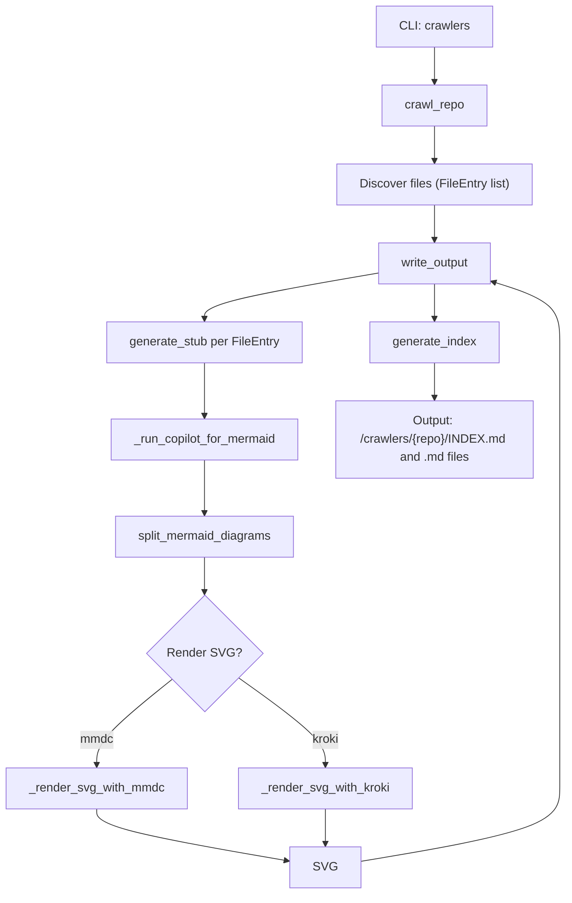
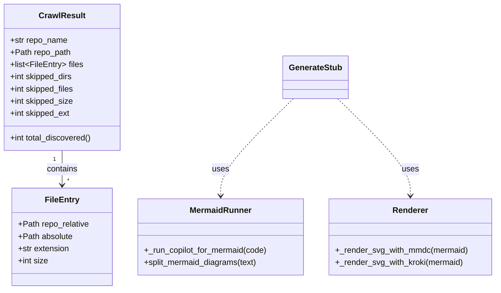
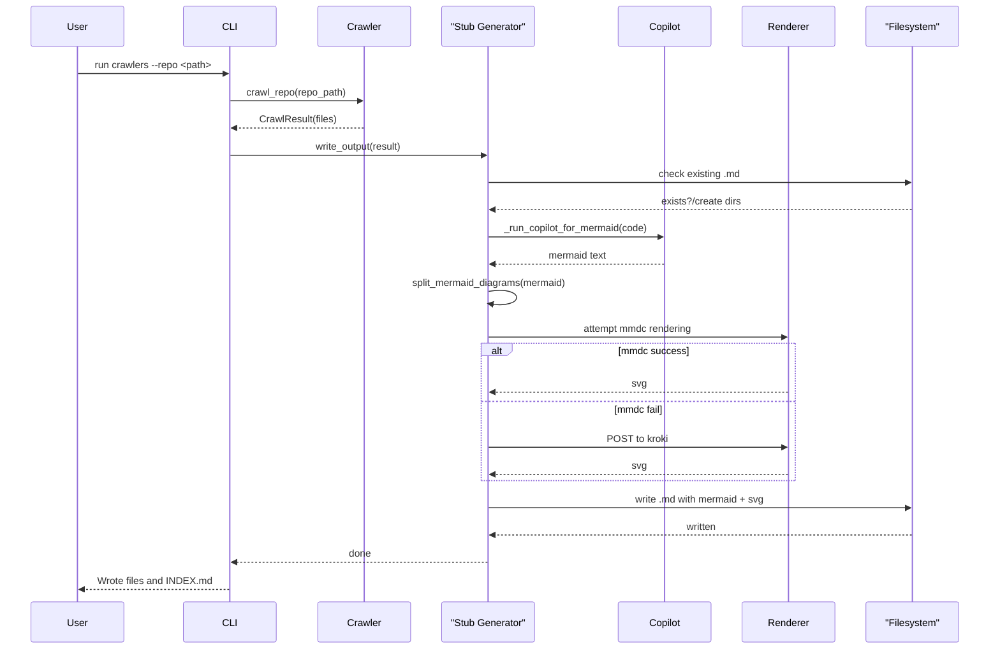

# Diagram: entity_core/entity_search/config/config.dev.yml

> Auto-generated by Obscura crawlers

## Diagram 1

### SVG

<svg id="container" width="751.5430297851562" xmlns="http://www.w3.org/2000/svg" class="flowchart" height="1168.75" viewBox="0 0 751.5430297851562 1168.75" role="graphics-document document" aria-roledescription="flowchart-v2"><g><marker id="container_flowchart-v2-pointEnd" class="marker flowchart-v2" viewBox="0 0 10 10" refX="5" refY="5" markerUnits="userSpaceOnUse" markerWidth="8" markerHeight="8" orient="auto"><path d="M 0 0 L 10 5 L 0 10 z" class="arrowMarkerPath" style="stroke-width: 1; stroke-dasharray: 1, 0;"></path></marker><marker id="container_flowchart-v2-pointStart" class="marker flowchart-v2" viewBox="0 0 10 10" refX="4.5" refY="5" markerUnits="userSpaceOnUse" markerWidth="8" markerHeight="8" orient="auto"><path d="M 0 5 L 10 10 L 10 0 z" class="arrowMarkerPath" style="stroke-width: 1; stroke-dasharray: 1, 0;"></path></marker><marker id="container_flowchart-v2-circleEnd" class="marker flowchart-v2" viewBox="0 0 10 10" refX="11" refY="5" markerUnits="userSpaceOnUse" markerWidth="11" markerHeight="11" orient="auto"><circle cx="5" cy="5" r="5" class="arrowMarkerPath" style="stroke-width: 1; stroke-dasharray: 1, 0;"></circle></marker><marker id="container_flowchart-v2-circleStart" class="marker flowchart-v2" viewBox="0 0 10 10" refX="-1" refY="5" markerUnits="userSpaceOnUse" markerWidth="11" markerHeight="11" orient="auto"><circle cx="5" cy="5" r="5" class="arrowMarkerPath" style="stroke-width: 1; stroke-dasharray: 1, 0;"></circle></marker><marker id="container_flowchart-v2-crossEnd" class="marker cross flowchart-v2" viewBox="0 0 11 11" refX="12" refY="5.2" markerUnits="userSpaceOnUse" markerWidth="11" markerHeight="11" orient="auto"><path d="M 1,1 l 9,9 M 10,1 l -9,9" class="arrowMarkerPath" style="stroke-width: 2; stroke-dasharray: 1, 0;"></path></marker><marker id="container_flowchart-v2-crossStart" class="marker cross flowchart-v2" viewBox="0 0 11 11" refX="-1" refY="5.2" markerUnits="userSpaceOnUse" markerWidth="11" markerHeight="11" orient="auto"><path d="M 1,1 l 9,9 M 10,1 l -9,9" class="arrowMarkerPath" style="stroke-width: 2; stroke-dasharray: 1, 0;"></path></marker><g class="root"><g class="clusters"></g><g class="edgePaths"><path d="M577.371,62L577.371,66.167C577.371,70.333,577.371,78.667,577.371,86.333C577.371,94,577.371,101,577.371,104.5L577.371,108" id="L_CLI_Crawl_0" class="edge-thickness-normal edge-pattern-solid edge-thickness-normal edge-pattern-solid flowchart-link" style=";" data-edge="true" data-et="edge" data-id="L_CLI_Crawl_0" data-points="W3sieCI6NTc3LjM3MTA5Mzc1LCJ5Ijo2Mn0seyJ4Ijo1NzcuMzcxMDkzNzUsInkiOjg3fSx7IngiOjU3Ny4zNzEwOTM3NSwieSI6MTEyfV0=" marker-end="url(#container_flowchart-v2-pointEnd)"></path><path d="M577.371,166L577.371,170.167C577.371,174.333,577.371,182.667,577.371,190.333C577.371,198,577.371,205,577.371,208.5L577.371,212" id="L_Crawl_Discover_0" class="edge-thickness-normal edge-pattern-solid edge-thickness-normal edge-pattern-solid flowchart-link" style=";" data-edge="true" data-et="edge" data-id="L_Crawl_Discover_0" data-points="W3sieCI6NTc3LjM3MTA5Mzc1LCJ5IjoxNjZ9LHsieCI6NTc3LjM3MTA5Mzc1LCJ5IjoxOTF9LHsieCI6NTc3LjM3MTA5Mzc1LCJ5IjoyMTZ9XQ==" marker-end="url(#container_flowchart-v2-pointEnd)"></path><path d="M577.371,270L577.371,274.167C577.371,278.333,577.371,286.667,577.371,294.333C577.371,302,577.371,309,577.371,312.5L577.371,316" id="L_Discover_Write_0" class="edge-thickness-normal edge-pattern-solid edge-thickness-normal edge-pattern-solid flowchart-link" style=";" data-edge="true" data-et="edge" data-id="L_Discover_Write_0" data-points="W3sieCI6NTc3LjM3MTA5Mzc1LCJ5IjoyNzB9LHsieCI6NTc3LjM3MTA5Mzc1LCJ5IjoyOTV9LHsieCI6NTc3LjM3MTA5Mzc1LCJ5IjozMjB9XQ==" marker-end="url(#container_flowchart-v2-pointEnd)"></path><path d="M500.809,359.951L462.335,366.459C423.861,372.967,346.913,385.984,308.439,395.992C269.965,406,269.965,413,269.965,416.5L269.965,420" id="L_Write_Generate_0" class="edge-thickness-normal edge-pattern-solid edge-thickness-normal edge-pattern-solid flowchart-link" style=";" data-edge="true" data-et="edge" data-id="L_Write_Generate_0" data-points="W3sieCI6NTAwLjgwODU5Mzc1LCJ5IjozNTkuOTUxMTAyOTc4NTUwMzV9LHsieCI6MjY5Ljk2NDg0Mzc1LCJ5IjozOTl9LHsieCI6MjY5Ljk2NDg0Mzc1LCJ5Ijo0MjR9XQ==" marker-end="url(#container_flowchart-v2-pointEnd)"></path><path d="M269.965,478L269.965,482.167C269.965,486.333,269.965,494.667,269.965,506.333C269.965,518,269.965,533,269.965,540.5L269.965,548" id="L_Generate_Copilot_0" class="edge-thickness-normal edge-pattern-solid edge-thickness-normal edge-pattern-solid flowchart-link" style=";" data-edge="true" data-et="edge" data-id="L_Generate_Copilot_0" data-points="W3sieCI6MjY5Ljk2NDg0Mzc1LCJ5Ijo0Nzh9LHsieCI6MjY5Ljk2NDg0Mzc1LCJ5Ijo1MDN9LHsieCI6MjY5Ljk2NDg0Mzc1LCJ5Ijo1NTJ9XQ==" marker-end="url(#container_flowchart-v2-pointEnd)"></path><path d="M269.965,606L269.965,614.167C269.965,622.333,269.965,638.667,269.965,650.333C269.965,662,269.965,669,269.965,672.5L269.965,676" id="L_Copilot_Split_0" class="edge-thickness-normal edge-pattern-solid edge-thickness-normal edge-pattern-solid flowchart-link" style=";" data-edge="true" data-et="edge" data-id="L_Copilot_Split_0" data-points="W3sieCI6MjY5Ljk2NDg0Mzc1LCJ5Ijo2MDZ9LHsieCI6MjY5Ljk2NDg0Mzc1LCJ5Ijo2NTV9LHsieCI6MjY5Ljk2NDg0Mzc1LCJ5Ijo2ODB9XQ==" marker-end="url(#container_flowchart-v2-pointEnd)"></path><path d="M269.965,734L269.965,738.167C269.965,742.333,269.965,750.667,269.965,758.333C269.965,766,269.965,773,269.965,776.5L269.965,780" id="L_Split_Render_0" class="edge-thickness-normal edge-pattern-solid edge-thickness-normal edge-pattern-solid flowchart-link" style=";" data-edge="true" data-et="edge" data-id="L_Split_Render_0" data-points="W3sieCI6MjY5Ljk2NDg0Mzc1LCJ5Ijo3MzR9LHsieCI6MjY5Ljk2NDg0Mzc1LCJ5Ijo3NTl9LHsieCI6MjY5Ljk2NDg0Mzc1LCJ5Ijo3ODR9XQ==" marker-end="url(#container_flowchart-v2-pointEnd)"></path><path d="M229.031,887.817L212.121,900.805C195.211,913.794,161.391,939.772,144.48,958.261C127.57,976.75,127.57,987.75,127.57,993.25L127.57,998.75" id="L_Render_MMDC_0" class="edge-thickness-normal edge-pattern-solid edge-thickness-normal edge-pattern-solid flowchart-link" style=";" data-edge="true" data-et="edge" data-id="L_Render_MMDC_0" data-points="W3sieCI6MjI5LjAzMTM1OTI3MjkzOTIsInkiOjg4Ny44MTY1MTU1MjI5MzkyfSx7IngiOjEyNy41NzAzMTI1LCJ5Ijo5NjUuNzV9LHsieCI6MTI3LjU3MDMxMjUsInkiOjEwMDIuNzV9XQ==" marker-end="url(#container_flowchart-v2-pointEnd)"></path><path d="M313.135,885.579L332.887,898.941C352.638,912.303,392.141,939.026,411.893,957.888C431.645,976.75,431.645,987.75,431.645,993.25L431.645,998.75" id="L_Render_Kroki_0" class="edge-thickness-normal edge-pattern-solid edge-thickness-normal edge-pattern-solid flowchart-link" style=";" data-edge="true" data-et="edge" data-id="L_Render_Kroki_0" data-points="W3sieCI6MzEzLjEzNTM0NzQyNDg4MTEsInkiOjg4NS41Nzk0OTYzMjUxMTg4fSx7IngiOjQzMS42NDQ1MzEyNSwieSI6OTY1Ljc1fSx7IngiOjQzMS42NDQ1MzEyNSwieSI6MTAwMi43NX1d" marker-end="url(#container_flowchart-v2-pointEnd)"></path><path d="M127.57,1056.75L127.57,1060.917C127.57,1065.083,127.57,1073.417,170.316,1084.893C213.062,1096.37,298.554,1110.99,341.3,1118.3L384.046,1125.61" id="L_MMDC_SVG_0" class="edge-thickness-normal edge-pattern-solid edge-thickness-normal edge-pattern-solid flowchart-link" style=";" data-edge="true" data-et="edge" data-id="L_MMDC_SVG_0" data-points="W3sieCI6MTI3LjU3MDMxMjUsInkiOjEwNTYuNzV9LHsieCI6MTI3LjU3MDMxMjUsInkiOjEwODEuNzV9LHsieCI6Mzg3Ljk4ODI4MTI1LCJ5IjoxMTI2LjI4NDMwNjIzMTc3NDN9XQ==" marker-end="url(#container_flowchart-v2-pointEnd)"></path><path d="M431.645,1056.75L431.645,1060.917C431.645,1065.083,431.645,1073.417,431.645,1081.083C431.645,1088.75,431.645,1095.75,431.645,1099.25L431.645,1102.75" id="L_Kroki_SVG_0" class="edge-thickness-normal edge-pattern-solid edge-thickness-normal edge-pattern-solid flowchart-link" style=";" data-edge="true" data-et="edge" data-id="L_Kroki_SVG_0" data-points="W3sieCI6NDMxLjY0NDUzMTI1LCJ5IjoxMDU2Ljc1fSx7IngiOjQzMS42NDQ1MzEyNSwieSI6MTA4MS43NX0seyJ4Ijo0MzEuNjQ0NTMxMjUsInkiOjExMDYuNzV9XQ==" marker-end="url(#container_flowchart-v2-pointEnd)"></path><path d="M475.301,1126.472L520.008,1119.018C564.715,1111.564,654.129,1096.657,698.836,1080.537C743.543,1064.417,743.543,1047.083,743.543,1027.75C743.543,1008.417,743.543,987.083,743.543,958.188C743.543,929.292,743.543,892.833,743.543,858.375C743.543,823.917,743.543,791.458,743.543,766.563C743.543,741.667,743.543,724.333,743.543,707C743.543,689.667,743.543,672.333,743.543,651C743.543,629.667,743.543,604.333,743.543,579C743.543,553.667,743.543,528.333,743.543,507C743.543,485.667,743.543,468.333,743.543,451C743.543,433.667,743.543,416.333,729.244,403.192C714.946,390.051,686.348,381.102,672.05,376.628L657.751,372.153" id="L_SVG_Write_0" class="edge-thickness-normal edge-pattern-solid edge-thickness-normal edge-pattern-solid flowchart-link" style=";" data-edge="true" data-et="edge" data-id="L_SVG_Write_0" data-points="W3sieCI6NDc1LjMwMDc4MTI1LCJ5IjoxMTI2LjQ3MTU4OTA1ODkzODR9LHsieCI6NzQzLjU0Mjk2ODc1LCJ5IjoxMDgxLjc1fSx7IngiOjc0My41NDI5Njg3NSwieSI6MTAyOS43NX0seyJ4Ijo3NDMuNTQyOTY4NzUsInkiOjk2NS43NX0seyJ4Ijo3NDMuNTQyOTY4NzUsInkiOjg1Ni4zNzV9LHsieCI6NzQzLjU0Mjk2ODc1LCJ5Ijo3NTl9LHsieCI6NzQzLjU0Mjk2ODc1LCJ5Ijo3MDd9LHsieCI6NzQzLjU0Mjk2ODc1LCJ5Ijo2NTV9LHsieCI6NzQzLjU0Mjk2ODc1LCJ5Ijo1Nzl9LHsieCI6NzQzLjU0Mjk2ODc1LCJ5Ijo1MDN9LHsieCI6NzQzLjU0Mjk2ODc1LCJ5Ijo0NTF9LHsieCI6NzQzLjU0Mjk2ODc1LCJ5IjozOTl9LHsieCI6NjUzLjkzMzU5Mzc1LCJ5IjozNzAuOTU4NjI3MTc0NDI0MDd9XQ==" marker-end="url(#container_flowchart-v2-pointEnd)"></path><path d="M577.371,374L577.371,378.167C577.371,382.333,577.371,390.667,577.371,398.333C577.371,406,577.371,413,577.371,416.5L577.371,420" id="L_Write_Index_0" class="edge-thickness-normal edge-pattern-solid edge-thickness-normal edge-pattern-solid flowchart-link" style=";" data-edge="true" data-et="edge" data-id="L_Write_Index_0" data-points="W3sieCI6NTc3LjM3MTA5Mzc1LCJ5IjozNzR9LHsieCI6NTc3LjM3MTA5Mzc1LCJ5IjozOTl9LHsieCI6NTc3LjM3MTA5Mzc1LCJ5Ijo0MjR9XQ==" marker-end="url(#container_flowchart-v2-pointEnd)"></path><path d="M577.371,478L577.371,482.167C577.371,486.333,577.371,494.667,577.371,502.333C577.371,510,577.371,517,577.371,520.5L577.371,524" id="L_Index_Output_0" class="edge-thickness-normal edge-pattern-solid edge-thickness-normal edge-pattern-solid flowchart-link" style=";" data-edge="true" data-et="edge" data-id="L_Index_Output_0" data-points="W3sieCI6NTc3LjM3MTA5Mzc1LCJ5Ijo0Nzh9LHsieCI6NTc3LjM3MTA5Mzc1LCJ5Ijo1MDN9LHsieCI6NTc3LjM3MTA5Mzc1LCJ5Ijo1Mjh9XQ==" marker-end="url(#container_flowchart-v2-pointEnd)"></path></g><g class="edgeLabels"><g class="edgeLabel"><g class="label" data-id="L_CLI_Crawl_0" transform="translate(0, 0)"><foreignObject width="0" height="0">

</foreignObject></g></g><g class="edgeLabel"><g class="label" data-id="L_Crawl_Discover_0" transform="translate(0, 0)"><foreignObject width="0" height="0">

</foreignObject></g></g><g class="edgeLabel"><g class="label" data-id="L_Discover_Write_0" transform="translate(0, 0)"><foreignObject width="0" height="0">

</foreignObject></g></g><g class="edgeLabel"><g class="label" data-id="L_Write_Generate_0" transform="translate(0, 0)"><foreignObject width="0" height="0">

</foreignObject></g></g><g class="edgeLabel"><g class="label" data-id="L_Generate_Copilot_0" transform="translate(0, 0)"><foreignObject width="0" height="0">

</foreignObject></g></g><g class="edgeLabel"><g class="label" data-id="L_Copilot_Split_0" transform="translate(0, 0)"><foreignObject width="0" height="0">

</foreignObject></g></g><g class="edgeLabel"><g class="label" data-id="L_Split_Render_0" transform="translate(0, 0)"><foreignObject width="0" height="0">

</foreignObject></g></g><g class="edgeLabel" transform="translate(127.5703125, 965.75)"><g class="label" data-id="L_Render_MMDC_0" transform="translate(-22.3203125, -12)"><foreignObject width="44.640625" height="24">

mmdc

</foreignObject></g></g><g class="edgeLabel" transform="translate(431.64453125, 965.75)"><g class="label" data-id="L_Render_Kroki_0" transform="translate(-17.96875, -12)"><foreignObject width="35.9375" height="24">

kroki

</foreignObject></g></g><g class="edgeLabel"><g class="label" data-id="L_MMDC_SVG_0" transform="translate(0, 0)"><foreignObject width="0" height="0">

</foreignObject></g></g><g class="edgeLabel"><g class="label" data-id="L_Kroki_SVG_0" transform="translate(0, 0)"><foreignObject width="0" height="0">

</foreignObject></g></g><g class="edgeLabel"><g class="label" data-id="L_SVG_Write_0" transform="translate(0, 0)"><foreignObject width="0" height="0">

</foreignObject></g></g><g class="edgeLabel"><g class="label" data-id="L_Write_Index_0" transform="translate(0, 0)"><foreignObject width="0" height="0">

</foreignObject></g></g><g class="edgeLabel"><g class="label" data-id="L_Index_Output_0" transform="translate(0, 0)"><foreignObject width="0" height="0">

</foreignObject></g></g></g><g class="nodes"><g class="node default" id="flowchart-CLI-0" transform="translate(577.37109375, 35)"><rect class="basic label-container" style="" x="-74.9140625" y="-27" width="149.828125" height="54"></rect><g class="label" style="" transform="translate(-44.9140625, -12)"><rect></rect><foreignObject width="89.828125" height="24">

CLI: crawlers

</foreignObject></g></g><g class="node default" id="flowchart-Crawl-1" transform="translate(577.37109375, 139)"><rect class="basic label-container" style="" x="-69.8203125" y="-27" width="139.640625" height="54"></rect><g class="label" style="" transform="translate(-39.8203125, -12)"><rect></rect><foreignObject width="79.640625" height="24">

crawl_repo

</foreignObject></g></g><g class="node default" id="flowchart-Discover-3" transform="translate(577.37109375, 243)"><rect class="basic label-container" style="" x="-129.9375" y="-27" width="259.875" height="54"></rect><g class="label" style="" transform="translate(-99.9375, -12)"><rect></rect><foreignObject width="199.875" height="24">

Discover files (FileEntry list)

</foreignObject></g></g><g class="node default" id="flowchart-Write-5" transform="translate(577.37109375, 347)"><rect class="basic label-container" style="" x="-76.5625" y="-27" width="153.125" height="54"></rect><g class="label" style="" transform="translate(-46.5625, -12)"><rect></rect><foreignObject width="93.125" height="24">

write_output

</foreignObject></g></g><g class="node default" id="flowchart-Generate-7" transform="translate(269.96484375, 451)"><rect class="basic label-container" style="" x="-129.5703125" y="-27" width="259.140625" height="54"></rect><g class="label" style="" transform="translate(-99.5703125, -12)"><rect></rect><foreignObject width="199.140625" height="24">

generate_stub per FileEntry

</foreignObject></g></g><g class="node default" id="flowchart-Copilot-9" transform="translate(269.96484375, 579)"><rect class="basic label-container" style="" x="-126.234375" y="-27" width="252.46875" height="54"></rect><g class="label" style="" transform="translate(-96.234375, -12)"><rect></rect><foreignObject width="192.46875" height="24">

_run_copilot_for_mermaid

</foreignObject></g></g><g class="node default" id="flowchart-Split-11" transform="translate(269.96484375, 707)"><rect class="basic label-container" style="" x="-119.9140625" y="-27" width="239.828125" height="54"></rect><g class="label" style="" transform="translate(-89.9140625, -12)"><rect></rect><foreignObject width="179.828125" height="24">

split_mermaid_diagrams

</foreignObject></g></g><g class="node default" id="flowchart-Render-13" transform="translate(269.96484375, 856.375)"><polygon points="72.375,0 144.75,-72.375 72.375,-144.75 0,-72.375" class="label-container" transform="translate(-71.875, 72.375)"></polygon><g class="label" style="" transform="translate(-45.375, -12)"><rect></rect><foreignObject width="90.75" height="24">

Render SVG?

</foreignObject></g></g><g class="node default" id="flowchart-MMDC-15" transform="translate(127.5703125, 1029.75)"><rect class="basic label-container" style="" x="-119.5703125" y="-27" width="239.140625" height="54"></rect><g class="label" style="" transform="translate(-89.5703125, -12)"><rect></rect><foreignObject width="179.140625" height="24">

_render_svg_with_mmdc

</foreignObject></g></g><g class="node default" id="flowchart-Kroki-17" transform="translate(431.64453125, 1029.75)"><rect class="basic label-container" style="" x="-115.21875" y="-27" width="230.4375" height="54"></rect><g class="label" style="" transform="translate(-85.21875, -12)"><rect></rect><foreignObject width="170.4375" height="24">

_render_svg_with_kroki

</foreignObject></g></g><g class="node default" id="flowchart-SVG-19" transform="translate(431.64453125, 1133.75)"><rect class="basic label-container" style="" x="-43.65625" y="-27" width="87.3125" height="54"></rect><g class="label" style="" transform="translate(-13.65625, -12)"><rect></rect><foreignObject width="27.3125" height="24">

SVG

</foreignObject></g></g><g class="node default" id="flowchart-Index-25" transform="translate(577.37109375, 451)"><rect class="basic label-container" style="" x="-85.625" y="-27" width="171.25" height="54"></rect><g class="label" style="" transform="translate(-55.625, -12)"><rect></rect><foreignObject width="111.25" height="24">

generate_index

</foreignObject></g></g><g class="node default" id="flowchart-Output-27" transform="translate(577.37109375, 579)"><rect class="basic label-container" style="" x="-131.171875" y="-51" width="262.34375" height="102"></rect><g class="label" style="" transform="translate(-101.171875, -36)"><rect></rect><foreignObject width="202.34375" height="72">

Output: <output>/crawlers/{repo}/INDEX.md and .md files</output>

</foreignObject></g></g></g></g></g></svg>

## Diagram 2

### SVG

<svg id="container" width="975.0546875" xmlns="http://www.w3.org/2000/svg" class="classDiagram" height="570" viewBox="0 0 975.0546875 570" role="graphics-document document" aria-roledescription="class"><g><defs><marker id="container_class-aggregationStart" class="marker aggregation class" refX="18" refY="7" markerWidth="190" markerHeight="240" orient="auto"><path d="M 18,7 L9,13 L1,7 L9,1 Z"></path></marker></defs><defs><marker id="container_class-aggregationEnd" class="marker aggregation class" refX="1" refY="7" markerWidth="20" markerHeight="28" orient="auto"><path d="M 18,7 L9,13 L1,7 L9,1 Z"></path></marker></defs><defs><marker id="container_class-extensionStart" class="marker extension class" refX="18" refY="7" markerWidth="190" markerHeight="240" orient="auto"><path d="M 1,7 L18,13 V 1 Z"></path></marker></defs><defs><marker id="container_class-extensionEnd" class="marker extension class" refX="1" refY="7" markerWidth="20" markerHeight="28" orient="auto"><path d="M 1,1 V 13 L18,7 Z"></path></marker></defs><defs><marker id="container_class-compositionStart" class="marker composition class" refX="18" refY="7" markerWidth="190" markerHeight="240" orient="auto"><path d="M 18,7 L9,13 L1,7 L9,1 Z"></path></marker></defs><defs><marker id="container_class-compositionEnd" class="marker composition class" refX="1" refY="7" markerWidth="20" markerHeight="28" orient="auto"><path d="M 18,7 L9,13 L1,7 L9,1 Z"></path></marker></defs><defs><marker id="container_class-dependencyStart" class="marker dependency class" refX="6" refY="7" markerWidth="190" markerHeight="240" orient="auto"><path d="M 5,7 L9,13 L1,7 L9,1 Z"></path></marker></defs><defs><marker id="container_class-dependencyEnd" class="marker dependency class" refX="13" refY="7" markerWidth="20" markerHeight="28" orient="auto"><path d="M 18,7 L9,13 L14,7 L9,1 Z"></path></marker></defs><defs><marker id="container_class-lollipopStart" class="marker lollipop class" refX="13" refY="7" markerWidth="190" markerHeight="240" orient="auto"><circle stroke="black" fill="transparent" cx="7" cy="7" r="6"></circle></marker></defs><defs><marker id="container_class-lollipopEnd" class="marker lollipop class" refX="1" refY="7" markerWidth="190" markerHeight="240" orient="auto"><circle stroke="black" fill="transparent" cx="7" cy="7" r="6"></circle></marker></defs><g class="root"><g class="clusters"></g><g class="edgePaths"><path d="M123,296L123,302.167C123,308.333,123,320.667,123,332C123,343.333,123,353.667,123,358.833L123,364" id="id_CrawlResult_FileEntry_1" class="edge-thickness-normal edge-pattern-solid relation" style=";;;" data-edge="true" data-et="edge" data-id="id_CrawlResult_FileEntry_1" data-points="W3sieCI6MTIzLCJ5IjoyOTZ9LHsieCI6MTIzLCJ5IjozMzN9LHsieCI6MTIzLCJ5IjozNzB9XQ==" marker-end="url(#container_class-dependencyEnd)"></path><path d="M577.796,194L553.926,217.167C530.057,240.333,482.317,286.667,458.448,318.5C434.578,350.333,434.578,367.667,434.578,376.333L434.578,385" id="id_GenerateStub_MermaidRunner_2" class="edge-thickness-normal edge-pattern-dashed relation" style=";;;" data-edge="true" data-et="edge" data-id="id_GenerateStub_MermaidRunner_2" data-points="W3sieCI6NTc3Ljc5NTg4MjI1MTM4MTMsInkiOjE5NH0seyJ4Ijo0MzQuNTc4MTI1LCJ5IjozMzN9LHsieCI6NDM0LjU3ODEyNSwieSI6MzkxfV0=" marker-end="url(#container_class-dependencyEnd)"></path><path d="M664.345,194L688.214,217.167C712.084,240.333,759.823,286.667,783.693,318.5C807.563,350.333,807.563,367.667,807.563,376.333L807.563,385" id="id_GenerateStub_Renderer_3" class="edge-thickness-normal edge-pattern-dashed relation" style=";;;" data-edge="true" data-et="edge" data-id="id_GenerateStub_Renderer_3" data-points="W3sieCI6NjY0LjM0NDc0Mjc0ODYxODcsInkiOjE5NH0seyJ4Ijo4MDcuNTYyNSwieSI6MzMzfSx7IngiOjgwNy41NjI1LCJ5IjozOTF9XQ==" marker-end="url(#container_class-dependencyEnd)"></path></g><g class="edgeLabels"><g class="edgeLabel" transform="translate(123, 333)"><g class="label" data-id="id_CrawlResult_FileEntry_1" transform="translate(-30.890625, -12)"><foreignObject width="61.78125" height="24">

contains

</foreignObject></g></g><g class="edgeLabel" transform="translate(434.578125, 333)"><g class="label" data-id="id_GenerateStub_MermaidRunner_2" transform="translate(-16.4921875, -12)"><foreignObject width="32.984375" height="24">

uses

</foreignObject></g></g><g class="edgeLabel" transform="translate(807.5625, 333)"><g class="label" data-id="id_GenerateStub_Renderer_3" transform="translate(-16.4921875, -12)"><foreignObject width="32.984375" height="24">

uses

</foreignObject></g></g><g class="edgeTerminals" transform="translate(108, 313.5)"><g class="inner" transform="translate(0, 0)"><foreignObject style="width: 9px; height: 12px;">
1
</foreignObject></g></g><g class="edgeTerminals" transform="translate(133, 347.5)"><g class="inner" transform="translate(0, 0)"></g><foreignObject style="width: 9px; height: 12px;">
*
</foreignObject></g></g><g class="nodes"><g class="node default" id="classId-FileEntry-0" transform="translate(123, 466)"><g class="basic label-container"><path d="M-98.0859375 -96 L98.0859375 -96 L98.0859375 96 L-98.0859375 96" stroke="none" stroke-width="0" fill="#ECECFF" style=""></path><path d="M-98.0859375 -96 C-26.20728113274059 -96, 45.67137523451882 -96, 98.0859375 -96 M-98.0859375 -96 C-31.875095841905946 -96, 34.33574581618811 -96, 98.0859375 -96 M98.0859375 -96 C98.0859375 -32.29414452792766, 98.0859375 31.411710944144673, 98.0859375 96 M98.0859375 -96 C98.0859375 -51.26273490894035, 98.0859375 -6.525469817880705, 98.0859375 96 M98.0859375 96 C44.13930539978843 96, -9.807326700423147 96, -98.0859375 96 M98.0859375 96 C58.769805847865044 96, 19.453674195730088 96, -98.0859375 96 M-98.0859375 96 C-98.0859375 34.70088341240713, -98.0859375 -26.59823317518574, -98.0859375 -96 M-98.0859375 96 C-98.0859375 44.652638088814655, -98.0859375 -6.69472382237069, -98.0859375 -96" stroke="#9370DB" stroke-width="1.3" fill="none" stroke-dasharray="0 0" style=""></path></g><g class="annotation-group text" transform="translate(0, -72)"></g><g class="label-group text" transform="translate(-31.859375, -72)"><g class="label" style="font-weight: bolder" transform="translate(0,-12)"><foreignObject width="63.71875" height="24">

FileEntry

</foreignObject></g></g><g class="members-group text" transform="translate(-86.0859375, -24)"><g class="label" style="" transform="translate(0,-12)"><foreignObject width="140.3125" height="24">

+Path repo_relative

</foreignObject></g><g class="label" style="" transform="translate(0,12)"><foreignObject width="107.78125" height="24">

+Path absolute

</foreignObject></g><g class="label" style="" transform="translate(0,36)"><foreignObject width="102.328125" height="24">

+str extension

</foreignObject></g><g class="label" style="" transform="translate(0,60)"><foreignObject width="59.484375" height="24">

+int size

</foreignObject></g></g><g class="methods-group text" transform="translate(-86.0859375, 96)"></g><g class="divider" style=""><path d="M-98.0859375 -48 C-45.2895913734508 -48, 7.506754753098406 -48, 98.0859375 -48 M-98.0859375 -48 C-21.169234909769315 -48, 55.74746768046137 -48, 98.0859375 -48" stroke="#9370DB" stroke-width="1.3" fill="none" stroke-dasharray="0 0" style=""></path></g><g class="divider" style=""><path d="M-98.0859375 72 C-54.59494435857008 72, -11.103951217140164 72, 98.0859375 72 M-98.0859375 72 C-38.18342775307163 72, 21.719081993856733 72, 98.0859375 72" stroke="#9370DB" stroke-width="1.3" fill="none" stroke-dasharray="0 0" style=""></path></g></g><g class="node default" id="classId-CrawlResult-1" transform="translate(123, 152)"><g class="basic label-container"><path d="M-115 -144 L115 -144 L115 144 L-115 144" stroke="none" stroke-width="0" fill="#ECECFF" style=""></path><path d="M-115 -144 C-42.76851375824026 -144, 29.46297248351948 -144, 115 -144 M-115 -144 C-40.993714893075236 -144, 33.01257021384953 -144, 115 -144 M115 -144 C115 -83.58198802483042, 115 -23.16397604966086, 115 144 M115 -144 C115 -77.64654364430336, 115 -11.293087288606728, 115 144 M115 144 C28.448410872687234 144, -58.10317825462553 144, -115 144 M115 144 C57.051994859955386 144, -0.8960102800892287 144, -115 144 M-115 144 C-115 51.79672292890788, -115 -40.406554142184234, -115 -144 M-115 144 C-115 37.07898437079484, -115 -69.84203125841032, -115 -144" stroke="#9370DB" stroke-width="1.3" fill="none" stroke-dasharray="0 0" style=""></path></g><g class="annotation-group text" transform="translate(0, -120)"></g><g class="label-group text" transform="translate(-43.28125, -120)"><g class="label" style="font-weight: bolder" transform="translate(0,-12)"><foreignObject width="86.5625" height="24">

CrawlResult

</foreignObject></g></g><g class="members-group text" transform="translate(-103, -72)"><g class="label" style="" transform="translate(0,-12)"><foreignObject width="113.4375" height="24">

+str repo_name

</foreignObject></g><g class="label" style="" transform="translate(0,12)"><foreignObject width="118.96875" height="24">

+Path repo_path

</foreignObject></g><g class="label" style="" transform="translate(0,36)"><foreignObject width="143.421875" height="24">

+list&lt;FileEntry&gt; files

</foreignObject></g><g class="label" style="" transform="translate(0,60)"><foreignObject width="124.859375" height="24">

+int skipped_dirs

</foreignObject></g><g class="label" style="" transform="translate(0,84)"><foreignObject width="127.375" height="24">

+int skipped_files

</foreignObject></g><g class="label" style="" transform="translate(0,108)"><foreignObject width="125.265625" height="24">

+int skipped_size

</foreignObject></g><g class="label" style="" transform="translate(0,132)"><foreignObject width="119.484375" height="24">

+int skipped_ext

</foreignObject></g></g><g class="methods-group text" transform="translate(-103, 120)"><g class="label" style="" transform="translate(0,-12)"><foreignObject width="162.71875" height="24">

+int total_discovered()

</foreignObject></g></g><g class="divider" style=""><path d="M-115 -96 C-30.008743252245495 -96, 54.98251349550901 -96, 115 -96 M-115 -96 C-32.231114321164725 -96, 50.53777135767055 -96, 115 -96" stroke="#9370DB" stroke-width="1.3" fill="none" stroke-dasharray="0 0" style=""></path></g><g class="divider" style=""><path d="M-115 96 C-28.091940735038392 96, 58.816118529923216 96, 115 96 M-115 96 C-57.97488141835266 96, -0.9497628367053181 96, 115 96" stroke="#9370DB" stroke-width="1.3" fill="none" stroke-dasharray="0 0" style=""></path></g></g><g class="node default" id="classId-MermaidRunner-2" transform="translate(434.578125, 466)"><g class="basic label-container"><path d="M-163.4921875 -75 L163.4921875 -75 L163.4921875 75 L-163.4921875 75" stroke="none" stroke-width="0" fill="#ECECFF" style=""></path><path d="M-163.4921875 -75 C-63.063626439797886 -75, 37.36493462040423 -75, 163.4921875 -75 M-163.4921875 -75 C-48.66563009843523 -75, 66.16092730312954 -75, 163.4921875 -75 M163.4921875 -75 C163.4921875 -37.37186258876433, 163.4921875 0.25627482247134026, 163.4921875 75 M163.4921875 -75 C163.4921875 -42.21685798893239, 163.4921875 -9.433715977864779, 163.4921875 75 M163.4921875 75 C93.97955534749048 75, 24.46692319498095 75, -163.4921875 75 M163.4921875 75 C71.95817327637404 75, -19.57584094725192 75, -163.4921875 75 M-163.4921875 75 C-163.4921875 44.35036608265881, -163.4921875 13.700732165317625, -163.4921875 -75 M-163.4921875 75 C-163.4921875 41.92839689913688, -163.4921875 8.856793798273756, -163.4921875 -75" stroke="#9370DB" stroke-width="1.3" fill="none" stroke-dasharray="0 0" style=""></path></g><g class="annotation-group text" transform="translate(0, -51)"></g><g class="label-group text" transform="translate(-58.484375, -51)"><g class="label" style="font-weight: bolder" transform="translate(0,-12)"><foreignObject width="116.96875" height="24">

MermaidRunner

</foreignObject></g></g><g class="members-group text" transform="translate(-151.4921875, -3)"></g><g class="methods-group text" transform="translate(-151.4921875, 27)"><g class="label" style="" transform="translate(0,-12)"><foreignObject width="244.5" height="24">

+_run_copilot_for_mermaid(code)

</foreignObject></g><g class="label" style="" transform="translate(0,12)"><foreignObject width="225.828125" height="24">

+split_mermaid_diagrams(text)

</foreignObject></g></g><g class="divider" style=""><path d="M-163.4921875 -27 C-77.2633717762622 -27, 8.965443947475592 -27, 163.4921875 -27 M-163.4921875 -27 C-44.37396934367237 -27, 74.74424881265526 -27, 163.4921875 -27" stroke="#9370DB" stroke-width="1.3" fill="none" stroke-dasharray="0 0" style=""></path></g><g class="divider" style=""><path d="M-163.4921875 -3 C-68.08987514128467 -3, 27.31243721743067 -3, 163.4921875 -3 M-163.4921875 -3 C-39.223352064555854 -3, 85.04548337088829 -3, 163.4921875 -3" stroke="#9370DB" stroke-width="1.3" fill="none" stroke-dasharray="0 0" style=""></path></g></g><g class="node default" id="classId-Renderer-3" transform="translate(807.5625, 466)"><g class="basic label-container"><path d="M-159.4921875 -75 L159.4921875 -75 L159.4921875 75 L-159.4921875 75" stroke="none" stroke-width="0" fill="#ECECFF" style=""></path><path d="M-159.4921875 -75 C-55.76132143907007 -75, 47.96954462185985 -75, 159.4921875 -75 M-159.4921875 -75 C-43.550061477259376 -75, 72.39206454548125 -75, 159.4921875 -75 M159.4921875 -75 C159.4921875 -39.64468726540656, 159.4921875 -4.28937453081312, 159.4921875 75 M159.4921875 -75 C159.4921875 -29.197299616346385, 159.4921875 16.60540076730723, 159.4921875 75 M159.4921875 75 C81.65458973630946 75, 3.816991972618922 75, -159.4921875 75 M159.4921875 75 C81.43539328314684 75, 3.378599066293674 75, -159.4921875 75 M-159.4921875 75 C-159.4921875 33.031928028938765, -159.4921875 -8.93614394212247, -159.4921875 -75 M-159.4921875 75 C-159.4921875 24.36306165447413, -159.4921875 -26.27387669105174, -159.4921875 -75" stroke="#9370DB" stroke-width="1.3" fill="none" stroke-dasharray="0 0" style=""></path></g><g class="annotation-group text" transform="translate(0, -51)"></g><g class="label-group text" transform="translate(-33.65625, -51)"><g class="label" style="font-weight: bolder" transform="translate(0,-12)"><foreignObject width="67.3125" height="24">

Renderer

</foreignObject></g></g><g class="members-group text" transform="translate(-147.4921875, -3)"></g><g class="methods-group text" transform="translate(-147.4921875, 27)"><g class="label" style="" transform="translate(0,-12)"><foreignObject width="261.328125" height="24">

+_render_svg_with_mmdc(mermaid)

</foreignObject></g><g class="label" style="" transform="translate(0,12)"><foreignObject width="252.609375" height="24">

+_render_svg_with_kroki(mermaid)

</foreignObject></g></g><g class="divider" style=""><path d="M-159.4921875 -27 C-45.603577467472576 -27, 68.28503256505485 -27, 159.4921875 -27 M-159.4921875 -27 C-89.55766817350205 -27, -19.623148847004103 -27, 159.4921875 -27" stroke="#9370DB" stroke-width="1.3" fill="none" stroke-dasharray="0 0" style=""></path></g><g class="divider" style=""><path d="M-159.4921875 -3 C-58.38040135221614 -3, 42.73138479556772 -3, 159.4921875 -3 M-159.4921875 -3 C-89.8584536879861 -3, -20.2247198759722 -3, 159.4921875 -3" stroke="#9370DB" stroke-width="1.3" fill="none" stroke-dasharray="0 0" style=""></path></g></g><g class="node default" id="classId-GenerateStub-4" transform="translate(621.0703125, 152)"><g class="basic label-container"><path d="M-62.296875 -42 L62.296875 -42 L62.296875 42 L-62.296875 42" stroke="none" stroke-width="0" fill="#ECECFF" style=""></path><path d="M-62.296875 -42 C-34.87616364024171 -42, -7.455452280483414 -42, 62.296875 -42 M-62.296875 -42 C-16.87307694452386 -42, 28.55072111095228 -42, 62.296875 -42 M62.296875 -42 C62.296875 -20.031658961078914, 62.296875 1.9366820778421712, 62.296875 42 M62.296875 -42 C62.296875 -21.519692492263996, 62.296875 -1.0393849845279917, 62.296875 42 M62.296875 42 C33.68546503165957 42, 5.074055063319136 42, -62.296875 42 M62.296875 42 C18.528880877588023 42, -25.239113244823955 42, -62.296875 42 M-62.296875 42 C-62.296875 17.779356733968694, -62.296875 -6.4412865320626125, -62.296875 -42 M-62.296875 42 C-62.296875 12.372208781352807, -62.296875 -17.255582437294386, -62.296875 -42" stroke="#9370DB" stroke-width="1.3" fill="none" stroke-dasharray="0 0" style=""></path></g><g class="annotation-group text" transform="translate(0, -18)"></g><g class="label-group text" transform="translate(-50.296875, -18)"><g class="label" style="font-weight: bolder" transform="translate(0,-12)"><foreignObject width="100.59375" height="24">

GenerateStub

</foreignObject></g></g><g class="members-group text" transform="translate(-50.296875, 30)"></g><g class="methods-group text" transform="translate(-50.296875, 60)"></g><g class="divider" style=""><path d="M-62.296875 6 C-22.667613104477567 6, 16.961648791044865 6, 62.296875 6 M-62.296875 6 C-36.13654001493418 6, -9.976205029868353 6, 62.296875 6" stroke="#9370DB" stroke-width="1.3" fill="none" stroke-dasharray="0 0" style=""></path></g><g class="divider" style=""><path d="M-62.296875 24 C-20.491568478875628 24, 21.313738042248744 24, 62.296875 24 M-62.296875 24 C-34.866204914756814 24, -7.435534829513628 24, 62.296875 24" stroke="#9370DB" stroke-width="1.3" fill="none" stroke-dasharray="0 0" style=""></path></g></g></g></g></g></svg>

## Diagram 3

### SVG

<svg id="container" width="1655" xmlns="http://www.w3.org/2000/svg" height="1117" viewBox="-50 -10 1655 1117" role="graphics-document document" aria-roledescription="sequence"><g><rect x="1405" y="1031" fill="#eaeaea" stroke="#666" width="150" height="65" name="FS" rx="3" ry="3" class="actor actor-bottom"></rect><text x="1480" y="1063.5" dominant-baseline="central" alignment-baseline="central" class="actor actor-box" style="text-anchor: middle; font-size: 16px; font-weight: 400;"><tspan x="1480" dy="0">"Filesystem"</tspan></text></g><g><rect x="1205" y="1031" fill="#eaeaea" stroke="#666" width="150" height="65" name="Renderer" rx="3" ry="3" class="actor actor-bottom"></rect><text x="1280" y="1063.5" dominant-baseline="central" alignment-baseline="central" class="actor actor-box" style="text-anchor: middle; font-size: 16px; font-weight: 400;"><tspan x="1280" dy="0">Renderer</tspan></text></g><g><rect x="1005" y="1031" fill="#eaeaea" stroke="#666" width="150" height="65" name="Copilot" rx="3" ry="3" class="actor actor-bottom"></rect><text x="1080" y="1063.5" dominant-baseline="central" alignment-baseline="central" class="actor actor-box" style="text-anchor: middle; font-size: 16px; font-weight: 400;"><tspan x="1080" dy="0">Copilot</tspan></text></g><g><rect x="697" y="1031" fill="#eaeaea" stroke="#666" width="150" height="65" name="StubGen" rx="3" ry="3" class="actor actor-bottom"></rect><text x="772" y="1063.5" dominant-baseline="central" alignment-baseline="central" class="actor actor-box" style="text-anchor: middle; font-size: 16px; font-weight: 400;"><tspan x="772" dy="0">"Stub Generator"</tspan></text></g><g><rect x="497" y="1031" fill="#eaeaea" stroke="#666" width="150" height="65" name="Crawler" rx="3" ry="3" class="actor actor-bottom"></rect><text x="572" y="1063.5" dominant-baseline="central" alignment-baseline="central" class="actor actor-box" style="text-anchor: middle; font-size: 16px; font-weight: 400;"><tspan x="572" dy="0">Crawler</tspan></text></g><g><rect x="263" y="1031" fill="#eaeaea" stroke="#666" width="150" height="65" name="CLI" rx="3" ry="3" class="actor actor-bottom"></rect><text x="338" y="1063.5" dominant-baseline="central" alignment-baseline="central" class="actor actor-box" style="text-anchor: middle; font-size: 16px; font-weight: 400;"><tspan x="338" dy="0">CLI</tspan></text></g><g><rect x="0" y="1031" fill="#eaeaea" stroke="#666" width="150" height="65" name="User" rx="3" ry="3" class="actor actor-bottom"></rect><text x="75" y="1063.5" dominant-baseline="central" alignment-baseline="central" class="actor actor-box" style="text-anchor: middle; font-size: 16px; font-weight: 400;"><tspan x="75" dy="0">User</tspan></text></g><g><line id="actor6" x1="1480" y1="65" x2="1480" y2="1031" class="actor-line 200" stroke-width="0.5px" stroke="#999" name="FS"></line><g id="root-6"><rect x="1405" y="0" fill="#eaeaea" stroke="#666" width="150" height="65" name="FS" rx="3" ry="3" class="actor actor-top"></rect><text x="1480" y="32.5" dominant-baseline="central" alignment-baseline="central" class="actor actor-box" style="text-anchor: middle; font-size: 16px; font-weight: 400;"><tspan x="1480" dy="0">"Filesystem"</tspan></text></g></g><g><line id="actor5" x1="1280" y1="65" x2="1280" y2="1031" class="actor-line 200" stroke-width="0.5px" stroke="#999" name="Renderer"></line><g id="root-5"><rect x="1205" y="0" fill="#eaeaea" stroke="#666" width="150" height="65" name="Renderer" rx="3" ry="3" class="actor actor-top"></rect><text x="1280" y="32.5" dominant-baseline="central" alignment-baseline="central" class="actor actor-box" style="text-anchor: middle; font-size: 16px; font-weight: 400;"><tspan x="1280" dy="0">Renderer</tspan></text></g></g><g><line id="actor4" x1="1080" y1="65" x2="1080" y2="1031" class="actor-line 200" stroke-width="0.5px" stroke="#999" name="Copilot"></line><g id="root-4"><rect x="1005" y="0" fill="#eaeaea" stroke="#666" width="150" height="65" name="Copilot" rx="3" ry="3" class="actor actor-top"></rect><text x="1080" y="32.5" dominant-baseline="central" alignment-baseline="central" class="actor actor-box" style="text-anchor: middle; font-size: 16px; font-weight: 400;"><tspan x="1080" dy="0">Copilot</tspan></text></g></g><g><line id="actor3" x1="772" y1="65" x2="772" y2="1031" class="actor-line 200" stroke-width="0.5px" stroke="#999" name="StubGen"></line><g id="root-3"><rect x="697" y="0" fill="#eaeaea" stroke="#666" width="150" height="65" name="StubGen" rx="3" ry="3" class="actor actor-top"></rect><text x="772" y="32.5" dominant-baseline="central" alignment-baseline="central" class="actor actor-box" style="text-anchor: middle; font-size: 16px; font-weight: 400;"><tspan x="772" dy="0">"Stub Generator"</tspan></text></g></g><g><line id="actor2" x1="572" y1="65" x2="572" y2="1031" class="actor-line 200" stroke-width="0.5px" stroke="#999" name="Crawler"></line><g id="root-2"><rect x="497" y="0" fill="#eaeaea" stroke="#666" width="150" height="65" name="Crawler" rx="3" ry="3" class="actor actor-top"></rect><text x="572" y="32.5" dominant-baseline="central" alignment-baseline="central" class="actor actor-box" style="text-anchor: middle; font-size: 16px; font-weight: 400;"><tspan x="572" dy="0">Crawler</tspan></text></g></g><g><line id="actor1" x1="338" y1="65" x2="338" y2="1031" class="actor-line 200" stroke-width="0.5px" stroke="#999" name="CLI"></line><g id="root-1"><rect x="263" y="0" fill="#eaeaea" stroke="#666" width="150" height="65" name="CLI" rx="3" ry="3" class="actor actor-top"></rect><text x="338" y="32.5" dominant-baseline="central" alignment-baseline="central" class="actor actor-box" style="text-anchor: middle; font-size: 16px; font-weight: 400;"><tspan x="338" dy="0">CLI</tspan></text></g></g><g><line id="actor0" x1="75" y1="65" x2="75" y2="1031" class="actor-line 200" stroke-width="0.5px" stroke="#999" name="User"></line><g id="root-0"><rect x="0" y="0" fill="#eaeaea" stroke="#666" width="150" height="65" name="User" rx="3" ry="3" class="actor actor-top"></rect><text x="75" y="32.5" dominant-baseline="central" alignment-baseline="central" class="actor actor-box" style="text-anchor: middle; font-size: 16px; font-weight: 400;"><tspan x="75" dy="0">User</tspan></text></g></g><g></g><defs><symbol id="computer" width="24" height="24"><path transform="scale(.5)" d="M2 2v13h20v-13h-20zm18 11h-16v-9h16v9zm-10.228 6l.466-1h3.524l.467 1h-4.457zm14.228 3h-24l2-6h2.104l-1.33 4h18.45l-1.297-4h2.073l2 6zm-5-10h-14v-7h14v7z"></path></symbol></defs><defs><symbol id="database" fill-rule="evenodd" clip-rule="evenodd"><path transform="scale(.5)" d="M12.258.001l.256.004.255.005.253.008.251.01.249.012.247.015.246.016.242.019.241.02.239.023.236.024.233.027.231.028.229.031.225.032.223.034.22.036.217.038.214.04.211.041.208.043.205.045.201.046.198.048.194.05.191.051.187.053.183.054.18.056.175.057.172.059.168.06.163.061.16.063.155.064.15.066.074.033.073.033.071.034.07.034.069.035.068.035.067.035.066.035.064.036.064.036.062.036.06.036.06.037.058.037.058.037.055.038.055.038.053.038.052.038.051.039.05.039.048.039.047.039.045.04.044.04.043.04.041.04.04.041.039.041.037.041.036.041.034.041.033.042.032.042.03.042.029.042.027.042.026.043.024.043.023.043.021.043.02.043.018.044.017.043.015.044.013.044.012.044.011.045.009.044.007.045.006.045.004.045.002.045.001.045v17l-.001.045-.002.045-.004.045-.006.045-.007.045-.009.044-.011.045-.012.044-.013.044-.015.044-.017.043-.018.044-.02.043-.021.043-.023.043-.024.043-.026.043-.027.042-.029.042-.03.042-.032.042-.033.042-.034.041-.036.041-.037.041-.039.041-.04.041-.041.04-.043.04-.044.04-.045.04-.047.039-.048.039-.05.039-.051.039-.052.038-.053.038-.055.038-.055.038-.058.037-.058.037-.06.037-.06.036-.062.036-.064.036-.064.036-.066.035-.067.035-.068.035-.069.035-.07.034-.071.034-.073.033-.074.033-.15.066-.155.064-.16.063-.163.061-.168.06-.172.059-.175.057-.18.056-.183.054-.187.053-.191.051-.194.05-.198.048-.201.046-.205.045-.208.043-.211.041-.214.04-.217.038-.22.036-.223.034-.225.032-.229.031-.231.028-.233.027-.236.024-.239.023-.241.02-.242.019-.246.016-.247.015-.249.012-.251.01-.253.008-.255.005-.256.004-.258.001-.258-.001-.256-.004-.255-.005-.253-.008-.251-.01-.249-.012-.247-.015-.245-.016-.243-.019-.241-.02-.238-.023-.236-.024-.234-.027-.231-.028-.228-.031-.226-.032-.223-.034-.22-.036-.217-.038-.214-.04-.211-.041-.208-.043-.204-.045-.201-.046-.198-.048-.195-.05-.19-.051-.187-.053-.184-.054-.179-.056-.176-.057-.172-.059-.167-.06-.164-.061-.159-.063-.155-.064-.151-.066-.074-.033-.072-.033-.072-.034-.07-.034-.069-.035-.068-.035-.067-.035-.066-.035-.064-.036-.063-.036-.062-.036-.061-.036-.06-.037-.058-.037-.057-.037-.056-.038-.055-.038-.053-.038-.052-.038-.051-.039-.049-.039-.049-.039-.046-.039-.046-.04-.044-.04-.043-.04-.041-.04-.04-.041-.039-.041-.037-.041-.036-.041-.034-.041-.033-.042-.032-.042-.03-.042-.029-.042-.027-.042-.026-.043-.024-.043-.023-.043-.021-.043-.02-.043-.018-.044-.017-.043-.015-.044-.013-.044-.012-.044-.011-.045-.009-.044-.007-.045-.006-.045-.004-.045-.002-.045-.001-.045v-17l.001-.045.002-.045.004-.045.006-.045.007-.045.009-.044.011-.045.012-.044.013-.044.015-.044.017-.043.018-.044.02-.043.021-.043.023-.043.024-.043.026-.043.027-.042.029-.042.03-.042.032-.042.033-.042.034-.041.036-.041.037-.041.039-.041.04-.041.041-.04.043-.04.044-.04.046-.04.046-.039.049-.039.049-.039.051-.039.052-.038.053-.038.055-.038.056-.038.057-.037.058-.037.06-.037.061-.036.062-.036.063-.036.064-.036.066-.035.067-.035.068-.035.069-.035.07-.034.072-.034.072-.033.074-.033.151-.066.155-.064.159-.063.164-.061.167-.06.172-.059.176-.057.179-.056.184-.054.187-.053.19-.051.195-.05.198-.048.201-.046.204-.045.208-.043.211-.041.214-.04.217-.038.22-.036.223-.034.226-.032.228-.031.231-.028.234-.027.236-.024.238-.023.241-.02.243-.019.245-.016.247-.015.249-.012.251-.01.253-.008.255-.005.256-.004.258-.001.258.001zm-9.258 20.499v.01l.001.021.003.021.004.022.005.021.006.022.007.022.009.023.01.022.011.023.012.023.013.023.015.023.016.024.017.023.018.024.019.024.021.024.022.025.023.024.024.025.052.049.056.05.061.051.066.051.07.051.075.051.079.052.084.052.088.052.092.052.097.052.102.051.105.052.11.052.114.051.119.051.123.051.127.05.131.05.135.05.139.048.144.049.147.047.152.047.155.047.16.045.163.045.167.043.171.043.176.041.178.041.183.039.187.039.19.037.194.035.197.035.202.033.204.031.209.03.212.029.216.027.219.025.222.024.226.021.23.02.233.018.236.016.24.015.243.012.246.01.249.008.253.005.256.004.259.001.26-.001.257-.004.254-.005.25-.008.247-.011.244-.012.241-.014.237-.016.233-.018.231-.021.226-.021.224-.024.22-.026.216-.027.212-.028.21-.031.205-.031.202-.034.198-.034.194-.036.191-.037.187-.039.183-.04.179-.04.175-.042.172-.043.168-.044.163-.045.16-.046.155-.046.152-.047.148-.048.143-.049.139-.049.136-.05.131-.05.126-.05.123-.051.118-.052.114-.051.11-.052.106-.052.101-.052.096-.052.092-.052.088-.053.083-.051.079-.052.074-.052.07-.051.065-.051.06-.051.056-.05.051-.05.023-.024.023-.025.021-.024.02-.024.019-.024.018-.024.017-.024.015-.023.014-.024.013-.023.012-.023.01-.023.01-.022.008-.022.006-.022.006-.022.004-.022.004-.021.001-.021.001-.021v-4.127l-.077.055-.08.053-.083.054-.085.053-.087.052-.09.052-.093.051-.095.05-.097.05-.1.049-.102.049-.105.048-.106.047-.109.047-.111.046-.114.045-.115.045-.118.044-.12.043-.122.042-.124.042-.126.041-.128.04-.13.04-.132.038-.134.038-.135.037-.138.037-.139.035-.142.035-.143.034-.144.033-.147.032-.148.031-.15.03-.151.03-.153.029-.154.027-.156.027-.158.026-.159.025-.161.024-.162.023-.163.022-.165.021-.166.02-.167.019-.169.018-.169.017-.171.016-.173.015-.173.014-.175.013-.175.012-.177.011-.178.01-.179.008-.179.008-.181.006-.182.005-.182.004-.184.003-.184.002h-.37l-.184-.002-.184-.003-.182-.004-.182-.005-.181-.006-.179-.008-.179-.008-.178-.01-.176-.011-.176-.012-.175-.013-.173-.014-.172-.015-.171-.016-.17-.017-.169-.018-.167-.019-.166-.02-.165-.021-.163-.022-.162-.023-.161-.024-.159-.025-.157-.026-.156-.027-.155-.027-.153-.029-.151-.03-.15-.03-.148-.031-.146-.032-.145-.033-.143-.034-.141-.035-.14-.035-.137-.037-.136-.037-.134-.038-.132-.038-.13-.04-.128-.04-.126-.041-.124-.042-.122-.042-.12-.044-.117-.043-.116-.045-.113-.045-.112-.046-.109-.047-.106-.047-.105-.048-.102-.049-.1-.049-.097-.05-.095-.05-.093-.052-.09-.051-.087-.052-.085-.053-.083-.054-.08-.054-.077-.054v4.127zm0-5.654v.011l.001.021.003.021.004.021.005.022.006.022.007.022.009.022.01.022.011.023.012.023.013.023.015.024.016.023.017.024.018.024.019.024.021.024.022.024.023.025.024.024.052.05.056.05.061.05.066.051.07.051.075.052.079.051.084.052.088.052.092.052.097.052.102.052.105.052.11.051.114.051.119.052.123.05.127.051.131.05.135.049.139.049.144.048.147.048.152.047.155.046.16.045.163.045.167.044.171.042.176.042.178.04.183.04.187.038.19.037.194.036.197.034.202.033.204.032.209.03.212.028.216.027.219.025.222.024.226.022.23.02.233.018.236.016.24.014.243.012.246.01.249.008.253.006.256.003.259.001.26-.001.257-.003.254-.006.25-.008.247-.01.244-.012.241-.015.237-.016.233-.018.231-.02.226-.022.224-.024.22-.025.216-.027.212-.029.21-.03.205-.032.202-.033.198-.035.194-.036.191-.037.187-.039.183-.039.179-.041.175-.042.172-.043.168-.044.163-.045.16-.045.155-.047.152-.047.148-.048.143-.048.139-.05.136-.049.131-.05.126-.051.123-.051.118-.051.114-.052.11-.052.106-.052.101-.052.096-.052.092-.052.088-.052.083-.052.079-.052.074-.051.07-.052.065-.051.06-.05.056-.051.051-.049.023-.025.023-.024.021-.025.02-.024.019-.024.018-.024.017-.024.015-.023.014-.023.013-.024.012-.022.01-.023.01-.023.008-.022.006-.022.006-.022.004-.021.004-.022.001-.021.001-.021v-4.139l-.077.054-.08.054-.083.054-.085.052-.087.053-.09.051-.093.051-.095.051-.097.05-.1.049-.102.049-.105.048-.106.047-.109.047-.111.046-.114.045-.115.044-.118.044-.12.044-.122.042-.124.042-.126.041-.128.04-.13.039-.132.039-.134.038-.135.037-.138.036-.139.036-.142.035-.143.033-.144.033-.147.033-.148.031-.15.03-.151.03-.153.028-.154.028-.156.027-.158.026-.159.025-.161.024-.162.023-.163.022-.165.021-.166.02-.167.019-.169.018-.169.017-.171.016-.173.015-.173.014-.175.013-.175.012-.177.011-.178.009-.179.009-.179.007-.181.007-.182.005-.182.004-.184.003-.184.002h-.37l-.184-.002-.184-.003-.182-.004-.182-.005-.181-.007-.179-.007-.179-.009-.178-.009-.176-.011-.176-.012-.175-.013-.173-.014-.172-.015-.171-.016-.17-.017-.169-.018-.167-.019-.166-.02-.165-.021-.163-.022-.162-.023-.161-.024-.159-.025-.157-.026-.156-.027-.155-.028-.153-.028-.151-.03-.15-.03-.148-.031-.146-.033-.145-.033-.143-.033-.141-.035-.14-.036-.137-.036-.136-.037-.134-.038-.132-.039-.13-.039-.128-.04-.126-.041-.124-.042-.122-.043-.12-.043-.117-.044-.116-.044-.113-.046-.112-.046-.109-.046-.106-.047-.105-.048-.102-.049-.1-.049-.097-.05-.095-.051-.093-.051-.09-.051-.087-.053-.085-.052-.083-.054-.08-.054-.077-.054v4.139zm0-5.666v.011l.001.02.003.022.004.021.005.022.006.021.007.022.009.023.01.022.011.023.012.023.013.023.015.023.016.024.017.024.018.023.019.024.021.025.022.024.023.024.024.025.052.05.056.05.061.05.066.051.07.051.075.052.079.051.084.052.088.052.092.052.097.052.102.052.105.051.11.052.114.051.119.051.123.051.127.05.131.05.135.05.139.049.144.048.147.048.152.047.155.046.16.045.163.045.167.043.171.043.176.042.178.04.183.04.187.038.19.037.194.036.197.034.202.033.204.032.209.03.212.028.216.027.219.025.222.024.226.021.23.02.233.018.236.017.24.014.243.012.246.01.249.008.253.006.256.003.259.001.26-.001.257-.003.254-.006.25-.008.247-.01.244-.013.241-.014.237-.016.233-.018.231-.02.226-.022.224-.024.22-.025.216-.027.212-.029.21-.03.205-.032.202-.033.198-.035.194-.036.191-.037.187-.039.183-.039.179-.041.175-.042.172-.043.168-.044.163-.045.16-.045.155-.047.152-.047.148-.048.143-.049.139-.049.136-.049.131-.051.126-.05.123-.051.118-.052.114-.051.11-.052.106-.052.101-.052.096-.052.092-.052.088-.052.083-.052.079-.052.074-.052.07-.051.065-.051.06-.051.056-.05.051-.049.023-.025.023-.025.021-.024.02-.024.019-.024.018-.024.017-.024.015-.023.014-.024.013-.023.012-.023.01-.022.01-.023.008-.022.006-.022.006-.022.004-.022.004-.021.001-.021.001-.021v-4.153l-.077.054-.08.054-.083.053-.085.053-.087.053-.09.051-.093.051-.095.051-.097.05-.1.049-.102.048-.105.048-.106.048-.109.046-.111.046-.114.046-.115.044-.118.044-.12.043-.122.043-.124.042-.126.041-.128.04-.13.039-.132.039-.134.038-.135.037-.138.036-.139.036-.142.034-.143.034-.144.033-.147.032-.148.032-.15.03-.151.03-.153.028-.154.028-.156.027-.158.026-.159.024-.161.024-.162.023-.163.023-.165.021-.166.02-.167.019-.169.018-.169.017-.171.016-.173.015-.173.014-.175.013-.175.012-.177.01-.178.01-.179.009-.179.007-.181.006-.182.006-.182.004-.184.003-.184.001-.185.001-.185-.001-.184-.001-.184-.003-.182-.004-.182-.006-.181-.006-.179-.007-.179-.009-.178-.01-.176-.01-.176-.012-.175-.013-.173-.014-.172-.015-.171-.016-.17-.017-.169-.018-.167-.019-.166-.02-.165-.021-.163-.023-.162-.023-.161-.024-.159-.024-.157-.026-.156-.027-.155-.028-.153-.028-.151-.03-.15-.03-.148-.032-.146-.032-.145-.033-.143-.034-.141-.034-.14-.036-.137-.036-.136-.037-.134-.038-.132-.039-.13-.039-.128-.041-.126-.041-.124-.041-.122-.043-.12-.043-.117-.044-.116-.044-.113-.046-.112-.046-.109-.046-.106-.048-.105-.048-.102-.048-.1-.05-.097-.049-.095-.051-.093-.051-.09-.052-.087-.052-.085-.053-.083-.053-.08-.054-.077-.054v4.153zm8.74-8.179l-.257.004-.254.005-.25.008-.247.011-.244.012-.241.014-.237.016-.233.018-.231.021-.226.022-.224.023-.22.026-.216.027-.212.028-.21.031-.205.032-.202.033-.198.034-.194.036-.191.038-.187.038-.183.04-.179.041-.175.042-.172.043-.168.043-.163.045-.16.046-.155.046-.152.048-.148.048-.143.048-.139.049-.136.05-.131.05-.126.051-.123.051-.118.051-.114.052-.11.052-.106.052-.101.052-.096.052-.092.052-.088.052-.083.052-.079.052-.074.051-.07.052-.065.051-.06.05-.056.05-.051.05-.023.025-.023.024-.021.024-.02.025-.019.024-.018.024-.017.023-.015.024-.014.023-.013.023-.012.023-.01.023-.01.022-.008.022-.006.023-.006.021-.004.022-.004.021-.001.021-.001.021.001.021.001.021.004.021.004.022.006.021.006.023.008.022.01.022.01.023.012.023.013.023.014.023.015.024.017.023.018.024.019.024.02.025.021.024.023.024.023.025.051.05.056.05.06.05.065.051.07.052.074.051.079.052.083.052.088.052.092.052.096.052.101.052.106.052.11.052.114.052.118.051.123.051.126.051.131.05.136.05.139.049.143.048.148.048.152.048.155.046.16.046.163.045.168.043.172.043.175.042.179.041.183.04.187.038.191.038.194.036.198.034.202.033.205.032.21.031.212.028.216.027.22.026.224.023.226.022.231.021.233.018.237.016.241.014.244.012.247.011.25.008.254.005.257.004.26.001.26-.001.257-.004.254-.005.25-.008.247-.011.244-.012.241-.014.237-.016.233-.018.231-.021.226-.022.224-.023.22-.026.216-.027.212-.028.21-.031.205-.032.202-.033.198-.034.194-.036.191-.038.187-.038.183-.04.179-.041.175-.042.172-.043.168-.043.163-.045.16-.046.155-.046.152-.048.148-.048.143-.048.139-.049.136-.05.131-.05.126-.051.123-.051.118-.051.114-.052.11-.052.106-.052.101-.052.096-.052.092-.052.088-.052.083-.052.079-.052.074-.051.07-.052.065-.051.06-.05.056-.05.051-.05.023-.025.023-.024.021-.024.02-.025.019-.024.018-.024.017-.023.015-.024.014-.023.013-.023.012-.023.01-.023.01-.022.008-.022.006-.023.006-.021.004-.022.004-.021.001-.021.001-.021-.001-.021-.001-.021-.004-.021-.004-.022-.006-.021-.006-.023-.008-.022-.01-.022-.01-.023-.012-.023-.013-.023-.014-.023-.015-.024-.017-.023-.018-.024-.019-.024-.02-.025-.021-.024-.023-.024-.023-.025-.051-.05-.056-.05-.06-.05-.065-.051-.07-.052-.074-.051-.079-.052-.083-.052-.088-.052-.092-.052-.096-.052-.101-.052-.106-.052-.11-.052-.114-.052-.118-.051-.123-.051-.126-.051-.131-.05-.136-.05-.139-.049-.143-.048-.148-.048-.152-.048-.155-.046-.16-.046-.163-.045-.168-.043-.172-.043-.175-.042-.179-.041-.183-.04-.187-.038-.191-.038-.194-.036-.198-.034-.202-.033-.205-.032-.21-.031-.212-.028-.216-.027-.22-.026-.224-.023-.226-.022-.231-.021-.233-.018-.237-.016-.241-.014-.244-.012-.247-.011-.25-.008-.254-.005-.257-.004-.26-.001-.26.001z"></path></symbol></defs><defs><symbol id="clock" width="24" height="24"><path transform="scale(.5)" d="M12 2c5.514 0 10 4.486 10 10s-4.486 10-10 10-10-4.486-10-10 4.486-10 10-10zm0-2c-6.627 0-12 5.373-12 12s5.373 12 12 12 12-5.373 12-12-5.373-12-12-12zm5.848 12.459c.202.038.202.333.001.372-1.907.361-6.045 1.111-6.547 1.111-.719 0-1.301-.582-1.301-1.301 0-.512.77-5.447 1.125-7.445.034-.192.312-.181.343.014l.985 6.238 5.394 1.011z"></path></symbol></defs><defs><marker id="arrowhead" refX="7.9" refY="5" markerUnits="userSpaceOnUse" markerWidth="12" markerHeight="12" orient="auto-start-reverse"><path d="M -1 0 L 10 5 L 0 10 z"></path></marker></defs><defs><marker id="crosshead" markerWidth="15" markerHeight="8" orient="auto" refX="4" refY="4.5"><path fill="none" stroke="#000000" stroke-width="1pt" d="M 1,2 L 6,7 M 6,2 L 1,7" style="stroke-dasharray: 0, 0;"></path></marker></defs><defs><marker id="filled-head" refX="15.5" refY="7" markerWidth="20" markerHeight="28" orient="auto"><path d="M 18,7 L9,13 L14,7 L9,1 Z"></path></marker></defs><defs><marker id="sequencenumber" refX="15" refY="15" markerWidth="60" markerHeight="40" orient="auto"><circle cx="15" cy="15" r="6"></circle></marker></defs><g><line x1="761" y1="585" x2="1291" y2="585" class="loopLine"></line><line x1="1291" y1="585" x2="1291" y2="819" class="loopLine"></line><line x1="761" y1="819" x2="1291" y2="819" class="loopLine"></line><line x1="761" y1="585" x2="761" y2="819" class="loopLine"></line><line x1="761" y1="683" x2="1291" y2="683" class="loopLine" style="stroke-dasharray: 3, 3;"></line><polygon points="761,585 811,585 811,598 802.6,605 761,605" class="labelBox"></polygon><text x="786" y="598" text-anchor="middle" dominant-baseline="middle" alignment-baseline="middle" class="labelText" style="font-size: 16px; font-weight: 400;">alt</text><text x="1051" y="603" text-anchor="middle" class="loopText" style="font-size: 16px; font-weight: 400;"><tspan x="1051">[mmdc success]</tspan></text><text x="1026" y="701" text-anchor="middle" class="loopText" style="font-size: 16px; font-weight: 400;">[mmdc fail]</text></g><text x="205" y="80" text-anchor="middle" dominant-baseline="middle" alignment-baseline="middle" class="messageText" dy="1em" style="font-size: 16px; font-weight: 400;">run crawlers --repo &lt;path&gt;</text><line x1="76" y1="113" x2="334" y2="113" class="messageLine0" stroke-width="2" stroke="none" marker-end="url(#arrowhead)" style="fill: none;"></line><text x="454" y="128" text-anchor="middle" dominant-baseline="middle" alignment-baseline="middle" class="messageText" dy="1em" style="font-size: 16px; font-weight: 400;">crawl_repo(repo_path)</text><line x1="339" y1="161" x2="568" y2="161" class="messageLine0" stroke-width="2" stroke="none" marker-end="url(#arrowhead)" style="fill: none;"></line><text x="457" y="176" text-anchor="middle" dominant-baseline="middle" alignment-baseline="middle" class="messageText" dy="1em" style="font-size: 16px; font-weight: 400;">CrawlResult(files)</text><line x1="571" y1="209" x2="342" y2="209" class="messageLine1" stroke-width="2" stroke="none" marker-end="url(#arrowhead)" style="stroke-dasharray: 3, 3; fill: none;"></line><text x="554" y="224" text-anchor="middle" dominant-baseline="middle" alignment-baseline="middle" class="messageText" dy="1em" style="font-size: 16px; font-weight: 400;">write_output(result)</text><line x1="339" y1="257" x2="768" y2="257" class="messageLine0" stroke-width="2" stroke="none" marker-end="url(#arrowhead)" style="fill: none;"></line><text x="1125" y="272" text-anchor="middle" dominant-baseline="middle" alignment-baseline="middle" class="messageText" dy="1em" style="font-size: 16px; font-weight: 400;">check existing .md</text><line x1="773" y1="305" x2="1476" y2="305" class="messageLine0" stroke-width="2" stroke="none" marker-end="url(#arrowhead)" style="fill: none;"></line><text x="1128" y="320" text-anchor="middle" dominant-baseline="middle" alignment-baseline="middle" class="messageText" dy="1em" style="font-size: 16px; font-weight: 400;">exists?/create dirs</text><line x1="1479" y1="353" x2="776" y2="353" class="messageLine1" stroke-width="2" stroke="none" marker-end="url(#arrowhead)" style="stroke-dasharray: 3, 3; fill: none;"></line><text x="925" y="368" text-anchor="middle" dominant-baseline="middle" alignment-baseline="middle" class="messageText" dy="1em" style="font-size: 16px; font-weight: 400;">_run_copilot_for_mermaid(code)</text><line x1="773" y1="401" x2="1076" y2="401" class="messageLine0" stroke-width="2" stroke="none" marker-end="url(#arrowhead)" style="fill: none;"></line><text x="928" y="416" text-anchor="middle" dominant-baseline="middle" alignment-baseline="middle" class="messageText" dy="1em" style="font-size: 16px; font-weight: 400;">mermaid text</text><line x1="1079" y1="449" x2="776" y2="449" class="messageLine1" stroke-width="2" stroke="none" marker-end="url(#arrowhead)" style="stroke-dasharray: 3, 3; fill: none;"></line><text x="773" y="464" text-anchor="middle" dominant-baseline="middle" alignment-baseline="middle" class="messageText" dy="1em" style="font-size: 16px; font-weight: 400;">split_mermaid_diagrams(mermaid)</text><path d="M 773,497 C 833,487 833,527 773,517" class="messageLine0" stroke-width="2" stroke="none" marker-end="url(#arrowhead)" style="fill: none;"></path><text x="1025" y="542" text-anchor="middle" dominant-baseline="middle" alignment-baseline="middle" class="messageText" dy="1em" style="font-size: 16px; font-weight: 400;">attempt mmdc rendering</text><line x1="773" y1="575" x2="1276" y2="575" class="messageLine0" stroke-width="2" stroke="none" marker-end="url(#arrowhead)" style="fill: none;"></line><text x="1028" y="635" text-anchor="middle" dominant-baseline="middle" alignment-baseline="middle" class="messageText" dy="1em" style="font-size: 16px; font-weight: 400;">svg</text><line x1="1279" y1="668" x2="776" y2="668" class="messageLine1" stroke-width="2" stroke="none" marker-end="url(#arrowhead)" style="stroke-dasharray: 3, 3; fill: none;"></line><text x="1025" y="728" text-anchor="middle" dominant-baseline="middle" alignment-baseline="middle" class="messageText" dy="1em" style="font-size: 16px; font-weight: 400;">POST to kroki</text><line x1="773" y1="761" x2="1276" y2="761" class="messageLine0" stroke-width="2" stroke="none" marker-end="url(#arrowhead)" style="fill: none;"></line><text x="1028" y="776" text-anchor="middle" dominant-baseline="middle" alignment-baseline="middle" class="messageText" dy="1em" style="font-size: 16px; font-weight: 400;">svg</text><line x1="1279" y1="809" x2="776" y2="809" class="messageLine1" stroke-width="2" stroke="none" marker-end="url(#arrowhead)" style="stroke-dasharray: 3, 3; fill: none;"></line><text x="1125" y="834" text-anchor="middle" dominant-baseline="middle" alignment-baseline="middle" class="messageText" dy="1em" style="font-size: 16px; font-weight: 400;">write .md with mermaid + svg</text><line x1="773" y1="867" x2="1476" y2="867" class="messageLine0" stroke-width="2" stroke="none" marker-end="url(#arrowhead)" style="fill: none;"></line><text x="1128" y="882" text-anchor="middle" dominant-baseline="middle" alignment-baseline="middle" class="messageText" dy="1em" style="font-size: 16px; font-weight: 400;">written</text><line x1="1479" y1="915" x2="776" y2="915" class="messageLine1" stroke-width="2" stroke="none" marker-end="url(#arrowhead)" style="stroke-dasharray: 3, 3; fill: none;"></line><text x="557" y="930" text-anchor="middle" dominant-baseline="middle" alignment-baseline="middle" class="messageText" dy="1em" style="font-size: 16px; font-weight: 400;">done</text><line x1="771" y1="963" x2="342" y2="963" class="messageLine1" stroke-width="2" stroke="none" marker-end="url(#arrowhead)" style="stroke-dasharray: 3, 3; fill: none;"></line><text x="208" y="978" text-anchor="middle" dominant-baseline="middle" alignment-baseline="middle" class="messageText" dy="1em" style="font-size: 16px; font-weight: 400;">Wrote files and INDEX.md</text><line x1="337" y1="1011" x2="79" y2="1011" class="messageLine1" stroke-width="2" stroke="none" marker-end="url(#arrowhead)" style="stroke-dasharray: 3, 3; fill: none;"></line></svg>
