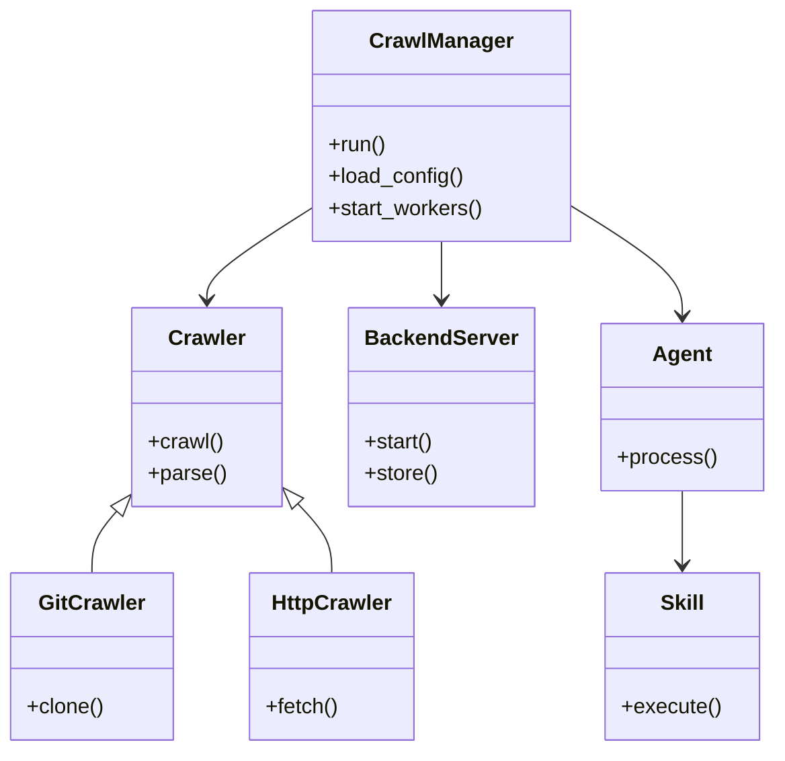
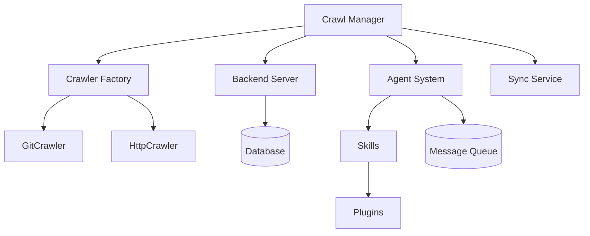

# Diagram: entity_core/entity_search/config/config.prod-b.yml

> Auto-generated by Obscura crawlers

## Diagram 1

### SVG

<svg id="container" width="570.1484375" xmlns="http://www.w3.org/2000/svg" class="classDiagram" height="566" viewBox="0 0 570.1484375 566" role="graphics-document document" aria-roledescription="class"><g><defs><marker id="container_class-aggregationStart" class="marker aggregation class" refX="18" refY="7" markerWidth="190" markerHeight="240" orient="auto"><path d="M 18,7 L9,13 L1,7 L9,1 Z"></path></marker></defs><defs><marker id="container_class-aggregationEnd" class="marker aggregation class" refX="1" refY="7" markerWidth="20" markerHeight="28" orient="auto"><path d="M 18,7 L9,13 L1,7 L9,1 Z"></path></marker></defs><defs><marker id="container_class-extensionStart" class="marker extension class" refX="18" refY="7" markerWidth="190" markerHeight="240" orient="auto"><path d="M 1,7 L18,13 V 1 Z"></path></marker></defs><defs><marker id="container_class-extensionEnd" class="marker extension class" refX="1" refY="7" markerWidth="20" markerHeight="28" orient="auto"><path d="M 1,1 V 13 L18,7 Z"></path></marker></defs><defs><marker id="container_class-compositionStart" class="marker composition class" refX="18" refY="7" markerWidth="190" markerHeight="240" orient="auto"><path d="M 18,7 L9,13 L1,7 L9,1 Z"></path></marker></defs><defs><marker id="container_class-compositionEnd" class="marker composition class" refX="1" refY="7" markerWidth="20" markerHeight="28" orient="auto"><path d="M 18,7 L9,13 L1,7 L9,1 Z"></path></marker></defs><defs><marker id="container_class-dependencyStart" class="marker dependency class" refX="6" refY="7" markerWidth="190" markerHeight="240" orient="auto"><path d="M 5,7 L9,13 L1,7 L9,1 Z"></path></marker></defs><defs><marker id="container_class-dependencyEnd" class="marker dependency class" refX="13" refY="7" markerWidth="20" markerHeight="28" orient="auto"><path d="M 18,7 L9,13 L14,7 L9,1 Z"></path></marker></defs><defs><marker id="container_class-lollipopStart" class="marker lollipop class" refX="13" refY="7" markerWidth="190" markerHeight="240" orient="auto"><circle stroke="black" fill="transparent" cx="7" cy="7" r="6"></circle></marker></defs><defs><marker id="container_class-lollipopEnd" class="marker lollipop class" refX="1" refY="7" markerWidth="190" markerHeight="240" orient="auto"><circle stroke="black" fill="transparent" cx="7" cy="7" r="6"></circle></marker></defs><g class="root"><g class="clusters"></g><g class="edgePaths"><path d="M229.719,157.698L217.078,165.915C204.438,174.132,179.156,190.566,166.516,201.95C153.875,213.333,153.875,219.667,153.875,222.833L153.875,226" id="id_CrawlManager_Crawler_1" class="edge-thickness-normal edge-pattern-solid relation" style=";;;" data-edge="true" data-et="edge" data-id="id_CrawlManager_Crawler_1" data-points="W3sieCI6MjI5LjcxODc1LCJ5IjoxNTcuNjk4NDY3Mzk4MjA0NH0seyJ4IjoxNTMuODc1LCJ5IjoyMDd9LHsieCI6MTUzLjg3NSwieSI6MjMyfV0=" marker-end="url(#container_class-dependencyEnd)"></path><path d="M326.172,182L326.172,186.167C326.172,190.333,326.172,198.667,326.172,206C326.172,213.333,326.172,219.667,326.172,222.833L326.172,226" id="id_CrawlManager_BackendServer_2" class="edge-thickness-normal edge-pattern-solid relation" style=";;;" data-edge="true" data-et="edge" data-id="id_CrawlManager_BackendServer_2" data-points="W3sieCI6MzI2LjE3MTg3NSwieSI6MTgyfSx7IngiOjMyNi4xNzE4NzUsInkiOjIwN30seyJ4IjozMjYuMTcxODc1LCJ5IjoyMzJ9XQ==" marker-end="url(#container_class-dependencyEnd)"></path><path d="M422.625,156.181L435.978,164.651C449.331,173.121,476.036,190.06,489.389,203.697C502.742,217.333,502.742,227.667,502.742,232.833L502.742,238" id="id_CrawlManager_Agent_3" class="edge-thickness-normal edge-pattern-solid relation" style=";;;" data-edge="true" data-et="edge" data-id="id_CrawlManager_Agent_3" data-points="W3sieCI6NDIyLjYyNSwieSI6MTU2LjE4MTAwOTY4OTgzNjc0fSx7IngiOjUwMi43NDIxODc1LCJ5IjoyMDd9LHsieCI6NTAyLjc0MjE4NzUsInkiOjI0NH1d" marker-end="url(#container_class-dependencyEnd)"></path><path d="M87.515,384.409L84.287,388.174C81.06,391.939,74.604,399.47,71.376,407.401C68.148,415.333,68.148,423.667,68.148,427.833L68.148,432" id="id_Crawler_GitCrawler_4" class="edge-thickness-normal edge-pattern-solid relation" style=";;;" data-edge="true" data-et="edge" data-id="id_Crawler_GitCrawler_4" data-points="W3sieCI6OTguNzQyMTg3NSwieSI6MzcxLjMxMjQwMzE3MTQyMDh9LHsieCI6NjguMTQ4NDM3NSwieSI6NDA3fSx7IngiOjY4LjE0ODQzNzUsInkiOjQzMn1d" marker-start="url(#container_class-extensionStart)"></path><path d="M220.561,380.934L224.48,385.278C228.398,389.623,236.235,398.311,240.154,406.822C244.072,415.333,244.072,423.667,244.072,427.833L244.072,432" id="id_Crawler_HttpCrawler_5" class="edge-thickness-normal edge-pattern-solid relation" style=";;;" data-edge="true" data-et="edge" data-id="id_Crawler_HttpCrawler_5" data-points="W3sieCI6MjA5LjAwNzgxMjUsInkiOjM2OC4xMjQ3MDQ5NjUyNDU0fSx7IngiOjI0NC4wNzIyNjU2MjUsInkiOjQwN30seyJ4IjoyNDQuMDcyMjY1NjI1LCJ5Ijo0MzJ9XQ==" marker-start="url(#container_class-extensionStart)"></path><path d="M502.742,370L502.742,376.167C502.742,382.333,502.742,394.667,502.742,404C502.742,413.333,502.742,419.667,502.742,422.833L502.742,426" id="id_Agent_Skill_6" class="edge-thickness-normal edge-pattern-solid relation" style=";;;" data-edge="true" data-et="edge" data-id="id_Agent_Skill_6" data-points="W3sieCI6NTAyLjc0MjE4NzUsInkiOjM3MH0seyJ4Ijo1MDIuNzQyMTg3NSwieSI6NDA3fSx7IngiOjUwMi43NDIxODc1LCJ5Ijo0MzJ9XQ==" marker-end="url(#container_class-dependencyEnd)"></path></g><g class="edgeLabels"><g class="edgeLabel"><g class="label" data-id="id_CrawlManager_Crawler_1" transform="translate(0, 0)"><foreignObject width="0" height="0">

</foreignObject></g></g><g class="edgeLabel"><g class="label" data-id="id_CrawlManager_BackendServer_2" transform="translate(0, 0)"><foreignObject width="0" height="0">

</foreignObject></g></g><g class="edgeLabel"><g class="label" data-id="id_CrawlManager_Agent_3" transform="translate(0, 0)"><foreignObject width="0" height="0">

</foreignObject></g></g><g class="edgeLabel"><g class="label" data-id="id_Crawler_GitCrawler_4" transform="translate(0, 0)"><foreignObject width="0" height="0">

</foreignObject></g></g><g class="edgeLabel"><g class="label" data-id="id_Crawler_HttpCrawler_5" transform="translate(0, 0)"><foreignObject width="0" height="0">

</foreignObject></g></g><g class="edgeLabel"><g class="label" data-id="id_Agent_Skill_6" transform="translate(0, 0)"><foreignObject width="0" height="0">

</foreignObject></g></g></g><g class="nodes"><g class="node default" id="classId-CrawlManager-0" transform="translate(326.171875, 95)"><g class="basic label-container"><path d="M-96.453125 -87 L96.453125 -87 L96.453125 87 L-96.453125 87" stroke="none" stroke-width="0" fill="#ECECFF" style=""></path><path d="M-96.453125 -87 C-46.52503014995077 -87, 3.4030647000984544 -87, 96.453125 -87 M-96.453125 -87 C-39.739604106854536 -87, 16.97391678629093 -87, 96.453125 -87 M96.453125 -87 C96.453125 -29.60756299188074, 96.453125 27.78487401623852, 96.453125 87 M96.453125 -87 C96.453125 -26.26298404228229, 96.453125 34.47403191543542, 96.453125 87 M96.453125 87 C42.2018718854151 87, -12.049381229169796 87, -96.453125 87 M96.453125 87 C50.012555478255145 87, 3.5719859565102894 87, -96.453125 87 M-96.453125 87 C-96.453125 50.71538958221556, -96.453125 14.430779164431115, -96.453125 -87 M-96.453125 87 C-96.453125 19.105464119915, -96.453125 -48.78907176017, -96.453125 -87" stroke="#9370DB" stroke-width="1.3" fill="none" stroke-dasharray="0 0" style=""></path></g><g class="annotation-group text" transform="translate(0, -63)"></g><g class="label-group text" transform="translate(-51.59375, -63)"><g class="label" style="font-weight: bolder" transform="translate(0,-12)"><foreignObject width="103.1875" height="24">

CrawlManager

</foreignObject></g></g><g class="members-group text" transform="translate(-84.453125, -15)"></g><g class="methods-group text" transform="translate(-84.453125, 15)"><g class="label" style="" transform="translate(0,-12)"><foreignObject width="43.21875" height="24">

+run()

</foreignObject></g><g class="label" style="" transform="translate(0,12)"><foreignObject width="101.984375" height="24">

+load_config()

</foreignObject></g><g class="label" style="" transform="translate(0,36)"><foreignObject width="117.3125" height="24">

+start_workers()

</foreignObject></g></g><g class="divider" style=""><path d="M-96.453125 -39 C-26.57905125167315 -39, 43.2950224966537 -39, 96.453125 -39 M-96.453125 -39 C-24.38942040487217 -39, 47.67428419025566 -39, 96.453125 -39" stroke="#9370DB" stroke-width="1.3" fill="none" stroke-dasharray="0 0" style=""></path></g><g class="divider" style=""><path d="M-96.453125 -15 C-31.816825768990128 -15, 32.819473462019744 -15, 96.453125 -15 M-96.453125 -15 C-26.26226178266552 -15, 43.92860143466896 -15, 96.453125 -15" stroke="#9370DB" stroke-width="1.3" fill="none" stroke-dasharray="0 0" style=""></path></g></g><g class="node default" id="classId-Crawler-1" transform="translate(153.875, 307)"><g class="basic label-container"><path d="M-55.1328125 -75 L55.1328125 -75 L55.1328125 75 L-55.1328125 75" stroke="none" stroke-width="0" fill="#ECECFF" style=""></path><path d="M-55.1328125 -75 C-17.714351212217068 -75, 19.704110075565865 -75, 55.1328125 -75 M-55.1328125 -75 C-20.031739665690004 -75, 15.069333168619991 -75, 55.1328125 -75 M55.1328125 -75 C55.1328125 -24.50119828958354, 55.1328125 25.997603420832917, 55.1328125 75 M55.1328125 -75 C55.1328125 -42.69593219581387, 55.1328125 -10.391864391627735, 55.1328125 75 M55.1328125 75 C29.721781949942827 75, 4.310751399885653 75, -55.1328125 75 M55.1328125 75 C11.446103325754521 75, -32.24060584849096 75, -55.1328125 75 M-55.1328125 75 C-55.1328125 32.98953849059269, -55.1328125 -9.020923018814614, -55.1328125 -75 M-55.1328125 75 C-55.1328125 29.99238060885628, -55.1328125 -15.01523878228744, -55.1328125 -75" stroke="#9370DB" stroke-width="1.3" fill="none" stroke-dasharray="0 0" style=""></path></g><g class="annotation-group text" transform="translate(0, -51)"></g><g class="label-group text" transform="translate(-27.734375, -51)"><g class="label" style="font-weight: bolder" transform="translate(0,-12)"><foreignObject width="55.46875" height="24">

Crawler

</foreignObject></g></g><g class="members-group text" transform="translate(-43.1328125, -3)"></g><g class="methods-group text" transform="translate(-43.1328125, 27)"><g class="label" style="" transform="translate(0,-12)"><foreignObject width="56.40625" height="24">

+crawl()

</foreignObject></g><g class="label" style="" transform="translate(0,12)"><foreignObject width="58.53125" height="24">

+parse()

</foreignObject></g></g><g class="divider" style=""><path d="M-55.1328125 -27 C-25.918472993874886 -27, 3.295866512250228 -27, 55.1328125 -27 M-55.1328125 -27 C-24.683835097910173 -27, 5.765142304179655 -27, 55.1328125 -27" stroke="#9370DB" stroke-width="1.3" fill="none" stroke-dasharray="0 0" style=""></path></g><g class="divider" style=""><path d="M-55.1328125 -3 C-29.897004815339518 -3, -4.661197130679035 -3, 55.1328125 -3 M-55.1328125 -3 C-24.20520801625874 -3, 6.722396467482518 -3, 55.1328125 -3" stroke="#9370DB" stroke-width="1.3" fill="none" stroke-dasharray="0 0" style=""></path></g></g><g class="node default" id="classId-GitCrawler-2" transform="translate(68.1484375, 495)"><g class="basic label-container"><path d="M-60.1484375 -63 L60.1484375 -63 L60.1484375 63 L-60.1484375 63" stroke="none" stroke-width="0" fill="#ECECFF" style=""></path><path d="M-60.1484375 -63 C-27.565060107939352 -63, 5.018317284121295 -63, 60.1484375 -63 M-60.1484375 -63 C-14.823261041736778 -63, 30.501915416526444 -63, 60.1484375 -63 M60.1484375 -63 C60.1484375 -29.93459841863782, 60.1484375 3.130803162724362, 60.1484375 63 M60.1484375 -63 C60.1484375 -29.979434230654903, 60.1484375 3.0411315386901947, 60.1484375 63 M60.1484375 63 C26.67073506823634 63, -6.8069673635273205 63, -60.1484375 63 M60.1484375 63 C14.288611412014085 63, -31.57121467597183 63, -60.1484375 63 M-60.1484375 63 C-60.1484375 24.29418552051913, -60.1484375 -14.411628958961742, -60.1484375 -63 M-60.1484375 63 C-60.1484375 25.75358997989221, -60.1484375 -11.492820040215577, -60.1484375 -63" stroke="#9370DB" stroke-width="1.3" fill="none" stroke-dasharray="0 0" style=""></path></g><g class="annotation-group text" transform="translate(0, -39)"></g><g class="label-group text" transform="translate(-38.234375, -39)"><g class="label" style="font-weight: bolder" transform="translate(0,-12)"><foreignObject width="76.46875" height="24">

GitCrawler

</foreignObject></g></g><g class="members-group text" transform="translate(-48.1484375, 9)"></g><g class="methods-group text" transform="translate(-48.1484375, 39)"><g class="label" style="" transform="translate(0,-12)"><foreignObject width="58.0625" height="24">

+clone()

</foreignObject></g></g><g class="divider" style=""><path d="M-60.1484375 -15 C-12.662075959613396 -15, 34.82428558077321 -15, 60.1484375 -15 M-60.1484375 -15 C-35.31963905792562 -15, -10.49084061585124 -15, 60.1484375 -15" stroke="#9370DB" stroke-width="1.3" fill="none" stroke-dasharray="0 0" style=""></path></g><g class="divider" style=""><path d="M-60.1484375 9 C-21.351958775892896 9, 17.444519948214207 9, 60.1484375 9 M-60.1484375 9 C-16.871893792158303 9, 26.404649915683393 9, 60.1484375 9" stroke="#9370DB" stroke-width="1.3" fill="none" stroke-dasharray="0 0" style=""></path></g></g><g class="node default" id="classId-HttpCrawler-3" transform="translate(244.072265625, 495)"><g class="basic label-container"><path d="M-61.3046875 -63 L61.3046875 -63 L61.3046875 63 L-61.3046875 63" stroke="none" stroke-width="0" fill="#ECECFF" style=""></path><path d="M-61.3046875 -63 C-14.679559604923007 -63, 31.945568290153986 -63, 61.3046875 -63 M-61.3046875 -63 C-34.43370840082052 -63, -7.562729301641042 -63, 61.3046875 -63 M61.3046875 -63 C61.3046875 -20.8793077077055, 61.3046875 21.241384584589, 61.3046875 63 M61.3046875 -63 C61.3046875 -14.750085568065678, 61.3046875 33.49982886386864, 61.3046875 63 M61.3046875 63 C28.113343405587074 63, -5.078000688825853 63, -61.3046875 63 M61.3046875 63 C23.380955005249902 63, -14.542777489500196 63, -61.3046875 63 M-61.3046875 63 C-61.3046875 35.52413541165724, -61.3046875 8.048270823314489, -61.3046875 -63 M-61.3046875 63 C-61.3046875 26.051461026885434, -61.3046875 -10.897077946229132, -61.3046875 -63" stroke="#9370DB" stroke-width="1.3" fill="none" stroke-dasharray="0 0" style=""></path></g><g class="annotation-group text" transform="translate(0, -39)"></g><g class="label-group text" transform="translate(-44.015625, -39)"><g class="label" style="font-weight: bolder" transform="translate(0,-12)"><foreignObject width="88.03125" height="24">

HttpCrawler

</foreignObject></g></g><g class="members-group text" transform="translate(-49.3046875, 9)"></g><g class="methods-group text" transform="translate(-49.3046875, 39)"><g class="label" style="" transform="translate(0,-12)"><foreignObject width="54.59375" height="24">

+fetch()

</foreignObject></g></g><g class="divider" style=""><path d="M-61.3046875 -15 C-13.03493054821346 -15, 35.23482640357308 -15, 61.3046875 -15 M-61.3046875 -15 C-19.448287461105643 -15, 22.408112577788714 -15, 61.3046875 -15" stroke="#9370DB" stroke-width="1.3" fill="none" stroke-dasharray="0 0" style=""></path></g><g class="divider" style=""><path d="M-61.3046875 9 C-19.580783320935133 9, 22.143120858129734 9, 61.3046875 9 M-61.3046875 9 C-16.704459808737298 9, 27.895767882525405 9, 61.3046875 9" stroke="#9370DB" stroke-width="1.3" fill="none" stroke-dasharray="0 0" style=""></path></g></g><g class="node default" id="classId-BackendServer-4" transform="translate(326.171875, 307)"><g class="basic label-container"><path d="M-67.1640625 -75 L67.1640625 -75 L67.1640625 75 L-67.1640625 75" stroke="none" stroke-width="0" fill="#ECECFF" style=""></path><path d="M-67.1640625 -75 C-15.267287085738772 -75, 36.629488328522456 -75, 67.1640625 -75 M-67.1640625 -75 C-34.96832302986749 -75, -2.772583559734983 -75, 67.1640625 -75 M67.1640625 -75 C67.1640625 -43.266707329555686, 67.1640625 -11.533414659111372, 67.1640625 75 M67.1640625 -75 C67.1640625 -38.95584627076901, 67.1640625 -2.9116925415380166, 67.1640625 75 M67.1640625 75 C26.014738587657924 75, -15.134585324684153 75, -67.1640625 75 M67.1640625 75 C21.879526165395383 75, -23.405010169209234 75, -67.1640625 75 M-67.1640625 75 C-67.1640625 35.20665434729855, -67.1640625 -4.586691305402894, -67.1640625 -75 M-67.1640625 75 C-67.1640625 34.14206084766578, -67.1640625 -6.715878304668436, -67.1640625 -75" stroke="#9370DB" stroke-width="1.3" fill="none" stroke-dasharray="0 0" style=""></path></g><g class="annotation-group text" transform="translate(0, -51)"></g><g class="label-group text" transform="translate(-55.1640625, -51)"><g class="label" style="font-weight: bolder" transform="translate(0,-12)"><foreignObject width="110.328125" height="24">

BackendServer

</foreignObject></g></g><g class="members-group text" transform="translate(-55.1640625, -3)"></g><g class="methods-group text" transform="translate(-55.1640625, 27)"><g class="label" style="" transform="translate(0,-12)"><foreignObject width="52.15625" height="24">

+start()

</foreignObject></g><g class="label" style="" transform="translate(0,12)"><foreignObject width="55.125" height="24">

+store()

</foreignObject></g></g><g class="divider" style=""><path d="M-67.1640625 -27 C-35.442544323426944 -27, -3.7210261468538945 -27, 67.1640625 -27 M-67.1640625 -27 C-29.188924207667753 -27, 8.786214084664493 -27, 67.1640625 -27" stroke="#9370DB" stroke-width="1.3" fill="none" stroke-dasharray="0 0" style=""></path></g><g class="divider" style=""><path d="M-67.1640625 -3 C-15.324864661421842 -3, 36.51433317715632 -3, 67.1640625 -3 M-67.1640625 -3 C-25.47751080767444 -3, 16.209040884651117 -3, 67.1640625 -3" stroke="#9370DB" stroke-width="1.3" fill="none" stroke-dasharray="0 0" style=""></path></g></g><g class="node default" id="classId-Agent-5" transform="translate(502.7421875, 307)"><g class="basic label-container"><path d="M-59.40625 -63 L59.40625 -63 L59.40625 63 L-59.40625 63" stroke="none" stroke-width="0" fill="#ECECFF" style=""></path><path d="M-59.40625 -63 C-24.97719246935111 -63, 9.45186506129778 -63, 59.40625 -63 M-59.40625 -63 C-24.663939807520535 -63, 10.07837038495893 -63, 59.40625 -63 M59.40625 -63 C59.40625 -31.77532076582323, 59.40625 -0.5506415316464626, 59.40625 63 M59.40625 -63 C59.40625 -14.349690761972973, 59.40625 34.300618476054055, 59.40625 63 M59.40625 63 C26.095420472146436 63, -7.215409055707127 63, -59.40625 63 M59.40625 63 C26.107230244481464 63, -7.191789511037072 63, -59.40625 63 M-59.40625 63 C-59.40625 20.239211614833877, -59.40625 -22.521576770332246, -59.40625 -63 M-59.40625 63 C-59.40625 22.935694364386343, -59.40625 -17.128611271227314, -59.40625 -63" stroke="#9370DB" stroke-width="1.3" fill="none" stroke-dasharray="0 0" style=""></path></g><g class="annotation-group text" transform="translate(0, -39)"></g><g class="label-group text" transform="translate(-21.078125, -39)"><g class="label" style="font-weight: bolder" transform="translate(0,-12)"><foreignObject width="42.15625" height="24">

Agent

</foreignObject></g></g><g class="members-group text" transform="translate(-47.40625, 9)"></g><g class="methods-group text" transform="translate(-47.40625, 39)"><g class="label" style="" transform="translate(0,-12)"><foreignObject width="73.734375" height="24">

+process()

</foreignObject></g></g><g class="divider" style=""><path d="M-59.40625 -15 C-34.43444487031712 -15, -9.462639740634245 -15, 59.40625 -15 M-59.40625 -15 C-18.32930284332403 -15, 22.74764431335194 -15, 59.40625 -15" stroke="#9370DB" stroke-width="1.3" fill="none" stroke-dasharray="0 0" style=""></path></g><g class="divider" style=""><path d="M-59.40625 9 C-26.091434803731723 9, 7.223380392536555 9, 59.40625 9 M-59.40625 9 C-14.525518525130025 9, 30.35521294973995 9, 59.40625 9" stroke="#9370DB" stroke-width="1.3" fill="none" stroke-dasharray="0 0" style=""></path></g></g><g class="node default" id="classId-Skill-6" transform="translate(502.7421875, 495)"><g class="basic label-container"><path d="M-57.16796875 -63 L57.16796875 -63 L57.16796875 63 L-57.16796875 63" stroke="none" stroke-width="0" fill="#ECECFF" style=""></path><path d="M-57.16796875 -63 C-31.289726216513387 -63, -5.411483683026773 -63, 57.16796875 -63 M-57.16796875 -63 C-16.14641078565046 -63, 24.87514717869908 -63, 57.16796875 -63 M57.16796875 -63 C57.16796875 -21.809351853114393, 57.16796875 19.381296293771214, 57.16796875 63 M57.16796875 -63 C57.16796875 -24.88746343688785, 57.16796875 13.225073126224302, 57.16796875 63 M57.16796875 63 C20.658933149704097 63, -15.850102450591805 63, -57.16796875 63 M57.16796875 63 C12.76362061841563 63, -31.64072751316874 63, -57.16796875 63 M-57.16796875 63 C-57.16796875 19.072689957488834, -57.16796875 -24.854620085022333, -57.16796875 -63 M-57.16796875 63 C-57.16796875 20.199152660327208, -57.16796875 -22.601694679345584, -57.16796875 -63" stroke="#9370DB" stroke-width="1.3" fill="none" stroke-dasharray="0 0" style=""></path></g><g class="annotation-group text" transform="translate(0, -39)"></g><g class="label-group text" transform="translate(-16.0078125, -39)"><g class="label" style="font-weight: bolder" transform="translate(0,-12)"><foreignObject width="32.015625" height="24">

Skill

</foreignObject></g></g><g class="members-group text" transform="translate(-45.16796875, 9)"></g><g class="methods-group text" transform="translate(-45.16796875, 39)"><g class="label" style="" transform="translate(0,-12)"><foreignObject width="74.328125" height="24">

+execute()

</foreignObject></g></g><g class="divider" style=""><path d="M-57.16796875 -15 C-14.372658115395964 -15, 28.42265251920807 -15, 57.16796875 -15 M-57.16796875 -15 C-26.950203435933506 -15, 3.2675618781329874 -15, 57.16796875 -15" stroke="#9370DB" stroke-width="1.3" fill="none" stroke-dasharray="0 0" style=""></path></g><g class="divider" style=""><path d="M-57.16796875 9 C-27.439457073479698 9, 2.2890546030406043 9, 57.16796875 9 M-57.16796875 9 C-33.557836885602185 9, -9.947705021204364 9, 57.16796875 9" stroke="#9370DB" stroke-width="1.3" fill="none" stroke-dasharray="0 0" style=""></path></g></g></g></g></g></svg>

## Diagram 2

### SVG

<svg id="container" width="1003.24609375" xmlns="http://www.w3.org/2000/svg" class="flowchart" height="404.8689880371094" viewBox="0 0 1003.24609375 404.8689880371094" role="graphics-document document" aria-roledescription="flowchart-v2"><g><marker id="container_flowchart-v2-pointEnd" class="marker flowchart-v2" viewBox="0 0 10 10" refX="5" refY="5" markerUnits="userSpaceOnUse" markerWidth="8" markerHeight="8" orient="auto"><path d="M 0 0 L 10 5 L 0 10 z" class="arrowMarkerPath" style="stroke-width: 1; stroke-dasharray: 1, 0;"></path></marker><marker id="container_flowchart-v2-pointStart" class="marker flowchart-v2" viewBox="0 0 10 10" refX="4.5" refY="5" markerUnits="userSpaceOnUse" markerWidth="8" markerHeight="8" orient="auto"><path d="M 0 5 L 10 10 L 10 0 z" class="arrowMarkerPath" style="stroke-width: 1; stroke-dasharray: 1, 0;"></path></marker><marker id="container_flowchart-v2-circleEnd" class="marker flowchart-v2" viewBox="0 0 10 10" refX="11" refY="5" markerUnits="userSpaceOnUse" markerWidth="11" markerHeight="11" orient="auto"><circle cx="5" cy="5" r="5" class="arrowMarkerPath" style="stroke-width: 1; stroke-dasharray: 1, 0;"></circle></marker><marker id="container_flowchart-v2-circleStart" class="marker flowchart-v2" viewBox="0 0 10 10" refX="-1" refY="5" markerUnits="userSpaceOnUse" markerWidth="11" markerHeight="11" orient="auto"><circle cx="5" cy="5" r="5" class="arrowMarkerPath" style="stroke-width: 1; stroke-dasharray: 1, 0;"></circle></marker><marker id="container_flowchart-v2-crossEnd" class="marker cross flowchart-v2" viewBox="0 0 11 11" refX="12" refY="5.2" markerUnits="userSpaceOnUse" markerWidth="11" markerHeight="11" orient="auto"><path d="M 1,1 l 9,9 M 10,1 l -9,9" class="arrowMarkerPath" style="stroke-width: 2; stroke-dasharray: 1, 0;"></path></marker><marker id="container_flowchart-v2-crossStart" class="marker cross flowchart-v2" viewBox="0 0 11 11" refX="-1" refY="5.2" markerUnits="userSpaceOnUse" markerWidth="11" markerHeight="11" orient="auto"><path d="M 1,1 l 9,9 M 10,1 l -9,9" class="arrowMarkerPath" style="stroke-width: 2; stroke-dasharray: 1, 0;"></path></marker><g class="root"><g class="clusters"></g><g class="edgePaths"><path d="M526.871,44.788L467.428,51.824C407.986,58.859,289.1,72.929,229.658,83.465C170.215,94,170.215,101,170.215,104.5L170.215,108" id="L_CM_CF_0" class="edge-thickness-normal edge-pattern-solid edge-thickness-normal edge-pattern-solid flowchart-link" style=";" data-edge="true" data-et="edge" data-id="L_CM_CF_0" data-points="W3sieCI6NTI2Ljg3MTA5Mzc1LCJ5Ijo0NC43ODgyNTcwNTAzOTI5N30seyJ4IjoxNzAuMjE0ODQzNzUsInkiOjg3fSx7IngiOjE3MC4yMTQ4NDM3NSwieSI6MTEyfV0=" marker-end="url(#container_flowchart-v2-pointEnd)"></path><path d="M120.862,166L113.245,170.167C105.629,174.333,90.397,182.667,82.78,192.239C75.164,201.811,75.164,212.623,75.164,218.029L75.164,223.434" id="L_CF_GC_0" class="edge-thickness-normal edge-pattern-solid edge-thickness-normal edge-pattern-solid flowchart-link" style=";" data-edge="true" data-et="edge" data-id="L_CF_GC_0" data-points="W3sieCI6MTIwLjg2MTU1MzQ4NTU3NjkyLCJ5IjoxNjZ9LHsieCI6NzUuMTY0MDYyNSwieSI6MTkxfSx7IngiOjc1LjE2NDA2MjUsInkiOjIyNy40MzQ0OTc4MzMyNTE5NX1d" marker-end="url(#container_flowchart-v2-pointEnd)"></path><path d="M219.568,166L227.184,170.167C234.801,174.333,250.033,182.667,257.649,192.239C265.266,201.811,265.266,212.623,265.266,218.029L265.266,223.434" id="L_CF_HC_0" class="edge-thickness-normal edge-pattern-solid edge-thickness-normal edge-pattern-solid flowchart-link" style=";" data-edge="true" data-et="edge" data-id="L_CF_HC_0" data-points="W3sieCI6MjE5LjU2ODEzNDAxNDQyMzEsInkiOjE2Nn0seyJ4IjoyNjUuMjY1NjI1LCJ5IjoxOTF9LHsieCI6MjY1LjI2NTYyNSwieSI6MjI3LjQzNDQ5NzgzMzI1MTk1fV0=" marker-end="url(#container_flowchart-v2-pointEnd)"></path><path d="M530.866,62L518.72,66.167C506.574,70.333,482.281,78.667,470.135,86.333C457.988,94,457.988,101,457.988,104.5L457.988,108" id="L_CM_BE_0" class="edge-thickness-normal edge-pattern-solid edge-thickness-normal edge-pattern-solid flowchart-link" style=";" data-edge="true" data-et="edge" data-id="L_CM_BE_0" data-points="W3sieCI6NTMwLjg2NjEzNTgxNzMwNzcsInkiOjYyfSx7IngiOjQ1Ny45ODgyODEyNSwieSI6ODd9LHsieCI6NDU3Ljk4ODI4MTI1LCJ5IjoxMTJ9XQ==" marker-end="url(#container_flowchart-v2-pointEnd)"></path><path d="M457.988,166L457.988,170.167C457.988,174.333,457.988,182.667,457.988,191.008C457.988,199.349,457.988,207.698,457.988,211.872L457.988,216.047" id="L_BE_DB_0" class="edge-thickness-normal edge-pattern-solid edge-thickness-normal edge-pattern-solid flowchart-link" style=";" data-edge="true" data-et="edge" data-id="L_BE_DB_0" data-points="W3sieCI6NDU3Ljk4ODI4MTI1LCJ5IjoxNjZ9LHsieCI6NDU3Ljk4ODI4MTI1LCJ5IjoxOTF9LHsieCI6NDU3Ljk4ODI4MTI1LCJ5IjoyMjAuMDQ2OTkzMjU1NjE1MjN9XQ==" marker-end="url(#container_flowchart-v2-pointEnd)"></path><path d="M665.323,62L673.926,66.167C682.529,70.333,699.735,78.667,708.338,86.333C716.941,94,716.941,101,716.941,104.5L716.941,108" id="L_CM_AG_0" class="edge-thickness-normal edge-pattern-solid edge-thickness-normal edge-pattern-solid flowchart-link" style=";" data-edge="true" data-et="edge" data-id="L_CM_AG_0" data-points="W3sieCI6NjY1LjMyMjU2NjEwNTc2OTMsInkiOjYyfSx7IngiOjcxNi45NDE0MDYyNSwieSI6ODd9LHsieCI6NzE2Ljk0MTQwNjI1LCJ5IjoxMTJ9XQ==" marker-end="url(#container_flowchart-v2-pointEnd)"></path><path d="M674.655,166L668.129,170.167C661.603,174.333,648.552,182.667,642.026,192.239C635.5,201.811,635.5,212.623,635.5,218.029L635.5,223.434" id="L_AG_SK_0" class="edge-thickness-normal edge-pattern-solid edge-thickness-normal edge-pattern-solid flowchart-link" style=";" data-edge="true" data-et="edge" data-id="L_AG_SK_0" data-points="W3sieCI6Njc0LjY1NDUyMjIzNTU3NjksInkiOjE2Nn0seyJ4Ijo2MzUuNSwieSI6MTkxfSx7IngiOjYzNS41LCJ5IjoyMjcuNDM0NDk3ODMzMjUxOTV9XQ==" marker-end="url(#container_flowchart-v2-pointEnd)"></path><path d="M759.228,166L765.754,170.167C772.28,174.333,785.331,182.667,791.857,190.333C798.383,198,798.383,205,798.383,208.5L798.383,212" id="L_AG_MQ_0" class="edge-thickness-normal edge-pattern-solid edge-thickness-normal edge-pattern-solid flowchart-link" style=";" data-edge="true" data-et="edge" data-id="L_AG_MQ_0" data-points="W3sieCI6NzU5LjIyODI5MDI2NDQyMzEsInkiOjE2Nn0seyJ4Ijo3OTguMzgyODEyNSwieSI6MTkxfSx7IngiOjc5OC4zODI4MTI1LCJ5IjoyMTZ9XQ==" marker-end="url(#container_flowchart-v2-pointEnd)"></path><path d="M692.277,48.837L730.293,55.198C768.309,61.558,844.34,74.279,882.355,84.14C920.371,94,920.371,101,920.371,104.5L920.371,108" id="L_CM_SY_0" class="edge-thickness-normal edge-pattern-solid edge-thickness-normal edge-pattern-solid flowchart-link" style=";" data-edge="true" data-et="edge" data-id="L_CM_SY_0" data-points="W3sieCI6NjkyLjI3NzM0Mzc1LCJ5Ijo0OC44MzcyMTI4MDk4MTM0OH0seyJ4Ijo5MjAuMzcxMDkzNzUsInkiOjg3fSx7IngiOjkyMC4zNzEwOTM3NSwieSI6MTEyfV0=" marker-end="url(#container_flowchart-v2-pointEnd)"></path><path d="M635.5,281.434L635.5,287.507C635.5,293.579,635.5,305.724,635.5,315.297C635.5,324.869,635.5,331.869,635.5,335.369L635.5,338.869" id="L_SK_PL_0" class="edge-thickness-normal edge-pattern-solid edge-thickness-normal edge-pattern-solid flowchart-link" style=";" data-edge="true" data-et="edge" data-id="L_SK_PL_0" data-points="W3sieCI6NjM1LjUsInkiOjI4MS40MzQ0OTc4MzMyNTE5NX0seyJ4Ijo2MzUuNSwieSI6MzE3Ljg2ODk5NTY2NjUwMzl9LHsieCI6NjM1LjUsInkiOjM0Mi44Njg5OTU2NjY1MDM5fV0=" marker-end="url(#container_flowchart-v2-pointEnd)"></path></g><g class="edgeLabels"><g class="edgeLabel"><g class="label" data-id="L_CM_CF_0" transform="translate(0, 0)"><foreignObject width="0" height="0">

</foreignObject></g></g><g class="edgeLabel"><g class="label" data-id="L_CF_GC_0" transform="translate(0, 0)"><foreignObject width="0" height="0">

</foreignObject></g></g><g class="edgeLabel"><g class="label" data-id="L_CF_HC_0" transform="translate(0, 0)"><foreignObject width="0" height="0">

</foreignObject></g></g><g class="edgeLabel"><g class="label" data-id="L_CM_BE_0" transform="translate(0, 0)"><foreignObject width="0" height="0">

</foreignObject></g></g><g class="edgeLabel"><g class="label" data-id="L_BE_DB_0" transform="translate(0, 0)"><foreignObject width="0" height="0">

</foreignObject></g></g><g class="edgeLabel"><g class="label" data-id="L_CM_AG_0" transform="translate(0, 0)"><foreignObject width="0" height="0">

</foreignObject></g></g><g class="edgeLabel"><g class="label" data-id="L_AG_SK_0" transform="translate(0, 0)"><foreignObject width="0" height="0">

</foreignObject></g></g><g class="edgeLabel"><g class="label" data-id="L_AG_MQ_0" transform="translate(0, 0)"><foreignObject width="0" height="0">

</foreignObject></g></g><g class="edgeLabel"><g class="label" data-id="L_CM_SY_0" transform="translate(0, 0)"><foreignObject width="0" height="0">

</foreignObject></g></g><g class="edgeLabel"><g class="label" data-id="L_SK_PL_0" transform="translate(0, 0)"><foreignObject width="0" height="0">

</foreignObject></g></g></g><g class="nodes"><g class="node default" id="flowchart-CM-0" transform="translate(609.57421875, 35)"><rect class="basic label-container" style="" x="-82.703125" y="-27" width="165.40625" height="54"></rect><g class="label" style="" transform="translate(-52.703125, -12)"><rect></rect><foreignObject width="105.40625" height="24">

Crawl Manager

</foreignObject></g></g><g class="node default" id="flowchart-CF-1" transform="translate(170.21484375, 139)"><rect class="basic label-container" style="" x="-85.1796875" y="-27" width="170.359375" height="54"></rect><g class="label" style="" transform="translate(-55.1796875, -12)"><rect></rect><foreignObject width="110.359375" height="24">

Crawler Factory

</foreignObject></g></g><g class="node default" id="flowchart-GC-3" transform="translate(75.1640625, 254.43449783325195)"><rect class="basic label-container" style="" x="-67.1640625" y="-27" width="134.328125" height="54"></rect><g class="label" style="" transform="translate(-37.1640625, -12)"><rect></rect><foreignObject width="74.328125" height="24">

GitCrawler

</foreignObject></g></g><g class="node default" id="flowchart-HC-5" transform="translate(265.265625, 254.43449783325195)"><rect class="basic label-container" style="" x="-72.9375" y="-27" width="145.875" height="54"></rect><g class="label" style="" transform="translate(-42.9375, -12)"><rect></rect><foreignObject width="85.875" height="24">

HttpCrawler

</foreignObject></g></g><g class="node default" id="flowchart-BE-7" transform="translate(457.98828125, 139)"><rect class="basic label-container" style="" x="-86.1796875" y="-27" width="172.359375" height="54"></rect><g class="label" style="" transform="translate(-56.1796875, -12)"><rect></rect><foreignObject width="112.359375" height="24">

Backend Server

</foreignObject></g></g><g class="node default" id="flowchart-DB-9" transform="translate(457.98828125, 254.43449783325195)"><path d="M0,9.925001884374764 a41.1484375,9.925001884374764 0,0,0 82.296875,0 a41.1484375,9.925001884374764 0,0,0 -82.296875,0 l0,48.925001884374765 a41.1484375,9.925001884374764 0,0,0 82.296875,0 l0,-48.925001884374765" class="basic label-container" style="" transform="translate(-41.1484375, -34.38750282656215)"></path><g class="label" style="" transform="translate(-33.6484375, -2)"><rect></rect><foreignObject width="67.296875" height="24">

Database

</foreignObject></g></g><g class="node default" id="flowchart-AG-11" transform="translate(716.94140625, 139)"><rect class="basic label-container" style="" x="-78.5546875" y="-27" width="157.109375" height="54"></rect><g class="label" style="" transform="translate(-48.5546875, -12)"><rect></rect><foreignObject width="97.109375" height="24">

Agent System

</foreignObject></g></g><g class="node default" id="flowchart-SK-13" transform="translate(635.5, 254.43449783325195)"><rect class="basic label-container" style="" x="-49.140625" y="-27" width="98.28125" height="54"></rect><g class="label" style="" transform="translate(-19.140625, -12)"><rect></rect><foreignObject width="38.28125" height="24">

Skills

</foreignObject></g></g><g class="node default" id="flowchart-MQ-15" transform="translate(798.3828125, 254.43449783325195)"><path d="M0,12.622996472553995 a63.7421875,12.622996472553995 0,0,0 127.484375,0 a63.7421875,12.622996472553995 0,0,0 -127.484375,0 l0,51.62299647255399 a63.7421875,12.622996472553995 0,0,0 127.484375,0 l0,-51.62299647255399" class="basic label-container" style="" transform="translate(-63.7421875, -38.43449470883099)"></path><g class="label" style="" transform="translate(-56.2421875, -2)"><rect></rect><foreignObject width="112.484375" height="24">

Message Queue

</foreignObject></g></g><g class="node default" id="flowchart-SY-17" transform="translate(920.37109375, 139)"><rect class="basic label-container" style="" x="-74.875" y="-27" width="149.75" height="54"></rect><g class="label" style="" transform="translate(-44.875, -12)"><rect></rect><foreignObject width="89.75" height="24">

Sync Service

</foreignObject></g></g><g class="node default" id="flowchart-PL-19" transform="translate(635.5, 369.8689956665039)"><rect class="basic label-container" style="" x="-56.4140625" y="-27" width="112.828125" height="54"></rect><g class="label" style="" transform="translate(-26.4140625, -12)"><rect></rect><foreignObject width="52.828125" height="24">

Plugins

</foreignObject></g></g></g></g></g></svg>
