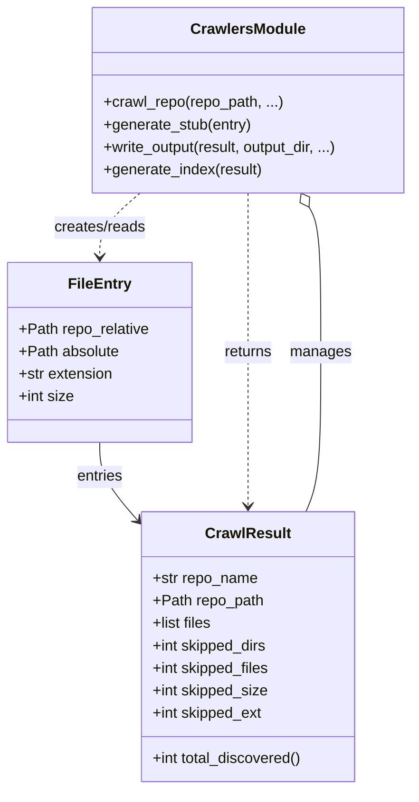

# Diagram: entity_core/entity_search/config/config.qa2.yml


> Auto-generated by Obscura crawlers

## Diagram 1



### SVG

<svg id="container" width="443.17578125" xmlns="http://www.w3.org/2000/svg" class="classDiagram" height="842" viewBox="0 0 443.17578125 842" role="graphics-document document" aria-roledescription="class"><style>#container{font-family:"trebuchet ms",verdana,arial,sans-serif;font-size:16px;fill:#333;}@keyframes edge-animation-frame{from{stroke-dashoffset:0;}}@keyframes dash{to{stroke-dashoffset:0;}}#container .edge-animation-slow{stroke-dasharray:9,5!important;stroke-dashoffset:900;animation:dash 50s linear infinite;stroke-linecap:round;}#container .edge-animation-fast{stroke-dasharray:9,5!important;stroke-dashoffset:900;animation:dash 20s linear infinite;stroke-linecap:round;}#container .error-icon{fill:#552222;}#container .error-text{fill:#552222;stroke:#552222;}#container .edge-thickness-normal{stroke-width:1px;}#container .edge-thickness-thick{stroke-width:3.5px;}#container .edge-pattern-solid{stroke-dasharray:0;}#container .edge-thickness-invisible{stroke-width:0;fill:none;}#container .edge-pattern-dashed{stroke-dasharray:3;}#container .edge-pattern-dotted{stroke-dasharray:2;}#container .marker{fill:#333333;stroke:#333333;}#container .marker.cross{stroke:#333333;}#container svg{font-family:"trebuchet ms",verdana,arial,sans-serif;font-size:16px;}#container p{margin:0;}#container g.classGroup text{fill:#9370DB;stroke:none;font-family:"trebuchet ms",verdana,arial,sans-serif;font-size:10px;}#container g.classGroup text .title{font-weight:bolder;}#container .nodeLabel,#container .edgeLabel{color:#131300;}#container .edgeLabel .label rect{fill:#ECECFF;}#container .label text{fill:#131300;}#container .labelBkg{background:#ECECFF;}#container .edgeLabel .label span{background:#ECECFF;}#container .classTitle{font-weight:bolder;}#container .node rect,#container .node circle,#container .node ellipse,#container .node polygon,#container .node path{fill:#ECECFF;stroke:#9370DB;stroke-width:1px;}#container .divider{stroke:#9370DB;stroke-width:1;}#container g.clickable{cursor:pointer;}#container g.classGroup rect{fill:#ECECFF;stroke:#9370DB;}#container g.classGroup line{stroke:#9370DB;stroke-width:1;}#container .classLabel .box{stroke:none;stroke-width:0;fill:#ECECFF;opacity:0.5;}#container .classLabel .label{fill:#9370DB;font-size:10px;}#container .relation{stroke:#333333;stroke-width:1;fill:none;}#container .dashed-line{stroke-dasharray:3;}#container .dotted-line{stroke-dasharray:1 2;}#container #compositionStart,#container .composition{fill:#333333!important;stroke:#333333!important;stroke-width:1;}#container #compositionEnd,#container .composition{fill:#333333!important;stroke:#333333!important;stroke-width:1;}#container #dependencyStart,#container .dependency{fill:#333333!important;stroke:#333333!important;stroke-width:1;}#container #dependencyStart,#container .dependency{fill:#333333!important;stroke:#333333!important;stroke-width:1;}#container #extensionStart,#container .extension{fill:transparent!important;stroke:#333333!important;stroke-width:1;}#container #extensionEnd,#container .extension{fill:transparent!important;stroke:#333333!important;stroke-width:1;}#container #aggregationStart,#container .aggregation{fill:transparent!important;stroke:#333333!important;stroke-width:1;}#container #aggregationEnd,#container .aggregation{fill:transparent!important;stroke:#333333!important;stroke-width:1;}#container #lollipopStart,#container .lollipop{fill:#ECECFF!important;stroke:#333333!important;stroke-width:1;}#container #lollipopEnd,#container .lollipop{fill:#ECECFF!important;stroke:#333333!important;stroke-width:1;}#container .edgeTerminals{font-size:11px;line-height:initial;}#container .classTitleText{text-anchor:middle;font-size:18px;fill:#333;}#container .label-icon{display:inline-block;height:1em;overflow:visible;vertical-align:-0.125em;}#container .node .label-icon path{fill:currentColor;stroke:revert;stroke-width:revert;}#container :root{--mermaid-font-family:"trebuchet ms",verdana,arial,sans-serif;}</style><g><defs><marker id="container_class-aggregationStart" class="marker aggregation class" refX="18" refY="7" markerWidth="190" markerHeight="240" orient="auto"><path d="M 18,7 L9,13 L1,7 L9,1 Z"></path></marker></defs><defs><marker id="container_class-aggregationEnd" class="marker aggregation class" refX="1" refY="7" markerWidth="20" markerHeight="28" orient="auto"><path d="M 18,7 L9,13 L1,7 L9,1 Z"></path></marker></defs><defs><marker id="container_class-extensionStart" class="marker extension class" refX="18" refY="7" markerWidth="190" markerHeight="240" orient="auto"><path d="M 1,7 L18,13 V 1 Z"></path></marker></defs><defs><marker id="container_class-extensionEnd" class="marker extension class" refX="1" refY="7" markerWidth="20" markerHeight="28" orient="auto"><path d="M 1,1 V 13 L18,7 Z"></path></marker></defs><defs><marker id="container_class-compositionStart" class="marker composition class" refX="18" refY="7" markerWidth="190" markerHeight="240" orient="auto"><path d="M 18,7 L9,13 L1,7 L9,1 Z"></path></marker></defs><defs><marker id="container_class-compositionEnd" class="marker composition class" refX="1" refY="7" markerWidth="20" markerHeight="28" orient="auto"><path d="M 18,7 L9,13 L1,7 L9,1 Z"></path></marker></defs><defs><marker id="container_class-dependencyStart" class="marker dependency class" refX="6" refY="7" markerWidth="190" markerHeight="240" orient="auto"><path d="M 5,7 L9,13 L1,7 L9,1 Z"></path></marker></defs><defs><marker id="container_class-dependencyEnd" class="marker dependency class" refX="13" refY="7" markerWidth="20" markerHeight="28" orient="auto"><path d="M 18,7 L9,13 L14,7 L9,1 Z"></path></marker></defs><defs><marker id="container_class-lollipopStart" class="marker lollipop class" refX="13" refY="7" markerWidth="190" markerHeight="240" orient="auto"><circle stroke="black" fill="transparent" cx="7" cy="7" r="6"></circle></marker></defs><defs><marker id="container_class-lollipopEnd" class="marker lollipop class" refX="1" refY="7" markerWidth="190" markerHeight="240" orient="auto"><circle stroke="black" fill="transparent" cx="7" cy="7" r="6"></circle></marker></defs><g class="root"><g class="clusters"></g><g class="edgePaths"><path d="M106.086,472L106.086,478.167C106.086,484.333,106.086,496.667,112.817,510.479C119.548,524.291,133.01,539.582,139.742,547.228L146.473,554.873" id="id_FileEntry_CrawlResult_1" class="edge-thickness-normal edge-pattern-solid relation" style=";;;" data-edge="true" data-et="edge" data-id="id_FileEntry_CrawlResult_1" data-points="W3sieCI6MTA2LjA4NTkzNzUsInkiOjQ3Mn0seyJ4IjoxMDYuMDg1OTM3NSwieSI6NTA5fSx7IngiOjE1MC40Mzc1LCJ5Ijo1NTkuMzc2ODY5MTQ3NDIzNn1d" marker-end="url(#container_class-dependencyEnd)"></path><path d="M149.439,206L142.213,212.167C134.988,218.333,120.537,230.667,113.311,242C106.086,253.333,106.086,263.667,106.086,268.833L106.086,274" id="id_CrawlersModule_FileEntry_2" class="edge-thickness-normal edge-pattern-dashed relation" style=";;;" data-edge="true" data-et="edge" data-id="id_CrawlersModule_FileEntry_2" data-points="W3sieCI6MTQ5LjQzODkzNjEyMTMyMzU0LCJ5IjoyMDZ9LHsieCI6MTA2LjA4NTkzNzUsInkiOjI0M30seyJ4IjoxMDYuMDg1OTM3NSwieSI6MjgwfV0=" marker-end="url(#container_class-dependencyEnd)"></path><path d="M265.438,206L265.438,212.167C265.438,218.333,265.438,230.667,265.438,259C265.438,287.333,265.438,331.667,265.438,376C265.438,420.333,265.438,464.667,265.438,492C265.438,519.333,265.438,529.667,265.438,534.833L265.438,540" id="id_CrawlersModule_CrawlResult_3" class="edge-thickness-normal edge-pattern-dashed relation" style=";;;" data-edge="true" data-et="edge" data-id="id_CrawlersModule_CrawlResult_3" data-points="W3sieCI6MjY1LjQzNzUsInkiOjIwNn0seyJ4IjoyNjUuNDM3NSwieSI6MjQzfSx7IngiOjI2NS40Mzc1LCJ5IjozNzZ9LHsieCI6MjY1LjQzNzUsInkiOjUwOX0seyJ4IjoyNjUuNDM3NSwieSI6NTQ2fV0=" marker-end="url(#container_class-dependencyEnd)"></path><path d="M331.255,220.937L333.379,224.614C335.503,228.291,339.752,235.646,341.876,261.489C344,287.333,344,331.667,344,376C344,420.333,344,464.667,341.323,493C338.647,521.333,333.294,533.667,330.617,539.833L327.94,546" id="id_CrawlersModule_CrawlResult_4" class="edge-thickness-normal edge-pattern-solid relation" style=";;;" data-edge="true" data-et="edge" data-id="id_CrawlersModule_CrawlResult_4" data-points="W3sieCI6MzIyLjYyNjM3ODY3NjQ3MDYsInkiOjIwNn0seyJ4IjozNDQsInkiOjI0M30seyJ4IjozNDQsInkiOjM3Nn0seyJ4IjozNDQsInkiOjUwOX0seyJ4IjozMjcuOTQwMjYyNDMwOTM5MjQsInkiOjU0Nn1d" marker-start="url(#container_class-aggregationStart)"></path></g><g class="edgeLabels"><g class="edgeLabel" transform="translate(106.0859375, 509)"><g class="label" data-id="id_FileEntry_CrawlResult_1" transform="translate(-25.3828125, -12)"><foreignObject width="50.765625" height="24"><div xmlns="http://www.w3.org/1999/xhtml" class="labelBkg" style="display: table-cell; white-space: nowrap; line-height: 1.5; max-width: 200px; text-align: center;"><span class="edgeLabel"><p>entries</p></span></div></foreignObject></g></g><g class="edgeLabel" transform="translate(106.0859375, 243)"><g class="label" data-id="id_CrawlersModule_FileEntry_2" transform="translate(-50.09375, -12)"><foreignObject width="100.1875" height="24"><div xmlns="http://www.w3.org/1999/xhtml" class="labelBkg" style="display: table-cell; white-space: nowrap; line-height: 1.5; max-width: 200px; text-align: center;"><span class="edgeLabel"><p>creates/reads</p></span></div></foreignObject></g></g><g class="edgeLabel" transform="translate(265.4375, 376)"><g class="label" data-id="id_CrawlersModule_CrawlResult_3" transform="translate(-26.265625, -12)"><foreignObject width="52.53125" height="24"><div xmlns="http://www.w3.org/1999/xhtml" class="labelBkg" style="display: table-cell; white-space: nowrap; line-height: 1.5; max-width: 200px; text-align: center;"><span class="edgeLabel"><p>returns</p></span></div></foreignObject></g></g><g class="edgeLabel" transform="translate(344, 376)"><g class="label" data-id="id_CrawlersModule_CrawlResult_4" transform="translate(-32.296875, -12)"><foreignObject width="64.59375" height="24"><div xmlns="http://www.w3.org/1999/xhtml" class="labelBkg" style="display: table-cell; white-space: nowrap; line-height: 1.5; max-width: 200px; text-align: center;"><span class="edgeLabel"><p>manages</p></span></div></foreignObject></g></g></g><g class="nodes"><g class="node default" id="classId-FileEntry-0" transform="translate(106.0859375, 376)"><g class="basic label-container"><path d="M-98.0859375 -96 L98.0859375 -96 L98.0859375 96 L-98.0859375 96" stroke="none" stroke-width="0" fill="#ECECFF" style=""></path><path d="M-98.0859375 -96 C-58.66459211231298 -96, -19.243246724625962 -96, 98.0859375 -96 M-98.0859375 -96 C-39.70266076527475 -96, 18.6806159694505 -96, 98.0859375 -96 M98.0859375 -96 C98.0859375 -32.6427917327736, 98.0859375 30.714416534452795, 98.0859375 96 M98.0859375 -96 C98.0859375 -54.623208948897584, 98.0859375 -13.246417897795169, 98.0859375 96 M98.0859375 96 C44.05983686776947 96, -9.966263764461061 96, -98.0859375 96 M98.0859375 96 C34.61738272232414 96, -28.851172055351725 96, -98.0859375 96 M-98.0859375 96 C-98.0859375 40.02026005081551, -98.0859375 -15.959479898368983, -98.0859375 -96 M-98.0859375 96 C-98.0859375 46.3716127375645, -98.0859375 -3.2567745248710054, -98.0859375 -96" stroke="#9370DB" stroke-width="1.3" fill="none" stroke-dasharray="0 0" style=""></path></g><g class="annotation-group text" transform="translate(0, -72)"></g><g class="label-group text" transform="translate(-31.859375, -72)"><g class="label" style="font-weight: bolder" transform="translate(0,-12)"><foreignObject width="63.71875" height="24"><div xmlns="http://www.w3.org/1999/xhtml" style="display: table-cell; white-space: nowrap; line-height: 1.5; max-width: 113px; text-align: center;"><span class="nodeLabel markdown-node-label" style=""><p>FileEntry</p></span></div></foreignObject></g></g><g class="members-group text" transform="translate(-86.0859375, -24)"><g class="label" style="" transform="translate(0,-12)"><foreignObject width="140.3125" height="24"><div xmlns="http://www.w3.org/1999/xhtml" style="display: table-cell; white-space: nowrap; line-height: 1.5; max-width: 198px; text-align: center;"><span class="nodeLabel markdown-node-label" style=""><p>+Path repo_relative</p></span></div></foreignObject></g><g class="label" style="" transform="translate(0,12)"><foreignObject width="107.78125" height="24"><div xmlns="http://www.w3.org/1999/xhtml" style="display: table-cell; white-space: nowrap; line-height: 1.5; max-width: 165px; text-align: center;"><span class="nodeLabel markdown-node-label" style=""><p>+Path absolute</p></span></div></foreignObject></g><g class="label" style="" transform="translate(0,36)"><foreignObject width="102.328125" height="24"><div xmlns="http://www.w3.org/1999/xhtml" style="display: table-cell; white-space: nowrap; line-height: 1.5; max-width: 160px; text-align: center;"><span class="nodeLabel markdown-node-label" style=""><p>+str extension</p></span></div></foreignObject></g><g class="label" style="" transform="translate(0,60)"><foreignObject width="59.484375" height="24"><div xmlns="http://www.w3.org/1999/xhtml" style="display: table-cell; white-space: nowrap; line-height: 1.5; max-width: 117px; text-align: center;"><span class="nodeLabel markdown-node-label" style=""><p>+int size</p></span></div></foreignObject></g></g><g class="methods-group text" transform="translate(-86.0859375, 96)"></g><g class="divider" style=""><path d="M-98.0859375 -48 C-52.37407421168991 -48, -6.662210923379817 -48, 98.0859375 -48 M-98.0859375 -48 C-54.10266716685268 -48, -10.119396833705366 -48, 98.0859375 -48" stroke="#9370DB" stroke-width="1.3" fill="none" stroke-dasharray="0 0" style=""></path></g><g class="divider" style=""><path d="M-98.0859375 72 C-26.01275857412199 72, 46.06042035175602 72, 98.0859375 72 M-98.0859375 72 C-36.16743485769815 72, 25.751067784603705 72, 98.0859375 72" stroke="#9370DB" stroke-width="1.3" fill="none" stroke-dasharray="0 0" style=""></path></g></g><g class="node default" id="classId-CrawlResult-1" transform="translate(265.4375, 690)"><g class="basic label-container"><path d="M-115 -144 L115 -144 L115 144 L-115 144" stroke="none" stroke-width="0" fill="#ECECFF" style=""></path><path d="M-115 -144 C-67.90592830869667 -144, -20.811856617393346 -144, 115 -144 M-115 -144 C-32.629175067440244 -144, 49.74164986511951 -144, 115 -144 M115 -144 C115 -50.08091132602564, 115 43.838177347948715, 115 144 M115 -144 C115 -47.545538659050266, 115 48.90892268189947, 115 144 M115 144 C58.88729994132747 144, 2.7745998826549396 144, -115 144 M115 144 C37.103634985943756 144, -40.79273002811249 144, -115 144 M-115 144 C-115 66.19578348764935, -115 -11.608433024701299, -115 -144 M-115 144 C-115 39.25149019224257, -115 -65.49701961551486, -115 -144" stroke="#9370DB" stroke-width="1.3" fill="none" stroke-dasharray="0 0" style=""></path></g><g class="annotation-group text" transform="translate(0, -120)"></g><g class="label-group text" transform="translate(-43.28125, -120)"><g class="label" style="font-weight: bolder" transform="translate(0,-12)"><foreignObject width="86.5625" height="24"><div xmlns="http://www.w3.org/1999/xhtml" style="display: table-cell; white-space: nowrap; line-height: 1.5; max-width: 135px; text-align: center;"><span class="nodeLabel markdown-node-label" style=""><p>CrawlResult</p></span></div></foreignObject></g></g><g class="members-group text" transform="translate(-103, -72)"><g class="label" style="" transform="translate(0,-12)"><foreignObject width="113.4375" height="24"><div xmlns="http://www.w3.org/1999/xhtml" style="display: table-cell; white-space: nowrap; line-height: 1.5; max-width: 171px; text-align: center;"><span class="nodeLabel markdown-node-label" style=""><p>+str repo_name</p></span></div></foreignObject></g><g class="label" style="" transform="translate(0,12)"><foreignObject width="118.96875" height="24"><div xmlns="http://www.w3.org/1999/xhtml" style="display: table-cell; white-space: nowrap; line-height: 1.5; max-width: 176px; text-align: center;"><span class="nodeLabel markdown-node-label" style=""><p>+Path repo_path</p></span></div></foreignObject></g><g class="label" style="" transform="translate(0,36)"><foreignObject width="64.6875" height="24"><div xmlns="http://www.w3.org/1999/xhtml" style="display: table-cell; white-space: nowrap; line-height: 1.5; max-width: 122px; text-align: center;"><span class="nodeLabel markdown-node-label" style=""><p>+list files</p></span></div></foreignObject></g><g class="label" style="" transform="translate(0,60)"><foreignObject width="124.859375" height="24"><div xmlns="http://www.w3.org/1999/xhtml" style="display: table-cell; white-space: nowrap; line-height: 1.5; max-width: 182px; text-align: center;"><span class="nodeLabel markdown-node-label" style=""><p>+int skipped_dirs</p></span></div></foreignObject></g><g class="label" style="" transform="translate(0,84)"><foreignObject width="127.375" height="24"><div xmlns="http://www.w3.org/1999/xhtml" style="display: table-cell; white-space: nowrap; line-height: 1.5; max-width: 185px; text-align: center;"><span class="nodeLabel markdown-node-label" style=""><p>+int skipped_files</p></span></div></foreignObject></g><g class="label" style="" transform="translate(0,108)"><foreignObject width="125.265625" height="24"><div xmlns="http://www.w3.org/1999/xhtml" style="display: table-cell; white-space: nowrap; line-height: 1.5; max-width: 183px; text-align: center;"><span class="nodeLabel markdown-node-label" style=""><p>+int skipped_size</p></span></div></foreignObject></g><g class="label" style="" transform="translate(0,132)"><foreignObject width="119.484375" height="24"><div xmlns="http://www.w3.org/1999/xhtml" style="display: table-cell; white-space: nowrap; line-height: 1.5; max-width: 177px; text-align: center;"><span class="nodeLabel markdown-node-label" style=""><p>+int skipped_ext</p></span></div></foreignObject></g></g><g class="methods-group text" transform="translate(-103, 120)"><g class="label" style="" transform="translate(0,-12)"><foreignObject width="162.71875" height="24"><div xmlns="http://www.w3.org/1999/xhtml" style="display: table-cell; white-space: nowrap; line-height: 1.5; max-width: 220px; text-align: center;"><span class="nodeLabel markdown-node-label" style=""><p>+int total_discovered()</p></span></div></foreignObject></g></g><g class="divider" style=""><path d="M-115 -96 C-33.70244918520204 -96, 47.595101629595916 -96, 115 -96 M-115 -96 C-59.06469493370247 -96, -3.1293898674049387 -96, 115 -96" stroke="#9370DB" stroke-width="1.3" fill="none" stroke-dasharray="0 0" style=""></path></g><g class="divider" style=""><path d="M-115 96 C-60.09087143202736 96, -5.181742864054726 96, 115 96 M-115 96 C-28.870831343167822 96, 57.258337313664356 96, 115 96" stroke="#9370DB" stroke-width="1.3" fill="none" stroke-dasharray="0 0" style=""></path></g></g><g class="node default" id="classId-CrawlersModule-2" transform="translate(265.4375, 107)"><g class="basic label-container"><path d="M-169.73828125 -99 L169.73828125 -99 L169.73828125 99 L-169.73828125 99" stroke="none" stroke-width="0" fill="#ECECFF" style=""></path><path d="M-169.73828125 -99 C-80.64896046616438 -99, 8.440360317671235 -99, 169.73828125 -99 M-169.73828125 -99 C-41.845239660271716 -99, 86.04780192945657 -99, 169.73828125 -99 M169.73828125 -99 C169.73828125 -47.30282248341105, 169.73828125 4.394355033177902, 169.73828125 99 M169.73828125 -99 C169.73828125 -46.855368523990734, 169.73828125 5.289262952018532, 169.73828125 99 M169.73828125 99 C90.25300873189789 99, 10.767736213795786 99, -169.73828125 99 M169.73828125 99 C59.66119665396758 99, -50.41588794206484 99, -169.73828125 99 M-169.73828125 99 C-169.73828125 21.020875273348523, -169.73828125 -56.958249453302955, -169.73828125 -99 M-169.73828125 99 C-169.73828125 47.85166098097115, -169.73828125 -3.2966780380577063, -169.73828125 -99" stroke="#9370DB" stroke-width="1.3" fill="none" stroke-dasharray="0 0" style=""></path></g><g class="annotation-group text" transform="translate(0, -75)"></g><g class="label-group text" transform="translate(-58.5859375, -75)"><g class="label" style="font-weight: bolder" transform="translate(0,-12)"><foreignObject width="117.171875" height="24"><div xmlns="http://www.w3.org/1999/xhtml" style="display: table-cell; white-space: nowrap; line-height: 1.5; max-width: 165px; text-align: center;"><span class="nodeLabel markdown-node-label" style=""><p>CrawlersModule</p></span></div></foreignObject></g></g><g class="members-group text" transform="translate(-157.73828125, -27)"></g><g class="methods-group text" transform="translate(-157.73828125, 3)"><g class="label" style="" transform="translate(0,-12)"><foreignObject width="192.0625" height="24"><div xmlns="http://www.w3.org/1999/xhtml" style="display: table-cell; white-space: nowrap; line-height: 1.5; max-width: 249px; text-align: center;"><span class="nodeLabel markdown-node-label" style=""><p>+crawl_repo(repo_path, ...)</p></span></div></foreignObject></g><g class="label" style="" transform="translate(0,12)"><foreignObject width="159.796875" height="24"><div xmlns="http://www.w3.org/1999/xhtml" style="display: table-cell; white-space: nowrap; line-height: 1.5; max-width: 217px; text-align: center;"><span class="nodeLabel markdown-node-label" style=""><p>+generate_stub(entry)</p></span></div></foreignObject></g><g class="label" style="" transform="translate(0,36)"><foreignObject width="256.890625" height="24"><div xmlns="http://www.w3.org/1999/xhtml" style="display: table-cell; white-space: nowrap; line-height: 1.5; max-width: 314px; text-align: center;"><span class="nodeLabel markdown-node-label" style=""><p>+write_output(result, output_dir, ...)</p></span></div></foreignObject></g><g class="label" style="" transform="translate(0,60)"><foreignObject width="171.265625" height="24"><div xmlns="http://www.w3.org/1999/xhtml" style="display: table-cell; white-space: nowrap; line-height: 1.5; max-width: 229px; text-align: center;"><span class="nodeLabel markdown-node-label" style=""><p>+generate_index(result)</p></span></div></foreignObject></g></g><g class="divider" style=""><path d="M-169.73828125 -51 C-84.06533904453678 -51, 1.6076031609264305 -51, 169.73828125 -51 M-169.73828125 -51 C-64.19292431737402 -51, 41.352432615251956 -51, 169.73828125 -51" stroke="#9370DB" stroke-width="1.3" fill="none" stroke-dasharray="0 0" style=""></path></g><g class="divider" style=""><path d="M-169.73828125 -27 C-87.59516320774333 -27, -5.452045165486652 -27, 169.73828125 -27 M-169.73828125 -27 C-83.4340278641291 -27, 2.870225521741787 -27, 169.73828125 -27" stroke="#9370DB" stroke-width="1.3" fill="none" stroke-dasharray="0 0" style=""></path></g></g></g></g></g></svg>

## Diagram 2

```mermaid
flowchart TD
    CLI[main()] -->|parses args| Crawl[crawl_repo(repo_path)]
    Crawl --> Files[Discovered FileEntry list]
    Files -->|filtered| Write[write_output(result, output_dir)]
    Write -->|parallel| WorkerPool[ThreadPoolExecutor]
    WorkerPool --> Process[_process_entry(entry)]
    Process --> Stub[generate_stub(entry)]
    Stub --> Copilot[_run_copilot_for_mermaid(code)]
    Copilot --> Split[split_mermaid_diagrams(raw_mermaid)]
    Split --> RenderTry[_render_svg_with_mmdc(diagram)]
    RenderTry -->|ok| SVG[SVG output]
    RenderTry -->|fail| Kroki[_render_svg_with_kroki(diagram)]
    Kroki -->|ok| SVG
    SVG --> Markdown[Write .md (fenced Mermaid + inline <svg>)]
    Markdown --> Index[generate_index(result)]
    Index --> Done[INDEX.md written]
```

> SVG rendering failed for this diagram.
