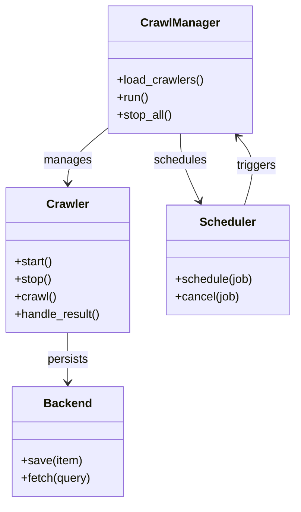
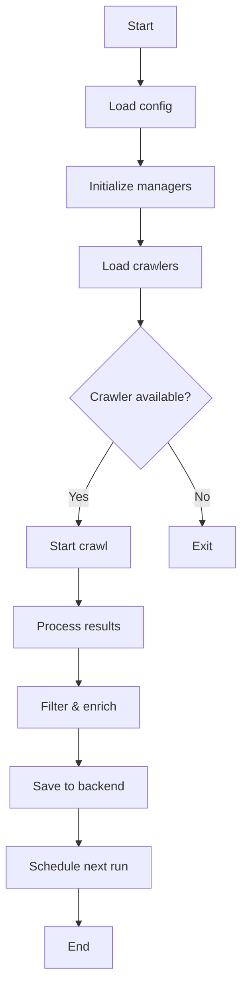

# Diagram: entity_core/entity_search/config/config.test.yml

> Auto-generated by Obscura crawlers

## Diagram 1

### SVG

<svg id="container" width="404.578125" xmlns="http://www.w3.org/2000/svg" class="classDiagram" height="686" viewBox="0 0 404.578125 686" role="graphics-document document" aria-roledescription="class"><g><defs><marker id="container_class-aggregationStart" class="marker aggregation class" refX="18" refY="7" markerWidth="190" markerHeight="240" orient="auto"><path d="M 18,7 L9,13 L1,7 L9,1 Z"></path></marker></defs><defs><marker id="container_class-aggregationEnd" class="marker aggregation class" refX="1" refY="7" markerWidth="20" markerHeight="28" orient="auto"><path d="M 18,7 L9,13 L1,7 L9,1 Z"></path></marker></defs><defs><marker id="container_class-extensionStart" class="marker extension class" refX="18" refY="7" markerWidth="190" markerHeight="240" orient="auto"><path d="M 1,7 L18,13 V 1 Z"></path></marker></defs><defs><marker id="container_class-extensionEnd" class="marker extension class" refX="1" refY="7" markerWidth="20" markerHeight="28" orient="auto"><path d="M 1,1 V 13 L18,7 Z"></path></marker></defs><defs><marker id="container_class-compositionStart" class="marker composition class" refX="18" refY="7" markerWidth="190" markerHeight="240" orient="auto"><path d="M 18,7 L9,13 L1,7 L9,1 Z"></path></marker></defs><defs><marker id="container_class-compositionEnd" class="marker composition class" refX="1" refY="7" markerWidth="20" markerHeight="28" orient="auto"><path d="M 18,7 L9,13 L1,7 L9,1 Z"></path></marker></defs><defs><marker id="container_class-dependencyStart" class="marker dependency class" refX="6" refY="7" markerWidth="190" markerHeight="240" orient="auto"><path d="M 5,7 L9,13 L1,7 L9,1 Z"></path></marker></defs><defs><marker id="container_class-dependencyEnd" class="marker dependency class" refX="13" refY="7" markerWidth="20" markerHeight="28" orient="auto"><path d="M 18,7 L9,13 L14,7 L9,1 Z"></path></marker></defs><defs><marker id="container_class-lollipopStart" class="marker lollipop class" refX="13" refY="7" markerWidth="190" markerHeight="240" orient="auto"><circle stroke="black" fill="transparent" cx="7" cy="7" r="6"></circle></marker></defs><defs><marker id="container_class-lollipopEnd" class="marker lollipop class" refX="1" refY="7" markerWidth="190" markerHeight="240" orient="auto"><circle stroke="black" fill="transparent" cx="7" cy="7" r="6"></circle></marker></defs><g class="root"><g class="clusters"></g><g class="edgePaths"><path d="M150.02,173.138L140.525,180.782C131.031,188.425,112.043,203.713,102.549,216.523C93.055,229.333,93.055,239.667,93.055,244.833L93.055,250" id="id_CrawlManager_Crawler_1" class="edge-thickness-normal edge-pattern-solid relation" style=";;;" data-edge="true" data-et="edge" data-id="id_CrawlManager_Crawler_1" data-points="W3sieCI6MTUwLjAxOTUzMTI1LCJ5IjoxNzMuMTM4MDIwMjM4OTEwNDN9LHsieCI6OTMuMDU0Njg3NSwieSI6MjE5fSx7IngiOjkzLjA1NDY4NzUsInkiOjI1Nn1d" marker-end="url(#container_class-dependencyEnd)"></path><path d="M247.074,182L247.074,188.167C247.074,194.333,247.074,206.667,251.521,222.098C255.967,237.53,264.86,256.06,269.307,265.326L273.753,274.591" id="id_CrawlManager_Scheduler_2" class="edge-thickness-normal edge-pattern-solid relation" style=";;;" data-edge="true" data-et="edge" data-id="id_CrawlManager_Scheduler_2" data-points="W3sieCI6MjQ3LjA3NDIxODc1LCJ5IjoxODJ9LHsieCI6MjQ3LjA3NDIxODc1LCJ5IjoyMTl9LHsieCI6Mjc2LjM0OTUyMzIwNzcyMDYsInkiOjI4MH1d" marker-end="url(#container_class-dependencyEnd)"></path><path d="M93.055,454L93.055,460.167C93.055,466.333,93.055,478.667,93.055,490C93.055,501.333,93.055,511.667,93.055,516.833L93.055,522" id="id_Crawler_Backend_3" class="edge-thickness-normal edge-pattern-solid relation" style=";;;" data-edge="true" data-et="edge" data-id="id_Crawler_Backend_3" data-points="W3sieCI6OTMuMDU0Njg3NSwieSI6NDU0fSx7IngiOjkzLjA1NDY4NzUsInkiOjQ5MX0seyJ4Ijo5My4wNTQ2ODc1LCJ5Ijo1Mjh9XQ==" marker-end="url(#container_class-dependencyEnd)"></path><path d="M335.49,280L338.628,269.833C341.766,259.667,348.041,239.333,346.5,223.756C344.958,208.179,335.6,197.359,330.921,191.948L326.242,186.538" id="id_Scheduler_CrawlManager_4" class="edge-thickness-normal edge-pattern-solid relation" style=";;;" data-edge="true" data-et="edge" data-id="id_Scheduler_CrawlManager_4" data-points="W3sieCI6MzM1LjQ5MDQzNTQzMTk4NTMsInkiOjI4MH0seyJ4IjozNTQuMzE2NDA2MjUsInkiOjIxOX0seyJ4IjozMjIuMzE2NzIxMjcwMTYxMywieSI6MTgyfV0=" marker-end="url(#container_class-dependencyEnd)"></path></g><g class="edgeLabels"><g class="edgeLabel" transform="translate(93.0546875, 219)"><g class="label" data-id="id_CrawlManager_Crawler_1" transform="translate(-32.296875, -12)"><foreignObject width="64.59375" height="24">

manages

</foreignObject></g></g><g class="edgeLabel" transform="translate(247.07421875, 219)"><g class="label" data-id="id_CrawlManager_Scheduler_2" transform="translate(-36.453125, -12)"><foreignObject width="72.90625" height="24">

schedules

</foreignObject></g></g><g class="edgeLabel" transform="translate(93.0546875, 491)"><g class="label" data-id="id_Crawler_Backend_3" transform="translate(-28.4375, -12)"><foreignObject width="56.875" height="24">

persists

</foreignObject></g></g><g class="edgeLabel" transform="translate(352.11634, 226.12868)"><g class="label" data-id="id_Scheduler_CrawlManager_4" transform="translate(-27.4921875, -12)"><foreignObject width="54.984375" height="24">

triggers

</foreignObject></g></g></g><g class="nodes"><g class="node default" id="classId-CrawlManager-0" transform="translate(247.07421875, 95)"><g class="basic label-container"><path d="M-97.0546875 -87 L97.0546875 -87 L97.0546875 87 L-97.0546875 87" stroke="none" stroke-width="0" fill="#ECECFF" style=""></path><path d="M-97.0546875 -87 C-21.17187432770882 -87, 54.71093884458236 -87, 97.0546875 -87 M-97.0546875 -87 C-31.2159126045962 -87, 34.6228622908076 -87, 97.0546875 -87 M97.0546875 -87 C97.0546875 -35.21416918524506, 97.0546875 16.571661629509876, 97.0546875 87 M97.0546875 -87 C97.0546875 -38.962355714986195, 97.0546875 9.07528857002761, 97.0546875 87 M97.0546875 87 C23.560293785499766 87, -49.93409992900047 87, -97.0546875 87 M97.0546875 87 C26.156374875856443 87, -44.741937748287114 87, -97.0546875 87 M-97.0546875 87 C-97.0546875 33.30290182537346, -97.0546875 -20.39419634925308, -97.0546875 -87 M-97.0546875 87 C-97.0546875 24.68130323636324, -97.0546875 -37.63739352727352, -97.0546875 -87" stroke="#9370DB" stroke-width="1.3" fill="none" stroke-dasharray="0 0" style=""></path></g><g class="annotation-group text" transform="translate(0, -63)"></g><g class="label-group text" transform="translate(-51.59375, -63)"><g class="label" style="font-weight: bolder" transform="translate(0,-12)"><foreignObject width="103.1875" height="24">

CrawlManager

</foreignObject></g></g><g class="members-group text" transform="translate(-85.0546875, -15)"></g><g class="methods-group text" transform="translate(-85.0546875, 15)"><g class="label" style="" transform="translate(0,-12)"><foreignObject width="118.515625" height="24">

+load_crawlers()

</foreignObject></g><g class="label" style="" transform="translate(0,12)"><foreignObject width="43.21875" height="24">

+run()

</foreignObject></g><g class="label" style="" transform="translate(0,36)"><foreignObject width="75.8125" height="24">

+stop_all()

</foreignObject></g></g><g class="divider" style=""><path d="M-97.0546875 -39 C-30.77613424507446 -39, 35.50241900985108 -39, 97.0546875 -39 M-97.0546875 -39 C-24.123906693365797 -39, 48.80687411326841 -39, 97.0546875 -39" stroke="#9370DB" stroke-width="1.3" fill="none" stroke-dasharray="0 0" style=""></path></g><g class="divider" style=""><path d="M-97.0546875 -15 C-43.90646809046417 -15, 9.241751319071653 -15, 97.0546875 -15 M-97.0546875 -15 C-25.494423738281398 -15, 46.065840023437204 -15, 97.0546875 -15" stroke="#9370DB" stroke-width="1.3" fill="none" stroke-dasharray="0 0" style=""></path></g></g><g class="node default" id="classId-Crawler-1" transform="translate(93.0546875, 355)"><g class="basic label-container"><path d="M-85.0546875 -99 L85.0546875 -99 L85.0546875 99 L-85.0546875 99" stroke="none" stroke-width="0" fill="#ECECFF" style=""></path><path d="M-85.0546875 -99 C-19.240665903209475 -99, 46.57335569358105 -99, 85.0546875 -99 M-85.0546875 -99 C-40.2293863548122 -99, 4.595914790375602 -99, 85.0546875 -99 M85.0546875 -99 C85.0546875 -38.906265376765845, 85.0546875 21.18746924646831, 85.0546875 99 M85.0546875 -99 C85.0546875 -19.82756942670585, 85.0546875 59.3448611465883, 85.0546875 99 M85.0546875 99 C44.106873144057516 99, 3.1590587881150327 99, -85.0546875 99 M85.0546875 99 C40.581409164151516 99, -3.8918691716969676 99, -85.0546875 99 M-85.0546875 99 C-85.0546875 35.15181505226525, -85.0546875 -28.696369895469502, -85.0546875 -99 M-85.0546875 99 C-85.0546875 47.5773586890371, -85.0546875 -3.8452826219258043, -85.0546875 -99" stroke="#9370DB" stroke-width="1.3" fill="none" stroke-dasharray="0 0" style=""></path></g><g class="annotation-group text" transform="translate(0, -75)"></g><g class="label-group text" transform="translate(-27.734375, -75)"><g class="label" style="font-weight: bolder" transform="translate(0,-12)"><foreignObject width="55.46875" height="24">

Crawler

</foreignObject></g></g><g class="members-group text" transform="translate(-73.0546875, -27)"></g><g class="methods-group text" transform="translate(-73.0546875, 3)"><g class="label" style="" transform="translate(0,-12)"><foreignObject width="52.15625" height="24">

+start()

</foreignObject></g><g class="label" style="" transform="translate(0,12)"><foreignObject width="50.21875" height="24">

+stop()

</foreignObject></g><g class="label" style="" transform="translate(0,36)"><foreignObject width="56.40625" height="24">

+crawl()

</foreignObject></g><g class="label" style="" transform="translate(0,60)"><foreignObject width="118.375" height="24">

+handle_result()

</foreignObject></g></g><g class="divider" style=""><path d="M-85.0546875 -51 C-26.890795992422916 -51, 31.273095515154168 -51, 85.0546875 -51 M-85.0546875 -51 C-38.28655276847718 -51, 8.481581963045642 -51, 85.0546875 -51" stroke="#9370DB" stroke-width="1.3" fill="none" stroke-dasharray="0 0" style=""></path></g><g class="divider" style=""><path d="M-85.0546875 -27 C-46.234625797146556 -27, -7.414564094293112 -27, 85.0546875 -27 M-85.0546875 -27 C-39.87251648283805 -27, 5.309654534323897 -27, 85.0546875 -27" stroke="#9370DB" stroke-width="1.3" fill="none" stroke-dasharray="0 0" style=""></path></g></g><g class="node default" id="classId-Backend-2" transform="translate(93.0546875, 603)"><g class="basic label-container"><path d="M-75.7734375 -75 L75.7734375 -75 L75.7734375 75 L-75.7734375 75" stroke="none" stroke-width="0" fill="#ECECFF" style=""></path><path d="M-75.7734375 -75 C-28.64029946486248 -75, 18.49283857027504 -75, 75.7734375 -75 M-75.7734375 -75 C-43.69829974659304 -75, -11.623161993186073 -75, 75.7734375 -75 M75.7734375 -75 C75.7734375 -34.777121345572226, 75.7734375 5.445757308855548, 75.7734375 75 M75.7734375 -75 C75.7734375 -29.886827921463933, 75.7734375 15.226344157072134, 75.7734375 75 M75.7734375 75 C30.51612295909821 75, -14.741191581803577 75, -75.7734375 75 M75.7734375 75 C41.602903939346284 75, 7.432370378692568 75, -75.7734375 75 M-75.7734375 75 C-75.7734375 27.080610678465376, -75.7734375 -20.838778643069247, -75.7734375 -75 M-75.7734375 75 C-75.7734375 44.68399279536085, -75.7734375 14.367985590721702, -75.7734375 -75" stroke="#9370DB" stroke-width="1.3" fill="none" stroke-dasharray="0 0" style=""></path></g><g class="annotation-group text" transform="translate(0, -51)"></g><g class="label-group text" transform="translate(-31.296875, -51)"><g class="label" style="font-weight: bolder" transform="translate(0,-12)"><foreignObject width="62.59375" height="24">

Backend

</foreignObject></g></g><g class="members-group text" transform="translate(-63.7734375, -3)"></g><g class="methods-group text" transform="translate(-63.7734375, 27)"><g class="label" style="" transform="translate(0,-12)"><foreignObject width="83.140625" height="24">

+save(item)

</foreignObject></g><g class="label" style="" transform="translate(0,12)"><foreignObject width="96.25" height="24">

+fetch(query)

</foreignObject></g></g><g class="divider" style=""><path d="M-75.7734375 -27 C-41.89154954629768 -27, -8.009661592595364 -27, 75.7734375 -27 M-75.7734375 -27 C-39.75060271961205 -27, -3.727767939224094 -27, 75.7734375 -27" stroke="#9370DB" stroke-width="1.3" fill="none" stroke-dasharray="0 0" style=""></path></g><g class="divider" style=""><path d="M-75.7734375 -3 C-44.147907716622 -3, -12.522377933244002 -3, 75.7734375 -3 M-75.7734375 -3 C-24.98162419194778 -3, 25.81018911610444 -3, 75.7734375 -3" stroke="#9370DB" stroke-width="1.3" fill="none" stroke-dasharray="0 0" style=""></path></g></g><g class="node default" id="classId-Scheduler-3" transform="translate(312.34375, 355)"><g class="basic label-container"><path d="M-84.234375 -75 L84.234375 -75 L84.234375 75 L-84.234375 75" stroke="none" stroke-width="0" fill="#ECECFF" style=""></path><path d="M-84.234375 -75 C-44.041164863533474 -75, -3.8479547270669485 -75, 84.234375 -75 M-84.234375 -75 C-40.52431702488181 -75, 3.1857409502363794 -75, 84.234375 -75 M84.234375 -75 C84.234375 -34.69332106433984, 84.234375 5.613357871320318, 84.234375 75 M84.234375 -75 C84.234375 -29.286315546158576, 84.234375 16.427368907682848, 84.234375 75 M84.234375 75 C44.706876627612026 75, 5.1793782552240515 75, -84.234375 75 M84.234375 75 C32.63835875686993 75, -18.957657486260146 75, -84.234375 75 M-84.234375 75 C-84.234375 40.9398585329606, -84.234375 6.879717065921199, -84.234375 -75 M-84.234375 75 C-84.234375 40.41354321329936, -84.234375 5.827086426598726, -84.234375 -75" stroke="#9370DB" stroke-width="1.3" fill="none" stroke-dasharray="0 0" style=""></path></g><g class="annotation-group text" transform="translate(0, -51)"></g><g class="label-group text" transform="translate(-36.78125, -51)"><g class="label" style="font-weight: bolder" transform="translate(0,-12)"><foreignObject width="73.5625" height="24">

Scheduler

</foreignObject></g></g><g class="members-group text" transform="translate(-72.234375, -3)"></g><g class="methods-group text" transform="translate(-72.234375, 27)"><g class="label" style="" transform="translate(0,-12)"><foreignObject width="107.6875" height="24">

+schedule(job)

</foreignObject></g><g class="label" style="" transform="translate(0,12)"><foreignObject width="88.5625" height="24">

+cancel(job)

</foreignObject></g></g><g class="divider" style=""><path d="M-84.234375 -27 C-23.96304618704491 -27, 36.30828262591018 -27, 84.234375 -27 M-84.234375 -27 C-38.25171237341488 -27, 7.730950253170235 -27, 84.234375 -27" stroke="#9370DB" stroke-width="1.3" fill="none" stroke-dasharray="0 0" style=""></path></g><g class="divider" style=""><path d="M-84.234375 -3 C-45.80550837540603 -3, -7.376641750812055 -3, 84.234375 -3 M-84.234375 -3 C-49.61155470993272 -3, -14.988734419865438 -3, 84.234375 -3" stroke="#9370DB" stroke-width="1.3" fill="none" stroke-dasharray="0 0" style=""></path></g></g></g></g></g></svg>

## Diagram 2

### SVG

<svg id="container" width="317.0390625" xmlns="http://www.w3.org/2000/svg" class="flowchart" height="1264.328125" viewBox="0 0 317.0390625 1264.328125" role="graphics-document document" aria-roledescription="flowchart-v2"><g><marker id="container_flowchart-v2-pointEnd" class="marker flowchart-v2" viewBox="0 0 10 10" refX="5" refY="5" markerUnits="userSpaceOnUse" markerWidth="8" markerHeight="8" orient="auto"><path d="M 0 0 L 10 5 L 0 10 z" class="arrowMarkerPath" style="stroke-width: 1; stroke-dasharray: 1, 0;"></path></marker><marker id="container_flowchart-v2-pointStart" class="marker flowchart-v2" viewBox="0 0 10 10" refX="4.5" refY="5" markerUnits="userSpaceOnUse" markerWidth="8" markerHeight="8" orient="auto"><path d="M 0 5 L 10 10 L 10 0 z" class="arrowMarkerPath" style="stroke-width: 1; stroke-dasharray: 1, 0;"></path></marker><marker id="container_flowchart-v2-circleEnd" class="marker flowchart-v2" viewBox="0 0 10 10" refX="11" refY="5" markerUnits="userSpaceOnUse" markerWidth="11" markerHeight="11" orient="auto"><circle cx="5" cy="5" r="5" class="arrowMarkerPath" style="stroke-width: 1; stroke-dasharray: 1, 0;"></circle></marker><marker id="container_flowchart-v2-circleStart" class="marker flowchart-v2" viewBox="0 0 10 10" refX="-1" refY="5" markerUnits="userSpaceOnUse" markerWidth="11" markerHeight="11" orient="auto"><circle cx="5" cy="5" r="5" class="arrowMarkerPath" style="stroke-width: 1; stroke-dasharray: 1, 0;"></circle></marker><marker id="container_flowchart-v2-crossEnd" class="marker cross flowchart-v2" viewBox="0 0 11 11" refX="12" refY="5.2" markerUnits="userSpaceOnUse" markerWidth="11" markerHeight="11" orient="auto"><path d="M 1,1 l 9,9 M 10,1 l -9,9" class="arrowMarkerPath" style="stroke-width: 2; stroke-dasharray: 1, 0;"></path></marker><marker id="container_flowchart-v2-crossStart" class="marker cross flowchart-v2" viewBox="0 0 11 11" refX="-1" refY="5.2" markerUnits="userSpaceOnUse" markerWidth="11" markerHeight="11" orient="auto"><path d="M 1,1 l 9,9 M 10,1 l -9,9" class="arrowMarkerPath" style="stroke-width: 2; stroke-dasharray: 1, 0;"></path></marker><g class="root"><g class="clusters"></g><g class="edgePaths"><path d="M184.746,62L184.746,66.167C184.746,70.333,184.746,78.667,184.746,86.333C184.746,94,184.746,101,184.746,104.5L184.746,108" id="L_A_B_0" class="edge-thickness-normal edge-pattern-solid edge-thickness-normal edge-pattern-solid flowchart-link" style=";" data-edge="true" data-et="edge" data-id="L_A_B_0" data-points="W3sieCI6MTg0Ljc0NjA5Mzc1LCJ5Ijo2Mn0seyJ4IjoxODQuNzQ2MDkzNzUsInkiOjg3fSx7IngiOjE4NC43NDYwOTM3NSwieSI6MTEyfV0=" marker-end="url(#container_flowchart-v2-pointEnd)"></path><path d="M184.746,166L184.746,170.167C184.746,174.333,184.746,182.667,184.746,190.333C184.746,198,184.746,205,184.746,208.5L184.746,212" id="L_B_C_0" class="edge-thickness-normal edge-pattern-solid edge-thickness-normal edge-pattern-solid flowchart-link" style=";" data-edge="true" data-et="edge" data-id="L_B_C_0" data-points="W3sieCI6MTg0Ljc0NjA5Mzc1LCJ5IjoxNjZ9LHsieCI6MTg0Ljc0NjA5Mzc1LCJ5IjoxOTF9LHsieCI6MTg0Ljc0NjA5Mzc1LCJ5IjoyMTZ9XQ==" marker-end="url(#container_flowchart-v2-pointEnd)"></path><path d="M184.746,270L184.746,274.167C184.746,278.333,184.746,286.667,184.746,294.333C184.746,302,184.746,309,184.746,312.5L184.746,316" id="L_C_D_0" class="edge-thickness-normal edge-pattern-solid edge-thickness-normal edge-pattern-solid flowchart-link" style=";" data-edge="true" data-et="edge" data-id="L_C_D_0" data-points="W3sieCI6MTg0Ljc0NjA5Mzc1LCJ5IjoyNzB9LHsieCI6MTg0Ljc0NjA5Mzc1LCJ5IjoyOTV9LHsieCI6MTg0Ljc0NjA5Mzc1LCJ5IjozMjB9XQ==" marker-end="url(#container_flowchart-v2-pointEnd)"></path><path d="M184.746,374L184.746,378.167C184.746,382.333,184.746,390.667,184.746,398.333C184.746,406,184.746,413,184.746,416.5L184.746,420" id="L_D_E_0" class="edge-thickness-normal edge-pattern-solid edge-thickness-normal edge-pattern-solid flowchart-link" style=";" data-edge="true" data-et="edge" data-id="L_D_E_0" data-points="W3sieCI6MTg0Ljc0NjA5Mzc1LCJ5IjozNzR9LHsieCI6MTg0Ljc0NjA5Mzc1LCJ5IjozOTl9LHsieCI6MTg0Ljc0NjA5Mzc1LCJ5Ijo0MjR9XQ==" marker-end="url(#container_flowchart-v2-pointEnd)"></path><path d="M149.228,572.81L141.65,584.896C134.071,596.983,118.915,621.155,111.336,638.742C103.758,656.328,103.758,667.328,103.758,672.828L103.758,678.328" id="L_E_F_0" class="edge-thickness-normal edge-pattern-solid edge-thickness-normal edge-pattern-solid flowchart-link" style=";" data-edge="true" data-et="edge" data-id="L_E_F_0" data-points="W3sieCI6MTQ5LjIyODAwNzc2Njc1NjgsInkiOjU3Mi44MTAwMzkwMTY3NTY4fSx7IngiOjEwMy43NTc4MTI1LCJ5Ijo2NDUuMzI4MTI1fSx7IngiOjEwMy43NTc4MTI1LCJ5Ijo2ODIuMzI4MTI1fV0=" marker-end="url(#container_flowchart-v2-pointEnd)"></path><path d="M220.264,572.81L227.843,584.896C235.421,596.983,250.578,621.155,258.156,638.742C265.734,656.328,265.734,667.328,265.734,672.828L265.734,678.328" id="L_E_G_0" class="edge-thickness-normal edge-pattern-solid edge-thickness-normal edge-pattern-solid flowchart-link" style=";" data-edge="true" data-et="edge" data-id="L_E_G_0" data-points="W3sieCI6MjIwLjI2NDE3OTczMzI0MzIsInkiOjU3Mi44MTAwMzkwMTY3NTY4fSx7IngiOjI2NS43MzQzNzUsInkiOjY0NS4zMjgxMjV9LHsieCI6MjY1LjczNDM3NSwieSI6NjgyLjMyODEyNX1d" marker-end="url(#container_flowchart-v2-pointEnd)"></path><path d="M103.758,736.328L103.758,740.495C103.758,744.661,103.758,752.995,103.758,760.661C103.758,768.328,103.758,775.328,103.758,778.828L103.758,782.328" id="L_F_H_0" class="edge-thickness-normal edge-pattern-solid edge-thickness-normal edge-pattern-solid flowchart-link" style=";" data-edge="true" data-et="edge" data-id="L_F_H_0" data-points="W3sieCI6MTAzLjc1NzgxMjUsInkiOjczNi4zMjgxMjV9LHsieCI6MTAzLjc1NzgxMjUsInkiOjc2MS4zMjgxMjV9LHsieCI6MTAzLjc1NzgxMjUsInkiOjc4Ni4zMjgxMjV9XQ==" marker-end="url(#container_flowchart-v2-pointEnd)"></path><path d="M103.758,840.328L103.758,844.495C103.758,848.661,103.758,856.995,103.758,864.661C103.758,872.328,103.758,879.328,103.758,882.828L103.758,886.328" id="L_H_I_0" class="edge-thickness-normal edge-pattern-solid edge-thickness-normal edge-pattern-solid flowchart-link" style=";" data-edge="true" data-et="edge" data-id="L_H_I_0" data-points="W3sieCI6MTAzLjc1NzgxMjUsInkiOjg0MC4zMjgxMjV9LHsieCI6MTAzLjc1NzgxMjUsInkiOjg2NS4zMjgxMjV9LHsieCI6MTAzLjc1NzgxMjUsInkiOjg5MC4zMjgxMjV9XQ==" marker-end="url(#container_flowchart-v2-pointEnd)"></path><path d="M103.758,944.328L103.758,948.495C103.758,952.661,103.758,960.995,103.758,968.661C103.758,976.328,103.758,983.328,103.758,986.828L103.758,990.328" id="L_I_J_0" class="edge-thickness-normal edge-pattern-solid edge-thickness-normal edge-pattern-solid flowchart-link" style=";" data-edge="true" data-et="edge" data-id="L_I_J_0" data-points="W3sieCI6MTAzLjc1NzgxMjUsInkiOjk0NC4zMjgxMjV9LHsieCI6MTAzLjc1NzgxMjUsInkiOjk2OS4zMjgxMjV9LHsieCI6MTAzLjc1NzgxMjUsInkiOjk5NC4zMjgxMjV9XQ==" marker-end="url(#container_flowchart-v2-pointEnd)"></path><path d="M103.758,1048.328L103.758,1052.495C103.758,1056.661,103.758,1064.995,103.758,1072.661C103.758,1080.328,103.758,1087.328,103.758,1090.828L103.758,1094.328" id="L_J_K_0" class="edge-thickness-normal edge-pattern-solid edge-thickness-normal edge-pattern-solid flowchart-link" style=";" data-edge="true" data-et="edge" data-id="L_J_K_0" data-points="W3sieCI6MTAzLjc1NzgxMjUsInkiOjEwNDguMzI4MTI1fSx7IngiOjEwMy43NTc4MTI1LCJ5IjoxMDczLjMyODEyNX0seyJ4IjoxMDMuNzU3ODEyNSwieSI6MTA5OC4zMjgxMjV9XQ==" marker-end="url(#container_flowchart-v2-pointEnd)"></path><path d="M103.758,1152.328L103.758,1156.495C103.758,1160.661,103.758,1168.995,103.758,1176.661C103.758,1184.328,103.758,1191.328,103.758,1194.828L103.758,1198.328" id="L_K_L_0" class="edge-thickness-normal edge-pattern-solid edge-thickness-normal edge-pattern-solid flowchart-link" style=";" data-edge="true" data-et="edge" data-id="L_K_L_0" data-points="W3sieCI6MTAzLjc1NzgxMjUsInkiOjExNTIuMzI4MTI1fSx7IngiOjEwMy43NTc4MTI1LCJ5IjoxMTc3LjMyODEyNX0seyJ4IjoxMDMuNzU3ODEyNSwieSI6MTIwMi4zMjgxMjV9XQ==" marker-end="url(#container_flowchart-v2-pointEnd)"></path></g><g class="edgeLabels"><g class="edgeLabel"><g class="label" data-id="L_A_B_0" transform="translate(0, 0)"><foreignObject width="0" height="0">

</foreignObject></g></g><g class="edgeLabel"><g class="label" data-id="L_B_C_0" transform="translate(0, 0)"><foreignObject width="0" height="0">

</foreignObject></g></g><g class="edgeLabel"><g class="label" data-id="L_C_D_0" transform="translate(0, 0)"><foreignObject width="0" height="0">

</foreignObject></g></g><g class="edgeLabel"><g class="label" data-id="L_D_E_0" transform="translate(0, 0)"><foreignObject width="0" height="0">

</foreignObject></g></g><g class="edgeLabel" transform="translate(103.7578125, 645.328125)"><g class="label" data-id="L_E_F_0" transform="translate(-12.03125, -12)"><foreignObject width="24.0625" height="24">

Yes

</foreignObject></g></g><g class="edgeLabel" transform="translate(265.734375, 645.328125)"><g class="label" data-id="L_E_G_0" transform="translate(-10.140625, -12)"><foreignObject width="20.28125" height="24">

No

</foreignObject></g></g><g class="edgeLabel"><g class="label" data-id="L_F_H_0" transform="translate(0, 0)"><foreignObject width="0" height="0">

</foreignObject></g></g><g class="edgeLabel"><g class="label" data-id="L_H_I_0" transform="translate(0, 0)"><foreignObject width="0" height="0">

</foreignObject></g></g><g class="edgeLabel"><g class="label" data-id="L_I_J_0" transform="translate(0, 0)"><foreignObject width="0" height="0">

</foreignObject></g></g><g class="edgeLabel"><g class="label" data-id="L_J_K_0" transform="translate(0, 0)"><foreignObject width="0" height="0">

</foreignObject></g></g><g class="edgeLabel"><g class="label" data-id="L_K_L_0" transform="translate(0, 0)"><foreignObject width="0" height="0">

</foreignObject></g></g></g><g class="nodes"><g class="node default" id="flowchart-A-0" transform="translate(184.74609375, 35)"><rect class="basic label-container" style="" x="-47.5234375" y="-27" width="95.046875" height="54"></rect><g class="label" style="" transform="translate(-17.5234375, -12)"><rect></rect><foreignObject width="35.046875" height="24">

Start

</foreignObject></g></g><g class="node default" id="flowchart-B-1" transform="translate(184.74609375, 139)"><rect class="basic label-container" style="" x="-71.421875" y="-27" width="142.84375" height="54"></rect><g class="label" style="" transform="translate(-41.421875, -12)"><rect></rect><foreignObject width="82.84375" height="24">

Load config

</foreignObject></g></g><g class="node default" id="flowchart-C-3" transform="translate(184.74609375, 243)"><rect class="basic label-container" style="" x="-98.5078125" y="-27" width="197.015625" height="54"></rect><g class="label" style="" transform="translate(-68.5078125, -12)"><rect></rect><foreignObject width="137.015625" height="24">

Initialize managers

</foreignObject></g></g><g class="node default" id="flowchart-D-5" transform="translate(184.74609375, 347)"><rect class="basic label-container" style="" x="-79.6875" y="-27" width="159.375" height="54"></rect><g class="label" style="" transform="translate(-49.6875, -12)"><rect></rect><foreignObject width="99.375" height="24">

Load crawlers

</foreignObject></g></g><g class="node default" id="flowchart-E-7" transform="translate(184.74609375, 516.1640625)"><polygon points="92.1640625,0 184.328125,-92.1640625 92.1640625,-184.328125 0,-92.1640625" class="label-container" transform="translate(-91.6640625, 92.1640625)"></polygon><g class="label" style="" transform="translate(-65.1640625, -12)"><rect></rect><foreignObject width="130.328125" height="24">

Crawler available?

</foreignObject></g></g><g class="node default" id="flowchart-F-9" transform="translate(103.7578125, 709.328125)"><rect class="basic label-container" style="" x="-68.671875" y="-27" width="137.34375" height="54"></rect><g class="label" style="" transform="translate(-38.671875, -12)"><rect></rect><foreignObject width="77.34375" height="24">

Start crawl

</foreignObject></g></g><g class="node default" id="flowchart-G-11" transform="translate(265.734375, 709.328125)"><rect class="basic label-container" style="" x="-43.3046875" y="-27" width="86.609375" height="54"></rect><g class="label" style="" transform="translate(-13.3046875, -12)"><rect></rect><foreignObject width="26.609375" height="24">

Exit

</foreignObject></g></g><g class="node default" id="flowchart-H-13" transform="translate(103.7578125, 813.328125)"><rect class="basic label-container" style="" x="-84.1171875" y="-27" width="168.234375" height="54"></rect><g class="label" style="" transform="translate(-54.1171875, -12)"><rect></rect><foreignObject width="108.234375" height="24">

Process results

</foreignObject></g></g><g class="node default" id="flowchart-I-15" transform="translate(103.7578125, 917.328125)"><rect class="basic label-container" style="" x="-81.4453125" y="-27" width="162.890625" height="54"></rect><g class="label" style="" transform="translate(-51.4453125, -12)"><rect></rect><foreignObject width="102.890625" height="24">

Filter &amp; enrich

</foreignObject></g></g><g class="node default" id="flowchart-J-17" transform="translate(103.7578125, 1021.328125)"><rect class="basic label-container" style="" x="-89.2421875" y="-27" width="178.484375" height="54"></rect><g class="label" style="" transform="translate(-59.2421875, -12)"><rect></rect><foreignObject width="118.484375" height="24">

Save to backend

</foreignObject></g></g><g class="node default" id="flowchart-K-19" transform="translate(103.7578125, 1125.328125)"><rect class="basic label-container" style="" x="-95.7578125" y="-27" width="191.515625" height="54"></rect><g class="label" style="" transform="translate(-65.7578125, -12)"><rect></rect><foreignObject width="131.515625" height="24">

Schedule next run

</foreignObject></g></g><g class="node default" id="flowchart-L-21" transform="translate(103.7578125, 1229.328125)"><rect class="basic label-container" style="" x="-43.6796875" y="-27" width="87.359375" height="54"></rect><g class="label" style="" transform="translate(-13.6796875, -12)"><rect></rect><foreignObject width="27.359375" height="24">

End

</foreignObject></g></g></g></g></g></svg>
