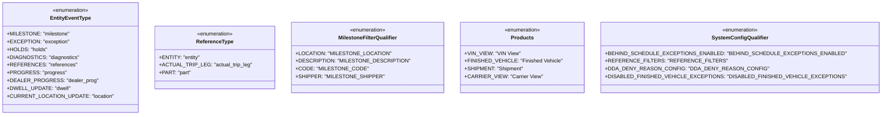

# Diagram: entity_core/entity_search/entity_search/common/constants.py

> Auto-generated by Obscura crawlers

## Mermaid

```mermaid
classDiagram
class EntityEventType <<enumeration>> {
  +MILESTONE: "milestone"
  +EXCEPTION: "exception"
  +HOLDS: "holds"
  +DIAGNOSTICS: "diagnostics"
  +REFERENCES: "references"
  +PROGRESS: "progress"
  +DEALER_PROGRESS: "dealer_prog"
  +DWELL_UPDATE: "dwell"
  +CURRENT_LOCATION_UPDATE: "location"
}
class ReferenceType <<enumeration>> {
  +ENTITY: "entity"
  +ACTUAL_TRIP_LEG: "actual_trip_leg"
  +PART: "part"
}
class MilestoneFilterQualifier <<enumeration>> {
  +LOCATION: "MILESTONE_LOCATION"
  +DESCRIPTION: "MILESTONE_DESCRIPTION"
  +CODE: "MILESTONE_CODE"
  +SHIPPER: "MILESTONE_SHIPPER"
}
class Products <<enumeration>> {
  +VIN_VIEW: "VIN View"
  +FINISHED_VEHICLE: "Finished Vehicle"
  +SHIPMENT: "Shipment"
  +CARRIER_VIEW: "Carrier View"
}
class SystemConfigQualifier <<enumeration>> {
  +BEHIND_SCHEDULE_EXCEPTIONS_ENABLED: "BEHIND_SCHEDULE_EXCEPTIONS_ENABLED"
  +REFERENCE_FILTERS: "REFERENCE_FILTERS"
  +DDA_DENY_REASON_CONFIG: "DDA_DENY_REASON_CONFIG"
  +DISABLED_FINISHED_VEHICLE_EXCEPTIONS: "DISABLED_FINISHED_VEHICLE_EXCEPTIONS"
}
```

> SVG rendering failed for this diagram.
