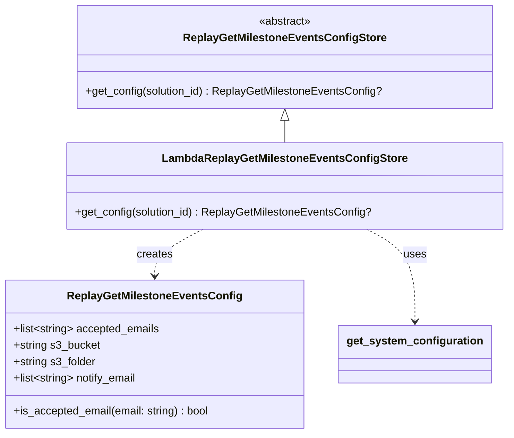

# Diagram: entity_core/entity_search/entity_search/common/replay_failed_get_milestone_config_store.py


> Auto-generated by Obscura crawlers

## Diagram 1



### SVG

<svg id="container" width="729.279296875" xmlns="http://www.w3.org/2000/svg" class="classDiagram" height="632" viewBox="0 0 729.279296875 632" role="graphics-document document" aria-roledescription="class"><style>#container{font-family:"trebuchet ms",verdana,arial,sans-serif;font-size:16px;fill:#333;}@keyframes edge-animation-frame{from{stroke-dashoffset:0;}}@keyframes dash{to{stroke-dashoffset:0;}}#container .edge-animation-slow{stroke-dasharray:9,5!important;stroke-dashoffset:900;animation:dash 50s linear infinite;stroke-linecap:round;}#container .edge-animation-fast{stroke-dasharray:9,5!important;stroke-dashoffset:900;animation:dash 20s linear infinite;stroke-linecap:round;}#container .error-icon{fill:#552222;}#container .error-text{fill:#552222;stroke:#552222;}#container .edge-thickness-normal{stroke-width:1px;}#container .edge-thickness-thick{stroke-width:3.5px;}#container .edge-pattern-solid{stroke-dasharray:0;}#container .edge-thickness-invisible{stroke-width:0;fill:none;}#container .edge-pattern-dashed{stroke-dasharray:3;}#container .edge-pattern-dotted{stroke-dasharray:2;}#container .marker{fill:#333333;stroke:#333333;}#container .marker.cross{stroke:#333333;}#container svg{font-family:"trebuchet ms",verdana,arial,sans-serif;font-size:16px;}#container p{margin:0;}#container g.classGroup text{fill:#9370DB;stroke:none;font-family:"trebuchet ms",verdana,arial,sans-serif;font-size:10px;}#container g.classGroup text .title{font-weight:bolder;}#container .nodeLabel,#container .edgeLabel{color:#131300;}#container .edgeLabel .label rect{fill:#ECECFF;}#container .label text{fill:#131300;}#container .labelBkg{background:#ECECFF;}#container .edgeLabel .label span{background:#ECECFF;}#container .classTitle{font-weight:bolder;}#container .node rect,#container .node circle,#container .node ellipse,#container .node polygon,#container .node path{fill:#ECECFF;stroke:#9370DB;stroke-width:1px;}#container .divider{stroke:#9370DB;stroke-width:1;}#container g.clickable{cursor:pointer;}#container g.classGroup rect{fill:#ECECFF;stroke:#9370DB;}#container g.classGroup line{stroke:#9370DB;stroke-width:1;}#container .classLabel .box{stroke:none;stroke-width:0;fill:#ECECFF;opacity:0.5;}#container .classLabel .label{fill:#9370DB;font-size:10px;}#container .relation{stroke:#333333;stroke-width:1;fill:none;}#container .dashed-line{stroke-dasharray:3;}#container .dotted-line{stroke-dasharray:1 2;}#container #compositionStart,#container .composition{fill:#333333!important;stroke:#333333!important;stroke-width:1;}#container #compositionEnd,#container .composition{fill:#333333!important;stroke:#333333!important;stroke-width:1;}#container #dependencyStart,#container .dependency{fill:#333333!important;stroke:#333333!important;stroke-width:1;}#container #dependencyStart,#container .dependency{fill:#333333!important;stroke:#333333!important;stroke-width:1;}#container #extensionStart,#container .extension{fill:transparent!important;stroke:#333333!important;stroke-width:1;}#container #extensionEnd,#container .extension{fill:transparent!important;stroke:#333333!important;stroke-width:1;}#container #aggregationStart,#container .aggregation{fill:transparent!important;stroke:#333333!important;stroke-width:1;}#container #aggregationEnd,#container .aggregation{fill:transparent!important;stroke:#333333!important;stroke-width:1;}#container #lollipopStart,#container .lollipop{fill:#ECECFF!important;stroke:#333333!important;stroke-width:1;}#container #lollipopEnd,#container .lollipop{fill:#ECECFF!important;stroke:#333333!important;stroke-width:1;}#container .edgeTerminals{font-size:11px;line-height:initial;}#container .classTitleText{text-anchor:middle;font-size:18px;fill:#333;}#container .label-icon{display:inline-block;height:1em;overflow:visible;vertical-align:-0.125em;}#container .node .label-icon path{fill:currentColor;stroke:revert;stroke-width:revert;}#container :root{--mermaid-font-family:"trebuchet ms",verdana,arial,sans-serif;}</style><g><defs><marker id="container_class-aggregationStart" class="marker aggregation class" refX="18" refY="7" markerWidth="190" markerHeight="240" orient="auto"><path d="M 18,7 L9,13 L1,7 L9,1 Z"></path></marker></defs><defs><marker id="container_class-aggregationEnd" class="marker aggregation class" refX="1" refY="7" markerWidth="20" markerHeight="28" orient="auto"><path d="M 18,7 L9,13 L1,7 L9,1 Z"></path></marker></defs><defs><marker id="container_class-extensionStart" class="marker extension class" refX="18" refY="7" markerWidth="190" markerHeight="240" orient="auto"><path d="M 1,7 L18,13 V 1 Z"></path></marker></defs><defs><marker id="container_class-extensionEnd" class="marker extension class" refX="1" refY="7" markerWidth="20" markerHeight="28" orient="auto"><path d="M 1,1 V 13 L18,7 Z"></path></marker></defs><defs><marker id="container_class-compositionStart" class="marker composition class" refX="18" refY="7" markerWidth="190" markerHeight="240" orient="auto"><path d="M 18,7 L9,13 L1,7 L9,1 Z"></path></marker></defs><defs><marker id="container_class-compositionEnd" class="marker composition class" refX="1" refY="7" markerWidth="20" markerHeight="28" orient="auto"><path d="M 18,7 L9,13 L1,7 L9,1 Z"></path></marker></defs><defs><marker id="container_class-dependencyStart" class="marker dependency class" refX="6" refY="7" markerWidth="190" markerHeight="240" orient="auto"><path d="M 5,7 L9,13 L1,7 L9,1 Z"></path></marker></defs><defs><marker id="container_class-dependencyEnd" class="marker dependency class" refX="13" refY="7" markerWidth="20" markerHeight="28" orient="auto"><path d="M 18,7 L9,13 L14,7 L9,1 Z"></path></marker></defs><defs><marker id="container_class-lollipopStart" class="marker lollipop class" refX="13" refY="7" markerWidth="190" markerHeight="240" orient="auto"><circle stroke="black" fill="transparent" cx="7" cy="7" r="6"></circle></marker></defs><defs><marker id="container_class-lollipopEnd" class="marker lollipop class" refX="1" refY="7" markerWidth="190" markerHeight="240" orient="auto"><circle stroke="black" fill="transparent" cx="7" cy="7" r="6"></circle></marker></defs><g class="root"><g class="clusters"></g><g class="edgePaths"><path d="M409.682,175.25L409.682,176.542C409.682,177.833,409.682,180.417,409.682,185.875C409.682,191.333,409.682,199.667,409.682,203.833L409.682,208" id="id_ReplayGetMilestoneEventsConfigStore_LambdaReplayGetMilestoneEventsConfigStore_1" class="edge-thickness-normal edge-pattern-solid relation" style=";;;" data-edge="true" data-et="edge" data-id="id_ReplayGetMilestoneEventsConfigStore_LambdaReplayGetMilestoneEventsConfigStore_1" data-points="W3sieCI6NDA5LjY4MTY0MDYyNSwieSI6MTU4fSx7IngiOjQwOS42ODE2NDA2MjUsInkiOjE4M30seyJ4Ijo0MDkuNjgxNjQwNjI1LCJ5IjoyMDh9XQ==" marker-start="url(#container_class-extensionStart)"></path><path d="M292.513,334L281.044,340.167C269.575,346.333,246.637,358.667,235.168,370C223.699,381.333,223.699,391.667,223.699,396.833L223.699,402" id="id_LambdaReplayGetMilestoneEventsConfigStore_ReplayGetMilestoneEventsConfig_2" class="edge-thickness-normal edge-pattern-dashed relation" style=";;;" data-edge="true" data-et="edge" data-id="id_LambdaReplayGetMilestoneEventsConfigStore_ReplayGetMilestoneEventsConfig_2" data-points="W3sieCI6MjkyLjUxMjcxNDg0Mzc1LCJ5IjozMzR9LHsieCI6MjIzLjY5OTIxODc1LCJ5IjozNzF9LHsieCI6MjIzLjY5OTIxODc1LCJ5Ijo0MDh9XQ==" marker-end="url(#container_class-dependencyEnd)"></path><path d="M526.851,334L538.319,340.167C549.788,346.333,572.726,358.667,584.195,381C595.664,403.333,595.664,435.667,595.664,451.833L595.664,468" id="id_LambdaReplayGetMilestoneEventsConfigStore_get_system_configuration_3" class="edge-thickness-normal edge-pattern-dashed relation" style=";;;" data-edge="true" data-et="edge" data-id="id_LambdaReplayGetMilestoneEventsConfigStore_get_system_configuration_3" data-points="W3sieCI6NTI2Ljg1MDU2NjQwNjI1LCJ5IjozMzR9LHsieCI6NTk1LjY2NDA2MjUsInkiOjM3MX0seyJ4Ijo1OTUuNjY0MDYyNSwieSI6NDc0fV0=" marker-end="url(#container_class-dependencyEnd)"></path></g><g class="edgeLabels"><g class="edgeLabel"><g class="label" data-id="id_ReplayGetMilestoneEventsConfigStore_LambdaReplayGetMilestoneEventsConfigStore_1" transform="translate(0, 0)"><foreignObject width="0" height="0"><div xmlns="http://www.w3.org/1999/xhtml" class="labelBkg" style="display: table-cell; white-space: nowrap; line-height: 1.5; max-width: 200px; text-align: center;"><span class="edgeLabel"></span></div></foreignObject></g></g><g class="edgeLabel" transform="translate(223.69921875, 371)"><g class="label" data-id="id_LambdaReplayGetMilestoneEventsConfigStore_ReplayGetMilestoneEventsConfig_2" transform="translate(-26.171875, -12)"><foreignObject width="52.34375" height="24"><div xmlns="http://www.w3.org/1999/xhtml" class="labelBkg" style="display: table-cell; white-space: nowrap; line-height: 1.5; max-width: 200px; text-align: center;"><span class="edgeLabel"><p>creates</p></span></div></foreignObject></g></g><g class="edgeLabel" transform="translate(595.6640625, 371)"><g class="label" data-id="id_LambdaReplayGetMilestoneEventsConfigStore_get_system_configuration_3" transform="translate(-16.4921875, -12)"><foreignObject width="32.984375" height="24"><div xmlns="http://www.w3.org/1999/xhtml" class="labelBkg" style="display: table-cell; white-space: nowrap; line-height: 1.5; max-width: 200px; text-align: center;"><span class="edgeLabel"><p>uses</p></span></div></foreignObject></g></g></g><g class="nodes"><g class="node default" id="classId-ReplayGetMilestoneEventsConfig-0" transform="translate(223.69921875, 516)"><g class="basic label-container"><path d="M-215.69921875 -108 L215.69921875 -108 L215.69921875 108 L-215.69921875 108" stroke="none" stroke-width="0" fill="#ECECFF" style=""></path><path d="M-215.69921875 -108 C-110.62369394755378 -108, -5.5481691451075505 -108, 215.69921875 -108 M-215.69921875 -108 C-126.29871843877069 -108, -36.898218127541384 -108, 215.69921875 -108 M215.69921875 -108 C215.69921875 -22.59588676086524, 215.69921875 62.80822647826952, 215.69921875 108 M215.69921875 -108 C215.69921875 -22.90851144229518, 215.69921875 62.18297711540964, 215.69921875 108 M215.69921875 108 C56.53842253284225 108, -102.6223736843155 108, -215.69921875 108 M215.69921875 108 C95.53227516237367 108, -24.63466842525267 108, -215.69921875 108 M-215.69921875 108 C-215.69921875 45.32435733158626, -215.69921875 -17.351285336827473, -215.69921875 -108 M-215.69921875 108 C-215.69921875 61.465666978631674, -215.69921875 14.931333957263348, -215.69921875 -108" stroke="#9370DB" stroke-width="1.3" fill="none" stroke-dasharray="0 0" style=""></path></g><g class="annotation-group text" transform="translate(0, -84)"></g><g class="label-group text" transform="translate(-120.2265625, -84)"><g class="label" style="font-weight: bolder" transform="translate(0,-12)"><foreignObject width="240.453125" height="24"><div xmlns="http://www.w3.org/1999/xhtml" style="display: table-cell; white-space: nowrap; line-height: 1.5; max-width: 287px; text-align: center;"><span class="nodeLabel markdown-node-label" style=""><p>ReplayGetMilestoneEventsConfig</p></span></div></foreignObject></g></g><g class="members-group text" transform="translate(-203.69921875, -36)"><g class="label" style="" transform="translate(0,-12)"><foreignObject width="213.53125" height="24"><div xmlns="http://www.w3.org/1999/xhtml" style="display: table-cell; white-space: nowrap; line-height: 1.5; max-width: 311px; text-align: center;"><span class="nodeLabel markdown-node-label" style=""><p>+list&lt;string&gt; accepted_emails</p></span></div></foreignObject></g><g class="label" style="" transform="translate(0,12)"><foreignObject width="126.328125" height="24"><div xmlns="http://www.w3.org/1999/xhtml" style="display: table-cell; white-space: nowrap; line-height: 1.5; max-width: 184px; text-align: center;"><span class="nodeLabel markdown-node-label" style=""><p>+string s3_bucket</p></span></div></foreignObject></g><g class="label" style="" transform="translate(0,36)"><foreignObject width="120.609375" height="24"><div xmlns="http://www.w3.org/1999/xhtml" style="display: table-cell; white-space: nowrap; line-height: 1.5; max-width: 179px; text-align: center;"><span class="nodeLabel markdown-node-label" style=""><p>+string s3_folder</p></span></div></foreignObject></g><g class="label" style="" transform="translate(0,60)"><foreignObject width="182.40625" height="24"><div xmlns="http://www.w3.org/1999/xhtml" style="display: table-cell; white-space: nowrap; line-height: 1.5; max-width: 280px; text-align: center;"><span class="nodeLabel markdown-node-label" style=""><p>+list&lt;string&gt; notify_email</p></span></div></foreignObject></g></g><g class="methods-group text" transform="translate(-203.69921875, 84)"><g class="label" style="" transform="translate(0,-12)"><foreignObject width="287.171875" height="24"><div xmlns="http://www.w3.org/1999/xhtml" style="display: table-cell; white-space: nowrap; line-height: 1.5; max-width: 345px; text-align: center;"><span class="nodeLabel markdown-node-label" style=""><p>+is_accepted_email(email: string) : bool</p></span></div></foreignObject></g></g><g class="divider" style=""><path d="M-215.69921875 -60 C-102.52692597990023 -60, 10.645366790199546 -60, 215.69921875 -60 M-215.69921875 -60 C-80.99816911433746 -60, 53.702880521325085 -60, 215.69921875 -60" stroke="#9370DB" stroke-width="1.3" fill="none" stroke-dasharray="0 0" style=""></path></g><g class="divider" style=""><path d="M-215.69921875 60 C-103.03451679495092 60, 9.630185160098165 60, 215.69921875 60 M-215.69921875 60 C-102.01014810513186 60, 11.678922539736277 60, 215.69921875 60" stroke="#9370DB" stroke-width="1.3" fill="none" stroke-dasharray="0 0" style=""></path></g></g><g class="node default" id="classId-ReplayGetMilestoneEventsConfigStore-1" transform="translate(409.681640625, 83)"><g class="basic label-container"><path d="M-297.03515625 -75 L297.03515625 -75 L297.03515625 75 L-297.03515625 75" stroke="none" stroke-width="0" fill="#ECECFF" style=""></path><path d="M-297.03515625 -75 C-109.04133308940641 -75, 78.95249007118719 -75, 297.03515625 -75 M-297.03515625 -75 C-86.25121881146478 -75, 124.53271862707044 -75, 297.03515625 -75 M297.03515625 -75 C297.03515625 -38.987629202037425, 297.03515625 -2.97525840407485, 297.03515625 75 M297.03515625 -75 C297.03515625 -39.84213953401813, 297.03515625 -4.684279068036261, 297.03515625 75 M297.03515625 75 C109.52196613199945 75, -77.9912239860011 75, -297.03515625 75 M297.03515625 75 C132.32884078015766 75, -32.377474689684675 75, -297.03515625 75 M-297.03515625 75 C-297.03515625 21.236479764741766, -297.03515625 -32.52704047051647, -297.03515625 -75 M-297.03515625 75 C-297.03515625 35.29008822565974, -297.03515625 -4.419823548680526, -297.03515625 -75" stroke="#9370DB" stroke-width="1.3" fill="none" stroke-dasharray="0 0" style=""></path></g><g class="annotation-group text" transform="translate(-38.609375, -51)"><g class="label" style="" transform="translate(0,-12)"><foreignObject width="77.21875" height="24"><div xmlns="http://www.w3.org/1999/xhtml" style="display: table-cell; white-space: nowrap; line-height: 1.5; max-width: 127px; text-align: center;"><span class="nodeLabel markdown-node-label" style=""><p>«abstract»</p></span></div></foreignObject></g></g><g class="label-group text" transform="translate(-139.8046875, -27)"><g class="label" style="font-weight: bolder" transform="translate(0,-12)"><foreignObject width="279.609375" height="24"><div xmlns="http://www.w3.org/1999/xhtml" style="display: table-cell; white-space: nowrap; line-height: 1.5; max-width: 324px; text-align: center;"><span class="nodeLabel markdown-node-label" style=""><p>ReplayGetMilestoneEventsConfigStore</p></span></div></foreignObject></g></g><g class="members-group text" transform="translate(-285.03515625, 21)"></g><g class="methods-group text" transform="translate(-285.03515625, 51)"><g class="label" style="" transform="translate(0,-12)"><foreignObject width="430.265625" height="24"><div xmlns="http://www.w3.org/1999/xhtml" style="display: table-cell; white-space: nowrap; line-height: 1.5; max-width: 488px; text-align: center;"><span class="nodeLabel markdown-node-label" style=""><p>+get_config(solution_id) : ReplayGetMilestoneEventsConfig?</p></span></div></foreignObject></g></g><g class="divider" style=""><path d="M-297.03515625 -3 C-101.6837605108044 -3, 93.66763522839119 -3, 297.03515625 -3 M-297.03515625 -3 C-150.10508373323017 -3, -3.175011216460348 -3, 297.03515625 -3" stroke="#9370DB" stroke-width="1.3" fill="none" stroke-dasharray="0 0" style=""></path></g><g class="divider" style=""><path d="M-297.03515625 21 C-163.2317803904094 21, -29.428404530818796 21, 297.03515625 21 M-297.03515625 21 C-66.78322194666944 21, 163.46871235666111 21, 297.03515625 21" stroke="#9370DB" stroke-width="1.3" fill="none" stroke-dasharray="0 0" style=""></path></g></g><g class="node default" id="classId-LambdaReplayGetMilestoneEventsConfigStore-2" transform="translate(409.681640625, 271)"><g class="basic label-container"><path d="M-311.59765625 -63 L311.59765625 -63 L311.59765625 63 L-311.59765625 63" stroke="none" stroke-width="0" fill="#ECECFF" style=""></path><path d="M-311.59765625 -63 C-137.00754071047547 -63, 37.582574829049065 -63, 311.59765625 -63 M-311.59765625 -63 C-148.1861322016122 -63, 15.225391846775608 -63, 311.59765625 -63 M311.59765625 -63 C311.59765625 -22.740116312795735, 311.59765625 17.51976737440853, 311.59765625 63 M311.59765625 -63 C311.59765625 -18.523473206661805, 311.59765625 25.95305358667639, 311.59765625 63 M311.59765625 63 C66.02975747495302 63, -179.53814130009397 63, -311.59765625 63 M311.59765625 63 C160.51500707924762 63, 9.432357908495248 63, -311.59765625 63 M-311.59765625 63 C-311.59765625 22.771318477546707, -311.59765625 -17.457363044906586, -311.59765625 -63 M-311.59765625 63 C-311.59765625 21.358549006066347, -311.59765625 -20.282901987867305, -311.59765625 -63" stroke="#9370DB" stroke-width="1.3" fill="none" stroke-dasharray="0 0" style=""></path></g><g class="annotation-group text" transform="translate(0, -39)"></g><g class="label-group text" transform="translate(-168.9296875, -39)"><g class="label" style="font-weight: bolder" transform="translate(0,-12)"><foreignObject width="337.859375" height="24"><div xmlns="http://www.w3.org/1999/xhtml" style="display: table-cell; white-space: nowrap; line-height: 1.5; max-width: 382px; text-align: center;"><span class="nodeLabel markdown-node-label" style=""><p>LambdaReplayGetMilestoneEventsConfigStore</p></span></div></foreignObject></g></g><g class="members-group text" transform="translate(-299.59765625, 9)"></g><g class="methods-group text" transform="translate(-299.59765625, 39)"><g class="label" style="" transform="translate(0,-12)"><foreignObject width="430.265625" height="24"><div xmlns="http://www.w3.org/1999/xhtml" style="display: table-cell; white-space: nowrap; line-height: 1.5; max-width: 488px; text-align: center;"><span class="nodeLabel markdown-node-label" style=""><p>+get_config(solution_id) : ReplayGetMilestoneEventsConfig?</p></span></div></foreignObject></g></g><g class="divider" style=""><path d="M-311.59765625 -15 C-111.53125664822801 -15, 88.53514295354398 -15, 311.59765625 -15 M-311.59765625 -15 C-131.12946900117794 -15, 49.338718247644124 -15, 311.59765625 -15" stroke="#9370DB" stroke-width="1.3" fill="none" stroke-dasharray="0 0" style=""></path></g><g class="divider" style=""><path d="M-311.59765625 9 C-140.81597310767935 9, 29.96571003464129 9, 311.59765625 9 M-311.59765625 9 C-167.05429675751168 9, -22.510937265023358 9, 311.59765625 9" stroke="#9370DB" stroke-width="1.3" fill="none" stroke-dasharray="0 0" style=""></path></g></g><g class="node default" id="classId-get_system_configuration-3" transform="translate(595.6640625, 516)"><g class="basic label-container"><path d="M-106.265625 -42 L106.265625 -42 L106.265625 42 L-106.265625 42" stroke="none" stroke-width="0" fill="#ECECFF" style=""></path><path d="M-106.265625 -42 C-55.70134287794011 -42, -5.1370607558802135 -42, 106.265625 -42 M-106.265625 -42 C-34.086181733816915 -42, 38.09326153236617 -42, 106.265625 -42 M106.265625 -42 C106.265625 -13.651172512830232, 106.265625 14.697654974339535, 106.265625 42 M106.265625 -42 C106.265625 -13.87700702663292, 106.265625 14.245985946734159, 106.265625 42 M106.265625 42 C32.56836926185399 42, -41.128886476292024 42, -106.265625 42 M106.265625 42 C55.00479021226073 42, 3.7439554245214595 42, -106.265625 42 M-106.265625 42 C-106.265625 8.729682843064474, -106.265625 -24.540634313871053, -106.265625 -42 M-106.265625 42 C-106.265625 15.81407349386172, -106.265625 -10.37185301227656, -106.265625 -42" stroke="#9370DB" stroke-width="1.3" fill="none" stroke-dasharray="0 0" style=""></path></g><g class="annotation-group text" transform="translate(0, -18)"></g><g class="label-group text" transform="translate(-94.265625, -18)"><g class="label" style="font-weight: bolder" transform="translate(0,-12)"><foreignObject width="188.53125" height="24"><div xmlns="http://www.w3.org/1999/xhtml" style="display: table-cell; white-space: nowrap; line-height: 1.5; max-width: 235px; text-align: center;"><span class="nodeLabel markdown-node-label" style=""><p>get_system_configuration</p></span></div></foreignObject></g></g><g class="members-group text" transform="translate(-94.265625, 30)"></g><g class="methods-group text" transform="translate(-94.265625, 60)"></g><g class="divider" style=""><path d="M-106.265625 6 C-38.198753223985136 6, 29.868118552029728 6, 106.265625 6 M-106.265625 6 C-25.875004501665444 6, 54.51561599666911 6, 106.265625 6" stroke="#9370DB" stroke-width="1.3" fill="none" stroke-dasharray="0 0" style=""></path></g><g class="divider" style=""><path d="M-106.265625 24 C-27.03608844089331 24, 52.19344811821338 24, 106.265625 24 M-106.265625 24 C-40.05967083832104 24, 26.14628332335792 24, 106.265625 24" stroke="#9370DB" stroke-width="1.3" fill="none" stroke-dasharray="0 0" style=""></path></g></g></g></g></g></svg>

## Diagram 2

```mermaid
flowchart TD
    Start([Start]) --> CallGetSysCfg[get_system_configuration("REPLAY_FAILED_GET_MILESTONE_EVENTS", solution_id)]
    CallGetSysCfg --> CheckValid{config is list and non-empty<br/>and "metadata" in config[0]?}
    CheckValid -- No --> ReturnNone[return None]
    CheckValid -- Yes --> ExtractMeta[metadata = config[0].get("metadata")]
    ExtractMeta --> EmailCfg[email_config = metadata.get("email") or {}]
    ExtractMeta --> S3Cfg[s3_config = metadata.get("s3") or {}]
    EmailCfg --> Accepted[accepted = email_config.get("accepted")]
    EmailCfg --> Notify[notify = email_config.get("notify")]
    S3Cfg --> Bucket[bucket = s3_config.get("bucket", "")]
    S3Cfg --> Folder[folder = s3_config.get("folder", "")]
    Accepted --> BuildConfig
    Notify --> BuildConfig
    Bucket --> BuildConfig
    Folder --> BuildConfig
    BuildConfig[ReplayGetMilestoneEventsConfig(...)] --> ReturnConfig[return ReplayGetMilestoneEventsConfig]
```

> SVG rendering failed for this diagram.
