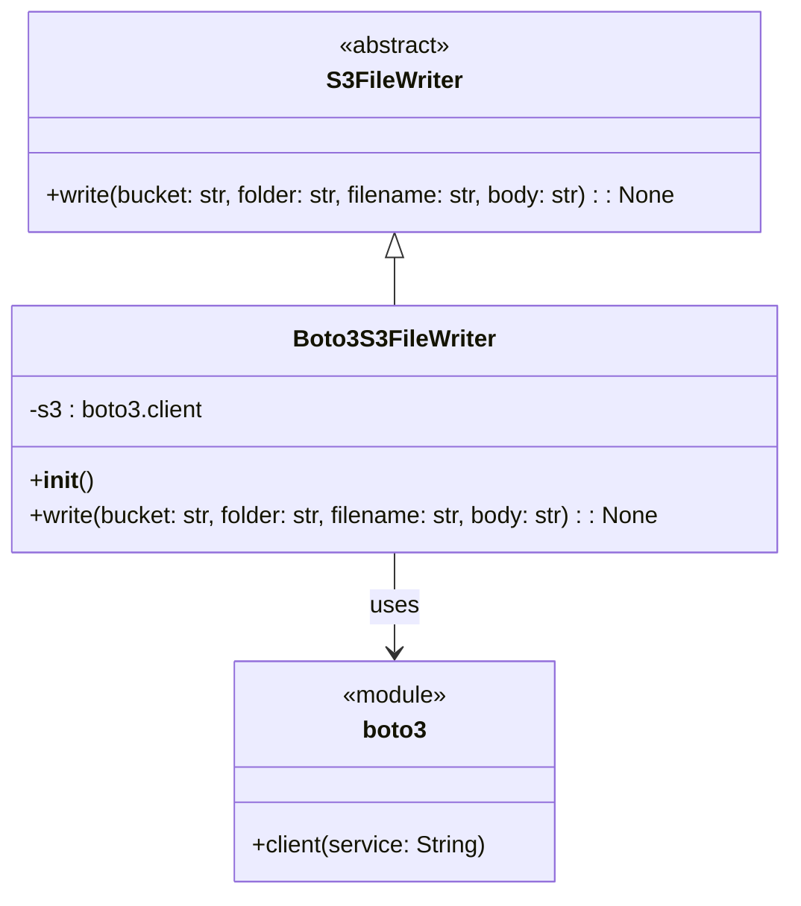

# Diagram: entity_core/entity_search/entity_search/common/s3.py

> Auto-generated by Obscura crawlers

## Mermaid

```mermaid
classDiagram
class S3FileWriter <<abstract>> {
  +write(bucket: str, folder: str, filename: str, body: str) : None
}
class Boto3S3FileWriter {
  -s3 : boto3.client
  +__init__() 
  +write(bucket: str, folder: str, filename: str, body: str) : None
}
class boto3 <<module>> {
  +client(service: String)
}
S3FileWriter <|-- Boto3S3FileWriter
Boto3S3FileWriter --> boto3 : uses
```

> SVG rendering failed for this diagram.
