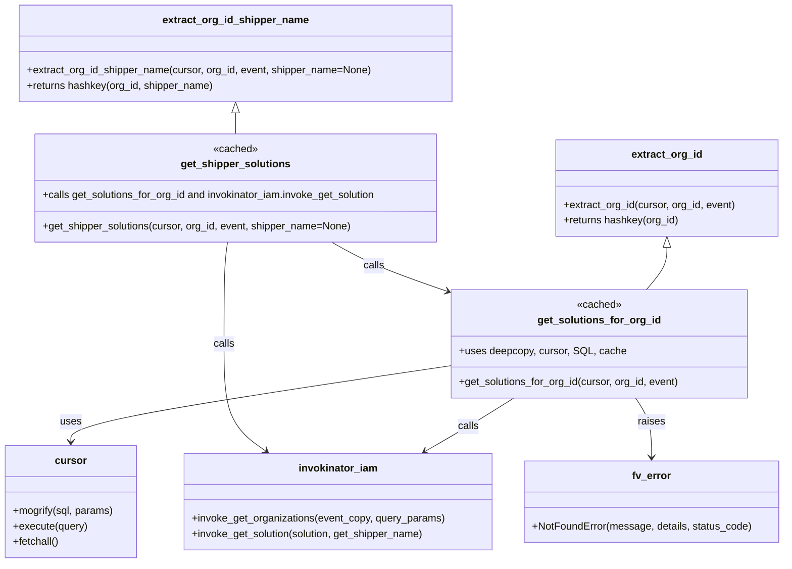

# Diagram: entity_core/entity_search/entity_search/common/solution.py


> Auto-generated by Obscura crawlers

## Diagram 1

```mermaid
flowchart TD
  EXTRACT_ID[extract_org_id(cursor, org_id, event)\nreturns hashkey(org_id)] -->|key| CACHE_SOL[Cache: TTLCache(maxsize=128, ttl=300)]
  CACHE_SOL --> GET_SOL[get_solutions_for_org_id(cursor, org_id, event) <<cached>>]
  GET_SOL --> ECOPY[deepcopy(event) -> event_copy]
  ECOPY --> SETPATH[set event_copy.pathParameters = {organization_id: org_id}]
  SETPATH --> INV_ORG[invokinator_iam.invoke_get_organizations(event_copy, query_params={})]
  INV_ORG --> CHECK_ORG{organization is None or fv_id missing?}
  CHECK_ORG -- Yes --> RAISE[Raise fv.error.NotFoundError("Organization not found", ..., 404)]
  CHECK_ORG -- No --> ORG_ID[org_fv_id = organization.fv_id]
  ORG_ID --> BUILD_SQL[Prepare SQL with org_fv_id and cursor.mogrify]
  BUILD_SQL --> CURSOR_EXEC[cursor.execute(query)]
  CURSOR_EXEC --> FETCH[cursor.fetchall() -> solutions]
  FETCH --> MAP_RETURN[return [result.shipper_solution_id for result in solutions]]
  GET_SHIPPER_KEY[extract_org_id_shipper_name(cursor, org_id, event, shipper_name=None)\nreturns hashkey(org_id, shipper_name)] -->|key| CACHE_SHIP[Cache: TTLCache(maxsize=128, ttl=300)]
  CACHE_SHIP --> GET_SHIPPER[get_shipper_solutions(cursor, org_id, event, shipper_name=None) <<cached>>]
  GET_SHIPPER --> CALL_GET_SOL[get_solutions_for_org_id(cursor, org_id, event)]
  CALL_GET_SOL --> NO_SOL{solutions empty?}
  NO_SOL -- Yes --> EMPTY_RET[return []]
  NO_SOL -- No --> LOOP[for solution in solutions]
  LOOP --> INV_SOL[invokinator_iam.invoke_get_solution(solution, get_shipper_name=True)]
  INV_SOL --> CHECK_SOL{sol truthy?}
  CHECK_SOL -- Yes --> APPEND[append {"shipper": sol.name, "solution_id": sol.solution_id} to shipper_organizations]
  CHECK_SOL -- No --> CONTINUE[continue]
  APPEND --> LOOP
  CONTINUE --> LOOP
  LOOP --> FINAL_RET[return shipper_organizations]
```

> SVG rendering failed for this diagram.

## Diagram 2



> SVG rendering failed for this diagram.
