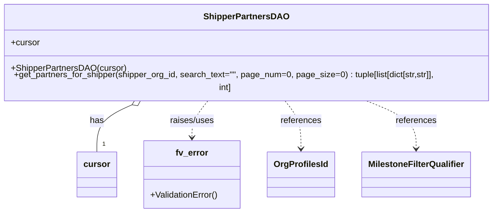
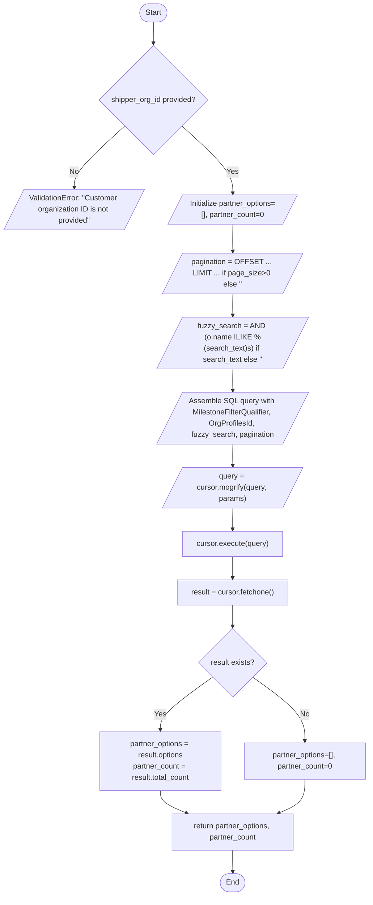

# Diagram: entity_core/entity_search/entity_search/db/daos/get_list.py

> Auto-generated by Obscura crawlers

## Diagram 1

### SVG

<svg id="container" width="930.4765625" xmlns="http://www.w3.org/2000/svg" class="classDiagram" height="384" viewBox="0 0 930.4765625 384" role="graphics-document document" aria-roledescription="class"><g><defs><marker id="container_class-aggregationStart" class="marker aggregation class" refX="18" refY="7" markerWidth="190" markerHeight="240" orient="auto"><path d="M 18,7 L9,13 L1,7 L9,1 Z"></path></marker></defs><defs><marker id="container_class-aggregationEnd" class="marker aggregation class" refX="1" refY="7" markerWidth="20" markerHeight="28" orient="auto"><path d="M 18,7 L9,13 L1,7 L9,1 Z"></path></marker></defs><defs><marker id="container_class-extensionStart" class="marker extension class" refX="18" refY="7" markerWidth="190" markerHeight="240" orient="auto"><path d="M 1,7 L18,13 V 1 Z"></path></marker></defs><defs><marker id="container_class-extensionEnd" class="marker extension class" refX="1" refY="7" markerWidth="20" markerHeight="28" orient="auto"><path d="M 1,1 V 13 L18,7 Z"></path></marker></defs><defs><marker id="container_class-compositionStart" class="marker composition class" refX="18" refY="7" markerWidth="190" markerHeight="240" orient="auto"><path d="M 18,7 L9,13 L1,7 L9,1 Z"></path></marker></defs><defs><marker id="container_class-compositionEnd" class="marker composition class" refX="1" refY="7" markerWidth="20" markerHeight="28" orient="auto"><path d="M 18,7 L9,13 L1,7 L9,1 Z"></path></marker></defs><defs><marker id="container_class-dependencyStart" class="marker dependency class" refX="6" refY="7" markerWidth="190" markerHeight="240" orient="auto"><path d="M 5,7 L9,13 L1,7 L9,1 Z"></path></marker></defs><defs><marker id="container_class-dependencyEnd" class="marker dependency class" refX="13" refY="7" markerWidth="20" markerHeight="28" orient="auto"><path d="M 18,7 L9,13 L14,7 L9,1 Z"></path></marker></defs><defs><marker id="container_class-lollipopStart" class="marker lollipop class" refX="13" refY="7" markerWidth="190" markerHeight="240" orient="auto"><circle stroke="black" fill="transparent" cx="7" cy="7" r="6"></circle></marker></defs><defs><marker id="container_class-lollipopEnd" class="marker lollipop class" refX="1" refY="7" markerWidth="190" markerHeight="240" orient="auto"><circle stroke="black" fill="transparent" cx="7" cy="7" r="6"></circle></marker></defs><g class="root"><g class="clusters"></g><g class="edgePaths"><path d="M258.334,182.941L246.936,187.951C235.538,192.961,212.742,202.98,201.343,217.657C189.945,232.333,189.945,251.667,189.945,261.333L189.945,271" id="id_ShipperPartnersDAO_cursor_1" class="edge-thickness-normal edge-pattern-solid relation" style=";;;" data-edge="true" data-et="edge" data-id="id_ShipperPartnersDAO_cursor_1" data-points="W3sieCI6Mjc0LjEyNTgwNzA3NjQ0NjMsInkiOjE3Nn0seyJ4IjoxODkuOTQ1MzEyNSwieSI6MjEzfSx7IngiOjE4OS45NDUzMTI1LCJ5IjoyNzF9XQ==" marker-start="url(#container_class-aggregationStart)"></path><path d="M395.82,176L390.723,182.167C385.627,188.333,375.435,200.667,370.338,212C365.242,223.333,365.242,233.667,365.242,238.833L365.242,244" id="id_ShipperPartnersDAO_fv_error_2" class="edge-thickness-normal edge-pattern-dashed relation" style=";;;" data-edge="true" data-et="edge" data-id="id_ShipperPartnersDAO_fv_error_2" data-points="W3sieCI6Mzk1LjgxOTUwNTQyMzU1MzcsInkiOjE3Nn0seyJ4IjozNjUuMjQyMTg3NSwieSI6MjEzfSx7IngiOjM2NS4yNDIxODc1LCJ5IjoyNTB9XQ==" marker-end="url(#container_class-dependencyEnd)"></path><path d="M534.657,176L539.753,182.167C544.849,188.333,555.042,200.667,560.138,215.5C565.234,230.333,565.234,247.667,565.234,256.333L565.234,265" id="id_ShipperPartnersDAO_OrgProfilesId_3" class="edge-thickness-normal edge-pattern-dashed relation" style=";;;" data-edge="true" data-et="edge" data-id="id_ShipperPartnersDAO_OrgProfilesId_3" data-points="W3sieCI6NTM0LjY1NzA1NzA3NjQ0NjMsInkiOjE3Nn0seyJ4Ijo1NjUuMjM0Mzc1LCJ5IjoyMTN9LHsieCI6NTY1LjIzNDM3NSwieSI6MjcxfV0=" marker-end="url(#container_class-dependencyEnd)"></path><path d="M679.059,176L694.756,182.167C710.454,188.333,741.848,200.667,757.545,215.5C773.242,230.333,773.242,247.667,773.242,256.333L773.242,265" id="id_ShipperPartnersDAO_MilestoneFilterQualifier_4" class="edge-thickness-normal edge-pattern-dashed relation" style=";;;" data-edge="true" data-et="edge" data-id="id_ShipperPartnersDAO_MilestoneFilterQualifier_4" data-points="W3sieCI6Njc5LjA1OTE3NDg0NTA0MTMsInkiOjE3Nn0seyJ4Ijo3NzMuMjQyMTg3NSwieSI6MjEzfSx7IngiOjc3My4yNDIxODc1LCJ5IjoyNzF9XQ==" marker-end="url(#container_class-dependencyEnd)"></path></g><g class="edgeLabels"><g class="edgeLabel" transform="translate(189.9453125, 213)"><g class="label" data-id="id_ShipperPartnersDAO_cursor_1" transform="translate(-12.703125, -12)"><foreignObject width="25.40625" height="24">

has

</foreignObject></g></g><g class="edgeLabel" transform="translate(365.2421875, 213)"><g class="label" data-id="id_ShipperPartnersDAO_fv_error_2" transform="translate(-41.65625, -12)"><foreignObject width="83.3125" height="24">

raises/uses

</foreignObject></g></g><g class="edgeLabel" transform="translate(565.234375, 213)"><g class="label" data-id="id_ShipperPartnersDAO_OrgProfilesId_3" transform="translate(-37.828125, -12)"><foreignObject width="75.65625" height="24">

references

</foreignObject></g></g><g class="edgeLabel" transform="translate(773.2421875, 213)"><g class="label" data-id="id_ShipperPartnersDAO_MilestoneFilterQualifier_4" transform="translate(-37.828125, -12)"><foreignObject width="75.65625" height="24">

references

</foreignObject></g></g><g class="edgeTerminals" transform="translate(199.94531124999997, 248.49999892857144)"><g class="inner" transform="translate(0, 0)"></g><foreignObject style="width: 9px; height: 12px;">
1
</foreignObject></g></g><g class="nodes"><g class="node default" id="classId-ShipperPartnersDAO-0" transform="translate(465.23828125, 92)"><g class="basic label-container"><path d="M-457.23828125 -84 L457.23828125 -84 L457.23828125 84 L-457.23828125 84" stroke="none" stroke-width="0" fill="#ECECFF" style=""></path><path d="M-457.23828125 -84 C-126.29774028802177 -84, 204.64280067395646 -84, 457.23828125 -84 M-457.23828125 -84 C-163.44438382869942 -84, 130.34951359260117 -84, 457.23828125 -84 M457.23828125 -84 C457.23828125 -50.04283909752572, 457.23828125 -16.085678195051443, 457.23828125 84 M457.23828125 -84 C457.23828125 -41.68261926434166, 457.23828125 0.6347614713166791, 457.23828125 84 M457.23828125 84 C237.31728517358 84, 17.39628909715998 84, -457.23828125 84 M457.23828125 84 C143.68478524016558 84, -169.86871076966884 84, -457.23828125 84 M-457.23828125 84 C-457.23828125 24.34454621064242, -457.23828125 -35.31090757871516, -457.23828125 -84 M-457.23828125 84 C-457.23828125 44.078926950785736, -457.23828125 4.157853901571471, -457.23828125 -84" stroke="#9370DB" stroke-width="1.3" fill="none" stroke-dasharray="0 0" style=""></path></g><g class="annotation-group text" transform="translate(0, -60)"></g><g class="label-group text" transform="translate(-74.9921875, -60)"><g class="label" style="font-weight: bolder" transform="translate(0,-12)"><foreignObject width="149.984375" height="24">

ShipperPartnersDAO

</foreignObject></g></g><g class="members-group text" transform="translate(-445.23828125, -12)"><g class="label" style="" transform="translate(0,-12)"><foreignObject width="53.71875" height="24">

+cursor

</foreignObject></g></g><g class="methods-group text" transform="translate(-445.23828125, 36)"><g class="label" style="" transform="translate(0,-12)"><foreignObject width="210.765625" height="24">

+ShipperPartnersDAO(cursor)

</foreignObject></g><g class="label" style="" transform="translate(0,12)"><foreignObject width="815.484375" height="24">

+get_partners_for_shipper(shipper_org_id, search_text="", page_num=0, page_size=0) : tuple[list[dict[str,str]], int]

</foreignObject></g></g><g class="divider" style=""><path d="M-457.23828125 -36 C-260.6158157610705 -36, -63.99335027214107 -36, 457.23828125 -36 M-457.23828125 -36 C-132.63084661552256 -36, 191.97658801895489 -36, 457.23828125 -36" stroke="#9370DB" stroke-width="1.3" fill="none" stroke-dasharray="0 0" style=""></path></g><g class="divider" style=""><path d="M-457.23828125 12 C-104.32573768259181 12, 248.58680588481639 12, 457.23828125 12 M-457.23828125 12 C-111.91584697740262 12, 233.40658729519475 12, 457.23828125 12" stroke="#9370DB" stroke-width="1.3" fill="none" stroke-dasharray="0 0" style=""></path></g></g><g class="node default" id="classId-fv_error-1" transform="translate(365.2421875, 313)"><g class="basic label-container"><path d="M-90.109375 -63 L90.109375 -63 L90.109375 63 L-90.109375 63" stroke="none" stroke-width="0" fill="#ECECFF" style=""></path><path d="M-90.109375 -63 C-36.854437551774375 -63, 16.40049989645125 -63, 90.109375 -63 M-90.109375 -63 C-51.256544089369015 -63, -12.40371317873803 -63, 90.109375 -63 M90.109375 -63 C90.109375 -30.936274409737216, 90.109375 1.1274511805255685, 90.109375 63 M90.109375 -63 C90.109375 -18.683050610966696, 90.109375 25.63389877806661, 90.109375 63 M90.109375 63 C23.898877569409706 63, -42.31161986118059 63, -90.109375 63 M90.109375 63 C37.26308675241723 63, -15.58320149516554 63, -90.109375 63 M-90.109375 63 C-90.109375 29.426808670158742, -90.109375 -4.146382659682516, -90.109375 -63 M-90.109375 63 C-90.109375 15.061640704812284, -90.109375 -32.87671859037543, -90.109375 -63" stroke="#9370DB" stroke-width="1.3" fill="none" stroke-dasharray="0 0" style=""></path></g><g class="annotation-group text" transform="translate(0, -39)"></g><g class="label-group text" transform="translate(-29.1875, -39)"><g class="label" style="font-weight: bolder" transform="translate(0,-12)"><foreignObject width="58.375" height="24">

fv_error

</foreignObject></g></g><g class="members-group text" transform="translate(-78.109375, 9)"></g><g class="methods-group text" transform="translate(-78.109375, 39)"><g class="label" style="" transform="translate(0,-12)"><foreignObject width="127.03125" height="24">

+ValidationError()

</foreignObject></g></g><g class="divider" style=""><path d="M-90.109375 -15 C-21.647482950049294 -15, 46.81440909990141 -15, 90.109375 -15 M-90.109375 -15 C-27.007056957864883 -15, 36.095261084270234 -15, 90.109375 -15" stroke="#9370DB" stroke-width="1.3" fill="none" stroke-dasharray="0 0" style=""></path></g><g class="divider" style=""><path d="M-90.109375 9 C-32.43245544303885 9, 25.244464113922305 9, 90.109375 9 M-90.109375 9 C-35.2987416923928 9, 19.511891615214395 9, 90.109375 9" stroke="#9370DB" stroke-width="1.3" fill="none" stroke-dasharray="0 0" style=""></path></g></g><g class="node default" id="classId-OrgProfilesId-2" transform="translate(565.234375, 313)"><g class="basic label-container"><path d="M-59.8828125 -42 L59.8828125 -42 L59.8828125 42 L-59.8828125 42" stroke="none" stroke-width="0" fill="#ECECFF" style=""></path><path d="M-59.8828125 -42 C-25.42351938022916 -42, 9.035773739541682 -42, 59.8828125 -42 M-59.8828125 -42 C-33.55429957676172 -42, -7.225786653523443 -42, 59.8828125 -42 M59.8828125 -42 C59.8828125 -20.339404048653165, 59.8828125 1.3211919026936698, 59.8828125 42 M59.8828125 -42 C59.8828125 -16.46788867699712, 59.8828125 9.06422264600576, 59.8828125 42 M59.8828125 42 C16.40253846087149 42, -27.07773557825702 42, -59.8828125 42 M59.8828125 42 C18.13337165440415 42, -23.6160691911917 42, -59.8828125 42 M-59.8828125 42 C-59.8828125 19.874737598476948, -59.8828125 -2.2505248030461047, -59.8828125 -42 M-59.8828125 42 C-59.8828125 20.737624742185737, -59.8828125 -0.5247505156285257, -59.8828125 -42" stroke="#9370DB" stroke-width="1.3" fill="none" stroke-dasharray="0 0" style=""></path></g><g class="annotation-group text" transform="translate(0, -18)"></g><g class="label-group text" transform="translate(-47.8828125, -18)"><g class="label" style="font-weight: bolder" transform="translate(0,-12)"><foreignObject width="95.765625" height="24">

OrgProfilesId

</foreignObject></g></g><g class="members-group text" transform="translate(-47.8828125, 30)"></g><g class="methods-group text" transform="translate(-47.8828125, 60)"></g><g class="divider" style=""><path d="M-59.8828125 6 C-13.971592384819665 6, 31.93962773036067 6, 59.8828125 6 M-59.8828125 6 C-19.99872626174831 6, 19.88535997650338 6, 59.8828125 6" stroke="#9370DB" stroke-width="1.3" fill="none" stroke-dasharray="0 0" style=""></path></g><g class="divider" style=""><path d="M-59.8828125 24 C-26.439654720880384 24, 7.003503058239232 24, 59.8828125 24 M-59.8828125 24 C-35.87640508902467 24, -11.869997678049351 24, 59.8828125 24" stroke="#9370DB" stroke-width="1.3" fill="none" stroke-dasharray="0 0" style=""></path></g></g><g class="node default" id="classId-MilestoneFilterQualifier-3" transform="translate(773.2421875, 313)"><g class="basic label-container"><path d="M-98.125 -42 L98.125 -42 L98.125 42 L-98.125 42" stroke="none" stroke-width="0" fill="#ECECFF" style=""></path><path d="M-98.125 -42 C-48.39303067202696 -42, 1.3389386559460803 -42, 98.125 -42 M-98.125 -42 C-58.288507236299786 -42, -18.452014472599572 -42, 98.125 -42 M98.125 -42 C98.125 -15.851544947910597, 98.125 10.296910104178806, 98.125 42 M98.125 -42 C98.125 -19.50098469420118, 98.125 2.998030611597642, 98.125 42 M98.125 42 C45.25551369540429 42, -7.613972609191421 42, -98.125 42 M98.125 42 C46.49768708276306 42, -5.1296258344738845 42, -98.125 42 M-98.125 42 C-98.125 18.99879494530731, -98.125 -4.00241010938538, -98.125 -42 M-98.125 42 C-98.125 20.140890453683905, -98.125 -1.7182190926321894, -98.125 -42" stroke="#9370DB" stroke-width="1.3" fill="none" stroke-dasharray="0 0" style=""></path></g><g class="annotation-group text" transform="translate(0, -18)"></g><g class="label-group text" transform="translate(-86.125, -18)"><g class="label" style="font-weight: bolder" transform="translate(0,-12)"><foreignObject width="172.25" height="24">

MilestoneFilterQualifier

</foreignObject></g></g><g class="members-group text" transform="translate(-86.125, 30)"></g><g class="methods-group text" transform="translate(-86.125, 60)"></g><g class="divider" style=""><path d="M-98.125 6 C-21.097942681653123 6, 55.929114636693754 6, 98.125 6 M-98.125 6 C-30.2775346455426 6, 37.5699307089148 6, 98.125 6" stroke="#9370DB" stroke-width="1.3" fill="none" stroke-dasharray="0 0" style=""></path></g><g class="divider" style=""><path d="M-98.125 24 C-37.08950081512601 24, 23.945998369747983 24, 98.125 24 M-98.125 24 C-28.938765323419233 24, 40.247469353161534 24, 98.125 24" stroke="#9370DB" stroke-width="1.3" fill="none" stroke-dasharray="0 0" style=""></path></g></g><g class="node default" id="classId-cursor-4" transform="translate(189.9453125, 313)"><g class="basic label-container"><path d="M-35.1875 -42 L35.1875 -42 L35.1875 42 L-35.1875 42" stroke="none" stroke-width="0" fill="#ECECFF" style=""></path><path d="M-35.1875 -42 C-16.77230076957104 -42, 1.6428984608579213 -42, 35.1875 -42 M-35.1875 -42 C-14.180412357641835 -42, 6.82667528471633 -42, 35.1875 -42 M35.1875 -42 C35.1875 -22.65898715623683, 35.1875 -3.317974312473659, 35.1875 42 M35.1875 -42 C35.1875 -20.52905925336926, 35.1875 0.9418814932614765, 35.1875 42 M35.1875 42 C14.075641045697669 42, -7.036217908604662 42, -35.1875 42 M35.1875 42 C11.721998924699882 42, -11.743502150600236 42, -35.1875 42 M-35.1875 42 C-35.1875 14.466167231207805, -35.1875 -13.06766553758439, -35.1875 -42 M-35.1875 42 C-35.1875 19.41142928256406, -35.1875 -3.177141434871878, -35.1875 -42" stroke="#9370DB" stroke-width="1.3" fill="none" stroke-dasharray="0 0" style=""></path></g><g class="annotation-group text" transform="translate(0, -18)"></g><g class="label-group text" transform="translate(-23.1875, -18)"><g class="label" style="font-weight: bolder" transform="translate(0,-12)"><foreignObject width="46.375" height="24">

cursor

</foreignObject></g></g><g class="members-group text" transform="translate(-23.1875, 30)"></g><g class="methods-group text" transform="translate(-23.1875, 60)"></g><g class="divider" style=""><path d="M-35.1875 6 C-13.774445992803475 6, 7.63860801439305 6, 35.1875 6 M-35.1875 6 C-11.157544577536125 6, 12.87241084492775 6, 35.1875 6" stroke="#9370DB" stroke-width="1.3" fill="none" stroke-dasharray="0 0" style=""></path></g><g class="divider" style=""><path d="M-35.1875 24 C-15.697908152820844 24, 3.791683694358312 24, 35.1875 24 M-35.1875 24 C-12.466806177620956 24, 10.253887644758088 24, 35.1875 24" stroke="#9370DB" stroke-width="1.3" fill="none" stroke-dasharray="0 0" style=""></path></g></g></g></g></g></svg>

## Diagram 2

### SVG

<svg id="container" width="798.0390625" xmlns="http://www.w3.org/2000/svg" class="flowchart" height="1899.703125" viewBox="0 0 798.0390625 1899.703125" role="graphics-document document" aria-roledescription="flowchart-v2"><g><marker id="container_flowchart-v2-pointEnd" class="marker flowchart-v2" viewBox="0 0 10 10" refX="5" refY="5" markerUnits="userSpaceOnUse" markerWidth="8" markerHeight="8" orient="auto"><path d="M 0 0 L 10 5 L 0 10 z" class="arrowMarkerPath" style="stroke-width: 1; stroke-dasharray: 1, 0;"></path></marker><marker id="container_flowchart-v2-pointStart" class="marker flowchart-v2" viewBox="0 0 10 10" refX="4.5" refY="5" markerUnits="userSpaceOnUse" markerWidth="8" markerHeight="8" orient="auto"><path d="M 0 5 L 10 10 L 10 0 z" class="arrowMarkerPath" style="stroke-width: 1; stroke-dasharray: 1, 0;"></path></marker><marker id="container_flowchart-v2-circleEnd" class="marker flowchart-v2" viewBox="0 0 10 10" refX="11" refY="5" markerUnits="userSpaceOnUse" markerWidth="11" markerHeight="11" orient="auto"><circle cx="5" cy="5" r="5" class="arrowMarkerPath" style="stroke-width: 1; stroke-dasharray: 1, 0;"></circle></marker><marker id="container_flowchart-v2-circleStart" class="marker flowchart-v2" viewBox="0 0 10 10" refX="-1" refY="5" markerUnits="userSpaceOnUse" markerWidth="11" markerHeight="11" orient="auto"><circle cx="5" cy="5" r="5" class="arrowMarkerPath" style="stroke-width: 1; stroke-dasharray: 1, 0;"></circle></marker><marker id="container_flowchart-v2-crossEnd" class="marker cross flowchart-v2" viewBox="0 0 11 11" refX="12" refY="5.2" markerUnits="userSpaceOnUse" markerWidth="11" markerHeight="11" orient="auto"><path d="M 1,1 l 9,9 M 10,1 l -9,9" class="arrowMarkerPath" style="stroke-width: 2; stroke-dasharray: 1, 0;"></path></marker><marker id="container_flowchart-v2-crossStart" class="marker cross flowchart-v2" viewBox="0 0 11 11" refX="-1" refY="5.2" markerUnits="userSpaceOnUse" markerWidth="11" markerHeight="11" orient="auto"><path d="M 1,1 l 9,9 M 10,1 l -9,9" class="arrowMarkerPath" style="stroke-width: 2; stroke-dasharray: 1, 0;"></path></marker><g class="root"><g class="clusters"></g><g class="edgePaths"><path d="M329.5,47.5L329.417,51.583C329.333,55.667,329.167,63.833,329.083,71.417C329,79,329,86,329,89.5L329,93" id="L_Start_CheckOrgId_0" class="edge-thickness-normal edge-pattern-solid edge-thickness-normal edge-pattern-solid flowchart-link" style=";" data-edge="true" data-et="edge" data-id="L_Start_CheckOrgId_0" data-points="W3sieCI6MzI5LjUsInkiOjQ3LjV9LHsieCI6MzI5LCJ5Ijo3Mn0seyJ4IjozMjksInkiOjk3fV0=" marker-end="url(#container_flowchart-v2-pointEnd)"></path><path d="M266.885,273.245L248.904,289.764C230.924,306.283,194.962,339.321,177.055,361.424C159.149,383.526,159.298,394.693,159.372,400.276L159.447,405.86" id="L_CheckOrgId_Raise_0" class="edge-thickness-normal edge-pattern-solid edge-thickness-normal edge-pattern-solid flowchart-link" style=";" data-edge="true" data-et="edge" data-id="L_CheckOrgId_Raise_0" data-points="W3sieCI6MjY2Ljg4NTMyMDExMjA5MzEsInkiOjI3My4yNDQ2OTUxMTIwOTMxfSx7IngiOjE1OSwieSI6MzcyLjM1OTM3NX0seyJ4IjoxNTkuNSwieSI6NDA5Ljg1OTM3NX1d" marker-end="url(#container_flowchart-v2-pointEnd)"></path><path d="M391.115,273.245L409.096,289.764C427.076,306.283,463.038,339.321,481.096,363.424C499.153,387.526,499.306,402.693,499.383,410.276L499.46,417.86" id="L_CheckOrgId_InitVars_0" class="edge-thickness-normal edge-pattern-solid edge-thickness-normal edge-pattern-solid flowchart-link" style=";" data-edge="true" data-et="edge" data-id="L_CheckOrgId_InitVars_0" data-points="W3sieCI6MzkxLjExNDY3OTg4NzkwNjksInkiOjI3My4yNDQ2OTUxMTIwOTMxfSx7IngiOjQ5OSwieSI6MzcyLjM1OTM3NX0seyJ4Ijo0OTkuNSwieSI6NDIxLjg1OTM3NX1d" marker-end="url(#container_flowchart-v2-pointEnd)"></path><path d="M499.5,484.859L499.417,490.943C499.333,497.026,499.167,509.193,499.154,518.86C499.141,528.526,499.281,535.693,499.351,539.277L499.422,542.86" id="L_InitVars_ComputePagination_0" class="edge-thickness-normal edge-pattern-solid edge-thickness-normal edge-pattern-solid flowchart-link" style=";" data-edge="true" data-et="edge" data-id="L_InitVars_ComputePagination_0" data-points="W3sieCI6NDk5LjUsInkiOjQ4NC44NTkzNzV9LHsieCI6NDk5LCJ5Ijo1MjEuMzU5Mzc1fSx7IngiOjQ5OS41LCJ5Ijo1NDYuODU5Mzc1fV0=" marker-end="url(#container_flowchart-v2-pointEnd)"></path><path d="M499.5,633.859L499.417,637.943C499.333,642.026,499.167,650.193,499.154,657.86C499.141,665.526,499.281,672.693,499.351,676.277L499.422,679.86" id="L_ComputePagination_ComputeFuzzy_0" class="edge-thickness-normal edge-pattern-solid edge-thickness-normal edge-pattern-solid flowchart-link" style=";" data-edge="true" data-et="edge" data-id="L_ComputePagination_ComputeFuzzy_0" data-points="W3sieCI6NDk5LjUsInkiOjYzMy44NTkzNzV9LHsieCI6NDk5LCJ5Ijo2NTguMzU5Mzc1fSx7IngiOjQ5OS41LCJ5Ijo2ODMuODU5Mzc1fV0=" marker-end="url(#container_flowchart-v2-pointEnd)"></path><path d="M499.5,794.859L499.417,798.943C499.333,803.026,499.167,811.193,499.154,818.86C499.141,826.526,499.281,833.693,499.351,837.277L499.422,840.86" id="L_ComputeFuzzy_BuildQuery_0" class="edge-thickness-normal edge-pattern-solid edge-thickness-normal edge-pattern-solid flowchart-link" style=";" data-edge="true" data-et="edge" data-id="L_ComputeFuzzy_BuildQuery_0" data-points="W3sieCI6NDk5LjUsInkiOjc5NC44NTkzNzV9LHsieCI6NDk5LCJ5Ijo4MTkuMzU5Mzc1fSx7IngiOjQ5OS41LCJ5Ijo4NDQuODU5Mzc1fV0=" marker-end="url(#container_flowchart-v2-pointEnd)"></path><path d="M499.5,955.859L499.417,959.943C499.333,964.026,499.167,972.193,499.154,979.86C499.141,987.526,499.281,994.693,499.351,998.277L499.422,1001.86" id="L_BuildQuery_Mogrify_0" class="edge-thickness-normal edge-pattern-solid edge-thickness-normal edge-pattern-solid flowchart-link" style=";" data-edge="true" data-et="edge" data-id="L_BuildQuery_Mogrify_0" data-points="W3sieCI6NDk5LjUsInkiOjk1NS44NTkzNzV9LHsieCI6NDk5LCJ5Ijo5ODAuMzU5Mzc1fSx7IngiOjQ5OS41LCJ5IjoxMDA1Ljg1OTM3NX1d" marker-end="url(#container_flowchart-v2-pointEnd)"></path><path d="M499.5,1092.859L499.417,1096.943C499.333,1101.026,499.167,1109.193,499.083,1116.776C499,1124.359,499,1131.359,499,1134.859L499,1138.359" id="L_Mogrify_Execute_0" class="edge-thickness-normal edge-pattern-solid edge-thickness-normal edge-pattern-solid flowchart-link" style=";" data-edge="true" data-et="edge" data-id="L_Mogrify_Execute_0" data-points="W3sieCI6NDk5LjUsInkiOjEwOTIuODU5Mzc1fSx7IngiOjQ5OSwieSI6MTExNy4zNTkzNzV9LHsieCI6NDk5LCJ5IjoxMTQyLjM1OTM3NX1d" marker-end="url(#container_flowchart-v2-pointEnd)"></path><path d="M499,1196.359L499,1200.526C499,1204.693,499,1213.026,499,1220.693C499,1228.359,499,1235.359,499,1238.859L499,1242.359" id="L_Execute_Fetch_0" class="edge-thickness-normal edge-pattern-solid edge-thickness-normal edge-pattern-solid flowchart-link" style=";" data-edge="true" data-et="edge" data-id="L_Execute_Fetch_0" data-points="W3sieCI6NDk5LCJ5IjoxMTk2LjM1OTM3NX0seyJ4Ijo0OTksInkiOjEyMjEuMzU5Mzc1fSx7IngiOjQ5OSwieSI6MTI0Ni4zNTkzNzV9XQ==" marker-end="url(#container_flowchart-v2-pointEnd)"></path><path d="M499,1300.359L499,1304.526C499,1308.693,499,1317.026,499,1324.693C499,1332.359,499,1339.359,499,1342.859L499,1346.359" id="L_Fetch_HasResult_0" class="edge-thickness-normal edge-pattern-solid edge-thickness-normal edge-pattern-solid flowchart-link" style=";" data-edge="true" data-et="edge" data-id="L_Fetch_HasResult_0" data-points="W3sieCI6NDk5LCJ5IjoxMzAwLjM1OTM3NX0seyJ4Ijo0OTksInkiOjEzMjUuMzU5Mzc1fSx7IngiOjQ5OSwieSI6MTM1MC4zNTkzNzV9XQ==" marker-end="url(#container_flowchart-v2-pointEnd)"></path><path d="M455.12,1454.823L435.594,1468.303C416.067,1481.783,377.014,1508.743,357.487,1527.723C337.961,1546.703,337.961,1557.703,337.961,1563.203L337.961,1568.703" id="L_HasResult_SetFromResult_0" class="edge-thickness-normal edge-pattern-solid edge-thickness-normal edge-pattern-solid flowchart-link" style=";" data-edge="true" data-et="edge" data-id="L_HasResult_SetFromResult_0" data-points="W3sieCI6NDU1LjEyMDE3MTY0NDk1MDIzLCJ5IjoxNDU0LjgyMzI5NjY0NDk1MDJ9LHsieCI6MzM3Ljk2MDkzNzUsInkiOjE1MzUuNzAzMTI1fSx7IngiOjMzNy45NjA5Mzc1LCJ5IjoxNTcyLjcwMzEyNX1d" marker-end="url(#container_flowchart-v2-pointEnd)"></path><path d="M542.88,1454.823L562.406,1468.303C581.933,1481.783,620.986,1508.743,640.513,1529.723C660.039,1550.703,660.039,1565.703,660.039,1573.203L660.039,1580.703" id="L_HasResult_KeepDefaults_0" class="edge-thickness-normal edge-pattern-solid edge-thickness-normal edge-pattern-solid flowchart-link" style=";" data-edge="true" data-et="edge" data-id="L_HasResult_KeepDefaults_0" data-points="W3sieCI6NTQyLjg3OTgyODM1NTA0OTgsInkiOjE0NTQuODIzMjk2NjQ0OTUwMn0seyJ4Ijo2NjAuMDM5MDYyNSwieSI6MTUzNS43MDMxMjV9LHsieCI6NjYwLjAzOTA2MjUsInkiOjE1ODQuNzAzMTI1fV0=" marker-end="url(#container_flowchart-v2-pointEnd)"></path><path d="M337.961,1674.703L337.961,1678.87C337.961,1683.036,337.961,1691.37,347.826,1699.457C357.69,1707.544,377.42,1715.385,387.285,1719.305L397.15,1723.226" id="L_SetFromResult_Return_0" class="edge-thickness-normal edge-pattern-solid edge-thickness-normal edge-pattern-solid flowchart-link" style=";" data-edge="true" data-et="edge" data-id="L_SetFromResult_Return_0" data-points="W3sieCI6MzM3Ljk2MDkzNzUsInkiOjE2NzQuNzAzMTI1fSx7IngiOjMzNy45NjA5Mzc1LCJ5IjoxNjk5LjcwMzEyNX0seyJ4Ijo0MDAuODY2ODIxMjg5MDYyNSwieSI6MTcyNC43MDMxMjV9XQ==" marker-end="url(#container_flowchart-v2-pointEnd)"></path><path d="M660.039,1662.703L660.039,1668.87C660.039,1675.036,660.039,1687.37,650.174,1697.457C640.31,1707.544,620.58,1715.385,610.715,1719.305L600.85,1723.226" id="L_KeepDefaults_Return_0" class="edge-thickness-normal edge-pattern-solid edge-thickness-normal edge-pattern-solid flowchart-link" style=";" data-edge="true" data-et="edge" data-id="L_KeepDefaults_Return_0" data-points="W3sieCI6NjYwLjAzOTA2MjUsInkiOjE2NjIuNzAzMTI1fSx7IngiOjY2MC4wMzkwNjI1LCJ5IjoxNjk5LjcwMzEyNX0seyJ4Ijo1OTcuMTMzMTc4NzEwOTM3NSwieSI6MTcyNC43MDMxMjV9XQ==" marker-end="url(#container_flowchart-v2-pointEnd)"></path><path d="M499,1802.703L499,1806.87C499,1811.036,499,1819.37,499.07,1827.12C499.141,1834.87,499.281,1842.037,499.351,1845.62L499.422,1849.204" id="L_Return_End_0" class="edge-thickness-normal edge-pattern-solid edge-thickness-normal edge-pattern-solid flowchart-link" style=";" data-edge="true" data-et="edge" data-id="L_Return_End_0" data-points="W3sieCI6NDk5LCJ5IjoxODAyLjcwMzEyNX0seyJ4Ijo0OTksInkiOjE4MjcuNzAzMTI1fSx7IngiOjQ5OS41LCJ5IjoxODUzLjIwMzEyNX1d" marker-end="url(#container_flowchart-v2-pointEnd)"></path></g><g class="edgeLabels"><g class="edgeLabel"><g class="label" data-id="L_Start_CheckOrgId_0" transform="translate(0, 0)"><foreignObject width="0" height="0">

</foreignObject></g></g><g class="edgeLabel" transform="translate(159, 372.359375)"><g class="label" data-id="L_CheckOrgId_Raise_0" transform="translate(-10.140625, -12)"><foreignObject width="20.28125" height="24">

No

</foreignObject></g></g><g class="edgeLabel" transform="translate(499, 372.359375)"><g class="label" data-id="L_CheckOrgId_InitVars_0" transform="translate(-12.03125, -12)"><foreignObject width="24.0625" height="24">

Yes

</foreignObject></g></g><g class="edgeLabel"><g class="label" data-id="L_InitVars_ComputePagination_0" transform="translate(0, 0)"><foreignObject width="0" height="0">

</foreignObject></g></g><g class="edgeLabel"><g class="label" data-id="L_ComputePagination_ComputeFuzzy_0" transform="translate(0, 0)"><foreignObject width="0" height="0">

</foreignObject></g></g><g class="edgeLabel"><g class="label" data-id="L_ComputeFuzzy_BuildQuery_0" transform="translate(0, 0)"><foreignObject width="0" height="0">

</foreignObject></g></g><g class="edgeLabel"><g class="label" data-id="L_BuildQuery_Mogrify_0" transform="translate(0, 0)"><foreignObject width="0" height="0">

</foreignObject></g></g><g class="edgeLabel"><g class="label" data-id="L_Mogrify_Execute_0" transform="translate(0, 0)"><foreignObject width="0" height="0">

</foreignObject></g></g><g class="edgeLabel"><g class="label" data-id="L_Execute_Fetch_0" transform="translate(0, 0)"><foreignObject width="0" height="0">

</foreignObject></g></g><g class="edgeLabel"><g class="label" data-id="L_Fetch_HasResult_0" transform="translate(0, 0)"><foreignObject width="0" height="0">

</foreignObject></g></g><g class="edgeLabel" transform="translate(337.9609375, 1535.703125)"><g class="label" data-id="L_HasResult_SetFromResult_0" transform="translate(-12.03125, -12)"><foreignObject width="24.0625" height="24">

Yes

</foreignObject></g></g><g class="edgeLabel" transform="translate(660.0390625, 1535.703125)"><g class="label" data-id="L_HasResult_KeepDefaults_0" transform="translate(-10.140625, -12)"><foreignObject width="20.28125" height="24">

No

</foreignObject></g></g><g class="edgeLabel"><g class="label" data-id="L_SetFromResult_Return_0" transform="translate(0, 0)"><foreignObject width="0" height="0">

</foreignObject></g></g><g class="edgeLabel"><g class="label" data-id="L_KeepDefaults_Return_0" transform="translate(0, 0)"><foreignObject width="0" height="0">

</foreignObject></g></g><g class="edgeLabel"><g class="label" data-id="L_Return_End_0" transform="translate(0, 0)"><foreignObject width="0" height="0">

</foreignObject></g></g></g><g class="nodes"><g class="node default" id="flowchart-Start-0" transform="translate(329, 27.5)"><g class="basic label-container outer-path"><path d="M-10.3984375 -19.5 C-5.181579966512693 -19.5, 0.035277566974613705 -19.5, 10.3984375 -19.5 C10.3984375 -19.5, 10.398437499999998 -19.5, 10.398437499999998 -19.5 C10.674868616285611 -19.49113539214125, 10.951299732571222 -19.482270784282495, 11.6478067896239 -19.45993515863156 C11.920776298158156 -19.433602118437125, 12.193745806692412 -19.407269078242688, 12.892042152847864 -19.3399052695533 C13.186231087243277 -19.292343084109508, 13.480420021638688 -19.24478089866572, 14.126030759676757 -19.140403561325776 C14.434236695160738 -19.070057567783245, 14.742442630644721 -18.999711574240713, 15.34470188623539 -18.862249829261074 C15.634275082856938 -18.776306024504525, 15.923848279478488 -18.69036221974798, 16.543047751460602 -18.50658706670804 C16.865459732243554 -18.387936477436234, 17.187871713026503 -18.26928588816443, 17.716144095147794 -18.074876768247425 C18.045459208184496 -17.92909873649182, 18.374774321221196 -17.783320704736216, 18.85917041279238 -17.568892924097174 C19.172246962684888 -17.405561088553355, 19.485323512577395 -17.242229253009533, 19.967429764076783 -16.990714730406097 C20.206298131751538 -16.84591132217532, 20.445166499426293 -16.70110791394454, 21.036368073605697 -16.342718045390892 C21.3002552382091 -16.1586417828548, 21.5641424028125 -15.97456552031871, 22.061592844578712 -15.627565626425154 C22.267972078056932 -15.462983679708326, 22.47435131153515 -15.298401732991499, 23.03889120850187 -14.848196188198123 C23.31494601222442 -14.597490519467163, 23.59100081594697 -14.346784850736203, 23.964247236767985 -14.007812326905688 C24.271019768072094 -13.69104450184097, 24.577792299376203 -13.374276676776253, 24.833858442968648 -13.10986736009568 C25.157531618000135 -12.729662431178292, 25.481204793031623 -12.349457502260904, 25.644151408126582 -12.158051136245305 C25.90242433132886 -11.811988948301599, 26.160697254531133 -11.465926760357892, 26.391796464640635 -11.156274872382312 C26.57308338030187 -10.87776948757363, 26.754370295963103 -10.599264102764947, 27.073721378604247 -10.108655082055241 C27.281309152161477 -9.74006196956292, 27.488896925718706 -9.3714688570706, 27.6871239742735 -9.019496659696287 C27.80743571951101 -8.769666746451644, 27.927747464748514 -8.519836833207, 28.22948364880834 -7.893275190886684 C28.335417710663283 -7.631616010009221, 28.441351772518225 -7.369956829131759, 28.698571729970325 -6.734618561215508 C28.835529103259056 -6.322124774063905, 28.97248647654779 -5.909630986912303, 29.09246063421488 -5.548287939305138 C29.19260574566172 -5.166391226192487, 29.292750857108558 -4.784494513079836, 29.40953178754556 -4.339158212148133 C29.47586705387364 -3.9985406395169614, 29.542202320201714 -3.65792306688579, 29.648482276581777 -3.1121979531509023 C29.70148597658222 -2.7011117227119086, 29.75448967658266 -2.290025492272915, 29.808330202509367 -1.872449005199798 C29.82693439428597 -1.5826737012459011, 29.84553858606257 -1.2928983972920045, 29.888418715913414 -0.6250057626472757 C29.888418715913414 -0.22606550479860793, 29.888418715913414 0.17287475305005984, 29.888418715913414 0.625005762647271 C29.857671194790253 1.1039232230928282, 29.826923673667096 1.5828406835383855, 29.808330202509367 1.8724490051997846 C29.7717914623941 2.1558362581434505, 29.73525272227883 2.4392235110871168, 29.648482276581777 3.1121979531508885 C29.592857326528513 3.397820315337042, 29.53723237647525 3.683442677523195, 29.40953178754556 4.339158212148129 C29.334782839669682 4.6242083467977935, 29.260033891793803 4.909258481447459, 29.092460634214884 5.548287939305125 C28.944800748418675 5.993015988915457, 28.797140862622467 6.437744038525787, 28.69857172997033 6.734618561215495 C28.5876450437653 7.008609620763496, 28.476718357560273 7.282600680311496, 28.229483648808344 7.893275190886679 C28.07982636064666 8.20404175190741, 27.930169072484976 8.51480831292814, 27.687123974273504 9.019496659696284 C27.53773947417553 9.284743966441166, 27.388354974077558 9.549991273186048, 27.07372137860425 10.108655082055236 C26.821407215720562 10.49627739208403, 26.56909305283687 10.883899702112824, 26.39179646464064 11.156274872382301 C26.198504047771177 11.415269101685949, 26.005211630901716 11.674263330989596, 25.644151408126582 12.158051136245302 C25.345478307041517 12.508889555760717, 25.046805205956453 12.859727975276131, 24.83385844296866 13.10986736009567 C24.489851284996007 13.465082994215361, 24.145844127023352 13.820298628335054, 23.96424723676799 14.007812326905684 C23.775682457979055 14.179061869851145, 23.587117679190122 14.350311412796605, 23.038891208501887 14.848196188198111 C22.748027139859236 15.080152542722692, 22.457163071216584 15.312108897247272, 22.061592844578715 15.627565626425152 C21.853373418440103 15.772810484425767, 21.645153992301488 15.918055342426381, 21.036368073605708 16.34271804539089 C20.74555729667596 16.519009247359524, 20.45474651974621 16.69530044932816, 19.967429764076787 16.990714730406093 C19.579487931354695 17.193103736048606, 19.191546098632603 17.39549274169112, 18.859170412792388 17.56889292409717 C18.567532775572616 17.69799225497123, 18.275895138352848 17.827091585845288, 17.716144095147804 18.07487676824742 C17.34266161426789 18.212321773645435, 16.96917913338797 18.349766779043453, 16.543047751460616 18.506587066708033 C16.06613093988639 18.648133472995838, 15.58921412831216 18.78967987928364, 15.344701886235413 18.86224982926107 C15.019926849137333 18.936377612123525, 14.695151812039253 19.01050539498598, 14.126030759676766 19.140403561325773 C13.772850421408236 19.197503019462598, 13.419670083139707 19.254602477599427, 12.892042152847878 19.3399052695533 C12.525203430268371 19.375293759932433, 12.158364707688866 19.410682250311567, 11.6478067896239 19.45993515863156 C11.316341526263484 19.470564604469534, 10.98487626290307 19.481194050307504, 10.398437500000004 19.5 C10.398437500000002 19.5, 10.3984375 19.5, 10.3984375 19.5 C4.173761353870025 19.5, -2.0509147922599507 19.5, -10.398437499999996 19.5 C-10.677252681421317 19.491058939812646, -10.956067862842636 19.482117879625292, -11.647806789623893 19.45993515863156 C-11.929713581784165 19.432739949434378, -12.21162037394444 19.405544740237197, -12.892042152847871 19.3399052695533 C-13.345100481055375 19.26665831256852, -13.79815880926288 19.193411355583738, -14.126030759676759 19.140403561325773 C-14.4278895611165 19.07150625970992, -14.72974836255624 19.00260895809407, -15.344701886235388 18.862249829261074 C-15.776474153186195 18.734102086848953, -16.208246420137 18.605954344436835, -16.54304775146059 18.506587066708043 C-16.968717439507525 18.34993668665931, -17.39438712755446 18.193286306610577, -17.716144095147797 18.074876768247425 C-18.066617147175748 17.919732744528353, -18.417090199203695 17.764588720809282, -18.85917041279238 17.568892924097174 C-19.19824653460031 17.3919971285386, -19.537322656408243 17.215101332980023, -19.96742976407678 16.990714730406097 C-20.216639855086015 16.839642108715243, -20.465849946095254 16.688569487024388, -21.036368073605686 16.3427180453909 C-21.265276217635993 16.1830416333892, -21.494184361666303 16.023365221387508, -22.061592844578712 15.627565626425156 C-22.331144954276432 15.412604992024114, -22.60069706397415 15.197644357623073, -23.03889120850187 14.848196188198125 C-23.368758704659356 14.548619256003573, -23.698626200816847 14.24904232380902, -23.964247236767974 14.007812326905697 C-24.15985770888492 13.805828454526516, -24.355468181001868 13.603844582147337, -24.833858442968655 13.109867360095677 C-25.10237339542642 12.794454418005161, -25.37088834788418 12.479041475914643, -25.64415140812658 12.158051136245307 C-25.889344238048373 11.829515081676433, -26.13453706797017 11.50097902710756, -26.391796464640635 11.156274872382316 C-26.60794750808635 10.82420882496751, -26.824098551532067 10.492142777552704, -27.073721378604244 10.108655082055249 C-27.276285391109052 9.74898216602247, -27.478849403613857 9.389309249989694, -27.6871239742735 9.019496659696289 C-27.809805378164967 8.764746099554129, -27.93248678205643 8.509995539411971, -28.22948364880834 7.893275190886686 C-28.378189160424707 7.525969702168778, -28.526894672041077 7.15866421345087, -28.698571729970325 6.73461856121551 C-28.811081991327054 6.395755580084779, -28.923592252683783 6.056892598954048, -29.09246063421488 5.5482879393051325 C-29.186382573991263 5.190122876911596, -29.280304513767643 4.83195781451806, -29.409531787545557 4.339158212148136 C-29.496153087768707 3.894376142920552, -29.582774387991858 3.4495940736929684, -29.648482276581777 3.112197953150904 C-29.685357613746373 2.8262001199612596, -29.722232950910968 2.540202286771615, -29.808330202509364 1.872449005199809 C-29.82852586195916 1.5578853076263215, -29.848721521408958 1.2433216100528337, -29.888418715913414 0.6250057626472781 C-29.888418715913414 0.3719676338512035, -29.888418715913414 0.11892950505512889, -29.888418715913414 -0.6250057626472687 C-29.8684912991515 -0.9353913638353696, -29.848563882389588 -1.2457769650234705, -29.808330202509367 -1.8724490051997822 C-29.748503742497302 -2.3364512149825747, -29.688677282485237 -2.8004534247653674, -29.648482276581777 -3.112197953150895 C-29.57398392280946 -3.494731254539093, -29.499485569037144 -3.877264555927291, -29.40953178754556 -4.339158212148126 C-29.336510507239367 -4.617620001578717, -29.263489226933174 -4.896081791009308, -29.092460634214884 -5.548287939305123 C-28.996582085580865 -5.837058851618614, -28.900703536946843 -6.125829763932105, -28.698571729970332 -6.734618561215485 C-28.554563883307917 -7.090320726673962, -28.4105560366455 -7.446022892132438, -28.229483648808344 -7.893275190886676 C-28.08849281216334 -8.186045679900658, -27.94750197551834 -8.47881616891464, -27.687123974273504 -9.019496659696282 C-27.498698931638035 -9.3540644030001, -27.310273889002566 -9.688632146303918, -27.073721378604247 -10.108655082055243 C-26.909033573770195 -10.361659775148015, -26.74434576893614 -10.614664468240786, -26.39179646464064 -11.156274872382308 C-26.15412650909115 -11.47473096064025, -25.916456553541657 -11.793187048898192, -25.644151408126586 -12.158051136245302 C-25.475919936783082 -12.355665395127282, -25.307688465439576 -12.553279654009264, -24.833858442968662 -13.10986736009567 C-24.648378245626933 -13.301390892058413, -24.462898048285204 -13.492914424021157, -23.964247236767996 -14.007812326905677 C-23.77643419089983 -14.178379165902259, -23.588621145031667 -14.348946004898838, -23.038891208501887 -14.848196188198107 C-22.70340005326558 -15.115741456704479, -22.367908898029274 -15.383286725210851, -22.06159284457872 -15.627565626425149 C-21.829468878296513 -15.789485256819068, -21.597344912014307 -15.951404887212988, -21.03636807360571 -16.342718045390885 C-20.811043261124436 -16.47931127087261, -20.58571844864316 -16.615904496354336, -19.96742976407679 -16.99071473040609 C-19.635108890434147 -17.16408631732378, -19.3027880167915 -17.337457904241468, -18.859170412792388 -17.56889292409717 C-18.5406673887219 -17.709884764796655, -18.22216436465141 -17.850876605496143, -17.716144095147804 -18.07487676824742 C-17.46068409155407 -18.1688884110163, -17.20522408796034 -18.26290005378518, -16.54304775146062 -18.506587066708033 C-16.198460682288967 -18.60885870006374, -15.853873613117317 -18.71113033341945, -15.344701886235413 -18.862249829261067 C-14.91073345591964 -18.96130029157198, -14.476765025603866 -19.060350753882894, -14.126030759676768 -19.140403561325773 C-13.639867379713992 -19.219002686344833, -13.153703999751217 -19.297601811363897, -12.89204215284788 -19.3399052695533 C-12.508223118579066 -19.376931830179288, -12.124404084310253 -19.413958390805274, -11.647806789623903 -19.45993515863156 C-11.148281466050047 -19.475953963491513, -10.648756142476193 -19.49197276835147, -10.398437500000005 -19.5 C-10.398437500000004 -19.5, -10.398437500000004 -19.5, -10.3984375 -19.5" stroke="none" stroke-width="0" fill="#ECECFF" style=""></path><path d="M-10.3984375 -19.5 C-5.619194243435533 -19.5, -0.8399509868710666 -19.5, 10.3984375 -19.5 M-10.3984375 -19.5 C-4.716569102831637 -19.5, 0.9652992943367256 -19.5, 10.3984375 -19.5 M10.3984375 -19.5 C10.3984375 -19.5, 10.3984375 -19.5, 10.398437499999998 -19.5 M10.3984375 -19.5 C10.3984375 -19.5, 10.398437499999998 -19.5, 10.398437499999998 -19.5 M10.398437499999998 -19.5 C10.829093811844716 -19.4861896903008, 11.259750123689432 -19.4723793806016, 11.6478067896239 -19.45993515863156 M10.398437499999998 -19.5 C10.836269665445183 -19.485959574642784, 11.27410183089037 -19.47191914928557, 11.6478067896239 -19.45993515863156 M11.6478067896239 -19.45993515863156 C11.960328567210443 -19.429786558610214, 12.272850344796986 -19.399637958588865, 12.892042152847864 -19.3399052695533 M11.6478067896239 -19.45993515863156 C12.116316422508316 -19.41473859781247, 12.584826055392732 -19.36954203699338, 12.892042152847864 -19.3399052695533 M12.892042152847864 -19.3399052695533 C13.30042072990188 -19.27388178823837, 13.708799306955896 -19.207858306923445, 14.126030759676757 -19.140403561325776 M12.892042152847864 -19.3399052695533 C13.158737086943116 -19.296788100858883, 13.425432021038368 -19.253670932164464, 14.126030759676757 -19.140403561325776 M14.126030759676757 -19.140403561325776 C14.56424403290475 -19.04038424132034, 15.002457306132744 -18.940364921314902, 15.34470188623539 -18.862249829261074 M14.126030759676757 -19.140403561325776 C14.380193164778003 -19.08239265092611, 14.634355569879249 -19.024381740526444, 15.34470188623539 -18.862249829261074 M15.34470188623539 -18.862249829261074 C15.60936218341368 -18.783700042288807, 15.874022480591968 -18.70515025531654, 16.543047751460602 -18.50658706670804 M15.34470188623539 -18.862249829261074 C15.61262076463174 -18.78273291248793, 15.880539643028092 -18.703215995714782, 16.543047751460602 -18.50658706670804 M16.543047751460602 -18.50658706670804 C16.998953247856363 -18.33880962969019, 17.454858744252125 -18.17103219267234, 17.716144095147794 -18.074876768247425 M16.543047751460602 -18.50658706670804 C16.93049716604137 -18.36400210059919, 17.317946580622138 -18.22141713449034, 17.716144095147794 -18.074876768247425 M17.716144095147794 -18.074876768247425 C18.00576230678943 -17.946671377172674, 18.295380518431063 -17.818465986097927, 18.85917041279238 -17.568892924097174 M17.716144095147794 -18.074876768247425 C18.022112172110656 -17.93943377679649, 18.32808024907352 -17.803990785345555, 18.85917041279238 -17.568892924097174 M18.85917041279238 -17.568892924097174 C19.265099844485754 -17.357119799592954, 19.671029276179123 -17.14534667508873, 19.967429764076783 -16.990714730406097 M18.85917041279238 -17.568892924097174 C19.276888764040386 -17.350969527812463, 19.694607115288395 -17.133046131527752, 19.967429764076783 -16.990714730406097 M19.967429764076783 -16.990714730406097 C20.271300255070944 -16.806506653024215, 20.57517074606511 -16.622298575642333, 21.036368073605697 -16.342718045390892 M19.967429764076783 -16.990714730406097 C20.244280504142854 -16.822886184822508, 20.52113124420892 -16.65505763923892, 21.036368073605697 -16.342718045390892 M21.036368073605697 -16.342718045390892 C21.3985140944707 -16.090100658284044, 21.7606601153357 -15.837483271177192, 22.061592844578712 -15.627565626425154 M21.036368073605697 -16.342718045390892 C21.334816565837592 -16.134533296836924, 21.633265058069487 -15.926348548282956, 22.061592844578712 -15.627565626425154 M22.061592844578712 -15.627565626425154 C22.30160434076672 -15.436162845189369, 22.541615836954723 -15.244760063953583, 23.03889120850187 -14.848196188198123 M22.061592844578712 -15.627565626425154 C22.333494685148008 -15.410731144182995, 22.605396525717303 -15.193896661940835, 23.03889120850187 -14.848196188198123 M23.03889120850187 -14.848196188198123 C23.289121157032074 -14.620943969664625, 23.53935110556228 -14.393691751131128, 23.964247236767985 -14.007812326905688 M23.03889120850187 -14.848196188198123 C23.363391102104675 -14.553493970624753, 23.68789099570748 -14.258791753051383, 23.964247236767985 -14.007812326905688 M23.964247236767985 -14.007812326905688 C24.191313127597997 -13.773348152167362, 24.418379018428006 -13.538883977429036, 24.833858442968648 -13.10986736009568 M23.964247236767985 -14.007812326905688 C24.206780913806845 -13.757376392977859, 24.449314590845706 -13.50694045905003, 24.833858442968648 -13.10986736009568 M24.833858442968648 -13.10986736009568 C25.024475179618246 -12.885958094827483, 25.215091916267845 -12.662048829559284, 25.644151408126582 -12.158051136245305 M24.833858442968648 -13.10986736009568 C25.13818216027894 -12.752391405232943, 25.442505877589234 -12.394915450370206, 25.644151408126582 -12.158051136245305 M25.644151408126582 -12.158051136245305 C25.79916916693808 -11.950341461846252, 25.954186925749575 -11.742631787447198, 26.391796464640635 -11.156274872382312 M25.644151408126582 -12.158051136245305 C25.885623815230606 -11.834500109314755, 26.12709622233463 -11.510949082384203, 26.391796464640635 -11.156274872382312 M26.391796464640635 -11.156274872382312 C26.546297097323247 -10.918920411352902, 26.700797730005863 -10.681565950323492, 27.073721378604247 -10.108655082055241 M26.391796464640635 -11.156274872382312 C26.64585235633615 -10.765976799178883, 26.899908248031664 -10.375678725975455, 27.073721378604247 -10.108655082055241 M27.073721378604247 -10.108655082055241 C27.306375287249583 -9.695554508492574, 27.539029195894916 -9.282453934929908, 27.6871239742735 -9.019496659696287 M27.073721378604247 -10.108655082055241 C27.315306352957784 -9.679696496959195, 27.55689132731132 -9.25073791186315, 27.6871239742735 -9.019496659696287 M27.6871239742735 -9.019496659696287 C27.82157858808873 -8.740298777241094, 27.95603320190396 -8.4611008947859, 28.22948364880834 -7.893275190886684 M27.6871239742735 -9.019496659696287 C27.82770914193524 -8.727568551005977, 27.968294309596978 -8.435640442315666, 28.22948364880834 -7.893275190886684 M28.22948364880834 -7.893275190886684 C28.348088965018402 -7.600317766770039, 28.466694281228463 -7.307360342653395, 28.698571729970325 -6.734618561215508 M28.22948364880834 -7.893275190886684 C28.33806697146686 -7.625072284604415, 28.44665029412538 -7.356869378322145, 28.698571729970325 -6.734618561215508 M28.698571729970325 -6.734618561215508 C28.808004363483604 -6.405024904795845, 28.917436996996884 -6.075431248376183, 29.09246063421488 -5.548287939305138 M28.698571729970325 -6.734618561215508 C28.797581373111026 -6.436417291120056, 28.89659101625173 -6.138216021024603, 29.09246063421488 -5.548287939305138 M29.09246063421488 -5.548287939305138 C29.167241355782693 -5.263116637797333, 29.2420220773505 -4.97794533628953, 29.40953178754556 -4.339158212148133 M29.09246063421488 -5.548287939305138 C29.21168665575397 -5.093627446291995, 29.330912677293057 -4.638966953278853, 29.40953178754556 -4.339158212148133 M29.40953178754556 -4.339158212148133 C29.483547127598886 -3.9591050841219704, 29.55756246765221 -3.5790519560958076, 29.648482276581777 -3.1121979531509023 M29.40953178754556 -4.339158212148133 C29.493497613149575 -3.908011443855046, 29.57746343875359 -3.476864675561959, 29.648482276581777 -3.1121979531509023 M29.648482276581777 -3.1121979531509023 C29.702216949675698 -2.695442439745851, 29.75595162276962 -2.2786869263408, 29.808330202509367 -1.872449005199798 M29.648482276581777 -3.1121979531509023 C29.700093357413827 -2.7119126019781974, 29.751704438245877 -2.3116272508054925, 29.808330202509367 -1.872449005199798 M29.808330202509367 -1.872449005199798 C29.827824967718986 -1.5688023011687486, 29.847319732928604 -1.2651555971376993, 29.888418715913414 -0.6250057626472757 M29.808330202509367 -1.872449005199798 C29.826217420702033 -1.5938411435463427, 29.844104638894702 -1.3152332818928874, 29.888418715913414 -0.6250057626472757 M29.888418715913414 -0.6250057626472757 C29.888418715913414 -0.12727663966310004, 29.888418715913414 0.3704524833210756, 29.888418715913414 0.625005762647271 M29.888418715913414 -0.6250057626472757 C29.888418715913414 -0.3575715651458036, 29.888418715913414 -0.09013736764433156, 29.888418715913414 0.625005762647271 M29.888418715913414 0.625005762647271 C29.866888567155055 0.9603552083820113, 29.845358418396692 1.2957046541167516, 29.808330202509367 1.8724490051997846 M29.888418715913414 0.625005762647271 C29.85924763917347 1.0793688293412385, 29.830076562433526 1.5337318960352055, 29.808330202509367 1.8724490051997846 M29.808330202509367 1.8724490051997846 C29.752293331215505 2.3070599132231226, 29.696256459921642 2.74167082124646, 29.648482276581777 3.1121979531508885 M29.808330202509367 1.8724490051997846 C29.76461717285946 2.211478631050416, 29.720904143209548 2.5505082569010473, 29.648482276581777 3.1121979531508885 M29.648482276581777 3.1121979531508885 C29.575418866399993 3.4873631224771477, 29.502355456218208 3.862528291803407, 29.40953178754556 4.339158212148129 M29.648482276581777 3.1121979531508885 C29.59176144242857 3.40344744857507, 29.535040608275363 3.694696943999251, 29.40953178754556 4.339158212148129 M29.40953178754556 4.339158212148129 C29.290233719938445 4.794093448043622, 29.17093565233133 5.249028683939115, 29.092460634214884 5.548287939305125 M29.40953178754556 4.339158212148129 C29.287966191074407 4.802740518355429, 29.166400594603253 5.26632282456273, 29.092460634214884 5.548287939305125 M29.092460634214884 5.548287939305125 C28.957529493540022 5.954679036660079, 28.82259835286516 6.3610701340150335, 28.69857172997033 6.734618561215495 M29.092460634214884 5.548287939305125 C28.975130663679057 5.901667116566925, 28.857800693143233 6.255046293828723, 28.69857172997033 6.734618561215495 M28.69857172997033 6.734618561215495 C28.51438074165598 7.189573863442433, 28.330189753341635 7.644529165669373, 28.229483648808344 7.893275190886679 M28.69857172997033 6.734618561215495 C28.58024807644004 7.026880273067524, 28.46192442290975 7.319141984919553, 28.229483648808344 7.893275190886679 M28.229483648808344 7.893275190886679 C28.05383111450868 8.258021436722094, 27.87817858020901 8.622767682557509, 27.687123974273504 9.019496659696284 M28.229483648808344 7.893275190886679 C28.072170774853127 8.219938739610978, 27.914857900897907 8.546602288335276, 27.687123974273504 9.019496659696284 M27.687123974273504 9.019496659696284 C27.561554155066272 9.24245858902172, 27.435984335859043 9.465420518347155, 27.07372137860425 10.108655082055236 M27.687123974273504 9.019496659696284 C27.451885298419583 9.437186749173856, 27.216646622565662 9.854876838651428, 27.07372137860425 10.108655082055236 M27.07372137860425 10.108655082055236 C26.92876662847802 10.331344504049662, 26.783811878351788 10.554033926044086, 26.39179646464064 11.156274872382301 M27.07372137860425 10.108655082055236 C26.853887531539044 10.446378904800818, 26.63405368447384 10.784102727546403, 26.39179646464064 11.156274872382301 M26.39179646464064 11.156274872382301 C26.129263572877047 11.508045030107054, 25.866730681113456 11.859815187831806, 25.644151408126582 12.158051136245302 M26.39179646464064 11.156274872382301 C26.10167269789462 11.545014289003086, 25.8115489311486 11.933753705623872, 25.644151408126582 12.158051136245302 M25.644151408126582 12.158051136245302 C25.386465607479188 12.460743540423163, 25.128779806831798 12.763435944601024, 24.83385844296866 13.10986736009567 M25.644151408126582 12.158051136245302 C25.327676279082933 12.529800830764959, 25.01120115003928 12.901550525284616, 24.83385844296866 13.10986736009567 M24.83385844296866 13.10986736009567 C24.523817269200457 13.430010326865101, 24.21377609543225 13.750153293634535, 23.96424723676799 14.007812326905684 M24.83385844296866 13.10986736009567 C24.60711524942076 13.343998323396274, 24.380372055872865 13.578129286696877, 23.96424723676799 14.007812326905684 M23.96424723676799 14.007812326905684 C23.619119530523765 14.321248178137978, 23.27399182427954 14.634684029370272, 23.038891208501887 14.848196188198111 M23.96424723676799 14.007812326905684 C23.660209967912028 14.283930930095353, 23.356172699056067 14.560049533285023, 23.038891208501887 14.848196188198111 M23.038891208501887 14.848196188198111 C22.790811135629127 15.046033444626143, 22.54273106275637 15.243870701054178, 22.061592844578715 15.627565626425152 M23.038891208501887 14.848196188198111 C22.822840363341594 15.020490987858997, 22.6067895181813 15.192785787519885, 22.061592844578715 15.627565626425152 M22.061592844578715 15.627565626425152 C21.7644333633627 15.834851216694831, 21.467273882146685 16.04213680696451, 21.036368073605708 16.34271804539089 M22.061592844578715 15.627565626425152 C21.81921868402618 15.796635348618295, 21.576844523473643 15.96570507081144, 21.036368073605708 16.34271804539089 M21.036368073605708 16.34271804539089 C20.769210892904084 16.504670298322072, 20.50205371220246 16.66662255125326, 19.967429764076787 16.990714730406093 M21.036368073605708 16.34271804539089 C20.706238098071868 16.54284477661858, 20.376108122538028 16.742971507846274, 19.967429764076787 16.990714730406093 M19.967429764076787 16.990714730406093 C19.547650592977934 17.20971325508697, 19.127871421879085 17.428711779767852, 18.859170412792388 17.56889292409717 M19.967429764076787 16.990714730406093 C19.726086636032125 17.116623285719342, 19.484743507987464 17.24253184103259, 18.859170412792388 17.56889292409717 M18.859170412792388 17.56889292409717 C18.455355025911388 17.747650017111543, 18.05153963903039 17.926407110125915, 17.716144095147804 18.07487676824742 M18.859170412792388 17.56889292409717 C18.405672315298222 17.769643079314744, 17.95217421780406 17.970393234532317, 17.716144095147804 18.07487676824742 M17.716144095147804 18.07487676824742 C17.275261008206698 18.237125819720326, 16.83437792126559 18.399374871193235, 16.543047751460616 18.506587066708033 M17.716144095147804 18.07487676824742 C17.477025908836033 18.162874471194435, 17.237907722524266 18.25087217414145, 16.543047751460616 18.506587066708033 M16.543047751460616 18.506587066708033 C16.07498743284021 18.645504912375824, 15.606927114219804 18.78442275804361, 15.344701886235413 18.86224982926107 M16.543047751460616 18.506587066708033 C16.128274890217195 18.629689474737905, 15.713502028973771 18.752791882767777, 15.344701886235413 18.86224982926107 M15.344701886235413 18.86224982926107 C14.922022937676697 18.958723541031688, 14.499343989117982 19.0551972528023, 14.126030759676766 19.140403561325773 M15.344701886235413 18.86224982926107 C14.935284110410635 18.955696764892405, 14.525866334585858 19.04914370052374, 14.126030759676766 19.140403561325773 M14.126030759676766 19.140403561325773 C13.809028506484047 19.191654027232783, 13.492026253291327 19.242904493139793, 12.892042152847878 19.3399052695533 M14.126030759676766 19.140403561325773 C13.873607197750754 19.181213445244012, 13.621183635824742 19.22202332916225, 12.892042152847878 19.3399052695533 M12.892042152847878 19.3399052695533 C12.556285912412584 19.372295270262132, 12.22052967197729 19.40468527097097, 11.6478067896239 19.45993515863156 M12.892042152847878 19.3399052695533 C12.416766919856395 19.38575449967789, 11.94149168686491 19.431603729802482, 11.6478067896239 19.45993515863156 M11.6478067896239 19.45993515863156 C11.386324893738847 19.468320374088957, 11.124842997853793 19.476705589546356, 10.398437500000004 19.5 M11.6478067896239 19.45993515863156 C11.264816184411803 19.47221692189472, 10.881825579199708 19.484498685157885, 10.398437500000004 19.5 M10.398437500000004 19.5 C10.398437500000002 19.5, 10.398437500000002 19.5, 10.3984375 19.5 M10.398437500000004 19.5 C10.398437500000002 19.5, 10.398437500000002 19.5, 10.3984375 19.5 M10.3984375 19.5 C3.7660846191423882 19.5, -2.8662682617152235 19.5, -10.398437499999996 19.5 M10.3984375 19.5 C3.0830277979851743 19.5, -4.232381904029651 19.5, -10.398437499999996 19.5 M-10.398437499999996 19.5 C-10.811831232045567 19.486743267635386, -11.225224964091137 19.47348653527077, -11.647806789623893 19.45993515863156 M-10.398437499999996 19.5 C-10.715606638981907 19.489829003045127, -11.032775777963819 19.479658006090258, -11.647806789623893 19.45993515863156 M-11.647806789623893 19.45993515863156 C-11.97111985099648 19.42874553644179, -12.294432912369068 19.397555914252024, -12.892042152847871 19.3399052695533 M-11.647806789623893 19.45993515863156 C-12.051408642970387 19.421000173241467, -12.455010496316882 19.382065187851378, -12.892042152847871 19.3399052695533 M-12.892042152847871 19.3399052695533 C-13.231602465917055 19.28500779146583, -13.571162778986238 19.23011031337836, -14.126030759676759 19.140403561325773 M-12.892042152847871 19.3399052695533 C-13.235406787362109 19.284392738277546, -13.578771421876349 19.228880207001794, -14.126030759676759 19.140403561325773 M-14.126030759676759 19.140403561325773 C-14.514662591646456 19.0517008817384, -14.90329442361615 18.962998202151027, -15.344701886235388 18.862249829261074 M-14.126030759676759 19.140403561325773 C-14.611119342316668 19.02968525783705, -15.096207924956577 18.91896695434832, -15.344701886235388 18.862249829261074 M-15.344701886235388 18.862249829261074 C-15.674495683489404 18.76436876135905, -16.004289480743417 18.66648769345703, -16.54304775146059 18.506587066708043 M-15.344701886235388 18.862249829261074 C-15.645256776990719 18.77304671532971, -15.94581166774605 18.68384360139834, -16.54304775146059 18.506587066708043 M-16.54304775146059 18.506587066708043 C-16.78582553919117 18.41724259660992, -17.02860332692175 18.3278981265118, -17.716144095147797 18.074876768247425 M-16.54304775146059 18.506587066708043 C-16.900501108033506 18.375040927226603, -17.257954464606424 18.243494787745163, -17.716144095147797 18.074876768247425 M-17.716144095147797 18.074876768247425 C-18.020654800676375 17.940078911899057, -18.325165506204957 17.805281055550694, -18.85917041279238 17.568892924097174 M-17.716144095147797 18.074876768247425 C-18.094779187946195 17.907266244476535, -18.473414280744596 17.739655720705645, -18.85917041279238 17.568892924097174 M-18.85917041279238 17.568892924097174 C-19.219498691584764 17.380909891852465, -19.579826970377145 17.19292685960776, -19.96742976407678 16.990714730406097 M-18.85917041279238 17.568892924097174 C-19.230006466767243 17.375427992270318, -19.600842520742106 17.181963060443458, -19.96742976407678 16.990714730406097 M-19.96742976407678 16.990714730406097 C-20.2136117358269 16.841477772405323, -20.459793707577017 16.692240814404553, -21.036368073605686 16.3427180453909 M-19.96742976407678 16.990714730406097 C-20.201591046710384 16.848764784789168, -20.435752329343988 16.706814839172235, -21.036368073605686 16.3427180453909 M-21.036368073605686 16.3427180453909 C-21.32578341795701 16.14083442975975, -21.61519876230833 15.9389508141286, -22.061592844578712 15.627565626425156 M-21.036368073605686 16.3427180453909 C-21.346377580406525 16.12646883354189, -21.656387087207367 15.910219621692882, -22.061592844578712 15.627565626425156 M-22.061592844578712 15.627565626425156 C-22.370795995590587 15.3809843417346, -22.67999914660246 15.134403057044041, -23.03889120850187 14.848196188198125 M-22.061592844578712 15.627565626425156 C-22.362040035092743 15.387966987225735, -22.662487225606775 15.148368348026311, -23.03889120850187 14.848196188198125 M-23.03889120850187 14.848196188198125 C-23.30522273134855 14.606320945894714, -23.57155425419523 14.364445703591302, -23.964247236767974 14.007812326905697 M-23.03889120850187 14.848196188198125 C-23.252032668623755 14.654626753529433, -23.465174128745637 14.461057318860743, -23.964247236767974 14.007812326905697 M-23.964247236767974 14.007812326905697 C-24.2456349477306 13.71725641297607, -24.527022658693227 13.426700499046444, -24.833858442968655 13.109867360095677 M-23.964247236767974 14.007812326905697 C-24.278640197909347 13.683175782385081, -24.59303315905072 13.358539237864466, -24.833858442968655 13.109867360095677 M-24.833858442968655 13.109867360095677 C-25.000208665268865 12.914462923386052, -25.166558887569078 12.719058486676426, -25.64415140812658 12.158051136245307 M-24.833858442968655 13.109867360095677 C-25.127127094679853 12.765377314336686, -25.42039574639105 12.420887268577694, -25.64415140812658 12.158051136245307 M-25.64415140812658 12.158051136245307 C-25.845823775660495 11.887828536480505, -26.04749614319441 11.617605936715703, -26.391796464640635 11.156274872382316 M-25.64415140812658 12.158051136245307 C-25.830437180752206 11.908445171909978, -26.016722953377833 11.658839207574651, -26.391796464640635 11.156274872382316 M-26.391796464640635 11.156274872382316 C-26.555566612238433 10.904679947229907, -26.719336759836228 10.653085022077498, -27.073721378604244 10.108655082055249 M-26.391796464640635 11.156274872382316 C-26.55168338805232 10.910645622371472, -26.711570311464005 10.66501637236063, -27.073721378604244 10.108655082055249 M-27.073721378604244 10.108655082055249 C-27.25444465895427 9.787762597577231, -27.4351679393043 9.466870113099214, -27.6871239742735 9.019496659696289 M-27.073721378604244 10.108655082055249 C-27.24360629134915 9.807007216763857, -27.41349120409405 9.505359351472467, -27.6871239742735 9.019496659696289 M-27.6871239742735 9.019496659696289 C-27.87147070808923 8.636696722539702, -28.05581744190496 8.253896785383114, -28.22948364880834 7.893275190886686 M-27.6871239742735 9.019496659696289 C-27.813647085068325 8.75676871296994, -27.940170195863153 8.494040766243591, -28.22948364880834 7.893275190886686 M-28.22948364880834 7.893275190886686 C-28.35591864313134 7.580978310454557, -28.48235363745434 7.268681430022427, -28.698571729970325 6.73461856121551 M-28.22948364880834 7.893275190886686 C-28.36741789448786 7.55257493728105, -28.505352140167382 7.211874683675413, -28.698571729970325 6.73461856121551 M-28.698571729970325 6.73461856121551 C-28.80074829698349 6.426879020997, -28.90292486399665 6.11913948077849, -29.09246063421488 5.5482879393051325 M-28.698571729970325 6.73461856121551 C-28.839475129218812 6.310239972586976, -28.9803785284673 5.885861383958444, -29.09246063421488 5.5482879393051325 M-29.09246063421488 5.5482879393051325 C-29.21076470151624 5.097143257377943, -29.3290687688176 4.645998575450754, -29.409531787545557 4.339158212148136 M-29.09246063421488 5.5482879393051325 C-29.212267331304137 5.091413078752822, -29.332074028393393 4.634538218200512, -29.409531787545557 4.339158212148136 M-29.409531787545557 4.339158212148136 C-29.491344678602267 3.919066307732574, -29.57315756965898 3.4989744033170127, -29.648482276581777 3.112197953150904 M-29.409531787545557 4.339158212148136 C-29.465721064154426 4.050638152369418, -29.521910340763295 3.7621180925907005, -29.648482276581777 3.112197953150904 M-29.648482276581777 3.112197953150904 C-29.685321425446524 2.8264807892686923, -29.72216057431127 2.5407636253864805, -29.808330202509364 1.872449005199809 M-29.648482276581777 3.112197953150904 C-29.70324454165243 2.687472639295292, -29.758006806723085 2.2627473254396793, -29.808330202509364 1.872449005199809 M-29.808330202509364 1.872449005199809 C-29.82940520356411 1.5441888523374585, -29.850480204618858 1.215928699475108, -29.888418715913414 0.6250057626472781 M-29.808330202509364 1.872449005199809 C-29.82452552021311 1.6201938593388086, -29.840720837916855 1.367938713477808, -29.888418715913414 0.6250057626472781 M-29.888418715913414 0.6250057626472781 C-29.888418715913414 0.3069891293555604, -29.888418715913414 -0.011027503936157368, -29.888418715913414 -0.6250057626472687 M-29.888418715913414 0.6250057626472781 C-29.888418715913414 0.23722079316676636, -29.888418715913414 -0.1505641763137454, -29.888418715913414 -0.6250057626472687 M-29.888418715913414 -0.6250057626472687 C-29.869899860356508 -0.9134518860972302, -29.851381004799602 -1.2018980095471916, -29.808330202509367 -1.8724490051997822 M-29.888418715913414 -0.6250057626472687 C-29.8659211623521 -0.9754233190631103, -29.843423608790786 -1.325840875478952, -29.808330202509367 -1.8724490051997822 M-29.808330202509367 -1.8724490051997822 C-29.747547184185432 -2.343870092355625, -29.686764165861497 -2.8152911795114677, -29.648482276581777 -3.112197953150895 M-29.808330202509367 -1.8724490051997822 C-29.765621393014342 -2.203690097834842, -29.722912583519314 -2.5349311904699015, -29.648482276581777 -3.112197953150895 M-29.648482276581777 -3.112197953150895 C-29.58376011449497 -3.4445325764328425, -29.519037952408166 -3.77686719971479, -29.40953178754556 -4.339158212148126 M-29.648482276581777 -3.112197953150895 C-29.59407256042801 -3.3915803461029017, -29.539662844274247 -3.670962739054908, -29.40953178754556 -4.339158212148126 M-29.40953178754556 -4.339158212148126 C-29.306365214243723 -4.732577068823743, -29.203198640941885 -5.125995925499361, -29.092460634214884 -5.548287939305123 M-29.40953178754556 -4.339158212148126 C-29.33409298834921 -4.626839048866212, -29.258654189152853 -4.914519885584299, -29.092460634214884 -5.548287939305123 M-29.092460634214884 -5.548287939305123 C-28.961238936501058 -5.943506785480916, -28.830017238787228 -6.338725631656709, -28.698571729970332 -6.734618561215485 M-29.092460634214884 -5.548287939305123 C-28.9768056670527 -5.8966222732810545, -28.86115069989052 -6.244956607256986, -28.698571729970332 -6.734618561215485 M-28.698571729970332 -6.734618561215485 C-28.539636600017122 -7.127191405001613, -28.38070147006391 -7.519764248787741, -28.229483648808344 -7.893275190886676 M-28.698571729970332 -6.734618561215485 C-28.583100679207107 -7.019834289081544, -28.46762962844388 -7.305050016947604, -28.229483648808344 -7.893275190886676 M-28.229483648808344 -7.893275190886676 C-28.072803869531896 -8.218624104964455, -27.916124090255444 -8.543973019042234, -27.687123974273504 -9.019496659696282 M-28.229483648808344 -7.893275190886676 C-28.048942300649895 -8.268173163303715, -27.86840095249144 -8.643071135720753, -27.687123974273504 -9.019496659696282 M-27.687123974273504 -9.019496659696282 C-27.47404007089773 -9.397848707224925, -27.260956167521957 -9.776200754753567, -27.073721378604247 -10.108655082055243 M-27.687123974273504 -9.019496659696282 C-27.562224824600744 -9.241267747350612, -27.43732567492798 -9.463038835004943, -27.073721378604247 -10.108655082055243 M-27.073721378604247 -10.108655082055243 C-26.914230129082735 -10.353676470717463, -26.754738879561224 -10.598697859379683, -26.39179646464064 -11.156274872382308 M-27.073721378604247 -10.108655082055243 C-26.85451732488981 -10.445411373090856, -26.63531327117537 -10.782167664126469, -26.39179646464064 -11.156274872382308 M-26.39179646464064 -11.156274872382308 C-26.13515867594197 -11.500146129055, -25.8785208872433 -11.844017385727694, -25.644151408126586 -12.158051136245302 M-26.39179646464064 -11.156274872382308 C-26.172944000996406 -11.449517235795986, -25.95409153735217 -11.742759599209665, -25.644151408126586 -12.158051136245302 M-25.644151408126586 -12.158051136245302 C-25.41003093702579 -12.43306236343249, -25.175910465925 -12.70807359061968, -24.833858442968662 -13.10986736009567 M-25.644151408126586 -12.158051136245302 C-25.415368724916444 -12.426792294047393, -25.186586041706306 -12.695533451849485, -24.833858442968662 -13.10986736009567 M-24.833858442968662 -13.10986736009567 C-24.60816352305099 -13.3429158948082, -24.382468603133315 -13.575964429520733, -23.964247236767996 -14.007812326905677 M-24.833858442968662 -13.10986736009567 C-24.622904017586883 -13.327695123982782, -24.411949592205104 -13.545522887869893, -23.964247236767996 -14.007812326905677 M-23.964247236767996 -14.007812326905677 C-23.682155526340967 -14.264000554577848, -23.40006381591394 -14.520188782250019, -23.038891208501887 -14.848196188198107 M-23.964247236767996 -14.007812326905677 C-23.704325645264102 -14.24386623916106, -23.444404053760206 -14.47992015141644, -23.038891208501887 -14.848196188198107 M-23.038891208501887 -14.848196188198107 C-22.81749520461225 -15.024753609705, -22.59609920072261 -15.201311031211892, -22.06159284457872 -15.627565626425149 M-23.038891208501887 -14.848196188198107 C-22.773094530498888 -15.060161965758846, -22.507297852495885 -15.272127743319585, -22.06159284457872 -15.627565626425149 M-22.06159284457872 -15.627565626425149 C-21.733371391000478 -15.856518703963605, -21.405149937422237 -16.08547178150206, -21.03636807360571 -16.342718045390885 M-22.06159284457872 -15.627565626425149 C-21.81691628049378 -15.798241405653055, -21.572239716408838 -15.968917184880961, -21.03636807360571 -16.342718045390885 M-21.03636807360571 -16.342718045390885 C-20.628923542913352 -16.58971331430643, -20.221479012220993 -16.836708583221977, -19.96742976407679 -16.99071473040609 M-21.03636807360571 -16.342718045390885 C-20.740877958443047 -16.521845889695157, -20.445387843280383 -16.70097373399943, -19.96742976407679 -16.99071473040609 M-19.96742976407679 -16.99071473040609 C-19.73248441311277 -17.113285569514343, -19.497539062148746 -17.235856408622592, -18.859170412792388 -17.56889292409717 M-19.96742976407679 -16.99071473040609 C-19.55568754428942 -17.20552038273568, -19.143945324502052 -17.420326035065276, -18.859170412792388 -17.56889292409717 M-18.859170412792388 -17.56889292409717 C-18.49686575807132 -17.72927444735646, -18.13456110335025 -17.889655970615753, -17.716144095147804 -18.07487676824742 M-18.859170412792388 -17.56889292409717 C-18.56357946208917 -17.699742269579474, -18.267988511385955 -17.830591615061778, -17.716144095147804 -18.07487676824742 M-17.716144095147804 -18.07487676824742 C-17.337793937820834 -18.21411312357426, -16.959443780493864 -18.3533494789011, -16.54304775146062 -18.506587066708033 M-17.716144095147804 -18.07487676824742 C-17.361670568572414 -18.205326302744524, -17.00719704199702 -18.335775837241627, -16.54304775146062 -18.506587066708033 M-16.54304775146062 -18.506587066708033 C-16.10765642366287 -18.635808927382687, -15.672265095865125 -18.76503078805734, -15.344701886235413 -18.862249829261067 M-16.54304775146062 -18.506587066708033 C-16.269831116277853 -18.587676329886893, -15.996614481095085 -18.668765593065757, -15.344701886235413 -18.862249829261067 M-15.344701886235413 -18.862249829261067 C-14.953789350078942 -18.951473064696085, -14.562876813922472 -19.040696300131106, -14.126030759676768 -19.140403561325773 M-15.344701886235413 -18.862249829261067 C-14.933037202693065 -18.956209606916495, -14.521372519150715 -19.050169384571923, -14.126030759676768 -19.140403561325773 M-14.126030759676768 -19.140403561325773 C-13.665431323768699 -19.214869706121416, -13.20483188786063 -19.28933585091706, -12.89204215284788 -19.3399052695533 M-14.126030759676768 -19.140403561325773 C-13.775762108382757 -19.19703228049303, -13.425493457088749 -19.253660999660283, -12.89204215284788 -19.3399052695533 M-12.89204215284788 -19.3399052695533 C-12.64006229869544 -19.364213463033273, -12.388082444543 -19.388521656513245, -11.647806789623903 -19.45993515863156 M-12.89204215284788 -19.3399052695533 C-12.628351883311323 -19.365343152721543, -12.364661613774764 -19.390781035889788, -11.647806789623903 -19.45993515863156 M-11.647806789623903 -19.45993515863156 C-11.224516126716194 -19.473509266305715, -10.801225463808485 -19.48708337397987, -10.398437500000005 -19.5 M-11.647806789623903 -19.45993515863156 C-11.207697834885064 -19.47404859618992, -10.767588880146226 -19.48816203374828, -10.398437500000005 -19.5 M-10.398437500000005 -19.5 C-10.398437500000004 -19.5, -10.398437500000004 -19.5, -10.3984375 -19.5 M-10.398437500000005 -19.5 C-10.398437500000004 -19.5, -10.398437500000002 -19.5, -10.3984375 -19.5" stroke="#9370DB" stroke-width="1.3" fill="none" stroke-dasharray="0 0" style=""></path></g><g class="label" style="" transform="translate(-17.5234375, -12)"><rect></rect><foreignObject width="35.046875" height="24">

Start

</foreignObject></g></g><g class="node default" id="flowchart-CheckOrgId-1" transform="translate(329, 216.1796875)"><polygon points="119.1796875,0 238.359375,-119.1796875 119.1796875,-238.359375 0,-119.1796875" class="label-container" transform="translate(-118.6796875, 119.1796875)"></polygon><g class="label" style="" transform="translate(-92.1796875, -12)"><rect></rect><foreignObject width="184.359375" height="24">

shipper_org_id provided?

</foreignObject></g></g><g class="node default" id="flowchart-Raise-3" transform="translate(159, 452.859375)"><polygon points="-43.5,0 215,0 258.5,-87 0,-87" class="label-container" transform="translate(-107.5,43.5)"></polygon><g class="label" style="" transform="translate(-100, -36)"><rect></rect><foreignObject width="200" height="72">

ValidationError: "Customer organization ID is not provided"

</foreignObject></g></g><g class="node default" id="flowchart-InitVars-5" transform="translate(499, 452.859375)"><polygon points="-31.5,0 215,0 246.5,-63 0,-63" class="label-container" transform="translate(-107.5,31.5)"></polygon><g class="label" style="" transform="translate(-100, -24)"><rect></rect><foreignObject width="200" height="48">

Initialize partner_options=[], partner_count=0

</foreignObject></g></g><g class="node default" id="flowchart-ComputePagination-7" transform="translate(499, 589.859375)"><polygon points="-43.5,0 215,0 258.5,-87 0,-87" class="label-container" transform="translate(-107.5,43.5)"></polygon><g class="label" style="" transform="translate(-100, -36)"><rect></rect><foreignObject width="200" height="72">

pagination = OFFSET ... LIMIT ... if page_size&gt;0 else ''

</foreignObject></g></g><g class="node default" id="flowchart-ComputeFuzzy-9" transform="translate(499, 738.859375)"><polygon points="-55.5,0 215,0 270.5,-111 0,-111" class="label-container" transform="translate(-107.5,55.5)"></polygon><g class="label" style="" transform="translate(-100, -48)"><rect></rect><foreignObject width="200" height="96">

fuzzy_search = AND (o.name ILIKE %(search_text)s) if search_text else ''

</foreignObject></g></g><g class="node default" id="flowchart-BuildQuery-11" transform="translate(499, 899.859375)"><polygon points="-55.5,0 215,0 270.5,-111 0,-111" class="label-container" transform="translate(-107.5,55.5)"></polygon><g class="label" style="" transform="translate(-100, -48)"><rect></rect><foreignObject width="200" height="96">

Assemble SQL query with MilestoneFilterQualifier, OrgProfilesId, fuzzy_search, pagination

</foreignObject></g></g><g class="node default" id="flowchart-Mogrify-13" transform="translate(499, 1048.859375)"><polygon points="-43.5,0 215,0 258.5,-87 0,-87" class="label-container" transform="translate(-107.5,43.5)"></polygon><g class="label" style="" transform="translate(-100, -36)"><rect></rect><foreignObject width="200" height="72">

query = cursor.mogrify(query, params)

</foreignObject></g></g><g class="node default" id="flowchart-Execute-15" transform="translate(499, 1169.359375)"><rect class="basic label-container" style="" x="-108.0625" y="-27" width="216.125" height="54"></rect><g class="label" style="" transform="translate(-78.0625, -12)"><rect></rect><foreignObject width="156.125" height="24">

cursor.execute(query)

</foreignObject></g></g><g class="node default" id="flowchart-Fetch-17" transform="translate(499, 1273.359375)"><rect class="basic label-container" style="" x="-120.25" y="-27" width="240.5" height="54"></rect><g class="label" style="" transform="translate(-90.25, -12)"><rect></rect><foreignObject width="180.5" height="24">

result = cursor.fetchone()

</foreignObject></g></g><g class="node default" id="flowchart-HasResult-19" transform="translate(499, 1424.53125)"><polygon points="74.171875,0 148.34375,-74.171875 74.171875,-148.34375 0,-74.171875" class="label-container" transform="translate(-73.671875, 74.171875)"></polygon><g class="label" style="" transform="translate(-47.171875, -12)"><rect></rect><foreignObject width="94.34375" height="24">

result exists?

</foreignObject></g></g><g class="node default" id="flowchart-SetFromResult-21" transform="translate(337.9609375, 1623.703125)"><rect class="basic label-container" style="" x="-142.078125" y="-51" width="284.15625" height="102"></rect><g class="label" style="" transform="translate(-112.078125, -36)"><rect></rect><foreignObject width="224.15625" height="72">

partner_options = result.options\npartner_count = result.total_count

</foreignObject></g></g><g class="node default" id="flowchart-KeepDefaults-23" transform="translate(660.0390625, 1623.703125)"><rect class="basic label-container" style="" x="-130" y="-39" width="260" height="78"></rect><g class="label" style="" transform="translate(-100, -24)"><rect></rect><foreignObject width="200" height="48">

partner_options=[], partner_count=0

</foreignObject></g></g><g class="node default" id="flowchart-Return-25" transform="translate(499, 1763.703125)"><rect class="basic label-container" style="" x="-130" y="-39" width="260" height="78"></rect><g class="label" style="" transform="translate(-100, -24)"><rect></rect><foreignObject width="200" height="48">

return partner_options, partner_count

</foreignObject></g></g><g class="node default" id="flowchart-End-29" transform="translate(499, 1872.203125)"><g class="basic label-container outer-path"><path d="M-6.5546875 -19.5 C-1.4278403504511594 -19.5, 3.699006799097681 -19.5, 6.5546875 -19.5 C6.5546875 -19.5, 6.5546875 -19.5, 6.554687499999999 -19.5 C6.834538620578049 -19.491025719260225, 7.1143897411560975 -19.482051438520447, 7.8040567896239 -19.45993515863156 C8.187566952254125 -19.422938394481072, 8.571077114884352 -19.385941630330585, 9.048292152847864 -19.3399052695533 C9.471738990036382 -19.271445668795927, 9.8951858272249 -19.202986068038555, 10.282280759676757 -19.140403561325776 C10.763209912269094 -19.03063462060259, 11.244139064861432 -18.920865679879405, 11.50095188623539 -18.862249829261074 C11.882297907927915 -18.74906833174885, 12.263643929620441 -18.635886834236622, 12.699297751460602 -18.50658706670804 C13.1431114364617 -18.343259528058905, 13.586925121462796 -18.17993198940977, 13.872394095147794 -18.074876768247425 C14.242778758209571 -17.910918464980636, 14.613163421271347 -17.746960161713844, 15.015420412792382 -17.568892924097174 C15.36944862483431 -17.38419663264079, 15.723476836876241 -17.19950034118441, 16.123679764076783 -16.990714730406097 C16.456106087802944 -16.789195939409378, 16.788532411529104 -16.58767714841266, 17.192618073605697 -16.342718045390892 C17.4095260851949 -16.19141240630275, 17.62643409678411 -16.040106767214603, 18.217842844578712 -15.627565626425154 C18.583825456335834 -15.33570423275517, 18.949808068092953 -15.043842839085185, 19.19514120850187 -14.848196188198123 C19.456067279477132 -14.611230034263917, 19.716993350452395 -14.37426388032971, 20.120497236767985 -14.007812326905688 C20.41732079861301 -13.70131762963306, 20.714144360458032 -13.39482293236043, 20.990108442968648 -13.10986736009568 C21.299898764368347 -12.74597002101094, 21.609689085768046 -12.3820726819262, 21.800401408126582 -12.158051136245305 C21.98444336354595 -11.911451682550414, 22.168485318965313 -11.664852228855521, 22.548046464640635 -11.156274872382312 C22.763812290961855 -10.824800621916012, 22.979578117283076 -10.493326371449713, 23.229971378604247 -10.108655082055241 C23.437973397971565 -9.73932643418017, 23.64597541733888 -9.369997786305097, 23.8433739742735 -9.019496659696287 C23.95197756943387 -8.793978970601106, 24.060581164594232 -8.568461281505925, 24.38573364880834 -7.893275190886684 C24.48538945260736 -7.6471234287892145, 24.585045256406378 -7.400971666691745, 24.854821729970325 -6.734618561215508 C24.950345623356256 -6.446915814002622, 25.045869516742187 -6.159213066789737, 25.24871063421488 -5.548287939305138 C25.32074512994851 -5.273589187124876, 25.392779625682138 -4.998890434944614, 25.56578178754556 -4.339158212148133 C25.64130745582644 -3.951349867881458, 25.71683312410732 -3.5635415236147825, 25.804732276581777 -3.1121979531509023 C25.838751973697207 -2.8483479002726813, 25.872771670812636 -2.58449784739446, 25.964580202509367 -1.872449005199798 C25.99101802265184 -1.4606586162564656, 26.017455842794313 -1.0488682273131333, 26.044668715913414 -0.6250057626472757 C26.044668715913414 -0.21203259363522975, 26.044668715913414 0.2009405753768162, 26.044668715913414 0.625005762647271 C26.016404471453416 1.0652441845992366, 25.98814022699342 1.5054826065512021, 25.964580202509367 1.8724490051997846 C25.905836147656796 2.3280562943105974, 25.84709209280423 2.78366358342141, 25.804732276581777 3.1121979531508885 C25.72921083466695 3.4999845959211293, 25.653689392752124 3.88777123869137, 25.56578178754556 4.339158212148129 C25.50212126474512 4.581923376231312, 25.438460741944684 4.824688540314495, 25.248710634214884 5.548287939305125 C25.134902251238167 5.891060655927671, 25.021093868261445 6.233833372550217, 24.85482172997033 6.734618561215495 C24.74066203323022 7.016595219291151, 24.626502336490113 7.298571877366808, 24.385733648808344 7.893275190886679 C24.179353973362403 8.321827002767833, 23.97297429791646 8.750378814648986, 23.843373974273504 9.019496659696284 C23.703365718695014 9.268095494849108, 23.563357463116528 9.516694330001934, 23.22997137860425 10.108655082055236 C23.031157200990354 10.41408704795205, 22.832343023376453 10.719519013848862, 22.54804646464064 11.156274872382301 C22.31800297264407 11.464512194264453, 22.0879594806475 11.772749516146604, 21.800401408126582 12.158051136245302 C21.582046380699932 12.414543376213686, 21.36369135327328 12.671035616182069, 20.99010844296866 13.10986736009567 C20.754211893296073 13.353449915099528, 20.518315343623488 13.597032470103388, 20.12049723676799 14.007812326905684 C19.85537370928893 14.248590499778025, 19.590250181809875 14.489368672650368, 19.195141208501887 14.848196188198111 C18.81777258812978 15.149137620744131, 18.44040396775768 15.450079053290152, 18.217842844578715 15.627565626425152 C17.981650433937258 15.792323227483969, 17.7454580232958 15.957080828542786, 17.192618073605708 16.34271804539089 C16.813839910289314 16.57233559394085, 16.43506174697292 16.801953142490813, 16.123679764076787 16.990714730406093 C15.795617726442751 17.161864485306005, 15.467555688808716 17.333014240205916, 15.015420412792386 17.56889292409717 C14.643624848260755 17.73347579159176, 14.271829283729122 17.898058659086352, 13.872394095147804 18.07487676824742 C13.410358516446783 18.244910132219466, 12.948322937745761 18.414943496191512, 12.699297751460616 18.506587066708033 C12.34057603791891 18.613053788318513, 11.981854324377203 18.719520509928994, 11.500951886235413 18.86224982926107 C11.066592941612436 18.96138942391426, 10.63223399698946 19.060529018567443, 10.282280759676766 19.140403561325773 C9.882313443425696 19.205067175224382, 9.482346127174628 19.269730789122995, 9.048292152847878 19.3399052695533 C8.692169881289283 19.374259956790862, 8.336047609730686 19.408614644028425, 7.804056789623901 19.45993515863156 C7.313994046308069 19.475650516960435, 6.823931302992236 19.491365875289308, 6.5546875000000036 19.5 C6.554687500000003 19.5, 6.554687500000001 19.5, 6.5546875 19.5 C2.422954658097291 19.5, -1.7087781838054177 19.5, -6.5546874999999964 19.5 C-6.823917054800341 19.491366332201093, -7.093146609600685 19.48273266440218, -7.8040567896238935 19.45993515863156 C-8.212672837711345 19.420516459905258, -8.621288885798798 19.38109776117896, -9.048292152847871 19.3399052695533 C-9.299902725827527 19.299226823383083, -9.551513298807183 19.25854837721287, -10.282280759676759 19.140403561325773 C-10.533369659570877 19.083094158433138, -10.784458559464994 19.025784755540506, -11.500951886235388 18.862249829261074 C-11.925848829982346 18.73614264668655, -12.350745773729304 18.610035464112023, -12.699297751460593 18.506587066708043 C-12.998809648455703 18.39636391995622, -13.298321545450815 18.28614077320439, -13.872394095147797 18.074876768247425 C-14.116938674299446 17.96662413721419, -14.361483253451093 17.858371506180955, -15.01542041279238 17.568892924097174 C-15.333105443485069 17.40315684707177, -15.650790474177759 17.23742077004637, -16.12367976407678 16.990714730406097 C-16.37925844598464 16.835781431486506, -16.6348371278925 16.68084813256691, -17.192618073605686 16.3427180453909 C-17.445919453086237 16.16602596830526, -17.699220832566787 15.989333891219616, -18.217842844578712 15.627565626425156 C-18.55494975872598 15.358731833184445, -18.89205667287325 15.089898039943733, -19.19514120850187 14.848196188198125 C-19.44921905838004 14.617449407470293, -19.703296908258217 14.386702626742458, -20.120497236767974 14.007812326905697 C-20.29458286414065 13.828054623947594, -20.468668491513327 13.648296920989493, -20.990108442968655 13.109867360095677 C-21.208470002341056 12.85336744733214, -21.426831561713456 12.5968675345686, -21.80040140812658 12.158051136245307 C-22.076767300726384 11.787746017612331, -22.35313319332619 11.417440898979358, -22.548046464640635 11.156274872382316 C-22.74628093431014 10.851733493561472, -22.944515403979644 10.547192114740628, -23.229971378604244 10.108655082055249 C-23.391798791773116 9.82131412317141, -23.553626204941988 9.533973164287572, -23.8433739742735 9.019496659696289 C-23.988503742762408 8.718131590149486, -24.13363351125131 8.416766520602684, -24.38573364880834 7.893275190886686 C-24.54420217252698 7.501854873521173, -24.702670696245615 7.11043455615566, -24.854821729970325 6.73461856121551 C-24.983286728212477 6.347702454627995, -25.111751726454624 5.960786348040481, -25.24871063421488 5.5482879393051325 C-25.34977491757175 5.1628860253279045, -25.45083920092862 4.777484111350677, -25.565781787545557 4.339158212148136 C-25.616810867825517 4.077134669910482, -25.667839948105478 3.8151111276728282, -25.804732276581777 3.112197953150904 C-25.851949169232146 2.7459930577847054, -25.899166061882518 2.379788162418507, -25.964580202509364 1.872449005199809 C-25.986359270982003 1.5332224339908125, -26.00813833945464 1.193995862781816, -26.044668715913414 0.6250057626472781 C-26.044668715913414 0.3245117585545507, -26.044668715913414 0.024017754461823304, -26.044668715913414 -0.6250057626472687 C-26.026979082577945 -0.9005360806622433, -26.009289449242473 -1.176066398677218, -25.964580202509367 -1.8724490051997822 C-25.92068032191988 -2.2129278100399117, -25.87678044133039 -2.553406614880041, -25.804732276581777 -3.112197953150895 C-25.748575592454824 -3.4005506574234174, -25.692418908327866 -3.6889033616959397, -25.56578178754556 -4.339158212148126 C-25.441200106436487 -4.814242156259162, -25.316618425327416 -5.289326100370199, -25.248710634214884 -5.548287939305123 C-25.101484280850197 -5.991710258305716, -24.954257927485514 -6.435132577306309, -24.854821729970332 -6.734618561215485 C-24.67069382990872 -7.189418034238439, -24.48656592984711 -7.644217507261393, -24.385733648808344 -7.893275190886676 C-24.242326478749394 -8.19106324793597, -24.098919308690448 -8.488851304985266, -23.843373974273504 -9.019496659696282 C-23.66576859747548 -9.334852990695747, -23.488163220677453 -9.650209321695213, -23.229971378604247 -10.108655082055243 C-22.988753662607895 -10.479230269851884, -22.747535946611546 -10.849805457648523, -22.54804646464064 -11.156274872382308 C-22.288740786182608 -11.50372085828279, -22.029435107724574 -11.851166844183272, -21.800401408126586 -12.158051136245302 C-21.537676156065796 -12.466663166806246, -21.27495090400501 -12.775275197367192, -20.990108442968662 -13.10986736009567 C-20.81401927186643 -13.291693886448536, -20.6379301007642 -13.473520412801403, -20.120497236767996 -14.007812326905677 C-19.781207651525854 -14.315946151112094, -19.441918066283716 -14.62407997531851, -19.195141208501887 -14.848196188198107 C-18.85015329922045 -15.123314865336232, -18.505165389939012 -15.398433542474356, -18.21784284457872 -15.627565626425149 C-17.885881520813044 -15.859127475509988, -17.55392019704737 -16.090689324594827, -17.19261807360571 -16.342718045390885 C-16.82601169600903 -16.564956985908207, -16.459405318412347 -16.787195926425525, -16.12367976407679 -16.99071473040609 C-15.857338289421333 -17.129664907133986, -15.590996814765877 -17.26861508386188, -15.01542041279239 -17.56889292409717 C-14.587108239012835 -17.758494018000167, -14.15879606523328 -17.948095111903168, -13.872394095147806 -18.07487676824742 C-13.549038428425133 -18.19387464266838, -13.225682761702462 -18.31287251708934, -12.699297751460618 -18.506587066708033 C-12.287440067517611 -18.62882426541722, -11.875582383574605 -18.751061464126405, -11.500951886235413 -18.862249829261067 C-11.240894439527008 -18.921606244438824, -10.980836992818602 -18.980962659616583, -10.282280759676768 -19.140403561325773 C-9.85036012705744 -19.210233139613134, -9.418439494438113 -19.280062717900496, -9.04829215284788 -19.3399052695533 C-8.658464178183378 -19.37751150543245, -8.268636203518877 -19.4151177413116, -7.804056789623903 -19.45993515863156 C-7.3183645653725 -19.475510362920737, -6.832672341121097 -19.491085567209915, -6.554687500000006 -19.5 C-6.554687500000005 -19.5, -6.5546875000000036 -19.5, -6.5546875 -19.5" stroke="none" stroke-width="0" fill="#ECECFF" style=""></path><path d="M-6.5546875 -19.5 C-3.7400412661819717 -19.5, -0.9253950323639435 -19.5, 6.5546875 -19.5 M-6.5546875 -19.5 C-1.9024458612650532 -19.5, 2.7497957774698936 -19.5, 6.5546875 -19.5 M6.5546875 -19.5 C6.5546875 -19.5, 6.554687499999999 -19.5, 6.554687499999999 -19.5 M6.5546875 -19.5 C6.5546875 -19.5, 6.554687499999999 -19.5, 6.554687499999999 -19.5 M6.554687499999999 -19.5 C7.024890533138061 -19.484921503921946, 7.495093566276122 -19.46984300784389, 7.8040567896239 -19.45993515863156 M6.554687499999999 -19.5 C6.810252461348866 -19.49180452911656, 7.065817422697733 -19.483609058233125, 7.8040567896239 -19.45993515863156 M7.8040567896239 -19.45993515863156 C8.284871041087351 -19.41355158605662, 8.7656852925508 -19.36716801348168, 9.048292152847864 -19.3399052695533 M7.8040567896239 -19.45993515863156 C8.057453278758393 -19.43549030407862, 8.310849767892886 -19.41104544952568, 9.048292152847864 -19.3399052695533 M9.048292152847864 -19.3399052695533 C9.3706678686857 -19.287786063877654, 9.693043584523538 -19.235666858202006, 10.282280759676757 -19.140403561325776 M9.048292152847864 -19.3399052695533 C9.295354920271699 -19.29996207731659, 9.542417687695533 -19.260018885079884, 10.282280759676757 -19.140403561325776 M10.282280759676757 -19.140403561325776 C10.752392308799578 -19.033103668003047, 11.2225038579224 -18.92580377468032, 11.50095188623539 -18.862249829261074 M10.282280759676757 -19.140403561325776 C10.551981062849325 -19.07884622708559, 10.821681366021895 -19.017288892845407, 11.50095188623539 -18.862249829261074 M11.50095188623539 -18.862249829261074 C11.839858616978157 -18.761664090534353, 12.178765347720926 -18.66107835180763, 12.699297751460602 -18.50658706670804 M11.50095188623539 -18.862249829261074 C11.78659388278274 -18.77747278405126, 12.072235879330087 -18.69269573884144, 12.699297751460602 -18.50658706670804 M12.699297751460602 -18.50658706670804 C13.087204361592978 -18.36383384840993, 13.475110971725353 -18.221080630111818, 13.872394095147794 -18.074876768247425 M12.699297751460602 -18.50658706670804 C12.978412999275216 -18.403870075399194, 13.257528247089828 -18.30115308409035, 13.872394095147794 -18.074876768247425 M13.872394095147794 -18.074876768247425 C14.114022924418807 -17.9679148531937, 14.355651753689822 -17.860952938139974, 15.015420412792382 -17.568892924097174 M13.872394095147794 -18.074876768247425 C14.151107373771698 -17.95149866753628, 14.429820652395604 -17.828120566825135, 15.015420412792382 -17.568892924097174 M15.015420412792382 -17.568892924097174 C15.298980946205269 -17.42095957544486, 15.582541479618156 -17.27302622679255, 16.123679764076783 -16.990714730406097 M15.015420412792382 -17.568892924097174 C15.382857057620011 -17.377201461845004, 15.75029370244764 -17.185509999592835, 16.123679764076783 -16.990714730406097 M16.123679764076783 -16.990714730406097 C16.474259162591924 -16.778191438792987, 16.824838561107065 -16.56566814717988, 17.192618073605697 -16.342718045390892 M16.123679764076783 -16.990714730406097 C16.443637371275585 -16.796754548642575, 16.763594978474384 -16.602794366879053, 17.192618073605697 -16.342718045390892 M17.192618073605697 -16.342718045390892 C17.600987895095365 -16.057856935964356, 18.00935771658503 -15.772995826537816, 18.217842844578712 -15.627565626425154 M17.192618073605697 -16.342718045390892 C17.573596861159448 -16.0769637354993, 17.954575648713195 -15.81120942560771, 18.217842844578712 -15.627565626425154 M18.217842844578712 -15.627565626425154 C18.594144159869405 -15.327475341279378, 18.9704454751601 -15.027385056133602, 19.19514120850187 -14.848196188198123 M18.217842844578712 -15.627565626425154 C18.579104282222147 -15.339469243475115, 18.94036571986558 -15.051372860525076, 19.19514120850187 -14.848196188198123 M19.19514120850187 -14.848196188198123 C19.442001739972863 -14.624003985087912, 19.688862271443856 -14.3998117819777, 20.120497236767985 -14.007812326905688 M19.19514120850187 -14.848196188198123 C19.45992355683263 -14.60772786520116, 19.724705905163393 -14.367259542204193, 20.120497236767985 -14.007812326905688 M20.120497236767985 -14.007812326905688 C20.38545042645607 -13.734226405491315, 20.650403616144157 -13.46064048407694, 20.990108442968648 -13.10986736009568 M20.120497236767985 -14.007812326905688 C20.391722671660123 -13.727749797357221, 20.66294810655226 -13.447687267808755, 20.990108442968648 -13.10986736009568 M20.990108442968648 -13.10986736009568 C21.300723053387113 -12.745001764226124, 21.611337663805582 -12.380136168356566, 21.800401408126582 -12.158051136245305 M20.990108442968648 -13.10986736009568 C21.310994610858312 -12.732936208352275, 21.63188077874798 -12.356005056608868, 21.800401408126582 -12.158051136245305 M21.800401408126582 -12.158051136245305 C22.00390275387246 -11.885377872299818, 22.207404099618334 -11.612704608354331, 22.548046464640635 -11.156274872382312 M21.800401408126582 -12.158051136245305 C22.08741335815929 -11.773481270528025, 22.374425308191995 -11.388911404810745, 22.548046464640635 -11.156274872382312 M22.548046464640635 -11.156274872382312 C22.785948556806197 -10.790793373159426, 23.02385064897176 -10.42531187393654, 23.229971378604247 -10.108655082055241 M22.548046464640635 -11.156274872382312 C22.78120194787269 -10.798085439124254, 23.014357431104752 -10.439896005866197, 23.229971378604247 -10.108655082055241 M23.229971378604247 -10.108655082055241 C23.390771635586738 -9.823137942991163, 23.551571892569232 -9.537620803927084, 23.8433739742735 -9.019496659696287 M23.229971378604247 -10.108655082055241 C23.41624926665835 -9.777899829133617, 23.602527154712455 -9.447144576211992, 23.8433739742735 -9.019496659696287 M23.8433739742735 -9.019496659696287 C23.983261713280218 -8.729016776530713, 24.123149452286935 -8.43853689336514, 24.38573364880834 -7.893275190886684 M23.8433739742735 -9.019496659696287 C24.01143570934245 -8.670512870880545, 24.179497444411396 -8.321529082064803, 24.38573364880834 -7.893275190886684 M24.38573364880834 -7.893275190886684 C24.535818174441225 -7.5225635108865605, 24.685902700074106 -7.151851830886437, 24.854821729970325 -6.734618561215508 M24.38573364880834 -7.893275190886684 C24.531108946718213 -7.534195394409121, 24.676484244628085 -7.1751155979315575, 24.854821729970325 -6.734618561215508 M24.854821729970325 -6.734618561215508 C25.003774869536077 -6.2859954373033275, 25.152728009101825 -5.837372313391146, 25.24871063421488 -5.548287939305138 M24.854821729970325 -6.734618561215508 C24.945331499032907 -6.462017557572328, 25.035841268095492 -6.189416553929148, 25.24871063421488 -5.548287939305138 M25.24871063421488 -5.548287939305138 C25.370713681767448 -5.0830374425319125, 25.492716729320016 -4.617786945758686, 25.56578178754556 -4.339158212148133 M25.24871063421488 -5.548287939305138 C25.338779972192118 -5.204814517299925, 25.428849310169355 -4.861341095294714, 25.56578178754556 -4.339158212148133 M25.56578178754556 -4.339158212148133 C25.653702143865246 -3.887705764420434, 25.74162250018493 -3.4362533166927345, 25.804732276581777 -3.1121979531509023 M25.56578178754556 -4.339158212148133 C25.618156963029968 -4.070222755532971, 25.67053213851437 -3.801287298917808, 25.804732276581777 -3.1121979531509023 M25.804732276581777 -3.1121979531509023 C25.85016926329432 -2.7597976567563194, 25.89560625000686 -2.4073973603617365, 25.964580202509367 -1.872449005199798 M25.804732276581777 -3.1121979531509023 C25.847496107200005 -2.780530127549433, 25.890259937818236 -2.4488623019479636, 25.964580202509367 -1.872449005199798 M25.964580202509367 -1.872449005199798 C25.99077996032024 -1.46436662923159, 26.01697971813111 -1.056284253263382, 26.044668715913414 -0.6250057626472757 M25.964580202509367 -1.872449005199798 C25.987665875786192 -1.512871009493164, 26.010751549063016 -1.1532930137865305, 26.044668715913414 -0.6250057626472757 M26.044668715913414 -0.6250057626472757 C26.044668715913414 -0.2993727533622165, 26.044668715913414 0.026260255922842646, 26.044668715913414 0.625005762647271 M26.044668715913414 -0.6250057626472757 C26.044668715913414 -0.3181750535761479, 26.044668715913414 -0.011344344505020088, 26.044668715913414 0.625005762647271 M26.044668715913414 0.625005762647271 C26.016918915885494 1.0572312973175528, 25.989169115857575 1.4894568319878347, 25.964580202509367 1.8724490051997846 M26.044668715913414 0.625005762647271 C26.025869690859757 0.9178157521578929, 26.0070706658061 1.2106257416685149, 25.964580202509367 1.8724490051997846 M25.964580202509367 1.8724490051997846 C25.902117797350787 2.3568950850126917, 25.839655392192206 2.8413411648255993, 25.804732276581777 3.1121979531508885 M25.964580202509367 1.8724490051997846 C25.913965190664644 2.265009042002838, 25.863350178819925 2.6575690788058917, 25.804732276581777 3.1121979531508885 M25.804732276581777 3.1121979531508885 C25.75430344686366 3.3711393356164945, 25.70387461714554 3.6300807180821004, 25.56578178754556 4.339158212148129 M25.804732276581777 3.1121979531508885 C25.753539554723325 3.375061760308453, 25.70234683286487 3.6379255674660183, 25.56578178754556 4.339158212148129 M25.56578178754556 4.339158212148129 C25.460141642883848 4.742009868471555, 25.354501498222135 5.1448615247949805, 25.248710634214884 5.548287939305125 M25.56578178754556 4.339158212148129 C25.4879917333828 4.6358054030934746, 25.41020167922004 4.93245259403882, 25.248710634214884 5.548287939305125 M25.248710634214884 5.548287939305125 C25.127136510549114 5.91444982958034, 25.005562386883348 6.280611719855554, 24.85482172997033 6.734618561215495 M25.248710634214884 5.548287939305125 C25.132336465975047 5.898788392337814, 25.015962297735214 6.249288845370503, 24.85482172997033 6.734618561215495 M24.85482172997033 6.734618561215495 C24.700524788722092 7.115734989227063, 24.54622784747385 7.496851417238631, 24.385733648808344 7.893275190886679 M24.85482172997033 6.734618561215495 C24.677666660774744 7.1721950071888525, 24.500511591579155 7.60977145316221, 24.385733648808344 7.893275190886679 M24.385733648808344 7.893275190886679 C24.26483486575364 8.144324100719324, 24.14393608269894 8.395373010551971, 23.843373974273504 9.019496659696284 M24.385733648808344 7.893275190886679 C24.21809076609939 8.241389223814886, 24.05044788339044 8.589503256743093, 23.843373974273504 9.019496659696284 M23.843373974273504 9.019496659696284 C23.659813377659816 9.345427086509858, 23.476252781046124 9.671357513323434, 23.22997137860425 10.108655082055236 M23.843373974273504 9.019496659696284 C23.716348768324327 9.24504277555593, 23.589323562375153 9.470588891415577, 23.22997137860425 10.108655082055236 M23.22997137860425 10.108655082055236 C22.972051853695817 10.504888733404496, 22.714132328787382 10.901122384753755, 22.54804646464064 11.156274872382301 M23.22997137860425 10.108655082055236 C22.963204540562472 10.518480582213538, 22.69643770252069 10.92830608237184, 22.54804646464064 11.156274872382301 M22.54804646464064 11.156274872382301 C22.372251335055672 11.391824330760388, 22.196456205470707 11.627373789138476, 21.800401408126582 12.158051136245302 M22.54804646464064 11.156274872382301 C22.385141425874814 11.37455278337417, 22.22223638710899 11.59283069436604, 21.800401408126582 12.158051136245302 M21.800401408126582 12.158051136245302 C21.520307547853847 12.487065322313805, 21.24021368758111 12.816079508382309, 20.99010844296866 13.10986736009567 M21.800401408126582 12.158051136245302 C21.51025576885791 12.49887271388486, 21.220110129589237 12.839694291524417, 20.99010844296866 13.10986736009567 M20.99010844296866 13.10986736009567 C20.658946532580718 13.451819221469707, 20.327784622192777 13.793771082843746, 20.12049723676799 14.007812326905684 M20.99010844296866 13.10986736009567 C20.695577532746555 13.413994706337437, 20.401046622524447 13.718122052579204, 20.12049723676799 14.007812326905684 M20.12049723676799 14.007812326905684 C19.826465153419292 14.274844485340358, 19.532433070070596 14.541876643775034, 19.195141208501887 14.848196188198111 M20.12049723676799 14.007812326905684 C19.81660898133302 14.283795600049087, 19.51272072589805 14.559778873192492, 19.195141208501887 14.848196188198111 M19.195141208501887 14.848196188198111 C18.840991934769228 15.130620809691937, 18.48684266103657 15.413045431185763, 18.217842844578715 15.627565626425152 M19.195141208501887 14.848196188198111 C18.98317411312764 15.017234306077771, 18.77120701775339 15.186272423957433, 18.217842844578715 15.627565626425152 M18.217842844578715 15.627565626425152 C17.958921432428227 15.80817799501405, 17.70000002027774 15.988790363602948, 17.192618073605708 16.34271804539089 M18.217842844578715 15.627565626425152 C17.967667348648643 15.8020772224633, 17.71749185271857 15.976588818501448, 17.192618073605708 16.34271804539089 M17.192618073605708 16.34271804539089 C16.9784334291493 16.472558035549046, 16.764248784692892 16.602398025707203, 16.123679764076787 16.990714730406093 M17.192618073605708 16.34271804539089 C16.945332040245567 16.49262429202784, 16.69804600688543 16.642530538664793, 16.123679764076787 16.990714730406093 M16.123679764076787 16.990714730406093 C15.769041575038187 17.17572924647093, 15.414403385999588 17.360743762535765, 15.015420412792386 17.56889292409717 M16.123679764076787 16.990714730406093 C15.686043686210436 17.219029191909684, 15.248407608344083 17.44734365341327, 15.015420412792386 17.56889292409717 M15.015420412792386 17.56889292409717 C14.629891564593343 17.739555108887938, 14.244362716394301 17.910217293678706, 13.872394095147804 18.07487676824742 M15.015420412792386 17.56889292409717 C14.605888973405698 17.750180343995137, 14.196357534019011 17.931467763893107, 13.872394095147804 18.07487676824742 M13.872394095147804 18.07487676824742 C13.46966931740444 18.223083209204013, 13.066944539661074 18.37128965016061, 12.699297751460616 18.506587066708033 M13.872394095147804 18.07487676824742 C13.434960367211621 18.23585642372099, 12.997526639275438 18.39683607919456, 12.699297751460616 18.506587066708033 M12.699297751460616 18.506587066708033 C12.316020049271206 18.620341876852137, 11.932742347081794 18.734096686996242, 11.500951886235413 18.86224982926107 M12.699297751460616 18.506587066708033 C12.427213768473424 18.587340164660663, 12.15512978548623 18.66809326261329, 11.500951886235413 18.86224982926107 M11.500951886235413 18.86224982926107 C11.19393667865242 18.932324046930425, 10.88692147106943 19.00239826459978, 10.282280759676766 19.140403561325773 M11.500951886235413 18.86224982926107 C11.045851384096974 18.96612354906585, 10.590750881958535 19.06999726887063, 10.282280759676766 19.140403561325773 M10.282280759676766 19.140403561325773 C9.912999469604928 19.200106096485413, 9.54371817953309 19.25980863164505, 9.048292152847878 19.3399052695533 M10.282280759676766 19.140403561325773 C10.018415808509735 19.1830632003272, 9.754550857342702 19.22572283932863, 9.048292152847878 19.3399052695533 M9.048292152847878 19.3399052695533 C8.76821581580996 19.36692389694627, 8.488139478772041 19.39394252433924, 7.804056789623901 19.45993515863156 M9.048292152847878 19.3399052695533 C8.635014407220112 19.3797736766348, 8.221736661592347 19.419642083716305, 7.804056789623901 19.45993515863156 M7.804056789623901 19.45993515863156 C7.360451004590028 19.474160732731317, 6.916845219556155 19.48838630683107, 6.5546875000000036 19.5 M7.804056789623901 19.45993515863156 C7.341921455592572 19.474754939302084, 6.879786121561244 19.48957471997261, 6.5546875000000036 19.5 M6.5546875000000036 19.5 C6.554687500000003 19.5, 6.554687500000002 19.5, 6.5546875 19.5 M6.5546875000000036 19.5 C6.554687500000003 19.5, 6.554687500000001 19.5, 6.5546875 19.5 M6.5546875 19.5 C3.2199165359141944 19.5, -0.11485442817161129 19.5, -6.5546874999999964 19.5 M6.5546875 19.5 C3.1041628197880713 19.5, -0.3463618604238574 19.5, -6.5546874999999964 19.5 M-6.5546874999999964 19.5 C-6.942247449800248 19.487571706749584, -7.3298073996005 19.475143413499172, -7.8040567896238935 19.45993515863156 M-6.5546874999999964 19.5 C-6.978973051061127 19.486393988199197, -7.403258602122258 19.47278797639839, -7.8040567896238935 19.45993515863156 M-7.8040567896238935 19.45993515863156 C-8.21823531607453 19.41997985430742, -8.632413842525168 19.380024549983286, -9.048292152847871 19.3399052695533 M-7.8040567896238935 19.45993515863156 C-8.067469104744447 19.434524089391537, -8.330881419865 19.409113020151516, -9.048292152847871 19.3399052695533 M-9.048292152847871 19.3399052695533 C-9.311919294286419 19.29728407778453, -9.575546435724966 19.254662886015762, -10.282280759676759 19.140403561325773 M-9.048292152847871 19.3399052695533 C-9.468367256483269 19.27199078452861, -9.888442360118667 19.20407629950392, -10.282280759676759 19.140403561325773 M-10.282280759676759 19.140403561325773 C-10.629077200140944 19.06124953684809, -10.975873640605132 18.982095512370407, -11.500951886235388 18.862249829261074 M-10.282280759676759 19.140403561325773 C-10.71184279099504 19.0423588308316, -11.141404822313323 18.944314100337422, -11.500951886235388 18.862249829261074 M-11.500951886235388 18.862249829261074 C-11.800279679904275 18.773410911303802, -12.099607473573162 18.684571993346527, -12.699297751460593 18.506587066708043 M-11.500951886235388 18.862249829261074 C-11.91845661179577 18.738336618241778, -12.335961337356153 18.614423407222482, -12.699297751460593 18.506587066708043 M-12.699297751460593 18.506587066708043 C-13.113492848741814 18.354159442131046, -13.527687946023034 18.201731817554048, -13.872394095147797 18.074876768247425 M-12.699297751460593 18.506587066708043 C-12.980227257020374 18.40320241177816, -13.261156762580155 18.29981775684828, -13.872394095147797 18.074876768247425 M-13.872394095147797 18.074876768247425 C-14.178838216255096 17.939223046175094, -14.485282337362397 17.803569324102767, -15.01542041279238 17.568892924097174 M-13.872394095147797 18.074876768247425 C-14.296286418593679 17.88723221097694, -14.720178742039563 17.69958765370646, -15.01542041279238 17.568892924097174 M-15.01542041279238 17.568892924097174 C-15.375387747679241 17.38109819605678, -15.735355082566103 17.19330346801639, -16.12367976407678 16.990714730406097 M-15.01542041279238 17.568892924097174 C-15.28702021243067 17.427199482593853, -15.558620012068962 17.28550604109053, -16.12367976407678 16.990714730406097 M-16.12367976407678 16.990714730406097 C-16.50913618219361 16.757048784550328, -16.894592600310446 16.52338283869456, -17.192618073605686 16.3427180453909 M-16.12367976407678 16.990714730406097 C-16.3938524827214 16.8269344406526, -16.66402520136602 16.663154150899103, -17.192618073605686 16.3427180453909 M-17.192618073605686 16.3427180453909 C-17.427325211522323 16.1789965062885, -17.66203234943896 16.0152749671861, -18.217842844578712 15.627565626425156 M-17.192618073605686 16.3427180453909 C-17.415388156263624 16.187323279290172, -17.638158238921562 16.03192851318945, -18.217842844578712 15.627565626425156 M-18.217842844578712 15.627565626425156 C-18.540123131992054 15.370555673451642, -18.862403419405393 15.11354572047813, -19.19514120850187 14.848196188198125 M-18.217842844578712 15.627565626425156 C-18.50303050775971 15.40013605420075, -18.78821817094071 15.172706481976347, -19.19514120850187 14.848196188198125 M-19.19514120850187 14.848196188198125 C-19.399661371171717 14.662456387768342, -19.604181533841565 14.47671658733856, -20.120497236767974 14.007812326905697 M-19.19514120850187 14.848196188198125 C-19.46891974466759 14.599557765435536, -19.742698280833313 14.350919342672947, -20.120497236767974 14.007812326905697 M-20.120497236767974 14.007812326905697 C-20.342718495026258 13.77835063304941, -20.564939753284545 13.548888939193125, -20.990108442968655 13.109867360095677 M-20.120497236767974 14.007812326905697 C-20.346770207334867 13.774166907439007, -20.573043177901756 13.540521487972317, -20.990108442968655 13.109867360095677 M-20.990108442968655 13.109867360095677 C-21.17776899915742 12.889430592608207, -21.365429555346186 12.668993825120737, -21.80040140812658 12.158051136245307 M-20.990108442968655 13.109867360095677 C-21.273975092199578 12.776421441439116, -21.557841741430497 12.442975522782552, -21.80040140812658 12.158051136245307 M-21.80040140812658 12.158051136245307 C-22.033851512473635 11.845249264162275, -22.267301616820696 11.532447392079241, -22.548046464640635 11.156274872382316 M-21.80040140812658 12.158051136245307 C-22.003321730005286 11.886156391349463, -22.206242051883997 11.614261646453619, -22.548046464640635 11.156274872382316 M-22.548046464640635 11.156274872382316 C-22.72311426615058 10.887323716975994, -22.898182067660525 10.618372561569672, -23.229971378604244 10.108655082055249 M-22.548046464640635 11.156274872382316 C-22.800326581263104 10.76870486655346, -23.05260669788557 10.381134860724606, -23.229971378604244 10.108655082055249 M-23.229971378604244 10.108655082055249 C-23.424864769949664 9.762602130625583, -23.619758161295085 9.416549179195917, -23.8433739742735 9.019496659696289 M-23.229971378604244 10.108655082055249 C-23.431144878678587 9.751451161647415, -23.632318378752927 9.39424724123958, -23.8433739742735 9.019496659696289 M-23.8433739742735 9.019496659696289 C-23.965954414926408 8.764955751879265, -24.08853485557931 8.510414844062241, -24.38573364880834 7.893275190886686 M-23.8433739742735 9.019496659696289 C-23.95491955031127 8.78786988436087, -24.066465126349044 8.55624310902545, -24.38573364880834 7.893275190886686 M-24.38573364880834 7.893275190886686 C-24.486420178011613 7.644577517112991, -24.587106707214886 7.395879843339294, -24.854821729970325 6.73461856121551 M-24.38573364880834 7.893275190886686 C-24.566112265095782 7.4477365212734075, -24.74649088138322 7.002197851660129, -24.854821729970325 6.73461856121551 M-24.854821729970325 6.73461856121551 C-24.990661342593718 6.325491291096932, -25.126500955217107 5.916364020978355, -25.24871063421488 5.5482879393051325 M-24.854821729970325 6.73461856121551 C-25.00950966131445 6.268723158181846, -25.164197592658574 5.802827755148182, -25.24871063421488 5.5482879393051325 M-25.24871063421488 5.5482879393051325 C-25.326575261012604 5.251356370582683, -25.40443988781033 4.954424801860233, -25.565781787545557 4.339158212148136 M-25.24871063421488 5.5482879393051325 C-25.364425101666264 5.107018523945582, -25.480139569117643 4.6657491085860325, -25.565781787545557 4.339158212148136 M-25.565781787545557 4.339158212148136 C-25.648380545208823 3.915031048800878, -25.730979302872093 3.4909038854536205, -25.804732276581777 3.112197953150904 M-25.565781787545557 4.339158212148136 C-25.632579865523116 3.9961641995121586, -25.699377943500675 3.6531701868761814, -25.804732276581777 3.112197953150904 M-25.804732276581777 3.112197953150904 C-25.8383076796663 2.8517937570405985, -25.871883082750827 2.591389560930293, -25.964580202509364 1.872449005199809 M-25.804732276581777 3.112197953150904 C-25.86457376989128 2.6480791480818544, -25.924415263200782 2.1839603430128047, -25.964580202509364 1.872449005199809 M-25.964580202509364 1.872449005199809 C-25.99472193828567 1.4029671405125983, -26.02486367406198 0.9334852758253875, -26.044668715913414 0.6250057626472781 M-25.964580202509364 1.872449005199809 C-25.986615641550227 1.5292292554520883, -26.008651080591093 1.1860095057043676, -26.044668715913414 0.6250057626472781 M-26.044668715913414 0.6250057626472781 C-26.044668715913414 0.17969500939476918, -26.044668715913414 -0.2656157438577398, -26.044668715913414 -0.6250057626472687 M-26.044668715913414 0.6250057626472781 C-26.044668715913414 0.31378186061792407, -26.044668715913414 0.0025579585885699974, -26.044668715913414 -0.6250057626472687 M-26.044668715913414 -0.6250057626472687 C-26.01977033746406 -1.012818104605289, -25.99487195901471 -1.4006304465633095, -25.964580202509367 -1.8724490051997822 M-26.044668715913414 -0.6250057626472687 C-26.02662350278281 -0.9060745229902443, -26.008578289652213 -1.1871432833332198, -25.964580202509367 -1.8724490051997822 M-25.964580202509367 -1.8724490051997822 C-25.932560492320185 -2.120787554420133, -25.900540782131 -2.3691261036404834, -25.804732276581777 -3.112197953150895 M-25.964580202509367 -1.8724490051997822 C-25.931691769923244 -2.12752519378215, -25.89880333733712 -2.3826013823645185, -25.804732276581777 -3.112197953150895 M-25.804732276581777 -3.112197953150895 C-25.754208420917916 -3.3716272737641537, -25.70368456525405 -3.631056594377412, -25.56578178754556 -4.339158212148126 M-25.804732276581777 -3.112197953150895 C-25.713925027658075 -3.578473984255245, -25.623117778734375 -4.044750015359595, -25.56578178754556 -4.339158212148126 M-25.56578178754556 -4.339158212148126 C-25.496110468800907 -4.6048451462620426, -25.426439150056254 -4.870532080375959, -25.248710634214884 -5.548287939305123 M-25.56578178754556 -4.339158212148126 C-25.465068298531985 -4.723222395259138, -25.36435480951841 -5.10728657837015, -25.248710634214884 -5.548287939305123 M-25.248710634214884 -5.548287939305123 C-25.095906212460815 -6.008510511550037, -24.943101790706745 -6.468733083794953, -24.854821729970332 -6.734618561215485 M-25.248710634214884 -5.548287939305123 C-25.154720750086234 -5.831370495046265, -25.06073086595758 -6.114453050787407, -24.854821729970332 -6.734618561215485 M-24.854821729970332 -6.734618561215485 C-24.75514974731788 -6.980810285393733, -24.655477764665427 -7.227002009571979, -24.385733648808344 -7.893275190886676 M-24.854821729970332 -6.734618561215485 C-24.737402071449953 -7.024647387915479, -24.619982412929577 -7.314676214615473, -24.385733648808344 -7.893275190886676 M-24.385733648808344 -7.893275190886676 C-24.26899056302774 -8.13569470641198, -24.152247477247137 -8.378114221937286, -23.843373974273504 -9.019496659696282 M-24.385733648808344 -7.893275190886676 C-24.21912134566195 -8.239249203302357, -24.05250904251556 -8.585223215718038, -23.843373974273504 -9.019496659696282 M-23.843373974273504 -9.019496659696282 C-23.616001124226802 -9.423220178951905, -23.3886282741801 -9.826943698207527, -23.229971378604247 -10.108655082055243 M-23.843373974273504 -9.019496659696282 C-23.677539973811303 -9.313951720030387, -23.5117059733491 -9.608406780364492, -23.229971378604247 -10.108655082055243 M-23.229971378604247 -10.108655082055243 C-23.00517593583953 -10.454001248170272, -22.780380493074816 -10.7993474142853, -22.54804646464064 -11.156274872382308 M-23.229971378604247 -10.108655082055243 C-23.048353324285262 -10.38766918476541, -22.86673526996628 -10.666683287475577, -22.54804646464064 -11.156274872382308 M-22.54804646464064 -11.156274872382308 C-22.267508153908153 -11.532170651197964, -21.986969843175668 -11.908066430013621, -21.800401408126586 -12.158051136245302 M-22.54804646464064 -11.156274872382308 C-22.382745403388203 -11.3777632352241, -22.217444342135764 -11.599251598065889, -21.800401408126586 -12.158051136245302 M-21.800401408126586 -12.158051136245302 C-21.52140016255165 -12.485781874918231, -21.242398916976715 -12.81351261359116, -20.990108442968662 -13.10986736009567 M-21.800401408126586 -12.158051136245302 C-21.601047544572413 -12.392223527932218, -21.401693681018237 -12.626395919619137, -20.990108442968662 -13.10986736009567 M-20.990108442968662 -13.10986736009567 C-20.803823654737258 -13.302221698210143, -20.617538866505853 -13.494576036324615, -20.120497236767996 -14.007812326905677 M-20.990108442968662 -13.10986736009567 C-20.729641490782747 -13.378820872962104, -20.469174538596832 -13.647774385828537, -20.120497236767996 -14.007812326905677 M-20.120497236767996 -14.007812326905677 C-19.882286141839707 -14.224149340599356, -19.644075046911418 -14.440486354293034, -19.195141208501887 -14.848196188198107 M-20.120497236767996 -14.007812326905677 C-19.85521995810751 -14.248730132532957, -19.589942679447027 -14.489647938160237, -19.195141208501887 -14.848196188198107 M-19.195141208501887 -14.848196188198107 C-18.911426324176986 -15.074451258477065, -18.62771143985209 -15.300706328756023, -18.21784284457872 -15.627565626425149 M-19.195141208501887 -14.848196188198107 C-18.97938875240988 -15.020253030517505, -18.763636296317866 -15.192309872836905, -18.21784284457872 -15.627565626425149 M-18.21784284457872 -15.627565626425149 C-17.95002162129847 -15.814386117991555, -17.68220039801822 -16.00120660955796, -17.19261807360571 -16.342718045390885 M-18.21784284457872 -15.627565626425149 C-17.810316223452624 -15.911838555779616, -17.402789602326532 -16.196111485134082, -17.19261807360571 -16.342718045390885 M-17.19261807360571 -16.342718045390885 C-16.793676591101686 -16.584558716525205, -16.39473510859766 -16.826399387659524, -16.12367976407679 -16.99071473040609 M-17.19261807360571 -16.342718045390885 C-16.785502464638746 -16.58951392002354, -16.37838685567178 -16.83630979465619, -16.12367976407679 -16.99071473040609 M-16.12367976407679 -16.99071473040609 C-15.781180990125266 -17.169396121395668, -15.43868221617374 -17.34807751238524, -15.01542041279239 -17.56889292409717 M-16.12367976407679 -16.99071473040609 C-15.860160048162244 -17.128192797406275, -15.5966403322477 -17.26567086440646, -15.01542041279239 -17.56889292409717 M-15.01542041279239 -17.56889292409717 C-14.573934572277176 -17.764325609481105, -14.132448731761961 -17.95975829486504, -13.872394095147806 -18.07487676824742 M-15.01542041279239 -17.56889292409717 C-14.581423228126848 -17.761010603679537, -14.147426043461309 -17.953128283261908, -13.872394095147806 -18.07487676824742 M-13.872394095147806 -18.07487676824742 C-13.436145912348987 -18.235420132151383, -12.999897729550169 -18.39596349605534, -12.699297751460618 -18.506587066708033 M-13.872394095147806 -18.07487676824742 C-13.442626845077864 -18.23303508899807, -13.01285959500792 -18.391193409748716, -12.699297751460618 -18.506587066708033 M-12.699297751460618 -18.506587066708033 C-12.384839198164828 -18.599916714699592, -12.070380644869037 -18.693246362691156, -11.500951886235413 -18.862249829261067 M-12.699297751460618 -18.506587066708033 C-12.289559696426569 -18.6281951706832, -11.87982164139252 -18.749803274658365, -11.500951886235413 -18.862249829261067 M-11.500951886235413 -18.862249829261067 C-11.217627633658845 -18.926916741048135, -10.934303381082277 -18.991583652835203, -10.282280759676768 -19.140403561325773 M-11.500951886235413 -18.862249829261067 C-11.107850344334084 -18.951972690972752, -10.714748802432755 -19.041695552684438, -10.282280759676768 -19.140403561325773 M-10.282280759676768 -19.140403561325773 C-9.862613693816657 -19.208252077967334, -9.442946627956546 -19.276100594608895, -9.04829215284788 -19.3399052695533 M-10.282280759676768 -19.140403561325773 C-9.885740506246043 -19.204513114284858, -9.489200252815316 -19.268622667243946, -9.04829215284788 -19.3399052695533 M-9.04829215284788 -19.3399052695533 C-8.604322620505737 -19.38273447638686, -8.160353088163594 -19.425563683220428, -7.804056789623903 -19.45993515863156 M-9.04829215284788 -19.3399052695533 C-8.654923188144332 -19.377853100482852, -8.261554223440783 -19.41580093141241, -7.804056789623903 -19.45993515863156 M-7.804056789623903 -19.45993515863156 C-7.369265761171121 -19.473878060644644, -6.934474732718339 -19.487820962657725, -6.554687500000006 -19.5 M-7.804056789623903 -19.45993515863156 C-7.38597655661798 -19.47334217796025, -6.967896323612055 -19.486749197288944, -6.554687500000006 -19.5 M-6.554687500000006 -19.5 C-6.554687500000004 -19.5, -6.5546875000000036 -19.5, -6.5546875 -19.5 M-6.554687500000006 -19.5 C-6.554687500000004 -19.5, -6.554687500000002 -19.5, -6.5546875 -19.5" stroke="#9370DB" stroke-width="1.3" fill="none" stroke-dasharray="0 0" style=""></path></g><g class="label" style="" transform="translate(-13.6796875, -12)"><rect></rect><foreignObject width="27.359375" height="24">

End

</foreignObject></g></g></g></g></g></svg>
