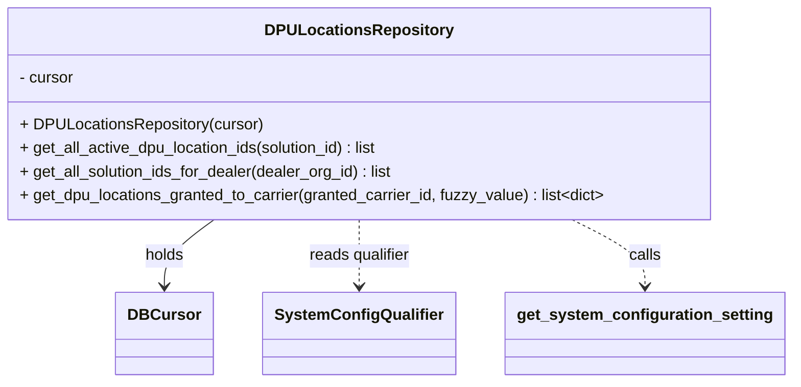

# Diagram: entity_core/entity_search/entity_search/db/dpu_locations_repository.py


> Auto-generated by Obscura crawlers

## Diagram 1



### SVG

<svg id="container" width="788.78515625" xmlns="http://www.w3.org/2000/svg" class="classDiagram" height="390" viewBox="0 0 788.78515625 390" role="graphics-document document" aria-roledescription="class"><style>#container{font-family:"trebuchet ms",verdana,arial,sans-serif;font-size:16px;fill:#333;}@keyframes edge-animation-frame{from{stroke-dashoffset:0;}}@keyframes dash{to{stroke-dashoffset:0;}}#container .edge-animation-slow{stroke-dasharray:9,5!important;stroke-dashoffset:900;animation:dash 50s linear infinite;stroke-linecap:round;}#container .edge-animation-fast{stroke-dasharray:9,5!important;stroke-dashoffset:900;animation:dash 20s linear infinite;stroke-linecap:round;}#container .error-icon{fill:#552222;}#container .error-text{fill:#552222;stroke:#552222;}#container .edge-thickness-normal{stroke-width:1px;}#container .edge-thickness-thick{stroke-width:3.5px;}#container .edge-pattern-solid{stroke-dasharray:0;}#container .edge-thickness-invisible{stroke-width:0;fill:none;}#container .edge-pattern-dashed{stroke-dasharray:3;}#container .edge-pattern-dotted{stroke-dasharray:2;}#container .marker{fill:#333333;stroke:#333333;}#container .marker.cross{stroke:#333333;}#container svg{font-family:"trebuchet ms",verdana,arial,sans-serif;font-size:16px;}#container p{margin:0;}#container g.classGroup text{fill:#9370DB;stroke:none;font-family:"trebuchet ms",verdana,arial,sans-serif;font-size:10px;}#container g.classGroup text .title{font-weight:bolder;}#container .nodeLabel,#container .edgeLabel{color:#131300;}#container .edgeLabel .label rect{fill:#ECECFF;}#container .label text{fill:#131300;}#container .labelBkg{background:#ECECFF;}#container .edgeLabel .label span{background:#ECECFF;}#container .classTitle{font-weight:bolder;}#container .node rect,#container .node circle,#container .node ellipse,#container .node polygon,#container .node path{fill:#ECECFF;stroke:#9370DB;stroke-width:1px;}#container .divider{stroke:#9370DB;stroke-width:1;}#container g.clickable{cursor:pointer;}#container g.classGroup rect{fill:#ECECFF;stroke:#9370DB;}#container g.classGroup line{stroke:#9370DB;stroke-width:1;}#container .classLabel .box{stroke:none;stroke-width:0;fill:#ECECFF;opacity:0.5;}#container .classLabel .label{fill:#9370DB;font-size:10px;}#container .relation{stroke:#333333;stroke-width:1;fill:none;}#container .dashed-line{stroke-dasharray:3;}#container .dotted-line{stroke-dasharray:1 2;}#container #compositionStart,#container .composition{fill:#333333!important;stroke:#333333!important;stroke-width:1;}#container #compositionEnd,#container .composition{fill:#333333!important;stroke:#333333!important;stroke-width:1;}#container #dependencyStart,#container .dependency{fill:#333333!important;stroke:#333333!important;stroke-width:1;}#container #dependencyStart,#container .dependency{fill:#333333!important;stroke:#333333!important;stroke-width:1;}#container #extensionStart,#container .extension{fill:transparent!important;stroke:#333333!important;stroke-width:1;}#container #extensionEnd,#container .extension{fill:transparent!important;stroke:#333333!important;stroke-width:1;}#container #aggregationStart,#container .aggregation{fill:transparent!important;stroke:#333333!important;stroke-width:1;}#container #aggregationEnd,#container .aggregation{fill:transparent!important;stroke:#333333!important;stroke-width:1;}#container #lollipopStart,#container .lollipop{fill:#ECECFF!important;stroke:#333333!important;stroke-width:1;}#container #lollipopEnd,#container .lollipop{fill:#ECECFF!important;stroke:#333333!important;stroke-width:1;}#container .edgeTerminals{font-size:11px;line-height:initial;}#container .classTitleText{text-anchor:middle;font-size:18px;fill:#333;}#container .label-icon{display:inline-block;height:1em;overflow:visible;vertical-align:-0.125em;}#container .node .label-icon path{fill:currentColor;stroke:revert;stroke-width:revert;}#container :root{--mermaid-font-family:"trebuchet ms",verdana,arial,sans-serif;}</style><g><defs><marker id="container_class-aggregationStart" class="marker aggregation class" refX="18" refY="7" markerWidth="190" markerHeight="240" orient="auto"><path d="M 18,7 L9,13 L1,7 L9,1 Z"></path></marker></defs><defs><marker id="container_class-aggregationEnd" class="marker aggregation class" refX="1" refY="7" markerWidth="20" markerHeight="28" orient="auto"><path d="M 18,7 L9,13 L1,7 L9,1 Z"></path></marker></defs><defs><marker id="container_class-extensionStart" class="marker extension class" refX="18" refY="7" markerWidth="190" markerHeight="240" orient="auto"><path d="M 1,7 L18,13 V 1 Z"></path></marker></defs><defs><marker id="container_class-extensionEnd" class="marker extension class" refX="1" refY="7" markerWidth="20" markerHeight="28" orient="auto"><path d="M 1,1 V 13 L18,7 Z"></path></marker></defs><defs><marker id="container_class-compositionStart" class="marker composition class" refX="18" refY="7" markerWidth="190" markerHeight="240" orient="auto"><path d="M 18,7 L9,13 L1,7 L9,1 Z"></path></marker></defs><defs><marker id="container_class-compositionEnd" class="marker composition class" refX="1" refY="7" markerWidth="20" markerHeight="28" orient="auto"><path d="M 18,7 L9,13 L1,7 L9,1 Z"></path></marker></defs><defs><marker id="container_class-dependencyStart" class="marker dependency class" refX="6" refY="7" markerWidth="190" markerHeight="240" orient="auto"><path d="M 5,7 L9,13 L1,7 L9,1 Z"></path></marker></defs><defs><marker id="container_class-dependencyEnd" class="marker dependency class" refX="13" refY="7" markerWidth="20" markerHeight="28" orient="auto"><path d="M 18,7 L9,13 L14,7 L9,1 Z"></path></marker></defs><defs><marker id="container_class-lollipopStart" class="marker lollipop class" refX="13" refY="7" markerWidth="190" markerHeight="240" orient="auto"><circle stroke="black" fill="transparent" cx="7" cy="7" r="6"></circle></marker></defs><defs><marker id="container_class-lollipopEnd" class="marker lollipop class" refX="1" refY="7" markerWidth="190" markerHeight="240" orient="auto"><circle stroke="black" fill="transparent" cx="7" cy="7" r="6"></circle></marker></defs><g class="root"><g class="clusters"></g><g class="edgePaths"><path d="M224.767,224L216.729,230.167C208.692,236.333,192.618,248.667,184.58,260C176.543,271.333,176.543,281.667,176.543,286.833L176.543,292" id="id_DPULocationsRepository_DBCursor_1" class="edge-thickness-normal edge-pattern-solid relation" style=";;;" data-edge="true" data-et="edge" data-id="id_DPULocationsRepository_DBCursor_1" data-points="W3sieCI6MjI0Ljc2NjU2Nzg4NzkzMTA1LCJ5IjoyMjR9LHsieCI6MTc2LjU0Mjk2ODc1LCJ5IjoyNjF9LHsieCI6MTc2LjU0Mjk2ODc1LCJ5IjoyOTh9XQ==" marker-end="url(#container_class-dependencyEnd)"></path><path d="M365.527,224L365.527,230.167C365.527,236.333,365.527,248.667,365.527,260C365.527,271.333,365.527,281.667,365.527,286.833L365.527,292" id="id_DPULocationsRepository_SystemConfigQualifier_2" class="edge-thickness-normal edge-pattern-dashed relation" style=";;;" data-edge="true" data-et="edge" data-id="id_DPULocationsRepository_SystemConfigQualifier_2" data-points="W3sieCI6MzY1LjUyNzM0Mzc1LCJ5IjoyMjR9LHsieCI6MzY1LjUyNzM0Mzc1LCJ5IjoyNjF9LHsieCI6MzY1LjUyNzM0Mzc1LCJ5IjoyOTh9XQ==" marker-end="url(#container_class-dependencyEnd)"></path><path d="M573.404,224L585.274,230.167C597.143,236.333,620.882,248.667,632.752,260C644.621,271.333,644.621,281.667,644.621,286.833L644.621,292" id="id_DPULocationsRepository_get_system_configuration_setting_3" class="edge-thickness-normal edge-pattern-dashed relation" style=";;;" data-edge="true" data-et="edge" data-id="id_DPULocationsRepository_get_system_configuration_setting_3" data-points="W3sieCI6NTczLjQwNDA2Nzg4NzkzMSwieSI6MjI0fSx7IngiOjY0NC42MjEwOTM3NSwieSI6MjYxfSx7IngiOjY0NC42MjEwOTM3NSwieSI6Mjk4fV0=" marker-end="url(#container_class-dependencyEnd)"></path></g><g class="edgeLabels"><g class="edgeLabel" transform="translate(176.54296875, 261)"><g class="label" data-id="id_DPULocationsRepository_DBCursor_1" transform="translate(-20.1875, -12)"><foreignObject width="40.375" height="24"><div xmlns="http://www.w3.org/1999/xhtml" class="labelBkg" style="display: table-cell; white-space: nowrap; line-height: 1.5; max-width: 200px; text-align: center;"><span class="edgeLabel"><p>holds</p></span></div></foreignObject></g></g><g class="edgeLabel" transform="translate(365.52734375, 261)"><g class="label" data-id="id_DPULocationsRepository_SystemConfigQualifier_2" transform="translate(-52.484375, -12)"><foreignObject width="104.96875" height="24"><div xmlns="http://www.w3.org/1999/xhtml" class="labelBkg" style="display: table-cell; white-space: nowrap; line-height: 1.5; max-width: 200px; text-align: center;"><span class="edgeLabel"><p>reads qualifier</p></span></div></foreignObject></g></g><g class="edgeLabel" transform="translate(644.62109375, 261)"><g class="label" data-id="id_DPULocationsRepository_get_system_configuration_setting_3" transform="translate(-16.4453125, -12)"><foreignObject width="32.890625" height="24"><div xmlns="http://www.w3.org/1999/xhtml" class="labelBkg" style="display: table-cell; white-space: nowrap; line-height: 1.5; max-width: 200px; text-align: center;"><span class="edgeLabel"><p>calls</p></span></div></foreignObject></g></g></g><g class="nodes"><g class="node default" id="classId-DPULocationsRepository-0" transform="translate(365.52734375, 116)"><g class="basic label-container"><path d="M-357.52734375 -108 L357.52734375 -108 L357.52734375 108 L-357.52734375 108" stroke="none" stroke-width="0" fill="#ECECFF" style=""></path><path d="M-357.52734375 -108 C-110.06867988782142 -108, 137.38998397435716 -108, 357.52734375 -108 M-357.52734375 -108 C-196.8251288034024 -108, -36.122913856804814 -108, 357.52734375 -108 M357.52734375 -108 C357.52734375 -64.48076789626424, 357.52734375 -20.961535792528466, 357.52734375 108 M357.52734375 -108 C357.52734375 -39.39337287949847, 357.52734375 29.213254241003057, 357.52734375 108 M357.52734375 108 C80.74225553185084 108, -196.0428326862983 108, -357.52734375 108 M357.52734375 108 C163.27606716935975 108, -30.975209411280503 108, -357.52734375 108 M-357.52734375 108 C-357.52734375 50.96322226487709, -357.52734375 -6.073555470245822, -357.52734375 -108 M-357.52734375 108 C-357.52734375 28.22432006461898, -357.52734375 -51.55135987076204, -357.52734375 -108" stroke="#9370DB" stroke-width="1.3" fill="none" stroke-dasharray="0 0" style=""></path></g><g class="annotation-group text" transform="translate(0, -84)"></g><g class="label-group text" transform="translate(-90.1953125, -84)"><g class="label" style="font-weight: bolder" transform="translate(0,-12)"><foreignObject width="180.390625" height="24"><div xmlns="http://www.w3.org/1999/xhtml" style="display: table-cell; white-space: nowrap; line-height: 1.5; max-width: 228px; text-align: center;"><span class="nodeLabel markdown-node-label" style=""><p>DPULocationsRepository</p></span></div></foreignObject></g></g><g class="members-group text" transform="translate(-345.52734375, -36)"><g class="label" style="" transform="translate(0,-12)"><foreignObject width="56.421875" height="24"><div xmlns="http://www.w3.org/1999/xhtml" style="display: table-cell; white-space: nowrap; line-height: 1.5; max-width: 115px; text-align: center;"><span class="nodeLabel markdown-node-label" style=""><p>- cursor</p></span></div></foreignObject></g></g><g class="methods-group text" transform="translate(-345.52734375, 12)"><g class="label" style="" transform="translate(0,-12)"><foreignObject width="246.03125" height="24"><div xmlns="http://www.w3.org/1999/xhtml" style="display: table-cell; white-space: nowrap; line-height: 1.5; max-width: 303px; text-align: center;"><span class="nodeLabel markdown-node-label" style=""><p>+ DPULocationsRepository(cursor)</p></span></div></foreignObject></g><g class="label" style="" transform="translate(0,12)"><foreignObject width="372.484375" height="24"><div xmlns="http://www.w3.org/1999/xhtml" style="display: table-cell; white-space: nowrap; line-height: 1.5; max-width: 430px; text-align: center;"><span class="nodeLabel markdown-node-label" style=""><p>+ get_all_active_dpu_location_ids(solution_id) : list</p></span></div></foreignObject></g><g class="label" style="" transform="translate(0,36)"><foreignObject width="384.125" height="24"><div xmlns="http://www.w3.org/1999/xhtml" style="display: table-cell; white-space: nowrap; line-height: 1.5; max-width: 442px; text-align: center;"><span class="nodeLabel markdown-node-label" style=""><p>+ get_all_solution_ids_for_dealer(dealer_org_id) : list</p></span></div></foreignObject></g><g class="label" style="" transform="translate(0,60)"><foreignObject width="600.859375" height="24"><div xmlns="http://www.w3.org/1999/xhtml" style="display: table-cell; white-space: nowrap; line-height: 1.5; max-width: 698px; text-align: center;"><span class="nodeLabel markdown-node-label" style=""><p>+ get_dpu_locations_granted_to_carrier(granted_carrier_id, fuzzy_value) : list&lt;dict&gt;</p></span></div></foreignObject></g></g><g class="divider" style=""><path d="M-357.52734375 -60 C-162.89322024007632 -60, 31.740903269847365 -60, 357.52734375 -60 M-357.52734375 -60 C-198.660829491991 -60, -39.79431523398199 -60, 357.52734375 -60" stroke="#9370DB" stroke-width="1.3" fill="none" stroke-dasharray="0 0" style=""></path></g><g class="divider" style=""><path d="M-357.52734375 -12 C-113.08814091592251 -12, 131.35106191815498 -12, 357.52734375 -12 M-357.52734375 -12 C-176.05109117946148 -12, 5.42516139107704 -12, 357.52734375 -12" stroke="#9370DB" stroke-width="1.3" fill="none" stroke-dasharray="0 0" style=""></path></g></g><g class="node default" id="classId-SystemConfigQualifier-1" transform="translate(365.52734375, 340)"><g class="basic label-container"><path d="M-92.9296875 -42 L92.9296875 -42 L92.9296875 42 L-92.9296875 42" stroke="none" stroke-width="0" fill="#ECECFF" style=""></path><path d="M-92.9296875 -42 C-53.40014137437406 -42, -13.870595248748117 -42, 92.9296875 -42 M-92.9296875 -42 C-47.52793022622262 -42, -2.126172952445245 -42, 92.9296875 -42 M92.9296875 -42 C92.9296875 -22.383438062728878, 92.9296875 -2.766876125457756, 92.9296875 42 M92.9296875 -42 C92.9296875 -14.234347928674385, 92.9296875 13.53130414265123, 92.9296875 42 M92.9296875 42 C34.584617089498956 42, -23.76045332100209 42, -92.9296875 42 M92.9296875 42 C30.884337800171956 42, -31.16101189965609 42, -92.9296875 42 M-92.9296875 42 C-92.9296875 16.938394346118862, -92.9296875 -8.123211307762276, -92.9296875 -42 M-92.9296875 42 C-92.9296875 14.909404434488842, -92.9296875 -12.181191131022317, -92.9296875 -42" stroke="#9370DB" stroke-width="1.3" fill="none" stroke-dasharray="0 0" style=""></path></g><g class="annotation-group text" transform="translate(0, -18)"></g><g class="label-group text" transform="translate(-80.9296875, -18)"><g class="label" style="font-weight: bolder" transform="translate(0,-12)"><foreignObject width="161.859375" height="24"><div xmlns="http://www.w3.org/1999/xhtml" style="display: table-cell; white-space: nowrap; line-height: 1.5; max-width: 210px; text-align: center;"><span class="nodeLabel markdown-node-label" style=""><p>SystemConfigQualifier</p></span></div></foreignObject></g></g><g class="members-group text" transform="translate(-80.9296875, 30)"></g><g class="methods-group text" transform="translate(-80.9296875, 60)"></g><g class="divider" style=""><path d="M-92.9296875 6 C-39.0216853329407 6, 14.886316834118603 6, 92.9296875 6 M-92.9296875 6 C-23.41366871394331 6, 46.10235007211338 6, 92.9296875 6" stroke="#9370DB" stroke-width="1.3" fill="none" stroke-dasharray="0 0" style=""></path></g><g class="divider" style=""><path d="M-92.9296875 24 C-30.9785055862812 24, 30.972676327437597 24, 92.9296875 24 M-92.9296875 24 C-51.273708100861995 24, -9.61772870172399 24, 92.9296875 24" stroke="#9370DB" stroke-width="1.3" fill="none" stroke-dasharray="0 0" style=""></path></g></g><g class="node default" id="classId-get_system_configuration_setting-2" transform="translate(644.62109375, 340)"><g class="basic label-container"><path d="M-136.1640625 -42 L136.1640625 -42 L136.1640625 42 L-136.1640625 42" stroke="none" stroke-width="0" fill="#ECECFF" style=""></path><path d="M-136.1640625 -42 C-30.89642242555051 -42, 74.37121764889898 -42, 136.1640625 -42 M-136.1640625 -42 C-76.73666493418335 -42, -17.309267368366704 -42, 136.1640625 -42 M136.1640625 -42 C136.1640625 -16.864049656947024, 136.1640625 8.271900686105951, 136.1640625 42 M136.1640625 -42 C136.1640625 -18.86498577000725, 136.1640625 4.270028459985497, 136.1640625 42 M136.1640625 42 C32.82916354825825 42, -70.5057354034835 42, -136.1640625 42 M136.1640625 42 C59.847646054662334 42, -16.46877039067533 42, -136.1640625 42 M-136.1640625 42 C-136.1640625 15.285731845492414, -136.1640625 -11.428536309015172, -136.1640625 -42 M-136.1640625 42 C-136.1640625 23.973615694062484, -136.1640625 5.947231388124969, -136.1640625 -42" stroke="#9370DB" stroke-width="1.3" fill="none" stroke-dasharray="0 0" style=""></path></g><g class="annotation-group text" transform="translate(0, -18)"></g><g class="label-group text" transform="translate(-124.1640625, -18)"><g class="label" style="font-weight: bolder" transform="translate(0,-12)"><foreignObject width="248.328125" height="24"><div xmlns="http://www.w3.org/1999/xhtml" style="display: table-cell; white-space: nowrap; line-height: 1.5; max-width: 294px; text-align: center;"><span class="nodeLabel markdown-node-label" style=""><p>get_system_configuration_setting</p></span></div></foreignObject></g></g><g class="members-group text" transform="translate(-124.1640625, 30)"></g><g class="methods-group text" transform="translate(-124.1640625, 60)"></g><g class="divider" style=""><path d="M-136.1640625 6 C-39.81675978185301 6, 56.53054293629398 6, 136.1640625 6 M-136.1640625 6 C-42.72771539246183 6, 50.708631715076336 6, 136.1640625 6" stroke="#9370DB" stroke-width="1.3" fill="none" stroke-dasharray="0 0" style=""></path></g><g class="divider" style=""><path d="M-136.1640625 24 C-56.8319945565956 24, 22.500073386808793 24, 136.1640625 24 M-136.1640625 24 C-72.65918868397381 24, -9.154314867947633 24, 136.1640625 24" stroke="#9370DB" stroke-width="1.3" fill="none" stroke-dasharray="0 0" style=""></path></g></g><g class="node default" id="classId-DBCursor-3" transform="translate(176.54296875, 340)"><g class="basic label-container"><path d="M-46.0546875 -42 L46.0546875 -42 L46.0546875 42 L-46.0546875 42" stroke="none" stroke-width="0" fill="#ECECFF" style=""></path><path d="M-46.0546875 -42 C-15.4140341831984 -42, 15.2266191336032 -42, 46.0546875 -42 M-46.0546875 -42 C-15.605539959780021 -42, 14.843607580439958 -42, 46.0546875 -42 M46.0546875 -42 C46.0546875 -21.758890942579843, 46.0546875 -1.5177818851596854, 46.0546875 42 M46.0546875 -42 C46.0546875 -12.137565774012792, 46.0546875 17.724868451974416, 46.0546875 42 M46.0546875 42 C19.29890500373598 42, -7.4568774925280366 42, -46.0546875 42 M46.0546875 42 C14.213152238591778 42, -17.628383022816443 42, -46.0546875 42 M-46.0546875 42 C-46.0546875 11.707920160409238, -46.0546875 -18.584159679181525, -46.0546875 -42 M-46.0546875 42 C-46.0546875 10.394585757802204, -46.0546875 -21.21082848439559, -46.0546875 -42" stroke="#9370DB" stroke-width="1.3" fill="none" stroke-dasharray="0 0" style=""></path></g><g class="annotation-group text" transform="translate(0, -18)"></g><g class="label-group text" transform="translate(-34.0546875, -18)"><g class="label" style="font-weight: bolder" transform="translate(0,-12)"><foreignObject width="68.109375" height="24"><div xmlns="http://www.w3.org/1999/xhtml" style="display: table-cell; white-space: nowrap; line-height: 1.5; max-width: 118px; text-align: center;"><span class="nodeLabel markdown-node-label" style=""><p>DBCursor</p></span></div></foreignObject></g></g><g class="members-group text" transform="translate(-34.0546875, 30)"></g><g class="methods-group text" transform="translate(-34.0546875, 60)"></g><g class="divider" style=""><path d="M-46.0546875 6 C-14.125927039422187 6, 17.802833421155626 6, 46.0546875 6 M-46.0546875 6 C-10.555928260902519 6, 24.942830978194962 6, 46.0546875 6" stroke="#9370DB" stroke-width="1.3" fill="none" stroke-dasharray="0 0" style=""></path></g><g class="divider" style=""><path d="M-46.0546875 24 C-20.424691161383375 24, 5.2053051772332495 24, 46.0546875 24 M-46.0546875 24 C-12.78687178245076 24, 20.48094393509848 24, 46.0546875 24" stroke="#9370DB" stroke-width="1.3" fill="none" stroke-dasharray="0 0" style=""></path></g></g></g></g></g></svg>

## Diagram 2

```mermaid
flowchart TD
  subgraph get_all_active_dpu_location_ids
    A1([Start: get_all_active_dpu_location_ids(solution_id)]) --> A2{Is solution_id a tuple?}
    A2 -- Yes --> A3[Convert tuple to list]
    A2 -- No --> A4[Keep solution_id]
    A3 --> A5[Set qualifier = SystemConfigQualifier.DDA_LOCATION_VISIBILITY]
    A4 --> A5
    A5 --> A6[Call get_system_configuration_setting(cursor, qualifier, solution_id)]
    A6 --> A7[Receive location_ids]
    A7 --> A8([Return location_ids])
  end

  subgraph get_dpu_locations_granted_to_carrier
    B1([Start: get_dpu_locations_granted_to_carrier(granted_carrier_id, fuzzy_value)]) --> B2[Build data dict: org_id, search_value]
    B2 --> B3[Prepare complex SQL query with joins, filters, and subqueries]
    B3 --> B4[Execute query: cursor.execute(query, data)]
    B4 --> B5[Fetch rows: cursor.fetchall()]
    B5 --> B6[Map rows to dicts: [loc._asdict() for loc in rows]]
    B6 --> B7([Return list of location dicts])
  end
```

> SVG rendering failed for this diagram.
