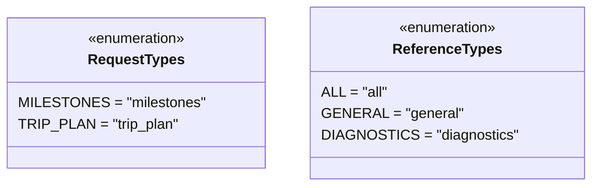

# Diagram: entity_core/entity_search/entity_search/db/entity_extract_by_location_support.py


> Auto-generated by Obscura crawlers

## Diagram 1



### SVG

<svg id="container" width="630.890625" xmlns="http://www.w3.org/2000/svg" class="classDiagram" height="208" viewBox="0 0 630.890625 208" role="graphics-document document" aria-roledescription="class"><style>#container{font-family:"trebuchet ms",verdana,arial,sans-serif;font-size:16px;fill:#333;}@keyframes edge-animation-frame{from{stroke-dashoffset:0;}}@keyframes dash{to{stroke-dashoffset:0;}}#container .edge-animation-slow{stroke-dasharray:9,5!important;stroke-dashoffset:900;animation:dash 50s linear infinite;stroke-linecap:round;}#container .edge-animation-fast{stroke-dasharray:9,5!important;stroke-dashoffset:900;animation:dash 20s linear infinite;stroke-linecap:round;}#container .error-icon{fill:#552222;}#container .error-text{fill:#552222;stroke:#552222;}#container .edge-thickness-normal{stroke-width:1px;}#container .edge-thickness-thick{stroke-width:3.5px;}#container .edge-pattern-solid{stroke-dasharray:0;}#container .edge-thickness-invisible{stroke-width:0;fill:none;}#container .edge-pattern-dashed{stroke-dasharray:3;}#container .edge-pattern-dotted{stroke-dasharray:2;}#container .marker{fill:#333333;stroke:#333333;}#container .marker.cross{stroke:#333333;}#container svg{font-family:"trebuchet ms",verdana,arial,sans-serif;font-size:16px;}#container p{margin:0;}#container g.classGroup text{fill:#9370DB;stroke:none;font-family:"trebuchet ms",verdana,arial,sans-serif;font-size:10px;}#container g.classGroup text .title{font-weight:bolder;}#container .nodeLabel,#container .edgeLabel{color:#131300;}#container .edgeLabel .label rect{fill:#ECECFF;}#container .label text{fill:#131300;}#container .labelBkg{background:#ECECFF;}#container .edgeLabel .label span{background:#ECECFF;}#container .classTitle{font-weight:bolder;}#container .node rect,#container .node circle,#container .node ellipse,#container .node polygon,#container .node path{fill:#ECECFF;stroke:#9370DB;stroke-width:1px;}#container .divider{stroke:#9370DB;stroke-width:1;}#container g.clickable{cursor:pointer;}#container g.classGroup rect{fill:#ECECFF;stroke:#9370DB;}#container g.classGroup line{stroke:#9370DB;stroke-width:1;}#container .classLabel .box{stroke:none;stroke-width:0;fill:#ECECFF;opacity:0.5;}#container .classLabel .label{fill:#9370DB;font-size:10px;}#container .relation{stroke:#333333;stroke-width:1;fill:none;}#container .dashed-line{stroke-dasharray:3;}#container .dotted-line{stroke-dasharray:1 2;}#container #compositionStart,#container .composition{fill:#333333!important;stroke:#333333!important;stroke-width:1;}#container #compositionEnd,#container .composition{fill:#333333!important;stroke:#333333!important;stroke-width:1;}#container #dependencyStart,#container .dependency{fill:#333333!important;stroke:#333333!important;stroke-width:1;}#container #dependencyStart,#container .dependency{fill:#333333!important;stroke:#333333!important;stroke-width:1;}#container #extensionStart,#container .extension{fill:transparent!important;stroke:#333333!important;stroke-width:1;}#container #extensionEnd,#container .extension{fill:transparent!important;stroke:#333333!important;stroke-width:1;}#container #aggregationStart,#container .aggregation{fill:transparent!important;stroke:#333333!important;stroke-width:1;}#container #aggregationEnd,#container .aggregation{fill:transparent!important;stroke:#333333!important;stroke-width:1;}#container #lollipopStart,#container .lollipop{fill:#ECECFF!important;stroke:#333333!important;stroke-width:1;}#container #lollipopEnd,#container .lollipop{fill:#ECECFF!important;stroke:#333333!important;stroke-width:1;}#container .edgeTerminals{font-size:11px;line-height:initial;}#container .classTitleText{text-anchor:middle;font-size:18px;fill:#333;}#container .label-icon{display:inline-block;height:1em;overflow:visible;vertical-align:-0.125em;}#container .node .label-icon path{fill:currentColor;stroke:revert;stroke-width:revert;}#container :root{--mermaid-font-family:"trebuchet ms",verdana,arial,sans-serif;}</style><g><defs><marker id="container_class-aggregationStart" class="marker aggregation class" refX="18" refY="7" markerWidth="190" markerHeight="240" orient="auto"><path d="M 18,7 L9,13 L1,7 L9,1 Z"></path></marker></defs><defs><marker id="container_class-aggregationEnd" class="marker aggregation class" refX="1" refY="7" markerWidth="20" markerHeight="28" orient="auto"><path d="M 18,7 L9,13 L1,7 L9,1 Z"></path></marker></defs><defs><marker id="container_class-extensionStart" class="marker extension class" refX="18" refY="7" markerWidth="190" markerHeight="240" orient="auto"><path d="M 1,7 L18,13 V 1 Z"></path></marker></defs><defs><marker id="container_class-extensionEnd" class="marker extension class" refX="1" refY="7" markerWidth="20" markerHeight="28" orient="auto"><path d="M 1,1 V 13 L18,7 Z"></path></marker></defs><defs><marker id="container_class-compositionStart" class="marker composition class" refX="18" refY="7" markerWidth="190" markerHeight="240" orient="auto"><path d="M 18,7 L9,13 L1,7 L9,1 Z"></path></marker></defs><defs><marker id="container_class-compositionEnd" class="marker composition class" refX="1" refY="7" markerWidth="20" markerHeight="28" orient="auto"><path d="M 18,7 L9,13 L1,7 L9,1 Z"></path></marker></defs><defs><marker id="container_class-dependencyStart" class="marker dependency class" refX="6" refY="7" markerWidth="190" markerHeight="240" orient="auto"><path d="M 5,7 L9,13 L1,7 L9,1 Z"></path></marker></defs><defs><marker id="container_class-dependencyEnd" class="marker dependency class" refX="13" refY="7" markerWidth="20" markerHeight="28" orient="auto"><path d="M 18,7 L9,13 L14,7 L9,1 Z"></path></marker></defs><defs><marker id="container_class-lollipopStart" class="marker lollipop class" refX="13" refY="7" markerWidth="190" markerHeight="240" orient="auto"><circle stroke="black" fill="transparent" cx="7" cy="7" r="6"></circle></marker></defs><defs><marker id="container_class-lollipopEnd" class="marker lollipop class" refX="1" refY="7" markerWidth="190" markerHeight="240" orient="auto"><circle stroke="black" fill="transparent" cx="7" cy="7" r="6"></circle></marker></defs><g class="root"><g class="clusters"></g><g class="edgePaths"></g><g class="edgeLabels"></g><g class="nodes"><g class="node default" id="classId-RequestTypes-0" transform="translate(146.38671875, 104)"><g class="basic label-container"><path d="M-138.38671875 -84 L138.38671875 -84 L138.38671875 84 L-138.38671875 84" stroke="none" stroke-width="0" fill="#ECECFF" style=""></path><path d="M-138.38671875 -84 C-46.40792584717329 -84, 45.57086705565342 -84, 138.38671875 -84 M-138.38671875 -84 C-66.3951016477368 -84, 5.596515454526411 -84, 138.38671875 -84 M138.38671875 -84 C138.38671875 -39.27358945377542, 138.38671875 5.452821092449156, 138.38671875 84 M138.38671875 -84 C138.38671875 -26.928292239976678, 138.38671875 30.143415520046645, 138.38671875 84 M138.38671875 84 C56.97756409843841 84, -24.431590553123186 84, -138.38671875 84 M138.38671875 84 C68.31899041011145 84, -1.7487379297770929 84, -138.38671875 84 M-138.38671875 84 C-138.38671875 39.590480342722195, -138.38671875 -4.81903931455561, -138.38671875 -84 M-138.38671875 84 C-138.38671875 45.82541920386908, -138.38671875 7.6508384077381635, -138.38671875 -84" stroke="#9370DB" stroke-width="1.3" fill="none" stroke-dasharray="0 0" style=""></path></g><g class="annotation-group text" transform="translate(-55.5546875, -60)"><g class="label" style="" transform="translate(0,-12)"><foreignObject width="111.109375" height="24"><div xmlns="http://www.w3.org/1999/xhtml" style="display: table-cell; white-space: nowrap; line-height: 1.5; max-width: 161px; text-align: center;"><span class="nodeLabel markdown-node-label" style=""><p>«enumeration»</p></span></div></foreignObject></g></g><g class="label-group text" transform="translate(-51.1796875, -36)"><g class="label" style="font-weight: bolder" transform="translate(0,-12)"><foreignObject width="102.359375" height="24"><div xmlns="http://www.w3.org/1999/xhtml" style="display: table-cell; white-space: nowrap; line-height: 1.5; max-width: 150px; text-align: center;"><span class="nodeLabel markdown-node-label" style=""><p>RequestTypes</p></span></div></foreignObject></g></g><g class="members-group text" transform="translate(-126.38671875, 12)"><g class="label" style="" transform="translate(0,-12)"><foreignObject width="197.21875" height="24"><div xmlns="http://www.w3.org/1999/xhtml" style="display: table-cell; white-space: nowrap; line-height: 1.5; max-width: 247px; text-align: center;"><span class="nodeLabel markdown-node-label" style=""><p>MILESTONES = "milestones"</p></span></div></foreignObject></g><g class="label" style="" transform="translate(0,12)"><foreignObject width="171.46875" height="24"><div xmlns="http://www.w3.org/1999/xhtml" style="display: table-cell; white-space: nowrap; line-height: 1.5; max-width: 221px; text-align: center;"><span class="nodeLabel markdown-node-label" style=""><p>TRIP_PLAN = "trip_plan"</p></span></div></foreignObject></g></g><g class="methods-group text" transform="translate(-126.38671875, 84)"></g><g class="divider" style=""><path d="M-138.38671875 -12 C-37.77616717216394 -12, 62.834384405672125 -12, 138.38671875 -12 M-138.38671875 -12 C-76.4091564392362 -12, -14.431594128472383 -12, 138.38671875 -12" stroke="#9370DB" stroke-width="1.3" fill="none" stroke-dasharray="0 0" style=""></path></g><g class="divider" style=""><path d="M-138.38671875 60 C-42.7092355428977 60, 52.9682476642046 60, 138.38671875 60 M-138.38671875 60 C-29.685019280436236 60, 79.01668018912753 60, 138.38671875 60" stroke="#9370DB" stroke-width="1.3" fill="none" stroke-dasharray="0 0" style=""></path></g></g><g class="node default" id="classId-ReferenceTypes-1" transform="translate(478.83203125, 104)"><g class="basic label-container"><path d="M-144.05859375 -96 L144.05859375 -96 L144.05859375 96 L-144.05859375 96" stroke="none" stroke-width="0" fill="#ECECFF" style=""></path><path d="M-144.05859375 -96 C-86.38952699675711 -96, -28.720460243514225 -96, 144.05859375 -96 M-144.05859375 -96 C-57.68369510233376 -96, 28.691203545332485 -96, 144.05859375 -96 M144.05859375 -96 C144.05859375 -19.99088911217318, 144.05859375 56.01822177565364, 144.05859375 96 M144.05859375 -96 C144.05859375 -57.43018113271469, 144.05859375 -18.860362265429373, 144.05859375 96 M144.05859375 96 C31.499544799938846 96, -81.05950415012231 96, -144.05859375 96 M144.05859375 96 C38.33649043216015 96, -67.3856128856797 96, -144.05859375 96 M-144.05859375 96 C-144.05859375 56.855006625613875, -144.05859375 17.71001325122775, -144.05859375 -96 M-144.05859375 96 C-144.05859375 21.904757118434688, -144.05859375 -52.190485763130624, -144.05859375 -96" stroke="#9370DB" stroke-width="1.3" fill="none" stroke-dasharray="0 0" style=""></path></g><g class="annotation-group text" transform="translate(-55.5546875, -72)"><g class="label" style="" transform="translate(0,-12)"><foreignObject width="111.109375" height="24"><div xmlns="http://www.w3.org/1999/xhtml" style="display: table-cell; white-space: nowrap; line-height: 1.5; max-width: 161px; text-align: center;"><span class="nodeLabel markdown-node-label" style=""><p>«enumeration»</p></span></div></foreignObject></g></g><g class="label-group text" transform="translate(-57.7109375, -48)"><g class="label" style="font-weight: bolder" transform="translate(0,-12)"><foreignObject width="115.421875" height="24"><div xmlns="http://www.w3.org/1999/xhtml" style="display: table-cell; white-space: nowrap; line-height: 1.5; max-width: 163px; text-align: center;"><span class="nodeLabel markdown-node-label" style=""><p>ReferenceTypes</p></span></div></foreignObject></g></g><g class="members-group text" transform="translate(-132.05859375, 0)"><g class="label" style="" transform="translate(0,-12)"><foreignObject width="71.796875" height="24"><div xmlns="http://www.w3.org/1999/xhtml" style="display: table-cell; white-space: nowrap; line-height: 1.5; max-width: 122px; text-align: center;"><span class="nodeLabel markdown-node-label" style=""><p>ALL = "all"</p></span></div></foreignObject></g><g class="label" style="" transform="translate(0,12)"><foreignObject width="147.703125" height="24"><div xmlns="http://www.w3.org/1999/xhtml" style="display: table-cell; white-space: nowrap; line-height: 1.5; max-width: 198px; text-align: center;"><span class="nodeLabel markdown-node-label" style=""><p>GENERAL = "general"</p></span></div></foreignObject></g><g class="label" style="" transform="translate(0,36)"><foreignObject width="206.40625" height="24"><div xmlns="http://www.w3.org/1999/xhtml" style="display: table-cell; white-space: nowrap; line-height: 1.5; max-width: 256px; text-align: center;"><span class="nodeLabel markdown-node-label" style=""><p>DIAGNOSTICS = "diagnostics"</p></span></div></foreignObject></g></g><g class="methods-group text" transform="translate(-132.05859375, 96)"></g><g class="divider" style=""><path d="M-144.05859375 -24 C-58.21891477795427 -24, 27.620764194091464 -24, 144.05859375 -24 M-144.05859375 -24 C-37.29282488279242 -24, 69.47294398441517 -24, 144.05859375 -24" stroke="#9370DB" stroke-width="1.3" fill="none" stroke-dasharray="0 0" style=""></path></g><g class="divider" style=""><path d="M-144.05859375 72 C-79.61621394180172 72, -15.173834133603435 72, 144.05859375 72 M-144.05859375 72 C-62.40249881917249 72, 19.253596111655014 72, 144.05859375 72" stroke="#9370DB" stroke-width="1.3" fill="none" stroke-dasharray="0 0" style=""></path></g></g></g></g></g></svg>

## Diagram 2

```mermaid
flowchart TD
    Start([Start]) --> Decide{Select extract type}
    Decide --> |"MILESTONES"| MilestoneFunc[get_milestone_extract_sql()]
    Decide --> |"TRIP_PLAN"| TripFunc[get_trip_plan_extract_sql(reference_types)]
    MilestoneFunc --> MSQL[Compose milestone SQL]
    MSQL --> MSub[JOIN entity, subquery visible_entity, references subquery]
    MSub --> MReturn[Return milestone SQL string]
    TripFunc --> TInit[Initialize trip_plan_extract_sql with visible_entities CTE and base SELECT]
    TInit --> TRefCond{reference_types value}
    TRefCond --> |ALL| TAppendAll[Append closing ),]
    TRefCond --> |GENERAL| TAppendGen[Append "AND erf.reference_type isnull", then closing ),]
    TRefCond --> |DIAGNOSTICS| TAppendDiag[Append "AND erf.reference_type = 'Diagnostics'", then closing ),]
    TAppendAll --> TTripAgg[Append 'trip_plan' JSON aggregation block]
    TAppendGen --> TTripAgg
    TAppendDiag --> TTripAgg
    TTripAgg --> TLegs[Aggregate planned_trip_leg joins and nested origin/destination location subqueries]
    TLegs --> TWhere[Append WHERE e.stops filter and timestamp BETWEEN start_ts and end_ts]
    TWhere --> TReturn[Return trip_plan SQL string]
    MReturn & TReturn --> End([End])
```

> SVG rendering failed for this diagram.
