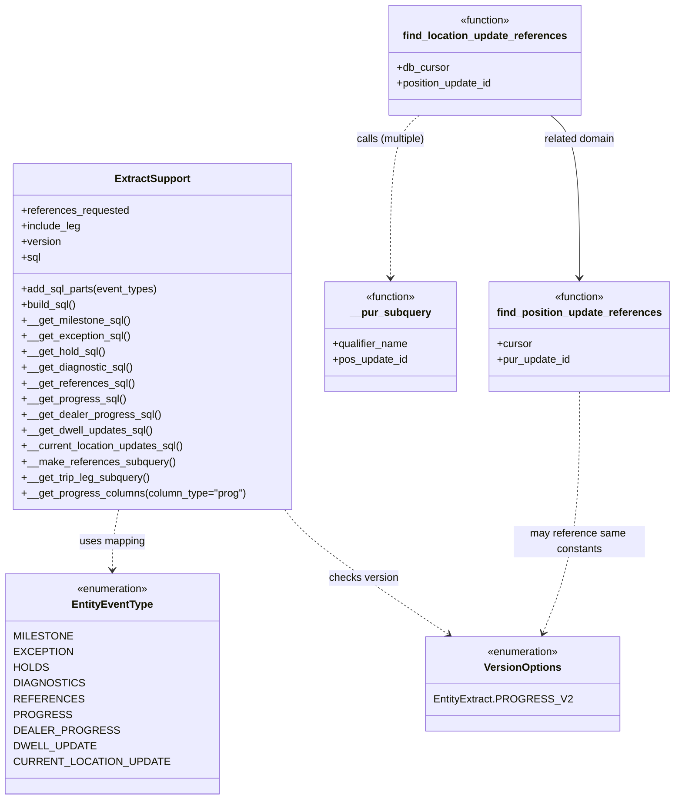

# Diagram: entity_core/entity_search/entity_search/db/entity_extract_support.py


> Auto-generated by Obscura crawlers

## Diagram 1



> SVG rendering failed for this diagram.

## Diagram 2

```mermaid
flowchart LR
  subgraph AddSQLPartsFlow
    A[Start: add_sql_parts(event_types)] --> B[Build type_to_func_mapping]
    B --> M[MAPPING: EntityEventType.MILESTONE --> __get_milestone_sql()]
    B --> X[... other mappings ...]
    M --> C{Iterate event_types}
    X --> C
    C -->|for each event_type| D[Append mapping[event_type] to sql list]
    D --> C
    C --> E[Done: sql list populated]
    E --> F[build_sql() joins with "UNION ALL"]
  end
```

> SVG rendering failed for this diagram.

## Diagram 3

```mermaid
flowchart LR
  subgraph LocationRefsFlow
    L1[find_location_update_references(db_cursor, position_update_id)] --> L2[Compose SQL using __pur_subquery for each qualifier]
    L2 --> L3[db_cursor.mogrify(sql)]
    L3 --> L4[db_cursor.execute(query)]
    L4 --> L5[fetchone()[0] -> result JSON]
    L5 --> L6[return JSON]
  end
```

> SVG rendering failed for this diagram.
