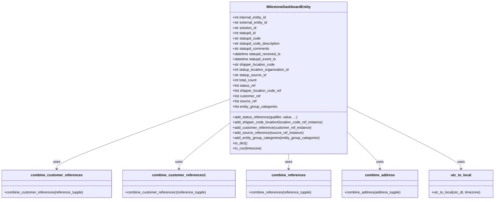

# Diagram: entity_core/entity_search/entity_search/db/milestone_dashboard.py

> Auto-generated by Obscura crawlers

## Mermaid

### SVG

<svg id="container" width="2247.6796875" xmlns="http://www.w3.org/2000/svg" class="classDiagram" height="912" viewBox="0 0 2247.6796875 912" role="graphics-document document" aria-roledescription="class"><g><defs><marker id="container_class-aggregationStart" class="marker aggregation class" refX="18" refY="7" markerWidth="190" markerHeight="240" orient="auto"><path d="M 18,7 L9,13 L1,7 L9,1 Z"></path></marker></defs><defs><marker id="container_class-aggregationEnd" class="marker aggregation class" refX="1" refY="7" markerWidth="20" markerHeight="28" orient="auto"><path d="M 18,7 L9,13 L1,7 L9,1 Z"></path></marker></defs><defs><marker id="container_class-extensionStart" class="marker extension class" refX="18" refY="7" markerWidth="190" markerHeight="240" orient="auto"><path d="M 1,7 L18,13 V 1 Z"></path></marker></defs><defs><marker id="container_class-extensionEnd" class="marker extension class" refX="1" refY="7" markerWidth="20" markerHeight="28" orient="auto"><path d="M 1,1 V 13 L18,7 Z"></path></marker></defs><defs><marker id="container_class-compositionStart" class="marker composition class" refX="18" refY="7" markerWidth="190" markerHeight="240" orient="auto"><path d="M 18,7 L9,13 L1,7 L9,1 Z"></path></marker></defs><defs><marker id="container_class-compositionEnd" class="marker composition class" refX="1" refY="7" markerWidth="20" markerHeight="28" orient="auto"><path d="M 18,7 L9,13 L1,7 L9,1 Z"></path></marker></defs><defs><marker id="container_class-dependencyStart" class="marker dependency class" refX="6" refY="7" markerWidth="190" markerHeight="240" orient="auto"><path d="M 5,7 L9,13 L1,7 L9,1 Z"></path></marker></defs><defs><marker id="container_class-dependencyEnd" class="marker dependency class" refX="13" refY="7" markerWidth="20" markerHeight="28" orient="auto"><path d="M 18,7 L9,13 L14,7 L9,1 Z"></path></marker></defs><defs><marker id="container_class-lollipopStart" class="marker lollipop class" refX="13" refY="7" markerWidth="190" markerHeight="240" orient="auto"><circle stroke="black" fill="transparent" cx="7" cy="7" r="6"></circle></marker></defs><defs><marker id="container_class-lollipopEnd" class="marker lollipop class" refX="1" refY="7" markerWidth="190" markerHeight="240" orient="auto"><circle stroke="black" fill="transparent" cx="7" cy="7" r="6"></circle></marker></defs><g class="root"><g class="clusters"></g><g class="edgePaths"><path d="M1036.875,454.664L906.855,502.386C776.835,550.109,516.794,645.555,386.774,698.444C256.754,751.333,256.754,761.667,256.754,766.833L256.754,772" id="id_MilestoneDashboardEntity_combine_customer_references_1" class="edge-thickness-normal edge-pattern-solid relation" style=";;;" data-edge="true" data-et="edge" data-id="id_MilestoneDashboardEntity_combine_customer_references_1" data-points="W3sieCI6MTAzNi44NzUsInkiOjQ1NC42NjM3MjM0MzgzMjYyNn0seyJ4IjoyNTYuNzUzOTA2MjUsInkiOjc0MX0seyJ4IjoyNTYuNzUzOTA2MjUsInkiOjc3OH1d" marker-end="url(#container_class-dependencyEnd)"></path><path d="M1036.875,564.46L998.934,593.883C960.992,623.306,885.109,682.153,847.168,716.743C809.227,751.333,809.227,761.667,809.227,766.833L809.227,772" id="id_MilestoneDashboardEntity_combine_customer_references1_2" class="edge-thickness-normal edge-pattern-solid relation" style=";;;" data-edge="true" data-et="edge" data-id="id_MilestoneDashboardEntity_combine_customer_references1_2" data-points="W3sieCI6MTAzNi44NzUsInkiOjU2NC40NTk3NDk5NDY4ODkyfSx7IngiOjgwOS4yMjY1NjI1LCJ5Ijo3NDF9LHsieCI6ODA5LjIyNjU2MjUsInkiOjc3OH1d" marker-end="url(#container_class-dependencyEnd)"></path><path d="M1305.684,704L1305.684,710.167C1305.684,716.333,1305.684,728.667,1305.684,740C1305.684,751.333,1305.684,761.667,1305.684,766.833L1305.684,772" id="id_MilestoneDashboardEntity_combine_references_3" class="edge-thickness-normal edge-pattern-solid relation" style=";;;" data-edge="true" data-et="edge" data-id="id_MilestoneDashboardEntity_combine_references_3" data-points="W3sieCI6MTMwNS42ODM1OTM3NSwieSI6NzA0fSx7IngiOjEzMDUuNjgzNTkzNzUsInkiOjc0MX0seyJ4IjoxMzA1LjY4MzU5Mzc1LCJ5Ijo3Nzh9XQ==" marker-end="url(#container_class-dependencyEnd)"></path><path d="M1574.492,605.002L1598.962,627.668C1623.431,650.334,1672.37,695.667,1696.839,723.5C1721.309,751.333,1721.309,761.667,1721.309,766.833L1721.309,772" id="id_MilestoneDashboardEntity_combine_address_4" class="edge-thickness-normal edge-pattern-solid relation" style=";;;" data-edge="true" data-et="edge" data-id="id_MilestoneDashboardEntity_combine_address_4" data-points="W3sieCI6MTU3NC40OTIxODc1LCJ5Ijo2MDUuMDAxNjQ0NzM2ODQyMX0seyJ4IjoxNzIxLjMwODU5Mzc1LCJ5Ijo3NDF9LHsieCI6MTcyMS4zMDg1OTM3NSwieSI6Nzc4fV0=" marker-end="url(#container_class-dependencyEnd)"></path><path d="M1574.492,487.626L1660.733,529.855C1746.974,572.084,1919.456,656.542,2005.697,703.938C2091.938,751.333,2091.938,761.667,2091.938,766.833L2091.938,772" id="id_MilestoneDashboardEntity_utc_to_local_5" class="edge-thickness-normal edge-pattern-solid relation" style=";;;" data-edge="true" data-et="edge" data-id="id_MilestoneDashboardEntity_utc_to_local_5" data-points="W3sieCI6MTU3NC40OTIxODc1LCJ5Ijo0ODcuNjI1ODExNjc2MjEzODZ9LHsieCI6MjA5MS45Mzc1LCJ5Ijo3NDF9LHsieCI6MjA5MS45Mzc1LCJ5Ijo3Nzh9XQ==" marker-end="url(#container_class-dependencyEnd)"></path></g><g class="edgeLabels"><g class="edgeLabel" transform="translate(256.75390625, 741)"><g class="label" data-id="id_MilestoneDashboardEntity_combine_customer_references_1" transform="translate(-16.4921875, -12)"><foreignObject width="32.984375" height="24">

uses

</foreignObject></g></g><g class="edgeLabel" transform="translate(809.2265625, 741)"><g class="label" data-id="id_MilestoneDashboardEntity_combine_customer_references1_2" transform="translate(-16.4921875, -12)"><foreignObject width="32.984375" height="24">

uses

</foreignObject></g></g><g class="edgeLabel" transform="translate(1305.68359375, 741)"><g class="label" data-id="id_MilestoneDashboardEntity_combine_references_3" transform="translate(-16.4921875, -12)"><foreignObject width="32.984375" height="24">

uses

</foreignObject></g></g><g class="edgeLabel" transform="translate(1721.30859375, 741)"><g class="label" data-id="id_MilestoneDashboardEntity_combine_address_4" transform="translate(-16.4921875, -12)"><foreignObject width="32.984375" height="24">

uses

</foreignObject></g></g><g class="edgeLabel" transform="translate(2091.9375, 741)"><g class="label" data-id="id_MilestoneDashboardEntity_utc_to_local_5" transform="translate(-16.4921875, -12)"><foreignObject width="32.984375" height="24">

uses

</foreignObject></g></g></g><g class="nodes"><g class="node default" id="classId-MilestoneDashboardEntity-0" transform="translate(1305.68359375, 356)"><g class="basic label-container"><path d="M-268.80859375 -348 L268.80859375 -348 L268.80859375 348 L-268.80859375 348" stroke="none" stroke-width="0" fill="#ECECFF" style=""></path><path d="M-268.80859375 -348 C-65.5307886383184 -348, 137.7470164733632 -348, 268.80859375 -348 M-268.80859375 -348 C-130.15144150807924 -348, 8.50571073384151 -348, 268.80859375 -348 M268.80859375 -348 C268.80859375 -204.91691226938764, 268.80859375 -61.833824538775275, 268.80859375 348 M268.80859375 -348 C268.80859375 -140.6520137398801, 268.80859375 66.69597252023982, 268.80859375 348 M268.80859375 348 C98.63335002303225 348, -71.5418937039355 348, -268.80859375 348 M268.80859375 348 C61.82921796079984 348, -145.15015782840032 348, -268.80859375 348 M-268.80859375 348 C-268.80859375 95.65869205989253, -268.80859375 -156.68261588021494, -268.80859375 -348 M-268.80859375 348 C-268.80859375 171.3556139352516, -268.80859375 -5.288772129496806, -268.80859375 -348" stroke="#9370DB" stroke-width="1.3" fill="none" stroke-dasharray="0 0" style=""></path></g><g class="annotation-group text" transform="translate(0, -324)"></g><g class="label-group text" transform="translate(-96.5234375, -324)"><g class="label" style="font-weight: bolder" transform="translate(0,-12)"><foreignObject width="193.046875" height="24">

MilestoneDashboardEntity

</foreignObject></g></g><g class="members-group text" transform="translate(-256.80859375, -276)"><g class="label" style="" transform="translate(0,-12)"><foreignObject width="160.703125" height="24">

+int internal_entity_id

</foreignObject></g><g class="label" style="" transform="translate(0,12)"><foreignObject width="162.90625" height="24">

+str external_entity_id

</foreignObject></g><g class="label" style="" transform="translate(0,36)"><foreignObject width="113.875" height="24">

+str solution_id

</foreignObject></g><g class="label" style="" transform="translate(0,60)"><foreignObject width="110.296875" height="24">

+int statupd_id

</foreignObject></g><g class="label" style="" transform="translate(0,84)"><foreignObject width="130.609375" height="24">

+str statupd_code

</foreignObject></g><g class="label" style="" transform="translate(0,108)"><foreignObject width="220.90625" height="24">

+str statupd_code_description

</foreignObject></g><g class="label" style="" transform="translate(0,132)"><foreignObject width="171.09375" height="24">

+str statupd_comments

</foreignObject></g><g class="label" style="" transform="translate(0,156)"><foreignObject width="224.125" height="24">

+datetime statupd_received_ts

</foreignObject></g><g class="label" style="" transform="translate(0,180)"><foreignObject width="203.0625" height="24">

+datetime statupd_event_ts

</foreignObject></g><g class="label" style="" transform="translate(0,204)"><foreignObject width="195.90625" height="24">

+str shipper_location_code

</foreignObject></g><g class="label" style="" transform="translate(0,228)"><foreignObject width="266.078125" height="24">

+int statup_location_organization_id

</foreignObject></g><g class="label" style="" transform="translate(0,252)"><foreignObject width="156.046875" height="24">

+str statup_source_id

</foreignObject></g><g class="label" style="" transform="translate(0,276)"><foreignObject width="114.8125" height="24">

+int total_count

</foreignObject></g><g class="label" style="" transform="translate(0,300)"><foreignObject width="106.859375" height="24">

+list status_ref

</foreignObject></g><g class="label" style="" transform="translate(0,324)"><foreignObject width="226.71875" height="24">

+list shipper_location_code_ref

</foreignObject></g><g class="label" style="" transform="translate(0,348)"><foreignObject width="129.25" height="24">

+list customer_ref

</foreignObject></g><g class="label" style="" transform="translate(0,372)"><foreignObject width="110.328125" height="24">

+list source_ref

</foreignObject></g><g class="label" style="" transform="translate(0,396)"><foreignObject width="209.203125" height="24">

+list entity_group_categories

</foreignObject></g></g><g class="methods-group text" transform="translate(-256.80859375, 180)"><g class="label" style="" transform="translate(0,-12)"><foreignObject width="296.703125" height="24">

+add_status_reference(qualifer, value, ...)

</foreignObject></g><g class="label" style="" transform="translate(0,12)"><foreignObject width="417.09375" height="24">

+add_shipper_code_location(location_code_ref_instance)

</foreignObject></g><g class="label" style="" transform="translate(0,36)"><foreignObject width="360.5" height="24">

+add_customer_reference(customer_ref_instance)

</foreignObject></g><g class="label" style="" transform="translate(0,60)"><foreignObject width="322.96875" height="24">

+add_source_reference(source_ref_instance)

</foreignObject></g><g class="label" style="" transform="translate(0,84)"><foreignObject width="403.015625" height="24">

+add_entity_group_categories(entity_group_categories)

</foreignObject></g><g class="label" style="" transform="translate(0,108)"><foreignObject width="68.34375" height="24">

+to_dict()

</foreignObject></g><g class="label" style="" transform="translate(0,132)"><foreignObject width="130.484375" height="24">

+to_csv(timezone)

</foreignObject></g></g><g class="divider" style=""><path d="M-268.80859375 -300 C-123.77366808568664 -300, 21.261257578626726 -300, 268.80859375 -300 M-268.80859375 -300 C-121.69224595615373 -300, 25.424101837692547 -300, 268.80859375 -300" stroke="#9370DB" stroke-width="1.3" fill="none" stroke-dasharray="0 0" style=""></path></g><g class="divider" style=""><path d="M-268.80859375 156 C-144.8543662898844 156, -20.900138829768792 156, 268.80859375 156 M-268.80859375 156 C-88.27052956132482 156, 92.26753462735036 156, 268.80859375 156" stroke="#9370DB" stroke-width="1.3" fill="none" stroke-dasharray="0 0" style=""></path></g></g><g class="node default" id="classId-combine_customer_references-1" transform="translate(256.75390625, 841)"><g class="basic label-container"><path d="M-248.75390625 -63 L248.75390625 -63 L248.75390625 63 L-248.75390625 63" stroke="none" stroke-width="0" fill="#ECECFF" style=""></path><path d="M-248.75390625 -63 C-100.41751591621974 -63, 47.91887441756052 -63, 248.75390625 -63 M-248.75390625 -63 C-111.18307166987867 -63, 26.387762910242657 -63, 248.75390625 -63 M248.75390625 -63 C248.75390625 -34.927053531904406, 248.75390625 -6.854107063808819, 248.75390625 63 M248.75390625 -63 C248.75390625 -13.791077736582515, 248.75390625 35.41784452683497, 248.75390625 63 M248.75390625 63 C132.33329649270118 63, 15.91268673540236 63, -248.75390625 63 M248.75390625 63 C80.17002944826282 63, -88.41384735347435 63, -248.75390625 63 M-248.75390625 63 C-248.75390625 17.64073410694582, -248.75390625 -27.718531786108358, -248.75390625 -63 M-248.75390625 63 C-248.75390625 32.47368873037158, -248.75390625 1.947377460743148, -248.75390625 -63" stroke="#9370DB" stroke-width="1.3" fill="none" stroke-dasharray="0 0" style=""></path></g><g class="annotation-group text" transform="translate(0, -39)"></g><g class="label-group text" transform="translate(-111.2421875, -39)"><g class="label" style="font-weight: bolder" transform="translate(0,-12)"><foreignObject width="222.484375" height="24">

combine_customer_references

</foreignObject></g></g><g class="members-group text" transform="translate(-236.75390625, 9)"></g><g class="methods-group text" transform="translate(-236.75390625, 39)"><g class="label" style="" transform="translate(0,-12)"><foreignObject width="362.265625" height="24">

+combine_customer_references(reference_tupple)

</foreignObject></g></g><g class="divider" style=""><path d="M-248.75390625 -15 C-126.96847504516671 -15, -5.183043840333426 -15, 248.75390625 -15 M-248.75390625 -15 C-62.601743480843766 -15, 123.55041928831247 -15, 248.75390625 -15" stroke="#9370DB" stroke-width="1.3" fill="none" stroke-dasharray="0 0" style=""></path></g><g class="divider" style=""><path d="M-248.75390625 9 C-94.37970299802018 9, 59.99450025395964 9, 248.75390625 9 M-248.75390625 9 C-122.91492082106569 9, 2.9240646078686154 9, 248.75390625 9" stroke="#9370DB" stroke-width="1.3" fill="none" stroke-dasharray="0 0" style=""></path></g></g><g class="node default" id="classId-combine_customer_references1-2" transform="translate(809.2265625, 841)"><g class="basic label-container"><path d="M-253.71875 -63 L253.71875 -63 L253.71875 63 L-253.71875 63" stroke="none" stroke-width="0" fill="#ECECFF" style=""></path><path d="M-253.71875 -63 C-151.90088184353314 -63, -50.083013687066284 -63, 253.71875 -63 M-253.71875 -63 C-65.86264654496554 -63, 121.99345691006891 -63, 253.71875 -63 M253.71875 -63 C253.71875 -34.154257679308216, 253.71875 -5.3085153586164395, 253.71875 63 M253.71875 -63 C253.71875 -21.909305575132393, 253.71875 19.181388849735214, 253.71875 63 M253.71875 63 C112.7439877695966 63, -28.2307744608068 63, -253.71875 63 M253.71875 63 C106.99314641000578 63, -39.732457179988444 63, -253.71875 63 M-253.71875 63 C-253.71875 15.352917563596364, -253.71875 -32.29416487280727, -253.71875 -63 M-253.71875 63 C-253.71875 35.512914468599874, -253.71875 8.02582893719974, -253.71875 -63" stroke="#9370DB" stroke-width="1.3" fill="none" stroke-dasharray="0 0" style=""></path></g><g class="annotation-group text" transform="translate(0, -39)"></g><g class="label-group text" transform="translate(-114.71875, -39)"><g class="label" style="font-weight: bolder" transform="translate(0,-12)"><foreignObject width="229.4375" height="24">

combine_customer_references1

</foreignObject></g></g><g class="members-group text" transform="translate(-241.71875, 9)"></g><g class="methods-group text" transform="translate(-241.71875, 39)"><g class="label" style="" transform="translate(0,-12)"><foreignObject width="368.71875" height="24">

+combine_customer_references1(reference_tupple)

</foreignObject></g></g><g class="divider" style=""><path d="M-253.71875 -15 C-117.63594337388972 -15, 18.446863252220567 -15, 253.71875 -15 M-253.71875 -15 C-135.67081734586344 -15, -17.62288469172691 -15, 253.71875 -15" stroke="#9370DB" stroke-width="1.3" fill="none" stroke-dasharray="0 0" style=""></path></g><g class="divider" style=""><path d="M-253.71875 9 C-65.49155209680114 9, 122.73564580639771 9, 253.71875 9 M-253.71875 9 C-113.40370139073264 9, 26.91134721853473 9, 253.71875 9" stroke="#9370DB" stroke-width="1.3" fill="none" stroke-dasharray="0 0" style=""></path></g></g><g class="node default" id="classId-combine_references-3" transform="translate(1305.68359375, 841)"><g class="basic label-container"><path d="M-192.73828125 -63 L192.73828125 -63 L192.73828125 63 L-192.73828125 63" stroke="none" stroke-width="0" fill="#ECECFF" style=""></path><path d="M-192.73828125 -63 C-67.95679291026497 -63, 56.82469542947007 -63, 192.73828125 -63 M-192.73828125 -63 C-99.50175211935303 -63, -6.265222988706057 -63, 192.73828125 -63 M192.73828125 -63 C192.73828125 -32.876159207186596, 192.73828125 -2.7523184143731925, 192.73828125 63 M192.73828125 -63 C192.73828125 -36.54020429888833, 192.73828125 -10.08040859777666, 192.73828125 63 M192.73828125 63 C110.29789680628143 63, 27.857512362562858 63, -192.73828125 63 M192.73828125 63 C81.20038152557068 63, -30.337518198858646 63, -192.73828125 63 M-192.73828125 63 C-192.73828125 32.6939683772455, -192.73828125 2.387936754490994, -192.73828125 -63 M-192.73828125 63 C-192.73828125 26.6454853730866, -192.73828125 -9.709029253826799, -192.73828125 -63" stroke="#9370DB" stroke-width="1.3" fill="none" stroke-dasharray="0 0" style=""></path></g><g class="annotation-group text" transform="translate(0, -39)"></g><g class="label-group text" transform="translate(-73.6953125, -39)"><g class="label" style="font-weight: bolder" transform="translate(0,-12)"><foreignObject width="147.390625" height="24">

combine_references

</foreignObject></g></g><g class="members-group text" transform="translate(-180.73828125, 9)"></g><g class="methods-group text" transform="translate(-180.73828125, 39)"><g class="label" style="" transform="translate(0,-12)"><foreignObject width="287.78125" height="24">

+combine_references(reference_tupple)

</foreignObject></g></g><g class="divider" style=""><path d="M-192.73828125 -15 C-69.56724848810417 -15, 53.60378427379166 -15, 192.73828125 -15 M-192.73828125 -15 C-71.48651572439316 -15, 49.765249801213685 -15, 192.73828125 -15" stroke="#9370DB" stroke-width="1.3" fill="none" stroke-dasharray="0 0" style=""></path></g><g class="divider" style=""><path d="M-192.73828125 9 C-60.07273586659312 9, 72.59280951681376 9, 192.73828125 9 M-192.73828125 9 C-56.764779016900405 9, 79.20872321619919 9, 192.73828125 9" stroke="#9370DB" stroke-width="1.3" fill="none" stroke-dasharray="0 0" style=""></path></g></g><g class="node default" id="classId-combine_address-4" transform="translate(1721.30859375, 841)"><g class="basic label-container"><path d="M-172.88671875 -63 L172.88671875 -63 L172.88671875 63 L-172.88671875 63" stroke="none" stroke-width="0" fill="#ECECFF" style=""></path><path d="M-172.88671875 -63 C-71.18507581017501 -63, 30.516567129649985 -63, 172.88671875 -63 M-172.88671875 -63 C-94.7724754525793 -63, -16.6582321551586 -63, 172.88671875 -63 M172.88671875 -63 C172.88671875 -30.266178658353716, 172.88671875 2.467642683292567, 172.88671875 63 M172.88671875 -63 C172.88671875 -24.323227689299095, 172.88671875 14.35354462140181, 172.88671875 63 M172.88671875 63 C73.25340344863972 63, -26.379911852720568 63, -172.88671875 63 M172.88671875 63 C72.11814135130184 63, -28.650436047396312 63, -172.88671875 63 M-172.88671875 63 C-172.88671875 32.51916126965085, -172.88671875 2.0383225393016957, -172.88671875 -63 M-172.88671875 63 C-172.88671875 35.77656305384826, -172.88671875 8.553126107696514, -172.88671875 -63" stroke="#9370DB" stroke-width="1.3" fill="none" stroke-dasharray="0 0" style=""></path></g><g class="annotation-group text" transform="translate(0, -39)"></g><g class="label-group text" transform="translate(-64.0546875, -39)"><g class="label" style="font-weight: bolder" transform="translate(0,-12)"><foreignObject width="128.109375" height="24">

combine_address

</foreignObject></g></g><g class="members-group text" transform="translate(-160.88671875, 9)"></g><g class="methods-group text" transform="translate(-160.88671875, 39)"><g class="label" style="" transform="translate(0,-12)"><foreignObject width="257.71875" height="24">

+combine_address(address_tupple)

</foreignObject></g></g><g class="divider" style=""><path d="M-172.88671875 -15 C-37.86063240620925 -15, 97.1654539375815 -15, 172.88671875 -15 M-172.88671875 -15 C-54.783175370239874 -15, 63.32036800952025 -15, 172.88671875 -15" stroke="#9370DB" stroke-width="1.3" fill="none" stroke-dasharray="0 0" style=""></path></g><g class="divider" style=""><path d="M-172.88671875 9 C-36.641339102292505 9, 99.60404054541499 9, 172.88671875 9 M-172.88671875 9 C-70.70787498550064 9, 31.470968778998724 9, 172.88671875 9" stroke="#9370DB" stroke-width="1.3" fill="none" stroke-dasharray="0 0" style=""></path></g></g><g class="node default" id="classId-utc_to_local-5" transform="translate(2091.9375, 841)"><g class="basic label-container"><path d="M-147.7421875 -63 L147.7421875 -63 L147.7421875 63 L-147.7421875 63" stroke="none" stroke-width="0" fill="#ECECFF" style=""></path><path d="M-147.7421875 -63 C-39.598091484652926 -63, 68.54600453069415 -63, 147.7421875 -63 M-147.7421875 -63 C-72.94395360589212 -63, 1.8542802882157616 -63, 147.7421875 -63 M147.7421875 -63 C147.7421875 -33.28598378641006, 147.7421875 -3.571967572820121, 147.7421875 63 M147.7421875 -63 C147.7421875 -28.818987652573966, 147.7421875 5.362024694852067, 147.7421875 63 M147.7421875 63 C75.2589730396805 63, 2.7757585793609962 63, -147.7421875 63 M147.7421875 63 C81.96005048336306 63, 16.177913466726125 63, -147.7421875 63 M-147.7421875 63 C-147.7421875 35.18069068972282, -147.7421875 7.361381379445646, -147.7421875 -63 M-147.7421875 63 C-147.7421875 25.852632351560175, -147.7421875 -11.29473529687965, -147.7421875 -63" stroke="#9370DB" stroke-width="1.3" fill="none" stroke-dasharray="0 0" style=""></path></g><g class="annotation-group text" transform="translate(0, -39)"></g><g class="label-group text" transform="translate(-44.328125, -39)"><g class="label" style="font-weight: bolder" transform="translate(0,-12)"><foreignObject width="88.65625" height="24">

utc_to_local

</foreignObject></g></g><g class="members-group text" transform="translate(-135.7421875, 9)"></g><g class="methods-group text" transform="translate(-135.7421875, 39)"><g class="label" style="" transform="translate(0,-12)"><foreignObject width="227.15625" height="24">

+utc_to_local(utc_dt, timezone)

</foreignObject></g></g><g class="divider" style=""><path d="M-147.7421875 -15 C-38.677914671839886 -15, 70.38635815632023 -15, 147.7421875 -15 M-147.7421875 -15 C-39.96015665358381 -15, 67.82187419283238 -15, 147.7421875 -15" stroke="#9370DB" stroke-width="1.3" fill="none" stroke-dasharray="0 0" style=""></path></g><g class="divider" style=""><path d="M-147.7421875 9 C-36.70055055063713 9, 74.34108639872574 9, 147.7421875 9 M-147.7421875 9 C-48.688482954668046 9, 50.36522159066391 9, 147.7421875 9" stroke="#9370DB" stroke-width="1.3" fill="none" stroke-dasharray="0 0" style=""></path></g></g></g></g></g></svg>
