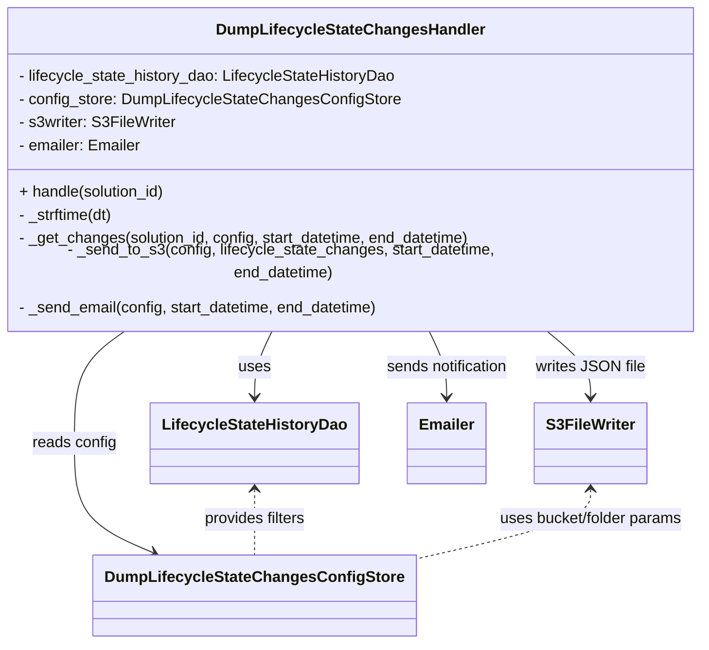
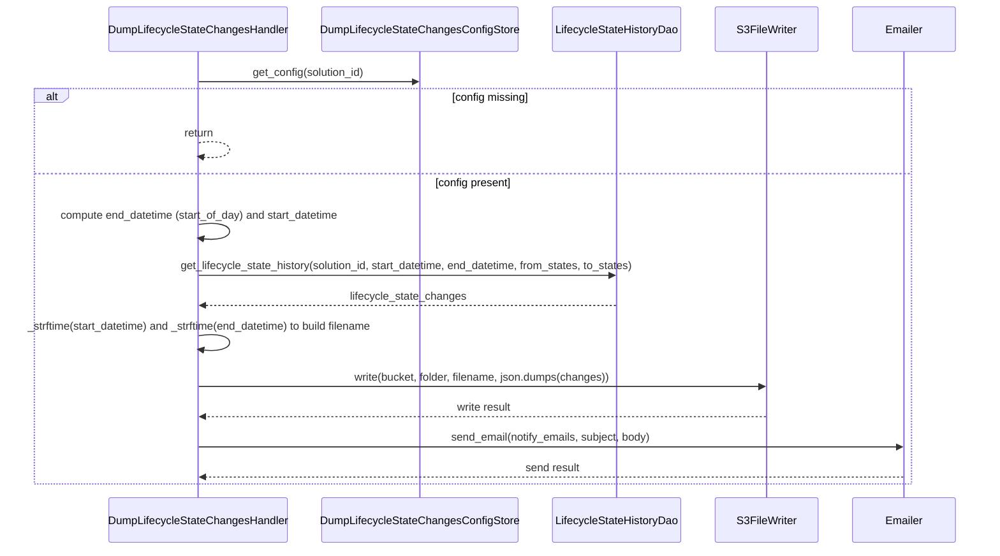

# Diagram: entity_core/entity_search/entity_search/handlers/dump_lifecycle_state_changes.py

> Auto-generated by Obscura crawlers

## Diagram 1

### SVG

<svg id="container" width="729.5546875" xmlns="http://www.w3.org/2000/svg" class="classDiagram" height="644" viewBox="0 0 729.5546875 644" role="graphics-document document" aria-roledescription="class"><g><defs><marker id="container_class-aggregationStart" class="marker aggregation class" refX="18" refY="7" markerWidth="190" markerHeight="240" orient="auto"><path d="M 18,7 L9,13 L1,7 L9,1 Z"></path></marker></defs><defs><marker id="container_class-aggregationEnd" class="marker aggregation class" refX="1" refY="7" markerWidth="20" markerHeight="28" orient="auto"><path d="M 18,7 L9,13 L1,7 L9,1 Z"></path></marker></defs><defs><marker id="container_class-extensionStart" class="marker extension class" refX="18" refY="7" markerWidth="190" markerHeight="240" orient="auto"><path d="M 1,7 L18,13 V 1 Z"></path></marker></defs><defs><marker id="container_class-extensionEnd" class="marker extension class" refX="1" refY="7" markerWidth="20" markerHeight="28" orient="auto"><path d="M 1,1 V 13 L18,7 Z"></path></marker></defs><defs><marker id="container_class-compositionStart" class="marker composition class" refX="18" refY="7" markerWidth="190" markerHeight="240" orient="auto"><path d="M 18,7 L9,13 L1,7 L9,1 Z"></path></marker></defs><defs><marker id="container_class-compositionEnd" class="marker composition class" refX="1" refY="7" markerWidth="20" markerHeight="28" orient="auto"><path d="M 18,7 L9,13 L1,7 L9,1 Z"></path></marker></defs><defs><marker id="container_class-dependencyStart" class="marker dependency class" refX="6" refY="7" markerWidth="190" markerHeight="240" orient="auto"><path d="M 5,7 L9,13 L1,7 L9,1 Z"></path></marker></defs><defs><marker id="container_class-dependencyEnd" class="marker dependency class" refX="13" refY="7" markerWidth="20" markerHeight="28" orient="auto"><path d="M 18,7 L9,13 L14,7 L9,1 Z"></path></marker></defs><defs><marker id="container_class-lollipopStart" class="marker lollipop class" refX="13" refY="7" markerWidth="190" markerHeight="240" orient="auto"><circle stroke="black" fill="transparent" cx="7" cy="7" r="6"></circle></marker></defs><defs><marker id="container_class-lollipopEnd" class="marker lollipop class" refX="1" refY="7" markerWidth="190" markerHeight="240" orient="auto"><circle stroke="black" fill="transparent" cx="7" cy="7" r="6"></circle></marker></defs><g class="root"><g class="clusters"></g><g class="edgePaths"><path d="M286.597,320L283.507,326.167C280.416,332.333,274.236,344.667,271.145,356C268.055,367.333,268.055,377.667,268.055,382.833L268.055,388" id="id_DumpLifecycleStateChangesHandler_LifecycleStateHistoryDao_1" class="edge-thickness-normal edge-pattern-solid relation" style=";;;" data-edge="true" data-et="edge" data-id="id_DumpLifecycleStateChangesHandler_LifecycleStateHistoryDao_1" data-points="W3sieCI6Mjg2LjU5NzM3Mjg5NTA3Nzc0LCJ5IjozMjB9LHsieCI6MjY4LjA1NDY4NzUsInkiOjM1N30seyJ4IjoyNjguMDU0Njg3NSwieSI6Mzk0fV0=" marker-end="url(#container_class-dependencyEnd)"></path><path d="M138.794,320L129.861,326.167C120.928,332.333,103.062,344.667,94.128,364C85.195,383.333,85.195,409.667,85.195,436C85.195,462.333,85.195,488.667,98.551,507.603C111.907,526.54,138.619,538.08,151.975,543.85L165.33,549.62" id="id_DumpLifecycleStateChangesHandler_DumpLifecycleStateChangesConfigStore_2" class="edge-thickness-normal edge-pattern-solid relation" style=";;;" data-edge="true" data-et="edge" data-id="id_DumpLifecycleStateChangesHandler_DumpLifecycleStateChangesConfigStore_2" data-points="W3sieCI6MTM4Ljc5Mzk0MDI1MjU5MDcsInkiOjMyMH0seyJ4Ijo4NS4xOTUzMTI1LCJ5IjozNTd9LHsieCI6ODUuMTk1MzEyNSwieSI6NDM2fSx7IngiOjg1LjE5NTMxMjUsInkiOjUxNX0seyJ4IjoxNzAuODM4MzEwOTE3NzIxNTEsInkiOjU1Mn1d" marker-end="url(#container_class-dependencyEnd)"></path><path d="M560.702,320L568.447,326.167C576.192,332.333,591.682,344.667,599.427,356C607.172,367.333,607.172,377.667,607.172,382.833L607.172,388" id="id_DumpLifecycleStateChangesHandler_S3FileWriter_3" class="edge-thickness-normal edge-pattern-solid relation" style=";;;" data-edge="true" data-et="edge" data-id="id_DumpLifecycleStateChangesHandler_S3FileWriter_3" data-points="W3sieCI6NTYwLjcwMjQ1NzA5MTk2ODksInkiOjMyMH0seyJ4Ijo2MDcuMTcxODc1LCJ5IjozNTd9LHsieCI6NjA3LjE3MTg3NSwieSI6Mzk0fV0=" marker-end="url(#container_class-dependencyEnd)"></path><path d="M442.957,320L446.048,326.167C449.138,332.333,455.319,344.667,458.41,356C461.5,367.333,461.5,377.667,461.5,382.833L461.5,388" id="id_DumpLifecycleStateChangesHandler_Emailer_4" class="edge-thickness-normal edge-pattern-solid relation" style=";;;" data-edge="true" data-et="edge" data-id="id_DumpLifecycleStateChangesHandler_Emailer_4" data-points="W3sieCI6NDQyLjk1NzMxNDYwNDkyMjI2LCJ5IjozMjB9LHsieCI6NDYxLjUsInkiOjM1N30seyJ4Ijo0NjEuNSwieSI6Mzk0fV0=" marker-end="url(#container_class-dependencyEnd)"></path><path d="M268.055,484L268.055,489.167C268.055,494.333,268.055,504.667,268.055,516C268.055,527.333,268.055,539.667,268.055,545.833L268.055,552" id="id_LifecycleStateHistoryDao_DumpLifecycleStateChangesConfigStore_5" class="edge-thickness-normal edge-pattern-dashed relation" style=";;;" data-edge="true" data-et="edge" data-id="id_LifecycleStateHistoryDao_DumpLifecycleStateChangesConfigStore_5" data-points="W3sieCI6MjY4LjA1NDY4NzUsInkiOjQ3OH0seyJ4IjoyNjguMDU0Njg3NSwieSI6NTE1fSx7IngiOjI2OC4wNTQ2ODc1LCJ5Ijo1NTJ9XQ==" marker-start="url(#container_class-dependencyStart)"></path><path d="M607.172,484L607.172,489.167C607.172,494.333,607.172,504.667,576.957,516.872C546.742,529.078,486.313,543.155,456.098,550.194L425.883,557.233" id="id_S3FileWriter_DumpLifecycleStateChangesConfigStore_6" class="edge-thickness-normal edge-pattern-dashed relation" style=";;;" data-edge="true" data-et="edge" data-id="id_S3FileWriter_DumpLifecycleStateChangesConfigStore_6" data-points="W3sieCI6NjA3LjE3MTg3NSwieSI6NDc4fSx7IngiOjYwNy4xNzE4NzUsInkiOjUxNX0seyJ4Ijo0MjUuODgyODEyNSwieSI6NTU3LjIzMjcwNDQwMjUxNTh9XQ==" marker-start="url(#container_class-dependencyStart)"></path></g><g class="edgeLabels"><g class="edgeLabel" transform="translate(268.0546875, 357)"><g class="label" data-id="id_DumpLifecycleStateChangesHandler_LifecycleStateHistoryDao_1" transform="translate(-16.4921875, -12)"><foreignObject width="32.984375" height="24">

uses

</foreignObject></g></g><g class="edgeLabel" transform="translate(85.1953125, 436)"><g class="label" data-id="id_DumpLifecycleStateChangesHandler_DumpLifecycleStateChangesConfigStore_2" transform="translate(-43.90625, -12)"><foreignObject width="87.8125" height="24">

reads config

</foreignObject></g></g><g class="edgeLabel" transform="translate(607.171875, 357)"><g class="label" data-id="id_DumpLifecycleStateChangesHandler_S3FileWriter_3" transform="translate(-55.25, -12)"><foreignObject width="110.5" height="24">

writes JSON file

</foreignObject></g></g><g class="edgeLabel" transform="translate(461.5, 357)"><g class="label" data-id="id_DumpLifecycleStateChangesHandler_Emailer_4" transform="translate(-65.1328125, -12)"><foreignObject width="130.265625" height="24">

sends notification

</foreignObject></g></g><g class="edgeLabel" transform="translate(268.0546875, 515)"><g class="label" data-id="id_LifecycleStateHistoryDao_DumpLifecycleStateChangesConfigStore_5" transform="translate(-54.2109375, -12)"><foreignObject width="108.421875" height="24">

provides filters

</foreignObject></g></g><g class="edgeLabel" transform="translate(607.171875, 515)"><g class="label" data-id="id_S3FileWriter_DumpLifecycleStateChangesConfigStore_6" transform="translate(-97.7421875, -12)"><foreignObject width="195.484375" height="24">

uses bucket/folder params

</foreignObject></g></g></g><g class="nodes"><g class="node default" id="classId-DumpLifecycleStateChangesHandler-0" transform="translate(364.77734375, 164)"><g class="basic label-container"><path d="M-356.77734375 -156 L356.77734375 -156 L356.77734375 156 L-356.77734375 156" stroke="none" stroke-width="0" fill="#ECECFF" style=""></path><path d="M-356.77734375 -156 C-85.47491375490068 -156, 185.82751624019863 -156, 356.77734375 -156 M-356.77734375 -156 C-141.7092326841125 -156, 73.35887838177501 -156, 356.77734375 -156 M356.77734375 -156 C356.77734375 -74.50069334996331, 356.77734375 6.998613300073373, 356.77734375 156 M356.77734375 -156 C356.77734375 -56.38758795425413, 356.77734375 43.22482409149174, 356.77734375 156 M356.77734375 156 C78.893098342401 156, -198.991147065198 156, -356.77734375 156 M356.77734375 156 C114.53252307677025 156, -127.7122975964595 156, -356.77734375 156 M-356.77734375 156 C-356.77734375 76.96413171956917, -356.77734375 -2.071736560861666, -356.77734375 -156 M-356.77734375 156 C-356.77734375 52.875564770295526, -356.77734375 -50.24887045940895, -356.77734375 -156" stroke="#9370DB" stroke-width="1.3" fill="none" stroke-dasharray="0 0" style=""></path></g><g class="annotation-group text" transform="translate(0, -132)"></g><g class="label-group text" transform="translate(-132.4140625, -132)"><g class="label" style="font-weight: bolder" transform="translate(0,-12)"><foreignObject width="264.828125" height="24">

DumpLifecycleStateChangesHandler

</foreignObject></g></g><g class="members-group text" transform="translate(-344.77734375, -84)"><g class="label" style="" transform="translate(0,-12)"><foreignObject width="396.015625" height="24">

- lifecycle_state_history_dao: LifecycleStateHistoryDao

</foreignObject></g><g class="label" style="" transform="translate(0,12)"><foreignObject width="393.90625" height="24">

- config_store: DumpLifecycleStateChangesConfigStore

</foreignObject></g><g class="label" style="" transform="translate(0,36)"><foreignObject width="163.078125" height="24">

- s3writer: S3FileWriter

</foreignObject></g><g class="label" style="" transform="translate(0,60)"><foreignObject width="128.921875" height="24">

- emailer: Emailer

</foreignObject></g></g><g class="methods-group text" transform="translate(-344.77734375, 36)"><g class="label" style="" transform="translate(0,-12)"><foreignObject width="155.171875" height="24">

+ handle(solution_id)

</foreignObject></g><g class="label" style="" transform="translate(0,12)"><foreignObject width="102.234375" height="24">

- _strftime(dt)

</foreignObject></g><g class="label" style="" transform="translate(0,36)"><foreignObject width="477.265625" height="24">

- _get_changes(solution_id, config, start_datetime, end_datetime)

</foreignObject></g><g class="label" style="" transform="translate(0,60)"><foreignObject width="557.140625" height="24">

- _send_to_s3(config, lifecycle_state_changes, start_datetime, end_datetime)

</foreignObject></g><g class="label" style="" transform="translate(0,84)"><foreignObject width="380.375" height="24">

- _send_email(config, start_datetime, end_datetime)

</foreignObject></g></g><g class="divider" style=""><path d="M-356.77734375 -108 C-82.51157897540725 -108, 191.7541857991855 -108, 356.77734375 -108 M-356.77734375 -108 C-213.76863883354156 -108, -70.75993391708312 -108, 356.77734375 -108" stroke="#9370DB" stroke-width="1.3" fill="none" stroke-dasharray="0 0" style=""></path></g><g class="divider" style=""><path d="M-356.77734375 12 C-181.65600283139497 12, -6.534661912789943 12, 356.77734375 12 M-356.77734375 12 C-111.33518707170896 12, 134.10696960658208 12, 356.77734375 12" stroke="#9370DB" stroke-width="1.3" fill="none" stroke-dasharray="0 0" style=""></path></g></g><g class="node default" id="classId-LifecycleStateHistoryDao-1" transform="translate(268.0546875, 436)"><g class="basic label-container"><path d="M-103.953125 -42 L103.953125 -42 L103.953125 42 L-103.953125 42" stroke="none" stroke-width="0" fill="#ECECFF" style=""></path><path d="M-103.953125 -42 C-23.43168351044004 -42, 57.08975797911992 -42, 103.953125 -42 M-103.953125 -42 C-25.58255983032707 -42, 52.78800533934586 -42, 103.953125 -42 M103.953125 -42 C103.953125 -19.178108783796137, 103.953125 3.6437824324077255, 103.953125 42 M103.953125 -42 C103.953125 -10.094373283897486, 103.953125 21.811253432205028, 103.953125 42 M103.953125 42 C30.290197177709544 42, -43.37273064458091 42, -103.953125 42 M103.953125 42 C43.682801994352836 42, -16.587521011294328 42, -103.953125 42 M-103.953125 42 C-103.953125 10.25497557937451, -103.953125 -21.49004884125098, -103.953125 -42 M-103.953125 42 C-103.953125 8.687406347956383, -103.953125 -24.625187304087234, -103.953125 -42" stroke="#9370DB" stroke-width="1.3" fill="none" stroke-dasharray="0 0" style=""></path></g><g class="annotation-group text" transform="translate(0, -18)"></g><g class="label-group text" transform="translate(-91.953125, -18)"><g class="label" style="font-weight: bolder" transform="translate(0,-12)"><foreignObject width="183.90625" height="24">

LifecycleStateHistoryDao

</foreignObject></g></g><g class="members-group text" transform="translate(-91.953125, 30)"></g><g class="methods-group text" transform="translate(-91.953125, 60)"></g><g class="divider" style=""><path d="M-103.953125 6 C-32.836097720185094 6, 38.28092955962981 6, 103.953125 6 M-103.953125 6 C-25.620784409364447 6, 52.711556181271106 6, 103.953125 6" stroke="#9370DB" stroke-width="1.3" fill="none" stroke-dasharray="0 0" style=""></path></g><g class="divider" style=""><path d="M-103.953125 24 C-47.073473549219045 24, 9.80617790156191 24, 103.953125 24 M-103.953125 24 C-34.52129941925692 24, 34.91052616148616 24, 103.953125 24" stroke="#9370DB" stroke-width="1.3" fill="none" stroke-dasharray="0 0" style=""></path></g></g><g class="node default" id="classId-DumpLifecycleStateChangesConfigStore-2" transform="translate(268.0546875, 594)"><g class="basic label-container"><path d="M-157.828125 -42 L157.828125 -42 L157.828125 42 L-157.828125 42" stroke="none" stroke-width="0" fill="#ECECFF" style=""></path><path d="M-157.828125 -42 C-89.12995065038126 -42, -20.43177630076252 -42, 157.828125 -42 M-157.828125 -42 C-86.36430296792444 -42, -14.90048093584889 -42, 157.828125 -42 M157.828125 -42 C157.828125 -18.53220515834175, 157.828125 4.9355896833165005, 157.828125 42 M157.828125 -42 C157.828125 -17.384439758164383, 157.828125 7.2311204836712335, 157.828125 42 M157.828125 42 C80.65828711688941 42, 3.488449233778823 42, -157.828125 42 M157.828125 42 C88.08936118453799 42, 18.350597369075984 42, -157.828125 42 M-157.828125 42 C-157.828125 14.538935182842426, -157.828125 -12.922129634315148, -157.828125 -42 M-157.828125 42 C-157.828125 24.44035122435718, -157.828125 6.880702448714359, -157.828125 -42" stroke="#9370DB" stroke-width="1.3" fill="none" stroke-dasharray="0 0" style=""></path></g><g class="annotation-group text" transform="translate(0, -18)"></g><g class="label-group text" transform="translate(-145.828125, -18)"><g class="label" style="font-weight: bolder" transform="translate(0,-12)"><foreignObject width="291.65625" height="24">

DumpLifecycleStateChangesConfigStore

</foreignObject></g></g><g class="members-group text" transform="translate(-145.828125, 30)"></g><g class="methods-group text" transform="translate(-145.828125, 60)"></g><g class="divider" style=""><path d="M-157.828125 6 C-31.96243487994367 6, 93.90325524011266 6, 157.828125 6 M-157.828125 6 C-82.30171449657989 6, -6.775303993159781 6, 157.828125 6" stroke="#9370DB" stroke-width="1.3" fill="none" stroke-dasharray="0 0" style=""></path></g><g class="divider" style=""><path d="M-157.828125 24 C-74.07352740184093 24, 9.681070196318132 24, 157.828125 24 M-157.828125 24 C-34.941882662709475 24, 87.94435967458105 24, 157.828125 24" stroke="#9370DB" stroke-width="1.3" fill="none" stroke-dasharray="0 0" style=""></path></g></g><g class="node default" id="classId-S3FileWriter-3" transform="translate(607.171875, 436)"><g class="basic label-container"><path d="M-56.1796875 -42 L56.1796875 -42 L56.1796875 42 L-56.1796875 42" stroke="none" stroke-width="0" fill="#ECECFF" style=""></path><path d="M-56.1796875 -42 C-31.52279295516814 -42, -6.865898410336278 -42, 56.1796875 -42 M-56.1796875 -42 C-33.068469463935486 -42, -9.957251427870965 -42, 56.1796875 -42 M56.1796875 -42 C56.1796875 -22.949092636873676, 56.1796875 -3.8981852737473517, 56.1796875 42 M56.1796875 -42 C56.1796875 -18.671522471333564, 56.1796875 4.656955057332873, 56.1796875 42 M56.1796875 42 C25.80456890172946 42, -4.570549696541079 42, -56.1796875 42 M56.1796875 42 C17.51969350827212 42, -21.14030048345576 42, -56.1796875 42 M-56.1796875 42 C-56.1796875 13.482588584097996, -56.1796875 -15.034822831804007, -56.1796875 -42 M-56.1796875 42 C-56.1796875 24.838309134437573, -56.1796875 7.676618268875146, -56.1796875 -42" stroke="#9370DB" stroke-width="1.3" fill="none" stroke-dasharray="0 0" style=""></path></g><g class="annotation-group text" transform="translate(0, -18)"></g><g class="label-group text" transform="translate(-44.1796875, -18)"><g class="label" style="font-weight: bolder" transform="translate(0,-12)"><foreignObject width="88.359375" height="24">

S3FileWriter

</foreignObject></g></g><g class="members-group text" transform="translate(-44.1796875, 30)"></g><g class="methods-group text" transform="translate(-44.1796875, 60)"></g><g class="divider" style=""><path d="M-56.1796875 6 C-24.761766759634778 6, 6.656153980730444 6, 56.1796875 6 M-56.1796875 6 C-13.672149469370368 6, 28.835388561259265 6, 56.1796875 6" stroke="#9370DB" stroke-width="1.3" fill="none" stroke-dasharray="0 0" style=""></path></g><g class="divider" style=""><path d="M-56.1796875 24 C-17.045835869416265 24, 22.08801576116747 24, 56.1796875 24 M-56.1796875 24 C-17.02763144845585 24, 22.1244246030883 24, 56.1796875 24" stroke="#9370DB" stroke-width="1.3" fill="none" stroke-dasharray="0 0" style=""></path></g></g><g class="node default" id="classId-Emailer-4" transform="translate(461.5, 436)"><g class="basic label-container"><path d="M-39.4921875 -42 L39.4921875 -42 L39.4921875 42 L-39.4921875 42" stroke="none" stroke-width="0" fill="#ECECFF" style=""></path><path d="M-39.4921875 -42 C-9.891826629202352 -42, 19.708534241595295 -42, 39.4921875 -42 M-39.4921875 -42 C-20.97116383641491 -42, -2.450140172829819 -42, 39.4921875 -42 M39.4921875 -42 C39.4921875 -15.618376102215144, 39.4921875 10.763247795569711, 39.4921875 42 M39.4921875 -42 C39.4921875 -10.993322876844346, 39.4921875 20.01335424631131, 39.4921875 42 M39.4921875 42 C16.1939003146358 42, -7.104386870728398 42, -39.4921875 42 M39.4921875 42 C7.91754459807667 42, -23.65709830384666 42, -39.4921875 42 M-39.4921875 42 C-39.4921875 19.369111897389015, -39.4921875 -3.2617762052219703, -39.4921875 -42 M-39.4921875 42 C-39.4921875 11.54904491262813, -39.4921875 -18.90191017474374, -39.4921875 -42" stroke="#9370DB" stroke-width="1.3" fill="none" stroke-dasharray="0 0" style=""></path></g><g class="annotation-group text" transform="translate(0, -18)"></g><g class="label-group text" transform="translate(-27.4921875, -18)"><g class="label" style="font-weight: bolder" transform="translate(0,-12)"><foreignObject width="54.984375" height="24">

Emailer

</foreignObject></g></g><g class="members-group text" transform="translate(-27.4921875, 30)"></g><g class="methods-group text" transform="translate(-27.4921875, 60)"></g><g class="divider" style=""><path d="M-39.4921875 6 C-9.145843826145189 6, 21.200499847709622 6, 39.4921875 6 M-39.4921875 6 C-8.830494808630508 6, 21.831197882738984 6, 39.4921875 6" stroke="#9370DB" stroke-width="1.3" fill="none" stroke-dasharray="0 0" style=""></path></g><g class="divider" style=""><path d="M-39.4921875 24 C-12.127224650908175 24, 15.23773819818365 24, 39.4921875 24 M-39.4921875 24 C-15.535530081684275 24, 8.42112733663145 24, 39.4921875 24" stroke="#9370DB" stroke-width="1.3" fill="none" stroke-dasharray="0 0" style=""></path></g></g></g></g></g></svg>

## Diagram 2

### SVG

<svg id="container" width="1518.5" xmlns="http://www.w3.org/2000/svg" height="841" viewBox="-180.5 -10 1518.5 841" role="graphics-document document" aria-roledescription="sequence"><g><rect x="1138" y="755" fill="#eaeaea" stroke="#666" width="150" height="65" name="Email" rx="3" ry="3" class="actor actor-bottom"></rect><text x="1213" y="787.5" dominant-baseline="central" alignment-baseline="central" class="actor actor-box" style="text-anchor: middle; font-size: 16px; font-weight: 400;"><tspan x="1213" dy="0">Emailer</tspan></text></g><g><rect x="938" y="755" fill="#eaeaea" stroke="#666" width="150" height="65" name="S3" rx="3" ry="3" class="actor actor-bottom"></rect><text x="1013" y="787.5" dominant-baseline="central" alignment-baseline="central" class="actor actor-box" style="text-anchor: middle; font-size: 16px; font-weight: 400;"><tspan x="1013" dy="0">S3FileWriter</tspan></text></g><g><rect x="688" y="755" fill="#eaeaea" stroke="#666" width="200" height="65" name="DAO" rx="3" ry="3" class="actor actor-bottom"></rect><text x="788" y="787.5" dominant-baseline="central" alignment-baseline="central" class="actor actor-box" style="text-anchor: middle; font-size: 16px; font-weight: 400;"><tspan x="788" dy="0">LifecycleStateHistoryDao</tspan></text></g><g><rect x="332" y="755" fill="#eaeaea" stroke="#666" width="306" height="65" name="ConfigStore" rx="3" ry="3" class="actor actor-bottom"></rect><text x="485" y="787.5" dominant-baseline="central" alignment-baseline="central" class="actor actor-box" style="text-anchor: middle; font-size: 16px; font-weight: 400;"><tspan x="485" dy="0">DumpLifecycleStateChangesConfigStore</tspan></text></g><g><rect x="0" y="755" fill="#eaeaea" stroke="#666" width="282" height="65" name="Handler" rx="3" ry="3" class="actor actor-bottom"></rect><text x="141" y="787.5" dominant-baseline="central" alignment-baseline="central" class="actor actor-box" style="text-anchor: middle; font-size: 16px; font-weight: 400;"><tspan x="141" dy="0">DumpLifecycleStateChangesHandler</tspan></text></g><g><line id="actor4" x1="1213" y1="65" x2="1213" y2="755" class="actor-line 200" stroke-width="0.5px" stroke="#999" name="Email"></line><g id="root-4"><rect x="1138" y="0" fill="#eaeaea" stroke="#666" width="150" height="65" name="Email" rx="3" ry="3" class="actor actor-top"></rect><text x="1213" y="32.5" dominant-baseline="central" alignment-baseline="central" class="actor actor-box" style="text-anchor: middle; font-size: 16px; font-weight: 400;"><tspan x="1213" dy="0">Emailer</tspan></text></g></g><g><line id="actor3" x1="1013" y1="65" x2="1013" y2="755" class="actor-line 200" stroke-width="0.5px" stroke="#999" name="S3"></line><g id="root-3"><rect x="938" y="0" fill="#eaeaea" stroke="#666" width="150" height="65" name="S3" rx="3" ry="3" class="actor actor-top"></rect><text x="1013" y="32.5" dominant-baseline="central" alignment-baseline="central" class="actor actor-box" style="text-anchor: middle; font-size: 16px; font-weight: 400;"><tspan x="1013" dy="0">S3FileWriter</tspan></text></g></g><g><line id="actor2" x1="788" y1="65" x2="788" y2="755" class="actor-line 200" stroke-width="0.5px" stroke="#999" name="DAO"></line><g id="root-2"><rect x="688" y="0" fill="#eaeaea" stroke="#666" width="200" height="65" name="DAO" rx="3" ry="3" class="actor actor-top"></rect><text x="788" y="32.5" dominant-baseline="central" alignment-baseline="central" class="actor actor-box" style="text-anchor: middle; font-size: 16px; font-weight: 400;"><tspan x="788" dy="0">LifecycleStateHistoryDao</tspan></text></g></g><g><line id="actor1" x1="485" y1="65" x2="485" y2="755" class="actor-line 200" stroke-width="0.5px" stroke="#999" name="ConfigStore"></line><g id="root-1"><rect x="332" y="0" fill="#eaeaea" stroke="#666" width="306" height="65" name="ConfigStore" rx="3" ry="3" class="actor actor-top"></rect><text x="485" y="32.5" dominant-baseline="central" alignment-baseline="central" class="actor actor-box" style="text-anchor: middle; font-size: 16px; font-weight: 400;"><tspan x="485" dy="0">DumpLifecycleStateChangesConfigStore</tspan></text></g></g><g><line id="actor0" x1="141" y1="65" x2="141" y2="755" class="actor-line 200" stroke-width="0.5px" stroke="#999" name="Handler"></line><g id="root-0"><rect x="0" y="0" fill="#eaeaea" stroke="#666" width="282" height="65" name="Handler" rx="3" ry="3" class="actor actor-top"></rect><text x="141" y="32.5" dominant-baseline="central" alignment-baseline="central" class="actor actor-box" style="text-anchor: middle; font-size: 16px; font-weight: 400;"><tspan x="141" dy="0">DumpLifecycleStateChangesHandler</tspan></text></g></g><g></g><defs><symbol id="computer" width="24" height="24"><path transform="scale(.5)" d="M2 2v13h20v-13h-20zm18 11h-16v-9h16v9zm-10.228 6l.466-1h3.524l.467 1h-4.457zm14.228 3h-24l2-6h2.104l-1.33 4h18.45l-1.297-4h2.073l2 6zm-5-10h-14v-7h14v7z"></path></symbol></defs><defs><symbol id="database" fill-rule="evenodd" clip-rule="evenodd"><path transform="scale(.5)" d="M12.258.001l.256.004.255.005.253.008.251.01.249.012.247.015.246.016.242.019.241.02.239.023.236.024.233.027.231.028.229.031.225.032.223.034.22.036.217.038.214.04.211.041.208.043.205.045.201.046.198.048.194.05.191.051.187.053.183.054.18.056.175.057.172.059.168.06.163.061.16.063.155.064.15.066.074.033.073.033.071.034.07.034.069.035.068.035.067.035.066.035.064.036.064.036.062.036.06.036.06.037.058.037.058.037.055.038.055.038.053.038.052.038.051.039.05.039.048.039.047.039.045.04.044.04.043.04.041.04.04.041.039.041.037.041.036.041.034.041.033.042.032.042.03.042.029.042.027.042.026.043.024.043.023.043.021.043.02.043.018.044.017.043.015.044.013.044.012.044.011.045.009.044.007.045.006.045.004.045.002.045.001.045v17l-.001.045-.002.045-.004.045-.006.045-.007.045-.009.044-.011.045-.012.044-.013.044-.015.044-.017.043-.018.044-.02.043-.021.043-.023.043-.024.043-.026.043-.027.042-.029.042-.03.042-.032.042-.033.042-.034.041-.036.041-.037.041-.039.041-.04.041-.041.04-.043.04-.044.04-.045.04-.047.039-.048.039-.05.039-.051.039-.052.038-.053.038-.055.038-.055.038-.058.037-.058.037-.06.037-.06.036-.062.036-.064.036-.064.036-.066.035-.067.035-.068.035-.069.035-.07.034-.071.034-.073.033-.074.033-.15.066-.155.064-.16.063-.163.061-.168.06-.172.059-.175.057-.18.056-.183.054-.187.053-.191.051-.194.05-.198.048-.201.046-.205.045-.208.043-.211.041-.214.04-.217.038-.22.036-.223.034-.225.032-.229.031-.231.028-.233.027-.236.024-.239.023-.241.02-.242.019-.246.016-.247.015-.249.012-.251.01-.253.008-.255.005-.256.004-.258.001-.258-.001-.256-.004-.255-.005-.253-.008-.251-.01-.249-.012-.247-.015-.245-.016-.243-.019-.241-.02-.238-.023-.236-.024-.234-.027-.231-.028-.228-.031-.226-.032-.223-.034-.22-.036-.217-.038-.214-.04-.211-.041-.208-.043-.204-.045-.201-.046-.198-.048-.195-.05-.19-.051-.187-.053-.184-.054-.179-.056-.176-.057-.172-.059-.167-.06-.164-.061-.159-.063-.155-.064-.151-.066-.074-.033-.072-.033-.072-.034-.07-.034-.069-.035-.068-.035-.067-.035-.066-.035-.064-.036-.063-.036-.062-.036-.061-.036-.06-.037-.058-.037-.057-.037-.056-.038-.055-.038-.053-.038-.052-.038-.051-.039-.049-.039-.049-.039-.046-.039-.046-.04-.044-.04-.043-.04-.041-.04-.04-.041-.039-.041-.037-.041-.036-.041-.034-.041-.033-.042-.032-.042-.03-.042-.029-.042-.027-.042-.026-.043-.024-.043-.023-.043-.021-.043-.02-.043-.018-.044-.017-.043-.015-.044-.013-.044-.012-.044-.011-.045-.009-.044-.007-.045-.006-.045-.004-.045-.002-.045-.001-.045v-17l.001-.045.002-.045.004-.045.006-.045.007-.045.009-.044.011-.045.012-.044.013-.044.015-.044.017-.043.018-.044.02-.043.021-.043.023-.043.024-.043.026-.043.027-.042.029-.042.03-.042.032-.042.033-.042.034-.041.036-.041.037-.041.039-.041.04-.041.041-.04.043-.04.044-.04.046-.04.046-.039.049-.039.049-.039.051-.039.052-.038.053-.038.055-.038.056-.038.057-.037.058-.037.06-.037.061-.036.062-.036.063-.036.064-.036.066-.035.067-.035.068-.035.069-.035.07-.034.072-.034.072-.033.074-.033.151-.066.155-.064.159-.063.164-.061.167-.06.172-.059.176-.057.179-.056.184-.054.187-.053.19-.051.195-.05.198-.048.201-.046.204-.045.208-.043.211-.041.214-.04.217-.038.22-.036.223-.034.226-.032.228-.031.231-.028.234-.027.236-.024.238-.023.241-.02.243-.019.245-.016.247-.015.249-.012.251-.01.253-.008.255-.005.256-.004.258-.001.258.001zm-9.258 20.499v.01l.001.021.003.021.004.022.005.021.006.022.007.022.009.023.01.022.011.023.012.023.013.023.015.023.016.024.017.023.018.024.019.024.021.024.022.025.023.024.024.025.052.049.056.05.061.051.066.051.07.051.075.051.079.052.084.052.088.052.092.052.097.052.102.051.105.052.11.052.114.051.119.051.123.051.127.05.131.05.135.05.139.048.144.049.147.047.152.047.155.047.16.045.163.045.167.043.171.043.176.041.178.041.183.039.187.039.19.037.194.035.197.035.202.033.204.031.209.03.212.029.216.027.219.025.222.024.226.021.23.02.233.018.236.016.24.015.243.012.246.01.249.008.253.005.256.004.259.001.26-.001.257-.004.254-.005.25-.008.247-.011.244-.012.241-.014.237-.016.233-.018.231-.021.226-.021.224-.024.22-.026.216-.027.212-.028.21-.031.205-.031.202-.034.198-.034.194-.036.191-.037.187-.039.183-.04.179-.04.175-.042.172-.043.168-.044.163-.045.16-.046.155-.046.152-.047.148-.048.143-.049.139-.049.136-.05.131-.05.126-.05.123-.051.118-.052.114-.051.11-.052.106-.052.101-.052.096-.052.092-.052.088-.053.083-.051.079-.052.074-.052.07-.051.065-.051.06-.051.056-.05.051-.05.023-.024.023-.025.021-.024.02-.024.019-.024.018-.024.017-.024.015-.023.014-.024.013-.023.012-.023.01-.023.01-.022.008-.022.006-.022.006-.022.004-.022.004-.021.001-.021.001-.021v-4.127l-.077.055-.08.053-.083.054-.085.053-.087.052-.09.052-.093.051-.095.05-.097.05-.1.049-.102.049-.105.048-.106.047-.109.047-.111.046-.114.045-.115.045-.118.044-.12.043-.122.042-.124.042-.126.041-.128.04-.13.04-.132.038-.134.038-.135.037-.138.037-.139.035-.142.035-.143.034-.144.033-.147.032-.148.031-.15.03-.151.03-.153.029-.154.027-.156.027-.158.026-.159.025-.161.024-.162.023-.163.022-.165.021-.166.02-.167.019-.169.018-.169.017-.171.016-.173.015-.173.014-.175.013-.175.012-.177.011-.178.01-.179.008-.179.008-.181.006-.182.005-.182.004-.184.003-.184.002h-.37l-.184-.002-.184-.003-.182-.004-.182-.005-.181-.006-.179-.008-.179-.008-.178-.01-.176-.011-.176-.012-.175-.013-.173-.014-.172-.015-.171-.016-.17-.017-.169-.018-.167-.019-.166-.02-.165-.021-.163-.022-.162-.023-.161-.024-.159-.025-.157-.026-.156-.027-.155-.027-.153-.029-.151-.03-.15-.03-.148-.031-.146-.032-.145-.033-.143-.034-.141-.035-.14-.035-.137-.037-.136-.037-.134-.038-.132-.038-.13-.04-.128-.04-.126-.041-.124-.042-.122-.042-.12-.044-.117-.043-.116-.045-.113-.045-.112-.046-.109-.047-.106-.047-.105-.048-.102-.049-.1-.049-.097-.05-.095-.05-.093-.052-.09-.051-.087-.052-.085-.053-.083-.054-.08-.054-.077-.054v4.127zm0-5.654v.011l.001.021.003.021.004.021.005.022.006.022.007.022.009.022.01.022.011.023.012.023.013.023.015.024.016.023.017.024.018.024.019.024.021.024.022.024.023.025.024.024.052.05.056.05.061.05.066.051.07.051.075.052.079.051.084.052.088.052.092.052.097.052.102.052.105.052.11.051.114.051.119.052.123.05.127.051.131.05.135.049.139.049.144.048.147.048.152.047.155.046.16.045.163.045.167.044.171.042.176.042.178.04.183.04.187.038.19.037.194.036.197.034.202.033.204.032.209.03.212.028.216.027.219.025.222.024.226.022.23.02.233.018.236.016.24.014.243.012.246.01.249.008.253.006.256.003.259.001.26-.001.257-.003.254-.006.25-.008.247-.01.244-.012.241-.015.237-.016.233-.018.231-.02.226-.022.224-.024.22-.025.216-.027.212-.029.21-.03.205-.032.202-.033.198-.035.194-.036.191-.037.187-.039.183-.039.179-.041.175-.042.172-.043.168-.044.163-.045.16-.045.155-.047.152-.047.148-.048.143-.048.139-.05.136-.049.131-.05.126-.051.123-.051.118-.051.114-.052.11-.052.106-.052.101-.052.096-.052.092-.052.088-.052.083-.052.079-.052.074-.051.07-.052.065-.051.06-.05.056-.051.051-.049.023-.025.023-.024.021-.025.02-.024.019-.024.018-.024.017-.024.015-.023.014-.023.013-.024.012-.022.01-.023.01-.023.008-.022.006-.022.006-.022.004-.021.004-.022.001-.021.001-.021v-4.139l-.077.054-.08.054-.083.054-.085.052-.087.053-.09.051-.093.051-.095.051-.097.05-.1.049-.102.049-.105.048-.106.047-.109.047-.111.046-.114.045-.115.044-.118.044-.12.044-.122.042-.124.042-.126.041-.128.04-.13.039-.132.039-.134.038-.135.037-.138.036-.139.036-.142.035-.143.033-.144.033-.147.033-.148.031-.15.03-.151.03-.153.028-.154.028-.156.027-.158.026-.159.025-.161.024-.162.023-.163.022-.165.021-.166.02-.167.019-.169.018-.169.017-.171.016-.173.015-.173.014-.175.013-.175.012-.177.011-.178.009-.179.009-.179.007-.181.007-.182.005-.182.004-.184.003-.184.002h-.37l-.184-.002-.184-.003-.182-.004-.182-.005-.181-.007-.179-.007-.179-.009-.178-.009-.176-.011-.176-.012-.175-.013-.173-.014-.172-.015-.171-.016-.17-.017-.169-.018-.167-.019-.166-.02-.165-.021-.163-.022-.162-.023-.161-.024-.159-.025-.157-.026-.156-.027-.155-.028-.153-.028-.151-.03-.15-.03-.148-.031-.146-.033-.145-.033-.143-.033-.141-.035-.14-.036-.137-.036-.136-.037-.134-.038-.132-.039-.13-.039-.128-.04-.126-.041-.124-.042-.122-.043-.12-.043-.117-.044-.116-.044-.113-.046-.112-.046-.109-.046-.106-.047-.105-.048-.102-.049-.1-.049-.097-.05-.095-.051-.093-.051-.09-.051-.087-.053-.085-.052-.083-.054-.08-.054-.077-.054v4.139zm0-5.666v.011l.001.02.003.022.004.021.005.022.006.021.007.022.009.023.01.022.011.023.012.023.013.023.015.023.016.024.017.024.018.023.019.024.021.025.022.024.023.024.024.025.052.05.056.05.061.05.066.051.07.051.075.052.079.051.084.052.088.052.092.052.097.052.102.052.105.051.11.052.114.051.119.051.123.051.127.05.131.05.135.05.139.049.144.048.147.048.152.047.155.046.16.045.163.045.167.043.171.043.176.042.178.04.183.04.187.038.19.037.194.036.197.034.202.033.204.032.209.03.212.028.216.027.219.025.222.024.226.021.23.02.233.018.236.017.24.014.243.012.246.01.249.008.253.006.256.003.259.001.26-.001.257-.003.254-.006.25-.008.247-.01.244-.013.241-.014.237-.016.233-.018.231-.02.226-.022.224-.024.22-.025.216-.027.212-.029.21-.03.205-.032.202-.033.198-.035.194-.036.191-.037.187-.039.183-.039.179-.041.175-.042.172-.043.168-.044.163-.045.16-.045.155-.047.152-.047.148-.048.143-.049.139-.049.136-.049.131-.051.126-.05.123-.051.118-.052.114-.051.11-.052.106-.052.101-.052.096-.052.092-.052.088-.052.083-.052.079-.052.074-.052.07-.051.065-.051.06-.051.056-.05.051-.049.023-.025.023-.025.021-.024.02-.024.019-.024.018-.024.017-.024.015-.023.014-.024.013-.023.012-.023.01-.022.01-.023.008-.022.006-.022.006-.022.004-.022.004-.021.001-.021.001-.021v-4.153l-.077.054-.08.054-.083.053-.085.053-.087.053-.09.051-.093.051-.095.051-.097.05-.1.049-.102.048-.105.048-.106.048-.109.046-.111.046-.114.046-.115.044-.118.044-.12.043-.122.043-.124.042-.126.041-.128.04-.13.039-.132.039-.134.038-.135.037-.138.036-.139.036-.142.034-.143.034-.144.033-.147.032-.148.032-.15.03-.151.03-.153.028-.154.028-.156.027-.158.026-.159.024-.161.024-.162.023-.163.023-.165.021-.166.02-.167.019-.169.018-.169.017-.171.016-.173.015-.173.014-.175.013-.175.012-.177.01-.178.01-.179.009-.179.007-.181.006-.182.006-.182.004-.184.003-.184.001-.185.001-.185-.001-.184-.001-.184-.003-.182-.004-.182-.006-.181-.006-.179-.007-.179-.009-.178-.01-.176-.01-.176-.012-.175-.013-.173-.014-.172-.015-.171-.016-.17-.017-.169-.018-.167-.019-.166-.02-.165-.021-.163-.023-.162-.023-.161-.024-.159-.024-.157-.026-.156-.027-.155-.028-.153-.028-.151-.03-.15-.03-.148-.032-.146-.032-.145-.033-.143-.034-.141-.034-.14-.036-.137-.036-.136-.037-.134-.038-.132-.039-.13-.039-.128-.041-.126-.041-.124-.041-.122-.043-.12-.043-.117-.044-.116-.044-.113-.046-.112-.046-.109-.046-.106-.048-.105-.048-.102-.048-.1-.05-.097-.049-.095-.051-.093-.051-.09-.052-.087-.052-.085-.053-.083-.053-.08-.054-.077-.054v4.153zm8.74-8.179l-.257.004-.254.005-.25.008-.247.011-.244.012-.241.014-.237.016-.233.018-.231.021-.226.022-.224.023-.22.026-.216.027-.212.028-.21.031-.205.032-.202.033-.198.034-.194.036-.191.038-.187.038-.183.04-.179.041-.175.042-.172.043-.168.043-.163.045-.16.046-.155.046-.152.048-.148.048-.143.048-.139.049-.136.05-.131.05-.126.051-.123.051-.118.051-.114.052-.11.052-.106.052-.101.052-.096.052-.092.052-.088.052-.083.052-.079.052-.074.051-.07.052-.065.051-.06.05-.056.05-.051.05-.023.025-.023.024-.021.024-.02.025-.019.024-.018.024-.017.023-.015.024-.014.023-.013.023-.012.023-.01.023-.01.022-.008.022-.006.023-.006.021-.004.022-.004.021-.001.021-.001.021.001.021.001.021.004.021.004.022.006.021.006.023.008.022.01.022.01.023.012.023.013.023.014.023.015.024.017.023.018.024.019.024.02.025.021.024.023.024.023.025.051.05.056.05.06.05.065.051.07.052.074.051.079.052.083.052.088.052.092.052.096.052.101.052.106.052.11.052.114.052.118.051.123.051.126.051.131.05.136.05.139.049.143.048.148.048.152.048.155.046.16.046.163.045.168.043.172.043.175.042.179.041.183.04.187.038.191.038.194.036.198.034.202.033.205.032.21.031.212.028.216.027.22.026.224.023.226.022.231.021.233.018.237.016.241.014.244.012.247.011.25.008.254.005.257.004.26.001.26-.001.257-.004.254-.005.25-.008.247-.011.244-.012.241-.014.237-.016.233-.018.231-.021.226-.022.224-.023.22-.026.216-.027.212-.028.21-.031.205-.032.202-.033.198-.034.194-.036.191-.038.187-.038.183-.04.179-.041.175-.042.172-.043.168-.043.163-.045.16-.046.155-.046.152-.048.148-.048.143-.048.139-.049.136-.05.131-.05.126-.051.123-.051.118-.051.114-.052.11-.052.106-.052.101-.052.096-.052.092-.052.088-.052.083-.052.079-.052.074-.051.07-.052.065-.051.06-.05.056-.05.051-.05.023-.025.023-.024.021-.024.02-.025.019-.024.018-.024.017-.023.015-.024.014-.023.013-.023.012-.023.01-.023.01-.022.008-.022.006-.023.006-.021.004-.022.004-.021.001-.021.001-.021-.001-.021-.001-.021-.004-.021-.004-.022-.006-.021-.006-.023-.008-.022-.01-.022-.01-.023-.012-.023-.013-.023-.014-.023-.015-.024-.017-.023-.018-.024-.019-.024-.02-.025-.021-.024-.023-.024-.023-.025-.051-.05-.056-.05-.06-.05-.065-.051-.07-.052-.074-.051-.079-.052-.083-.052-.088-.052-.092-.052-.096-.052-.101-.052-.106-.052-.11-.052-.114-.052-.118-.051-.123-.051-.126-.051-.131-.05-.136-.05-.139-.049-.143-.048-.148-.048-.152-.048-.155-.046-.16-.046-.163-.045-.168-.043-.172-.043-.175-.042-.179-.041-.183-.04-.187-.038-.191-.038-.194-.036-.198-.034-.202-.033-.205-.032-.21-.031-.212-.028-.216-.027-.22-.026-.224-.023-.226-.022-.231-.021-.233-.018-.237-.016-.241-.014-.244-.012-.247-.011-.25-.008-.254-.005-.257-.004-.26-.001-.26.001z"></path></symbol></defs><defs><symbol id="clock" width="24" height="24"><path transform="scale(.5)" d="M12 2c5.514 0 10 4.486 10 10s-4.486 10-10 10-10-4.486-10-10 4.486-10 10-10zm0-2c-6.627 0-12 5.373-12 12s5.373 12 12 12 12-5.373 12-12-5.373-12-12-12zm5.848 12.459c.202.038.202.333.001.372-1.907.361-6.045 1.111-6.547 1.111-.719 0-1.301-.582-1.301-1.301 0-.512.77-5.447 1.125-7.445.034-.192.312-.181.343.014l.985 6.238 5.394 1.011z"></path></symbol></defs><defs><marker id="arrowhead" refX="7.9" refY="5" markerUnits="userSpaceOnUse" markerWidth="12" markerHeight="12" orient="auto-start-reverse"><path d="M -1 0 L 10 5 L 0 10 z"></path></marker></defs><defs><marker id="crosshead" markerWidth="15" markerHeight="8" orient="auto" refX="4" refY="4.5"><path fill="none" stroke="#000000" stroke-width="1pt" d="M 1,2 L 6,7 M 6,2 L 1,7" style="stroke-dasharray: 0, 0;"></path></marker></defs><defs><marker id="filled-head" refX="15.5" refY="7" markerWidth="20" markerHeight="28" orient="auto"><path d="M 18,7 L9,13 L14,7 L9,1 Z"></path></marker></defs><defs><marker id="sequencenumber" refX="15" refY="15" markerWidth="60" markerHeight="40" orient="auto"><circle cx="15" cy="15" r="6"></circle></marker></defs><g><line x1="-130.5" y1="123" x2="1224" y2="123" class="loopLine"></line><line x1="1224" y1="123" x2="1224" y2="735" class="loopLine"></line><line x1="-130.5" y1="735" x2="1224" y2="735" class="loopLine"></line><line x1="-130.5" y1="123" x2="-130.5" y2="735" class="loopLine"></line><line x1="-130.5" y1="251" x2="1224" y2="251" class="loopLine" style="stroke-dasharray: 3, 3;"></line><polygon points="-130.5,123 -80.5,123 -80.5,136 -88.9,143 -130.5,143" class="labelBox"></polygon><text x="-105" y="136" text-anchor="middle" dominant-baseline="middle" alignment-baseline="middle" class="labelText" style="font-size: 16px; font-weight: 400;">alt</text><text x="571.75" y="141" text-anchor="middle" class="loopText" style="font-size: 16px; font-weight: 400;"><tspan x="571.75">[config missing]</tspan></text><text x="546.75" y="269" text-anchor="middle" class="loopText" style="font-size: 16px; font-weight: 400;">[config present]</text></g><text x="312" y="80" text-anchor="middle" dominant-baseline="middle" alignment-baseline="middle" class="messageText" dy="1em" style="font-size: 16px; font-weight: 400;">get_config(solution_id)</text><line x1="142" y1="113" x2="481" y2="113" class="messageLine0" stroke-width="2" stroke="none" marker-end="url(#arrowhead)" style="fill: none;"></line><text x="142" y="173" text-anchor="middle" dominant-baseline="middle" alignment-baseline="middle" class="messageText" dy="1em" style="font-size: 16px; font-weight: 400;">return</text><path d="M 142,206 C 202,196 202,236 142,226" class="messageLine1" stroke-width="2" stroke="none" marker-end="url(#arrowhead)" style="stroke-dasharray: 3, 3; fill: none;"></path><text x="142" y="296" text-anchor="middle" dominant-baseline="middle" alignment-baseline="middle" class="messageText" dy="1em" style="font-size: 16px; font-weight: 400;">compute end_datetime (start_of_day) and start_datetime</text><path d="M 142,329 C 202,319 202,359 142,349" class="messageLine0" stroke-width="2" stroke="none" marker-end="url(#arrowhead)" style="fill: none;"></path><text x="463" y="374" text-anchor="middle" dominant-baseline="middle" alignment-baseline="middle" class="messageText" dy="1em" style="font-size: 16px; font-weight: 400;">get_lifecycle_state_history(solution_id, start_datetime, end_datetime, from_states, to_states)</text><line x1="142" y1="407" x2="784" y2="407" class="messageLine0" stroke-width="2" stroke="none" marker-end="url(#arrowhead)" style="fill: none;"></line><text x="466" y="422" text-anchor="middle" dominant-baseline="middle" alignment-baseline="middle" class="messageText" dy="1em" style="font-size: 16px; font-weight: 400;">lifecycle_state_changes</text><line x1="787" y1="455" x2="145" y2="455" class="messageLine1" stroke-width="2" stroke="none" marker-end="url(#arrowhead)" style="stroke-dasharray: 3, 3; fill: none;"></line><text x="142" y="470" text-anchor="middle" dominant-baseline="middle" alignment-baseline="middle" class="messageText" dy="1em" style="font-size: 16px; font-weight: 400;">_strftime(start_datetime) and _strftime(end_datetime) to build filename</text><path d="M 142,503 C 202,493 202,533 142,523" class="messageLine0" stroke-width="2" stroke="none" marker-end="url(#arrowhead)" style="fill: none;"></path><text x="576" y="548" text-anchor="middle" dominant-baseline="middle" alignment-baseline="middle" class="messageText" dy="1em" style="font-size: 16px; font-weight: 400;">write(bucket, folder, filename, json.dumps(changes))</text><line x1="142" y1="581" x2="1009" y2="581" class="messageLine0" stroke-width="2" stroke="none" marker-end="url(#arrowhead)" style="fill: none;"></line><text x="579" y="596" text-anchor="middle" dominant-baseline="middle" alignment-baseline="middle" class="messageText" dy="1em" style="font-size: 16px; font-weight: 400;">write result</text><line x1="1012" y1="629" x2="145" y2="629" class="messageLine1" stroke-width="2" stroke="none" marker-end="url(#arrowhead)" style="stroke-dasharray: 3, 3; fill: none;"></line><text x="676" y="644" text-anchor="middle" dominant-baseline="middle" alignment-baseline="middle" class="messageText" dy="1em" style="font-size: 16px; font-weight: 400;">send_email(notify_emails, subject, body)</text><line x1="142" y1="677" x2="1209" y2="677" class="messageLine0" stroke-width="2" stroke="none" marker-end="url(#arrowhead)" style="fill: none;"></line><text x="679" y="692" text-anchor="middle" dominant-baseline="middle" alignment-baseline="middle" class="messageText" dy="1em" style="font-size: 16px; font-weight: 400;">send result</text><line x1="1212" y1="725" x2="145" y2="725" class="messageLine1" stroke-width="2" stroke="none" marker-end="url(#arrowhead)" style="stroke-dasharray: 3, 3; fill: none;"></line></svg>
