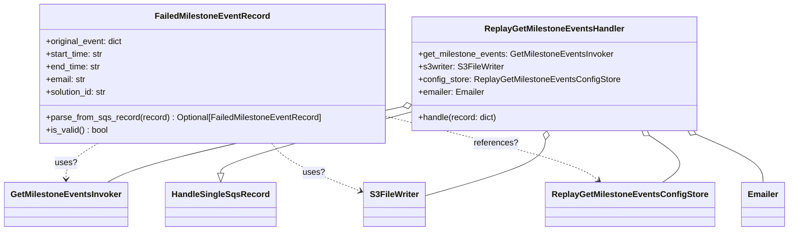
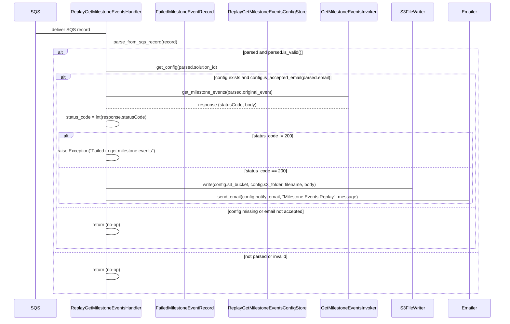

# Diagram: entity_core/entity_search/entity_search/handlers/replay_get_milestone_events.py

> Auto-generated by Obscura crawlers

## Diagram 1

### SVG

<svg id="container" width="1453.40234375" xmlns="http://www.w3.org/2000/svg" class="classDiagram" height="438" viewBox="0 0 1453.40234375 438" role="graphics-document document" aria-roledescription="class"><g><defs><marker id="container_class-aggregationStart" class="marker aggregation class" refX="18" refY="7" markerWidth="190" markerHeight="240" orient="auto"><path d="M 18,7 L9,13 L1,7 L9,1 Z"></path></marker></defs><defs><marker id="container_class-aggregationEnd" class="marker aggregation class" refX="1" refY="7" markerWidth="20" markerHeight="28" orient="auto"><path d="M 18,7 L9,13 L1,7 L9,1 Z"></path></marker></defs><defs><marker id="container_class-extensionStart" class="marker extension class" refX="18" refY="7" markerWidth="190" markerHeight="240" orient="auto"><path d="M 1,7 L18,13 V 1 Z"></path></marker></defs><defs><marker id="container_class-extensionEnd" class="marker extension class" refX="1" refY="7" markerWidth="20" markerHeight="28" orient="auto"><path d="M 1,1 V 13 L18,7 Z"></path></marker></defs><defs><marker id="container_class-compositionStart" class="marker composition class" refX="18" refY="7" markerWidth="190" markerHeight="240" orient="auto"><path d="M 18,7 L9,13 L1,7 L9,1 Z"></path></marker></defs><defs><marker id="container_class-compositionEnd" class="marker composition class" refX="1" refY="7" markerWidth="20" markerHeight="28" orient="auto"><path d="M 18,7 L9,13 L1,7 L9,1 Z"></path></marker></defs><defs><marker id="container_class-dependencyStart" class="marker dependency class" refX="6" refY="7" markerWidth="190" markerHeight="240" orient="auto"><path d="M 5,7 L9,13 L1,7 L9,1 Z"></path></marker></defs><defs><marker id="container_class-dependencyEnd" class="marker dependency class" refX="13" refY="7" markerWidth="20" markerHeight="28" orient="auto"><path d="M 18,7 L9,13 L14,7 L9,1 Z"></path></marker></defs><defs><marker id="container_class-lollipopStart" class="marker lollipop class" refX="13" refY="7" markerWidth="190" markerHeight="240" orient="auto"><circle stroke="black" fill="transparent" cx="7" cy="7" r="6"></circle></marker></defs><defs><marker id="container_class-lollipopEnd" class="marker lollipop class" refX="1" refY="7" markerWidth="190" markerHeight="240" orient="auto"><circle stroke="black" fill="transparent" cx="7" cy="7" r="6"></circle></marker></defs><g class="root"><g class="clusters"></g><g class="edgePaths"><path d="M762.52,211.465L702.309,227.721C642.099,243.977,521.678,276.488,461.468,296.036C401.258,315.583,401.258,322.167,401.258,325.458L401.258,328.75" id="id_ReplayGetMilestoneEventsHandler_HandleSingleSqsRecord_1" class="edge-thickness-normal edge-pattern-solid relation" style=";;;" data-edge="true" data-et="edge" data-id="id_ReplayGetMilestoneEventsHandler_HandleSingleSqsRecord_1" data-points="W3sieCI6NzYyLjUxOTUzMTI1LCJ5IjoyMTEuNDY1NDAwMjg4MzA0OTJ9LHsieCI6NDAxLjI1NzgxMjUsInkiOjMwOX0seyJ4Ijo0MDEuMjU3ODEyNSwieSI6MzQ2fV0=" marker-end="url(#container_class-extensionEnd)"></path><path d="M745.674,202.072L664.839,219.893C584.004,237.715,422.334,273.357,330.527,297.345C238.721,321.333,216.778,333.667,205.806,339.833L194.835,346" id="id_ReplayGetMilestoneEventsHandler_GetMilestoneEventsInvoker_2" class="edge-thickness-normal edge-pattern-solid relation" style=";;;" data-edge="true" data-et="edge" data-id="id_ReplayGetMilestoneEventsHandler_GetMilestoneEventsInvoker_2" data-points="W3sieCI6NzYyLjUxOTUzMTI1LCJ5IjoxOTguMzU4MDAyMjMxOTcyMjV9LHsieCI6MjYwLjY2NDA2MjUsInkiOjMwOX0seyJ4IjoxOTQuODM0NjUxODk4NzM0MiwieSI6MzQ2fV0=" marker-start="url(#container_class-aggregationStart)"></path><path d="M1010.766,265.103L1009.804,272.419C1008.842,279.735,1006.917,294.368,969.04,312.186C931.163,330.005,857.333,351.011,820.419,361.513L783.504,372.016" id="id_ReplayGetMilestoneEventsHandler_S3FileWriter_3" class="edge-thickness-normal edge-pattern-solid relation" style=";;;" data-edge="true" data-et="edge" data-id="id_ReplayGetMilestoneEventsHandler_S3FileWriter_3" data-points="W3sieCI6MTAxMy4wMTYyMDI4NDc2MzMyLCJ5IjoyNDh9LHsieCI6MTAwNC45OTIxODc1LCJ5IjozMDl9LHsieCI6NzgzLjUwMzkwNjI1LCJ5IjozNzIuMDE2MTc4MjcwNDcyNTV9XQ==" marker-start="url(#container_class-aggregationStart)"></path><path d="M1199.988,257.713L1212.534,266.261C1225.08,274.809,1250.171,291.904,1254.079,306.619C1257.987,321.333,1240.713,333.667,1232.076,339.833L1223.439,346" id="id_ReplayGetMilestoneEventsHandler_ReplayGetMilestoneEventsConfigStore_4" class="edge-thickness-normal edge-pattern-solid relation" style=";;;" data-edge="true" data-et="edge" data-id="id_ReplayGetMilestoneEventsHandler_ReplayGetMilestoneEventsConfigStore_4" data-points="W3sieCI6MTE4NS43MzI4MjYzNjgzNDMyLCJ5IjoyNDh9LHsieCI6MTI3NS4yNjE3MTg3NSwieSI6MzA5fSx7IngiOjEyMjMuNDM5MDMyODMyMjc4NCwieSI6MzQ2fV0=" marker-start="url(#container_class-aggregationStart)"></path><path d="M1284.977,255.03L1305.132,264.025C1325.288,273.02,1365.599,291.01,1385.755,306.172C1405.91,321.333,1405.91,333.667,1405.91,339.833L1405.91,346" id="id_ReplayGetMilestoneEventsHandler_Emailer_5" class="edge-thickness-normal edge-pattern-solid relation" style=";;;" data-edge="true" data-et="edge" data-id="id_ReplayGetMilestoneEventsHandler_Emailer_5" data-points="W3sieCI6MTI2OS4yMjQxMzU1Mzk5NDA4LCJ5IjoyNDh9LHsieCI6MTQwNS45MTAxNTYyNSwieSI6MzA5fSx7IngiOjE0MDUuOTEwMTU2MjUsInkiOjM0Nn1d" marker-start="url(#container_class-aggregationStart)"></path><path d="M178.651,272L168.894,278.167C159.137,284.333,139.623,296.667,129.866,308C120.109,319.333,120.109,329.667,120.109,334.833L120.109,340" id="id_FailedMilestoneEventRecord_GetMilestoneEventsInvoker_6" class="edge-thickness-normal edge-pattern-dashed relation" style=";;;" data-edge="true" data-et="edge" data-id="id_FailedMilestoneEventRecord_GetMilestoneEventsInvoker_6" data-points="W3sieCI6MTc4LjY1MTM3Mjk2NTk3NjMyLCJ5IjoyNzJ9LHsieCI6MTIwLjEwOTM3NSwieSI6MzA5fSx7IngiOjEyMC4xMDkzNzUsInkiOjM0Nn1d" marker-end="url(#container_class-dependencyEnd)"></path><path d="M493.997,272L498.972,278.167C503.947,284.333,513.898,296.667,542.49,312.003C571.082,327.339,618.317,345.678,641.934,354.847L665.551,364.017" id="id_FailedMilestoneEventRecord_S3FileWriter_7" class="edge-thickness-normal edge-pattern-dashed relation" style=";;;" data-edge="true" data-et="edge" data-id="id_FailedMilestoneEventRecord_S3FileWriter_7" data-points="W3sieCI6NDkzLjk5NzI0OTQ0NTI2NjMsInkiOjI3Mn0seyJ4Ijo1MjMuODQ3NjU2MjUsInkiOjMwOX0seyJ4Ijo2NzEuMTQ0NTMxMjUsInkiOjM2Ni4xODgxNzQzMTM2ODc4NX1d" marker-end="url(#container_class-dependencyEnd)"></path><path d="M712.52,220.925L771.475,235.604C830.43,250.283,948.34,279.642,1014.193,299.861C1080.047,320.081,1093.844,331.162,1100.742,336.702L1107.641,342.243" id="id_FailedMilestoneEventRecord_ReplayGetMilestoneEventsConfigStore_8" class="edge-thickness-normal edge-pattern-dashed relation" style=";;;" data-edge="true" data-et="edge" data-id="id_FailedMilestoneEventRecord_ReplayGetMilestoneEventsConfigStore_8" data-points="W3sieCI6NzEyLjUxOTUzMTI1LCJ5IjoyMjAuOTI1MTY2NDY2MTk3NDJ9LHsieCI6MTA2Ni4yNSwieSI6MzA5fSx7IngiOjExMTIuMzE4ODc4NTYwMTI2NywieSI6MzQ2fV0=" marker-end="url(#container_class-dependencyEnd)"></path></g><g class="edgeLabels"><g class="edgeLabel"><g class="label" data-id="id_ReplayGetMilestoneEventsHandler_HandleSingleSqsRecord_1" transform="translate(0, 0)"><foreignObject width="0" height="0">

</foreignObject></g></g><g class="edgeLabel"><g class="label" data-id="id_ReplayGetMilestoneEventsHandler_GetMilestoneEventsInvoker_2" transform="translate(0, 0)"><foreignObject width="0" height="0">

</foreignObject></g></g><g class="edgeLabel"><g class="label" data-id="id_ReplayGetMilestoneEventsHandler_S3FileWriter_3" transform="translate(0, 0)"><foreignObject width="0" height="0">

</foreignObject></g></g><g class="edgeLabel"><g class="label" data-id="id_ReplayGetMilestoneEventsHandler_ReplayGetMilestoneEventsConfigStore_4" transform="translate(0, 0)"><foreignObject width="0" height="0">

</foreignObject></g></g><g class="edgeLabel"><g class="label" data-id="id_ReplayGetMilestoneEventsHandler_Emailer_5" transform="translate(0, 0)"><foreignObject width="0" height="0">

</foreignObject></g></g><g class="edgeLabel" transform="translate(120.109375, 309)"><g class="label" data-id="id_FailedMilestoneEventRecord_GetMilestoneEventsInvoker_6" transform="translate(-19.921875, -12)"><foreignObject width="39.84375" height="24">

uses?

</foreignObject></g></g><g class="edgeLabel" transform="translate(575.3376, 328.99103)"><g class="label" data-id="id_FailedMilestoneEventRecord_S3FileWriter_7" transform="translate(-19.921875, -12)"><foreignObject width="39.84375" height="24">

uses?

</foreignObject></g></g><g class="edgeLabel" transform="translate(918.05326, 272.10071)"><g class="label" data-id="id_FailedMilestoneEventRecord_ReplayGetMilestoneEventsConfigStore_8" transform="translate(-41.2578125, -12)"><foreignObject width="82.515625" height="24">

references?

</foreignObject></g></g></g><g class="nodes"><g class="node default" id="classId-FailedMilestoneEventRecord-0" transform="translate(387.50390625, 140)"><g class="basic label-container"><path d="M-325.015625 -132 L325.015625 -132 L325.015625 132 L-325.015625 132" stroke="none" stroke-width="0" fill="#ECECFF" style=""></path><path d="M-325.015625 -132 C-111.45534196080871 -132, 102.10494107838258 -132, 325.015625 -132 M-325.015625 -132 C-138.62851430284383 -132, 47.75859639431235 -132, 325.015625 -132 M325.015625 -132 C325.015625 -52.61711453665602, 325.015625 26.765770926687964, 325.015625 132 M325.015625 -132 C325.015625 -78.65943071329039, 325.015625 -25.318861426580767, 325.015625 132 M325.015625 132 C188.3234474898801 132, 51.63126997976019 132, -325.015625 132 M325.015625 132 C65.19232531223525 132, -194.6309743755295 132, -325.015625 132 M-325.015625 132 C-325.015625 41.15937434600332, -325.015625 -49.681251307993364, -325.015625 -132 M-325.015625 132 C-325.015625 47.25334730611745, -325.015625 -37.493305387765105, -325.015625 -132" stroke="#9370DB" stroke-width="1.3" fill="none" stroke-dasharray="0 0" style=""></path></g><g class="annotation-group text" transform="translate(0, -108)"></g><g class="label-group text" transform="translate(-102.96875, -108)"><g class="label" style="font-weight: bolder" transform="translate(0,-12)"><foreignObject width="205.9375" height="24">

FailedMilestoneEventRecord

</foreignObject></g></g><g class="members-group text" transform="translate(-313.015625, -60)"><g class="label" style="" transform="translate(0,-12)"><foreignObject width="147.453125" height="24">

+original_event: dict

</foreignObject></g><g class="label" style="" transform="translate(0,12)"><foreignObject width="110.015625" height="24">

+start_time: str

</foreignObject></g><g class="label" style="" transform="translate(0,36)"><foreignObject width="103.875" height="24">

+end_time: str

</foreignObject></g><g class="label" style="" transform="translate(0,60)"><foreignObject width="75.984375" height="24">

+email: str

</foreignObject></g><g class="label" style="" transform="translate(0,84)"><foreignObject width="117.71875" height="24">

+solution_id: str

</foreignObject></g></g><g class="methods-group text" transform="translate(-313.015625, 84)"><g class="label" style="" transform="translate(0,-12)"><foreignObject width="523.0625" height="24">

+parse_from_sqs_record(record) : Optional[FailedMilestoneEventRecord]

</foreignObject></g><g class="label" style="" transform="translate(0,12)"><foreignObject width="117.984375" height="24">

+is_valid() : bool

</foreignObject></g></g><g class="divider" style=""><path d="M-325.015625 -84 C-156.43449389862937 -84, 12.14663720274126 -84, 325.015625 -84 M-325.015625 -84 C-183.77707166236615 -84, -42.53851832473231 -84, 325.015625 -84" stroke="#9370DB" stroke-width="1.3" fill="none" stroke-dasharray="0 0" style=""></path></g><g class="divider" style=""><path d="M-325.015625 60 C-174.58685500821272 60, -24.158085016425446 60, 325.015625 60 M-325.015625 60 C-130.5833230742165 60, 63.84897885156698 60, 325.015625 60" stroke="#9370DB" stroke-width="1.3" fill="none" stroke-dasharray="0 0" style=""></path></g></g><g class="node default" id="classId-ReplayGetMilestoneEventsHandler-1" transform="translate(1027.22265625, 140)"><g class="basic label-container"><path d="M-264.703125 -108 L264.703125 -108 L264.703125 108 L-264.703125 108" stroke="none" stroke-width="0" fill="#ECECFF" style=""></path><path d="M-264.703125 -108 C-92.509136812685 -108, 79.68485137463 -108, 264.703125 -108 M-264.703125 -108 C-103.31197203318982 -108, 58.079180933620364 -108, 264.703125 -108 M264.703125 -108 C264.703125 -40.888117517520655, 264.703125 26.22376496495869, 264.703125 108 M264.703125 -108 C264.703125 -49.84736375811528, 264.703125 8.305272483769443, 264.703125 108 M264.703125 108 C114.20071043050694 108, -36.30170413898611 108, -264.703125 108 M264.703125 108 C126.72988104255063 108, -11.24336291489874 108, -264.703125 108 M-264.703125 108 C-264.703125 50.78707548564438, -264.703125 -6.425849028711241, -264.703125 -108 M-264.703125 108 C-264.703125 49.44637170940336, -264.703125 -9.107256581193283, -264.703125 -108" stroke="#9370DB" stroke-width="1.3" fill="none" stroke-dasharray="0 0" style=""></path></g><g class="annotation-group text" transform="translate(0, -84)"></g><g class="label-group text" transform="translate(-126.390625, -84)"><g class="label" style="font-weight: bolder" transform="translate(0,-12)"><foreignObject width="252.78125" height="24">

ReplayGetMilestoneEventsHandler

</foreignObject></g></g><g class="members-group text" transform="translate(-252.703125, -36)"><g class="label" style="" transform="translate(0,-12)"><foreignObject width="371.234375" height="24">

+get_milestone_events: GetMilestoneEventsInvoker

</foreignObject></g><g class="label" style="" transform="translate(0,12)"><foreignObject width="160.375" height="24">

+s3writer: S3FileWriter

</foreignObject></g><g class="label" style="" transform="translate(0,36)"><foreignObject width="379.015625" height="24">

+config_store: ReplayGetMilestoneEventsConfigStore

</foreignObject></g><g class="label" style="" transform="translate(0,60)"><foreignObject width="126.21875" height="24">

+emailer: Emailer

</foreignObject></g></g><g class="methods-group text" transform="translate(-252.703125, 84)"><g class="label" style="" transform="translate(0,-12)"><foreignObject width="150.640625" height="24">

+handle(record: dict)

</foreignObject></g></g><g class="divider" style=""><path d="M-264.703125 -60 C-56.47648882406918 -60, 151.75014735186164 -60, 264.703125 -60 M-264.703125 -60 C-55.777410930443295 -60, 153.1483031391134 -60, 264.703125 -60" stroke="#9370DB" stroke-width="1.3" fill="none" stroke-dasharray="0 0" style=""></path></g><g class="divider" style=""><path d="M-264.703125 60 C-125.44535207678345 60, 13.812420846433099 60, 264.703125 60 M-264.703125 60 C-91.93002419823293 60, 80.84307660353414 60, 264.703125 60" stroke="#9370DB" stroke-width="1.3" fill="none" stroke-dasharray="0 0" style=""></path></g></g><g class="node default" id="classId-HandleSingleSqsRecord-2" transform="translate(401.2578125, 388)"><g class="basic label-container"><path d="M-99.078125 -42 L99.078125 -42 L99.078125 42 L-99.078125 42" stroke="none" stroke-width="0" fill="#ECECFF" style=""></path><path d="M-99.078125 -42 C-59.148509154943625 -42, -19.21889330988725 -42, 99.078125 -42 M-99.078125 -42 C-55.64678920860561 -42, -12.215453417211222 -42, 99.078125 -42 M99.078125 -42 C99.078125 -9.719776784274352, 99.078125 22.560446431451297, 99.078125 42 M99.078125 -42 C99.078125 -10.708876759260804, 99.078125 20.582246481478393, 99.078125 42 M99.078125 42 C46.59780512629841 42, -5.882514747403178 42, -99.078125 42 M99.078125 42 C51.4966683680355 42, 3.915211736071001 42, -99.078125 42 M-99.078125 42 C-99.078125 16.178613417546387, -99.078125 -9.642773164907226, -99.078125 -42 M-99.078125 42 C-99.078125 19.808617949835945, -99.078125 -2.38276410032811, -99.078125 -42" stroke="#9370DB" stroke-width="1.3" fill="none" stroke-dasharray="0 0" style=""></path></g><g class="annotation-group text" transform="translate(0, -18)"></g><g class="label-group text" transform="translate(-87.078125, -18)"><g class="label" style="font-weight: bolder" transform="translate(0,-12)"><foreignObject width="174.15625" height="24">

HandleSingleSqsRecord

</foreignObject></g></g><g class="members-group text" transform="translate(-87.078125, 30)"></g><g class="methods-group text" transform="translate(-87.078125, 60)"></g><g class="divider" style=""><path d="M-99.078125 6 C-51.835141045389726 6, -4.592157090779452 6, 99.078125 6 M-99.078125 6 C-39.3494191561332 6, 20.379286687733597 6, 99.078125 6" stroke="#9370DB" stroke-width="1.3" fill="none" stroke-dasharray="0 0" style=""></path></g><g class="divider" style=""><path d="M-99.078125 24 C-47.36356017174657 24, 4.351004656506859 24, 99.078125 24 M-99.078125 24 C-41.403614363473835 24, 16.27089627305233 24, 99.078125 24" stroke="#9370DB" stroke-width="1.3" fill="none" stroke-dasharray="0 0" style=""></path></g></g><g class="node default" id="classId-GetMilestoneEventsInvoker-3" transform="translate(120.109375, 388)"><g class="basic label-container"><path d="M-112.109375 -42 L112.109375 -42 L112.109375 42 L-112.109375 42" stroke="none" stroke-width="0" fill="#ECECFF" style=""></path><path d="M-112.109375 -42 C-49.219171091396994 -42, 13.671032817206012 -42, 112.109375 -42 M-112.109375 -42 C-37.31032961937228 -42, 37.488715761255435 -42, 112.109375 -42 M112.109375 -42 C112.109375 -23.39362017443737, 112.109375 -4.7872403488747395, 112.109375 42 M112.109375 -42 C112.109375 -9.099767812572338, 112.109375 23.800464374855324, 112.109375 42 M112.109375 42 C49.55457064109428 42, -13.00023371781144 42, -112.109375 42 M112.109375 42 C44.440981842746936 42, -23.227411314506128 42, -112.109375 42 M-112.109375 42 C-112.109375 20.003105109044498, -112.109375 -1.9937897819110049, -112.109375 -42 M-112.109375 42 C-112.109375 20.6359329386519, -112.109375 -0.728134122696197, -112.109375 -42" stroke="#9370DB" stroke-width="1.3" fill="none" stroke-dasharray="0 0" style=""></path></g><g class="annotation-group text" transform="translate(0, -18)"></g><g class="label-group text" transform="translate(-100.109375, -18)"><g class="label" style="font-weight: bolder" transform="translate(0,-12)"><foreignObject width="200.21875" height="24">

GetMilestoneEventsInvoker

</foreignObject></g></g><g class="members-group text" transform="translate(-100.109375, 30)"></g><g class="methods-group text" transform="translate(-100.109375, 60)"></g><g class="divider" style=""><path d="M-112.109375 6 C-53.67377047648264 6, 4.761834047034725 6, 112.109375 6 M-112.109375 6 C-43.92034826466258 6, 24.268678470674843 6, 112.109375 6" stroke="#9370DB" stroke-width="1.3" fill="none" stroke-dasharray="0 0" style=""></path></g><g class="divider" style=""><path d="M-112.109375 24 C-38.29096721764809 24, 35.527440564703824 24, 112.109375 24 M-112.109375 24 C-64.20141438096582 24, -16.293453761931616 24, 112.109375 24" stroke="#9370DB" stroke-width="1.3" fill="none" stroke-dasharray="0 0" style=""></path></g></g><g class="node default" id="classId-S3FileWriter-4" transform="translate(727.32421875, 388)"><g class="basic label-container"><path d="M-56.1796875 -42 L56.1796875 -42 L56.1796875 42 L-56.1796875 42" stroke="none" stroke-width="0" fill="#ECECFF" style=""></path><path d="M-56.1796875 -42 C-18.581353445047284 -42, 19.01698060990543 -42, 56.1796875 -42 M-56.1796875 -42 C-13.02825332866501 -42, 30.12318084266998 -42, 56.1796875 -42 M56.1796875 -42 C56.1796875 -23.11828330255797, 56.1796875 -4.236566605115939, 56.1796875 42 M56.1796875 -42 C56.1796875 -12.176209853169901, 56.1796875 17.647580293660198, 56.1796875 42 M56.1796875 42 C11.287921735676072 42, -33.603844028647856 42, -56.1796875 42 M56.1796875 42 C30.886349311843116 42, 5.593011123686232 42, -56.1796875 42 M-56.1796875 42 C-56.1796875 18.683845754147992, -56.1796875 -4.632308491704016, -56.1796875 -42 M-56.1796875 42 C-56.1796875 20.01626913942451, -56.1796875 -1.9674617211509826, -56.1796875 -42" stroke="#9370DB" stroke-width="1.3" fill="none" stroke-dasharray="0 0" style=""></path></g><g class="annotation-group text" transform="translate(0, -18)"></g><g class="label-group text" transform="translate(-44.1796875, -18)"><g class="label" style="font-weight: bolder" transform="translate(0,-12)"><foreignObject width="88.359375" height="24">

S3FileWriter

</foreignObject></g></g><g class="members-group text" transform="translate(-44.1796875, 30)"></g><g class="methods-group text" transform="translate(-44.1796875, 60)"></g><g class="divider" style=""><path d="M-56.1796875 6 C-14.295740048377688 6, 27.588207403244624 6, 56.1796875 6 M-56.1796875 6 C-25.78695359888953 6, 4.605780302220943 6, 56.1796875 6" stroke="#9370DB" stroke-width="1.3" fill="none" stroke-dasharray="0 0" style=""></path></g><g class="divider" style=""><path d="M-56.1796875 24 C-18.37931424269283 24, 19.421059014614343 24, 56.1796875 24 M-56.1796875 24 C-18.980495058646802 24, 18.218697382706395 24, 56.1796875 24" stroke="#9370DB" stroke-width="1.3" fill="none" stroke-dasharray="0 0" style=""></path></g></g><g class="node default" id="classId-ReplayGetMilestoneEventsConfigStore-5" transform="translate(1164.61328125, 388)"><g class="basic label-container"><path d="M-151.8046875 -42 L151.8046875 -42 L151.8046875 42 L-151.8046875 42" stroke="none" stroke-width="0" fill="#ECECFF" style=""></path><path d="M-151.8046875 -42 C-73.60943070840338 -42, 4.58582608319324 -42, 151.8046875 -42 M-151.8046875 -42 C-34.52424341062954 -42, 82.75620067874092 -42, 151.8046875 -42 M151.8046875 -42 C151.8046875 -22.223550467227124, 151.8046875 -2.447100934454248, 151.8046875 42 M151.8046875 -42 C151.8046875 -13.42707014010196, 151.8046875 15.145859719796078, 151.8046875 42 M151.8046875 42 C44.860544557950476 42, -62.08359838409905 42, -151.8046875 42 M151.8046875 42 C74.16297785847343 42, -3.4787317830531492 42, -151.8046875 42 M-151.8046875 42 C-151.8046875 9.769853033948763, -151.8046875 -22.460293932102473, -151.8046875 -42 M-151.8046875 42 C-151.8046875 15.30034077712127, -151.8046875 -11.399318445757459, -151.8046875 -42" stroke="#9370DB" stroke-width="1.3" fill="none" stroke-dasharray="0 0" style=""></path></g><g class="annotation-group text" transform="translate(0, -18)"></g><g class="label-group text" transform="translate(-139.8046875, -18)"><g class="label" style="font-weight: bolder" transform="translate(0,-12)"><foreignObject width="279.609375" height="24">

ReplayGetMilestoneEventsConfigStore

</foreignObject></g></g><g class="members-group text" transform="translate(-139.8046875, 30)"></g><g class="methods-group text" transform="translate(-139.8046875, 60)"></g><g class="divider" style=""><path d="M-151.8046875 6 C-82.23386704630033 6, -12.663046592600665 6, 151.8046875 6 M-151.8046875 6 C-61.5109949413778 6, 28.782697617244395 6, 151.8046875 6" stroke="#9370DB" stroke-width="1.3" fill="none" stroke-dasharray="0 0" style=""></path></g><g class="divider" style=""><path d="M-151.8046875 24 C-40.650931383352486 24, 70.50282473329503 24, 151.8046875 24 M-151.8046875 24 C-59.799411240356065 24, 32.20586501928787 24, 151.8046875 24" stroke="#9370DB" stroke-width="1.3" fill="none" stroke-dasharray="0 0" style=""></path></g></g><g class="node default" id="classId-Emailer-6" transform="translate(1405.91015625, 388)"><g class="basic label-container"><path d="M-39.4921875 -42 L39.4921875 -42 L39.4921875 42 L-39.4921875 42" stroke="none" stroke-width="0" fill="#ECECFF" style=""></path><path d="M-39.4921875 -42 C-19.09514835840684 -42, 1.3018907831863231 -42, 39.4921875 -42 M-39.4921875 -42 C-11.793290889090436 -42, 15.905605721819128 -42, 39.4921875 -42 M39.4921875 -42 C39.4921875 -16.96934934076485, 39.4921875 8.0613013184703, 39.4921875 42 M39.4921875 -42 C39.4921875 -22.81900294396424, 39.4921875 -3.638005887928479, 39.4921875 42 M39.4921875 42 C9.199107987826764 42, -21.093971524346472 42, -39.4921875 42 M39.4921875 42 C12.1080799350784 42, -15.276027629843199 42, -39.4921875 42 M-39.4921875 42 C-39.4921875 15.635742839984996, -39.4921875 -10.728514320030008, -39.4921875 -42 M-39.4921875 42 C-39.4921875 11.608552153201313, -39.4921875 -18.782895693597375, -39.4921875 -42" stroke="#9370DB" stroke-width="1.3" fill="none" stroke-dasharray="0 0" style=""></path></g><g class="annotation-group text" transform="translate(0, -18)"></g><g class="label-group text" transform="translate(-27.4921875, -18)"><g class="label" style="font-weight: bolder" transform="translate(0,-12)"><foreignObject width="54.984375" height="24">

Emailer

</foreignObject></g></g><g class="members-group text" transform="translate(-27.4921875, 30)"></g><g class="methods-group text" transform="translate(-27.4921875, 60)"></g><g class="divider" style=""><path d="M-39.4921875 6 C-8.890614349841606 6, 21.71095880031679 6, 39.4921875 6 M-39.4921875 6 C-13.020933650268233 6, 13.450320199463533 6, 39.4921875 6" stroke="#9370DB" stroke-width="1.3" fill="none" stroke-dasharray="0 0" style=""></path></g><g class="divider" style=""><path d="M-39.4921875 24 C-9.40374880937858 24, 20.68468988124284 24, 39.4921875 24 M-39.4921875 24 C-22.257878890031915 24, -5.023570280063829 24, 39.4921875 24" stroke="#9370DB" stroke-width="1.3" fill="none" stroke-dasharray="0 0" style=""></path></g></g></g></g></g></svg>

## Diagram 2

### SVG

<svg id="container" width="1856" xmlns="http://www.w3.org/2000/svg" height="1179" viewBox="-50 -10 1856 1179" role="graphics-document document" aria-roledescription="sequence"><g><rect x="1606" y="1093" fill="#eaeaea" stroke="#666" width="150" height="65" name="Emailer" rx="3" ry="3" class="actor actor-bottom"></rect><text x="1681" y="1125.5" dominant-baseline="central" alignment-baseline="central" class="actor actor-box" style="text-anchor: middle; font-size: 16px; font-weight: 400;"><tspan x="1681" dy="0">Emailer</tspan></text></g><g><rect x="1406" y="1093" fill="#eaeaea" stroke="#666" width="150" height="65" name="S3" rx="3" ry="3" class="actor actor-bottom"></rect><text x="1481" y="1125.5" dominant-baseline="central" alignment-baseline="central" class="actor actor-box" style="text-anchor: middle; font-size: 16px; font-weight: 400;"><tspan x="1481" dy="0">S3FileWriter</tspan></text></g><g><rect x="1138" y="1093" fill="#eaeaea" stroke="#666" width="218" height="65" name="Invoker" rx="3" ry="3" class="actor actor-bottom"></rect><text x="1247" y="1125.5" dominant-baseline="central" alignment-baseline="central" class="actor actor-box" style="text-anchor: middle; font-size: 16px; font-weight: 400;"><tspan x="1247" dy="0">GetMilestoneEventsInvoker</tspan></text></g><g><rect x="794" y="1093" fill="#eaeaea" stroke="#666" width="294" height="65" name="ConfigStore" rx="3" ry="3" class="actor actor-bottom"></rect><text x="941" y="1125.5" dominant-baseline="central" alignment-baseline="central" class="actor actor-box" style="text-anchor: middle; font-size: 16px; font-weight: 400;"><tspan x="941" dy="0">ReplayGetMilestoneEventsConfigStore</tspan></text></g><g><rect x="520" y="1093" fill="#eaeaea" stroke="#666" width="224" height="65" name="Record" rx="3" ry="3" class="actor actor-bottom"></rect><text x="632" y="1125.5" dominant-baseline="central" alignment-baseline="central" class="actor actor-box" style="text-anchor: middle; font-size: 16px; font-weight: 400;"><tspan x="632" dy="0">FailedMilestoneEventRecord</tspan></text></g><g><rect x="200" y="1093" fill="#eaeaea" stroke="#666" width="270" height="65" name="ReplayHandler" rx="3" ry="3" class="actor actor-bottom"></rect><text x="335" y="1125.5" dominant-baseline="central" alignment-baseline="central" class="actor actor-box" style="text-anchor: middle; font-size: 16px; font-weight: 400;"><tspan x="335" dy="0">ReplayGetMilestoneEventsHandler</tspan></text></g><g><rect x="0" y="1093" fill="#eaeaea" stroke="#666" width="150" height="65" name="SQS" rx="3" ry="3" class="actor actor-bottom"></rect><text x="75" y="1125.5" dominant-baseline="central" alignment-baseline="central" class="actor actor-box" style="text-anchor: middle; font-size: 16px; font-weight: 400;"><tspan x="75" dy="0">SQS</tspan></text></g><g><line id="actor6" x1="1681" y1="65" x2="1681" y2="1093" class="actor-line 200" stroke-width="0.5px" stroke="#999" name="Emailer"></line><g id="root-6"><rect x="1606" y="0" fill="#eaeaea" stroke="#666" width="150" height="65" name="Emailer" rx="3" ry="3" class="actor actor-top"></rect><text x="1681" y="32.5" dominant-baseline="central" alignment-baseline="central" class="actor actor-box" style="text-anchor: middle; font-size: 16px; font-weight: 400;"><tspan x="1681" dy="0">Emailer</tspan></text></g></g><g><line id="actor5" x1="1481" y1="65" x2="1481" y2="1093" class="actor-line 200" stroke-width="0.5px" stroke="#999" name="S3"></line><g id="root-5"><rect x="1406" y="0" fill="#eaeaea" stroke="#666" width="150" height="65" name="S3" rx="3" ry="3" class="actor actor-top"></rect><text x="1481" y="32.5" dominant-baseline="central" alignment-baseline="central" class="actor actor-box" style="text-anchor: middle; font-size: 16px; font-weight: 400;"><tspan x="1481" dy="0">S3FileWriter</tspan></text></g></g><g><line id="actor4" x1="1247" y1="65" x2="1247" y2="1093" class="actor-line 200" stroke-width="0.5px" stroke="#999" name="Invoker"></line><g id="root-4"><rect x="1138" y="0" fill="#eaeaea" stroke="#666" width="218" height="65" name="Invoker" rx="3" ry="3" class="actor actor-top"></rect><text x="1247" y="32.5" dominant-baseline="central" alignment-baseline="central" class="actor actor-box" style="text-anchor: middle; font-size: 16px; font-weight: 400;"><tspan x="1247" dy="0">GetMilestoneEventsInvoker</tspan></text></g></g><g><line id="actor3" x1="941" y1="65" x2="941" y2="1093" class="actor-line 200" stroke-width="0.5px" stroke="#999" name="ConfigStore"></line><g id="root-3"><rect x="794" y="0" fill="#eaeaea" stroke="#666" width="294" height="65" name="ConfigStore" rx="3" ry="3" class="actor actor-top"></rect><text x="941" y="32.5" dominant-baseline="central" alignment-baseline="central" class="actor actor-box" style="text-anchor: middle; font-size: 16px; font-weight: 400;"><tspan x="941" dy="0">ReplayGetMilestoneEventsConfigStore</tspan></text></g></g><g><line id="actor2" x1="632" y1="65" x2="632" y2="1093" class="actor-line 200" stroke-width="0.5px" stroke="#999" name="Record"></line><g id="root-2"><rect x="520" y="0" fill="#eaeaea" stroke="#666" width="224" height="65" name="Record" rx="3" ry="3" class="actor actor-top"></rect><text x="632" y="32.5" dominant-baseline="central" alignment-baseline="central" class="actor actor-box" style="text-anchor: middle; font-size: 16px; font-weight: 400;"><tspan x="632" dy="0">FailedMilestoneEventRecord</tspan></text></g></g><g><line id="actor1" x1="335" y1="65" x2="335" y2="1093" class="actor-line 200" stroke-width="0.5px" stroke="#999" name="ReplayHandler"></line><g id="root-1"><rect x="200" y="0" fill="#eaeaea" stroke="#666" width="270" height="65" name="ReplayHandler" rx="3" ry="3" class="actor actor-top"></rect><text x="335" y="32.5" dominant-baseline="central" alignment-baseline="central" class="actor actor-box" style="text-anchor: middle; font-size: 16px; font-weight: 400;"><tspan x="335" dy="0">ReplayGetMilestoneEventsHandler</tspan></text></g></g><g><line id="actor0" x1="75" y1="65" x2="75" y2="1093" class="actor-line 200" stroke-width="0.5px" stroke="#999" name="SQS"></line><g id="root-0"><rect x="0" y="0" fill="#eaeaea" stroke="#666" width="150" height="65" name="SQS" rx="3" ry="3" class="actor actor-top"></rect><text x="75" y="32.5" dominant-baseline="central" alignment-baseline="central" class="actor actor-box" style="text-anchor: middle; font-size: 16px; font-weight: 400;"><tspan x="75" dy="0">SQS</tspan></text></g></g><g></g><defs><symbol id="computer" width="24" height="24"><path transform="scale(.5)" d="M2 2v13h20v-13h-20zm18 11h-16v-9h16v9zm-10.228 6l.466-1h3.524l.467 1h-4.457zm14.228 3h-24l2-6h2.104l-1.33 4h18.45l-1.297-4h2.073l2 6zm-5-10h-14v-7h14v7z"></path></symbol></defs><defs><symbol id="database" fill-rule="evenodd" clip-rule="evenodd"><path transform="scale(.5)" d="M12.258.001l.256.004.255.005.253.008.251.01.249.012.247.015.246.016.242.019.241.02.239.023.236.024.233.027.231.028.229.031.225.032.223.034.22.036.217.038.214.04.211.041.208.043.205.045.201.046.198.048.194.05.191.051.187.053.183.054.18.056.175.057.172.059.168.06.163.061.16.063.155.064.15.066.074.033.073.033.071.034.07.034.069.035.068.035.067.035.066.035.064.036.064.036.062.036.06.036.06.037.058.037.058.037.055.038.055.038.053.038.052.038.051.039.05.039.048.039.047.039.045.04.044.04.043.04.041.04.04.041.039.041.037.041.036.041.034.041.033.042.032.042.03.042.029.042.027.042.026.043.024.043.023.043.021.043.02.043.018.044.017.043.015.044.013.044.012.044.011.045.009.044.007.045.006.045.004.045.002.045.001.045v17l-.001.045-.002.045-.004.045-.006.045-.007.045-.009.044-.011.045-.012.044-.013.044-.015.044-.017.043-.018.044-.02.043-.021.043-.023.043-.024.043-.026.043-.027.042-.029.042-.03.042-.032.042-.033.042-.034.041-.036.041-.037.041-.039.041-.04.041-.041.04-.043.04-.044.04-.045.04-.047.039-.048.039-.05.039-.051.039-.052.038-.053.038-.055.038-.055.038-.058.037-.058.037-.06.037-.06.036-.062.036-.064.036-.064.036-.066.035-.067.035-.068.035-.069.035-.07.034-.071.034-.073.033-.074.033-.15.066-.155.064-.16.063-.163.061-.168.06-.172.059-.175.057-.18.056-.183.054-.187.053-.191.051-.194.05-.198.048-.201.046-.205.045-.208.043-.211.041-.214.04-.217.038-.22.036-.223.034-.225.032-.229.031-.231.028-.233.027-.236.024-.239.023-.241.02-.242.019-.246.016-.247.015-.249.012-.251.01-.253.008-.255.005-.256.004-.258.001-.258-.001-.256-.004-.255-.005-.253-.008-.251-.01-.249-.012-.247-.015-.245-.016-.243-.019-.241-.02-.238-.023-.236-.024-.234-.027-.231-.028-.228-.031-.226-.032-.223-.034-.22-.036-.217-.038-.214-.04-.211-.041-.208-.043-.204-.045-.201-.046-.198-.048-.195-.05-.19-.051-.187-.053-.184-.054-.179-.056-.176-.057-.172-.059-.167-.06-.164-.061-.159-.063-.155-.064-.151-.066-.074-.033-.072-.033-.072-.034-.07-.034-.069-.035-.068-.035-.067-.035-.066-.035-.064-.036-.063-.036-.062-.036-.061-.036-.06-.037-.058-.037-.057-.037-.056-.038-.055-.038-.053-.038-.052-.038-.051-.039-.049-.039-.049-.039-.046-.039-.046-.04-.044-.04-.043-.04-.041-.04-.04-.041-.039-.041-.037-.041-.036-.041-.034-.041-.033-.042-.032-.042-.03-.042-.029-.042-.027-.042-.026-.043-.024-.043-.023-.043-.021-.043-.02-.043-.018-.044-.017-.043-.015-.044-.013-.044-.012-.044-.011-.045-.009-.044-.007-.045-.006-.045-.004-.045-.002-.045-.001-.045v-17l.001-.045.002-.045.004-.045.006-.045.007-.045.009-.044.011-.045.012-.044.013-.044.015-.044.017-.043.018-.044.02-.043.021-.043.023-.043.024-.043.026-.043.027-.042.029-.042.03-.042.032-.042.033-.042.034-.041.036-.041.037-.041.039-.041.04-.041.041-.04.043-.04.044-.04.046-.04.046-.039.049-.039.049-.039.051-.039.052-.038.053-.038.055-.038.056-.038.057-.037.058-.037.06-.037.061-.036.062-.036.063-.036.064-.036.066-.035.067-.035.068-.035.069-.035.07-.034.072-.034.072-.033.074-.033.151-.066.155-.064.159-.063.164-.061.167-.06.172-.059.176-.057.179-.056.184-.054.187-.053.19-.051.195-.05.198-.048.201-.046.204-.045.208-.043.211-.041.214-.04.217-.038.22-.036.223-.034.226-.032.228-.031.231-.028.234-.027.236-.024.238-.023.241-.02.243-.019.245-.016.247-.015.249-.012.251-.01.253-.008.255-.005.256-.004.258-.001.258.001zm-9.258 20.499v.01l.001.021.003.021.004.022.005.021.006.022.007.022.009.023.01.022.011.023.012.023.013.023.015.023.016.024.017.023.018.024.019.024.021.024.022.025.023.024.024.025.052.049.056.05.061.051.066.051.07.051.075.051.079.052.084.052.088.052.092.052.097.052.102.051.105.052.11.052.114.051.119.051.123.051.127.05.131.05.135.05.139.048.144.049.147.047.152.047.155.047.16.045.163.045.167.043.171.043.176.041.178.041.183.039.187.039.19.037.194.035.197.035.202.033.204.031.209.03.212.029.216.027.219.025.222.024.226.021.23.02.233.018.236.016.24.015.243.012.246.01.249.008.253.005.256.004.259.001.26-.001.257-.004.254-.005.25-.008.247-.011.244-.012.241-.014.237-.016.233-.018.231-.021.226-.021.224-.024.22-.026.216-.027.212-.028.21-.031.205-.031.202-.034.198-.034.194-.036.191-.037.187-.039.183-.04.179-.04.175-.042.172-.043.168-.044.163-.045.16-.046.155-.046.152-.047.148-.048.143-.049.139-.049.136-.05.131-.05.126-.05.123-.051.118-.052.114-.051.11-.052.106-.052.101-.052.096-.052.092-.052.088-.053.083-.051.079-.052.074-.052.07-.051.065-.051.06-.051.056-.05.051-.05.023-.024.023-.025.021-.024.02-.024.019-.024.018-.024.017-.024.015-.023.014-.024.013-.023.012-.023.01-.023.01-.022.008-.022.006-.022.006-.022.004-.022.004-.021.001-.021.001-.021v-4.127l-.077.055-.08.053-.083.054-.085.053-.087.052-.09.052-.093.051-.095.05-.097.05-.1.049-.102.049-.105.048-.106.047-.109.047-.111.046-.114.045-.115.045-.118.044-.12.043-.122.042-.124.042-.126.041-.128.04-.13.04-.132.038-.134.038-.135.037-.138.037-.139.035-.142.035-.143.034-.144.033-.147.032-.148.031-.15.03-.151.03-.153.029-.154.027-.156.027-.158.026-.159.025-.161.024-.162.023-.163.022-.165.021-.166.02-.167.019-.169.018-.169.017-.171.016-.173.015-.173.014-.175.013-.175.012-.177.011-.178.01-.179.008-.179.008-.181.006-.182.005-.182.004-.184.003-.184.002h-.37l-.184-.002-.184-.003-.182-.004-.182-.005-.181-.006-.179-.008-.179-.008-.178-.01-.176-.011-.176-.012-.175-.013-.173-.014-.172-.015-.171-.016-.17-.017-.169-.018-.167-.019-.166-.02-.165-.021-.163-.022-.162-.023-.161-.024-.159-.025-.157-.026-.156-.027-.155-.027-.153-.029-.151-.03-.15-.03-.148-.031-.146-.032-.145-.033-.143-.034-.141-.035-.14-.035-.137-.037-.136-.037-.134-.038-.132-.038-.13-.04-.128-.04-.126-.041-.124-.042-.122-.042-.12-.044-.117-.043-.116-.045-.113-.045-.112-.046-.109-.047-.106-.047-.105-.048-.102-.049-.1-.049-.097-.05-.095-.05-.093-.052-.09-.051-.087-.052-.085-.053-.083-.054-.08-.054-.077-.054v4.127zm0-5.654v.011l.001.021.003.021.004.021.005.022.006.022.007.022.009.022.01.022.011.023.012.023.013.023.015.024.016.023.017.024.018.024.019.024.021.024.022.024.023.025.024.024.052.05.056.05.061.05.066.051.07.051.075.052.079.051.084.052.088.052.092.052.097.052.102.052.105.052.11.051.114.051.119.052.123.05.127.051.131.05.135.049.139.049.144.048.147.048.152.047.155.046.16.045.163.045.167.044.171.042.176.042.178.04.183.04.187.038.19.037.194.036.197.034.202.033.204.032.209.03.212.028.216.027.219.025.222.024.226.022.23.02.233.018.236.016.24.014.243.012.246.01.249.008.253.006.256.003.259.001.26-.001.257-.003.254-.006.25-.008.247-.01.244-.012.241-.015.237-.016.233-.018.231-.02.226-.022.224-.024.22-.025.216-.027.212-.029.21-.03.205-.032.202-.033.198-.035.194-.036.191-.037.187-.039.183-.039.179-.041.175-.042.172-.043.168-.044.163-.045.16-.045.155-.047.152-.047.148-.048.143-.048.139-.05.136-.049.131-.05.126-.051.123-.051.118-.051.114-.052.11-.052.106-.052.101-.052.096-.052.092-.052.088-.052.083-.052.079-.052.074-.051.07-.052.065-.051.06-.05.056-.051.051-.049.023-.025.023-.024.021-.025.02-.024.019-.024.018-.024.017-.024.015-.023.014-.023.013-.024.012-.022.01-.023.01-.023.008-.022.006-.022.006-.022.004-.021.004-.022.001-.021.001-.021v-4.139l-.077.054-.08.054-.083.054-.085.052-.087.053-.09.051-.093.051-.095.051-.097.05-.1.049-.102.049-.105.048-.106.047-.109.047-.111.046-.114.045-.115.044-.118.044-.12.044-.122.042-.124.042-.126.041-.128.04-.13.039-.132.039-.134.038-.135.037-.138.036-.139.036-.142.035-.143.033-.144.033-.147.033-.148.031-.15.03-.151.03-.153.028-.154.028-.156.027-.158.026-.159.025-.161.024-.162.023-.163.022-.165.021-.166.02-.167.019-.169.018-.169.017-.171.016-.173.015-.173.014-.175.013-.175.012-.177.011-.178.009-.179.009-.179.007-.181.007-.182.005-.182.004-.184.003-.184.002h-.37l-.184-.002-.184-.003-.182-.004-.182-.005-.181-.007-.179-.007-.179-.009-.178-.009-.176-.011-.176-.012-.175-.013-.173-.014-.172-.015-.171-.016-.17-.017-.169-.018-.167-.019-.166-.02-.165-.021-.163-.022-.162-.023-.161-.024-.159-.025-.157-.026-.156-.027-.155-.028-.153-.028-.151-.03-.15-.03-.148-.031-.146-.033-.145-.033-.143-.033-.141-.035-.14-.036-.137-.036-.136-.037-.134-.038-.132-.039-.13-.039-.128-.04-.126-.041-.124-.042-.122-.043-.12-.043-.117-.044-.116-.044-.113-.046-.112-.046-.109-.046-.106-.047-.105-.048-.102-.049-.1-.049-.097-.05-.095-.051-.093-.051-.09-.051-.087-.053-.085-.052-.083-.054-.08-.054-.077-.054v4.139zm0-5.666v.011l.001.02.003.022.004.021.005.022.006.021.007.022.009.023.01.022.011.023.012.023.013.023.015.023.016.024.017.024.018.023.019.024.021.025.022.024.023.024.024.025.052.05.056.05.061.05.066.051.07.051.075.052.079.051.084.052.088.052.092.052.097.052.102.052.105.051.11.052.114.051.119.051.123.051.127.05.131.05.135.05.139.049.144.048.147.048.152.047.155.046.16.045.163.045.167.043.171.043.176.042.178.04.183.04.187.038.19.037.194.036.197.034.202.033.204.032.209.03.212.028.216.027.219.025.222.024.226.021.23.02.233.018.236.017.24.014.243.012.246.01.249.008.253.006.256.003.259.001.26-.001.257-.003.254-.006.25-.008.247-.01.244-.013.241-.014.237-.016.233-.018.231-.02.226-.022.224-.024.22-.025.216-.027.212-.029.21-.03.205-.032.202-.033.198-.035.194-.036.191-.037.187-.039.183-.039.179-.041.175-.042.172-.043.168-.044.163-.045.16-.045.155-.047.152-.047.148-.048.143-.049.139-.049.136-.049.131-.051.126-.05.123-.051.118-.052.114-.051.11-.052.106-.052.101-.052.096-.052.092-.052.088-.052.083-.052.079-.052.074-.052.07-.051.065-.051.06-.051.056-.05.051-.049.023-.025.023-.025.021-.024.02-.024.019-.024.018-.024.017-.024.015-.023.014-.024.013-.023.012-.023.01-.022.01-.023.008-.022.006-.022.006-.022.004-.022.004-.021.001-.021.001-.021v-4.153l-.077.054-.08.054-.083.053-.085.053-.087.053-.09.051-.093.051-.095.051-.097.05-.1.049-.102.048-.105.048-.106.048-.109.046-.111.046-.114.046-.115.044-.118.044-.12.043-.122.043-.124.042-.126.041-.128.04-.13.039-.132.039-.134.038-.135.037-.138.036-.139.036-.142.034-.143.034-.144.033-.147.032-.148.032-.15.03-.151.03-.153.028-.154.028-.156.027-.158.026-.159.024-.161.024-.162.023-.163.023-.165.021-.166.02-.167.019-.169.018-.169.017-.171.016-.173.015-.173.014-.175.013-.175.012-.177.01-.178.01-.179.009-.179.007-.181.006-.182.006-.182.004-.184.003-.184.001-.185.001-.185-.001-.184-.001-.184-.003-.182-.004-.182-.006-.181-.006-.179-.007-.179-.009-.178-.01-.176-.01-.176-.012-.175-.013-.173-.014-.172-.015-.171-.016-.17-.017-.169-.018-.167-.019-.166-.02-.165-.021-.163-.023-.162-.023-.161-.024-.159-.024-.157-.026-.156-.027-.155-.028-.153-.028-.151-.03-.15-.03-.148-.032-.146-.032-.145-.033-.143-.034-.141-.034-.14-.036-.137-.036-.136-.037-.134-.038-.132-.039-.13-.039-.128-.041-.126-.041-.124-.041-.122-.043-.12-.043-.117-.044-.116-.044-.113-.046-.112-.046-.109-.046-.106-.048-.105-.048-.102-.048-.1-.05-.097-.049-.095-.051-.093-.051-.09-.052-.087-.052-.085-.053-.083-.053-.08-.054-.077-.054v4.153zm8.74-8.179l-.257.004-.254.005-.25.008-.247.011-.244.012-.241.014-.237.016-.233.018-.231.021-.226.022-.224.023-.22.026-.216.027-.212.028-.21.031-.205.032-.202.033-.198.034-.194.036-.191.038-.187.038-.183.04-.179.041-.175.042-.172.043-.168.043-.163.045-.16.046-.155.046-.152.048-.148.048-.143.048-.139.049-.136.05-.131.05-.126.051-.123.051-.118.051-.114.052-.11.052-.106.052-.101.052-.096.052-.092.052-.088.052-.083.052-.079.052-.074.051-.07.052-.065.051-.06.05-.056.05-.051.05-.023.025-.023.024-.021.024-.02.025-.019.024-.018.024-.017.023-.015.024-.014.023-.013.023-.012.023-.01.023-.01.022-.008.022-.006.023-.006.021-.004.022-.004.021-.001.021-.001.021.001.021.001.021.004.021.004.022.006.021.006.023.008.022.01.022.01.023.012.023.013.023.014.023.015.024.017.023.018.024.019.024.02.025.021.024.023.024.023.025.051.05.056.05.06.05.065.051.07.052.074.051.079.052.083.052.088.052.092.052.096.052.101.052.106.052.11.052.114.052.118.051.123.051.126.051.131.05.136.05.139.049.143.048.148.048.152.048.155.046.16.046.163.045.168.043.172.043.175.042.179.041.183.04.187.038.191.038.194.036.198.034.202.033.205.032.21.031.212.028.216.027.22.026.224.023.226.022.231.021.233.018.237.016.241.014.244.012.247.011.25.008.254.005.257.004.26.001.26-.001.257-.004.254-.005.25-.008.247-.011.244-.012.241-.014.237-.016.233-.018.231-.021.226-.022.224-.023.22-.026.216-.027.212-.028.21-.031.205-.032.202-.033.198-.034.194-.036.191-.038.187-.038.183-.04.179-.041.175-.042.172-.043.168-.043.163-.045.16-.046.155-.046.152-.048.148-.048.143-.048.139-.049.136-.05.131-.05.126-.051.123-.051.118-.051.114-.052.11-.052.106-.052.101-.052.096-.052.092-.052.088-.052.083-.052.079-.052.074-.051.07-.052.065-.051.06-.05.056-.05.051-.05.023-.025.023-.024.021-.024.02-.025.019-.024.018-.024.017-.023.015-.024.014-.023.013-.023.012-.023.01-.023.01-.022.008-.022.006-.023.006-.021.004-.022.004-.021.001-.021.001-.021-.001-.021-.001-.021-.004-.021-.004-.022-.006-.021-.006-.023-.008-.022-.01-.022-.01-.023-.012-.023-.013-.023-.014-.023-.015-.024-.017-.023-.018-.024-.019-.024-.02-.025-.021-.024-.023-.024-.023-.025-.051-.05-.056-.05-.06-.05-.065-.051-.07-.052-.074-.051-.079-.052-.083-.052-.088-.052-.092-.052-.096-.052-.101-.052-.106-.052-.11-.052-.114-.052-.118-.051-.123-.051-.126-.051-.131-.05-.136-.05-.139-.049-.143-.048-.148-.048-.152-.048-.155-.046-.16-.046-.163-.045-.168-.043-.172-.043-.175-.042-.179-.041-.183-.04-.187-.038-.191-.038-.194-.036-.198-.034-.202-.033-.205-.032-.21-.031-.212-.028-.216-.027-.22-.026-.224-.023-.226-.022-.231-.021-.233-.018-.237-.016-.241-.014-.244-.012-.247-.011-.25-.008-.254-.005-.257-.004-.26-.001-.26.001z"></path></symbol></defs><defs><symbol id="clock" width="24" height="24"><path transform="scale(.5)" d="M12 2c5.514 0 10 4.486 10 10s-4.486 10-10 10-10-4.486-10-10 4.486-10 10-10zm0-2c-6.627 0-12 5.373-12 12s5.373 12 12 12 12-5.373 12-12-5.373-12-12-12zm5.848 12.459c.202.038.202.333.001.372-1.907.361-6.045 1.111-6.547 1.111-.719 0-1.301-.582-1.301-1.301 0-.512.77-5.447 1.125-7.445.034-.192.312-.181.343.014l.985 6.238 5.394 1.011z"></path></symbol></defs><defs><marker id="arrowhead" refX="7.9" refY="5" markerUnits="userSpaceOnUse" markerWidth="12" markerHeight="12" orient="auto-start-reverse"><path d="M -1 0 L 10 5 L 0 10 z"></path></marker></defs><defs><marker id="crosshead" markerWidth="15" markerHeight="8" orient="auto" refX="4" refY="4.5"><path fill="none" stroke="#000000" stroke-width="1pt" d="M 1,2 L 6,7 M 6,2 L 1,7" style="stroke-dasharray: 0, 0;"></path></marker></defs><defs><marker id="filled-head" refX="15.5" refY="7" markerWidth="20" markerHeight="28" orient="auto"><path d="M 18,7 L9,13 L14,7 L9,1 Z"></path></marker></defs><defs><marker id="sequencenumber" refX="15" refY="15" markerWidth="60" markerHeight="40" orient="auto"><circle cx="15" cy="15" r="6"></circle></marker></defs><g><line x1="151" y1="483" x2="1692" y2="483" class="loopLine"></line><line x1="1692" y1="483" x2="1692" y2="747" class="loopLine"></line><line x1="151" y1="747" x2="1692" y2="747" class="loopLine"></line><line x1="151" y1="483" x2="151" y2="747" class="loopLine"></line><line x1="151" y1="611" x2="1692" y2="611" class="loopLine" style="stroke-dasharray: 3, 3;"></line><polygon points="151,483 201,483 201,496 192.6,503 151,503" class="labelBox"></polygon><text x="176" y="496" text-anchor="middle" dominant-baseline="middle" alignment-baseline="middle" class="labelText" style="font-size: 16px; font-weight: 400;">alt</text><text x="946.5" y="501" text-anchor="middle" class="loopText" style="font-size: 16px; font-weight: 400;"><tspan x="946.5">[status_code != 200]</tspan></text><text x="921.5" y="629" text-anchor="middle" class="loopText" style="font-size: 16px; font-weight: 400;">[status_code == 200]</text></g><g><line x1="141" y1="264" x2="1702" y2="264" class="loopLine"></line><line x1="1702" y1="264" x2="1702" y2="910" class="loopLine"></line><line x1="141" y1="910" x2="1702" y2="910" class="loopLine"></line><line x1="141" y1="264" x2="141" y2="910" class="loopLine"></line><line x1="141" y1="762" x2="1702" y2="762" class="loopLine" style="stroke-dasharray: 3, 3;"></line><polygon points="141,264 191,264 191,277 182.6,284 141,284" class="labelBox"></polygon><text x="166" y="277" text-anchor="middle" dominant-baseline="middle" alignment-baseline="middle" class="labelText" style="font-size: 16px; font-weight: 400;">alt</text><text x="946.5" y="282" text-anchor="middle" class="loopText" style="font-size: 16px; font-weight: 400;"><tspan x="946.5">[config exists and config.is_accepted_email(parsed.email)]</tspan></text><text x="921.5" y="780" text-anchor="middle" class="loopText" style="font-size: 16px; font-weight: 400;">[config missing or email not accepted]</text></g><g><line x1="131" y1="171" x2="1712" y2="171" class="loopLine"></line><line x1="1712" y1="171" x2="1712" y2="1073" class="loopLine"></line><line x1="131" y1="1073" x2="1712" y2="1073" class="loopLine"></line><line x1="131" y1="171" x2="131" y2="1073" class="loopLine"></line><line x1="131" y1="925" x2="1712" y2="925" class="loopLine" style="stroke-dasharray: 3, 3;"></line><polygon points="131,171 181,171 181,184 172.6,191 131,191" class="labelBox"></polygon><text x="156" y="184" text-anchor="middle" dominant-baseline="middle" alignment-baseline="middle" class="labelText" style="font-size: 16px; font-weight: 400;">alt</text><text x="946.5" y="189" text-anchor="middle" class="loopText" style="font-size: 16px; font-weight: 400;"><tspan x="946.5">[parsed and parsed.is_valid()]</tspan></text><text x="921.5" y="943" text-anchor="middle" class="loopText" style="font-size: 16px; font-weight: 400;">[not parsed or invalid]</text></g><text x="205" y="80" text-anchor="middle" dominant-baseline="middle" alignment-baseline="middle" class="messageText" dy="1em" style="font-size: 16px; font-weight: 400;">deliver SQS record</text><line x1="76" y1="113" x2="334" y2="113" class="messageLine0" stroke-width="2" stroke="none" style="fill: none;"></line><text x="484" y="128" text-anchor="middle" dominant-baseline="middle" alignment-baseline="middle" class="messageText" dy="1em" style="font-size: 16px; font-weight: 400;">parse_from_sqs_record(record)</text><line x1="336" y1="161" x2="631" y2="161" class="messageLine0" stroke-width="2" stroke="none" style="fill: none;"></line><text x="638" y="221" text-anchor="middle" dominant-baseline="middle" alignment-baseline="middle" class="messageText" dy="1em" style="font-size: 16px; font-weight: 400;">get_config(parsed.solution_id)</text><line x1="336" y1="254" x2="940" y2="254" class="messageLine0" stroke-width="2" stroke="none" style="fill: none;"></line><text x="791" y="314" text-anchor="middle" dominant-baseline="middle" alignment-baseline="middle" class="messageText" dy="1em" style="font-size: 16px; font-weight: 400;">get_milestone_events(parsed.original_event)</text><line x1="336" y1="347" x2="1246" y2="347" class="messageLine0" stroke-width="2" stroke="none" style="fill: none;"></line><text x="791" y="362" text-anchor="middle" dominant-baseline="middle" alignment-baseline="middle" class="messageText" dy="1em" style="font-size: 16px; font-weight: 400;">response (statusCode, body)</text><line x1="1246" y1="395" x2="336" y2="395" class="messageLine1" stroke-width="2" stroke="none" style="stroke-dasharray: 3, 3; fill: none;"></line><text x="336" y="410" text-anchor="middle" dominant-baseline="middle" alignment-baseline="middle" class="messageText" dy="1em" style="font-size: 16px; font-weight: 400;">status_code = int(response.statusCode)</text><path d="M 336,443 C 396,433 396,473 336,463" class="messageLine0" stroke-width="2" stroke="none" style="fill: none;"></path><text x="336" y="533" text-anchor="middle" dominant-baseline="middle" alignment-baseline="middle" class="messageText" dy="1em" style="font-size: 16px; font-weight: 400;">raise Exception("Failed to get milestone events")</text><path d="M 336,566 C 396,556 396,596 336,586" class="messageLine0" stroke-width="2" stroke="none" style="fill: none;"></path><text x="908" y="656" text-anchor="middle" dominant-baseline="middle" alignment-baseline="middle" class="messageText" dy="1em" style="font-size: 16px; font-weight: 400;">write(config.s3_bucket, config.s3_folder, filename, body)</text><line x1="336" y1="689" x2="1480" y2="689" class="messageLine0" stroke-width="2" stroke="none" style="fill: none;"></line><text x="1008" y="704" text-anchor="middle" dominant-baseline="middle" alignment-baseline="middle" class="messageText" dy="1em" style="font-size: 16px; font-weight: 400;">send_email(config.notify_email, "Milestone Events Replay", message)</text><line x1="336" y1="737" x2="1680" y2="737" class="messageLine0" stroke-width="2" stroke="none" style="fill: none;"></line><text x="336" y="807" text-anchor="middle" dominant-baseline="middle" alignment-baseline="middle" class="messageText" dy="1em" style="font-size: 16px; font-weight: 400;">return (no-op)</text><path d="M 336,840 C 396,830 396,870 336,860" class="messageLine0" stroke-width="2" stroke="none" style="fill: none;"></path><text x="336" y="970" text-anchor="middle" dominant-baseline="middle" alignment-baseline="middle" class="messageText" dy="1em" style="font-size: 16px; font-weight: 400;">return (no-op)</text><path d="M 336,1003 C 396,993 396,1033 336,1023" class="messageLine0" stroke-width="2" stroke="none" style="fill: none;"></path></svg>
