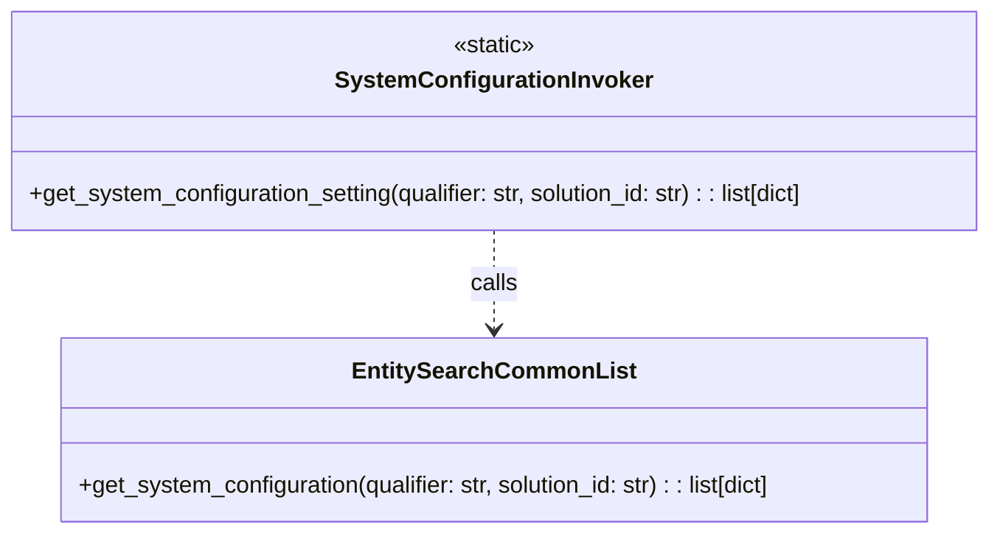

# Diagram: entity_core/entity_search/entity_search/invokers/system_configuration_invoker.py

> Auto-generated by Obscura crawlers

## Mermaid

### SVG

<svg id="container" width="691.171875" xmlns="http://www.w3.org/2000/svg" class="classDiagram" height="366" viewBox="0 0 691.171875 366" role="graphics-document document" aria-roledescription="class"><g><defs><marker id="container_class-aggregationStart" class="marker aggregation class" refX="18" refY="7" markerWidth="190" markerHeight="240" orient="auto"><path d="M 18,7 L9,13 L1,7 L9,1 Z"></path></marker></defs><defs><marker id="container_class-aggregationEnd" class="marker aggregation class" refX="1" refY="7" markerWidth="20" markerHeight="28" orient="auto"><path d="M 18,7 L9,13 L1,7 L9,1 Z"></path></marker></defs><defs><marker id="container_class-extensionStart" class="marker extension class" refX="18" refY="7" markerWidth="190" markerHeight="240" orient="auto"><path d="M 1,7 L18,13 V 1 Z"></path></marker></defs><defs><marker id="container_class-extensionEnd" class="marker extension class" refX="1" refY="7" markerWidth="20" markerHeight="28" orient="auto"><path d="M 1,1 V 13 L18,7 Z"></path></marker></defs><defs><marker id="container_class-compositionStart" class="marker composition class" refX="18" refY="7" markerWidth="190" markerHeight="240" orient="auto"><path d="M 18,7 L9,13 L1,7 L9,1 Z"></path></marker></defs><defs><marker id="container_class-compositionEnd" class="marker composition class" refX="1" refY="7" markerWidth="20" markerHeight="28" orient="auto"><path d="M 18,7 L9,13 L1,7 L9,1 Z"></path></marker></defs><defs><marker id="container_class-dependencyStart" class="marker dependency class" refX="6" refY="7" markerWidth="190" markerHeight="240" orient="auto"><path d="M 5,7 L9,13 L1,7 L9,1 Z"></path></marker></defs><defs><marker id="container_class-dependencyEnd" class="marker dependency class" refX="13" refY="7" markerWidth="20" markerHeight="28" orient="auto"><path d="M 18,7 L9,13 L14,7 L9,1 Z"></path></marker></defs><defs><marker id="container_class-lollipopStart" class="marker lollipop class" refX="13" refY="7" markerWidth="190" markerHeight="240" orient="auto"><circle stroke="black" fill="transparent" cx="7" cy="7" r="6"></circle></marker></defs><defs><marker id="container_class-lollipopEnd" class="marker lollipop class" refX="1" refY="7" markerWidth="190" markerHeight="240" orient="auto"><circle stroke="black" fill="transparent" cx="7" cy="7" r="6"></circle></marker></defs><g class="root"><g class="clusters"></g><g class="edgePaths"><path d="M345.586,158L345.586,164.167C345.586,170.333,345.586,182.667,345.586,194C345.586,205.333,345.586,215.667,345.586,220.833L345.586,226" id="id_SystemConfigurationInvoker_EntitySearchCommonList_1" class="edge-thickness-normal edge-pattern-dashed relation" style=";;;" data-edge="true" data-et="edge" data-id="id_SystemConfigurationInvoker_EntitySearchCommonList_1" data-points="W3sieCI6MzQ1LjU4NTkzNzUsInkiOjE1OH0seyJ4IjozNDUuNTg1OTM3NSwieSI6MTk1fSx7IngiOjM0NS41ODU5Mzc1LCJ5IjoyMzJ9XQ==" marker-end="url(#container_class-dependencyEnd)"></path></g><g class="edgeLabels"><g class="edgeLabel" transform="translate(345.5859375, 195)"><g class="label" data-id="id_SystemConfigurationInvoker_EntitySearchCommonList_1" transform="translate(-16.4453125, -12)"><foreignObject width="32.890625" height="24">

calls

</foreignObject></g></g></g><g class="nodes"><g class="node default" id="classId-SystemConfigurationInvoker-0" transform="translate(345.5859375, 83)"><g class="basic label-container"><path d="M-337.5859375 -75 L337.5859375 -75 L337.5859375 75 L-337.5859375 75" stroke="none" stroke-width="0" fill="#ECECFF" style=""></path><path d="M-337.5859375 -75 C-130.45397101633532 -75, 76.67799546732937 -75, 337.5859375 -75 M-337.5859375 -75 C-141.53555256681358 -75, 54.51483236637284 -75, 337.5859375 -75 M337.5859375 -75 C337.5859375 -36.419719383772645, 337.5859375 2.160561232454711, 337.5859375 75 M337.5859375 -75 C337.5859375 -33.656626466537226, 337.5859375 7.686747066925548, 337.5859375 75 M337.5859375 75 C107.7851923729246 75, -122.0155527541508 75, -337.5859375 75 M337.5859375 75 C116.7891129173284 75, -104.00771166534321 75, -337.5859375 75 M-337.5859375 75 C-337.5859375 32.00856860458461, -337.5859375 -10.98286279083078, -337.5859375 -75 M-337.5859375 75 C-337.5859375 30.467346068888936, -337.5859375 -14.065307862222127, -337.5859375 -75" stroke="#9370DB" stroke-width="1.3" fill="none" stroke-dasharray="0 0" style=""></path></g><g class="annotation-group text" transform="translate(-29.0234375, -51)"><g class="label" style="" transform="translate(0,-12)"><foreignObject width="58.046875" height="24">

«static»

</foreignObject></g></g><g class="label-group text" transform="translate(-103.484375, -27)"><g class="label" style="font-weight: bolder" transform="translate(0,-12)"><foreignObject width="206.96875" height="24">

SystemConfigurationInvoker

</foreignObject></g></g><g class="members-group text" transform="translate(-325.5859375, 21)"></g><g class="methods-group text" transform="translate(-325.5859375, 51)"><g class="label" style="" transform="translate(0,-12)"><foreignObject width="547.6875" height="24">

+get_system_configuration_setting(qualifier: str, solution_id: str) : : list[dict]

</foreignObject></g></g><g class="divider" style=""><path d="M-337.5859375 -3 C-161.11491096098044 -3, 15.356115578039123 -3, 337.5859375 -3 M-337.5859375 -3 C-133.97089112248295 -3, 69.6441552550341 -3, 337.5859375 -3" stroke="#9370DB" stroke-width="1.3" fill="none" stroke-dasharray="0 0" style=""></path></g><g class="divider" style=""><path d="M-337.5859375 21 C-179.84124832435242 21, -22.09655914870484 21, 337.5859375 21 M-337.5859375 21 C-160.15021014347613 21, 17.28551721304774 21, 337.5859375 21" stroke="#9370DB" stroke-width="1.3" fill="none" stroke-dasharray="0 0" style=""></path></g></g><g class="node default" id="classId-EntitySearchCommonList-1" transform="translate(345.5859375, 295)"><g class="basic label-container"><path d="M-302.32421875 -63 L302.32421875 -63 L302.32421875 63 L-302.32421875 63" stroke="none" stroke-width="0" fill="#ECECFF" style=""></path><path d="M-302.32421875 -63 C-69.15438075438126 -63, 164.01545724123747 -63, 302.32421875 -63 M-302.32421875 -63 C-87.57642568371364 -63, 127.17136738257273 -63, 302.32421875 -63 M302.32421875 -63 C302.32421875 -17.274920698045875, 302.32421875 28.45015860390825, 302.32421875 63 M302.32421875 -63 C302.32421875 -28.632506689387355, 302.32421875 5.734986621225289, 302.32421875 63 M302.32421875 63 C137.31330402049704 63, -27.697610709005914 63, -302.32421875 63 M302.32421875 63 C83.45387155307182 63, -135.41647564385636 63, -302.32421875 63 M-302.32421875 63 C-302.32421875 35.77222277308837, -302.32421875 8.544445546176739, -302.32421875 -63 M-302.32421875 63 C-302.32421875 27.422915136050456, -302.32421875 -8.154169727899088, -302.32421875 -63" stroke="#9370DB" stroke-width="1.3" fill="none" stroke-dasharray="0 0" style=""></path></g><g class="annotation-group text" transform="translate(0, -39)"></g><g class="label-group text" transform="translate(-91.2265625, -39)"><g class="label" style="font-weight: bolder" transform="translate(0,-12)"><foreignObject width="182.453125" height="24">

EntitySearchCommonList

</foreignObject></g></g><g class="members-group text" transform="translate(-290.32421875, 9)"></g><g class="methods-group text" transform="translate(-290.32421875, 39)"><g class="label" style="" transform="translate(0,-12)"><foreignObject width="489.421875" height="24">

+get_system_configuration(qualifier: str, solution_id: str) : : list[dict]

</foreignObject></g></g><g class="divider" style=""><path d="M-302.32421875 -15 C-142.25272157659754 -15, 17.818775596804926 -15, 302.32421875 -15 M-302.32421875 -15 C-83.74654290306682 -15, 134.83113294386635 -15, 302.32421875 -15" stroke="#9370DB" stroke-width="1.3" fill="none" stroke-dasharray="0 0" style=""></path></g><g class="divider" style=""><path d="M-302.32421875 9 C-141.04962213500906 9, 20.22497447998188 9, 302.32421875 9 M-302.32421875 9 C-105.87501377426409 9, 90.57419120147182 9, 302.32421875 9" stroke="#9370DB" stroke-width="1.3" fill="none" stroke-dasharray="0 0" style=""></path></g></g></g></g></g></svg>
