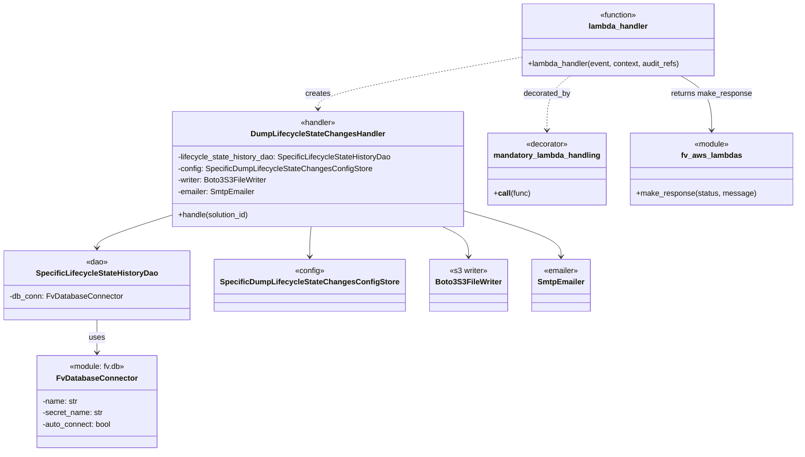

# Diagram: entity_core/entity_search/entity_search/lambdas/dump_lifecycle_state_changes.py


> Auto-generated by Obscura crawlers

## Diagram 1

```mermaid
flowchart TD
Event[Event / AWS Lambda invoke] --> Decorator{mandatory_lambda_handling decorator}
Decorator --> Invoke[lambda_handler(event, context, audit_refs) invoked]
Invoke --> DBDao[Instantiate SpecificLifecycleStateHistoryDao(DB_CONN)]
Invoke --> Config[Instantiate SpecificDumpLifecycleStateChangesConfigStore()]
Invoke --> Writer[Instantiate Boto3S3FileWriter()]
Invoke --> Emailer[Instantiate SmtpEmailer()]
DBDao --> Handler[Instantiate DumpLifecycleStateChangesHandler]
Config --> Handler
Writer --> Handler
Emailer --> Handler
Handler --> LoadEnv[Load env var LIFECYCLE_STATE_CHANGES_SOLUTION_IDS]
LoadEnv --> CheckEmpty{solution_ids empty?}
CheckEmpty -- No --> Loop[For each solution_id: handler.handle(solution_id)]
Loop --> CheckEmpty
CheckEmpty -- Yes --> Return[Return fv.aws.lambdas.make_response(200, "OK")]
```

> SVG rendering failed for this diagram.

## Diagram 2



### SVG

<svg id="container" width="1605.396484375" xmlns="http://www.w3.org/2000/svg" class="classDiagram" height="940" viewBox="0 0 1605.396484375 940" role="graphics-document document" aria-roledescription="class"><style>#container{font-family:"trebuchet ms",verdana,arial,sans-serif;font-size:16px;fill:#333;}@keyframes edge-animation-frame{from{stroke-dashoffset:0;}}@keyframes dash{to{stroke-dashoffset:0;}}#container .edge-animation-slow{stroke-dasharray:9,5!important;stroke-dashoffset:900;animation:dash 50s linear infinite;stroke-linecap:round;}#container .edge-animation-fast{stroke-dasharray:9,5!important;stroke-dashoffset:900;animation:dash 20s linear infinite;stroke-linecap:round;}#container .error-icon{fill:#552222;}#container .error-text{fill:#552222;stroke:#552222;}#container .edge-thickness-normal{stroke-width:1px;}#container .edge-thickness-thick{stroke-width:3.5px;}#container .edge-pattern-solid{stroke-dasharray:0;}#container .edge-thickness-invisible{stroke-width:0;fill:none;}#container .edge-pattern-dashed{stroke-dasharray:3;}#container .edge-pattern-dotted{stroke-dasharray:2;}#container .marker{fill:#333333;stroke:#333333;}#container .marker.cross{stroke:#333333;}#container svg{font-family:"trebuchet ms",verdana,arial,sans-serif;font-size:16px;}#container p{margin:0;}#container g.classGroup text{fill:#9370DB;stroke:none;font-family:"trebuchet ms",verdana,arial,sans-serif;font-size:10px;}#container g.classGroup text .title{font-weight:bolder;}#container .nodeLabel,#container .edgeLabel{color:#131300;}#container .edgeLabel .label rect{fill:#ECECFF;}#container .label text{fill:#131300;}#container .labelBkg{background:#ECECFF;}#container .edgeLabel .label span{background:#ECECFF;}#container .classTitle{font-weight:bolder;}#container .node rect,#container .node circle,#container .node ellipse,#container .node polygon,#container .node path{fill:#ECECFF;stroke:#9370DB;stroke-width:1px;}#container .divider{stroke:#9370DB;stroke-width:1;}#container g.clickable{cursor:pointer;}#container g.classGroup rect{fill:#ECECFF;stroke:#9370DB;}#container g.classGroup line{stroke:#9370DB;stroke-width:1;}#container .classLabel .box{stroke:none;stroke-width:0;fill:#ECECFF;opacity:0.5;}#container .classLabel .label{fill:#9370DB;font-size:10px;}#container .relation{stroke:#333333;stroke-width:1;fill:none;}#container .dashed-line{stroke-dasharray:3;}#container .dotted-line{stroke-dasharray:1 2;}#container #compositionStart,#container .composition{fill:#333333!important;stroke:#333333!important;stroke-width:1;}#container #compositionEnd,#container .composition{fill:#333333!important;stroke:#333333!important;stroke-width:1;}#container #dependencyStart,#container .dependency{fill:#333333!important;stroke:#333333!important;stroke-width:1;}#container #dependencyStart,#container .dependency{fill:#333333!important;stroke:#333333!important;stroke-width:1;}#container #extensionStart,#container .extension{fill:transparent!important;stroke:#333333!important;stroke-width:1;}#container #extensionEnd,#container .extension{fill:transparent!important;stroke:#333333!important;stroke-width:1;}#container #aggregationStart,#container .aggregation{fill:transparent!important;stroke:#333333!important;stroke-width:1;}#container #aggregationEnd,#container .aggregation{fill:transparent!important;stroke:#333333!important;stroke-width:1;}#container #lollipopStart,#container .lollipop{fill:#ECECFF!important;stroke:#333333!important;stroke-width:1;}#container #lollipopEnd,#container .lollipop{fill:#ECECFF!important;stroke:#333333!important;stroke-width:1;}#container .edgeTerminals{font-size:11px;line-height:initial;}#container .classTitleText{text-anchor:middle;font-size:18px;fill:#333;}#container .label-icon{display:inline-block;height:1em;overflow:visible;vertical-align:-0.125em;}#container .node .label-icon path{fill:currentColor;stroke:revert;stroke-width:revert;}#container :root{--mermaid-font-family:"trebuchet ms",verdana,arial,sans-serif;}</style><g><defs><marker id="container_class-aggregationStart" class="marker aggregation class" refX="18" refY="7" markerWidth="190" markerHeight="240" orient="auto"><path d="M 18,7 L9,13 L1,7 L9,1 Z"></path></marker></defs><defs><marker id="container_class-aggregationEnd" class="marker aggregation class" refX="1" refY="7" markerWidth="20" markerHeight="28" orient="auto"><path d="M 18,7 L9,13 L1,7 L9,1 Z"></path></marker></defs><defs><marker id="container_class-extensionStart" class="marker extension class" refX="18" refY="7" markerWidth="190" markerHeight="240" orient="auto"><path d="M 1,7 L18,13 V 1 Z"></path></marker></defs><defs><marker id="container_class-extensionEnd" class="marker extension class" refX="1" refY="7" markerWidth="20" markerHeight="28" orient="auto"><path d="M 1,1 V 13 L18,7 Z"></path></marker></defs><defs><marker id="container_class-compositionStart" class="marker composition class" refX="18" refY="7" markerWidth="190" markerHeight="240" orient="auto"><path d="M 18,7 L9,13 L1,7 L9,1 Z"></path></marker></defs><defs><marker id="container_class-compositionEnd" class="marker composition class" refX="1" refY="7" markerWidth="20" markerHeight="28" orient="auto"><path d="M 18,7 L9,13 L1,7 L9,1 Z"></path></marker></defs><defs><marker id="container_class-dependencyStart" class="marker dependency class" refX="6" refY="7" markerWidth="190" markerHeight="240" orient="auto"><path d="M 5,7 L9,13 L1,7 L9,1 Z"></path></marker></defs><defs><marker id="container_class-dependencyEnd" class="marker dependency class" refX="13" refY="7" markerWidth="20" markerHeight="28" orient="auto"><path d="M 18,7 L9,13 L14,7 L9,1 Z"></path></marker></defs><defs><marker id="container_class-lollipopStart" class="marker lollipop class" refX="13" refY="7" markerWidth="190" markerHeight="240" orient="auto"><circle stroke="black" fill="transparent" cx="7" cy="7" r="6"></circle></marker></defs><defs><marker id="container_class-lollipopEnd" class="marker lollipop class" refX="1" refY="7" markerWidth="190" markerHeight="240" orient="auto"><circle stroke="black" fill="transparent" cx="7" cy="7" r="6"></circle></marker></defs><g class="root"><g class="clusters"></g><g class="edgePaths"><path d="M196.891,666L196.891,672.167C196.891,678.333,196.891,690.667,196.891,702C196.891,713.333,196.891,723.667,196.891,728.833L196.891,734" id="id_SpecificLifecycleStateHistoryDao_FvDatabaseConnector_1" class="edge-thickness-normal edge-pattern-solid relation" style=";;;" data-edge="true" data-et="edge" data-id="id_SpecificLifecycleStateHistoryDao_FvDatabaseConnector_1" data-points="W3sieCI6MTk2Ljg5MDYyNSwieSI6NjY2fSx7IngiOjE5Ni44OTA2MjUsInkiOjcwM30seyJ4IjoxOTYuODkwNjI1LCJ5Ijo3NDB9XQ==" marker-end="url(#container_class-dependencyEnd)"></path><path d="M323.623,454.145L302.501,461.287C281.379,468.43,239.135,482.715,218.013,493.024C196.891,503.333,196.891,509.667,196.891,512.833L196.891,516" id="id_DumpLifecycleStateChangesHandler_SpecificLifecycleStateHistoryDao_2" class="edge-thickness-normal edge-pattern-solid relation" style=";;;" data-edge="true" data-et="edge" data-id="id_DumpLifecycleStateChangesHandler_SpecificLifecycleStateHistoryDao_2" data-points="W3sieCI6MzIzLjYyMzA0Njg3NSwieSI6NDU0LjE0NDkzNjExNzg4MDE1fSx7IngiOjE5Ni44OTA2MjUsInkiOjQ5N30seyJ4IjoxOTYuODkwNjI1LCJ5Ijo1MjJ9XQ==" marker-end="url(#container_class-dependencyEnd)"></path><path d="M622.707,472L622.604,476.167C622.5,480.333,622.293,488.667,622.189,499C622.086,509.333,622.086,521.667,622.086,527.833L622.086,534" id="id_DumpLifecycleStateChangesHandler_SpecificDumpLifecycleStateChangesConfigStore_3" class="edge-thickness-normal edge-pattern-solid relation" style=";;;" data-edge="true" data-et="edge" data-id="id_DumpLifecycleStateChangesHandler_SpecificDumpLifecycleStateChangesConfigStore_3" data-points="W3sieCI6NjIyLjcwNzIzMzI5NzQxMzgsInkiOjQ3Mn0seyJ4Ijo2MjIuMDg1OTM3NSwieSI6NDk3fSx7IngiOjYyMi4wODU5Mzc1LCJ5Ijo1NDB9XQ==" marker-end="url(#container_class-dependencyEnd)"></path><path d="M882.33,472L891.241,476.167C900.152,480.333,917.975,488.667,926.886,499C935.797,509.333,935.797,521.667,935.797,527.833L935.797,534" id="id_DumpLifecycleStateChangesHandler_Boto3S3FileWriter_4" class="edge-thickness-normal edge-pattern-solid relation" style=";;;" data-edge="true" data-et="edge" data-id="id_DumpLifecycleStateChangesHandler_Boto3S3FileWriter_4" data-points="W3sieCI6ODgyLjMzMDA3ODEyNSwieSI6NDcyfSx7IngiOjkzNS43OTY4NzUsInkiOjQ5N30seyJ4Ijo5MzUuNzk2ODc1LCJ5Ijo1NDB9XQ==" marker-end="url(#container_class-dependencyEnd)"></path><path d="M927.756,440.269L960.113,449.724C992.47,459.179,1057.184,478.09,1089.541,493.711C1121.898,509.333,1121.898,521.667,1121.898,527.833L1121.898,534" id="id_DumpLifecycleStateChangesHandler_SmtpEmailer_5" class="edge-thickness-normal edge-pattern-solid relation" style=";;;" data-edge="true" data-et="edge" data-id="id_DumpLifecycleStateChangesHandler_SmtpEmailer_5" data-points="W3sieCI6OTI3Ljc1NTg1OTM3NSwieSI6NDQwLjI2ODUxMjQzMjE1MTU3fSx7IngiOjExMjEuODk4NDM3NSwieSI6NDk3fSx7IngiOjExMjEuODk4NDM3NSwieSI6NTQwfV0=" marker-end="url(#container_class-dependencyEnd)"></path><path d="M1047.605,119.362L977.286,131.968C906.967,144.575,766.328,169.787,696.009,187.56C625.689,205.333,625.689,215.667,625.689,220.833L625.689,226" id="id_lambda_handler_DumpLifecycleStateChangesHandler_6" class="edge-thickness-normal edge-pattern-dashed relation" style=";;;" data-edge="true" data-et="edge" data-id="id_lambda_handler_DumpLifecycleStateChangesHandler_6" data-points="W3sieCI6MTA0Ny42MDU0Njg3NSwieSI6MTE5LjM2MjE1ODQ5NTE0MzM1fSx7IngiOjYyNS42ODk0NTMxMjUsInkiOjE5NX0seyJ4Ijo2MjUuNjg5NDUzMTI1LCJ5IjoyMzJ9XQ==" marker-end="url(#container_class-dependencyEnd)"></path><path d="M1147.813,158L1139.375,164.167C1130.937,170.333,1114.062,182.667,1105.624,201.5C1097.186,220.333,1097.186,245.667,1097.186,258.333L1097.186,271" id="id_lambda_handler_mandatory_lambda_handling_7" class="edge-thickness-normal edge-pattern-dashed relation" style=";;;" data-edge="true" data-et="edge" data-id="id_lambda_handler_mandatory_lambda_handling_7" data-points="W3sieCI6MTE0Ny44MTM0MjQyNDY2NTE3LCJ5IjoxNTh9LHsieCI6MTA5Ny4xODU1NDY4NzUsInkiOjE5NX0seyJ4IjoxMDk3LjE4NTU0Njg3NSwieSI6Mjc3fV0=" marker-end="url(#container_class-dependencyEnd)"></path><path d="M1372.023,158L1382.021,164.167C1392.018,170.333,1412.012,182.667,1422.009,201.5C1432.006,220.333,1432.006,245.667,1432.006,258.333L1432.006,271" id="id_lambda_handler_fv_aws_lambdas_8" class="edge-thickness-normal edge-pattern-solid relation" style=";;;" data-edge="true" data-et="edge" data-id="id_lambda_handler_fv_aws_lambdas_8" data-points="W3sieCI6MTM3Mi4wMjM0NTQ5Mzg2MTYyLCJ5IjoxNTh9LHsieCI6MTQzMi4wMDU4NTkzNzUsInkiOjE5NX0seyJ4IjoxNDMyLjAwNTg1OTM3NSwieSI6Mjc3fV0=" marker-end="url(#container_class-dependencyEnd)"></path></g><g class="edgeLabels"><g class="edgeLabel" transform="translate(196.890625, 703)"><g class="label" data-id="id_SpecificLifecycleStateHistoryDao_FvDatabaseConnector_1" transform="translate(-16.4921875, -12)"><foreignObject width="32.984375" height="24"><div xmlns="http://www.w3.org/1999/xhtml" class="labelBkg" style="display: table-cell; white-space: nowrap; line-height: 1.5; max-width: 200px; text-align: center;"><span class="edgeLabel"><p>uses</p></span></div></foreignObject></g></g><g class="edgeLabel"><g class="label" data-id="id_DumpLifecycleStateChangesHandler_SpecificLifecycleStateHistoryDao_2" transform="translate(0, 0)"><foreignObject width="0" height="0"><div xmlns="http://www.w3.org/1999/xhtml" class="labelBkg" style="display: table-cell; white-space: nowrap; line-height: 1.5; max-width: 200px; text-align: center;"><span class="edgeLabel"></span></div></foreignObject></g></g><g class="edgeLabel"><g class="label" data-id="id_DumpLifecycleStateChangesHandler_SpecificDumpLifecycleStateChangesConfigStore_3" transform="translate(0, 0)"><foreignObject width="0" height="0"><div xmlns="http://www.w3.org/1999/xhtml" class="labelBkg" style="display: table-cell; white-space: nowrap; line-height: 1.5; max-width: 200px; text-align: center;"><span class="edgeLabel"></span></div></foreignObject></g></g><g class="edgeLabel"><g class="label" data-id="id_DumpLifecycleStateChangesHandler_Boto3S3FileWriter_4" transform="translate(0, 0)"><foreignObject width="0" height="0"><div xmlns="http://www.w3.org/1999/xhtml" class="labelBkg" style="display: table-cell; white-space: nowrap; line-height: 1.5; max-width: 200px; text-align: center;"><span class="edgeLabel"></span></div></foreignObject></g></g><g class="edgeLabel"><g class="label" data-id="id_DumpLifecycleStateChangesHandler_SmtpEmailer_5" transform="translate(0, 0)"><foreignObject width="0" height="0"><div xmlns="http://www.w3.org/1999/xhtml" class="labelBkg" style="display: table-cell; white-space: nowrap; line-height: 1.5; max-width: 200px; text-align: center;"><span class="edgeLabel"></span></div></foreignObject></g></g><g class="edgeLabel" transform="translate(625.689453125, 195)"><g class="label" data-id="id_lambda_handler_DumpLifecycleStateChangesHandler_6" transform="translate(-26.171875, -12)"><foreignObject width="52.34375" height="24"><div xmlns="http://www.w3.org/1999/xhtml" class="labelBkg" style="display: table-cell; white-space: nowrap; line-height: 1.5; max-width: 200px; text-align: center;"><span class="edgeLabel"><p>creates</p></span></div></foreignObject></g></g><g class="edgeLabel" transform="translate(1097.185546875, 195)"><g class="label" data-id="id_lambda_handler_mandatory_lambda_handling_7" transform="translate(-49.375, -12)"><foreignObject width="98.75" height="24"><div xmlns="http://www.w3.org/1999/xhtml" class="labelBkg" style="display: table-cell; white-space: nowrap; line-height: 1.5; max-width: 200px; text-align: center;"><span class="edgeLabel"><p>decorated_by</p></span></div></foreignObject></g></g><g class="edgeLabel" transform="translate(1432.005859375, 195)"><g class="label" data-id="id_lambda_handler_fv_aws_lambdas_8" transform="translate(-85.1328125, -12)"><foreignObject width="170.265625" height="24"><div xmlns="http://www.w3.org/1999/xhtml" class="labelBkg" style="display: table-cell; white-space: nowrap; line-height: 1.5; max-width: 200px; text-align: center;"><span class="edgeLabel"><p>returns make_response</p></span></div></foreignObject></g></g></g><g class="nodes"><g class="node default" id="classId-FvDatabaseConnector-0" transform="translate(196.890625, 836)"><g class="basic label-container"><path d="M-124.34765625 -96 L124.34765625 -96 L124.34765625 96 L-124.34765625 96" stroke="none" stroke-width="0" fill="#ECECFF" style=""></path><path d="M-124.34765625 -96 C-33.10793201740594 -96, 58.13179221518811 -96, 124.34765625 -96 M-124.34765625 -96 C-45.08695729230715 -96, 34.173741665385705 -96, 124.34765625 -96 M124.34765625 -96 C124.34765625 -44.622039969651, 124.34765625 6.755920060698003, 124.34765625 96 M124.34765625 -96 C124.34765625 -52.31460336538841, 124.34765625 -8.629206730776815, 124.34765625 96 M124.34765625 96 C48.34587407563038 96, -27.655908098739246 96, -124.34765625 96 M124.34765625 96 C40.005881610521016 96, -44.33589302895797 96, -124.34765625 96 M-124.34765625 96 C-124.34765625 53.84253677995557, -124.34765625 11.685073559911146, -124.34765625 -96 M-124.34765625 96 C-124.34765625 25.32045245234535, -124.34765625 -45.3590950953093, -124.34765625 -96" stroke="#9370DB" stroke-width="1.3" fill="none" stroke-dasharray="0 0" style=""></path></g><g class="annotation-group text" transform="translate(-58.3125, -72)"><g class="label" style="" transform="translate(0,-12)"><foreignObject width="116.625" height="24"><div xmlns="http://www.w3.org/1999/xhtml" style="display: table-cell; white-space: nowrap; line-height: 1.5; max-width: 167px; text-align: center;"><span class="nodeLabel markdown-node-label" style=""><p>«module: fv.db»</p></span></div></foreignObject></g></g><g class="label-group text" transform="translate(-79.3046875, -48)"><g class="label" style="font-weight: bolder" transform="translate(0,-12)"><foreignObject width="158.609375" height="24"><div xmlns="http://www.w3.org/1999/xhtml" style="display: table-cell; white-space: nowrap; line-height: 1.5; max-width: 207px; text-align: center;"><span class="nodeLabel markdown-node-label" style=""><p>FvDatabaseConnector</p></span></div></foreignObject></g></g><g class="members-group text" transform="translate(-112.34765625, 0)"><g class="label" style="" transform="translate(0,-12)"><foreignObject width="74.46875" height="24"><div xmlns="http://www.w3.org/1999/xhtml" style="display: table-cell; white-space: nowrap; line-height: 1.5; max-width: 133px; text-align: center;"><span class="nodeLabel markdown-node-label" style=""><p>-name: str</p></span></div></foreignObject></g><g class="label" style="" transform="translate(0,12)"><foreignObject width="126.828125" height="24"><div xmlns="http://www.w3.org/1999/xhtml" style="display: table-cell; white-space: nowrap; line-height: 1.5; max-width: 185px; text-align: center;"><span class="nodeLabel markdown-node-label" style=""><p>-secret_name: str</p></span></div></foreignObject></g><g class="label" style="" transform="translate(0,36)"><foreignObject width="145.390625" height="24"><div xmlns="http://www.w3.org/1999/xhtml" style="display: table-cell; white-space: nowrap; line-height: 1.5; max-width: 203px; text-align: center;"><span class="nodeLabel markdown-node-label" style=""><p>-auto_connect: bool</p></span></div></foreignObject></g></g><g class="methods-group text" transform="translate(-112.34765625, 96)"></g><g class="divider" style=""><path d="M-124.34765625 -24 C-60.83906987836391 -24, 2.6695164932721838 -24, 124.34765625 -24 M-124.34765625 -24 C-36.94074778660345 -24, 50.466160676793095 -24, 124.34765625 -24" stroke="#9370DB" stroke-width="1.3" fill="none" stroke-dasharray="0 0" style=""></path></g><g class="divider" style=""><path d="M-124.34765625 72 C-28.14646966925129 72, 68.05471691149742 72, 124.34765625 72 M-124.34765625 72 C-57.898357020468964 72, 8.550942209062072 72, 124.34765625 72" stroke="#9370DB" stroke-width="1.3" fill="none" stroke-dasharray="0 0" style=""></path></g></g><g class="node default" id="classId-SpecificLifecycleStateHistoryDao-1" transform="translate(196.890625, 594)"><g class="basic label-container"><path d="M-188.890625 -72 L188.890625 -72 L188.890625 72 L-188.890625 72" stroke="none" stroke-width="0" fill="#ECECFF" style=""></path><path d="M-188.890625 -72 C-51.5721766920376 -72, 85.7462716159248 -72, 188.890625 -72 M-188.890625 -72 C-61.74810841041402 -72, 65.39440817917196 -72, 188.890625 -72 M188.890625 -72 C188.890625 -35.27264476364705, 188.890625 1.454710472705898, 188.890625 72 M188.890625 -72 C188.890625 -29.185937595967772, 188.890625 13.628124808064456, 188.890625 72 M188.890625 72 C82.47123206403384 72, -23.948160871932316 72, -188.890625 72 M188.890625 72 C51.712283234653654 72, -85.46605853069269 72, -188.890625 72 M-188.890625 72 C-188.890625 21.311706871408553, -188.890625 -29.376586257182893, -188.890625 -72 M-188.890625 72 C-188.890625 24.623864703152073, -188.890625 -22.752270593695854, -188.890625 -72" stroke="#9370DB" stroke-width="1.3" fill="none" stroke-dasharray="0 0" style=""></path></g><g class="annotation-group text" transform="translate(-22.6171875, -48)"><g class="label" style="" transform="translate(0,-12)"><foreignObject width="45.234375" height="24"><div xmlns="http://www.w3.org/1999/xhtml" style="display: table-cell; white-space: nowrap; line-height: 1.5; max-width: 95px; text-align: center;"><span class="nodeLabel markdown-node-label" style=""><p>«dao»</p></span></div></foreignObject></g></g><g class="label-group text" transform="translate(-120.4375, -24)"><g class="label" style="font-weight: bolder" transform="translate(0,-12)"><foreignObject width="240.875" height="24"><div xmlns="http://www.w3.org/1999/xhtml" style="display: table-cell; white-space: nowrap; line-height: 1.5; max-width: 286px; text-align: center;"><span class="nodeLabel markdown-node-label" style=""><p>SpecificLifecycleStateHistoryDao</p></span></div></foreignObject></g></g><g class="members-group text" transform="translate(-176.890625, 24)"><g class="label" style="" transform="translate(0,-12)"><foreignObject width="233.34375" height="24"><div xmlns="http://www.w3.org/1999/xhtml" style="display: table-cell; white-space: nowrap; line-height: 1.5; max-width: 292px; text-align: center;"><span class="nodeLabel markdown-node-label" style=""><p>-db_conn: FvDatabaseConnector</p></span></div></foreignObject></g></g><g class="methods-group text" transform="translate(-176.890625, 72)"></g><g class="divider" style=""><path d="M-188.890625 0 C-90.19034775647403 0, 8.509929487051949 0, 188.890625 0 M-188.890625 0 C-70.76002404281394 0, 47.37057691437212 0, 188.890625 0" stroke="#9370DB" stroke-width="1.3" fill="none" stroke-dasharray="0 0" style=""></path></g><g class="divider" style=""><path d="M-188.890625 48 C-105.72643080493098 48, -22.56223660986197 48, 188.890625 48 M-188.890625 48 C-51.61156521579926 48, 85.66749456840148 48, 188.890625 48" stroke="#9370DB" stroke-width="1.3" fill="none" stroke-dasharray="0 0" style=""></path></g></g><g class="node default" id="classId-SpecificDumpLifecycleStateChangesConfigStore-2" transform="translate(622.0859375, 594)"><g class="basic label-container"><path d="M-186.3046875 -54 L186.3046875 -54 L186.3046875 54 L-186.3046875 54" stroke="none" stroke-width="0" fill="#ECECFF" style=""></path><path d="M-186.3046875 -54 C-45.73485249006109 -54, 94.83498251987783 -54, 186.3046875 -54 M-186.3046875 -54 C-105.29288810783294 -54, -24.281088715665874 -54, 186.3046875 -54 M186.3046875 -54 C186.3046875 -12.875103099499306, 186.3046875 28.24979380100139, 186.3046875 54 M186.3046875 -54 C186.3046875 -31.62576980353432, 186.3046875 -9.251539607068644, 186.3046875 54 M186.3046875 54 C80.44080521223191 54, -25.423077075536185 54, -186.3046875 54 M186.3046875 54 C80.88705514737828 54, -24.530577205243446 54, -186.3046875 54 M-186.3046875 54 C-186.3046875 30.131983177270225, -186.3046875 6.26396635454045, -186.3046875 -54 M-186.3046875 54 C-186.3046875 32.182032918761934, -186.3046875 10.36406583752386, -186.3046875 -54" stroke="#9370DB" stroke-width="1.3" fill="none" stroke-dasharray="0 0" style=""></path></g><g class="annotation-group text" transform="translate(-30.7578125, -30)"><g class="label" style="" transform="translate(0,-12)"><foreignObject width="61.515625" height="24"><div xmlns="http://www.w3.org/1999/xhtml" style="display: table-cell; white-space: nowrap; line-height: 1.5; max-width: 112px; text-align: center;"><span class="nodeLabel markdown-node-label" style=""><p>«config»</p></span></div></foreignObject></g></g><g class="label-group text" transform="translate(-174.3046875, -6)"><g class="label" style="font-weight: bolder" transform="translate(0,-12)"><foreignObject width="348.609375" height="24"><div xmlns="http://www.w3.org/1999/xhtml" style="display: table-cell; white-space: nowrap; line-height: 1.5; max-width: 392px; text-align: center;"><span class="nodeLabel markdown-node-label" style=""><p>SpecificDumpLifecycleStateChangesConfigStore</p></span></div></foreignObject></g></g><g class="members-group text" transform="translate(-174.3046875, 42)"></g><g class="methods-group text" transform="translate(-174.3046875, 72)"></g><g class="divider" style=""><path d="M-186.3046875 18 C-43.23694195382018 18, 99.83080359235964 18, 186.3046875 18 M-186.3046875 18 C-53.82598148494543 18, 78.65272453010914 18, 186.3046875 18" stroke="#9370DB" stroke-width="1.3" fill="none" stroke-dasharray="0 0" style=""></path></g><g class="divider" style=""><path d="M-186.3046875 36 C-52.45626048503681 36, 81.39216652992639 36, 186.3046875 36 M-186.3046875 36 C-91.90845174227036 36, 2.487784015459283 36, 186.3046875 36" stroke="#9370DB" stroke-width="1.3" fill="none" stroke-dasharray="0 0" style=""></path></g></g><g class="node default" id="classId-Boto3S3FileWriter-3" transform="translate(935.796875, 594)"><g class="basic label-container"><path d="M-77.40625 -54 L77.40625 -54 L77.40625 54 L-77.40625 54" stroke="none" stroke-width="0" fill="#ECECFF" style=""></path><path d="M-77.40625 -54 C-20.898177568840694 -54, 35.60989486231861 -54, 77.40625 -54 M-77.40625 -54 C-21.072436034191263 -54, 35.261377931617474 -54, 77.40625 -54 M77.40625 -54 C77.40625 -32.138285130890395, 77.40625 -10.27657026178079, 77.40625 54 M77.40625 -54 C77.40625 -21.422823180629265, 77.40625 11.154353638741469, 77.40625 54 M77.40625 54 C33.59000922867979 54, -10.22623154264042 54, -77.40625 54 M77.40625 54 C22.84162375631425 54, -31.723002487371502 54, -77.40625 54 M-77.40625 54 C-77.40625 16.914292391493888, -77.40625 -20.171415217012225, -77.40625 -54 M-77.40625 54 C-77.40625 21.562387820374198, -77.40625 -10.875224359251604, -77.40625 -54" stroke="#9370DB" stroke-width="1.3" fill="none" stroke-dasharray="0 0" style=""></path></g><g class="annotation-group text" transform="translate(-40.1953125, -30)"><g class="label" style="" transform="translate(0,-12)"><foreignObject width="80.390625" height="24"><div xmlns="http://www.w3.org/1999/xhtml" style="display: table-cell; white-space: nowrap; line-height: 1.5; max-width: 130px; text-align: center;"><span class="nodeLabel markdown-node-label" style=""><p>«s3 writer»</p></span></div></foreignObject></g></g><g class="label-group text" transform="translate(-65.40625, -6)"><g class="label" style="font-weight: bolder" transform="translate(0,-12)"><foreignObject width="130.8125" height="24"><div xmlns="http://www.w3.org/1999/xhtml" style="display: table-cell; white-space: nowrap; line-height: 1.5; max-width: 179px; text-align: center;"><span class="nodeLabel markdown-node-label" style=""><p>Boto3S3FileWriter</p></span></div></foreignObject></g></g><g class="members-group text" transform="translate(-65.40625, 42)"></g><g class="methods-group text" transform="translate(-65.40625, 72)"></g><g class="divider" style=""><path d="M-77.40625 18 C-35.78389247065709 18, 5.838465058685827 18, 77.40625 18 M-77.40625 18 C-23.295523320226806 18, 30.815203359546388 18, 77.40625 18" stroke="#9370DB" stroke-width="1.3" fill="none" stroke-dasharray="0 0" style=""></path></g><g class="divider" style=""><path d="M-77.40625 36 C-15.600268684060786 36, 46.20571263187843 36, 77.40625 36 M-77.40625 36 C-15.48185612403445 36, 46.4425377519311 36, 77.40625 36" stroke="#9370DB" stroke-width="1.3" fill="none" stroke-dasharray="0 0" style=""></path></g></g><g class="node default" id="classId-SmtpEmailer-4" transform="translate(1121.8984375, 594)"><g class="basic label-container"><path d="M-58.6953125 -54 L58.6953125 -54 L58.6953125 54 L-58.6953125 54" stroke="none" stroke-width="0" fill="#ECECFF" style=""></path><path d="M-58.6953125 -54 C-16.023368004277053 -54, 26.648576491445894 -54, 58.6953125 -54 M-58.6953125 -54 C-18.77647536904398 -54, 21.142361761912042 -54, 58.6953125 -54 M58.6953125 -54 C58.6953125 -14.071778545223097, 58.6953125 25.856442909553806, 58.6953125 54 M58.6953125 -54 C58.6953125 -18.225244820483226, 58.6953125 17.549510359033548, 58.6953125 54 M58.6953125 54 C16.50998239280255 54, -25.675347714394903 54, -58.6953125 54 M58.6953125 54 C22.766474048776608 54, -13.162364402446784 54, -58.6953125 54 M-58.6953125 54 C-58.6953125 22.37714528759562, -58.6953125 -9.245709424808759, -58.6953125 -54 M-58.6953125 54 C-58.6953125 15.038802691736969, -58.6953125 -23.922394616526063, -58.6953125 -54" stroke="#9370DB" stroke-width="1.3" fill="none" stroke-dasharray="0 0" style=""></path></g><g class="annotation-group text" transform="translate(-36.46875, -30)"><g class="label" style="" transform="translate(0,-12)"><foreignObject width="72.9375" height="24"><div xmlns="http://www.w3.org/1999/xhtml" style="display: table-cell; white-space: nowrap; line-height: 1.5; max-width: 123px; text-align: center;"><span class="nodeLabel markdown-node-label" style=""><p>«emailer»</p></span></div></foreignObject></g></g><g class="label-group text" transform="translate(-46.6953125, -6)"><g class="label" style="font-weight: bolder" transform="translate(0,-12)"><foreignObject width="93.390625" height="24"><div xmlns="http://www.w3.org/1999/xhtml" style="display: table-cell; white-space: nowrap; line-height: 1.5; max-width: 143px; text-align: center;"><span class="nodeLabel markdown-node-label" style=""><p>SmtpEmailer</p></span></div></foreignObject></g></g><g class="members-group text" transform="translate(-46.6953125, 42)"></g><g class="methods-group text" transform="translate(-46.6953125, 72)"></g><g class="divider" style=""><path d="M-58.6953125 18 C-30.424003366412034 18, -2.152694232824068 18, 58.6953125 18 M-58.6953125 18 C-25.42494239235146 18, 7.8454277152970775 18, 58.6953125 18" stroke="#9370DB" stroke-width="1.3" fill="none" stroke-dasharray="0 0" style=""></path></g><g class="divider" style=""><path d="M-58.6953125 36 C-20.599467426182237 36, 17.496377647635526 36, 58.6953125 36 M-58.6953125 36 C-25.55704978472169 36, 7.581212930556617 36, 58.6953125 36" stroke="#9370DB" stroke-width="1.3" fill="none" stroke-dasharray="0 0" style=""></path></g></g><g class="node default" id="classId-DumpLifecycleStateChangesHandler-5" transform="translate(625.689453125, 352)"><g class="basic label-container"><path d="M-302.06640625 -120 L302.06640625 -120 L302.06640625 120 L-302.06640625 120" stroke="none" stroke-width="0" fill="#ECECFF" style=""></path><path d="M-302.06640625 -120 C-126.04433157122565 -120, 49.97774310754869 -120, 302.06640625 -120 M-302.06640625 -120 C-145.80317773816975 -120, 10.460050773660498 -120, 302.06640625 -120 M302.06640625 -120 C302.06640625 -37.489480307722786, 302.06640625 45.02103938455443, 302.06640625 120 M302.06640625 -120 C302.06640625 -58.135138354497016, 302.06640625 3.7297232910059677, 302.06640625 120 M302.06640625 120 C168.47106430322563 120, 34.87572235645126 120, -302.06640625 120 M302.06640625 120 C61.06408949006857 120, -179.93822726986286 120, -302.06640625 120 M-302.06640625 120 C-302.06640625 26.720342121518016, -302.06640625 -66.55931575696397, -302.06640625 -120 M-302.06640625 120 C-302.06640625 55.176289567198296, -302.06640625 -9.647420865603408, -302.06640625 -120" stroke="#9370DB" stroke-width="1.3" fill="none" stroke-dasharray="0 0" style=""></path></g><g class="annotation-group text" transform="translate(-37.3125, -96)"><g class="label" style="" transform="translate(0,-12)"><foreignObject width="74.625" height="24"><div xmlns="http://www.w3.org/1999/xhtml" style="display: table-cell; white-space: nowrap; line-height: 1.5; max-width: 125px; text-align: center;"><span class="nodeLabel markdown-node-label" style=""><p>«handler»</p></span></div></foreignObject></g></g><g class="label-group text" transform="translate(-132.4140625, -72)"><g class="label" style="font-weight: bolder" transform="translate(0,-12)"><foreignObject width="264.828125" height="24"><div xmlns="http://www.w3.org/1999/xhtml" style="display: table-cell; white-space: nowrap; line-height: 1.5; max-width: 312px; text-align: center;"><span class="nodeLabel markdown-node-label" style=""><p>DumpLifecycleStateChangesHandler</p></span></div></foreignObject></g></g><g class="members-group text" transform="translate(-290.06640625, -24)"><g class="label" style="" transform="translate(0,-12)"><foreignObject width="447.71875" height="24"><div xmlns="http://www.w3.org/1999/xhtml" style="display: table-cell; white-space: nowrap; line-height: 1.5; max-width: 505px; text-align: center;"><span class="nodeLabel markdown-node-label" style=""><p>-lifecycle_state_history_dao: SpecificLifecycleStateHistoryDao</p></span></div></foreignObject></g><g class="label" style="" transform="translate(0,12)"><foreignObject width="400.46875" height="24"><div xmlns="http://www.w3.org/1999/xhtml" style="display: table-cell; white-space: nowrap; line-height: 1.5; max-width: 458px; text-align: center;"><span class="nodeLabel markdown-node-label" style=""><p>-config: SpecificDumpLifecycleStateChangesConfigStore</p></span></div></foreignObject></g><g class="label" style="" transform="translate(0,36)"><foreignObject width="185" height="24"><div xmlns="http://www.w3.org/1999/xhtml" style="display: table-cell; white-space: nowrap; line-height: 1.5; max-width: 243px; text-align: center;"><span class="nodeLabel markdown-node-label" style=""><p>-writer: Boto3S3FileWriter</p></span></div></foreignObject></g><g class="label" style="" transform="translate(0,60)"><foreignObject width="162.390625" height="24"><div xmlns="http://www.w3.org/1999/xhtml" style="display: table-cell; white-space: nowrap; line-height: 1.5; max-width: 221px; text-align: center;"><span class="nodeLabel markdown-node-label" style=""><p>-emailer: SmtpEmailer</p></span></div></foreignObject></g></g><g class="methods-group text" transform="translate(-290.06640625, 96)"><g class="label" style="" transform="translate(0,-12)"><foreignObject width="150.9375" height="24"><div xmlns="http://www.w3.org/1999/xhtml" style="display: table-cell; white-space: nowrap; line-height: 1.5; max-width: 208px; text-align: center;"><span class="nodeLabel markdown-node-label" style=""><p>+handle(solution_id)</p></span></div></foreignObject></g></g><g class="divider" style=""><path d="M-302.06640625 -48 C-89.62820577927022 -48, 122.80999469145956 -48, 302.06640625 -48 M-302.06640625 -48 C-100.56023189418323 -48, 100.94594246163354 -48, 302.06640625 -48" stroke="#9370DB" stroke-width="1.3" fill="none" stroke-dasharray="0 0" style=""></path></g><g class="divider" style=""><path d="M-302.06640625 72 C-161.94501387338497 72, -21.82362149676993 72, 302.06640625 72 M-302.06640625 72 C-139.39795413944165 72, 23.270497971116697 72, 302.06640625 72" stroke="#9370DB" stroke-width="1.3" fill="none" stroke-dasharray="0 0" style=""></path></g></g><g class="node default" id="classId-lambda_handler-6" transform="translate(1250.4375, 83)"><g class="basic label-container"><path d="M-202.83203125 -75 L202.83203125 -75 L202.83203125 75 L-202.83203125 75" stroke="none" stroke-width="0" fill="#ECECFF" style=""></path><path d="M-202.83203125 -75 C-93.74996744538112 -75, 15.332096359237767 -75, 202.83203125 -75 M-202.83203125 -75 C-91.5503838770369 -75, 19.731263495926214 -75, 202.83203125 -75 M202.83203125 -75 C202.83203125 -26.987552188780988, 202.83203125 21.024895622438024, 202.83203125 75 M202.83203125 -75 C202.83203125 -24.854024314779657, 202.83203125 25.291951370440685, 202.83203125 75 M202.83203125 75 C50.86243867572017 75, -101.10715389855966 75, -202.83203125 75 M202.83203125 75 C98.55151315056462 75, -5.729004948870767 75, -202.83203125 75 M-202.83203125 75 C-202.83203125 19.097930920895976, -202.83203125 -36.80413815820805, -202.83203125 -75 M-202.83203125 75 C-202.83203125 36.75185566432795, -202.83203125 -1.4962886713441037, -202.83203125 -75" stroke="#9370DB" stroke-width="1.3" fill="none" stroke-dasharray="0 0" style=""></path></g><g class="annotation-group text" transform="translate(-39.484375, -51)"><g class="label" style="" transform="translate(0,-12)"><foreignObject width="78.96875" height="24"><div xmlns="http://www.w3.org/1999/xhtml" style="display: table-cell; white-space: nowrap; line-height: 1.5; max-width: 129px; text-align: center;"><span class="nodeLabel markdown-node-label" style=""><p>«function»</p></span></div></foreignObject></g></g><g class="label-group text" transform="translate(-59.9765625, -27)"><g class="label" style="font-weight: bolder" transform="translate(0,-12)"><foreignObject width="119.953125" height="24"><div xmlns="http://www.w3.org/1999/xhtml" style="display: table-cell; white-space: nowrap; line-height: 1.5; max-width: 170px; text-align: center;"><span class="nodeLabel markdown-node-label" style=""><p>lambda_handler</p></span></div></foreignObject></g></g><g class="members-group text" transform="translate(-190.83203125, 21)"></g><g class="methods-group text" transform="translate(-190.83203125, 51)"><g class="label" style="" transform="translate(0,-12)"><foreignObject width="321.6875" height="24"><div xmlns="http://www.w3.org/1999/xhtml" style="display: table-cell; white-space: nowrap; line-height: 1.5; max-width: 379px; text-align: center;"><span class="nodeLabel markdown-node-label" style=""><p>+lambda_handler(event, context, audit_refs)</p></span></div></foreignObject></g></g><g class="divider" style=""><path d="M-202.83203125 -3 C-93.51974754013798 -3, 15.79253616972403 -3, 202.83203125 -3 M-202.83203125 -3 C-61.32294172661196 -3, 80.18614779677608 -3, 202.83203125 -3" stroke="#9370DB" stroke-width="1.3" fill="none" stroke-dasharray="0 0" style=""></path></g><g class="divider" style=""><path d="M-202.83203125 21 C-87.96388844273427 21, 26.904254364531454 21, 202.83203125 21 M-202.83203125 21 C-110.71742692496093 21, -18.602822599921865 21, 202.83203125 21" stroke="#9370DB" stroke-width="1.3" fill="none" stroke-dasharray="0 0" style=""></path></g></g><g class="node default" id="classId-mandatory_lambda_handling-7" transform="translate(1097.185546875, 352)"><g class="basic label-container"><path d="M-119.4296875 -75 L119.4296875 -75 L119.4296875 75 L-119.4296875 75" stroke="none" stroke-width="0" fill="#ECECFF" style=""></path><path d="M-119.4296875 -75 C-62.35521998754014 -75, -5.280752475080277 -75, 119.4296875 -75 M-119.4296875 -75 C-45.59540761988582 -75, 28.238872260228362 -75, 119.4296875 -75 M119.4296875 -75 C119.4296875 -16.02557336671221, 119.4296875 42.94885326657558, 119.4296875 75 M119.4296875 -75 C119.4296875 -26.717551333739408, 119.4296875 21.564897332521184, 119.4296875 75 M119.4296875 75 C43.05215762709119 75, -33.32537224581762 75, -119.4296875 75 M119.4296875 75 C40.80046070887764 75, -37.82876608224473 75, -119.4296875 75 M-119.4296875 75 C-119.4296875 39.87095368118986, -119.4296875 4.74190736237972, -119.4296875 -75 M-119.4296875 75 C-119.4296875 27.907602128803255, -119.4296875 -19.18479574239349, -119.4296875 -75" stroke="#9370DB" stroke-width="1.3" fill="none" stroke-dasharray="0 0" style=""></path></g><g class="annotation-group text" transform="translate(-44.0625, -51)"><g class="label" style="" transform="translate(0,-12)"><foreignObject width="88.125" height="24"><div xmlns="http://www.w3.org/1999/xhtml" style="display: table-cell; white-space: nowrap; line-height: 1.5; max-width: 138px; text-align: center;"><span class="nodeLabel markdown-node-label" style=""><p>«decorator»</p></span></div></foreignObject></g></g><g class="label-group text" transform="translate(-107.4296875, -27)"><g class="label" style="font-weight: bolder" transform="translate(0,-12)"><foreignObject width="214.859375" height="24"><div xmlns="http://www.w3.org/1999/xhtml" style="display: table-cell; white-space: nowrap; line-height: 1.5; max-width: 264px; text-align: center;"><span class="nodeLabel markdown-node-label" style=""><p>mandatory_lambda_handling</p></span></div></foreignObject></g></g><g class="members-group text" transform="translate(-107.4296875, 21)"></g><g class="methods-group text" transform="translate(-107.4296875, 51)"><g class="label" style="" transform="translate(0,-12)"><foreignObject width="75.6875" height="24"><div xmlns="http://www.w3.org/1999/xhtml" style="display: table-cell; white-space: nowrap; line-height: 1.5; max-width: 164px; text-align: center;"><span class="nodeLabel markdown-node-label" style=""><p>+<strong>call</strong>(func)</p></span></div></foreignObject></g></g><g class="divider" style=""><path d="M-119.4296875 -3 C-37.70808926803521 -3, 44.01350896392958 -3, 119.4296875 -3 M-119.4296875 -3 C-50.23321063960199 -3, 18.963266220796015 -3, 119.4296875 -3" stroke="#9370DB" stroke-width="1.3" fill="none" stroke-dasharray="0 0" style=""></path></g><g class="divider" style=""><path d="M-119.4296875 21 C-52.35070311263499 21, 14.728281274730023 21, 119.4296875 21 M-119.4296875 21 C-61.14954172438677 21, -2.869395948773544 21, 119.4296875 21" stroke="#9370DB" stroke-width="1.3" fill="none" stroke-dasharray="0 0" style=""></path></g></g><g class="node default" id="classId-fv_aws_lambdas-8" transform="translate(1432.005859375, 352)"><g class="basic label-container"><path d="M-165.390625 -75 L165.390625 -75 L165.390625 75 L-165.390625 75" stroke="none" stroke-width="0" fill="#ECECFF" style=""></path><path d="M-165.390625 -75 C-57.62067063938004 -75, 50.149283721239925 -75, 165.390625 -75 M-165.390625 -75 C-40.213364234453735 -75, 84.96389653109253 -75, 165.390625 -75 M165.390625 -75 C165.390625 -18.859366136749834, 165.390625 37.28126772650033, 165.390625 75 M165.390625 -75 C165.390625 -20.574908396098103, 165.390625 33.850183207803795, 165.390625 75 M165.390625 75 C39.884284083121614 75, -85.62205683375677 75, -165.390625 75 M165.390625 75 C89.66391987878386 75, 13.937214757567716 75, -165.390625 75 M-165.390625 75 C-165.390625 17.45826094732876, -165.390625 -40.08347810534248, -165.390625 -75 M-165.390625 75 C-165.390625 21.93325870265744, -165.390625 -31.13348259468512, -165.390625 -75" stroke="#9370DB" stroke-width="1.3" fill="none" stroke-dasharray="0 0" style=""></path></g><g class="annotation-group text" transform="translate(-36.6015625, -51)"><g class="label" style="" transform="translate(0,-12)"><foreignObject width="73.203125" height="24"><div xmlns="http://www.w3.org/1999/xhtml" style="display: table-cell; white-space: nowrap; line-height: 1.5; max-width: 123px; text-align: center;"><span class="nodeLabel markdown-node-label" style=""><p>«module»</p></span></div></foreignObject></g></g><g class="label-group text" transform="translate(-60.0625, -27)"><g class="label" style="font-weight: bolder" transform="translate(0,-12)"><foreignObject width="120.125" height="24"><div xmlns="http://www.w3.org/1999/xhtml" style="display: table-cell; white-space: nowrap; line-height: 1.5; max-width: 168px; text-align: center;"><span class="nodeLabel markdown-node-label" style=""><p>fv_aws_lambdas</p></span></div></foreignObject></g></g><g class="members-group text" transform="translate(-153.390625, 21)"></g><g class="methods-group text" transform="translate(-153.390625, 51)"><g class="label" style="" transform="translate(0,-12)"><foreignObject width="246.71875" height="24"><div xmlns="http://www.w3.org/1999/xhtml" style="display: table-cell; white-space: nowrap; line-height: 1.5; max-width: 304px; text-align: center;"><span class="nodeLabel markdown-node-label" style=""><p>+make_response(status, message)</p></span></div></foreignObject></g></g><g class="divider" style=""><path d="M-165.390625 -3 C-41.44864372594502 -3, 82.49333754810996 -3, 165.390625 -3 M-165.390625 -3 C-57.3860923725242 -3, 50.618440254951594 -3, 165.390625 -3" stroke="#9370DB" stroke-width="1.3" fill="none" stroke-dasharray="0 0" style=""></path></g><g class="divider" style=""><path d="M-165.390625 21 C-73.06636056931954 21, 19.257903861360916 21, 165.390625 21 M-165.390625 21 C-35.66479253734752 21, 94.06103992530495 21, 165.390625 21" stroke="#9370DB" stroke-width="1.3" fill="none" stroke-dasharray="0 0" style=""></path></g></g></g></g></g></svg>
